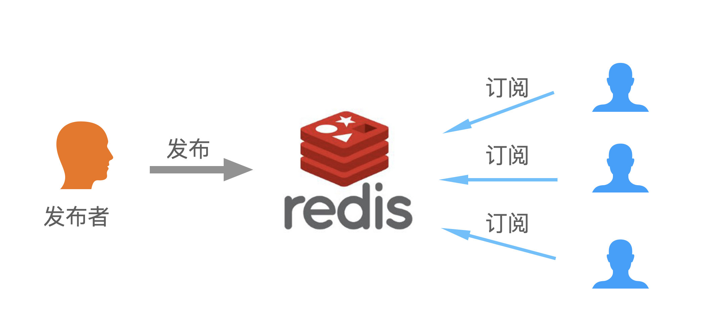

# redis教程


## 1、简介

Redis 是一个高性能的 key/value 数据库。它是完全开源免费的，并且遵守 BSD 协议。

### Redis 特点

1. 不仅支持 key/value 类型的数据，也支持 list,hash,set,zset 等等数据结构。
2. 支持持久化，可以把内存数据保存到磁盘上，重启后再次加载到内存中使用。
3. 支持备份，可以使用主/从模式进行数据备份。

### Redis 优势

1. **数据类型丰富 ：** Redis 支持 Strings, Lists, Hash, Set 及 Ordered Sets 数据类型操作。
2. **高性能 ：** Redis 能读的速度是 110000 次/s ,写的速度是 81000 次/s。
3. **原子型操作 :** Redis 的所有操作都是原子性的，还支持对几个操作完成后的原子性执行。
4. **丰富的特性 :** Redis 支持 publish/subscribe, 通知, key 过期等等特性。


### Redis 安装

**redis.conf** 是一个默认的配置文件 我们可以根据需要使用自己的配置文件

redis.conf

```shell
# Redis configuration file example.
#
# Note that in order to read the configuration file, Redis must be
# started with the file path as first argument:
#
# 开始启动时必须如下指定配置文件

# ./redis-server /path/to/redis.conf

# Note on units: when memory size is needed, it is possible to specify
# it in the usual form of 1k 5GB 4M and so forth:
#
# 存储单位如下所示

# 1k => 1000 bytes
# 1kb => 1024 bytes
# 1m => 1000000 bytes
# 1mb => 1024*1024 bytes
# 1g => 1000000000 bytes
# 1gb => 1024*1024*1024 bytes

################################## INCLUDES ###################################

# 如果需要使用多配置文件配置redis，请用include
#
# include /path/to/local.conf
# include /path/to/other.conf

################################## MODULES ##################################### modules

# 手动设置加载模块（当服务无法自动加载时设置）
#
# loadmodule /path/to/my_module.so
# loadmodule /path/to/other_module.so

################################## NETWORK #####################################

# Examples:
#
# bind 192.168.1.100 10.0.0.1
# bind 127.0.0.1 ::1
#
# 设置绑定的ip
bind 127.0.0.1

# 保护模式：不允许外部网络连接redis服务
protected-mode yes

# 设置端口号
port 6379

# TCP listen() backlog.
#
# TCP 连接数，此参数确定了TCP连接中已完成队列(完成三次握手之后)的长度
tcp-backlog 511

# Unix socket.
#
# 通信协议设置，本机通信使用此协议不适用tcp协议可大大提升性能
# unixsocket /tmp/redis.sock
# unixsocketperm 700


# TCP keepalive.
#
# 定期检测cli连接是否存活
tcp-keepalive 300

################################# GENERAL #####################################

# 是否守护进程运行（后台运行）
daemonize yes

# 是否通过upstart和systemd管理Redis守护进程
supervised no

# 以后台进程方式运行redis，则需要指定pid 文件
pidfile /var/run/redis_6379.pid

# 日志级别
# 可选项有： # debug（记录大量日志信息，适用于开发、测试阶段）； # verbose（较多日志信息）； # notice（适量日志信息，使用于生产环境）；
# warning（仅有部分重要、关键信息才会被记录）。
loglevel notice

# 日志文件的位置
logfile ""

# 数据库的个数
databases 16

# 是否显示logo
always-show-logo yes

################################ SNAPSHOTTING  ################################
#
# Save the DB on disk:
#
# 持久化操作设置 900秒内触发一次请求进行持久化，300秒内触发10次请求进行持久化操作，60s内触发10000次请求进行持久化操作

save 900 1
save 300 10
save 60 10000

# 持久化出现错误后，是否依然进行继续进行工作
stop-writes-on-bgsave-error yes

# 使用压缩rdb文件 yes：压缩，但是需要一些cpu的消耗。no：不压缩，需要更多的磁盘空间
rdbcompression yes

# 是否校验rdb文件，更有利于文件的容错性，但是在保存rdb文件的时候，会有大概10%的性能损耗
rdbchecksum yes

# dbfilename的文件名
dbfilename dump.rdb

# dbfilename文件的存放位置
dir ./

################################# REPLICATION #################################

# replicaof 即slaveof 设置主结点的ip和端口
# replicaof <masterip> <masterport>

# 集群节点访问密码
# masterauth <master-password>

# 从结点断开后是否仍然提供数据
replica-serve-stale-data yes

# 设置从节点是否只读
replica-read-only yes

# 是或否创建新进程进行磁盘同步设置
repl-diskless-sync no

# master节点创建子进程前等待的时间
repl-diskless-sync-delay 5

# Replicas发送PING到master的间隔，默认值为10秒。
# repl-ping-replica-period 10

#
# repl-timeout 60

#
repl-disable-tcp-nodelay no

#
# repl-backlog-size 1mb

#
# repl-backlog-ttl 3600

#
replica-priority 100

#
# min-replicas-to-write 3
# min-replicas-max-lag 10
#
# replica-announce-ip 5.5.5.5
# replica-announce-port 1234

################################## SECURITY ###################################

# 设置连接时密码
# requirepass 123456

################################### CLIENTS ####################################

# 最大连接数
# maxclients 10000

############################## MEMORY MANAGEMENT ################################

# redis配置的最大内存容量
# maxmemory <bytes>

# 内存达到上限的处理策略
# maxmemory-policy noeviction

# 处理策略设置的采样值
# maxmemory-samples 5

# 是否开启 replica 最大内存限制
# replica-ignore-maxmemory yes

############################# LAZY FREEING ####################################

# 惰性删除或延迟释放
lazyfree-lazy-eviction no
lazyfree-lazy-expire no
lazyfree-lazy-server-del no
replica-lazy-flush no

############################## APPEND ONLY MODE ###############################

# 是否使用AOF持久化方式
appendonly no

# appendfilename的文件名

appendfilename "appendonly.aof"

# 持久化策略
# appendfsync always
appendfsync everysec
# appendfsync no

# 持久化时（RDB的save | aof重写）是否可以运用Appendfsync，用默认no即可，保证数据安全性
no-appendfsync-on-rewrite no

# 设置重写的基准值
auto-aof-rewrite-percentage 100
auto-aof-rewrite-min-size 64mb

# 指定当发生AOF文件末尾截断时，加载文件还是报错退出
aof-load-truncated yes

# 开启混合持久化，更快的AOF重写和启动时数据恢复
aof-use-rdb-preamble yes

################################ REDIS CLUSTER  ###############################

# 是否开启集群
# cluster-enabled yes

# 集群结点信息文件
# cluster-config-file nodes-6379.conf

# 等待节点回复的时限
# cluster-node-timeout 15000

# 结点重连规则参数
# cluster-replica-validity-factor 10

#
# cluster-migration-barrier 1

#
# cluster-require-full-coverage yes

#
# cluster-replica-no-failover no
```

### 远程 redis-cli 语法

```shell
$ redis-cli -h host -p port -a password
```

```shell
h ip 地址

p – 端口

a – 密码
```


## 2、数据类型

### Redis 支持七种数据类型

1. string ( 字符串 )
2. hash ( 哈希 )
3. list ( 列表 )
4. set ( 集合 )
5. zset ( sorted set：有序集合 )
6. Bitmaps ( 位图 )
7. HyperLogLogs ( 基数统计 )


### String（字符串）

1. string 是 Redis 最基本的数据类型，key/value。
2. string 类型的一个键最大能存储**512 MB** 数据。
3. Redis 的 string 可以包含任何数据，比如 jpg 图片或者序列化的对象。
4. string 类型是二进制安全的。

使用 Redis 的 **SET** 和 **GET** 命令来进行设置和读取字符串。

```shell
127.0.0.1:6379> set name 面向加薪学习
OK
127.0.0.1:6379> get name
"\xe9\x9d\xa2\xe5\x90\x91\xe5\x8a\xa0\xe8\x96\xaa\xe5\xad\xa6\xe4\xb9\xa0"
```


### Hash（哈希）

1. Redis Hash 是一个 string 类型的 field 和 value 的映射表。
2. 每个 hash 可以存储 232-1 键值对（40 多亿）。
3. Hash 适合用于存储对象。

```shell
127.0.0.1:6379> hmset account:1 name huanxi password 123456 fav travel
OK
127.0.0.1:6379> hgetall account:1
1) "name"
2) "huanxi"
3) "password"
4) "123456"
5) "fav"
6) "travel"
```

使用 Redis **HMSET, HGETALL** 命令， **account:1** 为键。


### List（列表）

1. List 是简单的字符串列表，按照插入顺序排序。
2. 向列表中添加一个元素，可以从列表的头部 ( 左边 ) 或者尾部 ( 右边 )开始。

```shell
127.0.0.1:6379> rpush study Go语言极简一本通 Go语言微服务核心架构22讲 从0到Go语言微服务架构师
(integer) 3
127.0.0.1:6379> lrange study 0 10
1) "Go\xe8\xaf\xad\xe8\xa8\x80\xe6\x9e\x81\xe7\xae\x80\xe4\xb8\x80\xe6\x9c\xac\xe9\x80\x9a"
2) "Go\xe8\xaf\xad\xe8\xa8\x80\xe5\xbe\xae\xe6\x9c\x8d\xe5\x8a\xa1\xe6\xa0\xb8\xe5\xbf\x83\xe6\x9e\xb6\xe6\x9e\x8422\xe8\xae\xb2"
3) "\xe4\xbb\x8e0\xe5\x88\xb0Go\xe8\xaf\xad\xe8\xa8\x80\xe5\xbe\xae\xe6\x9c\x8d\xe5\x8a\xa1\xe6\x9e\xb6\xe6\x9e\x84\xe5\xb8\x88"

1 Go语言极简一本通
2 Go语言微服务核心架构22讲
3 从0到Go语言微服务架构师
```


### Set（集合）

1. Set 是 string 类型的无序集合
2. Set 内元素不可重复，无论插入多少次，只会保留一份。
3. Set 是通过哈希表实现的，所以添加，删除，查找的时间复杂度都是 O(1)。

#### sadd 命令

sadd 添加一个 string 元素到 set 集合中。

Redis sadd 语法

```shell
sadd key member
```

例子

```shell
127.0.0.1:6379> sadd gostudy Go语言极简一本通
(integer) 1
127.0.0.1:6379> sadd gostudy Go语言微服务核心架构22讲
(integer) 1
127.0.0.1:6379> sadd gostudy 从0到Go语言微服务架构师
(integer) 1
127.0.0.1:6379> sadd gostudy Go语言极简一本通
(integer) 0

127.0.0.1:6379> smembers gostudy
1) "\xe4\xbb\x8e0\xe5\x88\xb0Go\xe8\xaf\xad\xe8\xa8\x80\xe5\xbe\xae\xe6\x9c\x8d\xe5\x8a\xa1\xe6\x9e\xb6\xe6\x9e\x84\xe5\xb8\x88"
2) "Go\xe8\xaf\xad\xe8\xa8\x80\xe5\xbe\xae\xe6\x9c\x8d\xe5\x8a\xa1\xe6\xa0\xb8\xe5\xbf\x83\xe6\x9e\xb6\xe6\x9e\x8422\xe8\xae\xb2"
3) "Go\xe8\xaf\xad\xe8\xa8\x80\xe6\x9e\x81\xe7\xae\x80\xe4\xb8\x80\xe6\x9c\xac\xe9\x80\x9a"
```

Go 语言极简一本通 添加了两次，但最后只存储了一份。


### zset ( sorted set：有序集合 )

zset 和 set 一样也是 string 类型元素的集合。不同的是 zset 中的每个元素都有自己的分数（double 类型），通过分数来对集合中的元素进行排序。这个分数是不重复的。

#### Redis zadd 命令

zset 添加元素到集合中，如果元素在集合中存在则更新对应分数（score）。

#### Redis zadd 命令语法格式

```
zadd key score member
```

例子

```shell
127.0.0.1:6379> zadd studymap 1 Go语言极简一本通
(integer) 1
127.0.0.1:6379> zadd studymap 2 Go语言微服务架构核心22讲
(integer) 1
127.0.0.1:6379> zadd studymap 3 从0到Go语言微服务架构师
(integer) 1
127.0.0.1:6379> zadd studymap 4 Go语言极简一本通
(integer) 0

zrangebyscore studymap 0 10
1) "Go\xe8\xaf\xad\xe8\xa8\x80\xe5\xbe\xae\xe6\x9c\x8d\xe5\x8a\xa1\xe6\x9e\xb6\xe6\x9e\x84\xe6\xa0\xb8\xe5\xbf\x8322\xe8\xae\xb2"
2) "\xe4\xbb\x8e0\xe5\x88\xb0Go\xe8\xaf\xad\xe8\xa8\x80\xe5\xbe\xae\xe6\x9c\x8d\xe5\x8a\xa1\xe6\x9e\xb6\xe6\x9e\x84\xe5\xb8\x88"
3) "Go\xe8\xaf\xad\xe8\xa8\x80\xe6\x9e\x81\xe7\xae\x80\xe4\xb8\x80\xe6\x9c\xac\xe9\x80\x9a"
```

golang 被添加 2 次，但是最后只存储了一份。


### Redis Bitmap ( 位图 )

Bitmap 通过类似 map 结构存放 0 或 1 ( bit 位 ) 作为值。可以用来统计状态，如 日活，打卡，浏览量等。

#### setbit 命令

setbit 命令用于设置或者清除一个 bit 位


#### setbit 命令语法格式

```shell
SETBIT key offset value
```

例子

```shell
127.0.0.1:6379> setbit aa 10001 1 # 返回操作之前的数值
(integer) 0
127.0.0.1:6379> setbit aa 10001 2 # 如果值不是0或1就报错
(error) ERR bit is not an integer or out of range
127.0.0.1:6379> setbit aa 10001 0
(integer) 1
127.0.0.1:6379> setbit aa 10001 1
(integer) 0
127.0.0.1:6379> getbit aa 10001
(integer) 1
```


## 3、命令

更多命令请参考：<https://redis.io/commands>

下表列出了 Redis 键相关的命令

| 命令      | 描述                                                 |
| --------- | ---------------------------------------------------- |
| DEL       | 用于删除 key                                         |
| DUMP      | 序列化给定 key ，并返回被序列化的值                  |
| EXISTS    | 检查给定 key 是否存在                                |
| EXPIRE    | 为给定 key 设置过期时间                              |
| EXPIREAT  | 用于为 key 设置过期时间 接受的时间参数是 UNIX 时间戳 |
| PEXPIRE   | 设置 key 的过期时间，以毫秒计                        |
| PEXPIREAT | 设置 key 过期时间的时间戳(unix timestamp)，以毫秒计  |
| KEYS      | 查找所有符合给定模式的 key                           |
| MOVE      | 将当前数据库的 key 移动到给定的数据库中              |
| PERSIST   | 移除 key 的过期时间，key 将持久保持                  |
| PTTL      | 以毫秒为单位返回 key 的剩余的过期时间                |
| TTL       | 以秒为单位，返回给定 key 的剩余生存时间(             |
| RANDOMKEY | 从当前数据库中随机返回一个 key                       |
| RENAME    | 修改 key 的名称                                      |
| RENAMENX  | 仅当 newkey 不存在时，将 key 改名为 newkey           |
| TYPE      | 返回 key 所储存的值的类型                            |


### 操作 key 语法

```
COMMAND KEY的名称
```

例子

```
127.0.0.1:6379> SET web www.go-edu.cn
OK
127.0.0.1:6379> get web
"www.go-edu.cn"
127.0.0.1:6379> del web
(integer) 1
127.0.0.1:6379> get web
(nil)
```


## 4、Redis 如何操作字符串

更多命令请参考：<https://redis.io/commands>

| 命令        | 描述                                                        |
| ----------- | ----------------------------------------------------------- |
| SET         | 设置指定 key 的值                                           |
| GET         | 获取指定 key 的值                                           |
| GETRANGE    | 返回 key 中字符串值的子字符                                 |
| GETSET      | 将给定 key 的值设为 value ，并返回 key 的旧值 ( old value ) |
| GETBIT      | 对 key 所储存的字符串值，获取指定偏移量上的位 ( bit )       |
| MGET        | 获取所有(一个或多个)给定 key 的值                           |
| SETBIT      | 对 key 所储存的字符串值，设置或清除指定偏移量上的位(bit)    |
| SETEX       | 设置 key 的值为 value 同时将过期时间设为 seconds            |
| SETNX       | 只有在 key 不存在时设置 key 的值                            |
| SETRANGE    | 从偏移量 offset 开始用 value 覆写给定 key 所储存的字符串值  |
| STRLEN      | 返回 key 所储存的字符串值的长度                             |
| MSET        | 同时设置一个或多个 key-value 对                             |
| MSETNX      | 同时设置一个或多个 key-value 对                             |
| PSETEX      | 以毫秒为单位设置 key 的生存时间                             |
| INCR        | 将 key 中储存的数字值增一                                   |
| INCRBY      | 将 key 所储存的值加上给定的增量值 ( increment )             |
| INCRBYFLOAT | 将 key 所储存的值加上给定的浮点增量值 ( increment )         |
| DECR        | 将 key 中储存的数字值减一                                   |
| DECRBY      | 将 key 所储存的值减去给定的减量值 ( decrement )             |
| APPEND      | 将 value 追加到 key 原来的值的末尾                          |

例子

```shell
127.0.0.1:6379> setex channelname 60 面向加薪学习
OK

127.0.0.1:6379> ttl channelname
(integer) 40

超过60秒后
127.0.0.1:6379> get channelname
(nil)

127.0.0.1:6379> setnx author huanxi
(integer) 1

第2次执行失败
127.0.0.1:6379> setnx author huanxi
(integer) 0

127.0.0.1:6379> incr spend
(integer) 1
127.0.0.1:6379> incr spend
(integer) 2
127.0.0.1:6379> incr spend
(integer) 3

127.0.0.1:6379> get spend
"3"

127.0.0.1:6379> getset language java
(nil)
127.0.0.1:6379> getset language go
"java"
127.0.0.1:6379> getset language rust
"go"
```


## 5、哈希操作

hash 是一个 string 类型的 field 和 value 的映射表。特别适合用于存储对象。

更多命令请参考：<https://redis.io/commands>


### Redis hash 命令

下表列出了 redis hash 命令

| HDEL         | 删除一个或多个哈希表字段                                  |
| ------------ | --------------------------------------------------------- |
| HEXISTS      | 查看哈希表 key 中，指定的字段是否存在                     |
| HGET         | 获取存储在哈希表中指定字段的值                            |
| HGETALL      | 获取在哈希表中指定 key 的所有字段和值                     |
| HINCRBY      | 为哈希表 key 中的指定字段的整数值加上增量 increment       |
| HINCRBYFLOAT | 为哈希表 key 中的指定字段的浮点数值加上增量 increment     |
| HKEYS        | 获取所有哈希表中的字段                                    |
| HLEN         | 获取哈希表中字段的数量                                    |
| HMGET        | 获取所有给定字段的值                                      |
| HMSET        | 同时将多个 field-value (域-值)对设置到哈希表 key 中       |
| HSET         | 将哈希表 key 中的字段 field 的值设为 value                |
| HSETNX       | 只有在字段 field 不存在时，设置哈希表字段的值             |
| HVALS        | 获取哈希表中所有值                                        |
| HSCAN        | 迭代哈希表中的键值对                                      |
| HSTRLEN      | 返回哈希表 key 中， 与给定域 field 相关联的值的字符串长度 |


```
127.0.0.1:6379> hmset gostudy3 k1 Go语言极简一本通 k2 Go语言微服务架构核心22讲 k3 从0到Go语言微服务架构师
OK
127.0.0.1:6379> hlen gostudy3
(integer) 3
127.0.0.1:6379> hkeys gostudy3
1) "k1"
2) "k2"
3) "k3"
127.0.0.1:6379> hgetall gostudy3
1) "k1"
2) "Go\xe8\xaf\xad\xe8\xa8\x80\xe6\x9e\x81\xe7\xae\x80\xe4\xb8\x80\xe6\x9c\xac\xe9\x80\x9a"
3) "k2"
4) "Go\xe8\xaf\xad\xe8\xa8\x80\xe5\xbe\xae\xe6\x9c\x8d\xe5\x8a\xa1\xe6\x9e\xb6\xe6\x9e\x84\xe6\xa0\xb8\xe5\xbf\x8322\xe8\xae\xb2"
5) "k3"
6) "\xe4\xbb\x8e0\xe5\x88\xb0Go\xe8\xaf\xad\xe8\xa8\x80\xe5\xbe\xae\xe6\x9c\x8d\xe5\x8a\xa1\xe6\x9e\xb6\xe6\x9e\x84\xe5\xb8\x88"

127.0.0.1:6379> hset gostudy3 k4 java
(integer) 1

127.0.0.1:6379> hgetall gostudy3
1) "k1"
2) "Go\xe8\xaf\xad\xe8\xa8\x80\xe6\x9e\x81\xe7\xae\x80\xe4\xb8\x80\xe6\x9c\xac\xe9\x80\x9a"
3) "k2"
4) "Go\xe8\xaf\xad\xe8\xa8\x80\xe5\xbe\xae\xe6\x9c\x8d\xe5\x8a\xa1\xe6\x9e\xb6\xe6\x9e\x84\xe6\xa0\xb8\xe5\xbf\x8322\xe8\xae\xb2"
5) "k3"
6) "\xe4\xbb\x8e0\xe5\x88\xb0Go\xe8\xaf\xad\xe8\xa8\x80\xe5\xbe\xae\xe6\x9c\x8d\xe5\x8a\xa1\xe6\x9e\xb6\xe6\x9e\x84\xe5\xb8\x88"
7) "k4"
8) "java"

127.0.0.1:6379> hgetall gostudy3
1) "k1"
2) "Go\xe8\xaf\xad\xe8\xa8\x80\xe6\x9e\x81\xe7\xae\x80\xe4\xb8\x80\xe6\x9c\xac\xe9\x80\x9a"
3) "k2"
4) "Go\xe8\xaf\xad\xe8\xa8\x80\xe5\xbe\xae\xe6\x9c\x8d\xe5\x8a\xa1\xe6\x9e\xb6\xe6\x9e\x84\xe6\xa0\xb8\xe5\xbf\x8322\xe8\xae\xb2"
5) "k3"
6) "\xe4\xbb\x8e0\xe5\x88\xb0Go\xe8\xaf\xad\xe8\xa8\x80\xe5\xbe\xae\xe6\x9c\x8d\xe5\x8a\xa1\xe6\x9e\xb6\xe6\x9e\x84\xe5\xb8\x88"
```


## 6、列表操作

列表(List)是简单的字符串列表，按照插入顺序排序。 可以添加一个元素到列表的头部（左边）或者尾部（右边）。


### Redis 列表命令

下表列出了列表相关命令

| 命令       | 描述                                                     |
| ---------- | -------------------------------------------------------- |
| BLPOP      | 移出并获取列表的第一个元素                               |
| BRPOP      | 移出并获取列表的最后一个元素                             |
| BRPOPLPUSH | 从列表中弹出一个值，并将该值插入到另外一个列表中并返回它 |
| LINDEX     | 通过索引获取列表中的元素                                 |
| LINSERT    | 在列表的元素前或者后插入元素                             |
| LLEN       | 获取列表长度                                             |
| LPOP       | 移出并获取列表的第一个元素                               |
| LPUSH      | 将一个或多个值插入到列表头部                             |
| LPUSHX     | 将一个值插入到已存在的列表头部                           |
| LRANGE     | 获取列表指定范围内的元素                                 |
| LREM       | 移除列表元素                                             |
| LSET       | 通过索引设置列表元素的值                                 |
| LTRIM      | 对一个列表进行修剪(trim)                                 |
| RPOP       | 移除并获取列表最后一个元素                               |
| RPOPLPUSH  | 移除列表的最后一个元素，并将该元素添加到另一个列表并返回 |
| RPUSH      | 在列表中添加一个或多个值                                 |
| RPUSHX     | 为已存在的列表添加值                                     |


```shell
127.0.0.1:6379> lpush studylist Go语言极简一本通 Go语言微服务架构核心22讲 从0到Go语言微服务架构师 java rust
(integer) 5

127.0.0.1:6379> lrange studylist 0 10
1) "rust"
2) "java"
3) "\xe4\xbb\x8e0\xe5\x88\xb0Go\xe8\xaf\xad\xe8\xa8\x80\xe5\xbe\xae\xe6\x9c\x8d\xe5\x8a\xa1\xe6\x9e\xb6\xe6\x9e\x84\xe5\xb8\x88"
4) "Go\xe8\xaf\xad\xe8\xa8\x80\xe5\xbe\xae\xe6\x9c\x8d\xe5\x8a\xa1\xe6\x9e\xb6\xe6\x9e\x84\xe6\xa0\xb8\xe5\xbf\x8322\xe8\xae\xb2"
5) "Go\xe8\xaf\xad\xe8\xa8\x80\xe6\x9e\x81\xe7\xae\x80\xe4\xb8\x80\xe6\x9c\xac\xe9\x80\x9a"

127.0.0.1:6379> lindex studylist 3
"Go\xe8\xaf\xad\xe8\xa8\x80\xe5\xbe\xae\xe6\x9c\x8d\xe5\x8a\xa1\xe6\x9e\xb6\xe6\x9e\x84\xe6\xa0\xb8\xe5\xbf\x8322\xe8\xae\xb2"

127.0.0.1:6379> lpop studylist 1
1) "rust"

127.0.0.1:6379> lrem studylist 1 java
(integer) 1

linsert studylist before Go语言极简一本通 golang
(integer) 4

127.0.0.1:6379> lrange studylist 0 10
1) "\xe4\xbb\x8e0\xe5\x88\xb0Go\xe8\xaf\xad\xe8\xa8\x80\xe5\xbe\xae\xe6\x9c\x8d\xe5\x8a\xa1\xe6\x9e\xb6\xe6\x9e\x84\xe5\xb8\x88"
2) "Go\xe8\xaf\xad\xe8\xa8\x80\xe5\xbe\xae\xe6\x9c\x8d\xe5\x8a\xa1\xe6\x9e\xb6\xe6\x9e\x84\xe6\xa0\xb8\xe5\xbf\x8322\xe8\xae\xb2"
3) "golang"
4) "Go\xe8\xaf\xad\xe8\xa8\x80\xe6\x9e\x81\xe7\xae\x80\xe4\xb8\x80\xe6\x9c\xac\xe9\x80\x9a"

127.0.0.1:6379> lset studylist 3 go语言
OK
127.0.0.1:6379> lrange studylist 0 10
1) "\xe4\xbb\x8e0\xe5\x88\xb0Go\xe8\xaf\xad\xe8\xa8\x80\xe5\xbe\xae\xe6\x9c\x8d\xe5\x8a\xa1\xe6\x9e\xb6\xe6\x9e\x84\xe5\xb8\x88"
2) "Go\xe8\xaf\xad\xe8\xa8\x80\xe5\xbe\xae\xe6\x9c\x8d\xe5\x8a\xa1\xe6\x9e\xb6\xe6\x9e\x84\xe6\xa0\xb8\xe5\xbf\x8322\xe8\xae\xb2"
3) "golang"
4) "go\xe8\xaf\xad\xe8\xa8\x80"
```


## 7、集合(Set)操作

1. set 是 string 类型的无序集合。
2. set 是通过哈希表实现的，所以添加，删除，查找的复杂度都是 O(1)。
3. 集合成员是唯一的，不能出现重复的数据。

下表列出了 Redis 集合相关命令

| 命令        | 描述                                                |
| ----------- | --------------------------------------------------- |
| SADD        | 向集合添加一个或多个成员                            |
| SCARD       | 获取集合的成员数                                    |
| SDIFF       | 返回给定所有集合的差集                              |
| SDIFFSTORE  | 返回给定所有集合的差集并存储在 destination 中       |
| SINTER      | 返回给定所有集合的交集                              |
| SISMEMBER   | 判断 member 元素是否是集合 key 的成员               |
| SMEMBERS    | 返回集合中的所有成员                                |
| SMOVE       | 将 member 元素从 source 集合移动到 destination 集合 |
| SPOP        | 移除并返回集合中的一个随机元素                      |
| SRANDMEMBER | 返回集合中一个或多个随机数                          |
| SREM        | 移除集合中一个或多个成员                            |
| SUNION      | 返回所有给定集合的并集                              |
| SUNIONSTORE | 所有给定集合的并集存储在 destination 集合中         |
| SSCAN       | 迭代集合中的元素                                    |

通过 **SADD** 命令向名为 **skill** 的集合插入的三个元素。java 添加 2 次，但是集合中仍然只有一个。

## 8、有序集合（sorted set）操作


1. sorted set 和 set 一样也是 string 类型元素的集合，元素不能重复。
2. sorted set 的每个元素都会有一个 double 类型的分数(score)，元素是唯一的,但分数 (score) 却可以重复。
3. sorted set 通过分数(score) 给集合中的元素进行从小到大的排序
4. sorted set 是通过哈希表实现的，所以添加，删除，查找的复杂度都是 O(1)

### Redis 有序集合命令

下表列出了 Redis 有序集合的基本命令

| 命令             | 描述                                                         |
| ---------------- | ------------------------------------------------------------ |
| ZADD             | 向有序集合添加一个或多个成员，或者更新已存在成员的分数       |
| ZCARD            | 获取有序集合的成员数                                         |
| ZCOUNT           | 计算在有序集合中指定区间分数的成员数                         |
| ZINCRBY          | 有序集合中对指定成员的分数加上增量 increment                 |
| ZINTERSTORE      | 计算给定的一个或多个有序集的交集并将结果集存储在新的有序集合 key 中 |
| ZLEXCOUNT        | 在有序集合中计算指定字典区间内成员数量                       |
| ZRANGE           | 通过索引区间返回有序集合成指定区间内的成员                   |
| ZRANGEBYLEX      | 通过字典区间返回有序集合的成员                               |
| ZRANGEBYSCORE    | 通过分数返回有序集合指定区间内的成员                         |
| ZRANK            | 返回有序集合中指定成员的索引                                 |
| ZREM             | 移除有序集合中的一个或多个成员                               |
| ZREMRANGEBYLEX   | 移除有序集合中给定的字典区间的所有成员                       |
| ZREMRANGEBYRANK  | 移除有序集合中给定的排名区间的所有成员                       |
| ZREMRANGEBYSCORE | 移除有序集合中给定的分数区间的所有成员                       |
| ZREVRANGE        | 返回有序集中指定区间内的成员，通过索引，分数从高到底         |
| ZREVRANGEBYSCORE | 返回有序集中指定分数区间内的成员，分数从高到低排序           |
| ZREVRANK         | 返回有序集合中指定成员的排名，有序集成员按分数值递减(从大到小)排序 |
| ZSCORE           | 返回有序集中，成员的分数值                                   |
| ZUNIONSTORE      | 计算一个或多个有序集的并集，并存储在新的 key 中              |
| ZSCAN            | 迭代有序集合中的元素（包括元素成员和元素分值）               |


```shell
127.0.0.1:6379> zadd zskill 1 golang 2 rust 3 java 4 typescript 5 flutter
(integer) 5

127.0.0.1:6379> zcount zskill 1 3
(integer) 3

127.0.0.1:6379> zrange zskill 1 3 withscores
1) "rust"
2) "2"
3) "java"
4) "3"
5) "typescript"
6) "4"

127.0.0.1:6379> zrevrange zskill 1 3 withscores
1) "typescript"
2) "4"
3) "java"
4) "3"
5) "rust"
6) "2"
```


## 9、事务

简单说，事务就是一次执行多个命令，并且要么都成功，要么都失败。

### 事务的特点

1. 原子性：要么全部执行，要么全部不执行。
2. 事务中的命令是按顺序执行的，在事务执行的过程中，不会被其他客户端发来的命令中断。


### Redis 开启事务

multi（开启事务）

命令入队

exec（执行事务）

```shell
127.0.0.1:6379> multi
OK
127.0.0.1:6379(TX)> set web www.go-edu.cn
QUEUED
127.0.0.1:6379(TX)> get web
QUEUED
127.0.0.1:6379(TX)> sadd lesson golang redis web flutter
QUEUED
127.0.0.1:6379(TX)> smembers lesson
QUEUED
127.0.0.1:6379(TX)> exec
1) OK
2) "www.go-edu.cn"
3) (integer) 4
4) 1) "golang"
   2) "flutter"
   3) "redis"
   4) "web"
```


### Redis 事务命令

| 命令    | 描述                                 |
| ------- | ------------------------------------ |
| MULTI   | 标记一个事务块的开始                 |
| EXEC    | 执行所有事务块内的命令               |
| WATCH   | 监视一个(或多个) key                 |
| UNWATCH | 取消 WATCH 命令对所有 key 的监视     |
| DISCARD | 取消事务，放弃执行事务块内的所有命令 |


## 10、发布订阅

发布订阅(pub/sub)是一种常见的消息传递模式。比如我们订阅的微信公众号，只要你订阅的公众号，有新文章发布，都会推送给你。



### Redis 发布订阅命令

下表列出了 redis 发布订阅相关的命令

| 命令         | 描述               |
| ------------ | ------------------ |
| PSUBSCRIBE   | 订阅一个或多个消息 |
| PUBSUB       | 查看订阅与发布状态 |
| PUBLISH      | 发送信息           |
| PUNSUBSCRIBE | 退订多个消息       |
| SUBSCRIBE    | 订阅一个消息       |
| UNSUBSCRIBE  | 退订消息           |

### 发布订阅消息案例

```
127.0.0.1:6379> subscribe huanxi
Reading messages... (press Ctrl-C to quit)
1) "subscribe"
2) "huanxi"
3) (integer) 1
```

发布消息（重新打开一个 redis-cli）

```
127.0.0.1:6379> publish huanxi "www.go-edu.cn"
(integer) 1
```

订阅方接收消息

```
1) "message"
2) "huanxi"
3) "www.go-edu.cn"
```


## 11、redis 管理命令

| 命令             | 描述                                             |
| ---------------- | ------------------------------------------------ |
| INFO             | 查看 Redis 服务器的各种信息                      |
| SAVE             | 异步保存数据到硬盘                               |
| BGSAVE           | 在后台异步保存当前数据库的数据到磁盘             |
| TIME             | 返回当前服务器时间                               |
| DBSIZE           | 返回当前数据库的 key 的数量                      |
| BGREWRITEAOF     | 异步执行一个 AOF（AppendOnly File） 文件重写操作 |
| CLIENT           | 客户端连接                                       |
| CLIENT LIST      | 获取客户端连接列表                               |
| CLIENT GETNAME   | 获取客户端的名称                                 |
| CLIENT PAUSE     | 在指定时间内暂停运行来自客户端的命令             |
| CLIENT SETNAME   | 设置当前连接的名称                               |
| CLUSTER SLOTS    | 获取集群节点的映射数组                           |
| COMMAND          | Redis 命令                                       |
| COMMAND COUNT    | 获取 Redis 命令总数                              |
| COMMAND GETKEYS  | 获取给定命令的所有键                             |
| COMMAND INFO     | 获取指定 Redis 命令描述信息                      |
| CONFIG GET       | 获取指定配置参数的值                             |
| CONFIG REWRITE   | 修改 redis.conf 配置文件                         |
| CONFIG SET       | 修改 redis 配置参数，无需重启                    |
| CONFIG RESETSTAT | 重置 INFO 命令中的某些统计数据                   |
| DEBUG OBJECT     | 获取 key 的调试信息                              |
| DEBUG SEGFAULT   | 让 Redis 服务崩溃                                |
| FLUSHALL         | 删除所有数据库的所有 key                         |
| FLUSHDB          | 删除当前数据库的所有 key                         |
| LASTSAVE         | 返回最近一次 Redis 成功将数据保存到磁盘上的时间  |
| MONITOR          | 实时打印出 Redis 服务器接收到的命令，调试用      |
| ROLE             | 返回主从实例所属的角色                           |
| SHUTDOWN         | 异步保存数据到硬盘，并关闭服务器                 |
| SLAVEOF          | 将当前服务器转变从属服务器(slave server)         |
| SLOWLOG          | 管理 redis 的慢日志                              |
| SYNC             | 用于复制功能 ( replication ) 的内部命令          |

### 查看备份文件目录

```
127.0.0.1:6379> CONFIG GET dir
1) "dir"
2) "/data"
```

### 数据备份

**SAVE** 命令：创建当前数据库的备份。将在 Redis 安装目录中创建 **dump.rdb** 文件。

```
127.0.0.1:6379> save
OK
```

**SAVE** 会在前台执行，如果数据量巨大，可能会堵塞 Redis 服务，使用 **BGSAVE** 命令用于后台运行备份数据库。

```
127.0.0.1:6379> bgsave
Background saving started
```

### 恢复数据

只需将备份文件 ( **dump.rdb** ) 移动到 Redis 目录（CONFIG GET dir 命令获得的目录）并启动服务即可。


## 12、Redis 分区

分区是分割数据到多个 Redis 实例中去，分区后，每个 Redis 实例只保存 key 的一个子集（一部分）。

### 分区的好处

1. 通过利用多台计算机内存，可以存储更多的数据。
2. 通过多核和多台计算机，提供更高的性能。
3. 通过多台计算机和网络适配器，提供更强的传输能力。

### 分区的劣势

1. 不支持多个 Key 的操作。
2. 不支持多个 key 的事务操作。
3. 分区后，处理数据变得复杂（要处理不同机器上的 rdb/aof 文件）。

### 分区类型

1. 范围分区，是最简单的分区方式，比如从 id 1 到 100 的订单保存到分区 1,101 到 200 的订单保存到分区 2。不足是每增加区间范围都要维护一个映射表，要记得，哪个分区和哪个范围有联系。

2. 哈希分区，比范围分区更好的方法，可以对任何 key 都适用，key 不需要是 object_name:这样的形式。

   >1. Hash(key),用 hash 函数对 key 进行计算出一个整数。
   >2. 对这个整数取模操作得到一个数值。
   >3. 将上一步的结果映射到对应的实例中。

   

   比如我们分区是 16 个，我们算出来的 hash 数值是 83084917

   ```
   83084917 % 16 = 5
   ```

   那么我们就应该把 key 存储到 实例 5 中。


## 13、 Cluster 集群

在 Redis 中，集群的解决方案有三种

1. 主从复制
2. 哨兵机制
3. Cluster

### 主从复制

Redis 虽然读取写入的速度都特别快，但是也会产生读压力特别大的情况。为了分担读压力，Redis 支持主从复制，读写分离。一个 Master 可以有多个 Slaves。


#### 优点

- 数据备份
- 读写分离

#### 缺点

- 不能自动故障恢复,RedisHA 系统（需要开发）
- 无法实现动态扩容

### 哨兵机制


Redis Sentinel 是社区版本推出的原生高可用解决方案，其部署架构主要包括两部分：Redis Sentinel 集群和 Redis 数据集群。

其中 Redis Sentinel 集群是由若干 Sentinel 节点组成的分布式集群，可以实现故障发现、故障自动转移、配置中心和客户端通知。Redis Sentinel 的节点数量要满足 2n+1（n>=1）的奇数个。

优点

1. 自动化故障恢复

缺点

1. Redis 数据节点中 slave 节点作为备份节点不提供服务
2. 无法实现动态扩容

### Cluster


Redis Cluster 是社区版推出的 Redis 分布式集群解决方案，主要解决 Redis 分布式方面的需求，比如，当遇到单机内存，并发和流量等瓶颈的时候，Redis Cluster 能起到很好的负载均衡的目的。

Redis Cluster 着眼于提高并发量。

群集至少需要 3 主 3 从，且每个实例使用不同的配置文件。

在 redis-cluster 架构中，redis-master 节点一般用于接收读写，而 redis-slave 节点则一般只用于备份， 其与对应的 master 拥有相同的 slot 集合，若某个 redis-master 意外失效，则再将其对应的 slave 进行升级为临时 redis-master。

在 redis 的官方文档中，对 redis-cluster 架构上，有这样的说明：在 cluster 架构下，默认的，一般 redis-master 用于接收读写，而 redis-slave 则用于备份，当有请求是在向 slave 发起时，会直接重定向到对应 key 所在的 master 来处理。 但如果不介意读取的是 redis-cluster 中有可能过期的数据并且对写请求不感兴趣时，则亦可通过 readonly 命令，将 slave 设置成可读，然后通过 slave 获取相关的 key，达到读写分离。具体可以参阅 redis 官方文档等相关内容


优点

1. 解决分布式负载均衡的问题。具体解决方案是分片/虚拟槽 slot。
2. 可实现动态扩容
3. P2P 模式，无中心化

缺点

1. 为了性能提升，客户端需要缓存路由表信息
2. Slave 在集群中充当“冷备”，不能缓解读压力


下面通过 docker-compose 搭建 redis cluster 集群

目录结构
端口(9001-9006)
conf
redis.conf
data

redis.conf

具体见：https://www.go-edu.cn/2022/07/02/redis-13-Cluster%E9%9B%86%E7%BE%A4/


## 14、AOF 和 RDB


redis 的两种持久化方式:

- AOF
- RDB

### RDB

在指定的时间间隔内生成数据集的时间点快照（point-in-time snapshot）。RDB 持久化主要是通过 SAVE 和 BGSAVE 两个命令对 Redis 数据库中当前的数据做 snapshot 并生成 rdb 文件来实现的。其中 SAVE 是阻塞的，BGSAVE 是非阻塞的，通过 fork 了一个子进程来完成的。在 Redis 启动的时候会检测 rdb 文件，然后载入 rdb 文件中未过期的数据到服务器中。

```shell

save 900 1    //Redis 服务器在 900 秒之内，对数据库进行了至少一次修改
save 300 10   //Redis 服务器在 300 秒之内，对数据库进行了至少 10 次修改
save 60 10000 //Redis 服务器在 60 秒之内，对数据库进行了至少 10000 次修改
```


#### RDB 优点

1. 它是非常紧凑（compact）的文件，它保存了 Redis 在某个时间点上的数据集。 采用子线程创建 RDB 文件，不会对 redis 服务器性能造成大的影响。
2. RDB 非常适用于灾难恢复（disaster recovery）：它只有一个文件，并且内容都非常紧凑，可以（在加密后）将它传送到别的数据中心。RDB 在恢复大数据集时的速度比 AOF 的恢复速度要快。
3. Redis 父进程在保存 RDB 文件时,会 fork  出一个子进程，然后这个子进程就会处理接下来的所有保存工作，父进程无须执行任何磁盘 I/O 操作。

#### RDB 缺点

1. redis 文件在某个时间点，生成之后产生了新数据，还未到达另一次生成 RDB 文件的条件，如果这个期间 redis 服务器崩溃，那么会导致数据丢失，如果数据一致性要求不高，可以用生成 RDB 的方式。
2. 快照持久化方法通过调用 fork()方法创建子线程。当 redis 内存的数据量比较大时，创建子线程和生成 RDB 文件会占用大量的系统资源和处理时间，对 redis 处理正常的客户端请求造成较大影响。


### AOF

AOF 是 redis 对将所有的写命令保存到一个 aof 文件中，根据这些写命令，实现数据的持久化和数据恢复。

AOF 方式是一条一条的写命令，随着服务器运行的时间越来越长，AOF 文件会越来越大，AOF 重写就是为了解决这个问题。AOF（Append Only File）持久化是通过将存储每次执行的客户端命令，然后由一个伪客户端来执行这些命令将数据写入到服务器中的方式实现的。一共分为命令追加（append）、文件写入、文件同步（sync）三个步骤。


#### AOF 优点

1. AOF 的默认策略为每秒钟同步一次，在这种配置下，Redis 仍然可以保持良好的性能，并且就算发生故障停机，也最多只会丢失一秒钟的数据（  同步会在后台线程执行，所以主线程可以继续努力地处理命令请求）。
2. AOF 文件是一个只进行追加操作的日志文件（append only log）， 因此对 AOF 文件的写入不需要进行  seek ， 即使日志因为某些原因而包含了未写入完整的命令（比如写入时磁盘已满，写入中途停机，等等）， redis-check-aof  工具也可以修复这种问题。
3. Redis 可以在 AOF 文件体积变得过大时，自动地在后台对 AOF 进行重写： 重写后的新 AOF 文件包含了恢复当前数据集所需的最小命令集合。 整个重写操作是绝对安全的，即使重写过程中发生停机，现有的 AOF 文件也不会丢失。 而一旦新 AOF 文件创建完毕，Redis 就会从旧 AOF 文件切换到新 AOF 文件，并开始对新 AOF 文件进行追加操作。
4. AOF 文件有序地保存了对数据库执行的所有写入操作， 这些写入操作以 Redis 协议的格式保存， 因此 AOF 文件的内容非常容易被人读懂， 对文件进行分析（parse）也很轻松。 导出（export） AOF 文件也非常简单： 举个例子， 如果你不小心执行了  FLUSHALL  命令， 但只要 AOF 文件未被重写， 那么只要停止服务器， 移除 AOF 文件末尾的  FLUSHALL  命令， 并重启 Redis ， 就可以将数据集恢复到  FLUSHALL  执行之前的状态。


#### AOF 的缺点

1. 对于相同的数据集来说，AOF 文件的体积通常要大于 RDB 文件的体积。
2. 根据同步策略，AOF 的速度可能会慢于 RDB 。 在一般情况下， 每秒同步的性能依然非常高， 而关闭同步可以让 AOF 的速度和 RDB 一样快， 即使在高负荷之下也是如此。 不过在处理巨大的写入载入时，RDB 可以提供更有保证的最大延迟时间（latency）。

