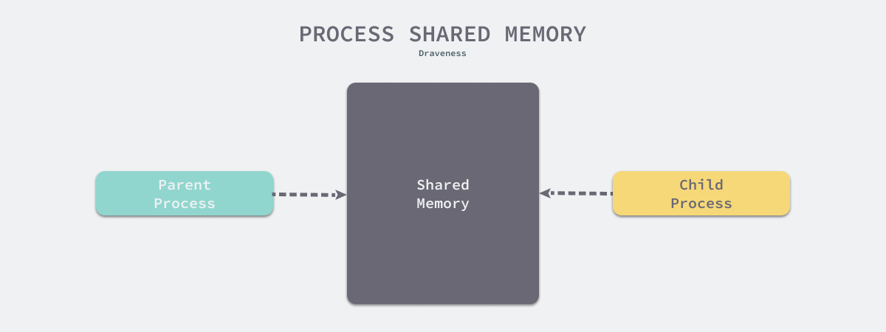

# 为什么 Redis 快照使用子进程


虽然我们经常将Redis视为纯粹的内存中键值存储系统，但我们也会使用它的持久性特性，RDB和AOF是Redis为我们提供的两种持久性工具，其中RDB是Redis数据的快照。

在本文中，我们想要分析为什么 Redis 在持久化数据快照时需要使用子进程，而不是将内存中的数据结构直接导出到磁盘进行存储。


## 概述

在分析今天的问题之前，我们首先需要了解一下Redis的持久化存储机制RDB到底是什么。RDB会每隔一段时间对Redis服务中的当前数据集进行一次快照，而除了Redis配置文件中可以设置快照间隔时间之外，Redis客户端还提供了两个生成RDB存储文件的命令，`SAVE`和`BGSAVE`，通过这两个命令的名字我们也可以猜出它们的区别。


该`SAVE`命令在执行时会阻塞当前线程，而由于Redis是[单线程的](https://draveness.me/whys-the-design-redis-single-thread)，该`SAVE`命令会阻塞来自客户端的所有其他请求，这对于许多需要提供强可用性保证的Redis服务来说是不可接受的。

`rdbSaveBackground` 用于在后台保存, 处理将数据保存到磁盘的过程：

```java
int rdbSaveBackground(char *filename, rdbSaveInfo *rsi) {
    pid_t childpid;

    if (hasActiveChildProcess()) return C_ERR;
    ...

    if ((childpid = redisFork()) == 0) {
        int retval;

        /* Child */
        redisSetProcTitle("redis-rdb-bgsave");
        retval = rdbSave(filename,rsi);
        if (retval == C_OK) {
            sendChildCOWInfo(CHILD_INFO_TYPE_RDB, "RDB");
        }
        exitFromChild((retval == C_OK) ? 0 : 1);
    } else {
        /* Parent */
        ...
    }
    ...
}
```


Redis服务器在被触发`redisFork`时会调用该函数`BGSAVE`来创建子进程，并`rdbSave`在子进程中调用来持久化数据，这里我们省略了该函数的部分内容，但是整体结构还是很清晰的，感兴趣的读者可以点击上面的链接来了解整个函数实现。

使用的目的`fork`最终肯定是为了在不阻塞主进程的情况下提高Redis服务的可用性，但是这里其实我们可以发现两个问题：

1. 为什么子进程能够`fork`访问父进程内存中的数据？
2. 该`fork`功能是否会带来额外的性能开销？我们如何避免它？

既然 Redis 选择使用`fork`快照持久化来解决问题，`fork`那么这两个问题就已经得到了答案。首先，之后的子进程可以访问父进程内存中的数据，`fork`相对于阻塞主线程而言，额外的性能开销一定是可以接受的，这也是 Redis 最终选择这种解决方案的不二之选。


## 设计

为了分析上一节提出的两个问题，我们需要了解以下内容，哪些是 Redis 服务器使用该`fork`功能的先决条件，以及最终促使它选择此实现的动机。

1. 所衍生的父进程和子进程`fork`将共享资源，包括内存空间。
2. 该`fork`函数不会产生显著的性能开销，特别是在复制大量内存时，并且它通过写入时复制将复制内存的工作推迟到真正需要时。


### 子进程

在计算机编程领域，特别是在 Unix 和类 Unix 系统中，`fork` 是由进程用于创建自身副本的一种操作。它通常是由操作系统内核实现的系统调用，是操作系统在 unix 系统中创建新进程的主要方法。


一旦程序调用 `fork` 方法，我们可以通过 `fork` 的返回值来区分父进程和子进程，从而执行不同的操作。

当 `fork` 函数返回 0 时，表示当前进程是子进程。
当 `fork` 函数返回非零值时，表示当前进程是父进程，返回值是子进程的 PID。

```java
int main() {
    if (fork() == 0) {
        // child process
    } else {
        // parent process
    }
}
```

在 `fork` 的手册中，我们发现父进程和子进程在调用 `fork` 之后会运行在不同的内存空间中，并且在 `fork` 发生时，两者的内存空间具有完全相同的内容。内存的写入和修改以及文件映射（mmap(2)）是独立的，两个进程不会相互影响。

>子进程和父进程运行在独立的内存空间中。在 `fork()` 时，两个内存空间具有相同的内容。由其中一个进程执行的内存写入、文件映射（mmap(2)）和解除映射（munmap(2)）不会影响另一个进程。

此外，子进程几乎是父进程的完全复制，但是两个进程在以下方面略有不同。

- 子进程使用单独且唯一的进程ID。
- 子进程的父进程ID与父进程ID完全相同。
- 子进程不会继承父进程的内存锁。
- 子进程重置进程资源利用率和CPU计时器。
- …


关键点在于，父进程和子进程在 `fork` 时内存是相同的，`fork` 之后的写入和修改不会相互影响，这实际上完美地解决了快照场景的问题——只需要某一时刻内存中的数据，父进程可以继续修改自己的内存，而不会阻塞或影响已生成的快照。


### Copy-on-write

由于父进程和子进程拥有完全相同的内存空间，这是否意味着子进程在 `fork` 时需要对父进程的内存进行完全复制？假设子进程需要复制父进程的内存，对 Redis 服务来说基本上是灾难性的，特别是在以下两种情况下：

1. 大量数据存储在内存中，`fork` 期间复制内存空间会消耗大量时间和资源，可能导致程序暂时不可用。
2. Redis 占用了 10G 的内存，而物理或虚拟机的资源限制只有 16G，此时我们无法对 Redis 中的数据进行持久化，这意味着 Redis 无法利用机器上超过 50% 的最大内存资源。

如果无法解决上述两个问题，使用 `fork` 来生成内存镜像实际上是行不通的，也不是一个真正可以在项目中使用的方法。

>假设我们需要在命令行执行一个命令，我们需要通过 `fork` 创建一个新进程，然后通过 `exec` 执行它。`fork` 复制的大量内存空间可能对子进程完全无用，但却引入了巨大的额外开销。

为了解决这个问题，引入了 Copy-on-Write ，正如我们在本节开头所描述的，Copy-on-Write 的主要目的是将**复制延迟到写入操作真正发生时**，从而避免了大量无意义的复制操作。在某些早期的 *nix 系统上，系统调用`fork`确实会立即复制父进程的内存空间，但在当今的大多数系统上，`fork`不会立即触发此过程。



在函数调用的时候`fork`，父进程和子进程被Kernel分配了不同的虚拟内存空间，因此在两个进程看来，它们访问的是不同的内存：  在真正访问虚拟内存空间的时候，Kernel会把虚拟内存映射到物理内存，因此父进程和子进程共享物理内存空间。

- 在真正访问虚拟内存空间的时候，Kernel会将虚拟内存映射到物理内存上，所以父子进程共享物理内存空间。
- 共享内存只有在父进程或者子进程对共享内存进行修改时才会**逐页复制**，父进程保留原来的物理空间，子进程使用复制后的新物理空间。

对于大多数Redis服务或数据库来说，写请求往往比读请求小很多，因此使用`fork`写时复制机制可以带来非常好的性能，并且实现起来也`BGSAVE`非常容易。


## 概括

Redis实现后台快照的方式非常巧妙，通过`fork`操作系统提供的写时复制功能，轻松实现了这个功能，从这里可以看出作者对操作系统的认识还是很扎实的，大多数人在面对类似的场景时，方法可能是手动实现类似的`copy-on-write`功能，但是这不仅增加了工作量，也增加了程序出现问题的可能性。

我们来简单总结一下Redis在使用RDB时为什么采用子进程的方式实现快照：

1. 创建的子进程`fork`可以获得和父进程完全相同的内存空间，并且父进程对内存的改变对于子进程来说是不可见的，因此互相之间不会产生影响。
2. 子进程的创建并`fork`不会立即触发大量的内存复制，而是在修改内存时才逐页进行复制，避免了大量内存复制带来的性能问题。

这两个原因，一个是为了支持子进程访问父进程，一个是为了减少额外的开销，这就是 Redis 使用子进程进行快照持久化的原因。最后，我们来看一些比较开放的相关问题，感兴趣的读者可以思考以下问题。

- `forks`当 Nginx 的主进程在运行时有一组可以单独处理请求的子进程时，还有哪些其他服务使用此功能？
- 写入时复制实际上是一种比较常见的机制，除了 Redis 之外还会在哪里使用它？