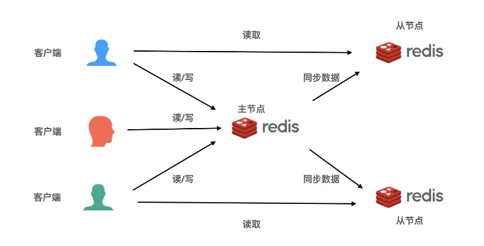
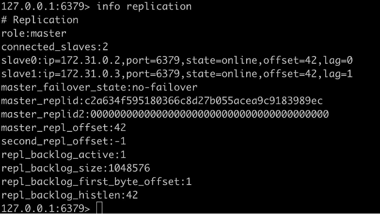
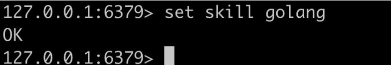
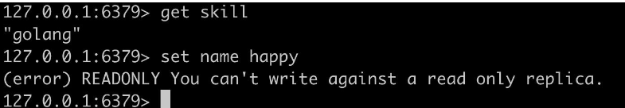
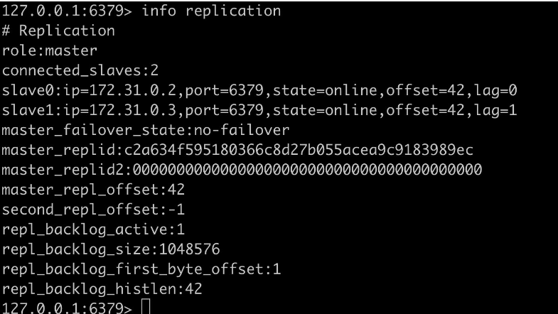
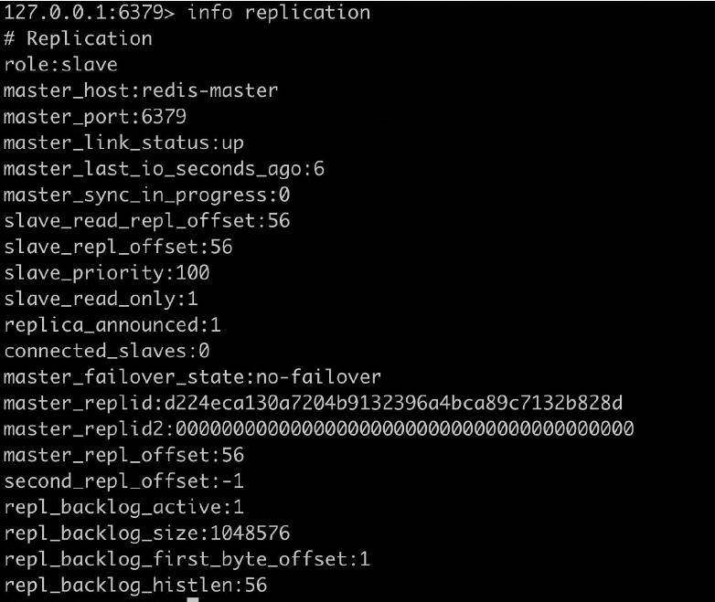
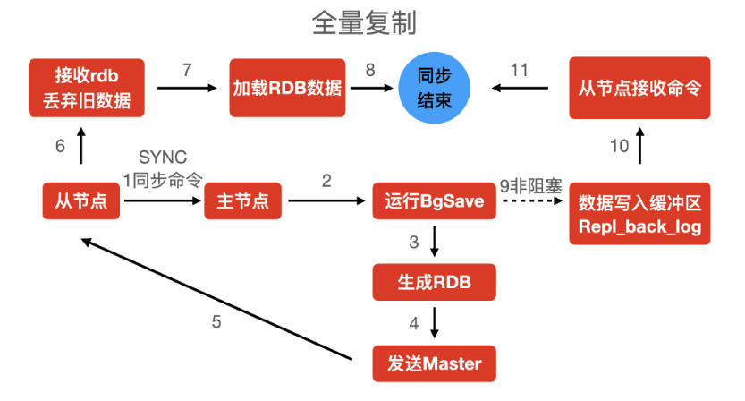
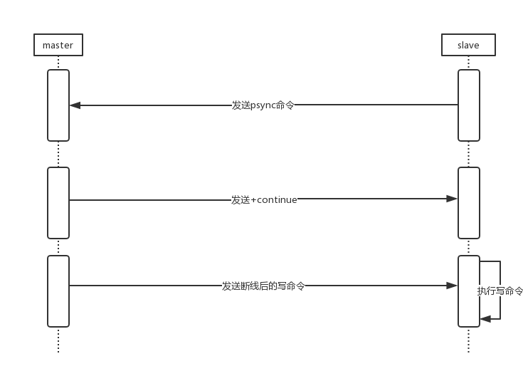
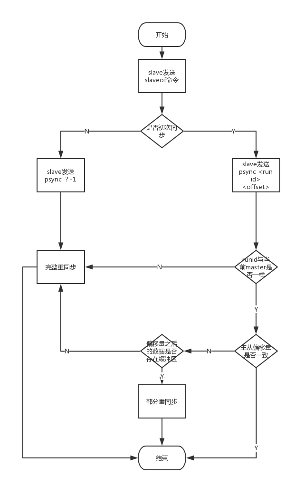

# 主从复制与读写分离

## 主从复制 + 读写分离


先回顾上一章我们学习的单点服务。

**redis 单节点部署**

优点:

1. 成本低（服务器少）
2. 部署简单（就一个单节点）
3. 性能高（单机不需要同步数据，天然数据一致性）

缺点

1. 单点故障（可靠性很差）
2. CPU 处理能力受限（Redis 是单线程的）

主从复制



图上 3 个客户端都是读写主节点。假设，当流量小的时候，我们这个主节点完全可以满足业务需求，但是由于业务扩大，流量增加，redis 压力增大，其主要压力都是读，写的压力不大，所以一个节点写，问题也不大，扩展从节点就可以应对。

优点:

1. 职责分明，读和写各司其职
2. 扩展性好，加机器就可以。


## 故障恢复


如果上面的主节点宕机，可以手动把上面的一个从节点升级成主节点（后面会介绍哨兵，解决 手动切换的问题）

**缺点**

1. 数据冗余，每个从节点都会有相同容量的数据。（后面讲集群分片，解决这个问题）
2. 数据压力大，现在每个从节点都是全量复制主节点数据。如果 1 个主节点，过多的从节点也会造成数据同步压力。
3. 我们单独看，发现 Master 是单点，如果宕机，就不能提供写数据能力了。（后面讲集群分片，解决这个问题）


## 搭建环境 1 主 2 从

使用 docker-compose.yml

```shell
version: '3.1'
services:
  master:
    image: redis:7.0.4
    container_name: redis-master
    command: redis-server --requirepass 123456  --masterauth 123456
    ports:
      - "6380:6379"
  slave1:
    image: redis:7.0.4
    container_name: redis-slave-1
    ports:
      - "6381:6379"
    command: redis-server --slaveof redis-master 6379 --requirepass 123456 --masterauth 123456
  slave2:
    image: redis:7.0.4
    container_name: redis-slave-2
    ports:
      - "6382:6379"
    command: redis-server --slaveof redis-master 6379 --requirepass 123456 --masterauth 123456
```

进入主节点

```sql
docker exec -it redis-master /bin/bash
auth 123456
info replication
```



role：master 主节点

2 个从节点，分别是 172.21.0.2 和 172.31.0.3

在主节点写数据



在从节点读/写数据




### 主从复制原理

```
slaveof 192.168.x.x 6379(端口)
```

在主/从节点上输入

```shell
info replication
```


主节点



```
Slave1 的 IP 是 172.31.0.3，state 是在线（online）,从节点读取命令的 offset（偏移量）是 42，lag 延时 1 秒。

主节点所有的命令转成字节，然后放到队列里，写入多少，最终记录的值就是 offset 得值。

master_repl_offset:42 主节点已写入的命令偏移量。 由此可见，主节点写入的命令偏移量（42）和从节点读入的命令偏移量（42）相等，说明主从节点数据是一致的。

master_replid:d224eca130a7204b9132396a4bca89c7132b828d

master_replid 是每次重启 redis 产生一个 40 位的 ID。主要用于主从复制.识别增量的一个标识。他是 replicationID。

master_replid2:0000000000000000000000000000000000000000

master_replid2 是主从节点发生改变之后，主节点宕机了，那么新的 replicationID 会放到 master_replid 中，原来的 replicationID 会放到这里。（后面介绍哨兵的时候，可以用到）
```


**全量复制**

1. 节点初始化
2. 扩容从节点
3. 主节点故障，马上选一个新的主节点，run_id 会发生变化。执行 info server ,会看到 run_id:80f0d8b28678fc2e159f40a73537e30c2101b489

second_repl_offset:-1 为了主节点切换后或故障重启后，避免每次都要全量复制。

以下是缓冲区的配置

```
repl_backlog_active:1
repl_backlog_size:1048576
repl_backlog_first_byte_offset:1
repl_backlog_histlen:2534
```


**从节点**



```shell
master_last_io_seconds_ago:6 从库与主库同步数据时间 6 秒前

master_sync_in_progress 0-未同步，1-已同步

slave_read_repl_offset:56 从节点复制的偏移量 56

master_repl_offset:56 主节点写入的偏移量 56 ，说明数据是一致的

slave_priority:100 从节点重新选举，成为主节点成功的几率，在所有子节点中，谁的这个数值越大，谁当上子节点的概率越高。

slave_read_only: 从节点只读模式 1-开启，0-未开启

connected_slaves:0，链接到从节点的信息，我们是从节点，也可以去链接从节点
```


### 全量复制

当一个redis服务器初次向主服务器发送salveof命令时，redis从服务器会进行一次全量同步，同步的步骤如下图所示：

- slave服务器向master发送psync命令（此时发送的是psync ? -1），告诉master我需要同步数据了。
- master接收到psync命令后会进行BGSAVE命令生成RDB文件快照。
- 生成完后，会将RDB文件发送给slave。
- slave接收到文件会载入RDB快照，并且将[数据库](https://cloud.tencent.com/solution/database?from_column=20065&from=20065)状态变更为master在执行BGSAVE时的状态一致。
- master会发送保存在缓冲区里的所有写命令，告诉slave可以进行同步了
- slave执行这些写命令。




### 增量复制

主服务器有写操作，同步到从服务器的过程。复制的过程：主服务器执行一个命令就会给从服务器发送相同的命令，从服务器接收并执行收到的命令。主从服务器每 10 秒发送心跳(PING 命令)


### **重新复制**

当slave断开重连之后会进行重新同步，重新同步分完全同步和部分同步。首先来看看部分同步大致的走向



- 当slave断开重连后，会发送psync 命令给master。
- master收到psync后会返回+continue回复，表示slave可以执行部分同步了。
- master发送断线后的写命令给slave
- slave执行写命令。

实际上当slave发送psync命令给master之后，master还需要根据以下三点判断是否进行部分同步。

先来介绍一下是哪三个方面：

- 服务器运行ID

>  每个redis服务器开启后会生成运行ID。 当进行初次同步时，master会将自己的ID告诉slave，slave会记录下来，当slave断线重连后，发现ID是这个master的就会尝试进行部分重同步。当ID与现在连接的master不一样时会进行完整重同步。 

- 复制偏移量

>  复制偏移量包括master复制偏移量和slave复制偏移量，当初次同步过后两个数据库的复制偏移量相同，之后master执行一次写命令，那么master的偏移量+1，master将写命令给slave，slave执行一次，slave偏移量+1，这样版本就能一致。 

- 复制积压缓冲区

>  复制积压缓冲区是由master维护的固定长度的先进先出的队列。 当slave发送psync，会将自己的偏移量也发送给master，当slave的偏移量之后的数据在缓冲区还存在，就会返回+continue通知slave进行部分重同步。 当slave的偏移量之后的数据不在缓冲区了，就会进行完整重同步。 

结合以上三点，我们又可以总结下：

- 当slave断开重连后，会发送psync 命令给master。
- master首先会对服务器运行id进行判断，如果与自己相同就进行判断偏移量
- master会判断自己的偏移量与slave的偏移量是否一致。
- 如果不一致，master会去缓冲区中判断slave的偏移量之后的数据是否存在。
- 如果存在就会返回+continue回复，表示slave可以执行部分同步了。
- master发送断线后的写命令给slave
- slave执行写命令。


#### **主从同步最终流程**




### 主从的复制异步

主从复制，主节点是非阻塞的，主节点复制同步过程中，也可以处理外界的请求访问。


### 过期 Key

子节点不会让 Key 过期，而是等待主节点让 Key 过期，当主节点的 Key 过期的时候，主节点汇合成一个 DEL 命令，并传到所有的子节点上。


### 加速复制

默认情况，主节点接收 Sync 命令后执行 BgSave 后，先保存数据到磁盘上，如果磁盘性能差，那么这个写磁盘操作消耗性能较大，可以修改配置,不写入磁盘直接生成 RDB 快照给从节点，但是这里有一定风险，因为数据没有落到磁盘上，数据一旦丢失，无法追回。

```shell
repl-diskless-sync yes
```


## 主从数据一致性问题

由于网络延迟，数据复制等因素

### **主多从少**

网络高峰期，可以等高风期过去后，进行增量复制（部分重同步），如果想要立即同步，在从节点输入

```shell
第一种方式
sync 主节点run_id 需要复制的起始偏移量

第二种方式
从节点直接断开，重新链接，部分重同步。可以进行逻辑判断处理，是增量复制还是全量复制，主服务器在内存中给每个从服务器维护了一份同步日志（back_log）和同步标识(offset)。
```


### **主少从多**

全量复制，这种情况，比较少， 是由于从服务器开启了写模式，这样，让主服务器开启同步，每次主服务器全量同步从服务器的数据。这种模式不建议使用。


### **数据延迟**

1. 主从节点的复制偏移量，延迟较大的时候应该报警（报警程序）或通知客户端，切换主从节点或其他节点。

2. 修改配置文件

   ```
   slave-serve-stale-data no
   ```

   除 info 和 slaveof 命令外的任何请求都会返回一个错误”sync with matster in progress” , 数据在同步，同步后再处理请求。


### **脏数据**

产生原因：

1. Redis 删除数据机制（主动、惰性、定时删除）。惰性，就是目前一个 key 已经过期了，不会立即删除它，要等到有人访问它才会判断是否过期，才会删除它。这样，一个过期的 key,没有被访问，就会一直放到内存中，那么就有了定时删除。主动删除，当前存储容量已经触发了当前的内存容量，然后进行主动删除。这是这些机制的原因，可能导致了 redis 的脏数据的问题。
2. 开启子节点可写。

解决脏数据问题：

1. 忽略。查询数据情况，可以忽略。如果写数据，那么要准确的。（比如下订单场景）
2. 强制读取主节点，从节点间接变为备份服务器
3. 从节点只读，规避从节点写入脏数据
4. Redis 数据读取前，检查键过期时间来决定是否返回数据。（3.2 版本以后，已解决过期问题）


### 数据安全性

关闭主节点持久化提升性能，同时带来复制的安全性问题。当主节点没有把数据写到磁盘上，此时，突然主节点停电了，重新启动后，主节点的数据也就都没有了，但是这个时候，主节点的 run_id 变了，那么从节点发现 run_id 变了，开始同步主节点的数据，但是主节点数据是空的，那么之前的从节点也就同步了空的数据，导致从节点数据为空。（建议不要开启这个提升性能的功能）


### 性能优化


**如何规避全量复制**

1. 第一次全量 复制解决方案：低峰时段挂载从节点。（凌晨 3 点）
2. 选举从节点为主节点（哨兵机制或者我们知道哪个从节点是全量的数据，认为让那个全量的从节点变成主节点）
3. 增大复制缓冲区


**如何避免复制风暴**

复制风暴：多个从节点同时发起复制。

单主节点复制风暴：主节点重启，多从节点全量复制。解决方案：选取从节点为主节点、树状复制结构（原来 1 个从节点下面挂 8 个从节点，我们可以按二叉树的形式去挂载或者 2 个分支，每个节点挂 4 个）。

单机多主复制风暴：一台机器，多个主节点（树状复制架构）。解决方案：把主节点分散到多台主机上。

