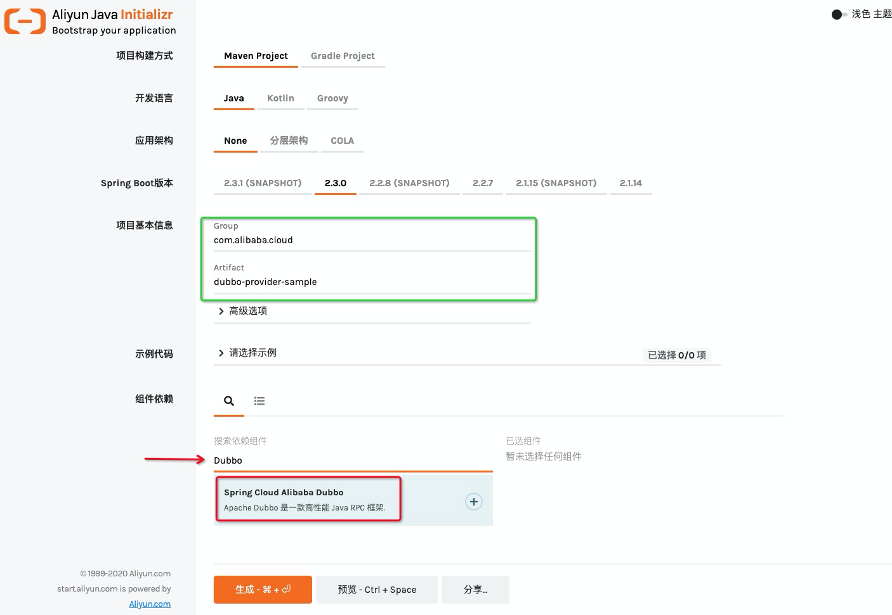
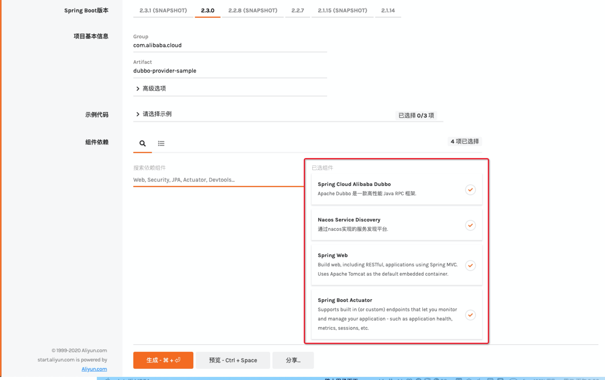

# Spring Cloud Alibaba 分布式服务调用


## 1. 简介

在《Spring Cloud Alibaba 服务注册与发现》篇中曾提到，Spring Cloud Alibaba Nacos Discovery 能无缝整合 Spring Cloud OpenFeign。换言之，Spring Cloud Alibaba 延续了 Spring Cloud 分布式服务调用的特性。除此之外，Spring Cloud Alibaba 引入了 Dubbo Spring Cloud，扩展了分布式服务调用能力，不仅能使 Apache Dubbo 和 OpenFeign 共存，还允许 Spring Cloud 标准调用底层通过 Dubbo 支持的通讯协议传输。无论开发人员是 Dubbo 用户还是 Spring Cloud 用户，都能轻松地驾驭，并以接近“零”成本的代价使应用向上迁移。Dubbo Spring Cloud 致力于简化 Cloud Native 开发成本，提高研发效能以及提升应用性能等目的。

## 2. 学习目标

- 使用 Dubbo Spring Cloud 实现 Spring Cloud 分布式服务调用
- 使用 Dubbo Spring Cloud 替换 Spring Cloud 分布式服务调用底层协议
- 理解 Dubbo Spring Cloud 高级特性：服务订阅、元数据、Actuator

## 3. 详细内容

- 快速上手：使用 Apache Dubbo
- 适配整合：使用注解 @DubboTransported 适配 Spring Cloud OpenFeign 和 @LoadBalanced RestTemplate
- 运维特性：演示服务订阅、元信息（服务、REST）以及 Actuator Endpoints

## 4. 功能特性介绍

**本节没有操作内容** 由于 Dubbo Spring Cloud 构建在原生的 Spring Cloud 之上，其服务治理方面的能力可认为是 Spring Cloud Plus，不仅完全覆盖 Spring Cloud 原生特性，而且提供更为稳定和成熟的实现，特性比对如下表所示：

| 功能组件                                             | Spring Cloud                 | Dubbo Spring Cloud                                           |
| ---------------------------------------------------- | ---------------------------- | ------------------------------------------------------------ |
| 分布式配置（Distributed configuration）              | Git、Zookeeper、Consul、JDBC | Spring Cloud 分布式配置 + Dubbo 配置中心                     |
| 服务注册与发现（Service registration and discovery） | Eureka、Zookeeper、Consul    | Spring Cloud 原生注册中心+ Dubbo 原生注册中心                |
| 负载均衡（Load balancing）                           | Ribbon（随机、轮询等算法）   | Dubbo 内建实现（随机、轮询等算法 + 权重等特性）              |
| 服务熔断（Circuit Breakers）                         | Spring Cloud Hystrix         | Spring Cloud Hystrix + Alibaba Sentinel[17](https://mercyblitz.github.io/2019/04/26/Dubbo-Spring-Cloud-重塑微服务治理/#fn:17) 等 |
| 服务调用（Service-to-service calls）                 | Open Feign、`RestTemplate`   | Spring Cloud 服务调用 + Dubbo`@Reference`                    |
| 链路跟踪（Tracing）                                  | Spring Cloud Sleuth+ Zipkin  | Zipkin、opentracing 等                                       |

### 4.1 高亮特性

#### 4.1.1 Dubbo 使用 Spring Cloud 服务注册与发现

Dubbo Spring Cloud 基于 Spring Cloud Commons 抽象实现 Dubbo 服务注册与发现，无需添加任何外部化配置，就能轻松地桥接到所有原生 Spring Cloud 注册中心，包括：

- Nacos
- Eureka
- Zookeeper
- Consul

> 注：Dubbo Spring Cloud 将在下个版本支持 Spring Cloud 注册中心与 Dubbo 注册中心并存，提供双注册机制，实现无缝迁移。

#### 4.1.2 Dubbo 作为 Spring Cloud 服务调用

默认情况，Spring Cloud Open Feign 以及`@LoadBalanced``RestTemplate`作为 Spring Cloud 的两种服务调用方式。Dubbo Spring Cloud 为其提供了第三种选择，即 Dubbo 服务将作为 Spring Cloud 服务调用的同等公民出现，应用可通过 Apache Dubbo 注解`@Service`和`@Reference`暴露和引用 Dubbo 服务，实现服务间多种协议的通讯。同时，也可以利用 Dubbo 泛化接口轻松实现服务网关。

#### 4.1.3 Dubbo 服务自省

Dubbo Spring Cloud 引入了全新的服务治理特性 - 服务自省（Service Introspection），其设计目的在于最大化减轻注册中心负载，去 Dubbo 注册元信息中心化。假设一个 Spring Cloud 应用引入 Dubbo Spring Boot Starter，并暴露 N 个 Dubbo 服务，以`Dubbo Nacos 注册中心`为例，当前应用将注册 N+1 个 Nacos 应用，除 Spring Cloud 应用本身之前，其余 N 个应用均来自于 Dubbo 服务，当 N 越大时，注册中心负载越重。因此，Dubbo Spring Cloud 应用对注册中心的负载相当于传统 Dubbo 的 N 分之一，在不增加基础设施投入的前提下，理论上，使其集群规模扩大 N 倍。当然，未来的 Dubbo 也将提供服务自省的能力。

#### 4.1.4 Dubbo 迁移 Spring Cloud 服务调用

尽管 Dubbo Spring Cloud 完全地保留了原生 Spring Cloud 服务调用特性，不过 Dubbo 服务治理的能力是 Spring Cloud Open Feign 所不及的，如高性能、高可用以及负载均衡稳定性等方面。因此，建议开发人员将 Spring Cloud Open Feign 或者`@LoadBalanced``RestTemplate`迁移为 Dubbo 服务。考虑到迁移过程并非一蹴而就，因此，Dubbo Spring Cloud 提供了方案，即`@DubboTransported`注解。该注解能够帮助服务消费端的 Spring Cloud Open Feign 接口以及`@LoadBalanced``RestTemplate`Bean 底层走 Dubbo 调用（可切换 Dubbo 支持的协议），而服务提供方则只需在原有`@RestController`类上追加 Dubbo`@Servce`注解（需要抽取接口）即可，换言之，在不调整 Feign 接口以及`RestTemplate`URL 的前提下，实现无缝迁移。如果迁移时间充分的话，建议使用 Dubbo 服务重构系统中的原生 Spring Cloud 服务的定义。

## 5. 准备工作

**本节包含少量操作内容，请注意跟随文档操作**

### 5.1 初始化 Nacos 服务端

请使用下面的命令初始化nacos服务端

```bash
sh ~/prepare.sh
```

通过如下命令观察nacos启动日志:

```bash
cat /home/shell/nacos/logs/start.out
```

待出现如下输出时，代表启动完成（如果未完成启动，可以重复执行上一条命令）:

> INFO Tomcat started on port(s): 65000 (http) with context path '/nacos'
> ……
> INFO Nacos started successfully in stand alone mode. use embedded storage

### 5.2 获取服务端代码

通过下面的命令，或缺的服务端初始化代码

```bash
cloudshell-git-open "https://start.aliyun.com/type=maven-project&language=java&architecture=none&bootVersion=2.3.7.RELEASE&baseDir=dubbo-provider-sample&groupId=com.alibaba.cloud&artifactId=dubbo-provider-sample&name=dubbo-provider-sample&description=Demo%20project%20for%20Spring%20Boot&packageName=com.alibaba.cloud.dubbo-provider-sample&packaging=jar&javaVersion=1.8&dependencies=sca-dubbo,sca-nacos-discovery,web/dubbo-provider-sample.git" /home/shell/dubbo-provider-sample
```



### 5.3 获取客户端代码

使用下面的命令引入服务消费应用

```bash
cloudshell-git-open "https://start.aliyun.com/type=maven-project&language=java&architecture=none&bootVersion=2.3.7.RELEASE&baseDir=dubbo-consumer-sample&groupId=com.alibaba.cloud&artifactId=dubbo-consumer-sample&name=dubbo-consumer-sample&description=Demo%20project%20for%20Spring%20Boot&packageName=com.alibaba.cloud.dubbo-consumer-sample&packaging=jar&javaVersion=1.8&dependencies=sca-dubbo,sca-nacos-discovery,web/dubbo-consumer-sample.git" /home/shell/dubbo-consumer-sample
```

## 6. 如何引入 Dubbo Spring Cloud

本节介绍如何在自己的环境汇总引入 Dubbo Spring Cloud 组件依赖

Dubbo Spring Cloud 引入的方式通常有两种，由易到难分别为：[Java 工程脚手架](https://start.aliyun.com/bootstrap.html) 引入和 Maven pom.xml 依赖。官方推荐使用 [Java 工程脚手架](https://start.aliyun.com/bootstrap.html) 方式引入 Dubbo Spring Cloud，以便简化组件之间的依赖关系。

### 6.1 [简单] 通过 Java 工程脚手架 创建工程并引入 Dubbo Spring Cloud（推荐）

Dubbo Spring Cloud 组件的在整个 Spring Cloud Alibaba 版本和依赖最为复杂，推荐读者使用 Java 工程脚手架 构建应用工程。读者选择偏好的 Web 浏览器访问 Java 工程脚手架，其资源网址为：<https://start.aliyun.com/bootstrap.html>

下文以 Google Chrome 浏览器为例，当网页加载后，首先，在 "项目基本信息" 部分输入 Group ：“com.alibaba.cloud” 以及 Artifact：“dubbo-provider-sample”（见下图绿框部分） 然而，“组件依赖” 输入框搜索：“Dubbo”（见下图红箭头部分），最后，选择 "Spring Cloud Alibaba Dubbo"（见下图红框部分），如下所示：  继续依赖其他组件：

- Nacos Service Discovery - 服务注册与发现组件
- Spring Web - Spring Web MVC 组件
- Spring Boot Actuator - Spring Boot Actator 组件

完整组件汇总如下图所示： 

点击 “生成” 高亮按钮，平台将生成一个名为 “dubbo-provider-sample.zip” 的压缩文件，将其保存到本地目录，并解压该文件，工程目录将随之生成。打开目录下的 pom.xml 文件，不难发现 Dubbo Spring Cloud Starter 声明其中（以下 XML 内容均来自于项目根路径中的 pom.xml 文件）：

```
        <dependency>
            <groupId>com.alibaba.cloud</groupId>
            <artifactId>spring-cloud-starter-dubbo</artifactId>
        </dependency>
```

不过该 starter 并未指定版本，具体的版本声明在 **com.alibaba.cloud:spring-cloud-alibaba-dependencies** 部分：

```
    <dependencyManagement>
        <dependencies>
            <dependency>
                <groupId>com.alibaba.cloud</groupId>
                <artifactId>spring-cloud-alibaba-dependencies</artifactId>
                <version>${spring-cloud-alibaba.version}</version>
                <type>pom</type>
                <scope>import</scope>
            </dependency>
            <dependency>
                <groupId>org.springframework.boot</groupId>
                <artifactId>spring-boot-dependencies</artifactId>
                <version>${spring-boot.version}</version>
                <type>pom</type>
                <scope>import</scope>
            </dependency>
        </dependencies>
    </dependencyManagement>
```

其中，${spring-cloud-alibaba.version} 和 ${spring-boot.version} 分别为 Spring Cloud Alibaba 和 Spring Boot 组件依赖的版本，它们的版本定义在 `<properties>` 元素中，即 **2.2.1.RELEASE** 和 **2.3.0.RELEASE**：

```
    <properties>
        <java.version>1.8</java.version>
        <project.build.sourceEncoding>UTF-8</project.build.sourceEncoding>
        <project.reporting.outputEncoding>UTF-8</project.reporting.outputEncoding>
        <spring-boot.version>2.3.0.RELEASE</spring-boot.version>
        <spring-cloud-alibaba.version>2.2.1.RELEASE</spring-cloud-alibaba.version>
    </properties>
```

如果读者非常熟悉 Maven 依赖管理的配置方式，可以考虑 Maven pom.xml 依赖 Dubbo Spring Cloud。

### 6.2 [高级] 通过 Maven pom.xml 依赖 Dubbo Spring Cloud

如果要在您 Dubbo Spring Cloud 的项目中使用 Nacos 来实现服务注册/发现，可将两者 Stater 同时依赖：

```
        <dependency>
            <groupId>com.alibaba.cloud</groupId>
            <artifactId>spring-cloud-starter-alibaba-nacos-discovery</artifactId>
        </dependency>
        <dependency>
            <groupId>com.alibaba.cloud</groupId>
            <artifactId>spring-cloud-starter-dubbo</artifactId>
        </dependency>
```



该声明方式同样需要声明 **com.alibaba.cloud:spring-cloud-alibaba-dependencies**，内容与上小节相同，在此不再赘述。下一节将讨论如何使用 Dubbo Spring Cloud 构建服务提供者。

## 7 创建服务接口

按照传统的 Dubbo 开发模式，在构建服务提供者之前，第一个步骤是为服务提供者和服务消费者定义 Dubbo 服务接口。

为了确保契约的一致性，推荐的做法是将 Dubbo 服务接口打包在第二方或者第三方的 artifact（jar）中，该 artifact 甚至无需添加任何依赖。

对于服务提供方而言，不仅通过依赖 artifact 的形式引入 Dubbo 服务接口，而且需要将其实现。对应的服务消费端，同样地需要依赖该 artifact，并以接口调用的方式执行远程方法。接下来的步骤则是创建 artifact。

### 7.1 创建 api 工程 - dubbo-sample-api

选择合适的文件目录，通过 Maven 命令行工具构建 artifact dubbo-sample-api，如下所示：

```bash
mvn archetype:generate -DgroupId=com.alibaba.cloud -DartifactId=dubbo-sample-api -Dversion=0.0.1-SNAPSHOT -DinteractiveMode=false -DoutputDirectory=/home/shell
```



命令执行后，名为“dubbo-sample-api” 的项目目录生成，切换至该目录，内部结构如下：

```
├── pom.xml
└── src
    ├── main
    │ └── java
    │     └── com
    │         └── alibaba
    │             └── cloud
    │                 └── App.java
    └── test
        └── java
            └── com
                └── alibaba
                    └── cloud
                        └── AppTest.java

11 directories, 3 files
```

其中，App.java 和 AppTest.java 文件并非需要文件，可将其删除。除此之外，当然最重要的是 pom.xml

```
<project xmlns="http://maven.apache.org/POM/4.0.0" xmlns:xsi="http://www.w3.org/2001/XMLSchema-instance"
  xsi:schemaLocation="http://maven.apache.org/POM/4.0.0 http://maven.apache.org/maven-v4_0_0.xsd">
  <modelVersion>4.0.0</modelVersion>
  <groupId>com.alibaba.cloud</groupId>
  <artifactId>dubbo-sample-api</artifactId>
  <packaging>jar</packaging>
  <version>0.0.1-SNAPSHOT</version>
  <name>dubbo-sample-api</name>
  <url>http://maven.apache.org</url>
  <dependencies>
    <dependency>
      <groupId>junit</groupId>
      <artifactId>junit</artifactId>
      <version>3.8.1</version>
      <scope>test</scope>
    </dependency>
  </dependencies>
</project>
```

不难看出，Maven GAV 信息均按照之前的命令来设定，并没有依赖其他组件。接下来，为当前工程定义 Dubbo 服务接口。

### 7.2 定义 Dubbo 服务接口

Dubbo 服务接口是服务提供方与消费方的远程通讯契约，通常由普通的 Java 接口（interface）来声明，如`EchoService`接口（**点击右上角自动拷贝代码**）：

```
package com.alibaba.cloud;

public interface EchoService {
    String echo(String message);
}
```

该接口非常简单，仅有一个方法，接下来将 dubbo-sample-api 部署到本地 Maven 仓库。

### 7.3 部署 api 工程 - dubbo-sample-api

利用 Maven 命令， 将 dubbo-sample-api 部署到本地 Maven 仓库：

```bash
cd /home/shell/dubbo-sample-api && mvn clean install 
```

> 注：如果读者所使用机器的 JDK 版本过高的话，可能会出现错误提示："不再支持源选项 5。请使用 7 或更高版本"。本例推荐选择 JDK 8 编译。

本地部署成功后，该 artifact 能被 Dubbo 服务提供者应用 dubbo-provider-sample 依赖。

## 8 服务端开发

前面的准备工作，已经创建了服务端工程，本节主要完成了针对服务接口的实现工作

### 8.2 添加 api 依赖 - dubbo-sample-api

打开 dubbo-provider-sample 的 pom.xml 文件；

将 artifact dubbo-sample-api 依赖信息添加到应用 dubbo-provider-sample 中的 pom.xml点我自动插入：

```
        <!-- Dubbo 服务 artifact -->
        <dependency>
            <groupId>com.alibaba.cloud</groupId>
            <artifactId>dubbo-sample-api</artifactId>
            <version>0.0.1-SNAPSHOT</version>
        </dependency>
```

依赖增加之后，下一步实现 Dubbo 服务 -`EchoService`

### 8.3 实现 Dubbo 服务

在应用 dubbo-provider-sample 中的 com.alibaba.cloud.dubboprovidersample 包下创建实现类(**点击右上角自动拷贝代码**)：

```
package com.alibaba.cloud.dubboprovidersample;

import com.alibaba.cloud.EchoService;
import org.apache.dubbo.config.annotation.Service;

@Service
public class SimpleEchoService implements EchoService {

    @Override
    public String echo(String s) {
        return "[ECHO] " + s;
    }
}
```

其中，`@org.apache.dubbo.config.annotation.Service`是 Dubbo 服务注解，仅声明该 Java 服务（本地）实现为 Dubbo 服务。 因此，下一步需要将其配置 Dubbo 服务（远程）。

### 8.4 配置 Dubbo 服务提供方

打开 dubbo-provider-sample 的 application.properties 文件；

修改注册中心地址 （点我执行修改）：

```
spring.cloud.nacos.discovery.server-addr=127.0.0.1:65000
```

修改服务端端口 （点我执行修改）：

```
server.port=61000
```

在暴露 Dubbo 服务方面，推荐开发人员外部化配置的方式，即指定 Java 服务实现类的扫描基准包。

> Dubbo Spring Cloud 继承了 Dubbo Spring Boot 的外部化配置特性，也可以通过标注 `@DubboComponentScan` 来实现基准包扫描。

application.properties 的配置项说明：

- `dubbo.scan.base-packages`: 指定 Dubbo 服务实现类的扫描基准包
- `dubbo.protocol`: Dubbo 服务暴露的协议配置，其中子属性`name`为协议名称，`port`为协议端口（ -1 表示自增端口，从 20880 开始）
- `spring.application.name`: Spring 应用名称，用于 Spring Cloud 服务注册和发现。

> 该值在 Dubbo Spring Cloud 加持下被视作`dubbo.application.name`，因此，无需再显示地配置`dubbo.application.name`

- `spring.cloud.nacos.discovery`: Nacos 服务发现与注册配置，其中子属性 server-addr 指定 Nacos 服务器主机和端口

完成以上步骤后，还需编写一个 Dubbo Spring Cloud 引导类。

#### 8.5 引导 Dubbo Spring Cloud 服务提供方应用

在实验室的工程中，已经由脚手架自动添加了 Nacos 服务注册配置，所以 Application 类只需保留SpringBoot的入口即可，参见： NacosDiscoveryConfiguration

------

如果你在本地操作，可以参考下面的做法

Dubbo Spring Cloud 引导类与普通 Spring Cloud 应用并无差别，如下所示：

```java
@EnableDiscoveryClient
@SpringBootApplication
public class DubboProviderSampleApplication {
    public static void main(String[] args) {
        SpringApplication.run(DubboProviderSampleApplication.class);
    }
}
```

当 Dubbo 服务提供方启动后，下一步实现一个 Dubbo 服务消费方。

## 9 客户端开发

### 9.1 增加 api 依赖 - dubbo-sample-api

与服务提供方 Maven 工程类似，将 artifact dubbo-sample-api 依赖信息添加到应用 dubbo-consumer-sample 中的 pom.xml 点我自动插入：：

```
        <!-- Dubbo 服务 artifact -->
        <dependency>
            <groupId>com.alibaba.cloud</groupId>
            <artifactId>dubbo-sample-api</artifactId>
            <version>0.0.1-SNAPSHOT</version>
        </dependency>
```



### 9.2 修改消费端配置

Dubbo 服务消费方配置与服务提供方类似，当前应用 dubbo-consumer-sample 属于纯服务消费方，只有很少的地方需要修改：

- 打开 dubbo-consumer-sample 的 application.properties 文件
- 修改订阅服务 点我修改

`dubbo.cloud.subscribed-services`: 用于服务消费方订阅服务提供方的应用名称的列表，若需订阅多应用，请使用 "," 分割。不推荐使用默认值为 "*"，它将订阅所有应用。
当应用使用属性 `dubbo.cloud.subscribed-services` 默认值时，日志中将会输出一行警告：

> Current application will subscribe all services(size:x) in registry, a lot of memory and CPU cycles may be used, thus it’s strongly recommend you using the externalized property ‘dubbo.cloud.subscribed-services’ to specify the services

- 修改访问端口 点我修改
  由于当前应用属于 Web 应用，它会默认地使用 8080 作为 Web 服务端口，如果 dubbo-provider-sample 和 dubbo-consumer-sample 在本地同步部署的话， 两者 Web 端口会出现冲突，需调整 dubbo-consumer-sample application.properties 中的`server.port`和`management.server.port`：

```
# 应用服务 WEB 访问端口
server.port=60000
```

- 修改注册中心 点我修改
  这里改为准备阶段开启的nacos服务端的地址

### 9.3. 增加web访问控制器

dubbo-consumer-sample 增加一个控制器，以支持处理web请求，并调用服务端的EchoService（**点击右上角进行复制**）：

```
package com.alibaba.cloud.dubboconsumersample;

import org.springframework.web.bind.annotation.GetMapping;
import org.springframework.web.bind.annotation.RequestParam;
import org.springframework.web.bind.annotation.RestController;
import com.alibaba.cloud.EchoService;
import org.apache.dubbo.config.annotation.Reference;

@RestController
public class DubboConsumerSampleController {

    @Reference
    private EchoService echoService;

    // http://127.0.0.1:8080/echo?message=somemessage
    @GetMapping("/echo")
    public String echo(@RequestParam(name = "message", defaultValue = "no message") String message) {
        return echoService.echo(message);
    }
}
```



## 10 编译、启动和访问

### 10.1 编译应用

编译服务端应用

```bash
cd /home/shell/dubbo-provider-sample && mvn package
```

编译客户端应用

```bash
cd /home/shell/dubbo-consumer-sample && mvn package
```

### 10.2 启动两个应用

启动服务端

```bash
java -jar /home/shell/dubbo-provider-sample/target/dubbo-provider-sample-0.0.1-SNAPSHOT.jar
```

在 新窗口 中启动客户端

```bash
java -jar /home/shell/dubbo-consumer-sample/target/dubbo-consumer-sample-0.0.1-SNAPSHOT.jar
```

### 10.3 访问应用

查看 Nacos控制台 确认服务端、客户端已经完成注册；

在 新窗口 中通过`curl`命令访问 REST 资源`/echo`:

```bash
curl "http://127.0.0.1:60000/echo?message=Hello,World"
```

你会看到下面的输出：

> [ECHO] Hello,World

不难发现，Dubbo 服务提供方应用 dubbo-provider-sample 的`EchoService`计算结果返回到 dubbo-consumer-sample 中的 REST 资源`/echo`。同时，在 dubbo-provider-sample 应用日志出现了以下内容：

> [DUBBO] The connection of /x.x.x.x:64051 -> /x.x.x.x:20881 is established., dubbo version: 2.7.6, current host: x.x.x.x

说明 Dubbo 服务消费端应用 dubbo-consumer-sample（端口：64051） 向服务提供方应用 dubbo-provider-sample 建立连接（端口：20881）。

## 11. 课后资料

- [服务提供端初始工程代码](https://start.aliyun.com/bootstrap.html/#!type=maven-project&language=java&architecture=none&platformVersion=2.3.7.RELEASE&packaging=jar&jvmVersion=1.8&groupId=com.alibaba.cloud&artifactId=dubbo-provider-sample&name=dubbo-provider-sample&description=Demo project for Spring Boot&packageName=com.alibaba.cloud.dubbo-provider-sample&dependencies=sca-dubbo,sca-nacos-discovery)
- [服务消费端初始工程代码](https://start.aliyun.com/bootstrap.html/#!type=maven-project&language=java&architecture=none&platformVersion=2.3.7.RELEASE&packaging=jar&jvmVersion=1.8&groupId=com.alibaba.cloud&artifactId=dubbo-consumer-sample&name=dubbo-consumer-sample&description=Demo project for Spring Boot&packageName=com.alibaba.cloud.dubbo-consumer-sample&dependencies=sca-dubbo,sca-nacos-discovery,web)