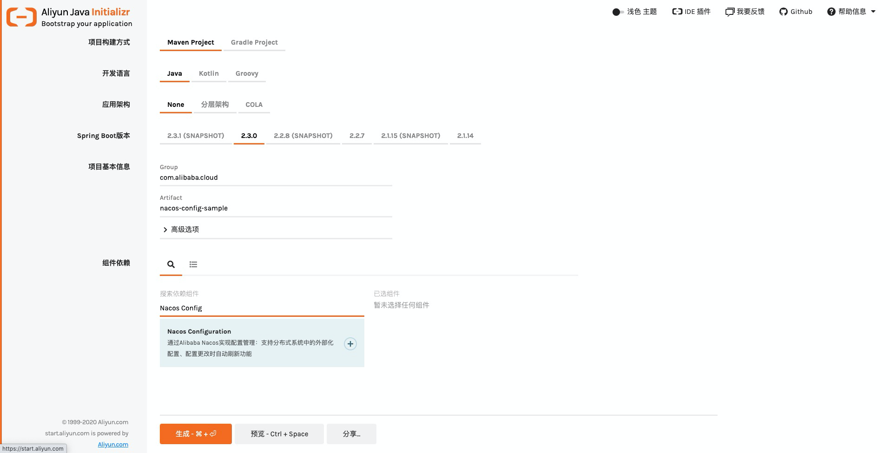
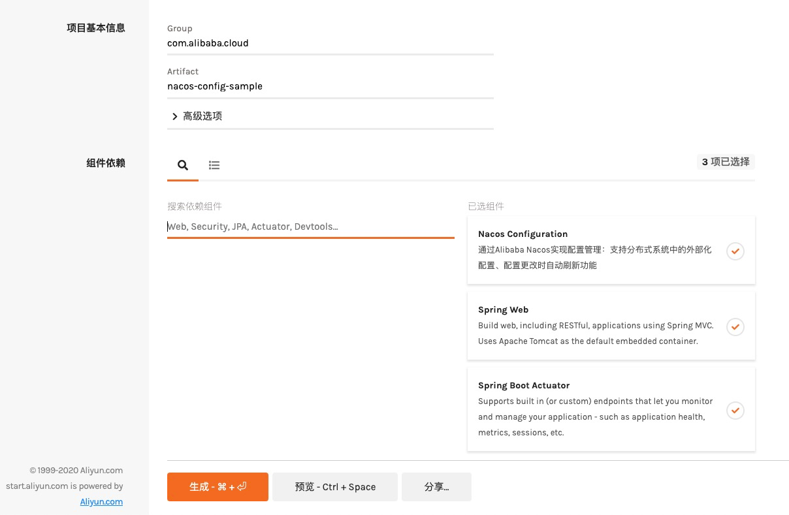
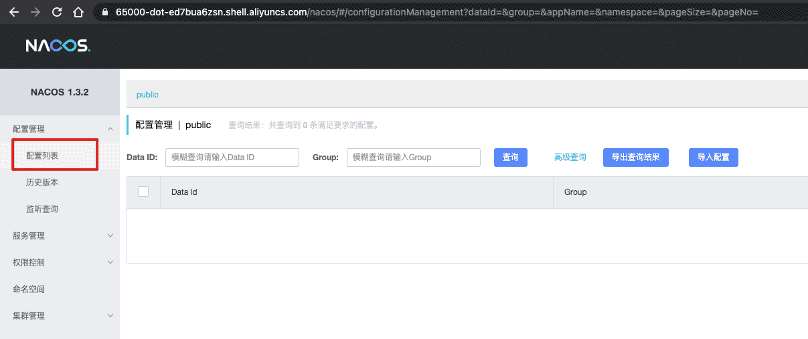
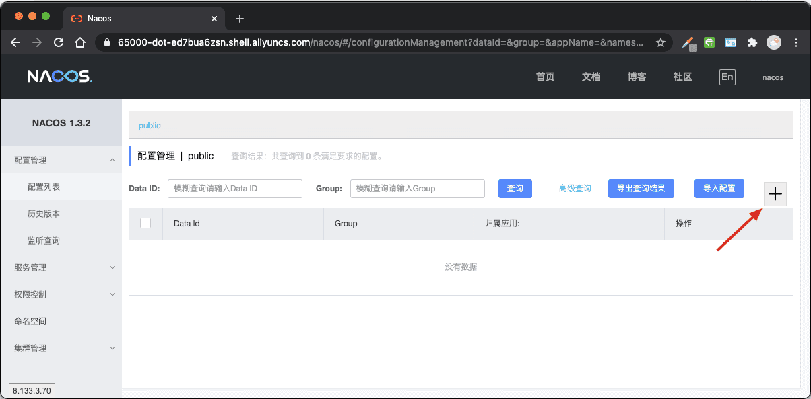
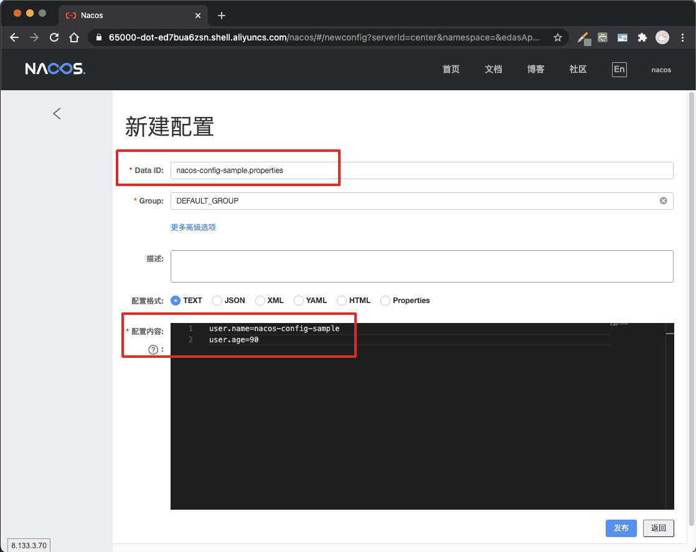
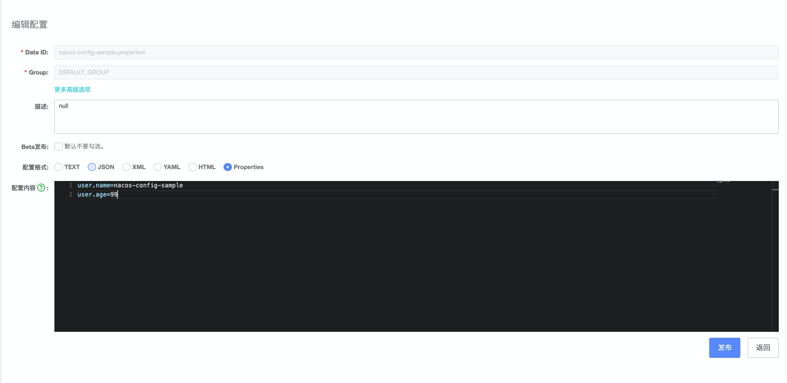

# Spring Cloud Alibaba 分布式配置


## 1.课程说明

本次课程，你将会学习如下：

- 使用 Nacos Config 作为 Spring Cloud 分布式配置
- 使用 Nacos Config 实现 Bean 动态刷新
- 了解 Nacos Config 高级配置


## 2. 框架简介

Nacos 提供用于存储配置和其他元数据的 key/value 存储，为分布式系统中的外部化配置提供服务器端和客户端支持。使用 Spring Cloud Alibaba Nacos Config，您可以在 Nacos Server 集中管理你 Spring Cloud 应用的外部属性配置。

Spring Cloud Alibaba Nacos Config 是 Config Server 和 Client 的替代方案，客户端和服务器上的概念与 Spring Environment 和 PropertySource 有着一致的抽象，在特殊的 bootstrap 阶段，配置被加载到 Spring 环境中。当应用程序通过部署管道从开发到测试再到生产时，您可以管理这些环境之间的配置，并确保应用程序具有迁移时需要运行的所有内容。Nacos 的获取和启动方式可以参考 [Nacos 官网](https://nacos.io/zh-cn/docs/quick-start.html)。

> **注**：**如果读者是阿里云商业化组件 ANS 或 ACM 用户，请使用 Nacos Config 代替对应的组件。**


## 3. 详细内容

本教程包含如下内容：

- 快速上手：获取代码，或者是在自己的工程中引入 Nacos
- 多文件扩展名支持：以 YAML 文件扩展名为例，讨论 Nacos Config 多文件扩展名支持
- 动态配置更新：演示 @RefreshScope 特性，实现 Bean 动态刷新
- 自定义扩展：自定义 namespace、Group 以及 Data Id 的配置扩展
- 运维特性：演示 Nacos Config 高级外部化配置以及 Endpoint 内部细节


## 4. 准备工作

本节，你将会操作一些在实验室中的准备工作，以便后续操作的展开

### 4.1. 启动 Nacos 服务端

通过如下命令启动服务端

```bash
sh ~/prepare.sh
```

通过如下命令观察nacos启动日志:

```bash
cat /home/shell/nacos/logs/start.out
```

待出现如下输出时，代表启动完成（如果未完成启动，可以重复执行上一条命令）:

> INFO Tomcat started on port(s): 65000 (http) with context path '/nacos'
> ……
> INFO Nacos started successfully in stand alone mode. use embedded storage

### 4.2. 下载工程代码

通过下面的命令获取本次课程需要使用的工程代码。

```bash
cloudshell-git-open "https://start.aliyun.com/type=maven-project&language=java&architecture=none&bootVersion=2.3.7.RELEASE&baseDir=nacos-config-sample&groupId=com.alibaba.cloud&artifactId=nacos-config-sample&name=nacos-config-sample&description=Demo%20project%20for%20Spring%20Boot&packageName=com.alibaba.cloud.nacos-config-sample&packaging=jar&javaVersion=1.8&dependencies=sca-nacos-config,web/nacos-config-sample.git" /home/shell/nacos-config-sample
```


## 5. 引入 Nacos Config 支持分布式配置

**本节用于在本地环境引入 Nacos Config 的操作指引，不涉及对实验室环境的操作**

Nacos Config 引入的方式有两种，即 Aliyun Java Initializr 引入和 Maven pom.xml 依赖。官方推荐使用 Aliyun Java Initializr 方式引入 Nacos Discovery，以便简化组件之间的依赖关系。

### 5.1 通过工程脚手架创建工程并引入 Nacos Config（推荐）

由于 Spring Cloud 组件的版本和依赖较为复杂，推荐读者使用工程脚手架构建应用工程。

> 上一步中，获取的代码事实上就是使用工程脚手架创建的。

读者选择偏好的 Web 浏览器访问工程脚手架，其资源网址为：<https://start.aliyun.com/bootstrap.html>

下文以 Google Chrome 浏览器为例，当网页加载后，首先，在 "项目基本信息" 部分输入 Group ：“com.alibaba.cloud” 以及 Artifact：“nacos-config-sample”。然后，“组件依赖” 输入框搜索：“Nacos Config”，选择 "Nacos Configuration"，如下所示：



同上组件操作，增加 “Spring Web” 和 “Spring Boot Actuator” 组件： 

组件选择后，点击 “生成” 高亮按钮。随后，平台将生成一个名为 “nacos-config-sample.zip” 的压缩文件，将其保存到本地目录，并解压该文件，工程目录将随之生成。打开目录下的 pom.xml 文件，不难发现 Nacos starter 声明其中（以下 XML 内容均来自于项目根路径中的 pom.xml 文件）：

```
        <dependency>
            <groupId>com.alibaba.cloud</groupId>
            <artifactId>spring-cloud-starter-alibaba-nacos-config</artifactId>
        </dependency>
```


不过该 starter 并未指定版本，具体的版本声明在 **com.alibaba.cloud:spring-cloud-alibaba-dependencies** 部分：

```
    <dependencyManagement>
        <dependencies>
            <dependency>
                <groupId>com.alibaba.cloud</groupId>
                <artifactId>spring-cloud-alibaba-dependencies</artifactId>
                <version>${spring-cloud-alibaba.version}</version>
                <type>pom</type>
                <scope>import</scope>
            </dependency>
            <dependency>
                <groupId>org.springframework.boot</groupId>
                <artifactId>spring-boot-dependencies</artifactId>
                <version>${spring-boot.version}</version>
                <type>pom</type>
                <scope>import</scope>
            </dependency>
        </dependencies>
    </dependencyManagement>
```


其中，${spring-cloud-alibaba.version} 和 ${spring-boot.version} 分别为 Spring Cloud Alibaba 和 Spring Boot 组件依赖的版本，它们的版本定义在 `<properties>`元素中，即 **2.2.1.RELEASE** 和 **2.3.0.RELEASE**：

```
    <properties>
        <java.version>1.8</java.version>
        <project.build.sourceEncoding>UTF-8</project.build.sourceEncoding>
        <project.reporting.outputEncoding>UTF-8</project.reporting.outputEncoding>
        <spring-boot.version>2.3.0.RELEASE</spring-boot.version>
        <spring-cloud-alibaba.version>2.2.1.RELEASE</spring-cloud-alibaba.version>
    </properties>
```


如果读者非常熟悉 Maven 依赖管理的配置方式，可以考虑 Maven pom.xml 依赖 Nacos Config。

### 5.2 [高级] 通过 Maven pom.xml 依赖 Nacos Config

如果要在您的项目中使用 Nacos 来实现服务注册/发现，使用 group ID 为 `com.alibaba.cloud`和 artifact ID 为 `spring-cloud-starter-alibaba-nacos-config`的 starter。

```
<dependency>
    <groupId>com.alibaba.cloud</groupId>
    <artifactId>spring-cloud-starter-alibaba-nacos-config</artifactId>
</dependency>
```


该声明方式同样需要声明 **com.alibaba.cloud:spring-cloud-alibaba-dependencies**，内容与上小节相同，在此不再赘述。下一节将讨论如何使用 Nacos Config 支持分布式配置。


## 6. 使用 Nacos Config 实现分布式配置

**本节，你将会修改工程，完成与 Nacos Config 的集成**

使用 Nacos Config 实现分布式配置与 Spring Cloud Consul 和 Spring Cloud Zookeeper 的方式非常类似，仅需添加相关外部化配置即可工作。换言之，Nacos Config 同样不会侵入应用代码，方便应用整合和迁移，如果读者熟悉 Spring Cloud Consul 或 Spring Cloud Zookeeper 使用方式 的话，通常需要将 Consul 或 Zookeeper 服务进程预先部署，Nacos Config 也如此。

### 6.1 访问 Nacos 服务器

打开Nacos控制台(账号名/密码为 nacos/nacos)，选择 "配置管理/配置列表"： 

如果需要在本地运行，请参考 [Nacos 官网](https://nacos.io/zh-cn/docs/quick-start.html)。
关于更多的 Nacos Server 版本，可以从 [release 页面](https://github.com/alibaba/nacos/releases) 下载最新的版本。

### 6.2 添加 Nacos 配置

点击“配置列表”页面右侧的 "+" 号（红色箭头所指）：  浏览器跳转新页面，并填充内容如下：  其中，Data ID 由应用名（nacos-config-sample）+ 文件后缀名(.properties) 组成，点击“发布”按钮（红色箭头所指），配置内容为：

```
user.name=nacos-config-sample
user.age=90
```


发布成功后，控制台会出现提示弹出框。

### 6.3 修改应用配置

打开 bootstrap.properties

将注册中心地址改为刚才启动的 Nacos 服务端的地址（点我执行修改）

打开 application.properties

修改应用服务端口为 60000 （点我执行修改）

如果你在本地操作，可以参考如下的配置：
在 resources 目录下新建名为 “bootstrap.properties" 文件，并配置以下内容：

```
spring.cloud.nacos.config.server-addr=127.0.0.1:8848
spring.cloud.nacos.config.username=nacos
spring.cloud.nacos.config.password=nacos
```


注意，**Nacos Server 地址必须配置在 bootstrap.properties 文件。**

> 注意:
> 1.当你使用域名的方式来访问 Nacos 时， `spring.cloud.nacos.config.server-addr`配置的方式为域名:port。 例如 Nacos 的域名为abc.com.nacos，监听的端口为 80，则 `spring.cloud.nacos.config.server-addr=abc.com.nacos:80`。 注意 80 端口不能省略。
> 2.当前环境的 nacos 服务端端口为65000；但是 nacos 的默认端口地址为8848；

### 6.4 添加读取 Nacos Config 实现

下面，我们为工程增加下面的代码，以实现在启动时读取和输出 nacos 中的配置项（**点击右上角自动复制**）:

```
package com.alibaba.cloud.nacosconfigsample;

import javax.annotation.PostConstruct;

import org.springframework.context.annotation.Configuration; 
import org.springframework.beans.factory.annotation.Value;

@Configuration
public class NacosConfigDemo {

    @Value("${user.name}")
    private String userName;

    @Value("${user.age}")
    private int userAge;

    @PostConstruct
    public void init() {
        System.out.printf("[init] user name : %s , age : %d%n", userName, userAge);
    }
}
```


### 6.5 启动 Nacos Config 应用

首先，你需要编译你的工程

```bash
cd /home/shell/nacos-config-sample && mvn clean package
```

首次编译可能需要花费 1~3 分钟；

待编译完成以后，启动程序

```bash
java -jar /home/shell/nacos-config-sample/target/nacos-config-sample-0.0.1-SNAPSHOT.jar
```

启动完成后，你会看到下面的日志，代表启动过程中读取到了 nacos 服务端的配置数据：

> [init] user name : nacos-config-sample , age : 90

如果在沙箱内启动应用，由于暂时还无法看到运行时的日志，可以通过WEB 控制器的方式查看参数，具体操作见下节。

最后，请关闭当前进程点我关闭


## 7. 使用 Nacos Config 实现 Bean 动态刷新

**注意，本节内容较多，需要集中注意力跟紧教程哦**

Nacos Confg 支持标准 Spring Cloud [`@RefreshScope`](https://docs.spring.io/spring-cloud-commons/docs/current/reference/html/#refresh-scope)特性，即应用订阅某个 Nacos 配置后，当配置内容变化时，Refresh Scope Beans 中的绑定配置的属性将有条件的更新。所谓的条件是指 Bean 必须:

- 必须条件：Bean 的声明类必须标注 `@RefreshScope`
- 二选一条件：
  - 属性（非 static 字段）标注 `@Value`
  - `@ConfigurationProperties`Bean

除此之外，Nacos Confg 也引入了 Nacos Client 底层数据变化监听接口，即 `com.alibaba.nacos.api.config.listener.Listener`。下面的内容将分别讨论这三种不同的使用场景。

- 使用 Nacos Config 实现 Bean @Value属性动态刷新
- 使用 Nacos Config 实现 @ConfigurationPropertiesBean 属性动态刷新
- 使用 Nacos Config 监听实现 Bean 属性动态刷新

### 7.1 使用 Nacos Config 实现 Bean `@Value`属性动态刷新

基于应用 nacos-config-sample 修改，将引导类 `NacosConfigDemo`标注`@RefreshScope`和 `@RestController`，使得该类变为 Spring MVC REST 控制器，同时具备动态刷新能力，具体代码如下（**请点击右上角的复制按钮**）:

```
package com.alibaba.cloud.nacosconfigsample;

import javax.annotation.PostConstruct;

import org.springframework.beans.factory.annotation.Autowired;
import org.springframework.beans.factory.annotation.Value;
import org.springframework.cloud.context.config.annotation.RefreshScope;
import org.springframework.web.bind.annotation.RequestMapping;
import org.springframework.web.bind.annotation.RestController;

@RestController
@RefreshScope
public class NacosConfigDemo {

    @Value("${user.name}")
    private String userName;

    @Value("${user.age}")
    private int userAge;

    @PostConstruct
    public void init() {
        System.out.printf("[init] user name : %s , age : %d%n", userName, userAge);
    }

    @RequestMapping("/user")
    public String user() {
        return String.format("[HTTP] user name : %s , age : %d", userName, userAge);
    }

}
```

重新编译并启动应用：

```bash
mvn clean package && java -jar target/nacos-config-sample-0.0.1-SNAPSHOT.jar
```

应用启动中，会看到如下输出，说明启动过程中可以读取到服务端的配置：

> [init] user name : nacos-config-sample , age : 90

打开新 tab （点我打开新tab）并通过命令行访问 REST 资源 `/user`：

```bash
curl http://127.0.0.1:60000/user
```

你会看到下面的输入：

> [HTTP] user name : nacos-config-sample , age : 90

本次请求结果中的 user name 和 age 数据与应用启动时的一致，因为此时 Nacos Server 中的配置数据没变化。

接着回到应用运行进程，再通过 Nacos控制台调整 nacos-config-sample.properties 配置，将 user.age 从 90 变更为 99： 

点击“发布”按钮，观察应用日志变化（部分内容被省略）：

```
c.a.n.client.config.impl.ClientWorker    : [fixed-127.0.0.1_8848] [data-received] dataId=nacos-config-sample.properties, group=DEFAULT_GROUP, tenant=null, md5=4a8cb29154adb9a0e897e071e1ec8d3c, content=user.name=nacos-config-sample
user.age=99, type=properties
o.s.boot.SpringApplication               : Started application in 0.208 seconds (JVM running for 290.765)
o.s.c.e.event.RefreshEventListener       : Refresh keys changed: [user.age]
```

- 第 1 和 2 行代码是由 Nacos Client 输出，通知开发者具体的内容变化，不难发现，这里没有输出完整的配置内容，仅为变更部分，即配置 user.age。
- 第 3 行日志似乎让 SpringApplication 重启了，不过消耗时间较短，这里暂不解释，后文将会具体讨论，只要知道这与 Bootstrap 应用上下文相关即可。
- 最后一行日志是由 Spring Cloud 框架输出，提示开发人员具体变更的 Spring 配置 Property，可能会有多个，不过本例仅修改一处，所以显示单个。

接下来，重新访问 REST 资源 `/user`：

```bash
curl http://127.0.0.1:8080/user
```

会看到如下输出：

> [HTTP] user name : nacos-config-sample , age : 99

终端日志显示了这次配置变更同步到了 @Value("${user.age}") 属性 userAge 的内容。除此之外，应用控制台也输出了以下内容：

> [init] user name : nacos-config-sample , age : 99

而该日志是由 `init()`方法输出，那么是否说明该方法被框架调用了呢？答案是肯定的。既然 `@PostConstruct`方法执行了，那么 `@PreDestroy`方法会不会被调用呢？不妨增加 Spring Bean 销毁回调方法（**请点击右上角的复制按钮**）:：

```
package com.alibaba.cloud.nacosconfigsample;

import javax.annotation.PostConstruct;
import javax.annotation.PreDestroy;

import org.springframework.beans.factory.annotation.Autowired;
import org.springframework.beans.factory.annotation.Value;
import org.springframework.cloud.context.config.annotation.RefreshScope;
import org.springframework.web.bind.annotation.RequestMapping;
import org.springframework.web.bind.annotation.RestController;

@RestController
@RefreshScope
public class NacosConfigDemo {

    @Value("${user.name}")
    private String userName;

    @Value("${user.age}")
    private int userAge;

    @PostConstruct
    public void init() {
        System.out.printf("[init] user name : %s , age : %d%n", userName, userAge);
    }

    @RequestMapping("/user")
    public String user() {
        return String.format("[HTTP] user name : %s , age : %d", userName, userAge);
    }

    @PreDestroy
    public void destroy() {
        System.out.printf("[destroy] user name : %s , age : %d%n", userName, userAge);
    }

}
```

再次关闭进程点我关闭重新编译并启动应用：

```bash
mvn clean package && java -jar target/nacos-config-sample-0.0.1-SNAPSHOT.jar
```

启动过程会看到下面的日志

> [init] user name : nacos-config-sample , age : 99

将配置 user.age 内容从 99 调整为 18，观察控制台日志变化：

> c.a.n.client.config.impl.ClientWorker : [fixed-127.0.0.1*8848] [data-received] dataId=nacos-config-sample.properties, group=DEFAULT*GROUP, tenant=null, md5=e25e486af432c403a16d5fc8a5aa4ab2, content=user.name=nacos-config-sample user.age=18, type=properties
> o.s.boot.SpringApplication : Started application in 0.208 seconds (JVM running for 144.467)
> [destroy] user name : nacos-config-sample , age : 99
> o.s.c.e.event.RefreshEventListener : Refresh keys changed: [user.age]

相较于前一个版本，日志插入了 `destroy()`方法输出内容，并且Bean 属性 userAge 仍旧是变更前的数据 99。随后，再次访问 REST 资源 `/user`，其中终端日志：

```bash
curl http://127.0.0.1:8080/user
```

> [HTTP] user name : nacos-config-sample , age : 18

应用控制台日志：

> [init] user name : nacos-config-sample , age : 18

两者与前一版本并无差异，不过新版本给出了一个现象，即当 Nacos Config 接收到服务端配置变更时，对应的 **@RefreshScope**Bean 生命周期回调方法会被调用，并且是先销毁，然后由重新初始化。本例如此设计，无非想提醒读者，要意识到** Nacos Config 配置变更对 `@RefreshScope`Bean 生命周期回调方法的影响，避免出现重复初始化等操作。**

> 注： Nacos Config 配置变更调用了 Spring Cloud API `ContextRefresher`，该 API 会执行以上行为。同理，执行 Spring Cloud Acutator Endpoint `refresh`也会使用 `ContextRefresher`。

通过上述讨论，相信读者已对 Nacos 配置变更操作相当的熟悉，后文将不再赘述相关配置。接下来继续讨论 `@ConfigurationProperties`Bean 的场景。

### 7.2 使用 Nacos Config 实现 `@ConfigurationProperties`Bean 属性动态刷新

在应用 nacos-config-sample 新增 `User`类，并标注 `@RefreshScope`和 `@ConfigurationProperties`，代码如下（**点击右上角自动拷贝代码**）：

```
package com.alibaba.cloud.nacosconfigsample;

import org.springframework.boot.context.properties.ConfigurationProperties;
import org.springframework.cloud.context.config.annotation.RefreshScope;

@RefreshScope
@ConfigurationProperties(prefix = "user")
public class User {

    private String name;

    private int age;

    public String getName() {
        return name;
    }

    public void setName(String name) {
        this.name = name;
    }

    public int getAge() {
        return age;
    }

    public void setAge(int age) {
        this.age = age;
    }

    @Override
    public String toString() {
        return "User{" +
                "name='" + name + '\'' +
                ", age=" + age +
                '}';
    }
}
```


根据 `@ConfigurationProperties`的定义， `User`类的属性绑定到了配置属性前缀 `user`。下一步，调整引导类，代码如下（**点击右上角自动拷贝代码**）：

```
package com.alibaba.cloud.nacosconfigsample;

import javax.annotation.PostConstruct;
import javax.annotation.PreDestroy;

import org.springframework.beans.factory.annotation.Autowired;
import org.springframework.beans.factory.annotation.Value;
import org.springframework.cloud.context.config.annotation.RefreshScope;
import org.springframework.web.bind.annotation.RequestMapping;
import org.springframework.web.bind.annotation.RestController;

@RestController
@RefreshScope
@EnableConfigurationProperties(User.class)
public class NacosConfigDemo {

    @Value("${user.name}")
    private String userName;

    @Value("${user.age}")
    private int userAge;

    @Autowired
    private User user;

    @PostConstruct
    public void init() {
        System.out.printf("[init] user name : %s , age : %d%n", userName, userAge);
    }

    @RequestMapping("/user")
    public String user() {
        return String.format("[HTTP] user name : %s , age : %d", userName, userAge);
    }

    @PreDestroy
    public void destroy() {
        System.out.printf("[destroy] user name : %s , age : %d%n", userName, userAge);
    }

    @RequestMapping("/userObject")
    public String userObject() {
        return "[HTTP] " + user;
    }

}
```


较前一个版本 `NacosConfigSampleApplication`实现，主要改动点：

- 激活 `@ConfigurationProperties`Bean `@EnableConfigurationProperties(User.class)`
- 通过 `@Autowired`依赖注入 `User`Bean
- 使用 user Bean( toString() 方法替换 `user()`中的实现

下一步，重启应用后，再将 user.age 配置从 18 调整为 99，控制台日志输出符合期望：

> [init] user name : nacos-config-sample , age : 18
> ……
> [fixed-127.0.0.1*8848] [data-received] dataId=nacos-config-sample.properties, group=DEFAULT*GROUP, tenant=null, md5=b0f42fac52934faf69757c2b6770d39c, content=user.name=nacos-config-sample
> user.age=90, type=properties
> ……
> [destroy] user name : nacos-config-sample , age : 18
> o.s.c.e.event.RefreshEventListener : Refresh keys changed: [user.age]

接下来，访问 REST 资源 `/userObject`，观察终端日志输出：

```
% curl http://127.0.0.1:8080/user
```

> [HTTP] User{name='nacos-config-sample', age=90}

User Bean 属性成功地变更为 90，达到实战效果。上小节提到 Nacos Config 配置变更会影响 `@RefreshScope`Bean 的生命周期方法回调。同理，如果为 `User`增加初始化和销毁方法的话，也会出现行文，不过本次将 `User`实现 Spring 标准的生命周期接口 `InitializingBean`和 `DisposableBean`（**点击右上角自动拷贝代码**）：

```
package com.alibaba.cloud.nacosconfigsample;

import org.springframework.beans.factory.DisposableBean;
import org.springframework.beans.factory.InitializingBean;
import org.springframework.boot.context.properties.ConfigurationProperties;
import org.springframework.cloud.context.config.annotation.RefreshScope;

@RefreshScope
@ConfigurationProperties(prefix = "user")
public class User implements InitializingBean, DisposableBean {

    private String name;

    private int age;

    public String getName() {
        return name;
    }

    public void setName(String name) {
        this.name = name;
    }

    public int getAge() {
        return age;
    }

    public void setAge(int age) {
        this.age = age;
    }

    @Override
    public String toString() {
        return "User{" +
                "name='" + name + '\'' +
                ", age=" + age +
                '}';
    }

    @Override
    public void afterPropertiesSet() throws Exception {
        System.out.println("[afterPropertiesSet()] " + toString());
    }

    @Override
    public void destroy() throws Exception {
        System.out.println("[destroy()] " + toString());
    }
}
```

代码调整后，重启应用，并修改配置(90 -> 19），观察控制台日志输出：

> [init] user name : nacos-config-sample , age : 90 c.a.n.client.config.impl.ClientWorker : [fixed-127.0.0.1*8848] [data-received] dataId=nacos-config-sample.properties, group=DEFAULT*GROUP, tenant=null, md5=30d26411b8c1ffc1d16b3f9186db498a, content=user.name=nacos-config-sample user.age=19, type=properties
> ……
> [destroy()] User{name='nacos-config-sample', age=90}
> [afterPropertiesSet()] User{name='nacos-config-sample', age=19}
> [destroy] user name : nacos-config-sample , age : 90
> ……
> o.s.c.e.event.RefreshEventListener : Refresh keys changed: [user.age]

不难发现， `User`Bean 的生命周期方法不仅被调用，并且仍旧是先销毁，再初始化。那么，这个现象和之前看到的 `SpringApplication`重启是否有关系呢？答案也是肯定的，不过还是后文再讨论。

下一小节将继续讨论怎么利用底层 Nacos 配置监听实现 Bean 属性动态刷新

### 7.3 使用 Nacos Config 监听实现 Bean 属性动态刷新

前文曾提及 `com.alibaba.nacos.api.config.listener.Listener`是 Nacos Client API 标准的配置监听器接口，由于仅监听配置内容，并不能直接与 Spring 体系打通，因此，需要借助于 Spring Cloud Alibaba Nacos Config API `NacosConfigManager`(感谢小伙伴 liaochuntao 和 zkzlx 的代码贡献），代码调整如下（**点击右上角自动拷贝代码**）：

```
package com.alibaba.cloud.nacosconfigsample;

import javax.annotation.PostConstruct;
import javax.annotation.PreDestroy;

import org.springframework.beans.factory.annotation.Autowired;
import org.springframework.beans.factory.annotation.Value;
import org.springframework.cloud.context.config.annotation.RefreshScope;
import org.springframework.boot.context.properties.EnableConfigurationProperties;
import org.springframework.web.bind.annotation.RequestMapping;
import org.springframework.web.bind.annotation.RestController;

@RestController
@RefreshScope
@EnableConfigurationProperties(User.class)
public class NacosConfigDemo {

    @Value("${user.name}")
    private String userName;

    @Value("${user.age}")
    private int userAge;

    @PostConstruct
    public void init() {
        System.out.printf("[init] user name : %s , age : %d%n", userName, userAge);
    }

    @PreDestroy
    public void destroy() {
        System.out.printf("[destroy] user name : %s , age : %d%n", userName, userAge);
    }

    @RequestMapping("/user")
    public String user() {
        return String.format("[HTTP] user name : %s , age : %d", userName, userAge);
    }

}
```

代码主要变化：

- `@Autowired`依赖注入 `NacosConfigManager`
- 新增 `runner()`方法，通过 `NacosConfigManager`Bean 获取 `ConfigService`，并增加了 `AbstractListener`( `Listener`抽象类）实现，监听 dataId = "nacos-config-sample.properties" 和 group = "DEFAULT_GROUP" 的配置内容

重启应用，并将配置 user.age 从 19 调整到 90，观察日志变化：

> c.a.n.client.config.impl.ClientWorker : [fixed-127.0.0.1*8848] [data-received] dataId=nacos-config-sample.properties, group=DEFAULT*GROUP, tenant=null, md5=b0f42fac52934faf69757c2b6770d39c, content=user.name=nacos-config-sample
> user.age=90, type=properties
> [Listener] user.name=nacos-config-sample
> user.age=90
> ……

在第 1 行日志下方，新增了监听实现代码的输出内容，不过这段内容是完整的配置，而非变化的内容。读者请务必注意其中的差异。下一步要解决的是将配置映射到 Bean 属性，此处给出一个简单的解决方案，实现步骤有两个:

- 将 String 内容转化为 Properties 对象
- 将 Properties 属性值设置到对应的 Bean 属性

代码调整如下（**点击右上角自动拷贝代码**）：

```
package com.alibaba.cloud.nacosconfigsample;

import javax.annotation.PostConstruct;
import javax.annotation.PreDestroy;

import org.springframework.beans.factory.annotation.Autowired;
import org.springframework.beans.factory.annotation.Value;
import org.springframework.cloud.context.config.annotation.RefreshScope;
import org.springframework.web.bind.annotation.RequestMapping;
import org.springframework.web.bind.annotation.RestController;

import com.alibaba.cloud.nacos.NacosConfigManager;
import com.alibaba.nacos.api.config.listener.AbstractListener;

@RestController
@RefreshScope
@EnableConfigurationProperties(User.class)
public class NacosConfigDemo {

    @Value("${user.name}")
    private String userName;

    @Value("${user.age}")
    private int userAge;

    @Autowired
    private User user;

    @Autowired
    private NacosConfigManager nacosConfigManager;

    @Bean
    public ApplicationRunner runner() {
        return args -> {
            String dataId = "nacos-config-sample.properties";
            String group = "DEFAULT_GROUP";
            nacosConfigManager.getConfigService().addListener(dataId, group, new AbstractListener() {
                @Override
                public void receiveConfigInfo(String configInfo) {
                    System.out.println("[Listener] " + configInfo);
                }
            });
        };
    }

    @PostConstruct
    public void init() {
        System.out.printf("[init] user name : %s , age : %d%n", userName, userAge);
    }

    @RequestMapping("/user")
    public String user() {
        return String.format("[HTTP] user name : %s , age : %d", userName, userAge);
    }

    @PreDestroy
    public void destroy() {
        System.out.printf("[destroy] user name : %s , age : %d%n", userName, userAge);
    }

    @RequestMapping("/user")
    public String user() {
        return "[HTTP] " + user;
    }

}
```

重启应用，并将配置 user.age 从 90 调整到 19，观察日志变化：

> [Listener] user.name=nacos-config-sample
> user.age= 19
> [Before User] User{name='nacos-config-sample', age=90}
> [After User] User{name='nacos-config-sample', age=19}

上述三个例子均围绕着 Nacos Config 实现 Bean 属性动态更新，不过它们是 Spring Cloud 使用场景。如果读者的应用仅使用 Spring 或者 Spring Boot，可以考虑 Nacos Spring 工程， Github 地址：<https://github.com/nacos-group/nacos-spring-project>，其中 `@NacosValue`支持属性粒度的更新。


## 8. Nacos Config 高级配置

### 8.1 支持自定义 namespace 的配置

首先看一下 Nacos 的 Namespace 的概念， [Nacos 概念](https://nacos.io/zh-cn/docs/concepts.html) 用于进行租户粒度的配置隔离。不同的命名空间下，可以存在相同的 Group 或 Data ID 的配置。Namespace 的常用场景之一是不同环境的配置的区分隔离，例如开发测试环境和生产环境的资源（如配置、服务）隔离等。 在没有明确指定 `${spring.cloud.nacos.config.namespace}`配置的情况下， 默认使用的是 Nacos 上 Public 这个namespae。如果需要使用自定义的命名空间，可以通过以下配置来实现：

```
spring.cloud.nacos.config.namespace=b3404bc0-d7dc-4855-b519-570ed34b62d7
```

> 注：该配置必须放在 bootstrap.properties 文件中。此外 `spring.cloud.nacos.config.namespace`的值是 namespace 对应的 id，id 值可以在 Nacos 的控制台获取。并且在添加配置时注意不要选择其他的 namespae，否则将会导致读取不到正确的配置

### 8.2 支持自定义 Group 的配置

在没有明确指定 `${spring.cloud.nacos.config.group}`配置的情况下， 默认使用的是 DEFAULT_GROUP 。如果需要自定义自己的 Group，可以通过以下配置来实现：

```
spring.cloud.nacos.config.group=DEVELOP_GROUP
```


> 注：该配置必须放在 bootstrap.properties 文件中。并且在添加配置时 Group 的值一定要和 `spring.cloud.nacos.config.group`的配置值一致。

### 8.3 支持自定义扩展的 Data Id 配置

Spring Cloud Alibaba Nacos Config 从 0.2.1 版本后，可支持自定义 Data Id 的配置。关于这部分详细的设计可参考 [这里](https://github.com/spring-cloud-incubator/spring-cloud-alibaba/issues/141)。 一个完整的配置案例如下所示：

```
spring.application.name=opensource-service-provider
spring.cloud.nacos.config.server-addr=127.0.0.1:8848
# config external configuration
# 1、Data Id 在默认的组 DEFAULT_GROUP,不支持配置的动态刷新
spring.cloud.nacos.config.extension-configs[0].data-id=ext-config-common01.properties
# 2、Data Id 不在默认的组，不支持动态刷新
spring.cloud.nacos.config.extension-configs[1].data-id=ext-config-common02.properties
spring.cloud.nacos.config.extension-configs[1].group=GLOBALE_GROUP
# 3、Data Id 既不在默认的组，也支持动态刷新
spring.cloud.nacos.config.extension-configs[2].data-id=ext-config-common03.properties
spring.cloud.nacos.config.extension-configs[2].group=REFRESH_GROUP
spring.cloud.nacos.config.extension-configs[2].refresh=true
```


可以看到:

- 通过 `spring.cloud.nacos.config.extension-configs[n].data-id`的配置方式来支持多个 Data Id 的配置。
- 通过 `spring.cloud.nacos.config.extension-configs[n].group`的配置方式自定义 Data Id 所在的组，不明确配置的话，默认是 DEFAULT_GROUP。
- 通过 `spring.cloud.nacos.config.extension-configs[n].refresh`的配置方式来控制该 Data Id 在配置变更时，是否支持应用中可动态刷新， 感知到最新的配置值。默认是不支持的。

> 注：多个 Data Id 同时配置时，他的优先级关系是 `spring.cloud.nacos.config.extension-configs[n].data-id`其中 n 的值越大，优先级越高。 `spring.cloud.nacos.config.extension-configs[n].data-id`的值必须带文件扩展名，文件扩展名既可支持 properties，又可以支持 yaml/yml。 此时 `spring.cloud.nacos.config.file-extension`的配置对自定义扩展配置的 Data Id 文件扩展名没有影响。

通过自定义扩展的 Data Id 配置，既可以解决多个应用间配置共享的问题，又可以支持一个应用有多个配置文件。 为了更加清晰的在多个应用间配置共享的 Data Id ，你可以通过以下的方式来配置：

```
# 配置支持共享的 Data Id
spring.cloud.nacos.config.shared-configs[0].data-id=common.yaml
# 配置 Data Id 所在分组，缺省默认 DEFAULT_GROUP
spring.cloud.nacos.config.shared-configs[0].group=GROUP_APP1
# 配置Data Id 在配置变更时，是否动态刷新，缺省默认 false
spring.cloud.nacos.config.shared-configs[0].refresh=true
```

可以看到：

- 通过 `spring.cloud.nacos.config.shared-configs[n].data-id`来支持多个共享 Data Id 的配置。
- 通过 `spring.cloud.nacos.config.shared-configs[n].group`来配置自定义 Data Id 所在的组，不明确配置的话，默认是 DEFAULT_GROUP。
- 通过 `spring.cloud.nacos.config.shared-configs[n].refresh`来控制该Data Id在配置变更时，是否支持应用中动态刷新，默认false。

### 8.4 配置的优先级

Spring Cloud Alibaba Nacos Config 目前提供了三种配置能力从 Nacos 拉取相关的配置。

- A: 通过 `spring.cloud.nacos.config.shared-configs[n].data-id`支持多个共享 Data Id 的配置
- B: 通过 `spring.cloud.nacos.config.extension-configs[n].data-id`的方式支持多个扩展 Data Id 的配置
- C: 通过内部相关规则(应用名、应用名+ Profile )自动生成相关的 Data Id 配置

当三种方式共同使用时，他们的一个优先级关系是:A < B < C

### 8.5 完全关闭配置

通过设置 spring.cloud.nacos.config.enabled = false 来完全关闭 Spring Cloud Nacos Config

### 8.6 更多高级配置

更多关于 Nacos Config Starter 的配置项如下所示:

| 配置项                           | Key                                            | 默认值          | 说明                                                         |
| -------------------------------- | ---------------------------------------------- | --------------- | ------------------------------------------------------------ |
| 服务端地址                       | `spring.cloud.nacos.config.server-addr`        |                 | Nacos Server 启动监听的ip地址和端口                          |
| 配置对应的 DataId                | `spring.cloud.nacos.config.name`               |                 | 先取 prefix，再取 name，最后取 spring.application.name       |
| 配置对应的 DataId                | `spring.cloud.nacos.config.prefix`             |                 | 先取 prefix，再取 name，最后取 spring.application.name       |
| 配置内容编码                     | `spring.cloud.nacos.config.encode`             |                 | 读取的配置内容对应的编码                                     |
| GROUP                            | `spring.cloud.nacos.config.group`              | `DEFAULT_GROUP` | 配置对应的组                                                 |
| 文件扩展名                       | `spring.cloud.nacos.config.fileExtension`      | `properties`    | 配置项对应的文件扩展名，目前支持 properties 和 yaml(yml)     |
| 获取配置超时时间                 | `spring.cloud.nacos.config.timeout`            | `3000`          | 客户端获取配置的超时时间(毫秒)                               |
| 接入点                           | `spring.cloud.nacos.config.endpoint`           |                 | 地域的某个服务的入口域名，通过此域名可以动态地拿到服务端地址 |
| 命名空间                         | `spring.cloud.nacos.config.namespace`          |                 | 常用场景之一是不同环境的配置的区分隔离，例如开发测试环境和生产环境的资源（如配置、服务）隔离等 |
| AccessKey                        | `spring.cloud.nacos.config.accessKey`          |                 | 当要上阿里云时，阿里云上面的一个云账号名                     |
| SecretKey                        | `spring.cloud.nacos.config.secretKey`          |                 | 当要上阿里云时，阿里云上面的一个云账号密码                   |
| Nacos Server 对应的 context path | `spring.cloud.nacos.config.contextPath`        |                 | Nacos Server 对外暴露的 context path                         |
| 集群                             | `spring.cloud.nacos.config.clusterName`        |                 | 配置成Nacos集群名称                                          |
| 共享配置                         | `spring.cloud.nacos.config.sharedDataids`      |                 | 共享配置的 DataId, "," 分割                                  |
| 共享配置动态刷新                 | `spring.cloud.nacos.config.refreshableDataids` |                 | 共享配置中需要动态刷新的 DataId, "," 分割                    |
| 自定义 Data Id 配置              | `spring.cloud.nacos.config.extConfig`          |                 |                                                              |


## 9. Nacos Config Actuator Endpoint

Nacos Config 内部提供了一个 Endpoint, 对应的 Endpoint ID 为 `nacos-config`，其 Actuator Web Endpoint URI 为 `/actuator/nacos-config`

> 注：使用 Nacos Config Spring Cloud 1.x 版本的话，其 URI 地址则为 `/nacos-config`

其中，Endpoint 暴露的 json 中包含了三种属性:

- NacosConfigProperties: 当前应用 Nacos 的基础配置信息
- RefreshHistory: 配置刷新的历史记录
- Sources: 当前应用配置的数据信息

由于 Aliyun Java Initializr 所生成的应用工程默认激活 Spring Boot Actuator Endpoints（JMX 和 Web），具体配置存放在 `application.properties`文件中，同时，Actuator Web 端口设置为 8081，内容如下：

```
management.endpoints.jmx.exposure.include=*
management.endpoints.web.exposure.include=*
management.endpoint.health.show-details=always

# Actuator Web 访问端口
management.server.port=8081
```

因此，应用 nacos-config-sample 无需调整，直接访问：<http://127.0.0.1:8081/actuator/nacos-config>，服务响应的内容如下：

```json
{
  "NacosConfigProperties": {
    "serverAddr": "127.0.0.1:8848",
    "username": "",
    "password": "",
    "encode": null,
    "group": "DEFAULT_GROUP",
    "prefix": null,
    "fileExtension": "properties",
    "timeout": 3000,
    "maxRetry": null,
    "configLongPollTimeout": null,
    "configRetryTime": null,
    "enableRemoteSyncConfig": false,
    "endpoint": null,
    "namespace": null,
    "accessKey": null,
    "secretKey": null,
    "contextPath": null,
    "clusterName": null,
    "name": null,
    "sharedConfigs": null,
    "extensionConfigs": null,
    "refreshEnabled": true,
    "sharedDataids": null,
    "refreshableDataids": null,
    "extConfig": null,
    "configServiceProperties": {
      "secretKey": "",
      "namespace": "",
      "username": "",
      "enableRemoteSyncConfig": "false",
      "configLongPollTimeout": "",
      "configRetryTime": "",
      "encode": "",
      "serverAddr": "127.0.0.1:8848",
      "maxRetry": "",
      "clusterName": "",
      "password": "",
      "accessKey": "",
      "endpoint": ""
    }
  },
  "RefreshHistory": [

  ],
  "Sources": [
    {
      "lastSynced": "2020-09-14 11:11:37",
      "dataId": "nacos-config-sample.properties"
    },
    {
      "lastSynced": "2020-09-14 11:11:37",
      "dataId": "nacos-config-sample"
    }
  ]
}
```


## 10. 相关资料

[工程初始代码](https://start.aliyun.com/bootstrap.html/72034cc6cc9e4703fba5387a588b6855/#!type=maven-project&language=java&architecture=none&platformVersion=2.3.7.RELEASE&packaging=jar&jvmVersion=1.8&groupId=com.alibaba.cloud&artifactId=nacos-config-sample&name=nacos-config-sample&description=Demo project for Spring Boot&packageName=com.alibaba.cloud.nacos-config-sample&dependencies=sca-nacos-config,web)