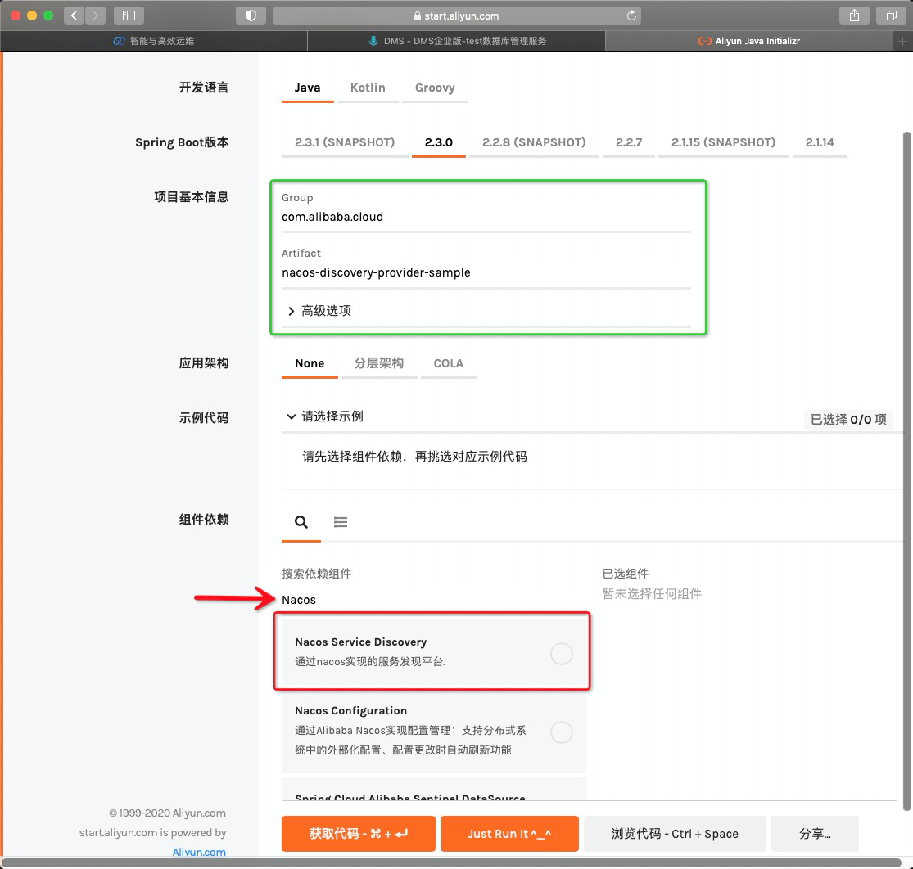
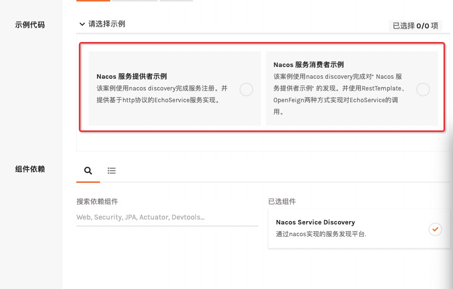
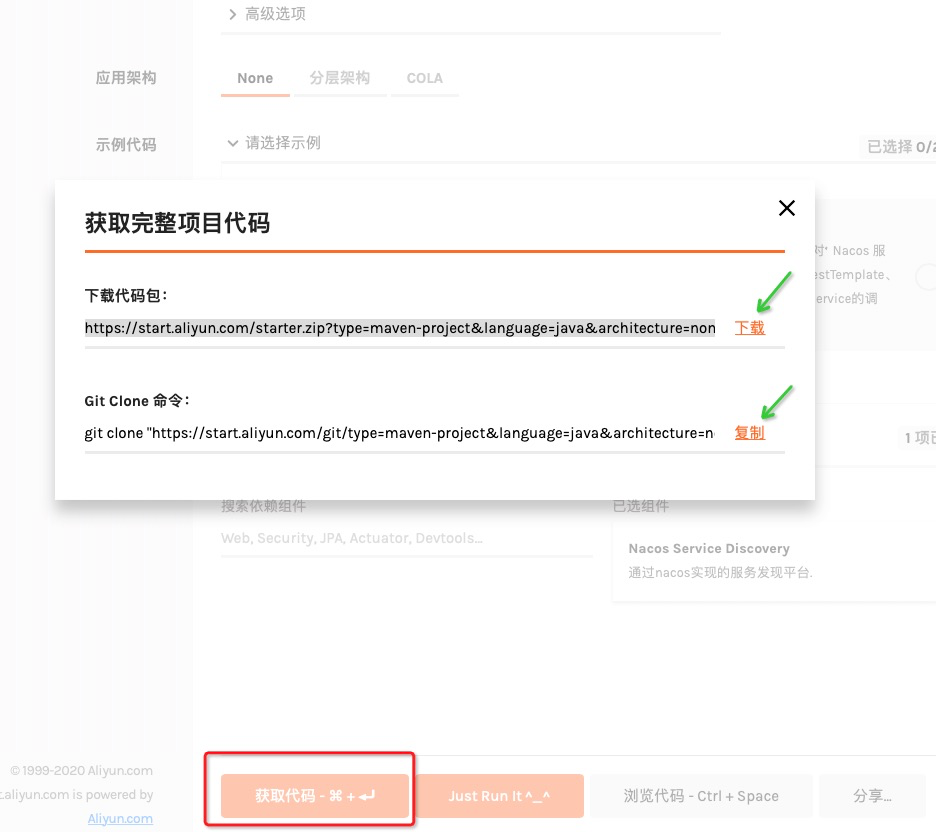
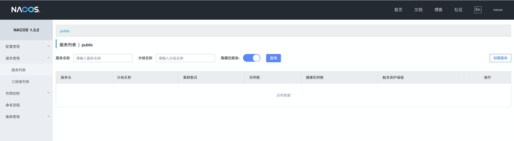
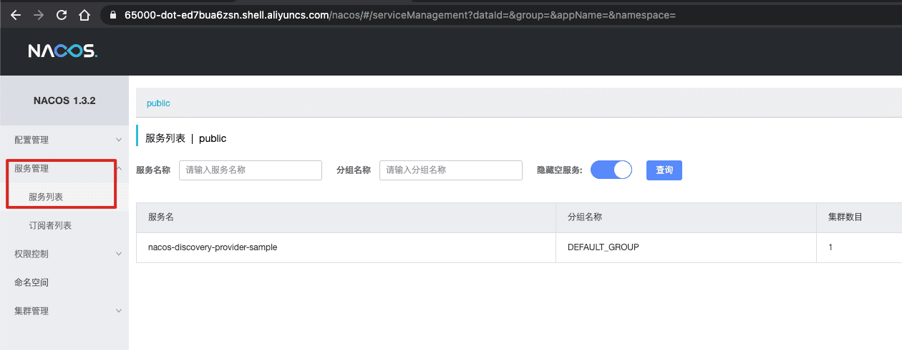

# Spring Cloud Alibaba 服务注册与发现


## 1. 简介

服务注册与发现是微服务架构体系中最关键的组件之一。如果尝试着用手动的方式来给每一个客户端来配置所有服务提供者的服务列表是一件非常困难的事，而且也不利于服务的动态扩缩容。Nacos Discovery 可以帮助您将服务自动注册到 Nacos 服务端并且能够动态感知和刷新某个服务实例的服务列表。除此之外，Nacos Discovery 也将服务实例自身的一些元数据信息-例如 host，port, 健康检查URL，主页等内容注册到 Nacos。Nacos 的获取和启动方式可以参考[Nacos 官网](https://nacos.io/zh-cn/docs/quick-start.html)。

## 2. 学习目标

- 掌握 Nacos Discovery 实现 Spring Cloud 服务注册和发现
- 掌握 Nacos Discovery 整合 Spring Cloud 负载均衡和服务调用
- 理解 Nacos Discovery 高级特性：命名空间、安全控制、元数据、Nacos Watch 等

## 3. 详细内容

- 快速上手：指导读者从使用 Nacos Discovery 进行服务注册/发现
- 服务调用整合：实战 Nacos Discovery 整合 @LoadBalanced RestTemplate 以及 Open Feign
- 运维特性：演示 Nacos Discovery 高级外部化配置以及 Endpoint 内部细节

## 4. 准备工作

### 4.1 初始化 Nacos 服务端

通过如下命令初始化 Nacos 服务端

```bash
sh ~/prepare.sh
```



### 4.2 获得服务端工程代码

通过下面的命令在实验室中获取工程初始代码

```bash
cloudshell-git-open "https://start.aliyun.com/type=maven-project&language=java&architecture=none&bootVersion=2.3.7.RELEASE&baseDir=nacos-discovery-provider-sample&groupId=com.alibaba.cloud&artifactId=nacos-discovery-provider-sample&name=nacos-discovery-provider-sample&description=Demo%20project%20for%20Spring%20Boot&packageName=com.alibaba.cloud.nacos-discovery-provider-sample&packaging=jar&javaVersion=1.8&dependencies=sca-nacos-discovery,web&demos=nacosdiscoveryprovider/nacos-discovery-provider-sample.git" /home/shell/nacos-discovery-provider-sample
```


### 4.3 获得消费端工程代码

通过下面的命令获取客户端代码：

```bash
cloudshell-git-open "https://start.aliyun.com/type=maven-project&language=java&architecture=none&bootVersion=2.3.7.RELEASE&baseDir=nacos-discovery-consumer-sample&groupId=com.alibaba.cloud&artifactId=nacos-discovery-consumer-sample&name=nacos-discovery-consumer-sample&description=Demo%20project%20for%20Spring%20Boot&packageName=com.alibaba.cloud.nacos-discovery-consumer-sample&packaging=jar&javaVersion=1.8&dependencies=sca-nacos-discovery,web,cloud-feign&demos=nacosdiscoveryconsumer/nacos-discovery-consumer-sample.git" /home/shell/nacos-discovery-consumer-sample
```


## 5. 如何引入 Nacos Discovery 进行服务注册/发现

**本节用于在本地环境引入 Nacos Discovery 的操作指引，不涉及对实验室环境的操作**

Nacos Discovery 引入的方式通常有两种，由易到难分别为：[Java工程脚手架](https://start.aliyun.com/bootstrap.html)引入和 Maven pom.xml 依赖。官方推荐使用 [Java工程脚手架](https://start.aliyun.com/bootstrap.html) 方式引入 Nacos Discovery，以便简化组件之间的依赖关系。

### 5.1 [简单] 通过 Aliyun Java Initializr 创建工程并引入 Nacos Discovery（推荐）

由于 Spring Cloud 组件的版本和依赖较为复杂，推荐读者使用 [Java工程脚手架](https://start.aliyun.com/bootstrap.html) 构建应用工程。

上面在实验室获取代码的命令也是在通过脚手架生成的。

下文以 Google Chrome 浏览器为例，当网页加载后，首先，在 "项目基本信息" 部分输入 Group ：“com.alibaba.cloud” 以及 Artifact：“nacos-discovery-provider-sample”（见下图绿框部分） 然而，“组件依赖” 输入框搜索：“Nacos”（见下图红箭头部分），最后，选择 "Nacos Service Discovery"（见下图红框部分），如下所示：  Nacos Service Discovery 组件选择后，展开“示例代码”部分，选择合适的示例代码：  由于“服务注册&发现”是两个独立的端，所以示例代码也被分为两个部分。 通过点击“获取代码”来获得由平台生成的代码：  点击`下载`按钮后，平台将生成一个名为 “nacos-discovery-provider-sample.zip” 的压缩文件，将其保存到本地目录，并解压该文件，工程目录将随之生成。

打开目录下的 pom.xml 文件，不难发现 Nacos Discovery starter 声明其中（以下 XML 内容均来自于项目根路径中的 pom.xml 文件）：

```
        <dependency>
            <groupId>com.alibaba.cloud</groupId>
            <artifactId>spring-cloud-starter-alibaba-nacos-discovery</artifactId>
        </dependency>
```


不过该 starter 并未指定版本，具体的版本声明在 **com.alibaba.cloud:spring-cloud-alibaba-dependencies** 部分：

```
    <dependencyManagement>
        <dependencies>
            <dependency>
                <groupId>com.alibaba.cloud</groupId>
                <artifactId>spring-cloud-alibaba-dependencies</artifactId>
                <version>${spring-cloud-alibaba.version}</version>
                <type>pom</type>
                <scope>import</scope>
            </dependency>
            <dependency>
                <groupId>org.springframework.boot</groupId>
                <artifactId>spring-boot-dependencies</artifactId>
                <version>${spring-boot.version}</version>
                <type>pom</type>
                <scope>import</scope>
            </dependency>
        </dependencies>
    </dependencyManagement>
```


其中，${spring-cloud-alibaba.version} 和 ${spring-boot.version} 分别为 Spring Cloud Alibaba 和 Spring Boot 组件依赖的版本，它们的版本定义在 `<properties>` 元素中，即 **2.2.1.RELEASE** 和 **2.3.0.RELEASE**：

```
    <properties>
        <java.version>1.8</java.version>
        <project.build.sourceEncoding>UTF-8</project.build.sourceEncoding>
        <project.reporting.outputEncoding>UTF-8</project.reporting.outputEncoding>
        <spring-boot.version>2.3.0.RELEASE</spring-boot.version>
        <spring-cloud-alibaba.version>2.2.1.RELEASE</spring-cloud-alibaba.version>
    </properties>
```


如果读者非常熟悉 Maven 依赖管理的配置方式，可以考虑 Maven pom.xml 依赖 Nacos Discovery。

### 5.2 [高级] 通过 Maven pom.xml 依赖 Nacos Discovery

如果要在您的项目中使用 Nacos 来实现服务注册/发现，使用 group ID 为`com.alibaba.cloud` 和 artifact ID 为`spring-cloud-starter-alibaba-nacos-discovery` 的 starter。

```
<dependency>
    <groupId>com.alibaba.cloud</groupId>
    <artifactId>spring-cloud-starter-alibaba-nacos-discovery</artifactId>
</dependency>
```


该声明方式同样需要声明 **com.alibaba.cloud:spring-cloud-alibaba-dependencies**，内容与上小节相同，在此不再赘述。下一节将讨论如何使用 Nacos Discovery 进行服务注册/发现。

## 6 使用 Nacos Discovery 进行服务注册/发现

使用 Nacos Discovery 进行服务注册/发现与传统 Spring Cloud 的方式并没有本质区别，仅需添加相关外部化配置即可工作。换言之，Nacos Discovery 不会侵入应用代码，方便应用整合和迁移，这归功于 Spring Cloud 的高度抽象。

如果读者熟悉 Spring Cloud 服务注册和发现的话，通常需要将注册中心预先部署，Nacos Discovery 也不例外。

### 6.1 查看 Nacos Discovery 注册中心

通过链接Nacos控制台(账号名/密码为 nacos/nacos)打开Nacos 控制台： 

如果你是在本地调试，可以参考 [Nacos 官网](https://nacos.io/zh-cn/docs/quick-start.html)。
关于更多的 Nacos Server 版本，可以从 [release 页面](https://github.com/alibaba/nacos/releases) 下载最新的版本。

### 6.2 启动服务提供者（Provider）

由于初始工程已经包含所有主要代码，我们要做的修改非常少:

打开服务端的 application.properties

修改服务端口到60000： 点我执行修改

```
server.port=60000
```

修改注册中心地址到本地： 点我执行修改

```
spring.cloud.nacos.discovery.server-addr=127.0.0.1:65000
```

使用下面的命令启动服务端

```bash
cd /home/shell/nacos-discovery-provider-sample && mvn clean package && java -jar target/nacos-discovery-provider-sample-0.0.1-SNAPSHOT.jar
```

此时观察控制台输出（隐藏时间部分的内容）：

> [main] o.s.b.w.embedded.tomcat.TomcatWebServer : Tomcat started on port(s): 60000 (http) with context path ''
> [main] c.a.c.n.registry.NacosServiceRegistry : nacos registry, DEFAULT_GROUP nacos-discovery-provider-sample 127.0.0.1:60000 register finished
> [main] o.apache.catalina.core.StandardService : Starting service [Tomcat]
> [main] org.apache.catalina.core.StandardEngine : Starting Servlet engine: [Apache Tomcat/9.0.35]
> [main] o.a.c.c.C.[Tomcat-1].[localhost].[/] : Initializing Spring embedded WebApplicationContext
> [main] o.s.web.context.ContextLoader : Root WebApplicationContext: initialization completed in 176 ms
> [main] .NacosDiscoveryProviderSampleApplication : Started NacosDiscoveryProviderSampleApplication in 3.037 seconds (JVM running for 3.615)

按照日志的描述，应用使用了 Tomcat 作为 Web 服务器，并且将 60000 作为应用服务端口。同时， “c.a.c.n.registry.NacosServiceRegistry : nacos registry, DEFAULT_GROUP nacos-discovery-provider-sample 127.0.0.1:60000 register finished” 表明服务实例注册成功，其 IP 为 127.0.0.1，服务端口为 60000。下一步，观察 Nacos 控制台 注册情况。

##### 6.3 激活 Nacos Discovery 服务注册与发现

Aliyun Java Initializr 默认不会自动激活 Nacos Discovery 服务注册与发现，需要在引导类（main 方法所在类。或者是@Configuration标注类）标注 Spring Cloud 服务注册与发现标准注解`@EnableDiscoveryClient`，代码如下所示： NacosDiscoveryConfiguration 文件

##### 6.4 观察 Nacos 控制台服务注册

打开 Nacos控制台 的“服务列表”，点击“查询”按钮，观察页面的变化：  其中应用 nacos-discovery-provider-sample 出现在列表中，说明该应用已成功注册。至此，使用 Nacos Discovery 进行服务注册/发现演示完毕。接下来的示例将变得更为复杂，实现 Spring Cloud 服务调用。

> 如果不想使用 Nacos 作为您的服务注册与发现，可以将`spring.cloud.nacos.discovery`设置为`false`。

## 7. Nacos Discovery 整合 Spring Cloud 服务调用

从应用架构上，Spring Cloud 服务调用通常需要两个应用，一个为服务提供者（Provider），一个为服务消费者（Consumer）。从技术上，传统的 Spring Cloud 服务通讯方式是基于 REST 实现的，包好两种内建实现方法，分别是 @LoadBalanced RestTemplate 以及 Open Feign，两者均作用于服务消费者，而服务提供者仅为 WebMVC 或者 WebFlux 应用（需注册到注册中心）。同时，还允许整合 Spring Cloud 负载均衡 API，实现自定义 REST 服务调用。至于，Spring Cloud Alibaba 引入 Dubbo 服务通讯方式，会在后续内容中单独讨论。

### 7.1 获取客户端代码

综上所述，我们现在需要获取一套客户端代码

前文的准备工作已经完成了客户端代码的下载工作，所以这里无需做任何操作；

如果需要在本地获取代码，可以参考下面[链接](https://start.aliyun.com/bootstrap.html/#!type=maven-project&language=java&architecture=none&platformVersion=2.3.7.RELEASE&packaging=jar&jvmVersion=1.8&groupId=com.alibaba.cloud&artifactId=nacos-discovery-consumer-sample&name=nacos-discovery-consumer-sample&description=Demo project for Spring Boot&packageName=com.alibaba.cloud.nacos-discovery-consumer-sample&dependencies=sca-nacos-discovery,web,cloud-feign&demos=nacosdiscoveryconsumer)

### 7.2 增加 Nacos Discovery 外部化配置

与应用 nacos-discovery-provider-sample 配置类似，增加 Nacos Discovery 外部化配置，为了避免与应用 nacos-discovery-provider-sample 端口冲突 ，完整配置如下：

打开客户端配置文件 application.properties

修改服务端口到61000： 点我执行修改

```
server.port=61000
```


修改注册中心地址到本地： 点我执行修改

```
spring.cloud.nacos.discovery.server-addr=127.0.0.1:65000
```


### 7.3 服务消费者激活 Nacos Discovery 服务注册与发现

与应用 nacos-discovery-provider-sample 实现一样，在引导类上标注`@EnableDiscoveryClient`，参考代码 NacosDiscoveryConfiguration.java 文件

### 7.4 服务消费者使用 @LoadBalanced RestTemplate 实现服务调用

前文提到 @LoadBalanced RestTemplate 是 Spring Cloud 内建的服务调用方式，因此需要在应用 nacos-discovery-consumer-sample 增加执行代码，消费应用 nacos-discovery-provider-sample REST 服务`/echo/{message}`，请参考 RestTemplateController.java ，核心代码如下：

```java
@RestController
public class RestTemplateController {

    @LoadBalanced
    @Autowired
    public RestTemplate restTemplate;

    @LoadBalanced
    @Bean
    public RestTemplate restTemplate() {
        return new RestTemplate();
    }

    @GetMapping("/call/echo/{message}")
    public String callEcho(@PathVariable String message) {
        // 访问应用 nacos-discovery-provider-sample 的 REST "/echo/{message}"
        return restTemplate.getForObject("http://nacos-discovery-provider-sample/echo/" + message, String.class);
    }
}
```


编译并启动消费端应用

```bash
cd /home/shell/nacos-discovery-consumer-sample && mvn clean package && java -jar target/nacos-discovery-consumer-sample-0.0.1-SNAPSHOT.jar
```


在启动完成以后，测试运行结果：

```bash
curl http://127.0.0.1:61000/call/echo/Hello,World
```


会看到输出：

> [ECHO] : Hello,World

结果符合期望，说明 Nacos Discovery 整合 @LoadBalanced RestTemplate 的实现与标准 Spring Cloud 实现的差异仅体现在 Maven 依赖 starter 以及外部化配置上。接下来，应用 nacos-discovery-consumer-sample 将继续与 Spring Cloud OpenFeign 整合。

### 7.5 Nacos Discovery 整合 Spring Cloud OpenFeign

Spring Cloud OpenFeign 是 Spring Cloud 基于 REST 客户端框架 [OpenFeign](https://github.com/OpenFeign/feign) 而构建，使得服务发现和负载均衡透明，开发人员只需关注服务消费者接口契约。同时，Spring Cloud OpenFeign 可以与 @LoadBalanced RestTemplate 共存，因此，可在原有应用 nacos-discovery-consumer-sample 的基础上，增加 Maven 依赖和代码实现整合。

> 关于 Spring Cloud OpenFeign 的技术细节，可参考官方文档： <https://docs.spring.io/spring-cloud-openfeign/docs/current/reference/html/>

#### 7.5.1 服务消费者增加 Spring Cloud OpenFeign Maven 依赖

在 nacos-discovery-consumer-sample 项目 pom.xml 中追加 Spring Cloud OpenFeign Maven 依赖：

```
        <!-- Spring Cloud OpenFeign -->
        <dependency>
            <groupId>org.springframework.cloud</groupId>
            <artifactId>spring-cloud-starter-openfeign</artifactId>
            <version>2.2.2.RELEASE</version>
        </dependency>
```



实验室的客端代码，已经由脚手架完成集成工作，这里无需做任何操作

下一步，则是新增 Spring Cloud OpenFeign 服务声明接口

#### 7.5.2 服务消费者增加 Spring Cloud OpenFeign 服务声明接口

由于需要消费应用 nacos-discovery-provider-sample 提供的 REST 服务`/echo/{message}`，根据 Spring Cloud OpenFeign 的要求，需要在消费者应用增加 REST 服务声明接口，参考 EchoService.java，核心代码如下：

```java
@FeignClient("nacos-discovery-provider-sample") // 指向服务提供者应用
public interface EchoService {

    @GetMapping("/echo/{message}")
    String echo(@PathVariable("message") String message);
}
```


不难发现，`echo(String)` 方法在 Spring MVC 请求映射的方式与 nacos-discovery-provider-sample 中的`ServiceController`基本相同，唯一区别在于 @PathVariable 注解指定了 value 属性 "message"，这是因为默认情况，Java 编译器不会讲接口方法参数名添加到 Java 字节码中。

下一步，激活 Spring Cloud OpenFeign 服务声明接口。

#### 7.5.3 服务消费者激活 Spring Cloud OpenFeign 服务声明接口

激活 Spring Cloud OpenFeign 服务声明接口的方法非常简单，仅需在引导类标注`@EnableFeignClients`，请参考 NacosDiscoveryConsumerConfiguration.java，其中核心代码如下：

```java
@Configuration
@EnableFeignClients // 激活 @FeignClient
public class NacosDiscoveryConsumerConfiguration {

}
```


激活步骤就此完成，下一步为 Spring Cloud OpenFeign 服务接口增加`RestController` 实现。

#### 7.5.4 服务消费者使用 Spring Cloud OpenFeign 服务声明接口实现服务调用

参考 OpenFeignController.java ，其中核心代码如下:

```java
@RestController
public class OpenFeignController {
    @Autowired
    private EchoService echoService;

    @GetMapping("/feign/echo/{message}")
    public String feignEcho(@PathVariable String message) {
        return echoService.echo(message);
    }
}
```


重启引导类`NacosDiscoveryConsumerSampleApplication`,并测试`/feign/echo/{message}`结果：

```bash
curl http://127.0.0.1:9090/feign/echo/Hello,World
```


> [ECHO] : Hello,World

结果符合期望，说明 Nacos Discovery 整合 Spring Cloud OpenFeign 与传统方式也是相同的。

综上所述，Nacos Discovery 在 Spring Cloud 服务调用是无侵入的。

## 8. Nacos Discovery 更多配置项信息

更多关于 Nacos Discovery Starter 的配置项如下所示:

| 配置项              | Key                                              | 默认值                       | 说明                                                         |
| ------------------- | ------------------------------------------------ | ---------------------------- | ------------------------------------------------------------ |
| 服务端地址          | `spring.cloud.nacos.discovery.server-addr`       |                              | Nacos Server 启动监听的ip地址和端口                          |
| 服务名              | `spring.cloud.nacos.discovery.service`           | `${spring.application.name}` | 注册的服务名                                                 |
| 权重                | `spring.cloud.nacos.discovery.weight`            | `1`                          | 取值范围 1 到 100，数值越大，权重越大                        |
| 网卡名              | `spring.cloud.nacos.discovery.network-interface` |                              | 当IP未配置时，注册的IP为此网卡所对应的IP地址，如果此项也未配置，则默认取第一块网卡的地址 |
| 注册的IP地址        | `spring.cloud.nacos.discovery.ip`                |                              | 优先级最高                                                   |
| 注册的端口          | `spring.cloud.nacos.discovery.port`              | `-1`                         | 默认情况下不用配置，会自动探测                               |
| 命名空间            | `spring.cloud.nacos.discovery.namespace`         |                              | 常用场景之一是不同环境的注册的区分隔离，例如开发测试环境和生产环境的资源（如配置、服务）隔离等 |
| AccessKey           | `spring.cloud.nacos.discovery.access-key`        |                              | 当要上阿里云时，阿里云上面的一个云账号名                     |
| SecretKey           | `spring.cloud.nacos.discovery.secret-key`        |                              | 当要上阿里云时，阿里云上面的一个云账号密码                   |
| Metadata            | `spring.cloud.nacos.discovery.metadata`          |                              | 使用Map格式配置，用户可以根据自己的需要自定义一些和服务相关的元数据信息 |
| 日志文件名          | `spring.cloud.nacos.discovery.log-name`          |                              |                                                              |
| 集群                | `spring.cloud.nacos.discovery.cluster-name`      | `DEFAULT`                    | Nacos集群名称                                                |
| 接入点              | `spring.cloud.nacos.discovery.endpoint`          |                              | 地域的某个服务的入口域名，通过此域名可以动态地拿到服务端地址 |
| 是否集成Ribbon      | `ribbon.nacos.enabled`                           | `true`                       | 一般都设置成true即可                                         |
| 是否开启Nacos Watch | `spring.cloud.nacos.discovery.watch.enabled`     |                              |                                                              |

## 9. Nacos Discovery Actuator Endpoint

Nacos Discovery 内部提供了一个 Endpoint, 对应的 endpoint id 为`nacos-discovery`，其 Actuator Web Endpoint URI 为`/actuator/nacos-discovery`

> 注：使用 Nacos Config Spring Cloud 1.x 版本的话，其 URI 地址则为`/nacos-discovery` ）

Endpoint 暴露的 json 中包含了两种属性:

- subscribe: 显示了当前服务有哪些服务订阅者
- NacosDiscoveryProperties: 当前应用 Nacos 的基础配置信息

由于 Aliyun Java Initializr 所生成的应用工程默认激活 Spring Boot Actuator Endpoints（JMX 和 Web），具体配置存放在`application.properties` 文件中，同时，Actuator Web 端口设置为 8081，内容如下：

```
management.endpoints.jmx.exposure.include=*
management.endpoints.web.exposure.include=*
management.endpoint.health.show-details=always

# Actuator Web 访问端口
management.server.port=62000
```


因此，应用 nacos-discovery-provider-sample 无需调整，直接访问：<http://127.0.0.1:62000/actuator/nacos-discovery>，服务响应的内容如下：

```json
{
  "subscribe": [
    {
      "jsonFromServer": "",
      "name": "nacos-provider",
      "clusters": "",
      "cacheMillis": 10000,
      "hosts": [
        {
          "instanceId": "30.5.124.156#8081#DEFAULT#nacos-provider",
          "ip": "30.5.124.156",
          "port": 8081,
          "weight": 1.0,
          "healthy": true,
          "enabled": true,
          "cluster": {
            "serviceName": null,
            "name": null,
            "healthChecker": {
              "type": "TCP"
            },
            "defaultPort": 80,
            "defaultCheckPort": 80,
            "useIPPort4Check": true,
            "metadata": {

            }
          },
          "service": null,
          "metadata": {

          }
        }
      ],
      "lastRefTime": 1541755293119,
      "checksum": "e5a699c9201f5328241c178e804657e11541755293119",
      "allIPs": false,
      "key": "nacos-provider",
      "valid": true
    }
  ],
  "NacosDiscoveryProperties": {
    "serverAddr": "127.0.0.1:8848",
    "endpoint": "",
    "namespace": "",
    "logName": "",
    "service": "nacos-provider",
    "weight": 1.0,
    "clusterName": "DEFAULT",
    "metadata": {

    },
    "registerEnabled": true,
    "ip": "30.5.124.201",
    "networkInterface": "",
    "port": 8082,
    "secure": false,
    "accessKey": "",
    "secretKey": ""
  }
}
```


## 10. 相关资料

- [客户端原始工程](https://start.aliyun.com/bootstrap.html/#!type=maven-project&language=java&architecture=none&platformVersion=2.3.7.RELEASE&packaging=jar&jvmVersion=1.8&groupId=com.alibaba.cloud&artifactId=nacos-discovery-consumer-sample&name=nacos-discovery-consumer-sample&description=Demo project for Spring Boot&packageName=com.alibaba.cloud.nacos-discovery-consumer-sample&dependencies=sca-nacos-discovery,web,cloud-feign&demos=nacosdiscoveryconsumer)
- [服务端原始工程](https://start.aliyun.com/bootstrap.html/#!type=maven-project&language=java&architecture=none&platformVersion=2.3.7.RELEASE&packaging=jar&jvmVersion=1.8&groupId=com.alibaba.cloud&artifactId=nacos-discovery-provider-sample&name=nacos-discovery-provider-sample&description=Demo project for Spring Boot&packageName=com.alibaba.cloud.nacos-discovery-provider-sample&dependencies=sca-nacos-discovery,web&demos=nacosdiscoveryprovider)