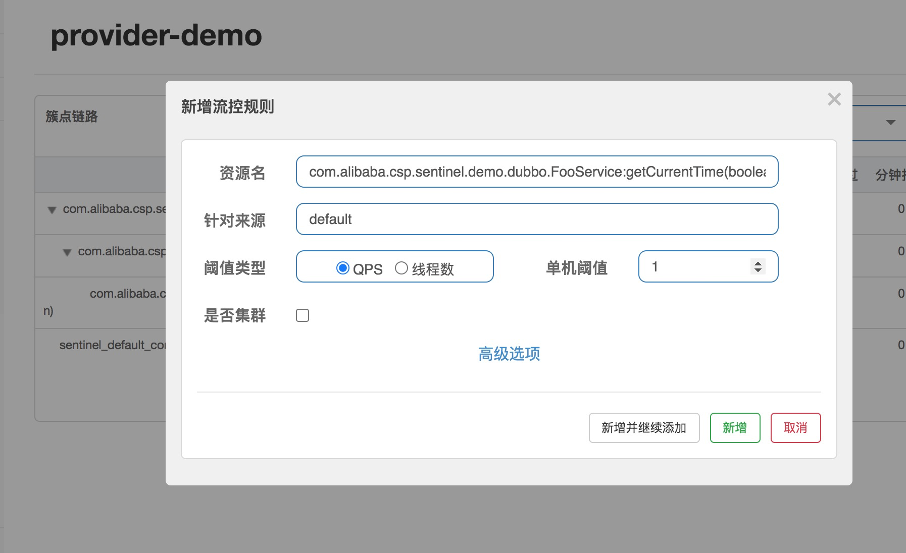
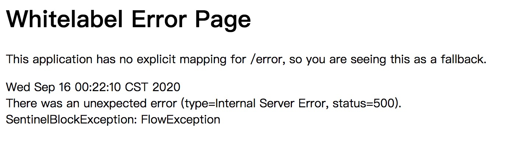
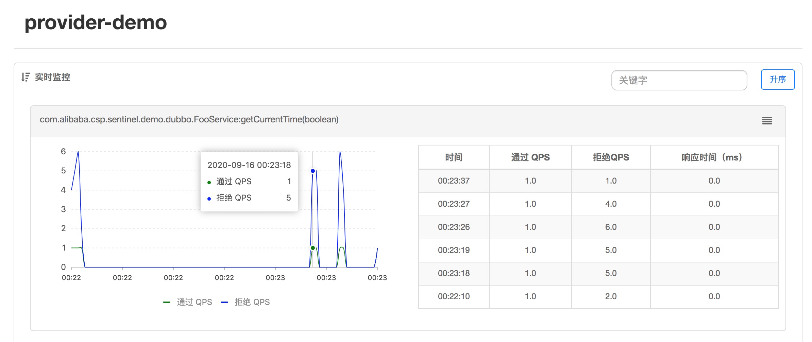
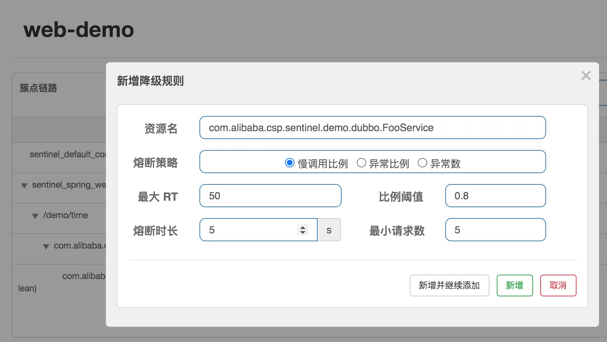
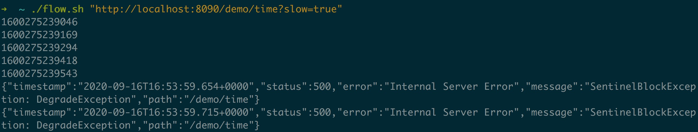
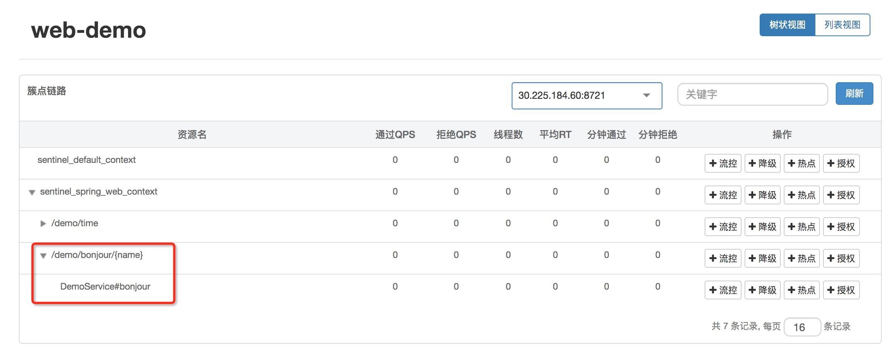

# 使用 sentinel 实现限流&熔断


## 实验说明

本实验，你将会通过一个简单的案例，学习如何使用sentinel来保护你的应用。

## step1 实验环境准备

### 启动服务端

首先你需要启动一套 sentinel 服务端环境

```bash
sh preparesentinel.sh
```

同时你还需要一套nacos作为微服务应用的注册中心，通过初始化脚本，以启动nacos：

```bash
sh preparenacos.sh
```

### 验证服务启动

通过下面的命令，确认两个服务是否启动完成，以下命令可以多次执行：

```bash
cat /home/shell/nacos/logs/start.out
```

```bash
cat /home/shell/logs/sentinel.log
```

## step2 搭建微服务系统

既然是服务熔断和限流，首先得有服务。所以，让我们先来搭建一套微服务环境吧。

这里，我们已经为你准备好了一套使用SpringCloudAlibaba开发的微服务系统，各部分组成如下：

- service-api: 服务接口定义，供 consumer/provider 引用
- service-provider: Dubbo 服务端，对外提供一些服务
- web: Spring Boot Web 应用，其中的一些 API 会作为 consumer 来调用 dubbo-provider 获取结果。里面一共定义了三个 API path：
  - `/demo/hello`: 接受一个 name 参数，会 RPC 调用后端的 `FooService:sayHello(name)` 方法。
  - `/demo/time`：调用后端的 `FooService:getCurrentTime` 方法获取当前时间；里面可以通过 slow 请求参数模拟慢调用。
  - `/demo/bonjour/{name}`: 直接调用本地 DemoService 服务。

接下来，我们分别编译各个应用

首先是 api:

```bash
cd ~/service-api && mvn clean install
```

接着是 service-provider:

```bash
cd ~/service-provider && mvn clean install
```

再然后是 web:

```bash
cd ~/web && mvn clean install
```

> tips: 第一次编译，预计会花费2-3分钟的时间，请耐心等待

待编译完成以后，我们就可以启动应用了

api是接口定义，无需启动，先从服务端开始

```bash
cd ~/service-provider && java -jar target/demo-service.jar
```

然后是启动 web 端：

```bash
cd ~/web && java -jar target/demo-web.jar
```

待两个应用全部完成启动以后，就通过下面的链接，访问刚才部署的服务：

- /demo/hello?name=theonefx
- /demo/time
- /demo/bonjour/theonefx

同时我们的环境也包含启动好的 Sentinel 控制台，可以直接访问并供各个服务接入。 sentinel控制台

> tips: sentinel 控制台的默认账号和密码都是 “sentinel”

## step3 配置sentinel

下面我们来一步一步操作接入 SCA Sentinel 并通过控制台/Nacos 动态数据源配置流控降级规则来验证效果。

### 1. spring-cloud-alibaba-dependencies 配置

首先第一步我们在项目的父 pom 里面导入最新版本的 spring-cloud-alibaba-dependencies，这样我们在实际引入 SCA 相关依赖的时候就不需要指定版本号了：

```console
<dependencyManagement>
    <dependencies>
        <dependency>
            <groupId>com.alibaba.cloud</groupId>
            <artifactId>spring-cloud-alibaba-dependencies</artifactId>
            <version>2.2.5.RELEASE</version>
            <type>pom</type>
            <scope>import</scope>
        </dependency>
    </dependencies>
</dependencyManagement>
```


不过由于需要nacos+dubbo的微服务功能，这部分代码已经被集成了

### 2. 服务接入 SCA Sentinel

首先我们分别为两个服务模块引入 Spring Cloud Alibaba Sentinel 依赖：

```console
<dependency>
    <groupId>com.alibaba.cloud</groupId>
    <artifactId>spring-cloud-starter-alibaba-sentinel</artifactId>
</dependency>
<dependency>
    <groupId>com.alibaba.csp</groupId>
    <artifactId>sentinel-apache-dubbo-adapter</artifactId>
</dependency>
```


插入到web应用

插入到provider应用

### 3. 修改代码和配置

接着，我们需要配置两个服务，使得两个服务都可以连接到 sentinel 控制台

将下面的配置文件拷贝到对应应用的 application.properties 里：

```console
# Sentinel 控制台地址
spring.cloud.sentinel.transport.dashboard=127.0.0.1:64000
# 取消Sentinel控制台懒加载
# 默认情况下 Sentinel 会在客户端首次调用的时候进行初始化，开始向控制台发送心跳包
# 配置 sentinel.eager=true 时，取消Sentinel控制台懒加载功能
spring.cloud.sentinel.eager=true
```


点我插入web应用

点我插入provider应用

增加sentinel的配置类，以此来处理限流异常

```
package com.example.demo.demos.sentinel;

import java.io.PrintWriter;

import org.springframework.context.annotation.Bean;
import org.springframework.context.annotation.Configuration;

import com.alibaba.csp.sentinel.adapter.spring.webmvc.callback.BlockExceptionHandler;

@Configuration
public class SentinelWebConfig {

    @Bean
    public BlockExceptionHandler sentinelBlockExceptionHandler() {
        return (request, response, e) -> {
            // 429 Too Many Requests
            response.setStatus(429);

            PrintWriter out = response.getWriter();
            out.print("Oops, blocked by Sentinel: " + e.getClass().getSimpleName());
            out.flush();
            out.close();
        };
    }
}
```


修改DemoService，增加sentinel的限流配置，增加后代码如下：

```
package com.example.demo.demos.sentinel;

import org.springframework.stereotype.Service;

import com.alibaba.csp.sentinel.annotation.SentinelResource;
import com.alibaba.csp.sentinel.slots.block.BlockException;

@Service
public class DemoService {

    @SentinelResource(value = "DemoService#bonjour", defaultFallback = "bonjourFallback")
    public String bonjour(String name) {
        return "Bonjour, " + name;
    }

    public String bonjourFallback(Throwable t) {
        if (BlockException.isBlockException(t)) {
            return "Blocked by Sentinel: " + t.getClass().getSimpleName();
        }
        return "Oops, failed: " + t.getClass().getCanonicalName();
    }
}
```

### 4.重新编译provider和web两个应用

```bash
cd ~/service-provider && mvn clean install
```


```bash
cd ~/web && mvn clean install
```

待编译完成以后，再次重新启动两个应用

- 切换到provider窗口
- 输入ctrl+c关闭进程
- 切换到web窗口
- 输入ctrl+c关闭进程

重新启动两个应用：

```bash
cd ~/service-provider && java -jar target/demo-service.jar
```

```bash
cd ~/web && java -jar target/demo-web.jar
```

## step4 流控规则

下面我们来配一条最简单的流控规则。打开sentinel控制台，在 Dubbo provider 端，我们进入簇点链路页面，针对 `com.alibaba.csp.sentinel.demo.dubbo.FooService:getCurrentTime(boolean)` 这个服务调用配置限流规则（需要有过访问量才能看到）。我们配一条 QPS 为 1 的流控规则，这代表针对该服务方法的调用每秒钟不能超过 1 次，超出会直接拒绝。



点击“新增”按钮，成功添加规则。我们可以在浏览器反复请求 `localhost:8090/demo/time`（频率不要太慢），可以看到会出现限流异常信息（Dubbo provider 默认的限流处理逻辑是抛出异常，该异常信息由 Dubbo 直接返回，并由 Spring 展示为默认 error 页面）：



同时我们也可以在“实时监控”页面看到实时的访问量和拒绝量：



我们同样也可以在 Web API 处配置限流规则，观察效果。Spring Web 默认的限流处理逻辑是返回默认的提示信息（Blocked by Sentinel），状态码为 429。在后面的章节我们会介绍如何自定义流控处理逻辑。

了解了限流的基本用法，大家可能想问：生产环境我需要针对每个接口都去配置流控规则吗？阈值不会配怎么办？其实，限流降级的配置是需要结合容量规划、依赖梳理来做的。我们可以借助 JMeter 或 [阿里云 PTS](https://help.aliyun.com/product/29260.html) 等压测工具对我们的服务进行全链路压测，了解每个服务的最大承受能力，来确定核心接口的最大容量并作为 QPS 阈值。

### 熔断降级规则

熔断降级通常用于自动切断不稳定的服务，防止调用方被拖垮导致级联故障。熔断降级规则通常在调用端，针对**弱依赖调用**进行配置，在熔断时返回预定义好的 fallback 值，这样可以保证核心链路不被不稳定的旁路影响。

Sentinel 提供以下几种熔断策略：

- 慢调用比例 (SLOW*REQUEST*RATIO)：选择以慢调用比例作为阈值，需要设置允许的慢调用 RT（即最大的响应时间），请求的响应时间大于该值则统计为慢调用。当单位统计时长（statIntervalMs，默认为 1s）内请求数目大于设置的最小请求数目，并且慢调用的比例大于阈值，则接下来的熔断时长内请求会自动被熔断。经过熔断时长后熔断器会进入探测恢复状态（HALF-OPEN 状态），若接下来的一个请求响应时间小于设置的慢调用 RT 则结束熔断，若大于设置的慢调用 RT 则会再次被熔断。
- 异常比例 (ERROR_RATIO)：当单位统计时长内请求数目大于设置的最小请求数目，并且异常的比例大于阈值，则接下来的熔断时长内请求会自动被熔断。经过熔断时长后熔断器会进入探测恢复状态（HALF-OPEN 状态），若接下来的一个请求成功完成（没有错误）则结束熔断，否则会再次被熔断。异常比率的阈值范围是 `[0.0, 1.0]`，代表 0% - 100%。
- 异常数 (ERROR_COUNT)：当单位统计时长内的异常数目超过阈值之后会自动进行熔断。经过熔断时长后熔断器会进入探测恢复状态（HALF-OPEN 状态），若接下来的一个请求成功完成（没有错误）则结束熔断，否则会再次被熔断。

下面我们来在 Web 应用中针对 Dubbo consumer 来配置慢调用熔断规则，并模拟慢调用来观察效果。我们在 web-api-demo 中针对 `com.alibaba.csp.sentinel.demo.dubbo.FooService` 服务调用配置熔断降级规则。



控制台配置的统计时长默认为 1s。在上面的这条规则中，我们设定慢调用临界值为 50ms，响应时间超出 50ms 即记为慢调用。当统计时长内的请求数 >=5 且慢调用的比例超出我们配置的阈值（80%）就会触发熔断，熔断时长为 5s，经过熔断时长后会允许一个请求探测通过，若请求正常则恢复，否则继续熔断。

我们的实例中 `/demo/time` API 可以通过 slow 请求参数模拟慢调用，当 slow=true 时该请求耗时会超过 100ms。我们可以用 ab 等压测工具或脚本，批量请求 `localhost:8090/demo/time?slow=true`，可以观察到熔断的返回



如果我们一直模拟慢调用，我们可以观察到熔断后每 5s 会允许通过一个请求，但该请求仍然是慢调用，会重新打回熔断，无法恢复。我们可以在触发熔断后，等待一段时间后手动发一个不带 `slow=true` 的正常请求，然后再进行请求，可以观察到熔断恢复。

需要注意的是，即使服务调用方引入了熔断降级机制，我们还是需要在 HTTP 或 RPC 客户端配置请求超时时间，来做一个兜底的防护。

### 注解方式自定义埋点

刚才我们看到的埋点都是 Sentinel 适配模块提供的自动埋点。有的时候自动埋点可能没法满足我们的需求，我们希望在某个业务逻辑的位置进行限流，能不能做到呢？当然可以！Sentinel 提供两种方式进行自定义埋点：`SphU` API 和 `@SentinelResource` 注解，前者最为通用但是代码比较繁杂，耦合度较高；注解方式侵入性较低，但有使用场景的限制。这里我们来动手在 Web 应用的 DemoService 上添加注解，来达到针对本地服务埋点的目标。

在 `DemoService` 中我们实现了一个简单的打招呼的服务：

```java
@Service
public class DemoService {

    public String bonjour(String name) {
        return "Bonjour, " + name;
    }
}
```


下面我们给 bonjour 这个函数添加 `@SentinelResource` 注解，注解的 value 代表这个埋点的名称（resourceName），会显示在簇点链路/监控页面。

```java
@SentinelResource(value = "DemoService#bonjour")
public String bonjour(String name
```

加上该注解后，再通过网关访问 `/demo/bonjour/{name}` 这个 API 的时候，我们就可以在簇点链路页面看到我们自定义的 `DemoService#bonjour` 埋点了。



添加注解埋点只是第一步。一般在生产环境中，我们希望在这些自定义埋点发生限流的时候，有一些 fallback 逻辑，而不是直接对外抛出异常。这里我们可以写一个 fallback 函数：

```java
public String bonjourFallback(Throwable t) {
    if (BlockException.isBlockException(t)) {
        return "Blocked by Sentinel: " + t.getClass().getSimpleName();
    }
    return "Oops, failed: " + t.getClass().getCanonicalName();
}
```

我们的 fallback 函数接受一个 Throwable 参数，可以从中获取异常信息。Sentinel 注解的 fallback 会捕获业务异常和流控异常（即 BlockException 及其子类），我们可以在 fallback 逻辑里面进行相应的处理（如日志记录），并返回 fallback 的值。

> **注意**：Sentinel 注解对 fallback 和 blockHandler 函数的方法签名有要求，具体请参考[此处文档](https://sentinelguard.io/zh-cn/docs/annotation-support.html)。

写好 fallback 函数的实现后，我们在 `@SentinelResource` 注解里面指定一下：

```java
@SentinelResource(value = "DemoService#bonjour", defaultFallback = "bonjourFallback")
public String bonjour(String name)
```

这样当我们自定义的 `DemoService#bonjour` 资源被限流或熔断的时候，请求会走到 fallback 的逻辑中，返回 fallback 结果，而不会直接抛出异常。我们可以配一个 QPS=1 的限流规则，然后快速请求后观察返回值：

```
?  ~ curl http://localhost:8090/demo/bonjour/Sentinel
Bonjour, Sentinel
?  ~ curl http://localhost:8090/demo/bonjour/Sentinel
Blocked by Sentinel: FlowException
```


> **注意**：使用 `@SentinelResource` 注解要求对应的类必须由 Spring 托管（即为 Spring bean），并且不能是内部调用（没法走到代理），不能是 private 方法。Sentinel 注解生效依赖 Spring AOP 动态代理机制。

### 配置自定义的流控处理逻辑

Sentinel 的各种适配方式均支持自定义的流控处理逻辑。以 Spring Web 适配为例，我们只需要提供自定义的 `BlockExceptionHandler` 实现并注册为 bean 即可为 Web 埋点提供自定义处理逻辑。其中 BlockExceptionHandler 的定义如下：

```java
public interface BlockExceptionHandler {

    // 在此处处理限流异常，可以跳转到指定页面或返回指定的内容
    void handle(HttpServletRequest request, HttpServletResponse response, BlockException e) throws Exception;
}
```

我们的 Web 应用中提供了 Web 埋点自定义流控处理逻辑的示例：

```java
@Configuration
public class SentinelWebConfig {

    @Bean
    public BlockExceptionHandler sentinelBlockExceptionHandler() {
        return (request, response, e) -> {
            // 429 Too Many Requests
            response.setStatus(429);

            PrintWriter out = response.getWriter();
            out.print("Oops, blocked by Sentinel: " + e.getClass().getSimpleName());
            out.flush();
            out.close();
        };
    }
}
```


该 handler 会获取流控类型并打印返回信息，返回状态码为 429。我们可以根据实际的业务需求，配置跳转或自定义的返回信息。

对于注解方式，我们上一节已经提到，可以指定 fallback 函数来处理流控异常和业务异常，这里不再展开讲解；对于 Dubbo 适配，我们可以通过 DubboAdapterGlobalConfig 注册 provider/consumer fallback 来提供自定义的流控处理逻辑；对于 Spring Cloud Gateway 适配，我们可以注册自定义的 BlockRequestHandler 实现类来为网关流控注册自定义的处理逻辑。

### 对 Spring Cloud 其他组件的支持

Spring Cloud Alibaba Sentinel 还提供对 Spring Cloud 其它常用组件的支持，包括 RestTemplate、Feign 等。篇幅所限，我们不展开实践。大家可以参考 [Spring Cloud Alibaba 文档](https://github.com/alibaba/spring-cloud-alibaba/wiki/Sentinel#feign-支持) 来进行接入和配置。

## step5 总结

通过本教程，我们了解了流控降级作为高可用防护手段的重要性，了解了 Sentinel 的核心特性和原理，并通过动手实践学习了如何快速接入 SCA Sentinel 来为微服务进行流控降级。Sentinel 还有着非常多的高级特性等着大家去发掘，如热点防护、集群流控等，大家可以参考 [Sentinel 官方文档](https://github.com/alibaba/Sentinel/wiki)来了解更多的特性和场景。

那么是不是服务的量级很小就不用进行限流防护了呢？是不是微服务的架构比较简单就不用引入熔断保护机制了呢？其实，这与请求的量级、架构的复杂程度无关。很多时候，可能正是一个非常边缘的服务出现故障而导致整体业务受影响，造成巨大损失。我们需要具有面向失败设计的意识，在平时就做好容量规划和强弱依赖的梳理，合理地配置流控降级规则，做好事前防护，而不是在线上出现问题以后再进行补救。

同时，我们也在阿里云上提供了 Sentinel 的企业版本 [AHAS Sentinel](https://help.aliyun.com/document_detail/101132.html)，提供开箱即用的企业级高可用防护能力。与开源版本相比，AHAS 还提供以下的专业能力：

- 可靠的实时监控和历史秒级监控数据查询，包含接口维度的 QPS、响应时间及系统 load、CPU 使用率等指标，支持按照调用类型分类，支持同比/环比展示
- Top K 接口监控统计，快速了解系统的慢调用和大流量接口；热力图概览，快速定位不稳定的机器
- Java Agent 方式/K8s Java 应用零侵入快速接入，支持近 20 种主流框架和 API Gateway
- 全自动托管、高可用的集群流量控制
- Nginx 流量控制，支持规则动态配置、集群流控

欢迎大家体实验说明

本实验，你将会通过一个简单的案例，学习如何使用sentinel来保护你的应用。

## step1 实验环境准备

### 启动服务端

首先你需要启动一套 sentinel 服务端环境

```bash
sh preparesentinel.sh
```


同时你还需要一套nacos作为微服务应用的注册中心，通过初始化脚本，以启动nacos：

```bash
sh preparenacos.sh
```


### 验证服务启动

通过下面的命令，确认两个服务是否启动完成，以下命令可以多次执行：

```bash
cat /home/shell/nacos/logs/start.out
```


```bash
cat /home/shell/logs/sentinel.log
```


## step2 搭建微服务系统

既然是服务熔断和限流，首先得有服务。所以，让我们先来搭建一套微服务环境吧。

这里，我们已经为你准备好了一套使用SpringCloudAlibaba开发的微服务系统，各部分组成如下：

- service-api: 服务接口定义，供 consumer/provider 引用
- service-provider: Dubbo 服务端，对外提供一些服务
- web: Spring Boot Web 应用，其中的一些 API 会作为 consumer 来调用 dubbo-provider 获取结果。里面一共定义了三个 API path：
  - `/demo/hello`: 接受一个 name 参数，会 RPC 调用后端的 `FooService:sayHello(name)` 方法。
  - `/demo/time`：调用后端的 `FooService:getCurrentTime` 方法获取当前时间；里面可以通过 slow 请求参数模拟慢调用。
  - `/demo/bonjour/{name}`: 直接调用本地 DemoService 服务。

接下来，我们分别编译各个应用

首先是 api:

```bash
cd ~/service-api && mvn clean install
```


接着是 service-provider:

```bash
cd ~/service-provider && mvn clean install
```


再然后是 web:

```bash
cd ~/web && mvn clean install
```


> tips: 第一次编译，预计会花费2-3分钟的时间，请耐心等待

待编译完成以后，我们就可以启动应用了

api是接口定义，无需启动，先从服务端开始

```bash
cd ~/service-provider && java -jar target/demo-service.jar
```



然后是启动 web 端：

```bash
cd ~/web && java -jar target/demo-web.jar
```


待两个应用全部完成启动以后，就通过下面的链接，访问刚才部署的服务：

- /demo/hello?name=theonefx
- /demo/time
- /demo/bonjour/theonefx

同时我们的环境也包含启动好的 Sentinel 控制台，可以直接访问并供各个服务接入。 sentinel控制台

> tips: sentinel 控制台的默认账号和密码都是 “sentinel”

## step3 配置sentinel

下面我们来一步一步操作接入 SCA Sentinel 并通过控制台/Nacos 动态数据源配置流控降级规则来验证效果。

### 1. spring-cloud-alibaba-dependencies 配置

首先第一步我们在项目的父 pom 里面导入最新版本的 spring-cloud-alibaba-dependencies，这样我们在实际引入 SCA 相关依赖的时候就不需要指定版本号了：

```console
<dependencyManagement>
    <dependencies>
        <dependency>
            <groupId>com.alibaba.cloud</groupId>
            <artifactId>spring-cloud-alibaba-dependencies</artifactId>
            <version>2.2.5.RELEASE</version>
            <type>pom</type>
            <scope>import</scope>
        </dependency>
    </dependencies>
</dependencyManagement>
```


不过由于需要nacos+dubbo的微服务功能，这部分代码已经被集成了

### 2. 服务接入 SCA Sentinel

首先我们分别为两个服务模块引入 Spring Cloud Alibaba Sentinel 依赖：

```console
<dependency>
    <groupId>com.alibaba.cloud</groupId>
    <artifactId>spring-cloud-starter-alibaba-sentinel</artifactId>
</dependency>
<dependency>
    <groupId>com.alibaba.csp</groupId>
    <artifactId>sentinel-apache-dubbo-adapter</artifactId>
</dependency>
```


插入到web应用

插入到provider应用

### 3. 修改代码和配置

接着，我们需要配置两个服务，使得两个服务都可以连接到 sentinel 控制台

将下面的配置文件拷贝到对应应用的 application.properties 里：

```console
# Sentinel 控制台地址
spring.cloud.sentinel.transport.dashboard=127.0.0.1:64000
# 取消Sentinel控制台懒加载
# 默认情况下 Sentinel 会在客户端首次调用的时候进行初始化，开始向控制台发送心跳包
# 配置 sentinel.eager=true 时，取消Sentinel控制台懒加载功能
spring.cloud.sentinel.eager=true
```


点我插入web应用

点我插入provider应用

增加sentinel的配置类，以此来处理限流异常

```
package com.example.demo.demos.sentinel;

import java.io.PrintWriter;

import org.springframework.context.annotation.Bean;
import org.springframework.context.annotation.Configuration;

import com.alibaba.csp.sentinel.adapter.spring.webmvc.callback.BlockExceptionHandler;

@Configuration
public class SentinelWebConfig {

    @Bean
    public BlockExceptionHandler sentinelBlockExceptionHandler() {
        return (request, response, e) -> {
            // 429 Too Many Requests
            response.setStatus(429);

            PrintWriter out = response.getWriter();
            out.print("Oops, blocked by Sentinel: " + e.getClass().getSimpleName());
            out.flush();
            out.close();
        };
    }
}
```


修改DemoService，增加sentinel的限流配置，增加后代码如下：

```
package com.example.demo.demos.sentinel;

import org.springframework.stereotype.Service;

import com.alibaba.csp.sentinel.annotation.SentinelResource;
import com.alibaba.csp.sentinel.slots.block.BlockException;

@Service
public class DemoService {

    @SentinelResource(value = "DemoService#bonjour", defaultFallback = "bonjourFallback")
    public String bonjour(String name) {
        return "Bonjour, " + name;
    }

    public String bonjourFallback(Throwable t) {
        if (BlockException.isBlockException(t)) {
            return "Blocked by Sentinel: " + t.getClass().getSimpleName();
        }
        return "Oops, failed: " + t.getClass().getCanonicalName();
    }
}
```


### 4.重新编译provider和web两个应用

```bash
cd ~/service-provider && mvn clean install
```


```bash
cd ~/web && mvn clean install
```


待编译完成以后，再次重新启动两个应用

- 切换到provider窗口
- 输入ctrl+c关闭进程
- 切换到web窗口
- 输入ctrl+c关闭进程

重新启动两个应用：

```bash
cd ~/service-provider && java -jar target/demo-service.jar
```


```bash
cd ~/web && java -jar target/demo-web.jar
```


## step4 流控规则

下面我们来配一条最简单的流控规则。打开sentinel控制台，在 Dubbo provider 端，我们进入簇点链路页面，针对 `com.alibaba.csp.sentinel.demo.dubbo.FooService:getCurrentTime(boolean)` 这个服务调用配置限流规则（需要有过访问量才能看到）。我们配一条 QPS 为 1 的流控规则，这代表针对该服务方法的调用每秒钟不能超过 1 次，超出会直接拒绝。


点击“新增”按钮，成功添加规则。我们可以在浏览器反复请求 `localhost:8090/demo/time`（频率不要太慢），可以看到会出现限流异常信息（Dubbo provider 默认的限流处理逻辑是抛出异常，该异常信息由 Dubbo 直接返回，并由 Spring 展示为默认 error 页面）：


同时我们也可以在“实时监控”页面看到实时的访问量和拒绝量：


我们同样也可以在 Web API 处配置限流规则，观察效果。Spring Web 默认的限流处理逻辑是返回默认的提示信息（Blocked by Sentinel），状态码为 429。在后面的章节我们会介绍如何自定义流控处理逻辑。

了解了限流的基本用法，大家可能想问：生产环境我需要针对每个接口都去配置流控规则吗？阈值不会配怎么办？其实，限流降级的配置是需要结合容量规划、依赖梳理来做的。我们可以借助 JMeter 或 [阿里云 PTS](https://help.aliyun.com/product/29260.html) 等压测工具对我们的服务进行全链路压测，了解每个服务的最大承受能力，来确定核心接口的最大容量并作为 QPS 阈值。

### 熔断降级规则

熔断降级通常用于自动切断不稳定的服务，防止调用方被拖垮导致级联故障。熔断降级规则通常在调用端，针对**弱依赖调用**进行配置，在熔断时返回预定义好的 fallback 值，这样可以保证核心链路不被不稳定的旁路影响。

Sentinel 提供以下几种熔断策略：

- 慢调用比例 (SLOW*REQUEST*RATIO)：选择以慢调用比例作为阈值，需要设置允许的慢调用 RT（即最大的响应时间），请求的响应时间大于该值则统计为慢调用。当单位统计时长（statIntervalMs，默认为 1s）内请求数目大于设置的最小请求数目，并且慢调用的比例大于阈值，则接下来的熔断时长内请求会自动被熔断。经过熔断时长后熔断器会进入探测恢复状态（HALF-OPEN 状态），若接下来的一个请求响应时间小于设置的慢调用 RT 则结束熔断，若大于设置的慢调用 RT 则会再次被熔断。
- 异常比例 (ERROR_RATIO)：当单位统计时长内请求数目大于设置的最小请求数目，并且异常的比例大于阈值，则接下来的熔断时长内请求会自动被熔断。经过熔断时长后熔断器会进入探测恢复状态（HALF-OPEN 状态），若接下来的一个请求成功完成（没有错误）则结束熔断，否则会再次被熔断。异常比率的阈值范围是 `[0.0, 1.0]`，代表 0% - 100%。
- 异常数 (ERROR_COUNT)：当单位统计时长内的异常数目超过阈值之后会自动进行熔断。经过熔断时长后熔断器会进入探测恢复状态（HALF-OPEN 状态），若接下来的一个请求成功完成（没有错误）则结束熔断，否则会再次被熔断。

下面我们来在 Web 应用中针对 Dubbo consumer 来配置慢调用熔断规则，并模拟慢调用来观察效果。我们在 web-api-demo 中针对 `com.alibaba.csp.sentinel.demo.dubbo.FooService` 服务调用配置熔断降级规则。


控制台配置的统计时长默认为 1s。在上面的这条规则中，我们设定慢调用临界值为 50ms，响应时间超出 50ms 即记为慢调用。当统计时长内的请求数 >=5 且慢调用的比例超出我们配置的阈值（80%）就会触发熔断，熔断时长为 5s，经过熔断时长后会允许一个请求探测通过，若请求正常则恢复，否则继续熔断。

我们的实例中 `/demo/time` API 可以通过 slow 请求参数模拟慢调用，当 slow=true 时该请求耗时会超过 100ms。我们可以用 ab 等压测工具或脚本，批量请求 `localhost:8090/demo/time?slow=true`，可以观察到熔断的返回


如果我们一直模拟慢调用，我们可以观察到熔断后每 5s 会允许通过一个请求，但该请求仍然是慢调用，会重新打回熔断，无法恢复。我们可以在触发熔断后，等待一段时间后手动发一个不带 `slow=true` 的正常请求，然后再进行请求，可以观察到熔断恢复。

需要注意的是，即使服务调用方引入了熔断降级机制，我们还是需要在 HTTP 或 RPC 客户端配置请求超时时间，来做一个兜底的防护。

### 注解方式自定义埋点

刚才我们看到的埋点都是 Sentinel 适配模块提供的自动埋点。有的时候自动埋点可能没法满足我们的需求，我们希望在某个业务逻辑的位置进行限流，能不能做到呢？当然可以！Sentinel 提供两种方式进行自定义埋点：`SphU` API 和 `@SentinelResource` 注解，前者最为通用但是代码比较繁杂，耦合度较高；注解方式侵入性较低，但有使用场景的限制。这里我们来动手在 Web 应用的 DemoService 上添加注解，来达到针对本地服务埋点的目标。

在 `DemoService` 中我们实现了一个简单的打招呼的服务：

```java
@Service
public class DemoService {

    public String bonjour(String name) {
        return "Bonjour, " + name;
    }
}
```


下面我们给 bonjour 这个函数添加 `@SentinelResource` 注解，注解的 value 代表这个埋点的名称（resourceName），会显示在簇点链路/监控页面。

```java
@SentinelResource(value = "DemoService#bonjour")
public String bonjour(String name)
```


加上该注解后，再通过网关访问 `/demo/bonjour/{name}` 这个 API 的时候，我们就可以在簇点链路页面看到我们自定义的 `DemoService#bonjour` 埋点了。


添加注解埋点只是第一步。一般在生产环境中，我们希望在这些自定义埋点发生限流的时候，有一些 fallback 逻辑，而不是直接对外抛出异常。这里我们可以写一个 fallback 函数：

```java
public String bonjourFallback(Throwable t) {
    if (BlockException.isBlockException(t)) {
        return "Blocked by Sentinel: " + t.getClass().getSimpleName();
    }
    return "Oops, failed: " + t.getClass().getCanonicalName();
}
```


我们的 fallback 函数接受一个 Throwable 参数，可以从中获取异常信息。Sentinel 注解的 fallback 会捕获业务异常和流控异常（即 BlockException 及其子类），我们可以在 fallback 逻辑里面进行相应的处理（如日志记录），并返回 fallback 的值。

> **注意**：Sentinel 注解对 fallback 和 blockHandler 函数的方法签名有要求，具体请参考[此处文档](https://sentinelguard.io/zh-cn/docs/annotation-support.html)。

写好 fallback 函数的实现后，我们在 `@SentinelResource` 注解里面指定一下：

```java
@SentinelResource(value = "DemoService#bonjour", defaultFallback = "bonjourFallback")
public String bonjour(String name)
```


这样当我们自定义的 `DemoService#bonjour` 资源被限流或熔断的时候，请求会走到 fallback 的逻辑中，返回 fallback 结果，而不会直接抛出异常。我们可以配一个 QPS=1 的限流规则，然后快速请求后观察返回值：

```
?  ~ curl http://localhost:8090/demo/bonjour/Sentinel
Bonjour, Sentinel
?  ~ curl http://localhost:8090/demo/bonjour/Sentinel
Blocked by Sentinel: FlowException
```


> **注意**：使用 `@SentinelResource` 注解要求对应的类必须由 Spring 托管（即为 Spring bean），并且不能是内部调用（没法走到代理），不能是 private 方法。Sentinel 注解生效依赖 Spring AOP 动态代理机制。

### 配置自定义的流控处理逻辑

Sentinel 的各种适配方式均支持自定义的流控处理逻辑。以 Spring Web 适配为例，我们只需要提供自定义的 `BlockExceptionHandler` 实现并注册为 bean 即可为 Web 埋点提供自定义处理逻辑。其中 BlockExceptionHandler 的定义如下：

```java
public interface BlockExceptionHandler {

    // 在此处处理限流异常，可以跳转到指定页面或返回指定的内容
    void handle(HttpServletRequest request, HttpServletResponse response, BlockException e) throws Exception;
}
```


我们的 Web 应用中提供了 Web 埋点自定义流控处理逻辑的示例：

```java
@Configuration
public class SentinelWebConfig {

    @Bean
    public BlockExceptionHandler sentinelBlockExceptionHandler() {
        return (request, response, e) -> {
            // 429 Too Many Requests
            response.setStatus(429);

            PrintWriter out = response.getWriter();
            out.print("Oops, blocked by Sentinel: " + e.getClass().getSimpleName());
            out.flush();
            out.close();
        };
    }
}
```


该 handler 会获取流控类型并打印返回信息，返回状态码为 429。我们可以根据实际的业务需求，配置跳转或自定义的返回信息。

对于注解方式，我们上一节已经提到，可以指定 fallback 函数来处理流控异常和业务异常，这里不再展开讲解；对于 Dubbo 适配，我们可以通过 DubboAdapterGlobalConfig 注册 provider/consumer fallback 来提供自定义的流控处理逻辑；对于 Spring Cloud Gateway 适配，我们可以注册自定义的 BlockRequestHandler 实现类来为网关流控注册自定义的处理逻辑。

### 对 Spring Cloud 其他组件的支持

Spring Cloud Alibaba Sentinel 还提供对 Spring Cloud 其它常用组件的支持，包括 RestTemplate、Feign 等。篇幅所限，我们不展开实践。大家可以参考 [Spring Cloud Alibaba 文档](https://github.com/alibaba/spring-cloud-alibaba/wiki/Sentinel#feign-支持) 来进行接入和配置。

## step5 总结

通过本教程，我们了解了流控降级作为高可用防护手段的重要性，了解了 Sentinel 的核心特性和原理，并通过动手实践学习了如何快速接入 SCA Sentinel 来为微服务进行流控降级。Sentinel 还有着非常多的高级特性等着大家去发掘，如热点防护、集群流控等，大家可以参考 [Sentinel 官方文档](https://github.com/alibaba/Sentinel/wiki)来了解更多的特性和场景。

那么是不是服务的量级很小就不用进行限流防护了呢？是不是微服务的架构比较简单就不用引入熔断保护机制了呢？其实，这与请求的量级、架构的复杂程度无关。很多时候，可能正是一个非常边缘的服务出现故障而导致整体业务受影响，造成巨大损失。我们需要具有面向失败设计的意识，在平时就做好容量规划和强弱依赖的梳理，合理地配置流控降级规则，做好事前防护，而不是在线上出现问题以后再进行补救。

同时，我们也在阿里云上提供了 Sentinel 的企业版本 [AHAS Sentinel](https://help.aliyun.com/document_detail/101132.html)，提供开箱即用的企业级高可用防护能力。与开源版本相比，AHAS 还提供以下的专业能力：

- 可靠的实时监控和历史秒级监控数据查询，包含接口维度的 QPS、响应时间及系统 load、CPU 使用率等指标，支持按照调用类型分类，支持同比/环比展示
- Top K 接口监控统计，快速了解系统的慢调用和大流量接口；热力图概览，快速定位不稳定的机器
- Java Agent 方式/K8s Java 应用零侵入快速接入，支持近 20 种主流框架和 API Gateway
- 全自动托管、高可用的集群流量控制
- Nginx 流量控制，支持规则动态配置、集群流控

欢迎大家体验云上企业版本的 Sentinel，同时也欢迎大家多多参与社区贡献，一起帮助社区更好地进行演进。验云上企业版本的 Sentinel，同时也欢迎大家多多参与社区贡献，一起帮助社区更好地进行演进。