# 芋道 Spring Cloud Netflix 负载均衡 Ribbon 入门

- [1. 概述](http://www.iocoder.cn/Spring-Cloud-Netflix/Ribbon/)
- [2. 负载均衡的实现方式](http://www.iocoder.cn/Spring-Cloud-Netflix/Ribbon/)
- [3. 快速入门](http://www.iocoder.cn/Spring-Cloud-Netflix/Ribbon/)
- [4. 负载均衡规则](http://www.iocoder.cn/Spring-Cloud-Netflix/Ribbon/)
- [5. 自定义 Ribbon 配置](http://www.iocoder.cn/Spring-Cloud-Netflix/Ribbon/)
- [6. Nacos 自定义负载均衡规则](http://www.iocoder.cn/Spring-Cloud-Netflix/Ribbon/)
- [7. 饥饿加载](http://www.iocoder.cn/Spring-Cloud-Netflix/Ribbon/)
- [8. HTTP 客户端](http://www.iocoder.cn/Spring-Cloud-Netflix/Ribbon/)
- [9. 请求重试](http://www.iocoder.cn/Spring-Cloud-Netflix/Ribbon/)
- [10. Ribbon 主要组件](http://www.iocoder.cn/Spring-Cloud-Netflix/Ribbon/)
- [666. 彩蛋](http://www.iocoder.cn/Spring-Cloud-Netflix/Ribbon/)

------

------

> 本文在提供完整代码示例，可见 <https://github.com/YunaiV/SpringBoot-Labs> 的 [labx-02-spring-cloud-netflix-ribbon](https://github.com/YunaiV/SpringBoot-Labs/tree/master/labx-02-spring-cloud-netflix-ribbon) 目录。
>
> 原创不易，给点个 [Star](https://github.com/YunaiV/SpringBoot-Labs/stargazers) 嘿，一起冲鸭！

## 1. 概述

本文我们来学习 [Spring Cloud Netflix](https://github.com/spring-cloud/spring-cloud-netflix) 提供的 [Spring Cloud Netflix Ribbon](https://github.com/spring-cloud/spring-cloud-netflix/tree/2.2.x/spring-cloud-netflix-ribbon) 组件，基于 Spring Cloud 的编程模型，接入 [Ribbon](https://github.com/Netflix/ribbon) 框架，实现**客户端级别**的负载均衡，完成服务实例的选择与调用。

可能胖友对 Ribbon 框架不是很了解，我们来简单看看 Ribbon 的简介：

> FROM <https://github.com/Netflix/ribbon>
>
> Ribbon is a client side IPC(Inter Process Communication) library that is battle-tested in cloud. It provides the following features
>
> - Load balancing
> - Fault tolerance
> - Multiple protocol (HTTP, TCP, UDP) support in an asynchronous and reactive model
> - Caching and batching
>
> Ribbon 是一个进程间通信的客户端库，并且已经在云环境下经过大量的生产测试。它提供了以下功能：
>
> - 负载均衡
> - 容错机制
> - 支持 HTTP、TCP、UDP 等多种协议，并支持异步和响应式的调用方式
> - 缓存与批处理

## 2. 负载均衡的实现方式

为了保证服务的可用性，我们会给**每个**服务部署**多个**实例，避免因为**单个**实例挂掉之后，导致整个服务不可用。并且，因为每个服务部署了多个实例，也提升了服务的承载能力，可以同时处理更多的请求。

不过此时需要考虑到需要将请求**均衡**合理的分配，保证每个服务实例的**负载**。一般来说，我们有两种方式实现服务的负载均衡，分别是**客户端级别**和**服务端级别**。

服务端级别的负载均衡，客户端通过**外部的**代理服务器，将请求转发到后端的多个服务。比较常见的有 Nginx 服务器，如下图所示：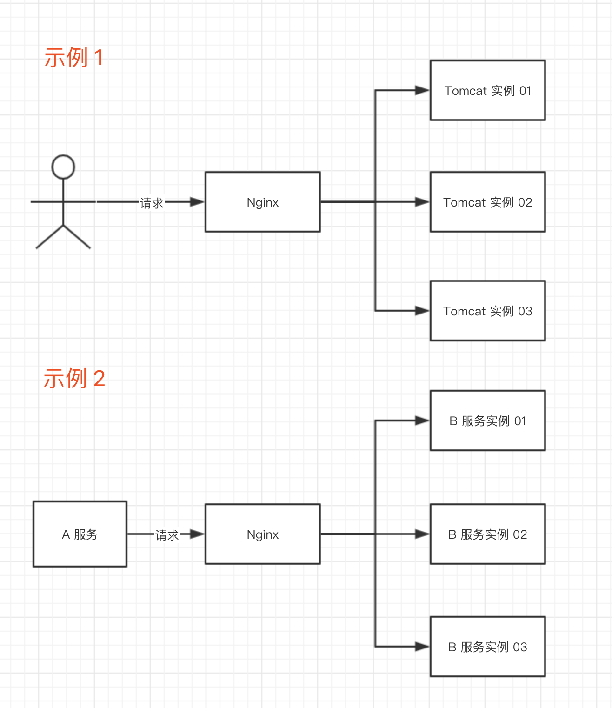

客户端级别的负载均衡，客户端通过**内嵌**的“代理”，将请求转发到后端的多个服务。比较常见的有 Dubbo、Ribbon 框架提供的负载均衡功能，如下图所示：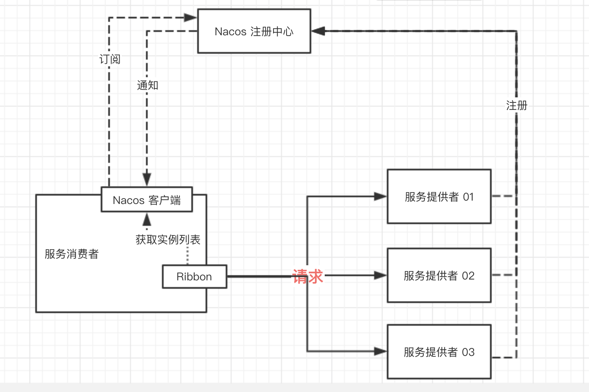

相比来说，客户端级别的负载均衡可以有**更好的性能**，因为不需要多经过一层代理服务器。并且，服务端级别的负载均衡需要额外考虑代理服务的高可用，以及请求量较大时的负载压力。因此，在微服务场景下，一般采用客户端级别的负载均衡为主。

对于客户端的负载均衡来说，最好搭配注册中心一起使用。这样，服务实例的启动和关闭，可以向注册中心发起注册和取消注册，保证能够动态的通知到客户端。

本文，我们会使用 Ribbon 提供客户端级别的负载均衡，使用 Nacos 作为注册中心。整体架构图如下：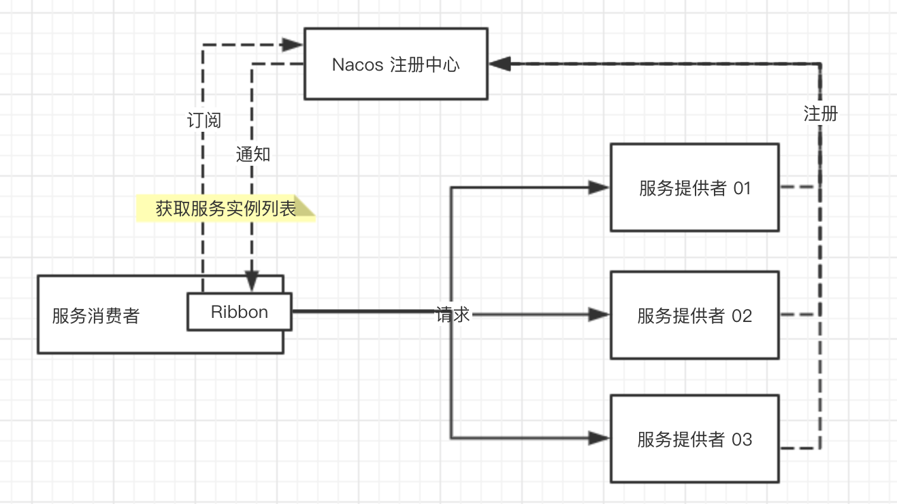

> 友情提示：如果对 Nacos 不了解的胖友，需要先前置阅读[《芋道 Spring Cloud Alibaba 注册中心 Nacos 入门》](http://www.iocoder.cn/Spring-Cloud-Alibaba/Nacos-Discovery/?self)文章。

## 3. 快速入门

> 示例代码对应仓库：
>
> - 服务提供者：[`labx-02-scn-ribbon-demo01-provider`](https://github.com/YunaiV/SpringBoot-Labs/blob/master/labx-02-spring-cloud-netflix-ribbon/labx-02-scn-ribbon-demo01-provider/)
> - 服务消费者：[`labx-02-scn-ribbon-demo01-consumer`](https://github.com/YunaiV/SpringBoot-Labs/blob/master/labx-02-spring-cloud-netflix-ribbon/labx-02-scn-ribbon-demo01-consumer/)

本小节，我们来搭建一个 Spring Cloud Netflix Ribbon 组件的快速入门示例。步骤如下：

- 首先，搭建一个服务提供者 `demo-provider`，启动 2 个实例，注册服务到 Nacos 中。
- 然后，搭建一个服务消费者 `demo-consumer`，使用 Ribbon 进行负载均衡，调用服务提供者 `demo-provider` 的 HTTP 接口。

### 3.1 搭建服务提供者

创建 [`labx-02-scn-ribbon-demo01-provider`](https://github.com/YunaiV/SpringBoot-Labs/blob/master/labx-02-spring-cloud-netflix-ribbon/labx-02-scn-ribbon-demo01-provider/) 项目，作为服务提供者 `demo-provider`。最终项目代码如下图所示：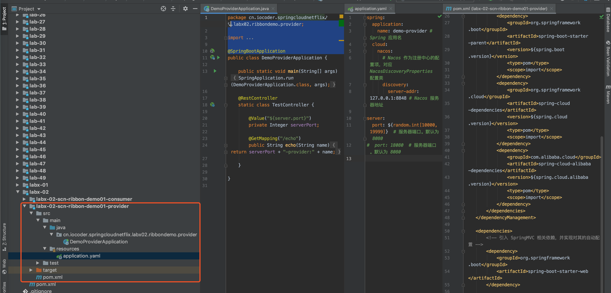

#### 3.1.1 引入依赖

在 [`pom.xml`](https://github.com/YunaiV/SpringBoot-Labs/blob/master/labx-02-spring-cloud-netflix-ribbon/labx-02-scn-ribbon-demo01-consumer/pom.xml) 文件中，主要引入 Spring Cloud **Nacos** Discovery 相关依赖。代码如下：


```
<?xml version="1.0" encoding="UTF-8"?>
<project xmlns="http://maven.apache.org/POM/4.0.0"
         xmlns:xsi="http://www.w3.org/2001/XMLSchema-instance"
         xsi:schemaLocation="http://maven.apache.org/POM/4.0.0 http://maven.apache.org/xsd/maven-4.0.0.xsd">
    <parent>
        <artifactId>labx-02</artifactId>
        <groupId>cn.iocoder.springboot.labs</groupId>
        <version>1.0-SNAPSHOT</version>
    </parent>
    <modelVersion>4.0.0</modelVersion>

    <artifactId>labx-02-scn-ribbon-demo01-consumer</artifactId>

    <properties>
        <spring.boot.version>2.2.4.RELEASE</spring.boot.version>
        <spring.cloud.version>Hoxton.SR1</spring.cloud.version>
        <spring.cloud.alibaba.version>2.2.0.RELEASE</spring.cloud.alibaba.version>
    </properties>

    <!--
        引入 Spring Boot、Spring Cloud、Spring Cloud Alibaba 三者 BOM 文件，进行依赖版本的管理，防止不兼容。
        在 https://dwz.cn/mcLIfNKt 文章中，Spring Cloud Alibaba 开发团队推荐了三者的依赖关系
     -->
    <dependencyManagement>
        <dependencies>
            <dependency>
                <groupId>org.springframework.boot</groupId>
                <artifactId>spring-boot-starter-parent</artifactId>
                <version>${spring.boot.version}</version>
                <type>pom</type>
                <scope>import</scope>
            </dependency>
            <dependency>
                <groupId>org.springframework.cloud</groupId>
                <artifactId>spring-cloud-dependencies</artifactId>
                <version>${spring.cloud.version}</version>
                <type>pom</type>
                <scope>import</scope>
            </dependency>
            <dependency>
                <groupId>com.alibaba.cloud</groupId>
                <artifactId>spring-cloud-alibaba-dependencies</artifactId>
                <version>${spring.cloud.alibaba.version}</version>
                <type>pom</type>
                <scope>import</scope>
            </dependency>
        </dependencies>
    </dependencyManagement>

    <dependencies>
        <!-- 引入 SpringMVC 相关依赖，并实现对其的自动配置 -->
        <dependency>
            <groupId>org.springframework.boot</groupId>
            <artifactId>spring-boot-starter-web</artifactId>
        </dependency>

        <!-- 引入 Spring Cloud Alibaba Nacos Discovery 相关依赖，将 Nacos 作为注册中心，并实现对其的自动配置 -->
        <dependency>
            <groupId>com.alibaba.cloud</groupId>
            <artifactId>spring-cloud-starter-alibaba-nacos-discovery</artifactId>
        </dependency>
    </dependencies>

</project>
```


- 具体每个依赖的作用，请看艿艿添加的注释。

#### 3.1.2 配置文件

创建 [`application.yaml`](https://github.com/YunaiV/SpringBoot-Labs/blob/master/labx-02-spring-cloud-netflix-ribbon/labx-02-scn-ribbon-demo01-provider/src/main/resources/application.yaml) 配置类，添加相应配置项。配置如下：


```
spring:
  application:
    name: demo-provider # Spring 应用名
  cloud:
    nacos:
      # Nacos 作为注册中心的配置项，对应 NacosDiscoveryProperties 配置类
      discovery:
        server-addr: 127.0.0.1:8848 # Nacos 服务器地址

server:
  port: ${random.int[10000,19999]}  # 服务器端口。默认为 8080
```


因为稍后我们会启动 2 个服务提供者的实例，所以我们设置 `server.port` 配置项为 10000 至 19999 之间随机。

#### 3.1.3 DemoProviderApplication

创建 [DemoProviderApplication](https://github.com/YunaiV/SpringBoot-Labs/blob/master/labx-02-spring-cloud-netflix-ribbon/labx-02-scn-ribbon-demo01-provider/src/main/java/cn/iocoder/springcloudnetflix/labx02/ribbondemo/provider/DemoProviderApplication.java) 类，创建应用启动类，并提供 HTTP 接口。代码如下：


```
@SpringBootApplication
public class DemoProviderApplication {

    public static void main(String[] args) {
        SpringApplication.run(DemoProviderApplication.class, args);
    }

    @RestController
    static class TestController {

        private Logger logger = LoggerFactory.getLogger(TestController.class);

        @Value("${server.port}")
        private Integer serverPort;

        @GetMapping("/echo")
        public String echo(String name) throws InterruptedException {
            // 模拟执行 100ms 时长。方便后续我们测试请求超时
            Thread.sleep(100L);

            // 记录被调用的日志
            logger.info("[echo][被调用啦 name({})]", name);

            return serverPort + "-provider:" + name;
        }

    }

}
```


TestController 提供的 `/echo` 接口，返回的结果会带有启动的服务器的端口。这样我们稍后在服务消费者使用 Ribbon 调用服务提供者时，从返回结果就知道调用的是哪个实例。

### 3.2 搭建服务消费者

创建 [`labx-02-scn-ribbon-demo01-consumer`](https://github.com/YunaiV/SpringBoot-Labs/blob/master/labx-02-spring-cloud-netflix-ribbon/labx-02-scn-ribbon-demo01-consumer/) 项目，作为服务提供者 `demo-consumer`。最终项目代码如下图所示：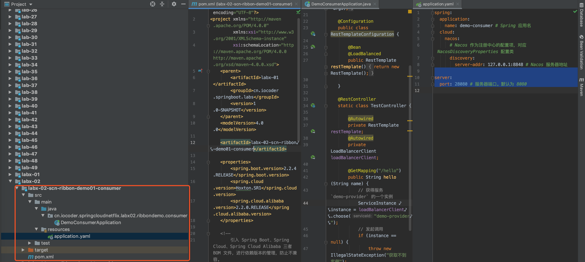

整个项目的代码，和服务提供者是基本一致的，毕竟是示例代码 😜

#### 3.2.1 引入依赖

在 [`pom.xml`](https://github.com/YunaiV/SpringBoot-Labs/blob/master/labx-02-spring-cloud-netflix-ribbon/labx-02-scn-ribbon-demo01-consumer/pom.xml) 文件中，主要引入 Spring Cloud **Nacos** Discovery + Spring Cloud Netflix **Ribbon** 相关依赖。代码如下：


```
<?xml version="1.0" encoding="UTF-8"?>
<project xmlns="http://maven.apache.org/POM/4.0.0"
         xmlns:xsi="http://www.w3.org/2001/XMLSchema-instance"
         xsi:schemaLocation="http://maven.apache.org/POM/4.0.0 http://maven.apache.org/xsd/maven-4.0.0.xsd">
    <parent>
        <artifactId>labx-02</artifactId>
        <groupId>cn.iocoder.springboot.labs</groupId>
        <version>1.0-SNAPSHOT</version>
    </parent>
    <modelVersion>4.0.0</modelVersion>

    <artifactId>labx-02-scn-ribbon-demo01-consumer</artifactId>

    <properties>
        <spring.boot.version>2.2.4.RELEASE</spring.boot.version>
        <spring.cloud.version>Hoxton.SR1</spring.cloud.version>
        <spring.cloud.alibaba.version>2.2.0.RELEASE</spring.cloud.alibaba.version>
    </properties>

    <!--
        引入 Spring Boot、Spring Cloud、Spring Cloud Alibaba 三者 BOM 文件，进行依赖版本的管理，防止不兼容。
        在 https://dwz.cn/mcLIfNKt 文章中，Spring Cloud Alibaba 开发团队推荐了三者的依赖关系
     -->
    <dependencyManagement>
        <dependencies>
            <dependency>
                <groupId>org.springframework.boot</groupId>
                <artifactId>spring-boot-starter-parent</artifactId>
                <version>${spring.boot.version}</version>
                <type>pom</type>
                <scope>import</scope>
            </dependency>
            <dependency>
                <groupId>org.springframework.cloud</groupId>
                <artifactId>spring-cloud-dependencies</artifactId>
                <version>${spring.cloud.version}</version>
                <type>pom</type>
                <scope>import</scope>
            </dependency>
            <dependency>
                <groupId>com.alibaba.cloud</groupId>
                <artifactId>spring-cloud-alibaba-dependencies</artifactId>
                <version>${spring.cloud.alibaba.version}</version>
                <type>pom</type>
                <scope>import</scope>
            </dependency>
        </dependencies>
    </dependencyManagement>

    <dependencies>
        <!-- 引入 SpringMVC 相关依赖，并实现对其的自动配置 -->
        <dependency>
            <groupId>org.springframework.boot</groupId>
            <artifactId>spring-boot-starter-web</artifactId>
        </dependency>

        <!-- 引入 Spring Cloud Alibaba Nacos Discovery 相关依赖，将 Nacos 作为注册中心，并实现对其的自动配置 -->
        <dependency>
            <groupId>com.alibaba.cloud</groupId>
            <artifactId>spring-cloud-starter-alibaba-nacos-discovery</artifactId>
        </dependency>
    </dependencies>

</project>
```


这里我们没有主动引入 [`spring-cloud-netflix-ribbon`](https://mvnrepository.com/artifact/org.springframework.cloud/spring-cloud-netflix-ribbon) 依赖，因为 `spring-cloud-starter-alibaba-nacos-discovery` 默认引入了它。如下图所示：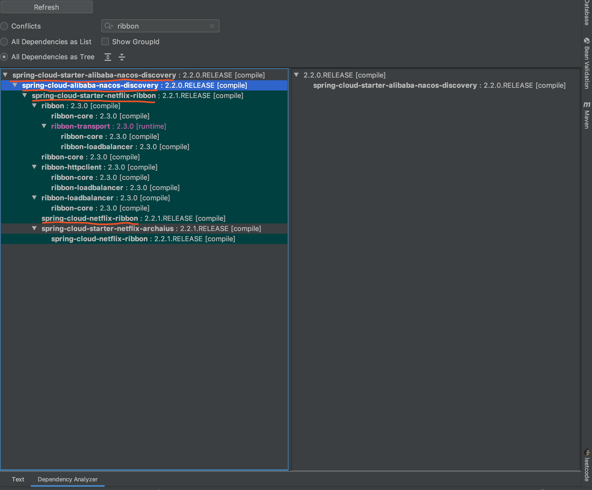

#### 3.2.2 配置文件

创建 [`application.yaml`](https://github.com/YunaiV/SpringBoot-Labs/blob/master/labx-02-spring-cloud-netflix-ribbon/labx-02-scn-ribbon-demo01-consumer/src/main/resources/application.yaml) 配置类，添加相应配置项。配置如下：


```
spring:
  application:
    name: demo-consumer # Spring 应用名
  cloud:
    nacos:
      # Nacos 作为注册中心的配置项，对应 NacosDiscoveryProperties 配置类
      discovery:
        server-addr: 127.0.0.1:8848 # Nacos 服务器地址

server:
  port: 28080 # 服务器端口。默认为 8080
```


- 和[「3.1.2 配置文件」](https://www.iocoder.cn/Spring-Cloud-Netflix/Ribbon/?self#)基本一致，主要是将配置项目 `spring.application.name` 修改为 `demo-consumer`。

#### 3.2.3 DemoConsumerApplication

创建 [DemoConsumerApplication](https://github.com/YunaiV/SpringBoot-Labs/blob/master/labx-02-spring-cloud-netflix-ribbon/labx-02-scn-ribbon-demo01-consumer/src/main/java/cn/iocoder/springcloudnetflix/labx02/ribbondemo/consumer/DemoConsumerApplication.java) 类，创建应用启动类，并提供一个调用服务提供者的 HTTP 接口。代码如下：


```
@SpringBootApplication
public class DemoConsumerApplication {

    public static void main(String[] args) {
        SpringApplication.run(DemoConsumerApplication.class, args);
    }

    @Configuration
    public class RestTemplateConfiguration {

        @Bean
        @LoadBalanced
        public RestTemplate restTemplate() {
            return new RestTemplate();
        }

    }

    @RestController
    static class TestController {

        @Autowired
        private RestTemplate restTemplate;
        @Autowired
        private LoadBalancerClient loadBalancerClient;

        @GetMapping("/hello")
        public String hello(String name) {
            // 获得服务 `demo-provider` 的一个实例
            ServiceInstance instance = loadBalancerClient.choose("demo-provider");
            // 发起调用
            String targetUrl = instance.getUri() + "/echo?name=" + name;
            String response = restTemplate.getForObject(targetUrl, String.class);
            // 返回结果
            return "consumer:" + response;
        }

        @GetMapping("/hello02")
        public String hello02(String name) {
            // 直接使用 RestTemplate 调用服务 `demo-provider`
            String targetUrl = "http://demo-provider/echo?name=" + name;
            String response = restTemplate.getForObject(targetUrl, String.class);
            // 返回结果
            return "consumer:" + response;
        }

    }

}
```


① [`@LoadBalanced`](https://github.com/spring-cloud/spring-cloud-commons/blob/master/spring-cloud-commons/src/main/java/org/springframework/cloud/client/loadbalancer/LoadBalanced.java) 注解，声明 RestTemplate Bean 被配置使用 Spring Cloud LoadBalancerClient（负载均衡客户端），实现在请求目标服务时，能够进行负载均衡。

> FROM [`@LoadBalanced`](https://github.com/spring-cloud/spring-cloud-commons/blob/master/spring-cloud-commons/src/main/java/org/springframework/cloud/client/loadbalancer/LoadBalanced.java) 注解的类注释
>
> Annotation to mark a RestTemplate bean to be configured to use a LoadBalancerClient.

我们把 `@LoadBalanced` 注解，添加在 RestTemplateConfiguration 创建的 RestTemplate Bean 上，最终效果如下图：

② TestController 提供了 `/hello` 和 `/hello02` 接口，都用于调用服务提供者的 `/demo` 接口。代码略微有几行，我们来稍微解释下哈。

`loadBalancerClient` 属性，[LoadBalancerClient](https://github.com/spring-cloud/spring-cloud-commons/blob/master/spring-cloud-commons/src/main/java/org/springframework/cloud/client/loadbalancer/LoadBalancerClient.java) 对象，负载均衡客户端。稍后我们会使用它，从 Nacos 获取的服务 `demo-provider` 的实例列表中，选择一个进行 HTTP 调用。

> 拓展小知识：在 Spring Cloud Common 项目中，定义了[LoadBalancerClient](https://github.com/spring-cloud/spring-cloud-commons/blob/master/spring-cloud-commons/src/main/java/org/springframework/cloud/client/loadbalancer/LoadBalancerClient.java) 接口，作为通用的负载均衡客户端，提供从指定服务中选择一个实例、对指定服务发起请求等 API 方法。而想要集成到 Spring Cloud 体系的负载均衡的组件，需要提供对应的 LoadBalancerClient 实现类。
>
> 例如说，Spring Cloud Netflix Ribbon 提供了 [RibbonLoadBalancerClient](https://github.com/spring-cloud/spring-cloud-netflix/blob/2.2.x/spring-cloud-netflix-ribbon/src/main/java/org/springframework/cloud/netflix/ribbon/RibbonLoadBalancerClient.java) 实现。
>
> 如此，所有需要使用到的地方，只需要获取到 DiscoveryClient 客户端，而无需关注具体实现，保证其通用性。😈 不过貌似 Spring Cloud 体系中，暂时只有 Ribbon 一个负载均衡组件。
>
> 当然，LoadBalancerClient 的服务的实例列表，是来自 DiscoveryClient 提供的。

`/hello` 接口，使用 LoadBalancerClient 先选择服务 `demo-provider` 的一个实例，在使用 RestTemplate 调用服务 `demo-provider` 的 `/demo` 接口。不过要注意，这里执行会报如下异常：


```
java.lang.IllegalStateException: No instances available for 10.171.1.115
```


- 因为我们这里创建的 RestTemplate Bean 是添加了 `@LoadBalanced` 注解，它会把传入的 `"10.171.1.115"` 当做一个服务，显然是找不到对应的服务实例，所以会报 IllegalStateException 异常。
- 解决办法也非常简单，再声明一个未使用 `@LoadBalanced` 注解的 RestTemplate Bean 即可，并使用它发起请求。

`/hello02` 接口，直接使用 RestTemplate 调用服务 `demo-provider`，代码精简了。这里要注意，在使用 `@LoadBalanced` 注解的 RestTemplate Bean 发起 HTTP 请求时，需要将原本准备传入的 `host:port` 修改成服务名，例如这里我们传入了 `demo-provider`。

虽然 `/hello02` 接口相比 `/hello` 接口只精简了一行代码，但是它带来的不仅仅是表面所看到的。例如说，如果我们调用服务的一个实例失败时，想要重试另外一个示例，就存在了很大的差异。

- `/hello02` 接口的方式，可以**自动**通过 LoadBalancerClient 重新选择一个该服务的实例，再次发起调用。
- `/hello` 接口的方式，需要自己**手动**写逻辑，使用 LoadBalancerClient 重新选择一个该服务的实例，后交给 RestTemplate 再发起调用。

稍后我们在[「9. 请求重试」](https://www.iocoder.cn/Spring-Cloud-Netflix/Ribbon/?self#)小节，就会提供接口重试的示例。

### 3.3 简单测试

① 通过 DemoProviderApplication 启动 2 次，启动服务提供者的 2 个实例。因为 IDEA 默认同一个程序只允许启动 1 次，所以我们需要配置 DemoProviderApplication 为 `Allow parallel run`。如下图所示：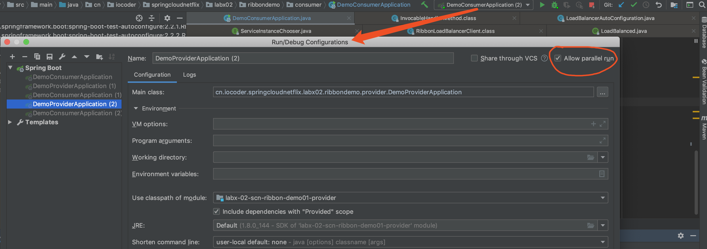

打开 Nacos 控制台，可以在服务列表看到服务 `demo-consumer` 有 2 个实例。如下图：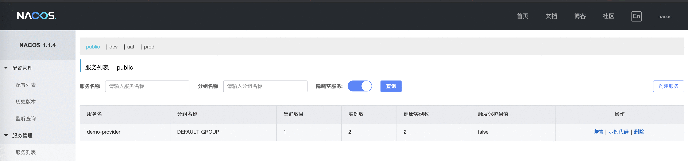

② 通过 DemoConsumerApplication 启动服务消费者。

访问服务**消费者**的 <http://127.0.0.1:28080/hello02?name=yudaoyuanma> 接口 6 次，返回结果如下：


```
consumer:10239-provider:123
consumer:14648-provider:123

consumer:10239-provider:123
consumer:14648-provider:123

consumer:10239-provider:123
consumer:14648-provider:123
```


在默认配置下，Ribbon 采用 [ZoneAvoidanceRule](https://github.com/Netflix/ribbon/blob/master/ribbon-loadbalancer/src/main/java/com/netflix/loadbalancer/ZoneAvoidanceRule.java) 负载均衡策略，在未配置所在区域的情况下，和**轮询**负载均衡策略是相对等价的。所以服务消费者 `demo-consumer` 调用服务提供者 `demo-provider` 时，顺序将请求分配给每个实例。

## 4. 负载均衡规则

Ribbon 内置了 7 种负载均衡规则，如下图所示：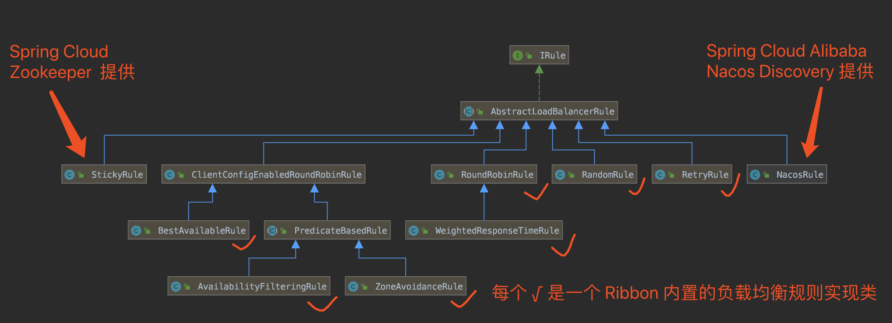

每个发负载均衡规则说明如下：

> FROM [《深入理解 RPC 之集群篇》](http://www.iocoder.cn/RPC/laoxu/rpc-cluster/?self)

| 策略名                    | 策略描述                                                     | 实现说明                                                     |
| :------------------------ | :----------------------------------------------------------- | :----------------------------------------------------------- |
| RandomRule                | **随机**选择一个 server                                      | 在 index 上随机，选择 index 对应位置的 Server                |
| RoundRobinRule            | **轮询**选择 server                                          | 轮询 index，选择 index 对应位置的 server                     |
| ZoneAvoidanceRule         | 复合判断 server 所在**区域的性能**和 server 的**可用性**选择 server | 使用 ZoneAvoidancePredicate 和 AvailabilityPredicate 来判断是否选择某个 server。ZoneAvoidancePredicate 判断判定一个 zone 的运行性能是否可用，剔除不可用的 zone（的所有 server）；AvailabilityPredicate 用于过滤掉连接数过多的 server。 |
| BestAvailableRule         | 选择一个**最小并发请求**的 server                            | 逐个考察 server，如果 server 被 tripped 了则忽略，在选择其中activeRequestsCount 最小的 server |
| AvailabilityFilteringRule | 过滤掉那些因为一直**连接失败**的被标记为 circuit tripped 的后端 server，并过滤掉那些**高并发**的的后端 server（activeConnections 超过配置的阈值） | 使用一个 AvailabilityPredicate 来包含过滤 server 的逻辑，其实就就是检查 status 里记录的各个 server 的运行状态 |
| WeightedResponseTimeRule  | 根据 server 的**响应时间**分配一个 **weight**，响应时间越长，weight 越小，被选中的可能性越低 | 一个后台线程定期的从 status 里面读取评价响应时间，为每个 server 计算一个 weight。weight 的计算也比较简单，responseTime 减去每个 server 自己平均的 responseTime 是 server 的权重。当刚开始运行，没有形成 status 时，使用 RoundRobinRule 策略选择 server。 |
| RetryRule                 | 对选定的负载均衡策略机上**重试**机制                         | 在一个配置时间段内当选择 server 不成功，则一直尝试使用 subRule 的方式选择一个可用的 server |

默认情况下，Ribbon 采用 ZoneAvoidanceRule 规则。因为大多数公司是单机房，所以一般只有一个 zone，而 ZoneAvoidanceRule 在仅有一个 zone 的情况下，会退化成轮询的选择方式，所以会和 RoundRobinRule 规则类似。

不同框架或者组件，会采用不同的负载均衡规则，感兴趣的胖友可以阅读如下文章：

- Nginx：[《Nginx 负载均衡配置》](http://www.iocoder.cn/Fight/Nginx-load-balancing-configuration/?self) 或 [《Nginx 负载均衡的 5 种策略》](http://www.iocoder.cn/Fight/Five-strategies-for-Nginx-load-balancing/?self)
- Dubbo：[《Dubbo 官方文档 —— 负载均衡》](http://dubbo.apache.org/zh-cn/docs/user/demos/loadbalance.html)
- Motan：[《Dubbo 官方文档 —— 用户指南（负载均衡）》](https://github.com/weibocom/motan/wiki/zh_userguide#负载均衡)
- SOFARPC：[《SOFARPC 官方文档 —— 负载均衡》](https://www.sofastack.tech/projects/sofa-rpc/load-balance/)

总的来说，经典的负载均衡规则可以整理如下：

- 轮询（Round Robin） or 加权轮询（Weighted Round Robin）
- 随机（Random） or 加权随机（Weighted Random）
- 源地址哈希（Hash） or 一致性哈希（ConsistentHash）
- 最少连接数（Least Connections）
- 最小响应时间（ResponseTime）

## 5. 自定义 Ribbon 配置

本小节，我们来学习如何对 Ribbon 进行自定义配置。例如说，不再使用默认的负载均衡规则 ZoneAvoidanceRule，而是使用**随机**负载均衡规则 RandomRule。

在自定义 Ribbon 配置的时候，会有**全局**和**客户端**两种级别。相比来说，**客户端**级别是更细粒度的配置。针对每个服务，Spring Cloud Netflix Ribbon 会创建一个 Ribbon 客户端，并且使用**服务名**作为 **Ribbon 客户端的名字**。

实现 Ribbon 自定义配置，可以通过**配置文件**和 **Spring JavaConfig** 两种方式。

下面，让我们来搭建下具体的示例。注意，本小节的所有示例，都是从[「3.2 搭建服务消费者」](https://www.iocoder.cn/Spring-Cloud-Netflix/Ribbon/?self#)小节的 [`labx-02-scn-ribbon-demo01-consumer`](https://github.com/YunaiV/SpringBoot-Labs/blob/master/labx-02-spring-cloud-netflix-ribbon/labx-02-scn-ribbon-demo01-consumer/) 项目，复制出一个项目，然后在将其配置，修改使用**随机**负载均衡规则 RandomRule。

### 5.1 配置文件方式

> 示例代码对应仓库：
>
> - 服务提供者：[`labx-02-scn-ribbon-demo01-provider`](https://github.com/YunaiV/SpringBoot-Labs/blob/master/labx-02-spring-cloud-netflix-ribbon/labx-02-scn-ribbon-demo01-provider/)
> - 服务消费者：[`labx-02-scn-ribbon-demo02A-consumer`](https://github.com/YunaiV/SpringBoot-Labs/blob/master/labx-02-spring-cloud-netflix-ribbon/labx-02-scn-ribbon-demo02A-consumer/)

本小节，我们使用**配置文件**的方式，实现 Ribbon **客户端级别**的自定义配置。注意，是**客户端级别**噢。

> 旁白君：暂时没有找到配置文件的方式，实现 Ribbon **全局**级别的自定义配置。搜了官方文档，也暂时没找到，目前猜测 Spring Cloud Netflix Ribbon 暂时没有提供。

#### 5.1.1 复制项目

复制出 [`labx-02-scn-ribbon-demo02A-consumer`](https://github.com/YunaiV/SpringBoot-Labs/blob/master/labx-02-spring-cloud-netflix-ribbon/labx-02-scn-ribbon-demo02A-consumer/) 项目，进行修改。

#### 5.1.2 配置文件

通过在配置文件中，添加 `{clientName}.ribbon.{key}={value}` 配置项，设置**指定名字**的 Ribbon 客户端的**指定属性**的**值**。如此，我们就可以实现 Ribbon 客户端级别的自定义配置。

修改 [`application.yaml`](https://github.com/YunaiV/SpringBoot-Labs/blob/master/labx-02-spring-cloud-netflix-ribbon/labx-02-scn-ribbon-demo02A-consumer/src/main/resources/application.yaml) 配置文件，额外添加如下配置：


```
demo-provider:
  ribbon:
    NFLoadBalancerRuleClassName: com.netflix.loadbalancer.RandomRule # 负载均衡规则全类名
```


- 通过 `demo-provider.ribbon.NFLoadBalancerRuleClassName` 配置项，设置名字为 `user-provider` 的 Ribbon 客户端的负载均衡规则为**随机**负载均衡规则 RandomRule。

更多 Ribbon 配置项的 KEY，可以查看 [CommonClientConfigKey](https://github.com/Netflix/ribbon/blob/master/ribbon-core/src/main/java/com/netflix/client/config/CommonClientConfigKey.java) 类。

#### 5.1.3 简单测试

① 通过[「3.1 搭建服务提供者」](https://www.iocoder.cn/Spring-Cloud-Netflix/Ribbon/?self#)小节的 DemoProviderApplication 启动 2 次，启动服务提供者的 2 个实例。

② 通过 DemoConsumerApplication 启动服务消费者。

访问服务**消费者**的 <http://127.0.0.1:28080/hello02?name=yudaoyuanma> 接口 10 次，返回结果如下：


```
consumer:10239-provider:123
consumer:10239-provider:123
consumer:14648-provider:123
consumer:14648-provider:123
consumer:10239-provider:123
consumer:14648-provider:123
consumer:14648-provider:123
consumer:14648-provider:123
consumer:14648-provider:123
```


从返回的结果看来，是有点随机负载均衡规则的味道。如果胖友想要进一步验证，可以在 RandomRule 类上添加断点，进行调试。

### 5.2 Spring JavaConfig 方式

> 示例代码对应仓库：
>
> - 服务提供者：[`labx-02-scn-ribbon-demo01-provider`](https://github.com/YunaiV/SpringBoot-Labs/blob/master/labx-02-spring-cloud-netflix-ribbon/labx-02-scn-ribbon-demo01-provider/)
> - 服务消费者：[`labx-02-sca-nacos-discovery-demo02B-consumer`](https://github.com/YunaiV/SpringBoot-Labs/blob/master/labx-02-spring-cloud-netflix-ribbon/labx-02-scn-ribbon-demo02B-consumer/)

本小节，我们使用 **Spring JavaConfig** 的方式，实现 Ribbon **全局**和 **客户端**两种级别的自定义配置。

#### 5.2.1 复制项目

复制出 [`labx-02-sca-nacos-discovery-demo02B-consumer`](https://github.com/YunaiV/SpringBoot-Labs/blob/master/labx-02-spring-cloud-netflix-ribbon/labx-02-scn-ribbon-demo02B-consumer/) 项目，进行修改。最终项目如下图所示：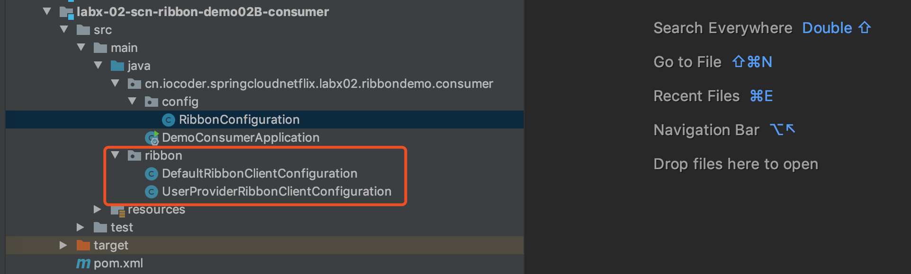

#### 5.2.2 RibbonConfiguration

创建 [RibbonConfiguration](https://github.com/YunaiV/SpringBoot-Labs/blob/master/labx-02-spring-cloud-netflix-ribbon/labx-02-scn-ribbon-demo02B-consumer/src/main/java/cn/iocoder/springcloudnetflix/labx02/ribbondemo/consumer/config/RibbonConfiguration.java)、[DefaultRibbonClientConfiguration](https://github.com/YunaiV/SpringBoot-Labs/blob/master/labx-02-spring-cloud-netflix-ribbon/labx-02-scn-ribbon-demo02B-consumer/src/main/java/ribbon/DefaultRibbonClientConfiguration.java)、[UserProviderRibbonClientConfiguration](https://github.com/YunaiV/SpringBoot-Labs/blob/master/labx-02-spring-cloud-netflix-ribbon/labx-02-scn-ribbon-demo02B-consumer/src/main/java/ribbon/UserProviderRibbonClientConfiguration.java) 三个配置类，实现 Ribbon 自定义配置。代码如下：


```
// RibbonConfiguration.java
@Configuration
@RibbonClients(
        value = {
                @RibbonClient(name = "demo-provider", configuration = UserProviderRibbonClientConfiguration.class) // 客户端级别的配置
        },
        defaultConfiguration = DefaultRibbonClientConfiguration.class // 全局配置
)
public class RibbonConfiguration {
}

// DefaultRibbonClientConfiguration.java
@Configuration
public class DefaultRibbonClientConfiguration {

    @Bean
    public IRule ribbonDefaultRule() {
        return new RoundRobinRule();
    }

}

// UserProviderRibbonClientConfiguration.java
@Configuration
public class UserProviderRibbonClientConfiguration {

    @Bean
    @Primary
    public IRule ribbonCustomRule() {
        return new RandomRule();
    }

}
```


① 对于 DefaultRibbonClientConfiguration 和 UserProviderRibbonClientConfiguration 两个配置类，我们并没有和 DemoConsumerApplication 启动类放在**一个包路径**下。

因为，Spring Boot 项目默认扫描 DemoConsumerApplication **所在包以及子包**下的所有 Bean 们。而 `@Configuration` 注解也是一种 Bean，也会被扫描到。

如果将 DefaultRibbonClientConfiguration 和 UserProviderRibbonClientConfiguration 放在 DemoConsumerApplication **所在包或子包**中，将会被 Spring Boot 所扫描到，导致整个项目的 Ribbon 客户端都使用相同的 Ribbon 配置，就**无法到达 Ribbon 客户端级别的自定义配置的目的**。

因此，这里在根路径下又创建了 [`ribbon`](https://github.com/YunaiV/SpringBoot-Labs/blob/master/labx-02-spring-cloud-netflix-ribbon/labx-02-scn-ribbon-demo02B-consumer/src/main/java/ribbon/) 包，并将 DefaultRibbonClientConfiguration、UserProviderRibbonClientConfiguration 放入其中，避免被 Spring Boot 所扫描到。

② `@RibbonClients` 注解，通过 `defaultConfiguration` 属性声明 Ribbon **全局**级别的自定义配置，通过 `value` 属性声明多个 Ribbon **客户端**级别的自定义配置。

具体的自定义配置，通过创建 Spring 配置类，例如说 DefaultRibbonClientConfiguration 和 UserProviderRibbonClientConfiguration。

③ `@RibbonClient` 注解，声明一个 Ribbon **客户端**级别的自定义配置，其中 `name` 属性用于设置 Ribbon 客户端的**名字**。

为了避免多个 Ribbon 客户端级别的配置类创建的 Bean 之间互相冲突，Spring Cloud Netflix Ribbon 通过 [SpringClientFactory](https://github.com/wojesen/spring-cloud-netflix/blob/master/spring-cloud-netflix-core/src/main/java/org/springframework/cloud/netflix/ribbon/SpringClientFactory.java) 类，**为每一个 Ribbon 客户端创建一个 Spring 子上下文**。

不过这里要注意，因为 DefaultRibbonClientConfiguration 和 UserProviderRibbonClientConfiguration 都创建了 IRule Bean，而 DefaultRibbonClientConfiguration 是在 Spring **父上下文**生效，会和 UserProviderRibbonClientConfiguration 所在的 Spring **子上下文**共享。这样就导致从 Spring 获取 IRule Bean 时，存在**两个**而不知道选择哪一个。因此，我们声明 UserProviderRibbonClientConfiguration 创建的 IRule Bean 为 `@Primary`，优先使用它。

> 友情提示：这里会有一点点绕，胖友好好理解哈~

#### 5.2.3 简单测试

① 通过[「3.1 搭建服务提供者」](https://www.iocoder.cn/Spring-Cloud-Netflix/Ribbon/?self#)小节的 DemoProviderApplication 启动 2 次，启动服务提供者的 2 个实例。

② 通过 DemoConsumerApplication 启动服务消费者。

访问服务**消费者**的 <http://127.0.0.1:28080/hello02?name=yudaoyuanma> 接口 10 次，返回结果如下：


```
consumer:14648-provider:123
consumer:10239-provider:123
consumer:10239-provider:123
consumer:14648-provider:123
consumer:10239-provider:123
consumer:10239-provider:123
consumer:14648-provider:123
consumer:10239-provider:123
consumer:10239-provider:123
consumer:10239-provider:123
```


从返回的结果看来，是有点随机负载均衡规则的味道。如果胖友想要进一步验证，可以在 RandomRule 类上添加断点，进行调试。

如果胖友想测试**全局级别**的自定配置的效果，可以将 RibbonConfiguration 配置类上的 `@RibbonClients` 直接去掉。

### 5.3 实践建议

- 对于 Ribbon **客户端**级别的自定义配置，推荐使用配置文件的方式，简单方便好管理。在配置文件的方式无法满足的情况下，使用 Spring JavaConfig 的方式作为补充。不过绝大多数场景下，都基本不需要哈~
- 对于 Ribbon **全局**级别的自定义配置，暂时只能使用 Spring JavaConfig 的方式
- 配置文件方式的**优先级**高于 Spring JavaConfig 方式，客户端级别的**优先级**高于全局级别

## 6. Nacos 自定义负载均衡规则

> 示例代码对应仓库：
>
> - 服务提供者：[`labx-02-scn-ribbon-demo01-provider`](https://github.com/YunaiV/SpringBoot-Labs/blob/master/labx-02-spring-cloud-netflix-ribbon/labx-02-scn-ribbon-demo01-provider/)
> - 服务消费者：[`labx-02-scn-ribbon-demo03-consumer`](https://github.com/YunaiV/SpringBoot-Labs/blob/master/labx-02-spring-cloud-netflix-ribbon/labx-02-scn-ribbon-demo03-consumer/pom.xml)

在[「4. 负载均衡规则」](https://www.iocoder.cn/Spring-Cloud-Netflix/Ribbon/?self#)小节中，我们看到 Ribbon 内置提供的 7 种负载均衡规则。如果我们想要自定义 Ribbon 负载均衡规则，可以通过实现 [IRule](https://github.com/Netflix/ribbon/blob/master/ribbon-loadbalancer/src/main/java/com/netflix/loadbalancer/IRule.java) 接口或者继承 [AbstractLoadBalancerRule](https://github.com/Netflix/ribbon/blob/304e38cf765a1d09ec950502ac62437a05c7eab4/ribbon-loadbalancer/src/main/java/com/netflix/loadbalancer/AbstractLoadBalancerRule.java) 来实现。

在 [Spring Cloud Alibaba Nacos Discovery](https://github.com/alibaba/spring-cloud-alibaba/tree/master/spring-cloud-alibaba-nacos-discovery) 组件，在和 Ribbon 集成时，提供了自定义负载均衡规则 [NacosRule](https://github.com/alibaba/spring-cloud-alibaba/blob/master/spring-cloud-alibaba-nacos-discovery/src/main/java/com/alibaba/cloud/nacos/ribbon/NacosRule.java)。规则如下：

- 第一步，获得**健康**的方服务实例列表
- 第二步，优先选择**相同 Nacos 集群**的服务实例列表，保证**高性能**。如果选择不到，则允许使用其它 Nacos 集群的服务实例列表，保证**高可用**
- 第三步，从服务实例列表按照**权重**进行**随机**，选择一个服务实例返回

NacosRule 源码如下：


```
public class NacosRule extends AbstractLoadBalancerRule { // 继承 AbstractLoadBalancerRule 抽象类

	private static final Logger LOGGER = LoggerFactory.getLogger(NacosRule.class);

	@Autowired
	private NacosDiscoveryProperties nacosDiscoveryProperties;

	@Override
	public Server choose(Object key) {
		try {
			String clusterName = this.nacosDiscoveryProperties.getClusterName();
			DynamicServerListLoadBalancer loadBalancer = (DynamicServerListLoadBalancer) getLoadBalancer();
			String name = loadBalancer.getName();

			// 第一步，获得健康的方服务实例列表
			NamingService namingService = nacosDiscoveryProperties
					.namingServiceInstance();
			List<Instance> instances = namingService.selectInstances(name, true);
			if (CollectionUtils.isEmpty(instances)) {
				LOGGER.warn("no instance in service {}", name);
				return null;
			}

			// 第二步，优先获得相同集群的服务实例
			List<Instance> instancesToChoose = instances;
			if (StringUtils.isNotBlank(clusterName)) {
			    // 优先选择相同 Nacos 集群的服务实例列表，保证高性能
				List<Instance> sameClusterInstances = instances.stream()
						.filter(instance -> Objects.equals(clusterName,
								instance.getClusterName()))
						.collect(Collectors.toList());
				if (!CollectionUtils.isEmpty(sameClusterInstances)) {
					instancesToChoose = sameClusterInstances;
                // 如果选择不到，则允许使用其它 Nacos 集群的服务实例列表，保证高可用
				} else {
					LOGGER.warn("A cross-cluster call occurs，name = {}, clusterName = {}, instance = {}", name, clusterName, instances);
				}
			}

			// 第三步，从服务实例列表按照权重进行随机，选择一个服务实例返回
			Instance instance = ExtendBalancer.getHostByRandomWeight2(instancesToChoose);

			// 返回
			return new NacosServer(instance);
		} catch (Exception e) {
			LOGGER.warn("NacosRule error", e);
			return null;
		}
	}

	@Override
	public void initWithNiwsConfig(IClientConfig iClientConfig) {
	}

}
```


- 胖友可以根据艿艿的注释，自己理解一下噢。

> 拓展小知识：如果我们想要实现类似 [Dubbo 多版本](http://dubbo.apache.org/zh-cn/docs/user/demos/multi-versions.html) 的功能，应该怎么实现呢？步骤如下：
>
> - 首先，通过 Nacos 元数据，在服务注册到 Nacos 时，将服务的版本号一起带上。
> - 然后，自定义 Ribbon 负载均衡规则 VersionRule，实现基于服务版本号来筛选服务实例。
> - 最后，使用 Ribbon 客户端级别的自定义配置，设置每个服务的负载均衡规则为 VersionRule，并配置调用的服务的版本号。

下面，让我们来搭建下 NacosRule 的使用示例。

### 6.1 复制项目

从[「3.2 搭建服务消费者」](https://www.iocoder.cn/Spring-Cloud-Netflix/Ribbon/?self#)小节的 [`labx-02-scn-ribbon-demo01-consumer`](https://github.com/YunaiV/SpringBoot-Labs/blob/master/labx-02-spring-cloud-netflix-ribbon/labx-02-scn-ribbon-demo01-consumer/) 项目，复制出 [`labx-02-scn-ribbon-demo03-consumer`](https://github.com/YunaiV/SpringBoot-Labs/blob/master/labx-02-spring-cloud-netflix-ribbon/labx-02-scn-ribbon-demo03-consumer/pom.xml) 项目。然后在其上进行修改，方便搭建~

### 6.2 配置文件

修改 [`application.yaml`](https://github.com/YunaiV/SpringBoot-Labs/blob/master/labx-02-spring-cloud-netflix-ribbon/labx-02-scn-ribbon-demo03-consumer/src/main/resources/application.yaml) 配置文件，额外添加如下配置：


```
demo-provider:
  ribbon:
    NFLoadBalancerRuleClassName: com.alibaba.cloud.nacos.ribbon.NacosRule
```


- 通过 `demo-provider.ribbon.NFLoadBalancerRuleClassName` 配置项，设置名字为 `user-provider` 的 Ribbon 客户端的负载均衡规则为 Nacos 自定义负载均衡规则 NacosRule。

### 6.3 简单测试

① 通过[「3.1 搭建服务提供者」](https://www.iocoder.cn/Spring-Cloud-Netflix/Ribbon/?self#)小节的 DemoProviderApplication 启动 2 次，启动服务提供者的 2 个实例。

② 在 Nacos 控制台中，修改服务的某个实例的权重为 **0**。如下图所示：

因为在服务实例的权重为 0 时，负载均衡规则 NacosRule 在随机实例时，是不会选择该实例的。

> 友情提示：通过配置文件中的 `spring.cloud.nacos.discovery.weight` 配置项，也可以实现修改服务实例的权重。

③ 通过 DemoConsumerApplication 启动服务消费者。

访问服务**消费者**的 <http://127.0.0.1:28080/hello02?name=yudaoyuanma> 接口 10 次，返回结果如下：


```
consumer:19270-provider:123
consumer:19270-provider:123
consumer:19270-provider:123
consumer:19270-provider:123
consumer:19270-provider:123
consumer:19270-provider:123
consumer:19270-provider:123
consumer:19270-provider:123
consumer:19270-provider:123
consumer:19270-provider:123
```


从返回的结果看来，是有点 NacosRule 的味道。如果胖友想要进一步验证，可以在 NacosRule 类上添加断点，进行调试。

## 7. 饥饿加载

> 示例代码对应仓库：
>
> - 服务提供者：[`labx-02-scn-ribbon-demo01-provider`](https://github.com/YunaiV/SpringBoot-Labs/blob/master/labx-02-spring-cloud-netflix-ribbon/labx-02-scn-ribbon-demo01-provider/)
> - 服务消费者：[`labx-02-scn-ribbon-demo04-consumer`](https://github.com/YunaiV/SpringBoot-Labs/blob/master/labx-02-spring-cloud-netflix-ribbon/labx-02-scn-ribbon-demo04-consumer/pom.xml)

默认配置下，Ribbon 客户端是在**首次**请求服务时，才创建该服务的对应的 Ribbon 客户端。

**好处**是项目在启动的时候，能够更加快速，因为 Ribbon 客户端创建时，需要从注册中心获取服务的实例列表，需要有网络请求的消耗。

**坏处**是首次请求服务时，因为需要 Ribbon 客户端的创建，会导致请求比较慢，严重情况下会导致请求超时。

因此，Spring Cloud Netflix Ribbon 提供了 `ribbon.eager-load` 配置项，允许我们在项目启动时，**提前**创建 Ribbon 客户端。翻译成中文就是**“饥饿加载”**。

下面，让我们来搭建下饥饿加载的使用示例。

### 7.1 复制项目

从[「3.2 搭建服务消费者」](https://www.iocoder.cn/Spring-Cloud-Netflix/Ribbon/?self#)小节的 [`labx-02-scn-ribbon-demo01-consumer`](https://github.com/YunaiV/SpringBoot-Labs/blob/master/labx-02-spring-cloud-netflix-ribbon/labx-02-scn-ribbon-demo01-consumer/) 项目，复制出 [`labx-02-scn-ribbon-demo04-consumer`](https://github.com/YunaiV/SpringBoot-Labs/blob/master/labx-02-spring-cloud-netflix-ribbon/labx-02-scn-ribbon-demo04-consumer/) 项目。然后在其上进行修改，方便搭建~

### 7.2 配置文件

修改 [`application.yaml`](https://github.com/YunaiV/SpringBoot-Labs/blob/master/labx-02-spring-cloud-netflix-ribbon/labx-02-scn-ribbon-demo04-consumer/src/main/resources/application.yaml) 配置文件，额外添加如下配置：


```
ribbon:
  # Ribbon 饥饿加载配置项，对应 RibbonEagerLoadProperties 配置类
  eager-load:
    enabled: true # 是否开启饥饿加载。默认为 false 不开启
    clients: user-provider # 开启饥饿加载的 Ribbon 客户端名字。如果有多个，使用 , 逗号分隔。
```


每个配置项目的说明，胖友自己看下注释噢。

### 7.3 简单测试

① 通过[「3.1 搭建服务提供者」](https://www.iocoder.cn/Spring-Cloud-Netflix/Ribbon/?self#)小节的 DemoProviderApplication 启动 2 次，启动服务提供者的 2 个实例。

② 通过 DemoConsumerApplication 启动服务消费者。可以看到 IDEA 控制台多输出了如下日志：


```
2020-02-09 11:38:54.833  INFO 40004 --- [           main] c.netflix.config.ChainedDynamicProperty  : Flipping property: user-provider.ribbon.ActiveConnectionsLimit to use NEXT property: niws.loadbalancer.availabilityFilteringRule.activeConnectionsLimit = 2147483647
2020-02-09 11:38:54.858  INFO 40004 --- [           main] c.netflix.loadbalancer.BaseLoadBalancer  : Client: user-provider instantiated a LoadBalancer: DynamicServerListLoadBalancer:{NFLoadBalancer:name=user-provider,current list of Servers=[],Load balancer stats=Zone stats: {},Server stats: []}ServerList:null
2020-02-09 11:38:54.863  INFO 40004 --- [           main] c.n.l.DynamicServerListLoadBalancer      : Using serverListUpdater PollingServerListUpdater
2020-02-09 11:38:54.876  INFO 40004 --- [           main] c.n.l.DynamicServerListLoadBalancer      : DynamicServerListLoadBalancer for client user-provider initialized: DynamicServerListLoadBalancer:{NFLoadBalancer:name=user-provider,current list of Servers=[],Load balancer stats=Zone stats: {},Server stats: []}ServerList:com.alibaba.cloud.nacos.ribbon.NacosServerList@6629643d
```


- 可以看到服务 `demo-provider` 对应的 Ribbon 客户端已经初始化完毕。

**首次**访问服务**消费者**的 <http://127.0.0.1:28080/hello02?name=yudaoyuanma> 接口，是不是感觉变快了。嘿嘿，用心感受~

### 7.4 小结

- 在本地开发环境时，可能会频繁重启项目，为了项目启动更快，可以考虑关闭 Ribbon 饥饿加载。
- 在生产环境下，一定要开启 Ribbon 饥饿加载。

## 8. HTTP 客户端

> 示例代码对应仓库：
>
> - 服务提供者：[`labx-02-scn-ribbon-demo01-provider`](https://github.com/YunaiV/SpringBoot-Labs/blob/master/labx-02-spring-cloud-netflix-ribbon/labx-02-scn-ribbon-demo01-provider/)
> - 服务消费者：[`labx-02-scn-ribbon-demo05-consumer`](https://github.com/YunaiV/SpringBoot-Labs/blob/master/labx-02-spring-cloud-netflix-ribbon/labx-02-scn-ribbon-demo05-consumer/pom.xml)

在上述的示例中，Ribbon **只负责**服务实例的选择，提供负载均衡的功能，而服务的 HTTP 调用则是交给 RestTemplate 来完成。实际上，Ribbon 也是提供 HTTP 调用功能的。

在 Spring Cloud Netflix Ribbon 中，提供了 3 种 HTTP 客户端。配置方式如下：


```
#ribbon:
#  okhttp:
#    enabled: true # 设置使用 OkHttp，对应 OkHttpRibbonConfiguration 配置类
#  restclient:
#    enabled: true # 设置使用 Jersey Client，对应 RestClientRibbonConfiguration 配置类
#  httpclient:
#    enabled: true # 设置使用 Apache HttpClient，对应 HttpClientRibbonConfiguration 配置类
```


整理表格如下：

| 配置项                     | HTTP 组件                                               | 配置类                                                       |
| :------------------------- | :------------------------------------------------------ | :----------------------------------------------------------- |
| `ribbon.okhttp.enable`     | [OkHttp](https://square.github.io/okhttp/)              | [OkHttpRibbonConfiguration](https://github.com/ykkxdu/spring-cloud-netflix/blob/master/spring-cloud-netflix-core/src/main/java/org/springframework/cloud/netflix/ribbon/okhttp/OkHttpRibbonConfiguration.java) |
| `ribbon.restclient.enable` | [Jersey](https://eclipse-ee4j.github.io/jersey/) Client | [RestClientRibbonConfiguration](https://github.com/ykkxdu/spring-cloud-netflix/blob/master/spring-cloud-netflix-core/src/main/java/org/springframework/cloud/netflix/ribbon/apache/HttpClientRibbonConfiguration.java) |
| `ribbon.httpclient.enable` | [Apache HttpClient](https://hc.apache.org/)             | [HttpClientRibbonConfiguration](https://github.com/ykkxdu/spring-cloud-netflix/blob/master/spring-cloud-netflix-core/src/main/java/org/springframework/cloud/netflix/ribbon/apache/HttpClientRibbonConfiguration.java) |

下面，让我们来搭建下使用 Jersey Client 的使用示例。

> 友情提示：配置 `ribbon.okhttp.enable = true` 或 `ribbon.httpclient.enable = true` 的两种情况，一直没有生效，具体原因还在寻找~
>
> 因此，这里我们搭建略微冷门的 Jersey Client 的使用示例。

### 8.1 复制项目

从[「3.2 搭建服务消费者」](https://www.iocoder.cn/Spring-Cloud-Netflix/Ribbon/?self#)小节的 [`labx-02-scn-ribbon-demo01-consumer`](https://github.com/YunaiV/SpringBoot-Labs/blob/master/labx-02-spring-cloud-netflix-ribbon/labx-02-scn-ribbon-demo01-consumer/) 项目，复制出 [`labx-02-scn-ribbon-demo05-consumer`](https://github.com/YunaiV/SpringBoot-Labs/blob/master/labx-02-spring-cloud-netflix-ribbon/labx-02-scn-ribbon-demo05-consumer/) 项目。然后在其上进行修改，方便搭建~

### 8.2 配置文件

修改 [`application.yaml`](https://github.com/YunaiV/SpringBoot-Labs/blob/master/labx-02-spring-cloud-netflix-ribbon/labx-02-scn-ribbon-demo05-consumer/src/main/resources/application.yaml) 配置文件，额外添加如下配置：


```
ribbon:
#  okhttp:
#    enabled: true # 设置使用 OkHttp，对应 OkHttpRibbonConfiguration 配置类
  restclient:
    enabled: true # 设置使用 Jersey Client，对应 RestClientRibbonConfiguration 配置类
#  httpclient:
#    enabled: true # 设置使用 Apache HttpClient，对应 HttpClientRibbonConfiguration 配置类
```


### 8.3 简单测试

① 通过[「3.1 搭建服务提供者」](https://www.iocoder.cn/Spring-Cloud-Netflix/Ribbon/?self#)小节的 DemoProviderApplication 启动，启动服务提供者的实例。

② 通过 DemoConsumerApplication 启动服务消费者。

在 RestClient 类的 `#execute(...)` 方法上，打一个断点，用于验证我们配置成功。如下图所示：[RestClient 断点](http://www.iocoder.cn/images/Spring-Cloud-Netflix/2019-03-01/51.png)

访问服务**消费者**的 <http://127.0.0.1:28080/hello02?name=yudaoyuanma> 接口，成功进入 RestClient 的断点，说明配置成功。

## 9. 请求重试

> 示例代码对应仓库：
>
> - 服务提供者：[`labx-02-scn-ribbon-demo01-provider`](https://github.com/YunaiV/SpringBoot-Labs/blob/master/labx-02-spring-cloud-netflix-ribbon/labx-02-scn-ribbon-demo01-provider/)
> - 服务消费者：[`labx-02-scn-ribbon-demo06-consumer`](https://github.com/YunaiV/SpringBoot-Labs/blob/master/labx-02-spring-cloud-netflix-ribbon/labx-02-scn-ribbon-demo06-consumer/pom.xml)

一般情况下，我们在 HTTP 请求远程服务时，都能够正常返回。但是极端情况下，可能会存在请求失败的情况下，例如说：

- 请求的服务执行逻辑过久，导致超过请求的等待时间
- 请求的服务异常挂掉了，未从注册中心中移除，导致服务消费者还是会调用该服务
- 网络一个抖动，导致请求失败

此时，我们通过重试请求到当前服务实例或者其它服务实例，以获得请求的结果，实现更高的可用性。

在 Spring Cloud 中，提供 `spring.cloud.loadbalancer.retry` 配置项，通过设置为 `true`，开启负载均衡的重试功能。

下面，让我们来搭建下请求重试的使用示例。

### 9.1 复制项目

从[「3.2 搭建服务消费者」](https://www.iocoder.cn/Spring-Cloud-Netflix/Ribbon/?self#)小节的 [`labx-02-scn-ribbon-demo01-consumer`](https://github.com/YunaiV/SpringBoot-Labs/blob/master/labx-02-spring-cloud-netflix-ribbon/labx-02-scn-ribbon-demo01-consumer/)) 项目，复制出 [`labx-02-scn-ribbon-demo06-consumer`](https://github.com/YunaiV/SpringBoot-Labs/blob/master/labx-02-spring-cloud-netflix-ribbon/labx-02-scn-ribbon-demo06-consumer/) 项目。然后在其上进行修改，方便搭建~

### 9.2 配置文件

修改 [`application.yaml`](https://github.com/YunaiV/SpringBoot-Labs/blob/master/labx-02-spring-cloud-netflix-ribbon/labx-02-scn-ribbon-demo06-consumer/src/main/resources/application.yaml) 配置文件，额外添加如下配置：


```
ribbon:
  restclient:
    enabled: true # 设置使用 Jersey Client，对应 RestClientRibbonConfiguration 配置类

demo-provider:
  ribbon:
    ConnectTimeout: 1000 # 请求的连接超时时间，单位：毫秒。默认为 1000
    ReadTimeout: 1 # 请求的读取超时时间，单位：毫秒。默认为 1000
    OkToRetryOnAllOperations: true # 是否对所有操作都进行重试，默认为 false。
    MaxAutoRetries: 0 # 对当前服务的重试次数，默认为 0 次。
    MaxAutoRetriesNextServer: 1 # 重新选择服务实例的次数，默认为 1 次。注意，不包含第 1 次哈。
```


① 设置 `ribbon.restclient.enable` 配置项为 `true`，因为我们通过 Ribbon 实现请求重试，所以需要使用 Ribbon 内置的 HTTP 客户端进行请求服务。

② `ConnectTimeout` 和 `ReadTimeout` 两个配置项，用于设置请求的连接和超时时间。

这里，我们设置 `ReadTimeout` 配置项为 1，用于模拟请求服务超时，从而演示请求重试的效果。

③ `OkToRetryOnAllOperations`、`MaxAutoRetries`、`MaxAutoRetriesNextServer` 三个配置项，设置请求重试相关的参数。具体每个参数的解释，看下配置文件中的注释哈。

`MaxAutoRetries` 和 `MaxAutoRetriesNextServer` 两个配置项可能略微难以理解，艿艿再简单描述下。

- 第一步，在使用 Ribbon 选择一个服务实例后，如果请求失败，重试 `MaxAutoRetries` 请求直到成功。
- 第二步，如果经过 `1 + MaxAutoRetries` 次，请求一个服务实例还是失败，重新使用 Ribbon 选择一个新的服务实例，重复第一步的过程。最多可以重新选择 `MaxAutoRetriesNextServer` 次新的服务实例。

也就是说，在服务实例足够的情况下，最多会发起 `(1 + MaxAutoRetries) * (1 + MaxAutoRetriesNextServer)` 请求。不过一般情况下，推荐设置 `MaxAutoRetries` 为 0，不重试当前实例。

------

在 ② 和 ③ 中的参数，如果想要**全局**级别的配置，可以添加到 `ribbon` 配置项下。例如说：


```
ribbon:
    ConnectTimeout: 1000 # 请求的连接超时时间，单位：毫秒。默认为 1000
    ReadTimeout: 1 # 请求的读取超时时间，单位：毫秒。默认为 1000
    OkToRetryOnAllOperations: true # 是否对所有操作都进行重试，默认为 false。
    MaxAutoRetries: 0 # 对当前服务的重试次数，默认为 0 次。
    MaxAutoRetriesNextServer: 1 # 重新选择服务实例的次数，默认为 1 次。注意，不包含第 1 次哈。
```


### 9.3 简单测试

① 通过[「3.1 搭建服务提供者」](https://www.iocoder.cn/Spring-Cloud-Netflix/Ribbon/?self#)小节的 DemoProviderApplication 启动 2 次，启动服务提供者的 2 个实例。

② 通过 DemoConsumerApplication 启动服务消费者。

访问服务**消费者**的 <http://127.0.0.1:28080/hello02?name=yudaoyuanma> 接口，返回结果如下：


```
I/O error on GET request for "http://demo-provider/echo": com.netflix.client.ClientException: Number of retries on next server exceeded max 1 retries, while making a call for: 10.171.1.115:18229; nested exception is java.io.IOException: com.netflix.client.ClientException: Number of retries on next server exceeded max 1 retries, while making a call for: 10.171.1.115:18229
```


- 符合预期，多次重试后依然失败。

打开 DemoProviderApplication 控制台，可以看到两个服务都被调用的示例：


```
# demo-provider 实例 1
2020-02-09 17:56:02.517  INFO 53096 --- [io-19452-exec-1] p.DemoProviderApplication$TestController : [echo][被调用啦 name(123)]

# demo-provider 实例 2
2020-02-09 17:56:02.550  INFO 53102 --- [io-18229-exec-1] p.DemoProviderApplication$TestController : [echo][被调用啦 name(123)]
```


如果胖友对 `MaxAutoRetries` 和 `MaxAutoRetriesNextServer` 两个配置项还是有点迷糊，可以多做做测试哈~

## 10. Ribbon 主要组件

绝大多数情况下，我们并不需要去深入了解 Ribbon 的主要组件。所以本小节的内容，更多作为拓展知识，胖友可以根据自己的需要进行阅读。

Spring Cloud Netflix Ribbon 提供的 [RibbonClientConfiguration](https://github.com/wojesen/spring-cloud-netflix/blob/master/spring-cloud-netflix-core/src/main/java/org/springframework/cloud/netflix/ribbon/RibbonClientConfiguration.java) 自动配置类，默认创建了 Ribbon 的主要组件的 Bean。整理成如下表格：

> FROM [《Spring Cloud Netflix 官方文档 —— Customizing the Ribbon Client》](https://cloud.spring.io/spring-cloud-netflix/multi/multi_spring-cloud-ribbon.html#_customizing_the_ribbon_client)

| Bean Type           | Bean Name                 | Class Name                       |
| :------------------ | :------------------------ | :------------------------------- |
| `IClientConfig`     | `ribbonClientConfig`      | `DefaultClientConfigImpl`        |
| `IRule`             | `ribbonRule`              | `ZoneAvoidanceRule`              |
| `IPing`             | `ribbonPing`              | `DummyPing`                      |
| `ServerList`        | `ribbonServerList`        | `ConfigurationBasedServerList`   |
| `ServerListFilter`  | `ribbonServerListFilter`  | `ZonePreferenceServerListFilter` |
| `ServerListUpdater` | `ribbonServerListUpdater` | `PollingServerListUpdater`       |
| `ILoadBalancer`     | `ribbonLoadBalancer`      | `ZoneAwareLoadBalancer`          |

### 10.1 IClientConfig

[IClientConfig](https://github.com/Netflix/ribbon/blob/master/ribbon-core/src/main/java/com/netflix/client/config/IClientConfig.java) 接口，定义用于初始化 Ribbon 客户端和负载均衡器的**配置**的方法。简单来说，它就是负责读取 Ribbon 配置的。

IClientConfig 只有一个实现类 [DefaultClientConfigImpl](https://github.com/Netflix/ribbon/blob/2.x/ribbon-core/src/main/java/com/netflix/client/config/DefaultClientConfigImpl.java)。在该类中，我们可以看到 Ribbon 配置项的默认值。

10.2 IRule

[IRule](https://github.com/Netflix/ribbon/blob/2.x/ribbon-loadbalancer/src/main/java/com/netflix/loadbalancer/IRule.java) 接口，负载均衡规则接口，定义了从服务中**选择**一个实例的方法。

Ribbon 提供了 7 个 IRule 实现类，在[「5. 自定义 Ribbon 配置」](https://www.iocoder.cn/Spring-Cloud-Netflix/Ribbon/?self#)小节中已经看到。

可以通过实现 IRule 接口，实现自定义负载均衡规则，可见[「6. Nacos 自定义负载均衡规则」](https://www.iocoder.cn/Spring-Cloud-Netflix/Ribbon/?self#)小节。

### 10.3 IPing

[IPing](https://github.com/Netflix/ribbon/blob/master/ribbon-loadbalancer/src/main/java/com/netflix/loadbalancer/IPing.java) 接口，定义如何 “ping” 服务实例的方法，判断其是否存活。

Ribbon 提供了 4 个 IPing 实现类，如下图所示：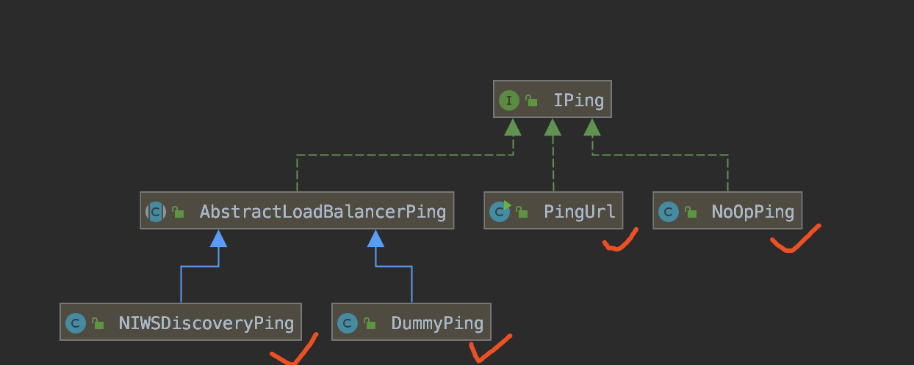

- [DummyPing](https://github.com/Netflix/ribbon/blob/master/ribbon-loadbalancer/src/main/java/com/netflix/loadbalancer/DummyPing.java)：默认实现类，永远返回 `true`，即认为服务实例永远存活。
- [NoOpPing](https://github.com/Netflix/ribbon/blob/master/ribbon-loadbalancer/src/main/java/com/netflix/loadbalancer/NoOpPing.java)：不对服务实例进行“ping”，永远返回 `true`，即认为服务实例永远存活。
- [PingUrl](https://github.com/Netflix/ribbon/blob/2.x/ribbon-httpclient/src/main/java/com/netflix/loadbalancer/PingUrl.java)：使用 Apache HttpClient 请求目标服务实例，通过判断响应状态码和状态结果，判断服务实例是否存活。
- [NIWSDiscoveryPing](https://github.com/Netflix/ribbon/blob/2.x/ribbon-eureka/src/main/java/com/netflix/niws/loadbalancer/NIWSDiscoveryPing.java)：不执行真实的“ping”，而是通过 Eureka 注册中心获得服务实例的状态是否为 `UP`，从而判断服务实例是否存活。

### 10.5 ServerList

[ServerList](https://github.com/Netflix/ribbon/blob/2.x/ribbon-loadbalancer/src/main/java/com/netflix/loadbalancer/ServerList.java) 接口，定义获得服务实例列表的方法。

ServerList 分成静态和**动态**的。如果是动态的，会有后台定时任务定时重新获取**最新的**服务实例列表。

Ribbon 提供了 4 个 ServerList 实现类，如下图所示：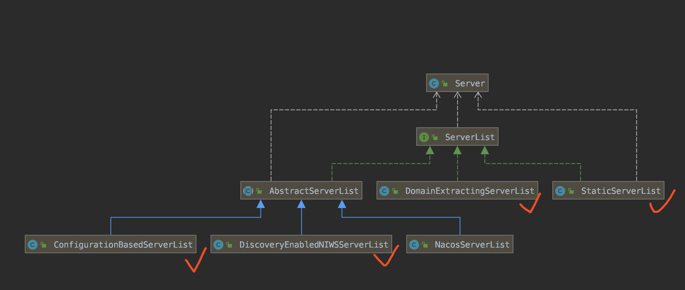

- [ConfigurationBasedServerList](https://github.com/Netflix/ribbon/blob/2.x/ribbon-loadbalancer/src/main/java/com/netflix/loadbalancer/ConfigurationBasedServerList.java)：从配置文件的 `listOfServers` 配置项中，获得服务实例列表。
- [DiscoveryEnabledNIWSServerList](https://github.com/Netflix/ribbon/blob/2.x/ribbon-eureka/src/main/java/com/netflix/niws/loadbalancer/DiscoveryEnabledNIWSServerList.java)：从 Eureka 注册中心获取服务实例列表。另外，DynamicServerListLoadBalancer 会定时调用它，获取**最新的**服务实例列表。
- [DomainExtractingServerList](https://github.com/ykkxdu/spring-cloud-netflix/blob/master/spring-cloud-netflix-eureka-client/src/main/java/org/springframework/cloud/netflix/ribbon/eureka/DomainExtractingServerList.java)：它在 DiscoveryEnabledNIWSServerList 的基础之上，提供区域（zone）信息。
- [StaticServerList](https://github.com/spring-cloud/spring-cloud-netflix/blob/2.2.x/spring-cloud-netflix-ribbon/src/main/java/org/springframework/cloud/netflix/ribbon/StaticServerList.java)：静态的服务实例列表。

Nacos 提供了自定义的 [NacosServerList](https://github.com/alibaba/spring-cloud-alibaba/blob/master/spring-cloud-alibaba-nacos-discovery/src/main/java/com/alibaba/cloud/nacos/ribbon/NacosServerList.java) 实现类，从 Nacos 注册中心获取服务实例列表。

### 10.6 ServerListFilter

[ServerListFilter](https://github.com/Netflix/ribbon/blob/2.x/ribbon-loadbalancer/src/main/java/com/netflix/loadbalancer/ServerListFilter.java) 接口，定义过滤不符合条件的服务实例的方法。

Ribbon 提供了 4 个 ServerListFilter 实现类，如下图所示：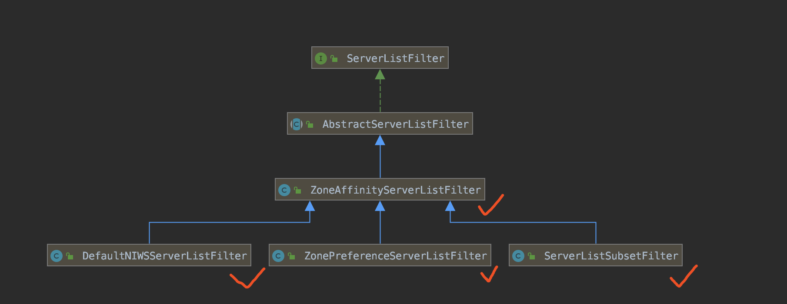

- [ZoneAffinityServerListFilter](https://github.com/Netflix/ribbon/blob/2.x/ribbon-loadbalancer/src/main/java/com/netflix/loadbalancer/ZoneAffinityServerListFilter.java)：过滤掉和当前客户端不同**区域（Zone）**的服务实例列表。如果过滤后结果为空，则不进行过滤，返回原服务实例列表。

- [ZonePreferenceServerListFilter](https://github.com/spring-cloud/spring-cloud-netflix/blob/2.2.x/spring-cloud-netflix-ribbon/src/main/java/org/springframework/cloud/netflix/ribbon/ZonePreferenceServerListFilter.java)：在 ZoneAffinityServerListFilter 的基础之上，允许手动设置区域（Zone），并使用该区域（Zone）进行过滤。如果过滤后结果为空，则不进行过滤，返回原服务实例列表。

- [DefaultNIWSServerListFilter](https://github.com/Netflix/ribbon/blob/2.x/ribbon-eureka/src/main/java/com/netflix/niws/loadbalancer/DefaultNIWSServerListFilter.java)：是 ZoneAffinityServerListFilter 的子类，无任何代码，也就是说和 ZoneAffinityServerListFilter 是等价的。

- [ServerListSubsetFilter](https://github.com/Netflix/ribbon/blob/2.x/ribbon-loadbalancer/src/main/java/com/netflix/loadbalancer/ServerListSubsetFilter.java)：筛选返回**固定数量**的服务实例列表。主要用于服务提供者数量过大，避免在连接池中保存过多的服务实例的连接。

  > This is useful if the server farm is large (e.g., in the hundreds) and making use of every one of them and keeping the connections in http client's connection pool is unnecessary. It also has the capability of eviction of relatively unhealthy servers by comparing the total network failures and concurrent connections.

### 10.7 ServerListUpdater

[ServerListUpdater](https://github.com/Netflix/ribbon/blob/304e38cf765a1d09ec950502ac62437a05c7eab4/ribbon-loadbalancer/src/main/java/com/netflix/loadbalancer/ServerListUpdater.java) 接口，ServerList 更新器，用于 DynamicServerListLoadBalancer 动态更新服务实例列表。

Ribbon 提供了 2 个 ServerListUpdater 实现类，如下图所示：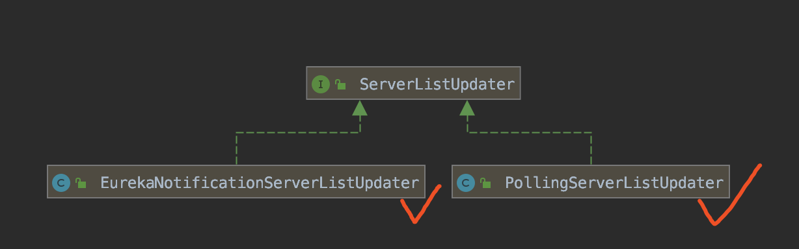

- [PollingServerListUpdater](https://github.com/Netflix/ribbon/blob/3275c24de888db1a61f6b0d13d1fb105597a7491/ribbon-loadbalancer/src/main/java/com/netflix/loadbalancer/PollingServerListUpdater.java)：启动一个定时任务，定时重新获取**最新的**服务实例列表。
- [EurekaNotificationServerListUpdater](https://github.com/Netflix/ribbon/blob/3275c24de8/ribbon-eureka/src/main/java/com/netflix/niws/loadbalancer/EurekaNotificationServerListUpdater.java)：监听 Eureka 事件，在收到 Eureka Client 本地服务实例列表的缓存刷新事件 CacheRefreshedEvent 时，通知 DynamicServerListLoadBalancer 更新方服务实例列表。

### 10.7 ILoadBalancer

[ILoadBalancer](https://github.com/Netflix/ribbon/blob/304e38cf76/ribbon-loadbalancer/src/main/java/com/netflix/loadbalancer/ILoadBalancer.java) 接口，Ribbon 作为负载均衡器的**入口**，定义了服务器实例的增删查和**选择**方法。

Ribbon 提供了 3 个 ILoadBalancer 实现类，如下图所示：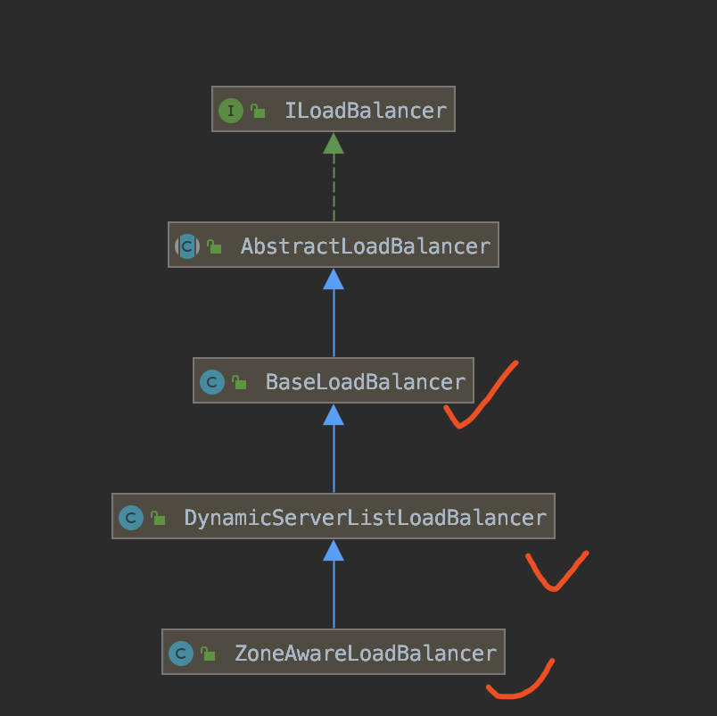

- [BaseLoadBalancer](https://github.com/Netflix/ribbon/blob/3275c24de8/ribbon-loadbalancer/src/main/java/com/netflix/loadbalancer/BaseLoadBalancer.java)：基础的 ILoadBalancer 实现类，支持**手动**进行服务器实例的增删查，支持使用 IRule 进行服务器实例的选择，支持使用 IPing 进行服务器实例的存活判断。
- [DynamicServerListLoadBalancer](https://github.com/Netflix/ribbon/blob/3275c24de8/ribbon-loadbalancer/src/main/java/com/netflix/loadbalancer/DynamicServerListLoadBalancer.java)：**动态的** ILoadBalancer 实现类，支持使用 ServerList + ServerListFilter + ServerListUpdater 进行服务器实例的**动态的**增删查。
- [ZoneAwareLoadBalancer](https://github.com/Netflix/ribbon/blob/3275c24de8/ribbon-loadbalancer/src/main/java/com/netflix/loadbalancer/ZoneAwareLoadBalancer.java)：在 DynamicServerListLoadBalancer 的基础之上，在选择服务器实例的时候，增加区域（Zone）的考虑。

## 666. 彩蛋

至此，我们已经完成 Spring Cloud Netflix Ribbon 的学习。如下是 Ribbon 相关的官方文档：

- [《Ribbon 官方文档》](https://github.com/Netflix/ribbon/wiki)
- [《Spring Cloud Netflix 中文文档 —— Ribbon》](https://www.docs4dev.com/docs/zh/spring-cloud/Edgware.SR5/reference/multi_spring-cloud-ribbon.html)

后续，胖友可以继续阅读* [《芋道 Spring Cloud 声明式调用 Feign 入门》](http://www.iocoder.cn/Spring-Cloud/Feign/?self)文章。