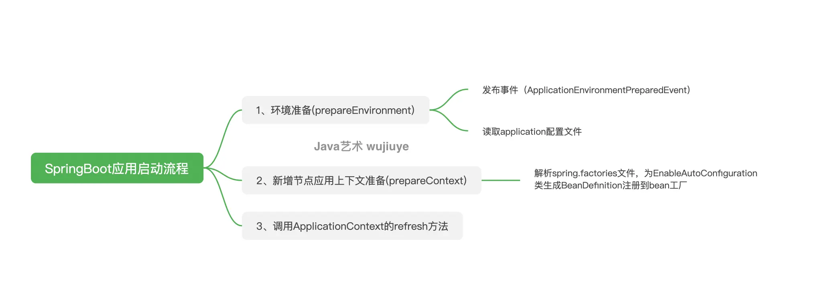
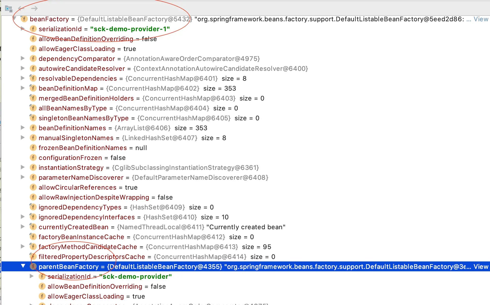
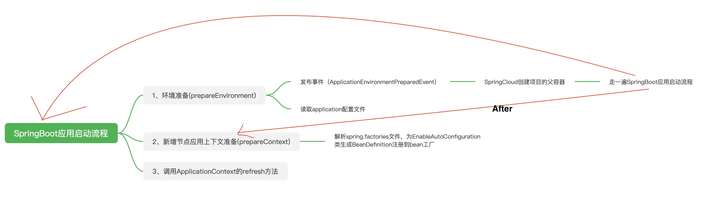

# Spring Boot与Spring Cloud应用启动流程

## SpringBoot应用启动流程

当我们在`Spring Boot`项目中调用`SpringApplication`的`run`方法启动应用时，`Spring Boot`应用启动流程粗粒度可划分为三个步骤。

第一步：准备环境`Environment`。此时会发送一个`ApplicationEnvironmentPreparedEvent`事件（应用环境准备事件），事件是同步消费的。当事件监听器都被调用完后，`Spring Boot`继续完成环境`Environment`的准备工作，加载`application.yaml`以及所有的`ActiveProfiles`对应的`application-[activeProfile].yaml`配置文件。

第二步：准备`ApplicationContext`容器。我们在`spring.factories`文件中配置的`EnableAutoConfiguration`就是在此时被读取的，并且根据配置的类名加载类，为类生成`BeanDefinition`注册到`bean`工厂中。

第三步：一切准备就绪后再刷新`ApplicationContext`。

`Spring Boot`启动流程如下图所示。

## Spring Cloud应用启动流程

`Spring Cloud`项目可以在`spring.factories`配置文件中配置一种`BootstrapConfiguration`类，这与`Spring Boot`提供的`EnableAutoConfiguration`类并没有什么区别，只是它们作用在不同的`ApplicationContext`容器中。

当项目中添加`Spring Cloud`的依赖时，`SpringApplication`的`run`方法启动的就会是两个容器，即两个`ApplicationContext`。原本的应用启动流程也有所变化。

`Spring Cloud`的`BootstrapApplicationListener`监听`ApplicationEnvironmentPreparedEvent`事件，在监听到事件时开启一个新的`ApplicationContext`容器，我们可以称这个`ApplicationContext`容器为`Spring Cloud`的`Bootstrap`容器。

`Bootstrap`容器被用来注册`spring.factories`配置文件中配置的所有`BootstrapConfiguration`，并在`Bootstrap`容器初始化完成后将其`Bean`工厂作为原本`Spring Boot`启动的`ApplicationContext`容器的`Bean`工厂的父工厂，如下图所示。

这个`Spring Cloud`层的`Bootstrap`容器似乎是`Spring Cloud`特定为实现动态配置量身定做的。

`Spring Cloud`的启动流程如下图所示。

- 当使用 Spring Cloud 组件（如 Nacos、Consul、Spring Cloud Config Server）时，Spring Cloud 会

  先创建一个 `Bootstrap Context`，用于：

  - 读取 `bootstrap.yml`
  - 连接远程配置中心，获取配置
  - 将这些配置注入到 `ApplicationContext`

- 这时，`main` 方法中的 `SpringApplication.run(...)` 不能直接继续启动 `ApplicationContext`，**它必须等待 `Bootstrap Context` 初始化完成**，因为应用的核心配置可能依赖远程配置。

`BootstrapApplicationListener`通过判断`Environment`中是否存在`bootstrap`这个`PropertySource`辨别当前容器是否是`Bootstrap`容器，以解决无限监听到`ApplicationEnvironmentPreparedEvent`事件启动新容器的问题。

