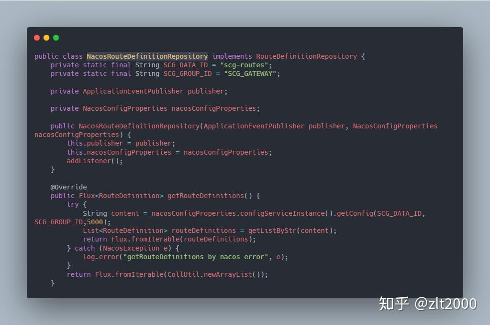
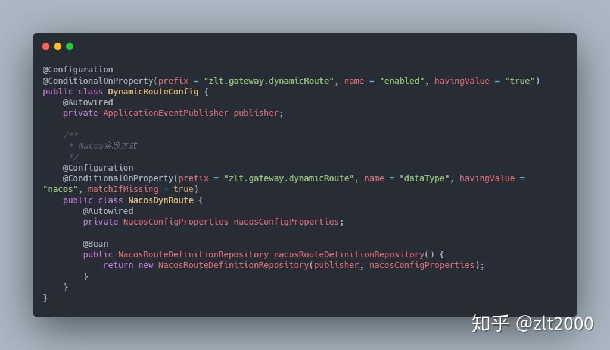
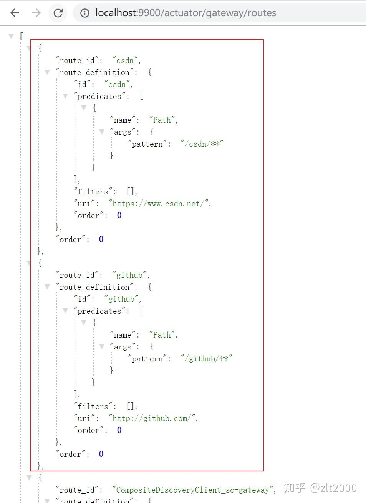

# Spring Cloud Gateway的动态路由怎样做？集成Nacos实现很简单


作者：zlt2000
链接：https://zhuanlan.zhihu.com/p/90679778
来源：知乎
著作权归作者所有。商业转载请联系作者获得授权，非商业转载请注明出处。


## 一、说明

网关的核心概念就是路由配置和路由规则，而作为所有请求流量的入口，在实际生产环境中为了保证高可靠和高可用，是尽量要避免重启的，所以实现动态路由是非常有必要的；本文主要介绍 `Spring Cloud Gateway` 实现的思路，并且以`Nacos`为数据源来讲解

**PS**：关于 `Spring Cloud Zuul` 的动态路由请看文章《[Spring Cloud Zuul的动态路由怎样做？集成Nacos实现很简单](https://link.zhihu.com/?target=https%3A//mp.weixin.qq.com/s/9fR-hgJ69R1iiYXiARMTLw)》

## 二、实现要点

要实现动态路由只需关注下面4个点

1. 网关启动时，`动态路由`的数据怎样加载进来
2. `静态路由`与`动态路由`以那个为准，ps：`静态路由`指的是配置文件里写死的路由配置
3. 监听`动态路由`的数据源变化
4. 数据有变化时怎样`通知gateway`刷新路由

## 三、具体实现

`Spring Cloud Gateway` 中加载路由信息分别由以下几个类负责

1. **PropertiesRouteDefinitionLocator**：从配置文件中读取路由信息(如YML、Properties等)
2. **RouteDefinitionRepository**：从存储器中读取路由信息(如内存、配置中心、Redis、MySQL等)
3. **DiscoveryClientRouteDefinitionLocator**：从注册中心中读取路由信息(如Nacos、Eurka、Zookeeper等)

  我们可以通过自定义 `RouteDefinitionRepository` 的实现类来实现动态路由的目的


### 3.1. 实现动态路由的数据加载

创建一个`Nacos`的`RouteDefinitionRepository`实现类

**NacosRouteDefinitionRepository类**可查看：[NacosRouteDefinitionRepository.java](https://link.zhihu.com/?target=https%3A//gitee.com/zlt2000/microservices-platform/blob/master/zlt-gateway/sc-gateway/src/main/java/com/central/gateway/route/NacosRouteDefinitionRepository.java)



> 重写 `getRouteDefinitions` 方法实现路由信息的读取


**配置Nacos监听器，监听路由配置信息的变化**


> 路由变化只需要往 `ApplicationEventPublisher` 推送一个 `RefreshRoutesEvent` 事件即刻，gateway会自动监听该事件并调用 `getRouteDefinitions` 方法更新路由信息


### 3.2. 创建配置类

**DynamicRouteConfig类**可查看：[DynamicRouteConfig.java](https://link.zhihu.com/?target=https%3A//gitee.com/zlt2000/microservices-platform/blob/master/zlt-gateway/sc-gateway/src/main/java/com/central/gateway/config/DynamicRouteConfig.java)




### 3.3. 添加`Nacos`路由配置


新增配置项：

- Data Id：scg-routes
- Group：SCG_GATEWAY
- 配置内容：

```json
[
        {
		"id": "csdn",
		"predicates": [{
			"name": "Path",
			"args": {
					"pattern": "/csdn/**"
			}
		}],
		"uri": "https://www.csdn.net/",
		"filters": []
	},
	{
		"id": "github",
		"predicates": [{
			"name": "Path",
			"args": {
					"pattern": "/github/**"
			}
		}],
		"uri": "http://github.com/",
		"filters": []
	}
]
```

>  添加两条路由数据

## 四、测试

启动网关通过 `/actuator/gateway/routes` 端点查看当前路由信息



> 可以看到 `Nacos` 里配置的两条路由信息


**完整的Spring Cloud Gateway代码请查看** 

[https://gitee.com/zlt2000/microservices-platform/tree/master/zlt-gateway/sc-gateway](https://link.zhihu.com/?target=https%3A//gitee.com/zlt2000/microservices-platform/tree/master/zlt-gateway/sc-gateway)