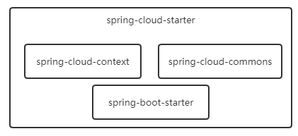

# SpringCloud依赖

## spring-cloud-dependencies和spring-cloud-alibaba-dependencies的区别

```xml
<dependency>
  <groupId>org.springframework.cloud</groupId>
   <artifactId>spring-cloud-dependencies</artifactId>
  <version>${spring-cloud.version}</version>
  <type>pom</type>
  <scope>import</scope>
</dependency>

<dependency>
  <groupId>com.alibaba.cloud</groupId>
   <artifactId>spring-cloud-alibaba-dependencies</artifactId>
   <version>${spring-cloud-alibaba.version}</version>
   <type>pom</type>
   <scope>import</scope>
</dependency>
```

● spring-cloud-dependencies是管理spring-cloud的相关组件的版本，确保组件之间的兼容性，该依赖是springloud提供的，用于管理Spring Cloud Netflix 系列组件（如 Eureka、Ribbon、Hystrix 等）的版本

● spring-cloud-alibaba-dependencies：管理spring-cloud的相关组件的版本，该依赖是阿里巴巴提供，用于管理 Spring Cloud Alibaba 系列组件（如 Nacos、Sentinel、Dubbo 等）的版本。


## 依赖差异

springcloud与springboot的版本有着一系列的对应关系，如果有兴趣可以去springcloud官方文档看看。引入版本时推荐使用spring-cloud-dependencies依赖管理包去管理引入的jar包，以防止jar包不兼容问题。

通过以下maven引入spring-cloud版本依赖管理，通过该jar包去管理其它的jar包信息。

```xml
<dependency>
    <groupId>org.springframework.cloud</groupId>
    <artifactId>spring-cloud-dependencies</artifactId>
    <version>Greenwich.SR3</version>
    <type>pom</type>
    <scope>import</scope>
</dependency>
```

 随后引入spring-cloud-starter，Greenwich.SR3引入的starter版本是2.1.3.RELEASE，spring-boot-starter版本是2.1.7.RELEASE。依赖引入：

```xml
<dependency>
    <groupId>org.springframework.cloud</groupId>
    <artifactId>spring-cloud-starter</artifactId>
</dependency>
```

 该包相比springboot的starter而言多了以下两个包：

- spring-cloud-context：用来引入spring-cloud的上下文及接入springboot的一系列插件，用以支持bootstrap文件的读取、上下文刷新等机制的引入；
- spring-cloud-commons：用于制定微服务中的服务注册、发现、负载均衡和熔断器等功能的抽象层代码。

  大致包示意图：



需要注意spring-cloud-starter包已经引入了spring-boot-starter包，因此程序可以不引入spring-boot-starter包。


## springcloud与springboot的关系

 在我看来springcloud就是基于springboot开发的面向于微服务注册发现的框架。它的基础功能很简单，就是提供微服务注册发现等功能的抽象代码，并提供相应的支持，但其内核还是springboot，当然，springboot的内核是spring。

因此与其把springcloud当成一个新框架不如把它当成是通过springboot的ApplicationListener事件发布机制扩展而来的插件，只是这个插件面向的是微服务。


## 依赖管理


###  spring-cloud-context

spring-cloud的基本功能也是通过spring.factories的SPI机制引入的，一共配置了以下三种类型：

1. EnableAutoConfiguration：springboot自带的，在进行扫描@Configuration时将会被Import进spring的容器中，并在后续的流程中进行加载装填；
2. ApplicationListener：springboot自带的，在SpringApplication调用run()方法时直接获取spring.factories文件中的所有ApplicationListener；
3. BootstrapConfiguration：springcloud新增的SPI机制接口，在springboot的ApplicationListener实现类BootstrapApplicationListener中装填，并通过Import机制引入SPI具体实现类。

接下来分别介绍一下其实现类的大致作用。


#### 自动注入类

​    下面是在spring.factories文件中EnableAutoConfiguration配置的具体实现类全路径名称：

```shell
# AutoConfiguration
org.springframework.boot.autoconfigure.EnableAutoConfiguration=\
org.springframework.cloud.autoconfigure.ConfigurationPropertiesRebinderAutoConfiguration,\
org.springframework.cloud.autoconfigure.LifecycleMvcEndpointAutoConfiguration,\
org.springframework.cloud.autoconfigure.RefreshAutoConfiguration,\
org.springframework.cloud.autoconfigure.RefreshEndpointAutoConfiguration,\
org.springframework.cloud.autoconfigure.WritableEnvironmentEndpointAutoConfiguration
```

 大致作用：

1. ConfigurationPropertiesRebinderAutoConfiguration：用于自动装填springcloud的重绑定类，用于在springcloud上下文刷新时重新绑定各个bean对象和属性；

2. LifecycleMvcEndpointAutoConfiguration：用于自动注入EnvironmentManager类；
3. RefreshAutoConfiguration：自动注入springcloud上下文刷新类，springcloud的RefreshScope和RefreshEventListener等刷新组建便是在这里面被注入的；
4. RefreshEndpointAutoConfiguration：用于注入刷新Endpoint切点的自动刷新注入类；
5. WritableEnvironmentEndpointAutoConfiguration：用于自动注入WritableEnvironmentEndpoint类；


#### springboot程序监听器

   ApplicationListener在spring.factories文件中的配置内容如下：

```csharp
# Application Listeners
org.springframework.context.ApplicationListener=\
org.springframework.cloud.bootstrap.BootstrapApplicationListener,\
org.springframework.cloud.bootstrap.LoggingSystemShutdownListener,\
org.springframework.cloud.context.restart.RestartListener
```

  大致作用：

1. BootstrapApplicationListener：用于引入springcloud上下文和springcloud自定义配置类，同时也负责生成springcloud上下文对象，并将其设置为springboot的父上下文，也可以通过属性配置这个类不进行加载；

2. LoggingSystemShutdownListener：负责清空前面设置过的Log日志信息，以避免后续的日志加载收到前面日志配置的影响；

3. RestartListener：保存spring的上下文，以便后续在有必要的时候重启上下文。

   


#### springcloud配置类

 通过前面ApplicationListener实现类BootstrapApplicationListener引入的springcloud的配置类，在spring.factories文件中配置如下：

```shell

# Bootstrap components
org.springframework.cloud.bootstrap.BootstrapConfiguration=\
org.springframework.cloud.bootstrap.config.PropertySourceBootstrapConfiguration,\
org.springframework.cloud.bootstrap.encrypt.EncryptionBootstrapConfiguration,\
org.springframework.cloud.autoconfigure.ConfigurationPropertiesRebinderAutoConfiguration,\
org.springframework.boot.autoconfigure.context.PropertyPlaceholderAutoConfiguration
```

大致作用：

1. PropertySourceBootstrapConfiguration：用于配置使用PropertySourceLocator接口的实现类，其作用便是根据Environment对象生成PropertySource对象，并最终保存在bootstrapProperties属性对象中；

2. EncryptionBootstrapConfiguration：用于配置对Environment对象中的属性进行加解密；

3. ConfigurationPropertiesRebinderAutoConfiguration：自动注入类，在前面的EnableAutoConfiguration配置项中已经有了，这里重新配置了一下，个人猜测的目的是用于重新绑定spring-cloud上下文，毕竟EnableAutoConfiguration中的配置是针对springboot上下文的；

4. PropertyPlaceholderAutoConfiguration：引入PropertySourcesPlaceholderConfigurer类，保证springcloud上下文可以使用通配符去替换值。

   

### spring-cloud-commons

        前面说过spring-cloud-commons包的主要用途便是提供微服务的注册发现等功能，因此该包基本上通过SPI实现的类提供的功能都是相关的。总共也有三种配置项：

EnableAutoConfiguration：自动注入类，springboot提供的SPI注入机制，用来自动注入微服务的相关配置类；
EnvironmentPostProcessor：环境对象准备完毕后执行类，springboot提供的SPI注入机制，用来对初始化后的环境对象进行后处理操作；
FailureAnalyzer：错误分析类，springboot提供的SPI注入机制，用来对SpringApplication启动流程中产生的异常进行分析处理。
        其中EnableAutoConfiguration有很多的配置项，而其它的则只有一个配置项，因此commons的自动注入类才是重点。


#### 自动注入类

 spring-cloud-commons最主要的SPI配置便是EnableAutoConfiguration，通过自动注入的方式来配置微服务发现注册等功能的抽象层对象，其它的两个SPI配置项倒显得不是那么重要。

下面是spring.factories文件中的配置：

```shell

# AutoConfiguration
org.springframework.boot.autoconfigure.EnableAutoConfiguration=\
org.springframework.cloud.client.CommonsClientAutoConfiguration,\
org.springframework.cloud.client.discovery.composite.CompositeDiscoveryClientAutoConfiguration,\
org.springframework.cloud.client.discovery.noop.NoopDiscoveryClientAutoConfiguration,\
org.springframework.cloud.client.discovery.simple.SimpleDiscoveryClientAutoConfiguration,\
org.springframework.cloud.client.hypermedia.CloudHypermediaAutoConfiguration,\
org.springframework.cloud.client.loadbalancer.AsyncLoadBalancerAutoConfiguration,\
org.springframework.cloud.client.loadbalancer.LoadBalancerAutoConfiguration,\
org.springframework.cloud.client.loadbalancer.reactive.ReactorLoadBalancerClientAutoConfiguration,\
org.springframework.cloud.client.loadbalancer.reactive.ReactiveLoadBalancerAutoConfiguration,\
org.springframework.cloud.client.serviceregistry.ServiceRegistryAutoConfiguration,\
org.springframework.cloud.commons.httpclient.HttpClientConfiguration,\
org.springframework.cloud.commons.util.UtilAutoConfiguration,\
org.springframework.cloud.configuration.CompatibilityVerifierAutoConfiguration,\
org.springframework.cloud.client.serviceregistry.AutoServiceRegistrationAutoConfiguration
```

可以看到相对于spring-cloud-context而言自动注入类的配置项是非常多的，而且从名字也可以看出来这是用来进行服务注册、发现及负载均衡相关的。大致作用：

1. CommonsClientAutoConfiguration：用来自动注册通用的客户端组件，如健康检查及Endpoint切点的组件对象；

2. CompositeDiscoveryClientAutoConfiguration：注册用来保存多种DiscoveryClient对象类型的对象CompositeDiscoveryClient；
3. NoopDiscoveryClientAutoConfiguration：注册一个实现了DiscoveryClient接口，用来代表基础机器信息NoopDiscoveryClient类型对象；
4. SimpleDiscoveryClientAutoConfiguration：注册SimpleDiscoveryProperties对象及相关的其它对象，在前面注册过的NoopDiscoveryClient基础上新增SimpleDiscoveryClient类型的对象；
5. CloudHypermediaAutoConfiguration：注册用来管理和刷新远程资源的相关对象；
6. AsyncLoadBalancerAutoConfiguration：注册Ribbon相关的异步负载均衡相关配置类；
7. LoadBalancerAutoConfiguration：注册Ribbon相关的同步负载均衡和重试机制相关配置类；
8. ReactorLoadBalancerClientAutoConfiguration：用来注册@LoadBalanced注解及ReactiveLoadBalancer等负载均衡类；
9. ReactiveLoadBalancerAutoConfiguration：为Reactor自动注入类的辅助类；
10. ServiceRegistryAutoConfiguration：自动注入服务注册切点相关类；
11. HttpClientConfiguration：自动注入http相关的实现类，支持okhttp和apache；
12. UtilAutoConfiguration：注册提供通用方法的类，如InetUtilsProperties和InetUtils；
13. CompatibilityVerifierAutoConfiguration：自动注入系统的校验类，如校验springboot版本和springcloud版本是否兼容的SpringBootVersionVerifier，以及可以保存其它校验类的可组合式CompositeCompatibilityVerifier；
14. AutoServiceRegistrationAutoConfiguration：自动发现服务注入类，用来校验自动注入相关功能是否正常执行，如果没有则抛异常。

 大致就上面十四个，都是大概的描述了其中的功能，里面用到了很多的@Autowired注解，因此如果程序后续注入了相关的实现类都会被注入，这也是为何把这个包称为springcloud微服务注册发现的抽象层，因为后续只要有相关的实现接入，便可以自动装填运行，方式比较新颖。


#### 环境对象后处理器

 spring.factories文件中对于EnvironmentPostProcessor选项只有一个实现配置类：

 HostInfoEnvironmentPostProcessor：用来在环境对象中生成springCloudClientHostInfo属性信息，这里面包括了本机器的IP地址和主机名称信息，用来提供机器的身份证明。


####  启动错误分析类

spring.factories对于FailureAnalyzer也只有一个实现配置类：

 CompatibilityNotMetFailureAnalyzer：用来组织程序发生错误时的输出内容。
