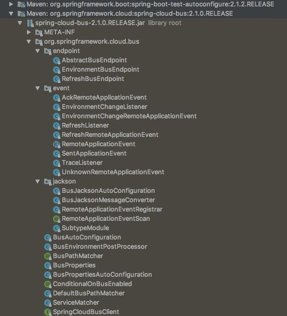
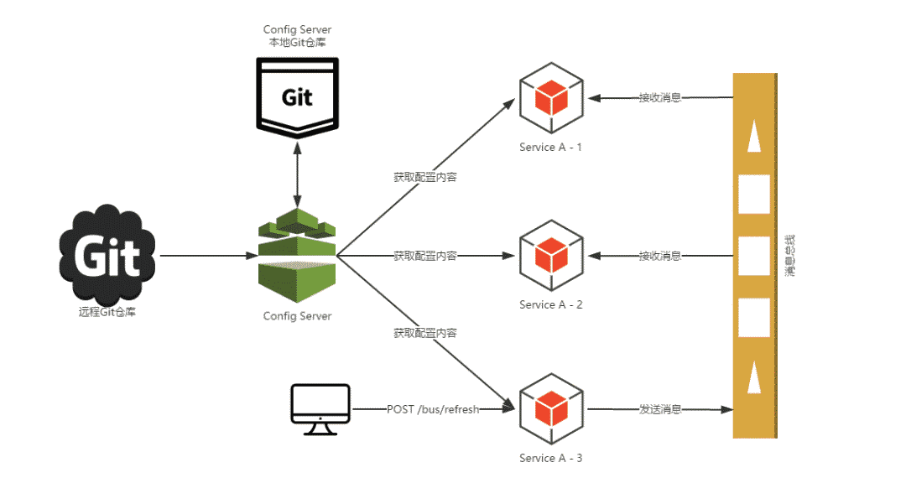
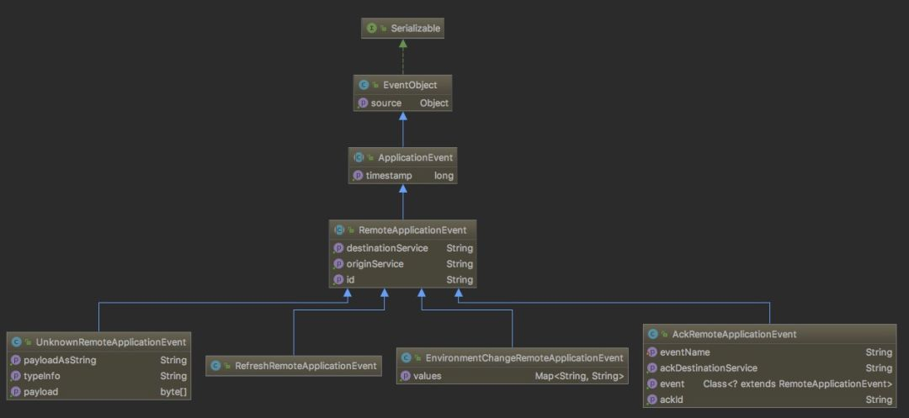
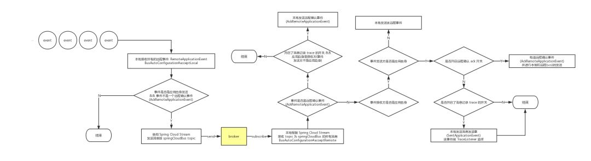

# Spring Cloud Bus 消息总线介绍


继上一篇 [《干货｜Spring Cloud Stream 体系及原理介绍》 ](http://mp.weixin.qq.com/s?__biz=MzU4NzU0MDIzOQ==&mid=2247486235&idx=4&sn=03a0468424a2987becf9bc20feb01f55&chksm=fdeb397bca9cb06ddca880f305f1019ba7a2734c340987cfc1ef04a58eb4a5226dd25ce66edd&scene=21#wechat_redirect)之后，本期我们来了解下 Spring Cloud 体系中的另外一个组件 Spring Cloud Bus (建议先熟悉 Spring Cloud Stream，不然无法理解 Spring Cloud Bus 内部的代码)。

Spring Cloud Bus 对自己的定位是 Spring Cloud 体系内的消息总线，使用 message broker 来连接分布式系统的所有节点。Bus 官方的 Reference 文档 比较简单，简单到连一张图都没有。

这是最新版的 Spring Cloud Bus 代码结构(代码量比较少)：




### **Bus 实例演示**

------

在分析 Bus 的实现之前，我们先来看两个使用 Spring Cloud Bus 的简单例子。


#### 所有节点的配置新增

Bus 的例子比较简单，因为 Bus 的 AutoConfiguration 层都有了默认的配置，只需要引入消息中间件对应的 Spring Cloud Stream 以及 Spring Cloud Bus 依赖即可，之后所有启动的应用都会使用同一个 Topic 进行消息的接收和发送。

Bus 对应的 Demo 已经放到了 github 上（地址： https://github.com/fangjian0423/rocketmq-binder-demo/tree/master/rocketmq-bus-demo ）， 该 Demo 会模拟启动 5 个节点，只需要对其中任意的一个实例新增配置项，所有节点都会新增该配置项。

访问任意节点提供的 Controller 提供的获取配置的地址(key为 `hangzhou`)：

```
curl -X GET 'http://localhost:10001/bus/env?key=hangzhou'
```

所有节点返回的结果都是 unknown，因为所有节点的配置中没有 `hangzhou` 这个 key。

Bus 内部提供了 `EnvironmentBusEndpoint` 这个 Endpoint 通过 message broker 用来新增/更新配置。

访问任意节点该 Endpoint 对应的 url: /actuator/bus-env?name=hangzhou&value=alibaba 进行配置项的新增(比如访问 node1 的url):

```
curl -X POST 'http://localhost:10001/actuator/bus-env?name=hangzhou&value=alibaba' -H 'content-type: application/json'
```

然后再次访问所有节点 `/bus/env` 获取配置：

```
$ curl -X GET 'http://localhost:10001/bus/env?key=hangzhou'
unknown%
~ ⌚
$ curl -X GET 'http://localhost:10002/bus/env?key=hangzhou'
unknown%
~ ⌚
$ curl -X GET 'http://localhost:10003/bus/env?key=hangzhou'
unknown%
~ ⌚
$ curl -X GET 'http://localhost:10004/bus/env?key=hangzhou'
unknown%
~ ⌚
$ curl -X GET 'http://localhost:10005/bus/env?key=hangzhou'
unknown%
~ ⌚
$ curl -X POST 'http://localhost:10001/actuator/bus-env?name=hangzhou&value=alibaba' -H 'content-type: application/json'

~ ⌚
$ curl -X GET 'http://localhost:10005/bus/env?key=hangzhou'
alibaba%
~ ⌚
$ curl -X GET 'http://localhost:10004/bus/env?key=hangzhou'
alibaba%
~ ⌚
$ curl -X GET 'http://localhost:10003/bus/env?key=hangzhou'
alibaba%
~ ⌚
$ curl -X GET 'http://localhost:10002/bus/env?key=hangzhou'
alibaba%
~ ⌚
$ curl -X GET 'http://localhost:10001/bus/env?key=hangzhou'
alibaba%
```


可以看到，所有节点都新增了一个 key 为`hangzhou`的配置，且对应的 value 是 `alibaba`。这个配置项是通过 Bus 提供的 `EnvironmentBusEndpoint` 完成的。

这里引用 程序猿DD 画的一张图片，Spring Cloud Config 配合 Bus 完成所有节点配置的刷新来描述之前的实例(本文实例不是刷新，而是新增配置，但是流程是一样的)：




#### 部分节点的配置修改

比如在 node1 上指定 destination 为 rocketmq-bus-node2 ( node2 配置了 spring.cloud.bus.id 为 `rocketmq-bus-node2:10002`，可以匹配上) 进行配置的修改：

```
curl -X POST 'http://localhost:10001/actuator/bus-env/rocketmq-bus-node2?name=hangzhou&value=xihu' -H 'content-type: application/json'
```

访问 `/bus/env` 获取配置(由于在 node1 上发送消息，Bus 也会对发送方的节点 node1 进行配置修改)：

```
~ ⌚
$ curl -X POST 'http://localhost:10001/actuator/bus-env/rocketmq-bus-node2?name=hangzhou&value=xihu' -H 'content-type: application/json'

~ ⌚
$ curl -X GET 'http://localhost:10005/bus/env?key=hangzhou'
alibaba%
~ ⌚
$ curl -X GET 'http://localhost:10004/bus/env?key=hangzhou'
alibaba%
~ ⌚
$ curl -X GET 'http://localhost:10003/bus/env?key=hangzhou'
alibaba%
~ ⌚
$ curl -X GET 'http://localhost:10002/bus/env?key=hangzhou'
xihu%
~ ⌚
$ curl -X GET 'http://localhost:10001/bus/env?key=hangzhou'
xihu%
```


可以看到，只有 node1 和 node2 修改了配置，其余的 3 个节点配置未改变。


### **Bus 的实现**

------


#### **Bus 概念介绍** 


##### *事件*

Bus 中定义了远程事件 `RemoteApplicationEvent`，该事件继承了 Spring 的事件 `ApplicationEvent`，而且它目前有 4 个具体的实现：



- EnvironmentChangeRemoteApplicationEvent: 远程环境变更事件。主要用于接收一个 `Map<String,String>` 类型的数据并更新到 Spring 上下文中 `Environment` 中的事件。文中的实例就是使用这个事件并配合 `EnvironmentBusEndpoint `和 `EnvironmentChangeListener` 完成的。
- AckRemoteApplicationEvent: 远程确认事件。Bus 内部成功接收到远程事件后会发送回 `AckRemoteApplicationEvent` 确认事件进行确认。
- RefreshRemoteApplicationEvent: 远程配置刷新事件。配合 `@RefreshScope` 以及所有的 `@ConfigurationProperties` 注解修饰的配置类的动态刷新。
- UnknownRemoteApplicationEvent：远程未知事件。Bus 内部消息体进行转换远程事件的时候如果发生异常会统一包装成该事件。

Bus 内部还存在一个非 `RemoteApplicationEvent` 事件 - `SentApplicationEvent` 消息发送事件，配合 Trace 进行远程消息发送的记录。

这些事件会配合 `ApplicationListener` 进行操作，比如 `EnvironmentChangeRemoteApplicationEvent` 配了 `EnvironmentChangeListener` 进行配置的新增/修改：

```
public class EnvironmentChangeListener
        implements ApplicationListener<EnvironmentChangeRemoteApplicationEvent> {

    private static Log log = LogFactory.getLog(EnvironmentChangeListener.class);

    @Autowired
    private EnvironmentManager env;

    @Override
    public void onApplicationEvent(EnvironmentChangeRemoteApplicationEvent event) {
        Map<String, String> values = event.getValues();
        log.info("Received remote environment change request. Keys/values to update "
                + values);
        for (Map.Entry<String, String> entry : values.entrySet()) {
            env.setProperty(entry.getKey(), entry.getValue());
        }
    }
}
```

收到其它节点发送来 EnvironmentChangeRemoteApplicationEvent 事件之后调用 `EnvironmentManager#setProperty`进行配置的设置，该方法内部针对每一个配置项都会发送一个 `EnvironmentChangeEvent` 事件，然后被 `ConfigurationPropertiesRebinder`所监听，进行 rebind 操作新增/更新配置。


##### *Actuator Endpoint*

Bus 内部暴露了 2 个 Endpoint，分别是 `EnvironmentBusEndpoint` 和 `RefreshBusEndpoint`，进行配置的新增/修改以及全局配置刷新。它们对应的 Endpoint id 即 url 是 `bus-env` 和 `bus-refresh`。


##### *配置*

Bus 对于消息的发送必定涉及到 Topic、Group 之类的信息，这些内容都被封装到了 `BusProperties` 中，其默认的配置前缀为 `spring.cloud.bus`，比如：

- `spring.cloud.bus.refresh.enabled `用于开启/关闭全局刷新的 Listener。
- `spring.cloud.bus.env.enabled `用于开启/关闭配置新增/修改的 Endpoint。
- `spring.cloud.bus.ack.enabled `用于开启开启/关闭 `AckRemoteApplicationEvent`事件的发送。
- `spring.cloud.bus.trace.enabled `用于开启/关闭息记录 Trace 的 Listener。

消息发送涉及到的 Topic 默认用的是 `springCloudBus`，可以配置进行修改，Group 可以设置成广播模式或使用 UUID 配合 offset 为 lastest 的模式。

每个 Bus 应用都有一个对应的 Bus id，官方取值方式较复杂：

${vcap.application.name:${spring.application.name:application}}:${vcap.application.instance_index:${spring.application.index:${local.server.port:${server.port:0}}}}:${vcap.application.instance_id:${random.value}}

建议手动配置 Bus id，因为 Bus 远程事件中的 destination 会根据 Bus id 进行匹配：

```
spring.cloud.bus.id=${spring.application.name}-${server.port}
```


#### **Bus 底层分析**

Bus 的底层分析无非牵扯到这几个方面：

- 消息是如何发送的；
- 消息是如何接收的；
- destination 是如何匹配的；
- 远程事件收到后如何触发下一个 action；

`BusAutoConfiguration` 自动化配置类被 @EnableBinding(SpringCloudBusClient.class)所修饰。

`@EnableBinding` 的用法在上期文章 [《干货｜Spring Cloud Stream 体系及原理介绍](https://mp.weixin.qq.com/s?__biz=MzU4NzU0MDIzOQ==&mid=2247486235&idx=4&sn=03a0468424a2987becf9bc20feb01f55&scene=21#wechat_redirect)》 中已经说明，且它的 value 为 `SpringCloudBusClient.class`，会在 `SpringCloudBusClient` 中基于代理创建出 input 和 output 的 `DirectChannel`：

```java
public interface SpringCloudBusClient {

    String INPUT = "springCloudBusInput";

    String OUTPUT = "springCloudBusOutput";

    @Output(SpringCloudBusClient.OUTPUT)
    MessageChannel springCloudBusOutput();

    @Input(SpringCloudBusClient.INPUT)
    SubscribableChannel springCloudBusInput();
}
```

springCloudBusInput 和 springCloudBusOutput 这两个 Binding 的属性可以通过配置文件进行修改(比如修改 topic)：

```
spring.cloud.stream.bindings:
  springCloudBusInput:
    destination: my-bus-topic
  springCloudBusOutput:
    destination: my-bus-topic
```

消息的接收的发送：

```
// BusAutoConfiguration

@EventListener(classes = RemoteApplicationEvent.class) // 1
public void acceptLocal(RemoteApplicationEvent event) {
    if (this.serviceMatcher.isFromSelf(event)
            && !(event instanceof AckRemoteApplicationEvent)) { // 2
        this.cloudBusOutboundChannel.send(MessageBuilder.withPayload(event).build()); // 3
    }
}

@StreamListener(SpringCloudBusClient.INPUT) // 4
public void acceptRemote(RemoteApplicationEvent event) {
    if (event instanceof AckRemoteApplicationEvent) {
        if (this.bus.getTrace().isEnabled() && !this.serviceMatcher.isFromSelf(event)
                && this.applicationEventPublisher != null) { // 5
            this.applicationEventPublisher.publishEvent(event);
        }
        // If it's an ACK we are finished processing at this point
        return;
    }
    if (this.serviceMatcher.isForSelf(event)
            && this.applicationEventPublisher != null) { // 6
        if (!this.serviceMatcher.isFromSelf(event)) { // 7
            this.applicationEventPublisher.publishEvent(event);
        }
        if (this.bus.getAck().isEnabled()) { // 8
            AckRemoteApplicationEvent ack = new AckRemoteApplicationEvent(this,
                    this.serviceMatcher.getServiceId(),
                    this.bus.getAck().getDestinationService(),
                    event.getDestinationService(), event.getId(), event.getClass());
            this.cloudBusOutboundChannel
                    .send(MessageBuilder.withPayload(ack).build());
            this.applicationEventPublisher.publishEvent(ack);
        }
    }
    if (this.bus.getTrace().isEnabled() && this.applicationEventPublisher != null) { // 9
        // We are set to register sent events so publish it for local consumption,
        // irrespective of the origin
        this.applicationEventPublisher.publishEvent(new SentApplicationEvent(this,
                event.getOriginService(), event.getDestinationService(),
                event.getId(), event.getClass()));
    }
}
```


1. 利用 Spring 事件的监听机制监听本地所有的 `RemoteApplicationEvent` 远程事件(比如 `bus-env` 会在本地发送 EnvironmentChangeRemoteApplicationEvent事件， `bus-refresh`会在本地发送 `RefreshRemoteApplicationEvent `事件，这些事件在这里都会被监听到)。
2. 判断本地接收到的事件不是 `AckRemoteApplicationEvent` 远程确认事件(不然会死循环，一直接收消息，发送消息...)以及该事件是应用自身发送出去的(事件发送方是应用自身)，如果都满足执行步骤 3。
3.  构造 Message 并将该远程事件作为 payload，然后使用 Spring Cloud Stream 构造的 Binding name 为 springCloudBusOutput 的 MessageChannel 将消息发送到 broker。
4.  `@StreamListener `注解消费 Spring Cloud Stream 构造的 Binding name 为 springCloudBusInput 的 MessageChannel，接收的消息为远程消息。
5.  如果该远程事件是 `AckRemoteApplicationEvent` 远程确认事件并且应用开启了消息追踪 trace 开关，同时该远程事件不是应用自身发送的(事件发送方不是应用自身，表示事件是其它应用发送过来的)，那么本地发送 `AckRemoteApplicationEvent `远程确认事件表示应用确认收到了其它应用发送过来的远程事件，流程结束。
6.  如果该远程事件是其它应用发送给应用自身的(事件的接收方是应用自身)，那么进行步骤 7 和 8，否则执行步骤 9。
7. 该远程事件不是应用自身发送(事件发送方不是应用自身)的话，将该事件以本地的方式发送出去。应用自身一开始已经在本地被对应的消息接收方处理了，无需再次发送。
8. 如果开启了 `AckRemoteApplicationEvent` 远程确认事件的开关，构造 `AckRemoteApplicationEvent` 事件并在远程和本地都发送该事件(本地发送是因为步骤 5 没有进行本地 `AckRemoteApplicationEvent `事件的发送，也就是自身应用对自身应用确认; 远程发送是为了告诉其它应用，自身应用收到了消息)。
9. 如果开启了消息记录 Trace 的开关，本地构造并发送 `SentApplicationEvent` 事件。




`bus-env` 触发后所有节点的 `EnvironmentChangeListener` 监听到了配置的变化，控制台都会打印出以下信息：

```
o.s.c.b.event.EnvironmentChangeListener  : Received remote environment change request. Keys/values to update {hangzhou=alibaba}
```

如果在本地监听远程确认事件 `AckRemoteApplicationEvent`，都会收到所有节点的信息，比如 node5 节点的控制台监听到的 `AckRemoteApplicationEvent`事件如下：

```
ServiceId [rocketmq-bus-node5:10005] listeners on {"type":"AckRemoteApplicationEvent","timestamp":1554124670484,"originService":"rocketmq-bus-node5:10005","destinationService":"**","id":"375f0426-c24e-4904-bce1-5e09371fc9bc","ackId":"750d033f-356a-4aad-8cf0-3481ace8698c","ackDestinationService":"**","event":"org.springframework.cloud.bus.event.EnvironmentChangeRemoteApplicationEvent"}
ServiceId [rocketmq-bus-node5:10005] listeners on {"type":"AckRemoteApplicationEvent","timestamp":1554124670184,"originService":"rocketmq-bus-node1:10001","destinationService":"**","id":"91f06cf1-4bd9-4dd8-9526-9299a35bb7cc","ackId":"750d033f-356a-4aad-8cf0-3481ace8698c","ackDestinationService":"**","event":"org.springframework.cloud.bus.event.EnvironmentChangeRemoteApplicationEvent"}
ServiceId [rocketmq-bus-node5:10005] listeners on {"type":"AckRemoteApplicationEvent","timestamp":1554124670402,"originService":"rocketmq-bus-node2:10002","destinationService":"**","id":"7df3963c-7c3e-4549-9a22-a23fa90a6b85","ackId":"750d033f-356a-4aad-8cf0-3481ace8698c","ackDestinationService":"**","event":"org.springframework.cloud.bus.event.EnvironmentChangeRemoteApplicationEvent"}
ServiceId [rocketmq-bus-node5:10005] listeners on {"type":"AckRemoteApplicationEvent","timestamp":1554124670406,"originService":"rocketmq-bus-node3:10003","destinationService":"**","id":"728b45ee-5e26-46c2-af1a-e8d1571e5d3a","ackId":"750d033f-356a-4aad-8cf0-3481ace8698c","ackDestinationService":"**","event":"org.springframework.cloud.bus.event.EnvironmentChangeRemoteApplicationEvent"}
ServiceId [rocketmq-bus-node5:10005] listeners on {"type":"AckRemoteApplicationEvent","timestamp":1554124670427,"originService":"rocketmq-bus-node4:10004","destinationService":"**","id":"1812fd6d-6f98-4e5b-a38a-4b11aee08aeb","ackId":"750d033f-356a-4aad-8cf0-3481ace8698c","ackDestinationService":"**","event":"org.springframework.cloud.bus.event.EnvironmentChangeRemoteApplicationEvent"}
```


那么回到本章节开头提到的4个问题，我们分别做一下解答：

- 消息是如何发送的: 在 `BusAutoConfiguration#acceptLocal` 方法中通过 Spring Cloud Stream 发送事件到 `springCloudBus` topic 中。
- 消息是如何接收的: 在 BusAutoConfiguration#acceptRemote 方法中通过 Spring Cloud Stream 接收 `springCloudBus` topic 的消息。
- destination 是如何匹配的: 在 BusAutoConfiguration#acceptRemote 方法中接收远程事件方法里对 destination 进行匹配。
- 远程事件收到后如何触发下一个 action: Bus 内部通过 Spring 的事件机制接收本地的 `RemoteApplicationEvent` 具体的实现事件再做下一步的动作(比如 `EnvironmentChangeListener` 接收了 EnvironmentChangeRemoteApplicationEvent事件， `RefreshListener` 接收了 `RefreshRemoteApplicationEvent `事件)。


### 总结**

------

Spring Cloud Bus 自身内容还是比较少的，不过还是需要提前了解 Spring Cloud Stream 体系以及 Spring 自身的事件机制，在此基础上，才能更好地理解 Spring Cloud Bus 对本地事件和远程事件的处理逻辑。

目前 Bus 内置的远程事件较少，大多数为配置相关的事件，我们可以继承 `RemoteApplicationEvent` 并配合 `@RemoteApplicationEventScan` 注解构建自身的微服务消息体系。

欢迎加入Spring Cloud Alibaba 开源社群，和我们一起交流与探索 Spring Cloud Alibaba 的实践以及发展路径：

