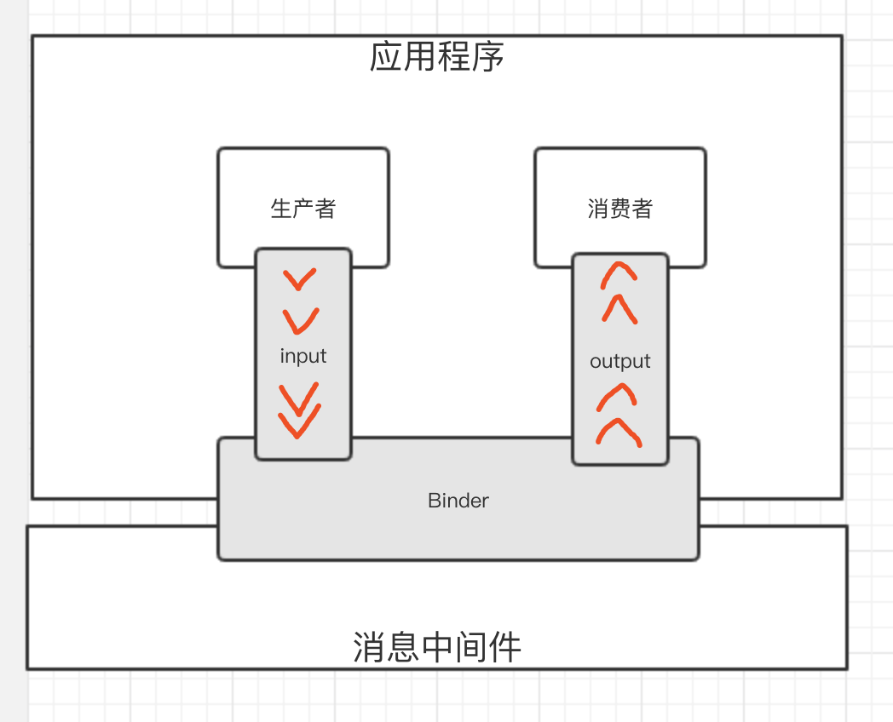
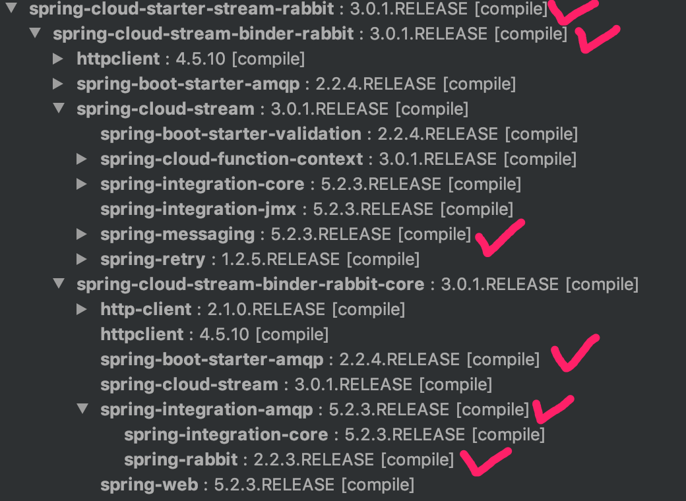
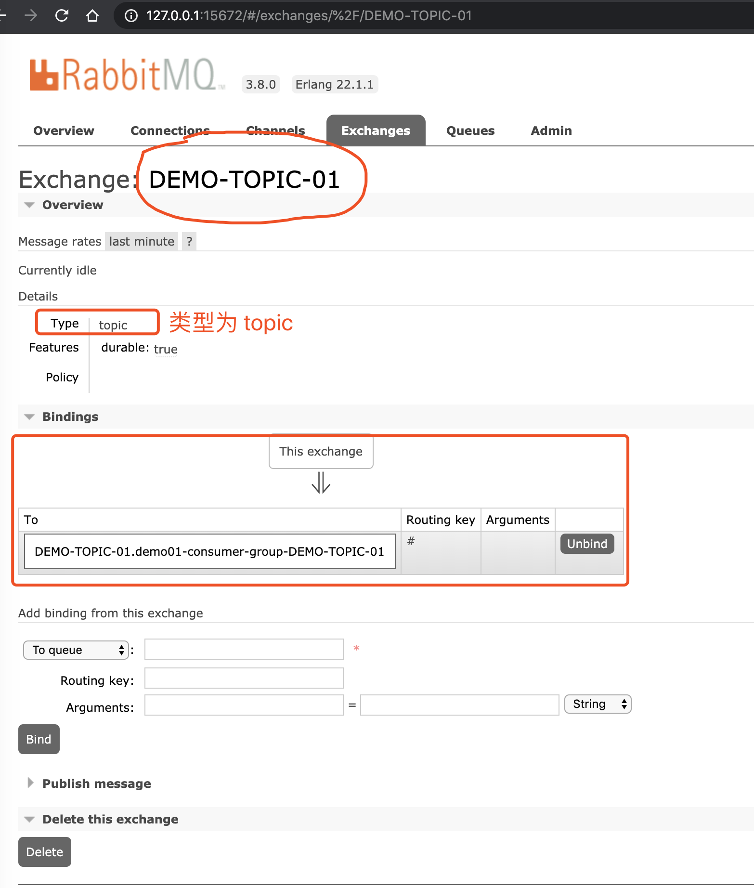
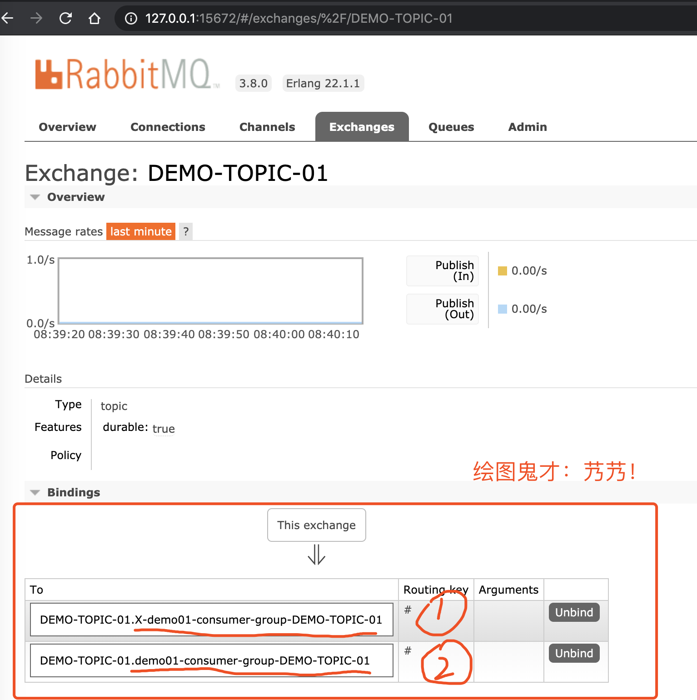
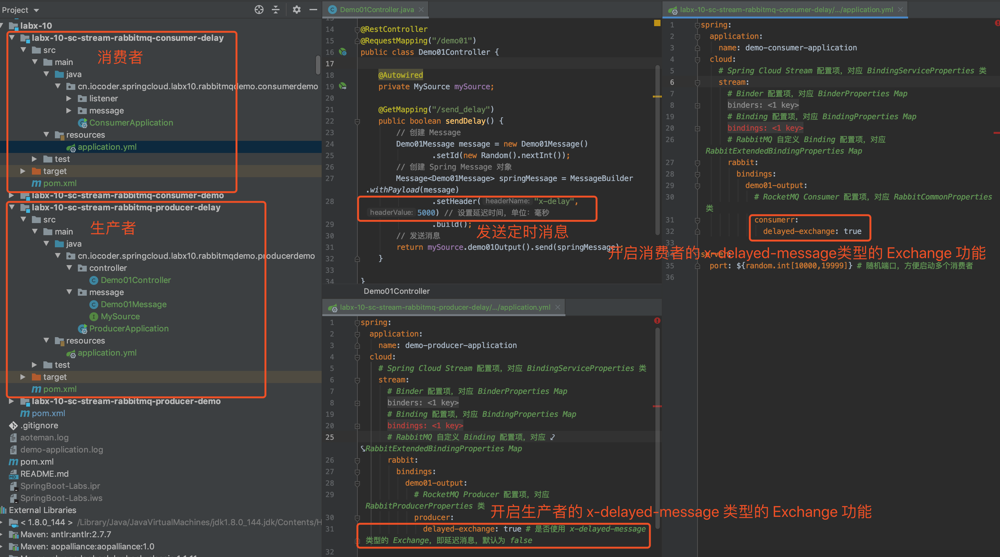
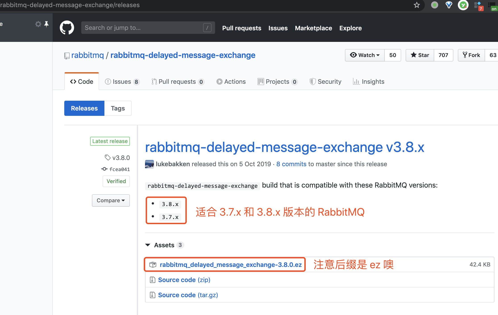
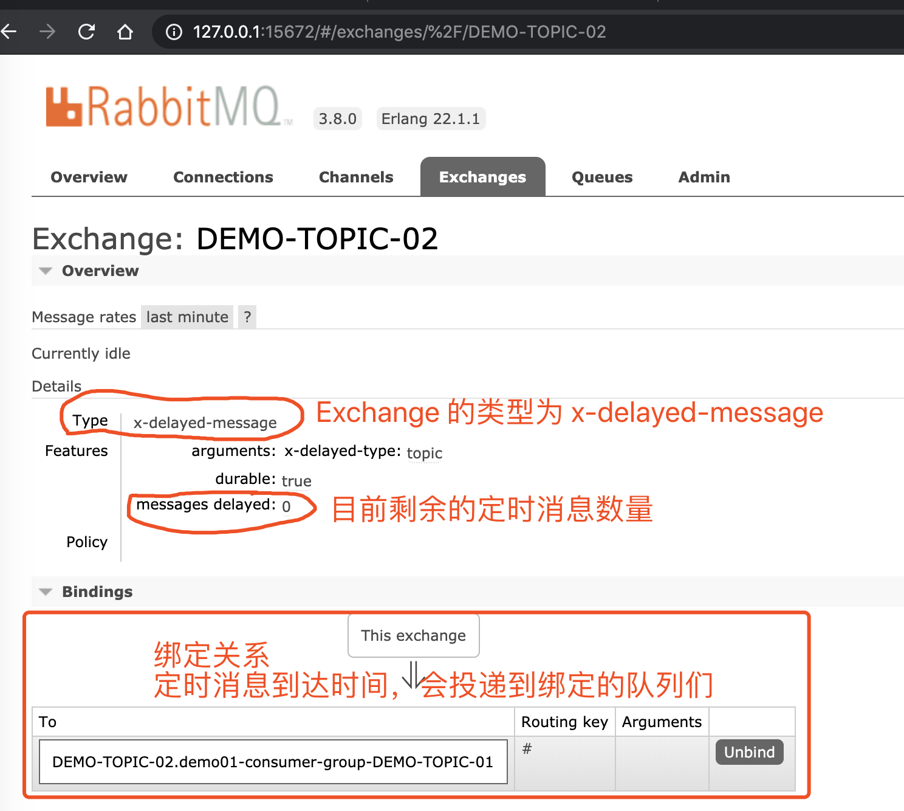
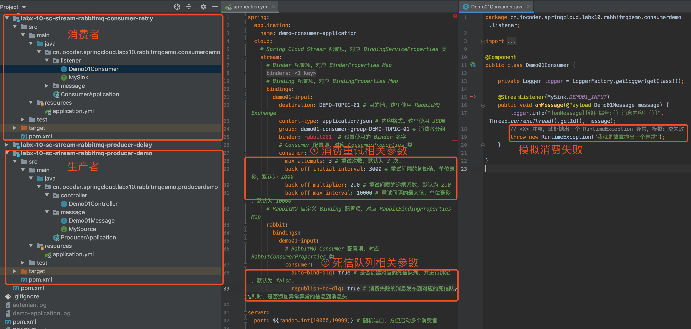
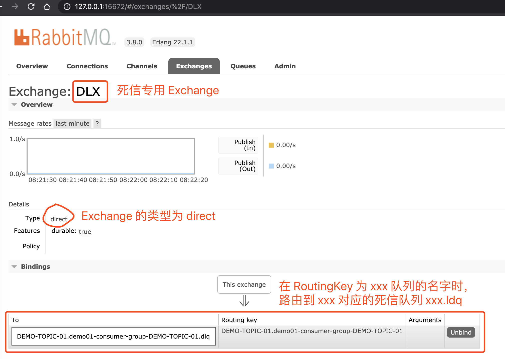
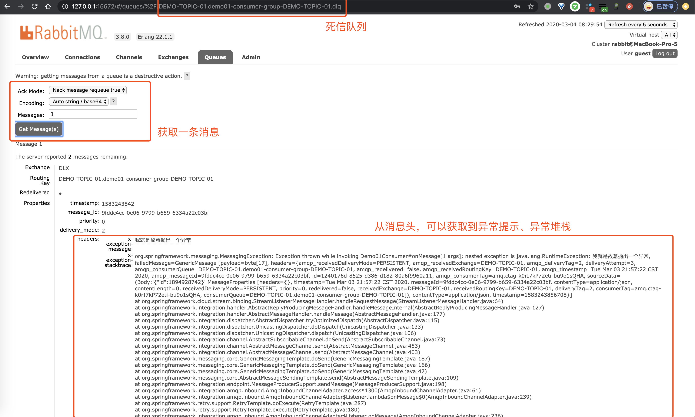

# 芋道 Spring Cloud 消息队列 RabbitMQ 入门


## 1. 概述

本文我们来学习 [Spring Cloud Stream RabbitMQ](https://github.com/spring-cloud/spring-cloud-stream-binder-rabbit) 组件，基于 [Spring Cloud Stream](https://github.com/spring-cloud/spring-cloud-stream) 的编程模型，接入 RabbitMQ 作为消息中间件，实现消息驱动的微服务。

> RabbitMQ 是一套开源（MPL）的消息队列服务软件，是由 LShift 提供的一个 Advanced Message Queuing Protocol (AMQP) 的开源实现，由以高性能、健壮以及可伸缩性出名的 Erlang 写成。

在开始本文之前，胖友需要对 RabbitMQ 进行简单的学习。可以阅读[《RabbitMQ 极简入门》](http://www.iocoder.cn/RabbitMQ/install/?self)文章，将第**一二**小节看完，在本机搭建一个 RabbitMQ 服务。


## 2. Spring Cloud Stream 介绍

[Spring Cloud Stream](https://github.com/spring-cloud/spring-cloud-stream) 是一个用于构建基于**消息**的微服务应用框架，使用 [Spring Integration](https://www.oschina.net/p/spring+integration) 与 Broker 进行连接。

>友情提示：可能有胖友对 Broker 不太了解，我们来简单解释下。
>
>一般来说，消息队列中间件都有一个 **Broker Server**（代理服务器），消息中转角色，负责存储消息、转发消息。
>
>例如说在 RocketMQ 中，Broker 负责接收从生产者发送来的消息并存储、同时为消费者的拉取请求作准备。另外，Broker 也存储消息相关的元数据，包括消费者组、消费进度偏移和主题和队列消息等。

Spring Cloud Stream 提供了消息中间件的**统一抽象**，推出了 publish-subscribe、consumer groups、partition 这些统一的概念。

Spring Cloud Stream 内部有两个概念：**Binder** 和 **Binding**。

① **Binder**，跟消息中间件集成的组件，用来创建对应的 Binding。各消息中间件都有自己的 Binder 具体实现。

```java
public interface Binder<T, 
    C extends ConsumerProperties, // 消费者配置
    P extends ProducerProperties> { // 生产者配置
    
    // 创建消费者的 Binding
    Binding<T> bindConsumer(String name, String group, T inboundBindTarget, C consumerProperties);

    // 创建生产者的 Binding
    Binding<T> bindProducer(String name, T outboundBindTarget, P producerProperties);
    
}
```

- Kafka 实现了 [KafkaMessageChannelBinder](https://github.com/spring-cloud/spring-cloud-stream-binder-kafka/blob/master/spring-cloud-stream-binder-kafka/src/main/java/org/springframework/cloud/stream/binder/kafka/KafkaMessageChannelBinder.java)
- RabbitMQ 实现了 [RabbitMessageChannelBinder](https://github.com/spring-cloud/spring-cloud-stream-binder-rabbit/blob/master/spring-cloud-stream-binder-rabbit/src/main/java/org/springframework/cloud/stream/binder/rabbit/RabbitMessageChannelBinder.java)
- RocketMQ 实现了 [RocketMQMessageChannelBinder](https://github.com/alibaba/spring-cloud-alibaba/blob/master/spring-cloud-stream-binder-rocketmq/src/main/java/com/alibaba/cloud/stream/binder/rocketmq/RocketMQMessageChannelBinder.java)


② **Binding**，包括 Input Binding 和 Output Binding。Binding 在消息中间件与应用程序提供的 Provider 和 Consumer 之间提供了一个桥梁，实现了开发者只需使用应用程序的 Provider 或 Consumer 生产或消费数据即可，屏蔽了开发者与底层消息中间件的接触。

最终整体交互如下图所示：




可能看完之后，胖友对 Spring Cloud Stream 还是有点懵逼，并且觉得概念怎么这么多呢？不要慌，我们先来快速入个门，会有更加具象的感受。


## 3. 快速入门

示例代码对应仓库：

- 生产者：[`labx-10-sc-stream-rabbitmq-producer-demo`](https://github.com/YunaiV/SpringBoot-Labs/tree//master/labx-10-spring-cloud-stream-rabbitmq/labx-10-sc-stream-rabbitmq-producer-demo)
- 消费者：[`labx-10-sc-stream-rabbitmq-consumer-demo`](https://github.com/YunaiV/SpringBoot-Labs/blob//master/labx-10-spring-cloud-stream-rabbitmq/labx-10-sc-stream-rabbitmq-consumer-demo/)

友情提示：这可能是一个信息量有点大的入门内容，请保持耐心~

### 3.1 搭建生产者

创建 [`labx-10-sc-stream-rabbitmq-producer-demo`](https://github.com/YunaiV/SpringBoot-Labs/tree//master/labx-10-spring-cloud-stream-rabbitmq/labx-10-sc-stream-rabbitmq-producer-demo) 项目，作为生产者

#### 3.1.1 引入依赖

创建 [`pom.xml`](https://github.com/YunaiV/SpringBoot-Labs/blob//master/labx-10-spring-cloud-stream-rabbitmq/labx-10-sc-stream-rabbitmq-producer-demo/pom.xml) 文件中，引入 Spring Cloud Stream RabbitMQ 相关依赖。

```xml
<?xml version="1.0" encoding="UTF-8"?>
<project xmlns="http://maven.apache.org/POM/4.0.0"
         xmlns:xsi="http://www.w3.org/2001/XMLSchema-instance"
         xsi:schemaLocation="http://maven.apache.org/POM/4.0.0 http://maven.apache.org/xsd/maven-4.0.0.xsd">
    <parent>
        <artifactId>labx-10</artifactId>
        <groupId>cn.iocoder.springboot.labs</groupId>
        <version>1.0-SNAPSHOT</version>
    </parent>
    <modelVersion>4.0.0</modelVersion>

    <artifactId>labx-10-sc-stream-rabbitmq-producer-demo</artifactId>

    <properties>
        <maven.compiler.target>1.8</maven.compiler.target>
        <maven.compiler.source>1.8</maven.compiler.source>
        <spring.boot.version>2.2.4.RELEASE</spring.boot.version>
        <spring.cloud.version>Hoxton.SR1</spring.cloud.version>
    </properties>

    <!--
        引入 Spring Boot、Spring Cloud、Spring Cloud Alibaba 三者 BOM 文件，进行依赖版本的管理，防止不兼容。
        在 https://dwz.cn/mcLIfNKt 文章中，Spring Cloud Alibaba 开发团队推荐了三者的依赖关系
     -->
    <dependencyManagement>
        <dependencies>
            <dependency>
                <groupId>org.springframework.boot</groupId>
                <artifactId>spring-boot-starter-parent</artifactId>
                <version>${spring.boot.version}</version>
                <type>pom</type>
                <scope>import</scope>
            </dependency>
            <dependency>
                <groupId>org.springframework.cloud</groupId>
                <artifactId>spring-cloud-dependencies</artifactId>
                <version>${spring.cloud.version}</version>
                <type>pom</type>
                <scope>import</scope>
            </dependency>
        </dependencies>
    </dependencyManagement>

    <dependencies>
        <!-- 引入 SpringMVC 相关依赖，并实现对其的自动配置 -->
        <dependency>
            <groupId>org.springframework.boot</groupId>
            <artifactId>spring-boot-starter-web</artifactId>
        </dependency>

        <!-- 引入 Spring Cloud Stream RabbitMQ 相关依赖，将 RabbitMQ 作为消息队列，并实现对其的自动配置 -->
        <dependency>
            <groupId>org.springframework.cloud</groupId>
            <artifactId>spring-cloud-starter-stream-rabbit</artifactId>
        </dependency>
    </dependencies>

</project>
```


通过引入 [`spring-cloud-starter-stream-rabbit`](https://mvnrepository.com/artifact/org.springframework.cloud/spring-cloud-starter-stream-rabbit) 依赖，引入并实现 Stream RabbitMQ 的自动配置。在该依赖中，已经帮我们自动引入 RabbitMQ 的大量依赖，非常方便，如下图所示：



#### 3.1.2 配置文件

创建 [`application.yaml`](https://github.com/YunaiV/SpringBoot-Labs/blob//master/labx-10-spring-cloud-stream-rabbitmq/labx-10-sc-stream-rabbitmq-producer-demo/src/main/resources/application.yml) 配置文件，添加 Spring Cloud Stream RabbitMQ 相关配置。

```xxml
spring:
  application:
    name: demo-producer-application
  cloud:
    # Spring Cloud Stream 配置项，对应 BindingServiceProperties 类
    stream:
      # Binder 配置项，对应 BinderProperties Map
      binders:
        rabbit001:
          type: rabbit # 设置 Binder 的类型
          environment: # 设置 Binder 的环境配置
            # 如果是 RabbitMQ 类型的时候，则对应的是 RabbitProperties 类
            spring:
              rabbitmq:
                host: 127.0.0.1 # RabbitMQ 服务的地址
                port: 5672 # RabbitMQ 服务的端口
                username: guest # RabbitMQ 服务的账号
                password: guest # RabbitMQ 服务的密码
      # Binding 配置项，对应 BindingProperties Map
      bindings:
        demo01-output:
          destination: DEMO-TOPIC-01 # 目的地。这里使用 RabbitMQ Exchange
          content-type: application/json # 内容格式。这里使用 JSON
          binder: rabbit001 # 设置使用的 Binder 名字

server:
  port: 18080
```

① `spring.cloud.stream` 为 Spring Cloud Stream 配置项，对应 [BindingServiceProperties](https://github.com/spring-cloud/spring-cloud-stream/blob/master/spring-cloud-stream/src/main/java/org/springframework/cloud/stream/config/BindingServiceProperties.java) 类。配置的层级有点深，我们一层一层来看看。

② `spring.cloud.stream.binders` 为 Binder 配置项，对应 [BinderProperties](https://github.com/spring-cloud/spring-cloud-stream/blob/master/spring-cloud-stream/src/main/java/org/springframework/cloud/stream/config/BinderProperties.java) Map。其中 *key* 为 Binder 的名字。

这里，我们配置了一个名字为 `rabbit001` 的 Binder。

- `type`：Binder 的类型。这里，我们设置为了 `rabbit`，表示使用 Spring Cloud Stream RabbitMQ 提供的 Binder 实现。
- `environment`：Binder 的环境。因为 Spring Cloud Steam RabbitMQ 底层使用的是 [`spring-rabbit`](https://github.com/spring-projects/spring-amqp/tree/master/spring-rabbit)，所以在使用 RabbitMQ 类型的时候，则对应的是 [RabbitProperties](https://github.com/spring-projects/spring-boot/blob/master/spring-boot-project/spring-boot-autoconfigure/src/main/java/org/springframework/boot/autoconfigure/amqp/RabbitProperties.java) 类。

③ `spring.cloud.stream.bindings` 为 Binding 配置项，对应 [BindingProperties](https://github.com/spring-cloud/spring-cloud-stream/blob/master/spring-cloud-stream/src/main/java/org/springframework/cloud/stream/config/BindingProperties.java) Map。其中，*key* 为 Binding 的名字。要注意，虽然说 Binding 分成 Input 和 Output 两种类型，但是在配置项中并不会体现出来，而是要在稍后搭配 `@Input` 还是 `@Output` 注解，才会有具体的区分。

这里，我们配置了一个名字为 `demo01-output` 的 Binding。从命名上，我们的意图是想作为 Output Binding，用于生产者发送消息。

- `destination`：目的地。**在 RabbitMQ 中，使用 Exchange 作为目的地，默认为 Topic 类型**。这里我们设置为 `DEMO-TOPIC-01`。

- `content-type`：内容格式。这里使用 JSON 格式，因为稍后我们将发送消息的类型为 POJO，使用 JSON 进行序列化。

- `binder`：使用的 Binder 名字。这里我们设置为 `rabbit001`，就是我们上面刚创建的。

  > 友情提示：如果只有一个 Binder 的情况，可以不进行设置。又或者通过 `spring.cloud.stream.default-binder` 配置项来设置默认的 Binder 的名字。


#### 3.1.3 MySource

创建 [MySource](https://github.com/YunaiV/SpringBoot-Labs/blob//master/labx-10-spring-cloud-stream-rabbitmq/labx-10-sc-stream-rabbitmq-producer-demo/src/main/java/cn/iocoder/springcloud/labx10/rabbitmqdemo/producerdemo/message/MySource.java) 接口，声明名字为 Output Binding。代码如下：

```java
public interface MySource {

    @Output("demo01-output")
    MessageChannel demo01Output();

}
```

这里，我们通过 [`@Output`](https://github.com/spring-cloud/spring-cloud-stream/blob/master/spring-cloud-stream/src/main/java/org/springframework/cloud/stream/annotation/Output.java) 注解，声明了一个名字为 `demo01-output` 的 Output Binding。注意，这个名字要和我们配置文件中的 `spring.cloud.stream.bindings` 配置项对应上。

同时，`@Output` 注解的方法的返回结果为 [MessageChannel](https://github.com/spring-projects/spring-framework/blob/master/spring-messaging/src/main/java/org/springframework/messaging/MessageChannel.java) 类型，可以使用它发送消息。MessageChannel 提供的发送消息的方法如下：

```java
@FunctionalInterface
public interface MessageChannel {

	long INDEFINITE_TIMEOUT = -1;
	
	default boolean send(Message<?> message) {
		return send(message, INDEFINITE_TIMEOUT);
	}

	boolean send(Message<?> message, long timeout);

}
```

那么，我们是否要实现 MySource 接口呢？答案是**不需要**，全部交给 Spring Cloud Stream 的 [BindableProxyFactory](https://github.com/spring-cloud/spring-cloud-stream/blob/master/spring-cloud-stream/src/main/java/org/springframework/cloud/stream/binding/BindableProxyFactory.java) 来解决。BindableProxyFactory 会通过动态代理，**自动**实现 MySource 接口。 而 `@Output` 注解的方法的返回值，BindableProxyFactory 会扫描带有 `@Output` 注解的方法，**自动**进行创建。

例如说，`#demo01Output()` 方法被**自动**创建返回结果为 [DirectWithAttributesChannel](https://github.com/spring-cloud/spring-cloud-stream/blob/master/spring-cloud-stream/src/main/java/org/springframework/cloud/stream/messaging/DirectWithAttributesChannel.java)，它是 MessageChannel 的子类。

>友情提示：感兴趣的胖友，可以在 BindableProxyFactory 的 `#afterPropertiesSet()` 和 `#invoke(MethodInvocation invocation)` 方法上，都打上一个断点，然后进行愉快的调试。


#### 3.1.4 Demo01Message

创建 [Demo01Message](https://github.com/YunaiV/SpringBoot-Labs/blob//master/labx-10-spring-cloud-stream-rabbitmq/labx-10-sc-stream-rabbitmq-producer-demo/src/main/java/cn/iocoder/springcloud/labx10/rabbitmqdemo/producerdemo/message/Demo01Message.java) 类，示例 Message 消息。代码如下：


```java
public class Demo01Message {

    /**
     * 编号
     */
    private Integer id;

    // ... 省略 setter/getter/toString 方法

}
```


#### 3.1.5 Demo01Controller

创建 [Demo01Controller](https://github.com/YunaiV/SpringBoot-Labs/blob//master/labx-10-spring-cloud-stream-rabbitmq/labx-10-sc-stream-rabbitmq-producer-demo/src/main/java/cn/iocoder/springcloud/labx10/rabbitmqdemo/producerdemo/controller/Demo01Controller.java) 类，提供发送消息的 HTTP 接口。代码如下：


```java
@RestController
@RequestMapping("/demo01")
public class Demo01Controller {

    private Logger logger = LoggerFactory.getLogger(getClass());

    @Autowired
    private MySource mySource; // <X>

    @GetMapping("/send")
    public boolean send() {
        // <1> 创建 Message
        Demo01Message message = new Demo01Message()
                .setId(new Random().nextInt());
        // <2> 创建 Spring Message 对象
        Message<Demo01Message> springMessage = MessageBuilder.withPayload(message)
                .build();
        // <3> 发送消息
        boolean result = mySource.demo01Output().send(springMessage);
        logger.info("[send][发送编号：[{}] 发送成功]", message.getId());
        return result;
    }

}
```

- `<X>` 处，使用 `@Autowired` 注解，注入 MySource Bean。
- `<1>` 处，创建 Demo01Message 对象。
- `<2>` 处，使用 [MessageBuilder](https://github.com/spring-projects/spring-framework/blob/master/spring-messaging/src/main/java/org/springframework/messaging/support/MessageBuilder.java) 创建 Spring [Message](https://github.com/spring-projects/spring-framework/blob/master/spring-messaging/src/main/java/org/springframework/messaging/Message.java) 对象，并设置消息内容为 Demo01Message 对象。
- `<3>` 处，通过 MySource 获得 MessageChannel 对象，然后发送消息。


#### 3.1.6 ProducerApplication

创建 [ProducerApplication](https://github.com/YunaiV/SpringBoot-Labs/blob//master/labx-10-spring-cloud-stream-rabbitmq/labx-10-sc-stream-rabbitmq-producer-demo/src/main/java/cn/iocoder/springcloud/labx10/rabbitmqdemo/producerdemo/ProducerApplication.java) 类，启动应用。代码如下：


```java
@SpringBootApplication
@EnableBinding(MySource.class)
public class ProducerApplication {

    public static void main(String[] args) {
        SpringApplication.run(ProducerApplication.class, args);
    }

}
```


使用 [`@EnableBinding`](https://github.com/spring-cloud/spring-cloud-stream/blob/master/spring-cloud-stream/src/main/java/org/springframework/cloud/stream/annotation/EnableBinding.java) 注解，声明指定接口开启 Binding 功能，扫描其 `@Input` 和 `@Output` 注解。这里，我们设置为 MySource 接口。


### 3.2 搭建消费者

创建 [`labx-10-sc-stream-rabbitmq-consumer-demo`](https://github.com/YunaiV/SpringBoot-Labs/blob//master/labx-10-spring-cloud-stream-rabbitmq/labx-10-sc-stream-rabbitmq-consumer-demo/) 项目，作为消费者。

#### 3.2.1 引入依赖

创建 [`pom.xml`](https://github.com/YunaiV/SpringBoot-Labs/blob//master/labx-10-spring-cloud-stream-rabbitmq/labx-10-sc-stream-rabbitmq-consumer-demo/pom.xml) 文件中，引入 Spring Cloud Stream RabbitMQ 相关依赖。

> 友情提示：和[「3.1.1 引入依赖」](https://www.iocoder.cn/Spring-Cloud/RabbitMQ/?self#)基本一样，点击 [链接](https://github.com/YunaiV/SpringBoot-Labs/blob//master/labx-10-spring-cloud-stream-rabbitmq/labx-10-sc-stream-rabbitmq-consumer-demo/pom.xml) 查看。

#### 3.2.2 配置文件

创建 [`application.yaml`](https://github.com/YunaiV/SpringBoot-Labs/blob//master/labx-10-spring-cloud-stream-rabbitmq/labx-10-sc-stream-rabbitmq-consumer-demo/src/main/resources/application.yml) 配置文件，添加 Spring Cloud Stream RabbitMQ 相关配置。


```java
spring:
  application:
    name: demo-consumer-application
  cloud:
    # Spring Cloud Stream 配置项，对应 BindingServiceProperties 类
    stream:
      # Binder 配置项，对应 BinderProperties Map
      binders:
        rabbit001:
          type: rabbit # 设置 Binder 的类型
          environment: # 设置 Binder 的环境配置
            # 如果是 RabbitMQ 类型的时候，则对应的是 RabbitProperties 类
            spring:
              rabbitmq:
                host: 127.0.0.1 # RabbitMQ 服务的地址
                port: 5672 # RabbitMQ 服务的端口
                username: guest # RabbitMQ 服务的账号
                password: guest # RabbitMQ 服务的密码
      # Binding 配置项，对应 BindingProperties Map
      bindings:
        demo01-input:
          destination: DEMO-TOPIC-01 # 目的地。这里使用 RabbitMQ Exchange
          content-type: application/json # 内容格式。这里使用 JSON
          group: demo01-consumer-group-DEMO-TOPIC-01 # 消费者分组
          binder: rabbit001  # 设置使用的 Binder 名字

server:
  port: ${random.int[10000,19999]} # 随机端口，方便启动多个消费者
```


总体来说，和[「3.1.2 配置文件」](https://www.iocoder.cn/Spring-Cloud/RabbitMQ/?self#)是比较接近的，所以我们只说差异点噢。

① `spring.cloud.stream.bindings` 为 Binding 配置项。

这里，我们配置了一个名字为 `demo01-input` 的 Binding。从命名上，我们的意图是想作为 Input Binding，用于消费者消费消息。

- `group`：消费者分组。

  > **消费者组（Consumer Group）**：同一类 Consumer 的集合，这类 Consumer 通常消费同一类消息且消费逻辑一致。消费者组使得在消息消费方面，实现负载均衡和容错的目标变得非常容易。要注意的是，消费者组的消费者实例必须订阅完全相同的 Topic。

对于消费队列的消费者，会有两种消费模式：集群消费（Clustering）和广播消费（Broadcasting）。

> - **集群消费（Clustering）**：集群消费模式下,相同 Consumer Group 的每个 Consumer 实例平均分摊消息。
> - **广播消费（Broadcasting）**：广播消费模式下，相同 Consumer Group 的每个 Consumer 实例都接收全量的消息。

RabbitMQ 的消费者**两种模式都支持**。因为这里我们配置了消费者组，所以采用**集群消费**。至于如何使用广播消费，我们稍后举例子。

这里一点要注意！！！艿艿加了三个感叹号，一定要理解集群消费和广播消费的差异。我们来举个例子，以有两个消费者分组 A 和 B 的场景举例子：

- 假设每个消费者分组各启动**一个**实例，此时我们发送一条消息，该消息会被两个消费者分组 `"consumer_group_01"` 和 `"consumer_group_02"` 都各自消费一次。
- 假设每个消费者分组各启动**一个**实例，此时我们发送一条消息，该消息会被分组 A 的**某个**实例消费一次，被分组 B 的**某个**实例也消费一次

通过**集群消费**的机制，我们可以实现针对相同 Topic ，不同消费者分组实现各自的业务逻辑。例如说：用户注册成功时，发送一条 Topic 为 `"USER_REGISTER"` 的消息。然后，不同模块使用不同的消费者分组，订阅该 Topic ，实现各自的拓展逻辑：

- 积分模块：判断如果是手机注册，给用户增加 20 积分。
- 优惠劵模块：因为是新用户，所以发放新用户专享优惠劵。
- 站内信模块：因为是新用户，所以发送新用户的欢迎语的站内信。
- ... 等等

这样，我们就可以将注册成功后的业务拓展逻辑，实现业务上的**解耦**，未来也更加容易拓展。同时，也提高了注册接口的性能，避免用户需要等待业务拓展逻辑执行完成后，才响应注册成功。

同时，相同消费者分组的多个实例，可以实现**高可用**，保证在一个实例意外挂掉的情况下，其它实例能够顶上。并且，多个实例都进行消费，能够提升**消费速度**。

> 友情提示：如果还不理解的话，没有关系，我们下面会演示下我们上面举的例子。

#### 3.2.3 MySink

创建 [MySink](https://github.com/YunaiV/SpringBoot-Labs/blob//master/labx-10-spring-cloud-stream-rabbitmq/labx-10-sc-stream-rabbitmq-consumer-demo/src/main/java/cn/iocoder/springcloud/labx10/rabbitmqdemo/consumerdemo/listener/MySink.java) 接口，声明名字为 Input Binding。代码如下：


```java
public interface MySink {

    String DEMO01_INPUT = "demo01-input";

    @Input(DEMO01_INPUT)
    SubscribableChannel demo01Input();

}
```


这里，我们通过 [`@Input`](https://github.com/spring-cloud/spring-cloud-stream/blob/master/spring-cloud-stream/src/main/java/org/springframework/cloud/stream/annotation/Input.java) 注解，声明了一个名字为 `demo01-input` 的 Input Binding。注意，这个名字要和我们配置文件中的 `spring.cloud.stream.bindings` 配置项对应上。

同时，`@Input` 注解的方法的返回结果为 [SubscribableChannel](https://github.com/spring-projects/spring-framework/blob/master/spring-messaging/src/main/java/org/springframework/messaging/SubscribableChannel.java) 类型，可以使用它订阅消息来消费。MessageChannel 提供的订阅消息的方法如下：


```java
public interface SubscribableChannel extends MessageChannel {

	boolean subscribe(MessageHandler handler); // 订阅

	boolean unsubscribe(MessageHandler handler); // 取消订阅

}
```


那么，我们是否要实现 MySink 接口呢？答案也是**不需要**，还是全部交给 Spring Cloud Stream 的 [BindableProxyFactory](https://github.com/spring-cloud/spring-cloud-stream/blob/master/spring-cloud-stream/src/main/java/org/springframework/cloud/stream/binding/BindableProxyFactory.java) 大兄弟来解决。BindableProxyFactory 会通过动态代理，**自动**实现 MySink 接口。 而 `@Input` 注解的方法的返回值，BindableProxyFactory 会扫描带有 `@Input` 注解的方法，**自动**进行创建。

例如说，`#demo01Input()` 方法被**自动**创建返回结果为 [DirectWithAttributesChannel](https://github.com/spring-cloud/spring-cloud-stream/blob/master/spring-cloud-stream/src/main/java/org/springframework/cloud/stream/messaging/DirectWithAttributesChannel.java)，它也是 SubscribableChannel 的子类。

> 友情提示：感兴趣的胖友，可以在 BindableProxyFactory 的 `#afterPropertiesSet()` 和 `#invoke(MethodInvocation invocation)` 方法上，都打上一个断点，然后进行愉快的调试。

#### 3.2.4 Demo01Message

创建 [Demo01Message](https://github.com/YunaiV/SpringBoot-Labs/blob//master/labx-10-spring-cloud-stream-rabbitmq/labx-10-sc-stream-rabbitmq-consumer-demo/src/main/java/cn/iocoder/springcloud/labx10/rabbitmqdemo/consumerdemo/message/Demo01Message.java) 类，示例 Message 消息。

> 友情提示：和[「3.1.4 Demo01Message」](https://www.iocoder.cn/Spring-Cloud/RabbitMQ/?self#)基本一样，点击 [链接](https://github.com/YunaiV/SpringBoot-Labs/blob//master/labx-10-spring-cloud-stream-rabbitmq/labx-10-sc-stream-rabbitmq-consumer-demo/src/main/java/cn/iocoder/springcloud/labx10/rabbitmqdemo/consumerdemo/message/Demo01Message.java) 查看。

#### 3.2.5 Demo01Consumer

创建 [Demo01Consumer](https://github.com/YunaiV/SpringBoot-Labs/blob//master/labx-10-spring-cloud-stream-rabbitmq/labx-10-sc-stream-rabbitmq-consumer-demo/src/main/java/cn/iocoder/springcloud/labx10/rabbitmqdemo/consumerdemo/listener/Demo01Consumer.java) 类，消费消息。代码如下：


```java
@Component
public class Demo01Consumer {

    private Logger logger = LoggerFactory.getLogger(getClass());

    @StreamListener(MySink.DEMO01_INPUT)
    public void onMessage(@Payload Demo01Message message) {
        logger.info("[onMessage][线程编号:{} 消息内容：{}]", Thread.currentThread().getId(), message);
    }

}
```


在方法上，添加 [`@StreamListener`](https://github.com/spring-cloud/spring-cloud-stream/blob/master/spring-cloud-stream/src/main/java/org/springframework/cloud/stream/annotation/StreamListener.java) 注解，声明对应的 **Input** Binding。这里，我们使用 `MySink.DEMO01_INPUT`。

又因为我们消费的消息是 POJO 类型，所以我们需要添加 [`@Payload`](https://github.com/spring-projects/spring-framework/blob/master/spring-messaging/src/main/java/org/springframework/messaging/handler/annotation/Payload.java) 注解，声明需要进行反序列化成 POJO 对象。

#### 3.2.6 ConsumerApplication

创建 [ConsumerApplication](https://github.com/YunaiV/SpringBoot-Labs/blob//master/labx-10-spring-cloud-stream-rabbitmq/labx-10-sc-stream-rabbitmq-consumer-demo/src/main/java/cn/iocoder/springcloud/labx10/rabbitmqdemo/consumerdemo/ConsumerApplication.java) 类，启动应用。代码如下：


```java
@SpringBootApplication
@EnableBinding(MySink.class)
public class ConsumerApplication {

    public static void main(String[] args) {
        SpringApplication.run(ConsumerApplication.class, args);
    }

}
```


使用 [`@EnableBinding`](https://github.com/spring-cloud/spring-cloud-stream/blob/master/spring-cloud-stream/src/main/java/org/springframework/cloud/stream/annotation/EnableBinding.java) 注解，声明指定接口开启 Binding 功能，扫描其 `@Input` 和 `@Output` 注解。这里，我们设置为 MySink 接口。

### 3.3 测试单集群多实例的场景

本小节，我们会在**一个**消费者集群启动**两个**实例，测试在集群消费的情况下的表现。

① 执行 **Consumer**Application 两次，启动两个**消费者**的实例，从而实现在消费者分组 `demo01-consumer-group-DEMO-TOPIC-01` 下有两个消费者实例。

> 友情提示：因为 IDEA 默认同一个程序只允许启动 1 次，所以我们需要配置 DemoProviderApplication 为 `Allow parallel run`。如下图所示：

此时在 IDEA 控制台看到 RabbitMQ 相关的日志如下：


```
# 在 RabbitMQ 声明一个 `DEMO-TOPIC-01.demo01-consumer-group-DEMO-TOPIC-01` 队列，并绑定到名字为 `DEMO-TOPIC-01` 的 Exchange 上
2020-03-03 08:09:28.707  INFO 80728 --- [           main] c.s.b.r.p.RabbitExchangeQueueProvisioner : declaring queue for inbound: DEMO-TOPIC-01.demo01-consumer-group-DEMO-TOPIC-01, bound to: DEMO-TOPIC-01

# 连接到 RabbitMQ Broker
2020-03-03 08:09:28.708  INFO 80728 --- [           main] o.s.a.r.c.CachingConnectionFactory       : Attempting to connect to: [127.0.0.1:5672]
2020-03-03 08:09:28.745  INFO 80728 --- [           main] o.s.a.r.c.CachingConnectionFactory       : Created new connection: rabbitConnectionFactory#50756c76:0/SimpleConnection@36480b2d [delegate=amqp://guest@127.0.0.1:5672/, localPort= 60215]

# 订阅消费 `DEMO-TOPIC-01.demo01-consumer-group-DEMO-TOPIC-01` 队列的消息
2020-03-03 08:09:28.867  INFO 80728 --- [           main] o.s.i.a.i.AmqpInboundChannelAdapter      : started bean 'inbound.DEMO-TOPIC-01.demo01-consumer-group-DEMO-TOPIC-01'
```


重点是第一条日志，为什么呢？在我们添加了 `spring.cloud.stream.bindings.{bindingName}` 配置项时，并且是 Input 类型时，每个 RabbitMQ Binding 都会：

- 【Queue】创建一个 `{destination}.{group}` 队列，例如这里创建的队列是 `DEMO-TOPIC-01.demo01-consumer-group-DEMO-TOPIC-01`。
- 【Exchange】同时创建的还有类型为 Topic 的 Exchange，并进行绑定。

下面，我们打开 RabbitMQ 运维界面，查看下**名字为 DEMO-TOPIC-01 的 Exchange**，会更加好理解。如下图所示：

② 执行 **Producer**Application，启动**生产者**的实例。

之后，请求 <http://127.0.0.1:18080/demo01/send> 接口三次，发送三条消息。此时在 IDEA 控制台看到消费者打印日志如下：


```
// ConsumerApplication 控制台 01
2020-03-03 08:28:23.343  INFO 82079 --- [DEMO-TOPIC-01-1] c.i.s.l.r.c.listener.Demo01Consumer      : [onMessage][线程编号:29 消息内容：Demo01Message{id=2110729413}]
2020-03-03 08:28:29.215  INFO 82079 --- [DEMO-TOPIC-01-1] c.i.s.l.r.c.listener.Demo01Consumer      : [onMessage][线程编号:29 消息内容：Demo01Message{id=-1265506892}]

// ConsumerApplication 控制台 02
2020-03-03 08:28:28.877  INFO 82369 --- [DEMO-TOPIC-01-1] c.i.s.l.r.c.listener.Demo01Consumer      : [onMessage][线程编号:28 消息内容：Demo01Message{id=770439046}]
```


**符合预期**。从日志可以看出，每条消息仅被消费一次。对了，有点忘记提下，非常关键！当 RabbitMQ Consumer 订阅**相同 Queue** 时，每条消息有且仅被一个 Consumer 消费，通过这样的方式实现**集群消费**，也就是说，Stream RabbitMQ 是通过消费**相同 Queue 实现消费者组**。

> 友情提示：RabbitMQ 本身没有消费组的概念，而是由 Spring Cloud Stream 定义的统一抽象，而后交给不同消息队列的 Spring Cloud Stream XXX 去具体实现。例如说，Spring Cloud Stream RabbitMQ 就基于 RabbitMQ 的上述特性，实现消费组的功能。

### 3.4 测试多集群多实例的场景

本小节，我们会在**二个**消费者集群**各**启动**两个**实例，测试在集群消费的情况下的表现。

① 执行 **Consumer**Application 两次，启动两个**消费者**的实例，从而实现在消费者分组 `demo01-consumer-group-DEMO-TOPIC-01` 下有两个消费者实例。

② 修改 `labx-10-sc-stream-rabbitmq-consumer-demo` 项目的配置文件，修改 `spring.cloud.stream.bindings.demo01-input.group` 配置项，将消费者分组改成 `X-demo01-consumer-group-DEMO-TOPIC-01`。

然后，执行 **Consumer**Application 两次，再启动两个**消费者**的实例，从而实现在消费者分组 `X-demo01-consumer-group-DEMO-TOPIC-01` 下有两个消费者实例。

此时，我们打开 RabbitMQ 运维界面，查看下**名字为 DEMO-TOPIC-01 的 Exchange**，可以看到**两个消费者的两个队列**。如下图所示：

③ 执行 **Producer**Application，启动**生产者**的实例。

之后，请求 <http://127.0.0.1:18080/demo01/send> 接口三次，发送三条消息。此时在 IDEA 控制台看到消费者打印日志如下：


```
// 消费者分组 `demo01-consumer-group-DEMO-TOPIC-01` 的ConsumerApplication 控制台 01
2020-03-03 08:41:50.491  INFO 82079 --- [DEMO-TOPIC-01-1] c.i.s.l.r.c.listener.Demo01Consumer      : [onMessage][线程编号:29 消息内容：Demo01Message{id=-1906251317}]

// 消费者分组 `demo01-consumer-group-DEMO-TOPIC-01` 的ConsumerApplication 控制台 02
2020-03-03 08:41:50.056  INFO 82369 --- [DEMO-TOPIC-01-1] c.i.s.l.r.c.listener.Demo01Consumer      : [onMessage][线程编号:28 消息内容：Demo01Message{id=-1417543599}]
2020-03-03 08:41:50.815  INFO 82369 --- [DEMO-TOPIC-01-1] c.i.s.l.r.c.listener.Demo01Consumer      : [onMessage][线程编号:28 消息内容：Demo01Message{id=-1176160470}]

// 消费者分组 `X-demo01-consumer-group-DEMO-TOPIC-01` 的ConsumerApplication 控制台 01
2020-03-03 08:41:50.018  INFO 86893 --- [DEMO-TOPIC-01-1] c.i.s.l.r.c.listener.Demo01Consumer      : [onMessage][线程编号:29 消息内容：Demo01Message{id=-1417543599}]
2020-03-03 08:41:50.813  INFO 86893 --- [DEMO-TOPIC-01-1] c.i.s.l.r.c.listener.Demo01Consumer      : [onMessage][线程编号:29 消息内容：Demo01Message{id=-1176160470}]

// 消费者分组 `X-demo01-consumer-group-DEMO-TOPIC-01` 的ConsumerApplication 控制台 02
2020-03-03 08:41:50.469  INFO 86913 --- [DEMO-TOPIC-01-1] c.i.s.l.r.c.listener.Demo01Consumer      : [onMessage][线程编号:28 消息内容：Demo01Message{id=-1906251317}]
```


**符合预期**。从日志可以看出，每条消息被**每个**消费者集群都进行了消费，且仅被消费一次。

### 3.5 小结

至此，我们已经完成了 Stream RocketMQ 的快速入门，是不是还是蛮简答的噢。现在胖友可以在回过头看看 Binder 和 Binding 的概念，是不是就清晰一些了。


## 4. 定时消息

> 示例代码对应仓库：
>
> - 生产者：[`labx-10-sc-stream-rabbitmq-producer-delay`](https://github.com/YunaiV/SpringBoot-Labs/tree//master/labx-10-spring-cloud-stream-rabbitmq/labx-10-sc-stream-rabbitmq-producer-delay/)
> - 消费者：[`labx-10-sc-stream-rabbitmq-consumer-delay`](https://github.com/YunaiV/SpringBoot-Labs/blob//master/labx-10-spring-cloud-stream-rabbitmq/labx-10-sc-stream-rabbitmq-consumer-delay/)

在 RabbitMQ 中，我们可以通过使用 [`rabbitmq-delayed-message-exchange`](https://github.com/rabbitmq/rabbitmq-delayed-message-exchange) 插件提供的定时消息功能。

> **定时消息**，是指消息发到 Broker 后，不能立刻被 Consumer 消费，要到特定的时间点或者等待特定的时间后才能被消费。

相比定时任务来说，我们可以使用定时消息实现**更细粒度**且**动态**的定时功能。例如说，新创建的订单 2 小时超时关闭的场景：

- 如果使用定时任务，我们需要每秒扫描订单表，是否有超过支付时间的订单。这样会增加对订单表的查询压力，同时定时任务本身是**串行**的，需要一个一个处理。
- 如果使用定时消息，我们需要创建订单的时候，同时发送一条检查支付超时的定时消息。这样就无需每秒查询查询订单表，同时多个定时消息可以**并行**消费，提升处理速度。

另外，定时消息更有利于**不同环境的隔离**。再举个例子，我们生产和预发布环境使用的是相同的数据库，还是新创建的订单 2 小时超时关闭的场景，假设我们现在修改了超时支付的逻辑：

- 如果使用定时任务，在我们把程序发布到预发布的时候，因为使用相同数据库，会导致所有订单都执行了新的逻辑。如果新的逻辑有问题，将会影响到所有订单。

- 如果使用定时消息，我们只需要把正服和预发布使用**不同的** RabbitMQ Exchange，这样预发布发送的延迟消息，只会被预发布的消费者消费，生产发送的延迟消息，只会被生产的消费者消费。如果新的逻辑有问题，只会影响到预发布的订单。

  > 友情提示：建议不同的环境，使用**不同的** RabbitMQ Exchange 噢，例如说 `exchange-01` 可以带上具体环境的后缀，从而拆分成 `exchange-01-dev`、`exchange-01-prod` 等。

下面，我们来搭建一个 RabbitMQ 定时消息的使用示例。最终项目如下图所示：

### 4.1 安装插件

① 进入 `rabbitmq-delayed-message-exchange` 插件的[下载页面](https://github.com/rabbitmq/rabbitmq-delayed-message-exchange/releases)，选择合适的版本。如下图所示：


```
# 进入 RabbitMQ 的 plugins 目录
# 因为艿艿是 mac 使用 brew 安装，所以在如下目录。胖友自己的，自己找找哈~
$ cd /usr/local/Cellar/rabbitmq/3.8.0/plugins

# 下载 rabbitmq-delayed-message-exchange 插件
$ wget https://github.com/rabbitmq/rabbitmq-delayed-message-exchange/releases/download/v3.8.0/rabbitmq_delayed_message_exchange-3.8.0.ez
```


② 使用 `rabbitmq-plugins enable rabbitmq_delayed_message_exchange` 命令，开启该插件。


```shell
$ rabbitmq-plugins enable rabbitmq_delayed_message_exchange
The following plugins have been configured:
  rabbitmq_amqp1_0
  rabbitmq_delayed_message_exchange
  rabbitmq_management
  rabbitmq_management_agent
  rabbitmq_mqtt
  rabbitmq_stomp
  rabbitmq_web_dispatch
Applying plugin configuration to rabbit@localhost...
The following plugins have been enabled:
  rabbitmq_delayed_message_exchange # 该插件生效了

started 1 plugins.
```


### 4.2 搭建生产者

从[「3. 快速入门」](https://www.iocoder.cn/Spring-Cloud/RabbitMQ/?self#)小节的 [`labx-10-sc-stream-rabbitmq-producer-demo`](https://github.com/YunaiV/SpringBoot-Labs/tree//master/labx-10-spring-cloud-stream-rabbitmq/labx-10-sc-stream-rabbitmq-producer-demo) 项目，复制出 [`labx-10-sc-stream-rabbitmq-producer-delay`](https://github.com/YunaiV/SpringBoot-Labs/tree//master/labx-10-spring-cloud-stream-rabbitmq/labx-10-sc-stream-rabbitmq-producer-delay) 项目作为生产者。

#### 4.2.1 配置文件

修改 [`application.yml`](https://github.com/YunaiV/SpringBoot-Labs/blob//master/labx-10-spring-cloud-stream-rabbitmq/labx-10-sc-stream-rabbitmq-producer-delay/src/main/resources/application.yml) 配置文件，开启发送定时消息的功能。完整配置如下：


```xml
spring:
  application:
    name: demo-producer-application
  cloud:
    # Spring Cloud Stream 配置项，对应 BindingServiceProperties 类
    stream:
      # Binder 配置项，对应 BinderProperties Map
      binders:
        rabbit001:
          type: rabbit # 设置 Binder 的类型
          environment: # 设置 Binder 的环境配置
            # 如果是 RabbitMQ 类型的时候，则对应的是 RabbitProperties 类
            spring:
              rabbitmq:
                host: 127.0.0.1 # RabbitMQ 服务的地址
                port: 5672 # RabbitMQ 服务的端口
                username: guest # RabbitMQ 服务的账号
                password: guest # RabbitMQ 服务的密码
      # Binding 配置项，对应 BindingProperties Map
      bindings:
        demo01-output:
          destination: DEMO-TOPIC-02 # 目的地。这里使用 RabbitMQ Exchange
          content-type: application/json # 内容格式。这里使用 JSON
          binder: rabbit001 # 设置使用的 Binder 名字
      # RabbitMQ 自定义 Binding 配置项，对应 RabbitBindingProperties Map
      rabbit:
        bindings:
          demo01-output:
            # RabbitMQ Producer 配置项，对应 RabbitProducerProperties 类
            producer:
              delayed-exchange: true # 是否使用 x-delayed-message 类型的 Exchange，即延迟消息，默认为 false

server:
  port: 18080
```


① `spring.cloud.stream.rabbit` 为 Spring Cloud Stream RabbitMQ **专属**配置项。

② `spring.cloud.stream.rabbit.bindings` 为 RabbitMQ **自定义** Binding 配置项，用于对**通用的** `spring.cloud.stream.bindings` 配置项的增强，实现 RabbitMQ Binding 独特的配置。该配置项对应 [RabbitBindingProperties](https://github.com/spring-cloud/spring-cloud-stream-binder-rabbit/blob/master/spring-cloud-stream-binder-rabbit-core/src/main/java/org/springframework/cloud/stream/binder/rabbit/properties/RabbitBindingProperties.java) Map，其中 *key* 为 Binding 的名字，需要对应上噢。

这里，我们对名字为 `demo01-output` 的 Binding 进行增强，进行 Producer 的配置。其中，`producer` 为 RabbitMQ Producer 配置项，对应 [RabbitProducerProperties](https://github.com/spring-cloud/spring-cloud-stream-binder-rabbit/blob/master/spring-cloud-stream-binder-rabbit-core/src/main/java/org/springframework/cloud/stream/binder/rabbit/properties/RabbitProducerProperties.java) 类。

- `delayed-exchange` 属性，是否使用 **x-delayed-message** 类型的 Exchange，即延迟消息，默认为 `false`。这个是由 `rabbitmq-delayed-message-exchange` 插件提供的一种拓展的 Exchange 类型。

③ 这里我们创建了一个新的 Exchange，修改成了 `DEMO-TOPIC-02`，因为稍后创建的延迟消息的 Exchange 是 **x-delayed-message**，而在[「3. 快速入门」](https://www.iocoder.cn/Spring-Cloud/RabbitMQ/?self#)使用的是 Topic 类型，肯定是不对的。

#### 4.2.2 Demo01Controller

修改 [Demo01Controller](https://github.com/YunaiV/SpringBoot-Labs/blob//master/labx-10-spring-cloud-stream-rabbitmq/labx-10-sc-stream-rabbitmq-producer-delay/src/main/java/cn/iocoder/springcloud/labx10/rabbitmqdemo/producerdemo/controller/Demo01Controller.java) 类，增发送**定时**消息的 HTTP 接口。代码如下：


```java
// Demo01Controller.java

private Logger logger = LoggerFactory.getLogger(getClass());

@Autowired
private MySource mySource;

@GetMapping("/send_delay")
public boolean sendDelay() {
    // 创建 Message
    Demo01Message message = new Demo01Message()
            .setId(new Random().nextInt());
    // 创建 Spring Message 对象
    Message<Demo01Message> springMessage = MessageBuilder.withPayload(message)
            .setHeader("x-delay", 5000) // 设置延迟时间，单位：毫秒
            .build();
    // 发送消息
    boolean sendResult = mySource.demo01Output().send(springMessage);
    logger.info("[sendDelay][发送消息完成, 结果 = {}]", sendResult);
    return sendResult;
}
```


在 `<X>` 处，通过添加头 `x-delay`，设置消息的延迟级别，从而发送定时消息。这是 `rabbitmq-delayed-message-exchange` 插件的规定，用就完事了。

### 4.3 搭建消费者

从[「3. 快速入门」](https://www.iocoder.cn/Spring-Cloud/RabbitMQ/?self#)小节的 [`labx-10-sc-stream-rabbitmq-consumer-demo`](https://github.com/YunaiV/SpringBoot-Labs/tree//master/labx-10-spring-cloud-stream-rabbitmq/labx-10-sc-stream-rabbitmq-consumer-demo) 项目，复制出 [`labx-10-sc-stream-rabbitmq-consumer-delay`](https://github.com/YunaiV/SpringBoot-Labs/tree//master/labx-10-spring-cloud-stream-rabbitmq/labx-10-sc-stream-rabbitmq-consumer-delay) 项目作为消费者。

#### 4.3.1 配置文件

修改 [`application.yml`](https://github.com/YunaiV/SpringBoot-Labs/blob//master/labx-10-spring-cloud-stream-rabbitmq/labx-10-sc-stream-rabbitmq-consumer-delay/src/main/resources/application.yml) 配置文件，开启消费定时消息的功能。完整配置如下：


```xml
spring:
  application:
    name: demo-consumer-application
  cloud:
    # Spring Cloud Stream 配置项，对应 BindingServiceProperties 类
    stream:
      # Binder 配置项，对应 BinderProperties Map
      binders:
        rabbit001:
          type: rabbit # 设置 Binder 的类型
          environment: # 设置 Binder 的环境配置
            # 如果是 RabbitMQ 类型的时候，则对应的是 RabbitProperties 类
            spring:
              rabbitmq:
                host: 127.0.0.1 # RabbitMQ 服务的地址
                port: 5672 # RabbitMQ 服务的端口
                username: guest # RabbitMQ 服务的账号
                password: guest # RabbitMQ 服务的密码
      # Binding 配置项，对应 BindingProperties Map
      bindings:
        demo01-input:
          destination: DEMO-TOPIC-02 # 目的地。这里使用 RabbitMQ Exchange
          content-type: application/json # 内容格式。这里使用 JSON
          group: demo01-consumer-group-DEMO-TOPIC-01 # 消费者分组
          binder: rabbit001  # 设置使用的 Binder 名字
      # RabbitMQ 自定义 Binding 配置项，对应 RabbitBindingProperties Map
      rabbit:
        bindings:
          demo01-input:
            # RabbitMQ Consumer 配置项，对应 RabbitConsumerProperties 类
            consumer:
              delayed-exchange: true # 是否使用 x-delayed-message 类型的 Exchange，即延迟消息，默认为 false

server:
  port: ${random.int[10000,19999]} # 随机端口，方便启动多个消费者
```


> 和[「4.2.1 配置文件」](https://www.iocoder.cn/Spring-Cloud/RabbitMQ/?self#)类似，我们拷贝拷贝，嘿嘿~

① `spring.cloud.stream.rabbit` 为 Spring Cloud Stream RabbitMQ **专属**配置项。

② `spring.cloud.stream.rabbit.bindings` 为 RabbitMQ **自定义** Binding 配置项，用于对**通用的** `spring.cloud.stream.bindings` 配置项的增强，实现 RabbitMQ Binding 独特的配置。该配置项对应 [RabbitBindingProperties](https://github.com/spring-cloud/spring-cloud-stream-binder-rabbit/blob/master/spring-cloud-stream-binder-rabbit-core/src/main/java/org/springframework/cloud/stream/binder/rabbit/properties/RabbitBindingProperties.java) Map，其中 *key* 为 Binding 的名字，需要对应上噢。

这里，我们对名字为 `demo01-output` 的 Binding 进行增强，进行 Consumer 的配置。其中，`consumer` 为 RabbitMQ Consumer 配置项，对应 [RabbitConsumerProperties](https://github.com/spring-cloud/spring-cloud-stream-binder-rabbit/blob/master/spring-cloud-stream-binder-rabbit-core/src/main/java/org/springframework/cloud/stream/binder/rabbit/properties/RabbitConsumerProperties.java) 类。

- `delayed-exchange` 属性，是否使用 **x-delayed-message** 类型的 Exchange，即延迟消息，默认为 `false`。这个是由 `rabbitmq-delayed-message-exchange` 插件提供的一种拓展的 Exchange 类型。

③ 这里我们创建了一个新的 Exchange，修改成了 `DEMO-TOPIC-02`，因为稍后创建的延迟消息的 Exchange 是 **x-delayed-message**，而在[「3. 快速入门」](https://www.iocoder.cn/Spring-Cloud/RabbitMQ/?self#)使用的是 Topic 类型，肯定是不对的。

### 4.4 简单测试

① 执行 **Consumer**Application，启动一个**消费者**的实例。

我们打开 RabbitMQ 运维界面，查看下名字为 `DEMO-TOPIC-02` 的 Exchange 的类型为 **x-delayed-message**。如下图所示：

② 执行 **Producer**Application，启动**生产者**的实例。

之后，请求 <http://127.0.0.1:18080/demo01/send_delay> 接口，发送延迟 5 秒的定时消息。IDEA 控制台输出日志如下：


```
// Producer 的控制台
2020-03-03 20:26:33.368  INFO 5382 --- [io-18080-exec-3] c.i.s.l.r.p.controller.Demo01Controller  : [sendDelay][发送消息完成, 结果 = true]

// Consumer 的控制台
2020-03-03 20:26:38.424  INFO 98265 --- [DEMO-TOPIC-01-1] c.i.s.l.r.c.listener.Demo01Consumer      : [onMessage][线程编号:30 消息内容：Demo01Message{id=1237871741}]
```


**符合预期**。在 Producer 发送的消息之后，Consumer 确实 5 秒后才消费消息。

### 4.5 另外一种方案

除了使用 `rabbitmq-delayed-message-exchange` 插件，我们还可以通过 RabbitMQ 的死信队列实现定时消息。具体的，可以看看艿艿写的[《芋道 Spring Boot 消息队列 RabbitMQ 入门》](http://www.iocoder.cn/Spring-Boot/RabbitMQ/?self)文章的[「8. 定时消息」](https://www.iocoder.cn/Spring-Cloud/RabbitMQ/?self#)小节。

这两种实现定时消息的方案，各有优缺点，目前采用 `rabbitmq-delayed-message-exchange` 插件较多，不然 Spring Cloud Stream RabbitMQ 也不会选择将其集成进来。至于两者的对比，胖友可以阅读[《RabbitMQ 延迟队列的两种实现方式》](http://www.iocoder.cn/Fight/RabbitMQ-deferred-queues-are-implemented-in-two-ways/?self)文章。

## 5. 消费重试

> 示例代码对应仓库：
>
> - 生产者：[`labx-10-sc-stream-rabbitmq-producer-demo`](https://github.com/YunaiV/SpringBoot-Labs/tree//master/labx-10-spring-cloud-stream-rabbitmq/labx-10-sc-stream-rabbitmq-producer-demo/)
> - 消费者：[`labx-10-sc-stream-rabbitmq-consumer-retry`](https://github.com/YunaiV/SpringBoot-Labs/blob//master/labx-10-spring-cloud-stream-rabbitmq/labx-10-sc-stream-rabbitmq-consumer-retry/)

在开始本小节之前，胖友首先要对 RabbitMQ 的[死信队列](https://www.rabbitmq.com/dlx.html)的机制，有一定的了解。不了解的胖友，可以看看[《RabbitMQ 之死信队列》](http://www.iocoder.cn/RabbitMQ/dead-letter-queue/?self)文章。

在消息**消费失败**的时候，Spring-AMQP 会通过**消费重试**机制，重新投递该消息给 Consumer ，让 Consumer 有机会重新消费消息，实现消费成功。

> 友情提示：Spring Cloud Stream RabbitMQ 是基于 [Spring-AMQP](https://github.com/spring-projects/spring-amqp) 操作 RabbitMQ，它仅仅是上层的封装哟。

当然，Spring-AMQP 并不会无限重新投递消息给 Consumer 重新消费，而是在默认情况下，达到 N 次重试次数时，Consumer 还是消费失败时，该消息就会进入到**死信队列**。后续，我们可以通过对死信队列中的消息进行重发，来使得消费者实例再次进行消费。

- 在[《芋道 Spring Boot 消息队列 RocketMQ 入门》](http://www.iocoder.cn/Spring-Boot/RocketMQ/?self)的[「6. 消费重试」](https://www.iocoder.cn/Spring-Cloud/RabbitMQ/?self#)小节中，我们可以看到，消费重试和死信队列，是 RocketMQ 自带的功能。
- 而在 RabbitMQ 中，消费重试是由 Spring-AMQP 所封装提供的，死信队列是 RabbitMQ 自带的功能。

那么消费失败到达最大次数的消息，是怎么进入到死信队列的呢？Spring-AMQP 在消息到达最大消费次数的时候，会将该消息进行否定(`basic.nack`)，并且 `requeue=false` ，这样后续就可以利用 RabbitMQ 的[死信队列](https://www.rabbitmq.com/dlx.html)的机制，将该消息转发到死信队列。

另外，每条消息的失败重试，是可以配置一定的**间隔时间**。具体，我们在示例的代码中，来进行具体的解释。

下面，我们来实现一个 Consumer 消费重试的示例。最终项目如下图所示：

### 5.1 搭建生产者

直接使用[「3. 快速入门」](https://www.iocoder.cn/Spring-Cloud/RabbitMQ/?self#)小节的 [`labx-10-sc-stream-rabbitmq-producer-demo`](https://github.com/YunaiV/SpringBoot-Labs/tree//master/labx-10-spring-cloud-stream-rabbitmq/labx-10-sc-stream-rabbitmq-producer-demo) 项目即可。

### 5.2 搭建消费者

从[「3. 快速入门」](https://www.iocoder.cn/Spring-Cloud/RabbitMQ/?self#)小节的 [`labx-10-sc-stream-rabbitmq-consumer-demo`](https://github.com/YunaiV/SpringBoot-Labs/tree//master/labx-10-spring-cloud-stream-rabbitmq/labx-10-sc-stream-rabbitmq-consumer-demo) 项目，复制出 [`labx-10-sc-stream-rabbitmq-consumer-retry`](https://github.com/YunaiV/SpringBoot-Labs/tree//master/labx-10-spring-cloud-stream-rabbitmq/labx-10-sc-stream-rabbitmq-consumer-retry) 项目作为消费者。

#### 5.2.1 配置文件

修改 [`application.yml`](https://github.com/YunaiV/SpringBoot-Labs/blob//master/labx-10-spring-cloud-stream-rabbitmq/labx-10-sc-stream-rabbitmq-consumer-retry/src/main/resources/application.yml) 配置文件，增加**消费重试**相关的配置项。最终配置如下：


```xml
spring:
  application:
    name: demo-consumer-application
  cloud:
    # Spring Cloud Stream 配置项，对应 BindingServiceProperties 类
    stream:
      # Binder 配置项，对应 BinderProperties Map
      binders:
        rabbit001:
          type: rabbit # 设置 Binder 的类型
          environment: # 设置 Binder 的环境配置
            # 如果是 RabbitMQ 类型的时候，则对应的是 RabbitProperties 类
            spring:
              rabbitmq:
                host: 127.0.0.1 # RabbitMQ 服务的地址
                port: 5672 # RabbitMQ 服务的端口
                username: guest # RabbitMQ 服务的账号
                password: guest # RabbitMQ 服务的密码
      # Binding 配置项，对应 BindingProperties Map
      bindings:
        demo01-input:
          destination: DEMO-TOPIC-01 # 目的地。这里使用 RabbitMQ Exchange
          content-type: application/json # 内容格式。这里使用 JSON
          group: demo01-consumer-group-DEMO-TOPIC-01 # 消费者分组
          binder: rabbit001  # 设置使用的 Binder 名字
          # Consumer 配置项，对应 ConsumerProperties 类
          consumer:
            max-attempts: 3 # 重试次数，默认为 3 次。
            back-off-initial-interval: 3000 # 重试间隔的初始值，单位毫秒，默认为 1000
            back-off-multiplier: 2.0 # 重试间隔的递乘系数，默认为 2.0
            back-off-max-interval: 10000 # 重试间隔的最大值，单位毫秒，默认为 10000
      # RabbitMQ 自定义 Binding 配置项，对应 RabbitBindingProperties Map
      rabbit:
        bindings:
          demo01-input:
            # RabbitMQ Consumer 配置项，对应 RabbitConsumerProperties 类
            consumer:
              auto-bind-dlq: true # 是否创建对应的死信队列，并进行绑定，默认为 false。
              republish-to-dlq: true # 消费失败的消息发布到对应的死信队列时，是否添加异常异常的信息到消息头

server:
  port: ${random.int[10000,19999]} # 随机端口，方便启动多个消费者
```


① `spring.cloud.stream.bindings.<bindingName>.consumer` 为 Spring Cloud Stream Consumer **通用**配置项，对应 [ConsumerProperties](https://github.com/spring-cloud/spring-cloud-stream/blob/master/spring-cloud-stream/src/main/java/org/springframework/cloud/stream/binder/ConsumerProperties.java) 类。

- `max-attempts`：最大重试次数，默认为 3 次。如果想要禁用掉重试，可以设置为 1。

  > `max-attempts` 配置项要注意，是一条消息一共尝试消费总共 `max-attempts` 次，包括首次的正常消费。

- `back-off-initial-interval`：重试间隔的初始值，单位毫秒，默认为 1000。

- `back-off-multiplier`：重试间隔的递乘系数，默认为 2.0。

- `back-off-max-interval`：重试间隔的最大值，单位毫秒，默认为 10000。

将四个参数组合在一起，我们来看一个消费重试的过程：

- 第一次 00:00:00：首次消费，失败。
- 第二次 00:00:03：3 秒后重试，因为重试间隔的初始值为 `back-off-initial-interval`，等于 3000 毫秒。
- 第三次 00:00:09：6 秒后重试，因为有重试间隔的递乘系数 `back-off-multiplier`，所以是 `2.0 * 3000` 等于 6000 毫秒。
- 第四次，没有，因为到达最大重试次数，等于 3。

② `spring.cloud.stream.rabbit.bindings.<bindingName>.consumer` 为 Spring Cloud Stream RabbitMQ Consumer **专属**配置项，我们新增了两个配置项：auto-bind-dlq：是否创建对应的死信队列，并进行绑定，默认为false。

- Spring Cloud Stream RabbitMQ 默认会将消息发送到死信队列，如果这里我们不设置为 `true`，那么我们就需要手工去创建 `DEMO-TOPIC-01.demo01-consumer-group-DEMO-TOPIC-01` 对应的死信队列，否则会因为死信队列不存在而报错。
- 默认情况下，创建的死信队列为原队列添加 `.ldq` 后缀，可以通过 `deadLetterQueueName` 配置项来自定义。例如说 `DEMO-TOPIC-01.demo01-consumer-group-DEMO-TOPIC-01` 对应的死信队列为 `DEMO-TOPIC-01.demo01-consumer-group-DEMO-TOPIC-01.ldq`。

- `republish-to-dlq`：消费失败的消息发布到对应的死信队列时，是否添加异常异常的信息到消息头，默认为 `true`。通过这样的方式，我们可以知道一条消息消费失败的原因~

#### 5.2.2 Demo01Consumer

修改 [Demo01Consumer](https://github.com/YunaiV/SpringBoot-Labs/blob//master/labx-10-spring-cloud-stream-rabbitmq/labx-10-sc-stream-rabbitmq-consumer-retry/src/main/java/cn/iocoder/springcloud/labx10/rabbitmqdemo/consumerdemo/listener/Demo01Consumer.java) 类，直接抛出异常，模拟消费失败，从而演示消费重试的功能。代码如下：


```
@Component
public class Demo01Consumer {

    private Logger logger = LoggerFactory.getLogger(getClass());

    @StreamListener(MySink.DEMO01_INPUT)
    public void onMessage(@Payload Demo01Message message) {
        logger.info("[onMessage][线程编号:{} 消息内容：{}]", Thread.currentThread().getId(), message);
        // <X> 注意，此处抛出一个 RuntimeException 异常，模拟消费失败
        throw new RuntimeException("我就是故意抛出一个异常");
    }

}
```


### 5.3 简单测试

① 执行 **Consumer**Application，启动一个**消费者**的实例。

我们打开 RabbitMQ 运维界面，查看下名字为 `DLX` 的 Exchange，用于死信队列。如下图所示：

② 执行 **Producer**Application，启动**生产者**的实例。

之后，请求 <http://127.0.0.1:18080/demo01/send> 接口，发送消息。IDEA 控制台输出日志如下：


```
// 第一次消费
2020-03-04 07:59:23.894  INFO 63423 --- [DEMO-TOPIC-01-1] c.i.s.l.r.c.listener.Demo01Consumer      : [onMessage][线程编号:29 消息内容：Demo01Message{id=1074078968}]
// 第二次消费，3 秒后
2020-03-04 07:59:26.899  INFO 63423 --- [DEMO-TOPIC-01-1] c.i.s.l.r.c.listener.Demo01Consumer      : [onMessage][线程编号:29 消息内容：Demo01Message{id=1074078968}]
// 第三次消费，6 秒后
2020-03-04 07:59:32.902  INFO 63423 --- [DEMO-TOPIC-01-1] c.i.s.l.r.c.listener.Demo01Consumer      : [onMessage][线程编号:29 消息内容：Demo01Message{id=1074078968}]

// 内置的 LoggingHandler 打印异常日志
2020-03-04 07:59:32.905 ERROR 63423 --- [DEMO-TOPIC-01-1] o.s.integration.handler.LoggingHandler   : org.springframework.messaging.MessagingException: Exception thrown while invoking Demo01Consumer#onMessage[1 args]; nested exception is java.lang.RuntimeException: 我就是故意抛出一个异常 // ... 省略异常堆栈
Caused by: java.lang.RuntimeException: 我就是故意抛出一个异常 // ... 省略异常堆栈
```


我们打开 RabbitMQ 运维界面，查看下名字为 `DEMO-TOPIC-01.demo01-consumer-group-DEMO-TOPIC-01.dlq` 的死信队列，并获取一条死信消息，可以从消息头看到具体消费失败的异常堆栈。如下图所示：

### 5.4 另一种重试方案

目前我们看到的重试方案，是通过 [RetryTemplate](https://docs.spring.io/spring-retry/docs/api/current/org/springframework/retry/support/RetryTemplate.html) 来实现**客户端级别**的消费冲水。而 RetryTemplate 又是通过 **sleep** 来实现消费间隔的时候，这样将影响 Consumer 的整体消费速度，毕竟 sleep 会占用掉线程。

实际上，我们可以结合 RabbitMQ 的定时消息，手动将消费失败的消息发送到定时消息的队列，而延迟时间为下一次重试消费的间隔。通过这样的方式，避免使用 RetryTemplate 使用 **sleep** 所带来的影响。

> 友情提示：RocketMQ 的消息重试就是类似这样的方案，可以参考[《芋道 Spring Cloud Alibaba 消息队列 RocketMQ 入门》](http://www.iocoder.cn/Spring-Cloud-Alibaba/RocketMQ/?self)的[「5. 消费重试」](https://www.iocoder.cn/Spring-Cloud/RabbitMQ/?self#)小节。


