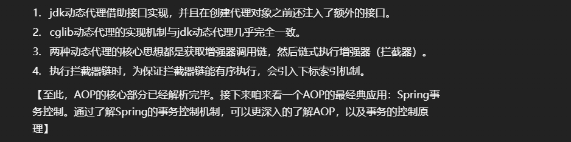
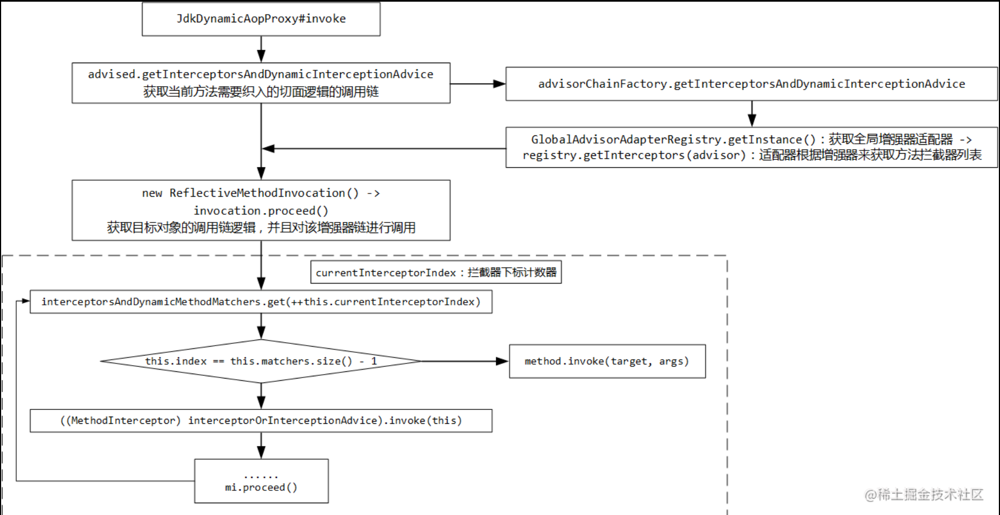

# AOP：jdk动态代理&Cglib的执行调用链

## 设计原理

在Spring AOP通过JDK或CGLIB的方式生成代理对象的时候，相关的拦截器已经配置到代理对象中，拦截器在

代理对象中起作用是通过对这些方法的回调来完成的。

如果使用JDK动态代理来生成代理对象，通过InvocationHandler来设置拦截器回调；

如果使用CGLIB动态代理生成代理对象，通过DynamicAdvisedInterceptor来完成回调；




## JdkDynamicAopProxy的invoke拦截

```java
public Object invoke(Object proxy, Method method, Object[] args) throws Throwable {
    Object oldProxy = null;
    boolean setProxyContext = false;

    TargetSource targetSource = this.advised.targetSource;
    Object target = null;

    try {
        if (!this.equalsDefined && AopUtils.isEqualsMethod(method)) {
            // The target does not implement the equals(Object) method itself.
            // 不代理目标对象的equals(Object)方法
            return equals(args[0]);
        }
        else if (!this.hashCodeDefined && AopUtils.isHashCodeMethod(method)) {
            // The target does not implement the hashCode() method itself.
            // 不代理目标对象的hashCode()方法
            return hashCode();
        }
        else if (method.getDeclaringClass() == DecoratingProxy.class) {
            // There is only getDecoratedClass() declared -> dispatch to proxy config.
            // 5.1.0 DecoratingProxy
            return AopProxyUtils.ultimateTargetClass(this.advised);
        }
        else if (!this.advised.opaque && method.getDeclaringClass().isInterface() &&
                method.getDeclaringClass().isAssignableFrom(Advised.class)) {
            // Service invocations on ProxyConfig with the proxy config...
            // 目标对象本身就是实现了Advised接口，也不代理（不当代理的代理，不当切面的切面）
            return AopUtils.invokeJoinpointUsingReflection(this.advised, method, args);
        }

        Object retVal;

        // 如果配置了代理对象可以暴露，这里会允许在线程内共享这个代理对象
        if (this.advised.exposeProxy) {
            // Make invocation available if necessary.
            oldProxy = AopContext.setCurrentProxy(proxy);
            setProxyContext = true;
        }

        // Get as late as possible to minimize the time we "own" the target,
        // in case it comes from a pool.
        target = targetSource.getTarget();
        Class<?> targetClass = (target != null ? target.getClass() : null);

        // Get the interception chain for this method.
        // 5.1.1 获取当前方法需要织入的切面逻辑的调用链
        List<Object> chain = this.advised.getInterceptorsAndDynamicInterceptionAdvice(method, targetClass);

        // Check whether we have any advice. If we don't, we can fallback on direct
        // reflective invocation of the target, and avoid creating a MethodInvocation.
        if (chain.isEmpty()) {
            // We can skip creating a MethodInvocation: just invoke the target directly
            // Note that the final invoker must be an InvokerInterceptor so we know it does
            // nothing but a reflective operation on the target, and no hot swapping or fancy proxying.
            // 调用链为空，直接执行目标方法
            Object[] argsToUse = AopProxyUtils.adaptArgumentsIfNecessary(method, args);
            retVal = AopUtils.invokeJoinpointUsingReflection(target, method, argsToUse);
        }
        else {
            // We need to create a method invocation...
            // 5.1.2 获取目标对象的调用链逻辑，并且对该增强器链进行调用
            MethodInvocation invocation =
                    new ReflectiveMethodInvocation(proxy, target, method, args, targetClass, chain);
            // Proceed to the joinpoint through the interceptor chain.
            retVal = invocation.proceed();
        }

        // Massage return value if necessary.
        Class<?> returnType = method.getReturnType();
        // 如果返回值是目标对象本身，并且要执行的目标方法的返回值是代理对象的类型，则返回代理对象本身
        // 简言之，如果返回值的类型是目标对象所属类，就把代理对象返回出去
        if (retVal != null && retVal == target &&
                returnType != Object.class && returnType.isInstance(proxy) &&
                !RawTargetAccess.class.isAssignableFrom(method.getDeclaringClass())) {
            // Special case: it returned "this" and the return type of the method
            // is type-compatible. Note that we can't help if the target sets
            // a reference to itself in another returned object.
            retVal = proxy;
        }
        // 如果返回值满足其为空，不是Void类型，并且是基本数据类型，则抛出异常（基本数据类型的返回值不可能为空）
        else if (retVal == null && returnType != Void.TYPE && returnType.isPrimitive()) {
            throw new AopInvocationException(
                    "Null return value from advice does not match primitive return type for: " + method);
        }
        return retVal;
    }
    finally {
        if (target != null && !targetSource.isStatic()) {
            // Must have come from TargetSource.
            targetSource.releaseTarget(target);
        }
        if (setProxyContext) {
            // Restore old proxy.
            AopContext.setCurrentProxy(oldProxy);
        }
    }
}
```

源码中前面的一组if-else if中出现了一个很陌生的概念：DecoratingProxy 。为了研究它，我们要先回到上一篇的最后部分，来看看 getProxy 方法还有什么名堂。 


### 获取增强器调用链

```java
// Get the interception chain for this method.
// 获取当前方法需要织入的切面逻辑的调用链
List<Object> chain = this.advised.getInterceptorsAndDynamicInterceptionAdvice(method, targetClass);
```

进入到 AdvisedSupport 中： 

```java
public List<Object> getInterceptorsAndDynamicInterceptionAdvice(Method method, @Nullable Class<?> targetClass) {
    MethodCacheKey cacheKey = new MethodCacheKey(method);
    List<Object> cached = this.methodCache.get(cacheKey);
    if (cached == null) {
        cached = this.advisorChainFactory.getInterceptorsAndDynamicInterceptionAdvice(
                this, method, targetClass);
        this.methodCache.put(cacheKey, cached);
    }
    return cached;
}
```

进入到 AdvisedSupport 中：

```java
public List<Object> getInterceptorsAndDynamicInterceptionAdvice(Method method, @Nullable Class<?> targetClass) {
    MethodCacheKey cacheKey = new MethodCacheKey(method);
    List<Object> cached = this.methodCache.get(cacheKey);
    if (cached == null) {
        cached = this.advisorChainFactory.getInterceptorsAndDynamicInterceptionAdvice(
                this, method, targetClass);
        this.methodCache.put(cacheKey, cached);
    }
    return cached;
}
```

这里面的核心方法是if结构中的 

>advisorChainFactory.getInterceptorsAndDynamicInterceptionAdvice ：

```java
// DefaultAdvisorChainFactory
public List<Object> getInterceptorsAndDynamicInterceptionAdvice(
        Advised config, Method method, @Nullable Class<?> targetClass) {

    // This is somewhat tricky... We have to process introductions first,
    // but we need to preserve order in the ultimate list.
    // 增强器适配器注册器，它会根据增强器来解析，返回拦截器数组
    AdvisorAdapterRegistry registry = GlobalAdvisorAdapterRegistry.getInstance();
    Advisor[] advisors = config.getAdvisors();
    List<Object> interceptorList = new ArrayList<>(advisors.length);
    Class<?> actualClass = (targetClass != null ? targetClass : method.getDeclaringClass());
    Boolean hasIntroductions = null;

    for (Advisor advisor : advisors) {
        // PointcutAdvisor 就是在@Aspect标注的切面类中声明的那些通知方法的封装
        if (advisor instanceof PointcutAdvisor) {
            // Add it conditionally.
            PointcutAdvisor pointcutAdvisor = (PointcutAdvisor) advisor;
            if (config.isPreFiltered() || pointcutAdvisor.getPointcut().getClassFilter().matches(actualClass)) {
                MethodMatcher mm = pointcutAdvisor.getPointcut().getMethodMatcher();
                boolean match;
                if (mm instanceof IntroductionAwareMethodMatcher) {
                    if (hasIntroductions == null) {
                        hasIntroductions = hasMatchingIntroductions(advisors, actualClass);
                    }
                    match = ((IntroductionAwareMethodMatcher) mm).matches(method, actualClass, hasIntroductions);
                }
                else {
                    match = mm.matches(method, actualClass);
                }
                if (match) {
                    // 5.1.1.1 适配器根据增强器来获取方法拦截器列表
                    MethodInterceptor[] interceptors = registry.getInterceptors(advisor);
                    if (mm.isRuntime()) {
                        // Creating a new object instance in the getInterceptors() method
                        // isn't a problem as we normally cache created chains.
                        for (MethodInterceptor interceptor : interceptors) {
                            interceptorList.add(new InterceptorAndDynamicMethodMatcher(interceptor, mm));
                        }
                    }
                    else {
                        interceptorList.addAll(Arrays.asList(interceptors));
                    }
                }
            }
        }
        else if (advisor instanceof IntroductionAdvisor) {
            IntroductionAdvisor ia = (IntroductionAdvisor) advisor;
            if (config.isPreFiltered() || ia.getClassFilter().matches(actualClass)) {
                Interceptor[] interceptors = registry.getInterceptors(advisor);
                interceptorList.addAll(Arrays.asList(interceptors));
            }
        }
        else {
            Interceptor[] interceptors = registry.getInterceptors(advisor);
            interceptorList.addAll(Arrays.asList(interceptors));
        }
    }

    return interceptorList;
}
```

源码部分可以简单概括成几步：

1. 获取全局增强器适配器。
2. 遍历所有增强器，如果增强器的类型是 PointcutAdvisor ，并且能匹配这个切入点，则拿适配器去解析增强器，返回一组方法拦截器，添加到拦截器列表中。
3. 如果类型是引入类型、其他类型，同样最终添加到拦截器列表中。 


### 核心调用逻辑 

方法拦截器都获取好了，下面来看核心的增强器链的调用逻辑： 

```java
// We need to create a method invocation...
// 获取目标对象的调用链逻辑，并且对该增强器链进行调用
MethodInvocation invocation =
        new ReflectiveMethodInvocation(proxy, target, method, args, targetClass, chain);
// Proceed to the joinpoint through the interceptor chain.
retVal = invocation.proceed();
```

进入到 ReflectiveMethodInvocation 的 proceed 方法：

```java
public Object proceed() throws Throwable {
    // We start with an index of -1 and increment early.
    // 拦截器链全部调用完，再调用目标方法
    if (this.currentInterceptorIndex == this.interceptorsAndDynamicMethodMatchers.size() - 1) {
        return invokeJoinpoint();
    }

    // 增加计数器，得到下一个通知或者拦截器
    Object interceptorOrInterceptionAdvice =
            this.interceptorsAndDynamicMethodMatchers.get(++this.currentInterceptorIndex);
    if (interceptorOrInterceptionAdvice instanceof InterceptorAndDynamicMethodMatcher) {
        // Evaluate dynamic method matcher here: static part will already have
        // been evaluated and found to match.
        InterceptorAndDynamicMethodMatcher dm =
                (InterceptorAndDynamicMethodMatcher) interceptorOrInterceptionAdvice;
        Class<?> targetClass = (this.targetClass != null ? this.targetClass : this.method.getDeclaringClass());
        if (dm.methodMatcher.matches(this.method, targetClass, this.arguments)) {
            return dm.interceptor.invoke(this);
        }
        else {
            // Dynamic matching failed.
            // Skip this interceptor and invoke the next in the chain.
            return proceed();
        }
    }
    else {
        // It's an interceptor, so we just invoke it: The pointcut will have
        // been evaluated statically before this object was constructed.
        // 调用拦截器的方法
        return ((MethodInterceptor) interceptorOrInterceptionAdvice).invoke(this);
    }
}
```

这段方法看上去逻辑有点复杂但又不太复杂。它提到了一个计数器的概念，用于记录当前拦截器链中调用的位置，以便拦截器链中的拦截器可以有序地调用。 




此时才真正的执行test方法。好了走完这个全程，由此我们可以得出算法逻辑：利用一个全局索引值，决定每次执行的拦截器，当所有拦截器都执行完时，索引值刚好等于 size() - 1，此时就可以执行真正的目标方法了 。


## CglibAopProxy的intercept拦截

在分析CglibAopProxy的AopProxy代理对象生成的时候，我们了解到对于AOP的拦截调用，其回调是在

DynamicAdvisedInterceptor对象中实现的，这个回调的实现在intercept()方法中。

DynamicAdvisedInterceptor.intercept()方法源码：

```java
@Nullable
public Object intercept(Object proxy, Method method, Object[] args, MethodProxy methodProxy) throws Throwable {
    Object oldProxy = null;
    boolean setProxyContext = false;
    Object target = null;
    TargetSource targetSource = this.advised.getTargetSource();
    try {
        if (this.advised.exposeProxy) {
            // Make invocation available if necessary.
            oldProxy = AopContext.setCurrentProxy(proxy);
            setProxyContext = true;
        }
        // Get as late as possible to minimize the time we "own" the target, in case it comes from a pool...
        target = targetSource.getTarget();
        Class<?> targetClass = (target != null ? target.getClass() : null);
        // 获取当前方法需要织入的切面逻辑的调用链（与jdk动态代理一致）
        List<Object> chain = this.advised.getInterceptorsAndDynamicInterceptionAdvice(method, targetClass);
        Object retVal;
        // Check whether we only have one InvokerInterceptor: that is,
        // no real advice, but just reflective invocation of the target.
        if (chain.isEmpty() && Modifier.isPublic(method.getModifiers())) {
            // We can skip creating a MethodInvocation: just invoke the target directly.
            // Note that the final invoker must be an InvokerInterceptor, so we know
            // it does nothing but a reflective operation on the target, and no hot
            // swapping or fancy proxying.
            Object[] argsToUse = AopProxyUtils.adaptArgumentsIfNecessary(method, args);
            retVal = methodProxy.invoke(target, argsToUse);
        }
        else {
            // We need to create a method invocation...
            // 5.2.1 创建CglibMethodInvocation，执行目标方法代理
            retVal = new CglibMethodInvocation(proxy, target, method, args, targetClass, chain, methodProxy).proceed();
        }
        retVal = processReturnType(proxy, target, method, retVal);
        return retVal;
    }
    finally {
        if (target != null && !targetSource.isStatic()) {
            targetSource.releaseTarget(target);
        }
        if (setProxyContext) {
            // Restore old proxy.
            AopContext.setCurrentProxy(oldProxy);
        }
    }
}
```

发现执行逻辑与jdk动态代理几乎完全一致，核心原理和使用的类也一致，不再赘述，小伙伴们可自行编写测试Demo来实际Debug一圈，体会AOP的执行机制。


## Aspect中的四种通知在源码中的实现

### @Before

```
public class MethodBeforeAdviceInterceptor implements MethodInterceptor, Serializable {
	private MethodBeforeAdvice advice;

	@Override
	public Object invoke(MethodInvocation mi) throws Throwable {
		this.advice.before(mi.getMethod(), mi.getArguments(), mi.getThis() );
		return mi.proceed();
	}

}
```

先执行前置通知，再执行目标方法。

......


