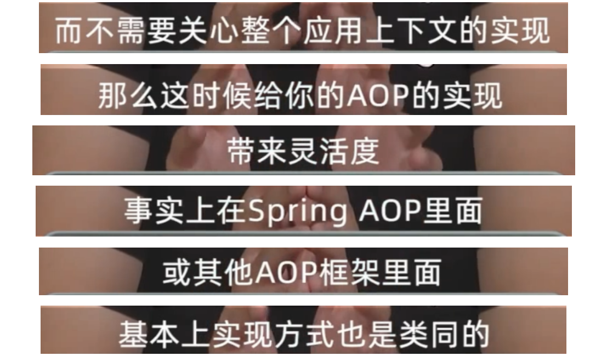
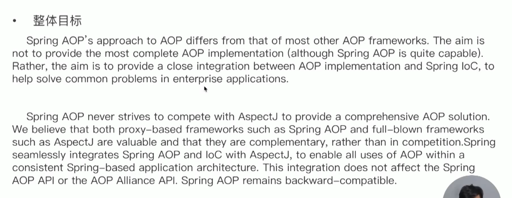
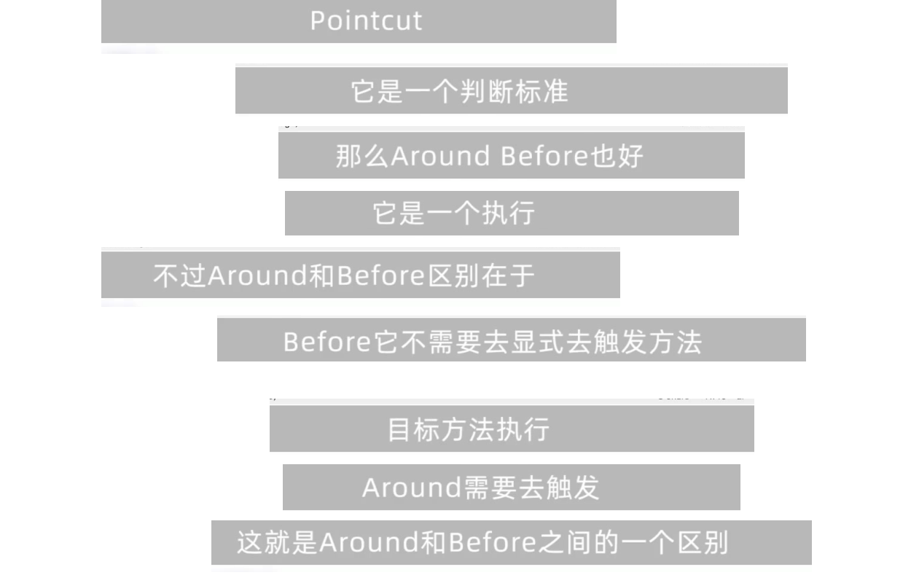

# 第一章 Spring AOP 总览  


### 知识储备： 基础、 基础， 还是基础！


### AOP 引入： OOP 存在哪些局限性？

### AOP 常见使用场景

### AOP 概念： Aspect、 Join Point 和 Advice 等术语应该如何理解？

### Java AOP 设计模式： 代理、 判断和拦截器模式

### Java AOP 代理模式（ Proxy） ： Java 静态代理和动态代理的区别是什么？


### Java AOP 判断模式（ Predicate） ： 如何筛选 Join Point？

#### 判断来源

• 类型（ Class）
• 方法（ Method）
• 注解（ Annotation）
• 参数（ Parameter）
• 异常（ Exception）

```java
public class TargetFilterDemo {

    public static void main(String[] args) throws ClassNotFoundException {
        String targetClassName = "org.geekbang.thinking.in.spring.aop.overview.EchoService";
        // 获取当前线程 ClassLoader
        ClassLoader classLoader = Thread.currentThread().getContextClassLoader();
        // 获取目标类
        Class<?> targetClass = classLoader.loadClass(targetClassName);
        // 方法定义：String echo(String message);
        // Spring 反射工具类
        Method targetMethod = ReflectionUtils.findMethod(targetClass, "echo", String.class);
        System.out.println(targetMethod);

        // 查找方法  throws 类型为 NullPointerException
        ReflectionUtils.doWithMethods(targetClass, new ReflectionUtils.MethodCallback() {
            @Override
            public void doWith(Method method) throws IllegalArgumentException, IllegalAccessException {
                System.out.println("仅抛出 NullPointerException 方法为：" + method);
            }
        }, new ReflectionUtils.MethodFilter() {
            @Override
            public boolean matches(Method method) {
                Class[] parameterTypes = method.getParameterTypes();
                Class[] exceptionTypes = method.getExceptionTypes();
                return parameterTypes.length == 1
                        && String.class.equals(parameterTypes[0])
                        && exceptionTypes.length == 1
                        && NullPointerException.class.equals(exceptionTypes[0]);
            }
        });
    }
}
```


### Java AOP 拦截器模式（ Interceptor） ： 拦截执行分别代表什么？

#### 拦截类型

• 前置拦截（ Before）
• 后置拦截（ After）
• 异常拦截（ Exception）  

```java
/**
 * AOP 拦截器示例
 （可插拔）
 *
 * @author <a href="mailto:mercyblitz@gmail.com">Mercy</a>
 * @since
 */
public class AopInterceptorDemo {

    public static void main(String[] args) {
        // 前置模式 + 后置模式
        ClassLoader classLoader = Thread.currentThread().getContextClassLoader();
        Object proxy = Proxy.newProxyInstance(classLoader, new Class[]{EchoService.class}, new InvocationHandler() {
            @Override
            public Object invoke(Object proxy, Method method, Object[] args) throws Throwable {
                if (EchoService.class.isAssignableFrom(method.getDeclaringClass())) {
                    // 前置拦截器
                    BeforeInterceptor beforeInterceptor = new BeforeInterceptor() {
                        @Override
                        public Object before(Object proxy, Method method, Object[] args) {
                            return System.currentTimeMillis();
                        }
                    };
                    Long startTime = 0L;
                    Long endTime = 0L;
                    Object result = null;
                    try {
                        // 前置拦截
                        startTime = (Long) beforeInterceptor.before(proxy, method, args);
                        EchoService echoService = new DefaultEchoService();
                        result = echoService.echo((String) args[0]); // 目标对象执行
                        // 方法执行后置拦截器
                        AfterReturnInterceptor afterReturnInterceptor = new AfterReturnInterceptor() {
                            @Override
                            public Object after(Object proxy, Method method, Object[] args, Object returnResult) {
                                return System.currentTimeMillis();
                            }
                        };
                        // 执行 after
                        endTime = (Long) afterReturnInterceptor.after(proxy, method, args, result);
                    } catch (Exception e) {
                        // 异常拦截器（处理方法执行后）
                        ExceptionInterceptor interceptor = (proxy1, method1, args1, throwable) -> {
                        };
                    } finally {
                        // finally 后置拦截器
                        FinallyInterceptor interceptor = new TimeFinallyInterceptor(startTime, endTime);
                        Long costTime = (Long) interceptor.finalize(proxy, method, args, result);
                        System.out.println("echo 方法执行的实现：" + costTime + " ms.");
                    }

                }
                return null;
            }
        });

        EchoService echoService = (EchoService) proxy;
        echoService.echo("Hello,World");
    }
}

class TimeFinallyInterceptor implements FinallyInterceptor {

    private final Long startTime;

    private final Long endTime;

    TimeFinallyInterceptor(Long startTime, Long endTime) {
        this.startTime = startTime;
        this.endTime = endTime;
    }

    @Override
    public Object finalize(Object proxy, Method method, Object[] args, Object returnResult) {
        // 方法执行时间（毫秒）
        Long costTime = endTime - startTime;
        return costTime;
    }
}
```





### Spring AOP 功能概述： 核心特性、 编程模型和使用限制

#### 核心特性

• 纯 Java 实现、 无编译时特殊处理、 不修改和控制 ClassLoader
• 仅支持方法级别的 Join Points
• 非完整 AOP 实现框架
• Spring IoC 容器整合
• AspectJ 注解驱动整合（ 非竞争关系）  

### Spring AOP 编程模型： 注解驱动、 XML 配置驱动和底层 API

#### 注解驱动

**实现：** Enable 模块驱动， @EnableAspectJAutoProxy
**注解：**
	• 激活 AspectJ 自动代理： @EnableAspectJAutoProxy
	• Aspect ： @Aspect
	• Pointcut ： @Pointcut
	• Advice ： @Before、 @AfterReturning、 @AfterThrowing、 @After、 @Around
	• Introduction ： @DeclareParents  

#### XML 配置驱动

 **实现：** Spring Extensble XML Authoring
 **XML 元素**

​	• 激活 AspectJ 自动代理： <aop:aspectj-autoproxy/>
​	• 配置： <aop:config/>
​	• Aspect ： <aop:aspect/>
​	• Pointcut ： <aop:pointcut/>
​	• Advice ： <aop:around/>、 <aop:before/>、 <aop:after-returning/>、 <aop:after-		throwing/> 和 <aop:after/>
​	• Introduction ： <aop:declare-parents/>
​	• 代理 Scope ： <aop:scoped-proxy/>

#### 底层 API

• 实现： JDK 动态代理、 CGLIB 以及 AspectJ
• API：
	• 代理： AopProxy
	• 配置： ProxyConfig
	• Join Point： JoinPoint
	• Pointcut ： Pointcut
	• Advice ： Advice、 BeforeAdvice、 AfterAdvice、 AfterReturningAdvice、ThrowsAdvice

###  Spring AOP 设计目标： Spring AOP 与 AOP 框架之间的关系是竞争还是互补？

#### 整体目标



### Spring AOP Advice 类型： Spring AOP 丰富了哪些 AOP Advice 呢？

#### Advice 类型

• 环绕（ Around）
• 前置（ Before）
• 后置（ After）
	• 方法执行
	• finally 执行
• 异常（ Exception）  

###  Spring AOP 代理实现： 为什么 Spring Framework 选择三种不同 AOP 实现？

• JDK 动态代理实现 - 基于接口代理
• CGLIB 动态代理实现 - 基于类代理（ 字节码提升）
• AspectJ 适配实现  

###  JDK 动态代理： 为什么 Proxy.newProxyInstance 会生成新的字节码？

###  CGLIB 动态代理： 为什么 Java 动态代理无法满足 AOP 的需要？

```java
/**
 * CGLIB 动态代理示例
 *
 * @author <a href="mailto:mercyblitz@gmail.com">Mercy</a>
 * @since
 */
public class CglibDynamicProxyDemo {

    public static void main(String[] args) {
        Enhancer enhancer = new Enhancer();
        // 指定 super class = DefaultEchoService.class
        Class<?> superClass = DefaultEchoService.class;
        enhancer.setSuperclass(superClass);
        // 指定拦截接口
        enhancer.setInterfaces(new Class[]{EchoService.class});
        enhancer.setCallback(new MethodInterceptor() {
            @Override
            public Object intercept(Object source, Method method, Object[] args,
                                    MethodProxy methodProxy) throws Throwable {
                long startTime = System.currentTimeMillis();
                // Source -> CGLIB 子类
                // 目标类  -> DefaultEchoService
                // 错误使用
//                Object result = method.invoke(source, args);
                // 正确的方法调用
                Object result = methodProxy.invokeSuper(source, args);
                long costTime = System.currentTimeMillis() - startTime;
                System.out.println("[CGLIB 字节码提升] echo 方法执行的实现：" + costTime + " ms.");
                return result;
            }
        });

        // 创建代理对象
        EchoService echoService = (EchoService) enhancer.create();
        // 输出执行结果
        System.out.println(echoService.echo("Hello,World"));
    }
}
```

###  AspectJ 代理代理： 为什么 Spring 推荐 AspectJ 注解？


###  AspectJ 基础： Aspect、 Join Points、 Pointcuts 和 Advice 语法和特性

#### AspectJ 语法

• Aspect
• Join Points
• Pointcuts
• Advice
• Introduction  

###  AspectJ 注解驱动： 注解能完全替代 AspectJ 语言吗？

#### AspectJ 注解

• 激活 AspectJ 自动代理： @EnableAspectJAutoProxy
• Aspect ： @Aspect
• Pointcut ： @Pointcut
• Advice ： @Before、 @AfterReturning、 @AfterThrowing、 @After、 @Around
• Introduction ： @DeclareParents  

### 面试题精选

### 知识储  


# 第二章： Spring AOP 基础  

## Spring 核心基础： 《小马哥讲 Spring核心编程思想》 还记得多少？

### 《小马哥讲 Spring核心编程思想》•

### • 第三章： Spring IoC 容器概述
• 第九章： Spring Bean 生命周期（ Bean Lifecycle）
• 第十章： Spring 配置元信息（ Configuration Metadata）
• 第十八章： Spring 注解（ Annotations）
• 第二十章： Spring IoC 容器生命周期（ Container Lifecycle）  

## @AspectJ 注解创建代理

### 激活 @AspectJ 模块

• 注解激活 - @EnableAspectJAutoProxy

• XML 配置 - <aop:aspectj-autoproxy/>

### 声明 Aspect

• @Aspect  

```java
@Aspect        // 声明为 Aspect 切面
@Configuration // Configuration class
@EnableAspectJAutoProxy // 激活 Aspect 注解自动代理
public class AspectJAnnotationDemo {

    public static void main(String[] args) {
        AnnotationConfigApplicationContext context = new AnnotationConfigApplicationContext();
        context.register(AspectJAnnotationDemo.class);
        context.refresh();

        AspectJAnnotationDemo aspectJAnnotationDemo = context.getBean(AspectJAnnotationDemo.class);

        context.close();
    }
}
```

```java
@Aspect        // 声明为 Aspect 切面
@Configuration // Configuration class
public class AspectJXmlDemo {

    public static void main(String[] args) {

        ClassPathXmlApplicationContext context =
                new ClassPathXmlApplicationContext("classpath:/META-INF/spring-aop-context.xml");

//        AspectJXmlDemo aspectJAnnotationDemo = context.getBean(AspectJXmlDemo.class);

        context.close();

    }
}
```

```xml
<aop:aspectj-autoproxy/>
```

## 编程方式创建 @AspectJ 代理

### 实现类

• org.springframework.aop.aspectj.annotation.AspectJProxyFactory  

```java
public class AspectJAnnotationUsingAPIDemo {

    public static void main(String[] args) {

        // 通过创建一个 HashMap 缓存，作为被代理对象
        Map<String, Object> cache = new HashMap<>();
        // 创建 Proxy 工厂(AspectJ)
        AspectJProxyFactory proxyFactory = new AspectJProxyFactory(cache);
        // 增加 Aspect 配置类
        proxyFactory.addAspect(AspectConfiguration.class);
        // 设置暴露代理对象到 AopContext
        proxyFactory.setExposeProxy(true);
        proxyFactory.addAdvice(new MethodBeforeAdvice() {
            @Override
            public void before(Method method, Object[] args, Object target) throws Throwable {
                if ("put".equals(method.getName()) && args.length == 2) {
                    Object proxy = AopContext.currentProxy();
                    System.out.printf("[MethodBeforeAdvice] 当前存放是 Key: %s , Value : %s ，" +
                            "代理对象：%s\n", args[0], args[1], proxy);
                }
            }
        });
        ......
    }
}
```

## XML 配置驱动 - 创建 AOP 代理

### 实现方法

#### 配置 org.springframework.aop.framework.ProxyFactoryBean

#### Spring Schema-Based 配置

​	• <aop:config>
​	•<aop:aspectj-autoproxy/>  


```java
@Aspect        // 声明为 Aspect 切面
@Configuration // Configuration class
public class ProxyFactoryBeanDemo {

    public static void main(String[] args) {
        ClassPathXmlApplicationContext context = new ClassPathXmlApplicationContext("classpath:/META-INF/spring-aop-context.xml");

        EchoService echoService = context.getBean("echoServiceProxyFactoryBean", EchoService.class);

        System.out.println(echoService.echo("Hello,World"));

        context.close();
    }
}
```

```java
public class EchoServiceMethodInterceptor implements MethodInterceptor {

    @Override
    public Object invoke(MethodInvocation invocation) throws Throwable {
        Method method = invocation.getMethod();
        System.out.println("拦截 EchoService 的方法：" + method);
        return invocation.proceed();
    }
```

```xml
<bean id="echoServiceMethodInterceptor"
      class="org.geekbang.thinking.in.spring.aop.features.interceptor.EchoServiceMethodInterceptor"/>

<bean id="echoServiceProxyFactoryBean" class="org.springframework.aop.framework.ProxyFactoryBean">
    <property name="targetName" value="echoService"/>
    <property name="interceptorNames">
        <value>echoServiceMethodInterceptor</value>
    </property>
</bean>
```


## 标准代理工厂 API - ProxyFactory

```java
public class ProxyFactoryDemo {

    public static void main(String[] args) {
        DefaultEchoService defaultEchoService = new DefaultEchoService();
        // 注入目标对象（被代理）
        ProxyFactory proxyFactory = new ProxyFactory(defaultEchoService);
        proxyFactory.setTargetClass(DefaultEchoService.class);
        // 添加 Advice 实现 MethodInterceptor < Interceptor < Advice
        proxyFactory.addAdvice(new EchoServiceMethodInterceptor());
        // 获取代理对象
        EchoService echoService = (EchoService) proxyFactory.getProxy();
        System.out.println(echoService.echo("Hello,World"));
    }
}
```

## @AspectJ Pointcut 指令与表达式

### 支持的指令

• @target: Limits matching to join points (the execution of methods when using
Spring AOP) where the class of the executing object has an annotation of the given
type.
• @args: Limits matching to join points (the execution of methods when using Spring
AOP) where the runtime type of the actual arguments passed have annotations of the
given types.
• @within: Limits matching to join points within types that have the given
annotation (the execution of methods declared in types with the given annotation
when using Spring AOP).
• @annotation: Limits matching to join points where the subject of the join point
(the method being run in Spring AOP) has the given annotation.  

### 不支持的指令

• call, get, set, preinitialization, staticinitialization, initialization, handler,
adviceexecution, withincode, cflow, cflowbelow, if, @this, 和 @withincode  

```java
/**
 * Pointcut 示例
 *
 * @author <a href="mailto:mercyblitz@gmail.com">Mercy</a>
 * @since
 */
@Configuration // Configuration class
@EnableAspectJAutoProxy // 激活 Aspect 注解自动代理
public class AspectJAnnotatedPointcutDemo {

    public static void main(String[] args) {
        AnnotationConfigApplicationContext context = new AnnotationConfigApplicationContext();
        context.register(AspectJAnnotatedPointcutDemo.class,
                AspectConfiguration.class,
                AspectConfiguration2.class);
        context.refresh();

        AspectJAnnotatedPointcutDemo aspectJAnnotationDemo = context.getBean(AspectJAnnotatedPointcutDemo.class);

        aspectJAnnotationDemo.execute();

        context.close();
    }

    public void execute() {
        System.out.println("execute()...");
    }
}
```

```java
/**
 * Aspect 配置类
 *
 * @author <a href="mailto:mercyblitz@gmail.com">Mercy</a>
 * @since
 */
@Aspect
@Order
public class AspectConfiguration {

    @Pointcut("execution(public * *(..))") // 匹配 Join Point
    private void anyPublicMethod() { // 方法名即 Pointcut 名
        System.out.println("@Pointcut at any public method.");
    }

    @Around("anyPublicMethod()")         // Join Point 拦截动作
    public Object aroundAnyPublicMethod(ProceedingJoinPoint pjp) throws Throwable {
        System.out.println("@Around any public method.");
        return pjp.proceed();
    }
    ...
    ....
}
```


## XML 配置 Pointcut

### XML 配置

• <aop:pointcut />  

```java
/**
 * Aspect XML 配置类
 *
 * @author <a href="mailto:mercyblitz@gmail.com">Mercy</a>
 * @since
 */
public class AspectXmlConfig {

    public Object aroundAnyPublicMethod(ProceedingJoinPoint pjp) throws Throwable {
        Random random = new Random();
        if (random.nextBoolean()) {
            throw new RuntimeException("For Purpose from XML configuration.");
        }
        System.out.println("@Around any public method : " + pjp.getSignature());
        return pjp.proceed();
    }

    public void beforeAnyPublicMethod() {
        System.out.println("@Before any public method.");
    }

    public void finalizeAnyPublicMethod() {
        System.out.println("@After any public method.");
    }

    public void afterAnyPublicMethod() {
        System.out.println("@AfterReturning any public method.");
    }

    public void afterThrowingAnyPublicMethod() {
        System.out.println("@AfterThrowing any public method.");
    }
}

```

```xml
<bean id="aspectXmlConfig" class="org.geekbang.thinking.in.spring.aop.features.aspect.AspectXmlConfig"/>

<aop:config>
    <!--        <aop:pointcut id="allPointcut" expression="execution(* * *(..))"/>-->
    <aop:aspect id="AspectXmlConfig" ref="aspectXmlConfig">
        <aop:pointcut id="anyPublicMethod" expression="execution(public * *(..))"/>
        <aop:around method="aroundAnyPublicMethod" pointcut-ref="anyPublicMethod"/>
        <aop:around method="aroundAnyPublicMethod" pointcut="execution(public * *(..))"/>
        <aop:before method="beforeAnyPublicMethod" pointcut-ref="anyPublicMethod"/>
        <aop:before method="beforeAnyPublicMethod" pointcut="execution(public * *(..))"/>
        <aop:after method="finalizeAnyPublicMethod" pointcut-ref="anyPublicMethod"/>
        <aop:after-returning method="afterAnyPublicMethod" pointcut-ref="anyPublicMethod"/>
        <aop:after-throwing method="afterThrowingAnyPublicMethod" pointcut-ref="anyPublicMethod"/>
    </aop:aspect>
</aop:config>
```


## API 实现 Pointcut

•  核心 API - org.springframework.aop.Pointcut

​		• org.springframework.aop.ClassFilter
​		• org.springframework.aop.MethodMatcher
• 适配实现 - DefaultPointcutAdvisor  

```java
public class PointcutAPIDemo {

    public static void main(String[] args) {

        EchoServicePointcut echoServicePointcut = new EchoServicePointcut("echo", EchoService.class);

        ComposablePointcut pointcut = new ComposablePointcut(EchoServiceEchoMethodPointcut.INSTANCE);
        // 组合实现
        pointcut.intersection(echoServicePointcut.getClassFilter());
        pointcut.intersection(echoServicePointcut.getMethodMatcher());


        // 将 Pointcut 适配成 Advisor

        DefaultPointcutAdvisor advisor = new DefaultPointcutAdvisor(pointcut, new EchoServiceMethodInterceptor());

        DefaultEchoService defaultEchoService = new DefaultEchoService();
        ProxyFactory proxyFactory = new ProxyFactory(defaultEchoService);
        // 添加 Advisor
        proxyFactory.addAdvisor(advisor);

        // 获取代理对象
        EchoService echoService = (EchoService) proxyFactory.getProxy();
        System.out.println(echoService.echo("Hello,World"));
    }
}
```

```java
public class EchoServiceMethodInterceptor implements MethodInterceptor {

    @Override
    public Object invoke(MethodInvocation invocation) throws Throwable {
        Method method = invocation.getMethod();
        System.out.println("拦截 EchoService 的方法：" + method);
        return invocation.proceed();
    }
}
```

```java
public class EchoServicePointcut extends StaticMethodMatcherPointcut {

    private String methodName;

    private Class targetClass;

    public EchoServicePointcut(String methodName, Class targetClass) {
        this.methodName = methodName;
        this.targetClass = targetClass;
    }

    @Override
    public boolean matches(Method method, Class<?> targetClass) {
        return Objects.equals(methodName, method.getName())
                && this.targetClass.isAssignableFrom(targetClass);
    }
}
```


## @AspectJ 拦截动作： @Around 与 @Pointcut 有区别吗？

```java
/**
 * Aspect 配置类
 *
 * @author <a href="mailto:mercyblitz@gmail.com">Mercy</a>
 * @since
 */
@Aspect
@Order
public class AspectConfiguration {

    @Pointcut("execution(public * *(..))") // 匹配 Join Point
    private void anyPublicMethod() { // 方法名即 Pointcut 名
        System.out.println("@Pointcut at any public method.");
    }

    @Around("anyPublicMethod()")         // Join Point 拦截动作
    public Object aroundAnyPublicMethod(ProceedingJoinPoint pjp) throws Throwable {
        System.out.println("@Around any public method.");
        return pjp.proceed();
    }

    @Before("anyPublicMethod()")          // Join Point 拦截动作
    public void beforeAnyPublicMethod() throws Throwable {
        Random random = new Random();

        if (random.nextBoolean()) {
            throw new RuntimeException("For Purpose.");
        }
        System.out.println("@Before any public method.");
    }
}
```

```java
/**
 * Pointcut 示例
 *
 * @author <a href="mailto:mercyblitz@gmail.com">Mercy</a>
 * @since
 */
@Configuration // Configuration class
@EnableAspectJAutoProxy // 激活 Aspect 注解自动代理
public class AspectJAnnotatedPointcutDemo {

    public static void main(String[] args) {
        AnnotationConfigApplicationContext context = new AnnotationConfigApplicationContext();
        context.register(AspectJAnnotatedPointcutDemo.class,
                AspectConfiguration.class,
                AspectConfiguration2.class);
        context.refresh();

        AspectJAnnotatedPointcutDemo aspectJAnnotationDemo = context.getBean(AspectJAnnotatedPointcutDemo.class);

        aspectJAnnotationDemo.execute();

        context.close();
    }

    public void execute() {
        System.out.println("execute()...");
    }
}
```




## XML 配置 Around Advice

• XML 配置
	• <aop:around />  

```xml
<aop:config>
    <!--        <aop:pointcut id="allPointcut" expression="execution(* * *(..))"/>-->
    <aop:aspect id="AspectXmlConfig" ref="aspectXmlConfig">
        <aop:pointcut id="anyPublicMethod" expression="execution(public * *(..))"/>
        <aop:around method="aroundAnyPublicMethod" pointcut-ref="anyPublicMethod"/>
        <aop:around method="aroundAnyPublicMethod" pointcut="execution(public * *(..))"/>
        <aop:before method="beforeAnyPublicMethod" pointcut-ref="anyPublicMethod"/>
        <aop:before method="beforeAnyPublicMethod" pointcut="execution(public * *(..))"/>
        <aop:after method="finalizeAnyPublicMethod" pointcut-ref="anyPublicMethod"/>
        <aop:after-returning method="afterAnyPublicMethod" pointcut-ref="anyPublicMethod"/>
        <aop:after-throwing method="afterThrowingAnyPublicMethod" pointcut-ref="anyPublicMethod"/>
    </aop:aspect>
</aop:config>
```

## API 实现 Around Advice

## @AspectJ 前置动作： @Before 与 @Around 谁优先级执行？

## XML 配置 Before Advice

•     XML 元素 - <aop:before>
	•    声明规则
		•     <aop:config>
				•     <aop:aspect>
					•     <aop:before>

•    属性设置（来源于 Spring AOP Schema 类型 basicAdviceType）
	•     pointcut：  Pointcut 表达式内容
	•     pointcut-ref： Pointcut 表达式名称

## API 实现 Before Advice

### 核心接口 - org.springframework.aop.BeforeAdvice

• 类型： 标记接口， 与 org.aopalliance.aop.Advice 类似
• 方法 JoinPoint 扩展 - org.springframework.aop.MethodBeforeAdvice
• 接受对象 - org.springframework.aop.framework.AdvisedSupport
		• 基础实现类 - org.springframework.aop.framework.ProxyCreatorSupport
				• 常见实现类
						• org.springframework.aop.framework.ProxyFactory
						• org.springframework.aop.framework.ProxyFactoryBean
					

​	• org.springframework.aop.aspectj.annotation.AspectJProxyFactory  

## @AspectJ 后置动作 - 三种 After Advice 之间的关系？

### After Advice 注解

• 方法返回后： @org.aspectj.lang.annotation.AfterReturning
• 异常发生后： @org.aspectj.lang.annotation.AfterThrowing
• finally 执行： @org.aspectj.lang.annotation.After  

```java
/**
 * Aspect 配置类
 *
 * @author <a href="mailto:mercyblitz@gmail.com">Mercy</a>
 * @since
 */
@Aspect
@Order
public class AspectConfiguration {

    @Pointcut("execution(public * *(..))") // 匹配 Join Point
    private void anyPublicMethod() { // 方法名即 Pointcut 名
        System.out.println("@Pointcut at any public method.");
    }

    @Around("anyPublicMethod()")         // Join Point 拦截动作
    public Object aroundAnyPublicMethod(ProceedingJoinPoint pjp) throws Throwable {
        System.out.println("@Around any public method.");
        return pjp.proceed();
    }

    @Before("anyPublicMethod()")          // Join Point 拦截动作
    public void beforeAnyPublicMethod() throws Throwable {
        Random random = new Random();

        if (random.nextBoolean()) {
            throw new RuntimeException("For Purpose.");
        }
        System.out.println("@Before any public method.");
    }


    @After("anyPublicMethod()")
    public void finalizeAnyPublicMethod() {
        System.out.println("@After any public method.");
    }

    @AfterReturning("anyPublicMethod()")
    // AspectJAfterReturningAdvice is AfterReturningAdvice
    // 一个 AfterReturningAdviceInterceptor 关联一个 AfterReturningAdvice
    // Spring 封装 AfterReturningAdvice -> AfterReturningAdviceInterceptor
    // AfterReturningAdviceInterceptor is MethodInterceptor
    // AfterReturningAdviceInterceptor
    //  -> AspectJAfterReturningAdvice
    //      -> AbstractAspectJAdvice#invokeAdviceMethodWithGivenArgs
    public void afterAnyPublicMethod() {
        System.out.println("@AfterReturning any public method.");
    }

    @AfterThrowing("anyPublicMethod()")
    public void afterThrowingAnyPublicMethod() {
        System.out.println("@AfterThrowing any public method");
    }


    public String toString() {
        return "AspectConfiguration";
    }

    private int getValue() {
        return 0;
    }
}
```

## XML 配置三种 After Advice

• XML 元素 - <aop:after>
		• 声明规则
				• <aop:config>
						• <aop:aspect>
								• <aop:after>
• 属性设置（ 来源于 Spring AOP Schema 类型 basicAdviceType）
		• pointcut： Pointcut 表达式内容
		• pointcut-ref： Pointcut 表达式名称  

```xml
bean id="aspectXmlConfig" class="org.geekbang.thinking.in.spring.aop.features.aspect.AspectXmlConfig"/>

<aop:config>
    <!--        <aop:pointcut id="allPointcut" expression="execution(* * *(..))"/>-->
    <aop:aspect id="AspectXmlConfig" ref="aspectXmlConfig">
        <aop:pointcut id="anyPublicMethod" expression="execution(public * *(..))"/>
        <aop:around method="aroundAnyPublicMethod" pointcut-ref="anyPublicMethod"/>
        <aop:around method="aroundAnyPublicMethod" pointcut="execution(public * *(..))"/>
        <aop:before method="beforeAnyPublicMethod" pointcut-ref="anyPublicMethod"/>
        <aop:before method="beforeAnyPublicMethod" pointcut="execution(public * *(..))"/>
        <aop:after method="finalizeAnyPublicMethod" pointcut-ref="anyPublicMethod"/>
        <aop:after-returning method="afterAnyPublicMethod" pointcut-ref="anyPublicMethod"/>
        <aop:after-throwing method="afterThrowingAnyPublicMethod" pointcut-ref="anyPublicMethod"/>
    </aop:aspect>
</aop:config>
```

## API 实现三种 After Advice

核心接口 - org.springframework.aop.AfterAdvice
		• 类型： 标记接口， 与 org.aopalliance.aop.Advice 类似
• 扩展
		• org.springframework.aop.AfterReturningAdvice
		• org.springframework.aop.ThrowsAdvice
• 接受对象 - org.springframework.aop.framework.AdvisedSupport
		• 基础实现类 - org.springframework.aop.framework.ProxyCreatorSupport
				• 常见实现类
						• org.springframework.aop.framework.ProxyFactory
						• org.springframework.aop.framework.ProxyFactoryBean
						• org.springframework.aop.aspectj.annotation.AspectJProxyFactory  

```java
/**
 * @author <a href="mailto:mercyblitz@gmail.com">Mercy</a>
 * @since
 */
public class AspectJAnnotationUsingAPIDemo {

    public static void main(String[] args) {

        // 通过创建一个 HashMap 缓存，作为被代理对象
        Map<String, Object> cache = new HashMap<>();
        // 创建 Proxy 工厂(AspectJ)
        AspectJProxyFactory proxyFactory = new AspectJProxyFactory(cache);
        // 增加 Aspect 配置类
        proxyFactory.addAspect(AspectConfiguration.class);
        // 设置暴露代理对象到 AopContext
        proxyFactory.setExposeProxy(true);
        proxyFactory.addAdvice(new MethodBeforeAdvice() {
            @Override
            public void before(Method method, Object[] args, Object target) throws Throwable {
                if ("put".equals(method.getName()) && args.length == 2) {
                    Object proxy = AopContext.currentProxy();
                    System.out.printf("[MethodBeforeAdvice] 当前存放是 Key: %s , Value : %s ，" +
                            "代理对象：%s\n", args[0], args[1], proxy);
                }
            }
        });

        // 添加 AfterReturningAdvice
        proxyFactory.addAdvice(new AfterReturningAdvice() {

            @Override
            public void afterReturning(Object returnValue, Method method, Object[] args, Object target)
                    throws Throwable {
                if ("put".equals(method.getName()) && args.length == 2) {
                    System.out.printf("[AfterReturningAdvice] 当前存放是 Key: %s , 新存放的 Value : %s , 之前关联的 Value : %s\n ",
                            args[0],    // key
                            args[1],    // new value
                            returnValue // old value
                    );
                }
            }
        });

        // 存储数据
        // cache.put("1", "A");
        // 通过代理对象存储数据
        Map<String, Object> proxy = proxyFactory.getProxy();
        proxy.put("1", "A");
        proxy.put("1", "B");
        System.out.println(cache.get("1"));

    }
}
```

## 自动动态代理

### 代表实现

• org.springframework.aop.framework.autoproxy.BeanNameAutoProxyCreator
• org.springframework.aop.framework.autoproxy.DefaultAdvisorAutoProxyCreator
• org.springframework.aop.aspectj.annotation.AnnotationAwareAspectJAutoProxyCreator  

## 替换 TargetSource

### 代表实现

• org.springframework.aop.target.HotSwappableTargetSource
• org.springframework.aop.target.AbstractPoolingTargetSource
• org.springframework.aop.target.PrototypeTargetSource
• org.springframework.aop.target.ThreadLocalTargetSource
• org.springframework.aop.target.SingletonTargetSource  

## 面试题精选


# 第三章  Spring AOP API 设计与实现  

## Spring AOP API 整体设计

• Join point - Joinpoint
• Pointcut - Pointcut
• Advice 执行动作 - Advice
• Advice 容器 - Advisor
• Introduction - IntroductionInfo
• 代理对象创建基础类 - ProxyCreatorSupport
• 代理工厂 - ProxyFactory、 ProxyFactoryBean
• AopProxyFactory 配置管理器 - AdvisedSupport
• IoC 容器自动代理抽象 - AbstractAutoProxyCreator  

## 接入点接口 - Joinpoint

### Interceptor 执行上下文 - Invocation

• 方法拦截器执行上下文 - MethodInvocation
• 构造器拦截器执行上下文 - ConstructorInvocation

### MethodInvocation 实现

• 基于反射 - ReflectiveMethodInvocation
• 基于 CGLIB - CglibMethodInvocation  

## Joinpoint 条件接口 - Pointcut

### 核心组件

• 类过滤器 - ClassFilter
• 方法匹配器 - MethodMatcher  

## Pointcut 操作 - ComposablePointcut

### • 组合实现 - org.springframework.aop.support.ComposablePointcut

### • 工具类

​	• ClassFilter 工具类 - ClassFilters
​	• MethodMatcher 工具类 - MethodMatchers
​	• Pointcut 工具类 - Pointcuts  

## Pointcut 便利实现

• 静态 Pointcut - StaticMethodMatcherPointcut
• 正则表达式 Pointcut - JdkRegexpMethodPointcut
• 控制流 Pointcut - ControlFlowPointcut  

## Pointcut AspectJ 实现 - AspectJExpressionPointcut

## Joinpoint 执行动作 - Advice

## Joinpoint Before Advice 标准实现

## Joinpoint Before Advice AspectJ 实现

## Joinpoint After Advice 标准实现

## Joinpoint After Advice AspectJ 实现

## Advice 容器接口 - Advisor

## Pointcut 与 Advice 连接器 - PointcutAdvisor

Introduction 与 Advice 连接器 - IntroductionAdvisor

Advisor 的 Interceptor 适配器 - AdvisorAdapter

AdvisorAdapter 实现

AOP 代理接口 - AopProxy

AopProxy 工厂接口与实现

JDK AopProxy 实现 - JdkDynamicAopProxy

CGLIB AopProxy 实现 - CglibAopProxy

AopProxyFactory 配置管理器 - AdvisedSupport

Advisor 链工厂接口与实现 - AdvisorChainFactory

目标对象来源接口与实现 - TargetSource

代理对象创建基础类 - ProxyCreatorSupport

AdvisedSupport 事件监听器 - AdvisedSupportListener

ProxyCreatorSupport 标准实现 - ProxyFactory

ProxyCreatorSupport IoC 容器实现 - ProxyFactoryBean

ProxyCreatorSupport AspectJ 实现 - AspectJProxyFactory

IoC 容器自动代理抽象 - AbstractAutoProxyCreator

IoC 容器自动代理标准实现

IoC 容器自动代理 AspectJ 实现 - AspectJAwareAdvisorAutoProxyCreator

AOP Infrastructure Bean 接口 - AopInfrastructureBean

AOP 上下文辅助类 - AopContext

代理工厂工具类 - AopProxyUtils

AOP 工具类 - AopUtils

AspectJ Enable 模块驱动实现 - @EnableAspectJAutoProxy

AspectJ XML 配置驱动实现 - <aop:aspectj-autoproxy/>

AOP 配置 Schema-based 实现 - <aop:config/>

Aspect Schema-based 实现 - <aop:aspect/>

Pointcut Schema-based 实现 - <aop:pointcut/>

Around Advice Schema-based 实现 - <aop:around/>

Before Advice Schema-based 实现 - <aop:before/>

After Advice Schema-based 实现

Introduction Schema-based 实现 - <aop:declare-parents/>

作用域代理 Schema-based 实现 - <aop:scoped-proxy/>

面试题精选


# spring aop   实践场景

日志场景

```java
/**
 * 天火业务日志拦截器
 * 
 * @author zhuaiming
 */
@Slf4j
@Aspect
@Component
public class BalefireBizInterceptor {

    /**
     * 短信/邮件等
     */
    @Pointcut("execution(* com.zhongan.balefire.api.impl.MessageSendApiServiceImpl.*(..))")
    private void pointCutSms() {
        // Do nothing because of ***
    }

    /**
     * 语音呼叫
     */
    @Pointcut("execution(* com.zhongan.balefire.service.impl.voice.LTAtomServiceImpl.*(..))")
    private void pointCutCall() {
        // Do nothing because of ***
    }

    /**
     * 安链云切面
     */
    @Pointcut("execution(* com.zhongan.balefire.service.impl.AnlinkMsgServiceImpl.*(..))")
    private void pointCutAnlinkSms() {
        // Do nothing because of ***
    }

    /**
     * @param point
     * @return
     * @throws Throwable
     */
    @Around("pointCutSms() || pointCutCall() || pointCutAnlinkSms()")
    public Object doExecute(ProceedingJoinPoint point) throws Throwable {
        // 增加日志轨迹，方便ES和快速查询定位问题
        long stratTime = System.currentTimeMillis();
        MDC.put(CommonConstants.TRACE_ID, RandomUtil.uuidShort());
        Signature signature = point.getSignature();
        Object[] args = point.getArgs();
        Object object = null;
        LogMonitorBean logInfo = new LogMonitorBean();
        logInfo.setTraceId(MDC.get(CommonConstants.TRACE_ID));
        logInfo.setTime(DateUtil.DATE_FORMAT_ZONE.get().format(new Date()));
        String respCode = StringUtils.EMPTY;
        String respMsg = StringUtils.EMPTY;
        try {
            log.info("执行业务逻辑,方法{}.{}， 参数为{}", signature.getDeclaringTypeName(), signature.getName(), args);
            logInfo.setMethod(signature.getName());
            logInfo.setMethodName(signature.getName());
            // 1.参数校验

            // 2.执行业务逻辑
            object = point.proceed();

            // 去掉大量查询类日志
            long costTime = System.currentTimeMillis() - stratTime;
            if (signature.getName().contains(CommonConstants.DEL_QUERY_LOG)) {
                log.info(" 目标方法为{}.{}执行完成 ，耗时:{}ms", signature.getDeclaringTypeName(), signature.getName(), costTime);
            } else {
                log.info(" 目标方法为{}.{}执行完成  结果{}，耗时:{}ms", signature.getDeclaringTypeName(), signature.getName(), object,
                        costTime);
            }
            if (object instanceof BalefireMessageResDto) {
                BalefireMessageResDto<?> resultBase = (BalefireMessageResDto<?>) object;
                respCode = resultBase.getResultCode();
                respMsg = resultBase.getResultMsg();
            }
        } catch (BaleFireBizException e) {
            log.info("执行业务逻辑失败,args={}", args, e);
            respCode = e.getResultCode();
            respMsg = e.getResultMsg();
            return BalefireMessageResDto.fail(e.getResultCode(), e.getResultMsg());
        } catch (Exception ex) {
            log.error("执行业务逻辑异常,args={}", args, ex);
            ResultCodeEnum respEnum = ResultCodeEnum.SYSTEM_ERROR;
            respCode = respEnum.getCode();
            respMsg = respEnum.getDesc();
            return BalefireMessageResDto.fail(respEnum.getCode(), respEnum.getDesc());
        } finally {
            logInfo.setCostTime(System.currentTimeMillis() - stratTime);
            logInfo.setRespCode(respCode);
            logInfo.setRespMsg(respMsg);
            MonitorLogUtil.writeClearMonitorLog(logInfo);
            MDC.remove(CommonConstants.TRACE_ID);
        }
        return object;
    }
}
```

*ProceedingJoinPoint*是*JoinPoint*的扩展，它公开了额外的*proceed()*方法。调用时，代码执行跳转到下一个通知或目标方法。**它使我们能够控制代码流**并决定是否继续进行进一步的调用。

它可以只使用*@Around*建议，它围绕整个方法调用：

```java
@Around("articleListPointcut()")
public Object aroundAdvice(ProceedingJoinPoint pjp) {
    Object articles = cache.get(pjp.getArgs());
    if (articles == null) {
        articles = pjp.proceed(pjp.getArgs());
    }
    return articles;
}
```

在上面的例子中，我们说明了*@Around*建议最流行的用法之一。仅当缓存不返回结果时才会调用实际方法。**这是Spring Cache Annotations的确切工作方式。**

我们还可以使用 *ProceedingJoinPoint*和 *@Around*建议在出现任何异常时重试操作：

```java
@Around("articleListPointcut()")
public Object aroundAdvice(ProceedingJoinPoint pjp) {
    try {
        return pjp.proceed(pjp.getArgs());
    } catch (Throwable) {
        log.error(e.getMessage(), e);
        log.info("Retrying operation");
        return pjp.proceed(pjp.getArgs());
    }
}
```

例如，此解决方案可用于在网络中断的情况下重试 HTTP 调用。