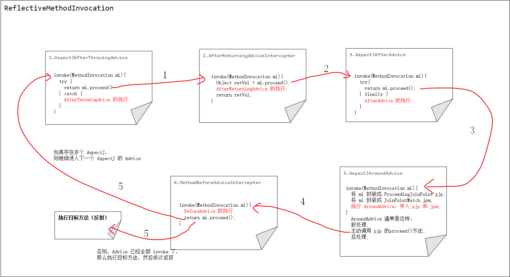

# Spring AOP常见面试题

## 什么是 AOP？

官方文档：

>AspectJ：Aspect-oriented programming is a way of modularizing crosscutting concerns much like object-oriented programming is a way of modularizing common concerns.
>
>Spring：Aspect-oriented Programming (AOP) complements Object-oriented Programming (OOP) by providing another way of thinking about program structure. The key unit of modularity in OOP is the class, whereas in AOP the unit of modularity is the aspect. Aspects enable the modularization of concerns (such as transaction management) that cut across multiple types and objects. (Such concerns are often termed “crosscutting” concerns in AOP literature.)

AOP（Aspect-oriented Programming）面向切面编程，是一种开发理念，是 OOP 面向对象编程的补充。我们知道，Java 就是一门面向对象编程的语言，在 OOP 中最小的单元就是“Class 对象”，但是在 AOP 中最小的单元是“切面”。一个“切面”可以包含很多种类型和对象，对它们进行模块化管理，例如事务管理。

## 为什么要引入 AOP？

Java OOP 存在哪些局限性？

- 静态化语言：类结构一旦定义，不容易被修改
- 侵入性扩展：通过继承或组合组织新的类结构

通过 AOP 我们可以把一些非业务逻辑的代码（比如安全检查、监控等代码）从业务中抽取出来，以非入侵的方式与原方法进行协同。这样可以使得原方法更专注于业务逻辑，代码接口会更加清晰，便于维护。

## 简述 AOP 的使用场景？

日志场景

- 诊断上下文，如：log4j 或 logback 中的 _x0008_MDC
- 辅助信息，如：方法执行时间

统计场景

- 方法调用次数
- 执行异常次数
- 数据抽样
- 数值累加

安防场景

- 熔断，如：Netflix Hystrix
- 限流和降级：如：Alibaba Sentinel
- 认证和授权，如：Spring Security
- 监控，如：JMX

性能场景

- 缓存，如 Spring Cache
- 超时控制

可以说在我们的日常开发环境中都是离不开 AOP 的。

## 简述 AOP 中几个比较重要的概念

在 AOP 中有以下几个概念：

- **AspectJ**：切面，只是一个概念，没有具体的接口或类与之对应，是 Join point，Advice 和 Pointcut 的一个统称。
- **Join point**：连接点，指程序执行过程中的一个点，例如方法调用、异常处理等。在 Spring AOP 中，仅支持方法级别的连接点。
- **Advice**：通知，即我们定义的一个切面中的横切逻辑，有“around”，“before”和“after”三种类型。在很多的 AOP 实现框架中，Advice 通常作为一个拦截器，也可以包含许多个拦截器作为一条链路围绕着 Join point 进行处理。
- **Pointcut**：切点，用于匹配连接点，一个 AspectJ 中包含哪些 Join point 需要由 Pointcut 进行筛选。
- **Introduction**：引介，让一个切面可以声明被通知的对象实现任何他们没有真正实现的额外的接口。例如可以让一个代理对象代理两个目标类。
- **Weaving**：织入，在有了连接点、切点、通知以及切面，如何将它们应用到程序中呢？没错，就是织入，在切点的引导下，将通知逻辑插入到目标方法上，使得我们的通知逻辑在方法调用时得以执行。
- **AOP proxy**：AOP 代理，指在 AOP 实现框架中实现切面协议的对象。在 Spring AOP 中有两种代理，分别是 JDK 动态代理和 CGLIB 动态代理。
- **Target object**：目标对象，就是被代理的对象。

## 你知道哪几种 AOP 框架？

主流 AOP 框架：

- AspectJ：完整的 AOP 实现框架
- Spring AOP：非完整的 AOP 实现框架

Spring AOP 有别于其他大多数 AOP 实现框架，目的不是提供最完整的 AOP 实现（尽管 Spring AOP 相当强大）；相反，其目的是在 AOP 实现和 Spring IoC 之间提供紧密的集成，以提供企业级核心特性。

Spring AOP 从未打算与 AspectJ 竞争以提供全面的 AOP 解决方案，我们认为 Spring AOP 等基于代理实现的框架和 AspectJ 等成熟的框架都是有价值的，并且它们是互补的，而不是竞争关系。Spring 将 Spring AOP 和 IoC 与 AspectJ 无缝集成，以实现 AOP 的所有功能都可以在一个 Spring 应用中。这种集成不会影响 Spring AOP API 或 AOP Alliance API，保持向后兼容。

## 什么是 AOP 代理？

代理模式是一种结构性设计模式，通过代理类为其他对象提供**一种代理以控制对这个对象的访问**。AOP 代理是 AOP 框架中 AOP 的实现，主要分为静态代理和动态代理，如下：

- 静态代理：代理类需要实现被代理类所实现的接口，同时持有被代理类的引用，新增处理逻辑，进行拦截处理，不过方法还是由被代理类的引用所执行。静态代理通常需要由开发人员在编译阶段就定义好，不易于维护。
  - 常用 OOP 继承和组合相结合
  - AspectJ，在编辑阶段会织入 Java 字节码，且在运行期间会进行增强。

- 动态代理：不会修改字节码，而是在 JVM 内存中根据目标对象新生成一个 Class 对象，这个对象包含了被代理对象的全部方法，并且在其中进行了增强。
  - JDK 动态代理
  - 字节码提升，例如 CGLIB

## 讲讲 JDK 动态代理？

基于接口代理，通过反射机制生成一个实现代理接口的类，在调用具体方法时会调用 InvocationHandler 来处理。

需要借助 JDK 的 `java.lang.reflect.Proxy` 来创建代理对象，调用 `Proxy.newProxyInstance(ClassLoader loader, Class<?>[] interfaces, InvocationHandler h)` 方法创建一个代理对象，方法的三个入参分别是：

- `ClassLoader loader`：用于加载代理对象的 Class 类加载器
- `Class<?>[] interfaces`：代理对象需要实现的接口
- `InvocationHandler h`：代理对象的处理器

新生成的代理对象的 Class 对象会继承 `Proxy`，且实现所有的入参 `interfaces` 中的接口，在实现的方法中实际是调用入参 `InvocationHandler` 的 `invoke(..)` 方法。

>为什么 JDK 动态代理只能基于接口代理，不能基于类代理？
>
>因为 JDK 动态代理生成的代理对象需要继承 `Proxy` 这个类，在 Java 中类只能是单继承关系，无法再继承一个代理类，所以只能基于接口代理。
>
>为什么 InvocationHandler 不直接声明到这个代理对象里面，而是放入继承的 `Proxy` 父类中？
>
>我觉得代理类既然是 JDK 动态生成的，那么 JDK 就需要识别出哪些类是生成的代理类，哪些是非代理类，或者说 JDK 需要对代理类做统一的处理，这时如果没有一个统一的类 Proxy 来进行引用根本无法处理。这只是笔者的想法，具体为什么这么做不知道有小伙伴知道不 ~

## 讲讲 CGLIB 动态代理？

JDK 动态代理的目标对象必须是一个接口，在我们日常生活中，无法避免开发人员不写接口直接写类，或者根本不需要接口，直接用类进行表达。这个时候我们就需要通过一些字节码提升的手段，来帮助做这个事情，在运行时，非编译时，来创建一个新的 Class 对象，这种方式称之为字节码提升。在 Spring 内部有两个字节码提升的框架，ASM（过于底层，直接操作字节码）和 CGLIB（相对于前者更加简便）。

CGLIB 动态代理则是基于类代理（字节码提升），通过 ASM（Java 字节码的操作和分析框架）将被代理类的 class 文件加载进来，修改其字节码生成一个子类。

需要借助于 CGLIB 的 `org.springframework.cglib.proxy.Enhancer` 类来创建代理对象，设置以下几个属性：

- `Class<?> superClass`：被代理的类
- `Callback callback`：回调接口

新生成的代理对象的 Class 对象会继承 `superClass` 被代理的类，在重写的方法中会调用 `callback` 回调接口（方法拦截器）进行处理。

如果你想设置一个 Callback[] 数组去处理不同的方法，那么需要设置一个 CallbackFilter 筛选器，用于选择具体的方法使用数组中的哪个 Callback 去处理

## JDK 动态代理和 CGLIB 动态代理有什么不同？

两者都是在 JVM 运行时期新创建一个 Class 对象，实例化一个代理对象，对目标类（或接口）进行代理。JDK 动态代理只能基于接口进行代理，生成的代理类实现了这些接口；而 CGLIB 动态代理则是基于类进行代理的，生成的代理类继承目标类，但是不能代理被 final 修饰的类，也不能重写 final 或者 private 修饰的方法。

CGLIB 动态代理比 JDK 动态代理复杂许多，性能也相对比较差。

## Spring AOP 和 AspectJ 有什么关联？

Spring AOP 和 AspectJ 都是 AOP 的实现框架，AspectJ 是 AOP 的完整实现，Spring AOP 则是部分实现。AspectJ 有一个很好的编程模型，包含了注解的方式，也包含了特殊语法。Spring 认为 AspectJ 的实现在 AOP 体系里面是完整的，不需要在做自己的一些实现。

Spring AOP 整合 AspectJ 注解与 Spring IoC 容器，比 AspectJ 的使用更加简单，也支持 API 和 XML 的方式进行使用。不过 Spring AOP 仅支持方法级别的 Pointcut 拦截。

>为什么 Spring AOP 底层没有使用 AspectJ 动态代理创建代理对象？
>
>我觉得是因为 AspectJ 的特殊语法对于 Spring 或者 Java 开发人员来说不是很友好，使用起来可能有点困难。Spring 也选择整合 AspectJ 的注解，使用起来非常方便。
>
>

## Spring AOP 中有哪些 Advice 类型？

- Around Advice，围绕型通知器，需要主动去触发目标方法的执行，这样可以在触发的前后进行相关相关逻辑处理
- Before Advice，前置通知器，在目标方法执行前会被调用
- After Advice，后置通知器
  - AfterReturning，在目标方法执行后被调用（方法执行过程中出现异常不会被调用）
  - After，在目标方法执行后被调用（执行过程出现异常也会被调用）
  - AfterThrowing，执行过程中抛出异常后会被调用（如果异常类型匹配）

执行顺序（Spring 5.2.7 之前的版本）：Around “前处理” > Before > 方法执行 > Around “后处理” > After > AfterReturning|AfterThrowing

执行顺序（Spring 5.2.7 开始）：Around “前处理” > Before > 方法执行 > AfterReturning|AfterThrowing > After > Around “后处理”

如下（在后续文章会进行分析，Spring 5.1.14）：

## Spring AOP 中 Advisor 接口是什么？

Advisor 是 Advice 的一个容器接口，与 Advice 是一对一的关系，它的子接口 PointcutAdvisor 是 Pointcut 和 Advice 的容器接口，将 Pointcut 过滤 Joinpoint 的能力和 Advice 进行整合，这样一来就将两者进行关联起来了。

Pointcut 提供 ClassFilter 和 MethedMatcher，分别支持筛选类和方法，通过 PointcutAdvisor 和 Advice 进行整合，可以说是形成了一个“切面”。

## 简述 Spring AOP 自动代理的实现

在我们有了 Join point（连接点）、Pointcut（切点）、Advice（通知）以及 AspectJ（切面）后，我们应该如何将他们“织入”我们的应用呢？在 Sping AOP 中提供了自动代理的实现，底层借助 JDK 动态代理和 CGLIB 动态代理创建对象。

回顾 Spring IoC 中 Bean 的加载过程，在整个过程中，Bean 的实例化前和初始化后等生命周期阶段都提供了扩展点，会调用相应的 BeanPostProcessor 处理器对 Bean 进行处理。当我们开启了 AspectJ 自动代理（例如通过 `@EnableAspectJAutoProxy` 注解），则会往 IoC 容器中注册一个 `AbstractAutoProxyCreator` 自动代理对象，该对象实现了几种 BeanPostProcessor，例如在每个 Bean 初始化后会被调用，解析出当前 Spring 上下文中所有的 Advisor（会缓存），如果这个 Bean 需要进行代理，则会通过 JDK 动态代理或者 CGLIB 动态代理创建一个代理对象并返回，所以得到的这个 Bean 实际上是一个代理对象。这样一来，开发人员只需要配置好 AspectJ 相关信息，Spring 则会进行自动代理，和 Spring IoC 完美地整合在一起。

## 请解释 Spring @EnableAspectJAutoProxy 的原理？

使用了 `@EnableAspectJAutoProxy` 注解则会开启 Spring AOP 自动代理，该注解上面有一个 `@Import(AspectJAutoProxyRegistrar.class)` 注解，`AspectJAutoProxyRegistrar` 实现了 `ImportBeanDefinitionRegistrar` 这个接口，在实现的方法中会注册一个 `AnnotationAwareAspectJAutoProxyCreator` 自动代理对象（如果没有注册的话），且将其优先级设置为最高，同时解析 `@EnableAspectJAutoProxy` 注解的配置并进行设置。这个自动代理对象是一个 BeanPostProcessor 处理器，在 Spring 加载一个 Bean 的过程中，如果它需要被代理，那么会创建一个代理对象（JDK 动态代理或者 CGLIB 动态代理）。

除了注解的方式，也可以通过 `<aop:aspectj-autoproxy />` 标签开启 Spring AOP 自动代理，原理和注解相同，同样是注册一个自动代理对象。

`@Import` 注解的原理参考：[**《死磕Spring之IoC篇 - @Bean 等注解的实现原理》**](https://www.cnblogs.com/lifullmoon/p/14461712.html)

## Spring Configuration Class CGLIB 提升与 AOP 类代理关系？

在 Spring 底层 IoC 容器初始化后，会通过 `BeanDefinitionRegistryPostProcessor` 对其进行后置处理，其中会有一个 `ConfigurationClassPostProcessor` 处理器会对 `@Configuration` 标注的 BeanDefinition 进行处理，进行 CGLIB 提升，这样一来对于后续的 Spring AOP 工作就非常简单了，因为这个 Bean 天然就是一个 CGLIB 代理。

在 Spring 5.2 开始 `@Configuration` 注解中新增了一个 `proxyBeanMethods` 属性（默认为 true），支持显示的配置是否进行 CGLIB 提升，毕竟进行 CGLIB 提升在启动过程会有一定的性能损耗，且创建的代理对象会占有一定的内存，通过该配置进行关闭，可以减少不必要的麻烦，对 Java 云原生有一定的提升。

>`@Configuration` 注解的 Bean 进行 CGLIB 提升后有什么作用呢？
>
>举个例子，大多数情况下，`@Configuration` Class 会通过 `@Bean` 注解为 Bean 定义，比如 @Bean User user() { return new User(); }，那这样是不是每次主动调用这个方法都会返回一个新的 User 对象呢？
>
>不是的，`@Configuration` Class 在得到 CGLIB 提升后，会设置一个拦截器专门对 `@Bean` 方法进行拦截处理，通过依赖查找的方式从 IoC 容器中获取 Bean 对象，如果是单例 Bean，那么每次都是返回同一个对象，所以当主动调用这个方法时获取到的都是同一个 User 对象。

## Sping AOP 应用到哪些设计模式？

如下：

- **创建型模式**：抽象工厂模式、工厂方法模式、构建器模式、单例模式、原型模式
- **结构型模式**：适配器模式、组合模式、装饰器模式、享元模式、代理模式
- **行为型模式**：模板方法模式、责任链模式、观察者模式、策略模式、命令模式、状态模式

关于每种设计模式，以及在 Spring AOP 中的应用在后续文章会进行简单的介绍。

## Spring AOP 在 Spring Framework 内部有哪些应用？

Spring 事件、Spring 事务、Spring 数据、Spring 缓存抽象、Spring 本地调度、Spring 整合、Spring 远程调用