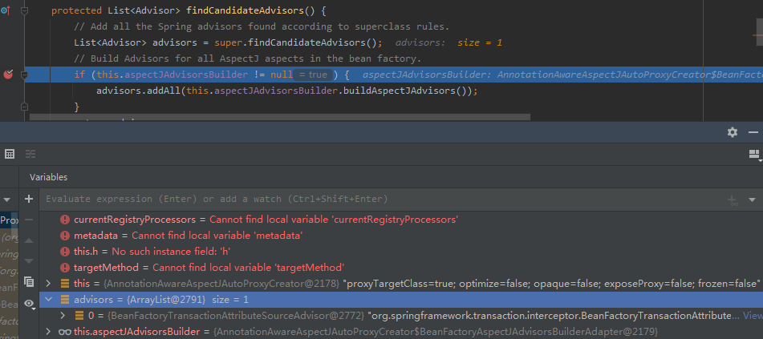
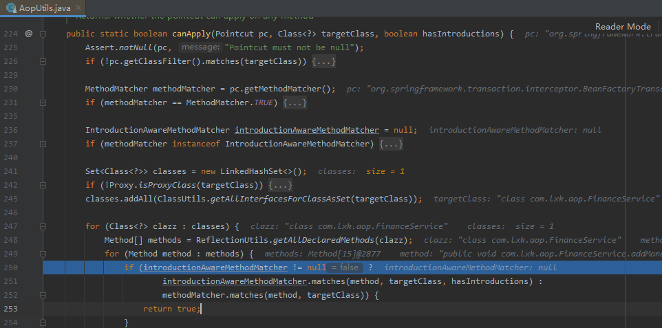
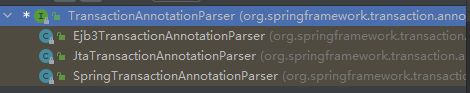
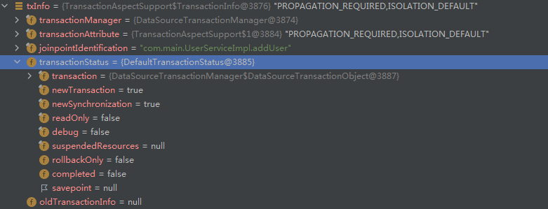
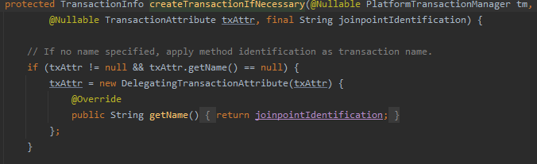
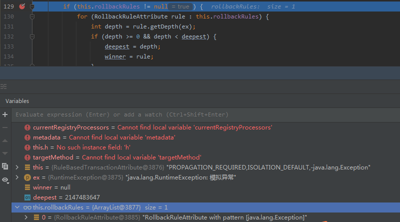
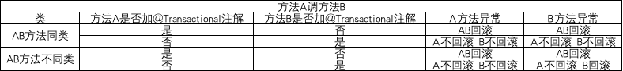

# Spring 事务源码

想了解事务源码的小伙伴肯定熟悉 Spring 中事务的使用，先来回顾一下。

1. 导入 spring-tx 包；
2. 配置类加上 @EnableTransactionManagement 注解；（或者使用XML 配置方式）
3. 需要事务控制的方法上加上 @Transactional 注解。

一个最基本的事务控制就完成了。如

**`@EnableTransactionManagement` 注解方式**

```java
@Configuration
@EnableTransactionManagement
public class AppConfig {

    @Bean
    public DataSourceTransactionManager transactionManager(DataSource dataSource) {
        return new DataSourceTransactionManager(dataSource);
    }
}
```

**XML 配置方式方式**

```java
<bean id="txManager" class="org.springframework.jdbc.datasource.DataSourceTransactionManager">
    <property name="dataSource" ref="dataSource"/>
</bean>

<tx:annotation-driven transaction-manager="txManager"/>
```

>对于 SpringBoot 项目，不需要加上 @EnableTransactionManagement 注解，因为有 SpringBoot 自动装配。在 spring-boot-autoconfigure 包下 spring.factories 文件中，EnableAutoConfiguration 有一个 SPI 实现 TransactionAutoConfiguration，里面包含了 @EnableTransactionManagement 注解。
>
>所以，原理是一样的，只是配置方式不同。
>


## @EnableTransactionManagement 注解

```java
@Target({ElementType.TYPE})
@Retention(RetentionPolicy.RUNTIME)
@Documented
@Import({TransactionManagementConfigurationSelector.class})
public @interface EnableTransactionManagement {
    boolean proxyTargetClass() default false;

    AdviceMode mode() default AdviceMode.PROXY;

    int order() default 2147483647;
}
```

还是老套路，@EnableXXX + @Import 注解组合，来看一下 TransactionManagementConfigurationSelector。

```java
public class TransactionManagementConfigurationSelector extends AdviceModeImportSelector<EnableTransactionManagement> {
    public TransactionManagementConfigurationSelector() {
    }

    protected String[] selectImports(AdviceMode adviceMode) {
        switch(adviceMode) {
        case PROXY:
            return new String[]{AutoProxyRegistrar.class.getName(), ProxyTransactionManagementConfiguration.class.getName()};
        case ASPECTJ:
            return new String[]{this.determineTransactionAspectClass()};
        default:
            return null;
        }
    }
}
```

@EnableTransactionManagement 注解默认使用 PROXY 模式来增强事务，所以 selectImports 方法返回两个类的全限定类名：AutoProxyRegistrar、ProxyTransactionManagementConfiguration，事务最终起作用的是上述两个类的功能。


## AutoProxyRegistrar

```java
public class AutoProxyRegistrar implements ImportBeanDefinitionRegistrar {
    
    public void registerBeanDefinitions(AnnotationMetadata importingClassMetadata, BeanDefinitionRegistry registry) {
        ......
        Object mode = candidate.get("mode");
        Object proxyTargetClass = candidate.get("proxyTargetClass");
        if (mode == AdviceMode.PROXY) {
            AopConfigUtils.registerAutoProxyCreatorIfNecessary(registry);
            if ((Boolean) proxyTargetClass) {
                AopConfigUtils.forceAutoProxyCreatorToUseClassProxying(registry);
                return;
            }
        }
        ......
    }
}
```

实现了 ImportBeanDefinitionRegistrar 接口，手动向 IOC 容器中导入组件。如果 @EnableTransactionManagement 注解中设置 adviceMode 为 PROXY （默认PROXY），则会利用 AopUtils 创建组件，并且如果 @EnableTransactionManagement 设置 proxyTargetClass 为true，则还会额外导入组件（默认为false）。


### AopConfigUtils.registerAutoProxyCreatorIfNecessary

```java
// AopConfigUtils
public static BeanDefinition registerAutoProxyCreatorIfNecessary(BeanDefinitionRegistry registry) {
    return registerAutoProxyCreatorIfNecessary(registry, null);
}

@Nullable
public static BeanDefinition registerAutoProxyCreatorIfNecessary(
    BeanDefinitionRegistry registry, @Nullable Object source) {

    return registerOrEscalateApcAsRequired(InfrastructureAdvisorAutoProxyCreator.class, registry, source);
}

private static BeanDefinition registerOrEscalateApcAsRequired(
    Class<?> cls, BeanDefinitionRegistry registry, @Nullable Object source) {

    Assert.notNull(registry, "BeanDefinitionRegistry must not be null");

    if (registry.containsBeanDefinition(AUTO_PROXY_CREATOR_BEAN_NAME)) {
        BeanDefinition apcDefinition = registry.getBeanDefinition(AUTO_PROXY_CREATOR_BEAN_NAME);
        if (!cls.getName().equals(apcDefinition.getBeanClassName())) {
            int currentPriority = findPriorityForClass(apcDefinition.getBeanClassName());
            int requiredPriority = findPriorityForClass(cls);
            if (currentPriority < requiredPriority) {
                apcDefinition.setBeanClassName(cls.getName());
            }
        }
        return null;
    }

    RootBeanDefinition beanDefinition = new RootBeanDefinition(cls);
    beanDefinition.setSource(source);
    beanDefinition.getPropertyValues().add("order", Ordered.HIGHEST_PRECEDENCE);
    beanDefinition.setRole(BeanDefinition.ROLE_INFRASTRUCTURE);
    registry.registerBeanDefinition(AUTO_PROXY_CREATOR_BEAN_NAME, beanDefinition);
    return beanDefinition;
}
```

可以看到最终是往 BeanDefinitionRegistry 注册了一个类为 InfrastructureAdvisorAutoProxyCreator 的 beanDefinition，名字为静态变量 AUTO_PROXY_CREATOR_BEAN_NAME 的值 ：org.springframework.aop.config.internalAutoProxyCreator。看到这个名字是不是很熟悉？AOP 那块有讲过，不记得的或者没看过的小伙伴可以去看一下哦。

AOP 中名字为 AUTO_PROXY_CREATOR_BEAN_NAME 的 beanDefinition 对应的类是 AnnotationAwareAspectJAutoProxyCreator，那和事务的这个不是冲突了吗？别急，仔细看下，注册到 BeanDefinitionRegistry 之前还有个判断 !cls.getName().equals(apcDefinition.getBeanClassName())，判断要注册的 beanDefinition 所属类名和已存在的是否一致，即 AnnotationAwareAspectJAutoProxyCreator 和 InfrastructureAdvisorAutoProxyCreator 的判断，而这个是根据优先级判断的，那个优先级高就用哪个。而优先级的判断是根据数组里面的下标。

```java
// AopConfigUtils
private static final List<Class<?>> APC_PRIORITY_LIST = new ArrayList<>(3);

static {
    // Set up the escalation list...
    APC_PRIORITY_LIST.add(InfrastructureAdvisorAutoProxyCreator.class);
    APC_PRIORITY_LIST.add(AspectJAwareAdvisorAutoProxyCreator.class);
    APC_PRIORITY_LIST.add(AnnotationAwareAspectJAutoProxyCreator.class);
}

private static int findPriorityForClass(@Nullable String className) {
    for (int i = 0; i < APC_PRIORITY_LIST.size(); i++) {
        Class<?> clazz = APC_PRIORITY_LIST.get(i);
        if (clazz.getName().equals(className)) {
            return i;
        }
    }
    throw new IllegalArgumentException(
        "Class name [" + className + "] is not a known auto-proxy creator class");
}
```

AnnotationAwareAspectJAutoProxyCreator 在数组最后，所以优先级比 InfrastructureAdvisorAutoProxyCreator 高。

因此，在同时引入了 Spring AOP和Spring TX 的情况下，最终生效的是AnnotationAwareAspectJAutoProxyCreator。


### AopConfigUtils.forceAutoProxyCreatorToUseClassProxying(registry)

设置事务增强的类全部使用 Cglib 代理类的方式，对应 AOP 中 AbstractAutoProxyCreator # createProxy 方法中的 proxyFactory.isProxyTargetClass()。

```java
public static void forceAutoProxyCreatorToUseClassProxying(BeanDefinitionRegistry registry) {
    if (registry.containsBeanDefinition(AUTO_PROXY_CREATOR_BEAN_NAME)) {
        BeanDefinition definition = registry.getBeanDefinition(AUTO_PROXY_CREATOR_BEAN_NAME);
        definition.getPropertyValues().add("proxyTargetClass", Boolean.TRUE);
    }
}
```


##  ProxyTransactionManagementConfiguration

这个配置类有三个组件。


### TransactionAttributeSource

```java
@Bean
@Role(BeanDefinition.ROLE_INFRASTRUCTURE)
public TransactionAttributeSource transactionAttributeSource() {
    return new AnnotationTransactionAttributeSource();
}
```


#### TransactionAttributeSource

```java
public interface TransactionAttributeSource {
    default boolean isCandidateClass(Class<?> targetClass) {
        return true;
    }

    @Nullable
    TransactionAttribute getTransactionAttribute(Method method, @Nullable Class<?> targetClass);
}
```

主要是下面的 getTransactionAttribute 方法，方法参数是一个 方法 + 类。实际上就是根据一个类 + 方法，解析转换为 TransactionAttribute。而 TransactionAttribute 继承自 TransactionDefinition。


#### AnnotationTransactionAttributeSource

直接定位类注释中关键的一句：

This class reads Spring's JDK 1.5+ @Transactional annotation and exposes corresponding transaction attributes to Spring's transaction infrastructure.

由此可见 AnnotationTransactionAttributeSource 是读取和解析标注有 @Transactional 注解的方法的。怎么解析的放到下面讲。


### TransactionInterceptor 事务拦截器

```java
// TransactionInterceptor创建出来，也是要设置进BeanFactoryTransactionAttributeSourceAdvisor，所以重点还是在上面
@Bean
@Role(BeanDefinition.ROLE_INFRASTRUCTURE)
public TransactionInterceptor transactionInterceptor() {
    TransactionInterceptor interceptor = new TransactionInterceptor();
    interceptor.setTransactionAttributeSource(transactionAttributeSource());
    if (this.txManager != null) {
        interceptor.setTransactionManager(this.txManager);
    }
    return interceptor;
}
```

TransactionInterceptor 实现了 MethodInterceptor，AOP 部分讲过MethodInterceptor 接口是 AOP 增强的核心拦截器接口，利用 AOP 生成的代理对象中都会包含一组 MethodInterceptor 接口的实现类对象。并且它这里还依赖了上面说到的 TransactionAttributeSource。


### BeanFactoryTransactionAttributeSourceAdvisor 事务增强器

```java
@Bean(name = TransactionManagementConfigUtils.TRANSACTION_ADVISOR_BEAN_NAME)
@Role(BeanDefinition.ROLE_INFRASTRUCTURE)
public BeanFactoryTransactionAttributeSourceAdvisor transactionAdvisor() {
    // 创建一个BeanFactoryTransactionAttributeSourceAdvisor对象，这样的话，在BeanPostProcessor中就可以被获取到，并且针对匹配到的class和method进行增强
    BeanFactoryTransactionAttributeSourceAdvisor advisor = new BeanFactoryTransactionAttributeSourceAdvisor();
    // 把下面创建的TransactionAttributeSource实例设置进去
    advisor.setTransactionAttributeSource(transactionAttributeSource());
    // 把下面创建的TransactionInterceptor实例设置进去
    advisor.setAdvice(transactionInterceptor());
    if (this.enableTx != null) {
        advisor.setOrder(this.enableTx.<Integer>getNumber("order"));
    }
    return advisor;
}
```

使用 BeanFactoryTransactionAttributeSourceAdvisor 作为事务增强器的实现，并给它配置了 TransactionAttributeSource。作为一个增强器，肯定得有 Advice 和 PointCut，但是看代码只设置了 Advice（即 transactionInterceptor），PointCut呢？我们进入 BeanFactoryTransactionAttributeSourceAdvisor 这个类里面：

```java
public class BeanFactoryTransactionAttributeSourceAdvisor extends AbstractBeanFactoryPointcutAdvisor {

	@Nullable
	private TransactionAttributeSource transactionAttributeSource;

	private final TransactionAttributeSourcePointcut pointcut = new TransactionAttributeSourcePointcut() {
		@Override
		@Nullable
		protected TransactionAttributeSource getTransactionAttributeSource() {
			return transactionAttributeSource;
		}
	};
    ......
}
```

哦，原来切入点在类内部就已经初始化好了，类型是 TransactionAttributeSourcePointcut，而且实现了 getTransactionAttributeSource 方法，返回的正好是配置类中的 transactionAttributeSource，这个方法有什么用呢？直接看 TransactionAttributeSourcePointcut 的核心 matches 方法：

```java
// TransactionAttributeSourcePointcut
public boolean matches(Method method, Class<?> targetClass) {
    TransactionAttributeSource tas = getTransactionAttributeSource();
    return (tas == null || tas.getTransactionAttribute(method, targetClass) != null);
}
```

就是拿 TransactionAttributeSource 去根据方法和方法所属类，判断是否有对应的事务定义信息（是否被 @Transactional 注解标注）。


## 代理类生成

事务代理类的生成和 AOP 代理类的生成是一样的，所以直接定位到核心处理点，前面的逻辑就不再赘述了。回到老地方：

```java
protected List<Advisor> findEligibleAdvisors(Class<?> beanClass, String beanName) {
    // 寻找候选Advisors，根据上文的配置文件
    // 在XML解析的时候已经被转换生成了RootBeanDefinition。
    List<Advisor> candidateAdvisors = findCandidateAdvisors();
    // 筛选可应用在 beanClass 上的 Advisor，通过 ClassFilter 和 MethodMatcher 对目标类和方法进行匹配
    List<Advisor> eligibleAdvisors = findAdvisorsThatCanApply(candidateAdvisors, beanClass, beanName);
    // 向候选Advisor链的开头（也就是List.get(0)的位置）添加一个org.springframework.aop.support.DefaultPointcutAdvisor。
    extendAdvisors(eligibleAdvisors);
    if (!eligibleAdvisors.isEmpty()) {
        eligibleAdvisors = sortAdvisors(eligibleAdvisors);
    }
    return eligibleAdvisors;
}

protected List<Advisor> findCandidateAdvisors() {
    Assert.state(this.advisorRetrievalHelper != null, "No BeanFactoryAdvisorRetrievalHelper available");
    return this.advisorRetrievalHelper.findAdvisorBeans();
}
```

advisorRetrievalHelper.findAdvisorBeans() 在 AOP 那块讲过，就是找出实现了 Advisor 接口的 bean，而前面说到的 BeanFactoryTransactionAttributeSourceAdvisor 正好匹配。可以随便写个测试类，方法加上 @Transactional 注解，并注入到 IOC，将断点打到这，查看结果。



Advisor 找到之后，就是判断是否能匹配了。这块的判断和 AOP 有点区别。



匹配调用的是 methodMatcher.matches，而 AOP 中匹配是上面那一个（251行）。

methodMatcher.matches 方法就是前面说过的 TransactionAttributeSourcePointcut 中的 matches 方法，只不过先前只是简单看了一下，下面来深入解析一下：

```java
// TransactionAttributeSourcePointcut
public boolean matches(Method method, Class<?> targetClass) {
    TransactionAttributeSource tas = getTransactionAttributeSource();
    return (tas == null || tas.getTransactionAttribute(method, targetClass) != null);
}

// AbstractFallbackTransactionAttributeSource(AnnotationTransactionAttributeSource 的父类)
public TransactionAttribute getTransactionAttribute(Method method, @Nullable Class<?> targetClass) {
    .....
    // First, see if we have a cached value.
    Object cacheKey = getCacheKey(method, targetClass);
    TransactionAttribute cached = this.attributeCache.get(cacheKey);
    if (cached != null) {
       .......
    }
    else {
        // We need to work it out.
        TransactionAttribute txAttr = computeTransactionAttribute(method, targetClass);
        // Put it in the cache.
        if (txAttr == null) {
            this.attributeCache.put(cacheKey, NULL_TRANSACTION_ATTRIBUTE);
        }
        else {
            String methodIdentification = ClassUtils.getQualifiedMethodName(method, targetClass);
            if (txAttr instanceof DefaultTransactionAttribute) {
                DefaultTransactionAttribute dta = (DefaultTransactionAttribute) txAttr;
                dta.setDescriptor(methodIdentification);
                dta.resolveAttributeStrings(this.embeddedValueResolver);
            }
            if (logger.isTraceEnabled()) {
                logger.trace("Adding transactional method '" + methodIdentification + "' with attribute: " + txAttr);
            }
            this.attributeCache.put(cacheKey, txAttr);
        }
        return txAttr;
    }
}
```

先查缓存，缓存中没有才调用 computeTransactionAttribute 方法生成 TransactionAttribute。

```java
// AbstractFallbackTransactionAttributeSource
protected TransactionAttribute computeTransactionAttribute(Method method, @Nullable Class<?> targetClass) {
    // 非 public 方法返回 null
    if (allowPublicMethodsOnly() && !Modifier.isPublic(method.getModifiers())) {
        return null;
    }
    Method specificMethod = AopUtils.getMostSpecificMethod(method, targetClass);
    TransactionAttribute txAttr = findTransactionAttribute(specificMethod);
    if (txAttr != null) {
        return txAttr;
    }
    .........
}

// AnnotationTransactionAttributeSource
protected TransactionAttribute findTransactionAttribute(Method method) {
    return determineTransactionAttribute(method);
}

protected TransactionAttribute determineTransactionAttribute(AnnotatedElement element) {
    for (TransactionAnnotationParser parser : this.annotationParsers) {
        TransactionAttribute attr = parser.parseTransactionAnnotation(element);
        if (attr != null) {
            return attr;
        }
    }
    return null;
}
```

最终使用 TransactionAnnotationParser 解析方法并转换，而 TransactionAnnotationParser 有三个实现类，那肯定不用说就是 SpringTransactionAnnotationParser 了。



```java
// SpringTransactionAnnotationParser
public TransactionAttribute parseTransactionAnnotation(AnnotatedElement element) {
    AnnotationAttributes attributes = AnnotatedElementUtils.findMergedAnnotationAttributes(
        element, Transactional.class, false, false);
    if (attributes != null) {
        return parseTransactionAnnotation(attributes);
    }
    else {
        return null;
    }
}

protected TransactionAttribute parseTransactionAnnotation(AnnotationAttributes attributes) {
		RuleBasedTransactionAttribute rbta = new RuleBasedTransactionAttribute();

		Propagation propagation = attributes.getEnum("propagation");
		rbta.setPropagationBehavior(propagation.value());
		Isolation isolation = attributes.getEnum("isolation");
		rbta.setIsolationLevel(isolation.value());
        ......
}
```

就是找对应的方法上面 @Transactional 注解相关属性如 propagation 传播行为，·封装到 AnnotationAttributes 里面，最终根据 AnnotationAttributes 获取 TransactionAttribute 并返回，注意类型是 RuleBasedTransactionAttribute，继承自 DefaultTransactionAttribute。

TransactionAttribute 不为空，那最初的 matches 方法就返回 true，说明增强器 BeanFactoryTransactionAttributeSourceAdvisor 可以匹配该方法（即方法上面有 @Transactional 注解）。

增强器拿到了，接下来就是 createProxy 了，这里不再重复解析了。


## 代理类执行

由于 AOP 部分已经讲过代理类的执行逻辑，所以这里我们直接定位到 TransactionInterceptor 的 invoke 方法。

```java
// TransactionInterceptor
public Object invoke(MethodInvocation invocation) throws Throwable {
    Class<?> targetClass = (invocation.getThis() != null ? AopUtils.getTargetClass(invocation.getThis()) : null);

    // Adapt to TransactionAspectSupport's invokeWithinTransaction...
    return invokeWithinTransaction(invocation.getMethod(), targetClass, new CoroutinesInvocationCallback() {
        @Override
        @Nullable
        public Object proceedWithInvocation() throws Throwable {
            return invocation.proceed();
        }
        @Override
        public Object getTarget() {
            return invocation.getThis();
        }
        @Override
        public Object[] getArguments() {
            return invocation.getArguments();
        }
    });
}
```

进入 invokeWithinTransaction 方法，在父类 TransactionAspectSupport 中。这个方法篇幅较长，所以下面拆开来讲。


### 获取方法对应的事务定义

```java
protected Object invokeWithinTransaction(Method method, @Nullable Class<?> targetClass,
        final InvocationCallback invocation) throws Throwable {
    TransactionAttributeSource tas = getTransactionAttributeSource();
    final TransactionAttribute txAttr = (tas != null ? tas.getTransactionAttribute(method, targetClass) : null);
    final TransactionManager tm = determineTransactionManager(txAttr);
    .......
```

前面两行代码在 代理类生成章节已经分析过了，这里可以直接从缓存中获取 TransactionAttribute。


### 决定事务管理器

```java
protected TransactionManager determineTransactionManager(@Nullable TransactionAttribute txAttr) {
    // Do not attempt to lookup tx manager if no tx attributes are set
    if (txAttr == null || this.beanFactory == null) {
        return getTransactionManager();
    }

    String qualifier = txAttr.getQualifier();
    if (StringUtils.hasText(qualifier)) {
        return determineQualifiedTransactionManager(this.beanFactory, qualifier);
    }
    else if (StringUtils.hasText(this.transactionManagerBeanName)) {
        return determineQualifiedTransactionManager(this.beanFactory, this.transactionManagerBeanName);
    }
    else {
        TransactionManager defaultTransactionManager = getTransactionManager();
        if (defaultTransactionManager == null) {
            defaultTransactionManager = this.transactionManagerCache.get(DEFAULT_TRANSACTION_MANAGER_KEY);
            if (defaultTransactionManager == null) {
                defaultTransactionManager = this.beanFactory.getBean(TransactionManager.class);
                this.transactionManagerCache.putIfAbsent(
                    DEFAULT_TRANSACTION_MANAGER_KEY, defaultTransactionManager);
            }
        }
        return defaultTransactionManager;
    }
}
```

代码里获取事务管理的方式有很多种，但实际 Debug 的时候走的是最后一个方式，即通过 beanFactory 获取。

对于 Spring 项目，需要在配置类中手动注入到 IOC 容器。

```java
@Configuration
public class TransactionConfiguration {
    
    @Bean
    public DataSource dataSource() {
        DriverManagerDataSource dataSource = new DriverManagerDataSource();
        dataSource.setDriverClassName("com.mysql.jdbc.Driver");
        dataSource.setUrl("...");
        dataSource.setUsername("...");
        dataSource.setPassword("....");
        return dataSource;
    }
    
    @Bean
    public JdbcTemplate jdbcTemplate() {
        return new JdbcTemplate(dataSource());
    }
    
    @Bean
    public TransactionManager transactionManager() {
        return new DataSourceTransactionManager(dataSource());
    }
}
```

对于 SpringBoot 项目，引入了相关持久层框架（MyBatis 等），则会自动注入。


### 响应式事务的处理

```java
// ......
if (this.reactiveAdapterRegistry != null && tm instanceof ReactiveTransactionManager) {
    ReactiveTransactionSupport txSupport = this.transactionSupportCache.computeIfAbsent(method, key -> {
        if (KotlinDetector.isKotlinType(method.getDeclaringClass()) && KotlinDelegate.isSuspend(method)) {
            throw new TransactionUsageException(
                "Unsupported annotated transaction on suspending function detected: " + method +
                ". Use TransactionalOperator.transactional extensions instead.");
        }
        ReactiveAdapter adapter = this.reactiveAdapterRegistry.getAdapter(method.getReturnType());
        if (adapter == null) {
            throw new IllegalStateException("Cannot apply reactive transaction to non-reactive return type: " +
                                            method.getReturnType());
        }
        return new ReactiveTransactionSupport(adapter);
    });
    return txSupport.invokeWithinTransaction(
        method, targetClass, invocation, txAttr, (ReactiveTransactionManager) tm);
}
// ......
```

这里不研究响应式事务，响应式事务用的也不多，感兴趣的可以自行研究。


### 事务控制

```java
PlatformTransactionManager ptm = asPlatformTransactionManager(tm);
final String joinpointIdentification = methodIdentification(method, targetClass, txAttr);

if (txAttr == null || !(ptm instanceof CallbackPreferringPlatformTransactionManager)) {
    // 开启事务
    TransactionInfo txInfo = createTransactionIfNecessary(ptm, txAttr, joinpointIdentification);

    Object retVal;
    try {
        // 执行原方法
        retVal = invocation.proceedWithInvocation();
    }
    catch (Throwable ex) {
        // 回滚事务	
        completeTransactionAfterThrowing(txInfo, ex);
        throw ex;
    }
    finally {
        cleanupTransactionInfo(txInfo);
    }

    if (retVal != null && vavrPresent && VavrDelegate.isVavrTry(retVal)) {
        // Set rollback-only in case of Vavr failure matching our rollback rules...
        TransactionStatus status = txInfo.getTransactionStatus();
        if (status != null && txAttr != null) {
            retVal = VavrDelegate.evaluateTryFailure(retVal, txAttr, status);
        }
    }
    // 提交事务
    commitTransactionAfterReturning(txInfo);
    return retVal;
}
```

仔细一看，其实就是类似 AOP 的环绕通知。


#### 创建事务

```java
protected TransactionInfo createTransactionIfNecessary(@Nullable PlatformTransactionManager tm,
			@Nullable TransactionAttribute txAttr, final String joinpointIdentification) {

    // If no name specified, apply method identification as transaction name.
    if (txAttr != null && txAttr.getName() == null) {
        txAttr = new DelegatingTransactionAttribute(txAttr) {
            @Override
            public String getName() {
                return joinpointIdentification;
            }
        };
    }

    TransactionStatus status = null;
    if (txAttr != null) {
        if (tm != null) {
            status = tm.getTransaction(txAttr);
        }
        else {
            if (logger.isDebugEnabled()) {
                logger.debug("Skipping transactional joinpoint [" + joinpointIdentification +
                             "] because no transaction manager has been configured");
            }
        }
    }
    return prepareTransactionInfo(tm, txAttr, joinpointIdentification, status);
}
```

先将原来的 TransactionAttribute 包装为 DelegatingTransactionAttribute。而 tm.getTransaction(txAttr) 这行则是真正开启事务。和原生 JDBC 开启事务一样，tm.getTransaction(txAttr) 最终会在 DataSourceTransactionManager 的 doBegin 方法设置自动提交为 false。

```java
protected void doBegin(Object transaction, TransactionDefinition definition) {
    .......
    if (con.getAutoCommit()) {
        txObject.setMustRestoreAutoCommit(true);
        if (logger.isDebugEnabled()) {
            logger.debug("Switching JDBC Connection [" + con + "] to manual commit");
        }
        con.setAutoCommit(false);
    }
    .......
}
```

将断点打在创建事务的下一行，查看返回的 TransactionInfo 包含哪些内容。



可以看到，事务定义信息和状态都封装好了，状态中 completed 值为 false。


#### 事务提交

```java
protected void commitTransactionAfterReturning(@Nullable TransactionInfo txInfo) {
    if (txInfo != null && txInfo.getTransactionStatus() != null) {
        if (logger.isTraceEnabled()) {
            logger.trace("Completing transaction for [" + txInfo.getJoinpointIdentification() + "]");
        }
        txInfo.getTransactionManager().commit(txInfo.getTransactionStatus());
    }
}
```

txInfo.getTransactionManager().commit 提交事务。commit 方法的实现则是在 AbstractPlatformTransactionManager 这个类中。

```java
// AbstractPlatformTransactionManager
public final void commit(TransactionStatus status) throws TransactionException {
    // 先判断事务状态，如果事务已完成，则无法提交。
    if (status.isCompleted()) {
        throw new IllegalTransactionStateException(
            "Transaction is already completed - do not call commit or rollback more than once per transaction");
    }

    DefaultTransactionStatus defStatus = (DefaultTransactionStatus) status;
    // 如果事务已被标记为需要回滚，则回滚事务
    if (defStatus.isLocalRollbackOnly()) {
        if (defStatus.isDebug()) {
            logger.debug("Transactional code has requested rollback");
        }
        processRollback(defStatus, false);
        return;
    }
    // 全局事务回滚判断
    if (!shouldCommitOnGlobalRollbackOnly() && defStatus.isGlobalRollbackOnly()) {
        if (defStatus.isDebug()) {
            logger.debug("Global transaction is marked as rollback-only but transactional code requested commit");
        }
        processRollback(defStatus, true);
        return;
    }
    // 正常则提交事务
    processCommit(defStatus);
}

private void processCommit(DefaultTransactionStatus status) throws TransactionException {
    try {
        // ......

            if (status.hasSavepoint()) {
                // 如果当前事务存在保存点，则处理保存点的逻辑
            }
            // 对于新事务，直接提交事务即可
            else if (status.isNewTransaction()) {
                // logger ......
                unexpectedRollback = status.isGlobalRollbackOnly();
                doCommit(status);
            }
    // ......
}
```

核心是 doCommit 方法，在 DataSourceTransactionManager 中。

```java
// DataSourceTransactionManager
protected void doCommit(DefaultTransactionStatus status) {
    DataSourceTransactionObject txObject = (DataSourceTransactionObject) status.getTransaction();
    Connection con = txObject.getConnectionHolder().getConnection();
    if (status.isDebug()) {
        logger.debug("Committing JDBC transaction on Connection [" + con + "]");
    }
    try {
        con.commit();
    }
    catch (SQLException ex) {
        throw translateException("JDBC commit", ex);
    }
}
```

这里就是熟悉的原生 jdbc 操作了，获取 Connection，然后执行 commit 方法。


#### 事务回滚

```java
@Transactional
public void test() {
    throw new RuntimeException("模拟异常");
}
```

手动模拟异常，异常会被捕获，进入到下面的 completeTransactionAfterThrowing 方法。

注意这个方法中的 Throwable 参数，这个就业务方法执行过程中抛出的异常。

```java
// TransactionAspectSupport
protected void completeTransactionAfterThrowing(@Nullable TransactionInfo txInfo, Throwable ex) {
    if (txInfo != null && txInfo.getTransactionStatus() != null) {
        // logger .....
        // 如果当前异常在回滚范围内，则回滚事务
        if (txInfo.transactionAttribute != null && txInfo.transactionAttribute.rollbackOn(ex)) {
            try {
                txInfo.getTransactionManager().rollback(txInfo.getTransactionStatus());
            } // catch ..... 
        }
        else {
            // 否则依然提交事务
            try {
                txInfo.getTransactionManager().commit(txInfo.getTransactionStatus());
            }// catch ..... 
        }
    }
}
```

那回滚范围怎么理解呢？我们看 transactionAttribute # rollbackOn 方法，前面分析过 transactionAttribute 被包装成 DelegatingTransactionAttribute。



```java
// DelegatingTransactionAttribute
private final TransactionAttribute targetAttribute;

public DelegatingTransactionAttribute(TransactionAttribute targetAttribute) {
    super(targetAttribute);
    this.targetAttribute = targetAttribute;
}

public boolean rollbackOn(Throwable ex) {
    return this.targetAttribute.rollbackOn(ex);
}
```

DelegatingTransactionAttribute 中 targetAttribute 对应的类型就是 txAttr 原本的类型 RuleBasedTransactionAttribute，我们直接到这个类看对应的方法。

```java
// RuleBasedTransactionAttribute
public boolean rollbackOn(Throwable ex) {
    RollbackRuleAttribute winner = null;
    int deepest = Integer.MAX_VALUE;

    if (this.rollbackRules != null) {
        for (RollbackRuleAttribute rule : this.rollbackRules) {
            int depth = rule.getDepth(ex);
            if (depth >= 0 && depth < deepest) {
                deepest = depth;
                winner = rule;
            }
        }
    }

    // User superclass behavior (rollback on unchecked) if no rule matches.
    if (winner == null) {
        // 调用父类 DefaultTransactionAttribute 的方法
        return super.rollbackOn(ex);
    }

    return !(winner instanceof NoRollbackRuleAttribute);
}
```

中间有一个回滚规则的判断，对于例子中的使用，rollbackRules 为 null，所以 winner 也为 ·null，最终是调用父类 DefaultTransactionAttribute 的 rollbackOn 方法，看一下父类的回滚规则判断：

```java
// DefaultTransactionAttribute
public boolean rollbackOn(Throwable ex) {
    return (ex instanceof RuntimeException || ex instanceof Error);
}
```

哦，原来是判断业务抛出的异常类型啊。只有异常是 RuntimeException 或 Error 这两种类型的异常才能正常执行回滚逻辑，其他异常则依旧正常提交。

所以，通俗来讲：业务逻辑出现的空指针等不受检查异常或 Error，会被回滚。而文件读写等，Spring 无法回滚，即使出现异常，也会正常提交。

那如果想对于所有的 Exception，都能执行回滚，要怎么做呢？ @Transactional 有一个 rollbackFor 的属性，可以指定回滚异常的类型。所以只需这样写 ：@Transactional(rollbackFor = Exception.class)。前面说过 RuleBasedTransactionAttribute 有回滚规则的判断，如果当前事务定义信息没有回滚规则的话就走默认的回滚判断，所以加了之后一定有回滚规则的，不然就回滚不了了，将断点打在回滚规则是否为 null 的地方查看结果。



果然如此，有一个回滚规则，且回滚对应的异常为 Exception。且 rollbackRules 是一个 List 类型，说明可以有多个回滚规则，而 @Transactional 的 rollbackFor 属性的类型也是 Class 数组，可以指定多种异常类型，正好对应。

if 里面的逻辑就是判断业务抛出的异常类型是否为指定异常，RuntimeException 是 Exception 的子类，depth 就是对应异常树中的位置。如：指定 Exception 为顶级异常，depth 为0；RuntimeException 在 Exception 的下一级，深度加1，对应的 depth 就是 1；RuntimeException 的直接子类对应的 depth 就是2。以此类推。

简单来说：就是判断业务抛出的异常类型是否为指定异常，是则返回 true，匹配成功；否则依旧执行默认的回滚判断。

那 rollbackRules 是什么时候初始化的？回到构造 RuleBasedTransactionAttribute 的地方。

```java
// SpringTransactionAnnotationParser
protected TransactionAttribute parseTransactionAnnotation(AnnotationAttributes attributes) {
    RuleBasedTransactionAttribute rbta = new RuleBasedTransactionAttribute();
    ........
    List<RollbackRuleAttribute> rollbackRules = new ArrayList<>();
    for (Class<?> rbRule : attributes.getClassArray("rollbackFor")) {
        rollbackRules.add(new RollbackRuleAttribute(rbRule));
    }
    for (String rbRule : attributes.getStringArray("rollbackForClassName")) {
        rollbackRules.add(new RollbackRuleAttribute(rbRule));
    }
    for (Class<?> rbRule : attributes.getClassArray("noRollbackFor")) {
        rollbackRules.add(new NoRollbackRuleAttribute(rbRule));
    }
    for (String rbRule : attributes.getStringArray("noRollbackForClassName")) {
        rollbackRules.add(new NoRollbackRuleAttribute(rbRule));
    }
    rbta.setRollbackRules(rollbackRules);

    return rbta;
}
```

取出了 @Transactional 中与回滚相关的属性值，封装为 RollbackRuleAttribute，供后续回滚异常的判断。

判断完成后，就是执行回滚逻辑了，最终还是是原生 jdbc 的事务操作，拿到 Connection ，执行 rollback 方法回滚事务。这里就不再展开讲了。


## **Spring声明式事务失效的一些场景**


### A调用B方法，@Transactional事务失效情况

本人做了各种情况的测试，结果如下：


总结：
方法A调用方法B：
1、如果只有A加@Transactional注解；则AB在同一事务中；
2、如果只有B加@Transactional注解；AB方法为同一类，事务失效；AB不同类，只有B有事务；

原理：
spring 在扫描bean的时候会扫描方法上是否包含@Transactional注解，如果包含，spring会为这个bean动态地生成一个子类（即代理类，proxy），代理类是继承原来那个bean的。
此时，当这个有注解的方法被调用的时候，实际上是由代理类来调用的，代理类在调用之前就会启动transaction。然而，如果这个有注解的方法是被同一个类中的其他方法调用的，那么该方法的调用并没有通过代理类，而是直接通过原来的那个bean，所以就不会启动transaction，我们看到的现象就是@Transactional注解无效。

那回到一开始的问题，我们调用的方法A不带注解，因此代理类不开事务，而是直接调用目标对象的方法。当进入目标对象的方法后，执行的上下文已经变成目标对象本身了，因为目标对象的代码是我们自己写的，和事务没有半毛钱关系，此时你再调用带注解的方法，照样没有事务，只是一个普通的方法调用而已。
简单来说，内部调用本类方法，不会再走代理了，所以B的事务不起作用。

如果AB不同类，A调用的是代理类B，故B有事务。


### 数据库存储引擎不支持事务

如MyISAM不支持事务


### 回滚的异常不符合

在没有指定回滚的异常情况下，默认只回滚`RuntimeException`和`Error`

比如：在此处`doSomeThing`中会抛出`Exception`异常，而此处`@Transactional`并没有指定回滚的异常，所以，此处事务将失效。

```
@Service
public class OrderServiceImpl implements OrderService {

  @Transactional
  public OrderDto create(OrderDto dto) {
     // 操作数据库...
     doSomeThing()
  }
}
```

正确的方法是手动指定回滚的异常：`@Transactional(rollbackFor = Exception.class)`


### 没有被Spring管理/不是Bean

比如，此处，把`@Service`注解去掉，Spring无法管理，事务将失效。

```
// @Service
public class OrderServiceImpl implements OrderService {

  @Transactional(rollbackFor = Exception.class)
  public OrderDto create(OrderDto dto) {
    // 操作数据库...
  }
}
```


### 异常被吃了

比如：此处的异常没有抛出来，事务也将失效。

```java
@Service
public class OrderServiceImpl implements OrderService {

  @Transactional(rollbackFor = Exception.class)
  public OrderDto create(OrderDto dto) {
     try {
       // 操作数据库...
     } catch (Exception e) {
       log.error(e.getMessage(), e);
     }
  }
}
```


### 加锁处理不当

在文章开头说“`@Transactional`实现原理”中的`org.springframework.transaction.interceptor.TransactionAspectSupport#invokeWithinTransaction`，在声明式事务中，开头有这么一段代码：

```
TransactionInfo txInfo = createTransactionIfNecessary(tm, txAttr, joinpointIdentification);
```

`createTransactionIfNecessary`方法：

```
    protected TransactionInfo createTransactionIfNecessary(@Nullable PlatformTransactionManager tm,
            @Nullable TransactionAttribute txAttr, final String joinpointIdentification) {

        // If no name specified, apply method identification as transaction name.
        if (txAttr != null && txAttr.getName() == null) {
            txAttr = new DelegatingTransactionAttribute(txAttr) {
                @Override
                public String getName() {
                    return joinpointIdentification;
                }
            };
        }

        TransactionStatus status = null;
        if (txAttr != null) {
            if (tm != null) {
                status = tm.getTransaction(txAttr);
            }
            else {
                if (logger.isDebugEnabled()) {
                    logger.debug("Skipping transactional joinpoint [" + joinpointIdentification +
                            "] because no transaction manager has been configured");
                }
            }
        }
        return prepareTransactionInfo(tm, txAttr, joinpointIdentification, status);
    }
```

我们来看一下`prepareTransactionInfo`方法：

```
    protected TransactionInfo prepareTransactionInfo(@Nullable PlatformTransactionManager tm,
            @Nullable TransactionAttribute txAttr, String joinpointIdentification,
            @Nullable TransactionStatus status) {

        TransactionInfo txInfo = new TransactionInfo(tm, txAttr, joinpointIdentification);
        if (txAttr != null) {
            // We need a transaction for this method...
            if (logger.isTraceEnabled()) {
                logger.trace("Getting transaction for [" + txInfo.getJoinpointIdentification() + "]");
            }
            // The transaction manager will flag an error if an incompatible tx already exists.
            txInfo.newTransactionStatus(status);
        }
        else {
            // The TransactionInfo.hasTransaction() method will return false. We created it only
            // to preserve the integrity of the ThreadLocal stack maintained in this class.
            if (logger.isTraceEnabled()) {
                logger.trace("Don't need to create transaction for [" + joinpointIdentification +
                        "]: This method isn't transactional.");
            }
        }

        // We always bind the TransactionInfo to the thread, even if we didn't create
        // a new transaction here. This guarantees that the TransactionInfo stack
        // will be managed correctly even if no transaction was created by this aspect.
        txInfo.bindToThread();
        return txInfo;
    }
```

最后来看一下`bindToThread`方法：

主要作用就是将`TransactionInfo`绑定到当前线程中，也就是说一个线程就会持有一个`TransactionInfo`对象，所以，这也就不难理解为什么多线程调用会导致事务失效了。

```java
private static final ThreadLocal<TransactionInfo> transactionInfoHolder = new NamedThreadLocal<>("Current aspect-driven transaction");

// ...

private void bindToThread() {
  // Expose current TransactionStatus, preserving any existing TransactionStatus
  // for restoration after this transaction is complete.
  this.oldTransactionInfo = transactionInfoHolder.get();
  transactionInfoHolder.set(this);
}
```


### 错误的事务传播特性

Spring中七种事务传播行为，也可以看代码`org.springframework.transaction.annotation.Propagation`

|     事务传播行为类型      |                             说明                             |
| :-----------------------: | :----------------------------------------------------------: |
|   PROPAGATION_REQUIRED    | 支持当前事务，如果不存在则创建一个新事务。 类似于 EJB 的同名事务属性。 这是事务注释的默认设置。 |
|   PROPAGATION_SUPPORTS    | 支持当前事务，如果不存在则以非事务方式执行。 类似于 EJB 的同名事务属性。 注意：对于具有事务同步的事务管理器，PROPAGATION_SUPPORTS 与根本没有事务略有不同，因为它定义了同步将应用的事务范围。 因此，相同的资源（JDBC 连接、Hibernate 会话等）将在整个指定范围内共享。 请注意，这取决于事务管理器的实际同步配置。 |
|   PROPAGATION_MANDATORY   | 支持当前事务，如果不存在则抛出异常。类似于EJB的同名事务属性。 |
| PROPAGATION_REQUIRES_NEW  | 创建一个新事务，如果存在，则暂停当前事务。 类似于同名的 EJB 事务属性。 注意：实际的事务挂起不会在所有事务管理器上开箱即用。 这尤其适用于org.springframework.transaction.jta.JtaTransactionManager ，它需要javax.transaction.TransactionManager对其可用（这在标准 Java EE 中是特定于服务器的） |
| PROPAGATION_NOT_SUPPORTED | 以非事务方式执行，如果存在则暂停当前事务。 类似于 EJB 的同名事务属性。 注意：实际的事务挂起不会在所有事务管理器上开箱即用。 这尤其适用于org.springframework.transaction.jta.JtaTransactionManager ，它需要javax.transaction.TransactionManager对其可用（这在标准 Java EE 中是特定于服务器的）。 |
|     PROPAGATION_NEVER     | 以非事务方式执行，如果存在事务则抛出异常。类似于EJB的同名事务属性。 |
|    PROPAGATION_NESTED     | 如果当前事务存在，则在嵌套事务中执行，其他行为类似于 PROPAGATION_REQUIRED。 EJB 中没有类似的特性。 注意：嵌套事务的实际创建仅适用于特定的事务管理器。 开箱即用，这仅适用于处理 JDBC 3.0 驱动程序时的 JDBC DataSourceTransactionManager。 一些 JTA 提供者也可能支持嵌套事务。 |

`@Transactional注解中`可以用propagation指定事务的传播特性，默认是`Propagation.REQUIRED`，也就是`TransactionDefinition.PROPAGATION_REQUIRED`：

```java
@Transactional(rollbackFor = Exception.class, propagation = Propagation.REQUIRED)
```


### 方法不是public

比如：我这里create方法使用private修饰的话，事务将失效。

```
@Service
public class OrderServiceImpl implements OrderService {

  @Transactional(rollbackFor = Exception.class)
  private OrderDto create(OrderDto dto) {
    // 操作数据库...
  }
}
```

失效原因看下面代码分析👇🏻

在代码`org.springframework.transaction.interceptor.AbstractFallbackTransactionAttributeSource#computeTransactionAttribute`中，限定了`allowPublicMethodsOnly() && !Modifier.isPublic(method.getModifiers())`，也就是说被调用的方法如果不是public，将返回null。

```
protected TransactionAttribute computeTransactionAttribute(Method method, @Nullable Class<?> targetClass) {
    // Don't allow no-public methods as required.
    if (allowPublicMethodsOnly() && !Modifier.isPublic(method.getModifiers())) {
        return null;
    }

    // The method may be on an interface, but we need attributes from the target class.
    // If the target class is null, the method will be unchanged.
    Method specificMethod = AopUtils.getMostSpecificMethod(method, targetClass);

    // First try is the method in the target class.
    TransactionAttribute txAttr = findTransactionAttribute(specificMethod);
    if (txAttr != null) {
        return txAttr;
    }

    // Second try is the transaction attribute on the target class.
    txAttr = findTransactionAttribute(specificMethod.getDeclaringClass());
    if (txAttr != null && ClassUtils.isUserLevelMethod(method)) {
        return txAttr;
    }

    if (specificMethod != method) {
        // Fallback is to look at the original method.
        txAttr = findTransactionAttribute(method);
        if (txAttr != null) {
            return txAttr;
        }
        // Last fallback is the class of the original method.
        txAttr = findTransactionAttribute(method.getDeclaringClass());
        if (txAttr != null && ClassUtils.isUserLevelMethod(method)) {
            return txAttr;
        }
    }

    return null;
}
```


### 方法用final修饰

```java
spring事务基于AOP，底层可以使用jdk动态代理或者cglib代理，它们会帮我们自动生成代理类去实现事务相关功能，但是如果方法被final修饰后就不能被重写，所以，此时事务也将失效。

PS: 如果方法是static，也无法通过动态代理。

@Service
public class OrderServiceImpl implements OrderService {

  @Transactional(rollbackFor = Exception.class)
  public final OrderDto create(OrderDto dto) {
    // 操作数据库...
  }
}
```


