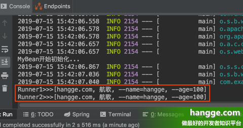
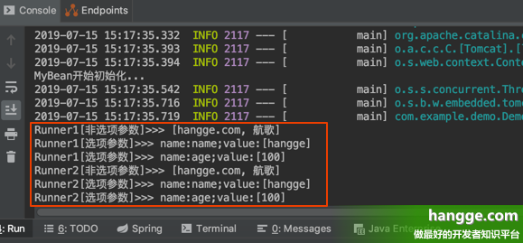
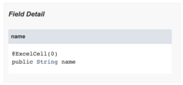

## @Configuration

**Spring @Configuration 注解**有助于**基于 Spring 注解的配置**。**@Configuration**注解表示一个类声明了一个或多个`@Bean`方法，并且可以由[Spring 容器](https://howtodoinjava.com/spring-core/different-spring-ioc-containers/)处理以在运行时为这些 bean 生成 bean 定义和服务请求。

从 spring 2 开始，我们将 bean 配置写入 xml 文件。但是 Spring 3 提供了将 bean 定义移出 xml 文件的自由。我们可以在 Java 文件本身中给出 bean 定义。这称为**Spring Java Config**功能（使用[`@Configuration`](https://docs.spring.io/spring-framework/docs/3.1.x/javadoc-api/org/springframework/context/annotation/Configuration.html)注解）。

### Spring@Configuration注解用法

`@Configuration`在任何类的顶部使用注解来声明该类提供一个或多个**@Bean**方法，并且可以由 Spring 容器处理以在运行时为这些 bean 生成 bean 定义和服务请求。

```java
应用程序配置文件
@Configuration
public class AppConfig {
 
    @Bean(name="demoService")
    public DemoClass service() 
    {
        
    }
}
```

#### 带有@Configuration注解的Spring配置类

```java
@Configuration
public class ApplicationConfiguration {
 
    @Bean(name="demoService")
    public DemoManager helloWorld() 
    {
        return new DemoManagerImpl();
    }
}
```

#### 演示

```java
public class VerifySpringCoreFeature
{
    public static void main(String[] args)
    {
        ApplicationContext context = new AnnotationConfigApplicationContext(ApplicationConfiguration.class);
 
        DemoManager  obj = (DemoManager) context.getBean("demoService");
 
        System.out.println( obj.getServiceName() );
    }
}
```


## @Autowired, @Resource and @Inject

### 概述

三个注解中有两个属于 Java 扩展包：javax.annotation.Resource 和 javax.inject.Inject。 @Autowired 注解属于 org.springframework.beans.factory.annotation 包。

这些注释中的每一个都可以通过字段注入或 setter 注入来解决依赖关系。我们将使用一个简化但实际的示例来演示三个注解之间的区别，但是根据每个注释所采用的执行路径来演示三个注释之间的区别的实际示例。

这些例子将集中在如何在集成测试中使用三个注入注解。测试所需的依赖性可以是一个任意的文件或一个任意的类。

### @Resource

@Resource 注释是 JSR-250 注释集合的一部分，并与 Jakarta EE 打包在一起。此注解具有以下执行路径，按优先级列出：

按名称匹配

按类型匹配

按 Qualifier匹配

这些执行路径适用于 setter 和字段注入

#### Field 注入

我们可以通过给实例变量加上@Resource注解，通过字段注入来解决依赖关系。

##### 按名称匹配

我们将使用以下集成测试来演示按名称匹配字段注入：

```java
@RunWith(SpringJUnit4ClassRunner.class)
@ContextConfiguration(
  loader=AnnotationConfigContextLoader.class,
  classes=ApplicationContextTestResourceNameType.class)
public class FieldResourceInjectionIntegrationTest {

    @Resource(name="namedFile")
    private File defaultFile;

    @Test
    public void givenResourceAnnotation_WhenOnField_ThenDependencyValid(){
        assertNotNull(defaultFile);
        assertEquals("namedFile.txt", defaultFile.getName());
    }
}
```

让我们看一下代码。在FieldResourceInjectionTest集成测试的第7行，我们通过将Bean名称作为属性值传递给@Resource注解来解决依赖关系。

```java
@Resource(name="namedFile")
private File defaultFile;
```

此配置将使用按名称匹配的执行路径解析依赖项。我们必须在 ApplicationContextTestResourceNameType 应用程序上下文中定义 bean namedFile。

请注意，Bean的id和相应的引用属性值必须匹配。

```java
@Configuration
public class ApplicationContextTestResourceNameType {

    @Bean(name="namedFile")
    public File namedFile() {
        File namedFile = new File("namedFile.txt");
        return namedFile;
    }
}
```

如果我们未能在应用上下文中定义Bean，将导致抛出org.springframework.beans.factory.NoSuchBeanDefinitionException。我们可以通过改变ApplicationContextTestResourceNameType应用上下文中传入@Bean注解的属性值，或改变FieldResourceInjectionTest集成测试中传入@Resource注解的属性值，来证明这点。

##### 按类型匹配

为了演示按类型匹配的执行路径，我们只需删除 FieldResourceInjectionTest 集成测试第 7 行的属性值：

```java
@Resource
private File defaultFile;
```

然后我们再次运行测试。

测试仍然会通过，因为如果 @Resource 注释没有接收 bean 名称作为属性值，Spring Framework 将继续下一级优先级，按类型匹配，以尝试解决依赖关系。

>@Resource装配规则
>
>- @Resource设置name属性，则按name在IoC容器中将bean注入
>- @Resource未设置name属性
>  - 2.1 以属性名作为bean name在IoC容器中匹配bean,如有匹配则注入
>  - 2.2 按属性名未匹配，则按类型进行匹配，同@Autowired,需加入@Primary解决类型冲突

##### 按 Qualifier 匹配

为了演示 match-by-qualifier (按限定符匹配)执行路径，将修改集成测试场景，以便在 ApplicationContextTestResourceQualifier 应用程序上下文中定义两个 bean

```java
@Configuration
public class ApplicationContextTestResourceQualifier {

    @Bean(name="defaultFile")
    public File defaultFile() {
        File defaultFile = new File("defaultFile.txt");
        return defaultFile;
    }

    @Bean(name="namedFile")
    public File namedFile() {
        File namedFile = new File("namedFile.txt");
        return namedFile;
    }
}
```

我们将使用 QualifierResourceInjectionTest 集成测试来演示按限定符匹配的依赖项解析。在这种情况下，需要将特定的 bean 依赖项注入到每个引用变量中：

```java
@RunWith(SpringJUnit4ClassRunner.class)
@ContextConfiguration(
  loader=AnnotationConfigContextLoader.class,
  classes=ApplicationContextTestResourceQualifier.class)
public class QualifierResourceInjectionIntegrationTest {

    @Resource
    private File dependency1;
	
    @Resource
    private File dependency2;

    @Test
    public void givenResourceAnnotation_WhenField_ThenDependency1Valid(){
        assertNotNull(dependency1);
        assertEquals("defaultFile.txt", dependency1.getName());
    }

    @Test
    public void givenResourceQualifier_WhenField_ThenDependency2Valid(){
        assertNotNull(dependency2);
        assertEquals("namedFile.txt", dependency2.getName());
    }
}
```

当我们运行集成测试时，将抛出org.springframework.beans.factory.NoUniqueBeanDefinitionException。这将发生，因为应用程序上下文将找到两个File类型的Bean定义，并且不知道哪个Bean应该解决这个依赖关系。

为了解决这个问题，我们需要参考QualifierResourceInjectionTest集成测试的第7至第10行。

```java
@Resource
private File dependency1;

@Resource
private File dependency2;
```

我们必须添加以下代码行：

```java
@Qualifier("defaultFile")

@Qualifier("namedFile")
```

使代码块如下所示

```java
@Resource
@Qualifier("defaultFile")
private File dependency1;

@Resource
@Qualifier("namedFile")
private File dependency2;
```

当我们再次运行集成测试时，它应该通过。我们的测试表明，即使我们在一个应用上下文中定义了多个Bean，我们也可以使用@Qualifier注解来清除任何混淆，允许我们将特定的依赖注入到一个类中。

####  Setter 注入

在字段上注入依赖关系时的执行路径也适用于基于setter的注入。

##### 按名称匹配

唯一的区别是 MethodResourceInjectionTest 集成测试有一个 setter 方法：

```java
@RunWith(SpringJUnit4ClassRunner.class)
@ContextConfiguration(
  loader=AnnotationConfigContextLoader.class,
  classes=ApplicationContextTestResourceNameType.class)
public class MethodResourceInjectionIntegrationTest {

    private File defaultFile;

    @Resource(name="namedFile")
    protected void setDefaultFile(File defaultFile) {
        this.defaultFile = defaultFile;
    }

    @Test
    public void givenResourceAnnotation_WhenSetter_ThenDependencyValid(){
        assertNotNull(defaultFile);
        assertEquals("namedFile.txt", defaultFile.getName());
    }
}
```

我们通过注解引用变量对应的setter方法，通过setter注入来解决依赖关系。然后我们将 bean 依赖项的名称作为属性值传递给 @Resource 注解。

```java
private File defaultFile;

@Resource(name="namedFile")
protected void setDefaultFile(File defaultFile) {
    this.defaultFile = defaultFile;
}
```

我们将在此示例中重用 namedFile bean 依赖关系。 bean 名称和相应的属性值必须匹配。

当我们运行集成测试时，它将通过。

为了让我们验证逐名匹配的执行路径解决了依赖关系，我们需要将传递给@Resource注解的属性值改为我们选择的值，然后再次运行测试。这一次，测试将以NoSuchBeanDefinitionException失败。

##### 按类型匹配

为了演示基于 setter 的、按类型匹配的执行，我们将使用 MethodByTypeResourceTest 集成测试：

```java
@RunWith(SpringJUnit4ClassRunner.class)
@ContextConfiguration(
  loader=AnnotationConfigContextLoader.class,
  classes=ApplicationContextTestResourceNameType.class)
public class MethodByTypeResourceIntegrationTest {

    private File defaultFile;

    @Resource
    protected void setDefaultFile(File defaultFile) {
        this.defaultFile = defaultFile;
    }

    @Test
    public void givenResourceAnnotation_WhenSetter_ThenValidDependency(){
        assertNotNull(defaultFile);
        assertEquals("namedFile.txt", defaultFile.getName());
    }
}
```

当我们运行这个测试时，它将通过。

为了让我们验证match-by-type执行路径解决了File的依赖性，我们需要将defaultFile变量的类类型改为另一种类类型，如String。然后我们可以再次执行MethodByTypeResourceTest集成测试，这次将抛出NoSuchBeanDefinitionException。

这个异常验证了match-by-type确实被用来解决File的依赖性。NoSuchBeanDefinitionException证实了引用变量名不需要与Bean名相匹配。相反，依赖关系的解决取决于 bean 的类类型是否与引用变量的类类型匹配。

##### 按 Qualifier 匹配

我们将使用 MethodByQualifierResourceTest 集成测试来演示 match-by-qualifier 执行路径：

```java
@RunWith(SpringJUnit4ClassRunner.class)
@ContextConfiguration(
  loader=AnnotationConfigContextLoader.class,
  classes=ApplicationContextTestResourceQualifier.class)
public class MethodByQualifierResourceIntegrationTest {

    private File arbDependency;
    private File anotherArbDependency;

    @Test
    public void givenResourceQualifier_WhenSetter_ThenValidDependencies(){
      assertNotNull(arbDependency);
        assertEquals("namedFile.txt", arbDependency.getName());
        assertNotNull(anotherArbDependency);
        assertEquals("defaultFile.txt", anotherArbDependency.getName());
    }

    @Resource
    @Qualifier("namedFile")
    public void setArbDependency(File arbDependency) {
        this.arbDependency = arbDependency;
    }

    @Resource
    @Qualifier("defaultFile")
    public void setAnotherArbDependency(File anotherArbDependency) {
        this.anotherArbDependency = anotherArbDependency;
    }
}
```

们的测试表明，即使我们在一个应用上下文中定义了多个特定类型的Bean实现，我们也可以使用@Qualifier注解和@Resource注解来解决依赖关系。

与基于字段的依赖注入类似，如果我们在一个应用上下文中定义了多个Bean，我们必须使用@Qualifier注解来指定使用哪个Bean来解决依赖关系，否则将抛出NoUniqueBeanDefinitionException。

### @Inject

@Inject 注解属于 JSR-330 注解集合。此注解具有以下执行路径，按优先级列出：

> 按类型匹配
>
> 按 Qualifier 匹配
>
> 按名称匹配

这些执行路径适用于 setter 和字段注入。为了让我们访问 @Inject 注释，我们必须将 javax.inject 库声明为 Gradle 或 Maven 依赖项。

```xml
<dependency>
    <groupId>javax.inject</groupId>
    <artifactId>javax.inject</artifactId>
    <version>1</version>
</dependency>
```

#### Field 注入

##### 按类型匹配

我们将修改集成测试的例子，使用另一种类型的依赖，即ArbitraryDependency类。ArbitraryDependency类的依赖仅仅是作为一个简单的依赖，没有进一步的意义。

```java
@Component
public class ArbitraryDependency {

    private final String label = "Arbitrary Dependency";

    public String toString() {
        return label;
    }
}
```

这是有关的FieldInjectTest集成测试

```java
@RunWith(SpringJUnit4ClassRunner.class)
@ContextConfiguration(
  loader=AnnotationConfigContextLoader.class,
  classes=ApplicationContextTestInjectType.class)
public class FieldInjectIntegrationTest {

    @Inject
    private ArbitraryDependency fieldInjectDependency;

    @Test
    public void givenInjectAnnotation_WhenOnField_ThenValidDependency(){
        assertNotNull(fieldInjectDependency);
        assertEquals("Arbitrary Dependency",
          fieldInjectDependency.toString());
    }
}
```

与首先按名称解析依赖项的@Resource 注解不同，@Inject 注解的默认行为是按类型解析依赖项。

这意味着即使类的引用变量名与 bean 名不同，只要 bean 在应用程序上下文中被定义，该依赖关系仍将被解决。请注意下面的测试中的引用变量名是怎样的。

```java
@Inject
private ArbitraryDependency fieldInjectDependency;
```

与应用程序上下文中配置的 bean 名称不同：

```java
Bean
public ArbitraryDependency injectDependency() {
    ArbitraryDependency injectDependency = new ArbitraryDependency();
    return injectDependency;
}
```

当我们执行测试时，我们能够解决这个依赖关系。

##### 按 Qualifier 匹配

  如果某个类的类型有多个实现，而某个类需要一个特定的Bean，怎么办？让我们修改一下集成测试的例子，使其需要另一个依赖关系。

在此示例中，我们将在按类型匹配示例中使用的 ArbitraryDependency 类进行子类化，以创建 AnotherArbitraryDependency 类：

```java
public class AnotherArbitraryDependency extends ArbitraryDependency {

    private final String label = "Another Arbitrary Dependency";

    public String toString() {
        return label;
    }
}
```

每个测试案例的目的是确保我们将每个依赖关系正确地注入到每个参考变量中。

```java
@Inject
private ArbitraryDependency defaultDependency;

@Inject
private ArbitraryDependency namedDependency;
```

我们可以使用 FieldQualifierInjectTest 集成测试来演示按限定符的匹配

```java
@RunWith(SpringJUnit4ClassRunner.class)
@ContextConfiguration(
  loader=AnnotationConfigContextLoader.class,
  classes=ApplicationContextTestInjectQualifier.class)
public class FieldQualifierInjectIntegrationTest {

    @Inject
    private ArbitraryDependency defaultDependency;

    @Inject
    private ArbitraryDependency namedDependency;

    @Test
    public void givenInjectQualifier_WhenOnField_ThenDefaultFileValid(){
        assertNotNull(defaultDependency);
        assertEquals("Arbitrary Dependency",
          defaultDependency.toString());
    }

    @Test
    public void givenInjectQualifier_WhenOnField_ThenNamedFileValid(){
        assertNotNull(defaultDependency);
        assertEquals("Another Arbitrary Dependency",
          namedDependency.toString());
    }
}
```

如果我们在应用程序上下文中具有特定类的多个实现，并且 FieldQualifierInjectTest 集成测试尝试以下面列出的方式注入依赖项，则会抛出 NoUniqueBeanDefinitionException 。

```java
@Inject 
private ArbitraryDependency defaultDependency;

@Inject 
private ArbitraryDependency namedDependency;
```

抛出这个异常是Spring框架指出某个类有多种实现，它对使用哪一个感到困惑。为了澄清这个困惑，我们可以去看FieldQualifierInjectTest集成测试的第7和第10行。

```java
@Inject
private ArbitraryDependency defaultDependency;

@Inject
private ArbitraryDependency namedDependency;
```

我们可以将所需的bean名称传递给@Qualifier注解，我们将其与@Inject注解一起使用。这就是现在的代码块的样子。

```java
@Inject
@Qualifier("defaultFile")
private ArbitraryDependency defaultDependency;

@Inject
@Qualifier("namedFile")
private ArbitraryDependency namedDependency;
```

@Qualifier 注解期望在接收 bean 名称时进行严格匹配。我们必须确保Bean名称被正确地传递给Qualifier，否则将抛出NoUniqueBeanDefinitionException。如果我们再次运行该测试，它应该会通过。

##### 按名称匹配

用来演示按名称匹配的FieldByNameInjectTest集成测试与按类型匹配的执行路径相似。唯一的区别是现在我们需要一个特定的bean，而不是一个特定的类型。在这个例子中，我们再次对ArbitraryDependency类进行子类化，产生YetAnotherArbitraryDependency类。

```java
public class YetAnotherArbitraryDependency extends ArbitraryDependency {

    private final String label = "Yet Another Arbitrary Dependency";

    public String toString() {
        return label;
    }
}
```

为了演示按名称匹配的执行路径，我们将使用以下集成测试：

```java
@RunWith(SpringJUnit4ClassRunner.class)
@ContextConfiguration(
  loader=AnnotationConfigContextLoader.class,
  classes=ApplicationContextTestInjectName.class)
public class FieldByNameInjectIntegrationTest {

    @Inject
    @Named("yetAnotherFieldInjectDependency")
    private ArbitraryDependency yetAnotherFieldInjectDependency;

    @Test
    public void givenInjectQualifier_WhenSetOnField_ThenDependencyValid(){
        assertNotNull(yetAnotherFieldInjectDependency);
        assertEquals("Yet Another Arbitrary Dependency",
          yetAnotherFieldInjectDependency.toString());
    }
}
```

我们列出应用程序上下文：

```java
@Configuration
public class ApplicationContextTestInjectName {

    @Bean
    public ArbitraryDependency yetAnotherFieldInjectDependency() {
        ArbitraryDependency yetAnotherFieldInjectDependency =
          new YetAnotherArbitraryDependency();
        return yetAnotherFieldInjectDependency;
    }
}
```

如果我们运行集成测试，它将通过。

为了验证我们是否通过按名称匹配的执行路径注入了依赖项，我们需要将传递给 @Named 注释的值 YetAnotherFieldInjectDependency 更改为我们选择的另一个名称。当我们再次运行测试时，将抛出 NoSuchBeanDefinitionException。

####  Setter 注入

@Inject 注释的基于 Setter 的注入类似于用于基于 @Resource setter 的注入的方法。我们不是注释引用变量，而是注释相应的 setter 方法。基于字段的依赖注入所遵循的执行路径也适用于基于 setter 的注入。

###  @Autowired

@Autowired注解的行为与@Inject注解相似。唯一的区别是，@Autowired注解是Spring框架的一部分。这个注解的执行路径与@Inject注解相同，按优先级排列。

按类型匹配

按 Qualifier匹配

按名称匹配
这些执行路径适用于 setter 和字段注入。

#### Field 注入

##### 按类型匹配

用于演示@Autowired match-by-type 执行路径的集成测试示例将类似于用于演示@Inject match-by-type 执行路径的测试。我们使用以下 FieldAutowiredTest 集成测试来演示使用 @Autowired 注解的按类型匹配：

```java
@RunWith(SpringJUnit4ClassRunner.class)
@ContextConfiguration(
  loader=AnnotationConfigContextLoader.class,
  classes=ApplicationContextTestAutowiredType.class)
public class FieldAutowiredIntegrationTest {

    @Autowired
    private ArbitraryDependency fieldDependency;

    @Test
    public void givenAutowired_WhenSetOnField_ThenDependencyResolved() {
        assertNotNull(fieldDependency);
        assertEquals("Arbitrary Dependency", fieldDependency.toString());
    }
}
```

我们列出了此集成测试的应用程序上下文：

```java
@Configuration
public class ApplicationContextTestAutowiredType {

    @Bean
    public ArbitraryDependency autowiredFieldDependency() {
        ArbitraryDependency autowiredFieldDependency =
          new ArbitraryDependency();
        return autowiredFieldDependency;
    }
}
```

我们使用此集成测试来证明按类型匹配优先于其他执行路径。注意 FieldAutowiredTest 集成测试第 8 行的引用变量名称：

```java
@Autowired
private ArbitraryDependency fieldDependency;
```

这与应用程序上下文中的 bean 名称不同

```java
@Bean
public ArbitraryDependency autowiredFieldDependency() {
    ArbitraryDependency autowiredFieldDependency =
      new ArbitraryDependency();
    return autowiredFieldDependency;
}
```

当我们运行测试时，它应该通过。

为了确认确实使用 match-by-type 执行路径解决了依赖关系，我们需要更改 fieldDependency 引用变量的类型并再次运行集成测试。这一次，FieldAutowiredTest 集成测试将失败，并抛出 NoSuchBeanDefinitionException。这验证了我们使用 match-by-type 来解决依赖关系。

##### 按 Qualifier 匹配

如果我们面临在应用程序上下文中定义多个 bean 实现的情况，该怎么办：

```java
@Configuration
public class ApplicationContextTestAutowiredQualifier {

    @Bean
    public ArbitraryDependency autowiredFieldDependency() {
        ArbitraryDependency autowiredFieldDependency =
          new ArbitraryDependency();
        return autowiredFieldDependency;
    }

    @Bean
    public ArbitraryDependency anotherAutowiredFieldDependency() {
        ArbitraryDependency anotherAutowiredFieldDependency =
          new AnotherArbitraryDependency();
        return anotherAutowiredFieldDependency;
    }
}
```

如果我们执行以下 FieldQualifierAutowiredTest 集成测试，将抛出 NoUniqueBeanDefinitionException：

```java
@RunWith(SpringJUnit4ClassRunner.class)
@ContextConfiguration(
  loader=AnnotationConfigContextLoader.class,
  classes=ApplicationContextTestAutowiredQualifier.class)
public class FieldQualifierAutowiredIntegrationTest {

    @Autowired
    private ArbitraryDependency fieldDependency1;

    @Autowired
    private ArbitraryDependency fieldDependency2;

    @Test
    public void givenAutowiredQualifier_WhenOnField_ThenDep1Valid(){
        assertNotNull(fieldDependency1);
        assertEquals("Arbitrary Dependency", fieldDependency1.toString());
    }

    @Test
    public void givenAutowiredQualifier_WhenOnField_ThenDep2Valid(){
        assertNotNull(fieldDependency2);
        assertEquals("Another Arbitrary Dependency",
          fieldDependency2.toString());
    }
}
```

这个异常是由于应用上下文中定义的两个Bean引起的歧义。Spring框架不知道哪个Bean依赖应该被自动连接到哪个引用变量。我们可以通过在FieldQualifierAutowiredTest集成测试的第7和第10行添加@Qualifier注解来解决这个问题。

```java
@Autowired
private FieldDependency fieldDependency1;

@Autowired
private FieldDependency fieldDependency2;
```

使代码块如下所示：

```java
@Autowired
@Qualifier("autowiredFieldDependency")
private FieldDependency fieldDependency1;

@Autowired
@Qualifier("anotherAutowiredFieldDependency")
private FieldDependency fieldDependency2;
```

当我们再次运行测试时，它会通过。

##### 按名称匹配

我们将使用相同的集成测试场景来使用@autowired注释来演示按名称匹配的执行路径去注入字段依赖项。当按名称自动依赖项时，必须与应用程序上下文，ApplicationContextTestaUtowiredName一起使用@ComponentsCan注释：

```java
@Configuration
@ComponentScan(basePackages={"com.baeldung.dependency"})
    public class ApplicationContextTestAutowiredName {
}
```

我们使用@ComponentScan注解来搜索包中已经被@Component注解的Java类。例如，在应用上下文中，com.baeldung.dependency包将被扫描，以寻找已被@Component注解的类。在这种情况下，Spring框架必须检测到ArbitraryDependency类，它有@Component注解。	

```java
@Component(value="autowiredFieldDependency")
public class ArbitraryDependency {

    private final String label = "Arbitrary Dependency";

    public String toString() {
        return label;
    }
}
```

传递到@Component注解中的属性值autowiredFieldDependency告诉Spring框架，ArbitraryDependency类是一个名为autowiredFieldDependency的组件。为了让@Autowired注解按名称解析依赖关系，组件名称必须与FieldAutowiredNameTest集成测试中定义的字段名称一致；请参考第8行

```java
@RunWith(SpringJUnit4ClassRunner.class)
@ContextConfiguration(
  loader=AnnotationConfigContextLoader.class,
  classes=ApplicationContextTestAutowiredName.class)
public class FieldAutowiredNameIntegrationTest {

    @Autowired
    private ArbitraryDependency autowiredFieldDependency;

    @Test
    public void givenAutowiredAnnotation_WhenOnField_ThenDepValid(){
        assertNotNull(autowiredFieldDependency);
        assertEquals("Arbitrary Dependency",
          autowiredFieldDependency.toString());
	}
}
```

当我们运行FieldAutowiredNameTest集成测试时，它将通过。

但是我们怎么知道@Autowired注解真的调用了按名字匹配的执行路径呢？我们可以把引用变量autowiredFieldDependency的名字改为我们选择的另一个名字，然后再次运行测试。

这一次，测试将失败并抛出*NoUniqueBeanDefinitionException*。类似的检查是将*@Component*属性值*autowiredFieldDependency*更改为我们选择的另一个值并再次运行测试。一个*NoUniqueBeanDefinitionException*也将被抛出。

这个异常证明如果我们使用不正确的 bean 名称，将找不到有效的 bean。这就是我们如何知道调用了按名称匹配的执行路径。

#### setter 注入

@Autowired注解的基于设置器的注入与@Resource基于设置器的注入所展示的方法类似。我们没有用@Inject注解来注解引用变量，而是注解了相应的设置器。基于字段的依赖注入所遵循的执行路径也适用于基于设置器的注入。

### 应用这些注解

这就提出了应该使用哪个注解以及在什么情况下使用的问题。这些问题的答案取决于相关应用程序面临的设计场景，以及开发人员希望如何基于每个注解的默认执行路径利用多态性。

#### Application-Wide Use of Singletons Through Polymorphism

如果设计是这样的：应用程序的行为是基于接口或抽象类的实现，并且这些行为在整个应用程序中使用，那么我们可以使用@Inject或@Autowired注释。

这种方法的好处是，当我们升级应用程序，或者为了修复一个错误而应用一个补丁时，类可以被替换，而对整个应用程序的行为产生最小的负面影响。在这种情况下，主要的默认执行路径是按类型匹配。

#### 通过多态进行细粒度的应用行为配置

如果设计是应用程序具有复杂的行为，每个行为都基于不同的接口/抽象类，并且这些实现中的每一个的用法因应用程序而异，那么我们可以使用*@Resource*注解。在这种情况下，主要的默认执行路径是按名称匹配。

#### 依赖注入应该由 Jakarta EE 平台单独处理

如果 Jakarta EE 平台（而不是 Spring）注入所有依赖项的设计要求，那么选择是在*@Resource*注释和*@Inject*注释之间。我们应该根据需要哪个默认执行路径来缩小两个注释之间的最终决定范围。

#### 依赖注入应该由 Spring 框架单独处理

如果要求 Spring 框架处理所有依赖项，则唯一的选择是*@Autowired*注释

#### 讨论总结

| Scenario                                                     | @Resource | @Inject | @Autowired |
| :----------------------------------------------------------- | --------- | ------- | ---------- |
| Application-wide use of singletons through polymorphism      | ✗         | ✔       | ✔          |
| Fine-grained application behavior configuration through polymorphism | ✔         | ✗       | ✗          |
| Dependency injection should be handled solely by the Jakarta EE platform | ✔         | ✔       | ✗          |
| Dependency injection should be handled solely by the Spring Framework | ✗         | ✗       | ✔          |


## CommandLineRunner，@Order，ApplicationRunner

在我们实际工作中，总会遇到这样需求，在项目启动的时候需要做一些初始化的操作，比如初始化线程池，提前加载好加密证书等。今天就给大家介绍一个 Spring Boot 神器，专门帮助大家解决项目启动初始化资源操作。

这个神器就是 `CommandLineRunner`，`CommandLineRunner` 接口的 `Component` 会在所有 `Spring Beans `都初始化之后，`SpringApplication.run() `之前执行，非常适合在应用程序启动之初进行一些数据初始化的工作。

接下来我们就运用案例测试它如何使用，在测试之前在启动类加两行打印提示，方便我们识别 `CommandLineRunner` 的执行时机。

```java
@SpringBootApplication
public class CommandLineRunnerApplication {
	public static void main(String[] args) {
		System.out.println("The service to start.");
		SpringApplication.run(CommandLineRunnerApplication.class, args);
		System.out.println("The service has started.");
	}
}
```


接下来我们直接创建一个类继承 `CommandLineRunner` ，并实现它的 `run()` 方法。

```java
@Component
public class Runner implements CommandLineRunner {
    @Override
    public void run(String... args) throws Exception {
        System.out.println("The Runner start to initialize ...");
    }
}
```

我们在 `run()` 方法中打印了一些参数来看出它的执行时机。完成之后启动项目进行测试：

```properties
...
The service to start.

  .   ____          _            __ _ _
 /\\ / ___'_ __ _ _(_)_ __  __ _ \ \ \ \
( ( )\___ | '_ | '_| | '_ \/ _` | \ \ \ \
 \\/  ___)| |_)| | | | | || (_| |  ) ) ) )
  '  |____| .__|_| |_|_| |_\__, | / / / /
 =========|_|==============|___/=/_/_/_/
 :: Spring Boot ::        (v2.0.0.RELEASE)
...
2018-04-21 22:21:34.706  INFO 27016 --- [           main] o.s.b.w.embedded.tomcat.TomcatWebServer  : Tomcat started on port(s): 8080 (http) with context path ''
2018-04-21 22:21:34.710  INFO 27016 --- [           main] com.neo.CommandLineRunnerApplication     : Started CommandLineRunnerApplication in 3.796 seconds (JVM running for 5.128)
The Runner start to initialize ...
The service has started.
```

根据控制台的打印信息我们可以看出 `CommandLineRunner` 中的方法会在 Spring Boot 容器加载之后执行，执行完成后项目启动完成。

如果我们在启动容器的时候需要初始化很多资源，并且初始化资源相互之间有序，那如何保证不同的 `CommandLineRunner` 的执行顺序呢？Spring Boot 也给出了解决方案。那就是使用 `@Order` 注解。

我们创建两个 `CommandLineRunner` 的实现类来进行测试：

第一个实现类：

```java
@Component
@Order(1)
public class OrderRunner1 implements CommandLineRunner {
    @Override
    public void run(String... args) throws Exception {
        System.out.println("The OrderRunner1 start to initialize ...");
    }
}
```

第二个实现类：

```java
@Component
@Order(2)
public class OrderRunner2 implements CommandLineRunner {
    @Override
    public void run(String... args) throws Exception {
        System.out.println("The OrderRunner2 start to initialize ...");
    }
}
```


添加完成之后重新启动，观察执行顺序：

```java
...
The service to start.

  .   ____          _            __ _ _
 /\\ / ___'_ __ _ _(_)_ __  __ _ \ \ \ \
( ( )\___ | '_ | '_| | '_ \/ _` | \ \ \ \
 \\/  ___)| |_)| | | | | || (_| |  ) ) ) )
  '  |____| .__|_| |_|_| |_\__, | / / / /
 =========|_|==============|___/=/_/_/_/
 :: Spring Boot ::        (v2.0.0.RELEASE)
...
2018-04-21 22:21:34.706  INFO 27016 --- [           main] o.s.b.w.embedded.tomcat.TomcatWebServer  : Tomcat started on port(s): 8080 (http) with context path ''
2018-04-21 22:21:34.710  INFO 27016 --- [           main] com.neo.CommandLineRunnerApplication     : Started CommandLineRunnerApplication in 3.796 seconds (JVM running for 5.128)
The OrderRunner1 start to initialize ...
The OrderRunner2 start to initialize ...
The Runner start to initialize ...
The service has started.
```

通过控制台的输出我们发现，添加 `@Order` 注解的实现类最先执行，并且`@Order()`里面的值越小启动越早。

在实践中，使用`ApplicationRunner`也可以达到相同的目的，两着差别不大。看来使用 Spring Boot 解决初始化资源的问题非常简单。


### 实现启动时执行指定任务（CommandLineRunner、ApplicationRunner）

有时一些特殊的任务需要在系统启动时执行，例如配置文件加载、数据库初始化等操作。Spring Boot 提供了两种解决方案：CommandLineRunner 和 ApplicationRunner。二者使用方式大体一致，差别主要体现在参数上。

#### 使用 CommandLineRunner

##### 1、基本介绍

**Spring Boot** 项目在启动时会遍历所有的 **CommandLineRunner** 的实现类并调用其中的 **run** 方法。

- 如果整个系统中有多个 **CommandLineRunner** 的实现类，那么可以使用 **@Order** 注解对这些实现类的调用顺序进行排序（数字越小越先执行）。
- **run** 方法的参数是系统启动是传入的参数，即入口类中 **main** 方法的参数（在调用 **SpringApplication****.run** 方法时被传入 **Spring Boot** 项目中）

##### 2、使用样例

（1）首先在项目中添加两个 **CommandLineRunner**，它们内容分别如下，就是把启动时传入的参数打印出来：

```java
@Component
@Order(1)
public class MyCommandLineRunner1 implements CommandLineRunner {
    @Override
    public void run(String... args) throws Exception {
        System.out.println("Runner1>>>"+ Arrays.toString(args));
    }
}
 
@Component
@Order(2)
public class MyCommandLineRunner2 implements CommandLineRunner {
    @Override
    public void run(String... args) throws Exception {
        System.out.println("Runner2>>>"+ Arrays.toString(args));
    }
}
```

（2）我们可以配置在系统启动时需要传入的参数，这里以 intelliJ IDEA 为例，单击右上角的编辑启动配置。


（3）在弹出页中编辑 **Program arguments** 栏目，在里面填写需要传入的参数。如果有多个参数，参数之间使用空格隔开。这里我们既配了选项参数，也配了非选项参数。

```properties
如果我们将项目打包，以 jar 包的形式运行。那么这些参数可以跟在启动命令后面：
java -jar demo-0.0.1-SNAPSHOT.jar --name=hangge --age=100 hangge.com 航歌
```


（4）启动项目，控制台输出如下：




#### 使用 ApplicationRunner

##### 1，基本介绍

（1）**ApplicationRunner** 用法和 **CommandLineRunner** 基本一致。项目在启动时会遍历所有的 **ApplicationRunner** 的实现类并调用其中的 **run** 方法。

```properties
如果整个系统中有多个 ApplicationRunner 的实现类，同样可以使用 @Order 注解对这些实现类的调用顺序进行排序（数字越小越先执行）。
```

（2）**ApplicationRunner** 与 **CommandLineRunner** 的区别主要体现在 **run** 方法的参数上。不同于 **CommandLineRunner** 中的 **run** 方法的数组参数，**ApplicationRunner** 里 **run** 方法的参数是一个 **ApplicationArguments** 对象。


```properties
ApplicationArguments 区分选项参数和非选项参数：
对于非选项参数：我们可以通过 ApplicationArguments 的 getNonOptionArgs() 方法获取，获取到的是一个数组。
对于选项参数：可以通过 ApplicationArguments 的 getOptionNames() 方法获取所有选项名称。通过 getOptionValues() 方法获取实际值（它会返回一个列表字符串）。
```

##### 2，使用样例

（1）首先在项目中添加两个 **ApplicationRunner**，它们内容分别如下，就是把启动时传入的参数打印出来：

```java
@Component
@Order(1)
public class MyApplicationRunner1 implements ApplicationRunner {
    @Override
    public void run(ApplicationArguments args) throws Exception {
        List<String> nonOptionArgs = args.getNonOptionArgs();
        System.out.println("Runner1[非选项参数]>>> " + nonOptionArgs);
        Set<String> optionNames = args.getOptionNames();
        for(String optionName: optionNames) {
            System.out.println("Runner1[选项参数]>>> name:" + optionName
                    + ";value:" + args.getOptionValues(optionName));
        }
    }
}
 
@Component
@Order(2)
public class MyApplicationRunner2 implements ApplicationRunner {
    @Override
    public void run(ApplicationArguments args) throws Exception {
        List<String> nonOptionArgs = args.getNonOptionArgs();
        System.out.println("Runner2[非选项参数]>>> " + nonOptionArgs);
        Set<String> optionNames = args.getOptionNames();
        for(String optionName: optionNames) {
            System.out.println("Runner2[选项参数]>>> name:" + optionName
                    + ";value:" + args.getOptionValues(optionName));
        }
    }
}
```

（2）我们可以配置在系统启动时需要传入的参数，这里以 **intelliJ IDEA** 为例，单击右上角的编辑启动配置。


（3）在弹出页中编辑 **Program arguments** 栏目，在里面填写需要传入的参数。如果有多个参数，参数之间使用空格隔开。这里我们既配了选项参数，也配了非选项参数。

```properties
如果我们将项目打包，以 jar 包的形式运行。那么这些参数可以跟在启动命令后面：
java -jar demo-0.0.1-SNAPSHOT.jar --name=hangge --age=100 hangge.com 航歌
```


（4）启动项目，控制台输出如下：




## @ConfigurationProperties,@EnableConfigurationProperties

### 1、介绍

Spring Boot 具有许多有用的功能，包括**外部化配置和轻松访问属性文件中定义的属性**。较早的[教程](https://www.baeldung.com/properties-with-spring)描述了可以做到这一点的各种方法。

我们现在将更详细地探索*@ConfigurationProperties*注释。


### **2、设置**

本教程使用一个相当标准的设置。我们首先在pom.xml中添加spring-boot-starter-parent作为父类。

```xml
<parent>
    <groupId>org.springframework.boot</groupId>
    <artifactId>spring-boot-starter-parent</artifactId>
    <version>2.4.0</version>
    <relativePath/>
</parent>
```

为了能够验证文件中定义的属性，我们还需要一个 JSR-303 的实现，[*hibernate-validator*](https://search.maven.org/search?q=a:hibernate-validator AND g:org.hibernate)就是其中之一。

让我们也将它添加到我们的*pom.xml*中：

```xml
<dependency>
   <groupId>org.hibernate</groupId>
   <artifactId>hibernate-validator</artifactId>
   <version>6.0.16.Final</version>
</dependency>
```

在[“开始使用Hibernate验证”](http://hibernate.org/validator/documentation/getting-started/)进行了详细介绍。

### **3、Simple Properties**

官方文档建议我们将配置属性隔离到单独的 POJO 中。

所以让我们从这样做开始：

```java
@Configuration
@ConfigurationProperties(prefix = "mail")
public class ConfigProperties {
    
    private String hostName;
    private int port;
    private String from;

    // standard getters and setters
}
```

我们使用@Configuration，这样Spring就会在应用上下文中创建一个Spring Bean。

**@ConfigurationProperties最适用于所有具有相同前缀的分层属性；**因此，我们添加了一个*mail*前缀。

Spring 框架使用标准的 Java bean setter，因此我们必须为每个属性声明 setter。

注意：如果我们在POJO中不使用*@Configuration*，那么我们需要在主Spring应用类中添加*@EnableConfigurationProperties(ConfigProperties.class)*来将属性绑定到POJO中：

```java
@SpringBootApplication
@EnableConfigurationProperties(ConfigProperties.class)
public class EnableConfigurationDemoApplication {
    public static void main(String[] args) {
        SpringApplication.run(EnableConfigurationDemoApplication.class, args);
    }
}
```

而已！**Spring 将自动绑定在我们的属性文件中定义的任何属性，这些属性具有前缀mail并且与ConfigProperties类中的字段之一具有相同的名称**。

Spring 使用一些宽松的规则来绑定属性。因此，以下变体都绑定到属性*hostName*：

```java
mail.hostName
mail.hostname
mail.host_name
mail.host-name
mail.HOST_NAME
```

因此，我们可以使用以下属性文件来设置所有字段：

```properties
#Simple properties
mail.hostname=host@mail.com
mail.port=9000
mail.from=mailer@mail.com
```

#### 3.1. Spring Boot 2.2

**从Spring Boot 2.2 开始，Spring通过类路径扫描查找并注册@ConfigurationProperties类**。因此，**不需要使用@Component***（以及其他元注释，如@Configuration）* **来注释此类类***，***甚至不需要使用@EnableConfigurationProperties：**

```java
@ConfigurationProperties(prefix = "mail") 
public class ConfigProperties { 

    private String hostName; 
    private int port; 
    private String from; 

    // standard getters and setters 
}
```

*@SpringBootApplication*启用的类路径扫描器找到了*ConfigProperties*类，即使我们没有用*@Component*注释这个类。

此外，我们可以使用**的@ConfigurationPropertiesScan 注释扫描配置属性类的自定义位置：**

```
@SpringBootApplication
@ConfigurationPropertiesScan("com.baeldung.configurationproperties")
public class EnableConfigurationDemoApplication { 

    public static void main(String[] args) {   
        SpringApplication.run(EnableConfigurationDemoApplication.class, args); 
    } 
}
```

这样 Spring 将只在*com.baeldung.properties*包中查找配置属性类。

### 4、嵌套属性

我们可以在Lists、Maps和Classes中拥有嵌套属性。

让我们创建一个新的 Credentials 类来用于一些嵌套的属性：

```java
public class Credentials {
    private String authMethod;
    private String username;
    private String password;

    // standard getters and setters
}
```

我们还需要更新 ConfigProperties 类以使用 List、Map 和 Credentials 类：

```java
public class ConfigProperties {

    private String host;
    private int port;
    private String from;
    private List<String> defaultRecipients;
    private Map<String, String> additionalHeaders;
    private Credentials credentials;
 
    // standard getters and setters
}
```

以下属性文件将设置所有字段：

```properties
#Simple properties
mail.hostname=mailer@mail.com
mail.port=9000
mail.from=mailer@mail.com

#List properties
mail.defaultRecipients[0]=admin@mail.com
mail.defaultRecipients[1]=owner@mail.com

#Map Properties
mail.additionalHeaders.redelivery=true
mail.additionalHeaders.secure=true

#Object properties
mail.credentials.username=john
mail.credentials.password=password
mail.credentials.authMethod=SHA1
```

### 5、在@Bean方法上使用@ConfigurationProperties

**我们还可以在@Bean注解方法上使用@ConfigurationProperties注解。**

当我们想要将属性绑定到我们无法控制的第三方组件时，这种方法可能特别有用。

让我们创建一个简单的*Item*类，我们将在下一个示例中使用它：

```java
public class Item {
    private String name;
    private int size;

    // standard getters and setters
}
```

现在让我们看看如何在*@Bean*方法上使用*@ConfigurationProperties*将外部化属性绑定到*Item*实例：

```java
@Configuration
public class ConfigProperties {

    @Bean
    @ConfigurationProperties(prefix = "item")
    public Item item() {
        return new Item();
    }
}
```

因此，任何以 item 为前缀的属性都将映射到Spring 上下文管理的*Item*实例。

### 6、属性验证

@ConfigurationProperties 使用 JSR-303 格式提供属性验证。这允许各种整洁的东西。

例如，让我们强制设置*hostName*属性：

    ```java
@NotBlank
private String hostName;
    ```

接下来，让*authMethod*属性的*长度*为 1 到 4 个字符：

```java
@Length(max = 4, min = 1)
private String authMethod;
```

然后*端口*属性从 1025 到 65536：

```java
@Min(1025)
@Max(65536)
private int port;
```

最后，*from*属性必须匹配电子邮件地址格式：

```java
@Pattern(regexp = "^[a-z0-9._%+-]+@[a-z0-9.-]+\\.[a-z]{2,6}$")
private String from;
```

这有助于我们减少代码中的大量*if-else*条件，并使其看起来更简洁、更简洁。

如果这些验证中的任何一个失败，**则主应用程序将无法以IllegalStateException启动**。

Hibernate Validation 框架使用标准的 Java bean getter 和 setter，因此我们为每个属性声明 getter 和 setter 很重要。

### 7、属性转换

*@ConfigurationProperties*支持将属性绑定到对应的 bean 的多种类型的转换。

#### **7.1、Duration**

我们将首先研究将属性转换为*Duration*对象*。*

这里我们有两个*Duration*类型的字段：

```java
@ConfigurationProperties(prefix = "conversion")
public class PropertyConversion {

    private Duration timeInDefaultUnit;
    private Duration timeInNano;
    ...
}
```

这是我们的属性文件：

```java
conversion.timeInDefaultUnit=10
conversion.timeInNano=9ns
```

因此，字段 timeInDefaultUnit 的值为 10 毫秒，而 timeInNano 的值为 9 纳秒。

支持的单位是 ns、us、ms、s、m、h 和 d，分别表示纳秒、微秒、毫秒、秒、分钟、小时和天。

默认单位是毫秒，这意味着如果我们没有在数值旁边指定单位，Spring 会将值转换为毫秒。

我们还可以使用@DurationUnit 覆盖默认单位：

```java
@DurationUnit(ChronoUnit.DAYS)
private Duration timeInDays;
```

这是相应的属性：

```java
conversion.timeInDays=2
```

#### **7.2. DataSize**

**同样，Spring Boot @ConfigurationProperties支持DataSize类型转换。**

让我们添加三个*DataSize*类型的*字段*：

```java
private DataSize sizeInDefaultUnit;

private DataSize sizeInGB;

@DataSizeUnit(DataUnit.TERABYTES)
private DataSize sizeInTB;
```

这些是相应的属性：

```properties
conversion.sizeInDefaultUnit=300
conversion.sizeInGB=2GB
conversion.sizeInTB=4
```

**在这种情况下，sizeInDefaultUnit值将为 300 字节，因为默认单位是字节。**

支持的单位为*B、KB、MB、GB*和*TB。*我们还可以使用*@DataSizeUnit*覆盖默认单位*。*

#### **7.3、 自定义转换器**

我们还可以添加我们自己的自定义*转换器*来支持将属性转换为特定的类类型。

让我们添加一个简单的类*Employee*：

```java
public class Employee {
    private String name;
    private double salary;
}
```

然后我们将创建一个自定义转换器来转换此属性：

```properties
conversion.employee=john,2000
```

我们将其转换为*Employee*类型的文件：

```java
private Employee employee;
```

我们需要实现*Converter*接口，然后**使用@ConfigurationPropertiesBinding注解来注册我们的自定义*****Converter**：*

```java
@Component
@ConfigurationPropertiesBinding
public class EmployeeConverter implements Converter<String, Employee> {

    @Override
    public Employee convert(String from) {
        String[] data = from.split(",");
        return new Employee(data[0], Double.parseDouble(data[1]));
    }
}
```

### 8、不可变的@ConfigurationProperties 绑定

从Spring Boot 2.2开始，我们可以使用@ConstructorBinding注解来绑定我们的配置属性。

这实质上意味着@ConfigurationProperties注解的类现在可以是不可变的。

```java
@ConfigurationProperties(prefix = "mail.credentials")
@ConstructorBinding
public class ImmutableCredentials {

    private final String authMethod;
    private final String username;
    private final String password;

    public ImmutableCredentials(String authMethod, String username, String password) {
        this.authMethod = authMethod;
        this.username = username;
        this.password = password;
    }

    public String getAuthMethod() {
        return authMethod;
    }

    public String getUsername() {
        return username;
    }

    public String getPassword() {
        return password;
    }
}
```

正如我们所见，在使用 *@ConstructorBinding 时，*我们需要为构造函数提供我们想要绑定的所有参数。

请注意，*ImmutableCredentials 的*所有字段  都是最终的。此外，没有 setter 方法。

此外，需要强调的是，**要使用构造函数绑定，我们需要使用@EnableConfigurationProperties 或 @ConfigurationPropertiesScan****显式启用我们的配置类** *。*

 

### 9、Java 16 *record*s

Java 16 引入了 *记录* 类型作为[JEP 395 的](https://openjdk.java.net/jeps/395)一部分。记录是充当不可变数据的透明载体的类。这使它们成为配置持有者和 DTO 的完美候选者。事实上，**我们可以在 Spring Boot 中将 Java 记录定义为配置属性**。例如，前面的例子可以改写为：

```java
@ConstructorBinding
@ConfigurationProperties(prefix = "mail.credentials")
public record ImmutableCredentials(String authMethod, String username, String password) {
}
```

显然，与所有那些嘈杂的 getter 和 setter 相比，它更简洁。

此外，从[Spring Boot 2.6 开始](https://github.com/spring-projects/spring-boot/wiki/Spring-Boot-2.6.0-M2-Release-Notes#records-and-configurationproperties)，**对于单构造函数记录，我们可以删除 @ConstructorBinding 注释**。但是，如果我们的记录有多个构造函数，*@ConstructorBinding*仍应用于标识用于属性绑定的构造函数。

### **10、 结论**

在本文中，我们探讨了*@ConfigurationProperties*注释并重点介绍了它提供的一些有用功能，例如轻松绑定和 Bean 验证。

## @PropertySource

### @PropertySource注解概述

@PropertySource注解是Spring 3.1开始引入的配置类注解。通过@PropertySource注解将properties配置文件中的值存储到Spring的 Environment中，Environment接口提供方法去读取配置文件中的值，参数是properties文件中定义的key值。也可以使用@Value 注解用${}占位符注入属性。

@PropertySource注解的源代码如下所示。

```java
package org.springframework.context.annotation;
import java.lang.annotation.Documented;
import java.lang.annotation.ElementType;
import java.lang.annotation.Repeatable;
import java.lang.annotation.Retention;
import java.lang.annotation.RetentionPolicy;
import java.lang.annotation.Target;
import org.springframework.core.io.support.PropertySourceFactory;

@Target(ElementType.TYPE)
@Retention(RetentionPolicy.RUNTIME)
@Documented
@Repeatable(PropertySources.class)
public @interface PropertySource {
	String name() default "";
	String[] value();
	boolean ignoreResourceNotFound() default false;
	String encoding() default "";
	Class<? extends PropertySourceFactory> factory() default PropertySourceFactory.class;
}

```

从@PropertySource的源码可以看出，我们可以通过@PropertySource注解指定多个properties文件，可以使用如下形式进行指定。

```java
@PropertySource(value={"classpath:xxx.properties", "classpath:yyy.properties"})
```

细心的读者可以看到，在@PropertySource注解类的上面标注了如下的注解信息。

```java
@Repeatable(PropertySources.class)
```

看到这里，小伙伴们是不是有种恍然大悟的感觉呢？没错，我们也可以使用@PropertySources注解来指定properties配置文件。

### @PropertySources注解

首先，我们也是看下@PropertySources注解的源码，如下所示。

```java
package org.springframework.context.annotation;

import java.lang.annotation.Documented;
import java.lang.annotation.ElementType;
import java.lang.annotation.Retention;
import java.lang.annotation.RetentionPolicy;
import java.lang.annotation.Target;
@Target(ElementType.TYPE)
@Retention(RetentionPolicy.RUNTIME)
@Documented
public @interface PropertySources {
	PropertySource[] value();
}
```

@PropertySources注解的源码比较简单，只有一个PropertySource[]数组类型的属性value，那我们如何使用@PropertySources注解指定配置文件呢？其实也很简单，就是使用如下所示的方式就可以了。

```java
@PropertySources(value={
    @PropertySource(value={"classpath:xxx.properties"}),
    @PropertySource(value={"classpath:yyy.properties"}),
})
```

是不是很简单呢？接下来，我们就以一个小案例来说明@PropertySource注解的用法。

### 使用注解方式获取值

如果我们使用注解的方式该如何做呢？首先，我们需要在PropertyValueConfig配置类上添加@PropertySource注解，如下所示。

```java
package io.mykit.spring.plugins.register.config;
import io.mykit.spring.plugins.register.bean.Person;
import org.springframework.context.annotation.Bean;
import org.springframework.context.annotation.Configuration;
import org.springframework.context.annotation.PropertySource;
/**
 * @author binghe
 * @version 1.0.0
 * @description 测试属性赋值
 */
@PropertySource(value = {"classpath:person.properties"})
@Configuration
public class PropertyValueConfig {
    @Bean
    public Person person(){
        return new Person();
    }
}

这里使用的`@PropertySource(value = {"classpath:person.properties"})`就相当于xml文件中使用的`<context:property-placeholder location="classpath:person.properties"/>`。
```

## Environment(非注解)

### 使用Environment获取值

这里，我们在PropertyValueTest类中创建testPropertyValue03()方法，来使用Environment获取person.properties中的值，如下所示。

```java
@Test
public void testPropertyValue03(){
    AnnotationConfigApplicationContext context = new AnnotationConfigApplicationContext(PropertyValueConfig.class);
    Environment environment = context.getEnvironment();
    String nickName = environment.getProperty("person.nickName");
    System.out.println(nickName);
}
```

运行PropertyValueTest类中的testPropertyValue03()方法，输出的结果信息如下所示。

```bash
zhangsan
```

可以看到，使用Environment确实能够获取到person.properties中的值。


## @SpringBootConfiguration

Spring Boot 中的@SpringBootConfiguration 指南

### 1、概述

在本教程中，我们将简要讨论@SpringBoootConfiguration注解，我们还将看看它在Spring Boot 应用程序的配置

### 2、Spring Boot 应用配置

@SpringBootConfiguration 是类级别的注解，是Spring  Boot 框架的一部分。它**表示一个类提供应用程序配置**。

Spring Boot倾向于基于Java的配置。因此，@SpringBootConfiguration注解是应用程序中配置的主要来源。一般来说，定义main()方法的类是这个注解的良好候选者。


#### 2.1、*@SpringBootConfiguration*

大多数 Spring Boot通过[*@SpringBootApplication*](https://www.baeldung.com/spring-boot-annotations)使用*@SpringBootConfiguration*，这是一个从它继承的注解。如果应用程序使用*@SpringBootApplication*，则它已经在使用*@SpringBootConfiguration*。

我们来看看*@SpringBootConfiguration*在一个应用中*的*用法。

首先，我们创建一个包含我们的配置的应用程序类：

```java
@SpringBootConfiguration
public class Application {

    public static void main(String[] args) {
        SpringApplication.run(Application.class, args);
    }

    @Bean
    public PersonService personService() {
        return new PersonServiceImpl();
    }
}
```


该*@SpringBootConfiguration*注解注释的*应用程序*类。这向 Spring 容器表明**该类具有@Bean定义方法**。换句话说，它包含实例化和配置我们的依赖项的方法。

此外，容器还处理配置类。这反过来又会为应用程序生成Bean。因此，我们现在可以使用依赖注入注解，如@Autowired或@Inject。

#### 2.2、*@SpringBootConfiguration*与*@Configuration*

*@SpringBootConfiguration*是[*@Configuration*](https://www.baeldung.com/spring-bean-annotations)注解的替代品。主要区别在于*@SpringBootConfiguration*允许自动定位配置。这对于单元或集成测试特别有用。

建议您的应用程序**只使用一个@SpringBootConfiguration或@SpringBootApplication**。大多数应用程序将简单地使用*@SpringBootApplication。*

### 3、结论

在本文中，我们快速浏览了*@SpringBootConfiguration*注释。此外，我们查看了*@SpringBootConfiguration*在 Spring Boot 应用程序中的用法。我们还回顾了 Spring 的*@Bean*注释*。*

```
我想通过一个例子来了解更多关于下面的句子。
“主要区别在于@SpringBootConfiguration 允许自动定位配置。”?

提供一个例子并不容易，但我可以澄清：@SpringBootConfiguration 在功能上等同于@Configuration；但是，Spring Boot 的某些组件会查找前者而不是后者，特别是用于集成测试的 @SpringBootTest 注释。
Spring Boot 用于自动检测用于特定集成测试的配置的算法详述于：
https : //docs.spring.io/spring-boot/docs/current/reference/html/boot-features-testing .html#boot-features-testing-spring-boot-applications-detecting-config。
```


## @ComponentScan,@EnableAutoConfiguration

Spring Boot中@ComponentScan和@EnableAutoConfiguration的区别

### 1、介绍

在这个快速教程中，我们将了解Spring 框架中[*@ComponentScan*](https://www.baeldung.com/spring-component-scanning)和*@EnableAutoConfiguration*注解之间的区别。

### 2、Spring 注解

注解使得在 Spring 中配置依赖注入变得更加容易。**我们可以在类和方法上使用Spring Bean注释来定义 beans ，而不是使用 XML 配置文件**。之后，Spring IoC 容器配置和管理 bean。

以下是我们将在本文中讨论的注解的概述：

- *@ComponentScan* scans for annotated Spring components
- *@EnableAutoConfiguration*用于启用自动配置

现在让我们看看这两个注释之间的区别。

### 3、他们有何不同

这些注解之间的区别在于@ComponentScan 扫描Spring 组件，而**@EnableAutoConfiguration用于自动配置Spring Boot应用程序中类路径中存在的 bean**。

#### 3.1、 *@ComponentScan*

在开发应用程序时，我们需要告诉Spring 框架查找Spring 管理的组件。**@ComponentScan enables Spring to scan for things like configurations, controllers, services, and other components we define**.

特别地，*@ComponentScan* 注解与*@Configuration*注解一起使用，指定Spring 扫描组件的包：

```java
@Configuration
@ComponentScan
public class EmployeeApplication {
    public static void main(String[] args) {
        ApplicationContext context = SpringApplication.run(EmployeeApplication.class, args);
        // ...
    }
}
```

**或者，Spring 也可以从指定的包开始扫描，我们可以使用basePackageClasses()或basePackages() 定义。****如果未指定包，则它将声明@ComponentScan**注释的类**的包视为起始包**：**

```java
package com.baeldung.annotations.componentscanautoconfigure;

// ...

@Configuration
@ComponentScan(basePackages = {"com.baeldung.annotations.componentscanautoconfigure.healthcare",
  "com.baeldung.annotations.componentscanautoconfigure.employee"},
  basePackageClasses = Teacher.class)
public class EmployeeApplication {
    public static void main(String[] args) {
        ApplicationContext context = SpringApplication.run(EmployeeApplication.class, args);
        // ...
    }
}
```

In the example, Spring will scan the *healthcare* and *employee* packages and the *Teacher* class for components.

Spring 在指定的包及其所有子包中搜索用*@Configuration*注释的类*。*

此外，配置类可以包含@Bean注解，它将方法注册为Spring应用上下文中的Bean。之后，@ComponentScan注解可以自动检测到这些Bean。

```java
@Configuration
public class Hospital {
    @Bean
    public Doctor getDoctor() {
        return new Doctor();
    }
}
```

此外，@ComponentScan注解还可以扫描、检测和注册用@Component、@Controller、@Service和@Repository注解的类的bean。

例如，我们可以创建一个Employee类作为组件，它可以被@ComponentScan注解所扫描。

```java
@Component("employee")
public class Employee {
    // ...
}
```


#### 3.2、 *@EnableAutoConfiguration*

@EnableAutoConfiguration 注解使 Spring Boot 能够自动配置应用程序上下文。因此，它会根据类路径中包含的 jar 文件和我们定义的 bean 自动创建和注册 bean。

例如，当我们在类路径中定义 spring-boot-starter-web 依赖项时，Spring Boot 会自动配置 Tomcat 和 Spring MVC。但是，如果我们定义自己的配置，这种自动配置的优先级较低。

声明 @EnableAutoConfiguration 注释的类的包被视为默认值。因此，我们应该始终在根包中应用 @EnableAutoConfiguration 注释，以便可以检查每个子包和类：

```java
@Configuration
@EnableAutoConfiguration
public class EmployeeApplication {
    public static void main(String[] args) {
        ApplicationContext context = SpringApplication.run(EmployeeApplication.class, args);
        // ...
    }
}
```

此外，*@EnableAutoConfiguration*注解提供了两个参数来手动排除任何参数：

我们可以使用*exclude*来禁用我们不想自动配置的类列表：

```java
@Configuration
@EnableAutoConfiguration(exclude={JdbcTemplateAutoConfiguration.class})
public class EmployeeApplication {
    public static void main(String[] args) {
        ApplicationContext context = SpringApplication.run(EmployeeApplication.class, args);
        // ...
    }
}
```

我们可以使用*excludeName*来定义要从自动配置中排除的类名的完全限定列表：

```java
@Configuration
@EnableAutoConfiguration(excludeName = {"org.springframework.boot.autoconfigure.jdbc.JdbcTemplateAutoConfiguration"})
public class EmployeeApplication {
    public static void main(String[] args) {
        ApplicationContext context = SpringApplication.run(EmployeeApplication.class, args);
        // ...
    }
}
```

从 Spring Boot 1.2.0 开始，我们可以使用**@SpringBootApplication 注解，它是三个注解@Configuration、@ EnableAutoConfiguration和@ComponentScan的组合及其默认属性**：

```java
@SpringBootApplication
public class EmployeeApplication {
    public static void main(String[] args) {
        ApplicationContext context = SpringApplication.run(EmployeeApplication.class, args);
        // ...
    }
}
```

## **Meta-Annotations**

元注解是可以应用于其他注解的注解。

例如，这些元注解被用于注解配置。

1. *@Target*
2. *@Retention*
3. *@Inherited*
4. *@Documented*
5. *@Repeatable*

### **@Target**

注解的范围可以根据需求而变化。当一个注解只用于方法时，另一个注解可以被用于构造函数和字段声明。

要确定自定义注解的目标元素，我们需要用@Target 注解标记它。

@Target 可以处理 12 种不同的元素类型。如果我们查看@SafeVarargs 的源代码，那么我们可以看到它必须只附加到构造函数或方法上：

```java
@Documented
@Retention(RetentionPolicy.RUNTIME)
@Target({ElementType.CONSTRUCTOR, ElementType.METHOD})
public @interface SafeVarargs {
}
```

### **@Retention**

一些注解旨在用作编译器的提示，而另一些则在运行时使用。

**我们使用@Retention注解来说明我们的注解在程序生命周期中的哪个位置适用**。

1. *RetentionPolicy.SOURCE –*编译器和运行时都不可见
2. *RetentionPolicy.CLASS* – 编译器可见
3. *RetentionPolicy.RUNTIME –*编译器和运行时可见

**如果注释声明中没有@Retention注释，则保留策略默认为RetentionPolicy.CLASS。**

如果我们有一个在运行时应该可以访问的注释：

```java
@Retention(RetentionPolicy.RUNTIME)
@Target(TYPE)
public @interface RetentionAnnotation {
}
```

然后，如果我们给一个类添加一些注解：

```java
@RetentionAnnotation
@Generated("Available only on source code")
public class AnnotatedClass {
}
```

现在我们可以反思*AnnotatedClass*以查看保留了多少注解：

```java
@Test
public void whenAnnotationRetentionPolicyRuntime_shouldAccess() {
    AnnotatedClass anAnnotatedClass = new AnnotatedClass();
    Annotation[] annotations = anAnnotatedClass.getClass().getAnnotations();
    assertThat(annotations.length, is(1));
}
```

**该值为 1，因为****@RetentionAnnotation具有RUNTIME的保留策略，而@Generated 没有。**


### @Inherited

In some situations, we may need a subclass to have the annotations bound to a parent class.

**我们可以使用@Inherited注解让我们的注解从一个带注解的类传播到它的子类。**

如果我们将*@Inherited*应用于我们的自定义注解，然后将其应用于*BaseClass*：

```java
@Inherited
@Target(ElementType.TYPE)
@Retention(RetentionPolicy.RUNTIME)
public @interface InheritedAnnotation {
}

@InheritedAnnotation
public class BaseClass {
}

public class DerivedClass extends BaseClass {
}
```

然后，在扩展 BaseClass 之后，我们应该看到*DerivedClass*在运行时似乎具有相同的注解：

```java
@Test
public void whenAnnotationInherited_thenShouldExist() {
    DerivedClass derivedClass = new DerivedClass();
    InheritedAnnotation annotation = derivedClass.getClass()
      .getAnnotation(InheritedAnnotation.class);
 
    assertThat(annotation, instanceOf(InheritedAnnotation.class));
}
```

**如果没有@Inherited注解，上述测试将失败。**

@Inherited 元注解是一个标记注解，@Inherited阐述了某个被标注的类型是被继承的。 
如果一个使用了@Inherited修饰的annotation类型被用于一个class，则这个annotation将被用于该class的子类。 

注意：@Inherited annotation类型是被标注过的class的子类所继承。类并不从它所实现的接口继承annotation， 
 方法并不从它所重载的方法继承annotation。


### **@Documented**

By default, Java doesn't document the usage of annotations in Javadocs.

**但是，我们可以使用@Documented注解来更改 Java 的默认行为**。

如果我们创建一个使用*@Documented*的自定义注解：

```java
@Documented
@Target(ElementType.FIELD)
@Retention(RetentionPolicy.RUNTIME)
public @interface ExcelCell {
    int value();
}
```

并且，将其应用于适当的 Java 元素：

```java
public class Employee {
    @ExcelCell(0)
    public String name;
}
```

然后，*Employee* Javadoc 将揭示注解用法：




### **@Repeatable**

有时，在给定的 Java 元素上多次指定相同的注解会很有用。

在 Java 7 之前，我们必须将注解组合到一个容器注解中：

```java
@Schedules({
    @Schedule(time = "15:05"),
    @Schedule(time = "23:00")
})
void scheduledAlarm() {
}
```

然而，Java 7带来了一种更简洁的方法。通过@Repeatable注解，我们可以使一个注解可重复。

```java
@Repeatable(Schedules.class)
public @interface Schedule {
    String time() default "09:00";
}
```

要使用*@Repeatable*，我们也需要有一个容器注解*。*在这种情况下，我们将重用*@Schedules*：

```java
public @interface Schedules {
    Schedule[] value();
}
```

```
@Schedule
@Schedule(time = "15:05")
@Schedule(time = "23:00")
void scheduledAlarm() {
}
```

因为 Java 需要包装器注解，所以我们很容易从 Java 7 之前的注释列表迁移到可重复的注解。


