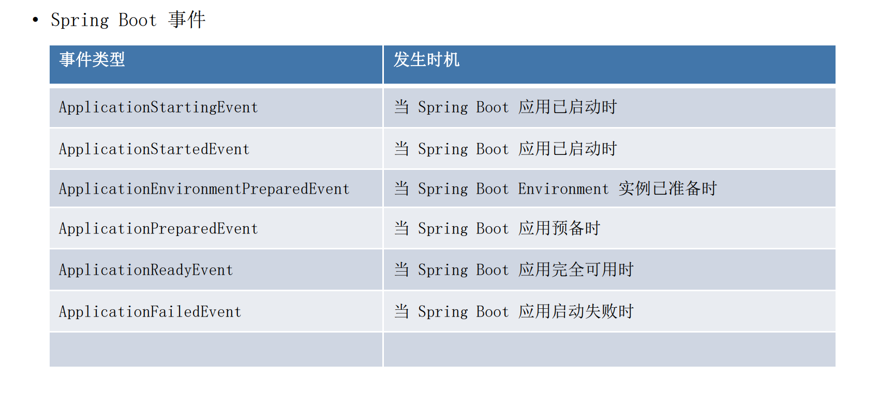
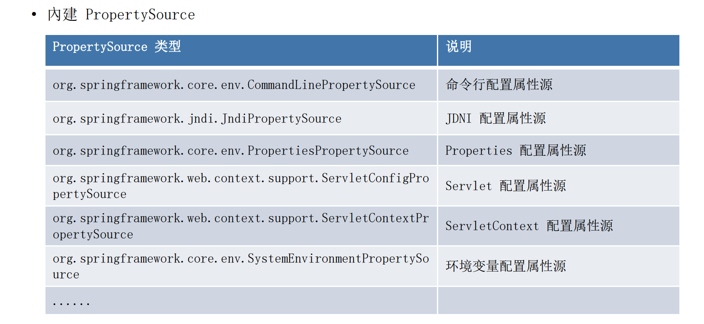

# 第三章：Spring IOC 容器概述

## Spring IoC 依赖查找

### 根据 Bean 名称查找

#### 实时查找

xml配置文件

```xml
<bean id="user" class="org.geekbang.thinking.in.spring.ioc.overview.domain.User">
        <property name="id" value="1"/>
        <property name="name" value="小马哥"/>
    </bean>
```

demo

```java
public class DependencyLookupDemo {

    public static void main(String[] args) {
        // 配置 XML 配置文件
        // 启动 Spring 应用上下文
        BeanFactory beanFactory = new ClassPathXmlApplicationContext("classpath:/META-INF/dependency-lookup-context.xml");
        lookupInRealTime(beanFactory);
    }
    private static void lookupInRealTime(BeanFactory beanFactory) {
        User user = (User) beanFactory.getBean("user");
        System.out.println("实时查找：" + user);
    }
}

```


#### 延迟查找

xml配置文件

```xml
 <bean id="objectFactory" class="org.springframework.beans.factory.config.ObjectFactoryCreatingFactoryBean">
        <property name="targetBeanName" value="user"/>
    </bean>
```

demo

```java
public class DependencyLookupDemo {

    public static void main(String[] args) {
        // 配置 XML 配置文件
        // 启动 Spring 应用上下文
        BeanFactory beanFactory = new ClassPathXmlApplicationContext("classpath:/META-INF/dependency-lookup-context.xml");
        lookupInLazy(beanFactory);
    }
    
    private static void lookupInLazy(BeanFactory beanFactory) {
        ObjectFactory<User> objectFactory = (ObjectFactory<User>) beanFactory.getBean("objectFactory");
        User user = objectFactory.getObject();
        System.out.println("延迟查找：" + user);
    }
}

```


### 根据 Bean 类型查找

#### 单个 Bean 对象

demo

```java
 private static void lookupByType(BeanFactory beanFactory) {
        User user = beanFactory.getBean(User.class);
        System.out.println("实时查找：" + user);
 }
```

#### 集合 Bean 对象

demo

```java
    private static void lookupCollectionByType(BeanFactory beanFactory) {
        if (beanFactory instanceof ListableBeanFactory) {
            ListableBeanFactory listableBeanFactory = (ListableBeanFactory) beanFactory;
            Map<String, User> users = listableBeanFactory.getBeansOfType(User.class);
            System.out.println("查找到的所有的 User 集合对象：" + users);
        }
    }
```

### 根据 Bean 名称 + 类型查找

```java
// 与上面类似
User user = (User) beanFactory.getBean("user", User.class);
```


### 根据 Java 注解查找

#### 单个 Bean 对象

####  集合 Bean 对象  

demo

```java
@Super
public class SuperUser extends User {

    private String address;

    public String getAddress() {
        return address;
    }

    public void setAddress(String address) {
        this.address = address;
    }

    @Override
    public String toString() {
        return "SuperUser{" +
                "address='" + address + '\'' +
                "} " + super.toString();
    }
}
```


```java
    private static void lookupByAnnotationType(BeanFactory beanFactory) {
        if (beanFactory instanceof ListableBeanFactory) {
            ListableBeanFactory listableBeanFactory = (ListableBeanFactory) beanFactory;
            Map<String, User> users = (Map) listableBeanFactory.getBeansWithAnnotation(Super.class);
            System.out.println("查找标注 @Super 所有的 User 集合对象：" + users);
        }
    }
```


## Spring IoC 依赖注入


### 根据 Bean 名称注入

例子如下


### 根据 Bean 类型注入

#### 单个 Bean 对象

例子如下


#### 集合 Bean 对象

例子如下


xml文件

```xml
 <bean id="userRepository" class="org.geekbang.thinking.in.spring.ioc.overview.repository.UserRepository"
          autowire="byType"> <!-- Auto-Wiring -->
        <!-- 手动配置 -->
        <!--        <property name="users">-->
        <!--            <util:list>-->
        <!--                <ref bean="superUser" />-->
        <!--                <ref bean="user" />-->
        <!--            </util:list>-->
        <!--        </property>-->

    </bean>
```

```java
public class UserRepository {

    private Collection<User> users; // 自定义 Bean
}
```

```java
  public static void main(String[] args) {

        ApplicationContext applicationContext = new ClassPathXmlApplicationContext("classpath:/META-INF/dependency-injection-context.xml");

        // 依赖来源一：自定义 Bean
        UserRepository userRepository = applicationContext.getBean("userRepository", UserRepository.class);
        System.out.println(userRepository.getUsers());
  }
```


### 注入容器內建 Bean 对象


```java
    public static void main(String[] args) {
        ApplicationContext applicationContext = new ClassPathXmlApplicationContext("classpath:/META-INF/dependency-injection-context.xml");

        // 依赖来源三：容器內建 Bean
        Environment environment = applicationContext.getBean(Environment.class);
        System.out.println("获取 Environment 类型的 Bean：" + environment);
    }
```


### 注入非 Bean 对象


```java
public class UserRepository {

    private Collection<User> users; // 自定义 Bean

    private BeanFactory beanFactory; // 內建非 Bean 对象（依赖）

    private ObjectFactory<ApplicationContext> objectFactory;
}

```


```java
    public static void main(String[] args) {
      
        ApplicationContext applicationContext = new ClassPathXmlApplicationContext("classpath:/META-INF/dependency-injection-context.xml");

        // 依赖来源二：依赖注入（ 內建非 Bean 对象（依赖））
        System.out.println(userRepository.getBeanFactory());
    }
```


### 注入类型

#### 实时注入


#### 延迟注入  


## Spr  ing IoC 依赖来源

### 自定义 Bean

### 容器內建 Bean 对象

### 容器內建依赖  

```java
public class UserRepository {

    private Collection<User> users; // 自定义 Bean

    private BeanFactory beanFactory; // 內建非 Bean 对象（依赖）

    private ObjectFactory<ApplicationContext> objectFactory;

    public Collection<User> getUsers() {
        return users;
    }

    public void setUsers(Collection<User> users) {
        this.users = users;
    }


    public void setBeanFactory(BeanFactory beanFactory) {
        this.beanFactory = beanFactory;
    }

    public BeanFactory getBeanFactory() {
        return beanFactory;
    }

    public ObjectFactory<ApplicationContext> getObjectFactory() {
        return objectFactory;
    }

    public void setObjectFactory(ObjectFactory<ApplicationContext> objectFactory) {
        this.objectFactory = objectFactory;
    }
}
```

```java
public class DependencyInjectionDemo {

    public static void main(String[] args) {
        // 配置 XML 配置文件
        // 启动 Spring 应用上下文
//        BeanFactory beanFactory = new ClassPathXmlApplicationContext("classpath:/META-INF/dependency-injection-context.xml");

        ApplicationContext applicationContext = new ClassPathXmlApplicationContext("classpath:/META-INF/dependency-injection-context.xml");

        // 依赖来源一：自定义 Bean
        UserRepository userRepository = applicationContext.getBean("userRepository", UserRepository.class);

//        System.out.println(userRepository.getUsers());

        // 依赖来源二：依赖注入（內建依赖）
        System.out.println(userRepository.getBeanFactory());


        ObjectFactory userFactory = userRepository.getObjectFactory();

        System.out.println(userFactory.getObject() == applicationContext);

        // 依赖查找（错误）
//        System.out.println(beanFactory.getBean(BeanFactory.class));

        // 依赖来源三：容器內建 Bean
        Environment environment = applicationContext.getBean(Environment.class);
        System.out.println("获取 Environment 类型的 Bean：" + environment);
        }
}
    
```

## Spring IoC 配置元信息

### Bean 定义配置

• 基于 XML 文件
• 基于 Properties 文件
• 基于 Java 注解
• 基于 Java API（ 专题讨论）

### IoC 容器配置

• 基于 XML 文件
• 基于 Java 注解
• 基于 Java API （ 专题讨论）

### 外部化属性配置

• 基于 Java 注解  


## Spring IoC 容器

BeanFactory 和 ApplicationContext 谁才是 Spring IoC 容器

## Spring 应用上下文

### ApplicationContext 除了 IoC 容器角色， 还有提供：

• 面向切面（ AOP）
• 配置元信息（ Configuration Metadata）
• 资源管理（ Resources）
• 事件（ Events）
• 国际化（ i18n）
• 注解（ Annotations）
• Environment 抽象（ Environment Abstraction）
https://docs.spring.io/spring/docs/5.2.2.RELEASE/spring-framework-reference/core.html#beans-introduction  

## 使用 Spring IoC 容器

BeanFactory 是 Spring 底层 IoC 容器

ApplicationContext 是具备应用特性的 BeanFactory 超集  

总之：BeanFactory  是提供一些配置框架，并且是一个基本特性。ApplicationContext  是提供更多企业级特性的功能。ApplicationContext 是完全的一个超集，更多的特性比如说AOP 的更好的整合，国际化的支持，事务的发布等等。

```java
public abstract class AbstractRefreshableApplicationContext extends AbstractApplicationContext {

	/** Bean factory for this context. */
	@Nullable
	private DefaultListableBeanFactory beanFactory;
}
```

我们可以看到BeanFactory  ApplicationContext  其实是同一类事物，只不过在底层实现的时候，ApplicationContext  组合了一个BeanFactory  的实现，所以毕竟是两个对象，不是一个对象。尽管复用了同一个BeanFactory 接口。

**如果你得到ApplicationContext  的时候，千万去调它的getBeanFactory()方法，去获取真正底层的实现。**


### 使用BeanFactory

```java
public class BeanFactoryAsIoCContainerDemo {

    public static void main(String[] args) {
        // 创建 BeanFactory 容器
        DefaultListableBeanFactory beanFactory = new DefaultListableBeanFactory();
        XmlBeanDefinitionReader reader = new XmlBeanDefinitionReader(beanFactory);
        // XML 配置文件 ClassPath 路径
        String location = "classpath:/META-INF/dependency-lookup-context.xml";
        // 加载配置
        int beanDefinitionsCount = reader.loadBeanDefinitions(location);
        System.out.println("Bean 定义加载的数量：" + beanDefinitionsCount);
        // 依赖查找集合对象
        lookupCollectionByType(beanFactory);
    }

    private static void lookupCollectionByType(BeanFactory beanFactory) {
        if (beanFactory instanceof ListableBeanFactory) {
            ListableBeanFactory listableBeanFactory = (ListableBeanFactory) beanFactory;
            Map<String, User> users = listableBeanFactory.getBeansOfType(User.class);
            System.out.println("查找到的所有的 User 集合对象：" + users);
        }
    }

}
```


### 使用ApplicationContext

```java
public class AnnotationApplicationContextAsIoCContainerDemo {

    public static void main(String[] args) {
        // 创建 BeanFactory 容器
        AnnotationConfigApplicationContext applicationContext = new AnnotationConfigApplicationContext();
        // 将当前类 AnnotationApplicationContextAsIoCContainerDemo 作为配置类（Configuration Class）
        applicationContext.register(AnnotationApplicationContextAsIoCContainerDemo.class);
        // 启动应用上下文
        applicationContext.refresh();
        // 依赖查找集合对象
        lookupCollectionByType(applicationContext);

        // 关闭应用上下文
        applicationContext.close();

    }

    /**
     * 通过 Java 注解的方式，定义了一个 Bean
     */
    @Bean
    public User user() {
        User user = new User();
        user.setId(1L);
        user.setName("小马哥");
        return user;
    }

    private static void lookupCollectionByType(BeanFactory beanFactory) {
        if (beanFactory instanceof ListableBeanFactory) {
            ListableBeanFactory listableBeanFactory = (ListableBeanFactory) beanFactory;
            Map<String, User> users = listableBeanFactory.getBeansOfType(User.class);
            System.out.println("查找到的所有的 User 集合对象：" + users);
        }
    }

}
```


## Spring IoC 容器生命周期

### 启动

### 运行

### 停止  


## 面试题精选

**什么是 Spring IoC 容器？**

Spring Framework 实现了控制反转 (IoC) 原则。IoC 也称为依赖注入 (DI)。在这个过程中，对象仅通过构造函数参数、工厂方法参数或对象实例构造或从工厂方法返回后设置的属性来定义其依赖关系（即与之协同工作的其他对象）。 然后，容器会在创建 Bean 时注入这些依赖关系。


**BeanFactory 与 FactoryBean？**
BeanFactory 是 IoC 底层容器
FactoryBean 是 创建 Bean 的一种方式，帮助实现复杂的初始化逻辑


# 第四章： Spring Bean 基础

## 定义 Spring Bean

什么是 BeanDefinition？

BeanDefinition 是 Spring Framework 中定义 Bean 的**配置元信息接口**， 包含：
	• Bean 的类名
	• Bean 行为配置元素， 如作用域、 自动绑定的模式， 生命周期回调等
	• 其他 Bean 引用， 又可称作合作者（ collaborators） 或者依赖（ dependencies）
	• 配置设置， 比如 Bean 属性（ Properties）  

## BeanDefinition 元信息

- BeanDefinition 元信息  

| 属性（ Property）        | 说明                                            |
| ------------------------ | ----------------------------------------------- |
| Class                    | Bean 全类名， 必须是具体类， 不能用抽象类或接口 |
| Name                     | Bean 的名称或者 ID                              |
| Scope                    | Bean 的作用域（ 如： singleton、 prototype 等） |
| Constructor arguments    | Bean 构造器参数（ 用于依赖注入）                |
| Properties               | Bean 属性设置（ 用于依赖注入）                  |
| Autowiring mode          | Bean 自动绑定模式（ 如： 通过名称 byName）      |
| Lazy initialization mode | Bean 延迟初始化模式（ 延迟和非延迟）            |
| Initialization method    | Bean 初始化回调方法名称                         |
| Destruction method       | Bean 销毁回调方法名称                           |

- BeanDefinition 构建
  - 通过 BeanDefinitionBuilder
  - 通过 AbstractBeanDefinition 以及派生类  


```java
public class BeanDefinitionCreationDemo {

    public static void main(String[] args) {

        // 1.通过 BeanDefinitionBuilder 构建
        BeanDefinitionBuilder beanDefinitionBuilder = BeanDefinitionBuilder.genericBeanDefinition(User.class);
        // 通过属性设置
        beanDefinitionBuilder
                .addPropertyValue("id", 1)
                .addPropertyValue("name", "小马哥");
        // 获取 BeanDefinition 实例
        BeanDefinition beanDefinition = beanDefinitionBuilder.getBeanDefinition();
        // BeanDefinition 并非 Bean 终态，可以自定义修改

        // 2. 通过 AbstractBeanDefinition 以及派生类
        GenericBeanDefinition genericBeanDefinition = new GenericBeanDefinition();
        // 设置 Bean 类型
        genericBeanDefinition.setBeanClass(User.class);
        // 通过 MutablePropertyValues 批量操作属性
        MutablePropertyValues propertyValues = new MutablePropertyValues();
//        propertyValues.addPropertyValue("id", 1);
//        propertyValues.addPropertyValue("name", "小马哥");
        propertyValues
                .add("id", 1)
                .add("name", "小马哥");
        // 通过 set MutablePropertyValues 批量操作属性
        genericBeanDefinition.setPropertyValues(propertyValues);
    }
}

```


## 命名 Spring Bean

- Bean 的名称
  - 每个 Bean 拥有一个或多个标识符（ identifiers） ， 这些标识符在 Bean 所在的容器必须是
    唯一的。 通常， 一个 Bean 仅有一个标识符， 如果需要额外的， 可考虑使用别名（ Alias） 来
    扩充。
  - 在基于 XML 的配置元信息中， 开发人员可用 id 或者 name 属性来规定 Bean 的 标识符。 通
    常 Bean 的 标识符由字母组成， 允许出现特殊字符。 如果要想引入 Bean 的别名的话， 可在
    name 属性使用半角逗号（ “ ,” ） 或分号（ “ ;” ) 来间隔。
  - Bean 的 id 或 name 属性并非必须制定， 如果留空的话， 容器会为 Bean 自动生成一个唯一
    的名称。 Bean 的命名尽管没有限制， 不过官方建议采用驼峰的方式， 更符合 Java 的命名约
    定 。

## Spring Bean 的别名

-  Bean 别名（Alias）的价值
  - 复用现有的 BeanDefinition

  -  更具有场景化的命名方法，比如：

    <alias name="myApp-dataSource" alias="subsystemA-dataSource"/>
    <alias name="myApp-dataSource" alias="subsystemB-dataSource"/>

xml

```xml
<!-- 将 Spring 容器中 "user" Bean 关联/建立别名 - "xiaomage-user" -->
    <alias name="user" alias="xiaomage-user" />
```

demo

```java
public class BeanAliasDemo {

    public static void main(String[] args) {
        // 配置 XML 配置文件
        // 启动 Spring 应用上下文
        BeanFactory beanFactory = new ClassPathXmlApplicationContext("classpath:/META-INF/bean-definitions-context.xml");
        // 通过别名 xiaomage-user 获取曾用名 user 的 bean
        User user = beanFactory.getBean("user", User.class);
        User xiaomageUser = beanFactory.getBean("xiaomage-user", User.class);
        System.out.println("xiaomage-user 是否与 user Bean 相同：" + (user == xiaomageUser));
    }
}
```


## 注册 Spring Bean

### BeanDefinition 注册


#### XML 配置元信息

```xml
<bean name=” ...” ... />
```

略


#### Java 注解配置元信息


**@Bean**

```java
public class AnnotationBeanDefinitionDemo {

    public static class Config {

        // 1. 通过 @Bean 方式定义

        /**
         * 通过 Java 注解的方式，定义了一个 Bean
         */
        @Bean(name = {"user", "xiaomage-user"})
        public User user() {
            User user = new User();
            user.setId(1L);
            user.setName("小马哥");
            return user;
        }
    }

}
```


**@Component**

```
public class AnnotationBeanDefinitionDemo {

    // 2. 通过 @Component 方式
    @Component // 定义当前类作为 Spring Bean（组件）
    public static class Config {
      
    }
}
```


**@Import**

```java
// 3. 通过 @Import 来进行导入
@Import(AnnotationBeanDefinitionDemo.Config.class)
public class AnnotationBeanDefinitionDemo {
    
}
```


**完整示例如下**

```java
/**
 * 注解 BeanDefinition 示例
 *
 * @author <a href="mailto:mercyblitz@gmail.com">Mercy</a>
 * @since
 */
// 3. 通过 @Import 来进行导入
@Import(AnnotationBeanDefinitionDemo.Config.class)
public class AnnotationBeanDefinitionDemo {

    public static void main(String[] args) {
        // 创建 BeanFactory 容器
        AnnotationConfigApplicationContext applicationContext = new AnnotationConfigApplicationContext();
        // 注册 Configuration Class（配置类）
        applicationContext.register(AnnotationBeanDefinitionDemo.class);

        // 通过 BeanDefinition 注册 API 实现
        // 1.命名 Bean 的注册方式
        registerUserBeanDefinition(applicationContext, "mercyblitz-user");
        // 2. 非命名 Bean 的注册方法
        registerUserBeanDefinition(applicationContext);

        // 启动 Spring 应用上下文
        applicationContext.refresh();
        // 按照类型依赖查找
        System.out.println("Config 类型的所有 Beans" + applicationContext.getBeansOfType(Config.class));
        System.out.println("User 类型的所有 Beans" + applicationContext.getBeansOfType(User.class));
        // 显示地关闭 Spring 应用上下文
        applicationContext.close();
    }

    public static void registerUserBeanDefinition(BeanDefinitionRegistry registry, String beanName) {
        BeanDefinitionBuilder beanDefinitionBuilder = genericBeanDefinition(User.class);
        beanDefinitionBuilder
                .addPropertyValue("id", 1L)
                .addPropertyValue("name", "小马哥");

        // 判断如果 beanName 参数存在时
        if (StringUtils.hasText(beanName)) {
            // 注册 BeanDefinition
            registry.registerBeanDefinition(beanName, beanDefinitionBuilder.getBeanDefinition());
        } else {
            // 非命名 Bean 注册方法
            BeanDefinitionReaderUtils.registerWithGeneratedName(beanDefinitionBuilder.getBeanDefinition(), registry);
        }
    }

    public static void registerUserBeanDefinition(BeanDefinitionRegistry registry) {
        registerUserBeanDefinition(registry, null);
    }

    // 2. 通过 @Component 方式
    @Component // 定义当前类作为 Spring Bean（组件）
    public static class Config {

        // 1. 通过 @Bean 方式定义

        /**
         * 通过 Java 注解的方式，定义了一个 Bean
         */
        @Bean(name = {"user", "xiaomage-user"})
        public User user() {
            User user = new User();
            user.setId(1L);
            user.setName("小马哥");
            return user;
        }
    }


}
```


#### Java API 配置元信息

**命名方式： BeanDefinitionRegistry#registerBeanDefinition(String,BeanDefinition)**

 **非命名方式：**
**BeanDefinitionReaderUtils#registerWithGeneratedName(AbstractBeanDefinition,BeanDe**
**finitionRegistry)**

```java
public class AnnotationBeanDefinitionDemo {

    public static void main(String[] args) {
        // 创建 BeanFactory 容器
        AnnotationConfigApplicationContext applicationContext = new AnnotationConfigApplicationContext();
        // 注册 Configuration Class（配置类）
        applicationContext.register(AnnotationBeanDefinitionDemo.class);

        // 通过 BeanDefinition 注册 API 实现
        // 1.命名 Bean 的注册方式
        registerUserBeanDefinition(applicationContext, "mercyblitz-user");
        // 2. 非命名 Bean 的注册方法
        registerUserBeanDefinition(applicationContext);

        // 启动 Spring 应用上下文
        applicationContext.refresh();
        // 按照类型依赖查找
        System.out.println("Config 类型的所有 Beans" + applicationContext.getBeansOfType(Config.class));
        System.out.println("User 类型的所有 Beans" + applicationContext.getBeansOfType(User.class));
        // 显示地关闭 Spring 应用上下文
        applicationContext.close();
    }

    public static void registerUserBeanDefinition(BeanDefinitionRegistry registry, String beanName) {
        BeanDefinitionBuilder beanDefinitionBuilder = genericBeanDefinition(User.class);
        beanDefinitionBuilder
                .addPropertyValue("id", 1L)
                .addPropertyValue("name", "小马哥");

        // 判断如果 beanName 参数存在时
        if (StringUtils.hasText(beanName)) {
            // 注册 BeanDefinition
            registry.registerBeanDefinition(beanName, beanDefinitionBuilder.getBeanDefinition());
        } else {
            // 非命名 Bean 注册方法
            BeanDefinitionReaderUtils.registerWithGeneratedName(beanDefinitionBuilder.getBeanDefinition(), registry);
        }
    }

    public static void registerUserBeanDefinition(BeanDefinitionRegistry registry) {
        registerUserBeanDefinition(registry, null);
    }

}

```


**配置类方式： AnnotatedBeanDefinitionReader#register(Class...)**  

```java
public class AnnotationBeanDefinitionDemo {

    public static void main(String[] args) {
        // 创建 BeanFactory 容器
        AnnotationConfigApplicationContext applicationContext = new AnnotationConfigApplicationContext();
        // 注册 Configuration Class（配置类）
        applicationContext.register(AnnotationBeanDefinitionDemo.class);

        // 显示地关闭 Spring 应用上下文
        applicationContext.close();
    }

}
```


## 实例化 Spring Bean

### Bean 实例化（ Instantiation）


#### 常规方式

**• 通过构造器（ 配置元信息： XML、 Java 注解和 Java API ）**

同上

**• 通过静态工厂方法（ 配置元信息： XML 和 Java API ）**

xml

```xml
<!-- 静态方法实例化 Bean -->
 <bean id="user-by-static-method" class="org.geekbang.thinking.in.spring.ioc.overview.domain.User"
       factory-method="createUser"/>
```

demo

```java
public class User {

    private Long id;

    private String name;

    private City city;

    private City[] workCities;

    private List<City> lifeCities;

    private Resource configFileLocation;

    private Company company;

    private Properties context;

    private String contextAsText;
   
    public static User createUser() {
        User user = new User();
        user.setId(1L);
        user.setName("小马哥");
        return user;
    }
}
```

```java
public class BeanInstantiationDemo {

    public static void main(String[] args) {
        // 配置 XML 配置文件
        // 启动 Spring 应用上下文
        BeanFactory beanFactory = new ClassPathXmlApplicationContext("classpath:/META-INF/bean-instantiation-context.xml");
        User user = beanFactory.getBean("user-by-static-method", User.class);
        User userByInstanceMethod = beanFactory.getBean("user-by-instance-method", User.class);
    }
}
```

**• 通过 Bean 工厂方法（ 配置元信息： XML和 Java API ）**

xml

```xml
<!-- 实例（Bean）方法实例化 Bean -->
<bean id="user-by-instance-method" factory-bean="userFactory" factory-method="createUser"/>

  <bean id="userFactory" class="org.geekbang.thinking.in.spring.bean.factory.DefaultUserFactory"/>
```

demo

```java
public interface UserFactory {

    default User createUser() {
        return User.createUser();
    }
}
public class DefaultUserFactory implements UserFactory{

}
```

**• 通过 FactoryBean（ 配置元信息： XML、 Java 注解和 Java API ）**

xml

```xml
<!-- FactoryBean实例化 Bean -->
<bean id="user-by-factory-bean" class="org.geekbang.thinking.in.spring.bean.factory.UserFactoryBean" />
```

```java
public class UserFactoryBean implements FactoryBean {

    @Override
    public Object getObject() throws Exception {
        return User.createUser();
    }

    @Override
    public Class<?> getObjectType() {
        return User.class;
    }
}
```


#### 特殊方式

**• 通过 ServiceLoaderFactoryBean（ 配置元信息： XML、 Java 注解和 Java API ）**


META-INF/services/org.geekbang.thinking.in.spring.bean.factory.UserFactory

```
org.geekbang.thinking.in.spring.bean.factory.DefaultUserFactory
```

xml

```xml
<bean id="userFactory" class="org.geekbang.thinking.in.spring.bean.factory.DefaultUserFactory"/>
```

demo

```java
public class SpecialBeanInstantiationDemo {

    public static void main(String[] args) {
        // 配置 XML 配置文件
        // 启动 Spring 应用上下文
        ApplicationContext applicationContext = new ClassPathXmlApplicationContext("classpath:/META-INF/special-bean-instantiation-context.xml");
        // 通过 ApplicationContext 获取 AutowireCapableBeanFactory
        AutowireCapableBeanFactory beanFactory = applicationContext.getAutowireCapableBeanFactory();

        ServiceLoader<UserFactory> serviceLoader = beanFactory.getBean("userFactoryServiceLoader", ServiceLoader.class);

        displayServiceLoader(serviceLoader);

//        demoServiceLoader();

        // 创建 UserFactory 对象，通过 AutowireCapableBeanFactory
        UserFactory userFactory = beanFactory.createBean(DefaultUserFactory.class);
        System.out.println(userFactory.createUser());

    }

    public static void demoServiceLoader() {
        ServiceLoader<UserFactory> serviceLoader = load(UserFactory.class, Thread.currentThread().getContextClassLoader());
        displayServiceLoader(serviceLoader);
    }

    private static void displayServiceLoader(ServiceLoader<UserFactory> serviceLoader) {
        Iterator<UserFactory> iterator = serviceLoader.iterator();
        while (iterator.hasNext()) {
            UserFactory userFactory = iterator.next();
            System.out.println(userFactory.createUser());
        }
    }
}
```

**• 通过 AutowireCapableBeanFactory#createBean(java.lang.Class, int, boolean)**

```java
public class SpecialBeanInstantiationDemo {

    public static void main(String[] args) {
        // 配置 XML 配置文件
        // 启动 Spring 应用上下文
        ApplicationContext applicationContext = new ClassPathXmlApplicationContext("classpath:/META-INF/special-bean-instantiation-context.xml");
        // 通过 ApplicationContext 获取 AutowireCapableBeanFactory
        AutowireCapableBeanFactory beanFactory = applicationContext.getAutowireCapableBeanFactory();

        ServiceLoader<UserFactory> serviceLoader = beanFactory.getBean("userFactoryServiceLoader", ServiceLoader.class);

        displayServiceLoader(serviceLoader);

//        demoServiceLoader();

        // 创建 UserFactory 对象，通过 AutowireCapableBeanFactory
        UserFactory userFactory = beanFactory.createBean(DefaultUserFactory.class);
        System.out.println(userFactory.createUser());

    }
}
```

**• 通过 BeanDefinitionRegistry#registerBeanDefinition(String,BeanDefinition)**  

注册Sring Bean 已经讲过


## 初始化 Spring Bean

### Bean 初始化（ Initialization）


#### @PostConstruct 标注方法

```java
    @Bean()
    public UserFactory userFactory() {
        return new DefaultUserFactory();
    }

public class DefaultUserFactory implements UserFactory, InitializingBean, DisposableBean {

    // 1. 基于 @PostConstruct 注解
    @PostConstruct
    public void init() {
        System.out.println("@PostConstruct : UserFactory 初始化中...");
    }
}
```


#### 实现 InitializingBean 接口的 afterPropertiesSet() 方法

```
    @Bean()
    public UserFactory userFactory() {
        return new DefaultUserFactory();
    }

public class DefaultUserFactory implements UserFactory, InitializingBean{

    @Override
    public void afterPropertiesSet() throws Exception {
        System.out.println("InitializingBean#afterPropertiesSet() : UserFactory 初始化中...");
    }
}
```


#### 自定义初始化方法

• **XML 配置： <bean init-method=” init” ... />**

• **Java 注解： @Bean(initMethod=” init” )**

```java
@Bean(initMethod = "initUserFactory")
public UserFactory userFactory() {
    return new DefaultUserFactory();
}
public class DefaultUserFactory {

    public void initUserFactory() {
        System.out.println("自定义初始化方法 initUserFactory() : UserFactory 初始化中...");
    }
}

```

• **Java API： AbstractBeanDefinition#setInitMethodName(String )**


## 延迟初始化 Spring Bean

Bean 延迟初始化（ Lazy Initialization）
• XML 配置： <bean lazy-init=” true” ... />
• Java 注解： @Lazy(true)  

```java
    @Lazy()
    public UserFactory userFactory() {
        return new DefaultUserFactory();
    }
```


## 销毁 Spring Bean

#### Bean 销毁（ Destroy）


##### @PreDestroy 标注方法


##### 实现 DisposableBean 接口的 destroy() 方法


##### 自定义销毁方法

• **XML 配置： <bean destroy=” destroy” ... />**
• **Java 注解： @Bean(destroy=” destroy” )**
• **Java API： AbstractBeanDefinition#setDestroyMethodName(String)**  


## 垃圾回收 Spring Bean

### Bean 垃圾回收（ GC）

1. 关闭 Spring 容器（ 应用上下文）
2. 执行 GC
3. Spring Bean 覆盖的 finalize() 方法被回调


# 第五章： Spring IoC 依赖查找

## 依赖查找的今世前生

- 单一类型依赖查找
  - JNDI - javax.naming.Context#lookup(javax.naming.Name)
  - JavaBeans - java.beans.beancontext.BeanContext
- 集合类型依赖查找
  - java.beans.beancontext.BeanContext
- 层次性依赖查找
  - java.beans.beancontext.BeanContext


## 单一类型依赖查找


- 单一类型依赖查找接口 - BeanFactory

  - 根据 Bean 名称查找

    - getBean(String)
    - Spring 2.5 覆盖默认参数：getBean(String,Object...)

  - 根据 Bean 类型查找

    - Bean 实时查找

      - Spring 3.0 getBean(Class)
      - Spring 4.1 覆盖默认参数：getBean(Class,Object...)

    - Spring 5.1 Bean 延迟查找

      - getBeanProvider(Class)

        ```java
        public class ObjectProviderDemo { // @Configuration 是非必须注解
        
            public static void main(String[] args) {
                // 创建 BeanFactory 容器
                AnnotationConfigApplicationContext applicationContext = new AnnotationConfigApplicationContext();
                // 将当前类 ObjectProviderDemo 作为配置类（Configuration Class）
                applicationContext.register(ObjectProviderDemo.class);
                // 启动应用上下文
                applicationContext.refresh();
                lookupByObjectProvider(applicationContext);
                // 关闭应用上下文
                applicationContext.close();
        
            }
        
            @Bean
            @Primary
            public String helloWorld() { // 方法名就是 Bean 名称 = "helloWorld"
                return "Hello,World";
            }
        
            @Bean
            public String message() {
                return "Message";
            }
        
            private static void lookupByObjectProvider(AnnotationConfigApplicationContext applicationContext) {
                ObjectProvider<String> objectProvider = applicationContext.getBeanProvider(String.class);
                System.out.println(objectProvider.getObject());
            }
        }
        
        ```

      - getBeanProvider(ResolvableType)

  - 根据 Bean 名称 + 类型查找：getBean(String,Class)


## 集合类型依赖查找


- 集合类型依赖查找接口 - ListableBeanFactory
  - 根据 Bean 类型查找
    - 获取同类型 Bean 名称列表
      - getBeanNamesForType(Class)
      - Spring 4.2 getBeanNamesForType(ResolvableType)
    - 获取同类型 Bean 实例列表
      - getBeansOfType(Class) 以及重载方法
  - 通过注解类型查找
    - Spring 3.0 获取标注类型 Bean 名称列表
      - getBeanNamesForAnnotation(Class<? extends Annotation>)
    - Spring 3.0 获取标注类型 Bean 实例列表
      - getBeansWithAnnotation(Class<? extends Annotation>)
    - Spring 3.0 获取指定名称 + 标注类型 Bean 实例
      - findAnnotationOnBean(String,Class<? extends Annotation>)


## 层次性依赖查找


- 层次性依赖查找接口 - HierarchicalBeanFactory
  - 双亲 BeanFactory：getParentBeanFactory()
  - 层次性查找
    - 根据 Bean 名称查找
      - 基于 containsLocalBean 方法实现
    - 根据 Bean 类型查找实例列表
      - 单一类型：BeanFactoryUtils#beanOfType
      - 集合类型：BeanFactoryUtils#beansOfTypeIncludingAncestors
    - 根据 Java 注解查找名称列表
      - BeanFactoryUtils#beanNamesForTypeIncludingAncestors


## 延迟依赖查找


- Bean 延迟依赖查找接口
  - org.springframework.beans.factory.ObjectFactory
  - org.springframework.beans.factory.ObjectProvider
    - Spring 5 对 Java 8 特性扩展
      - 函数式接口
        - getIfAvailable(Supplier)
        - ifAvailable(Consumer)
      - Stream 扩展 - stream()


## 安全依赖查找

- 依赖查找安全性对比

  | 依赖查找类型 | 代表实现                           | 是否安全 |
  | ------------ | ---------------------------------- | -------- |
  | 单一类型查找 | BeanFactory#getBean                | 否       |
  |              | ObjectFactory#getObject            | 否       |
  |              | ObjectProvider#getIfAvailable      | 是       |
  |              |                                    |          |
  | 集合类型查找 | ListableBeanFactory#getBeansOfType | 是       |
  |              | ObjectProvider#stream              | 是       |

没理解

```java
/**
 * 类型安全 依赖查找示例
 *
 * @author <a href="mailto:mercyblitz@gmail.com">Mercy</a>
 * @since
 */
public class TypeSafetyDependencyLookupDemo {

    public static void main(String[] args) {
        // 创建 BeanFactory 容器
        AnnotationConfigApplicationContext applicationContext = new AnnotationConfigApplicationContext();
        // 将当前类 TypeSafetyDependencyLookupDemo 作为配置类（Configuration Class）
        applicationContext.register(TypeSafetyDependencyLookupDemo.class);
        // 启动应用上下文
        applicationContext.refresh();

        // 演示 BeanFactory#getBean 方法的安全性
        displayBeanFactoryGetBean(applicationContext);
        // 演示 ObjectFactory#getObject 方法的安全性
        displayObjectFactoryGetObject(applicationContext);
        // 演示 ObjectProvider#getIfAvaiable 方法的安全性
        displayObjectProviderIfAvailable(applicationContext);

        // 演示 ListableBeanFactory#getBeansOfType 方法的安全性
        displayListableBeanFactoryGetBeansOfType(applicationContext);
        // 演示 ObjectProvider Stream 操作的安全性
        displayObjectProviderStreamOps(applicationContext);

        // 关闭应用上下文
        applicationContext.close();
    }

    private static void displayObjectProviderStreamOps(AnnotationConfigApplicationContext applicationContext) {
        ObjectProvider<User> userObjectProvider = applicationContext.getBeanProvider(User.class);
        printBeansException("displayObjectProviderStreamOps", () -> userObjectProvider.forEach(System.out::println));
    }

    private static void displayListableBeanFactoryGetBeansOfType(ListableBeanFactory beanFactory) {
        printBeansException("displayListableBeanFactoryGetBeansOfType", () -> beanFactory.getBeansOfType(User.class));
    }

    private static void displayObjectProviderIfAvailable(AnnotationConfigApplicationContext applicationContext) {
        ObjectProvider<User> userObjectProvider = applicationContext.getBeanProvider(User.class);
        printBeansException("displayObjectProviderIfAvailable", () -> userObjectProvider.getIfAvailable());
    }

    private static void displayObjectFactoryGetObject(AnnotationConfigApplicationContext applicationContext) {
        // ObjectProvider is ObjectFactory
        ObjectFactory<User> userObjectFactory = applicationContext.getBeanProvider(User.class);
        printBeansException("displayObjectFactoryGetObject", () -> userObjectFactory.getObject());
    }

    public static void displayBeanFactoryGetBean(BeanFactory beanFactory) {
        printBeansException("displayBeanFactoryGetBean", () -> beanFactory.getBean(User.class));
    }

    private static void printBeansException(String source, Runnable runnable) {
        System.err.println("==========================================");
        System.err.println("Source from :" + source);
        try {
            runnable.run();
        } catch (BeansException exception) {
            exception.printStackTrace();
        }
    }
}
```


## 内建可查找的依赖


AbstractApplicationContext 内建可查找的依赖

| Bean 名称                   | Bean 实例                         | 使用场景                |
| --------------------------- | --------------------------------- | ----------------------- |
| environment                 | Environment 对象                  | 外部化配置以及 Profiles |
| systemProperties            | java.util.Properties 对象         | Java 系统属性           |
| systemEnvironment           | java.util.Map 对象                | 操作系统环境变量        |
| messageSource               | MessageSource 对象                | 国际化文案              |
| lifecycleProcessor          | LifecycleProcessor 对象           | Lifecycle Bean 处理器   |
| applicationEventMulticaster | ApplicationEventMulticaster 对 象 | Spring 事件广播器       |


注解驱动 Spring 应用上下文内建可查找的依赖（ 部分）

| Bean 名称                                                    | Bean 实例                                  | 使用场景                                               |
| ------------------------------------------------------------ | ------------------------------------------ | ------------------------------------------------------ |
| org.springframework.context. annotation.internalConfigur ationAnnotationProcessor | ConfigurationClassPostProcesso r 对象      | 处理 Spring 配置类                                     |
| org.springframework.context. annotation.internalAutowire dAnnotationProcessor | AutowiredAnnotationBeanPostPro cessor 对象 | 处理 @Autowired 以及 @Value 注解                       |
| org.springframework.context. annotation.internalCommonAn notationProcessor | CommonAnnotationBeanPostProces sor 对象    | （ 条件激活） 处理 JSR-250 注解， 如 @PostConstruct 等 |
| org.springframework.context. event.internalEventListener Processor | EventListenerMethodProcessor 对象          | 处理标注 @EventListener 的 Spring 事件监听方法         |

注解驱动 Spring 应用上下文内建可查找的依赖（续）

| org.springframework.context. event.internalEventListener Factory | DefaultEventListenerFactory 对 象            | @EventListener 事件监听方法适 配为 ApplicationListener |
| ------------------------------------------------------------ | -------------------------------------------- | ------------------------------------------------------ |
| org.springframework.context. annotation.internalPersiste nceAnnotationProcessor | PersistenceAnnotationBeanPostP rocessor 对象 | （ 条件激活） 处理 JPA 注解场景                        |


## 依赖查找中的经典异常

BeansException 子类型

| 异常类型                        | 触发条件（ 举例）                            | 场景举例                                    |
| ------------------------------- | -------------------------------------------- | ------------------------------------------- |
| NoSuchBeanDefinitionException   | 当查找 Bean 不存在于 IoC 容器 时             | BeanFactory#getBean ObjectFactory#getObject |
| NoUniqueBeanDefinitionException | 类型依赖查找时， IoC 容器存在多 个 Bean 实例 | BeanFactory#getBean(Clas s)                 |
| BeanInstantiationException      | 当 Bean 所对应的类型非具体类时               | BeanFactory#getBean                         |
| BeanCreationException           | 当 Bean 初始化过程中                         | Bean 初始化方法执行异常 时                  |
| BeanDefinitionStoreException    | 当 BeanDefinition 配置元信息非 法时          | XML 配置资源无法打开时                      |


# 第六章 Spring IoC 依赖注入


## 依赖注入的模式和类型


###  手动模式 - 配置或者编程的方式， 提前安排注入规则

- XML 资源配置元信息
- Java 注解配置元信息
- API 配置元信息


### 自动模式 - 实现方提供依赖自动关联的方式， 按照內建的注入规则

- Autowiring（ 自动绑定）  


### 依赖注入类型

| 依赖注入类型 | 配置元数据举例                                   |
| ------------ | ------------------------------------------------ |
| Setter 方法  | <proeprty name=” user” ref=” userBean” />        |
| 构造器       | <constructor-arg name="user" ref="userBean" />   |
| 字段         | @Autowired User user;                            |
| 方法         | @Autowired public void user(User user) { ... }   |
| 接口回调     | class MyBean implements BeanFactoryAware { ... } |


## 自动绑定（ Autowiring）

#### 官方说明

The Spring container can autowire relationships between collaborating beans. You can let Spring
resolve collaborators (other beans) automatically for your bean by inspecting the contents of the
ApplicationContext.

#### 优点

• Autowiring can significantly reduce the need to specify properties or constructor
arguments.
• Autowiring can update a configuration as your objects evolve.  

#### 不自动绑定


#### 自动绑定


## 自动绑定（ Autowiring） 模式

#### Autowiring modes

| 模式        | 说明                                                         |
| ----------- | ------------------------------------------------------------ |
| no          | 默认值， 未激活 Autowiring， 需要手动指定依赖注入对象        |
| byName      | 根据被注入属性的名称作为 Bean 名称进行依赖查找， 并将对象设置到 该属性 |
| byType      | 根据被注入属性的类型作为依赖类型进行查找， 并将对象设置到该属性 |
| constructor | 特殊 byType 类型， 用于构造器参数                            |

参考枚举： org.springframework.beans.factory.annotation.Autowire

## 自动绑定（ Autowiring） 限制和不足

#### 官方说明

Limitations and Disadvantages of Autowiring 小节
链接： https://docs.spring.io/spring/docs/5.2.2.RELEASE/spring-frameworkreference/core.html#beans-autowired-exceptions  


## Setter 方法依赖注入

### 实现方法

#### 手动模式

##### • XML 资源配置元信息

xml文件

```xml
<bean class="org.geekbang.thinking.in.spring.ioc.dependency.injection.UserHolder">
    <property name="user" ref="superUser" />
</bean>
```

```java
public class UserHolder {

    private User user;

    public UserHolder() {
    }

    public UserHolder(User user) {
        this.user = user;
    }

    public User getUser() {
        return user;
    }

    public void setUser(User user) {
        this.user = user;
    }

    @Override
    public String toString() {
        return "UserHolder{" +
                "user=" + user +
                '}';
    }
}
```

demo

```java
public class XmlDependencySetterInjectionDemo {

    public static void main(String[] args) {

        DefaultListableBeanFactory beanFactory = new DefaultListableBeanFactory();

        XmlBeanDefinitionReader beanDefinitionReader = new XmlBeanDefinitionReader(beanFactory);

        String xmlResourcePath = "classpath:/META-INF/dependency-setter-injection.xml";
        // 加载 XML 资源，解析并且生成 BeanDefinition
        beanDefinitionReader.loadBeanDefinitions(xmlResourcePath);
        // 依赖查找并且创建 Bean
        UserHolder userHolder = beanFactory.getBean(UserHolder.class);
        System.out.println(userHolder);

    }
}
```


##### • Java 注解配置元信息

```java
/**
 * 基于 Java 注解的依赖 Setter 方法注入示例
 *
 * @author <a href="mailto:mercyblitz@gmail.com">Mercy</a>
 * @since
 */
public class AnnotationDependencySetterInjectionDemo {

    public static void main(String[] args) {

        // 创建 BeanFactory 容器
        AnnotationConfigApplicationContext applicationContext = new AnnotationConfigApplicationContext();
        // 注册 Configuration Class（配置类）
        applicationContext.register(AnnotationDependencySetterInjectionDemo.class);

        XmlBeanDefinitionReader beanDefinitionReader = new XmlBeanDefinitionReader(applicationContext);

        String xmlResourcePath = "classpath:/META-INF/dependency-lookup-context.xml";
        // 加载 XML 资源，解析并且生成 BeanDefinition
        beanDefinitionReader.loadBeanDefinitions(xmlResourcePath);

        // 启动 Spring 应用上下文
        applicationContext.refresh();

        // 依赖查找并且创建 Bean
        UserHolder userHolder = applicationContext.getBean(UserHolder.class);
        System.out.println(userHolder);

        // 显示地关闭 Spring 应用上下文
        applicationContext.close();
    }

    @Bean
    public UserHolder userHolder(User user) {
        UserHolder userHolder = new UserHolder();
        userHolder.setUser(user);
        return userHolder;
    }
}
```

##### • API 配置元信息

```java
/**
 * 基于 API 实现依赖 Setter 方法注入示例
 *
 * @author <a href="mailto:mercyblitz@gmail.com">Mercy</a>
 * @since
 */
public class ApiDependencySetterInjectionDemo {

    public static void main(String[] args) {

        // 创建 BeanFactory 容器
        AnnotationConfigApplicationContext applicationContext = new AnnotationConfigApplicationContext();

        // 生成 UserHolder 的 BeanDefinition
        BeanDefinition userHolderBeanDefinition = createUserHolderBeanDefinition();
        // 注册 UserHolder 的 BeanDefinition
        applicationContext.registerBeanDefinition("userHolder", userHolderBeanDefinition);

        XmlBeanDefinitionReader beanDefinitionReader = new XmlBeanDefinitionReader(applicationContext);

        String xmlResourcePath = "classpath:/META-INF/dependency-lookup-context.xml";
        // 加载 XML 资源，解析并且生成 BeanDefinition
        beanDefinitionReader.loadBeanDefinitions(xmlResourcePath);

        // 启动 Spring 应用上下文
        applicationContext.refresh();

        // 依赖查找并且创建 Bean
        UserHolder userHolder = applicationContext.getBean(UserHolder.class);
        System.out.println(userHolder);

        // 显示地关闭 Spring 应用上下文
        applicationContext.close();
    }

    /**
     * 为 {@link UserHolder} 生成 {@link BeanDefinition}
     *
     * @return
     */
    private static BeanDefinition createUserHolderBeanDefinition() {
        BeanDefinitionBuilder definitionBuilder = BeanDefinitionBuilder.genericBeanDefinition(UserHolder.class);
        definitionBuilder.addPropertyReference("user", "superUser");
        return definitionBuilder.getBeanDefinition();
    }
}
```

#### 自动模式

##### • byName

```
 <bean class="org.geekbang.thinking.in.spring.ioc.dependency.injection.UserHolder"
          autowire="byName"
    >
<!--        <property name="user" ref="superUser" /> 替换成 autowiring 模式 -->
    </bean>
```

##### • byType  

```xml
 <bean class="org.geekbang.thinking.in.spring.ioc.dependency.injection.UserHolder"
          autowire="byType"
    >
<!--        <property name="user" ref="superUser" /> 替换成 autowiring 模式 -->
    </bean>
```

demo

```java
/**
 * "byName" Autowiring 依赖 Setter 方法注入示例
 *
 * @author <a href="mailto:mercyblitz@gmail.com">Mercy</a>
 * @since
 */
public class AutoWiringByNameDependencySetterInjectionDemo {

    public static void main(String[] args) {

        DefaultListableBeanFactory beanFactory = new DefaultListableBeanFactory();

        XmlBeanDefinitionReader beanDefinitionReader = new XmlBeanDefinitionReader(beanFactory);

        String xmlResourcePath = "classpath:/META-INF/autowiring-dependency-setter-injection.xml";
        // 加载 XML 资源，解析并且生成 BeanDefinition
        beanDefinitionReader.loadBeanDefinitions(xmlResourcePath);
        // 依赖查找并且创建 Bean
        UserHolder userHolder = beanFactory.getBean(UserHolder.class);
        System.out.println(userHolder);

    }

}
```


## 构造器依赖注入

### 实现方法

#### 手动模式

##### • XML 资源配置元信息

```xml
<bean class="org.geekbang.thinking.in.spring.ioc.dependency.injection.UserHolder">
    <constructor-arg name="user" ref="superUser" />
</bean>
```

```java
/**
 * 基于 XML 资源的依赖 Constructor 注入示例
 *
 * @author <a href="mailto:mercyblitz@gmail.com">Mercy</a>
 * @since
 */
public class XmlDependencyConstructorInjectionDemo {

    public static void main(String[] args) {

        DefaultListableBeanFactory beanFactory = new DefaultListableBeanFactory();

        XmlBeanDefinitionReader beanDefinitionReader = new XmlBeanDefinitionReader(beanFactory);

        String xmlResourcePath = "classpath:/META-INF/dependency-constructor-injection.xml";
        // 加载 XML 资源，解析并且生成 BeanDefinition
        beanDefinitionReader.loadBeanDefinitions(xmlResourcePath);
        // 依赖查找并且创建 Bean
        UserHolder userHolder = beanFactory.getBean(UserHolder.class);
        System.out.println(userHolder);

    }
}
```

##### • Java 注解配置元信息

```java
/**
 * 基于 Java 注解的依赖 Constructor 注入示例
 *
 * @author <a href="mailto:mercyblitz@gmail.com">Mercy</a>
 * @since
 */
public class AnnotationDependencyConstructorInjectionDemo {

    public static void main(String[] args) {

        // 创建 BeanFactory 容器
        AnnotationConfigApplicationContext applicationContext = new AnnotationConfigApplicationContext();
        // 注册 Configuration Class（配置类）
        applicationContext.register(AnnotationDependencyConstructorInjectionDemo.class);

        XmlBeanDefinitionReader beanDefinitionReader = new XmlBeanDefinitionReader(applicationContext);

        String xmlResourcePath = "classpath:/META-INF/dependency-lookup-context.xml";
        // 加载 XML 资源，解析并且生成 BeanDefinition
        beanDefinitionReader.loadBeanDefinitions(xmlResourcePath);

        // 启动 Spring 应用上下文
        applicationContext.refresh();

        // 依赖查找并且创建 Bean
        UserHolder userHolder = applicationContext.getBean(UserHolder.class);
        System.out.println(userHolder);

        // 显示地关闭 Spring 应用上下文
        applicationContext.close();
    }

    @Bean
    public UserHolder userHolder(User user) {
        return new UserHolder(user);
    }
}
```

##### • API 配置元信息

```java
/**
 * 基于 API 实现依赖 Constructor 注入示例
 *
 * @author <a href="mailto:mercyblitz@gmail.com">Mercy</a>
 * @since
 */
public class ApiDependencyConstructorInjectionDemo {

    public static void main(String[] args) {

        // 创建 BeanFactory 容器
        AnnotationConfigApplicationContext applicationContext = new AnnotationConfigApplicationContext();

        // 生成 UserHolder 的 BeanDefinition
        BeanDefinition userHolderBeanDefinition = createUserHolderBeanDefinition();
        // 注册 UserHolder 的 BeanDefinition
        applicationContext.registerBeanDefinition("userHolder", userHolderBeanDefinition);

        XmlBeanDefinitionReader beanDefinitionReader = new XmlBeanDefinitionReader(applicationContext);

        String xmlResourcePath = "classpath:/META-INF/dependency-lookup-context.xml";
        // 加载 XML 资源，解析并且生成 BeanDefinition
        beanDefinitionReader.loadBeanDefinitions(xmlResourcePath);

        // 启动 Spring 应用上下文
        applicationContext.refresh();

        // 依赖查找并且创建 Bean
        UserHolder userHolder = applicationContext.getBean(UserHolder.class);
        System.out.println(userHolder);

        // 显示地关闭 Spring 应用上下文
        applicationContext.close();
    }

    /**
     * 为 {@link UserHolder} 生成 {@link BeanDefinition}
     *
     * @return
     */
    private static BeanDefinition createUserHolderBeanDefinition() {
        BeanDefinitionBuilder definitionBuilder = BeanDefinitionBuilder.genericBeanDefinition(UserHolder.class);
        definitionBuilder.addConstructorArgReference("superUser");
        return definitionBuilder.getBeanDefinition();
    }
}
```

#### 自动模式

##### • constructor  

xml

```xml
<bean class="org.geekbang.thinking.in.spring.ioc.dependency.injection.UserHolder"
      autowire="constructor">
    <!--        <property name="user" ref="superUser" /> 替换成 autowiring 模式 -->
</bean>
```

```java
/**
 * "constructor" Autowiring 依赖构造器注入示例
 *
 * @author <a href="mailto:mercyblitz@gmail.com">Mercy</a>
 * @since
 */
public class AutoWiringConstructorDependencyConstructorInjectionDemo {

    public static void main(String[] args) {

        DefaultListableBeanFactory beanFactory = new DefaultListableBeanFactory();

        XmlBeanDefinitionReader beanDefinitionReader = new XmlBeanDefinitionReader(beanFactory);

        String xmlResourcePath = "classpath:/META-INF/autowiring-dependency-constructor-injection.xml";
        // 加载 XML 资源，解析并且生成 BeanDefinition
        beanDefinitionReader.loadBeanDefinitions(xmlResourcePath);
        // 依赖查找并且创建 Bean
        UserHolder userHolder = beanFactory.getBean(UserHolder.class);
        System.out.println(userHolder);

    }

}
```


## 字段注入

### 手动模式

#### Java 注解配置元信息

##### • @Autowired

如下

##### • @Resource

```java
/**
 * 基于 Java 注解的依赖字段注入示例
 *
 * @author <a href="mailto:mercyblitz@gmail.com">Mercy</a>
 * @since
 */
public class AnnotationDependencyFieldInjectionDemo {

    @Autowired
    private
//    static // @Autowired 会忽略掉静态字段
            UserHolder userHolder;

    @Resource
    private UserHolder userHolder2;

    public static void main(String[] args) {

        // 创建 BeanFactory 容器
        AnnotationConfigApplicationContext applicationContext = new AnnotationConfigApplicationContext();
        // 注册 Configuration Class（配置类） -> Spring Bean
        applicationContext.register(AnnotationDependencyFieldInjectionDemo.class);

        XmlBeanDefinitionReader beanDefinitionReader = new XmlBeanDefinitionReader(applicationContext);

        String xmlResourcePath = "classpath:/META-INF/dependency-lookup-context.xml";
        // 加载 XML 资源，解析并且生成 BeanDefinition
        beanDefinitionReader.loadBeanDefinitions(xmlResourcePath);

        // 启动 Spring 应用上下文
        applicationContext.refresh();

        // 依赖查找 AnnotationDependencyFieldInjectionDemo Bean
        AnnotationDependencyFieldInjectionDemo demo = applicationContext.getBean(AnnotationDependencyFieldInjectionDemo.class);

        // @Autowired 字段关联
        UserHolder userHolder = demo.userHolder;
        System.out.println(userHolder);
        System.out.println(demo.userHolder2);

        System.out.println(userHolder == demo.userHolder2);


        // 显示地关闭 Spring 应用上下文
        applicationContext.close();
    }

    @Bean
    public UserHolder userHolder(User user) {
        return new UserHolder(user);
    }
}
```

##### • @Inject（ 可选）  


## 方法注入

### 手动模式

#### Java 注解配置元信息

##### • @Autowired

##### • @Resource

##### • @Inject（ 可选）

##### • @Bean  

##### 代码示例

```java
/**
 * 基于 Java 注解的依赖方法注入示例
 *
 * @author <a href="mailto:mercyblitz@gmail.com">Mercy</a>
 * @since
 */
public class AnnotationDependencyMethodInjectionDemo {

    private UserHolder userHolder;

    private UserHolder userHolder2;

    @Autowired
    public void init1(UserHolder userHolder) {
        this.userHolder = userHolder;
    }

    @Resource
    public void init2(UserHolder userHolder2) {
        this.userHolder2 = userHolder2;
    }

    @Bean
    public UserHolder userHolder(User user) {
        return new UserHolder(user);
    }

    public static void main(String[] args) {

        // 创建 BeanFactory 容器
        AnnotationConfigApplicationContext applicationContext = new AnnotationConfigApplicationContext();
        // 注册 Configuration Class（配置类） -> Spring Bean
        applicationContext.register(AnnotationDependencyMethodInjectionDemo.class);

        XmlBeanDefinitionReader beanDefinitionReader = new XmlBeanDefinitionReader(applicationContext);

        String xmlResourcePath = "classpath:/META-INF/dependency-lookup-context.xml";
        // 加载 XML 资源，解析并且生成 BeanDefinition
        beanDefinitionReader.loadBeanDefinitions(xmlResourcePath);

        // 启动 Spring 应用上下文
        applicationContext.refresh();

        // 依赖查找 AnnotationDependencyFieldInjectionDemo Bean
        AnnotationDependencyMethodInjectionDemo demo = applicationContext.getBean(AnnotationDependencyMethodInjectionDemo.class);

        // @Autowired 字段关联
        UserHolder userHolder = demo.userHolder;
        System.out.println(userHolder);
        System.out.println(demo.userHolder2);

        System.out.println(userHolder == demo.userHolder2);


        // 显示地关闭 Spring 应用上下文
        applicationContext.close();
    }

}
```


## 接口回调注入

### Aware 系列接口回调

#### 自动模式

| 內建接口                       | 说明                                                      |
| ------------------------------ | --------------------------------------------------------- |
| BeanFactoryAware               | 获取 IoC 容器 - BeanFactory                               |
| ApplicationContextAware        | 获取 Spring 应用上下文 - ApplicationContext 对象          |
| EnvironmentAware               | 获取 Environment 对象                                     |
| ResourceLoaderAware            | 获取资源加载器 对象 - ResourceLoader                      |
| BeanClassLoaderAware           | 获取加载当前 Bean Class 的 ClassLoader                    |
| BeanNameAware                  | 获取当前 Bean 的名称                                      |
| MessageSourceAware             | 获取 MessageSource 对象， 用于 Spring 国际化              |
| ApplicationEventPublisherAware | 获取 ApplicationEventPublishAware 对象， 用于 Spring 事件 |
| EmbeddedValueResolverAware     | 获取 StringValueResolver 对象， 用于占位符处理            |

```java
/**
 * 基于 {@link Aware} 接口回调的依赖注入示例
 *
 * @author <a href="mailto:mercyblitz@gmail.com">Mercy</a>
 * @since
 */
public class AwareInterfaceDependencyInjectionDemo implements BeanFactoryAware, ApplicationContextAware {

    private static BeanFactory beanFactory;

    private static ApplicationContext applicationContext;


    public static void main(String[] args) {

        // 创建 BeanFactory 容器
        AnnotationConfigApplicationContext context = new AnnotationConfigApplicationContext();
        // 注册 Configuration Class（配置类） -> Spring Bean
        context.register(AwareInterfaceDependencyInjectionDemo.class);

        // 启动 Spring 应用上下文
        context.refresh();

        System.out.println(beanFactory == context.getBeanFactory());
        System.out.println(applicationContext == context);

        // 显示地关闭 Spring 应用上下文
        context.close();
    }

    @Override
    public void setBeanFactory(BeanFactory beanFactory) throws BeansException {
        AwareInterfaceDependencyInjectionDemo.beanFactory = beanFactory;
    }

    @Override
    public void setApplicationContext(ApplicationContext applicationContext) throws BeansException {
        AwareInterfaceDependencyInjectionDemo.applicationContext = applicationContext;
    }
}
```

## 依赖注入类型选择

### 注入选型

• 低依赖： 构造器注入
• 多依赖： Setter 方法注入
• 便利性： 字段注入
• 声明类： 方法注入  

## 基础类型注入

### 基础类型

• 原生类型（ Primitive） ： boolean、 byte、 char、 short、 int、 float、 long、 double
• 标量类型（ Scalar） ： Number、 Character、 Boolean、 Enum、 Locale、 Charset、 Currency、
Properties、 UUID
• 常规类型（ General） ： Object、 String、 TimeZone、 Calendar、 Optional 等
• Spring 类型： Resource、 InputSource、 Formatter 等  


## 集合类型注入

• 数组类型（ Array） ： 原生类型、 标量类型、 常规类型、 Spring 类型
• 集合类型（ Collection）
	• Collection： List、 Set（ SortedSet、 NavigableSet、 EnumSet）
	• Map： Properties  

xml

```xml
<bean id="user" class="org.geekbang.thinking.in.spring.ioc.overview.domain.User">
    <property name="id" value="1"/>
    <property name="name" value="小马哥"/>
    <property name="city" value="HANGZHOU"/>
    <property name="workCities" value="BEIJING,HANGZHOU"/>
    <property name="lifeCities">
        <list>
            <value>BEIJING</value>
            <value>SHANGHAI</value>
        </list>
    </property>
    <property name="configFileLocation" value="classpath:/META-INF/user-config.properties"/>
</bean>
```

```java
public class User implements BeanNameAware {

    private Long id;

    private String name;

    private City city;

    private City[] workCities;

    private List<City> lifeCities;

  

    /**
     * 当前 Bean 的名称
     */
    private transient String beanName;

    public Long getId() {
        return id;
    }

    public void setId(Long id) {
        this.id = id;
    }

    public String getName() {
        return name;
    }

    public void setName(String name) {
        this.name = name;
    }

    public City getCity() {
        return city;
    }

    public void setCity(City city) {
        this.city = city;
    }

    public void setWorkCities(City[] workCities) {
        this.workCities = workCities;
    }

    public List<City> getLifeCities() {
        return lifeCities;
    }

    public void setLifeCities(List<City> lifeCities) {
        this.lifeCities = lifeCities;
    }

    @Override
    public String toString() {
        return "User{" +
                "id=" + id +
                ", name='" + name + '\'' +
                ", city=" + city +
                ", workCities=" + Arrays.toString(workCities) +
                ", lifeCities=" + lifeCities +
                ", configFileLocation=" + configFileLocation +
                ", company=" + company +
                ", context=" + context +
                ", contextAsText='" + contextAsText + '\'' +
                ", beanName='" + beanName + '\'' +
                '}';
    }
}
```

## 限定注入

### 使用注解 @Qualifier 限定

• 通过 Bean 名称限定
• 通过分组限定

### 基于注解 @Qualifier 扩展限定

• 自定义注解 - 如 Spring Cloud @LoadBalanced  


### 代码示例

```java
/**
 * {@link Qualifier} 注解依赖注入
 *
 * @author <a href="mailto:mercyblitz@gmail.com">Mercy</a>
 * @see Qualifier
 * @since
 */
@Configuration
public class QualifierAnnotationDependencyInjectionDemo {

    @Autowired
    private User user; // superUser -> primary =true

    @Autowired
    @Qualifier("user") // 指定 Bean 名称或 ID
    private User namedUser;

    // 整体应用上下文存在 4 个 User 类型的 Bean:
    // superUser
    // user
    // user1 -> @Qualifier
    // user2 -> @Qualifier

    @Autowired
    private Collection<User> allUsers; // 2 Beans = user + superUser

    @Autowired
    @Qualifier
    private Collection<User> qualifiedUsers; // 2 Beans = user1 + user2 -> 4 Beans = user1 + user2 + user3 + user4

    @Autowired
    @UserGroup
    private Collection<User> groupedUsers; // 2 Beans = user3 + user4

    @Bean
    @Qualifier // 进行逻辑分组
    public User user1() {
        return createUser(7L);
    }

    @Bean
    @Qualifier // 进行逻辑分组
    public static User user2() {
        return createUser(8L);

    }

    @Bean
    @UserGroup
    public static User user3() {
        return createUser(9L);
    }

    @Bean
    @UserGroup
    public static User user4() {
        return createUser(10L);
    }

    private static User createUser(Long id) {
        User user = new User();
        user.setId(id);
        return user;
    }

    public static void main(String[] args) {

        // 创建 BeanFactory 容器
        AnnotationConfigApplicationContext applicationContext = new AnnotationConfigApplicationContext();
        // 注册 Configuration Class（配置类） -> Spring Bean
        applicationContext.register(QualifierAnnotationDependencyInjectionDemo.class);

        XmlBeanDefinitionReader beanDefinitionReader = new XmlBeanDefinitionReader(applicationContext);

        String xmlResourcePath = "classpath:/META-INF/dependency-lookup-context.xml";
        // 加载 XML 资源，解析并且生成 BeanDefinition
        beanDefinitionReader.loadBeanDefinitions(xmlResourcePath);

        // 启动 Spring 应用上下文
        applicationContext.refresh();

        // 依赖查找 QualifierAnnotationDependencyInjectionDemo Bean
        QualifierAnnotationDependencyInjectionDemo demo = applicationContext.getBean(QualifierAnnotationDependencyInjectionDemo.class);

        // 期待输出 superUser Bean
        System.out.println("demo.user = " + demo.user);
        // 期待输出 user Bean
        System.out.println("demo.namedUser = " + demo.namedUser);
        // 期待输出 superUser user user1 user2
        System.out.println("demo.allUsers = " + demo.allUsers);
        // 期待输出 user1 user2
        System.out.println("demo.qualifiedUsers = " + demo.qualifiedUsers);
        // 期待输出 user3 user4
        System.out.println("demo.groupedUsers = " + demo.groupedUsers);


        // 显示地关闭 Spring 应用上下文
        applicationContext.close();
    }

}
```


## 延迟依赖注入

### 使用 API ObjectFactory 延迟注入

• 单一类型
• 集合类型

### 使用 API ObjectProvider 延迟注入（ 推荐）

• 单一类型
• 集合类型  


### 代码示例

```java
/**
 * {@link ObjectProvider} 实现延迟依赖注入
 *
 * @author <a href="mailto:mercyblitz@gmail.com">Mercy</a>
 * @see Qualifier
 * @since
 */
@Configuration
public class LazyAnnotationDependencyInjectionDemo {

    @Autowired
    @Qualifier("user")
    private User user; // 实时注入

    @Autowired
    private ObjectProvider<User> userObjectProvider; // 延迟注入

    @Autowired
    private ObjectFactory<Set<User>> usersObjectFactory;

    public static void main(String[] args) {

        // 创建 BeanFactory 容器
        AnnotationConfigApplicationContext applicationContext = new AnnotationConfigApplicationContext();
        // 注册 Configuration Class（配置类） -> Spring Bean
        applicationContext.register(LazyAnnotationDependencyInjectionDemo.class);

        XmlBeanDefinitionReader beanDefinitionReader = new XmlBeanDefinitionReader(applicationContext);

        String xmlResourcePath = "classpath:/META-INF/dependency-lookup-context.xml";
        // 加载 XML 资源，解析并且生成 BeanDefinition
        beanDefinitionReader.loadBeanDefinitions(xmlResourcePath);

        // 启动 Spring 应用上下文
        applicationContext.refresh();

        // 依赖查找 QualifierAnnotationDependencyInjectionDemo Bean
        LazyAnnotationDependencyInjectionDemo demo = applicationContext.getBean(LazyAnnotationDependencyInjectionDemo.class);

        // 期待输出 superUser Bean
        System.out.println("demo.user = " + demo.user);
        // 期待输出 superUser Bean
        System.out.println("demo.userObjectProvider = " + demo.userObjectProvider.getObject()); // 继承 ObjectFactory
        // 期待输出 superUser user Beans
        System.out.println("demo.usersObjectFactory = " + demo.usersObjectFactory.getObject());

        demo.userObjectProvider.forEach(System.out::println);


        // 显示地关闭 Spring 应用上下文
        applicationContext.close();
    }

}
```


## 依赖处理过程

#### 基础知识

- 入口 - DefaultListableBeanFactory#resolveDependency
- 依赖描述符 - DependencyDescriptor
- 自定绑定候选对象处理器 - AutowireCandidateResolver


**在Spring IOC依赖处理过程中，实际上是在DefaultListableBeanFactory的resolveDependency方法里面来执行的，实际上依赖注入也是这么一个过程，只不过依赖处理是依赖注入的一个环节，就是说在注入过程中我们把这个对象的依赖来进行解析，然后再把它插入或者说通过反射的方式来调入。**

> todo


## @Autowired 注入

### @Autowired 注入规则

- 非静态字段
- 非静态方法
- 构造器

### @Autowired 注入过程

• 元信息解析
• 依赖查找
• 依赖注入（ 字段、 方法）  

> todo


## @Inject 注入

### @Inject 注入过程

• 如果 JSR-330 存在于 ClassPath 中， 复用 AutowiredAnnotationBeanPostProcessor 实现  


## Java通用注解注入原理

### CommonAnnotationBeanPostProcessor

#### • 注入注解

- javax.xml.ws.WebServiceRef
- javax.ejb.EJB
- javax.annotation.Resource

#### • 生命周期注解

-  javax.annotation.PostConstruct
-  javax.annotation.PreDestroy  

> todo


## 自定义依赖注入注解

### 基于 AutowiredAnnotationBeanPostProcessor 实现

- 基于 AutowiredAnnotationBeanPostProcessor 实现
- 自定义实现
  - 生命周期处理
    - InstantiationAwareBeanPostProcessor
    - MergedBeanDefinitionPostProcessor
  - 元数据
    - InjectedElement
    - InjectionMetadata

> todo


# 第七章： Spring IoC 依赖来源

## 依赖查找的来源

### 查找来源

| 来源                  | 配置元数据                                   |
| --------------------- | -------------------------------------------- |
| Spring BeanDefinition | <bean id="user" class="org.geekbang...User"> |
|                       | @Bean public User user(){...}                |
|                       | BeanDefinitionBuilder                        |
| 单例对象              | API 实现                                     |


### Spring 內建 BeanDefintion  

| Bean 名称                                                    | Bean 实例                                  | 使用场景                                               |
| ------------------------------------------------------------ | ------------------------------------------ | ------------------------------------------------------ |
| org.springframework.context. annotation.internalConfigur ationAnnotationProcessor | ConfigurationClassPostProcesso r 对象      | 处理 Spring 配置类                                     |
| org.springframework.context. annotation.internalAutowire dAnnotationProcessor | AutowiredAnnotationBeanPostPro cessor 对象 | 处理 @Autowired 以及 @Value 注解                       |
| org.springframework.context. annotation.internalCommonAn notationProcessor | CommonAnnotationBeanPostProces sor 对象    | （ 条件激活） 处理 JSR-250 注解， 如 @PostConstruct 等 |
| org.springframework.context. event.internalEventListener Processor | EventListenerMethodProcessor 对象          | 处理标注 @EventListener 的 Spring 事件监听方法         |


### Spring 內建单例对象

| Bean 名称                   | Bean 实例                         | 使用场景                |
| --------------------------- | --------------------------------- | ----------------------- |
| environment                 | Environment 对象                  | 外部化配置以及 Profiles |
| systemProperties            | java.util.Properties 对象         | Java 系统属性           |
| systemEnvironment           | java.util.Map 对象                | 操作系统环境变量        |
| messageSource               | MessageSource 对象                | 国际化文案              |
| lifecycleProcessor          | LifecycleProcessor 对象           | Lifecycle Bean 处理器   |
| applicationEventMulticaster | ApplicationEventMulticaster 对 象 | Spring 事件广播器       |


## 依赖注入的来源

### 注入来源  

| 来源                   | 配置元数据                                   |
| ---------------------- | -------------------------------------------- |
| Spring BeanDefinition  | <bean id="user" class="org.geekbang...User"> |
|                        | @Bean public User user(){...}                |
|                        | BeanDefinitionBuilder                        |
| 单例对象               | API 实现                                     |
| 非 Spring 容器管理对象 |                                              |


**Spring 依赖注入的来源比依赖查找会多一项，就是所谓的非Spring管理对象，那么对象可以通过API的方式来注册，默认情况下面Spring 它注入了四个对象，那么这四个对象其中有三个是相等的，就包括BeanFactory,ApplicationContext,ResourceLoader,以及ApplicationEventPublisher 四个对象。四个对象也可以在代码里依次通过@Autowired 方式来进行注入，当然你可以通过ObjectProvider 的方式来进行注入，都是可以的。**


## Spring容器管理和游离对象

依赖对象

| 来源                  | Spring Bean 对象 | 生命周期管理 | 配置元信息 | 使用场景            |
| --------------------- | ---------------- | ------------ | ---------- | ------------------- |
| Spring BeanDefinition | 是               | 是           | 有         | 依赖查找、 依赖注入 |
| 单体对象              | 是               | 否           | 无         | 依赖查找、 依赖注入 |
| Resolvable Dependency | 否               | 否           | 无         | 依赖注入            |


## Spring BeanDefinition 作为依赖来源

- 要素
  -  元数据： BeanDefinition
  - 注册： BeanDefinitionRegistry#registerBeanDefinition
  -  类型： 延迟和非延迟
  - 顺序： Bean 生命周期顺序按照注册顺序  


## 单例对象作为依赖来源

- 要素

  - 来源： 外部普通 Java 对象（ 不一定是 POJO）
  -  注册： SingletonBeanRegistry#registerSingleton

-  限制

  - 无生命周期管理
  -  无法实现延迟初始化 Bean  

  

## 非 Spring 容器管理对象作为依赖来源

- 要素

  -  注册： ConfigurableListableBeanFactory#registerResolvableDependency

- 限制

  - 无生命周期管理
  - 无法实现延迟初始化 Bean
  - 无法通过依赖查找  

  

## 外部化配置作为依赖来源

- 要素
  -  类型： 非常规 Spring 对象依赖来源
- 限制
  - 无生命周期管理 
  - 无法实现延迟初始化 Bean
  - 无法通过依赖查找  


```java
/**
 * 外部化配置作为依赖来源示例
 *
 * @author <a href="mailto:mercyblitz@gmail.com">Mercy</a>
 * @since
 */
@Configuration
@PropertySource(value = "META-INF/default.properties",encoding="UTF-8")
public class ExternalConfigurationDependencySourceDemo {

    @Value("${user.id:-1}")
    private Long id;

    @Value("${usr.name}")
    private String name;

    @Value("${user.resource:classpath://default.properties}")
    private Resource resource;

    public static void main(String[] args) {

        // 创建 BeanFactory 容器
        AnnotationConfigApplicationContext applicationContext = new AnnotationConfigApplicationContext();
        // 注册 Configuration Class（配置类） -> Spring Bean
        applicationContext.register(ExternalConfigurationDependencySourceDemo.class);

        // 启动 Spring 应用上下文
        applicationContext.refresh();

        // 依赖查找 ExternalConfigurationDependencySourceDemo Bean
        ExternalConfigurationDependencySourceDemo demo = applicationContext.getBean(ExternalConfigurationDependencySourceDemo.class);

        System.out.println("demo.id = " + demo.id);
        System.out.println("demo.name = " + demo.name);
        System.out.println("demo.resource = " + demo.resource);

        // 显示地关闭 Spring 应用上下文
        applicationContext.close();
    }
}
```


# 第八章： Spring Bean 作用域

##  Spring Bean作用域

作用域

| 来源        | 说明                                                        |
| ----------- | ----------------------------------------------------------- |
| singleton   | 默认 Spring Bean 作用域， 一个 BeanFactory 有且仅有一个实例 |
| prototype   | 原型作用域， 每次依赖查找和依赖注入生成新 Bean 对象         |
| request     | 将 Spring Bean 存储在 ServletRequest 上下文中               |
| session     | 将 Spring Bean 存储在 HttpSession 中                        |
| application | 将 Spring Bean 存储在 ServletContext 中                     |


## "singleton" Bean作用域

## "prototype" Bean作用域

```java
/**
 * Bean 的作用域示例
 *
 * @author <a href="mailto:mercyblitz@gmail.com">Mercy</a>
 * @since
 */
public class BeanScopeDemo implements DisposableBean {

    @Bean
    // 默认 scope 就是 "singleton"
    public static User singletonUser() {
        return createUser();
    }

    @Bean
    @Scope(ConfigurableBeanFactory.SCOPE_PROTOTYPE)
    public static User prototypeUser() {
        return createUser();
    }

    private static User createUser() {
        User user = new User();
        user.setId(System.nanoTime());
        return user;
    }

    @Autowired
    @Qualifier("singletonUser")
    private User singletonUser;

    @Autowired
    @Qualifier("singletonUser")
    private User singletonUser1;

    @Autowired
    @Qualifier("prototypeUser")
    private User prototypeUser;

    @Autowired
    @Qualifier("prototypeUser")
    private User prototypeUser1;

    @Autowired
    @Qualifier("prototypeUser")
    private User prototypeUser2;

    @Autowired
    private Map<String, User> users;

    @Autowired
    private ConfigurableListableBeanFactory beanFactory; // Resolvable Dependency

    public static void main(String[] args) {

        // 创建 BeanFactory 容器
        AnnotationConfigApplicationContext applicationContext = new AnnotationConfigApplicationContext();
        // 注册 Configuration Class（配置类） -> Spring Bean
        applicationContext.register(BeanScopeDemo.class);

        applicationContext.addBeanFactoryPostProcessor(beanFactory -> {
            beanFactory.addBeanPostProcessor(new BeanPostProcessor() {

                @Override
                public Object postProcessAfterInitialization(Object bean, String beanName) throws BeansException {
                    System.out.printf("%s Bean 名称:%s 在初始化后回调...%n", bean.getClass().getName(), beanName);
                    return bean;
                }
            });
        });

        // 启动 Spring 应用上下文
        applicationContext.refresh();

        // 结论一：
        // Singleton Bean 无论依赖查找还是依赖注入，均为同一个对象
        // Prototype Bean 无论依赖查找还是依赖注入，均为新生成的对象

        // 结论二：
        // 如果依赖注入集合类型的对象，Singleton Bean 和 Prototype Bean 均会存在一个
        // Prototype Bean 有别于其他地方的依赖注入 Prototype Bean

        // 结论三：
        // 无论是 Singleton 还是 Prototype Bean 均会执行初始化方法回调
        // 不过仅 Singleton Bean 会执行销毁方法回调

        scopedBeansByLookup(applicationContext);

        scopedBeansByInjection(applicationContext);

        // 显示地关闭 Spring 应用上下文
        applicationContext.close();
    }

    private static void scopedBeansByLookup(AnnotationConfigApplicationContext applicationContext) {

        for (int i = 0; i < 3; i++) {
            // singletonUser 是共享 Bean 对象
            User singletonUser = applicationContext.getBean("singletonUser", User.class);
            System.out.println("singletonUser = " + singletonUser);
            // prototypeUser 是每次依赖查找均生成了新的 Bean 对象
            User prototypeUser = applicationContext.getBean("prototypeUser", User.class);
            System.out.println("prototypeUser = " + prototypeUser);
        }
    }

    private static void scopedBeansByInjection(AnnotationConfigApplicationContext applicationContext) {
        BeanScopeDemo beanScopeDemo = applicationContext.getBean(BeanScopeDemo.class);

        System.out.println("beanScopeDemo.singletonUser = " + beanScopeDemo.singletonUser);
        System.out.println("beanScopeDemo.singletonUser1 = " + beanScopeDemo.singletonUser1);

        System.out.println("beanScopeDemo.prototypeUser = " + beanScopeDemo.prototypeUser);
        System.out.println("beanScopeDemo.prototypeUser1 = " + beanScopeDemo.prototypeUser1);
        System.out.println("beanScopeDemo.prototypeUser2 = " + beanScopeDemo.prototypeUser2);

        System.out.println("beanScopeDemo.users = " + beanScopeDemo.users);
    }

    @Override
    public void destroy() throws Exception {

        System.out.println("当前 BeanScopeDemo Bean 正在销毁中...");

        this.prototypeUser.destroy();
        this.prototypeUser1.destroy();
        this.prototypeUser1.destroy();
        this.prototypeUser2.destroy();
        // 获取 BeanDefinition
        for (Map.Entry<String, User> entry : this.users.entrySet()) {
            String beanName = entry.getKey();
            BeanDefinition beanDefinition = beanFactory.getBeanDefinition(beanName);
            if (beanDefinition.isPrototype()) { // 如果当前 Bean 是 prototype scope
                User user = entry.getValue();
                user.destroy();
            }
        }

        System.out.println("当前 BeanScopeDemo Bean 销毁完成");
    }
}
```

```java
/**
 * 用户类
 *
 * @author <a href="mailto:mercyblitz@gmail.com">Mercy</a>
 * @since
 */
public class User implements BeanNameAware {

    private Long id;

    private String name;

    private City city;

    private City[] workCities;

    private List<City> lifeCities;

    private Resource configFileLocation;

    private Company company;

    private Properties context;

    private String contextAsText;

    /**
     * 当前 Bean 的名称
     */
    private transient String beanName;

    public Long getId() {
        return id;
    }

    public void setId(Long id) {
        this.id = id;
    }

    public String getName() {
        return name;
    }

    public void setName(String name) {
        this.name = name;
    }

    public City getCity() {
        return city;
    }

    public void setCity(City city) {
        this.city = city;
    }

    public Resource getConfigFileLocation() {
        return configFileLocation;
    }

    public void setConfigFileLocation(Resource configFileLocation) {
        this.configFileLocation = configFileLocation;
    }

    public City[] getWorkCities() {
        return workCities;
    }

    public void setWorkCities(City[] workCities) {
        this.workCities = workCities;
    }

    public List<City> getLifeCities() {
        return lifeCities;
    }

    public void setLifeCities(List<City> lifeCities) {
        this.lifeCities = lifeCities;
    }

    public Company getCompany() {
        return company;
    }

    public void setCompany(Company company) {
        this.company = company;
    }

    public static User createUser() {
        User user = new User();
        user.setId(1L);
        user.setName("小马哥");
        return user;
    }

    @PostConstruct
    public void init() {
        System.out.println("User Bean [" + beanName + "] 初始化...");
    }

    @PreDestroy
    public void destroy() {
        System.out.println("User Bean [" + beanName + "] 销毁中...");
    }

    @Override
    public void setBeanName(String name) {
        this.beanName = name;
    }

    public Properties getContext() {
        return context;
    }

    public void setContext(Properties context) {
        this.context = context;
    }

    public String getContextAsText() {
        return contextAsText;
    }

    public void setContextAsText(String contextAsText) {
        this.contextAsText = contextAsText;
    }

    @Override
    public String toString() {
        return "User{" +
                "id=" + id +
                ", name='" + name + '\'' +
                ", city=" + city +
                ", workCities=" + Arrays.toString(workCities) +
                ", lifeCities=" + lifeCities +
                ", configFileLocation=" + configFileLocation +
                ", company=" + company +
                ", context=" + context +
                ", contextAsText='" + contextAsText + '\'' +
                ", beanName='" + beanName + '\'' +
                '}';
    }
}
```


## "request" Bean作用域


- **配置**
  - XML - <bean class="..." scope = “request" />
  - Java 注解 - @RequestScope 或 @Scope(WebApplicationContext.SCOPE_REQUEST)Java 注解 - @RequestScope 或 @Scope(WebApplicationContext.SCOPE_REQUEST)
- **实现**
  - API - RequestScope


## "session" Bean作用域


- 配置

  - XML - <bean class="..." scope = “session" />
  - Java 注解 - @SessionScope 或 @Scope(WebApplicationContext.SCOPE_SESSION)

- 实现

  - API - SessionScope

  

## "application" Bean作用域


- 配置
  - XML - <bean class="..." scope = “application" />
  - Java 注解 - @ApplicationScope 或 @Scope(WebApplicationContext.SCOPE_APPLICATION)
- 实现
  - API - ServletContextScope


## 自定义Bean作用域


- 实现 Scope

  - org.springframework.beans.factory.config.Scope

- 注册 Scope

  - API - org.springframework.beans.factory.config.ConfigurableBeanFactory#registerScope

  - 配置

    ```XML
    <bean class="org.springframework.beans.factory.config.CustomScopeConfigurer">
     	<property name="scopes">
     		<map>
    			 <entry key="...">
     			</entry>
     		</map>
     	</property>
     </bean>
    ```

    

## 课外资料


Spring Cloud RefreshScope是如何控制Bean的动态刷新？


# 第九章：bean-lifecycle

## 1.  Spring Bean 元信息配置阶段

### BeanDefinition 配置

#### • 面向资源

- ##### XML 配置

  xml 配置文件

  ```xml
  <bean id="user" class="org.geekbang.thinking.in.spring.ioc.overview.domain.User">
          <property name="id" value="1"/>
          <property name="name" value="小马哥"/>
          <property name="city" value="HANGZHOU"/>
          <property name="workCities" value="BEIJING,HANGZHOU"/>
          <property name="lifeCities">
              <list>
                  <value>BEIJING</value>
                  <value>SHANGHAI</value>
              </list>
          </property>
          <property name="configFileLocation" value="classpath:/META-INF/user-config.properties"/>
      </bean>
  ```

  demo

  ```java
  public class BeanFactoryAsIoCContainerDemo {
  
      public static void main(String[] args) {
          // 创建 BeanFactory 容器
          DefaultListableBeanFactory beanFactory = new DefaultListableBeanFactory();
          XmlBeanDefinitionReader reader = new XmlBeanDefinitionReader(beanFactory);
          // XML 配置文件 ClassPath 路径
          String location = "classpath:/META-INF/dependency-lookup-context.xml";
          // 加载配置
          int beanDefinitionsCount = reader.loadBeanDefinitions(location);
          System.out.println("Bean 定义加载的数量：" + beanDefinitionsCount);
          // 依赖查找集合对象
          lookupCollectionByType(beanFactory);
      }
  
      private static void lookupCollectionByType(BeanFactory beanFactory) {
          if (beanFactory instanceof ListableBeanFactory) {
              ListableBeanFactory listableBeanFactory = (ListableBeanFactory) beanFactory;
              Map<String, User> users = listableBeanFactory.getBeansOfType(User.class);
              System.out.println("查找到的所有的 User 集合对象：" + users);
          }
      }
  
  }
  ```

  

- #####  Properties 资源配置  

  user.properties 配置文件

```java
user.(class) = org.geekbang.thinking.in.spring.ioc.overview.domain.User
user.id = 001
user.name = 小马哥
user.city = HANGZHOU
```

​	demo

```java
public class BeanMetadataConfigurationDemo {

    public static void main(String[] args) {
        DefaultListableBeanFactory beanFactory = new DefaultListableBeanFactory();
        // 实例化基于 Properties 资源 BeanDefinitionReader
        PropertiesBeanDefinitionReader beanDefinitionReader = new PropertiesBeanDefinitionReader(beanFactory);
        String location = "META-INF/user.properties";
        // 基于 ClassPath 加载 properties 资源
        Resource resource = new ClassPathResource(location);
        // 指定字符编码 UTF-8
        EncodedResource encodedResource = new EncodedResource(resource, "UTF-8");
        int beanNumbers = beanDefinitionReader.loadBeanDefinitions(encodedResource);
        System.out.println("已加载 BeanDefinition 数量：" + beanNumbers);
        // 通过 Bean Id 和类型进行依赖查找
        User user = beanFactory.getBean("user", User.class);
        System.out.println(user);
    }

}
```

#### • 面向注解


#### • 面向 API  


## 2.  Spring Bean 元信息解析阶段


### 面向资源 BeanDefinition 解析

- BeanDefinitionReader
- XML 解析器 - BeanDefinitionParser

###  面向注解 BeanDefinition 解析

- AnnotatedBeanDefinitionReader  

  demo

  ```java
  public class AnnotatedBeanDefinitionParsingDemo {
  
      public static void main(String[] args) {
          DefaultListableBeanFactory beanFactory = new DefaultListableBeanFactory();
          // 基于 Java 注解的 AnnotatedBeanDefinitionReader 的实现
          AnnotatedBeanDefinitionReader beanDefinitionReader = new AnnotatedBeanDefinitionReader(beanFactory);
          int beanDefinitionCountBefore = beanFactory.getBeanDefinitionCount();
          // 注册当前类（非 @Component class）
          beanDefinitionReader.register(AnnotatedBeanDefinitionParsingDemo.class);
          int beanDefinitionCountAfter = beanFactory.getBeanDefinitionCount();
          int beanDefinitionCount = beanDefinitionCountAfter - beanDefinitionCountBefore;
          System.out.println("已加载 BeanDefinition 数量：" + beanDefinitionCount);
          // 普通的 Class 作为 Component 注册到 Spring IoC 容器后，通常 Bean 名称为 annotatedBeanDefinitionParsingDemo
          // Bean 名称生成来自于 BeanNameGenerator，注解实现 AnnotationBeanNameGenerator
          AnnotatedBeanDefinitionParsingDemo demo = beanFactory.getBean("annotatedBeanDefinitionParsingDemo",
                  AnnotatedBeanDefinitionParsingDemo.class);
          System.out.println(demo);
      }
  }
  ```

  

## 3.  Spring Bean  注册阶段

### BeanDefinition 注册接口 

​	•  BeanDefinitionRegistry

​	唯一的实现DefaultListableBeanFactory

## 4.  Spring BeanDefinition 合并阶段

user 和superuser之间BeanDefinition之间的关系

在合并过程中通常会把一个GenericBeanDefinition变成一个RootBeanDefinition

```xml
   <!-- Root BeanDefinition 不需要合并，不存在 parent -->
    <!-- 普通 beanDefinition GenericBeanDefinition -->
    <!-- 经过合并后 GenericBeanDefinition 变成 RootBeanDefinition -->
    <bean id="user" class="org.geekbang.thinking.in.spring.ioc.overview.domain.User">
        <property name="id" value="1"/>
        <property name="name" value="小马哥"/>
        <property name="city" value="HANGZHOU"/>
        <property name="workCities" value="BEIJING,HANGZHOU"/>
        <property name="lifeCities">
            <list>
                <value>BEIJING</value>
                <value>SHANGHAI</value>
            </list>
        </property>
        <property name="configFileLocation" value="classpath:/META-INF/user-config.properties"/>
    </bean>

    <!-- 普通 beanDefinition GenericBeanDefinition -->
    <!-- 合并后 GenericBeanDefinition 变成 RootBeanDefinition，并且覆盖 parent 相关配置-->
    <!-- primary = true , 增加了一个 address 属性 -->
    <bean id="superUser" class="org.geekbang.thinking.in.spring.ioc.overview.domain.SuperUser" parent="user"
          primary="true">
        <property name="address" value="杭州"/>
    </bean>

```


```java
public class MergedBeanDefinitionDemo {

    public static void main(String[] args) {
        DefaultListableBeanFactory beanFactory = new DefaultListableBeanFactory();
        // 基于 XML 资源 BeanDefinitionReader 实现
        XmlBeanDefinitionReader beanDefinitionReader = new XmlBeanDefinitionReader(beanFactory);
        String location = "META-INF/dependency-lookup-context.xml";
        // 基于 ClassPath 加载 XML 资源
        Resource resource = new ClassPathResource(location);
        // 指定字符编码 UTF-8
        EncodedResource encodedResource = new EncodedResource(resource, "UTF-8");
        int beanNumbers = beanDefinitionReader.loadBeanDefinitions(encodedResource);
        System.out.println("已加载 BeanDefinition 数量：" + beanNumbers);
        // 通过 Bean Id 和类型进行依赖查找
        User user = beanFactory.getBean("user", User.class);
        System.out.println(user);

        User superUser = beanFactory.getBean("superUser", User.class);
        System.out.println(superUser);
    }
}
```


## 5.  Spring Bean Class加载阶段


### 	ClassLoader 类加载

​	BeanDefinition里面的class信息从文本信息到class对象这个过程称为Definition或者Bean 的Class loading(类	加载)。

### 	Java Security 安全控制

### 	ConfigurableBeanFactory 临时 ClassLoader

## 6.  Spring Bean 实例化前阶段

•  非主流生命周期 - Bean 实例化前阶段

•  InstantiationAwareBeanPostProcessor#postProcessBeforeInstantiation

```java
class MyInstantiationAwareBeanPostProcessor implements InstantiationAwareBeanPostProcessor {

    @Override
    public Object postProcessBeforeInstantiation(Class<?> beanClass, String beanName) throws BeansException {
        if (ObjectUtils.nullSafeEquals("superUser", beanName) && SuperUser.class.equals(beanClass)) {
            // 把配置完成 superUser Bean 覆盖
            return new SuperUser();
        }
        return null; // 保持 Spring IoC 容器的实例化操作
    }
}
```

## 7.  Spring Bean 实例化阶段


### 实例化方式

#### 传统实例化方式

• 实例化策略 - InstantiationStrategy

#### 构造器依赖注入  

```java
public class BeanInitializationLifecycleDemo {

    public static void main(String[] args) {

        executeBeanFactory();

    }

    private static void executeBeanFactory() {
        DefaultListableBeanFactory beanFactory = new DefaultListableBeanFactory();
        // 添加 BeanPostProcessor 实现 MyInstantiationAwareBeanPostProcessor
        beanFactory.addBeanPostProcessor(new MyInstantiationAwareBeanPostProcessor());
        // 添加 CommonAnnotationBeanPostProcessor 解决 @PostConstruct
        beanFactory.addBeanPostProcessor(new CommonAnnotationBeanPostProcessor());
        XmlBeanDefinitionReader beanDefinitionReader = new XmlBeanDefinitionReader(beanFactory);
        String[] locations = {"META-INF/dependency-lookup-context.xml", "META-INF/bean-constructor-dependency-injection.xml"};
        int beanNumbers = beanDefinitionReader.loadBeanDefinitions(locations);
        System.out.println("已加载 BeanDefinition 数量：" + beanNumbers);
        // 显示地执行 preInstantiateSingletons()
        // SmartInitializingSingleton 通常在 Spring ApplicationContext 场景使用
        // preInstantiateSingletons 将已注册的 BeanDefinition 初始化成 Spring Bean
        beanFactory.preInstantiateSingletons();

        // 通过 Bean Id 和类型进行依赖查找
        User user = beanFactory.getBean("user", User.class);
        System.out.println(user);

        User superUser = beanFactory.getBean("superUser", User.class);
        System.out.println(superUser);

        // 构造器注入按照类型注入，resolveDependency
        UserHolder userHolder = beanFactory.getBean("userHolder", UserHolder.class);

        System.out.println(userHolder);

    }

}
```


## 8.  Spring Bean 实例化后阶段

```
class MyInstantiationAwareBeanPostProcessor implements InstantiationAwareBeanPostProcessor {

    @Override
    public Object postProcessBeforeInstantiation(Class<?> beanClass, String beanName) throws BeansException {
        if (ObjectUtils.nullSafeEquals("superUser", beanName) && SuperUser.class.equals(beanClass)) {
            // 把配置完成 superUser Bean 覆盖
            return new SuperUser();
        }
        return null; // 保持 Spring IoC 容器的实例化操作
    }

    @Override
    public boolean postProcessAfterInstantiation(Object bean, String beanName) throws BeansException {
        if (ObjectUtils.nullSafeEquals("user", beanName) && User.class.equals(bean.getClass())) {
            User user = (User) bean;
            user.setId(2L);
            user.setName("mercyblitz");
            // "user" 对象不允许属性赋值（填入）（配置元信息 -> 属性值）
            return false;
        }
        return true;
    }
  
}

```


## 9.  Spring Bean 属性赋值前阶段

### Bean 属性值元信息

• PropertyValues

### Bean 属性赋值前回调

• Spring 1.2 - 5.0： InstantiationAwareBeanPostProcessor#postProcessPropertyValues
• Spring 5.1： InstantiationAwareBeanPostProcessor#postProcessProperties  

```java
class MyInstantiationAwareBeanPostProcessor implements InstantiationAwareBeanPostProcessor {

    // user 是跳过 Bean 属性赋值（填入）
    // superUser 也是完全跳过 Bean 实例化（Bean 属性赋值（填入））
    // userHolder

    @Override
    public PropertyValues postProcessProperties(PropertyValues pvs, Object bean, String beanName)
            throws BeansException {
        // 对 "userHolder" Bean 进行拦截
        if (ObjectUtils.nullSafeEquals("userHolder", beanName) && UserHolder.class.equals(bean.getClass())) {
            // 假设 <property name="number" value="1" /> 配置的话，那么在 PropertyValues 就包含一个 PropertyValue(number=1)

            final MutablePropertyValues propertyValues;

            if (pvs instanceof MutablePropertyValues) {
                propertyValues = (MutablePropertyValues) pvs;
            } else {
                propertyValues = new MutablePropertyValues();
            }

            // 等价于 <property name="number" value="1" />
            propertyValues.addPropertyValue("number", "1");
            // 原始配置 <property name="description" value="The user holder" />

            // 如果存在 "description" 属性配置的话
            if (propertyValues.contains("description")) {
                // PropertyValue value 是不可变的
//                    PropertyValue propertyValue = propertyValues.getPropertyValue("description");
                propertyValues.removePropertyValue("description");
                propertyValues.addPropertyValue("description", "The user holder V2");
            }

            return propertyValues;
        }
        return null;
    }
}

```


## 10. Spring Bean Aware接口回调阶段

下图是项目运行时执行顺序


BeanNameAware, BeanClassLoaderAware, BeanFactoryAware通过setter方式注入不同的对象，这个方式相当于接口注入，有别于传统我们所说的以来查找和依赖注入。

### BeanNameAware

```java
public interface BeanNameAware extends Aware
```

`aware`,翻译过来是知道的，已感知的，意识到的，所以这些接口从字面意思应该是能感知到所有`Aware`前面的含义。

先举个`BeanNameAware`的例子，实现`BeanNameAware`接口，可以让该`Bean`感知到自身的`BeanName`（对应Spring容器的`BeanId`属性）属性,举个例子：

- `BeanNameAware`接口的定义

```java
public interface BeanNameAware extends Aware {
      void setBeanName(String name);
}
```

- 定义两个`User`,一个实现`BeanNameAware`,一个不实现。

```java
package com.github.jettyrun.springinterface.demo.aware.beannameaware;

import org.springframework.beans.factory.BeanNameAware;

/**
 * Created by jetty on 18/1/31.
 */
public class User implements BeanNameAware{

    private String id;

    private String name;

    private String address;

    public void setBeanName(String beanName) {
        //ID保存BeanName的值
        id=beanName;
    }

    public String getId() {
        return id;
    }

    public void setId(String id) {
        this.id = id;
    }

    public String getName() {
        return name;
    }

    public void setName(String name) {
        this.name = name;
    }

    public String getAddress() {
        return address;
    }

    public void setAddress(String address) {
        this.address = address;
    }

    @Override
    public String toString() {
        return "User{" +
                "id='" + id + '\'' +
                ", name='" + name + '\'' +
                ", address='" + address + '\'' +
                '}';
    }
}
```

```Java
package com.github.jettyrun.springinterface.demo.aware.beannameaware;

import org.springframework.beans.factory.BeanNameAware;

/**
 * Created by jetty on 18/1/31.
 */
public class User2 {

    private String id;

    private String name;

    private String address;

    public String getId() {
        return id;
    }

    public void setId(String id) {
        this.id = id;
    }

    public String getName() {
        return name;
    }

    public void setName(String name) {
        this.name = name;
    }

    public String getAddress() {
        return address;
    }

    public void setAddress(String address) {
        this.address = address;
    }

    @Override
    public String toString() {
        return "User{" +
                "id='" + id + '\'' +
                ", name='" + name + '\'' +
                ", address='" + address + '\'' +
                '}';
    }
}
```

- 在Spring配置文件中初始化两个对象。

```java
 <bean id="zhangsan"  class="com.github.jettyrun.springinterface.demo.aware.beannameaware.User">
        <property name="name" value="zhangsan"></property>
        <property name="address" value="火星"></property>
    </bean>

    <bean id="lisi"  class="com.github.jettyrun.springinterface.demo.aware.beannameaware.User2">
        <property name="name" value="lisi"></property>
        <property name="address" value="火星"></property>
    </bean>
```

- main方法测试一下`BeanNameAware`接口所起的作用。

```Java
 public static void main(String[] args) {
        ApplicationContext context = new ClassPathXmlApplicationContext("classpath:application-beanaware.xml");

        User user=context.getBean(User.class);
        System.out.println(String.format("实现了BeanNameAware接口的信息BeanId=%s,所有信息=%s",user.getId(),user.toString()));

        User2 user2=context.getBean(User2.class);
        System.out.println(String.format("未实现BeanNameAware接口的信息BeanId=%s,所有信息=%s",user2.getId(),user2.toString()));
    }
```

- 运行结果

```
实现了BeanNameAware接口的信息BeanId=zhangsan,所有信息=User{id='zhangsan', name='zhangsan', address='火星'}
未实现BeanNameAware接口的信息BeanId=null,所有信息=User{id='null', name='lisi', address='火星'}
```

能够看到，我们在实现了`BeanNameAware`的 `User`中，获取到了Spring容器中的`BeanId`（对应`spring配置文件`中的`id`属性），而没有实现`BeanNameAware`的`User2`，则不能获取到Spring容器中的Id属性。

**所以`BeanNameAware`接口是为了让自身`Bean`能够感知到，获取到自身在Spring容器中的id属性。**

**同理，其他的`Aware`接口也是为了能够感知到自身的一些属性。
 比如实现了`ApplicationContextAware`接口的类，能够获取到`ApplicationContext`，实现了`BeanFactoryAware`接口的类，能够获取到`BeanFactory`对象。**


### BeanClassLoaderAware

  同理

### BeanFactoryAware

  同理


## 11. Spring Bean 初始化前阶段

```
class MyInstantiationAwareBeanPostProcessor implements InstantiationAwareBeanPostProcessor {

    @Override
    public Object postProcessBeforeInitialization(Object bean, String beanName) throws BeansException {
        if (ObjectUtils.nullSafeEquals("userHolder", beanName) && UserHolder.class.equals(bean.getClass())) {
            UserHolder userHolder = (UserHolder) bean;
            // UserHolder description = "The user holder V2"
            userHolder.setDescription("The user holder V3");
        }
        return bean;
    }
}

```


## 12. Spring Bean 初始化阶段

### Bean 初始化（ Initialization）

• @PostConstruct 标注方法

• 实现 InitializingBean 接口的 afterPropertiesSet() 方法

• 自定义初始化方法  

```java
public class UserHolder implements BeanNameAware, BeanClassLoaderAware, BeanFactoryAware, EnvironmentAware,
        InitializingBean, SmartInitializingSingleton, DisposableBean {

    private final User user;

    private Integer number;

    private String description;

    private ClassLoader classLoader;

    private BeanFactory beanFactory;

    private String beanName;

    private Environment environment;

    public UserHolder(User user) {
        this.user = user;
    }

    public Integer getNumber() {
        return number;
    }

    public void setNumber(Integer number) {
        this.number = number;
    }

    public String getDescription() {
        return description;
    }

    public void setDescription(String description) {
        this.description = description;
    }

    /**
     * 依赖于注解驱动
     * 当前场景：BeanFactory
     */
    @PostConstruct
    public void initPostConstruct() {
        // postProcessBeforeInitialization V3 -> initPostConstruct V4
        this.description = "The user holder V4";
        System.out.println("initPostConstruct() = " + description);
    }

    @Override
    public void afterPropertiesSet() throws Exception {
        // initPostConstruct V4 -> afterPropertiesSet V5
        this.description = "The user holder V5";
        System.out.println("afterPropertiesSet() = " + description);
    }

    /**
     * 自定义初始化方法
     */
    public void init() {
        // initPostConstruct V5 -> afterPropertiesSet V6
        this.description = "The user holder V6";
        System.out.println("init() = " + description);
    }
}

```

## 13. Spring Bean 初始化后阶段

方法回调
• BeanPostProcessor#postProcessAfterInitialization  

```java
public class UserHolder implements BeanNameAware, BeanClassLoaderAware, BeanFactoryAware, EnvironmentAware,
        InitializingBean, SmartInitializingSingleton, DisposableBean {

    private final User user;

    private Integer number;

    private String description;

    private ClassLoader classLoader;

    private BeanFactory beanFactory;

    private String beanName;

    private Environment environment;

    public UserHolder(User user) {
        this.user = user;
    }

    public Integer getNumber() {
        return number;
    }

    public void setNumber(Integer number) {
        this.number = number;
    }

    public String getDescription() {
        return description;
    }

    public void setDescription(String description) {
        this.description = description;
    }
      @Override
    public Object postProcessAfterInitialization(Object bean, String beanName) throws BeansException {
        if (ObjectUtils.nullSafeEquals("userHolder", beanName) && UserHolder.class.equals(bean.getClass())) {
            UserHolder userHolder = (UserHolder) bean;
            // init() = The user holder V6
            // UserHolder description = "The user holder V6"
            userHolder.setDescription("The user holder V7");
        }
        return bean;
    }
}
```

## 分析

我们在Aware回调执行完成之后还有一些ApplicationContext上下文相关的一些回调，ApplicationContextAware相关的回调是在beforeIntialization里面执行的，以及PostConStruct也是在这个方法里面执行的。

通过分析BeanFactory的方法发现：事实上我们的初始化方法名为InitializingBean(AbstractAutowireCapableBeanFactory类)这种方法，它分别经过Aware回调，以及BeforeInitialization以及Initialize以及AfterInitialization这个方法。其中有两个方法是在BeforeInitialization里面来执行的。

## 14. Spring Bean 初始化完成阶段

方法回调
• Spring 4.1 +： SmartInitializingSingleton#afterSingletonsInstantiated  

```
public class UserHolder implements BeanNameAware, BeanClassLoaderAware, BeanFactoryAware, EnvironmentAware,
        InitializingBean, SmartInitializingSingleton, DisposableBean {

    private final User user;

    private Integer number;

    private String description;

    private ClassLoader classLoader;

    private BeanFactory beanFactory;

    private String beanName;

    private Environment environment;

    public UserHolder(User user) {
        this.user = user;
    }

    @Override
    public void afterSingletonsInstantiated() {
        // postProcessAfterInitialization V7 -> afterSingletonsInstantiated V8
        this.description = "The user holder V8";
        System.out.println("afterSingletonsInstantiated() = " + description);
    }
}

```

## 15. Spring Bean 销毁前阶段

方法回调
• DestructionAwareBeanPostProcessor#postProcessBeforeDestruction

```java
public class MyDestructionAwareBeanPostProcessor implements DestructionAwareBeanPostProcessor {

    @Override
    public void postProcessBeforeDestruction(Object bean, String beanName) throws BeansException {
        if (ObjectUtils.nullSafeEquals("userHolder", beanName) && UserHolder.class.equals(bean.getClass())) {
            UserHolder userHolder = (UserHolder) bean;
            // afterSingletonsInstantiated() = The user holder V8
            // UserHolder description = "The user holder V8"
            userHolder.setDescription("The user holder V9");
            System.out.println("postProcessBeforeDestruction() : " + userHolder.getDescription());
        }
    }
}
```

```java
public static void main(String[] args) throws InterruptedException {
        DefaultListableBeanFactory beanFactory = new DefaultListableBeanFactory();
        // 添加 BeanPostProcessor 实现 MyInstantiationAwareBeanPostProcessor
        beanFactory.addBeanPostProcessor(new MyInstantiationAwareBeanPostProcessor());
        // 添加 MyDestructionAwareBeanPostProcessor 执行销毁前回调
        beanFactory.addBeanPostProcessor(new MyDestructionAwareBeanPostProcessor());
        // 添加 CommonAnnotationBeanPostProcessor 解决 @PostConstruct @PreDestroy
        beanFactory.addBeanPostProcessor(new CommonAnnotationBeanPostProcessor());

        XmlBeanDefinitionReader beanDefinitionReader = new XmlBeanDefinitionReader(beanFactory);
        String[] locations = {"META-INF/dependency-lookup-context.xml", "META-INF/bean-constructor-dependency-injection.xml"};
        int beanNumbers = beanDefinitionReader.loadBeanDefinitions(locations);
        System.out.println("已加载 BeanDefinition 数量：" + beanNumbers);
        // 显示地执行 preInstantiateSingletons()
        // SmartInitializingSingleton 通常在 Spring ApplicationContext 场景使用
        // preInstantiateSingletons 将已注册的 BeanDefinition 初始化成 Spring Bean
        beanFactory.preInstantiateSingletons();

        // 通过 Bean Id 和类型进行依赖查找
        User user = beanFactory.getBean("user", User.class);
        System.out.println(user);

        User superUser = beanFactory.getBean("superUser", User.class);
        System.out.println(superUser);

        // 构造器注入按照类型注入，resolveDependency
        UserHolder userHolder = beanFactory.getBean("userHolder", UserHolder.class);

        System.out.println(userHolder);

        // 执行 Bean 销毁（容器内）
        beanFactory.destroyBean("userHolder", userHolder);
        // Bean 销毁并不意味着 Bean 垃圾回收了
        System.out.println(userHolder);

        // 销毁 BeanFactory 中的单例 Bean
        beanFactory.destroySingletons();
        // 强制 GC
        System.gc();
        // 等待一段时间
        Thread.sleep(1000L);
        // 强制 GC
        System.gc();
    }
}
```


## 16. Spring Bean 销毁阶段

### Bean 销毁（ Destroy）

• @PreDestroy 标注方法
• 实现 DisposableBean 接口的 destroy() 方法
• 自定义销毁方法  

```
public class UserHolder implements BeanNameAware, BeanClassLoaderAware, BeanFactoryAware, EnvironmentAware,
        InitializingBean, SmartInitializingSingleton, DisposableBean {

    private final User user;

    private Integer number;

    private String description;

    private ClassLoader classLoader;

    private BeanFactory beanFactory;

    private String beanName;

    private Environment environment;

    @PreDestroy
    public void preDestroy() {
        // postProcessBeforeDestruction : The user holder V9
        this.description = "The user holder V10";
        System.out.println("preDestroy() = " + description);
    }

    @Override
    public void destroy() throws Exception {
        // preDestroy : The user holder V10
        this.description = "The user holder V11";
        System.out.println("destroy() = " + description);
    }

    public void doDestroy() {
        // destroy : The user holder V11
        this.description = "The user holder V12";
        System.out.println("doDestroy() = " + description);
    }
}

```

## 17. Spring Bean  垃圾收集


### Bean 垃圾回收（ GC）

• 关闭 Spring 容器（ 应用上下文）
• 执行 GC
• Spring Bean 覆盖的 finalize() 方法被回调  

```java
public class UserHolder implements BeanNameAware, BeanClassLoaderAware, BeanFactoryAware, EnvironmentAware,
        InitializingBean, SmartInitializingSingleton, DisposableBean {

    private final User user;

    private Integer number;

    private String description;

    private ClassLoader classLoader;

    private BeanFactory beanFactory;

    private String beanName;

    private Environment environment;

    protected void finalize() throws Throwable {
        System.out.println("The UserHolder is finalized...");
    }
}

```

```java
public class BeanLifecycleDemo {

    public static void main(String[] args) throws InterruptedException {
        DefaultListableBeanFactory beanFactory = new DefaultListableBeanFactory();
        // 添加 BeanPostProcessor 实现 MyInstantiationAwareBeanPostProcessor
        beanFactory.addBeanPostProcessor(new MyInstantiationAwareBeanPostProcessor());
        // 添加 MyDestructionAwareBeanPostProcessor 执行销毁前回调
        beanFactory.addBeanPostProcessor(new MyDestructionAwareBeanPostProcessor());
        // 添加 CommonAnnotationBeanPostProcessor 解决 @PostConstruct @PreDestroy
        beanFactory.addBeanPostProcessor(new CommonAnnotationBeanPostProcessor());

        XmlBeanDefinitionReader beanDefinitionReader = new XmlBeanDefinitionReader(beanFactory);
        String[] locations = {"META-INF/dependency-lookup-context.xml", "META-INF/bean-constructor-dependency-injection.xml"};
        int beanNumbers = beanDefinitionReader.loadBeanDefinitions(locations);
        System.out.println("已加载 BeanDefinition 数量：" + beanNumbers);
        // 显示地执行 preInstantiateSingletons()
        // SmartInitializingSingleton 通常在 Spring ApplicationContext 场景使用
        // preInstantiateSingletons 将已注册的 BeanDefinition 初始化成 Spring Bean
        beanFactory.preInstantiateSingletons();

        // 通过 Bean Id 和类型进行依赖查找
        User user = beanFactory.getBean("user", User.class);
        System.out.println(user);

        User superUser = beanFactory.getBean("superUser", User.class);
        System.out.println(superUser);

        // 构造器注入按照类型注入，resolveDependency
        UserHolder userHolder = beanFactory.getBean("userHolder", UserHolder.class);

        System.out.println(userHolder);

        // 执行 Bean 销毁（容器内）
        beanFactory.destroyBean("userHolder", userHolder);
        // Bean 销毁并不意味着 Bean 垃圾回收了
        System.out.println(userHolder);

        // 销毁 BeanFactory 中的单例 Bean
        beanFactory.destroySingletons();
        // 强制 GC
        System.gc();
        // 等待一段时间
        Thread.sleep(1000L);
        // 强制 GC
        System.gc();
    }
}

```

## 面试

### BeanPostProcessor 的使用场景有哪些？  

答： BeanPostProcessor 提供 Spring Bean 初始化前和初始化后的生命周期回调， 分别对应 postProcessBeforeInitialization 以及postProcessAfterInitialization 方法， 允许对关心的 Bean 进行
扩展， 甚至是替换。
加分项： 其中， ApplicationContext 相关的 Aware 回调也是基于BeanPostProcessor 实现， 即 ApplicationContextAwareProcessor  

### BeanFactoryPostProcessor 与BeanPostProcessor 的区别  

答： BeanFactoryPostProcessor 是 Spring BeanFactory（ 实际为ConfigurableListableBeanFactory） 的后置处理器， 用于扩展BeanFactory， 或通过 BeanFactory 进行依赖查找和依赖注入。

加分项： 

BeanFactoryPostProcessor 必须有 Spring ApplicationContext执行， BeanFactory 无法与其直接交互。而 BeanPostProcessor 则直接与BeanFactory 关联， 属于 N 对 1 的关系  

### BeanFactory 是怎样处理 Bean 生命周期？  

BeanFactory 的默认实现为 DefaultListableBeanFactory， 其中 Bean生命周期与方法映射如下：
• BeanDefinition 注册阶段 - registerBeanDefinition
• BeanDefinition 合并阶段 - getMergedBeanDefinition
• Bean 实例化前阶段 - resolveBeforeInstantiation
• Bean 实例化阶段 - createBeanInstance
• Bean 初始化后阶段 - populateBean
• Bean 属性赋值前阶段 - populateBean
• Bean 属性赋值阶段 - populateBean
• Bean Aware 接口回调阶段 - initializeBean
• Bean 初始化前阶段 - initializeBean
• Bean 初始化阶段 - initializeBean
• Bean 初始化后阶段 - initializeBean
• Bean 初始化完成阶段 - preInstantiateSingletons
• Bean 销毁前阶段 - destroyBean
• Bean 销毁阶段 - destroyBean  


# 第十章： Spring 配置元信息

## Spring 配置元信息

 

- 配置元信息
  - Spring Bean 配置元信息 - BeanDefinition 
  -  Spring Bean 属性元信息 - PropertyValues
  -  Spring 容器配置元信息
  -  Spring 外部化配置元信息 - PropertySource
  - Spring Profile 元信息 - @Profile  


## Spring Bean 配置元信息


- Bean 配置元信息 - BeanDefinition
  -  GenericBeanDefinition： 通用型 BeanDefinition
  - RootBeanDefinition： 无 Parent 的 BeanDefinition 或者合并后 BeanDefinition
  - AnnotatedBeanDefinition： 注解标注的 BeanDefinition  


## Spring Bean 属性元信息

- Bean 属性元信息 - PropertyValues
  - 可修改实现 - MutablePropertyValues
  - 元素成员 - PropertyValue
- Bean 属性上下文存储 - AttributeAccessor 
- Bean 元信息元素 - BeanMetadataElement

```java
/**
 * Bean 配置元信息示例
 *
 * @author <a href="mailto:mercyblitz@gmail.com">Mercy</a>
 * @since
 */
public class BeanConfigurationMetadataDemo {

    public static void main(String[] args) {

        // BeanDefinition 的定义（声明）
        BeanDefinitionBuilder beanDefinitionBuilder = BeanDefinitionBuilder.genericBeanDefinition(User.class);
        beanDefinitionBuilder.addPropertyValue("name", "mercyblitz");
        // 获取 AbstractBeanDefinition
        AbstractBeanDefinition beanDefinition = beanDefinitionBuilder.getBeanDefinition();
        // 附加属性（不影响 Bean populate、initialize）
        beanDefinition.setAttribute("name", "小马哥");
        // 当前 BeanDefinition 来自于何方（辅助作用）
        beanDefinition.setSource(BeanConfigurationMetadataDemo.class);

        DefaultListableBeanFactory beanFactory = new DefaultListableBeanFactory();

        beanFactory.addBeanPostProcessor(new BeanPostProcessor() {
            @Override
            public Object postProcessAfterInitialization(Object bean, String beanName) throws BeansException {
                if (ObjectUtils.nullSafeEquals("user", beanName) && User.class.equals(bean.getClass())) {
                    BeanDefinition bd = beanFactory.getBeanDefinition(beanName);
                    if (BeanConfigurationMetadataDemo.class.equals(bd.getSource())) { // 通过 source 判断来
                        // 属性（存储）上下文
                        String name = (String) bd.getAttribute("name"); // 就是 "小马哥"
                        User user = (User) bean;
                        user.setName(name);
                    }
                }
                return bean;
            }
        });

        // 注册 User 的 BeanDefinition
        beanFactory.registerBeanDefinition("user", beanDefinition);

        User user = beanFactory.getBean("user", User.class);

        System.out.println(user);

    }
}
```


## Spring 容器配置元信息


### Spring XML 配置元信息 - beans 元素相关

| beans 元素属性              | 默认值        | 使用场景                                                     |
| --------------------------- | ------------- | ------------------------------------------------------------ |
| profile                     | null（ 留空） | Spring Profiles 配置值                                       |
| default-lazy-init           | default       | 当 outter beans “ default-lazy-init” 属 性存在时， 继承该值， 否则为“ false” |
| default-merge               | default       | 当 outter beans “ default-merge” 属性存 在时， 继承该值， 否则为“ false” |
| default-autowire            | default       | 当 outter beans “ default-autowire” 属性 存在时， 继承该值， 否则为“ no” |
| default-autowire-candidates | null（ 留空） | 默认 Spring Beans 名称 pattern                               |
| default-init-method         | null（ 留空） | 默认 Spring Beans 自定义初始化方法                           |
| default-destroy-method      | null（ 留空） | 默认 Spring Beans 自定义销毁方法                             |


### Spring XML 配置元信息 - 应用上下文相关

| XML 元素                         | 使用场景                               |
| -------------------------------- | -------------------------------------- |
| <context:annotation-config />    | 激活 Spring 注解驱动                   |
| <context:component-scan />       | Spring @Component 以及自定义注解扫描   |
| <context:load-time-weaver />     | 激活 Spring LoadTimeWeaver             |
| <context:mbean-export />         | 暴露 Spring Beans 作为 JMX Beans       |
| <context:mbean-server />         | 将当前平台作为 MBeanServer             |
| <context:property-placeholder /> | 加载外部化配置资源作为 Spring 属性配置 |
| <context:property-override />    | 利用外部化配置资源覆盖 Spring 属性值   |


## 基于XML文件装载Spring Bean配置元信息


Spring Bean 配置元信息


```xml
<!-- 普通 beanDefinition GenericBeanDefinition -->
<!-- 合并后 GenericBeanDefinition 变成 RootBeanDefinition，并且覆盖 parent 相关配置-->
<!-- primary = true , 增加了一个 address 属性 -->
<bean id="superUser" class="org.geekbang.thinking.in.spring.ioc.overview.domain.SuperUser" parent="user"
      primary="true">
    <property name="address" value="杭州"/>
</bean>
```


## 基于Properties文件装载Spring Bean配置元信息


```java
/**
 * {@link PropertiesBeanDefinitionReader} 示例
 *
 * @author <a href="mailto:mercyblitz@gmail.com">Mercy</a>
 * @since
 */
public class PropertiesBeanDefinitionReaderDemo {

    public static void main(String[] args) {
        // 创建 IoC 底层容器
        DefaultListableBeanFactory beanFactory = new DefaultListableBeanFactory();
        // 创建面向 Properties 资源的 BeanDefinitionReader 示例
        PropertiesBeanDefinitionReader beanDefinitionReader = new PropertiesBeanDefinitionReader(beanFactory);
        // Properties 资源加载默认通过 ISO-8859-1，实际存储 UTF-8
        ResourceLoader resourceLoader = new DefaultResourceLoader();
        // 通过指定的 ClassPath 获取 Resource 对象
        Resource resource = resourceLoader.getResource("classpath:/META-INF/user-bean-definitions.properties");
        // 转换成带有字符编码 EncodedResource 对象
        EncodedResource encodedResource = new EncodedResource(resource, "UTF-8");
        int beanDefinitionsCount = beanDefinitionReader.loadBeanDefinitions(encodedResource);
        System.out.println(String.format("已记载 %d 个 BeanDefinition\n", beanDefinitionsCount));
        // 通过依赖查找获取 User Bean
        User user = beanFactory.getBean("user", User.class);
        System.out.println(user);
    }
}

```


## 基于Java注解装载Spring Bean配置元信息


### Spring 模式注解  

| Spring 注解    | 场景说明           | 起始版本 |
| -------------- | ------------------ | -------- |
| @Repository    | 数据仓储模式注解   | 2.0      |
| @Component     | 通用组件模式注解   | 2.5      |
| @Service       | 服务模式注解       | 2.5      |
| @Controller    | Web 控制器模式注解 | 2.5      |
| @Configuration | 配置类模式注解     | 3.0      |

### Spring Bean 定义注解  

| Spring 注解 | 场景说明                                        | 起始版本 |
| ----------- | ----------------------------------------------- | -------- |
| @Bean       | 替换 XML 元素 <bean>                            | 3.0      |
| @DependsOn  | 替代 XML 属性 <bean depends-on="..."/>          | 3.0      |
| @Lazy       | 替代 XML 属性 <bean lazy-init="true\|falses" /> | 3.0      |
| @Primary    | 替换 XML 元素 <bean primary="true\|false" />    | 3.0      |
| @Role       | 替换 XML 元素 <bean role="..." />               | 3.1      |
| @Lookup     | 替代 XML 属性 <bean lookup-method="...">        | 4.1      |


### Spring Bean 依赖注入注解  

| Spring 注解 | 场景说明                             | 起始版本 |
| ----------- | ------------------------------------ | -------- |
| @Autowired  | Bean 依赖注入， 支持多种依赖查找方式 | 2.5      |
| @Qualifier  | 细粒度的 @Autowired 依赖查找         | 2.5      |


| Java 注解 | 场景说明          | 起始版本 |
| --------- | ----------------- | -------- |
| @Resource | 类似于 @Autowired | 2.5      |
| @Inject   | 类似于 @Autowired | 2.5      |


### Spring Bean 条件装配注解  

| Spring 注解  | 场景说明       | 起始版本 |
| ------------ | -------------- | -------- |
| @Profile     | 配置化条件装配 | 3.1      |
| @Conditional | 编程条件装配   | 4.0      |


### Spring Bean 生命周期回调注解  

| Spring 注解    | 场景说明                                                     | 起始版本 |
| -------------- | ------------------------------------------------------------ | -------- |
| @PostConstruct | 替换 XML 元素 <bean init-method="..." /> 或 InitializingBean | 2.5      |
| @PreDestroy    | 替换 XML 元素 <bean destroy-method="..." /> 或 DisposableBean | 2.5      |


## Spring Bean 配置元信息底层实现


**Spring BeanDefinition 解析与注册**  

| 实现场景        | 实现类                         | 起始版本 |
| --------------- | ------------------------------ | -------- |
| XML 资源        | XmlBeanDefinitionReader        | 1.0      |
| Properties 资源 | PropertiesBeanDefinitionReader | 1.0      |
| Java 注解       | AnnotatedBeanDefinitionReader  | 3.0      |

- Spring XML 资源 BeanDefinition 解析与注册  
  - 核心 API - XmlBeanDefinitionReader
    - 资源 - Resource
    - 底层 - BeanDefinitionDocumentReader
      - XML 解析 - Java DOM Level 3 API
      - BeanDefinition 解析 - BeanDefinitionParserDelegate
      - BeanDefinition 注册 - BeanDefinitionRegistry  
- Spring Properties 资源 BeanDefinition 解析与注册
  -  核心 API - PropertiesBeanDefinitionReader
    - 资源
      - 字节流 - Resource
      - 字符流 - EncodedResouce
    - 底层
      - 存储 - java.util.Properties
      - BeanDefinition 解析 - API 内部实现
      - BeanDefinition 注册 - BeanDefinitionRegistry  


## 基于XML文件装载 Spring IoC 容器配置元信息

### Spring IoC 容器相关 XML 配置  

| 命名空间 | 所属模块       | Schema 资源 URL                                              |
| -------- | -------------- | ------------------------------------------------------------ |
| beans    | spring-beans   | https://www.springframework.org/schema/beans/spring-beans.xsd |
| context  | spring context | https://www.springframework.org/schema/context/spring-context.xsd |
| aop      | spring-aop     | https://www.springframework.org/schema/aop/spring-aop.xsd    |
| tx       | spring-tx      | https://www.springframework.org/schema/tx/spring-tx.xsd      |
| util     | spring-beans   | https://www.springframework.org/schema/util/spring-util.xsd  |
| tool     | spring-beans   | https://www.springframework.org/schema/tool/spring-tool.xsd  |


## 基于Java注解装载 Spring IoC 容器配置元信息

### Spring IoC 容器装配注解  

| Spring 注解     | 场景说明                                    | 起始版本 |
| --------------- | ------------------------------------------- | -------- |
| @ImportResource | 替换 XML 元素 <import>                      | 3.0      |
| @Import         | 导入 Configuration Class                    | 3.0      |
| @ComponentScan  | 扫描指定 package 下标注 Spring 模式注解的类 | 3.1      |

### Spring IoC 配属属性注解  

| Spring 注解      | 场景说明                         | 起始版本 |
| ---------------- | -------------------------------- | -------- |
| @PropertySource  | 配置属性抽象 PropertySource 注解 | 3.1      |
| @PropertySources | @PropertySource 集合注解         | 4.0      |


## 基于 Extensible XML authoring 扩展SpringXML元素

- Spring XML 扩展
  -  编写 XML Schema 文件： 定义 XML 结构
  - 自定义 NamespaceHandler 实现： 命名空间绑定
  - 自定义 BeanDefinitionParser 实现： XML 元素与 BeanDefinition 解析
  - 注册 XML 扩展： 命名空间与 XML Schema 映射  

## Extensible XML authoring扩展原理


## 基于Properties文件装载外部化配置


- 注解驱动
  - @org.springframework.context.annotation.PropertySource
  - @org.springframework.context.annotation.PropertySources
- API 编程
  - org.springframework.core.env.PropertySource
  - org.springframework.core.env.PropertySources


## 基于YAML文件装载外部化配置

- API 编程

  - org.springframework.beans.factory.config.YamlProcessor
    - org.springframework.beans.factory.config.YamlMapFactoryBean
    - org.springframework.beans.factory.config.YamlPropertiesFactoryBean

  


# 第十一章： Spring 资源管理  


## 引入动机

- 为什么 Spring 不使用 Java 标准资源管理， 而选择重新发明轮子？
- Java 标准资源管理强大， 然而扩展复杂， 资源存储方式并不统一
- Spring 要自立门户（ 重要的话， 要讲三遍）
- Spring “ 抄” 、 “ 超” 和 “ 潮  


## Java 标准资源管理


## Spring 资源接口

### 资源接口

| 类型       | 接口                                                |
| ---------- | --------------------------------------------------- |
| 输入流     | org.springframework.core.io.InputStreamSource       |
| 只读资源   | org.springframework.core.io.Resource                |
| 可写资源   | org.springframework.core.io.WritableResource        |
| 编码资源   | org.springframework.core.io.support.EncodedResource |
| 上下文资源 | org.springframework.core.io.ContextResource         |


## Spring 内建 Resource 实现

### 內建实现

| 资源来源       | 资源协议       | 实现类                                                       |
| -------------- | -------------- | ------------------------------------------------------------ |
| Bean 定义      | 无             | org.springframework.beans.factory.support.BeanDefinitionResource |
| 数组           | 无             | org.springframework.core.io.ByteArrayResource                |
| 类路径         | classpath:/    | org.springframework.core.io.ClassPathResource                |
| 文件系统       | file:/         | org.springframework.core.io.FileSystemResource               |
| URL            | URL 支持的协议 | org.springframework.core.io.UrlResource                      |
| ServletContext | 无             | org.springframework.web.context.support.ServletContex tResource |


## Spring Resource 接口扩展

- 可写资源接口
  - org.springframework.core.io.WritableResource
    - org.springframework.core.io.FileSystemResource
    - org.springframework.core.io.FileUrlResource（ @since 5.0.2）
    - org.springframework.core.io.PathResource（ @since 4.0 & @Deprecated）

- 编码资源接口
  - org.springframework.core.io.support.EncodedResource  


## Spring 资源加载器


## Spring 通配路径资源加载器


## Spring 通配路径资源扩展


## 依赖注入Spring Resource

- 基于 @Value 实现

  - 如：

    @Value(“ classpath:/...” )
    private Resource resource;  


```java
/**
 * 注入 {@link Resource} 对象示例
 *
 * @author <a href="mailto:mercyblitz@gmail.com">Mercy</a>
 * @see Resource
 * @see Value
 * @see AnnotationConfigApplicationContext
 * @since
 */
public class InjectingResourceDemo {

    @Value("classpath:/META-INF/default.properties")
    private Resource defaultPropertiesResource;

    @Value("classpath*:/META-INF/*.properties")
    private Resource[] propertiesResources;

    @Value("${user.dir}")
    private String currentProjectRootPath;

    @PostConstruct
    public void init() {
        System.out.println(ResourceUtils.getContent(defaultPropertiesResource));
        System.out.println("================");
        Stream.of(propertiesResources).map(ResourceUtils::getContent).forEach(System.out::println);
        System.out.println("================");
        System.out.println(currentProjectRootPath);
    }

    public static void main(String[] args) {

        AnnotationConfigApplicationContext context = new AnnotationConfigApplicationContext();
        // 注册当前类作为 Configuration Class
        context.register(InjectingResourceDemo.class);
        // 启动 Spring 应用上下文
        context.refresh();
        // 关闭 Spring 应用上下文
        context.close();

    }
}
```


## 依赖注入 ResourceLoader

• 方法一： 实现 ResourceLoaderAware 回调
• 方法二： @Autowired 注入 ResourceLoader
• 方法三： 注入 ApplicationContext 作为 ResourceLoader  

```java
/**
 * 注入 {@link ResourceLoader} 对象示例
 *
 * @author <a href="mailto:mercyblitz@gmail.com">Mercy</a>
 * @see ResourceLoader
 * @see Resource
 * @see Value
 * @see AnnotationConfigApplicationContext
 * @since
 */
public class InjectingResourceLoaderDemo implements ResourceLoaderAware {

    private ResourceLoader resourceLoader; // 方法一

    @Autowired
    private ResourceLoader autowiredResourceLoader; // 方法二

    @Autowired
    private AbstractApplicationContext applicationContext; // 方法三

    @PostConstruct
    public void init() {
        System.out.println("resourceLoader == autowiredResourceLoader : " + (resourceLoader == autowiredResourceLoader));
        System.out.println("resourceLoader == applicationContext : " + (resourceLoader == applicationContext));
    }

    @Override
    public void setResourceLoader(ResourceLoader resourceLoader) {
        this.resourceLoader = resourceLoader;
    }

    public static void main(String[] args) {

        AnnotationConfigApplicationContext context = new AnnotationConfigApplicationContext();
        // 注册当前类作为 Configuration Class
        context.register(InjectingResourceLoaderDemo.class);
        // 启动 Spring 应用上下文
        context.refresh();
        // 关闭 Spring 应用上下文
        context.close();

    }
}
```


# 第十二章： Spring 国际化


## Spring 国际化使用场景


- 普通国际化文案 
-  Bean Validation 校验国际化文案 
- Web 站点页面渲染 
- Web MVC 错误消息提示


## Spring 国际化接口


- 核心接口
  - org.springframework.context.MessageSource
- 主要概念
  - 文案模板编码（code）
  - 文案模板参数（args）
  - 区域（Locale）


## 层次性 MessageSource


- Spring 层次性接口回顾
  - org.springframework.beans.factory.HierarchicalBeanFactory
  - org.springframework.context.ApplicationContext
  - org.springframework.beans.factory.config.BeanDefinition
- Spring 层次性国际化接口
  - org.springframework.context.HierarchicalMessageSource


## Java 国际化标准实现


- 核心接口
  - 抽象实现 - java.util.ResourceBundle
  - Properties 资源实现 - java.util.PropertyResourceBundle
  - 例举实现 - java.util.ListResourceBundle
- ResourceBundle 核心特性
  - Key-Value 设计
  - 层次性设计
  - 缓存设计
  - 字符编码控制 - java.util.ResourceBundle.Control（@since 1.6）
  - Control SPI 扩展 - java.util.spi.ResourceBundleControlProvider（@since 1.8）


## Java 文本格式化


- 核心接口
  - java.text.MessageFormat
- 基本用法
  - 设置消息格式模式- new MessageFormat(...)
  - 格式化 - format(new Object[]{...})
- 消息格式模式
  - 格式元素：{ArgumentIndex (,FormatType,(FormatStyle))}
  - FormatType：消息格式类型，可选项，每种类型在 number、date、time 和 choice 类型选其一
  - FormatStyle：消息格式风格，可选项，包括：short、medium、long、full、integer、currency、
    percent
- 高级特性
  - 重置消息格式模式
  - 重置 java.util.Locale
  - 重置 java.text.Format


## MessageSource 开箱即用实现


- 基于 ResourceBundle + MessageFormat 组合 MessageSource 实现
  - org.springframework.context.support.ResourceBundleMessageSource
- 可重载 Properties + MessageFormat 组合 MessageSource 实现
  - org.springframework.context.support.ReloadableResourceBundleMessageSource


## MessageSource 內建依赖


- MessageSource 內建 Bean 可能来源
  - 预注册 Bean 名称为：“messageSource”，类型为：MessageSource Bean
  - 默认內建实现 - DelegatingMessageSource
    - 层次性查找 MessageSource 对象


## 课外资料


- Spring Boot 为什么要新建 MessageSource Bean？
  - AbstractApplicationContext 的实现决定了 MessageSource 內建实现
  - Spring Boot 通过外部化配置简化 MessageSource Bean 构建
  - Spring Boot 基于 Bean Validation 校验非常普遍


# 第十三章： Spring 校验  

## Spring 校验使用场景


- Spring 常规校验（ Validator）
- Spring 数据绑定（ DataBinder）
- Spring Web 参数绑定（ WebDataBinder）
- Spring WebMVC/WebFlux 处理方法参数校验  


## Validator 接口设计

    	                     •   Validator 工具类：org.springframework.validation.ValidationUtils


## Errors 接口设计

-  接口职责
  - 数据绑定和校验错误收集接口， 与 Java Bean 和其属性有强关联性
- 核心方法
  - reject 方法（ 重载） ： 收集错误文案
  -  rejectValue 方法（ 重载） ： 收集对象字段中的错误文案
- 配套组件
  - Java Bean 错误描述： org.springframework.validation.ObjectError
  - Java Bean 属性错误描述： org.springframework.validation.FieldError  


## Errors 文案来源


- Errors 文案生成步骤
  - 选择 Errors 实现（ 如： org.springframework.validation.BeanPropertyBindingResult）
  - 调用 reject 或 rejectValue 方法
  - 获取 Errors 对象中 ObjectError 或 FieldError
  - 将 ObjectError 或 FieldError 中的 code 和 args， 关联 MessageSource 实现（ 如：ResourceBundleMessageSource）  
    

## 自定义 Validator


## Validator 的救赎

- Bean Validation 与 Validator 适配

  - 核心组件 - org.springframework.validation.beanvalidation.LocalValidatorFactoryBean
  - 依赖 Bean Validation - JSR-303 or JSR-349 provider
  - Bean 方法参数校验 - org.springframework.validation.beanvalidation.MethodValidationPostProcessor

  


# 第十四章： Spring 数据绑定  

## Spring 数据绑定使用场景

- Spring BeanDefinition 到 Bean 实例创建
- Spring 数据绑定（ DataBinder）
- Spring Web 参数绑定（ WebDataBinder）   

## Spring 数据绑定组件


- 标准组件
  - org.springframework.validation.DataBinder

- Web 组件
  - org.springframework.web.bind.WebDataBinder
  - org.springframework.web.bind.ServletRequestDataBinder
  -  org.springframework.web.bind.support.WebRequestDataBinder
  - org.springframework.web.bind.support.WebExchangeDataBinder（ since 5.0）
    

### • DataBinder 核心属性

| 属性                 | 说明                           |
| -------------------- | ------------------------------ |
| target               | 关联目标 Bean                  |
| objectName           | 目标 Bean名称                  |
| bindingResult        | 属性绑定结果                   |
| typeConverter        | 类型转换器                     |
| conversionService    | 类型转换服务                   |
| messageCodesResolver | 校验错误文案 Code 处理器       |
| validators           | 关联的 Bean Validator 实例集合 |


### • DataBinder 绑定方法

- bind(PropertyValues)： 将 PropertyValues Key-Value 内容映射到关联 Bean（ target） 中的属性上
  - 假设 PropertyValues 中包含“ name = 小马哥” 的键值对， 同时 Bean 对象 User 中存在 name
    属性， 当 bind 方法执行时， User 对象中的 name 属性值将被绑定为 “ 小马哥” 。  	 	


## Spring 数据绑定元数据


**DataBinder 元数据 - PropertyValues**

| 特征         | 说明                                                         |
| ------------ | ------------------------------------------------------------ |
| 数据来源     | BeanDefinition， 主要来源 XML 资源配置 BeanDefinition        |
| 数据结构     | 由一个或多个 PropertyValue 组成                              |
| 成员结构     | PropertyValue 包含属性名称， 以及属性值（ 包括原始值、 类型转换后的值） |
| 常见实现     | MutablePropertyValues                                        |
| Web 扩展实现 | ServletConfigPropertyValues、 ServletRequestParameterPropertyValues |
| 相关生命周期 | InstantiationAwareBeanPostProcessor#postProcessProperties    |


## Spring 数据绑定控制参数


- DataBinder 绑定特殊场景分析
  -  当 PropertyValues 中包含名称 x 的 PropertyValue， 目标对象 B 不存在 x 属性， 当 bind 方法执行时， 会发生什么？
  - 当 PropertyValues 中包含名称 x 的 PropertyValue， 目标对象 B 中存在 x 属性， 当 bind 方法执行时， 如何避免 B 属性 x 不被绑定？
  - 当 PropertyValues 中包含名称 x.y 的 PropertyValue， 目标对象 B 中存在 x 属性（ 嵌套 y 属性）， 当 bind 方法执行时， 会发生什么？  

```java
/**
 * {@link DataBinder} 示例
 *
 * @author <a href="mailto:mercyblitz@gmail.com">Mercy</a>
 * @see DataBinder
 * @since
 */
public class DataBinderDemo {

    public static void main(String[] args) {

        // 创建空白对象
        User user = new User();
        // 1. 创建 DataBinder
        DataBinder binder = new DataBinder(user, "");

        // 2. 创建 PropertyValues
        Map<String, Object> source = new HashMap<>();
        source.put("id", 1);
        source.put("name", "小马哥");

        // a. PropertyValues 存在 User 中不存在属性值
        // DataBinder 特性一 : 忽略未知的属性
        source.put("age", 18);

        // b. PropertyValues 存在一个嵌套属性，比如 company.name
        // DataBinder 特性二：支持嵌套属性
        // Company company = new Company();
        // company.setName("geekbang");
        // user.setCompany(compay)

//        source.put("company", new Company());
        source.put("company.name", "geekbang");

        PropertyValues propertyValues = new MutablePropertyValues(source);

        // 1. 调整 IgnoreUnknownFields true（默认） -> false（抛出异常，age 字段不存在于 User 类）
        // binder.setIgnoreUnknownFields(false);

        // 2. 调整自动增加嵌套路径 true（默认） —> false
        binder.setAutoGrowNestedPaths(false);

        // 3. 调整 ignoreInvalidFields false(默认） -> true（默认情况调整不变化，需要调增 AutoGrowNestedPaths 为 false）
        binder.setIgnoreInvalidFields(true);

        binder.setRequiredFields("id", "name", "city");

        binder.bind(propertyValues);

        // 3. 输出 User 内容
        System.out.println(user);

        // 4. 获取绑定结果（结果包含错误文案 code，不会抛出异常）
        BindingResult result = binder.getBindingResult();
        System.out.println(result);
    }

}
```


- DataBinder 绑定控制参数

| 参数名称            | 说明                                 |
| ------------------- | ------------------------------------ |
| ignoreUnknownFields | 是否忽略未知字段， 默认值： true     |
| ignoreInvalidFields | 是否忽略非法字段， 默认值： false    |
| autoGrowNestedPaths | 是否自动增加嵌套路径， 默认值： true |
| allowedFields       | 绑定字段白名单                       |
| disallowedFields    | 绑定字段黑名单                       |
| requiredFields      | 必须绑定字段                         |


## Spring 底层 Java Beans 替换实现


## BeanWrapper 的使用场景


-  BeanWrapper
  - Spring 底层 JavaBeans 基础设施的中心化接口
  - 通常不会直接使用， 间接用于 BeanFactory 和 DataBinder
  - 提供标准 JavaBeans 分析和操作， 能够单独或批量存储 Java Bean 的属性（ properties）
  - 支持嵌套属性路径（ nested path）
  - 实现类 org.springframework.beans.BeanWrapperImpl  


## 课外资料

• 标准 JavaBeans 是如何操作属性的？

| API                           | 说明                     |
| ----------------------------- | ------------------------ |
| java.beans.Introspector       | Java Beans 内省 API      |
| java.beans.BeanInfo           | Java Bean 元信息 API     |
| java.beans.BeanDescriptor     | Java Bean 信息描述符     |
| java.beans.PropertyDescriptor | Java Bean 属性描述符     |
| java.beans.MethodDescriptor   | Java Bean 方法描述符     |
| java.beans.EventSetDescriptor | Java Bean 事件集合描述符 |


## DataBinder 数据校验


- DataBinder 与 BeanWrapper
  - bind 方法生成 BeanPropertyBindingResult
  - BeanPropertyBindingResult 关联 BeanWrapper  

 


# 第十五章： Spring 类型转换  

## Spring 类型转换的实现

- 基于 JavaBeans 接口的类型转换实现
  - 基于 java.beans.PropertyEditor 接口扩展		
-  Spring 3.0+ 通用类型转换实现  


## 使用场景

- 场景分析


| 场景               | 基于 JavaBeans 接口的类型转换实现 | Spring 3.0+ 通用类型转换实现 |
| ------------------ | --------------------------------- | ---------------------------- |
| 数据绑定           | YES                               | YES                          |
| BeanWrapper        | YES                               | YES                          |
| Bean 属性类型装换  | YES                               | YES                          |
| 外部化属性类型转换 | NO                                | YES                          |


## 基于 JavaBeans 接口的类型转换


-  核心职责

  - 将 String 类型的内容转化为目标类型的对象

- 扩展原理

  - Spring 框架将文本内容传递到 PropertyEditor 实现的 setAsText(String) 方法
  -  PropertyEditor#setAsText(String) 方法实现将 String 类型转化为目标类型的对象
  -  将目标类型的对象传入 PropertyEditor#setValue(Object) 方法
  -  PropertyEditor#setValue(Object) 方法实现需要临时存储传入对象
  -  Spring 框架将通过 PropertyEditor#getValue() 获取类型转换后的对象  

  

```java
public class PropertyEditorDemo {

    public static void main(String[] args) {

        // 模拟 Spring Framework 操作
        // 有一段文本 name = 小马哥;
        String text = "name = 小马哥";

        PropertyEditor propertyEditor = new StringToPropertiesPropertyEditor();
        // 传递 String 类型的内容
        propertyEditor.setAsText(text);

        System.out.println(propertyEditor.getValue());

        System.out.println(propertyEditor.getAsText());
    }
}
```

```java
public class StringToPropertiesPropertyEditor extends PropertyEditorSupport implements PropertyEditor {

    // 1. 实现 setAsText(String) 方法
    @Override
    public void setAsText(String text) throws IllegalArgumentException {
        // 2. 将 String 类型转换成 Properties 类型
        Properties properties = new Properties();
        try {
            properties.load(new StringReader(text));
        } catch (IOException e) {
            throw new IllegalArgumentException(e);
        }

        // 3. 临时存储 Properties 对象
        setValue(properties);

        // next 获取临时 Properties 对象 #getValue();
    }

    @Override
    public String getAsText() {
        Properties properties = (Properties) getValue();

        StringBuilder textBuilder = new StringBuilder();

        for (Map.Entry<Object, Object> entry : properties.entrySet()) {
            textBuilder.append(entry.getKey()).append("=").append(entry.getValue()).append(System.getProperty("line.separator"));
        }

        return textBuilder.toString();
    }
}
```


## Spring 內建 PropertyEditor 扩展

- 內建扩展（ org.springframework.beans.propertyeditors 包下）


| 转换场景            | 实现类                                                       |
| ------------------- | ------------------------------------------------------------ |
| String -> Byte 数组 | org.springframework.beans.propertyeditors.ByteArrayPropertyEditor |
| String -> Char      | org.springframework.beans.propertyeditors.CharacterEditor    |
| String -> Char 数组 | org.springframework.beans.propertyeditors.CharArrayPropertyEditor |
| String -> Charset   | org.springframework.beans.propertyeditors.CharsetEditor      |
| String -> Class     | org.springframework.beans.propertyeditors.ClassEditor        |
| String -> Currency  | org.springframework.beans.propertyeditors.CurrencyEditor     |
| ...                 | ...                                                          |


## 自定义 PropertyEditor 扩展

- 扩展模式
  - 扩展 java.beans.PropertyEditorSupport 类
- 实现 org.springframework.beans.PropertyEditorRegistrar
  - 实现 registerCustomEditors(org.springframework.beans.PropertyEditorRegistry) 方法
  - 将 PropertyEditorRegistrar 实现注册为 Spring Bean
- 向 org.springframework.beans.PropertyEditorRegistry 注册自定义 PropertyEditor 实现
  - 通用类型实现 registerCustomEditor(Class<?>, PropertyEditor)
  - Java Bean 属性类型实现： registerCustomEditor(Class<?>, String, PropertyEditor)  


## Spring PropertyEditor 的设计缺陷

- 违反职责单一原则
  -  java.beans.PropertyEditor 接口职责太多，除了类型转换， 还包括 Java Beans 事件和 Java GUI 交
    互
- java.beans.PropertyEditor 实现类型局限
  - 来源类型只能为 java.lang.String 类型
- java.beans.PropertyEditor 实现缺少类型安全	
  - 除了实现类命名可以表达语义， 实现类无法感知目标转换类型  


## Spring 3 通用类型转换接口

- 类型转换接口 - org.springframework.core.convert.converter.Converter<S,T>
  - 泛型参数 S： 来源类型， 参数 T： 目标类型
  -  核心方法： T convert(S)
- 通用类型转换接口 - org.springframework.core.convert.converter.GenericConverter
  - 核心方法： convert(Object,TypeDescriptor,TypeDescriptor)
  - 配对类型： org.springframework.core.convert.converter.GenericConverter.ConvertiblePair
  - 类型描述： org.springframework.core.convert.TypeDescriptor  


## Spring 內建类型转换器

內建扩展

| 转换场景             | 实现类所在包名（ package）                   |
| -------------------- | -------------------------------------------- |
| 日期/时间相关        | org.springframework.format.datetime          |
| Java 8 日期/时间相关 | org.springframework.format.datetime.standard |
| 通用实现             | org.springframework.core.convert.support     |


## Converter 接口的局限性

- 局限一： 缺少 Source Type 和 Target Type 前置判断
  - 应对： 增加 org.springframework.core.convert.converter.ConditionalConverter 实现
- 局限二： 仅能转换单一的 Source Type 和 Target Type
  - 应对： 使用 org.springframework.core.convert.converter.GenericConverter 代替		  


## GenericConverter 接口

-  org.springframework.core.convert.converter.GenericConverter


| 核心要素 | 说明                                                         |
| -------- | ------------------------------------------------------------ |
| 使用场景 | 用于“ 复合” 类型转换场景， 比如 Collection、 Map、 数组等    |
| 转换范围 | Set<ConvertiblePair> getConvertibleTypes()                   |
| 配对类型 | org.springframework.core.convert.converter.GenericConverter.ConvertibleP air |
| 转换方法 | convert(Object,TypeDescriptor,TypeDescriptor)                |
| 类型描述 | org.springframework.core.convert.TypeDescriptor              |


## 优化 GenericConverter 接口

• GenericConverter 局限性
		• 缺少 Source Type 和 Target Type 前置判断
		• 单一类型转换实现复杂
• GenericConverter 优化接口 - ConditionalGenericConverter
		• 复合类型转换： org.springframework.core.convert.converter.GenericConverter
		• 类型条件判断： org.springframework.core.convert.converter.ConditionalConverter  


## 扩展 Spring 类型转换器

- 实现转换器接口
  - org.springframework.core.convert.converter.Converter
  - org.springframework.core.convert.converter.ConverterFactory
  - org.springframework.core.convert.converter.GenericConverter
- 注册转换器实现
  - 通过 ConversionServiceFactoryBean Spring Bean
  - 通过 org.springframework.core.convert.ConversionService API  
    

## 统一类型转换服务

- org.springframework.core.convert.ConversionService


| 实现类型                           | 说明                                                         |
| ---------------------------------- | ------------------------------------------------------------ |
| GenericConversionService           | 通用 ConversionService 模板实现， 不内置转化器实现           |
| DefaultConversionService           | 基础 ConversionService 实现， 内置常用转化器实现             |
| FormattingConversionService        | 通用 Formatter + GenericConversionService 实现， 不内置转化器和 Formatter 实现 |
| DefaultFormattingConversionService | DefaultConversionService + 格式化 实现（ 如： JSR-354 Money & Currency, J |


## ConversionService 作为依赖

- 类型转换器底层接口 - org.springframework.beans.TypeConverter
  - 起始版本：Spring 2.0
  - 核心方法 - convertIfNecessary 重载方法
  - 抽象实现 - org.springframework.beans.TypeConverterSupport
  - 简单实现 - org.springframework.beans.SimpleTypeConverter

- 类型转换器底层抽象实现 - org.springframework.beans.TypeConverterSupport
  -  实现接口 - org.springframework.beans.TypeConverter
  - 扩展实现 - org.springframework.beans.PropertyEditorRegistrySupport
  - 委派实现 - org.springframework.beans.TypeConverterDelegate 

- 类型转换器底层委派实现 - org.springframework.beans.TypeConverterDelegate
  - 构造来源 - org.springframework.beans.AbstractNestablePropertyAccessor 实现
    -  org.springframework.beans.BeanWrapperImpl
  - 依赖 - java.beans.PropertyEditor 实现
    - 默认內建实现 - PropertyEditorRegistrySupport#registerDefaultEditors
  - 可选依赖 - org.springframework.core.convert.ConversionService 实现  


# 第十六章：Spring 泛型处理


## Java 泛型基础


- 泛型类型
  - 泛型类型是在类型上参数化的泛型类或接口
- 泛型使用场景
  - 编译时强类型检查
  - 避免类型强转
  - 实现通用算法
- 泛型类型擦写
  - 泛型被引入到 Java 语言中，以便在编译时提供更严格的类型检查并支持泛型编程。类型擦除确保不会
    为参数化类型创建新类；因此，泛型不会产生运行时开销。为了实现泛型，编译器将类型擦除应用于：
    - 将泛型类型中的所有类型参数替换为其边界，如果类型参数是无边界的，则将其替换为
      “Object”。因此，生成的字节码只包含普通类、接口和方法
    - 必要时插入类型转换以保持类型安全
    - 生成桥方法以保留扩展泛型类型中的多态性


## Java 5 类型接口


- Java 5 类型接口 - java.lang.reflect.Type

  | **派生类或接口**                    | **说明**                           |
  | ----------------------------------- | ---------------------------------- |
  | java.lang.Class                     | Java 类 API，如 java.lang.String   |
  | java.lang.reflect.GenericArrayType  | 泛型数组类型                       |
  | java.lang.reflect.ParameterizedType | 泛型参数类型                       |
  | java.lang.reflect.TypeVariable      | 泛型类型变量，如 Collection 中的 E |
  | java.lang.reflect.WildcardType      | 泛型通配类型                       |

- Java 泛型反射 API

  | **类型**                         | **API**                                |
  | -------------------------------- | -------------------------------------- |
  | 泛型信息（Generics Info）        | java.lang.Class#getGenericInfo()       |
  | 泛型参数（Parameters）           | java.lang.reflect.ParameterizedType    |
  | 泛型父类（Super Classes）        | java.lang.Class#getGenericSuperclass() |
  | 泛型接口（Interfaces）           | java.lang.Class#getGenericInterfaces() |
  | 泛型声明（Generics Declaration） | java.lang.reflect.GenericDeclaration   |

  

## Spring 泛型类型辅助类


## Spring 泛型集合类型辅助类


## Spring 方法参数封装


## Spring 4.0 泛型优化实现 - ResolvableType


- 核心 API - org.springframework.core.ResolvableType
  - 起始版本：[4.0 , )
  - 扮演角色：GenericTypeResolver 和 GenericCollectionTypeResolver 替代者
  - 工厂方法：for* 方法
  - 转换方法：as* 方法
  - 处理方法：resolve* 方法


## ResolvableType 的局限性


- 局限一：ResolvableType 无法处理泛型擦写
- 局限二：ResolvableType 无法处理非具体化的 ParameterizedType


# 第十七章：Spring 事件


## Java 事件/监听器编程模型


- 设计模式 - 观察者模式扩展
  - 可观者对象（消息发送者） - java.util.Observable
  - 观察者 - java.util.Observer
- 标准化接口
  - 事件对象 - java.util.EventObject
  - 事件监听器 - java.util.EventListener


## 面向接口的事件/监听器设计模式


- 事件/监听器场景举例

  


## 面向注解的事件/监听器设计模式

- 事件/监听器注解场景举例

  


## Spring 标准事件 - ApplicationEvent


- Java 标准事件 java.util.EventObject 扩展
  - 扩展特性：事件发生事件戳
- Spring 应用上下文 ApplicationEvent 扩展 - ApplicationContextEvent
  - Spring 应用上下文（ApplicationContext）作为事件源
  - 具体实现：
    - org.springframework.context.event.ContextClosedEvent
    - org.springframework.context.event.ContextRefreshedEvent
    - org.springframework.context.event.ContextStartedEvent
    - org.springframework.context.event.ContextStoppedEvent


## 基于接口的 Spring 事件监听器


- Java 标准事件监听器 java.util.EventListener 扩展
  - 扩展接口 - org.springframework.context.ApplicationListener
  - 设计特点：单一类型事件处理
  - 处理方法：onApplicationEvent(ApplicationEvent)
  - 事件类型：org.springframework.context.ApplicationEvent


## 基于注解的 Spring 事件监听器


- Spring 注解 - @org.springframework.context.event.EventListener

  | **特性**             | **说明**                                   |
  | -------------------- | ------------------------------------------ |
  | 设计特点             | 支持多 ApplicationEvent 类型，无需接口约束 |
  | 注解目标             | 方法                                       |
  | 是否支持异步执行     | 支持                                       |
  | 是否支持泛型类型事件 | 支持                                       |
  | 是指支持顺序控制     | 支持，配合 @Order 注解控制                 |

  


## 注册 Spring ApplicationListener


- 方法一：ApplicationListener 作为 Spring Bean 注册
- 方法二：通过 ConfigurableApplicationContext API 注册


## Spring 事件发布器


- 方法一：通过 ApplicationEventPublisher 发布 Spring 事件
  - 获取 ApplicationEventPublisher 
    - 依赖注入
- 方法二：通过 ApplicationEventMulticaster 发布 Spring 事件
  - 获取 ApplicationEventMulticaster
    - 依赖注入
    - 依赖查找


## Spring 层次性上下文事件传播


- 发生说明
  - 当 Spring 应用出现多层次 Spring 应用上下文（ApplicationContext）时，如 Spring WebMVC、Spring Boot 
    或 Spring Cloud 场景下，由子 ApplicationContext 发起 Spring 事件可能会传递到其 Parent 
    ApplicationContext（直到 Root）的过程
- 如何避免
  - 定位 Spring 事件源（ApplicationContext）进行过滤处理


## Spring 内建事件


- ApplicationContextEvent 派生事件
  - ContextRefreshedEvent ：Spring 应用上下文就绪事件
  - ContextStartedEvent ：Spring 应用上下文启动事件
  - ContextStoppedEvent ：Spring 应用上下文停止事件
  - ContextClosedEvent ：Spring 应用上下文关闭事件


## Spring 4.2 Payload 事件


- Spring Payload 事件 - org.springframework.context.PayloadApplicationEvent
  - 使用场景：简化 Spring 事件发送，关注事件源主体
  - 发送方法
    - ApplicationEventPublisher#publishEvent(java.lang.Object)


## 自定义 Spring 事件


- 扩展 org.springframework.context.ApplicationEvent
- 实现 org.springframework.context.ApplicationListener
- 注册 org.springframework.context.ApplicationListener 


## 依赖注入 ApplicationEventPublisher


- 通过 ApplicationEventPublisherAware 回调接口
- 通过 @Autowired ApplicationEventPublisher


## 依赖查找 ApplicationEventMulticaster


- 查找条件
  - Bean 名称："applicationEventMulticaster"
  - Bean 类型：org.springframework.context.event.ApplicationEventMulticaster


## ApplicationEventPublisher 底层实现


- 底层实现
  - 接口：org.springframework.context.event.ApplicationEventMulticaster
  - 抽象类：org.springframewor
  - k.context.event.AbstractApplicationEventMulticaster
  - 实现类：org.springframework.context.event.SimpleApplicationEventMulticaster


## 同步和异步 Spring 事件广播


- 基于实现类 - org.springframework.context.event.SimpleApplicationEventMulticaster
  - 模式切换：setTaskExecutor(java.util.concurrent.Executor) 方法
    - 默认模式：同步
    - 异步模式：如 java.util.concurrent.ThreadPoolExecutor
  - 设计缺陷：非基于接口契约编程
- 基于注解 - @org.springframework.context.event.EventListener
  - 模式切换
    - 默认模式：同步
    - 异步模式：标注 @org.springframework.scheduling.annotation.Async
  - 实现限制：无法直接实现同步/异步动态切换


## Spring 4.1 事件异常处理


- Spring 3.0 错误处理接口 - org.springframework.util.ErrorHandler
  - 使用场景
    - Spring 事件（Events）
      - SimpleApplicationEventMulticaster Spring 4.1 开始支持
    - Spring 本地调度（Scheduling）
      - org.springframework.scheduling.concurrent.ConcurrentTaskScheduler
      - org.springframework.scheduling.concurrent.ThreadPoolTaskScheduler


## Spring 事件/监听器实现原理


- 核心类 - org.springframework.context.event.SimpleApplicationEventMulticaster
  - 设计模式：观察者模式扩展
    - 被观察者 - org.springframework.context.ApplicationListener
      - API 添加
      - 依赖查找
    - 通知对象 - org.springframework.context.ApplicationEvent
  - 执行模式：同步/异步
  - 异常处理：org.springframework.util.ErrorHandler
  - 泛型处理：org.springframework.core.ResolvableType


## 课外资料





# 第十八章： Spring 注解  

## Spring 注解驱动编程发展历程


-  注解驱动启蒙时代： Spring Framework 1.x
-  注解驱动过渡时代： Spring Framework 2.x
- 注解驱动黄金时代： Spring Framework 3.x
-  注解驱动完善时代： Spring Framework 4.x
-  注解驱动当下时代： Spring Framework 5.x  


## Spring 核心注解场景分类

• Spring 模式注解

| Spring 注解    | 场景说明           | 起始版本 |
| -------------- | ------------------ | -------- |
| @Repository    | 数据仓储模式注解   | 2.0      |
| @Component     | 通用组件模式注解   | 2.5      |
| @Service       | 服务模式注解       | 2.5      |
| @Controller    | Web 控制器模式注解 | 2.5      |
| @Configuration | 配置类模式注解     | 3.0      |

• 装配注解  

| Spring 注解     | 场景说明                                    | 起始版本 |
| --------------- | ------------------------------------------- | -------- |
| @ImportResource | 替换 XML 元素 <import>                      | 2.5      |
| @Import         | 导入 Configuration 类                       | 2.5      |
| @ComponentScan  | 扫描指定 package 下标注 Spring 模式注解的类 | 3.1      |

• 依赖注入注解  

| Spring 注解 | 场景说明                             | 起始版本 |
| ----------- | ------------------------------------ | -------- |
| @Autowired  | Bean 依赖注入， 支持多种依赖查找方式 | 2.5      |
| @Qualifier  | 细粒度的 @Autowired 依赖查找         | 2.5      |


## Spring 注解编程模型

• 编程模型
		• 元注解（ Meta-Annotations）
		• Spring 模式注解（ Stereotype Annotations）
		• Spring 组合注解（ Composed Annotations）
		• Spring 注解属性别名和覆盖（ Attribute Aliases and Overrides）
https://github.com/spring-projects/spring-framework/wiki/Spring-Annotation-Programming-Model  


## Spring 元注解（ Meta-Annotations）

- 官方 Wiki 原文

A meta-annotation is an annotation that is declared on another annotation. An annotation
is therefore meta-annotated if it is annotated with another annotation. For example, any
annotation that is declared to be documented is meta-annotated with @Documented from
the java.lang.annotation package.

- 举例说明
  -  java.lang.annotation.Documented
  - java.lang.annotation.Inherited
  - java.lang.annotation.Repeatable  


## Spring 模式注解（ Stereotype Annotations）


- 官方 Wiki 原文

​    A stereotype annotation is an annotation that is used to declare the role that a component plays within the application. For example, the @Repository annotation in the Spring Framework is a marker for any class that fulfills the role or stereotype of a repository (also known as DataAccess Object or DAO).

@Component is a generic stereotype for any Spring-managed component. Any component annotated with
@Component is a candidate for component scanning. Similarly, any component annotated with an annotation that is itself meta-annotated with @Component is also a candidate for component scanning. For example, @Service is meta-annotated with @Component.

Core Spring provides several stereotype annotations out of the box, including but not limited to:
@Component, @Service, @Repository, @Controller, @RestController, and @Configuration. @Repository,
@Service, etc. are specializations of @Component  


- 理解 @Component “ 派⽣性”

元标注 @Component 的注解在 XML 元素 <context:component-scan> 或注解 @ComponentScan 扫描中“ 派
生” 了 @Component 的特性， 并且从 Spring Framework 4.0 开始支持多层次“ 派⽣性” 。


- 举例说明
  - @Repository
  - @Service
  - @Controller
  - @Configuration
  - @SpringBootConfiguration（ Spring Boot）  


## Spring 组合注解（ Composed Annotations）


## Spring 注解属性别名（ Attribute Aliases）


## Spring 注解属性覆盖（ Attribute Overrides）


## Spring @Enable 模块驱动


## Spring 条件注解


## 课外资料

• Spring Boot 注解

| 注解                     | 场景说明                 | 起始版本 |
| ------------------------ | ------------------------ | -------- |
| @SpringBootConfiguration | Spring Boot 配置类       | 1.4.0    |
| @SpringBootApplication   | Spring Boot 应用引导注解 | 1.2.0    |
| @EnableAutoConfiguration | Spring Boot 激活自动转配 | 1.0.0    |

• Spring Cloud 注解

| 注解                    | 场景说明                            | 起始版本 |
| ----------------------- | ----------------------------------- | -------- |
| @SpringCloudApplication | Spring Cloud 应用引导注解           | 1.0.0    |
| @EnableDiscoveryClient  | Spring Cloud 激活服务发现客户端注解 | 1.0.0    |
| @EnableCircuitBreaker   | Spring Cloud 激活熔断注解           | 1.0.0    |

面试题精选


# 第十九章：Spring Environment 抽象


## 理解 Spring Environment 抽象


- 统一的 Spring 配置属性管理

  Spring Framework 3.1 开始引入 Environment 抽象，它统一 Spring 配置属性的存储，包括占位符处理和类型
  转换，不仅完整地替换 PropertyPlaceholderConfigurer，而且还支持更丰富的配置属性源（PropertySource）

- 条件化 Spring Bean 装配管理

  通过 Environment Profiles 信息，帮助 Spring 容器提供条件化地装配 Bean


## Spring Environment 接口使用场景


- ⽤于属性占位符处理
- 用于转换 Spring 配置属性类型
- 用于存储 Spring 配置属性源（PropertySource）
- 用于 Profiles 状态的维护


## Environment 占位符处理


- Spring 3.1 前占位符处理
  - 组件：org.springframework.beans.factory.config.PropertyPlaceholderConfigurer
  - 接口：org.springframework.util.StringValueResolver
- Spring 3.1 + 占位符处理
  - 组件：org.springframework.context.support.PropertySourcesPlaceholderConfigurer
  - 接口：org.springframework.beans.factory.config.EmbeddedValueResolver


## 理解条件配置 Spring Profiles


- Spring 3.1 条件配置
  - API：org.springframework.core.env.ConfigurableEnvironment
    - 修改：addActiveProfile(String)、setActiveProfiles(String...) 和 
      setDefaultProfiles(String...)
    - 获取：getActiveProfiles() 和 getDefaultProfiles()
    - 匹配：#acceptsProfiles(String...) 和 acceptsProfiles(Profiles)
  - 注解：@org.springframework.context.annotation.Profile


## Spring 4 重构 @Profile


- 基于 Spring 4 org.springframework.context.annotation.Condition 接口实现
  - org.springframework.context.annotation.ProfileCondition


## 依赖注入 Environment


- 直接依赖注入
  - 通过 EnvironmentAware 接口回调
  - 通过 @Autowired 注入 Environment
- 间接依赖注入
  - 通过 ApplicationContextAware 接口回调
  - 通过 @Autowired 注入 ApplicationContext 


## 依赖查找 Environment


- 直接依赖查找
  - 通过 org.springframework.context.ConfigurableApplicationContext#ENVIRONMENT_BEAN_NAME
- 间接依赖查找
  - 通过 org.springframework.context.ConfigurableApplicationContext#getEnvironment


## 依赖注入 @Value


- 通过注入 @Value
  - 实现 - org.springframework.beans.factory.annotation.AutowiredAnnotationBeanPostProcessor


## Spring 类型转换在 Environment 中的运用


- Environment 底层实现 
  - Environment 底层实现 
    - 核心方法 - convertValueIfNecessary(Object,Class)
  - 底层服务 - org.springframework.core.convert.ConversionService
    - 默认实现 - org.springframework.core.convert.support.DefaultConversionService


## Spring 类型转换在 @Value 中的运用


- @Value 底层实现
  - 底层实现 - org.springframework.beans.factory.annotation.AutowiredAnnotationBeanPostProcessor
    - org.springframework.beans.factory.support.DefaultListableBeanFactory#doResolveDependency
  - 底层服务 - org.springframework.beans.TypeConverter
    - 默认实现 - org.springframework.beans.TypeConverterDelegate
      - java.beans.PropertyEditor
      - org.springframework.core.convert.ConversionService


## Spring 配置属性源 PropertySource


- API 
  - 单配置属性源 - org.springframework.core.env.PropertySource
  - 多配置属性源 - org.springframework.core.env.PropertySources
- 注解
  - 单配置属性源 - @org.springframework.context.annotation.PropertySource
  - 多配置属性源 - @org.springframework.context.annotation.PropertySources
- 关联
  - 存储对象 - org.springframework.core.env.MutablePropertySources
  - 关联方法 - org.springframework.core.env.ConfigurableEnvironment#getPropertySources()


## Spring 內建的配置属性源




## 基于注解扩展 Spring 配置属性源


- @org.springframework.context.annotation.PropertySource 实现原理
  - 入口 - org.springframework.context.annotation.ConfigurationClassParser#doProcessConfigurationClass
    - org.springframework.context.annotation.ConfigurationClassParser#processPropertySource
  - 4.3 新增语义
    - 配置属性字符编码 - encoding
    - org.springframework.core.io.support.PropertySourceFactory
  - 适配对象 - org.springframework.core.env.CompositePropertySource


## 基于 API 扩展 Spring 配置属性源


- Spring 应用上下文启动前装配 PropertySource
- Spring 应用上下文启动后装配 PropertySource


## 课外资料


- Spring 4.1 测试配置属性源 - @TestPropertySource


# 第二十章：Spring 应用上下文生命周期


## Spring 应用上下文启动准备阶段


- AbstractApplicationContext#prepareRefresh() 方法
  - 启动时间 - startupDate
  - 状态标识 - closed(false)、active(true)
  - 初始化 PropertySources - initPropertySources() 
  - 检验 Environment 中必须属性
  - 初始化事件监听器集合
  - 初始化早期 Spring 事件集合


## BeanFactory 创建阶段


- AbstractApplicationContext#obtainFreshBeanFactory() 方法
  -  刷新 Spring 应用上下文底层 BeanFactory - refreshBeanFactory()
    - 销毁或关闭 BeanFactory，如果已存在的话
    - 创建 BeanFactory - createBeanFactory()
    - 设置 BeanFactory Id
    - 设置“是否允许 BeanDefinition 重复定义” - customizeBeanFactory(DefaultListableBeanFactory)
    - 设置“是否允许循环引用（依赖）” - customizeBeanFactory(DefaultListableBeanFactory)
    - 加载 BeanDefinition - loadBeanDefinitions(DefaultListableBeanFactory) 方法
    - 关联新建 BeanFactory 到 Spring 应用上下文
  - 返回 Spring 应用上下文底层 BeanFactory - getBeanFactory() 


## BeanFactory 准备阶段


- AbstractApplicationContext#prepareBeanFactory(ConfigurableListableBeanFactory) 方法
  - 关联 ClassLoader 
  - 设置 Bean 表达式处理器
  - 添加 PropertyEditorRegistrar 实现 - ResourceEditorRegistrar
  - 添加 Aware 回调接口 BeanPostProcessor 实现 - ApplicationContextAwareProcessor
  - 忽略 Aware 回调接口作为依赖注入接口
  - 注册 ResolvableDependency 对象 - BeanFactory、ResourceLoader、ApplicationEventPublisher 以及 
    ApplicationContext
  - 注册 ApplicationListenerDetector 对象
  - 注册 LoadTimeWeaverAwareProcessor 对象
  - 注册单例对象 - Environment、Java System Properties 以及 OS 环境变量


## BeanFactory 后置处理阶段


- AbstractApplicationContext#postProcessBeanFactory(ConfigurableListableBeanFactory) 方法
  - 由子类覆盖该方法
- AbstractApplicationContext#invokeBeanFactoryPostProcessors(ConfigurableListableBeanFactor
  y 方法
  - 调用 BeanFactoryPostProcessor 或 BeanDefinitionRegistry 后置处理方法
  - 注册 LoadTimeWeaverAwareProcessor 对象


## BeanFactory 注册 BeanPostProcessor 阶段


- AbstractApplicationContext#registerBeanPostProcessors(ConfigurableListableBeanFactory) 方
  法
  - 注册 PriorityOrdered 类型的 BeanPostProcessor Beans
  - 注册 Ordered 类型的 BeanPostProcessor Beans
  - 注册普通 BeanPostProcessor Beans
  - 注册 MergedBeanDefinitionPostProcessor Beans
  - 注册 ApplicationListenerDetector 对象


## 初始化內建 Bean：MessageSource


- AbstractApplicationContext#initMessageSource() 方法
  - 回顾章节 - 第十二章 Spring 国际化 - MessageSource内建依赖


## 初始化內建 Bean：Spring 事件广播器


- AbstractApplicationContext#initApplicationEventMulticaster() 方法
  - 回顾章节 - 第十七章 Spring 事件 - ApplicationEventPublisher 底层实现


## Spring 应用上下文刷新阶段


- AbstractApplicationContext#onRefresh() 方法
  - 子类覆盖该方法
    - org.springframework.web.context.support.AbstractRefreshableWebApplicationContext#onRefresh()
    - org.springframework.web.context.support.GenericWebApplicationContext#onRefresh()
    - org.springframework.boot.web.reactive.context.ReactiveWebServerApplicationContext#onRefresh(
      )
    - org.springframework.boot.web.servlet.context.ServletWebServerApplicationContext#onRefresh()
    - org.springframework.web.context.support.StaticWebApplicationContext#onRefresh()


## Spring 事件监听器注册阶段


- AbstractApplicationContext#registerListeners() 方法
  - 添加当前应用上下文所关联的 ApplicationListener 对象（集合）
  - 添加 BeanFactory 所注册 ApplicationListener Beans
  - 广播早期 Spring 事件


## BeanFactory 初始化完成阶段


- AbstractApplicationContext#finishBeanFactoryInitialization(ConfigurableListableBeanFactor
  y) 方法
  - BeanFactory 关联 ConversionService Bean，如果存在
  - 添加 StringValueResolver 对象
  - 依赖查找 LoadTimeWeaverAware Bean
  - BeanFactory 临时 ClassLoader 置为 null
  - BeanFactory 冻结配置
  - BeanFactory 初始化非延迟单例 Beans


## Spring 应用上下刷新完成阶段


- AbstractApplicationContext#finishRefresh() 方法
  - 清除 ResourceLoader 缓存 - clearResourceCaches() @since 5.0
  - 初始化 LifecycleProcessor 对象 - initLifecycleProcessor()
  - 调用 LifecycleProcessor#onRefresh() 方法
  - 发布 Spring 应用上下文已刷新事件 - ContextRefreshedEvent
  - 向 MBeanServer 托管 Live Beans


## Spring 应用上下文启动阶段


- AbstractApplicationContext#start() 方法
  - 启动 LifecycleProcessor
    - 依赖查找 Lifecycle Beans
    - 启动 Lifecycle Beans
  - 发布 Spring 应用上下文已启动事件 - ContextStartedEvent


## Spring 应用上下文停止阶段


- AbstractApplicationContext#stop() 方法
  - 停止 LifecycleProcessor
    - 依赖查找 Lifecycle Beans
    - 停止 Lifecycle Beans
  - 发布 Spring 应用上下文已停止事件 - ContextStoppedEvent


## Spring 应用上下文关闭阶段


- AbstractApplicationContext#close() 方法
  - 状态标识：active(false)、closed(true)
  - Live Beans JMX 撤销托管
    - LiveBeansView.unregisterApplicationContext(ConfigurableApplicationContext)
  - 发布 Spring 应用上下文已关闭事件 - ContextClosedEvent
  - 关闭 LifecycleProcessor
    - 依赖查找 Lifecycle Beans
    - 停止 Lifecycle Beans
  - 销毁 Spring Beans
  - 关闭 BeanFactory
  - 回调 onClose()
  - 注册 Shutdown Hook 线程（如果曾注册）

