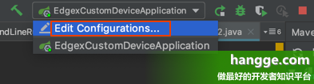
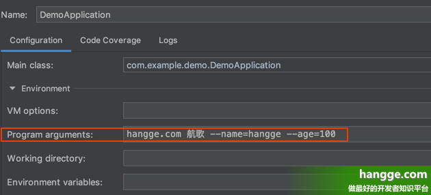
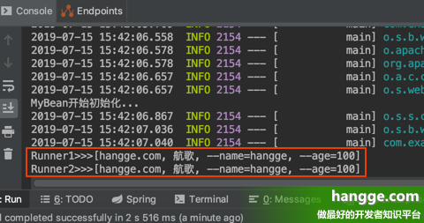
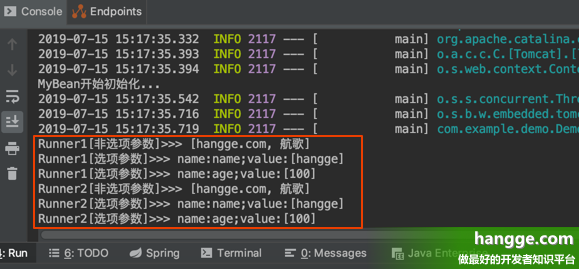

### 实现启动时执行指定任务（CommandLineRunner、ApplicationRunner）

有时一些特殊的任务需要在系统启动时执行，例如配置文件加载、数据库初始化等操作。Spring Boot 提供了两种解决方案：CommandLineRunner 和 ApplicationRunner。二者使用方式大体一致，差别主要体现在参数上。

#### 使用 CommandLineRunner

##### 1、基本介绍

**Spring Boot** 项目在启动时会遍历所有的 **CommandLineRunner** 的实现类并调用其中的 **run** 方法。

- 如果整个系统中有多个 **CommandLineRunner** 的实现类，那么可以使用 **@Order** 注解对这些实现类的调用顺序进行排序（数字越小越先执行）。
- **run** 方法的参数是系统启动是传入的参数，即入口类中 **main** 方法的参数（在调用 **SpringApplication****.run** 方法时被传入 **Spring Boot** 项目中）

##### 2、使用样例

（1）首先在项目中添加两个 **CommandLineRunner**，它们内容分别如下，就是把启动时传入的参数打印出来：

```java
@Component
@Order(1)
public class MyCommandLineRunner1 implements CommandLineRunner {
    @Override
    public void run(String... args) throws Exception {
        System.out.println("Runner1>>>"+ Arrays.toString(args));
    }
}
 
@Component
@Order(2)
public class MyCommandLineRunner2 implements CommandLineRunner {
    @Override
    public void run(String... args) throws Exception {
        System.out.println("Runner2>>>"+ Arrays.toString(args));
    }
}
```

（2）我们可以配置在系统启动时需要传入的参数，这里以 intelliJ IDEA 为例，单击右上角的编辑启动配置。



（3）在弹出页中编辑 **Program arguments** 栏目，在里面填写需要传入的参数。如果有多个参数，参数之间使用空格隔开。这里我们既配了选项参数，也配了非选项参数。

>如果我们将项目打包，以 jar 包的形式运行。那么这些参数可以跟在启动命令后面：
>java  -jar demo-0.0.1-SNAPSHOT.jar --name=hangge --age=100 hangge.com 航歌



（4）启动项目，控制台输出如下：




#### 使用 ApplicationRunner

##### 1、基本介绍

（1）**ApplicationRunner** 用法和 **CommandLineRunner** 基本一致。项目在启动时会遍历所有的 **ApplicationRunner** 的实现类并调用其中的 **run** 方法。

>如果整个系统中有多个 **ApplicationRunner** 的实现类，同样可以使用 **@Order** 注解对这些实现类的调用顺序进行排序（数字越小越先执行）。

（2）**ApplicationRunner** 与 **CommandLineRunner** 的区别主要体现在 **run** 方法的参数上。不同于 **CommandLineRunner** 中的 **run** 方法的数组参数，**ApplicationRunner** 里 **run** 方法的参数是一个 **ApplicationArguments** 对象。

> ApplicationArguments 区分选项参数和非选项参数：
>
> - **对于非选项参数**：我们可以通过 **ApplicationArguments** 的 **getNonOptionArgs()** 方法获取，获取到的是一个数组。
> - **对于选项参数**：可以通过 **ApplicationArguments** 的 **getOptionNames()** 方法获取所有选项名称。通过 **getOptionValues()** 方法获取实际值（它会返回一个列表字符串）。

##### 2、使用样例

（1）首先在项目中添加两个 **ApplicationRunner**，它们内容分别如下，就是把启动时传入的参数打印出来：

```java
@Order(1)
public class MyApplicationRunner1 implements ApplicationRunner {
    @Override
    public void run(ApplicationArguments args) throws Exception {
        List<String> nonOptionArgs = args.getNonOptionArgs();
        System.out.println("Runner1[非选项参数]>>> " + nonOptionArgs);
        Set<String> optionNames = args.getOptionNames();
        for(String optionName: optionNames) {
            System.out.println("Runner1[选项参数]>>> name:" + optionName
                    + ";value:" + args.getOptionValues(optionName));
        }
    }
}
 
@Component
@Order(2)
public class MyApplicationRunner2 implements ApplicationRunner {
    @Override
    public void run(ApplicationArguments args) throws Exception {
        List<String> nonOptionArgs = args.getNonOptionArgs();
        System.out.println("Runner2[非选项参数]>>> " + nonOptionArgs);
        Set<String> optionNames = args.getOptionNames();
        for(String optionName: optionNames) {
            System.out.println("Runner2[选项参数]>>> name:" + optionName
                    + ";value:" + args.getOptionValues(optionName));
        }
    }
}
```

（2）我们可以配置在系统启动时需要传入的参数，这里以 **intelliJ IDEA** 为例，单击右上角的编辑启动配置。


（3）在弹出页中编辑 **Program arguments** 栏目，在里面填写需要传入的参数。如果有多个参数，参数之间使用空格隔开。这里我们既配了选项参数，也配了非选项参数。

>如果我们将项目打包，以 jar 包的形式运行。那么这些参数可以跟在启动命令后面：
>java -jar demo-0.0.1-SNAPSHOT.jar --name=hangge --age=100 hangge.com 航歌


（4）启动项目，控制台输出如下：



