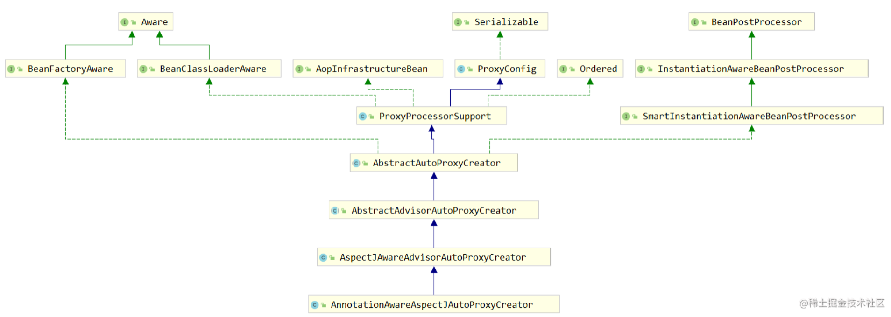

# AOP：注解使用AOP基础与@EnableAspectJAutoProxy的作用


## 1. 注解AOP基础

### 1.1 AOP的通知类型

- @Before：前置通知（logStart）
- @After：后置通知（logEnd）
- @AfterReturning：返回通知（logReturn，方法正常返回）
- @AfterThrowing：异常通知（logException，方法抛出异常）
- @Around：环绕通知（编程式推进目标方法运行）

前四种注解都属于**声明式AOP**，@Around 属于**编程式AOP**。


### 1.2 AOP的重要概念 

- **JoinPoint**（连接点）：可能被拦截到的点，在Spring中指的是类中的任意方法（SpringFramework 只支持方法类型的连接点）

- **Pointcut**（切入点）：要对哪些 **JoinPoint** 进行拦截的定义（可以简单理解为已经被增强的方法）（哪些切入点要被增强，需要由切入点表达式来描述） 

- **Advice**（通知 / 增强）：拦截到 **JoinPoint** 之后所要做的事情（额外要执行的代码）

  - 通知的类型就是上面所说的5种

- **Target**（目标对象）：需要被代理的目标对象

- **Introduction**（引入）：一种特殊的通知，它能在不修改原有类代码的前提下，在运行期为原始类动态地添加一些属性或方法

- **Weaving**（织入）：把增强应用到目标对象，创建代理对象的过程（SpringAOP用动态代理织入，而 Aspect 可以采用编译期织入和类装载期织入）

- **Proxy**（代理）：一个类被AOP织入增强后，就产生一个结果代理类

- **Aspect**（切面）：**切入点**和**通知**的结合

  

### 1.3 Spring与Aspect

在标注Aspect系列的注解时，需要编写切入点表达式，如：

```java
@Before("execution(public String method(Integer, String))")
```

如果需要抽取公共的切入点表达式，可以声明空方法，并在方法上声明 @PointCut 注解，注解中声明公共的切入点表达式，之后在本类中的其他方法上，如果要使用该切入点表达式，只需要在 Aspect注解 中标注方法名即可。

```
@PointCut("execution(public String method(..))")
public void pointCut() { }

@Before("pointCut()")
public void doBefore() { }
```

如果需要在其他外部类中使用**某个类的通用切入点表达式**，需要使用**切入点表达式所在类的全限定类名+方法名**。

编写切面类时，需要在类上声明 **@Aspect** 注解，被标注Aspect系列的注解的方法上可以在参数里放入一些形参：

- @Before：JoinPoint 
- @After：JoinPoint 
- @AfterReturning：JoinPoint（必须放在第一位），Object result（需在 @AfterReturning 中声明 returning 属性） 
- @AfterThrowing：JoinPoint（必须放在第一位），Exception exception（需在 @AfterThrowing 中声明 throwing 属性）

以下是一个综合使用Demo：

```java
@Aspect
@Component
public class LogAspect {
    
    // 切入com.example.demo下面的一级包下面的所有类的所有方法
    @Before("execution(public * com.example.demo.*.*(..))")
    public void doBefore(JoinPoint joinPoint) {
        System.out.println("doBefore run...");
    }
    
    // 切入被@LogBack标注的方法
    @After("@annotation(com.example.demo.LogBack)")
    public void doAfter(JoinPoint joinPoint) {
        System.out.println("doAfter run...");
    }
    
    // 切入com.example.demo.service.DemoService类的所有方法中第一个参数为Serializable类型的方法
    @AfterReturning(value = "execution(public * com.example.demo.service.DemoService.*(java.io.Serializable, ..))", returning = "result")
    public void doAfterReturning(JoinPoint joinPoint, Object result) {
        System.out.println("doAfterReturning run, result: " + result);
    }
    
    // 切入com.example.demo下所有的controller包下面的所有类的所有方法
    @AfterThrowing(value = "execution(public * com.example.demo..controller.*(..))", throwing = "ex")
    public void doAfterThrowing(JoinPoint joinPoint, Exception ex) {
        System.out.println("doAfterThrowing catch exception: " + ex.getMessage());
    }
    
    // 切入com.example.demo.controller.DemoController的所有返回值为String的方法
    @Around("execution(public String com.example.demo.controller.DemoController.*(..))")
    public Object doAround(ProceedingJoinPoint joinPoint) {
        System.out.println("doAround run...");
        Object result = null;
        try {
            System.out.println("method before invoke...");
            result = joinPoint.proceed();
            System.out.println("method invoked, result: " + result);
        } catch (Throwable throwable) {
            System.out.println("method throws Exception: " + throwable.getMessage());
            throwable.printStackTrace();
        }
        return result;
    }
    
}
```

之后要在主启动类上标注一个注解，告诉IOC容器开启AOP：@EnableAspectJAutoProxy 。

既然到这里已经提到了这个关键的注解，那咱就来分析这个注解都干了什么吧。


## 2.@EnableAspectJAutoProxy的作用 

```java
@Import(AspectJAutoProxyRegistrar.class)
public @interface EnableAspectJAutoProxy {

    boolean proxyTargetClass() default false;

    boolean exposeProxy() default false;

}
```

这个注解标注了 @Import ，它导入了一个 AspectJAutoProxyRegistrar 。这个类的文档注释原文翻译： 

>
>Registers an AnnotationAwareAspectJAutoProxyCreator against the current BeanDefinitionRegistry as appropriate based on a given @EnableAspectJAutoProxy annotation. 
>
>根据给定的 @EnableAspectJAutoProxy 注解，根据当前 BeanDefinitionRegistry 在适当的位置注册 AnnotationAwareAspectJAutoProxyCreator 。 从文档注释中可以发现它要在IOC容器中注册一个 AnnotationAwareAspectJAutoProxyCreator 。暂且不关注这个类是干嘛的，先进这个 AspectJAutoProxyRegistrar 中看一下它是如何实现的。


### 2.1 AspectJAutoProxyRegistrar

  ```java
class AspectJAutoProxyRegistrar implements ImportBeanDefinitionRegistrar {

    @Override
    public void registerBeanDefinitions(
            AnnotationMetadata importingClassMetadata, BeanDefinitionRegistry registry) {
        AopConfigUtils.registerAspectJAnnotationAutoProxyCreatorIfNecessary(registry);

        AnnotationAttributes enableAspectJAutoProxy =
                AnnotationConfigUtils.attributesFor(importingClassMetadata, EnableAspectJAutoProxy.class);
        if (enableAspectJAutoProxy != null) {
            if (enableAspectJAutoProxy.getBoolean("proxyTargetClass")) {
                AopConfigUtils.forceAutoProxyCreatorToUseClassProxying(registry);
            }
            if (enableAspectJAutoProxy.getBoolean("exposeProxy")) {
                AopConfigUtils.forceAutoProxyCreatorToExposeProxy(registry);
            }
        }
    }

}
  ```

它实现了 ImportBeanDefinitionRegistrar 接口，会编程式的向IOC容器中注册组件。下面的 registerBeanDefinitions 方法中分为两个步骤：注册 AspectJAnnotationAutoProxyCreator ，解析 @EnableAspectJAutoProxy 注解。 


#### 2.1.1 AopConfigUtils.registerAspectJAnnotationAutoProxyCreatorIfNecessary

  这个方法会一直往下调，最终调到 registerOrEscalateApcAsRequired 方法：

```java
@Nullable
public static BeanDefinition registerAspectJAnnotationAutoProxyCreatorIfNecessary(BeanDefinitionRegistry registry) {
    return registerAspectJAnnotationAutoProxyCreatorIfNecessary(registry, null);
}

@Nullable
public static BeanDefinition registerAspectJAnnotationAutoProxyCreatorIfNecessary(
        BeanDefinitionRegistry registry, @Nullable Object source) {
    // 注意在这个方法中已经把AnnotationAwareAspectJAutoProxyCreator的字节码传入方法了
    return registerOrEscalateApcAsRequired(AnnotationAwareAspectJAutoProxyCreator.class, registry, source);
}

public static final String AUTO_PROXY_CREATOR_BEAN_NAME =
        "org.springframework.aop.config.internalAutoProxyCreator";

private static BeanDefinition registerOrEscalateApcAsRequired(
        Class<?> cls, BeanDefinitionRegistry registry, @Nullable Object source) {

    Assert.notNull(registry, "BeanDefinitionRegistry must not be null");

    if (registry.containsBeanDefinition(AUTO_PROXY_CREATOR_BEAN_NAME)) {
        BeanDefinition apcDefinition = registry.getBeanDefinition(AUTO_PROXY_CREATOR_BEAN_NAME);
        if (!cls.getName().equals(apcDefinition.getBeanClassName())) {
            int currentPriority = findPriorityForClass(apcDefinition.getBeanClassName());
            int requiredPriority = findPriorityForClass(cls);
            if (currentPriority < requiredPriority) {
                apcDefinition.setBeanClassName(cls.getName());
            }
        }
        return null;
    }

    RootBeanDefinition beanDefinition = new RootBeanDefinition(cls);
    beanDefinition.setSource(source);
    beanDefinition.getPropertyValues().add("order", Ordered.HIGHEST_PRECEDENCE);
    beanDefinition.setRole(BeanDefinition.ROLE_INFRASTRUCTURE);
    registry.registerBeanDefinition(AUTO_PROXY_CREATOR_BEAN_NAME, beanDefinition);
    return beanDefinition;
}
```

下面的方法就是创建 AnnotationAwareAspectJAutoProxyCreator 的核心方法，可以发现逻辑还是比较简单的。方法进入后先判断IOC容器中是否包含一个特定的Bean，如果没有，下面直接用 RootBeanDefinition 创建。 


#### 2.1.2 解析@EnableAspectJAutoProxy注解


  ```java
    AnnotationAttributes enableAspectJAutoProxy =
            AnnotationConfigUtils.attributesFor(importingClassMetadata, EnableAspectJAutoProxy.class);
    if (enableAspectJAutoProxy != null) {
        if (enableAspectJAutoProxy.getBoolean("proxyTargetClass")) {
            AopConfigUtils.forceAutoProxyCreatorToUseClassProxying(registry);
        }
        if (enableAspectJAutoProxy.getBoolean("exposeProxy")) {
            AopConfigUtils.forceAutoProxyCreatorToExposeProxy(registry);
        }
    }
  ```

这部分因为默认的 @EnableAspectJAutoProxy 中两个属性默认均为false，故这部分不起作用。

至此，可以发现，@EnableAspectJAutoProxy 的根本作用是在IOC容器中注册了一个 AnnotationAwareAspectJAutoProxyCreator 。下面来解析这个类的作用。
  

## 3.AnnotationAwareAspectJAutoProxyCreator的作用时机 


先看一眼这个类的文档注释原文翻译：

>AspectJAwareAdvisorAutoProxyCreator subclass that processes all AspectJ annotation aspects in the current application context, as well as Spring Advisors. Any AspectJ annotated classes will automatically be recognized, and their advice applied if Spring AOP's proxy-based model is capable of applying it. This covers method execution joinpoints. If the <aop:include> element is used, only @AspectJ beans with names matched by an include pattern will be considered as defining aspects to use for Spring auto-proxying. Processing of Spring Advisors follows the rules established in org.springframework.aop.framework.autoproxy.AbstractAdvisorAutoProxyCreator.
>
>AspectJAwareAdvisorAutoProxyCreator子类，用于处理当前应用程序上下文中的所有 @AspectJ 注解的切面，以及Spring的Advisor。
>
>如果Spring AOP的基于代理的模型能够应用任何被 @AspectJ 注解标注的类，那么它们的增强方法将被自动识别。这涵盖了方法执行的切入点表达式。
>
>如果使用<aop:include>元素，则只有名称与包含模式匹配的被 @AspectJ 标注的Bean将被视为定义要用于Spring自动代理的方面。
>
>Spring Advisor的处理遵循 AbstractAdvisorAutoProxyCreator 中建立的规则。
>很明显它就是基于注解的AspectJ增强代理创建器。它的类继承结构如下：

````java
public class AnnotationAwareAspectJAutoProxyCreator 
    extends AspectJAwareAdvisorAutoProxyCreator

public class AspectJAwareAdvisorAutoProxyCreator 
    extends AbstractAdvisorAutoProxyCreator

public abstract class AbstractAdvisorAutoProxyCreator 
    extends AbstractAutoProxyCreator

public abstract class AbstractAutoProxyCreator 
    extends ProxyProcessorSupport 
    implements SmartInstantiationAwareBeanPostProcessor, BeanFactoryAware

public class ProxyProcessorSupport 
    extends ProxyConfig 
    implements Ordered, BeanClassLoaderAware, AopInfrastructureBean
````

下面的图可以更清晰的看出它的层次结构：



从这里面可以获得两个信息：

- 实现了 **SmartInstantiationAwareBeanPostProcessor** ，可以做组件的 **创建前后、初始化前后的后置处理工作** 。
- 实现了 **BeanFactoryAware** ，可以将 **BeanFactory** 注入到组件中


### 3.1 SmartInstantiationAwareBeanPostProcessor

根据前面的SpringBoot启动IOC容器的原理，最终会在一系列初始化后进入IOC容器的refresh方法。

```java
// AbstractApplicationContext
public void refresh() throws BeansException, IllegalStateException {
    synchronized (this.startupShutdownMonitor) {
        // ......

        try {
            // Allows post-processing of the bean factory in context subclasses.
            // 4. 准备BeanFactory完成后进行的后置处理
            postProcessBeanFactory(beanFactory);

            // Invoke factory processors registered as beans in the context.
            // 5. 执行BeanFactory创建后的后置处理器
            invokeBeanFactoryPostProcessors(beanFactory);

            // Register bean processors that intercept bean creation.
            // 6. 注册Bean的后置处理器
            registerBeanPostProcessors(beanFactory);

            // ......
    }
}
```

Bean的后置处理器注册都集中在第6步：registerBeanPostProcessors 


### 3.2 registerBeanPostProcessors

（省略了部分与AOP无关的源码）

```java
protected void registerBeanPostProcessors(ConfigurableListableBeanFactory beanFactory) {
    PostProcessorRegistrationDelegate.registerBeanPostProcessors(beanFactory, this);
}

public static void registerBeanPostProcessors(
        ConfigurableListableBeanFactory beanFactory, AbstractApplicationContext applicationContext) {

    // ......
    // Separate between BeanPostProcessors that implement PriorityOrdered,
    // Ordered, and the rest.
    List<BeanPostProcessor> priorityOrderedPostProcessors = new ArrayList<>();
    List<BeanPostProcessor> internalPostProcessors = new ArrayList<>();
    List<String> orderedPostProcessorNames = new ArrayList<>();
    List<String> nonOrderedPostProcessorNames = new ArrayList<>();
    // 根据PriorityOrdered、Ordered接口，对这些BeanPostProcessor进行归类
    for (String ppName : postProcessorNames) {
        if (beanFactory.isTypeMatch(ppName, PriorityOrdered.class)) {
            BeanPostProcessor pp = beanFactory.getBean(ppName, BeanPostProcessor.class);
            priorityOrderedPostProcessors.add(pp);
            // MergedBeanDefinitionPostProcessor类型的后置处理器被单独放在一个集合中，说明该接口比较特殊
            if (pp instanceof MergedBeanDefinitionPostProcessor) {
                internalPostProcessors.add(pp);
            }
        }
        else if (beanFactory.isTypeMatch(ppName, Ordered.class)) {
            orderedPostProcessorNames.add(ppName);
        }
        else {
            nonOrderedPostProcessorNames.add(ppName);
        }
    }

    // ......

    // Next, register the BeanPostProcessors that implement Ordered.
    // 注册实现了Ordered接口的BeanPostProcessor
    List<BeanPostProcessor> orderedPostProcessors = new ArrayList<>();
    for (String ppName : orderedPostProcessorNames) {
        BeanPostProcessor pp = beanFactory.getBean(ppName, BeanPostProcessor.class);
        orderedPostProcessors.add(pp);
        if (pp instanceof MergedBeanDefinitionPostProcessor) {
            internalPostProcessors.add(pp);
        }
    }
    sortPostProcessors(orderedPostProcessors, beanFactory);
    registerBeanPostProcessors(beanFactory, orderedPostProcessors);

    // ......
}
```

之前看 AnnotationAwareAspectJAutoProxyCreator 的类继承和接口实现，发现它实现了 Ordered接口，会在实际分类时进入 orderedPostProcessorNames 集合中。 

通过Debug，发现实现了 Ordered 接口的就它一个。。。


之后要调用下面一段源码中，这里要直接 **getBean** 来创建 AnnotationAwareAspectJAutoProxyCreator 了！


### 3.3 getBean → doCreateBean

根据前面的IOC原理，肯定会执行一系列操作：**getBean → doGetBean → createBean → doCreateBean** 。最终创建这个后置处理器，放入IOC容器中，此部分还没有涉及到AOP的实际创建时机，我们暂且略过。


## 小结

1.注解AOP的使用需要在切面类上标注 @Aspect 和 @Component 。

2.启动AOP的核心是向容器中注册了一个 AnnotationAwareAspectJAutoProxyCreator 。

【至此我们了解了 AnnotationAwareAspectJAutoProxyCreator ，下一篇咱来看AOP的核心：AnnotationAwareAspectJAutoProxyCreator 如何创建代理对象】

