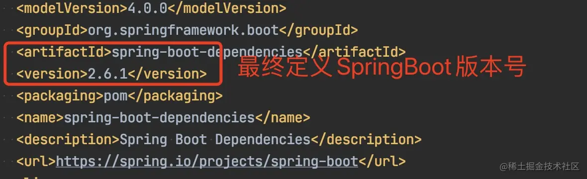
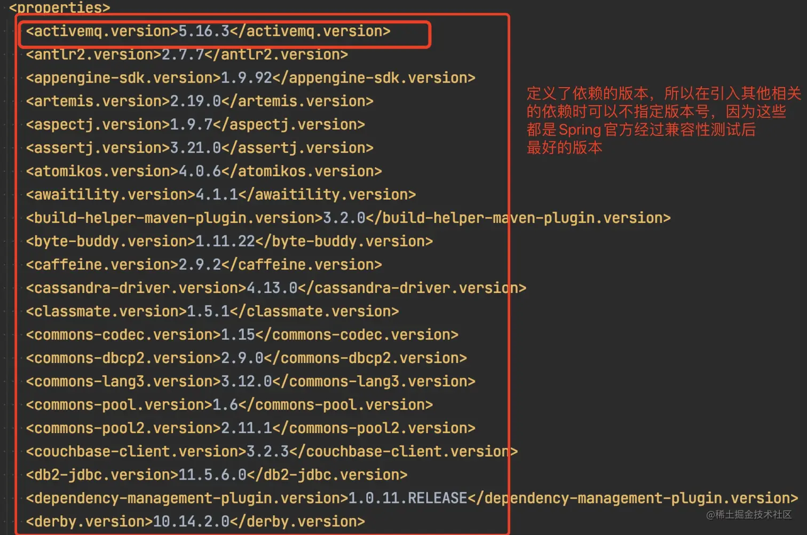

# SpringBoot依赖管理

一般来讲SpringBoot项目是不需要指定版本，而SSM项目是需要指定版本，SpringBoot的核心依赖就是spring-boot-starter-parent和spring-boot-starter-web两个依赖，关于这两个依赖的相关介绍具体如下


## 检查 Spring Boot 版本

运行以下 Maven 命令，查看最终的 Spring Boot 版本：

```
mvn dependency:tree | grep spring-boot
```

**使用 Windows 自带 `findstr`**

在 **CMD（命令提示符）** 运行：

```
mvn dependency:tree | findstr "spring-boot"
```


## spring-boot-starter-parent

```xml
<!-- Spring Boot父项目依赖管理-->
<parent>
    <groupId>org.springframework.boot</groupId>
    <artifactId>spring-boot-starter-parent</artifactId>
    <version>2.6.1</version>
    <relativePath/>
</parent>
```

上述代码中，将spring-boot-starter-parent依赖作为SpringBoot项目的统一父项目依赖管理，并将项目版本号统一为2.6.1.RELEASE，版本号可以根据实际开发场景的需要从而进行修改。

点击进入spring-boot-starter-parent底层源文件，可以发现如下内容

```xml
<!-- 父依赖 -->
<parent>
  <groupId>org.springframework.boot</groupId>
  <artifactId>spring-boot-dependencies</artifactId>
  <version>2.6.1</version>
</parent>


<properties>
  <java.version>1.8</java.version>
  <resource.delimiter>@</resource.delimiter>
  <maven.compiler.source>${java.version}</maven.compiler.source>
  <maven.compiler.target>${java.version}</maven.compiler.target>
  <project.build.sourceEncoding>UTF-8</project.build.sourceEncoding>
  <project.reporting.outputEncoding>UTF-8</project.reporting.outputEncoding>
</properties>
```

由上图可以知道spring-boot- starter-parent的底层有一个父依赖spring-boot-dependencies。而下方的properties属性主要是设置一些常用的属性，比如java的版本默认为1.8、maven的编译版本默认也是1.8和设置项目的字符集编码为UTF-8这些设置。

点击进入spring-boot-dependencies底层源文件，可以发现如下内容





**从spring-boot-dependencies底层源文件可以看出，该文件通过标签对一些常用技术框架的依赖文件进行了统一版本号管理，例如ActiveMQ、Spring、Kafka、okhttp3等，都有与SpringBoot 2.6.1版本相匹配的版本，这也是pom.xml引入依赖文件不需要标注依赖文件版本号的原因。** 需要注意的是，如果pom.xml引入的依赖文件不是spring-boot-starter-parent管理的，那么在pom.xml引入依赖文件时，需要使用version标签指定依赖文件的版本号。


## spring-boot-starter-web

查看spring-boot-starter-web依赖文件源码，核心代码具体如下

```xml
<dependencies>
  <dependency>
    <groupId>org.springframework.boot</groupId>
    <artifactId>spring-boot-starter</artifactId>
    <version>2.6.1</version>
    <scope>compile</scope>
  </dependency>
  <dependency>
    <groupId>org.springframework.boot</groupId>
    <artifactId>spring-boot-starter-json</artifactId>
    <version>2.6.1</version>
    <scope>compile</scope>
  </dependency>
  <dependency>
    <groupId>org.springframework.boot</groupId>
    <artifactId>spring-boot-starter-tomcat</artifactId>
    <version>2.6.1</version>
    <scope>compile</scope>
  </dependency>
  <dependency>
    <groupId>org.springframework</groupId>
    <artifactId>spring-web</artifactId>
    <version>5.3.13</version>
    <scope>compile</scope>
  </dependency>
  <dependency>
    <groupId>org.springframework</groupId>
    <artifactId>spring-webmvc</artifactId>
    <version>5.3.13</version>
    <scope>compile</scope>
  </dependency>
</dependencies>
```

从上述代码可以发现，spring-boot-starter-web依赖的主要作用是提供Web开发场景所需的底层所有依赖。

所以在pom.xml中引入spring-boot-starter-web依赖时，就可以实现Web场景开发，而不需要额外导入Tomcat服务器以及其他Web依赖文件等。这些引入的依赖文件的版本号还是由spring-boot-starter-parent父依赖进行的统一管理。


**由上面两个例子知道，SpringBoot提供了很多其他许多开发场景的相关依赖，我们可以去SpringBoot官方文档中搜索“Starters”关键字查询场景依赖启动器。**

> 注意：SpringBoot官方并没有针对所有场景开发的技术框架都提供了场景启动期，比如操作框架Mybatis、阿里巴巴的Druid等，都没有提供对应的依赖启动器，而时其他第三方官方团队主动与SpringBoot框架进行整合从而发布了各自的依赖启动期。
>
> 所以在使用第三方依赖启动器是，必须要配置对应的版本号


## spring-boot-test


### spring-boot-test2.2.14.BUILD-SNAPSHOT

```xml
<dependencies>
    <!-- Spring Boot 核心依赖 -->
    <dependency>
        <groupId>org.springframework.boot</groupId>
        <artifactId>spring-boot</artifactId>
    </dependency>

    <!-- JSON 处理库 -->
    <dependency>
        <groupId>com.fasterxml.jackson.core</groupId>
        <artifactId>jackson-databind</artifactId>
        <optional>true</optional> <!-- Jackson JSON 解析库 -->
    </dependency>
    <dependency>
        <groupId>com.google.code.gson</groupId>
        <artifactId>gson</artifactId>
        <optional>true</optional> <!-- Google Gson 解析库 -->
    </dependency>
    <dependency>
        <groupId>com.jayway.jsonpath</groupId>
        <artifactId>json-path</artifactId>
        <optional>true</optional> <!-- JsonPath 解析 JSON 数据 -->
    </dependency>

    <!-- Reactor Netty，支持 WebFlux -->
    <dependency>
        <groupId>io.projectreactor.netty</groupId>
        <artifactId>reactor-netty</artifactId>
        <optional>true</optional>
    </dependency>

    <!-- Jakarta 相关 API -->
    <dependency>
        <groupId>jakarta.json.bind</groupId>
        <artifactId>jakarta.json.bind-api</artifactId>
        <optional>true</optional> <!-- Jakarta JSON 绑定 API -->
    </dependency>
    <dependency>
        <groupId>jakarta.servlet</groupId>
        <artifactId>jakarta.servlet-api</artifactId>
        <optional>true</optional> <!-- Jakarta Servlet API -->
    </dependency>

    <!-- HTTP 客户端 -->
    <dependency>
        <groupId>org.apache.httpcomponents</groupId>
        <artifactId>httpclient</artifactId>
        <optional>true</optional> <!-- Apache HttpClient -->
    </dependency>

    <!-- 单元测试框架 -->
    <dependency>
        <groupId>junit</groupId>
        <artifactId>junit</artifactId>
        <optional>true</optional> <!-- JUnit 4 -->
        <exclusions>
            <exclusion>
                <groupId>org.hamcrest</groupId>
                <artifactId>hamcrest-core</artifactId>
            </exclusion>
        </exclusions>
    </dependency>
    <dependency>
        <groupId>org.junit.jupiter</groupId>
        <artifactId>junit-jupiter-api</artifactId>
        <optional>true</optional> <!-- JUnit 5 -->
    </dependency>
    <dependency>
        <groupId>org.assertj</groupId>
        <artifactId>assertj-core</artifactId>
        <optional>true</optional> <!-- AssertJ 断言库 -->
    </dependency>
    <dependency>
        <groupId>org.mockito</groupId>
        <artifactId>mockito-core</artifactId>
        <optional>true</optional> <!-- Mockito 单元测试框架 -->
    </dependency>
    <dependency>
        <groupId>org.skyscreamer</groupId>
        <artifactId>jsonassert</artifactId>
        <optional>true</optional> <!-- JSON 断言工具 -->
    </dependency>

    <!-- Selenium 相关 -->
    <dependency>
        <groupId>org.seleniumhq.selenium</groupId>
        <artifactId>htmlunit-driver</artifactId>
        <optional>true</optional> <!-- Selenium HTMLUnit WebDriver -->
    </dependency>
    <dependency>
        <groupId>org.seleniumhq.selenium</groupId>
        <artifactId>selenium-api</artifactId>
        <optional>true</optional> <!-- Selenium API -->
    </dependency>

    <!-- Spring Web 相关 -->
    <dependency>
        <groupId>org.springframework</groupId>
        <artifactId>spring-test</artifactId>
        <optional>true</optional> <!-- Spring 测试支持 -->
    </dependency>
    <dependency>
        <groupId>org.springframework</groupId>
        <artifactId>spring-web</artifactId>
        <optional>true</optional> <!-- Spring Web (MVC) -->
    </dependency>
    <dependency>
        <groupId>org.springframework</groupId>
        <artifactId>spring-webflux</artifactId>
        <optional>true</optional> <!-- Spring WebFlux (Reactive Web) -->
    </dependency>

    <!-- HTMLUnit -->
    <dependency>
        <groupId>net.sourceforge.htmlunit</groupId>
        <artifactId>htmlunit</artifactId>
        <optional>true</optional> <!-- HTMLUnit 浏览器模拟 -->
    </dependency>

    <!-- Kotlin 相关 -->
    <dependency>
        <groupId>org.jetbrains.kotlin</groupId>
        <artifactId>kotlin-stdlib</artifactId>
        <optional>true</optional> <!-- Kotlin 标准库 -->
    </dependency>
    <dependency>
        <groupId>org.jetbrains.kotlin</groupId>
        <artifactId>kotlin-reflect</artifactId>
        <optional>true</optional> <!-- Kotlin 反射支持 -->
    </dependency>

    <!-- 测试相关依赖 -->
    <dependency>
        <groupId>org.springframework.boot</groupId>
        <artifactId>spring-boot-test-support</artifactId>
        <scope>test</scope> <!-- Spring Boot 测试支持 -->
    </dependency>
    <dependency>
        <groupId>ch.qos.logback</groupId>
        <artifactId>logback-classic</artifactId>
        <scope>test</scope> <!-- Logback 日志框架 -->
    </dependency>
    <dependency>
        <groupId>io.mockk</groupId>
        <artifactId>mockk</artifactId>
        <scope>test</scope> <!-- MockK (Kotlin Mock 库) -->
    </dependency>
    <dependency>
        <groupId>jakarta.json</groupId>
        <artifactId>jakarta.json-api</artifactId>
        <scope>test</scope> <!-- Jakarta JSON API -->
    </dependency>
    <dependency>
        <groupId>org.apache.tomcat.embed</groupId>
        <artifactId>tomcat-embed-core</artifactId>
        <scope>test</scope> <!-- 嵌入式 Tomcat -->
    </dependency>
    <dependency>
        <groupId>org.codehaus.groovy</groupId>
        <artifactId>groovy</artifactId>
        <scope>test</scope> <!-- Groovy 语言 -->
    </dependency>
    <dependency>
        <groupId>org.codehaus.groovy</groupId>
        <artifactId>groovy-xml</artifactId>
        <optional>true</optional>
        <scope>test</scope> <!-- Groovy XML 处理 -->
    </dependency>
    <dependency>
        <groupId>org.apache.johnzon</groupId>
        <artifactId>johnzon-jsonb</artifactId>
        <scope>test</scope> <!-- Johnzon JSON-B 解析 -->
    </dependency>
    <dependency>
        <groupId>org.slf4j</groupId>
        <artifactId>slf4j-api</artifactId>
        <scope>test</scope> <!-- SLF4J 日志 API -->
    </dependency>
    <dependency>
        <groupId>org.spockframework</groupId>
        <artifactId>spock-core</artifactId>
        <scope>test</scope> <!-- Spock 测试框架 -->
    </dependency>
    <dependency>
        <groupId>org.springframework</groupId>
        <artifactId>spring-webmvc</artifactId>
        <scope>test</scope> <!-- Spring MVC -->
    </dependency>
    <dependency>
        <groupId>org.testng</groupId>
        <artifactId>testng</artifactId>
        <scope>test</scope> <!-- TestNG 测试框架 -->
    </dependency>
</dependencies>
```


### spring-boot-test2.7.9

```xml
  <dependencies>
    <dependency>
      <groupId>org.springframework.boot</groupId>
      <artifactId>spring-boot</artifactId>
      <version>2.7.9</version>
      <scope>compile</scope>
    </dependency>
  </dependencies>
```


## SpringBoot启动器

以下是 Spring Boot 在 `org.springframework.boot` 组下提供的应用启动器：

| **Name**                                        | **Description**                                              |
| ----------------------------------------------- | ------------------------------------------------------------ |
| spring-boot-starter                             | Core starter, including auto-configuration support, logging and YAML |
| spring-boot-starter-activemq                    | Starter for JMS messaging using Apache ActiveMQ              |
| spring-boot-starter-amqp                        | Starter for using Spring AMQP and Rabbit MQ                  |
| spring-boot-starter-aop                         | Starter for aspect-oriented programming with Spring AOP and AspectJ |
| spring-boot-starter-artemis                     | Starter for JMS messaging using Apache Artemis               |
| spring-boot-starter-batch                       | Starter for using Spring Batch                               |
| spring-boot-starter-cache                       | Starter for using Spring Framework’s caching support         |
| spring-boot-starter-data-cassandra              | Starter for using Cassandra distributed database and Spring Data Cassandra |
| spring-boot-starter-data-cassandra-reactive     | Starter for using Cassandra distributed database and Spring Data Cassandra Reactive |
| spring-boot-starter-data-couchbase              | Starter for using Couchbase document-oriented database and Spring Data Couchbase |
| spring-boot-starter-data-couchbase-reactive     | Starter for using Couchbase document-oriented database and Spring Data Couchbase Reactive |
| spring-boot-starter-data-elasticsearch          | Starter for using Elasticsearch search and analytics engine and Spring Data Elasticsearch |
| spring-boot-starter-data-jdbc                   | Starter for using Spring Data JDBC                           |
| spring-boot-starter-data-jpa                    | Starter for using Spring Data JPA with Hibernate             |
| spring-boot-starter-data-ldap                   | Starter for using Spring Data LDAP                           |
| spring-boot-starter-data-mongodb                | Starter for using MongoDB document-oriented database and Spring Data MongoDB |
| spring-boot-starter-data-mongodb-reactive       | Starter for using MongoDB document-oriented database and Spring Data MongoDB Reactive |
| spring-boot-starter-data-neo4j                  | Starter for using Neo4j graph database and Spring Data Neo4j |
| spring-boot-starter-data-r2dbc                  | Starter for using Spring Data R2DBC                          |
| spring-boot-starter-data-redis                  | Starter for using Redis key-value data store with Spring Data Redis and the Lettuce client |
| spring-boot-starter-data-redis-reactive         | Starter for using Redis key-value data store with Spring Data Redis reactive and the Lettuce client |
| spring-boot-starter-data-rest                   | Starter for exposing Spring Data repositories over REST using Spring Data REST and Spring MVC |
| spring-boot-starter-freemarker                  | Starter for building MVC web applications using FreeMarker views |
| spring-boot-starter-graphql                     | Starter for building GraphQL applications with Spring GraphQL |
| spring-boot-starter-groovy-templates            | Starter for building MVC web applications using Groovy Templates views |
| spring-boot-starter-hateoas                     | Starter for building hypermedia-based RESTful web application with Spring MVC and Spring HATEOAS |
| spring-boot-starter-integration                 | Starter for using Spring Integration                         |
| spring-boot-starter-jdbc                        | Starter for using JDBC with the HikariCP connection pool     |
| spring-boot-starter-jersey                      | Starter for building RESTful web applications using JAX-RS and Jersey. An alternative to spring-boot-starter-web |
| spring-boot-starter-jooq                        | Starter for using jOOQ to access SQL databases with JDBC. An alternative to spring-boot-starter-data-jpa or spring-boot-starter-jdbc |
| spring-boot-starter-json                        | Starter for reading and writing json                         |
| spring-boot-starter-mail                        | Starter for using Java Mail and Spring Framework’s email sending support |
| spring-boot-starter-mustache                    | Starter for building web applications using Mustache views   |
| spring-boot-starter-oauth2-authorization-server | Starter for using Spring Authorization Server features       |
| spring-boot-starter-oauth2-client               | Starter for using Spring Security’s OAuth2/OpenID Connect client features |
| spring-boot-starter-oauth2-resource-server      | Starter for using Spring Security’s OAuth2 resource server features |
| spring-boot-starter-pulsar                      | Starter for using Spring for Apache Pulsar                   |
| spring-boot-starter-pulsar-reactive             | Starter for using Spring for Apache Pulsar Reactive          |
| spring-boot-starter-quartz                      | Starter for using the Quartz scheduler                       |
| spring-boot-starter-rsocket                     | Starter for building RSocket clients and servers             |
| spring-boot-starter-security                    | Starter for using Spring Security                            |
| spring-boot-starter-test                        | Starter for testing Spring Boot applications with libraries including JUnit Jupiter, Hamcrest and Mockito |
| spring-boot-starter-thymeleaf                   | Starter for building MVC web applications using Thymeleaf views |
| spring-boot-starter-validation                  | Starter for using Java Bean Validation with Hibernate Validator |
| spring-boot-starter-web                         | Starter for building web, including RESTful, applications using Spring MVC. Uses Tomcat as the default embedded container |
| spring-boot-starter-web-services                | Starter for using Spring Web Services                        |
| spring-boot-starter-webflux                     | Starter for building WebFlux applications using Spring Framework’s Reactive Web support |
| spring-boot-starter-websocket                   | Starter for building WebSocket applications using Spring Framework’s MVC WebSocket support |


### spring-boot-starter

Core starter, including auto-configuration support, logging and YAML

```xml
<dependencies>
    <!-- Spring Boot 核心类，提供应用启动和运行时管理 -->
    <dependency>
        <groupId>org.springframework.boot</groupId>
        <artifactId>spring-boot</artifactId>
    </dependency>

    <!-- Spring Boot 自动配置模块，减少手动配置的工作量 -->
    <dependency>
        <groupId>org.springframework.boot</groupId>
        <artifactId>spring-boot-autoconfigure</artifactId>
    </dependency>

    <!-- Spring Boot 默认日志组件，使用 SLF4J + Logback 作为日志框架 -->
    <dependency>
        <groupId>org.springframework.boot</groupId>
        <artifactId>spring-boot-starter-logging</artifactId>
    </dependency>

    <!-- Jakarta EE（原 Java EE）标准注解库，提供 @PostConstruct、@PreDestroy 等注解 -->
    <dependency>
        <groupId>jakarta.annotation</groupId>
        <artifactId>jakarta.annotation-api</artifactId>
    </dependency>

    <!-- Spring 核心模块，提供工具类、反射支持、事件机制等 -->
    <dependency>
        <groupId>org.springframework</groupId>
        <artifactId>spring-core</artifactId>
    </dependency>

    <!-- 解析 YAML 配置文件（如 application.yml），Spring Boot 使用它来解析 YAML 格式的配置 -->
    <dependency>
        <groupId>org.yaml</groupId>
        <artifactId>snakeyaml</artifactId>
        <scope>runtime</scope>
    </dependency>
</dependencies>

```


### spring-boot-starter-aop

Starter for aspect-oriented programming with Spring AOP and AspectJ


### spring-boot-starter-data-jdbc

Starter for using Spring Data JDBC


### spring-boot-starter-data-jpa

Starter for using Spring Data JPA with Hibernate


### spring-boot-starter-test

 Starter for testing Spring Boot applications with libraries including JUnit Jupiter, Hamcrest and Mockito


#### 2.2.14.BUILD-SNAPSHOT

```xml
<dependencies>
    <!-- Spring Boot 核心 Starter，提供基本的 Spring Boot 运行环境 -->
    <dependency>
        <groupId>org.springframework.boot</groupId>
        <artifactId>spring-boot-starter</artifactId>
    </dependency>

    <!-- Spring Boot 测试模块，提供测试 Spring Boot 应用的基础功能 -->
    <dependency>
        <groupId>org.springframework.boot</groupId>
        <artifactId>spring-boot-test</artifactId>
    </dependency>

    <!-- Spring Boot 自动配置测试模块，提供测试时的自动配置支持 -->
    <dependency>
        <groupId>org.springframework.boot</groupId>
        <artifactId>spring-boot-test-autoconfigure</artifactId>
    </dependency>

    <!-- JSONPath 解析库，可用于解析 JSON 结构数据 -->
    <dependency>
        <groupId>com.jayway.jsonpath</groupId>
        <artifactId>json-path</artifactId>
    </dependency>

    <!-- Jakarta XML 绑定 API，提供 Java 对象与 XML 之间的转换功能（JAXB） -->
    <dependency>
        <groupId>jakarta.xml.bind</groupId>
        <artifactId>jakarta.xml.bind-api</artifactId>
    </dependency>

    <!-- JUnit 5（Jupiter）测试框架，提供单元测试支持 -->
    <dependency>
        <groupId>org.junit.jupiter</groupId>
        <artifactId>junit-jupiter</artifactId>
    </dependency>

    <!-- JUnit Vintage 引擎，用于运行 JUnit 4 及更早版本的测试 -->
    <dependency>
        <groupId>org.junit.vintage</groupId>
        <artifactId>junit-vintage-engine</artifactId>
        <exclusions>
            <!-- 排除 hamcrest-core，防止依赖冲突 -->
            <exclusion>
                <groupId>org.hamcrest</groupId>
                <artifactId>hamcrest-core</artifactId>
            </exclusion>
        </exclusions>
    </dependency>

    <!-- Mockito 适配 JUnit 5 的集成，支持使用 Mockito 进行测试 -->
    <dependency>
        <groupId>org.mockito</groupId>
        <artifactId>mockito-junit-jupiter</artifactId>
    </dependency>

    <!-- AssertJ 断言库，提供更流畅的断言 API -->
    <dependency>
        <groupId>org.assertj</groupId>
        <artifactId>assertj-core</artifactId>
    </dependency>

    <!-- Hamcrest 断言匹配器库，提供灵活的匹配规则 -->
    <dependency>
        <groupId>org.hamcrest</groupId>
        <artifactId>hamcrest</artifactId>
    </dependency>

    <!-- Mockito 核心库，提供 Mocking 功能 -->
    <dependency>
        <groupId>org.mockito</groupId>
        <artifactId>mockito-core</artifactId>
    </dependency>

    <!-- JSONAssert 库，用于比较 JSON 数据，常用于单元测试 -->
    <dependency>
        <groupId>org.skyscreamer</groupId>
        <artifactId>jsonassert</artifactId>
    </dependency>

    <!-- Spring 核心模块，提供工具类、反射支持、事件机制等 -->
    <dependency>
        <groupId>org.springframework</groupId>
        <artifactId>spring-core</artifactId>
    </dependency>

    <!-- Spring 测试模块，提供对 Spring 组件的测试支持，例如 MockMvc、事务回滚等 -->
    <dependency>
        <groupId>org.springframework</groupId>
        <artifactId>spring-test</artifactId>
    </dependency>

    <!-- XMLUnit 核心库，用于 XML 结构比较，常用于测试 XML 相关功能 -->
    <dependency>
        <groupId>org.xmlunit</groupId>
        <artifactId>xmlunit-core</artifactId>
        <exclusions>
            <!-- 排除 JAXB 旧版本 API，避免冲突 -->
            <exclusion>
                <groupId>javax.xml.bind</groupId>
                <artifactId>jaxb-api</artifactId>
            </exclusion>
        </exclusions>
    </dependency>
</dependencies>
```


#### 2.7.9

```xml
<dependencies>
    <!-- Spring Boot 基础依赖，提供 Spring Boot 的核心功能 -->
    <dependency>
        <groupId>org.springframework.boot</groupId>
        <artifactId>spring-boot-starter</artifactId>
        <version>2.7.9</version>
        <scope>compile</scope>
    </dependency>

    <!-- Spring Boot 测试支持，用于编写和运行测试 -->
    <dependency>
        <groupId>org.springframework.boot</groupId>
        <artifactId>spring-boot-test</artifactId>
        <version>2.7.9</version>
        <scope>compile</scope>
    </dependency>

    <!-- Spring Boot 自动化测试配置，简化测试环境的设置 -->
    <dependency>
        <groupId>org.springframework.boot</groupId>
        <artifactId>spring-boot-test-autoconfigure</artifactId>
        <version>2.7.9</version>
        <scope>compile</scope>
    </dependency>

    <!-- JSONPath 解析库，用于解析 JSON 数据 -->
    <dependency>
        <groupId>com.jayway.jsonpath</groupId>
        <artifactId>json-path</artifactId>
        <version>2.7.0</version>
        <scope>compile</scope>
    </dependency>

    <!-- Jakarta XML 绑定 API (JAXB)，用于处理 XML 序列化和反序列化 -->
    <dependency>
        <groupId>jakarta.xml.bind</groupId>
        <artifactId>jakarta.xml.bind-api</artifactId>
        <version>2.3.3</version>
        <scope>compile</scope>
    </dependency>

    <!-- AssertJ 断言库，提供流畅的测试断言语法 -->
    <dependency>
        <groupId>org.assertj</groupId>
        <artifactId>assertj-core</artifactId>
        <version>3.22.0</version>
        <scope>compile</scope>
    </dependency>

    <!-- Hamcrest 断言库，提供灵活的匹配器用于测试 -->
    <dependency>
        <groupId>org.hamcrest</groupId>
        <artifactId>hamcrest</artifactId>
        <version>2.2</version>
        <scope>compile</scope>
    </dependency>

    <!-- JUnit 5 (Jupiter) 测试框架 -->
    <dependency>
        <groupId>org.junit.jupiter</groupId>
        <artifactId>junit-jupiter</artifactId>
        <version>5.8.2</version>
        <scope>compile</scope>
    </dependency>

    <!-- Mockito 核心库，用于模拟对象进行单元测试 -->
    <dependency>
        <groupId>org.mockito</groupId>
        <artifactId>mockito-core</artifactId>
        <version>4.5.1</version>
        <scope>compile</scope>
    </dependency>

    <!-- Mockito 与 JUnit 5 的整合支持 -->
    <dependency>
        <groupId>org.mockito</groupId>
        <artifactId>mockito-junit-jupiter</artifactId>
        <version>4.5.1</version>
        <scope>compile</scope>
    </dependency>

    <!-- JSON 断言库，用于比较 JSON 数据结构 -->
    <dependency>
        <groupId>org.skyscreamer</groupId>
        <artifactId>jsonassert</artifactId>
        <version>1.5.1</version>
        <scope>compile</scope>
    </dependency>

    <!-- Spring 核心库，提供 Spring 运行时的基础功能 -->
    <dependency>
        <groupId>org.springframework</groupId>
        <artifactId>spring-core</artifactId>
        <version>5.3.25</version>
        <scope>compile</scope>
    </dependency>

    <!-- Spring Test，提供 Spring 相关的测试支持 -->
    <dependency>
        <groupId>org.springframework</groupId>
        <artifactId>spring-test</artifactId>
        <version>5.3.25</version>
        <scope>compile</scope>
    </dependency>

    <!-- XMLUnit，提供 XML 结构比较和验证功能 -->
    <dependency>
        <groupId>org.xmlunit</groupId>
        <artifactId>xmlunit-core</artifactId>
        <version>2.9.1</version>
        <scope>compile</scope>
        <exclusions>
            <!-- 排除 JAXB API，避免依赖冲突 -->
            <exclusion>
                <artifactId>jaxb-api</artifactId>
                <groupId>javax.xml.bind</groupId>
            </exclusion>
        </exclusions>
    </dependency>
</dependencies>
```

