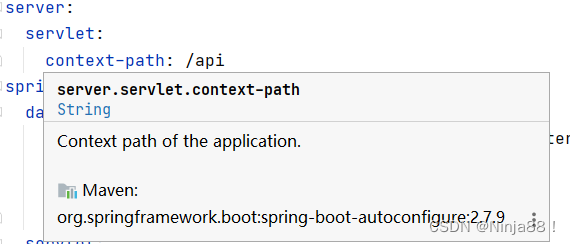
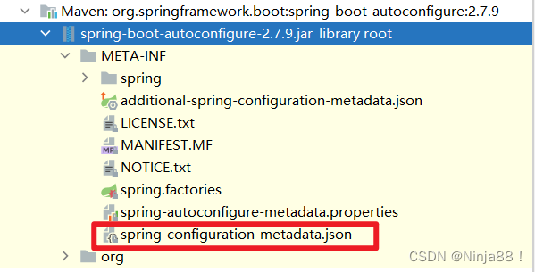
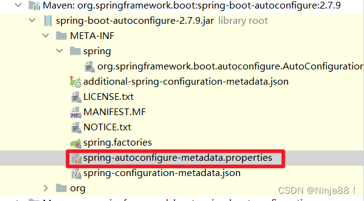
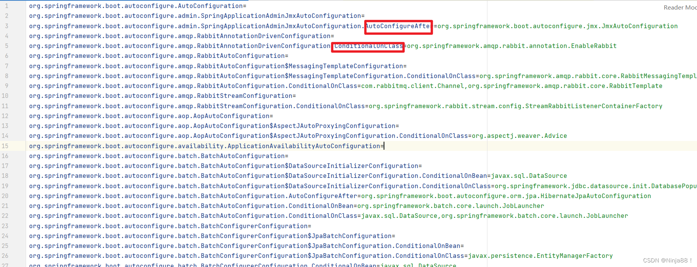
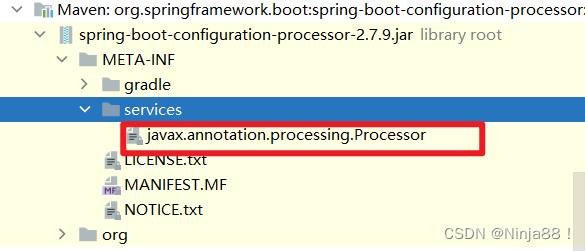
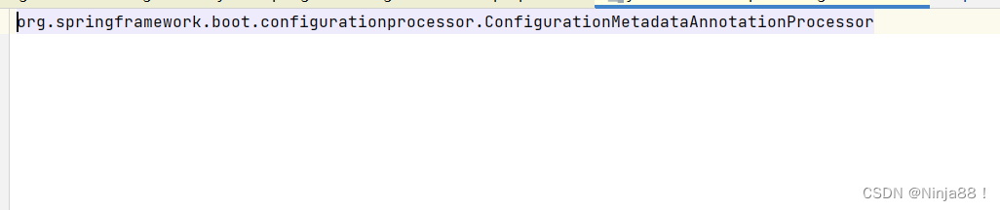
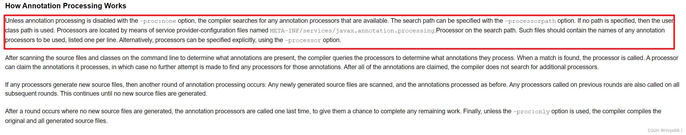

# spring-boot-configuration-processor和spring-boot-autoconfigure-processor两个包的作用讲解

spring-boot-configuration-processor和spring-boot-autoconfigure-processor是Spring Boot项目中常见的两个包，这两个包包名也比较相像。网上对这两个包相关介绍很多，但感觉都不太系统，而且甚至有些介绍还存在错误，这里解释一下这两个包到底是干嘛的。


## spring-boot-configuration-processor的作用

这个包主要是分析注解@ConfigurationProperties，生成配置项的描述信息，并存放在META-INF/spring-configuration-metadata.json，以提高开发时的体验和效率。

需要注意的是这个包只是产出一个.json文件了，至于怎么利用这个文件，就是IDE的事了。比如在IDEA中：


上图就是IDEA分析.json文件从而提供的功能，通过ctrl键+鼠标左键，我们还能定位到这个属性的位置。


### 为什么没导入这个包，也会有这个功能

有时候我们并没有引入这个包，但是IDEA也能提供这个功能，这是因为在我们引入的包中的`META/INF`文件夹下已经有.json文件了，比如上面属性是在`spring-boot-autoconfigure`这个包中，我们可以在这个包中找到.json文件：



>上图中的additional-spring-configuration-metadata.json仅作为spring-configuration-metadata.json的补充，默认spring-boot-configuration-processor只会产生spring-configuration-metadata.json。这两个文件最终内容以additional-spring-configuration-metadata.json为主。
>所以一般来说additional-spring-configuration-metadata.json都是自己编写，作为一个补充。

另外还要声明的是，导入spring-boot-configuration-processor这个包其实只能扫描我们自己写的源代码中用了@ConfigurationProperties的地方，这一点后面详细说明。

也就是说，上图中spring-boot-autoconfigure这个包如果没有提供.json文件，我们自己引入spring-boot-configuration-processor这个包也并不会让IDEA拥有提醒功能，因为spring-boot-configuration-processor只能针对我们自己的源代码生成相应的.json文件。


> 这里贴上一个链接，也是讲spring-boot-configuration-processor的功能的，我觉得讲的很好：
>
> [对于值为复杂结构的映射，怎么让Spring Boot的configuration processor正常工作（在IDEA中）](https://stackoverflow.com/a/59890717/18832481)。


## `spring-boot-autoconfigure-processor`的作用

这个包主要是分析注解@EnableAutoConfiguration，生成所有自动配置类过滤条件的元数据，并存放在META-INF/spring-autoconfigure-metadata.properties，使得Spring Boot可以快速过滤掉不符合规则的自动配置类，从而提高Spring Boot启动速度。

同样以spring-boot-autoconfigure这个包为例，我们可以在它的META/INF文件夹下看到这个.properties文件。



而文件内容则是我们常见的一些过滤规则，比如`@ConditionalOnClass`、`@ConditionalOnProperty` 等。部分文件内容如下：



与spring-boot-configuration-processor一样，spring-boot-autoconfigure-processor也只作用于自己编写的源代码。所以如果自己的项目里并没有自动配置类，就没必要引入这个包了。

这里也给一个链接，其中简单介绍了spring-boot-autoconfigure-processor的作用：spring-boot-autoconfigure-processor的作用。


## 注解处理器

对于spring-boot-configuration-processor和spring-boot-autoconfigure-processor，其实它们都是注解处理器，这就是为什么这两个包只作用于我们自己的源代码的原因，因为注解处理器只作用于编译阶段。

>所以对于这两个包，我们在引入依赖时可以加上<scope>provided</scope>，表示这个依赖只作用于编译阶段。

回顾一下Java中怎么使用注解处理器：

```java
javac -processor 注解处理器类.java
```

这样就显式声明了使用什么注解处理器去处理。但一般我们很少这么去做，比如Lombok，我们也并没有采用这种方式去使用Lombok，而是直接使用mvn compile。这是因为maven默认的编译器，本质上还是封装的javac命令，而默认用javac去编译源代码时，如果没有指定任何注解处理器，那么默认会去找META-INF/services/javax.annotation.processing.Processor 文件中声明的注解处理器。

> 注意到这个操作的原理是运用到了SPI机制。

对于spring-boot-configuration-processor，我们确实可以找到这个文件：


文件内容如下：



这里附上[`javac`的官方文档](https://docs.oracle.com/javase/8/docs/technotes/tools/unix/javac.html)的相应部分：

