## SQL可能是你掌握的最有用的技能 

尽管技术人员或多或少地会使用 SQL，但不同的人编写出来的 SQL 的效率是不同的，比如
说一份好的 SQL 执行计划就会尽量减少 I/O 操作，因为 I/O 是 DBMS 最容易出现瓶颈的
地方，可以说数据库操作中有大量的时间都花在了 I/O 上。
此外，你还需要考虑如何降低 CPU 的计算量，在 SQL 语句中使用 GROUP BY、ORDER
BY 等这些语句会消耗大量的 CPU 计算资源，因此我们需要从全局出发，不仅需要考虑数
据库的 I/O 性能，还需要考虑 CPU 计算、内存使用情况等 。

比如 EXIST 查询和 IN 查询在某些情况下可以得到相同的结果，但是具体执行起来，哪个效
率更高呢？
假设我把这个模式抽象为下面这样： 

```sql
1 SELECT * FROM A WHERE cc IN (SELECT cc FROM B)
```


```sql
 SELECT * FROM A WHERE EXIST (SELECT cc FROM B WHERE B.cc=A.cc)
```

在查询过程中，我们需要判断表 A 和表 B 的大小。如果表 A 比表 B 大，那么 IN 子查询的
效率比 EXIST 子查询效率高。 

假如你是一名运营人员，想要看下 7 天内的新增用户数有多少，该怎么做呢？首先我们需
要获取现在的时间，使用 NOW() 函数即可，然后把它转化成天数，与用户的注册时间进行
对比，小于 7 天的时间即是我们的筛选条件，最后就可以得到想要的数据了： 

>SELECT COUNT(*) as num FROM new_user WHERE TO_DAYS(NOW())-TO_DAYS(regist_time)<=7 


## sql语法基础篇

### 了解SQL：一门半衰期很长的语言 

SQL 有两个重要的标准，分别是 SQL92 和 SQL99，它们分别代表了 92 年和 99 年颁布的
SQL 标准，我们今天使用的 SQL 语言依然遵循这些标准。

**我们可以把 SQL 语言按照功能划分成以下的 4 个部分** 

1. DDL，英文叫做 Data Definition Language，也就是数据定义语言，它用来定义我们的
数据库对象，包括数据库、数据表和列。通过使用 DDL，我们可以创建，删除和修改数
据库和表结构。
2. DML，英文叫做 Data Manipulation Language，数据操作语言，我们用它操作和数据
库相关的记录，比如增加、删除、修改数据表中的记录。
3. DCL，英文叫做 Data Control Language，数据控制语言，我们用它来定义访问权限和
安全级别。 
4. DQL，英文叫做 Data Query Language，数据查询语言，我们用它查询想要的记录，它
    是 SQL 语言的重中之重。在实际的业务中，我们绝大多数情况下都是在和查询打交道，
    因此学会编写正确且高效的查询语句，是学习的重点。 

#### 开启 SQL 之旅 

SQL 是我们与 DBMS 交流的语言，我们在创建 DBMS 之前，还需要对它进行设计，对于
RDBMS 来说采用的是 ER 图（Entity Relationship Diagram），即实体 - 关系图的方式
进行设计。 

ER 图评审通过后，我们再用 SQL 语句或者可视化管理工具（如 Navicat）创建数据表。 

实体 - 关系图有什么用呢？它是我们用来描述现实世界的概念模型，在这个模型中有 3 个
要素：实体、属性、关系 

>实体就是我们要管理的对象，属性是标识每个实体的属性，关系则是对象之间的关系。比如
>我们创建了“英雄”这个实体，那么它下面的属性包括了姓名、职业、最大生命值、初始生 
>
>命值、最大魔法值、初始魔法值和攻击范围等。同时，我们还有“用户”这个实体，它下面
>的属性包括用户 ID、登录名、密码、性别和头像等。 
>
>英雄”和“用户”这两个实体之间就是多对多的关系，也就是说一个英雄可以从属多个用
>户，而一个用户也可以拥有多个英雄。 

除了多对多之外，也有一对一和一对多的关系。 

创建完数据表之后，我们就可以用 SQL 操作了。你能看到很多 SQL 语句的大小写不统一，
虽然大小写不会影响 SQL 的执行，不过我还是推荐你采用统一的书写规范，因为好的代码
规范是提高效率的关键 

**关于 SQL 大小写的问题，我总结了下面两点：** 

1. 表名、表别名、字段名、字段别名等都小写；
2. SQL 保留字、函数名、绑定变量等都大写。 

比如下面这个 SQL 语句： 

```sql
SELECT name, hp_max FROM heros WHERE role_main = '战士'
```

你能看到 SELECT、FROM、WHERE 这些常用的 SQL 保留字都采用了大写，而 name、
hp_max、role_main 这些字段名，表名都采用了小写。此外在数据表的字段名推荐采用下
划线命名，比如 role_main 这种。 

### DBMS的前世今生

#### DB、DBS 和 DBMS 的区别是什么 

DBMS 的英文全称是 DataBase Management System，数据库管理系统，实际上它可以
对多个数据库进行管理，所以你可以理解为 DBMS = 多个数据库（DB） + 管理程序。 

DB 的英文是 DataBase，也就是数据库。数据库是存储数据的集合，你可以把它理解为多
个数据表。 

DBS 的英文是 DataBase System，数据库系统。它是更大的概念，包括了数据库、数据库
管理系统以及数据库管理人员 DBA。 

这里需要注意的是，虽然我们有时候把 Oracle、MySQL 等称之为数据库，但确切讲，它
们应该是数据库管理系统，即 DBMS 

#### 排名前 20 的 DBMS 都是那些 

>了解了 DBMS 的概念之后，我们来看下当前主流的 DBMS 都有哪些。下面这张表是 2019
>年 5 月 DB-Engines 公布的 DBMS 的排名（每年的排名会有更新，主要依据这些 DBMS
>在搜索引擎上的热度）： 


从排名中我们能看出来，关系型数据库绝对是 DBMS 的主流，其中使用最多的 DBMS 分
别是 Oracle、MySQL 和 SQL Server。 

关系型数据库（RDBMS）就是建立在关系模型基础上的数据库，SQL 就是关系型数据库的
查询语言。 

相比于 SQL，NoSQL 泛指非关系型数据库，包括了榜单上的键值型数据库、文档型数据
库、搜索引擎和列存储等，除此以外还包括图形数据库。 

键值型数据库通过 Key-Value 键值的方式来存储数据，其中 Key 和 Value 可以是简单的
对象，也可以是复杂的对象。Key 作为唯一的标识符，优点是查找速度快，在这方面明显
优于关系型数据库，同时缺点也很明显，它无法像关系型数据库一样自由使用条件过滤（比 

如 WHERE），如果你不知道去哪里找数据，就要遍历所有的键，这就会消耗大量的计算。
键值型数据库典型的使用场景是作为内容缓存。Redis 是最流行的键值型数据库。 

文档型数据库用来管理文档，在数据库中文档作为处理信息的基本单位，一个文档就相当于
一条记录，MongoDB 是最流行的文档型数据库。 

搜索引擎也是数据库检索中的重要应用，常见的全文搜索引擎有 Elasticsearch、Splunk 和
Solr。虽然关系型数据库采用了索引提升检索效率，但是针对全文索引效率却较低。搜索引
擎的优势在于采用了全文搜索的技术，核心原理是“倒排索引” 

列式数据库是相对于行式存储的数据库，Oracle、MySQL、SQL Server 等数据库都是采用
的行式存储（Row-based），而列式数据库是将数据按照列存储到数据库中，这样做的好
处是可以大量降低系统的 I/O，适合于分布式文件系统，不足在于功能相对有限。 

图形数据库，利用了图这种数据结构存储了实体（对象）之间的关系。最典型的例子就是社
交网络中人与人的关系，数据模型主要是以节点和边（关系）来实现，特点在于能高效地解
决复杂的关系问题 


### 学会用数据库的方式思考SQL是如何执行的 

虽然 SQL 是声明式语言，我们可以像使用英语一样使用它，不过在 RDBMS（关系型数据库管理 系统）中，SQL 的实现方式还是有差别的。今天我们就从数据库的角度来思考一下 SQL 是如何被执行的。 

关于今天的内容，你会从以下几个方面进行学习：
1. Oracle 中的 SQL 是如何执行的，什么是硬解析和软解析；
2. MySQL 中的 SQL 是如何执行的，MySQL 的体系结构又是怎样的；
3. 什么是存储引擎，MySQL 的存储引擎都有哪些？ 

#### Oracle 中的 SQL 是如何执行的 

我们先来看下 SQL 在 Oracle 中的执行过程： 


从上面这张图中可以看出，SQL 语句在 Oracle 中经历了以下的几个步骤。 

1. 语法检查：检查 SQL 拼写是否正确，如果不正确，Oracle 会报语法错误。
2. 语义检查：检查 SQL 中的访问对象是否存在。比如我们在写 SELECT 语句的时候，列名写错了，系统就会提示错
误。语法检查和语义检查的作用是保证 SQL 语句没有错误。
3. 权限检查：看用户是否具备访问该数据的权限。
4. 共享池检查：共享池（Shared Pool）是一块内存池，最主要的作用是缓存 SQL 语句和该语句的执行计划。Oracle通过检查共享池是否存在 SQL 语句的执行计划，来判断进行软解析，还是硬解析。那软解析和硬解析又该怎么理解呢？
在共享池中，Oracle 首先对 SQL 语句进行 Hash 运算，然后根据 Hash 值在库缓存（Library Cache）中查找，如果存在 SQL 语句的执行计划，就直接拿来执行，直接进入“执行器”的环节，这就是软解析。如果没有找到 SQL 语句和执行计划，Oracle 就需要创建解析树进行解析，生成执行计划，进入“优化器”这个步骤，这就是硬解析。
5. 优化器：优化器中就是要进行硬解析，也就是决定怎么做，比如创建解析树，生成执行计划。
6. 执行器：当有了解析树和执行计划之后，就知道了 SQL该怎么被执行，这样就可以在执行器中执行语句了。

共享池是 Oracle 中的术语，包括了库缓存，数据字典缓冲区等。我们上面已经讲到了库缓存区，它主要缓存 SQL 语句和执行计划。而数据字典缓冲区存储的是 Oracle 中的对象定义，比如表、视图、索引等对象。当对 SQL 语句进行解析的时候，如果需要相关的数据，会从数据字典缓冲区中提取 。

库缓存这一个步骤，决定了 SQL 语句是否需要进行硬解析。为了提升 SQL 的执行效率，我们应该尽量避免硬解析，因为在 SQL 的执行过程中，创建解析树，生成执行计划是很消耗资源的。

你可能会问，如何避免硬解析，尽量使用软解析呢？在Oracle 中，绑定变量是它的一大特色。绑定变量就是在SQL 语句中使用变量，通过不同的变量取值来改变 SQL 的执行结果。这样做的好处是能提升软解析的可能性，不足之处在于可能会导致生成的执行计划不够优化，因此是否需要绑定变量还需要视情况而定。 


举个例子，我们可以使用下面的查询语句： 

```sql
SQL> select * from player where player_id = 10001;
```

你也可以使用绑定变量，如： 

```sql
SQL> select * from player where player_id = :player_id;
```


这两个查询语句的效率在 Oracle 中是完全不同的。如果你在查询 player_id = 10001 之后，还会查询 10002、10003 之类的数据，那么每一次查询都会创建一个新的查询解析。而第二种方式使用了绑定变量，那么在第一次查询之后，在共享池中就会存在这类查询的执行计划，也就是软解析。

因此我们可以通过使用绑定变量来减少硬解析，减少Oracle 的解析工作量。但是这种方式也有缺点，使用动态
SQL 的方式，因为参数不同，会导致 SQL 的执行效率不同，同时 SQL 优化也会比较困难。 

#### MySQL 中的 SQL 是如何执行的 

Oracle 中采用了共享池来判断 SQL 语句是否存在缓存和执行计划，通过这一步骤我们可以知道应该采用硬解析还是软
解析。那么在 MySQL 中，SQL 是如何被执行的呢？ 

首先 MySQL 是典型的 C/S 架构，即 Client/Server 架构，服务器端程序使用的 mysqld。整体的 MySQL 流程如下图
所示： 


你能看到 MySQL 由三层组成： 

1. 连接层：客户端和服务器端建立连接，客户端发送 SQL至服务器端；
2. SQL 层：对 SQL 语句进行查询处理；
3. 存储引擎层：与数据库文件打交道，负责数据的存储和读取。 

其中 SQL 层与数据库文件的存储方式无关，我们来看下SQL 层的结构： 


1. 查询缓存：Server 如果在查询缓存中发现了这条 SQL 语句，就会直接将结果返回给客户端；如果没有，就进入到 解析器阶段。需要说明的是，因为查询缓存往往效率不高，所以在 MySQL8.0 之后就抛弃了这个功能。 
2. 解析器：在解析器中对 SQL 语句进行语法分析、语义分析。
3. 优化器：在优化器中会确定 SQL 语句的执行路径，比如是根据全表检索，还是根据索引来检索等。
4. 执行器：在执行之前需要判断该用户是否具备权限，如果具备权限就执行 SQL 查询并返回结果。在 MySQL8.0 以
下的版本，如果设置了查询缓存，这时会将查询结果进行缓存。 

你能看到 SQL 语句在 MySQL 中的流程是：SQL 语句→缓存查询→解析器→优化器→执行器。在一部分中，MySQL
和 Oracle 执行 SQL 的原理是一样的。 

与 Oracle 不同的是，MySQL 的存储引擎采用了插件的形式，每个存储引擎都面向一种特定的数据库应用环境。同时
开源的 MySQL 还允许开发人员设置自己的存储引擎，下面是一些常见的存储引擎： 

1. InnoDB 存储引擎：它是 MySQL 5.5 版本之后默认的存储引擎，最大的特点是支持事务、行级锁定、外键约束
等。 

2. MyISAM 存储引擎：在 MySQL 5.5 版本之前是默认的存储引擎，不支持事务，也不支持外键，最大的特点是速度
快，占用资源少。 
3. Memory 存储引擎：使用系统内存作为存储介质，以便得到更快的响应速度。不过如果 mysqld 进程崩溃，则会
    导致所有的数据丢失，因此我们只有当数据是临时的情况下才使用 Memory 存储引擎。 
4. NDB 存储引擎：也叫做 NDB Cluster 存储引擎，主要用于 MySQL Cluster 分布式集群环境，类似于 Oracle 的
    RAC 集群。
5. Archive 存储引擎：它有很好的压缩机制，用于文件归档，在请求写入时会进行压缩，所以也经常用来做仓库。 

>需要注意的是，数据库的设计在于表的设计，而在 MySQL中每个表的设计都可以采用不同的存储引擎，我们可以根据实际的数据处理需要来选择存储引擎，这也是 MySQL 的强大之处。 

#### 数据库管理系统也是一种软件 

我们刚才了解了 SQL 语句在 Oracle 和 MySQL 中的执行流程，实际上完整的 Oracle 和 MySQL 结构图要复杂得多： 


如果你只是简单地把 MySQL 和 Oracle 看成数据库管理系统软件，从外部看难免会觉得“晦涩难懂”，毕竟组织结构
太多了。我们在学习的时候，还需要具备抽象的能力，抓取最核心的部分：SQL 的执行原理。因为不同的 DBMS 的
SQL 的执行原理是相通的，只是在不同的软件中，各有各的实现路径 


既然一条 SQL 语句会经历不同的模块，那我们就来看下，在不同的模块中，SQL 执行所使用的资源（时间）是怎样
的。下面我来教你如何在 MySQL 中对一条 SQL 语句的执行时间进行分析。 


首先我们需要看下 profiling 是否开启，开启它可以让MySQL 收集在 SQL 执行时所使用的资源情况，命令如下 首先我们需要看下 profiling 是否开启，开启它可以让MySQL 收集在 SQL 执行时所使用的资源情况，命令如下 :

```sql
mysql> select @@profiling;
```

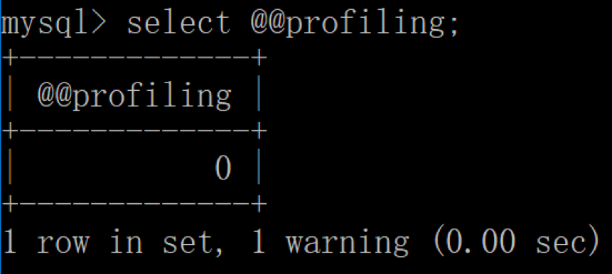

profiling=0 代表关闭，我们需要把 profiling 打开，即设置为 1： 

```sql
mysql> set profiling=1; 
```

然后我们执行一个 SQL 查询（你可以执行任何一个 SQL 查询）： 

```sql
mysql> select * from wucai.heros;
```

查看当前会话所产生的所有 profiles： 


你会发现我们刚才执行了两次查询，Query ID 分别为 1 和2。如果我们想要获取上一次查询的执行时间，可以使用 :

```sql
mysql> show profile;
```


当然你也可以查询指定的 Query ID，比如： 

```sql
mysql> show profile for query 2;
```

查询 SQL 的执行时间结果和上面是一样的。 

在 8.0 版本之后，MySQL 不再支持缓存的查询，原因我在上文已经说过。一旦数据表有更新，缓存都将清空，因此只
有数据表是静态的时候，或者数据表很少发生变化时，使用缓存查询才有价值，否则如果数据表经常更新，反而增加了
SQL 的查询时间。 

你可以使用 select version() 来查看 MySQL 的版本情况。 


### 使用DDL创建数据库&数据表时需要注意什么？ 

#### DDL 的基础语法及设计工具 

DDL 的英文全称是 Data Definition Language，中文是数据定义语言。它定义了数据库的结构和数据表的结构 

在 DDL 中，我们常用的功能是增删改，分别对应的命令是CREATE、DROP 和 ALTER。需要注意的是，在执行 DDL
的时候，不需要 COMMIT，就可以完成执行任务 。

##### 1.对数据库进行定义 

```sql
CREATE DATABASE nba; // 创建一个名为 nba 的数据库
DROP DATABASE nba; // 删除一个名为 nba 的数据库
```

##### 2.对数据表进行定义 

创建表结构的语法是这样的： 

```sql
CREATE TABLE table_name
```

#### 创建表结构 

比如我们想创建一个球员表，表名为 player，里面有两个字段，一个是 player_id，它是 int 类型，另一个player_name 字段是varchar(255)类型。这两个字段都不为空，且 player_id 是递增的。
那么创建的时候就可以写为： 

```sql
CREATE TABLE player (
  player_id int(11) NOT NULL AUTO_INCREMENT,
  player_name varchar(255) NOT NULL
);
```

>需要注意的是，语句最后以分号（;）作为结束符，最后一个字段的定义结束后没有逗号。数据类型中 int(11) 代表整数类型，显示长度为 11 位，括号中的参数 11 代表的是最大有效显示长度，与类型包含的数值范围大小无关。
>varchar(255)代表的是最大长度为 255 的可变字符串类型。NOT NULL表明整个字段不能是空值，是一种数据约
>束。AUTO_INCREMENT代表主键自动增长。 


实际上，我们通常很少自己写 DDL 语句，可以使用一些可视化工具来创建和操作数据库和数据表。在这里我推荐使用
Navicat，它是一个数据库管理和设计工具，跨平台，支持很多种数据库管理软件，比如 MySQL、Oracle、MariaDB
等。基本上专栏讲到的数据库软件都可以使用 Navicat 来管
理。 


假如还是针对 player 这张表，我们想设计以下的字段： 


其中 player_id 是数据表 player 的主键，且自动增长，也 就是 player_id 会从 1 开始，然后每次加 1。player_id、 

team_id、player_name 这三个字段均不为空，height 字段可以为空。 


按照上面的设计需求，我们可以使用 Navicat 软件进行设计，如下所示： 


然后，我们还可以对 player_name 字段进行索引，索引类型为Unique。使用 Navicat 设置如下： 

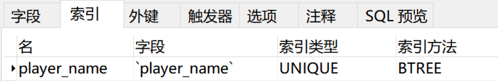

这样一张 player 表就通过可视化工具设计好了。我们可以把这张表导出来，可以看看这张表对应的 SQL 语句是怎样
的。方法是在 Navicat 左侧用右键选中 player 这张表，然后选择“转储 SQL 文件”→“仅结构”，这样就可以看到
导出的 SQL 文件了，代码如下： 

```sql
DROP TABLE IF EXISTS `demo`;
CREATE TABLE `demo`  (
  `player_id` int(11) NOT NULL AUTO_INCREMENT,
  `team_id` int(11) NOT NULL,
  `player_name` varchar(255) CHARACTER SET utf8 COLLATE utf8_general_ci NOT NULL,
  `height` float(3, 2) NULL DEFAULT NULL,
  PRIMARY KEY (`player_id`) USING BTREE,
  UNIQUE INDEX `player_name`(`player_name`) USING BTREE
) ENGINE = InnoDB AUTO_INCREMENT = 1 CHARACTER SET = utf8 COLLATE = utf8_general_ci;
```

你能看到整个 SQL 文件中的 DDL 处理，首先先删除player 表（如果数据库中存在该表的话），然后再创建player 表，里面的数据表和字段都使用了反引号，这是为了避免它们的名称与 MySQL 保留字段相同，对数据表和字段名称都加上了反引号。 

其中 player_name 字段的字符集是 utf8，排序规则是utf8_general_ci，代表对大小写不敏感，如果设置为utf8_bin，代表对大小写敏感，还有许多其他排序规则这里不进行介绍。 

因为 player_id 设置为了主键，因此在 DDL  中使用PRIMARY  KEY进行规定，同时索引方法采用 BTREE。

因为我们对 player_name 字段进行索引，在设置字段索引时，我们可以设置为UNIQUE INDEX（唯一索引），也可以
设置为其他索引方式，比如NORMAL INDEX（普通索引），这里我们采用UNIQUE INDEX。唯一索引和普通索引的区别
在于它对字段进行了唯一性的约束。在索引方式上，你可以选择BTREE或者HASH，这里采用了BTREE方法进行索引。
我会在后面介绍BTREE和HASH索引方式的区别。 

整个数据表的存储规则采用 InnoDB。之前我们简单介绍过InnoDB，它是 MySQL5.5 版本之后默认的存储引擎。同
时，我们将字符集设置为 utf8，排序规则为utf8_general_ci，行格式为Dynamic，就可以定义数据表的最后约定了： 

```sql
ENGINE = InnoDB AUTO_INCREMENT = 1 CHARACTER SET = utf8 COLLATE = utf8_general_ci ROW_FORMAT = Dynamic;
```

#### 修改表结构 

在创建表结构之后，我们还可以对表结构进行修改，虽然直接使用 Navicat 可以保证重新导出的数据表就是最新的，但
你也有必要了解，如何使用 DDL 命令来完成表结构的修改。 

1. 添加字段，比如我在数据表中添加一个 age 字段，类型为int(11) 

  ```sql
   ALTER TABLE player ADD (age int(11));
  ```

  

2. 修改字段名，将 age 字段改成player_age float(3,1) 

   ```sql
    ALTER TABLE player RENAME COLUMN age to player_age
   ```

3. 修改字段的数据类型，将player_age的数据类型设置为

   ```sql
   ALTER TABLE player MODIFY (player_age float(3,1));
   ```

4. 删除字段, 删除刚才添加的player_age字段 

   ```sql
   ALTER TABLE player DROP COLUMN player_age;
   ```

#### 数据表的常见约束 

当我们创建数据表的时候，还会对字段进行约束，约束的目的在于保证 RDBMS 里面数据的准确性和一致性。下面，我
们来看下常见的约束有哪些。 

##### 主键约束 

>主键起的作用是唯一标识一条记录，不能重复，不能为空，即 UNIQUE+NOT NULL。一个数据表的主键只能有一个。主键可以是一个字段，也可以由多个字段复合组成。在上面的例子中，我们就把 player_id 设置为了主键。 


##### 外键约束 

>外键确保了表与表之间引用的完整性。一个表中的外键对应另一张表的主键。外键可以是重复的，也可以为空。比如player_id 在 player 表中是主键，如果你想设置一个球员比分表即 player_score，就可以在 player_score 中设置player_id 为外键，关联到 player 表中。 


除了对键进行约束外，还有字段约束。 

##### 唯一性约束 

>唯一性约束表明了字段在表中的数值是唯一的，即使我们已经有了主键，还可以对其他字段进行唯一性约束。比如我们在 player 表中给 player_name 设置唯一性约束，就表明任何两个球员的姓名不能相同。需要注意的是，唯一性约束和普通索引（NORMAL INDEX）之间是有区别的。唯一性约束相当于创建了一个约束和普通索引，目的是保证字段的正确性，而普通索引只是提升数据检索的速度，并不对字段的唯一性进行约束。 


##### NOT NULL 约束 

 >对字段定义了 NOT NULL，即表明该字段不应为空，必须有取值。 


##### DEFAULT 

>表明了字段的默认值。如果在插入数据的时候，这个字段没有取值，就设置为默认值。比如我们将身高
>height 字段的取值默认设置为 0.00，即DEFAULT 0.00 


##### CHECK 约束 

> 用来检查特定字段取值范围的有效性， CHECK 约束的结果不能为 FALSE，比如我们可以对身高height 的数值进行 CHECK 约束，必须≥0，且＜3，即CHECK(height>=0 AND height<3)。 

 

##### 设计数据表的原则 

>我们在设计数据表的时候，经常会考虑到各种问题，比如：用户都需要什么数据？需要在数据表中保存哪些数据？哪些数据是经常访问的数据？如何提升检索效率？
>
>如何保证数据表中数据的正确性，当插入、删除、更新的时候该进行怎样的约束检查？
>
>如何降低数据表的数据冗余度，保证数据表不会因为用户量的增长而迅速扩张？
>如何让负责数据库维护的人员更方便地使用数据库？ 

这里我整理了一个“三少一多”原则：

> 1.数据表的个数越少越好   
>
> RDBMS 的核心在于对实体和联系的定义，也就是 E-R 图（Entity Relationship Diagram），数据表越少，证明实
> 体和联系设计得越简洁，既方便理解又方便操作。 
>
> 2.数据表中的字段个数越少越好 
>
> 字段个数越多，数据冗余的可能性越大。设置字段个数少的
> 前提是各个字段相互独立，而不是某个字段的取值可以由其他字段计算出来。当然字段个数少是相对的，我们通常会在数据冗余和检索效率中进行平衡。
>
> 3.数据表中联合主键的字段个数越少越好 
>
> 设置主键是为了确定唯一性，当一个字段无法确定唯一性的时候，就需要采用联合主键的方式（也就是用多个字段来定义一个主键）。联合主键中的字段越多，占用的索引空间越大，不仅会加大理解难度，还会增加运行时间和索引空间，因此联合主键的字段个数越少越好。
>
> 4.使用主键和外键越多越好 
>
> 数据库的设计实际上就是定义各种表，以及各种字段之间的关系。这些关系越多，证明这些实体之间的冗余度越低，利用度越高。这样做的好处在于不仅保证了数据表之间的独立性，还能提升相互之间的关联使用率。 
>
> 你应该能看出来“三少一多”原则的核心就是简单可复用。简单指的是用更少的表、更少的字段、更少的联合主键字段来完成数据表的设计。可复用则是通过主键、外键的使用来增强数据表之间的复用率。因为一个主键可以理解是一张表的代表。键设计得越多，证明它们之间的利用率越高。 

##### 是否使用外键

是否使用外键确实会有一些争议。我来解释下关于外键的使用： 

>首先，外键本身是为了实现强一致性，所以如果需要正确性性能的话，还是建议使用外键，它可以让我们在数据库的层面保证数据的完整性和一致性。当然不用外键，你也可以在业务层进行实现。不过，这样做也同样存在一定的风险，因为这样，就会让业务逻辑会与数据具备一定的耦合性。也就是业务逻辑和数据必须同时修改。而且在工作中，业务层可能会经常发生变化。 
>
>当然，很多互联网的公司，尤其是超大型的数据应用场景，大量的插入，更新和删除在外键的约束下会降低性能，同时数据库在水平拆分和分库的情况下，数据库端也做不到执行外键约束。另外，在高并发的情况下，外键的存在也会造成额外的开销。因为每次更新数据，都需要检查另外一张表的数据，也容易造成死锁。所以在这种情况下，尤其是大型项目中后期，可以采用业务层来实现，取消外键提高效率。不过在SQL学习之初，包括在系统最初设计的时候，还是建议你采用规范的数据库设计，也就是采用外键来对数据表进行约束。因为这样可以建立一个强一致性，可靠性高的数据库结构，也不需要在业务层来实现过多的检查。当然在项目后期，业务量增大的情况下，你需要更多考虑到数据库性能问题，可以取消外键的约束，转移到业务层来实现。
>
>而且在大型互联网项目中，考虑到分库分表的情况，也会降低外键的使用。不过在SQL学习，以及项目早期，还是建议你使用外键。在 项目后期，你可以分析有哪些外键造成了过多的性能消耗。一般遵循2/8原则，会有20%的外键造成80%的资源效率，你可以只把这20%的外键进行开放，采用业务层逻辑来进行实现，当然你需要保证业务层的实现没有错误。不同阶段，考虑的问题不同。当用户和业务量增大的时候，对于大型互联网应用，也会通过减少外键的使用，来减低死锁发生的概率，提高并发处理能力。 


### 检索数据：你还在SELECT * 么？ 

#### SELECT 查询的基础语法 

我创建了一个王者荣耀英雄数据表，这张表里一共有 69 个英雄，23 个属性值（不包括英雄名 name）。SQL 文件见
Github (这里放在图片文件夹)地址。

 

数据表中这 24 个字段（除了 id 以外），分别代表的含义见下图 


#### 查询列 

如果我们想要对数据表中的某一列进行检索，在 SELECT 后面加上这个列的字段名即可。比如我们想要检索数据表中都
有哪些英雄。 

```sql
SELECT name FROM heros
```

运行结果（69 条记录）见下图，你可以看到这样就等于单独输出了 name 这一列 


 我们也可以对多个列进行检索，在列名之间用逗号 (,) 分割即可。比如我们想要检索有哪些英雄，他们的最大生命、最
大法力、最大物攻和最大物防分别是多少。 

```sql
SELECT name, hp_max, mp_max, attack_max, defense_max FROM heros
```

但是在生产环境时要尽量避免使用SELECT*，具体原因我会在后面讲。


#### 起别名 

我们在使用 SELECT 查询的时候，还有一些技巧可以使用，比如你可以给列名起别名。我们在进行检索的时候，可以给
英雄名、最大生命、最大法力、最大物攻和最大物防等取别名： 

```sql
SELECT name AS n, hp_max AS hm, mp_max AS mm, attack_max AS am, defense_max AS dm FROM heros
```

运行结果和上面多列检索的运行结果是一样的，只是将列名改成了 n、hm、mm、am 和 dm。当然这里的列别名只是举例，一般来说起别名的作用是对原有名称进行简化，从而让 SQL 语句看起来更精简。同样我们也可以对表名称起别名，这个在多表连接查询的时候会用到。


#### 查询常数

SELECT 查询还可以对常数进行查询。对的，就是在 SELECT 查询结果中增加一列固定的常数列。这列的取值是我们指定的，而不是从数据表中动态取出的。你可能会问为什么我们还要对常数进行查询呢？SQL 中的 SELECT 语法的确提供了这个功能，一般来说我们只从一个表中查询数据，通常不需要增加一个固定的常数列，但如果我们想整合不同的数据源，用常数列作为这个表的标记，就需要查询常数。比如说，我们想对 heros 数据表中的英雄名进行查询，同时增加一列字段platform，这个字段固定值为“王者荣耀”，可以这样写：

```sql
SELECT '王者荣耀' as platform, name FROM heros
```

运行结果：（69 条记录）

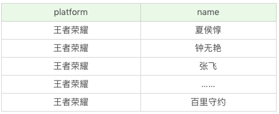

> 在这个 SQL 语句中，我们虚构了一个platform字段，并且把它设置为固定值“王者荣耀”。需要说明的是，如果常数是个字符串，那么使用单引号（‘’）就非常重要了，比如‘王者荣耀’。单引号说明引号中的字符串是个常数，否则 SQL 会把王者荣耀当成列名进行查询，但实际上数据表里没有这个列名，就会引起错误。如果常数是英文字母，比如'WZRY'也需要加引号。如果常数是个数字，就可以直接写数字，不需要单引号，比如：

```sql
SELECT 123 as platform, name FROM heros
```

运行结果：（69 条记录）


#### 去除重复行

关于单个表的 SELECT 查询，还有一个非常实用的操作，就是从结果中去掉重复的行。使用的关键字是 DISTINCT。比如我们想要看下 heros 表中关于攻击范围的取值都有哪些：

```sql
SELECT DISTINCT attack_range FROM heros
```

这是运行结果（2 条记录），这样我们就能直观地看到攻击范围其实只有两个值，那就是近战和远程。


如果我们带上英雄名称，会是怎样呢：

```sql
SELECT DISTINCT attack_range, name FROM heros
```

运行结果（69 条记录）：

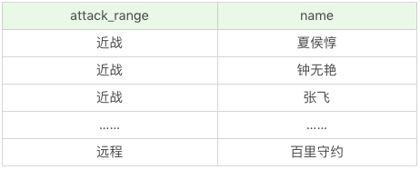

**这里有两点需要注意：**

- DISTINCT 需要放到所有列名的前面，如果写成SELECT name, DISTINCT attack_range FROM heros会报错。

- DISTINCT 其实是对后面所有列名的组合进行去重，你能看到最后的结果是 69 条，因为这 69 个英雄名称不同，都有攻击范围（attack_range）这个属性值。**如果你想要看都有哪些不同的攻击范围（attack_range），只需要写DISTINCT attack_range即可，后面不需要再加其他的列名了。**

  

#### 如何排序检索数据

当我们检索数据的时候，有时候需要按照某种顺序进行结果的返回，比如我们想要查询所有的英雄，按照最大生命从高到底的顺序进行排列，就需要使用 ORDER BY 子句。使用 ORDER BY 子句有以下几个点需要掌握：

- 排序的列名：ORDER BY 后面可以有一个或多个列名，如果是多个列名进行排序，会按照后面第一个列先进行排序，当第一列的值相同的时候，再按照第二列进行排序，以此类推。
- 排序的顺序：ORDER BY 后面可以注明排序规则，ASC 代表递增排序，DESC 代表递减排序。如果没有注明排序规则，默认情况下是按照 ASC 递增排序。我们很容易理解 ORDER BY 对数值类型字段的排序规则，但如果排序字段类型为文本数据，就需要参考数据库的设置方式了，这样才能判断 A 是在 B 之前，还是在 B 之后。比如使用 MySQL 在创建字段的时候设置为 BINARY 属性，就代表区分大小写。
- 非选择列排序：ORDER BY 可以使用非选择列进行排序，所以即使在 SELECT 后面没有这个列名，你同样可以放到 ORDER BY 后面进行排序。
- ORDER BY 的位置：ORDER BY 通常位于 SELECT 语句的最后一条子句，否则会报错。

在了解了 ORDER BY 的使用语法之后，我们来看下如何对 heros 数据表进行排序。假设我们想要显示英雄名称及最大生命值，按照最大生命值从高到低的方式进行排序：

```sql
SELECT name, hp_max FROM heros ORDER BY hp_max DESC
```

运行结果（69 条记录）：


如果想要显示英雄名称及最大生命值，按照第一排序最大法力从低到高，当最大法力值相等的时候则按照第二排序进行，即最大生命值从高到低的方式进行排序：

```sql
SELECT name, hp_max FROM heros ORDER BY mp_max, hp_max DESC
```

运行结果：（69 条记录）

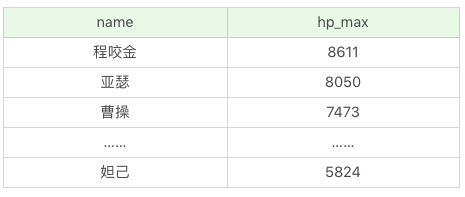

#### 约束返回结果的数量

另外在查询过程中，我们可以约束返回结果的数量，使用 LIMIT 关键字。比如我们想返回英雄名称及最大生命值，按照最大生命值从高到低排序，返回 5 条记录即可。

```sql

SELECT name, hp_max FROM heros ORDER BY hp_max DESC LIMIT 5
```

运行结果（5 条记录）：


有一点需要注意，约束返回结果的数量，在不同的 DBMS 中使用的关键字可能不同。在 MySQL、PostgreSQL、MariaDB 和 SQLite 中使用 LIMIT 关键字，而且需要放到 SELECT 语句的最后面。如果是 SQL Server 和 Access，需要使用 TOP 关键字，比如：

```sql
SELECT TOP 5 name, hp_max FROM heros ORDER BY hp_max DESC
```

如果是 DB2，使用FETCH FIRST 5 ROWS ONLY这样的关键字：

```sql
SELECT name, hp_max FROM heros ORDER BY hp_max DESC FETCH FIRST 5 ROWS ONLY
```

如果是 Oracle，你需要基于 ROWNUM 来统计行数：

```sql
SELECT name, hp_max FROM heros WHERE ROWNUM <=5 ORDER BY hp_max DESC
```

需要说明的是，这条语句是先取出来前 5 条数据行，然后再按照 hp_max 从高到低的顺序进行排序。但这样产生的结果和上述方法的并不一样。我会在后面讲到子查询，你可以使用SELECT name, hp_max FROM (SELECT name, hp_max FROM heros ORDER BY hp_max) WHERE **ROWNUM** <=5得到与上述方法一致的结果。

约束返回结果的数量可以减少数据表的网络传输量，也可以提升查询效率。如果我们知道返回结果只有 1 条，就可以使用LIMIT 1，告诉 SELECT 语句只需要返回一条记录即可。这样的好处就是 SELECT 不需要扫描完整的表，只需要检索到一条符合条件的记录即可返回。

#### SELECT 的执行顺序

查询是 RDBMS 中最频繁的操作。我们在理解 SELECT 语法的时候，还需要了解 SELECT 执行时的底层原理。只有这样，才能让我们对 SQL 有更深刻的认识。其中你需要记住 SELECT 查询时的两个顺序：

1. 关键字的顺序是不能颠倒的：

   ```sql
   
   SELECT ... FROM ... WHERE ... GROUP BY ... HAVING ... ORDER BY ...
   ```

2. SELECT 语句的执行顺序（在 MySQL 和 Oracle 中，SELECT 执行顺序基本相同）：

   ```sql
   
   FROM > WHERE > GROUP BY > HAVING > SELECT的字段 > DISTINCT > ORDER BY > LIMIT
   ```

3. 比如你写了一个 SQL 语句，那么它的关键字顺序和执行顺序是下面这样的：

   ```sql
   
   SELECT DISTINCT player_id, player_name, count(*) as num #顺序5
   FROM player JOIN team ON player.team_id = team.team_id #顺序1
   WHERE height > 1.80 #顺序2
   GROUP BY player.team_id #顺序3
   HAVING num > 2 #顺序4
   ORDER BY num DESC #顺序6
   LIMIT 2 #顺序7
   ```

   在 SELECT 语句执行这些步骤的时候，每个步骤都会产生一个虚拟表，然后将这个虚拟表传入下一个步骤中作为输入。需要注意的是，这些步骤隐含在 SQL 的执行过程中，对于我们来说是不可见的。

   >我来详细解释一下 SQL 的执行原理。首先，你可以注意到，SELECT 是先执行 FROM 这一步的。在这个阶段，如果是多张表联查，还会经历下面的几个步骤：
   >
   >- 首先先通过 CROSS JOIN 求笛卡尔积，相当于得到虚拟表 vt（virtual table）1-1；
   >
   >- 通过 ON 进行筛选，在虚拟表 vt1-1 的基础上进行筛选，得到虚拟表 vt1-2；
   >
   >- 添加外部行。如果我们使用的是左连接、右链接或者全连接，就会涉及到外部行，也就是在虚拟表 vt1-2 的基础上增加外部行，得到虚拟表 vt1-3。
   >
   >  
   >
   >当然如果我们操作的是两张以上的表，还会重复上面的步骤，直到所有表都被处理完为止。这个过程得到是我们的原始数据。当我们拿到了查询数据表的原始数据，也就是最终的虚拟表 vt1，就可以在此基础上再进行 WHERE 阶段。在这个阶段中，会根据 vt1 表的结果进行筛选过滤，得到虚拟表 vt2。
   >
   >
   >
   >然后进入第三步和第四步，也就是 GROUP 和 HAVING 阶段。在这个阶段中，实际上是在虚拟表 vt2 的基础上进行分组和分组过滤，得到中间的虚拟表 vt3 和 vt4。
   >
   >
   >
   >当我们完成了条件筛选部分之后，就可以筛选表中提取的字段，也就是进入到 SELECT 和 DISTINCT 阶段。
   >
   >首先在 SELECT 阶段会提取想要的字段，然后在 DISTINCT 阶段过滤掉重复的行，分别得到中间的虚拟表 vt5-1 和 vt5-2。
   >
   >当我们提取了想要的字段数据之后，就可以按照指定的字段进行排序，也就是 ORDER BY 阶段，得到虚拟表 vt6。最后在 vt6 的基础上，取出指定行的记录，也就是 LIMIT 阶段，得到最终的结果，对应的是虚拟表 vt7。当然我们在写 SELECT 语句的时候，不一定存在所有的关键字，相应的阶段就会省略。同时因为 SQL 是一门类似英语的结构化查询语言，所以我们在写 SELECT 语句的时候，还要注意相应的关键字顺序，所谓底层运行的原理，就是我们刚才讲到的执行顺序。


#### 什么情况下用 SELECT*，如何提升 SELECT 查询效率？

当我们初学 SELECT 语法的时候，经常会使用SELECT *，因为使用方便。实际上这样也增加了数据库的负担。所以如果我们不需要把所有列都检索出来，还是先指定出所需的列名，因为写清列名，可以减少数据表查询的网络传输量，而且考虑到在实际的工作中，我们往往不需要全部的列名，因此你需要养成良好的习惯，写出所需的列名。

如果我们只是练习，或者对数据表进行探索，那么是可以使用SELECT *的。它的查询效率和把所有列名都写出来再进行查询的效率相差并不大。这样可以方便你对数据表有个整体的认知。但是在生产环境下，不推荐你直接使用SELECT *进行查询。

#### COUNT()

>COUNT()的效率是一个很好的问题，欢迎探讨：
>在MySQL InnoDB存储引擎中，COUNT(*)和COUNT(1)都是对的所有结果进行的COUNT。如果有WHERE子句，则是对所有符合筛选条件的数据行进行统计。如果没有WHERE子句，则是对数据表的数据行数进行统计。
>因此COUNT(*)和COUNT(1)本质上没有区别，执行的复杂度都是O(N)，也就是采用全表扫描，进行循环+计数的方式进行统计。
>如果是MySQL MyISAM存储引擎，统计数据表的行数只需要O(1)复杂度，这是因为每张MyISAM的数据表都有一个meta信息有存储了row_count值。而一致性由表级锁来保证。而InnoDB支持事务，采用行级锁和MVCC机制，所以无法像MyISAM一样，只维护一个row_count变量。因此就需要采用扫描全表，进行循环+计数的方式来完成统计。
>需要注意的是，在实际执行中COUNT(*)和COUNT(1)执行时间可能略有差别，不过你还是可以把这两个在执行效率上看成是相等的。
>
>另外在InnoDB引擎中，如果是采用COUNT(*)和COUNT(1)来统计数据行数，要尽量采用二级索引。
>因为主键采用的索引是聚簇索引，聚簇索引包含的信息多，明显会大于二级索引（非聚簇索引）。
>对于查找具体的行来说，采用主键索引效率更高。而对于COUNT(*)和COUNT(1)这种，不需要查找具体的行，只是统计行数来说，系统会自动采用占用空间更小的二级索引来进行统计。
>如果有多个二级索引的时候，会使用key_len小的二级索引进行扫描。当没有二级索引的时候，才会采用主键索引来进行统计。
>
>优化总结：
>1、一般情况下：COUNT(*) = COUNT(1) > COUNT(字段)
>所以尽量使用COUNT(*)，当然如果你要统计的是就是某个字段的非空数据行数，那另当别论。毕竟执行效率比较的前提是要结果一样才行。
>2、如果要统计COUNT(*)，尽量在数据表上建立二级索引，系统会自动采用key_len小的二级索引进行扫描，这样当我们使用SELECT COUNT(*)的时候效率就会提升，有时候提升几倍甚至更高都是有可能的。  


### 数据过滤：SQL数据过滤都有哪些方法？

我在上篇文章中讲到过，提升查询效率的一个很重要的方式，就是约束返回结果的数量，还有一个很有效的方式，就是指定筛选条件，进行过滤。过滤可以筛选符合条件的结果，并进行返回，减少不必要的数据行。

那么在今天的内容里，我们来学习如何对 SQL 数据进行过滤，这里主要使用的就是 WHERE 子句。

你可能已经使用过 WHERE 子句，说起来 SQL 其实很简单，只要能把满足条件的内容筛选出来即可，但在实际使用过程中，不同人写出来的 WHERE 子句存在很大差别，比如执行效率的高低，有没有遇到莫名的报错等。

在今天的学习中，你重点需要掌握以下几方面的内容：

1. 学会使用 WHERE 子句，如何使用比较运算符对字段的数值进行比较筛选；
2. 如何使用逻辑运算符，进行多条件的过滤；
3. 学会使用通配符对数据条件进行复杂过滤。

#### 比较运算符

在 SQL 中，我们可以使用 WHERE 子句对条件进行筛选，在此之前，你需要了解 WHERE 子句中的比较运算符。这些比较运算符的含义你可以参见下面这张表格：


实际上你能看到，同样的含义可能会有多种表达方式，比如小于等于，可以是（<=），也可以是不大于（!>）。同样不等于，可以用（<>），也可以用（!=），它们的含义都是相同的，但这些符号的顺序都不能颠倒，比如你不能写（=<）。需要注意的是，你需要查看使用的 DBMS 是否支持，不同的 DBMS 支持的运算符可能是不同的，比如 Access 不支持（!=），不等于应该使用（<>）。在 MySQL 中，不支持（!>）（!<）等。

我在上一篇文章中使用了 heros 数据表，今天还是以这张表格做练习。下面我们通过比较运算符对王者荣耀的英雄属性进行条件筛选。

WHERE 子句的基本格式是：`SELECT ……(列名) FROM ……(表名) WHERE ……(子句条件)`

比如我们想要查询所有最大生命值大于 6000 的英雄：

```sql
SELECT name, hp_max FROM heros WHERE hp_max > 6000
```

运行结果（41 条记录）：


想要查询所有最大生命值在 5399 到 6811 之间的英雄：

```sql
SELECT name, hp_max FROM heros WHERE hp_max BETWEEN 5399 AND 6811
```

运行结果：（41 条记录）


需要注意的是hp_max可以取值到最小值和最大值，即 5399和 6811。 

我们也可以对 heros 表中的`hp_max`字段进行空值检查。

```sql
SELECT name, hp_max FROM heros WHERE hp_max IS NULL
```

运行结果为空，说明 heros 表中的`hp_max`字段没有存在空值的数据行。


#### 逻辑运算符

我刚才介绍了比较运算符，如果我们存在多个 WHERE 条件子句，可以使用逻辑运算符：


我们还是通过例子来看下这些逻辑运算符的使用，同样采用 heros 这张表的数据查询。

```sql
SELECT name, hp_max, mp_max FROM heros WHERE hp_max > 6000 AND mp_max > 1700 ORDER BY (hp_max+mp_max) DESC
```

运行结果：（23 条记录）

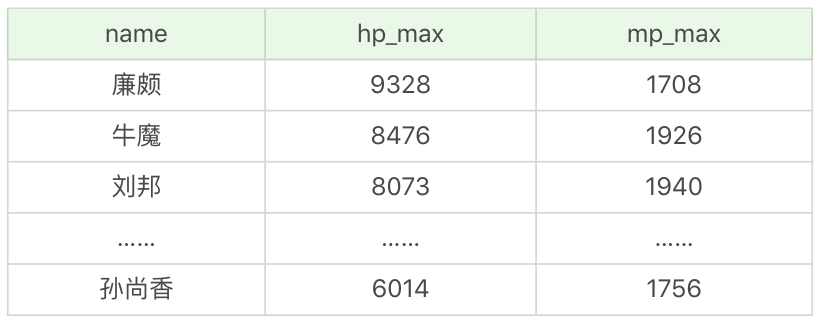


如果 AND 和 OR 同时存在 WHERE 子句中会是怎样的呢？假设我们想要查询最大生命值加最大法力值大于 8000 的英雄，或者最大生命值大于 6000 并且最大法力值大于 1700 的英雄。

```sql
SELECT name, hp_max, mp_max FROM heros WHERE (hp_max+mp_max) > 8000 OR hp_max > 6000 AND mp_max > 1700 ORDER BY (hp_max+mp_max) DESC
```

运行结果：（33 条记录）


你能看出来相比于上一个条件查询，这次的条件查询多出来了 10 个英雄，这是因为我们放宽了条件，允许最大生命值 + 最大法力值大于 8000 的英雄显示出来。另外你需要注意到，当 WHERE 子句中同时存在 OR 和 AND 的时候，AND 执行的优先级会更高，也就是说 SQL 会优先处理 AND 操作符，然后再处理 OR 操作符。

如果我们对这条查询语句 OR 两边的条件增加一个括号，结果会是怎样的呢？

```sql
SELECT name, hp_max, mp_max FROM heros WHERE ((hp_max+mp_max) > 8000 OR hp_max > 6000) AND mp_max > 1700 ORDER BY (hp_max+mp_max) DESC
```

运行结果：


所以当 WHERE 子句中同时出现 AND 和 OR 操作符的时候，你需要考虑到执行的先后顺序，也就是两个操作符执行的优先级。一般来说 () 优先级最高，其次优先级是 AND，然后是 OR。

如果我想要查询主要定位或者次要定位是法师或是射手的英雄，同时英雄的上线时间不在 2016-01-01 到 2017-01-01 之间。

```sql
SELECT name, role_main, role_assist, hp_max, mp_max, birthdate
FROM heros 
WHERE (role_main IN ('法师', '射手') OR role_assist IN ('法师', '射手')) 
AND DATE(birthdate) NOT BETWEEN '2016-01-01' AND '2017-01-01'
ORDER BY (hp_max + mp_max) DESC
```

你能看到我把 WHERE 子句分成了两个部分。第一部分是关于主要定位和次要定位的条件过滤，使用的是`role_main in ('法师', '射手') OR role_assist in ('法师', '射手')`。这里用到了 IN 逻辑运算符，同时`role_main`和`role_assist`是 OR（或）的关系。

第二部分是关于上线时间的条件过滤。NOT 代表否，因为我们要找到不在 2016-01-01 到 2017-01-01 之间的日期，因此用到了`NOT BETWEEN '2016-01-01' AND '2017-01-01'`。同时我们是在对日期类型数据进行检索，所以使用到了 DATE 函数，将字段 birthdate 转化为日期类型再进行比较。关于日期的操作，我会在下一篇文章中再作具体介绍。

这是运行结果（6 条记录）：


#### 使用通配符进行过滤

刚才讲解的条件过滤都是对已知值进行的过滤，还有一种情况是我们要检索文本中包含某个词的所有数据，这里就需要使用通配符。通配符就是我们用来匹配值的一部分的特殊字符。这里我们需要使用到 LIKE 操作符。

如果我们想要匹配任意字符串出现的任意次数，需要使用（%）通配符。比如我们想要查找英雄名中包含“太”字的英雄都有哪些：

```sql
SELECT name FROM heros WHERE name LIKE '% 太 %'
```

运行结果：（2 条记录）


需要说明的是不同 DBMS 对通配符的定义不同，在 Access 中使用的是（*）而不是（%）。另外关于字符串的搜索可能是需要区分大小写的，比如`'liu%'`就不能匹配上`'LIU BEI'`。具体是否区分大小写还需要考虑不同的 DBMS 以及它们的配置。

如果我们想要匹配单个字符，就需要使用下划线 (`_`) 通配符。（%）和（`_`）的区别在于，（%）代表一个或多个字符，而（`_`）只代表一个字符。比如我们想要查找英雄名除了第一个字以外，包含“太”字的英雄有哪些。

```sql
SELECT name FROM heros WHERE name LIKE '_% 太 %'
```

运行结果（1 条记录）：

​	

因为太乙真人的太是第一个字符，而`_%太%`中的太不是在第一个字符，所以匹配不到“太乙真人”，只可以匹配上“东皇太一”。

同样需要说明的是，在 Access 中使用（?）来代替（`_`），而且在 DB2 中是不支持通配符（`_`）的，因此你需要在使用的时候查阅相关的 DBMS 文档。

你能看出来通配符还是很有用的，尤其是在进行字符串匹配的时候。不过在实际操作过程中，我还是建议你尽量少用通配符，因为它需要消耗数据库更长的时间来进行匹配。即使你对 LIKE 检索的字段进行了索引，索引的价值也可能会失效。如果要让索引生效，那么 LIKE 后面就不能以（%）开头，比如使用`LIKE '%太%'`或`LIKE '%太'`的时候就会对全表进行扫描。如果使用`LIKE '太%'`，同时检索的字段进行了索引的时候，则不会进行全表扫描。

####  总结：

比较运算符是对数值进行比较，不同的 DBMS 支持的比较运算符可能不同，你需要事先查阅相应的 DBMS 文档。逻辑运算符可以让我们同时使用多个 WHERE 子句，你需要注意的是 AND 和 OR 运算符的执行顺序。通配符可以让我们对文本类型的字段进行模糊查询，不过检索的代价也是很高的，通常都需要用到全表扫描，所以效率很低。只有当 LIKE 语句后面不用通配符，并且对字段进行索引的时候才不会对全表进行扫描。

你可能认为学习 SQL 并不难，掌握这些语法就可以对数据进行筛选查询。但实际工作中不同人写的 SQL 语句的查询效率差别很大，保持高效率的一个很重要的原因，就是要避免全表扫描，所以我们会考虑在 WHERE 及 ORDER BY 涉及到的列上增加索引。

#### 问题

ORDER BY字段是否增加索引?

>  这是一个很好的问题，关于ORDER BY字段是否增加索引：
>  在MySQL中，支持两种排序方式：FileSort和Index排序。Index排序的效率更高，
>  Index排序：索引可以保证数据的有序性，因此不需要再进行排序。
>  FileSort排序：一般在内存中进行排序，占用CPU较多。如果待排结果较大，会产生临时文件I/O到磁盘进行排序，效率较低。
>
>  所以使用ORDER BY子句时，应该尽量使用Index排序，避免使用FileSort排序。
>  当然具体优化器是否采用索引进行排序，你可以使用explain来进行执行计划的查看。
>  优化建议：
>  1、SQL中，可以在WHERE子句和ORDER BY子句中使用索引，目的是在WHERE子句中避免全表扫描，ORDER BY子句避免使用FileSort排序。
>  当然，某些情况下全表扫描，或者FileSort排序不一定比索引慢。但总的来说，我们还是要避免，以提高查询效率。
>  一般情况下，优化器会帮我们进行更好的选择，当然我们也需要建立合理的索引。
>  2、尽量Using Index完成ORDER BY排序。
>  如果WHERE和ORDER BY相同列就使用单索引列；如果不同使用联合索引。
>  3、无法Using Index时，对FileSort方式进行调优。  


### 什么是SQL函数？为什么使用SQL函数可能会带来问题？

函数在计算机语言的使用中贯穿始终，在 SQL 中我们也可以使用函数对检索出来的数据进行函数操作，比如求某列数据的平均值，或者求字符串的长度等。从函数定义的角度出发，我们可以将函数分成内置函数和自定义函数。在 SQL 语言中，同样也包括了内置函数和自定义函数。内置函数是系统内置的通用函数，而自定义函数是我们根据自己的需要编写的，下面讲解的是 SQL 的内置函数。

你需要从以下几个方面掌握 SQL 函数：

1. 什么是 SQL 函数？
2. 内置的 SQL 函数都包括哪些？
3. 如何使用 SQL 函数对一个数据表进行操作，比如针对一个王者荣耀的英雄数据库，我们可以使用这些函数完成哪些操作？
4. 什么情况下使用 SQL 函数？为什么使用 SQL 函数有时候会带来问题？

#### 什么是 SQL 函数

当我们学习编程语言的时候，也会遇到函数。函数的作用是什么呢？它可以把我们经常使用的代码封装起来，需要的时候直接调用即可。这样既提高了代码效率，又提高了可维护性。

SQL 中的函数一般是在数据上执行的，可以很方便地转换和处理数据。一般来说，当我们从数据表中检索出数据之后，就可以进一步对这些数据进行操作，得到更有意义的结果，比如返回指定条件的函数，或者求某个字段的平均值等。

#### 常用的 SQL 函数有哪些

SQL 提供了一些常用的内置函数，当然你也可以自己定义 SQL 函数。SQL 的内置函数对于不同的数据库软件来说具有一定的通用性，我们可以把内置函数分成四类：

1. 算术函数
2. 字符串函数
3. 日期函数
4. 转换函数

这 4 类函数分别代表了算术处理、字符串处理、日期处理、数据类型转换，它们是 SQL 函数常用的划分形式，你可以思考下，为什么是这 4 个维度？

函数是对提取出来的数据进行操作，那么数据表中字段类型的定义有哪几种呢？

我们经常会保存一些数值，不论是整数类型，还是浮点类型，实际上对应的就是数值类型。同样我们也会保存一些文本内容，可能是人名，也可能是某个说明，对应的就是字符串类型。此外我们还需要保存时间，也就是日期类型。那么针对数值、字符串和日期类型的数据，我们可以对它们分别进行算术函数、字符串函数以及日期函数的操作。如果想要完成不同类型数据之间的转换，就可以使用转换函数。

#### 算术函数

算术函数，顾名思义就是对数值类型的字段进行算术运算。常用的算术函数及含义如下表所示：


这里我举一些简单的例子，你来体会下：
SELECT ABS(-2)，运行结果为 2。
SELECT MOD(101,3)，运行结果 2。
SELECT ROUND(37.25,1)，运行结果 37.3。 

#### 字符串函数 

常用的字符串函数操作包括了字符串拼接，大小写转换，求长度以及字符串替换和截取等。具体的函数名称及含义如下表所示：


这里同样有一些简单的例子，你可以自己运行下：

`SELECT CONCAT('abc', 123)`，运行结果为 abc123。

`SELECT LENGTH('你好')`，运行结果为 6。

`SELECT CHAR_LENGTH('你好')`，运行结果为 2。

`SELECT LOWER('ABC')`，运行结果为 abc。

`SELECT UPPER('abc')`，运行结果 ABC。

`SELECT REPLACE('fabcd', 'abc', 123)`，运行结果为 f123d。

`SELECT SUBSTRING('fabcd', 1,3)`，运行结果为 fab。

#### 日期函数

日期函数是对数据表中的日期进行处理，常用的函数包括：

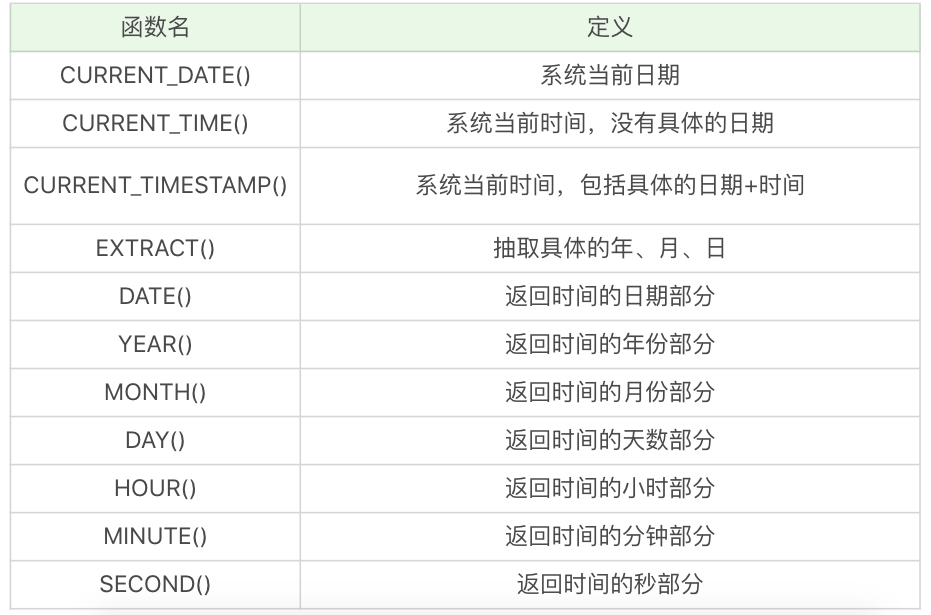

下面是一些简单的例子，你可自己运行下：

`SELECT CURRENT_DATE()`，运行结果为 2019-04-03。

`SELECT CURRENT_TIME()`，运行结果为 21:26:34。

`SELECT CURRENT_TIMESTAMP()`，运行结果为 2019-04-03 21:26:34。

`SELECT EXTRACT(YEAR FROM '2019-04-03')`，运行结果为 2019。

`SELECT DATE('2019-04-01 12:00:05')`，运行结果为 2019-04-01。

这里需要注意的是，DATE 日期格式必须是 yyyy-mm-dd 的形式。如果要进行日期比较，就要使用 DATE 函数，不要直接使用日期与字符串进行比较，我会在后面的例子中讲具体的原因。

#### 转换函数

转换函数可以转换数据之间的类型，常用的函数如下表所示：


这两个函数不像其他函数，看一眼函数名就知道代表什么、如何使用。下面举了这两个函数的例子，你需要自己运行下：

`SELECT CAST(123.123 AS INT)`，运行结果会报错。

`SELECT CAST(123.123 AS DECIMAL(8,2))`，运行结果为 123.12。

`SELECT COALESCE(null,1,2)`，运行结果为 1。

CAST 函数在转换数据类型的时候，不会四舍五入，如果原数值有小数，那么转换为整数类型的时候就会报错。不过你可以指定转化的小数类型，在 MySQL 和 SQL Server 中，你可以用`DECIMAL(a,b)`来指定，其中 a 代表整数部分和小数部分加起来最大的位数，b 代表小数位数，比如`DECIMAL(8,2)`代表的是精度为 8 位（整数加小数位数最多为 8 位），小数位数为 2 位的数据类型。所以`SELECT CAST(123.123 AS DECIMAL(8,2))`的转换结果为 123.12。

#### 用 SQL 函数对王者荣耀英雄数据做处理

显示英雄以及他的物攻成长，对应字段为`attack_growth`。我们让这个字段精确到小数点后一位，需要使用的是算术函数里的 ROUND 函数。

```sql
SELECT name, ROUND(attack_growth,1) FROM heros
```

代码中，`ROUND(attack_growth,1)`中的`attack_growth`代表想要处理的数据，“1”代表四舍五入的位数，也就是我们这里需要精确到的位数。

运行结果为：


假设我们想显示英雄最大生命值的最大值，就需要用到 MAX 函数。在数据中，“最大生命值”对应的列数为`hp_max`，在代码中的格式为`MAX(hp_max)`。

```sql
SELECT MAX(hp_max) FROM heros
```

运行结果为 9328。

假如我们想要知道最大生命值最大的是哪个英雄，以及对应的数值，就需要分成两个步骤来处理：首先找到英雄的最大生命值的最大值，即`SELECT MAX(hp_max) FROM heros`，然后再筛选最大生命值等于这个最大值的英雄，如下所示。

```sql
SELECT name, hp_max FROM heros WHERE hp_max = (SELECT MAX(hp_max) FROM heros)
```

运行结果：


假如我们想显示英雄的名字，以及他们的名字字数，需要用到`CHAR_LENGTH`函数。

```sql
SELECT CHAR_LENGTH(name), name FROM heros
```

运行结果为：

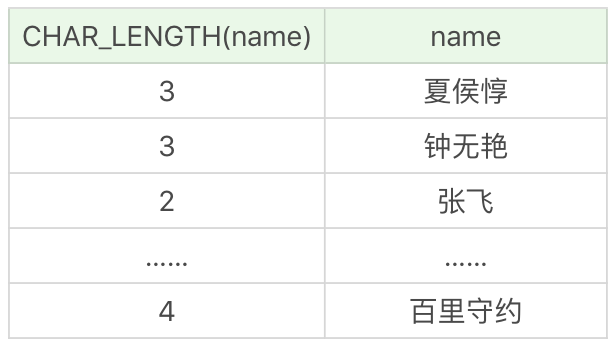

假如想要提取英雄上线日期（对应字段 birthdate）的年份，只显示有上线日期的英雄即可（有些英雄没有上线日期的数据，不需要显示），这里我们需要使用 EXTRACT 函数，提取某一个时间元素。所以我们需要筛选上线日期不为空的英雄，即`WHERE birthdate is not null`，然后再显示他们的名字和上线日期的年份，即：

```sql
SELECT name, EXTRACT(YEAR FROM birthdate) AS birthdate FROM heros WHERE birthdate is NOT NULL
```

或者使用如下形式：

```sql
SELECT name, YEAR(birthdate) AS birthdate FROM heros WHERE birthdate is NOT NULL
```

运行结果为：


假设我们需要找出在 2016 年 10 月 1 日之后上线的所有英雄。这里我们可以采用 DATE
函数来判断 birthdate 的日期是否大于 2016-10-01，即WHERE
DATE(birthdate)>'2016-10-01'，然后再显示符合要求的全部字段信息，即： 

```sql
SELECT * FROM heros WHERE DATE(birthdate)>'2016-10-01'
```

需要注意的是下面这种写法是不安全的 

```sql
SELECT * FROM heros WHERE birthdate>'2016-10-01
```

因为很多时候你无法确认 birthdate 的数据类型是字符串，还是 datetime 类型，如果你想
对日期部分进行比较，那么使用DATE(birthdate)来进行比较是更安全的。 

运行结果为 

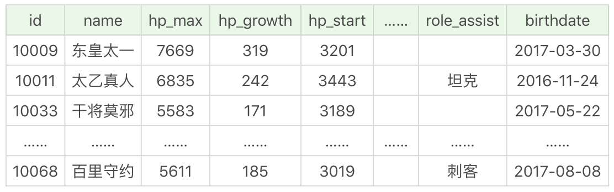

假设我们需要知道在 2016 年 10 月 1 日之后上线英雄的平均最大生命值、平均最大法力和最高物攻最大值。同样我们需要先筛选日期条件，即`WHERE DATE(birthdate)>'2016-10-01'`，然后再选择`AVG(hp_max), AVG(mp_max), MAX(attack_max)`字段进行显示。

```sql
SELECT AVG(hp_max), AVG(mp_max), MAX(attack_max) FROM heros WHERE DATE(birthdate)>'2016-10-01'
```

运行结果为：


#### 为什么使用 SQL 函数会带来问题 

尽管 SQL 函数使用起来会很方便，但我们使用的时候还是要谨慎，因为你使用的函数很可能在运行环境中无法工作，这是为什么呢？

如果你学习过编程语言，就会知道语言是有不同版本的，比如 Python 会有 2.7 版本和 3.x 版本，不过它们之间的函数差异不大，也就在 10% 左右。但我们在使用 SQL 语言的时候，不是直接和这门语言打交道，而是通过它使用不同的数据库软件，即 DBMS。DBMS 之间的差异性很大，远大于同一个语言不同版本之间的差异。实际上，只有很少的函数是被 DBMS 同时支持的。比如，大多数 DBMS 使用（||）或者（+）来做拼接符，而在 MySQL 中的字符串拼接函数为`Concat()`。大部分 DBMS 会有自己特定的函数，这就意味着采用 SQL 函数的代码可移植性是很差的，因此在使用函数的时候需要特别注意。

#### 关于大小写的规范

细心的人可能会发现，我在写 SELECT 语句的时候用的是大写，而你在网上很多地方，包括你自己写的时候可能用的是小写。实际上在 SQL 中，关键字和函数名是不用区分字母大小写的，比如 SELECT、WHERE、ORDER、GROUP BY 等关键字，以及 ABS、MOD、ROUND、MAX 等函数名。

不过在 SQL 中，你还是要确定大小写的规范，因为在 Linux 和 Windows 环境下，你可能会遇到不同的大小写问题。

比如 MySQL 在 Linux 的环境下，数据库名、表名、变量名是严格区分大小写的，而字段名是忽略大小写的。

而 MySQL 在 Windows 的环境下全部不区分大小写。

这就意味着如果你的变量名命名规范没有统一，就可能产生错误。这里有一个有关命名规范的建议：

1. 关键字和函数名称全部大写；
2. 数据库名、表名、字段名称全部小写；
3. SQL 语句必须以分号结尾。

虽然关键字和函数名称在 SQL 中不区分大小写，也就是如果小写的话同样可以执行，但是数据库名、表名和字段名在 Linux MySQL 环境下是区分大小写的，因此建议你统一这些字段的命名规则，比如全部采用小写的方式。同时将关键词和函数名称全部大写，以便于区分数据库名、表名、字段名。


### 什么是SQL的聚集函数，如何利用它们汇总表的数据？

我们上节课讲到了 SQL 函数，包括算术函数、字符串函数、日期函数和转换函数。实际上 SQL 函数还有一种，叫做聚集函数，它是对一组数据进行汇总的函数，输入的是一组数据的集合，输出的是单个值。通常我们可以利用聚集函数汇总表的数据，如果稍微复杂一些，我们还需要先对数据做筛选，然后再进行聚集，比如先按照某个条件进行分组，对分组条件进行筛选，然后得到筛选后的分组的汇总信息。

有关今天的内容，你重点需要掌握以下几个方面：

1. 聚集函数都有哪些，能否在一条 SELECT 语句中使用多个聚集函数；
2. 如何对数据进行分组，并进行聚集统计；
3. 如何使用 HAVING 过滤分组，HAVING 和 WHERE 的区别是什么。

#### 聚集函数都有哪些

SQL 中的聚集函数一共包括 5 个，可以帮我们求某列的最大值、最小值和平均值等，它们分别是：


这些函数你可能已经接触过，我们再来简单复习一遍。我们继续使用 heros 数据表，对王者荣耀的英雄数据进行聚合。

如果我们想要查询最大生命值大于 6000 的英雄数量。

```sql
SELECT COUNT(*) FROM heros WHERE hp_max > 6000
```

运行结果为 41。

如果想要查询最大生命值大于 6000，且有次要定位的英雄数量，需要使用 COUNT 函数。

```sql
SELECT COUNT(role_assist) FROM heros WHERE hp_max > 6000
```

运行结果是 23。

需要说明的是，有些英雄没有次要定位，即 role_assist 为 NULL，这时`COUNT(role_assist)`会忽略值为 NULL 的数据行，而 COUNT(*) 只是统计数据行数，不管某个字段是否为 NULL。

如果我们想要查询射手（主要定位或者次要定位是射手）的最大生命值的最大值是多少，需要使用 MAX 函数。

```sql
SELECT MAX(hp_max) FROM heros WHERE role_main = '射手' or role_assist = '射手'
```

运行结果为 6014。


你能看到，上面的例子里，都是在一条 SELECT 语句中使用了一次聚集函数，实际上我们也可以在一条 SELECT 语句中进行多项聚集函数的查询，比如我们想知道射手（主要定位或者次要定位是射手）的英雄数、平均最大生命值、法力最大值的最大值、攻击最大值的最小值，以及这些英雄总的防御最大值等汇总数据。

如果想要知道英雄的数量，我们使用的是 COUNT(*) 函数，求平均值、最大值、最小值，以及总的防御最大值，我们分别使用的是 AVG、MAX、MIN 和 SUM 函数。另外我们还需要对英雄的主要定位和次要定位进行筛选，使用的是`WHERE role_main = '射手' or role_assist = '射手'`。

```sql
SELECT COUNT(*), AVG(hp_max), MAX(mp_max), MIN(attack_max), SUM(defense_max) FROM heros WHERE role_main = '射手' or role_assist = '射手'
```

运行结果：

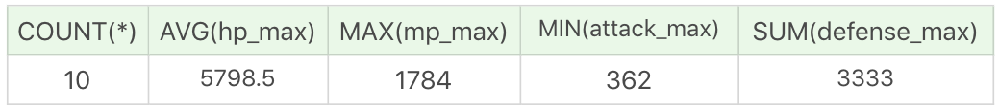

需要说明的是 AVG、MAX、MIN 等聚集函数会自动忽略值为 NULL 的数据行，MAX 和 MIN 函数也可以用于字符串类型数据的统计，如果是英文字母，则按照 A—Z 的顺序排列，越往后，数值越大。如果是汉字则按照全拼拼音进行排列。比如：

```sql
SELECT MIN(CONVERT(name USING gbk)), MAX(CONVERT(name USING gbk)) FROM heros
```

运行结果：


需要说明的是，我们需要先把 name 字段统一转化为 gbk 类型，使用CONVERT(nameUSING gbk)，然后再使用 MIN 和 MAX 取最小值和最大值。 

我们也可以对数据行中不同的取值进行聚集，先用 DISTINCT 函数取不同的数据，然后再使用聚集函数。比如我们想要查询不同的生命最大值的英雄数量是多少。

```sql
SELECT COUNT(DISTINCT hp_max) FROM heros
```

运行结果为 61。

实际上在 heros 这个数据表中，一共有 69 个英雄数量，生命最大值不一样的英雄数量是 61 个。


假如我们想要统计不同生命最大值英雄的平均生命最大值，保留小数点后两位。首先需要取不同生命最大值，即`DISTINCT hp_max`，然后针对它们取平均值，即`AVG(DISTINCT hp_max)`，最后再针对这个值保留小数点两位，也就是`ROUND(AVG(DISTINCT hp_max), 2)`。

```sql
SELECT ROUND(AVG(DISTINCT hp_max), 2) FROM heros
```

运行结果为 6653.84。

你能看到，如果我们不使用 DISTINCT 函数，就是对全部数据进行聚集统计。如果使用了 DISTINCT 函数，就可以对数值不同的数据进行聚集。一般我们使用 MAX 和 MIN 函数统计数据行的时候，不需要再额外使用 DISTINCT，因为使用 DISTINCT 和全部数据行进行最大值、最小值的统计结果是相等的。


#### 如何对数据进行分组，并进行聚集统计


我们在做统计的时候，可能需要先对数据按照不同的数值进行分组，然后对这些分好的组进行聚集统计。对数据进行分组，需要使用 GROUP BY 子句。

比如我们想按照英雄的主要定位进行分组，并统计每组的英雄数量。

```sql
 SELECT COUNT(*), role_main FROM heros GROUP BY role_main
```

运行结果（6 条记录）：

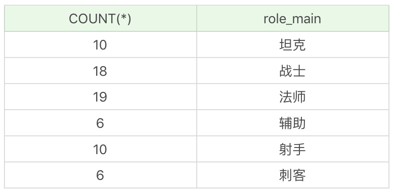

如果我们想要对英雄按照次要定位进行分组，并统计每组英雄的数量。

```sql
SELECT COUNT(*), role_assist FROM heros GROUP BY role_assist
```

运行结果：（6 条记录）


你能看出如果字段为 NULL，也会被列为一个分组。在这个查询统计中，次要定位为 NULL，即只有一个主要定位的英雄是 40 个。


我们也可以使用多个字段进行分组，这就相当于把这些字段可能出现的所有的取值情况都进行分组。比如，我们想要按照英雄的主要定位、次要定位进行分组，查看这些英雄的数量，并按照这些分组的英雄数量从高到低进行排序。

```sql
SELECT COUNT(*) as num, role_main, role_assist FROM heros GROUP BY role_main, role_assist ORDER BY num DESC
```

运行结果：（19 条记录）

 

#### 如何使用 HAVING 过滤分组，它与 WHERE 的区别是什么？ 

当我们创建出很多分组的时候，有时候就需要对分组进行过滤。你可能首先会想到 WHERE 子句，实际上过滤分组我们使用的是 HAVING。HAVING 的作用和 WHERE 一样，都是起到过滤的作用，只不过 WHERE 是用于数据行，而 HAVING 则作用于分组。

比如我们想要按照英雄的主要定位、次要定位进行分组，并且筛选分组中英雄数量大于 5 的组，最后按照分组中的英雄数量从高到低进行排序。

首先我们需要获取的是英雄的数量、主要定位和次要定位，即`SELECT COUNT(*) as num, role_main, role_assist`。然后按照英雄的主要定位和次要定位进行分组，即`GROUP BY role_main, role_assist`，同时我们要对分组中的英雄数量进行筛选，选择大于 5 的分组，即`HAVING num > 5`，然后按照英雄数量从高到低进行排序，即`ORDER BY num DESC`。

```sql
SELECT COUNT(*) as num, role_main, role_assist FROM heros GROUP BY role_main, role_assist HAVING num > 5 ORDER BY num DESC
```

运行结果：（4 条记录）

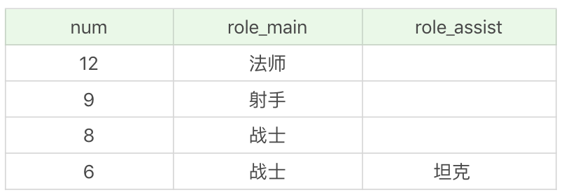

你能看到还是上面这个分组，只不过我们按照数量进行了过滤，筛选了数量大于 5 的分组进行输出。如果把 HAVING 替换成了 WHERE，SQL 则会报错。对于分组的筛选，我们一定要用 HAVING，而不是 WHERE。另外你需要知道的是，HAVING 支持所有 WHERE 的操作，因此所有需要 WHERE 子句实现的功能，你都可以使用 HAVING 对分组进行筛选。


我们再来看个例子，通过这个例子查看一下 WHERE 和 HAVING 进行条件过滤的区别。筛选最大生命值大于 6000 的英雄，按照主要定位、次要定位进行分组，并且显示分组中英雄数量大于 5 的分组，按照数量从高到低进行排序。

```sql
SELECT COUNT(*) as num, role_main, role_assist FROM heros WHERE hp_max > 6000 GROUP BY role_main, role_assist HAVING num > 5 ORDER BY num DESC
```

运行结果：（2 条记录）

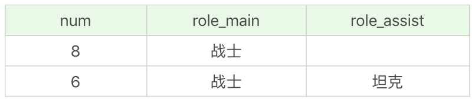

你能看到，还是针对上一个例子的查询，只是我们先增加了一个过滤条件，即筛选最大生命值大于 6000 的英雄。这里我们就需要先使用 WHERE 子句对最大生命值大于 6000 的英雄进行条件过滤，然后再使用 GROUP BY 进行分组，使用 HAVING 进行分组的条件判断，然后使用 ORDER BY 进行排序。

#### 总结

**你要记住，在 SELECT 查询中，关键字的顺序是不能颠倒的，它们的顺序是：**

SELECT ... FROM ... WHERE ... GROUP BY ... HAVING ... ORDER BY ...

另外需要注意的是，使用 GROUP BY 进行分组，如果想让输出的结果有序，可以在 GROUP BY 后使用 ORDER BY。因为 GROUP BY 只起到了分组的作用，排序还是需要通过 ORDER BY 来完成。


### 子查询：子查询的种类都有哪些，如何提高子查询的性能？

上节课我讲到了聚集函数，以及如何对数据进行分组统计，可以说我们之前讲的内容都是围绕单个表的 SELECT 查询展开的，实际上 SQL 还允许我们进行子查询，也就是嵌套在查询中的查询。这样做的好处是可以让我们进行更复杂的查询，同时更加容易理解查询的过程。因为很多时候，我们无法直接从数据表中得到查询结果，需要从查询结果集中再次进行查询，才能得到想要的结果。这个“查询结果集”就是今天我们要讲的子查询。

通过今天的文章，我希望你可以掌握以下的内容：

1. 子查询可以分为关联子查询和非关联子查询。我会举一个 NBA 数据库查询的例子，告诉你什么是关联子查询，什么是非关联子查询；
2. 子查询中有一些关键词，可以方便我们对子查询的结果进行比较。比如存在性检测子查询，也就是 EXISTS 子查询，以及集合比较子查询，其中集合比较子查询关键词有 IN、SOME、 ANY 和 ALL，这些关键词在子查询中的作用是什么；
3. 子查询也可以作为主查询的列，我们如何使用子查询作为计算字段出现在 SELECT 查询中呢？

#### 什么是关联子查询，什么是非关联子查询

子查询虽然是一种嵌套查询的形式，不过我们依然可以依据子查询是否执行多次，从而将子查询划分为关联子查询和非关联子查询。

子查询从数据表中查询了数据结果，如果这个数据结果只执行一次，然后这个数据结果作为主查询的条件进行执行，那么这样的子查询叫做非关联子查询。

 同样，如果子查询需要执行多次，即采用循环的方式，先从外部查询开始，每次都传入子查询进行查询，然后再将结果反馈给外部，这种嵌套的执行方式就称为关联子查询。

单说概念有点抽象，我们用数据表举例说明一下。这里我创建了 NBA 球员数据库，SQL 文件你可以从[GitHub](https://github.com/cystanford/sql_nba_data)上下载。

文件中一共包括了 5 张表，player 表为球员表，team 为球队表，team_score 为球队比赛表，player_score 为球员比赛成绩表，height_grades 为球员身高对应的等级表。

其中 player 表，也就是球员表，一共有 37 个球员，如下所示：


team 表为球队表，一共有 3 支球队，如下所示：

 	

team_score 表为球队比赛成绩表，一共记录了两场比赛的成绩，如下所示： 

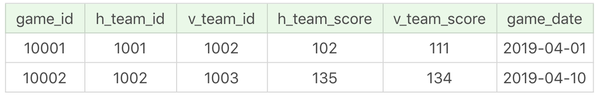

player_score 表为球员比赛成绩表，记录了一场比赛中球员的表现。这张表一共包括 19 个字段，代表的含义如下：

 		

其中 shoot_attempts 代表总出手的次数，它等于二分球出手和三分球出手次数的总和。比如 2019 年 4 月 1 日，韦恩·艾灵顿在底特律活塞和印第安纳步行者的比赛中，总出手次数为 19，总命中 10，三分球 13 投 4 中，罚球 4 罚 2 中，因此总分 score=(10-4)×2+4×3+2=26，也就是二分球得分 12+ 三分球得分 12+ 罚球得分 2=26。

需要说明的是，通常在工作中，数据表的字段比较多，一开始创建的时候会知道每个字段的定义，过了一段时间再回过头来看，对当初的定义就不那么确定了，容易混淆字段，解决这一问题最好的方式就是做个说明文档，用实例举例。

比如 shoot_attempts 是总出手次数（这里的总出手次数 = 二分球出手次数 + 三分球出手次数，不包括罚球的次数），用上面提到的韦恩·艾灵顿的例子做补充说明，再回过头来看这张表的时候，就可以很容易理解每个字段的定义了。

我们以 NBA 球员数据表为例，假设我们想要知道哪个球员的身高最高，最高身高是多少，就可以采用子查询的方式：

```sql
SQL: SELECT player_name, height FROM player WHERE height = (SELECT max(height) FROM player)
```

运行结果：（1 条记录）

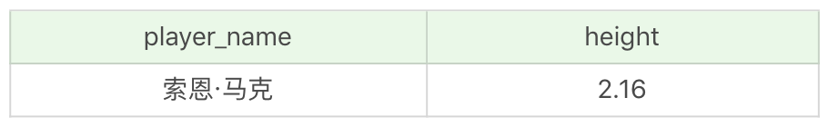

你能看到，通过`SELECT max(height) FROM player`可以得到最高身高这个数值，结果为 2.16，然后我们再通过 player 这个表，看谁具有这个身高，再进行输出，这样的子查询就是非关联子查询。

如果子查询的执行依赖于外部查询，通常情况下都是因为子查询中的表用到了外部的表，并进行了条件关联，因此每执行一次外部查询，子查询都要重新计算一次，这样的子查询就称之为关联子查询。比如我们想要查找每个球队中大于平均身高的球员有哪些，并显示他们的球员姓名、身高以及所在球队 ID。

首先我们需要统计球队的平均身高，即`SELECT avg(height) FROM player AS b WHERE a.team_id = b.team_id`，然后筛选身高大于这个数值的球员姓名、身高和球队 ID，即：

```sql
SELECT player_name, height, team_id FROM player AS a WHERE height > (SELECT avg(height) FROM player AS b WHERE a.team_id = b.team_id)
```

运行结果：（18 条记录）

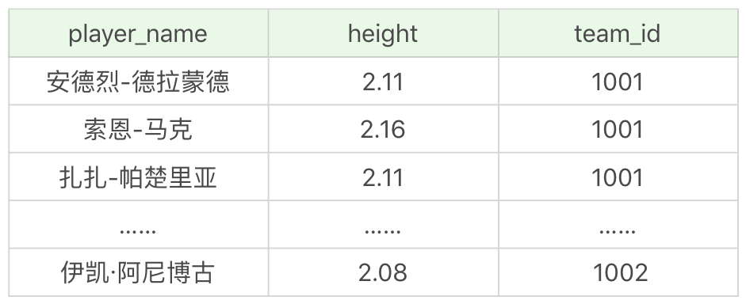

#### EXISTS 子查询

关联子查询通常也会和 EXISTS 一起来使用，EXISTS 子查询用来判断条件是否满足，满足的话为 True，不满足为 False。

比如我们想要看出场过的球员都有哪些，并且显示他们的姓名、球员 ID 和球队 ID。在这个统计中，是否出场是通过 player_score 这张表中的球员出场表现来统计的，如果某个球员在 player_score 中有出场记录则代表他出场过，这里就使用到了 EXISTS 子查询，即`EXISTS (SELECT player_id FROM player_score WHERE player.player_id = player_score.player_id)`，然后将它作为筛选的条件，实际上也是关联子查询，即：

```sql
SQL：SELECT player_id, team_id, player_name FROM player WHERE EXISTS (SELECT player_id FROM player_score WHERE player.player_id = player_score.player_id)

```

运行结果：（19 条记录）


同样，NOT EXISTS 就是不存在的意思，我们也可以通过 NOT EXISTS 查询不存在于 player_score 表中的球员信息，比如主表中的 player_id 不在子表 player_score 中，判断语句为`NOT EXISTS (SELECT player_id FROM player_score WHERE player.player_id = player_score.player_id)`。整体的 SQL 语句为：

```sql
SQL: SELECT player_id, team_id, player_name FROM player WHERE NOT EXISTS (SELECT player_id FROM player_score WHERE player.player_id = player_score.player_id)

```

运行结果：（18 条记录）


#### 集合比较子查询

集合比较子查询的作用是与另一个查询结果集进行比较，我们可以在子查询中使用 IN、ANY、ALL 和 SOME 操作符，它们的含义和英文意义一样：


还是通过上面那个例子，假设我们想要看出场过的球员都有哪些，可以采用 IN 子查询来进行操作：

```sql
SELECT player_id, team_id, player_name FROM player WHERE player_id in (SELECT player_id FROM player_score WHERE player.player_id = player_score.player_id)
```

你会发现运行结果和上面的是一样的，那么问题来了，既然 IN 和 EXISTS 都可以得到相同的结果，那么我们该使用 IN 还是 EXISTS 呢？

我们可以把这个模式抽象为：

```sql
SELECT * FROM A WHERE cc IN (SELECT cc FROM B)
```

```sql
SELECT * FROM A WHERE EXIST (SELECT cc FROM B WHERE B.cc=A.cc)
```

```
复制代码
```

实际上在查询过程中，在我们对 cc 列建立索引的情况下，我们还需要判断表 A 和表 B 的大小。在这里例子当中，表 A 指的是 player 表，表 B 指的是 player_score 表。如果表 A 比表 B 大，那么 IN 子查询的效率要比 EXIST 子查询效率高，因为这时 B 表中如果对 cc 列进行了索引，那么 IN 子查询的效率就会比较高。

同样，如果表 A 比表 B 小，那么使用 EXISTS 子查询效率会更高，因为我们可以使用到 A 表中对 cc 列的索引，而不用从 B 中进行 cc 列的查询。

了解了 IN 查询后，我们来看下 ANY 和 ALL 子查询。刚才讲到了 ANY 和 ALL 都需要使用比较符，比较符包括了（>）（=）（<）（>=）（<=）和（<>）等。


如果我们想要查询球员表中，比印第安纳步行者（对应的 team_id 为 1002）中任何一个球员身高高的球员的信息，并且输出他们的球员 ID、球员姓名和球员身高，该怎么写呢？首先我们需要找出所有印第安纳步行者队中的球员身高，即`SELECT height FROM player WHERE team_id = 1002`，然后使用 ANY 子查询即：

```java
SQL: SELECT player_id, player_name, height FROM player WHERE height > ANY (SELECT height FROM player WHERE team_id = 1002)
```

运行结果：（35 条记录）


运行结果为 35 条，你发现有 2 个人的身高是不如印第安纳步行者的所有球员的。

同样，如果我们想要知道比印第安纳步行者（对应的 team_id 为 1002）中所有球员身高都高的球员的信息，并且输出球员 ID、球员姓名和球员身高，该怎么写呢？

```sql
SQL: SELECT player_id, player_name, height FROM player WHERE height > ALL (SELECT height FROM player WHERE team_id = 1002)
```

运行结果：（1 条记录）


我们能看到比印第安纳步行者所有球员都高的球员，在 player 这张表（一共 37 个球员）中只有索恩·马克。

需要强调的是 ANY、ALL 关键字必须与一个比较操作符一起使用。因为如果你不使用比较操作符，就起不到集合比较的作用，那么使用 ANY 和 ALL 就没有任何意义。

#### 将子查询作为计算字段

我刚才讲了子查询的几种用法，实际上子查询也可以作为主查询的计算字段。比如我想查询每个球队的球员数，也就是对应 team 这张表，我需要查询相同的 team_id 在 player 这张表中所有的球员数量是多少。

```sql
SQL: SELECT team_name, (SELECT count(*) FROM player WHERE player.team_id = team.team_id) AS player_num FROM team
```

运行结果：（3 条记录）


你能看到，在 player 表中只有底特律活塞和印第安纳步行者的球员数据，所以它们的 player_num 不为 0，而亚特兰大老鹰的 player_num 等于 0。在查询的时候，我将子查询`SELECT count(*) FROM player WHERE player.team_id = team.team_id`作为了计算字段，通常我们需要给这个计算字段起一个别名，这里我用的是 player_num，因为子查询的语句比较长，使用别名更容易理解。

#### 总结

今天我讲解了子查询的使用，按照子查询执行的次数，我们可以将子查询分成关联子查询和非关联子查询，其中非关联子查询与主查询的执行无关，只需要执行一次即可，而关联子查询，则需要将主查询的字段值传入子查询中进行关联查询。

同时，在子查询中你可能会使用到 EXISTS、IN、ANY、ALL 和 SOME 等关键字。在某些情况下使用 EXISTS 和 IN 可以得到相同的效果，具体使用哪个执行效率更高，则需要看字段的索引情况以及表 A 和表 B 哪个表更大。同样，IN、ANY、ALL、SOME 这些关键字是用于集合比较的，SOME 是 ANY 的别名，当我们使用 ANY 或 ALL 的时候，一定要使用比较操作符。

最后，我讲解了如何使用子查询作为计算字段，把子查询的结果作为主查询的列。

SQL 中，子查询的使用大大增强了 SELECT 查询的能力，因为很多时候查询需要从结果集中获取数据，或者需要从同一个表中先计算得出一个数据结果，然后与这个数据结果（可能是某个标量，也可能是某个集合）进行比较。


### 常用的SQL标准有哪些，在SQL92中是如何使用连接的？

今天我主要讲解连接表的操作。在讲解之前，我想先给你介绍下连接（JOIN）在 SQL 中的重要性。

我们知道 SQL 的英文全称叫做 Structured Query Language，它有一个很强大的功能，就是能在各个数据表之间进行连接查询（Query）。这是因为 SQL 是建立在关系型数据库基础上的一种语言。关系型数据库的典型数据结构就是数据表，这些数据表的组成都是结构化的（Structured）。你可以把关系模型理解成一个二维表格模型，这个二维表格是由行（row）和列（column）组成的。每一个行（row）就是一条数据，每一列（column）就是数据在某一维度的属性。

正是因为在数据库中，表的组成是基于关系模型的，所以一个表就是一个关系。一个数据库中可以包括多个表，也就是存在多种数据之间的关系。而我们之所以能使用 SQL 语言对各个数据表进行复杂查询，核心就在于连接，它可以用一条 SELECT 语句在多张表之间进行查询。你也可以理解为，关系型数据库的核心之一就是连接。

既然连接在 SQL 中这么重要，那么针对今天的内容，需要你从以下几个方面进行掌握：

1. SQL 实际上存在不同的标准，不同标准下的连接定义也有不同。你首先需要了解常用的 SQL 标准有哪些；
2. 了解了 SQL 的标准之后，我们从 SQL92 标准入门，来看下连接表的种类有哪些；
3. 针对一个实际的数据库表，如果你想要做数据统计，需要学会使用跨表的连接进行操作。

#### 常用的 SQL 标准有哪些

在正式开始讲连接表的种类时，我们首先需要知道 SQL 存在不同版本的标准规范，因为不同规范下的表连接操作是有区别的。

SQL 有两个主要的标准，分别是 SQL92 和 SQL99。92 和 99 代表了标准提出的时间，SQL92 就是 92 年提出的标准规范。当然除了 SQL92 和 SQL99 以外，还存在 SQL-86、SQL-89、SQL:2003、SQL:2008、SQL:2011 和 SQL:2016 等其他的标准。

这么多标准，到底该学习哪个呢？实际上最重要的 SQL 标准就是 SQL92 和 SQL99。一般来说 SQL92 的形式更简单，但是写的 SQL 语句会比较长，可读性较差。而 SQL99 相比于 SQL92 来说，语法更加复杂，但可读性更强。我们从这两个标准发布的页数也能看出，SQL92 的标准有 500 页，而 SQL99 标准超过了 1000 页。实际上你不用担心要学习这么多内容，基本上从 SQL99 之后，很少有人能掌握所有内容，因为确实太多了。就好比我们使用 Windows、Linux 和 Office 的时候，很少有人能掌握全部内容一样。我们只需要掌握一些核心的功能，满足日常工作的需求即可。

#### 在 SQL92 中是如何使用连接的

相比于 SQL99，SQL92 规则更简单，更适合入门。在这篇文章中，我会先讲 SQL92 是如何对连接表进行操作的，下一篇文章再讲 SQL99，到时候你可以对比下这两者之间有什么区别。

在进行连接之前，我们需要用数据表做举例。这里我创建了 NBA 球员和球队两张表，SQL 文件你可以从[GitHub](https://github.com/cystanford/sql_nba_data)上下载。

其中 player 表为球员表，一共有 37 个球员，如下所示：


team 表为球队表，一共有 3 支球队，如下所示：

 

有了这两个数据表之后，我们再来看下 SQL92 中的 5 种连接方式，它们分别是笛卡尔积、等值连接、非等值连接、外连接（左连接、右连接）和自连接。


#### 笛卡尔积

笛卡尔乘积是一个数学运算。假设我有两个集合 X 和 Y，那么 X 和 Y 的笛卡尔积就是 X 和 Y 的所有可能组合，也就是第一个对象来自于 X，第二个对象来自于 Y 的所有可能。

我们假定 player 表的数据是集合 X，先进行 SQL 查询：

```sql
SELECT * FROM player
```

再假定 team 表的数据为集合 Y，同样需要进行 SQL 查询：

```sql
SELECT * FROM team
```

你会看到运行结果会显示出上面的两张表格。

接着我们再来看下两张表的笛卡尔积的结果，这是笛卡尔积的调用方式：

```sql
SQL: SELECT * FROM player, team
```

运行结果（一共 37*3=111 条记录）：


笛卡尔积也称为交叉连接，英文是 CROSS JOIN，它的作用就是可以把任意表进行连接，即使这两张表不相关。但我们通常进行连接还是需要筛选的，因此你需要在连接后面加上 WHERE 子句，也就是作为过滤条件对连接数据进行筛选。比如后面要讲到的等值连接。


#### 等值连接

两张表的等值连接就是用两张表中都存在的列进行连接。我们也可以对多张表进行等值连接。

针对 player 表和 team 表都存在 team_id 这一列，我们可以用等值连接进行查询。

```sql
SQL: SELECT player_id, player.team_id, player_name, height, team_name FROM player, team WHERE player.team_id = team.team_id
```

运行结果（一共 37 条记录）：


我们在进行等值连接的时候，可以使用表的别名，这样会让 SQL 语句更简洁：

```sql
SELECT player_id, a.team_id, player_name, height, team_name FROM player AS a, team AS b WHERE a.team_id = b.team_id

```

需要注意的是，如果我们使用了表的别名，在查询字段中就只能使用别名进行代替，不能使用原有的表名，比如下面的 SQL 查询就会报错：

```sql
SELECT player_id, player.team_id, player_name, height, team_name FROM player AS a, team AS b WHERE a.team_id = b.team_id
```


#### 非等值连接

当我们进行多表查询的时候，如果连接多个表的条件是等号时，就是等值连接，其他的运算符连接就是非等值查询。

这里我创建一个身高级别表height_grades,如下所示


我们知道 player 表中有身高 height 字段，如果想要知道每个球员的身高的级别，可以采用非等值连接查询。

```sql
SQL：SELECT p.player_name, p.height, h.height_level
FROM player AS p, height_grades AS h
WHERE p.height BETWEEN h.height_lowest AND h.height_highest

```

运行结果（37 条记录）：


#### 外连接

除了查询满足条件的记录以外，外连接还可以查询某一方不满足条件的记录。两张表的外连接，会有一张是主表，另一张是从表。如果是多张表的外连接，那么第一张表是主表，即显示全部的行，而第剩下的表则显示对应连接的信息。在 SQL92 中采用（+）代表从表所在的位置，而且在 SQL92 中，只有左外连接和右外连接，没有全外连接。

什么是左外连接，什么是右外连接呢？

左外连接，就是指左边的表是主表，需要显示左边表的全部行，而右侧的表是从表，（+）表示哪个是从表。

```sql
SQL：SELECT * FROM player, team where player.team_id = team.team_id(+)
```

相当于 SQL99 中的：

```sql
SQL：SELECT * FROM player LEFT JOIN team on player.team_id = team.team_id
```

右外连接，指的就是右边的表是主表，需要显示右边表的全部行，而左侧的表是从表。

```sql
SQL：SELECT * FROM player, team where player.team_id(+) = team.team_id
```

相当于 SQL99 中的：

```sql
SQL：SELECT * FROM player RIGHT JOIN team on player.team_id = team.team_id
```

需要注意的是，LEFT JOIN 和 RIGHT JOIN 只存在于 SQL99 及以后的标准中，在 SQL92 中不存在，只能用（+）表示。

#### 自连接

自连接可以对多个表进行操作，也可以对同一个表进行操作。也就是说查询条件使用了当前表的字段。

比如我们想要查看比布雷克·格里芬高的球员都有谁，以及他们的对应身高：

```sql
SQL：SELECT b.player_name, b.height FROM player as a , player as b WHERE a.player_name = '布雷克 - 格里芬' and a.height < b.height
```

运行结果（6 条记录）：


如果不用自连接的话，需要采用两次 SQL 查询。首先需要查询布雷克·格里芬的身高。

```sql
SQL：SELECT height FROM player WHERE player_name = '布雷克 - 格里芬'
```

运行结果为 2.08。

然后再查询比 2.08 高的球员都有谁，以及他们的对应身高：

```sql
SQL：SELECT player_name, height FROM player WHERE height > 2.08
```

运行结果和采用自连接的运行结果是一致的。

#### 总结

今天我讲解了常用的 SQL 标准以及 SQL92 中的连接操作。SQL92 和 SQL99 是经典的 SQL 标准，也分别叫做 SQL-2 和 SQL-3 标准。也正是在这两个标准发布之后，SQL 影响力越来越大，甚至超越了数据库领域。现如今 SQL 已经不仅仅是数据库领域的主流语言，还是信息领域中信息处理的主流语言。在图形检索、图像检索以及语音检索中都能看到 SQL 语言的使用。

除此以外，我们使用的主流 RDBMS，比如 MySQL、Oracle、SQL Sever、DB2、PostgreSQL 等都支持 SQL 语言，也就是说它们的使用符合大部分 SQL 标准，但很难完全符合，因为这些数据库管理系统都在 SQL 语言的基础上，根据自身产品的特点进行了扩充。即使这样，SQL 语言也是目前所有语言中半衰期最长的，在 1992 年，Windows3.1 发布，SQL92 标准也同时发布，如今我们早已不使用 Windows3.1 操作系统，而 SQL92 标准却一直持续至今。

当然我们也要注意到 SQL 标准的变化，以及不同数据库管理系统使用时的差别，比如 Oracle 对 SQL92 支持较好，而 MySQL 则不支持 SQL92 的外连接。

### SQL99是如何使用连接的，与SQL92的区别是什么？

上节课我们讲解了 SQL92 标准，在它之后又提出了 SQL99 标准。现在各大 DBMS 中对 SQL99 标准的支持度更好。你一定听说过 LEFT JOIN、RIGHT JOIN 这样的操作符，这实际上就是 SQL99 的标准，在 SQL92 中它们是用（+）代替的。SQL92 和 SQL99 标准原理类似，只是 SQL99 标准的可读性更强。

今天我就来讲解一下 SQL99 标准中的连接查询，在今天的课程中你需要重点掌握以下几方面的内容：

1. SQL99 标准下的连接查询是如何操作的？
2. SQL99 与 SQL92 的区别是什么？
3. 在不同的 DBMS 中，使用连接需要注意什么？

#### SQL99 标准中的连接查询

上一篇文章中，我用 NBA 球员的数据表进行了举例，包括了三张数据表 player、team 和 height_grades。

其中 player 表为球员表，一共有 37 个球员，如下所示：

 

接下来我们看下在 SQL99 标准中，是如何进行连接查询的？

####  交叉连接

交叉连接实际上就是 SQL92 中的笛卡尔乘积，只是这里我们采用的是 CROSS JOIN。

我们可以通过下面这行代码得到 player 和 team 这两张表的笛卡尔积的结果：

```sql
SELECT * FROM player CROSS JOIN team
```

运行结果


如果多张表进行交叉连接，有比如表t1,表t2，表t3进行交叉连接，又可以写成下面这样：

```sql
SELECT* FROM t1 CROSS JOIN t2 CROSS JOIN t3
```

#### 自然连接

你可以把自然连接理解为SQL92中的等值连接。他会帮你自动查询两张连接表中所有相同的字段，然后进行等值连接。

如果我们想把 player 表和 team 表进行等值连接，相同的字段是 team_id。还记得在 SQL92 标准中，是如何编写的么？

```sql
SELECT player_id, a.team_id, player_name, height, team_name FROM player as a, team as b WHERE a.team_id = b.team_id
```

在SQL 99中你可以写成：

```sql
SELECT player_id, team_id, player_name, height, team_name FROM player NATURAL JOIN team 
```

实际上，在 SQL99 中用 NATURAL JOIN 替代了 `WHERE player.team_id = team.team_id`。

####  ON 连接

ON连接用来指定我们想要的连接条件，针对上面的例子，它同样可以帮助我们实现自然连接的功能：

```sql
SELECT player_id, player.team_id, player_name, height, team_name FROM player JOIN team ON player.team_id = team.team_id
```

这里我们指定了连接条件是`ON player.team_id = team.team_id`，相当于是用 ON 进行了 team_id 字段的等值连接。

当然你也可以 ON 连接进行非等值连接，比如我们想要查询球员的身高等级，需要用 player 和 height_grades 两张表：

```sql
SQL99：SELECT p.player_name, p.height, h.height_level
FROM player as p JOIN height_grades as h
ON height BETWEEN h.height_lowest AND h.height_highest
```

这个语句的运行结果和我们之前采用 SQL92 标准的查询结果一样。

```sql
SQL92：SELECT p.player_name, p.height, h.height_level
FROM player AS p, height_grades AS h
WHERE p.height BETWEEN h.height_lowest AND h.height_highest
```

一般来说在 SQL99 中，我们需要连接的表会采用 JOIN 进行连接，ON 指定了连接条件，后面可以是等值连接，也可以采用非等值连接。

#### USING 连接

当我们进行连接的时候，可以用 USING 指定数据表里的同名字段进行等值连接。比如：

```sql
SELECT player_id, team_id, player_name, height, team_name FROM player JOIN team USING(team_id)
```

你能看出与自然连接 NATURAL JOIN 不同的是，USING 指定了具体的相同的字段名称，你需要在 USING 的括号 () 中填入要指定的同名字段。同时使用 JOIN USING 可以简化 JOIN ON 的等值连接，它与下面的 SQL 查询结果是相同的：

```sql
SELECT player_id, player.team_id, player_name, height, team_name FROM player JOIN team ON player.team_id = team.team_id
```

#### 外连接

SQL 99 的外连接包括了三种形式

1. 左外连接：LEFT JOIN 或 LEFT OUTER JOIN
2. 右外连接：RIGHT JOIN 或 RIGHT OUTER JOIN
3. 全外连接：FULL JOIN 或 FULL OUTER JOIN

我们在SQL92中讲解了左外连接、右外连接，在 SQL99 中还有全外连接。全外连接实际上就是左外连接和右外连接的结合。在这三种外连接中，我们一般省略 OUTER 不写。

1、左外连接

SQL 92

```SQL
SELECT * FROM player,team where play.team_id = team.team_id(+)
```

SQL 99

```sql
SELECT * FROM player LEFT JOIN team ON player.team_id = team.team_id
```

2、右外连接

SQL 92:

```sql
SELECT * FROM player,team WHERE player.team_id(+) = team.team_id
```

SQL 99:

```SQL
SELECT * FROM player RIGHT JOIN team ON  player.team_id =teamteam.team_id
```

3、全外连接

```sql
SELECT * FROM player FULL JOIN team ON player.team_id = team.team_id
```

需要注意的是MYSQL 不支持全外连接，否则的话全外连接会返回左表和右表中的所有行。当表之间有匹配的行，会显示内连接的结果。当某行在另一个表中没有匹配时，那么会把另一个表中选择的列显示为空值。

也就是说，全外连接的结果 = 左右表匹配的数据 + 左表没有匹配到的数据 + 右表没有匹配到的数据。

#### 自连接

自连接的原理在SQL 92 和SQL 99中都是一样的，只是表述方式不同。

比如我们想要查看比布雷克·格里芬身高高的球员都有哪些，在两个 SQL 标准下的查询如下。

SQL 92:

```sql
ELECT b.player_name, b.height FROM player as a , player as b WHERE a.player_name = '布雷克 - 格里芬' and a.height < b.height
```

**SQL99**

```sql
SELECT b.player_name, b.height FROM player as a JOIN player as b ON a.player_name = '布雷克 - 格里芬' and a.height < b.height
```

运行结果（6 条记录）：


#### SQL99 和 SQL92 的区别

至此我们讲解完了 SQL92 和 SQL99 标准下的连接查询，它们都对连接进行了定义，只是操作的方式略有不同。我们再来回顾下，这些连接操作基本上可以分成三种情况：

1. 内连接：将多个表之间满足连接条件的数据行查询出来。它包括了等值连接、非等值连接和自连接。
2. 外连接：会返回一个表中的所有记录，以及另一个表中匹配的行。它包括了左外连接、右外连接和全连接。
3. 交叉连接：也称为笛卡尔积，返回左表中每一行与右表中每一行的组合。在 SQL99 中使用的 CROSS JOIN。

不过 SQL92 在这三种连接操作中，和 SQL99 还存在着明显的区别。

首先我们看下 SQL92 中的 WHERE 和 SQL99 中的 JOIN。

你能看出在 SQL92 中进行查询时，会把所有需要连接的表都放到 FROM 之后，然后在 WHERE 中写明连接的条件。而 SQL99 在这方面更灵活，它不需要一次性把所有需要连接的表都放到 FROM 之后，而是采用 JOIN 的方式，每次连接一张表，可以多次使用 JOIN 进行连接。

另外，我建议多表连接使用 SQL99 标准，因为层次性更强，可读性更强，比如：

```sql
SELECT ...
FROM table1
    JOIN table2 ON table1 和 table2 的连接条件
        JOIN table3 ON table2 和 table3 的连接条件
```

它的嵌套逻辑类似我们使用的 FOR 循环：

```sql
for t1 in table1:
    for t2 in table2:
       if condition1:
           for t3 in table3:
              if condition2:
                  output t1 + t2 + t3
```

SQL99 采用的这种嵌套结构非常清爽，即使再多的表进行连接也都清晰可见。如果你采用 SQL92，可读性就会大打折扣。

最后一点就是，SQL99 在 SQL92 的基础上提供了一些特殊语法，比如 NATURAL JOIN 和 JOIN USING。它们在实际中是比较常用的，省略了 ON 后面的等值条件判断，让 SQL 语句更加简洁。

SQL 连接具有通用性，但是不同的 DBMS 在使用规范上会存在差异，在标准支持上也存在不同。在实际工作中，你需要参考你正在使用的 DBMS 文档，这里我整理了一些需要注意的常见的问题。

**1. 不是所有的 DBMS 都支持全外连接**

虽然 SQL99 标准提供了全外连接，但不是所有的 DBMS 都支持。不仅 MySQL 不支持，Access、SQLite、MariaDB 等数据库软件也不支持。不过在 Oracle、DB2、SQL Server 中是支持的。

**2.Oracle 没有表别名 AS**

为了让 SQL 查询语句更简洁，我们经常会使用表别名 AS，不过在 Oracle 中是不存在 AS 的，使用表别名的时候，直接在表名后面写上表别名即可，比如 player p，而不是 player AS p。

**3.SQLite 的外连接只有左连接**

SQLite 是一款轻量级的数据库软件，在外连接上只支持左连接，不支持右连接，不过如果你想使用右连接的方式，比如`table1 RIGHT JOIN table2`，在 SQLite 你可以写成`table2 LEFT JOIN table1`，这样就可以得到相同的效果。

除了一些常见的语法问题，还有一些关于连接的性能问题需要你注意：

**1. 控制连接表的数量**

多表连接就相当于嵌套 for 循环一样，非常消耗资源，会让 SQL 查询性能下降得很严重，因此不要连接不必要的表。在许多 DBMS 中，也都会有最大连接表的限制。

**2. 在连接时不要忘记 WHERE 语句**

多表连接的目的不是为了做笛卡尔积，而是筛选符合条件的数据行，因此在多表连接的时候不要忘记了 WHERE 语句，这样可以过滤掉不必要的数据行返回。

我们在查看比布雷克·格里芬高的球员都有谁的时候，可以使用子查询，也可以使用自连接。一般情况建议你使用自连接，因为在许多 DBMS 的处理过程中，对于自连接的处理速度要比子查询快得多。你可以这样理解：子查询实际上是通过未知表进行查询后的条件判断，而自连接是通过已知的自身数据表进行条件判断，因此在大部分 DBMS 中都对自连接处理进行了优化。

#### 总结

连接可以说是 SQL 中的核心操作，通过两篇文章的学习，你已经从多个维度对连接进行了了解。同时，我们对 SQL 的两个重要标准 SQL92 和 SQL99 进行了学习，在我们需要进行外连接的时候，建议采用 SQL99 标准，这样更适合阅读。

此外我还想强调一下，我们在进行连接的时候，使用的关系型数据库管理系统，之所以存在关系是因为各种数据表之间存在关联，它们并不是孤立存在的。在实际工作中，尤其是做业务报表的时候，我们会用到 SQL 中的连接操作（JOIN），因此我们需要理解和熟练掌握 SQL 标准中连接的使用，以及不同 DBMS 中对连接的语法规范。剩下要做的，就是通过做练习和实战来增强你的经验了，做的练习多了，也就自然有感觉了。


### 视图在SQL中的作用是什么，它是怎样工作的？

我们之前对 SQL 中的数据表查询进行了讲解，今天我们来看下如何对视图进行查询。视图，也就是我们今天要讲的虚拟表，本身是不具有数据的，它是 SQL 中的一个重要概念。从下面这张图中，你能看到，虚拟表的创建连接了一个或多个数据表，不同的查询应用都可以建立在虚拟表之上。


视图一方面可以帮我们使用表的一部分而不是所有的表，另一方面也可以针对不同的用户制定不同的查询视图。比如，针对一个公司的销售人员，我们只想给他看部分数据，而某些特殊的数据，比如采购的价格，则不会提供给他。

刚才讲的只是视图的一个使用场景，实际上视图还有很多作用，今天我们就一起学习下。今天的文章里，你将重点掌握以下的内容：

1. 什么是视图？如何创建、更新和删除视图？
2. 如何使用视图来简化我们的 SQL 操作？
3. 视图和临时表的区别是什么，它们各自有什么优缺点？

#### 如何创建，更新和删除视图

视图作为一张虚拟表，帮我们封装了底层与数据表的接口。它相当于是一张表或多张表的数据结果集。视图这一特点，可以帮我们简化复杂的SQL查询，比如在编写视图后，我们就可以直接重用它，而不需要考虑视图中包含的基础查询的细节。同样，我们也可以根据需要更改数据格式，返回与底层数据表格式不同的数据。

通常情况下，小型项目的数据库可以不使用视图，但是在大型项目中，以及数据表比较复杂的情况下，视图的价值就凸显出来了，它可以帮助我们把经常查询的结果集放到虚拟表中，提升使用效率。理解和使用起来都非常方便。

#### 创建视图：CREATE VIEW

那么该如何创建视图呢？创建视图的语法是：

```sql
CREATE VIEW view_name AS SELECT column1,column2 FROM table WHERE condition 
```

实际上就是我们在SQL查询语句的基础上封装了视图VIEW ,这样就会基于SQL语句的结果集形成一张虚拟表。其中view_name为视图名称，column1,column2 代表列名，condition代表查询过滤条件。

我们以NBA球员数据为例。我们想要查询比NBA球员平均身高高的球员有哪些，显示他们的球员ID和身高。假如我们给这个视图起个名字player_above_avg_height ,那么创建视图可以写成：

```sql
CTEATE VIEW play_above_avg_height AS 
SELECT player_id,height 
FROM player
WHERE height >(SELECT AVG(height) FROM player)
```

视图查询结果（18 条记录）：


d当视图创建之后，它相当于一个虚拟表，可以直接使用：

```sql
SELECT * FROM player_-above_avg_height
```

运行结果和上面一样。

#### 嵌套视图

```sql
CREATE VIEW player_above_above_avg_height AS
SELECT player_id, height
FROM player
WHERE height > (SELECT AVG(height) from player_above_avg_height)
```

视图查询结果（11 条记录）：


你能看到这个视图的数据记录数为 11 个，比之前的记录少了 7 个。

#### 修改视图：ALTER VIEW

修改视图的语法是：

```sql
ALTER VIEW view_name AS
SELECT column1, column2
FROM table
WHERE condition
```

你能看出来它的语法和创建视图一样，只是对原有视图的更新。比如我们想更新视图 player_above_avg_height，增加一个 player_name 字段，可以写成：

```sql
ALTER VIEW player_above_avg_height AS
SELECT player_id, player_name, height
FROM player
WHERE height > (SELECT AVG(height) from player)
```

这样的话，下次再对视图进行查询的时候，视图结果就进行了更新。

```sql
SELECT * FROM player_above_avg_height
```

运行结果（18 条记录）：


#### 删除视图：DROP VIEW

删除视图的语法是：

```
DROP VIEW view_name
```

比如我们想把刚才创建的视图删除，可以使用：

```sql
DROP VIEW player_above_avg_height
```

需要说明的是，SQLite 不支持视图的修改，仅支持只读视图，也就是说你只能使用 CREATE VIEW 和 DROP VIEW，如果想要修改视图，就需要先 DROP 然后再 CREATE。

#### 如何使用视图简化 SQL 操作

从上面这个例子中，你能看出视图就是对 SELECT 语句进行了封装，方便我们重用它们。下面我们再来看几个视图使用的例子。

##### 利用视图完成复杂的连接

我在讲解 SQL99 标准连接操作的时候，举了一个 NBA 球员和身高等级连接的例子，有两张表，分别为 player 和 height_grades。其中 height_grades 记录了不同身高对应的身高等级。这里我们可以通过创建视图，来完成球员以及对应身高等级的查询。

首先我们对 player 表和 height_grades 表进行连接，关联条件是球员的身高 height（在身高等级表规定的最低身高和最高身高之间），这样就可以得到这个球员对应的身高等级，对应的字段为 height_level。然后我们通过 SELECT 得到我们想要查询的字段，分别为球员姓名 player_name、球员身高 height，还有对应的身高等级 height_level。然后把取得的查询结果集放到视图 player_height_grades 中，即：

```sql
CREATE VIEW player_height_grades AS
SELECT p.player_name, p.height, h.height_level
FROM player as p JOIN height_grades as h
ON height BETWEEN h.height_lowest AND h.height_highest
```

以后我们进行查询的时候，可以直接通过视图查询，比如我想查询身高介于 1.90m 和 2.08m 之间的球员及他们对应的身高：

```sql
SELECT * FROM player_height_grades WHERE height >= 1.90 AND height <= 2.08

```

这样就把一个相对复杂的连接查询转化成了视图查询。

##### 利用视图对数据进行格式化

我们经常需要输出某个格式的内容，比如我们想输出球员姓名和对应的球队，对应格式为 player_name(team_name)，就可以使用视图来完成数据格式化的操作：

```sql
CREATE VIEW player_team AS 
SELECT CONCAT(player_name, '(' , team.team_name , ')') AS player_team FROM player JOIN team WHERE player.team_id = team.team_id
```

首先我们将 player 表和 team 表进行连接，关联条件是相同的 team_id。我们想要的格式是`player_name(team_name)`，因此我们使用 CONCAT 函数，即`CONCAT(player_name, '(' , team.team_name , ')')`，将 player_name 字段和 team_name 字段进行拼接，得到了拼接值被命名为 player_team 的字段名，将它放到视图 player_team 中。

这样的话，我们直接查询视图，就可以得到格式化后的结果：

```sql
SELECT * FROM player_team
```

运行结果（37 条记录）：


##### 使用视图与计算字段

我们在数据查询中，有很多统计的需求可以通过视图来完成。正确地使用视图可以帮我们简化复杂的数据处理

我以球员比赛成绩表为例，对应的是 player_score 表。这张表中一共有 19 个字段，它们代表的含义如下：


如果我想要统计每位球员在每场比赛中的二分球、三分球和罚球的得分，可以通过创建视图完成：

```sql
CREATE VIEW game_player_score AS
SELECT game_id, player_id, (shoot_hits-shoot_3_hits)*2 AS shoot_2_points, shoot_3_hits*3 AS shoot_3_points, shoot_p_hits AS shoot_p_points, score  FROM player_score
```

然后通过查询视图就可以完成。

```sql
SELECT * FROM game_player_score
```

运行结果（19 条记录）：


你能看出正确使用视图可以简化复杂的 SQL 查询，让 SQL 更加清爽易用。不过有一点需要注意，视图是虚拟表，它只是封装了底层的数据表查询接口，因此有些 RDBMS 不支持对视图创建索引（有些 RDBMS 则支持，比如新版本的 SQL Server）

#### 总结

今天我讲解了视图的使用，包括创建，修改和删除视图。使用视图有很多好处，比如安全、简单清晰。

1. 安全性：虚拟表是基于底层数据表的，我们在使用视图时，一般不会轻易通过视图对底层数据进行修改，即使是使用单表的视图，也会受到限制，比如计算字段，类型转换等是无法通过视图来对底层数据进行修改的，这也在一定程度上保证了数据表的数据安全性。同时，我们还可以针对不同用户开放不同的数据查询权限，比如人员薪酬是个敏感的字段，那么只给某个级别以上的人员开放，其他人的查询视图中则不提供这个字段。
2. 简单清晰：视图是对 SQL 查询的封装，它可以将原本复杂的 SQL 查询简化，在编写好查询之后，我们就可以直接重用它而不必要知道基本的查询细节。同时我们还可以在视图之上再嵌套视图。这样就好比我们在进行模块化编程一样，不仅结构清晰，还提升了代码的复用率。

另外，我们也需要了解到视图是虚拟表，本身不存储数据，如果想要通过视图对底层数据表的数据进行修改也会受到很多限制，通常我们是把视图用于查询，也就是对 SQL 查询的一种封装。那么它和临时表又有什么区别呢？在实际工作中，我们可能会见到各种临时数据。比如你可能会问，如果我在做一个电商的系统，中间会有个购物车的功能，需要临时统计购物车中的商品和金额，那该怎么办呢？这里就需要用到临时表了，临时表是真实存在的数据表，不过它不用于长期存放数据，只为当前连接存在，关闭连接后，临时表就会自动释放。


### 什么是存储过程，在实际项目中用得多么？

今天我来讲一下 SQL 的存储过程，它是 SQL 中另一个重要应用，和视图一样，都是对 SQL 代码进行封装，可以反复利用。它和视图有着同样的优点，清晰、安全，还可以减少网络传输量。不过它和视图不同，视图是虚拟表，通常不对底层数据表直接操作，而存储过程是程序化的 SQL，可以直接操作底层数据表，相比于面向集合的操作方式，能够实现一些更复杂的数据处理。存储过程可以说是由 SQL 语句和流控制语句构成的语句集合，它和我们之前学到的函数一样，可以接收输入参数，也可以返回输出参数给调用者，返回计算结果

今天有关存储过程的内容，你将重点掌握以下几个部分：

1. 什么是存储过程，如何创建一个存储过程？
2. 流控制语句都有哪些，如何使用它们？
3. 各大公司是如何看待存储过程的？在实际工作中，我们该如何使用存储过程？

#### 什么是存储过程，如何创建一个存储过程

存储过程的英文是 Stored Procedure。它的思想很简单，就是 SQL 语句的封装。一旦存储过程被创建出来，使用它就像使用函数一样简单，我们直接通过调用存储过程名即可。我在前面讲过，存储过程实际上由 SQL 语句和流控制语句共同组成。流控制语句都有哪些呢？这个我稍后讲解。

我们先来看下如何定义一个存储过程：

在这里，我们使用 CREATE PROCEDURE 创建一个存储过程，后面是存储过程的名称，以及过程所带的参数，可以包括输入参数和输出参数。最后由 BEGIN 和 END 来定义我们所要执行的语句块。

和视图一样，我们可以删除已经创建的存储过程，使用的是 DROP PROCEDURE。如果要更新存储过程，我们需要使用 ALTER PROCEDURE。

讲完了如何创建，更新和删除一个存储过程，下面我们来看下如何实现一个简单的存储过程。比如我想做一个累加运算，计算 1+2+…+n 等于多少，我们可以通过参数 n 来表示想要累加的个数，那么如何用存储过程实现这一目的呢？这里我做一个 add_num 的存储过程，具体的代码如下：

```sql
CREATE PROCEDURE `add_num`(IN n INT)
BEGIN
       DECLARE i INT;
       DECLARE sum INT;
       
       SET i = 1;
       SET sum = 0;
       WHILE i <= n DO
              SET sum = sum + i;
              SET i = i +1;
       END WHILE;
       SELECT sum;
END
```


当我们需要再次使用这个存储过程的时候，直接使用 `CALL add_num(50);`即可。这里我传入的参数为 50，也就是统计 1+2+…+50 的积累之和，查询结果为：


这就是一个简单的存储过程，除了理解1+2+...+n的实现过程，还需要两点你需要理解，一个是DELIMITER定义语句的结束符，另一个是存储过程的三种参数类型。

让我们先来看下DELIMITER的作用，如果你使用Navicat这个工具来管理MySQL执行存储过程，那临时么直接执行上面这段代码就可以了。如果用的是MySQL,你还需要用DELIMITER来临时定义新的结束符 。因为默认情况下SQL采用(;)作为结束符，这样存储过程中每一句SQL结束之后，采用（；）作为结束符，就相当于告诉 SQL 可以执行这一句了。但是存储过程是一个整体，我们不希望 SQL 逐条执行，而是采用存储过程整段执行的方式，因此我们就需要临时定义新的 DELIMITER，新的结束符可以用（//）或者（$$）。如果你用的是 MySQL，那么上面这段代码，应该写成下面这样：

```sql
DELIMITER //
CREATE PROCEDURE `add_num`(IN n INT)
BEGIN
       DECLARE i INT;
       DECLARE sum INT;
       
       SET i = 1;
       SET sum = 0;
       WHILE i <= n DO
              SET sum = sum + i;
              SET i = i +1;
       END WHILE;
       SELECT sum;
END //
DELIMITER ;
```

首先我用（//）作为结束符，又在整个存储过程结束后采用了（//）作为结束符号，告诉 SQL 可以执行了，然后再将结束符还原成默认的（;）。

需要注意的是，如果你使用的Navicat 工具，那么在编写存储过程的时候，Navicat 会自动设置 DELIMITER 为其他符号，我们不需要再进行 DELIMITER 的操作。

我们再来看下存储过程的3种参数类型。在刚才的存储过程，我们使用了IN类型的参数，另外还有OUT类和型和INOUT类型，作用如下。

IN 和 OUT 的结合，既用于存储过程的传入参数，同时又可以把计算结果放到参数中，调用者可以得到返回值。

你能看到，IN 参数必须在调用存储过程时指定，而在存储过程中修改该参数的值不能被返回。而 OUT 参数和 INOUT 参数可以在存储过程中被改变，并可返回。

举个例子，这里会用到我们之前讲过的王者荣耀的英雄数据表 heros。假设我想创建一个存储类型 get_hero_scores，用来查询某一类型英雄中的最大的最大生命值，最小的最大魔法值，以及平均最大攻击值，那么该怎么写呢？

```sql
CREATE PROCEDURE `get_hero_scores`(
       OUT max_max_hp FLOAT,
       OUT min_max_mp FLOAT,
       OUT avg_max_attack FLOAT,  
       s VARCHAR(255)
       )
BEGIN
       SELECT MAX(hp_max), MIN(mp_max), AVG(attack_max) FROM heros WHERE role_main = s INTO max_max_hp, min_max_mp, avg_max_attack;
END
```

你能看到我定义了 4 个参数类型，其中 3 个为 OUT 类型，分别为 max_max_hp、min_max_mp 和 avg_max_attack，另一个参数 s 为 IN 类型。

这里我们从 heros 数据表中筛选主要英雄定位为 s 的英雄数据，即筛选条件为 role_main=s，提取这些数据中的最大的最大生命值，最小的最大魔法值，以及平均最大攻击值，分别赋值给变量 max_max_hp、min_max_mp 和 avg_max_attack。

然后我们就可以调用存储过程，使用下面这段代码即可：

```sql
CALL get_hero_scores(@max_max_hp, @min_max_mp, @avg_max_attack, '战士');
SELECT @max_max_hp, @min_max_mp, @avg_max_attack;
```

运行结果：


#### 流控制语句

流控制语句是用来做流程控制的，我刚才讲了两个简单的存储过程的例子，一个是 1+2+…+n 的结果计算，一个是王者荣耀的数据查询，你能看到这两个例子中，我用到了下面的流控制语句：

1. BEGIN…END：BEGIN…END 中间包含了多个语句，每个语句都以（;）号为结束符。
2. DECLARE：DECLARE 用来声明变量，使用的位置在于 BEGIN…END 语句中间，而且需要在其他语句使用之前进行变量的声明。
3. SET：赋值语句，用于对变量进行赋值。
4. SELECT…INTO：把从数据表中查询的结果存放到变量中，也就是为变量赋值。

除了上面这些用到流控制语句外，还有有些常用的流控制语句

```sql
1.IF…THEN…ENDIF：条件判断语句，我们还可以在 IF…THEN…ENDIF 中使用 ELSE 和 ELSEIF 来进行条件判断。
2.CASE：CASE 语句用于多条件的分支判断，使用的语法是下面这样的。

```

3.LOOP、LEAVE 和 ITERATE：LOOP 是循环语句，使用 LEAVE 可以跳出循环，使用 ITERATE 则可以进入下一次循环。如果你有面向过程的编程语言的使用经验，你可以把 LEAVE 理解为 BREAK，把 ITERATE 理解为 CONTINUE。
4.REPEAT…UNTIL…END REPEAT：这是一个循环语句，首先会执行一次循环，然后在 UNTIL 中进行表达式的判断，如果满足条件就退出，即 END REPEAT；如果条件不满足，则会就继续执行循环，直到满足退出条件为止。
5.WHILE…DO…END WHILE：这也是循环语句，和 REPEAT 循环不同的是，这个语句需要先进行条件判断，如果满足条件就进行循环，如果不满足条件就退出循环。

我们之前说过 SQL 是声明型语言，使用 SQL 就像在使用英语，简单直接。今天讲的存储过程，尤其是在存储过程中使用到的流控制语句，属于过程性语言，类似于 C++ 语言中函数，这些语句可以帮我们解决复杂的业务逻辑。


#### 关于存储过程的使用争议

尽管存储过程有诸多优点，但对于存储过程的使用，一直都存在着许多争议，比如有些公司对于大型项目要求使用存储过程，而有些公司在手册中明确禁止使用存储过程，为什么这些公司对存储过程的使用需求差别这么大呢？

我们测从存储过程的特点来找答案。

你能看到存储过程有很多好处。

首先存储过程可以一次编译多次使用。存储过程只在创造时进行编译，之后的使用都不需要重新编译，这就提升了 SQL 的执行效率。其次它追歼可以减少开发工作量。将代码封装成模块，实际上是编程的核心思想之一，这样可以把复杂的问题拆解成不同的模块，然后模块之间可以重复使用，在减少开发工作量的同时，还能保证代码的结构清晰。还有一点，存储过程的安全性强，我们在设定存储过程的时候可以设置对用户的使用权限，这样就和视图一样具有较强的安全性。最后它可以减少网络传输量，因为代码封装到存储过程中，每次使用只需要调用存储过程即可，这样就减少了网络传输量。同时在进行相对复杂的数据库操作时，原本需要使用一条一条的 SQL 语句，可能要连接多次数据库才能完成的操作，现在变成了一次存储过程，只需要连接一次即可。

基于上面这些优点，不少大公司都要求大型项目使用存储过程，比如微软、IBM 等公司。但是国内的阿里并不推荐开发人员使用存储过程，这是为什么呢？

存储过程虽然有诸如上面的好处，但缺点也是很明显的。

它的可移植性差，存储过程不能跨数据库移植，比如在 MySQL、Oracle 和 SQL Server 里编写的存储过程，在换成其他数据库时都需要重新编写。

其次调试困难，只有少数 DBMS 支持存储过程的调试。对于复杂的存储过程来说，开发和维护都不容易。

此外，存储过程的版本管理也很困难，比如数据表索引发生变化了，可能会导致存储过程失效。我们在开发软件的时候往往需要进行版本管理，但是存储过程本身没有版本控制，版本迭代更新的时候很麻烦。

最后它不适合高并发的场景，高并发的场景需要减少数据库的压力，有时数据库会采用分库分表的方式，而且对可扩展性要求很高，在这种情况下，存储过程会变得难以维护，增加数据库的压力，显然就不适用了。

了解了存储过程的优缺点之后，我想说的是，存储过程既方便，又有局限性。尽管不同的公司对存储过程的态度不一，但是对于我们开发人员来说，不论怎样，掌握存储过程都是必备的技能之一。


### 什么是事务处理，如何使用COMMIT和ROLLBACK进行操作？

我们知道在MySQL5.5版本之前，版本默认的存储引擎是MyISAM,在5.5之后默认的存储引擎是InnoDB。InnoDB和MyISAM区别之一就是InnoDb支持事务，也可以说这是InnoDB取代MyISAM的重要原因。 那么什么是事务呢？事务的英文是 transaction，从英文中你也能看出来它是进行一次处理的基本单元，要么完全执行，要么都不执行。 

这么讲，你可能觉得有些抽象，我换一种方式讲 。

不知道你是否遇到过这样的情况，你去家门口的小卖铺买东西，已经交了钱，但是老板比较忙接了个电话，忘记你是否交过钱，然后让你重新付款，这时你还要找之前的付款记录证明你已经完成了付款。


实际上如果我们线下的交易也能支持事务（满足事务的特性），就不会出现交了钱却拿不到商品的烦恼了，同样，对于小卖铺的老板来说，也不存在给出了商品但没有收到款的风险。总之，事务保证了一次处理的完整性，也保证了数据库中的数据一致性。它是一种高级的数据处理方式，如果我们在增加、删除、修改的时候某一个环节出了错，它允许我们回滚还原。正是因为这个特点，事务非常适合应用在安全性高的场景里，比如金融行业等。

我们今天就来学习下 SQL 中的事务。今天的课程你将重点掌握以下的内容：

1. 事务的特性是什么？如何理解它们？
2. 如何对事务进行控制？控制的命令都有哪些？
3. 为什么我们执行 COMMIT、ROLLBACK 这些命令的时候，有时会成功，有时会失败？


#### 事务的特性：ACID

我刚才提到了事务的特性：要么完全执行，要么都不执行。不过要对事务进行更深一步的理解，还要从事务的 4 个特性说起，这 4 个特性用英文字母来表达就是 ACID。

1. A，也就是原子性（Atomicity）。原子的概念就是不可分割，你可以把它理解为组成物质的基本单位，也是我们进行数据处理操作的基本单位。
2. C，就是一致性（Consistency）。一致性指的就是数据库在进行事务操作后，会由原来的一致状态，变成另一种一致的状态。也就是说当事务提交后，或者当事务发生回滚后，数据库的完整性约束不能被破坏。
3. I，就是隔离性（Isolation）。它指的是每个事务都是彼此独立的，不会受到其他事务的执行影响。也就是说一个事务在提交之前，对其他事务都是不可见的。
4. 最后一个 D，指的是持久性（Durability）。事务提交之后对数据的修改是持久性的，即使在系统出故障的情况下，比如系统崩溃或者存储介质发生故障，数据的修改依然是有效的。因为当事务完成，数据库的日志就会被更新，这时可以通过日志，让系统恢复到最后一次成功的更新状态。

ACID 可以说是事务的四大特性，在这四个特性中，原子性是基础，隔离性是手段，一致性是约束条件，而持久性是我们的目的。原子性和隔离性比较好理解，这里我讲下对一致性的理解（国内很多网站上对一致性的阐述有误，具体你可以参考 Wikipedia 对[Consistency](https://en.wikipedia.org/wiki/ACID)的阐述）。

比如说，在数据表中我们将姓名字段设置为唯一性约束，这时当事务进行提交或者事务发生回滚的时候，如果数据表中的姓名非唯一，就破坏了事务的一致性要求。所以说，事务操作会让数据表的状态变成另一种一致的状态，如果事务中的某个操作失败了，系统就会自动撤销当前正在执行的事务，返回到事务操作之前的状态。

事务的另一个特点就是持久性，持久性是通过事务日志来保证的。日志包括了回滚日志和重做日志。当我们通过事务对数据进行修改的时候，首先会将数据库的变化信息记录到重做日志中，然后再对数据库中对应的行进行修改。这样做的好处是，即使数据库系统崩溃，数据库重启后也能找到没有更新到数据库系统中的重做日志，重新执行，从而使事务具有持久性。


#### 事务的控制

当我们了解了事务的特性后，再来看下如何使用事务。我们知道 Oracle 是支持事务的，而在 MySQL 中，则需要选择适合的存储引擎才可以支持事务。如果你使用的是 MySQL，可以通过 SHOW ENGINES 命令来查看当前 MySQL 支持的存储引擎都有哪些，以及这些存储引擎是否支持事务。


你能看出在 MySQL 中，InnoDB 是支持事务的，而 MyISAM 存储引擎不支持事务。

看到这里，我们已经对事务有了一定的了解，现在我们再来看下事务的常用控制语句都有哪些。

1. START TRANSACTION 或者 BEGIN，作用是显式开启一个事务。
2. COMMIT：提交事务。当提交事务后，对数据库的修改是永久性的。
3. ROLLBACK 或者 ROLLBACK TO [SAVEPOINT]，意为回滚事务。意思是撤销正在进行的所有没有提交的修改，或者将事务回滚到某个保存点。
4. SAVEPOINT：在事务中创建保存点，方便后续针对保存点进行回滚。一个事务中可以存在多个保存点。
5. RELEASE SAVEPOINT：删除某个保存点。
6. SET TRANSACTION，设置事务的隔离级别。


需要说明的是，使用事务有两种方式，分别为隐式事务和显式事务。隐式事务实际上就是自动提交，Oracle 默认不自动提交，需要手写 COMMIT 命令，而 MySQL 默认自动提交，当然我们可以配置 MySQL 的参数：

```sql
mysql> set autocommit =0;  // 关闭自动提交
```

```sql
mysql> set autocommit =1;  // 开启自动提交
```


我们看下在 MySQL 的默认状态下，下面这个事务最后的处理结果是什么：

```sql
CREATE TABLE test(name varchar(255), PRIMARY KEY (name)) ENGINE=InnoDB;
BEGIN;
INSERT INTO test SELECT '关羽';
COMMIT;
BEGIN;
INSERT INTO test SELECT '张飞';
INSERT INTO test SELECT '张飞';
ROLLBACK;
SELECT * FROM test;
```

运行结果（1 行数据）：


在这个事务中，整个 SQL 一共执行了 2 个事务，第一个是插入“关羽”，提交后执行成功，第二个是插入两次“张飞”，这里需要注意的是，我们将 name 设置为了主键，也就是说主键的值是唯一的，那么第二次插入“张飞”时就会产生错误，然后执行 ROLLBACK 相当于对事务进行了回滚，所以我们看到最终结果只有一行数据，也就是第一个事务执行之后的结果，即“关羽”。


那么如果我们进行下面的操作又会怎样呢？

```sql
CREATE TABLE test(name varchar(255), PRIMARY KEY (name)) ENGINE=InnoDB;
BEGIN;
INSERT INTO test SELECT '关羽';
COMMIT;
INSERT INTO test SELECT '张飞';
INSERT INTO test SELECT '张飞';
ROLLBACK;
SELECT * FROM test;
```

运行结果（2 行数据）：


你能看到这次数据是 2 行，上一次操作我把两次插入“张飞”放到一个事务里，而这次操作它们不在同一个事务里，那么对于 MySQL 来说，默认情况下这实际上就是两个事务，因为在 autocommit=1 的情况下，MySQL 会进行隐式事务，也就是自动提交，因此在进行第一次插入“张飞”后，数据表里就存在了两行数据，而第二次插入“张飞”就会报错：`1062 - Duplicate entry '张飞' for key 'PRIMARY'`。

最后我们在执行 ROLLBACK 的时候，实际上事务已经自动提交了，就没法进行回滚了。

同样的我们再来看下这段代码，你又能发现什么不同呢？

```sql
CREATE TABLE test(name varchar(255), PRIMARY KEY (name)) ENGINE=InnoDB;
SET @@completion_type = 1;
BEGIN;
INSERT INTO test SELECT '关羽';
COMMIT;
INSERT INTO test SELECT '张飞';
INSERT INTO test SELECT '张飞';
ROLLBACK;
SELECT * FROM test;
```

运行结果（1 行数据）：


你能看到还是相同的 SQL 代码，只是我在事务开始之前设置了`SET @@completion_type = 1;`，结果就和我们第一次处理的一样，只有一个“关羽”。这是为什么呢？

这里我讲解下 MySQL 中 completion_type 参数的作用，实际上这个参数有 3 种可能：

1. completion=0，这是默认情况。也就是说当我们执行 COMMIT 的时候会提交事务，在执行下一个事务时，还需要我们使用 START TRANSACTION 或者 BEGIN 来开启。
2. completion=1，这种情况下，当我们提交事务后，相当于执行了 COMMIT AND CHAIN，也就是开启一个链式事务，即当我们提交事务之后会开启一个相同隔离级别的事务（隔离级别会在下一节中进行介绍）。
3. completion=2，这种情况下 COMMIT=COMMIT AND RELEASE，也就是当我们提交后，会自动与服务器断开连接。

在上面这段代码里，我使用了 completion=1，也就是说当我提交之后，相当于在下一行写了一个 START TRANSACTION 或 BEGIN。这时两次插入“张飞”会被认为是在同一个事务之内的操作，那么第二次插入“张飞”就会导致事务失败，而回滚也将这次事务进行了撤销，所以你能看到的结果就只有一个“关羽”。


通过这样简单的练习，你应该能体会到事务提交和回滚的操作。

当我们设置 autocommit=0 时，不论是否采用 START TRANSACTION 或者 BEGIN 的方式来开启事务，都需要用 COMMIT 进行提交，让事务生效，使用 ROLLBACK 对事务进行回滚。

当我们设置 autocommit=1 时，每条 SQL 语句都会自动进行提交。
不过这时，如果你采用 START TRANSACTION 或者 BEGIN 的方式来显式地开启事务，那么这个事务只有在 COMMIT 时才会生效，在 ROLLBACK 时才会回滚。

#### 总结

关于 SQL 中的事务处理，内容相对比较多，因此我会采用两节来进行讲解。今天我们对事务的概念进行了理解，并进行了简单的事务操作。我们在做数据库操作的时候，可能会失败，但正是因为有事务的存在，即使在数据库操作失败的情况下，也能保证数据的一致性。同样，多个应用程序访问数据库的时候，事务可以提供隔离，保证事务之间不被干扰。最后，事务一旦提交，结果就会是永久性的，这就意味着，即使系统崩溃了，数据库也可以对数据进行恢复。

在使用事务的过程中，我们会采用控制流语句对事务进行操作，不过在实际操作中，不一定每次使用 COMMIT 或 ROLLBACK 都会成功，你还需要知道当前系统的事务执行方式，也就是一些常用的参数情况，比如 MySQL 中的 autocommit 和 completion_type 等。

事务是数据库区别于文件系统的重要特性之一，当我们有了事务就会让数据库始终保持一致性，同时我们还能通过事务的机制恢复到某个时间点，这样可以保证已提交到数据库的修改不会因为系统崩溃而丢失。


### 初识事务隔离：隔离的级别有哪些，它们都解决了哪些异常问题？


### 游标：当我们需要逐条处理数据时，该怎么做？


### 基础篇总结：如何理解查询优化、通配符以及存储过程？


## sql性能优化篇


