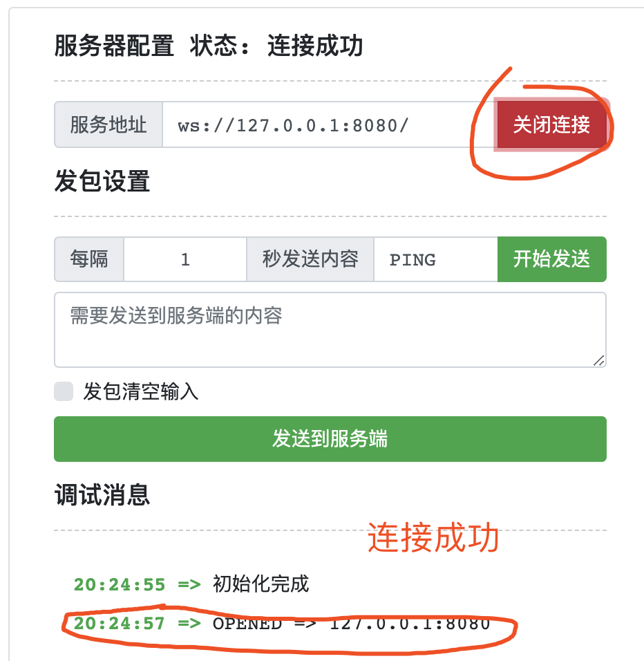
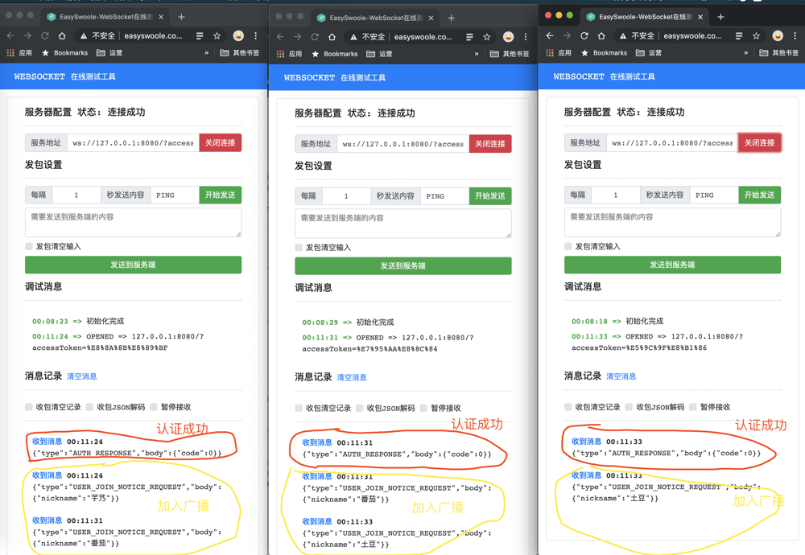
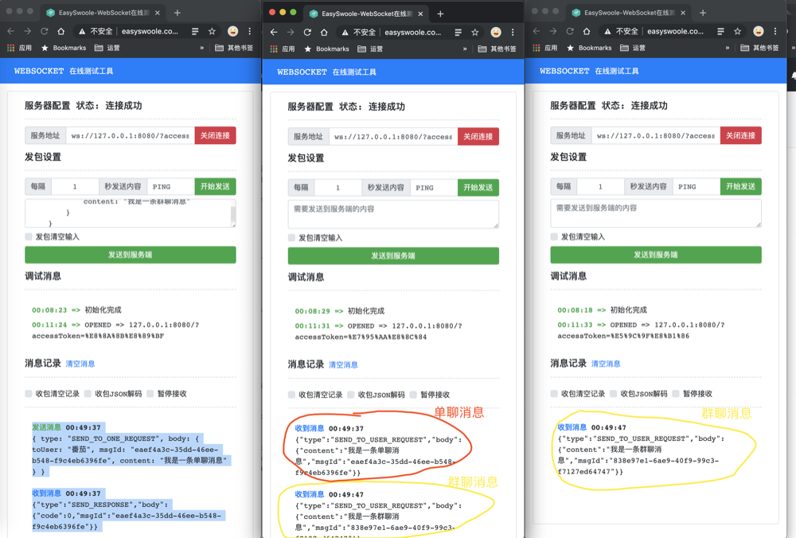

# 芋道 Spring Boot WebSocket 入门

## 1. 概述

相比 HTTP 协议来说，WebSocket 协议对大多数后端开发者是比较陌生的。相比来说，WebSocket 协议**重点**是提供了服务端主动向客户端发送数据的能力，这样我们就可以完成**实时性**较高的需求。例如说，聊天 IM 即使通讯功能、消息订阅服务、网页游戏等等。

同时，因为 WebSocket 使用 TCP 通信，可以避免重复创建连接，提升通信质量和效率。例如说，美团的长连接服务，具体可以看看 [《美团点评移动网络优化实践》](https://tech.meituan.com/2017/03/17/shark-sdk.html) 。

> 友情提示：这里有个一个误区，WebSocket 相比普通的 Socket 来说，仅仅是借助 HTTP 协议完成握手，创建连接。后续的所有通信，都和 HTTP 协议无关。

看到这里，胖友一定以为艿艿又要开始哔哔 WebSocket 的概念。哈哈，我偏不~如果对这块不了的胖友，可以阅读如下两篇文章：

- [《理清 WebSocket 和 HTTP 的关系》](http://www.iocoder.cn/Fight/Clarify-the-relationship-between-WebSocket-and-HTTP/?self)

  > 艿艿：强烈推荐，一定要弄懂。不然，找不到对象。

- [《WebSocket 教程》](https://www.ruanyifeng.com/blog/2017/05/websocket.html)

在实现提供 WebSocket 服务的项目中，一般有如下几种解决方案：

- 方案一 [Spring WebSocket](https://docs.spring.io/spring-framework/docs/5.0.0.BUILD-SNAPSHOT/spring-framework-reference/html/websocket.html)
- 方案二 [Tomcat WebSocket](https://www.cnblogs.com/xdp-gacl/p/5193279.html)
- 方案三 [Netty WebSocket](https://netty.io/news/2012/11/15/websocket-enhancement.html)

目前艿艿手头有个涉及到 IM 即使通讯的项目，采用的是方案三。主要原因是，我们对 Netty 框架的实战、原理与源码，都相对熟悉一些。所以就考虑了它。并且，除了需要支持 WebSocket 协议，我们还想提供原生的 Socket 协议。

如果仅仅是仅仅提供 WebSocket 协议的支持，可以考虑采用方案一或者方案二。在使用上，两个方案是比较接近的。相比来说，方案一 Spring WebSocket 内置了对 [STOMP](https://docs.spring.io/spring-framework/docs/5.0.0.BUILD-SNAPSHOT/spring-framework-reference/html/websocket.html#websocket-stomp-overview) 协议的支持。

不过呢，本文还是采用方案二 Tomcat WebSocket 来作为入门示例。咳咳咳，没有特殊的原因，主要是开始写本文之前，艿艿就花了 2 小时使用它写了一个示例。实在是有点懒，不想改。如果能重来，我要选李白，哈哈哈哈~

当然，不要慌，正如艿艿所说，方案一和方案二的实现代码，真心没啥差别。😝

在开始搭建 Tomcat WebSocket 入门示例之前，我们先来了解下 [JSR-356](https://www.oracle.com/technical-resources/articles/java/jsr356.html) 规范，定义了 Java 针对 WebSocket 的 API ，即 [Javax WebSocket](https://mvnrepository.com/artifact/javax.websocket) 。规范是大哥，打死不会提供实现，所以 JSR-356 也是如此。目前，主流的 Web 容器都已经提供了 JSR-356 的实现，例如说 Tomcat、Jetty、Undertow 等等。

## 2. Tomcat WebSocket 快速入门

> 示例代码对应仓库：[lab-websocket-25-01](https://github.com/YunaiV/SpringBoot-Labs/tree/master/lab-25/lab-websocket-25-01) 。

在本小节中，我们会使用 Tomcat WebSocket 搭建一个 WebSocket 的示例。提供如下消息的功能支持：

- 身份认证请求
- 私聊消息
- 群聊消息

考虑到让示例更加易懂，我们先做成全局有且仅有一个大的聊天室，即建立上 WebSocket 的连接，都自动动进入该聊天室。😜

下面，开始遨游 WebSocket 这个鱼塘...

### 2.1 引入依赖

在 [`pom.xml`](https://github.com/YunaiV/SpringBoot-Labs/blob/master/lab-25/lab-websocket-25-01/pom.xml) 文件中，引入相关依赖。


```
<?xml version="1.0" encoding="UTF-8"?>
<project xmlns="http://maven.apache.org/POM/4.0.0"
         xmlns:xsi="http://www.w3.org/2001/XMLSchema-instance"
         xsi:schemaLocation="http://maven.apache.org/POM/4.0.0 http://maven.apache.org/xsd/maven-4.0.0.xsd">
    <parent>
        <groupId>org.springframework.boot</groupId>
        <artifactId>spring-boot-starter-parent</artifactId>
        <version>2.1.10.RELEASE</version>
        <relativePath/> <!-- lookup parent from repository -->
    </parent>
    <modelVersion>4.0.0</modelVersion>

    <artifactId>lab-25-01</artifactId>

    <dependencies>
        <!-- 实现对 WebSocket 相关依赖的引入，方便~ -->
        <dependency>
            <groupId>org.springframework.boot</groupId>
            <artifactId>spring-boot-starter-websocket</artifactId>
        </dependency>

        <!-- 引入 Fastjson ，实现对 JSON 的序列化，因为后续我们会使用它解析消息 -->
        <dependency>
            <groupId>com.alibaba</groupId>
            <artifactId>fastjson</artifactId>
            <version>1.2.62</version>
        </dependency>

    </dependencies>

</project>
```


具体每个依赖的作用，胖友自己认真看下艿艿添加的所有注释噢。

### 2.2 WebsocketServerEndpoint

在 [`cn.iocoder.springboot.lab25.springwebsocket.websocket`](https://github.com/YunaiV/SpringBoot-Labs/tree/master/lab-25/lab-websocket-25-01/src/main/java/cn/iocoder/springboot/lab25/springwebsocket/websocket) 包路径下，创建 [WebsocketServerEndpoint](https://github.com/YunaiV/SpringBoot-Labs/blob/master/lab-25/lab-websocket-25-01/src/main/java/cn/iocoder/springboot/lab25/springwebsocket/websocket/WebsocketServerEndpoint.java) 类，定义 Websocket 服务的端点（EndPoint）。代码如下：


```
// WebsocketServerEndpoint.java

@Controller
@ServerEndpoint("/")
public class WebsocketServerEndpoint {

    private Logger logger = LoggerFactory.getLogger(getClass());

    @OnOpen
    public void onOpen(Session session, EndpointConfig config) {
        logger.info("[onOpen][session({}) 接入]", session);
    }

    @OnMessage
    public void onMessage(Session session, String message) {
        logger.info("[onOpen][session({}) 接收到一条消息({})]", session, message); // 生产环境下，请设置成 debug 级别
    }

    @OnClose
    public void onClose(Session session, CloseReason closeReason) {
        logger.info("[onClose][session({}) 连接关闭。关闭原因是({})}]", session, closeReason);
    }

    @OnError
    public void onError(Session session, Throwable throwable) {
        logger.info("[onClose][session({}) 发生异常]", session, throwable);
    }

}
```


- 在类上，添加 `@Controller` 注解，保证创建一个 WebsocketServerEndpoint Bean 。
- 在类上，添加 JSR-356 定义的 [`@ServerEndpoint`](https://github.com/eclipse-ee4j/websocket-api/blob/master/api/server/src/main/java/javax/websocket/server/ServerEndpoint.java) 注解，标记这是一个 WebSocket EndPoint ，路径为 `/` 。
- WebSocket 一共有四个事件，分别对应使用 JSR-356 定义的 [`@OnOpen`](https://github.com/eclipse-ee4j/websocket-api/blob/master/api/client/src/main/java/javax/websocket/OnOpen.java)、[`@OnMessage`](https://github.com/eclipse-ee4j/websocket-api/blob/master/api/client/src/main/java/javax/websocket/OnMessage.java)、[`@OnClose`](https://github.com/eclipse-ee4j/websocket-api/blob/master/api/client/src/main/java/javax/websocket/OnClose.java)、[`@OnError`](https://github.com/eclipse-ee4j/websocket-api/blob/master/api/client/src/main/java/javax/websocket/OnError.java) 注解。

这是最简版的 WebsocketServerEndpoint 的代码。在下文，我们会慢慢把代码补全。

### 2.3 WebSocketConfiguration

在 [`cn.iocoder.springboot.lab24.springwebsocket.config`](https://github.com/YunaiV/SpringBoot-Labs/tree/master/lab-25/lab-websocket-25-01/src/main/java/cn/iocoder/springboot/lab25/springwebsocket/config) 包路径下，创建 [WebsocketServerEndpoint](https://github.com/YunaiV/SpringBoot-Labs/blob/master/lab-25/lab-websocket-25-01/src/main/java/cn/iocoder/springboot/lab25/springwebsocket/config/WebSocketConfiguration.java) 配置类。代码如下：


```
// WebSocketConfiguration.java

@Configuration
// @EnableWebSocket // 无需添加该注解，因为我们并不是使用 Spring WebSocket
public class WebSocketConfiguration {

    @Bean
    public ServerEndpointExporter serverEndpointExporter() {
        return new ServerEndpointExporter();
    }

}
```


- 在 `#serverEndpointExporter()` 方法中，创建 ServerEndpointExporter Bean 。该 Bean 的作用，是扫描添加有 `@ServerEndpoint` 注解的 Bean 。

### 2.4 Application

创建 [`Application.java`](https://github.com/YunaiV/SpringBoot-Labs/blob/master/lab-25/lab-websocket-25-01/src/main/java/cn/iocoder/springboot/lab25/springwebsocket/Application.java) 类，配置 `@SpringBootApplication` 注解即可。代码如下：


```
// Application.java

@SpringBootApplication
public class Application {

    public static void main(String[] args) {
        SpringApplication.run(Application.class, args);
    }

}
```


执行 Application 启动该示例项目。

考虑到胖友可能不会或者不愿意写前端代码，所以我们直接使用 [WEBSOCKET 在线测试工具](http://www.easyswoole.com/wstool.html) 。测试 WebSocket 连接，如下图：

至此，最简单的一个 WebSocket 项目的骨架，我们已经搭建完成。下面，我们开始改造，把相应的逻辑补全。

### 2.5 消息

在 HTTP 协议中，是基于 Request/Response 请求响应的**同步**模型，进行交互。在 Websocket 协议中，是基于 Message 消息的**异步**模型，进行交互。这一点，是很大的不同的，等会看到具体的消息类，感受会更明显。

因为 WebSocket 协议，不像 HTTP 协议有 URI 可以区分不同的 API 请求操作，所以我们需要在 WebSocket 的 Message 里，增加能够标识消息类型，这里我们采用 `type` 字段。所以在这个示例中，我们采用的 Message 采用 JSON 格式编码，格式如下：


```
{
    type: "", // 消息类型
    body: {} // 消息体
}
```


- `type` 字段，消息类型。通过该字段，我们知道使用哪个 MessageHandler 消息处理器。关于 MessageHandler ，我们在 [「2.6 消息处理器」](https://www.iocoder.cn/Spring-Boot/WebSocket/#) 中，详细解析。
- `body` 字段，消息体。不同的消息类型，会有不同的消息体。
- Message 采用 JSON 格式编码，主要考虑便捷性，胖友实际项目下，也可以考虑 [Protobuf](https://github.com/protocolbuffers/protobuf) 等更加高效且节省流量的编码格式。

实际上，我们在 😈 该示例中，`body` 字段对应的 Message 相关的接口和类，实在想不到名字了。所有的 Message 们，我们都放在 [`cn.iocoder.springboot.lab25.springwebsocket.message`](https://github.com/YunaiV/SpringBoot-Labs/tree/master/lab-25/lab-websocket-25-01/src/main/java/cn/iocoder/springboot/lab25/springwebsocket/message) 包路径下。

#### 2.5.1 Message

创建 [Message](https://github.com/YunaiV/SpringBoot-Labs/blob/master/lab-25/lab-websocket-25-01/src/main/java/cn/iocoder/springboot/lab25/springwebsocket/message/Message.java) 接口，基础消息体，所有消息体都要实现该接口。代码如下：


```
// Message.java

public interface Message {
}
```


- 目前作为一个标记接口，未定义任何操作。

#### 2.5.2 认证相关 Message

创建 [AuthRequest](https://github.com/YunaiV/SpringBoot-Labs/blob/master/lab-25/lab-websocket-25-01/src/main/java/cn/iocoder/springboot/lab25/springwebsocket/message/AuthRequest.java) 类，用户认证请求。代码如下：


```
// AuthRequest.java

public class AuthRequest implements Message {

    public static final String TYPE = "AUTH_REQUEST";

    /**
     * 认证 Token
     */
    private String accessToken;
    
    // ... 省略 set/get 方法
    
}
```


- `TYPE` 静态属性，消息类型为 `AUTH_REQUEST` 。
- `accessToken` 属性，认证 Token 。在 WebSocket 协议中，我们也需要认证当前连接，用户身份是什么。一般情况下，我们采用用户调用 HTTP 登录接口，登录成功后返回的访问令牌 `accessToken` 。这里，我们先不拓展开讲，事后胖友可以看看 [《基于 Token 认证的 WebSocket 连接》](https://yq.aliyun.com/articles/229057) 文章。

虽然说，WebSocket 协议是基于 Message 模型，进行交互。但是，这并不意味着它的操作，不需要响应结果。例如说，用户认证请求，是需要用户认证响应的。所以，我们创建 [AuthResponse](https://github.com/YunaiV/SpringBoot-Labs/blob/master/lab-25/lab-websocket-25-01/src/main/java/cn/iocoder/springboot/lab25/springwebsocket/message/AuthResponse.java) 类，作为用户认证响应。代码如下：


```
// AuthResponse.java

public class AuthResponse implements Message {

    public static final String TYPE = "AUTH_RESPONSE";

    /**
     * 响应状态码
     */
    private Integer code;
    /**
     * 响应提示
     */
    private String message;
    
    // ... 省略 set/get 方法
    
}
```


- `TYPE` 静态属性，消息类型为 `AUTH_REQUEST` 。实际上，我们在每个 Message 实现类上，都增加了 `TYPE` 静态属性，作为消息类型。下面，我们就不重复赘述了。
- `code` 属性，响应状态码。
- `message` 属性，响应提示。

在本示例中，用户成功认证之后，会广播用户加入群聊的通知 Message ，使用 [UserJoinNoticeRequest](https://github.com/YunaiV/SpringBoot-Labs/blob/master/lab-25/lab-websocket-25-01/src/main/java/cn/iocoder/springboot/lab25/springwebsocket/message/UserJoinNoticeRequest.java) 。代码如下：


```
// UserJoinNoticeRequest.java

public class UserJoinNoticeRequest implements Message {

    public static final String TYPE = "USER_JOIN_NOTICE_REQUEST";

    /**
     * 昵称
     */
    private String nickname;
    
    // ... 省略 set/get 方法

}
```


**优化小想法**

实际上，我们可以在需要使用到 Request/Response 模型的地方，将 Message 进行拓展：

- Request 抽象类，增加 `requestId` 字段，表示请求编号。
- Response 抽象类，增加 `requestId` 字段，和每一个 Request 请求映射上。同时，里面统一定义 `code` 和 `message` 属性，表示响应状态码和响应提示。

这样，在使用到同步模型的业务场景下，Message 实现类使用 Request/Reponse 作为后缀。例如说，用户认证请求、删除一个好友请求等等。

而在使用到异步模型能的业务场景下，Message 实现类还是继续 Message 作为后缀。例如说，发送一条消息，用户操作完后，无需阻塞等待结果

#### 2.5.3 发送消息相关 Message

创建 [SendToOneRequest](https://github.com/YunaiV/SpringBoot-Labs/blob/master/lab-25/lab-websocket-25-01/src/main/java/cn/iocoder/springboot/lab25/springwebsocket/message/SendToOneRequest.java) 类，发送给指定人的私聊消息的 Message。代码如下：


```
// SendToOneRequest.java

public class SendToOneRequest implements Message {

    public static final String TYPE = "SEND_TO_ONE_REQUEST";

    /**
     * 发送给的用户
     */
    private String toUser;
    /**
     * 消息编号
     */
    private String msgId;
    /**
     * 内容
     */
    private String content;
    
    // ... 省略 set/get 方法
    
}
```


- 每个字段，胖友自己看注释噢。

创建 [SendToAllRequest](https://github.com/YunaiV/SpringBoot-Labs/blob/master/lab-25/lab-websocket-25-01/src/main/java/cn/iocoder/springboot/lab25/springwebsocket/message/SendToAllRequest.java) 类，发送给所有人的群聊消息的 Message。代码如下：


```
// SendToAllRequest.java

public class SendToAllRequest implements Message {

    public static final String TYPE = "SEND_TO_ALL_REQUEST";

    /**
     * 消息编号
     */
    private String msgId;
    /**
     * 内容
     */
    private String content;
    
    // ... 省略 set/get 方法
     
}
```


- 每个字段，胖友自己看注释噢。

在服务端接收到发送消息的请求，需要**异步**响应发送是否成功。所以，创建 [SendResponse](https://github.com/YunaiV/SpringBoot-Labs/blob/master/lab-25/lab-websocket-25-01/src/main/java/cn/iocoder/springboot/lab25/springwebsocket/message/SendResponse.java) 类，发送消息响应结果的 Message 。代码如下：


```
// SendResponse.java

public class SendResponse implements Message {

    public static final String TYPE = "SEND_RESPONSE";

    /**
     * 消息编号
     */
    private String msgId;
    /**
     * 响应状态码
     */
    private Integer code;
    /**
     * 响应提示
     */
    private String message;
    
    // ... 省略 set/get 方法
    
}
```


- 重点看 `msgId` 字段，消息编号。客户端在发送消息，通过使用 [UUID](https://zh.wikipedia.org/zh-hans/通用唯一识别码) 算法，生成全局唯一消息编号。这样，服务端通过 SendResponse 消息响应，通过 `msgId` 做映射。

在服务端接收到发送消息的请求，需要转发消息给对应的人。所以，创建 [SendToUserRequest](https://github.com/YunaiV/SpringBoot-Labs/blob/master/lab-25/lab-websocket-25-01/src/main/java/cn/iocoder/springboot/lab25/springwebsocket/message/SendToUserRequest.java) 类，发送消息给一个用户的 Message 。代码如下：


```
// SendResponse.java

public class SendToUserRequest implements Message {

    public static final String TYPE = "SEND_TO_USER_REQUEST";

    /**
     * 消息编号
     */
    private String msgId;
    /**
     * 内容
     */
    private String content;
    
    // ... 省略 set/get 方法
     
}
```


- 相比 SendToOneRequest 来说，少一个 `toUser` 字段。因为，我们可以通过 WebSocket 连接，已经知道发送给谁了。

### 2.6 消息处理器

每个客户端发起的 Message 消息类型，我们会声明对应的 MessageHandler 消息处理器。这个就类似在 SpringMVC 中，每个 API 接口对应一个 Controller 的 Method 方法。

所有的 MessageHandler 们，我们都放在 [`cn.iocoder.springboot.lab25.springwebsocket.handler`](https://github.com/YunaiV/SpringBoot-Labs/tree/master/lab-25/lab-websocket-25-01/src/main/java/cn/iocoder/springboot/lab25/springwebsocket/handler) 包路径下。

#### 2.6.1 MessageHandler

创建 [MessageHandler](https://github.com/YunaiV/SpringBoot-Labs/tree/master/lab-25/lab-websocket-25-01/src/main/java/cn/iocoder/springboot/lab25/springwebsocket/handler/MessageHandler.java) 接口，消息处理器接口。代码如下：


```
// MessageHandler.java

public interface MessageHandler<T extends Message> {

    /**
     * 执行处理消息
     *
     * @param session 会话
     * @param message 消息
     */
    void execute(Session session, T message);

    /**
     * @return 消息类型，即每个 Message 实现类上的 TYPE 静态字段
     */
    String getType();

}
```


- 定义了泛型 `<T>` ，需要是 Message 的实现类。
- 定义的两个接口方法，胖友自己看下注释哈。

#### 2.6.2 AuthMessageHandler

创建 [AuthMessageHandler](https://github.com/YunaiV/SpringBoot-Labs/tree/master/lab-25/lab-websocket-25-01/src/main/java/cn/iocoder/springboot/lab25/springwebsocket/handler/AuthMessageHandler.java) 类，处理 AuthRequest 消息。代码如下：


```
// AuthMessageHandler.java

@Component
public class AuthMessageHandler implements MessageHandler<AuthRequest> {

    @Override
    public void execute(Session session, AuthRequest message) {
        // 如果未传递 accessToken 
        if (StringUtils.isEmpty(message.getAccessToken())) {
            WebSocketUtil.send(session, AuthResponse.TYPE,
                    new AuthResponse().setCode(1).setMessage("认证 accessToken 未传入"));
            return;
        }

        // 添加到 WebSocketUtil 中
        WebSocketUtil.addSession(session, message.getAccessToken()); // 考虑到代码简化，我们先直接使用 accessToken 作为 User

        // 判断是否认证成功。这里，假装直接成功
        WebSocketUtil.send(session, AuthResponse.TYPE, new AuthResponse().setCode(0));

        // 通知所有人，某个人加入了。这个是可选逻辑，仅仅是为了演示
        WebSocketUtil.broadcast(UserJoinNoticeRequest.TYPE,
                new UserJoinNoticeRequest().setNickname(message.getAccessToken())); // 考虑到代码简化，我们先直接使用 accessToken 作为 User
    }

    @Override
    public String getType() {
        return AuthRequest.TYPE;
    }

}
```


- 代码比较简单，胖友跟着代码读读即可。
- 关于 WebSocketUtil 类，我们在 [「2.7 WebSocketUtil」](https://www.iocoder.cn/Spring-Boot/WebSocket/#) 中来看看。

#### 2.6.3 SendToOneRequest

创建 [SendToOneHandler](https://github.com/YunaiV/SpringBoot-Labs/tree/master/lab-25/lab-websocket-25-01/src/main/java/cn/iocoder/springboot/lab25/springwebsocket/handler/SendToOneHandler.java) 类，处理 SendToOneRequest 消息。代码如下：


```
// SendToOneRequest.java

@Component
public class SendToOneHandler implements MessageHandler<SendToOneRequest> {

    @Override
    public void execute(Session session, SendToOneRequest message) {
        // 这里，假装直接成功
        SendResponse sendResponse = new SendResponse().setMsgId(message.getMsgId()).setCode(0);
        WebSocketUtil.send(session, SendResponse.TYPE, sendResponse);

        // 创建转发的消息
        SendToUserRequest sendToUserRequest = new SendToUserRequest().setMsgId(message.getMsgId())
                .setContent(message.getContent());
        // 广播发送
        WebSocketUtil.send(message.getToUser(), SendToUserRequest.TYPE, sendToUserRequest);
    }

    @Override
    public String getType() {
        return SendToOneRequest.TYPE;
    }

}
```


- 代码比较简单，胖友跟着代码读读即可。

#### 2.6.4 SendToAllHandler

创建 [SendToAllHandler](https://github.com/YunaiV/SpringBoot-Labs/tree/master/lab-25/lab-websocket-25-01/src/main/java/cn/iocoder/springboot/lab25/springwebsocket/handler/SendToAllHandler.java) 类，处理 SendToAllRequest 消息。代码如下：


```
// SendToAllRequest.java

@Component
public class SendToAllHandler implements MessageHandler<SendToAllRequest> {

    @Override
    public void execute(Session session, SendToAllRequest message) {
        // 这里，假装直接成功
        SendResponse sendResponse = new SendResponse().setMsgId(message.getMsgId()).setCode(0);
        WebSocketUtil.send(session, SendResponse.TYPE, sendResponse);

        // 创建转发的消息
        SendToUserRequest sendToUserRequest = new SendToUserRequest().setMsgId(message.getMsgId())
                .setContent(message.getContent());
        // 广播发送
        WebSocketUtil.broadcast(SendToUserRequest.TYPE, sendToUserRequest);
    }

    @Override
    public String getType() {
        return SendToAllRequest.TYPE;
    }

}
```


- 代码比较简单，胖友跟着代码读读即可。

### 2.7 WebSocketUtil

在 [`cn.iocoder.springboot.lab25.springwebsocket.util`](https://github.com/YunaiV/SpringBoot-Labs/tree/master/lab-25/lab-websocket-25-01/src/main/java/cn/iocoder/springboot/lab25/springwebsocket/util) 包路径下，创建 [WebSocketUtil](https://github.com/YunaiV/SpringBoot-Labs/tree/master/lab-25/lab-websocket-25-01/src/main/java/cn/iocoder/springboot/lab25/springwebsocket/util/WebSocketUtil) 工具类，主要提供两方面的功能：

- Session 会话的管理
- 多种发送消息的方式

整体代码比较简单，胖友自己瞅瞅哟。代码如下：


```
// WebSocketUtil.java

public class WebSocketUtil {

    private static final Logger LOGGER = LoggerFactory.getLogger(WebSocketUtil.class);

    // ========== 会话相关 ==========

    /**
     * Session 与用户的映射
     */
    private static final Map<Session, String> SESSION_USER_MAP = new ConcurrentHashMap<>();
    /**
     * 用户与 Session 的映射
     */
    private static final Map<String, Session> USER_SESSION_MAP = new ConcurrentHashMap<>();

    /**
     * 添加 Session 。在这个方法中，会添加用户和 Session 之间的映射
     *
     * @param session Session
     * @param user 用户
     */
    public static void addSession(Session session, String user) {
        // 更新 USER_SESSION_MAP
        USER_SESSION_MAP.put(user, session);
        // 更新 SESSION_USER_MAP
        SESSION_USER_MAP.put(session, user);
    }

    /**
     * 移除 Session 。
     *
     * @param session Session
     */
    public static void removeSession(Session session) {
        // 从 SESSION_USER_MAP 中移除
        String user = SESSION_USER_MAP.remove(session);
        // 从 USER_SESSION_MAP 中移除
        if (user != null && user.length() > 0) {
            USER_SESSION_MAP.remove(user);
        }
    }

    // ========== 消息相关 ==========

    /**
     * 广播发送消息给所有在线用户
     *
     * @param type 消息类型
     * @param message 消息体
     * @param <T> 消息类型
     */
    public static <T extends Message> void broadcast(String type, T message) {
        // 创建消息
        String messageText = buildTextMessage(type, message);
        // 遍历 SESSION_USER_MAP ，进行逐个发送
        for (Session session : SESSION_USER_MAP.keySet()) {
            sendTextMessage(session, messageText);
        }
    }

    /**
     * 发送消息给单个用户的 Session
     *
     * @param session Session
     * @param type 消息类型
     * @param message 消息体
     * @param <T> 消息类型
     */
    public static <T extends Message> void send(Session session, String type, T message) {
        // 创建消息
        String messageText = buildTextMessage(type, message);
        // 遍历给单个 Session ，进行逐个发送
        sendTextMessage(session, messageText);
    }

    /**
     * 发送消息给指定用户
     *
     * @param user 指定用户
     * @param type 消息类型
     * @param message 消息体
     * @param <T> 消息类型
     * @return 发送是否成功你那个
     */
    public static <T extends Message> boolean send(String user, String type, T message) {
        // 获得用户对应的 Session
        Session session = USER_SESSION_MAP.get(user);
        if (session == null) {
            LOGGER.error("[send][user({}) 不存在对应的 session]", user);
            return false;
        }
        // 发送消息
        send(session, type, message);
        return true;
    }

    /**
     * 构建完整的消息
     *
     * @param type 消息类型
     * @param message 消息体
     * @param <T> 消息类型
     * @return 消息
     */
    private static <T extends Message> String buildTextMessage(String type, T message) {
        JSONObject messageObject = new JSONObject();
        messageObject.put("type", type);
        messageObject.put("body", message);
        return messageObject.toString();
    }

    /**
     * 真正发送消息
     *
     * @param session Session
     * @param messageText 消息
     */
    private static void sendTextMessage(Session session, String messageText) {
        if (session == null) {
            LOGGER.error("[sendTextMessage][session 为 null]");
            return;
        }
        RemoteEndpoint.Basic basic = session.getBasicRemote();
        if (basic == null) {
            LOGGER.error("[sendTextMessage][session 的  为 null]");
            return;
        }
        try {
            basic.sendText(messageText);
        } catch (IOException e) {
            LOGGER.error("[sendTextMessage][session({}) 发送消息{}) 发生异常",
                    session, messageText, e);
        }
    }

}
```


### 2.8 完善 WebsocketServerEndpoint

在本小节，我们会修改 [WebsocketServerEndpoint](https://github.com/YunaiV/SpringBoot-Labs/blob/master/lab-25/lab-websocket-25-01/src/main/java/cn/iocoder/springboot/lab25/springwebsocket/config/WebSocketConfiguration.java) 的代码，完善其功能。

#### 2.8.1 初始化 MessageHandler 集合

实现 [InitializingBean](https://github.com/spring-projects/spring-framework/blob/master/spring-beans/src/main/java/org/springframework/beans/factory/InitializingBean.java) 接口，在 `#afterPropertiesSet()` 方法中，扫描所有 MessageHandler Bean ，添加到 MessageHandler 集合中。代码如下：


```
// WebsocketServerEndpoint.java

/**
 * 消息类型与 MessageHandler 的映射
 *
 * 注意，这里设置成静态变量。虽然说 WebsocketServerEndpoint 是单例，但是 Spring Boot 还是会为每个 WebSocket 创建一个 WebsocketServerEndpoint Bean 。
 */
private static final Map<String, MessageHandler> HANDLERS = new HashMap<>();

@Autowired
private ApplicationContext applicationContext;

@Override
public void afterPropertiesSet() throws Exception {
    // 通过 ApplicationContext 获得所有 MessageHandler Bean
    applicationContext.getBeansOfType(MessageHandler.class).values() // 获得所有 MessageHandler Bean
            .forEach(messageHandler -> HANDLERS.put(messageHandler.getType(), messageHandler)); // 添加到 handlers 中
    logger.info("[afterPropertiesSet][消息处理器数量：{}]", HANDLERS.size());
}
```


通过这样的方式，可以避免手动配置 MessageHandler 与消息类型的映射。

#### 2.8.2 onOpen

重新实现 `#onOpen(Session session, EndpointConfig config)` 方法，实现连接时，使用 `accessToken` 参数进行用户认证。代码如下：


```
// WebsocketServerEndpoint.java

@OnOpen
public void onOpen(Session session, EndpointConfig config) {
    logger.info("[onOpen][session({}) 接入]", session);
    // <1> 解析 accessToken
    List<String> accessTokenValues = session.getRequestParameterMap().get("accessToken");
    String accessToken = !CollectionUtils.isEmpty(accessTokenValues) ? accessTokenValues.get(0) : null;
    // <2> 创建 AuthRequest 消息类型
    AuthRequest authRequest = new AuthRequest().setAccessToken(accessToken);
    // <3> 获得消息处理器
    MessageHandler<AuthRequest> messageHandler = HANDLERS.get(AuthRequest.TYPE);
    if (messageHandler == null) {
        logger.error("[onOpen][认证消息类型，不存在消息处理器]");
        return;
    }
    messageHandler.execute(session, authRequest);
}
```


- `<1>` 处，解析 `ws://` 地址上的 `accessToken` 的请求参。例如说：`ws://127.0.0.1:8080?accessToken=芋艿` 。
- `<2>` 处，创建 AuthRequest 消息类型，并设置 `accessToken` 属性。
- `<3>` 处，获得 AuthRequest 消息类型对应的 MessageHandler 消息处理器，然后调用 `MessageHandler#execute(session, message)` 方法，执行处理用户认证请求。

打开三个浏览器创建，分别设置服务地址如下：

- `ws://127.0.0.1:8080/?accessToken=芋艿`
- `ws://127.0.0.1:8080/?accessToken=番茄`
- `ws://127.0.0.1:8080/?accessToken=土豆`

然后，逐个点击「开启连接」按钮，进行 WebSocket 连接。最终效果如下图：

- 在红圈中，可以看到 AuthResponse 的消息。
- 在黄圈中，可以看到 UserJoinNoticeRequest 的消息。

#### 2.8.3 onMessage

重新实现 `#onMessage(Session session, String message)` 方法，实现不同的消息，转发给不同的 MessageHandler 消息处理器。代码如下：


```
// WebsocketServerEndpoint.java

@OnMessage
public void onMessage(Session session, String message) {
    logger.info("[onOpen][session({}) 接收到一条消息({})]", session, message); // 生产环境下，请设置成 debug 级别
    try {
        // <1> 获得消息类型
        JSONObject jsonMessage = JSON.parseObject(message);
        String messageType = jsonMessage.getString("type");
        // <2> 获得消息处理器
        MessageHandler messageHandler = HANDLERS.get(messageType);
        if (messageHandler == null) {
            logger.error("[onMessage][消息类型({}) 不存在消息处理器]", messageType);
            return;
        }
        // <3> 解析消息
        Class<? extends Message> messageClass = this.getMessageClass(messageHandler);
        // <4> 处理消息
        Message messageObj = JSON.parseObject(jsonMessage.getString("body"), messageClass);
        messageHandler.execute(session, messageObj);
    } catch (Throwable throwable) {
        logger.info("[onMessage][session({}) message({}) 发生异常]", session, throwable);
    }
}
```


- `<1>` 处，获得消息类型，从 `"type"` 字段中。

- `<2>` 处，获得消息类型对应的 MessageHandler 消息处理器。

- `<3>` 处，调用 `#getMessageClass(MessageHandler handler)` 方法，通过 MessageHandler 中，通过解析其类上的泛型，获得消息类型对应的 Class 类。代码如下：

  ```
  // WebsocketServerEndpoint.java
  
  private Class<? extends Message> getMessageClass(MessageHandler handler) {
      // 获得 Bean 对应的 Class 类名。因为有可能被 AOP 代理过。
      Class<?> targetClass = AopProxyUtils.ultimateTargetClass(handler);
      // 获得接口的 Type 数组
      Type[] interfaces = targetClass.getGenericInterfaces();
      Class<?> superclass = targetClass.getSuperclass();
      while ((Objects.isNull(interfaces) || 0 == interfaces.length) && Objects.nonNull(superclass)) { // 此处，是以父类的接口为准
          interfaces = superclass.getGenericInterfaces();
          superclass = targetClass.getSuperclass();
      }
      if (Objects.nonNull(interfaces)) {
          // 遍历 interfaces 数组
          for (Type type : interfaces) {
              // 要求 type 是泛型参数
              if (type instanceof ParameterizedType) {
                  ParameterizedType parameterizedType = (ParameterizedType) type;
                  // 要求是 MessageHandler 接口
                  if (Objects.equals(parameterizedType.getRawType(), MessageHandler.class)) {
                      Type[] actualTypeArguments = parameterizedType.getActualTypeArguments();
                      // 取首个元素
                      if (Objects.nonNull(actualTypeArguments) && actualTypeArguments.length > 0) {
                          return (Class<Message>) actualTypeArguments[0];
                      } else {
                          throw new IllegalStateException(String.format("类型(%s) 获得不到消息类型", handler));
                      }
                  }
              }
          }
      }
      throw new IllegalStateException(String.format("类型(%s) 获得不到消息类型", handler));
  }
  ```

  

  - 这是参考 [`rocketmq-spring`](https://github.com/apache/rocketmq-spring/) 项目的 [`DefaultRocketMQListenerContainer#getMessageType()`](https://github.com/apache/rocketmq-spring/blob/8b2426ea89d704d61c00497a1320b9b9ccd5a61e/rocketmq-spring-boot/src/main/java/org/apache/rocketmq/spring/support/DefaultRocketMQListenerContainer.java#L408-L435) 方法，进行略微修改。
  - 如果胖友对 Java 的泛型机制没有做过一点了解，可能略微有点硬核。可以先暂时跳过，知道意图即可。

- `<4>` 处，调用 `MessageHandler#execute(session, message)` 方法，执行处理请求。

- 另外，这里增加了 `try-catch` 代码，避免整个执行的过程中，发生异常。如果在 onMessage 事件的处理中，发生异常，该消息对应的 Session 会话会被**自动**关闭。显然，这个不符合我们的要求。例如说，在 MessageHandler 处理消息的过程中，发生一些异常是无法避免的。

继续基于上述创建的三个浏览器，我们先点击「清空消息」按钮，清空下消息，打扫下上次测试展示出来的接收得到的 Message 。当然，WebSocket 的连接，不需要去断开。

在第一个浏览器中，分别发送两种聊天消息：

- 一条 SendToOneRequest 私聊消息

  ```
  {
      type: "SEND_TO_ONE_REQUEST",
      body: {
          toUser: "番茄",
          msgId: "eaef4a3c-35dd-46ee-b548-f9c4eb6396fe",
          content: "我是一条单聊消息"
      }
  }
  ```

  

- 一条 SendToAllHandler 群聊消息：

  ```
  {
      type: "SEND_TO_ALL_REQUEST",
      body: {
          msgId: "838e97e1-6ae9-40f9-99c3-f7127ed64747",
          content: "我是一条群聊消息"
      }
  }
  ```

  

最终结果如下图：

- 在红圈中，可以看到一条 SendToUserRequest 的消息，仅有第二个浏览器（番茄）收到。
- 在黄圈中，可以看到三条 SendToUserRequest 的消息，所有浏览器都收到。

#### 2.8.4 onClose

重新实现 `#onClose(Session session, CloseReason closeReason)` 方法，实现移除关闭的 Session 。代码如下：


```
// WebsocketServerEndpoint.java

@OnClose
public void onClose(Session session, CloseReason closeReason) {
    logger.info("[onClose][session({}) 连接关闭。关闭原因是({})}]", session, closeReason);
    WebSocketUtil.removeSession(session);
}
```


#### 2.8.5 onError

`#onError(Session session, Throwable throwable)` 方法，保持不变。代码如下：


```
// WebsocketServerEndpoint.java

@OnError
public void onError(Session session, Throwable throwable) {
    logger.info("[onClose][session({}) 发生异常]", session, throwable);
}
```


## 3. Spring WebSocket 快速入门

> 示例代码对应仓库：[lab-websocket-25-02](https://github.com/YunaiV/SpringBoot-Labs/tree/master/lab-25/lab-websocket-25-02) 。

仔细一个捉摸，艿躯一震，还是提供一个 Spring WebSocket 快速入门的示例。

在 [「Tomcat WebSocket 快速入门」](https://www.iocoder.cn/Spring-Boot/WebSocket/#) 的 `lab-websocket-25-01` 示例的基础上，我们复制出 `lab-websocket-25-02` 项目，进行改造。

### 3.1 WebSocketUtil

因为 Tomcat WebSocket 使用的是 [Session](https://github.com/eclipse-ee4j/websocket-api/blob/master/api/client/src/main/java/javax/websocket/Session.java) 作为会话，而 Spring WebSocket 使用的是 [WebSocketSession](https://github.com/spring-projects/spring-framework/blob/master/spring-websocket/src/main/java/org/springframework/web/socket/WebSocketSession.java) 作为会话，导致我们需要**略微**修改下 WebSocketUtil 工具类。改动非常略微，胖友点击 [WebSocketUtil](https://github.com/YunaiV/SpringBoot-Labs/blob/master/lab-25/lab-websocket-25-02/src/main/java/cn/iocoder/springboot/lab25/springwebsocket/util/WebSocketUtil.java) 查看下，秒懂的噢。 主要有两点：

- 将所有使用 Session 类的地方，调整成 WebSocketSession 类。
- 将发送消息，从 Session 修改成 WebSocketSession 。

### 3.2 消息处理器

将 [`cn.iocoder.springboot.lab25.springwebsocket.handler`](https://github.com/YunaiV/SpringBoot-Labs/tree/master/lab-25/lab-websocket-25-02/src/main/java/cn/iocoder/springboot/lab25/springwebsocket/handler) 包路径下的消息处理器们，使用到 Session 类的地方，调整成 WebSocketSession 类。

### 3.3 DemoWebSocketShakeInterceptor

在 [`cn.iocoder.springboot.lab25.springwebsocket.websocket`](https://github.com/YunaiV/SpringBoot-Labs/tree/master/lab-25/lab-websocket-25-02/src/main/java/cn/iocoder/springboot/lab25/springwebsocket/websocket/) 包路径下，创建 [DemoWebSocketShakeInterceptor](https://github.com/YunaiV/SpringBoot-Labs/tree/master/lab-25/lab-websocket-25-02/src/main/java/cn/iocoder/springboot/lab25/springwebsocket/websocket/DemoWebSocketShakeInterceptor.java) 拦截器。因为 WebSocketSession 无法获得 ws 地址上的请求参数，所以只好通过该拦截器，获得 `accessToken` 请求参数，设置到 `attributes` 中。代码如下：


```
// DemoWebSocketShakeInterceptor.java

public class DemoWebSocketShakeInterceptor extends HttpSessionHandshakeInterceptor {

    @Override // 拦截 Handshake 事件
    public boolean beforeHandshake(ServerHttpRequest request, ServerHttpResponse response,
                                   WebSocketHandler wsHandler, Map<String, Object> attributes) throws Exception {
        // 获得 accessToken
        if (request instanceof ServletServerHttpRequest) {
            ServletServerHttpRequest serverRequest = (ServletServerHttpRequest) request;
            attributes.put("accessToken", serverRequest.getServletRequest().getParameter("accessToken"));
        }
        // 调用父方法，继续执行逻辑
        return super.beforeHandshake(request, response, wsHandler, attributes);
    }

}
```


### 3.4 DemoWebSocketHandler

在 [`cn.iocoder.springboot.lab25.springwebsocket.websocket`](https://github.com/YunaiV/SpringBoot-Labs/tree/master/lab-25/lab-websocket-25-02/src/main/java/cn/iocoder/springboot/lab25/springwebsocket/websocket/) 包路径下，创建 [DemoWebSocketHandler](https://github.com/YunaiV/SpringBoot-Labs/tree/master/lab-25/lab-websocket-25-02/src/main/java/cn/iocoder/springboot/lab25/springwebsocket/websocket/DemoWebSocketHandler.java) 处理器。该处理器参考 [「2.8 完善 WebsocketServerEndpoint」](https://www.iocoder.cn/Spring-Boot/WebSocket/#) 小节，编写它的代码。代码如下：


```
// DemoWebSocketHandler.java

public class DemoWebSocketHandler extends TextWebSocketHandler implements InitializingBean {

    private Logger logger = LoggerFactory.getLogger(getClass());

    /**
     * 消息类型与 MessageHandler 的映射
     *
     * 无需设置成静态变量
     */
    private final Map<String, MessageHandler> HANDLERS = new HashMap<>();

    @Autowired
    private ApplicationContext applicationContext;

    @Override // 对应 open 事件
    public void afterConnectionEstablished(WebSocketSession session) throws Exception {
        logger.info("[afterConnectionEstablished][session({}) 接入]", session);
        // 解析 accessToken
        String accessToken = (String) session.getAttributes().get("accessToken");
        // 创建 AuthRequest 消息类型
        AuthRequest authRequest = new AuthRequest().setAccessToken(accessToken);
        // 获得消息处理器
        MessageHandler<AuthRequest> messageHandler = HANDLERS.get(AuthRequest.TYPE);
        if (messageHandler == null) {
            logger.error("[onOpen][认证消息类型，不存在消息处理器]");
            return;
        }
        messageHandler.execute(session, authRequest);
    }

    @Override // 对应 message 事件
    public void handleTextMessage(WebSocketSession session, TextMessage textMessage) throws Exception {
        logger.info("[handleMessage][session({}) 接收到一条消息({})]", session, textMessage); // 生产环境下，请设置成 debug 级别
        try {
            // 获得消息类型
            JSONObject jsonMessage = JSON.parseObject(textMessage.getPayload());
            String messageType = jsonMessage.getString("type");
            // 获得消息处理器
            MessageHandler messageHandler = HANDLERS.get(messageType);
            if (messageHandler == null) {
                logger.error("[onMessage][消息类型({}) 不存在消息处理器]", messageType);
                return;
            }
            // 解析消息
            Class<? extends Message> messageClass = this.getMessageClass(messageHandler);
            // 处理消息
            Message messageObj = JSON.parseObject(jsonMessage.getString("body"), messageClass);
            messageHandler.execute(session, messageObj);
        } catch (Throwable throwable) {
            logger.info("[onMessage][session({}) message({}) 发生异常]", session, throwable);
        }
    }

    @Override // 对应 close 事件
    public void afterConnectionClosed(WebSocketSession session, CloseStatus status) throws Exception {
        logger.info("[afterConnectionClosed][session({}) 连接关闭。关闭原因是({})}]", session, status);
        WebSocketUtil.removeSession(session);
    }

    @Override // 对应 error 事件
    public void handleTransportError(WebSocketSession session, Throwable exception) throws Exception {
        logger.info("[handleTransportError][session({}) 发生异常]", session, exception);
    }

    @Override
    public void afterPropertiesSet() throws Exception {
        // 通过 ApplicationContext 获得所有 MessageHandler Bean
        applicationContext.getBeansOfType(MessageHandler.class).values() // 获得所有 MessageHandler Bean
                .forEach(messageHandler -> HANDLERS.put(messageHandler.getType(), messageHandler)); // 添加到 handlers 中
        logger.info("[afterPropertiesSet][消息处理器数量：{}]", HANDLERS.size());
    }

    private Class<? extends Message> getMessageClass(MessageHandler handler) {
        // 获得 Bean 对应的 Class 类名。因为有可能被 AOP 代理过。
        Class<?> targetClass = AopProxyUtils.ultimateTargetClass(handler);
        // 获得接口的 Type 数组
        Type[] interfaces = targetClass.getGenericInterfaces();
        Class<?> superclass = targetClass.getSuperclass();
        while ((Objects.isNull(interfaces) || 0 == interfaces.length) && Objects.nonNull(superclass)) { // 此处，是以父类的接口为准
            interfaces = superclass.getGenericInterfaces();
            superclass = targetClass.getSuperclass();
        }
        if (Objects.nonNull(interfaces)) {
            // 遍历 interfaces 数组
            for (Type type : interfaces) {
                // 要求 type 是泛型参数
                if (type instanceof ParameterizedType) {
                    ParameterizedType parameterizedType = (ParameterizedType) type;
                    // 要求是 MessageHandler 接口
                    if (Objects.equals(parameterizedType.getRawType(), MessageHandler.class)) {
                        Type[] actualTypeArguments = parameterizedType.getActualTypeArguments();
                        // 取首个元素
                        if (Objects.nonNull(actualTypeArguments) && actualTypeArguments.length > 0) {
                            return (Class<Message>) actualTypeArguments[0];
                        } else {
                            throw new IllegalStateException(String.format("类型(%s) 获得不到消息类型", handler));
                        }
                    }
                }
            }
        }
        throw new IllegalStateException(String.format("类型(%s) 获得不到消息类型", handler));
    }

}
```


代码及其相似，胖友简单撸下即可。

### 3.5 WebSocketConfiguration

修改 [WebSocketConfiguration](https://github.com/YunaiV/SpringBoot-Labs/blob/master/lab-25/lab-websocket-25-02/src/main/java/cn/iocoder/springboot/lab25/springwebsocket/config/WebSocketConfiguration.java) 配置类，代码如下：


```
// WebSocketConfiguration.java

@Configuration
@EnableWebSocket // 开启 Spring WebSocket
public class WebSocketConfiguration implements WebSocketConfigurer {

    @Override
    public void registerWebSocketHandlers(WebSocketHandlerRegistry registry) {
        registry.addHandler(this.webSocketHandler(), "/") // 配置处理器
                .addInterceptors(new DemoWebSocketShakeInterceptor()) // 配置拦截器
                .setAllowedOrigins("*"); // 解决跨域问题
    }

    @Bean
    public DemoWebSocketHandler webSocketHandler() {
        return new DemoWebSocketHandler();
    }

    @Bean
    public DemoWebSocketShakeInterceptor webSocketShakeInterceptor() {
        return new DemoWebSocketShakeInterceptor();
    }

}
```


- 在类上，添加 `@EnableWebSocket` 注解，开启 Spring WebSocket 功能。
- 实现 WebSocketConfigurer 接口，自定义 WebSocket 的配置。具体的，胖友可以看看 `#registerWebSocketHandlers(registry)` 方法，配置 WebSocket 处理器、拦截器，以及允许跨域。

至此，我们已经完成 Spring WebSocket 的示例。后面，我们执行 Application 来启动项目。具体的测试，这里艿艿就不重复了，胖友可以自己使用 [WEBSOCKET 在线测试工具](http://www.easyswoole.com/wstool.html) 来测试下。

## 666. 彩蛋

虽然说，WebSocket 协议已经在主流的浏览器上，得到非常好的支持，但是总有一些“异类”，是不兼容的。所以就诞生了 [SockJS](https://github.com/sockjs/sockjs-client) 库。关于它的介绍与使用，胖友可以看看 [《SockJS 简单介绍》](https://blog.csdn.net/John_62/article/details/78208177) 文章。

在上述的提供的 Tomcat WebSocket 和 Spring WebSocket 示例中，我们相当于在 WebSocket 实现了自定义的子协议，就是基于 `type` + `body` 的消息结构。而 Spring WebSocket 内置了对 [STOMP](https://docs.spring.io/spring-framework/docs/5.0.0.BUILD-SNAPSHOT/spring-framework-reference/html/websocket.html#websocket-stomp-overview) 的支持，关于这块的示例，艿艿暂时没有提供，主要是自己也不想写前端代码，哈哈哈哈。感兴趣的胖友，可以自己看如下的文章：

- [《Spring Boot 系列十六 WebSocket 简介和 Spring Boot 集成简单消息代理》](https://juejin.im/post/5ac8cd5c6fb9a028dd4e7ba6)
- [《Spring Boot 系列 - 集成 WebSocket 实时通信》](https://www.xncoding.com/2017/07/15/spring/sb-websocket.html)
- [《WebSocket 与 STOMP 的比较及使用步骤》](https://blog.csdn.net/achenyuan/article/details/80851512)

实际场景下，我们在使用 WebSocket 还是原生 Socket 也好，都需要考虑，**如何保证消息一定送达给用户**？

大家肯定能够想到的是，如果用户不处于在线的时候，消息持久化到 MySQL、MongoDB 等等数据库中。这个是正确，且是必须要做的。

我们在一起考虑下边界场景，客户端网络环境较差，特别是在移动端场景下，出现网络**闪断**，可能会出现连接实际已经断开，而服务端以为客户端处于在线的情况。此时，服务端会将消息发给客户端，那么消息实际就发送到“空气”中，产生丢失的情况。要解决这种情况下的问题，需要引入客户端的 ACK 消息机制。目前，主流的有两种做法。

第一种，基于每一条消息编号 ACK 。整体流程如下：

- 无论客户端是否在线，服务端都先把接收到的消息持久化到数据库中。如果客户端此时在线，服务端将**完整消息**推送给客户端。
- 客户端在接收到消息之后，发送 ACK 消息编号给服务端，告知已经收到该消息。服务端在收到 ACK 消息编号的时候，标记该消息已经发送成功。
- 服务端定时轮询，在线的客户端，是否有超过 N 秒未 ACK 的消息。如果有，则重新发送消息给对应的客户端。

这种方案，因为客户端逐条 ACK 消息编号，所以会导致客户端和服务端交互次数过多。当然，客户端可以异步批量 ACK 多条消息，从而减少次数。

不过因为服务端仍然需要定时轮询，也会导致服务端压力较大。所以，这种方案基本已经不采用了。

第二种，基于滑动窗口 ACK 。整体流程如下：

- 无论客户端是否在线，服务端都先把接收到的消息持久化到数据库中。如果客户端此时在线，服务端将**消息编号**推送给客户端。
- 客户端在接收到**消息编号**之后，和本地的消息编号进行比对。如果比本地的小，说明该消息已经收到，忽略不处理；如果比本地的大，使用**本地的**消息编号，向服务端拉取**大于**本地的消息编号的消息列表，即增量消息列表。拉取完成后，更新消息列表中最大的消息编号为**新的本地的**消息编号。
- 服务端在收到客户端拉取增量的消息列表时，将请求的编号记录到数据库中，用于知道客户端此时本地的最新消息编号。
- 考虑到服务端将**消息编号**推送给客户端，也会存在丢失的情况，所以客户端会每 N 秒定时向服务端拉取**大于**本地的消息编号的消息列表。

这种方式，在业务被称为**推拉结合**的方案，在分布式消息队列、配置中心、注册中心实现实时的数据同步，经常被采用。

并且，采用这种方案的情况下，客户端和服务端不一定需要使用**长连接**，也可以使用**长轮询**所替代。客户端发送带有消息版本号的 HTTP 请求到服务端。

- 如果服务端**已有**比客户端新的消息编号，则直接返回增量的消息列表。
- 如果服务端**没有**比客户端新的消息编号，则 HOLD 住请求，直到有新的消息列表可以返回，或者 HTTP 请求超时。
- 客户端在收到 HTTP 请求超时时，立即又重新发起带有消息版本号的 HTTP 请求到服务端。如此反复循环，通过消息编号作为**增量标识**，达到实时获取消息的目的。

如果胖友对这块感兴趣，可以看看 [《IM 消息送达保证机制实现》](http://www.52im.net/thread-294-1-1.html) 文章。毕竟，艿艿这里写的有点简略哈~

当然，也可以去看看 [RocketMQ](https://github.com/apache/rocketmq)、[Apollo](https://github.com/ctripcorp/apollo)、[Nacos](https://github.com/alibaba/nacos) 等中间件的源码。😈