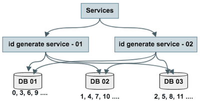
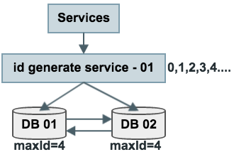
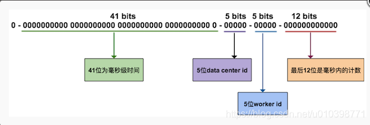

# 分布式唯一ID

### 方法一: 用数据库的 auto_increment 来生成

**优点：**

- 此方法使用数据库原有的功能，所以相对简单
- 能够保证唯一性
- 能够保证递增性
- id 之间的步长是固定且可自定义的

**缺点：**

- 可用性难以保证：数据库常见架构是 一主多从 + 读写分离，生成自增ID是写请求 主库挂了就玩不转了
- 扩展性差，性能有上限：因为写入是单点，数据库主库的写性能决定ID的生成性能上限，并且 难以扩展

**改进方案：**

- 冗余主库，避免写入单点
- 数据水平切分，保证各主库生成的ID不重复

由1个写库变成3个写库，每个写库设置不同的 auto_increment 初始值，以及相同的增长步长，以保证每个数据库生成的ID是不同的（上图中DB 01生成0,3,6,9…，DB 02生成1,4,7,10，DB 03生成2,5,8,11…）

改进后的架构保证了可用性，但缺点是

- 丧失了ID生成的“绝对递增性”：先访问DB 01生成0,3，再访问DB 02生成1，可能导致在非常短的时间内，ID生成不是绝对递增的（这个问题不大，目标是趋势递增，不是绝对递增
- 数据库的写压力依然很大，每次生成ID都要访问数据库

### 方法二：单点批量ID生成服务

分布式系统之所以难，很重要的原因之一是“没有一个全局时钟，难以保证绝对的时序”，要想保证绝对的时序，还是只能使用单点服务，用本地时钟保证“绝对时序”。

数据库写压力大，是因为每次生成ID都访问了数据库，可以使用批量的方式降低数据库写压力。

ID生成服务假设每次批量拉取5个ID，服务访问数据库，将当前ID的最大值修改为4，这样应用访问ID生成服务索要ID，ID生成服务不需要每次访问数据库，就能依次派发0,1,2,3,4这些ID了。

当ID发完后，再将ID的最大值修改为11，就能再次派发6,7,8,9,10,11这些ID了，于是数据库的压力就降低到原来的1/6。

**优点：**

- 保证了ID生成的绝对递增有序
- 大大的降低了数据库的压力，ID生成可以做到每秒生成几万几十万个

**缺点：**

- 服务仍然是单点
- 如果服务挂了，服务重启起来之后，继续生成ID可能会不连续，中间出现空洞（服务内存是保存着0,1,2,3,4，数据库中max-id是4，分配到3时，服务重启了，下次会从5开始分配，3和4就成了空洞，不过这个问题也不大）

### 方法三：uuid / guid

不管是通过数据库，还是通过服务来生成ID，业务方Application都需要进行一次远程调用，比较耗时。uuid是一种常见的本地生成ID的方法。

1. `UUID uuid = UUID.randomUUID();`

**优点：**

- 本地生成ID，不需要进行远程调用，时延低
- 扩展性好，基本可以认为没有性能上限

**缺点：**

- 无法保证趋势递增
- uuid过长，往往用字符串表示，作为主键建立索引查询效率低，常见优化方案为“转化为两个uint64整数存储”或者“折半存储”（折半后不能保证唯一性）

### 方法四：取当前毫秒数

**优点：**

- 本地生成ID，不需要进行远程调用，时延低
- 生成的ID趋势递增
- 生成的ID是整数，建立索引后查询效率高

**缺点：**

- 如果并发量超过1000，会生成重复的ID
- 这个缺点要了命了，不能保证ID的唯一性。当然，使用微秒可以降低冲突概率，但每秒最多只能生成1000000个ID，再多的话就一定会冲突了，所以使用微秒并不从根本上解决问题。

### 方法五：使用 Redis 来生成 id

当使用数据库来生成ID性能不够要求的时候，我们可以尝试使用Redis来生成ID。这主要依赖于Redis是单线程的，所以也可以用生成全局唯一的ID。可以用Redis的原子操作 INCR 和 INCRBY 来实现。

**优点：**

- 依赖于数据库，灵活方便，且性能优于数据库。
- 数字ID天然排序，对分页或者需要排序的结果很有帮助。

**缺点：**

- 如果系统中没有Redis，还需要引入新的组件，增加系统复杂度。
- 需要编码和配置的工作量比较大

### 方法六：Twitter 开源的 Snowflake 算法

snowflake 是 twitter 开源的分布式ID生成算法，其核心思想为，一个long型的ID：

- 41 bit 作为毫秒数 - 41位的长度可以使用69年
- 10 bit 作为机器编号 （5个bit是数据中心，5个bit的机器ID） - 10位的长度最多支持部署1024个节点
- 12 bit 作为毫秒内序列号 - 12位的计数顺序号支持每个节点每毫秒产生4096个ID序号

### 方法七：滴滴开源的分布式id生成系统

ID Generator id生成器 分布式id生成系统，简单易用、高性能、高可用的id生成系统

Tinyid是用Java开发的一款分布式id生成系统，基于数据库号段算法实现，关于这个算法可以参考美团leaf或者tinyid原理介绍。Tinyid扩展了leaf-segment算法，支持了多db(master)，同时提供了java-client(sdk)使id生成本地化，获得了更好的性能与可用性。Tinyid在滴滴客服部门使用，均通过tinyid-client方式接入，每天生成亿级别的id。

- nextId和getNextSegmentId是tinyid-server对外提供的两个http接口
- nextId是获取下一个id，当调用nextId时，会传入bizType，每个bizType的id数据是隔离的，生成id会使用该bizType类型生成的IdGenerator。
- getNextSegmentId是获取下一个可用号段，tinyid-client会通过此接口来获取可用号段
- IdGenerator是id生成的接口
- IdGeneratorFactory是生产具体IdGenerator的工厂，每个biz_type生成一个IdGenerator实例。通过工厂，我们可以随时在db中新增biz_type，而不用重启服务
- IdGeneratorFactory实际上有两个子类IdGeneratorFactoryServer和IdGeneratorFactoryClient，区别在于，getNextSegmentId的不同，一个是DbGet,一个是HttpGet
- CachedIdGenerator则是具体的id生成器对象，持有currentSegmentId和nextSegmentId对象，负责nextId的核心流程。nextId最终通过AtomicLong.andAndGet(delta)方法产生。

## Tinyid的特性

1. 全局唯一的long型id
2. 趋势递增的id，即不保证下一个id一定比上一个大
3. 非连续性
4. 提供http和java client方式接入
5. 支持批量获取id
6. 支持生成1,3,5,7,9…序列的id
7. 支持多个db的配置，无单点

适用场景:只关心id是数字，趋势递增的系统，可以容忍id不连续，有浪费的场景 不适用场景:类似订单id的业务(因为生成的id大部分是连续的，容易被扫库、或者测算出订单量)