## 分布式事务

### 2PC

在传统的企业界，解决分布式事务问题的传统方法就是采用所谓的两阶段协议（简称2PC）。这个协议实现起来还是挺复杂的，但是他的原理并不复杂。

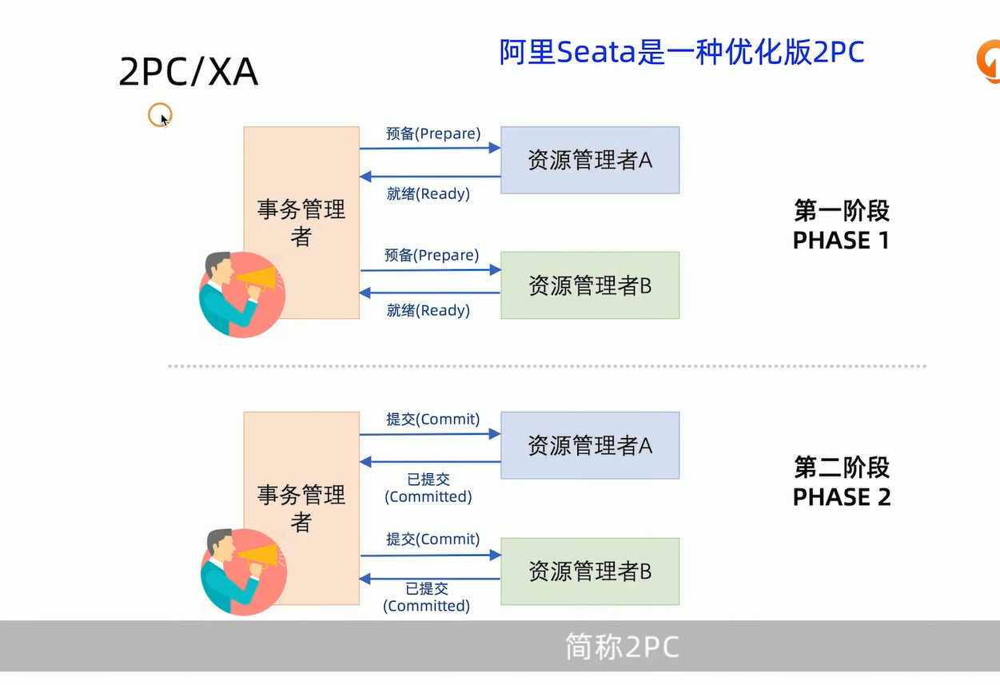

它把分布式事务问题分解成两个执行阶段，首先在2PC协议当中，事务的参与方也叫资源管理者，它可以是数据库或者消息队列。事物的协调方也被称为事务管理者。它统一管理和协调两阶段事务。

下面是两阶段的简化步骤。

第一步是所谓的准备阶段也称为投票阶段，事务管理者要求所有的资源管理者准备执行事务，然后每个资源管理者在本地执行事务，通过回复Ready表示准备就绪，可以提交或者回滚事事务。

第二个阶段根据第一阶段所有参与方的回应，事务管理者决策继续提交事务还是回滚事务。决策之后，他再统一要求所有的资源管理者去提交或者回滚事务。然后各个资源管理者执行提交或者回滚，最后资源管理者返回执行结果，事务完成。

那么这个2PC最早是针对数据库设计的，但是各家数据库厂商的具体实现各不相同，为了统一标准减少不必要的对接成本，同时为了支持除数据库以外的更多的资源，有一个国际开放组织叫Open Group，它制定了分布式事务的XA规范。它本质上就是2PC的一个参考规范。2PC在业界的名声并不太好。主要是有性能开销的问题，还有实现复杂和死锁的问题。

另外现在很多新出来的资源，比方说新出来的NoSQL、还有消息队列kafka 一般都不支持2PC/XA协议。这就造成很多企业在解决分布式事务问题的时候一般都尽量避免使用2PC/XA协议。

但是我这里我要提前说明一下，阿里开源的分布式事务中间件Seata这个中间件我后面会讲的。Seata可以认为是一个优化的2PC/XA的实现方案，那么行业有一些实现2PC和XA协议的分布式事务中间件，比较知名的是Atomikos公司开源的中间件，名字就叫Atomikos。在一些传统企业还有要求强致性的银行业，Atomikos有一些应用，我这边给出了一个模拟股票拍卖的这样一个样例。

https://github.com/Apress/practical-microservices-architectural-patterns/tree/master/Christudas_Ch13_Source/ch13/ch13-01/XA-TX-Distributed

以及它在GitHub上的地址也给出来了。

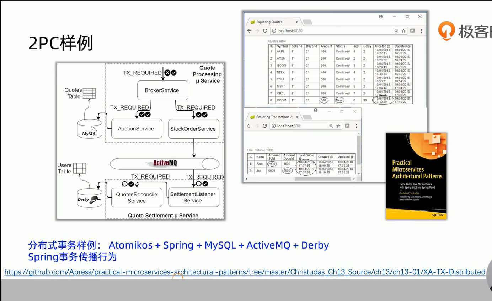

这个样例来自一本书名字叫做《Practical Microservices Architectural Patterns》在书中作者为了演示分布式事务还有2PC和XA。那么它基于Atomikos开发了这样一个样例,它引入蛮多的技术，包括Atomikos、Spring Boot、MySOL、ActiveMO，还有Derby这是一个数据库。这个样例是纯粹为了演示开发的，它里头引入了5个微服务2个数据库，中间还引入消息队列，所以整个股票交易事务是分布式的。这个样例设计了8种场景，包括各种中间环节出错的场景，这些场景是可以通过开关控制的。而且这个样例还带有web界面，可以查看事务执行的各种结果，另外样例还演示了Spring的各种事务传播机制。

如果你对Atomikos感兴趄，或者想进一步参考Atomikos实现分布式事务的样例，可以学习这个样例。

### TCC

除了2PC，目前业界还有一种叫TCC的分布式事务解决方案

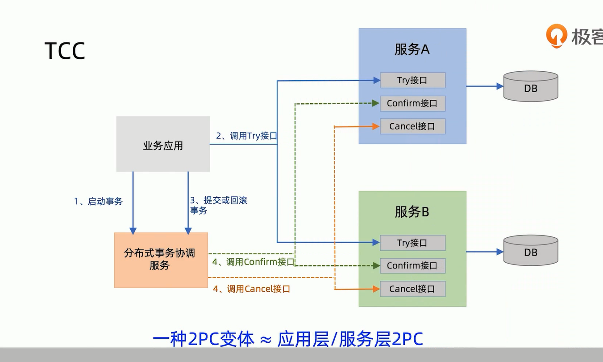

他在互联网金融等行业有广泛的应用，之前在拍拍贷的资金交易这些相关的业务当中，也是通过TCC来实现分布式事务的，TCC可以认为是2PC的一种变体，它相当于是应用层或者是服务层的2PC,2PC主要盛行于基于数据库的三层应用时代,近年随着微服务的盛行，TCC这种服务层的2PC变体也就流行起来了，那么TCC经常应用于一些可以做资源预留的业务场景，比方说旅游预订场景，需要订酒店和机票的事务,或者转账场景也可以用TCC，因为转账转的钱也是一种资源,也是可以预留的，同样TCC当中也有分布式事务协调者这样一个角色，统一负责事务的协调工作。特别需要说明TCC要求参与事务的服务要实现三个接口，分别是Try、Confirm还有Cancel。

下面我们来看一下TCC的简化流程。

1、业务应用通过分布式事务协调者启动这个事务

2、业务应用分别调用事务参与方的Try接口执行事务操作

在TCC模式当中Try通常执行的是一个资源预留的动作，比方说预订酒店和机票场景，Try操作就先把酒店资源、机票资源先预留下来，但是还没有正式的提交

3、应用方根据Try调用的返回结果，决定是提交还是回滚事务。然后它向协调者发出提交或者回滚指令
然后它向协调者发出提交或者回滚指令，最后分布式事务协调者根据业务应用的指令，分别去调事务参与方的Confirm接口去确认提交，或者调Cancel回滚事务。对于酒店和机票预订的这个场景，Confirm就将预留的酒店和机票正式给用户定下来，Cancel表示取消事务，把预留的酒店和机票回滚到可预定状态。后面我会介绍阿里开源的分布式事务中间件Seata，它也是支持TCC事务模式的。

### CAP

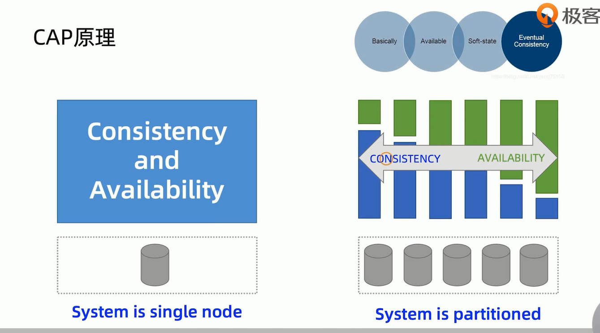

CAP的C表示的是一致性Consistency，A表示可用性	Availability、P表示分区容忍性Partition tolerance。

CAP原理指出，在单机的情况下，也就是不分区的情况下，C和A是可以同时得到满足的。但是在系统分区的情况下，或者说在微服务的情况下，P就是既成事实，那么这个时候，系统将无法同时满足C和A。如果你要A多一点，那么C就会少一点。CAP讲的问题，其实和前面讲的	CQRS最终一致性问题可以说是类似的一种问题。

简单理解，如果你的系统分区了，分成了A和B两个子系统，每个子系统 都有各自独立的数据源，两个子系统之间，通过网络进行通讯，这个时候，如果你更新A的数据，同时要将数据数据同步到B，那么中间由于有网络，肯定会有延迟，甚至不可靠。

所以这个数据同步一定会有延迟。也就是说，中间有短暂的数据不一致。如果你要求强一致性，那么必须要进行封锁，不允许其他方来读取中间状态，也就是暂时不可用 ，性能会受到损害。如果你要求始终可用，那么必然有暂时的数据不一致。

可以说在分布式系统中，CAP是一种客观存在的物理限制，暂时还没有办法，只能折中。

前面提到的这些分布式事务的解决方案，包括2PC还有TCC，在CAP理论当中，它们大都属于要求同步和强一致性的方案。也就是C多一点的方案。

在分布式微服务的场景下面，这些方案的不足是A会受损，并且，性能和吞吐都不在理。想。在大规模交易型网站系统当中基于2PC的或者是基于2PC变体的这些分布式事务解决方案常常成为系统性能可靠性还有扩展性的瓶颈。拍拍贷场景中，使用了基于TCC的分布式事务方案，但是中间多次发生过性能还有可靠性的故障，后来资金团队最终放弃了这个方案。

### 微服务时代的事务处理原则。

传统的基于2PC的分布式事务解决方案，存在性能和扩展性这些问题，并不适用于现代大规模的微服务事务场景。

同时经过一线企业的不断的实践，同时经过一线企业的不断的实践，这些新思路总结起来可以称为微服务时代的事务处理原则。

下面我们就来说明一下这些原则

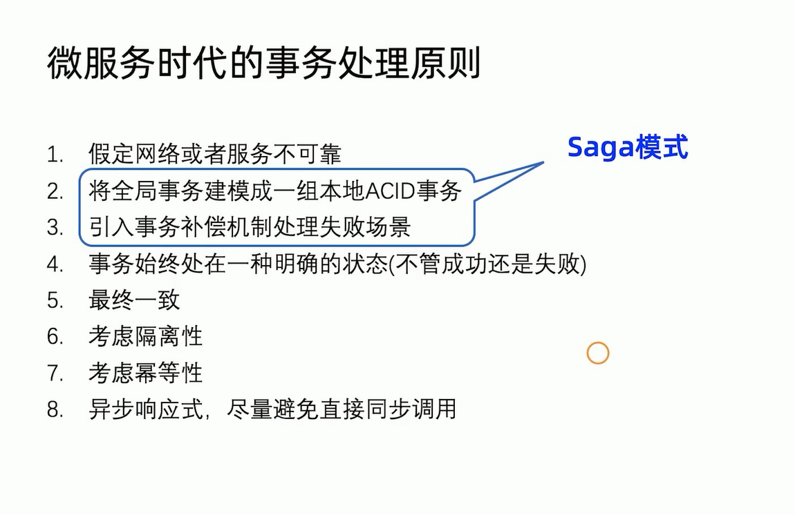

尤其是其中的第二和第三点原则，是saga事务模型的一个基础，Saga事务模式是微服务时代推荐的处理分布式事务的一种方案。

国外流行，国内还没有流行起来。

1.实现saga模式的门槛相对比较高，需要合理的状态建模。

2.saga模式需要可靠的消息队列的支持。

3.国内还没有成熟的支持saga模式的中间件。

当然国外现在已经有生产级的支持Saga模式的中间件产品，就是波波后面会讲的Uber开源的Cadence。

下面我们就来进一步的讲解下Saga模式

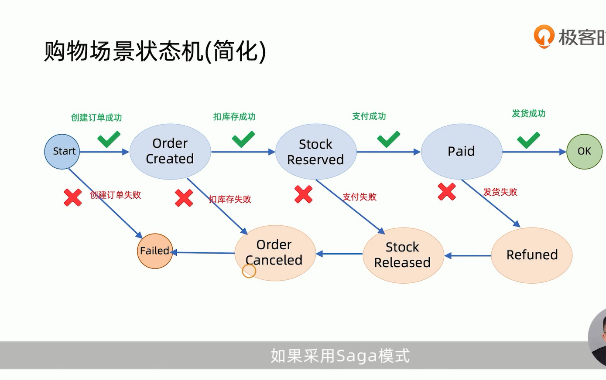

saga模式you两种实现做法

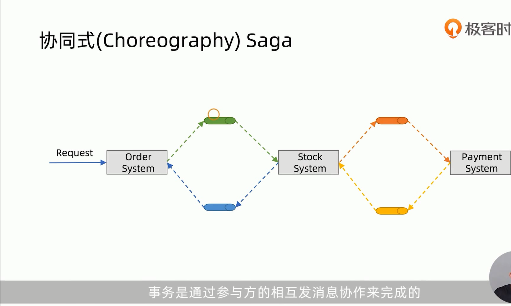

一种叫协同式saga,英文叫Choreograpky Saga,采用这种做法，系统当中没有集中的协调者角色，事务是通过参与方的相互发消息协作来完成的。比方说，对于前面购物的场景，但订单系统完成订单的创建，它就向库存系统发送消息，库存系统接受这个消息，就执行扣减库存的动作，如果扣库存成功，他就向支付系统发送消息，反过来如果支付系统支付失败，就由它触发事务回滚动作，它就向库存系统发送回滚消息,库存系统接受到回滚消息，就执行退还库存的动作，然后向订单系统发送回滚消息，订单系统收到消息，就会将订单标记为失败。前几年我和阿里B2B事业部的技术人员有过一些交流，了解到他们的业务系统就是采用协同式，通过发消息方式来实现的。

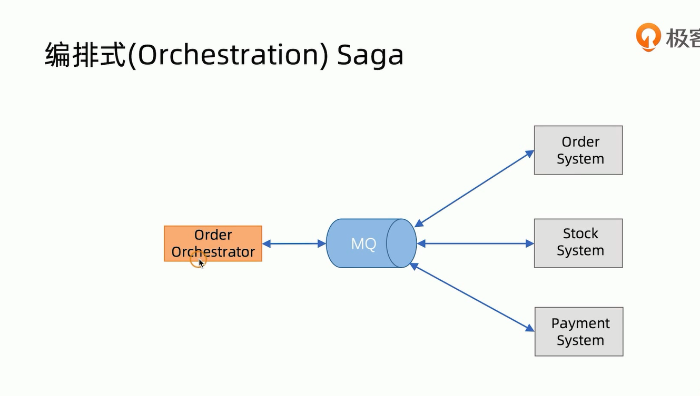

saga模式的另外一种做法是叫编排式saga,英文叫Orchestration Saga。采用这种做法系统当中有一个集中的协调者，或者称为编排这角色，由他统一协调事务的参与方共同来完成事务。比方说对于前面的购物场景，客户端通过订单编排者Order Orchestrator触发购物流程，订单编排者先给订单系统发消息，要求订单系统创建订单，订单系统收到消息利用本地事务创建订单，然后通过MO向订单编排者发回消息告知订单创建成功，然后同样的订单编排者，会依次给库存和支付系统发消息，要求他们分别完成本地事务，最终整个事务协调完成。

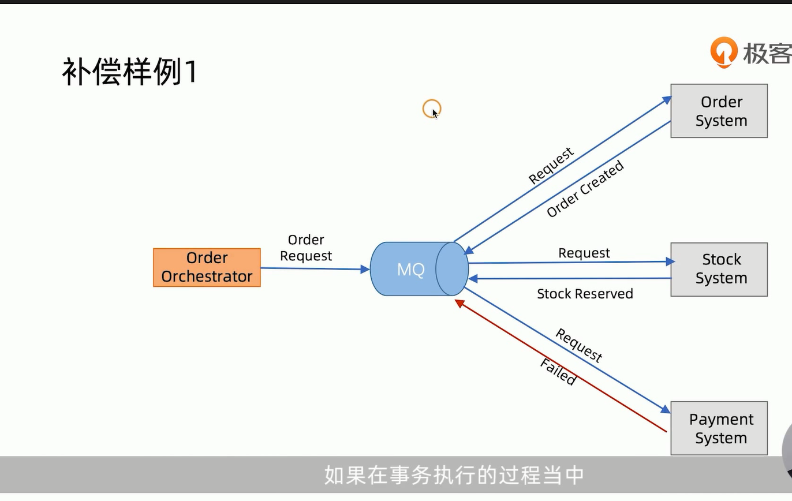

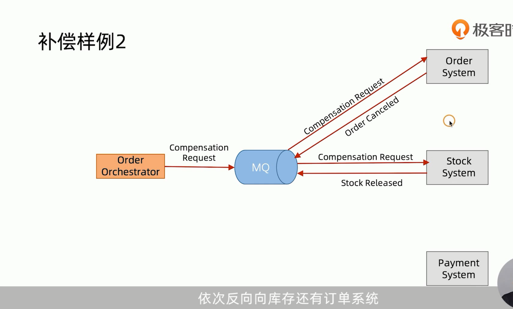

协同式Saga的好处是没有集中的编排者，也就是没有集中的单点问题，整个系统是分散式无中心的，他的不足是每次添加一个新的消息类型，可能需要修改好几个参与方的接口和业务逻辑。另外如果后续增加事务参与方，那么消息的交互复杂度就会变大，整个系统的交互方式会变得难以理解，所以协同式Saga—般仅适用于小规模的系统。

集中式编排的编排流程,它是集中的，比较容易理解，也比较容易去跟踪系统的行为，当然也利于集中的流程管理，后续如果引入新的参与方，—般只需要调整编排者的编排流程，不影响其它参与者。那么它的不足是集中式编排，潜在是有单点问题的，需要考虑高可用部署的问，另外随着参与者的增多，集中式编排器，他的流程逻辑也会变得越来越复杂。在实践当中考虑到可理解性，还有扩展性，大部分企业会考虑采用编排式Saga。

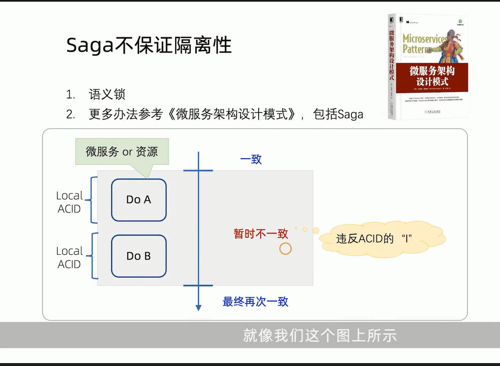

那么Saga它是提倡最终一致的一个事务模式，它只是要求本地事务满足ACID属性。在整个全局事务的执行过程当中，数据是可能出现暂时的不一致的，就像我们上图所示，这个时候，如果有其他事务方来读取或者操作相关的数据，就可能进一步破坏数据的一致性，也就是说Saga并不保证全局事务的隔离性。

举个例子:在一个购物事务正在执行的过程当中,用户同时又取消了订单，这个时候该如何来处理呢，一种简单的办法是采用所谓的语义锁，阻塞或者拒绝其它的事务的执行，所谓语义锁，以订单为例，就是根据订单的状态来判断是否允许其它事务的执行，比方说，如果订单状态正在处理当中，这个时候如果用户要取消订单，那么我们可以规定，处理中的订单不允许取消，也就是不允许取消事务来干扰处理中的事务。和全局锁相比，显然语义锁更加简单轻量，关于saga事务隔离性的问题，建议参考Chris Richardson的《微服务架构设计模式》。

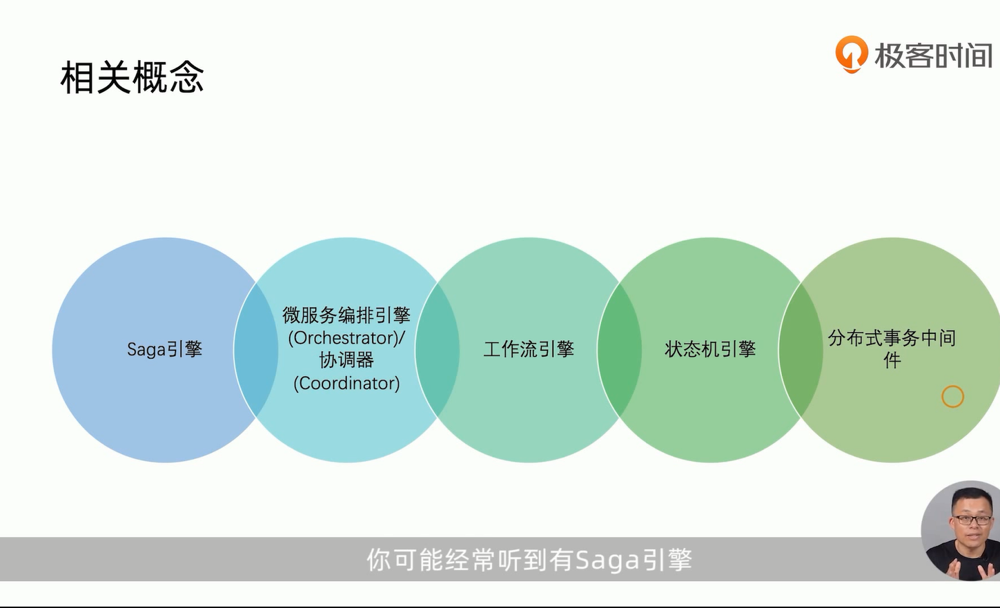

## Uber微服务编排引擎Cadence

刚开始Cadence在Uber主要是用来解决分布式事务问题的，典型的场景包括UberEATS，也就是Uber送餐服务，还有uDebitReward，也就是Uber司机积分服务。这两个案例都是异步长事务的案例，比较复杂。

另外还有一个案例是叫Uber Tipping，一个无限App应用，乘客可以通过这个App给司机一些小费，所以这个就是Uber的一个小费应用，优点张三给李四转账的一个场景。	

因为Uber Tipping，它是一个典型的同步短事务，比较简单，易于理解。所以我这边就以它为案例来讲解Uber Cadence它的编程模型。

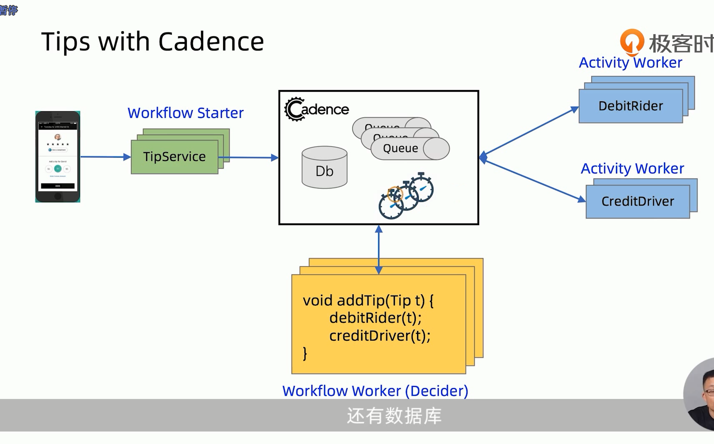

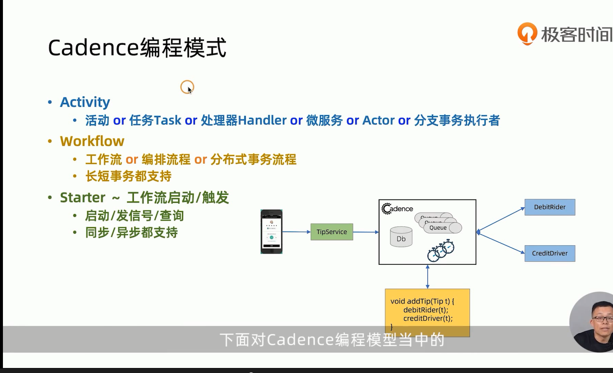

我们这边有一个Cadence Ativity它的实现样例，这个样例对应前面的Uber Tipping，也就是前面讲的Ube小费应用。

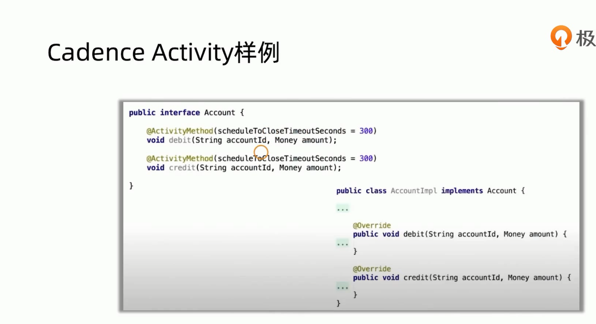

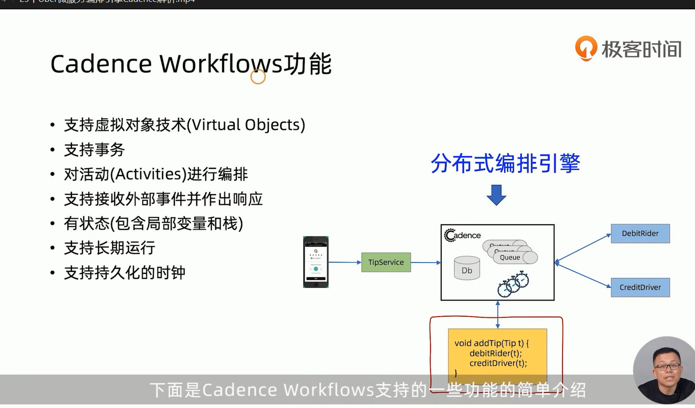

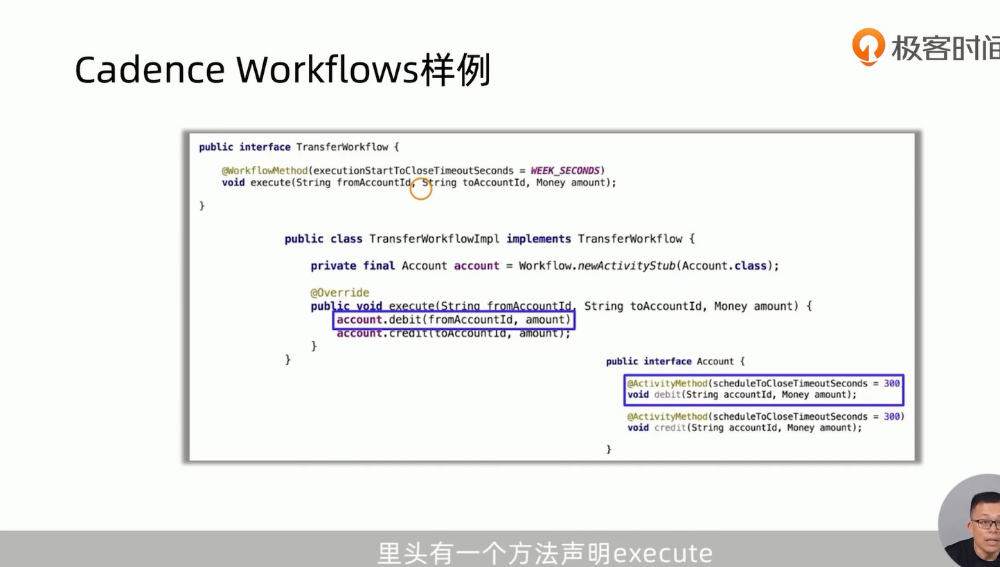

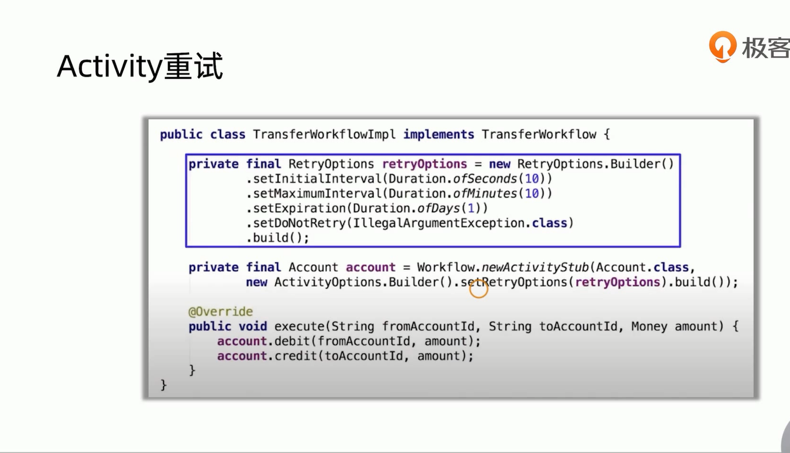

重试策略是直接设置在虚拟对象上的，在工作流的执行execute的方法当中，可以支持这个事务的补偿。比方说，如果给司机转钱，也就是第二步account.credit执行的时候抛异常了可以补偿调用account.credit。

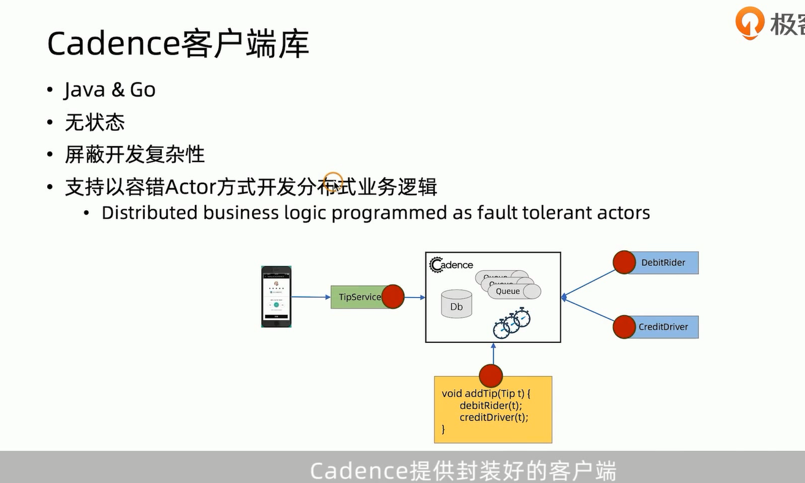

另外Cadence也提供对saga模式的支持，还给出了一个旅行预订bookip这样的一个样例。

参考

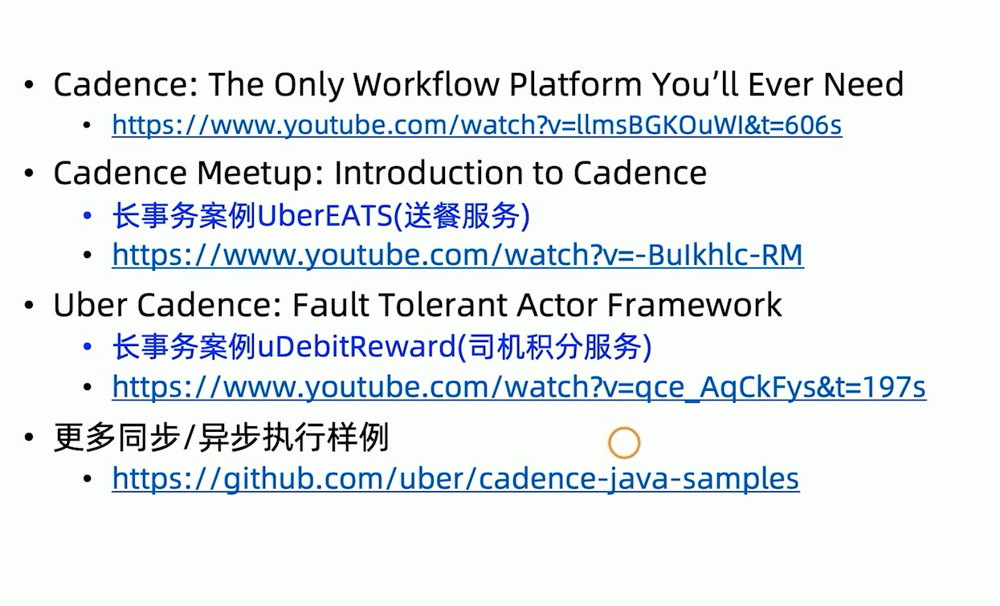

