# Dubbo 分布式事务 Seata 入门

- [1. 概述](http://www.iocoder.cn/Dubbo/Seata/)
- \2. AT 模式
  - [2.1 初始化数据库](http://www.iocoder.cn/Dubbo/Seata/)
  - [2.2 订单服务](http://www.iocoder.cn/Dubbo/Seata/)
  - [2.3 商品服务](http://www.iocoder.cn/Dubbo/Seata/)
  - [2.4 账户服务](http://www.iocoder.cn/Dubbo/Seata/)
  - [2.5 简单测试](http://www.iocoder.cn/Dubbo/Seata/)

------

------

> 本文在提供完整代码示例，可见 <https://github.com/YunaiV/SpringBoot-Labs> 的 [lab-53](https://github.com/YunaiV/SpringBoot-Labs/tree/master/lab-53) 目录。
>
> 原创不易，给点个 [Star](https://github.com/YunaiV/SpringBoot-Labs/stargazers) 嘿，一起冲鸭！

## 1. 概述

在[《芋道 Seata 极简入门》](http://www.iocoder.cn/Seata/install/?self)文章中，我们对 Seata 进行了简单的了解，并完成了 Seata 的部署。而本文，我们将 Dubbo 服务接入 Seata 来实现分布式事务。

> [Seata](https://github.com/seata/seata) 是**阿里**开源的一款开源的**分布式事务**解决方案，致力于提供高性能和简单易用的分布式事务服务。

注意，考虑到 Nacos 作为注册中心在国内越来越流行，本文将采用 Nacos 作为 Dubbo 的注册中心。

> 友情提示：如果对 Nacos 不了解的胖友，可以参考[《Nacos 极简入门》](http://www.iocoder.cn/Nacos/install/?self)文章。

## 2. AT 模式

> 示例代码对应仓库：
>
> - 订单服务：[`lab-53-seata-at-dubbo-demo-order-service`](https://github.com/YunaiV/SpringBoot-Labs/blob/master/lab-53/lab-53-seata-at-dubbo-demo/lab-53-seata-at-dubbo-demo-order-service/)
> - 商品服务：[`lab-53-seata-at-dubbo-demo-product-service`](https://github.com/YunaiV/SpringBoot-Labs/blob/master/lab-53/lab-53-seata-at-dubbo-demo/lab-53-seata-at-dubbo-demo-product-service/)
> - 账户服务：[`lab-53-seata-at-dubbo-demo-account-service`](https://github.com/YunaiV/SpringBoot-Labs/blob/master/lab-53/lab-53-seata-at-dubbo-demo/lab-53-seata-at-dubbo-demo-account-service/)

本小节，我们将使用 Seata 的 AT 模式，解决**多个** Dubbo 服务下的分布式事务的问题。

> 友情提示：对 Seata 的 AT 模式不了解的胖友，可以阅读[《Seata 文档 —— AT 模式》](https://seata.io/zh-cn/docs/dev/mode/at-mode.html)文档。

Seata 提供了 [`seata-dubbo`](https://github.com/seata/seata/blob/develop/integration/dubbo/) 项目，对 Dubbo 进行集成。实现原理是：

- 服务**消费者**，使用 Seata 封装的 [ApacheDubboTransactionPropagationFilter](https://github.com/seata/seata/blob/develop/integration/dubbo/src/main/java/io/seata/integration/dubbo/ApacheDubboTransactionPropagationFilter.java#L51-L53) 过滤器，在发起 Dubbo 远程调用时，将 Seata 全局事务 **XID** 通过[隐式参数](http://dubbo.apache.org/zh-cn/docs/user/demos/attachment.html)传递。
- 服务**提供者**，使用 Seata 封装的 [ApacheDubboTransactionPropagationFilter](https://github.com/seata/seata/blob/develop/integration/dubbo/src/main/java/io/seata/integration/dubbo/ApacheDubboTransactionPropagationFilter.java#L54-L62) 过滤器，在收到 Dubbo 远程调用时，从[隐式参数](http://dubbo.apache.org/zh-cn/docs/user/demos/attachment.html)中解析出 Seata 全局事务 **XID**。

如此，我们便实现了多个 Dubbo 应用的 Seata 全局事务的**传播**。

我们以用户**购买商品**的业务逻辑，来作为具体示例，一共会有三个 Dubbo 服务，分别对应自己的数据库。整体如下图所示：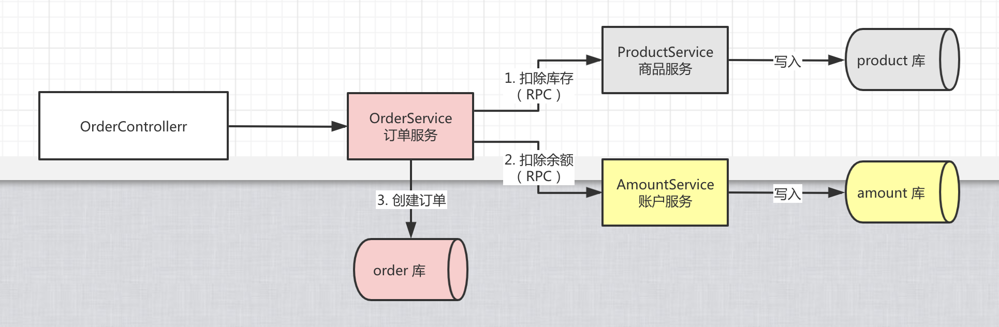

下面，我们来新建 [`lab-53-seata-at-dubbo-demo`](https://github.com/YunaiV/SpringBoot-Labs/blob/master/lab-53/lab-53-seata-at-dubbo-demo/) 模块，包含三个 Dubbo 服务。最终结构如下图：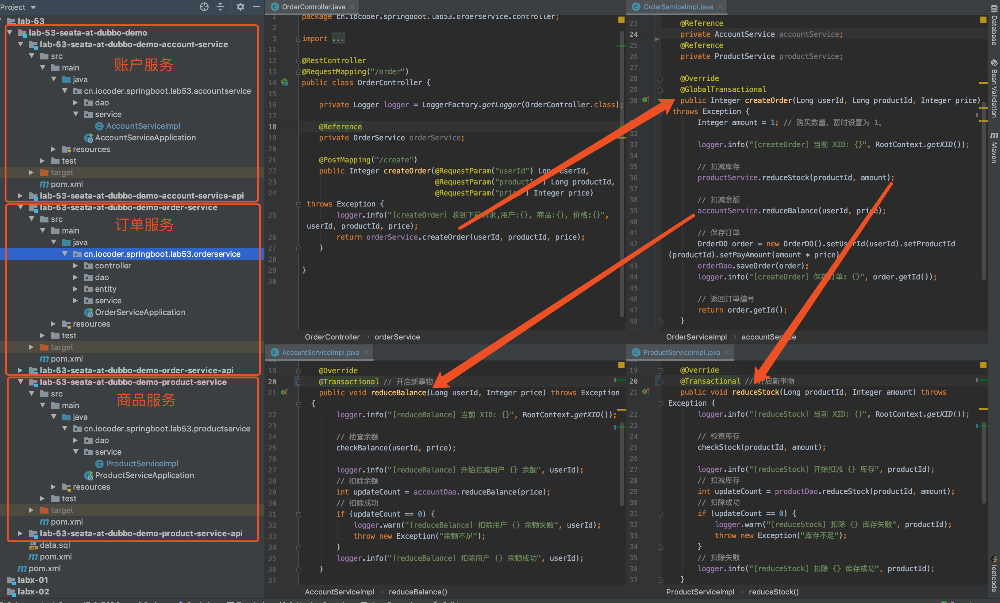

### 2.1 初始化数据库

使用 [`data.sql`](https://github.com/YunaiV/SpringBoot-Labs/blob/master/lab-53/lab-53-seata-at-dubbo-demo/data.sql) 脚本，创建 `seata_order`、`seata_storage`、`seata_amount` **三个库**。脚本内容如下：


```
# Order
DROP DATABASE IF EXISTS seata_order;
CREATE DATABASE seata_order;

CREATE TABLE seata_order.orders
(
    id               INT(11) NOT NULL AUTO_INCREMENT,
    user_id          INT(11)        DEFAULT NULL,
    product_id       INT(11)        DEFAULT NULL,
    pay_amount       DECIMAL(10, 0) DEFAULT NULL,
    add_time         DATETIME       DEFAULT CURRENT_TIMESTAMP,
    last_update_time DATETIME       DEFAULT CURRENT_TIMESTAMP ON UPDATE CURRENT_TIMESTAMP,
    PRIMARY KEY (id)
) ENGINE = InnoDB AUTO_INCREMENT = 1 DEFAULT CHARSET = utf8;

CREATE TABLE seata_order.undo_log
(
    id            BIGINT(20)   NOT NULL AUTO_INCREMENT,
    branch_id     BIGINT(20)   NOT NULL,
    xid           VARCHAR(100) NOT NULL,
    context       VARCHAR(128) NOT NULL,
    rollback_info LONGBLOB     NOT NULL,
    log_status    INT(11)      NOT NULL,
    log_created   DATETIME     NOT NULL,
    log_modified  DATETIME     NOT NULL,
    PRIMARY KEY (id),
    UNIQUE KEY ux_undo_log (xid, branch_id)
) ENGINE = InnoDB AUTO_INCREMENT = 1 DEFAULT CHARSET = utf8;

# Storage
DROP DATABASE IF EXISTS seata_storage;
CREATE DATABASE seata_storage;

CREATE TABLE seata_storage.product
(
    id               INT(11) NOT NULL AUTO_INCREMENT,
    stock            INT(11)  DEFAULT NULL,
    last_update_time DATETIME DEFAULT CURRENT_TIMESTAMP ON UPDATE CURRENT_TIMESTAMP,
    PRIMARY KEY (id)
) ENGINE = InnoDB AUTO_INCREMENT = 1 DEFAULT CHARSET = utf8;
INSERT INTO seata_storage.product (id, stock) VALUES (1, 10); # 插入一条产品的库存

CREATE TABLE seata_storage.undo_log
(
    id            BIGINT(20)   NOT NULL AUTO_INCREMENT,
    branch_id     BIGINT(20)   NOT NULL,
    xid           VARCHAR(100) NOT NULL,
    context       VARCHAR(128) NOT NULL,
    rollback_info LONGBLOB     NOT NULL,
    log_status    INT(11)      NOT NULL,
    log_created   DATETIME     NOT NULL,
    log_modified  DATETIME     NOT NULL,
    PRIMARY KEY (id),
    UNIQUE KEY ux_undo_log (xid, branch_id)
) ENGINE = InnoDB AUTO_INCREMENT = 1 DEFAULT CHARSET = utf8;

# Amount
DROP DATABASE IF EXISTS seata_amount;
CREATE DATABASE seata_amount;

CREATE TABLE seata_amount.account
(
    id               INT(11) NOT NULL AUTO_INCREMENT,
    balance          DOUBLE   DEFAULT NULL,
    last_update_time DATETIME DEFAULT CURRENT_TIMESTAMP ON UPDATE CURRENT_TIMESTAMP,
    PRIMARY KEY (id)
) ENGINE = InnoDB AUTO_INCREMENT = 1  DEFAULT CHARSET = utf8;

CREATE TABLE seata_amount.undo_log
(
    id            BIGINT(20)   NOT NULL AUTO_INCREMENT,
    branch_id     BIGINT(20)   NOT NULL,
    xid           VARCHAR(100) NOT NULL,
    context       VARCHAR(128) NOT NULL,
    rollback_info LONGBLOB     NOT NULL,
    log_status    INT(11)      NOT NULL,
    log_created   DATETIME     NOT NULL,
    log_modified  DATETIME     NOT NULL,
    PRIMARY KEY (id),
    UNIQUE KEY ux_undo_log (xid, branch_id)
) ENGINE = InnoDB AUTO_INCREMENT = 1 DEFAULT CHARSET = utf8;
INSERT INTO seata_amount.account (id, balance) VALUES (1, 1);
```


其中，每个库中的 [`undo_log`](https://github.com/seata/seata/blob/develop/script/client/at/db/mysql.sql) 表，是 Seata AT 模式必须创建的表，主要用于分支事务的回滚。

另外，考虑到测试方便，我们插入了一条 `id = 1` 的 `account` 记录，和一条 `id = 1` 的 `product` 记录。

### 2.2 订单服务

新建 [`lab-53-seata-at-dubbo-demo-order-service-api`](https://github.com/YunaiV/SpringBoot-Labs/blob/master/lab-53/lab-53-seata-at-dubbo-demo/lab-53-seata-at-dubbo-demo-order-service-api/) 和 [`lab-53-seata-at-dubbo-demo-order-service`](https://github.com/YunaiV/SpringBoot-Labs/blob/master/lab-53/lab-53-seata-at-dubbo-demo/lab-53-seata-at-dubbo-demo-order-service/) 项目，作为**订单**服务。项目如下图所示：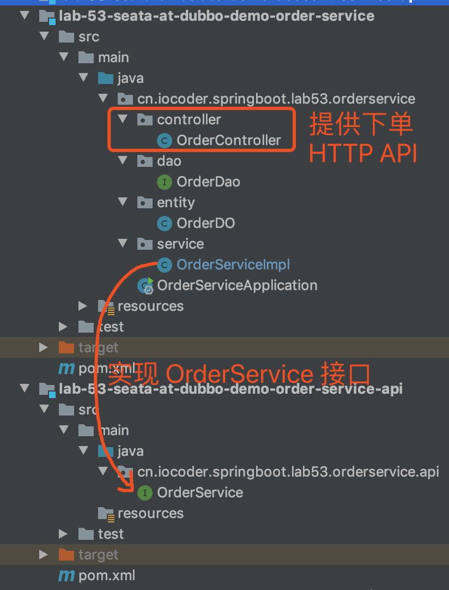

#### 2.2.1 引入依赖

创建 [`pom.xml`](https://github.com/YunaiV/SpringBoot-Labs/blob/master/lab-53/lab-53-seata-at-dubbo-demo/lab-53-seata-at-dubbo-demo-order-service/pom.xml) 文件，引入相关的依赖。内容如下：


```
<?xml version="1.0" encoding="UTF-8"?>
<project xmlns="http://maven.apache.org/POM/4.0.0"
         xmlns:xsi="http://www.w3.org/2001/XMLSchema-instance"
         xsi:schemaLocation="http://maven.apache.org/POM/4.0.0 http://maven.apache.org/xsd/maven-4.0.0.xsd">
    <parent>
        <groupId>org.springframework.boot</groupId>
        <artifactId>spring-boot-starter-parent</artifactId>
        <version>2.2.2.RELEASE</version>
        <relativePath/> <!-- lookup parent from repository -->
    </parent>
    <modelVersion>4.0.0</modelVersion>

    <artifactId>lab-53-seata-at-dubbo-demo-order-service</artifactId>

    <dependencies>
        <dependency>
            <groupId>cn.iocoder.springboot.labs</groupId>
            <artifactId>lab-53-seata-at-dubbo-demo-order-service-api</artifactId>
            <version>1.0-SNAPSHOT</version>
        </dependency>
        <dependency>
            <groupId>cn.iocoder.springboot.labs</groupId>
            <artifactId>lab-53-seata-at-dubbo-demo-account-service-api</artifactId>
            <version>1.0-SNAPSHOT</version>
        </dependency>
        <dependency>
            <groupId>cn.iocoder.springboot.labs</groupId>
            <artifactId>lab-53-seata-at-dubbo-demo-product-service-api</artifactId>
            <version>1.0-SNAPSHOT</version>
        </dependency>

        <!-- 实现对 Spring MVC 的自动化配置 -->
        <dependency>
            <groupId>org.springframework.boot</groupId>
            <artifactId>spring-boot-starter-web</artifactId>
        </dependency>

        <!-- 实现对数据库连接池的自动化配置 -->
        <dependency>
            <groupId>org.springframework.boot</groupId>
            <artifactId>spring-boot-starter-jdbc</artifactId>
        </dependency>
        <dependency> <!-- 本示例，我们使用 MySQL -->
            <groupId>mysql</groupId>
            <artifactId>mysql-connector-java</artifactId>
            <version>5.1.48</version>
        </dependency>

        <!-- 实现对 MyBatis 的自动化配置 -->
        <dependency>
            <groupId>org.mybatis.spring.boot</groupId>
            <artifactId>mybatis-spring-boot-starter</artifactId>
            <version>2.1.2</version>
        </dependency>

        <!-- 实现对 Seata 的自动化配置 -->
        <dependency>
            <groupId>io.seata</groupId>
            <artifactId>seata-spring-boot-starter</artifactId>
            <version>1.1.0</version>
        </dependency>

        <!-- 引入 Dubbo 的依赖 -->
        <dependency>
            <groupId>org.apache.dubbo</groupId>
            <artifactId>dubbo</artifactId>
            <version>2.7.4.1</version>
        </dependency>
        <!-- 实现对 Dubbo 的自动化配置 -->
        <dependency>
            <groupId>org.apache.dubbo</groupId>
            <artifactId>dubbo-spring-boot-starter</artifactId>
            <version>2.7.4.1</version>
        </dependency>
        <!-- 实现 Dubbo 使用 Nacos 作为注册中心 -->
        <dependency>
            <groupId>com.alibaba</groupId>
            <artifactId>dubbo-registry-nacos</artifactId>
            <version>2.7.6</version>
        </dependency>
    </dependencies>

</project>
```


① 引入 [`seata-spring-boot-starter`](https://mvnrepository.com/artifact/io.seata/seata-spring-boot-starter) 依赖，实现对 Seata 的自动配置。

② 引入 [`dubbo`](https://mvnrepository.com/artifact/org.apache.dubbo/dubbo)、[`dubbo-spring-boot-starter`](https://mvnrepository.com/artifact/org.apache.dubbo/dubbo-spring-boot-starter)、[`dubbo-registry-nacos`](https://mvnrepository.com/artifact/org.apache.dubbo/dubbo-registry-nacos) 依赖，Dubbo 使用到的库。

> 友情提示：对 Dubbo 不是很了解的胖友，可以阅读[《芋道 Spring Boot Dubbo 入门》](http://www.iocoder.cn/Spring-Boot/Dubbo/?self)文章。

#### 2.2.2 配置文件

创建 [`application.yaml`](https://github.com/YunaiV/SpringBoot-Labs/blob/master/lab-53/lab-53-seata-at-dubbo-demo/lab-53-seata-at-dubbo-demo-order-service/src/main/resources/application.yaml) 配置文件，添加相关的配置项。内容如下：


```
server:
  port: 8081 # 端口

spring:
  application:
    name: order-service

  datasource:
    url: jdbc:mysql://127.0.0.1:3306/seata_order?useSSL=false&useUnicode=true&characterEncoding=UTF-8
    driver-class-name: com.mysql.jdbc.Driver
    username: root
    password:

# dubbo 配置项，对应 DubboConfigurationProperties 配置类
dubbo:
  # Dubbo 应用配置
  application:
    name: ${spring.application.name} # 应用名
  # Dubbo 注册中心配
  registry:
    address: nacos://127.0.0.1:8848 # 注册中心地址。个鞥多注册中心，可见 http://dubbo.apache.org/zh-cn/docs/user/references/registry/introduction.html 文档。
  # Dubbo 服务提供者协议配置
  protocol:
    port: -1 # 协议端口。使用 -1 表示随机端口。
    name: dubbo # 使用 `dubbo://` 协议。更多协议，可见 http://dubbo.apache.org/zh-cn/docs/user/references/protocol/introduction.html 文档
  # 配置扫描 Dubbo 自定义的 @Service 注解，暴露成 Dubbo 服务提供者
  scan:
    base-packages: cn.iocoder.springboot.lab53.orderservice.service

# Seata 配置项，对应 SeataProperties 类
seata:
  application-id: ${spring.application.name} # Seata 应用编号，默认为 ${spring.application.name}
  tx-service-group: ${spring.application.name}-group # Seata 事务组编号，用于 TC 集群名
  # Seata 服务配置项，对应 ServiceProperties 类
  service:
    # 虚拟组和分组的映射
    vgroup-mapping:
      order-service-group: default
  # Seata 注册中心配置项，对应 RegistryProperties 类
  registry:
    type: nacos # 注册中心类型，默认为 file
    nacos:
      cluster: default # 使用的 Seata 分组
      namespace: # Nacos 命名空间
      serverAddr: localhost # Nacos 服务地址
```


① `spring.datasource` 配置项，设置连接 `seata_order` 库。

② `dubbo` 配置项，设置 Dubbo 相关配置。

③ `seata` 配置项，设置 Seata 的配置项目，对应 [SeataProperties](https://github.com/seata/seata/blob/develop/seata-spring-boot-starter/src/main/java/io/seata/spring/boot/autoconfigure/properties/SeataProperties.java) 类。

- `application-id` 配置项，对应 Seata 应用编号，默认为 `${spring.application.name}`。实际上，可以不进行设置。
- `tx-service-group` 配置项，Seata 事务组编号，用于 TC 集群名。

④ `seata.service` 配置项，设置 Seata 服务配置项，对应 [ServiceProperties](https://github.com/seata/seata/blob/develop/seata-spring-boot-starter/src/main/java/io/seata/spring/boot/autoconfigure/properties/file/ServiceProperties.java) 类。它主要用于 Seata 在事务分组的特殊设计，可见[《Seata 文档 —— 事务分组专题》](https://seata.io/zh-cn/docs/user/transaction-group.html)。如果不能理解的胖友，可以见如下图：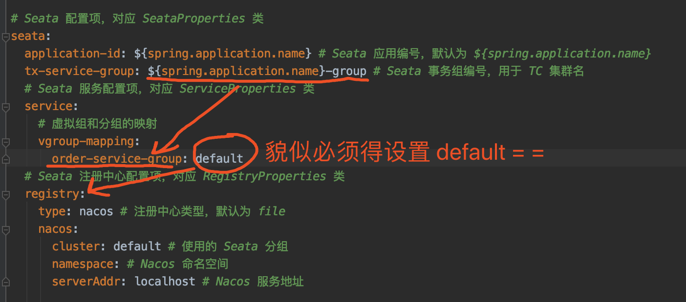

简单来说，就是多了一层**虚拟**映射。这里，我们不设置 `seata.service.grouplist` 配置项，因为从**注册中心**加载 Seata TC Server 的地址。

> 友情提示：可能胖友对 `seata.service.grouplist` 配置项有点懵逼，继续往下看就会明白了。

④ `seata.registry` 配置项，设置 Seata 注册中心配置项，对应 [RegistryProperties](https://github.com/seata/seata/blob/develop/seata-spring-boot-starter/src/main/java/io/seata/spring/boot/autoconfigure/properties/registry/RegistryProperties.java) 类。

- `type` 配置项，设置注册中心的类型，默认为 `false`。这里，我们设置为 `nacos` 来使用 Nacos 作为注册中心。
- `nacos` 配置项，设置 Nacos 注册中心的配置项。

注意！！！我们需要将 Seata TC Server 注册到 Nacos 注册中心中。不会的胖友，[《芋道 Seata 极简入门》](http://www.iocoder.cn/Seata/install/?self)文章的[「3. 部署集群 TC Server」](https://www.iocoder.cn/Dubbo/Seata/?self#)小节。

------

可能胖友不想从 Nacos 注册中心来读取 Seata TC Server 的地址，可以使用艿艿额外提供的 [`application-file.yaml`](https://github.com/YunaiV/SpringBoot-Labs/blob/master/lab-53/lab-53-seata-at-dubbo-demo/lab-53-seata-at-dubbo-demo-order-service/src/main/resources/application-file.yaml) 配置文件，覆盖到 `application.yaml` 配置文件中即可。内容如下：


```
server:
  port: 8081 # 端口

spring:
  application:
    name: order-service

  datasource:
    url: jdbc:mysql://127.0.0.1:3306/seata_order?useSSL=false&useUnicode=true&characterEncoding=UTF-8
    driver-class-name: com.mysql.jdbc.Driver
    username: root
    password:

# dubbo 配置项，对应 DubboConfigurationProperties 配置类
dubbo:
  # Dubbo 应用配置
  application:
    name: ${spring.application.name} # 应用名
  # Dubbo 注册中心配
  registry:
    address: nacos://127.0.0.1:8848 # 注册中心地址。个鞥多注册中心，可见 http://dubbo.apache.org/zh-cn/docs/user/references/registry/introduction.html 文档。
  # Dubbo 服务提供者协议配置
  protocol:
    port: -1 # 协议端口。使用 -1 表示随机端口。
    name: dubbo # 使用 `dubbo://` 协议。更多协议，可见 http://dubbo.apache.org/zh-cn/docs/user/references/protocol/introduction.html 文档
  # 配置扫描 Dubbo 自定义的 @Service 注解，暴露成 Dubbo 服务提供者
  scan:
    base-packages: cn.iocoder.springboot.lab53.orderservice.service

# Seata 配置项，对应 SeataProperties 类
seata:
  application-id: ${spring.application.name} # Seata 应用编号，默认为 ${spring.application.name}
  tx-service-group: ${spring.application.name}-group # Seata 事务组编号，用于 TC 集群名
  # 服务配置项，对应 ServiceProperties 类
  service:
    # 虚拟组和分组的映射
    vgroup-mapping:
      order-service-group: default
    # 分组和 Seata 服务的映射
    grouplist:
      default: 127.0.0.1:8091
```


差异点在于，删除了 `seata.registry` 配置项，增加 `seata.service.grouplist` 配置项来替代。原因如下图：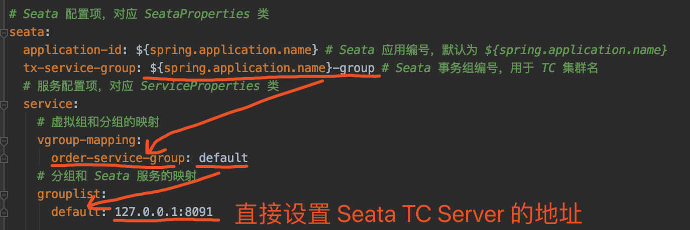

#### 2.2.3 OrderController

创建 [OrderController](https://github.com/YunaiV/SpringBoot-Labs/blob/master/lab-53/lab-53-seata-at-dubbo-demo/lab-53-seata-at-dubbo-demo-order-service/src/main/java/cn/iocoder/springboot/lab53/orderservice/controller/OrderController.java) 类，提供 `order/create` 下单 HTTP API。代码如下：


```
@RestController
@RequestMapping("/order")
public class OrderController {

    private Logger logger = LoggerFactory.getLogger(OrderController.class);

    @Reference
    private OrderService orderService;

    @PostMapping("/create")
    public Integer createOrder(@RequestParam("userId") Long userId,
                               @RequestParam("productId") Long productId,
                               @RequestParam("price") Integer price) throws Exception {
        logger.info("[createOrder] 收到下单请求,用户:{}, 商品:{}, 价格:{}", userId, productId, price);
        return orderService.createOrder(userId, productId, price);
    }

}
```


- 该 API 中，会调用 OrderService 进行下单。

> 友情提示：因为这个是示例项目，所以直接传入 `price` 参数，作为订单的金额，实际肯定不是这样的，哈哈哈~

#### 2.2.4 OrderService

创建 [OrderService](https://github.com/YunaiV/SpringBoot-Labs/blob/master/lab-53/lab-53-seata-at-dubbo-demo/lab-53-seata-at-dubbo-demo-order-service-api/src/main/java/cn/iocoder/springboot/lab53/orderservice/api/OrderService.java) 接口，定义了创建订单的方法。代码如下：


```
/**
 * 订单 Service
 */
public interface OrderService {

    /**
     * 创建订单
     *
     * @param userId 用户编号
     * @param productId 产品编号
     * @param price 价格
     * @return 订单编号
     * @throws Exception 创建订单失败，抛出异常
     */
    Integer createOrder(Long userId, Long productId, Integer price) throws Exception;

}
```


#### 2.2.5 OrderServiceImpl

创建 [OrderServiceImpl](https://github.com/YunaiV/SpringBoot-Labs/blob/master/lab-53/lab-53-seata-at-dubbo-demo/lab-53-seata-at-dubbo-demo-order-service/src/main/java/cn/iocoder/springboot/lab53/orderservice/service/OrderServiceImpl.java) 类，实现创建订单的方法。代码如下：


```
@org.apache.dubbo.config.annotation.Service
public class OrderServiceImpl implements OrderService {

    private Logger logger = LoggerFactory.getLogger(getClass());

    @Autowired
    private OrderDao orderDao;

    @Reference
    private AccountService accountService;
    @Reference
    private ProductService productService;

    @Override
    @GlobalTransactional // <1>
    public Integer createOrder(Long userId, Long productId, Integer price) throws Exception {
        Integer amount = 1; // 购买数量，暂时设置为 1。

        logger.info("[createOrder] 当前 XID: {}", RootContext.getXID());

        // <2> 扣减库存
        productService.reduceStock(productId, amount);

        // <3> 扣减余额
        accountService.reduceBalance(userId, price);

        // <4> 保存订单
        OrderDO order = new OrderDO().setUserId(userId).setProductId(productId).setPayAmount(amount * price);
        orderDao.saveOrder(order);
        logger.info("[createOrder] 保存订单: {}", order.getId());

        // 返回订单编号
        return order.getId();
    }

}
```


`<1>` 处，在类上，添加 Seata `@GlobalTransactional` 注解，**声明全局事务**。

`<2>` 和 `<3>` 处，在该方法中，调用 ProductService 扣除商品的库存，调用 AccountService 扣除账户的余额。

`<3>` 处，在全部调用成功后，调用 OrderDao 保存订单。

#### 2.2.6 OrderDao

创建 [OrderDao](https://github.com/YunaiV/SpringBoot-Labs/blob/master/lab-53/lab-53-seata-at-dubbo-demo/lab-53-seata-at-dubbo-demo-order-service/src/main/java/cn/iocoder/springboot/lab53/orderservice/dao/OrderDao.java) 接口，定义保存订单的操作。代码如下：


```
@Mapper
@Repository
public interface OrderDao {

    /**
     * 插入订单记录
     *
     * @param order 订单
     * @return 影响记录数量
     */
    @Insert("INSERT INTO orders (user_id, product_id, pay_amount) VALUES (#{userId}, #{productId}, #{payAmount})")
    @Options(useGeneratedKeys = true, keyColumn = "id", keyProperty = "id")
    int saveOrder(OrderDO order);

}
```


其中，[OrderDO](https://github.com/YunaiV/SpringBoot-Labs/blob/master/lab-53/lab-53-seata-at-dubbo-demo/lab-53-seata-at-dubbo-demo-order-service/src/main/java/cn/iocoder/springboot/lab53/orderservice/entity/OrderDO.java) **实体**类，对应 `orders` 表。代码如下：


```
/**
 * 订单实体
 */
public class OrderDO {

    /** 订单编号 **/
    private Integer id;

    /** 用户编号 **/
    private Long userId;

    /** 产品编号 **/
    private Long productId;

    /** 支付金额 **/
    private Integer payAmount;
    
    // ... 省略 setter/getter 方法
    
}
```


#### 2.2.7 OrderServiceApplication

创建 [OrderServiceApplication](https://github.com/YunaiV/SpringBoot-Labs/blob/master/lab-53/lab-53-seata-at-dubbo-demo/lab-53-seata-at-dubbo-demo-order-service/src/main/java/cn/iocoder/springboot/lab53/orderservice/OrderServiceApplication.java) 类，用于启动**订单**服务。代码如下：


```
@SpringBootApplication
public class OrderServiceApplication {

    public static void main(String[] args) {
        SpringApplication.run(OrderServiceApplication.class, args);
    }

}
```


### 2.3 商品服务

新建 [`lab-53-seata-at-dubbo-demo-product-service-api`](https://github.com/YunaiV/SpringBoot-Labs/blob/master/lab-53/lab-53-seata-at-dubbo-demo/lab-53-seata-at-dubbo-demo-product-service-api/) 和 [`lab-53-seata-at-dubbo-demo-product-service`](https://github.com/YunaiV/SpringBoot-Labs/blob/master/lab-53/lab-53-seata-at-dubbo-demo/lab-53-seata-at-dubbo-demo-product-service/) 项目，作为**商品**服务。项目如下图所示：

#### 2.3.1 引入依赖

创建 [`pom.xml`](https://github.com/YunaiV/SpringBoot-Labs/blob/master/lab-53/lab-53-seata-at-dubbo-demo/lab-53-seata-at-dubbo-demo-product-service/pom.xml) 文件，引入相关的依赖。和[「2.2.1 引入依赖」](https://www.iocoder.cn/Dubbo/Seata/?self#)是一致的，就不重复“贴”出来了，胖友点击 [`pom.xml`](https://github.com/YunaiV/SpringBoot-Labs/blob/master/lab-53/lab-53-seata-at-dubbo-demo/lab-53-seata-at-dubbo-demo-product-service/pom.xml) 文件查看。

#### 2.3.2 配置文件

创建 [`application.yaml`](https://github.com/YunaiV/SpringBoot-Labs/blob/master/lab-53/lab-53-seata-at-dubbo-demo/lab-53-seata-at-dubbo-demo-product-service/src/main/resources/application.yaml) 配置文件，添加相关的配置项。和[「2.2.2 配置文件」](https://www.iocoder.cn/Dubbo/Seata/?self#)是一致的，就不重复“贴”出来了，胖友点击 [`application.yaml`](https://github.com/YunaiV/SpringBoot-Labs/blob/master/lab-53/lab-53-seata-at-dubbo-demo/lab-53-seata-at-dubbo-demo-product-service/src/main/resources/application.yaml) 文件查看。

#### 2.3.3 ProductService

创建 [ProductService](https://github.com/YunaiV/SpringBoot-Labs/blob/master/lab-53/lab-53-seata-at-dubbo-demo/lab-53-seata-at-dubbo-demo-product-service-api/src/main/java/cn/iocoder/springboot/lab53/productservice/api/ProductService.java) 接口，定义了扣除库存的方法。代码如下：


```
/**
 * 商品 Service
 */
public interface ProductService {

    /**
     * 扣减库存
     *
     * @param productId 商品 ID
     * @param amount    扣减数量
     * @throws Exception 扣减失败时抛出异常
     */
    void reduceStock(Long productId, Integer amount) throws Exception;

}
```


#### 2.3.4 ProductServiceImpl

创建 [ProductServiceImpl](https://github.com/YunaiV/SpringBoot-Labs/blob/master/lab-53/lab-53-seata-at-dubbo-demo/lab-53-seata-at-dubbo-demo-product-service/src/main/java/cn/iocoder/springboot/lab53/productservice/service/ProductServiceImpl.java) 类，实现扣减库存的方法。代码如下：


```
@org.apache.dubbo.config.annotation.Service
public class ProductServiceImpl implements ProductService {

    private Logger logger = LoggerFactory.getLogger(getClass());

    @Autowired
    private ProductDao productDao;

    @Override
    @Transactional // <1> 开启新事物
    public void reduceStock(Long productId, Integer amount) throws Exception {
        logger.info("[reduceStock] 当前 XID: {}", RootContext.getXID());

        // <2> 检查库存
        checkStock(productId, amount);

        logger.info("[reduceStock] 开始扣减 {} 库存", productId);
        // <3> 扣减库存
        int updateCount = productDao.reduceStock(productId, amount);
        // 扣除成功
        if (updateCount == 0) {
            logger.warn("[reduceStock] 扣除 {} 库存失败", productId);
            throw new Exception("库存不足");
        }
        // 扣除失败
        logger.info("[reduceStock] 扣除 {} 库存成功", productId);
    }

    private void checkStock(Long productId, Integer requiredAmount) throws Exception {
        logger.info("[checkStock] 检查 {} 库存", productId);
        Integer stock = productDao.getStock(productId);
        if (stock < requiredAmount) {
            logger.warn("[checkStock] {} 库存不足，当前库存: {}", productId, stock);
            throw new Exception("库存不足");
        }
    }

}
```


`<1>` 处，在类上，添加了 Spring `@Transactional` 注解，**声明本地事务**。也就是说，此处会开启一个 `seata_product` 库的数据库事务。

- 

`<2>` 处，检查库存是否足够，如果不够则抛出 Exception 异常。因为我们需要通过异常，回滚全局异常。

`<3>` 处，进行扣除库存，如果扣除失败则抛出 Exception 异常。

#### 2.3.5 ProductDao

创建 [ProductDao](https://github.com/YunaiV/SpringBoot-Labs/blob/master/lab-53/lab-53-seata-at-dubbo-demo/lab-53-seata-at-dubbo-demo-product-service/src/main/java/cn/iocoder/springboot/lab53/productservice/dao/ProductDao.java) 接口，定义获取和扣除库存的操作。代码如下：


```
@Mapper
@Repository
public interface ProductDao {

    /**
     * 获取库存
     *
     * @param productId 商品编号
     * @return 库存
     */
    @Select("SELECT stock FROM product WHERE id = #{productId}")
    Integer getStock(@Param("productId") Long productId);

    /**
     * 扣减库存
     *
     * @param productId 商品编号
     * @param amount    扣减数量
     * @return 影响记录行数
     */
    @Update("UPDATE product SET stock = stock - #{amount} WHERE id = #{productId} AND stock >= #{amount}")
    int reduceStock(@Param("productId") Long productId, @Param("amount") Integer amount);

}
```


#### 2.3.6 ProductServiceApplication

创建 [ProductServiceApplication](https://github.com/YunaiV/SpringBoot-Labs/blob/master/lab-53/lab-53-seata-at-dubbo-demo/lab-53-seata-at-dubbo-demo-product-service/src/main/java/cn/iocoder/springboot/lab53/productservice/ProductServiceApplication.java) 类，用于启动**商品**服务。代码如下：


```
@SpringBootApplication
public class ProductServiceApplication {

    public static void main(String[] args) {
        SpringApplication.run(ProductServiceApplication.class, args);
    }

}
```


### 2.4 账户服务

新建 [`lab-53-seata-at-dubbo-demo-account-service-api`](https://github.com/YunaiV/SpringBoot-Labs/blob/master/lab-53/lab-53-seata-at-dubbo-demo/lab-53-seata-at-dubbo-demo-account-service-api/) 和 [`lab-53-seata-at-dubbo-demo-account-service`](https://github.com/YunaiV/SpringBoot-Labs/blob/master/lab-53/lab-53-seata-at-dubbo-demo/lab-53-seata-at-dubbo-demo-account-service/) 项目，作为**账户**服务。项目如下图所示：

#### 2.4.1 引入依赖

创建 [`pom.xml`](https://github.com/YunaiV/SpringBoot-Labs/blob/master/lab-53/lab-53-seata-at-dubbo-demo/lab-53-seata-at-dubbo-demo-account-service/pom.xml) 文件，引入相关的依赖。和[「2.2.1 引入依赖」](https://www.iocoder.cn/Dubbo/Seata/?self#)是一致的，就不重复“贴”出来了，胖友点击 [`pom.xml`](https://github.com/YunaiV/SpringBoot-Labs/blob/master/lab-53/lab-53-seata-at-dubbo-demo/lab-53-seata-at-dubbo-demo-account-service/pom.xml) 文件查看。

#### 2.4.2 配置文件

创建 [`application.yaml`](https://github.com/YunaiV/SpringBoot-Labs/blob/master/lab-53/lab-53-seata-at-dubbo-demo/lab-53-seata-at-dubbo-demo-account-service/src/main/resources/application.yaml) 配置文件，添加相关的配置项。和[「2.2.2 配置文件」](https://www.iocoder.cn/Dubbo/Seata/?self#)是一致的，就不重复“贴”出来了，胖友点击 [`application.yaml`](https://github.com/YunaiV/SpringBoot-Labs/blob/master/lab-53/lab-53-seata-at-dubbo-demo/lab-53-seata-at-dubbo-demo-account-service/src/main/resources/application.yaml) 文件查看。

#### 2.4.3 AccountService

创建 [AccountService](https://github.com/YunaiV/SpringBoot-Labs/blob/master/lab-53/lab-53-seata-at-dubbo-demo/lab-53-seata-at-dubbo-demo-account-service-api/src/main/java/cn/iocoder/springboot/lab53/accountservice/api/AccountService.java) 类，定义扣除余额的方法。代码如下：


```
/**
 * 账户 Service
 */
public interface AccountService {

    /**
     * 扣除余额
     *
     * @param userId 用户编号
     * @param price  扣减金额
     * @throws Exception 失败时抛出异常
     */
    void reduceBalance(Long userId, Integer price) throws Exception;

}
```


#### 2.3.4 AccountServiceImpl

创建 [AccountServiceImpl](https://github.com/YunaiV/SpringBoot-Labs/blob/master/lab-53/lab-53-seata-at-dubbo-demo/lab-53-seata-at-dubbo-demo-account-service/src/main/java/cn/iocoder/springboot/lab53/accountservice/service/AccountServiceImpl.java) 类，实现扣除余额的方法。代码如下：


```
@org.apache.dubbo.config.annotation.Service
public class AccountServiceImpl implements AccountService {

    private Logger logger = LoggerFactory.getLogger(getClass());

    @Autowired
    private AccountDao accountDao;

    @Override
    @Transactional // <1> 开启新事物
    public void reduceBalance(Long userId, Integer price) throws Exception {
        logger.info("[reduceBalance] 当前 XID: {}", RootContext.getXID());

        // <2> 检查余额
        checkBalance(userId, price);

        logger.info("[reduceBalance] 开始扣减用户 {} 余额", userId);
        // <3> 扣除余额
        int updateCount = accountDao.reduceBalance(price);
        // 扣除成功
        if (updateCount == 0) {
            logger.warn("[reduceBalance] 扣除用户 {} 余额失败", userId);
            throw new Exception("余额不足");
        }
        logger.info("[reduceBalance] 扣除用户 {} 余额成功", userId);
    }

    private void checkBalance(Long userId, Integer price) throws Exception {
        logger.info("[checkBalance] 检查用户 {} 余额", userId);
        Integer balance = accountDao.getBalance(userId);
        if (balance < price) {
            logger.warn("[checkBalance] 用户 {} 余额不足，当前余额:{}", userId, balance);
            throw new Exception("余额不足");
        }
    }

}
```


`<1>` 处，在类上，添加了 Spring `@Transactional` 注解，**声明本地事务**。也就是说，此处会开启一个 `seata_account` 库的数据库事务。

`<2>` 处，检查余额是否足够，如果不够则抛出 Exception 异常。因为我们需要通过异常，回滚全局异常。

`<3>` 处，进行扣除余额，如果扣除失败则抛出 Exception 异常。

#### 2.4.5 AccountDao

创建 [AccountDao](https://github.com/YunaiV/SpringBoot-Labs/blob/master/lab-53/lab-53-seata-at-dubbo-demo/lab-53-seata-at-dubbo-demo-account-service/src/main/java/cn/iocoder/springboot/lab53/accountservice/dao/AccountDao.java) 接口，定义获取和扣除库存的操作。代码如下：


```
@Mapper
@Repository
public interface AccountDao {

    /**
     * 获取账户余额
     *
     * @param userId 用户 ID
     * @return 账户余额
     */
    @Select("SELECT balance FROM account WHERE id = #{userId}")
    Integer getBalance(@Param("userId") Long userId);

    /**
     * 扣减余额
     *
     * @param price 需要扣减的数目
     * @return 影响记录行数
     */
    @Update("UPDATE account SET balance = balance - #{price} WHERE id = 1 AND balance >= ${price}")
    int reduceBalance(@Param("price") Integer price);

}
```


#### 2.4.6 AccountServiceApplication

创建 [AccountServiceApplication](https://github.com/YunaiV/SpringBoot-Labs/blob/master/lab-53/lab-53-seata-at-dubbo-demo/lab-53-seata-at-dubbo-demo-account-service/src/main/java/cn/iocoder/springboot/lab53/accountservice/AccountServiceApplication.java) 类，用于启动**账户**服务。代码如下：


```
@SpringBootApplication
public class AccountServiceApplication {

    public static void main(String[] args) {
        SpringApplication.run(AccountServiceApplication.class, args);
    }

}
```


### 2.5 简单测试

下面，我们将测试两种情况：

1. 分布式事务正常提交
2. 分布式事务异常回滚

执行 **Product**ServiceApplication 启动**商品**服务。相关的日志，胖友自己瞅瞅。 执行 **Account**ServiceApplication 启动**账户**服务。相关的日志，胖友自己瞅瞅。

**Debug** 执行 **Order**ServiceApplication 启动**订单**服务。此时，我们可以看到 Seata 相关日志如下：

> 友情提示：日志的顺序，艿艿做了简单的整理，为了更容易阅读。


```
# ... 上面还有 Seata 相关 Bean 初始化的日志，忘记加进来了，嘿嘿~

# 给数据源增加 Seata 的数据源代理
2020-04-05 21:31:37.818  INFO 64204 --- [           main] s.s.a.d.SeataDataSourceBeanPostProcessor : Auto proxy of [dataSource]
2020-04-05 21:31:37.820  INFO 64204 --- [           main] com.zaxxer.hikari.HikariDataSource       : HikariPool-1 - Starting...
2020-04-05 21:31:38.016  INFO 64204 --- [           main] com.zaxxer.hikari.HikariDataSource       : HikariPool-1 - Start completed.
# 加载 Druid 提供的 SQL 解析器
2020-04-05 21:31:38.059  INFO 64204 --- [           main] i.s.common.loader.EnhancedServiceLoader  : load DbTypeParser[druid] extension by class[io.seata.sqlparser.druid.DruidDelegatingDbTypeParser]
# 加载 Seata 使用 Nacos 注册中心的拓展，从而加载 Seata TC Server 的地址
2020-04-05 21:31:38.071  INFO 64204 --- [           main] i.s.common.loader.EnhancedServiceLoader  : load RegistryProvider[Nacos] extension by class[io.seata.discovery.registry.nacos.NacosRegistryProvider]
# 连接到某个 Seata TC Server 服务器
2020-04-05 21:31:38.315  INFO 64204 --- [           main] i.s.c.r.netty.NettyClientChannelManager  : will connect to 10.37.129.2:28091
2020-04-05 21:31:38.318  INFO 64204 --- [           main] i.s.core.rpc.netty.NettyPoolableFactory  : NettyPool create channel to transactionRole:RMROLE,address:10.37.129.2:28091,msg:< RegisterRMRequest{resourceIds='jdbc:mysql://127.0.0.1:3306/seata_order', applicationId='order-service', transactionServiceGroup='order-service-group'} >
# 加载 Seata 序列化器
2020-04-05 21:31:38.441  INFO 64204 --- [lector_RMROLE_1] i.s.common.loader.EnhancedServiceLoader  : load Serializer[SEATA] extension by class[io.seata.serializer.seata.SeataSerializer]
# 连接到另一个 Seata TC Server 服务器
2020-04-05 21:31:38.474  INFO 64204 --- [           main] i.s.c.r.netty.NettyClientChannelManager  : will connect to 10.37.129.2:18091
2020-04-05 21:31:38.474  INFO 64204 --- [           main] i.s.core.rpc.netty.NettyPoolableFactory  : NettyPool create channel to transactionRole:RMROLE,address:10.37.129.2:18091,msg:< RegisterRMRequest{resourceIds='jdbc:mysql://127.0.0.1:3306/seata_order', applicationId='order-service', transactionServiceGroup='order-service-group'} >
# 注册 Seata Resource Manager 到某个 Seata TC Server 成功 
2020-04-05 21:31:38.315  INFO 64204 --- [           main] io.seata.core.rpc.netty.RmRpcClient      : RM will register :jdbc:mysql://127.0.0.1:3306/seata_order
2020-04-05 21:31:38.463  INFO 64204 --- [           main] io.seata.core.rpc.netty.RmRpcClient      : register RM success. server version:1.1.0,channel:[id: 0x5a7a3adb, L:/10.37.129.2:61910 - R:/10.37.129.2:28091]
2020-04-05 21:31:38.474  INFO 64204 --- [           main] i.s.core.rpc.netty.NettyPoolableFactory  : register success, cost 64 ms, version:1.1.0,role:RMROLE,channel:[id: 0x5a7a3adb, L:/10.37.129.2:61910 - R:/10.37.129.2:28091]
# 注册 Seata Resource Manager 到另一个 Seata TC Server 成功 
2020-04-05 21:31:38.474  INFO 64204 --- [           main] io.seata.core.rpc.netty.RmRpcClient      : RM will register :jdbc:mysql://127.0.0.1:3306/seata_order
2020-04-05 21:31:38.478  INFO 64204 --- [           main] io.seata.core.rpc.netty.RmRpcClient      : register RM success. server version:1.1.0,channel:[id: 0x84e2337c, L:/10.37.129.2:61911 - R:/10.37.129.2:18091]
2020-04-05 21:31:38.478  INFO 64204 --- [           main] i.s.core.rpc.netty.NettyPoolableFactory  : register success, cost 3 ms, version:1.1.0,role:RMROLE,channel:[id: 0x84e2337c, L:/10.37.129.2:61911 - R:/10.37.129.2:18091]
# 因为 OrderServiceImpl 添加了 `@GlobalTransactional` 注解，所以创建其代理，用于全局事务。
2020-04-05 21:31:39.107  INFO 64204 --- [           main] i.s.s.a.GlobalTransactionScanner         : Bean[cn.iocoder.springboot.lab53.orderservice.service.OrderServiceImpl] with name [orderServiceImpl] would use interceptor [io.seata.spring.annotation.GlobalTransactionalInterceptor]
```


#### 2.5.1 正常流程

① 先查询下目前数据库的数据情况。如下图所示：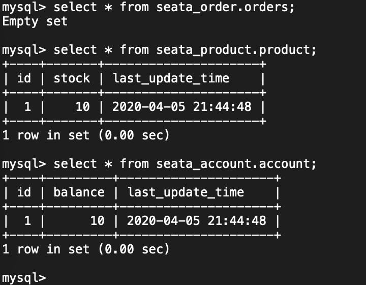

② 使用 Postman 模拟调用 <http://127.0.0.1:8081/order/create> 创建订单的接口，如下图所示：

此时，在控制台打印日志如下图所示：

- **订单**服务：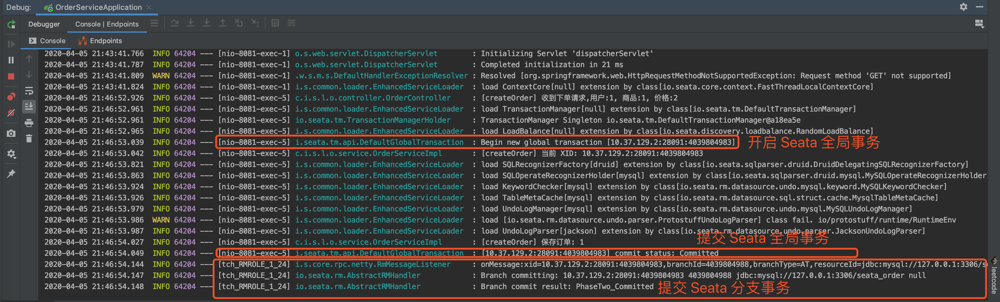
- **商品**服务：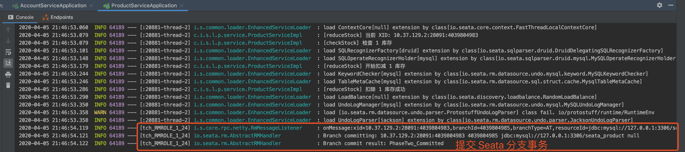
- **账户**服务：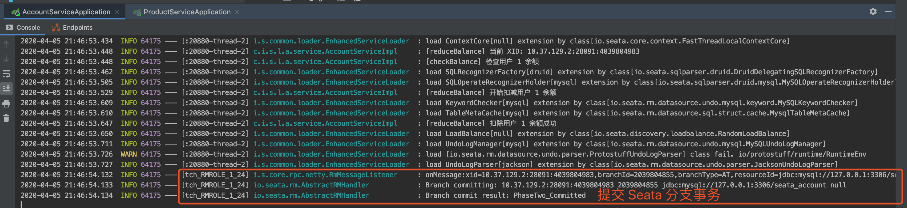

再查询下目前数据库的数据情况。如下图所示：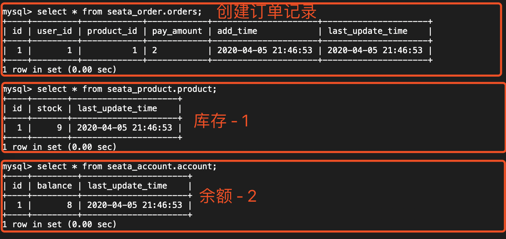

#### 2.5.2 异常流程

① 先查询下目前数据库的数据情况。如下图所示：

② 在 OrderServiceImpl 的 `#createOrder(...)` 方法上，打上断点如下图，方便我们看到 `product` 表的 `balance` 被减少：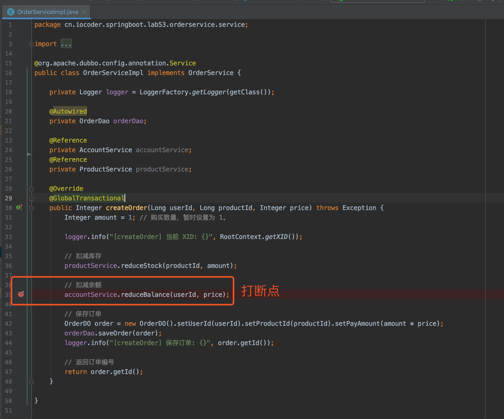

> 友情提示：这里忘记截图了，稍后 IDEA 停留在该断点时，胖友可以去查询 `product` 表，会发现 `balance` 已经减少。

③ 使用 Postman 模拟调用 <http://127.0.0.1:8081/order/create> 创建订单的接口，如下图所示：

此时，在控制台打印日志如下图所示：

- **订单**服务：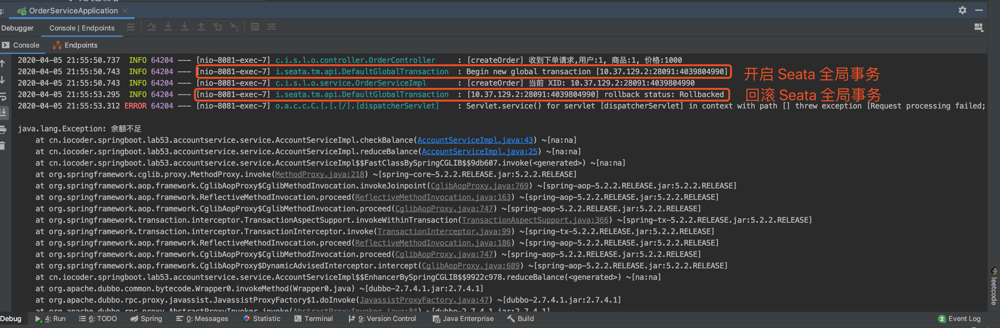
- **商品**服务：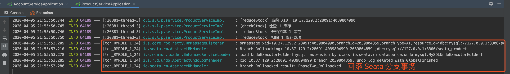
- **账户**服务：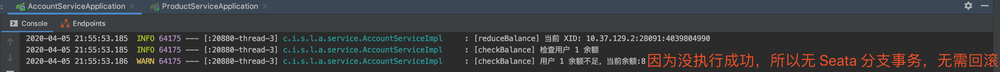

再查询下目前数据库的数据情况。如下图所示：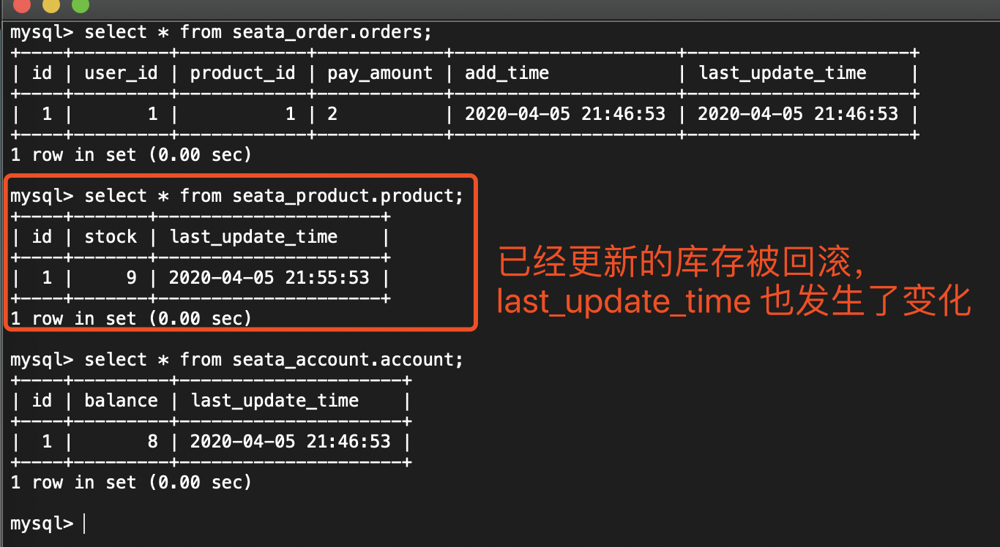