# 芋道 Spring Boot 分布式事务 Seata 入门

- [1. 概述](http://www.iocoder.cn/Spring-Boot/Seata/)
- [2. AT 模式 + 多数据源](http://www.iocoder.cn/Spring-Boot/Seata/)
- [3. AT 模式 + HttpClient 远程调用](http://www.iocoder.cn/Spring-Boot/Seata/)

------

------

> 本文在提供完整代码示例，可见 <https://github.com/YunaiV/SpringBoot-Labs> 的 [lab-52](https://github.com/YunaiV/SpringBoot-Labs/tree/master/lab-52) 目录。
>
> 原创不易，给点个 [Star](https://github.com/YunaiV/SpringBoot-Labs/stargazers) 嘿，一起冲鸭！

## 1. 概述

在[《芋道 Seata 极简入门》](http://www.iocoder.cn/Seata/install/?self)文章中，我们对 Seata 进行了简单的了解，并完成了 Seata 的部署。而本文，我们将**纯** Spring Boot 应用接入 Seata 来实现分布式事务。

> [Seata](https://github.com/seata/seata) 是**阿里**开源的一款开源的**分布式事务**解决方案，致力于提供高性能和简单易用的分布式事务服务。

## 2. AT 模式 + 多数据源

> 示例代码对应仓库：[`lab-52-multiple-datasource`](https://github.com/YunaiV/SpringBoot-Labs/blob/master/lab-52/lab-52-multiple-datasource/) 。

在 Spring Boot **单体**项目中，如果使用了**多个**数据源，我们就需要考虑多个数据源的**一致性**，面临分布式事务的问题。本小节，我们将使用 Seata 的 AT 模式，解决该问题。

> 友情提示：对 Seata 的 AT 模式不了解的胖友，可以阅读[《Seata 文档 —— AT 模式》](https://seata.io/zh-cn/docs/dev/mode/at-mode.html)文档。

我们以用户**购买商品**的业务逻辑，来作为具体示例，一共会有三个模块的 Service，分别对应不同的数据库。整体如下图所示：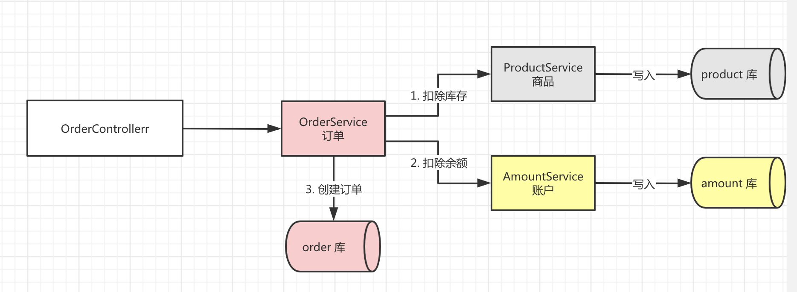

下面，我们来新建 [`lab-52-multiple-datasource`](https://github.com/YunaiV/SpringBoot-Labs/blob/master/lab-52/lab-52-multiple-datasource/) 项目，最终结构如下图：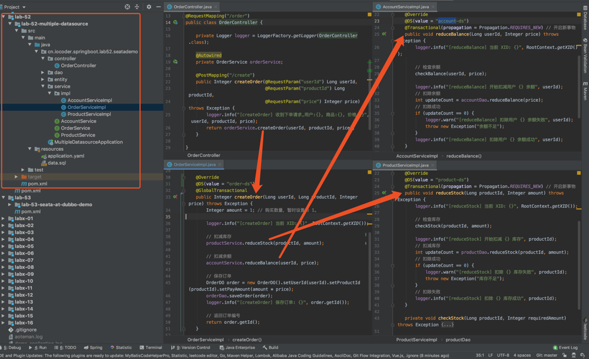

### 2.1 初始化数据库

使用 [`data.sql`](https://github.com/YunaiV/SpringBoot-Labs/blob/master/lab-52/lab-52-multiple-datasource/src/main/resources/data.sql) 脚本，创建 `seata_order`、`seata_storage`、`seata_amount` **三个库**。脚本内容如下：


```
# Order
DROP DATABASE IF EXISTS seata_order;
CREATE DATABASE seata_order;

CREATE TABLE seata_order.orders
(
    id               INT(11) NOT NULL AUTO_INCREMENT,
    user_id          INT(11)        DEFAULT NULL,
    product_id       INT(11)        DEFAULT NULL,
    pay_amount       DECIMAL(10, 0) DEFAULT NULL,
    add_time         DATETIME       DEFAULT CURRENT_TIMESTAMP,
    last_update_time DATETIME       DEFAULT CURRENT_TIMESTAMP ON UPDATE CURRENT_TIMESTAMP,
    PRIMARY KEY (id)
) ENGINE = InnoDB AUTO_INCREMENT = 1 DEFAULT CHARSET = utf8;

CREATE TABLE seata_order.undo_log
(
    id            BIGINT(20)   NOT NULL AUTO_INCREMENT,
    branch_id     BIGINT(20)   NOT NULL,
    xid           VARCHAR(100) NOT NULL,
    context       VARCHAR(128) NOT NULL,
    rollback_info LONGBLOB     NOT NULL,
    log_status    INT(11)      NOT NULL,
    log_created   DATETIME     NOT NULL,
    log_modified  DATETIME     NOT NULL,
    PRIMARY KEY (id),
    UNIQUE KEY ux_undo_log (xid, branch_id)
) ENGINE = InnoDB AUTO_INCREMENT = 1 DEFAULT CHARSET = utf8;

# Storage
DROP DATABASE IF EXISTS seata_storage;
CREATE DATABASE seata_storage;

CREATE TABLE seata_storage.product
(
    id               INT(11) NOT NULL AUTO_INCREMENT,
    stock            INT(11)  DEFAULT NULL,
    last_update_time DATETIME DEFAULT CURRENT_TIMESTAMP ON UPDATE CURRENT_TIMESTAMP,
    PRIMARY KEY (id)
) ENGINE = InnoDB AUTO_INCREMENT = 1 DEFAULT CHARSET = utf8;
INSERT INTO seata_storage.product (id, stock) VALUES (1, 10); # 插入一条产品的库存

CREATE TABLE seata_storage.undo_log
(
    id            BIGINT(20)   NOT NULL AUTO_INCREMENT,
    branch_id     BIGINT(20)   NOT NULL,
    xid           VARCHAR(100) NOT NULL,
    context       VARCHAR(128) NOT NULL,
    rollback_info LONGBLOB     NOT NULL,
    log_status    INT(11)      NOT NULL,
    log_created   DATETIME     NOT NULL,
    log_modified  DATETIME     NOT NULL,
    PRIMARY KEY (id),
    UNIQUE KEY ux_undo_log (xid, branch_id)
) ENGINE = InnoDB AUTO_INCREMENT = 1 DEFAULT CHARSET = utf8;

# Amount
DROP DATABASE IF EXISTS seata_amount;
CREATE DATABASE seata_amount;

CREATE TABLE seata_amount.account
(
    id               INT(11) NOT NULL AUTO_INCREMENT,
    balance          DOUBLE   DEFAULT NULL,
    last_update_time DATETIME DEFAULT CURRENT_TIMESTAMP ON UPDATE CURRENT_TIMESTAMP,
    PRIMARY KEY (id)
) ENGINE = InnoDB AUTO_INCREMENT = 1  DEFAULT CHARSET = utf8;

CREATE TABLE seata_amount.undo_log
(
    id            BIGINT(20)   NOT NULL AUTO_INCREMENT,
    branch_id     BIGINT(20)   NOT NULL,
    xid           VARCHAR(100) NOT NULL,
    context       VARCHAR(128) NOT NULL,
    rollback_info LONGBLOB     NOT NULL,
    log_status    INT(11)      NOT NULL,
    log_created   DATETIME     NOT NULL,
    log_modified  DATETIME     NOT NULL,
    PRIMARY KEY (id),
    UNIQUE KEY ux_undo_log (xid, branch_id)
) ENGINE = InnoDB AUTO_INCREMENT = 1 DEFAULT CHARSET = utf8;
INSERT INTO seata_amount.account (id, balance) VALUES (1, 1);
```


其中，每个库中的 [`undo_log`](https://github.com/seata/seata/blob/develop/script/client/at/db/mysql.sql) 表，是 Seata AT 模式必须创建的表，主要用于分支事务的回滚。

另外，考虑到测试方便，我们插入了一条 `id = 1` 的 `account` 记录，和一条 `id = 1` 的 `product` 记录。

### 2.2 引入依赖

创建 [`pom.xml`](https://github.com/YunaiV/SpringBoot-Labs/blob/master/lab-52/lab-52-multiple-datasource/pom.xml) 文件，引入相关的依赖。内容如下：


```
<?xml version="1.0" encoding="UTF-8"?>
<project xmlns="http://maven.apache.org/POM/4.0.0"
         xmlns:xsi="http://www.w3.org/2001/XMLSchema-instance"
         xsi:schemaLocation="http://maven.apache.org/POM/4.0.0 http://maven.apache.org/xsd/maven-4.0.0.xsd">
    <parent>
        <groupId>org.springframework.boot</groupId>
        <artifactId>spring-boot-starter-parent</artifactId>
        <version>2.2.2.RELEASE</version>
        <relativePath/> <!-- lookup parent from repository -->
    </parent>
    <modelVersion>4.0.0</modelVersion>

    <artifactId>lab-52-multiple-datasource</artifactId>

    <dependencies>
        <!-- 实现对 Spring MVC 的自动化配置 -->
        <dependency>
            <groupId>org.springframework.boot</groupId>
            <artifactId>spring-boot-starter-web</artifactId>
        </dependency>

        <!-- 实现对数据库连接池的自动化配置 -->
        <dependency>
            <groupId>org.springframework.boot</groupId>
            <artifactId>spring-boot-starter-jdbc</artifactId>
        </dependency>
        <dependency> <!-- 本示例，我们使用 MySQL -->
            <groupId>mysql</groupId>
            <artifactId>mysql-connector-java</artifactId>
            <version>5.1.48</version>
        </dependency>

        <!-- 实现对 MyBatis 的自动化配置 -->
        <dependency>
            <groupId>org.mybatis.spring.boot</groupId>
            <artifactId>mybatis-spring-boot-starter</artifactId>
            <version>2.1.2</version>
        </dependency>

        <!-- 实现对 dynamic-datasource 的自动化配置 -->
        <dependency>
            <groupId>com.baomidou</groupId>
            <artifactId>dynamic-datasource-spring-boot-starter</artifactId>
            <version>3.0.0</version>
        </dependency>

        <!-- 实现对 Seata 的自动化配置 -->
        <dependency>
            <groupId>io.seata</groupId>
            <artifactId>seata-spring-boot-starter</artifactId>
            <version>1.1.0</version>
        </dependency>
    </dependencies>

</project>
```


① 引入 [`dynamic-datasource-spring-boot-starter`](https://mvnrepository.com/artifact/com.baomidou/dynamic-datasource-spring-boot-starter) 依赖，实现对 [`dynamic-datasource`](https://mp.baomidou.com/guide/dynamic-datasource.html) 的自动配置，用于多数据源的**切换**功能。

> 友情提示：关于数据源的切换功能，胖友可以阅读[《芋道 Spring Boot 多数据源（读写分离）入门》](http://www.iocoder.cn/Spring-Boot/dynamic-datasource/?self)文章，贼详细。

② 引入 [`seata-spring-boot-starter`](https://mvnrepository.com/artifact/io.seata/seata-spring-boot-starter) 依赖，实现对 Seata 的自动配置。

### 2.3 配置文件

创建 [`application.yaml`](https://github.com/YunaiV/SpringBoot-Labs/blob/master/lab-52/lab-52-multiple-datasource/src/main/resources/application.yaml) 配置文件，添加相关的配置项。内容如下：


```
server:
  port: 8081 # 端口

spring:
  application:
    name: multi-datasource-service  # 应用名

  datasource:
    # dynamic-datasource-spring-boot-starter 动态数据源的配配项，对应 DynamicDataSourceProperties 类
    dynamic:
      primary: order-ds # 设置默认的数据源或者数据源组，默认值即为 master
      datasource:
        # 订单 order 数据源配置
        order-ds:
          url: jdbc:mysql://127.0.0.1:3306/seata_order?useSSL=false&useUnicode=true&characterEncoding=UTF-8
          driver-class-name: com.mysql.jdbc.Driver
          username: root
          password:
        # 账户 pay 数据源配置
        amount-ds:
          url: jdbc:mysql://127.0.0.1:3306/seata_pay?useSSL=false&useUnicode=true&characterEncoding=UTF-8
          driver-class-name: com.mysql.jdbc.Driver
          username: root
          password:
        # 库存 storage 数据源配置
        storage-ds:
          url: jdbc:mysql://127.0.0.1:3306/seata_storage?useSSL=false&useUnicode=true&characterEncoding=UTF-8
          driver-class-name: com.mysql.jdbc.Driver
          username: root
          password:
      seata: true # 是否启动对 Seata 的集成

# Seata 配置项，对应 SeataProperties 类
seata:
  application-id: ${spring.application.name} # Seata 应用编号，默认为 ${spring.application.name}
  tx-service-group: ${spring.application.name}-group # Seata 事务组编号，用于 TC 集群名
  # 服务配置项，对应 ServiceProperties 类
  service:
    # 虚拟组和分组的映射
    vgroup-mapping:
      multi-datasource-service-group: default
    # 分组和 Seata 服务的映射
    grouplist:
      default: 127.0.0.1:8091
```


① `spring.datasource.dynamic` 配置项，设置 `dynamic-datasource-spring-boot-starter` 动态数据源的配置项，对应 [DynamicDataSourceProperties](https://github.com/baomidou/dynamic-datasource-spring-boot-starter/blob/master/src/main/java/com/baomidou/dynamic/datasource/spring/boot/autoconfigure/DynamicDataSourceProperties.java) 类。

**注意**，一定要设置 `spring.datasource.dynamic.seata` 配置项为 `true`，开启对 Seata 的集成！！！艿艿一开始忘记配置，导致 Seata 全局事务回滚失败。

② `seata` 配置项，设置 Seata 的配置项目，对应 [SeataProperties](https://github.com/seata/seata/blob/develop/seata-spring-boot-starter/src/main/java/io/seata/spring/boot/autoconfigure/properties/SeataProperties.java) 类。

- `application-id` 配置项，对应 Seata 应用编号，默认为 `${spring.application.name}`。实际上，可以不进行设置。
- `tx-service-group` 配置项，Seata 事务组编号，用于 TC 集群名。

③ `seata.service` 配置项，Seata 服务配置项，对应 [ServiceProperties](https://github.com/seata/seata/blob/develop/seata-spring-boot-starter/src/main/java/io/seata/spring/boot/autoconfigure/properties/file/ServiceProperties.java) 类。它主要用于 Seata 在事务分组的特殊设计，可见[《Seata 文档 —— 事务分组专题》](https://seata.io/zh-cn/docs/user/transaction-group.html)。如果不能理解的胖友，可以见如下图：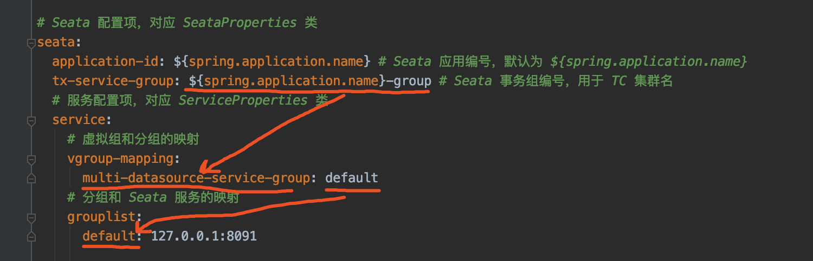

简单来说，就是多了一层**虚拟**映射。这里，我们**直接**设置 TC Server 的地址，为 `127.0.0.1:8091`。

### 2.4 订单模块

#### 2.4.1 OrderController

创建 [OrderController](https://github.com/YunaiV/SpringBoot-Labs/blob/master/lab-52/lab-52-multiple-datasource/src/main/java/cn/iocoder/springboot/lab52/seatademo/controller/OrderController.java) 类，提供 `order/create` 下单 HTTP API。代码如下：


```
@RestController
@RequestMapping("/order")
public class OrderController {

    private Logger logger = LoggerFactory.getLogger(OrderController.class);

    @Autowired
    private OrderService orderService;

    @PostMapping("/create")
    public Integer createOrder(@RequestParam("userId") Long userId,
                               @RequestParam("productId") Long productId,
                               @RequestParam("price") Integer price) throws Exception {
        logger.info("[createOrder] 收到下单请求,用户:{}, 商品:{}, 价格:{}", userId, productId, price);
        return orderService.createOrder(userId, productId, price);
    }

}
```


- 该 API 中，会调用 OrderService 进行下单。

> 友情提示：因为这个是示例项目，所以直接传入 `price` 参数，作为订单的金额，实际肯定不是这样的，哈哈哈~

#### 2.4.2 OrderService

创建 [OrderService](https://github.com/YunaiV/SpringBoot-Labs/blob/master/lab-52/lab-52-multiple-datasource/src/main/java/cn/iocoder/springboot/lab52/seatademo/service/OrderService.java) 接口，定义了创建订单的方法。代码如下：


```
/**
 * 订单 Service
 */
public interface OrderService {

    /**
     * 创建订单
     *
     * @param userId 用户编号
     * @param productId 产品编号
     * @param price 价格
     * @return 订单编号
     * @throws Exception 创建订单失败，抛出异常
     */
    Integer createOrder(Long userId, Long productId, Integer price) throws Exception;

}
```


#### 2.4.3 OrderServiceImpl

创建 [OrderServiceImpl](https://github.com/YunaiV/SpringBoot-Labs/blob/master/lab-52/lab-52-multiple-datasource/src/main/java/cn/iocoder/springboot/lab52/seatademo/service/impl/OrderServiceImpl.java) 类，实现创建订单的方法。代码如下：


```
@Service
public class OrderServiceImpl implements OrderService {

    private Logger logger = LoggerFactory.getLogger(getClass());

    @Autowired
    private OrderDao orderDao;

    @Autowired
    private AccountService accountService;

    @Autowired
    private ProductService productService;

    @Override
    @DS(value = "order-ds") // <1>
    @GlobalTransactional // <2>
    public Integer createOrder(Long userId, Long productId, Integer price) throws Exception {
        Integer amount = 1; // 购买数量，暂时设置为 1。

        logger.info("[createOrder] 当前 XID: {}", RootContext.getXID());

        // <3> 扣减库存
        productService.reduceStock(productId, amount);

        // <4> 扣减余额
        accountService.reduceBalance(userId, price);

        // <5> 保存订单
        OrderDO order = new OrderDO().setUserId(userId).setProductId(productId).setPayAmount(amount * price);
        orderDao.saveOrder(order);
        logger.info("[createOrder] 保存订单: {}", order.getId());

        // 返回订单编号
        return order.getId();
    }

}
```


`<1>` 处，在类上，添加了 `@DS` 注解，设置使用 `order-ds` 订单数据源。

`<2>` 处，在类上，添加 Seata `@GlobalTransactional` 注解，**声明全局事务**。

`<3>` 和 `<4>` 处，在该方法中，调用 ProductService 扣除商品的库存，调用 AccountService 扣除账户的余额。虽然说，调用是 **JVM 进程**内的，但是 ProductService 操作的是 `product-ds` 商品数据源，AccountService 操作的是 `account-ds` 账户数据源。

`<5>` 处，在全部调用成功后，调用 OrderDao 保存订单。

#### 2.4.4 OrderDao

创建 [OrderDao](https://github.com/YunaiV/SpringBoot-Labs/blob/master/lab-52/lab-52-multiple-datasource/src/main/java/cn/iocoder/springboot/lab52/seatademo/dao/OrderDao.java) 接口，定义保存订单的操作。代码如下：


```
@Mapper
@Repository
public interface OrderDao {

    /**
     * 插入订单记录
     *
     * @param order 订单
     * @return 影响记录数量
     */
    @Insert("INSERT INTO orders (user_id, product_id, pay_amount) VALUES (#{userId}, #{productId}, #{payAmount})")
    @Options(useGeneratedKeys = true, keyColumn = "id", keyProperty = "id")
    int saveOrder(OrderDO order);

}
```


其中，[OrderDO](https://github.com/YunaiV/SpringBoot-Labs/blob/master/lab-52/lab-52-multiple-datasource/src/main/java/cn/iocoder/springboot/lab52/seatademo/entity/OrderDO.java) **实体**类，对应 `orders` 表。代码如下：


```
/**
 * 订单实体
 */
public class OrderDO {

    /** 订单编号 **/
    private Integer id;

    /** 用户编号 **/
    private Long userId;

    /** 产品编号 **/
    private Long productId;

    /** 支付金额 **/
    private Integer payAmount;
    
    // ... 省略 setter/getter 方法
    
}
```


### 2.5 商品模块

#### 2.5.1 ProductService

创建 [ProductService](https://github.com/YunaiV/SpringBoot-Labs/blob/master/lab-52/lab-52-multiple-datasource/src/main/java/cn/iocoder/springboot/lab52/seatademo/service/ProductService.java) 接口，定义了扣除库存的方法。代码如下：


```
/**
 * 商品 Service
 */
public interface ProductService {

    /**
     * 扣减库存
     *
     * @param productId 商品 ID
     * @param amount    扣减数量
     * @throws Exception 扣减失败时抛出异常
     */
    void reduceStock(Long productId, Integer amount) throws Exception;

}
```


#### 2.5.2 ProductServiceImpl

创建 [ProductServiceImpl](https://github.com/YunaiV/SpringBoot-Labs/blob/master/lab-52/lab-52-multiple-datasource/src/main/java/cn/iocoder/springboot/lab52/seatademo/service/impl/ProductServiceImpl.java) 类，实现扣减库存的方法。代码如下：


```
@Service
public class ProductServiceImpl implements ProductService {

    private Logger logger = LoggerFactory.getLogger(getClass());

    @Autowired
    private ProductDao productDao;

    @Override
    @DS(value = "product-ds") // <1>
    @Transactional(propagation = Propagation.REQUIRES_NEW) // <2> 开启新事物
    public void reduceStock(Long productId, Integer amount) throws Exception {
        logger.info("[reduceStock] 当前 XID: {}", RootContext.getXID());

        // <3> 检查库存
        checkStock(productId, amount);

        logger.info("[reduceStock] 开始扣减 {} 库存", productId);
        // <4> 扣减库存
        int updateCount = productDao.reduceStock(productId, amount);
        // 扣除成功
        if (updateCount == 0) {
            logger.warn("[reduceStock] 扣除 {} 库存失败", productId);
            throw new Exception("库存不足");
        }
        // 扣除失败
        logger.info("[reduceStock] 扣除 {} 库存成功", productId);
    }

    private void checkStock(Long productId, Integer requiredAmount) throws Exception {
        logger.info("[checkStock] 检查 {} 库存", productId);
        Integer stock = productDao.getStock(productId);
        if (stock < requiredAmount) {
            logger.warn("[checkStock] {} 库存不足，当前库存: {}", productId, stock);
            throw new Exception("库存不足");
        }
    }

}
```


`<1>` 处，在类上，添加了 `@DS` 注解，设置使用 `product-ds` 商品数据源。

`<2>` 处，在类上，添加了 Spring `@Transactional` 注解，**声明本地事务**。也就是说，此处会开启一个 `seata_product` 库的数据库事务。

- 

`<3>` 处，检查库存是否足够，如果不够则抛出 Exception 异常。因为我们需要通过异常，回滚全局异常。

`<4>` 处，进行扣除库存，如果扣除失败则抛出 Exception 异常。

#### 2.5.3 ProductDao

创建 [ProductDao](https://github.com/YunaiV/SpringBoot-Labs/blob/master/lab-52/lab-52-multiple-datasource/src/main/java/cn/iocoder/springboot/lab52/seatademo/dao/ProductDao.java) 接口，定义获取和扣除库存的操作。代码如下：


```
@Mapper
@Repository
public interface ProductDao {

    /**
     * 获取库存
     *
     * @param productId 商品编号
     * @return 库存
     */
    @Select("SELECT stock FROM product WHERE id = #{productId}")
    Integer getStock(@Param("productId") Long productId);

    /**
     * 扣减库存
     *
     * @param productId 商品编号
     * @param amount    扣减数量
     * @return 影响记录行数
     */
    @Update("UPDATE product SET stock = stock - #{amount} WHERE id = #{productId} AND stock >= #{amount}")
    int reduceStock(@Param("productId") Long productId, @Param("amount") Integer amount);

}
```


### 2.6 账户模块

> 友情提示：逻辑和[「2.5 商品模块」](https://www.iocoder.cn/Spring-Boot/Seata/?self#)基本一致，也是扣减逻辑。

#### 2.6.1 AccountService

创建 [AccountService](https://github.com/YunaiV/SpringBoot-Labs/blob/master/lab-52/lab-52-multiple-datasource/src/main/java/cn/iocoder/springboot/lab52/seatademo/service/AccountService.java) 类，定义扣除余额的方法。代码如下：


```
/**
 * 账户 Service
 */
public interface AccountService {

    /**
     * 扣除余额
     *
     * @param userId 用户编号
     * @param price  扣减金额
     * @throws Exception 失败时抛出异常
     */
    void reduceBalance(Long userId, Integer price) throws Exception;

}
```


#### 2.6.2 AccountServiceImpl

创建 [AccountServiceImpl](https://github.com/YunaiV/SpringBoot-Labs/blob/master/lab-52/lab-52-multiple-datasource/src/main/java/cn/iocoder/springboot/lab52/seatademo/service/impl/AccountServiceImpl.java) 类，实现扣除余额的方法。代码如下：


```
@Service
public class AccountServiceImpl implements AccountService {

    private Logger logger = LoggerFactory.getLogger(getClass());

    @Autowired
    private AccountDao accountDao;

    @Override
    @DS(value = "account-ds") // <1>
    @Transactional(propagation = Propagation.REQUIRES_NEW) // <2> 开启新事物
    public void reduceBalance(Long userId, Integer price) throws Exception {
        logger.info("[reduceBalance] 当前 XID: {}", RootContext.getXID());

        // <3> 检查余额
        checkBalance(userId, price);

        logger.info("[reduceBalance] 开始扣减用户 {} 余额", userId);
        // <4> 扣除余额
        int updateCount = accountDao.reduceBalance(price);
        // 扣除成功
        if (updateCount == 0) {
            logger.warn("[reduceBalance] 扣除用户 {} 余额失败", userId);
            throw new Exception("余额不足");
        }
        logger.info("[reduceBalance] 扣除用户 {} 余额成功", userId);
    }

    private void checkBalance(Long userId, Integer price) throws Exception {
        logger.info("[checkBalance] 检查用户 {} 余额", userId);
        Integer balance = accountDao.getBalance(userId);
        if (balance < price) {
            logger.warn("[checkBalance] 用户 {} 余额不足，当前余额:{}", userId, balance);
            throw new Exception("余额不足");
        }
    }

}
```


`<1>` 处，在类上，添加了 `@DS` 注解，设置使用 `account-ds` 账户数据源。

`<2>` 处，在类上，添加了 Spring `@Transactional` 注解，**声明本地事务**。也就是说，此处会开启一个 `seata_account` 库的数据库事务。

`<3>` 处，检查余额是否足够，如果不够则抛出 Exception 异常。因为我们需要通过异常，回滚全局异常。

`<4>` 处，进行扣除余额，如果扣除失败则抛出 Exception 异常。

#### 2.6.3 AccountDao

创建 [AccountDao](https://github.com/YunaiV/SpringBoot-Labs/blob/master/lab-52/lab-52-multiple-datasource/src/main/java/cn/iocoder/springboot/lab52/seatademo/dao/AccountDao.java) 接口，定义查询和扣除余额的操作。代码如下：


```
@Mapper
@Repository
public interface AccountDao {

    /**
     * 获取账户余额
     *
     * @param userId 用户 ID
     * @return 账户余额
     */
    @Select("SELECT balance FROM account WHERE id = #{userId}")
    Integer getBalance(@Param("userId") Long userId);

    /**
     * 扣减余额
     *
     * @param price 需要扣减的数目
     * @return 影响记录行数
     */
    @Update("UPDATE account SET balance = balance - #{price} WHERE id = 1 AND balance >= ${price}")
    int reduceBalance(@Param("price") Integer price);

}
```


### 2.7 MultipleDatasourceApplication

创建 [MultipleDatasourceApplication](https://github.com/YunaiV/SpringBoot-Labs/blob/master/lab-52/lab-52-multiple-datasource/src/main/java/cn/iocoder/springboot/lab52/seatademo/MultipleDatasourceApplication.java) 类，用于启动项目。代码如下：


```
@SpringBootApplication
public class MultipleDatasourceApplication {

    public static void main(String[] args) {
        SpringApplication.run(MultipleDatasourceApplication.class, args);
    }

}
```


### 2.8 简单测试

下面，我们将测试两种情况：

1. 分布式事务正常提交
2. 分布式事务异常回滚

**Debug** 执行 MultipleDatasourceApplication 启动 Spring Boot 应用。此时，我们可以看到 Seata 相关日志如下：

> 友情提示：日志的顺序，艿艿做了简单的整理，为了更容易阅读。


```
# ... 上面还有 Seata 相关 Bean 初始化的日志，忘记加进来了，嘿嘿~

# `dynamic-datasource` 初始化动态数据源
2020-04-03 21:01:28.305  INFO 24912 --- [           main] c.b.d.d.DynamicRoutingDataSource         : dynamic-datasource detect ALIBABA SEATA and enabled it
2020-04-03 21:01:28.415  INFO 24912 --- [           main] com.alibaba.druid.pool.DruidDataSource   : {dataSource-1,order-ds} inited
2020-04-03 21:01:28.416  INFO 24912 --- [           main] com.alibaba.druid.pool.DruidDataSource   : {dataSource-2,account-ds} inited
2020-04-03 21:01:28.417  INFO 24912 --- [           main] com.alibaba.druid.pool.DruidDataSource   : {dataSource-3,product-ds} inited
# 给数据源增加 Seata 的数据源代理
2020-04-03 21:01:28.933  INFO 24912 --- [           main] s.s.a.d.SeataDataSourceBeanPostProcessor : Auto proxy of [dataSource]
# 加载 Druid 提供的 SQL 解析器
2020-04-03 21:01:28.742  INFO 24912 --- [           main] i.s.common.loader.EnhancedServiceLoader  : load DbTypeParser[druid] extension by class[io.seata.sqlparser.druid.DruidDelegatingDbTypeParser]
# 连接到 Seata TC Server 服务器
2020-04-03 21:01:28.750  INFO 24912 --- [           main] i.s.c.r.netty.NettyClientChannelManager  : will connect to 127.0.0.1:8091
2020-04-03 21:01:28.752  INFO 24912 --- [           main] i.s.core.rpc.netty.NettyPoolableFactory  : NettyPool create channel to transactionRole:RMROLE,address:127.0.0.1:8091,msg:< RegisterRMRequest{resourceIds='jdbc:mysql://127.0.0.1:3306/seata_product', applicationId='multi-datasource-service', transactionServiceGroup='multi-datasource-service-group'} >
# 加载 Seata 序列化器
2020-04-03 21:01:28.883  INFO 24912 --- [lector_RMROLE_1] i.s.common.loader.EnhancedServiceLoader  : load Serializer[SEATA] extension by class[io.seata.serializer.seata.SeataSerializer]
# 注册 Seata Resource Manager 到 Seata TC Server 成功 
2020-04-03 21:01:28.751  INFO 24912 --- [           main] io.seata.core.rpc.netty.RmRpcClient      : RM will register :jdbc:mysql://127.0.0.1:3306/seata_product
2020-04-03 21:01:28.902  INFO 24912 --- [           main] io.seata.core.rpc.netty.RmRpcClient      : register RM success. server version:1.1.0,channel:[id: 0x0ec2ca91, L:/127.0.0.1:56463 - R:/127.0.0.1:8091]
2020-04-03 21:01:28.911  INFO 24912 --- [           main] i.s.core.rpc.netty.NettyPoolableFactory  : register success, cost 52 ms, version:1.1.0,role:RMROLE,channel:[id: 0x0ec2ca91, L:/127.0.0.1:56463 - R:/127.0.0.1:8091]
2020-04-03 21:01:28.916  INFO 24912 --- [           main] io.seata.core.rpc.netty.RmRpcClient      : will register resourceId:jdbc:mysql://127.0.0.1:3306/seata_account
2020-04-03 21:01:28.920  INFO 24912 --- [           main] io.seata.core.rpc.netty.RmRpcClient      : will register resourceId:jdbc:mysql://127.0.0.1:3306/seata_order
2020-04-03 21:01:28.937  INFO 24912 --- [           main] io.seata.core.rpc.netty.RmRpcClient      : will register resourceId:jdbc:mysql://127.0.0.1:3306/seata_order
# `dynamic-datasource` 针对 Seata 的集成
2020-04-03 21:01:28.921  INFO 24912 --- [           main] c.b.d.d.DynamicRoutingDataSource         : dynamic-datasource - load a datasource named [order-ds] success
2020-04-03 21:01:28.912  INFO 24912 --- [           main] c.b.d.d.DynamicRoutingDataSource         : dynamic-datasource [product-ds] wrap seata plugin
2020-04-03 21:01:28.912  INFO 24912 --- [           main] c.b.d.d.DynamicRoutingDataSource         : dynamic-datasource - load a datasource named [product-ds] success
2020-04-03 21:01:28.916  INFO 24912 --- [           main] c.b.d.d.DynamicRoutingDataSource         : dynamic-datasource [account-ds] wrap seata plugin
2020-04-03 21:01:28.916  INFO 24912 --- [           main] c.b.d.d.DynamicRoutingDataSource         : dynamic-datasource - load a datasource named [account-ds] success
2020-04-03 21:01:28.921  INFO 24912 --- [           main] c.b.d.d.DynamicRoutingDataSource         : dynamic-datasource [order-ds] wrap seata plugin
2020-04-03 21:01:28.921  INFO 24912 --- [           main] c.b.d.d.DynamicRoutingDataSource         : dynamic-datasource initial loaded [3] datasource,primary datasource named [order-ds]
# 因为 OrderServiceImpl 添加了 `@GlobalTransactional` 注解，所以创建其代理，用于全局事务。
2020-04-03 21:01:29.115  INFO 24912 --- [           main] i.s.s.a.GlobalTransactionScanner         : Bean[cn.iocoder.springboot.lab52.seatademo.service.impl.OrderServiceImpl$$EnhancerBySpringCGLIB$$f38d0660] with name [orderServiceImpl] would use interceptor [io.seata.spring.annotation.GlobalTransactionalInterceptor]
```


#### 2.8.1 正常流程

① 先查询下目前数据库的数据情况。如下图所示：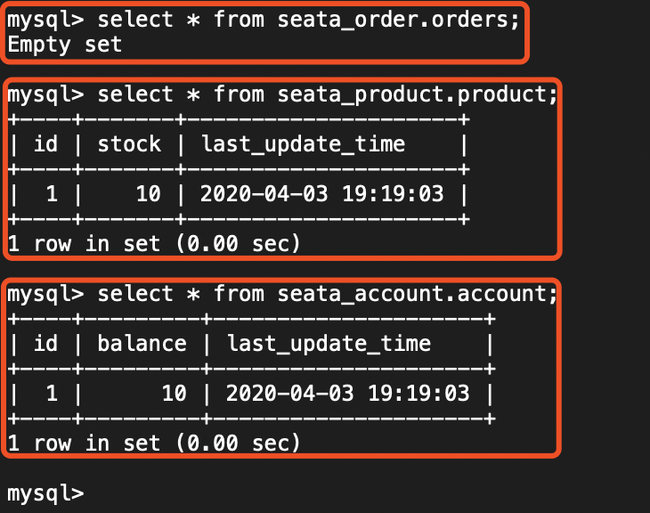

② 使用 Postman 模拟调用 <http://127.0.0.1:8081/order/create> 创建订单的接口，如下图所示：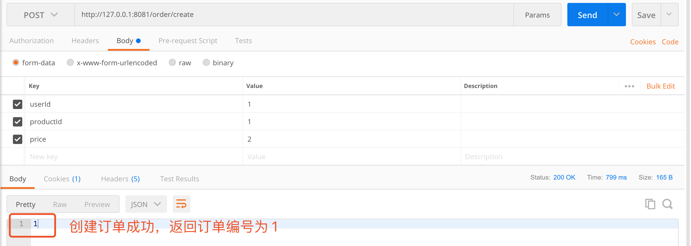

此时，在控制台打印日志如下图所示：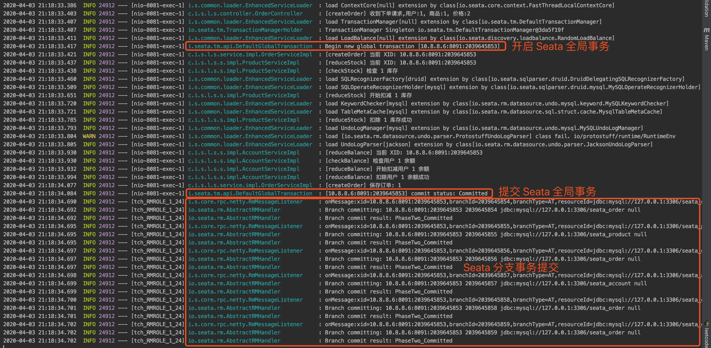

再查询下目前数据库的数据情况。如下图所示：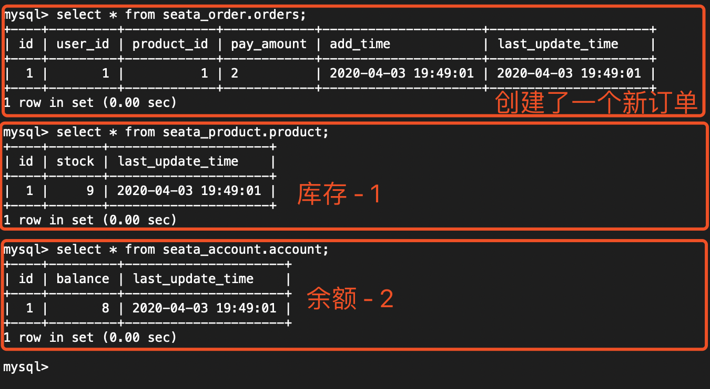

#### 2.8.2 异常流程

① 先查询下目前数据库的数据情况。如下图所示：

② 在 OrderServiceImpl 的 `#createOrder(...)` 方法上，打上断点如下图，方便我们看到 `product` 表的 `balance` 被减少：

> 友情提示：这里忘记截图了，稍后 IDEA 停留在该断点时，胖友可以去查询 `product` 表，会发现 `balance` 已经减少。

③ 使用 Postman 模拟调用 <http://127.0.0.1:8081/order/create> 创建订单的接口，如下图所示：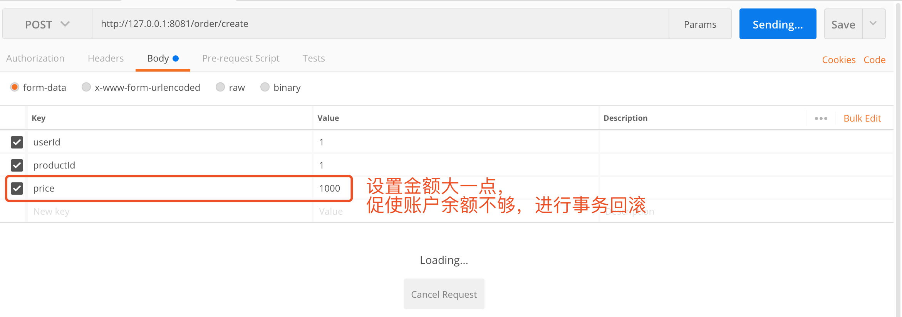

此时，在控制台打印日志如下图所示：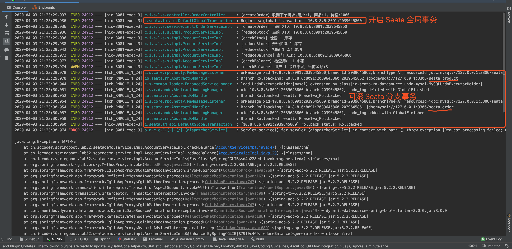

再查询下目前数据库的数据情况。如下图所示：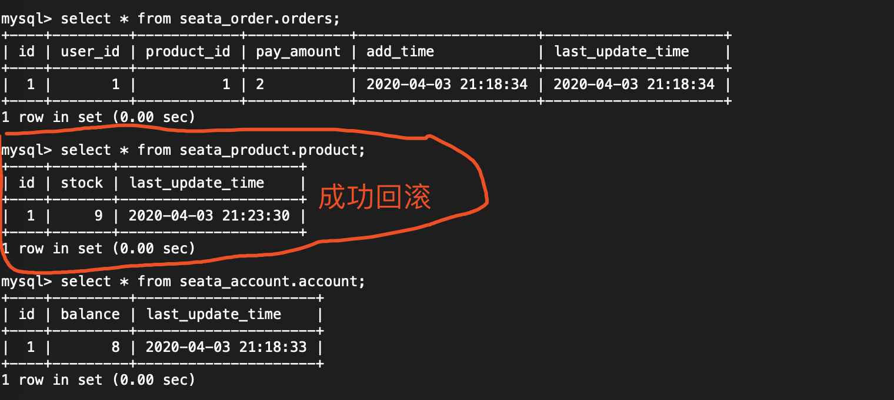

## 3. AT 模式 + HttpClient 远程调用

> 示例代码对应仓库：
>
> - 订单服务：[`lab-52-seata-at-httpclient-demo-order-service`](https://github.com/YunaiV/SpringBoot-Labs/blob/master/lab-52/lab-52-seata-at-httpclient-demo/lab-52-seata-at-httpclient-demo-order-service/)
> - 商品服务：[`lab-52-seata-at-httpclient-demo-product-service`](https://github.com/YunaiV/SpringBoot-Labs/blob/master/lab-52/lab-52-seata-at-httpclient-demo/lab-52-seata-at-httpclient-demo-product-service/)
> - 账户服务：[`lab-52-seata-at-httpclient-demo-account-service`](https://github.com/YunaiV/SpringBoot-Labs/blob/master/lab-52/lab-52-seata-at-httpclient-demo/lab-52-seata-at-httpclient-demo-account-service/)

本小节，我们会将[「2. AT 模式 + 多数据源」](https://www.iocoder.cn/Spring-Boot/Seata/?self#)小节的用户**购买商品**的 Spring Boot **单体**应用，拆成分**多个** Spring Boot 应用，通过 [Apache HttpClient](https://hc.apache.org/) 来实现 HTTP 远程调用每个 Spring Boot 应用提供的 Restful API 接口。整体如下图所示：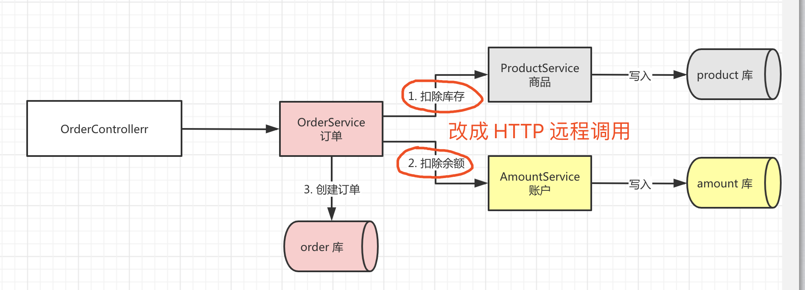

> 友情提示：早期的微服务架构，会采用 Nginx 对后端的服务进行负载均衡，而服务提供者使用 HttpClient 进行远程 HTTP 调用。例如说：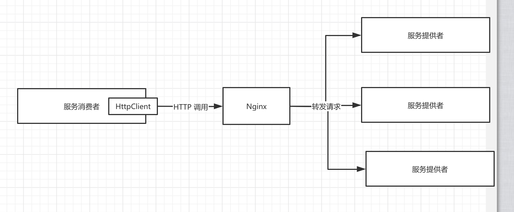

Seata 提供了 [`seata-http`](https://github.com/seata/seata/blob/develop/integration/http/) 项目，对 Apache HttpClient 进行集成。实现原理是：

- 服务**消费者**，使用 Seata 封装的 [AbstractHttpExecutor](https://github.com/seata/seata/blob/develop/integration/http/src/main/java/io/seata/integration/http/AbstractHttpExecutor.java#L117-L136) 执行器，在使用HttpClient 发起 HTTP 调用时，将 Seata 全局事务 **XID** 通过 [Header](https://www.w3schools.com/tags/tag_header.asp) 传递。
- 服务**提供者**，使用 Seata 提供的 SpringMVC [TransactionPropagationIntercepter](https://github.com/seata/seata/blob/develop/integration/http/src/main/java/io/seata/integration/http/TransactionPropagationIntercepter.java) 拦截器，将 Header 中的 Seata 全局事务 **XID** 解析出来，设置到 Seata [上下文](https://github.com/seata/seata/blob/develop/core/src/main/java/io/seata/core/context/RootContext.java) 中。

如此，我们便实现了多个 Spring Boot 应用的 Seata 全局事务的**传播**。

下面，我们来新建 [`lab-52-seata-at-httpclient-demo`](https://github.com/YunaiV/SpringBoot-Labs/blob/master/lab-52/lab-52-seata-at-httpclient-demo/) 模块，包含三个 Spring Boot 项目。最终结构如下图：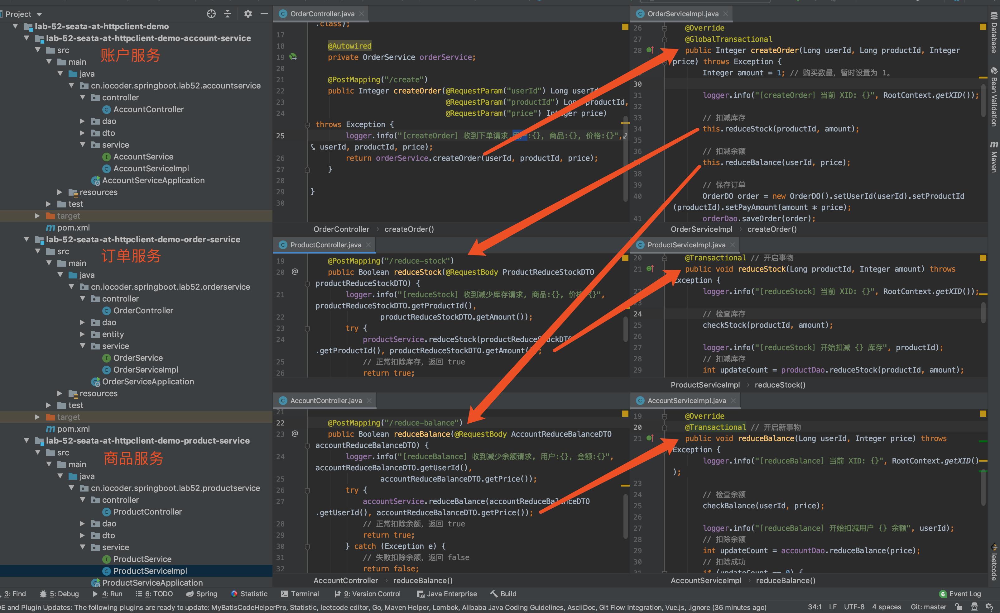

### 3.1 初始化数据库

使用 [`data.sql`](https://github.com/YunaiV/SpringBoot-Labs/blob/master/lab-52/lab-52-multiple-datasource/src/main/resources/data.sql) 脚本，创建 `seata_order`、`seata_storage`、`seata_amount` **三个库**。

> 友情提示：整体内容和[「2.1 初始化数据库」](https://www.iocoder.cn/Spring-Boot/Seata/?self#)小节一样。

### 3.2 订单服务

新建 [`lab-52-seata-at-httpclient-demo-order-service`](https://github.com/YunaiV/SpringBoot-Labs/blob/master/lab-52/lab-52-seata-at-httpclient-demo/lab-52-seata-at-httpclient-demo-order-service/) 项目，作为**订单**服务。它主要提供 `/order/create` 接口，实现下单逻辑。

> 友情提示：整体内容和[「2.4 订单模块」](https://www.iocoder.cn/Spring-Boot/Seata/?self#)一致。

#### 3.2.1 引入依赖

创建 [`pom.xml`](https://github.com/YunaiV/SpringBoot-Labs/blob/master/lab-52/lab-52-seata-at-httpclient-demo/lab-52-seata-at-httpclient-demo-order-service/pom.xml) 文件，引入相关的依赖。内容如下：


```
<?xml version="1.0" encoding="UTF-8"?>
<project xmlns="http://maven.apache.org/POM/4.0.0"
         xmlns:xsi="http://www.w3.org/2001/XMLSchema-instance"
         xsi:schemaLocation="http://maven.apache.org/POM/4.0.0 http://maven.apache.org/xsd/maven-4.0.0.xsd">
    <parent>
        <groupId>org.springframework.boot</groupId>
        <artifactId>spring-boot-starter-parent</artifactId>
        <version>2.2.2.RELEASE</version>
        <relativePath/> <!-- lookup parent from repository -->
    </parent>
    <modelVersion>4.0.0</modelVersion>

    <artifactId>lab-52-seata-at-httpclient-demo-account-service</artifactId>

    <dependencies>
        <!-- 实现对 Spring MVC 的自动化配置 -->
        <dependency>
            <groupId>org.springframework.boot</groupId>
            <artifactId>spring-boot-starter-web</artifactId>
        </dependency>

        <!-- 实现对数据库连接池的自动化配置 -->
        <dependency>
            <groupId>org.springframework.boot</groupId>
            <artifactId>spring-boot-starter-jdbc</artifactId>
        </dependency>
        <dependency> <!-- 本示例，我们使用 MySQL -->
            <groupId>mysql</groupId>
            <artifactId>mysql-connector-java</artifactId>
            <version>5.1.48</version>
        </dependency>

        <!-- 实现对 MyBatis 的自动化配置 -->
        <dependency>
            <groupId>org.mybatis.spring.boot</groupId>
            <artifactId>mybatis-spring-boot-starter</artifactId>
            <version>2.1.2</version>
        </dependency>

        <!-- 实现对 Seata 的自动化配置 -->
        <dependency>
            <groupId>io.seata</groupId>
            <artifactId>seata-spring-boot-starter</artifactId>
            <version>1.1.0</version>
        </dependency>
        <!-- 实现 Seata 对 HttpClient 的集成支持  -->
        <dependency>
            <groupId>io.seata</groupId>
            <artifactId>seata-http</artifactId>
            <version>1.1.0</version>
        </dependency>

        <!-- Apache HttpClient 依赖 -->
        <dependency>
            <groupId>org.apache.httpcomponents</groupId>
            <artifactId>httpclient</artifactId>
            <version>4.5.8</version>
        </dependency>
    </dependencies>

</project>
```


① 引入 [`seata-spring-boot-starter`](https://mvnrepository.com/artifact/io.seata/seata-spring-boot-starter) 依赖，实现对 Seata 的自动配置。

② 引入 [`seata-http`](https://mvnrepository.com/artifact/io.seata/seata-http) 依赖，实现 Seata 对 HttpClient 的集成支持。

#### 3.2.2 配置文件

创建 [`application.yaml`](https://github.com/YunaiV/SpringBoot-Labs/blob/master/lab-52/lab-52-seata-at-httpclient-demo/lab-52-seata-at-httpclient-demo-order-service/src/main/resources/application.yaml) 配置文件，添加相关的配置项。内容如下：


```
server:
  port: 8081 # 端口

spring:
  application:
    name: order-service

  datasource:
    url: jdbc:mysql://127.0.0.1:3306/seata_order?useSSL=false&useUnicode=true&characterEncoding=UTF-8
    driver-class-name: com.mysql.jdbc.Driver
    username: root
    password:

# Seata 配置项，对应 SeataProperties 类
seata:
  application-id: ${spring.application.name} # Seata 应用编号，默认为 ${spring.application.name}
  tx-service-group: ${spring.application.name}-group # Seata 事务组编号，用于 TC 集群名
  # 服务配置项，对应 ServiceProperties 类
  service:
    # 虚拟组和分组的映射
    vgroup-mapping:
      order-service-group: default
    # 分组和 Seata 服务的映射
    grouplist:
      default: 127.0.0.1:8091
```


① `spring.datasource` 配置项，设置连接 `seata_order` 库。

② `seata` 配置项，设置 Seata 的配置项目，对应 [SeataProperties](https://github.com/seata/seata/blob/develop/seata-spring-boot-starter/src/main/java/io/seata/spring/boot/autoconfigure/properties/SeataProperties.java) 类。

- `application-id` 配置项，对应 Seata 应用编号，默认为 `${spring.application.name}`。实际上，可以不进行设置。
- `tx-service-group` 配置项，Seata 事务组编号，用于 TC 集群名。

③ `seata.service` 配置项，Seata 服务配置项，对应 [ServiceProperties](https://github.com/seata/seata/blob/develop/seata-spring-boot-starter/src/main/java/io/seata/spring/boot/autoconfigure/properties/file/ServiceProperties.java) 类。它主要用于 Seata 在事务分组的特殊设计，可见[《Seata 文档 —— 事务分组专题》](https://seata.io/zh-cn/docs/user/transaction-group.html)。如果不能理解的胖友，可以见如下图：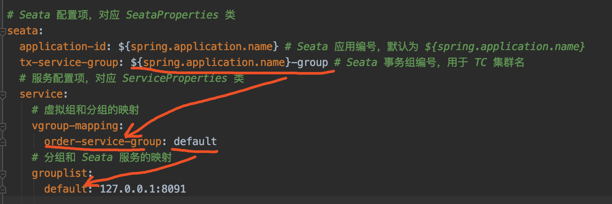

简单来说，就是多了一层**虚拟**映射。这里，我们**直接**设置 TC Server 的地址，为 `127.0.0.1:8091`。

#### 3.2.3 OrderController

创建 [OrderController](https://github.com/YunaiV/SpringBoot-Labs/blob/master/lab-52/lab-52-seata-at-httpclient-demo/lab-52-seata-at-httpclient-demo-order-service/src/main/java/cn/iocoder/springboot/lab52/orderservice/controller/OrderController.java) 类，提供 `order/create` 下单 HTTP API。代码如下：


```
@RestController
@RequestMapping("/order")
public class OrderController {

    private Logger logger = LoggerFactory.getLogger(OrderController.class);

    @Autowired
    private OrderService orderService;

    @PostMapping("/create")
    public Integer createOrder(@RequestParam("userId") Long userId,
                               @RequestParam("productId") Long productId,
                               @RequestParam("price") Integer price) throws Exception {
        logger.info("[createOrder] 收到下单请求,用户:{}, 商品:{}, 价格:{}", userId, productId, price);
        return orderService.createOrder(userId, productId, price);
    }

}
```


- 该 API 中，会调用 OrderService 进行下单。

> 友情提示：因为这个是示例项目，所以直接传入 `price` 参数，作为订单的金额，实际肯定不是这样的，哈哈哈~

#### 3.2.4 OrderService

创建 [OrderService](https://github.com/YunaiV/SpringBoot-Labs/blob/master/lab-52/lab-52-seata-at-httpclient-demo/lab-52-seata-at-httpclient-demo-order-service/src/main/java/cn/iocoder/springboot/lab52/orderservice/service/OrderService.java) 接口，定义了创建订单的方法。代码如下：


```
/**
 * 订单 Service
 */
public interface OrderService {

    /**
     * 创建订单
     *
     * @param userId 用户编号
     * @param productId 产品编号
     * @param price 价格
     * @return 订单编号
     * @throws Exception 创建订单失败，抛出异常
     */
    Integer createOrder(Long userId, Long productId, Integer price) throws Exception;

}
```


#### 3.2.5 OrderServiceImpl

创建 [OrderServiceImpl](https://github.com/YunaiV/SpringBoot-Labs/blob/master/lab-52/lab-52-multiple-datasource/src/main/java/cn/iocoder/springboot/lab52/seatademo/service/impl/OrderServiceImpl.java) 类，实现创建订单的方法。代码如下：


```
@Service
public class OrderServiceImpl implements OrderService {

    private Logger logger = LoggerFactory.getLogger(getClass());

    @Autowired
    private OrderDao orderDao;

    @Override
    @GlobalTransactional // <1>
    public Integer createOrder(Long userId, Long productId, Integer price) throws Exception {
        Integer amount = 1; // 购买数量，暂时设置为 1。

        logger.info("[createOrder] 当前 XID: {}", RootContext.getXID());

        // <2> 扣减库存
        this.reduceStock(productId, amount);

        // <3> 扣减余额
        this.reduceBalance(userId, price);

        // <4> 保存订单
        OrderDO order = new OrderDO().setUserId(userId).setProductId(productId).setPayAmount(amount * price);
        orderDao.saveOrder(order);
        logger.info("[createOrder] 保存订单: {}", order.getId());

        // 返回订单编号
        return order.getId();
    }
    
    private void reduceStock(Long productId, Integer amount) throws IOException {
        // 参数拼接
        JSONObject params = new JSONObject().fluentPut("productId", String.valueOf(productId))
                .fluentPut("amount", String.valueOf(amount));
        // 执行调用
        HttpResponse response = DefaultHttpExecutor.getInstance().executePost("http://127.0.0.1:8082", "/product/reduce-stock",
                params, HttpResponse.class);
        // 解析结果
        Boolean success = Boolean.valueOf(EntityUtils.toString(response.getEntity()));
        if (!success) {
            throw new RuntimeException("扣除库存失败");
        }
    }

    private void reduceBalance(Long userId, Integer price) throws IOException {
        // 参数拼接
        JSONObject params = new JSONObject().fluentPut("userId", String.valueOf(userId))
                .fluentPut("price", String.valueOf(price));
        // 执行调用
        HttpResponse response = DefaultHttpExecutor.getInstance().executePost("http://127.0.0.1:8083", "/account/reduce-balance",
                params, HttpResponse.class);
        // 解析结果
        Boolean success = Boolean.valueOf(EntityUtils.toString(response.getEntity()));
        if (!success) {
            throw new RuntimeException("扣除余额失败");
        }
    }
}
```


`<1>` 处，在类上，添加 Seata `@GlobalTransactional` 注解，**声明全局事务**。

`<2>` 处，调用 `#reduceStock(productId, amount)` 方法，通过 Apache HttpClient 远程 **HTTP** 调用**商品**服务，进行扣除库存。

其中，[DefaultHttpExecutor](https://github.com/seata/seata/blob/develop/integration/http/src/main/java/io/seata/integration/http/DefaultHttpExecutor.java) 是 Seata 封装，在使用个 HttpClient 发起 HTTP 调用时，将 Seata 全局事务 XID 通过 Header 传递。不过有两点要注意：

- 在使用 POST 请求时，DefaultHttpExecutor 暂时只支持 `application/json` 请求参数格式。所以，如果胖友想要 `application/x-www-form-urlencoded` 等格式，需要自己重新封装~

- 针对返回结果的转换，DefaultHttpExecutor 暂时没有实现完成，[代码](https://github.com/seata/seata/blob/develop/integration/http/src/main/java/io/seata/integration/http/DefaultHttpExecutor.java#L111-L119)如下图所示：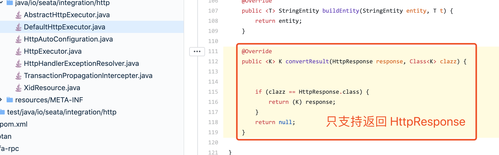

  > 艿艿使用的是 Seata 1.1.0 版本，未来这块应该会实现。

另外，**商品**服务提供的 `/product/reduce-stock` 接口，通过返回 `true` 或 `false` 来表示扣除库存是否成功。因此，我们在 `false` 扣除失败时，抛出 RuntimeException 异常，从而实现**全局**事务的回滚。

`<3>` 处，调用 `#reduceBalance(userId, price)` 方法，通过 Apache HttpClient 远程 **HTTP** 调用**账户**服务，进行扣除余额。整体逻辑和 `<2>` 一致，就不重复哔哔。

`<4>` 处，在全部调用成功后，调用 OrderDao 保存订单。

#### 3.2.6 OrderDao

创建 [OrderDao](https://github.com/YunaiV/SpringBoot-Labs/blob/master/lab-52/lab-52-seata-at-httpclient-demo/lab-52-seata-at-httpclient-demo-order-service/src/main/java/cn/iocoder/springboot/lab52/orderservice/dao/OrderDao.java) 接口，定义保存订单的操作。代码如下：


```
@Mapper
@Repository
public interface OrderDao {

    /**
     * 插入订单记录
     *
     * @param order 订单
     * @return 影响记录数量
     */
    @Insert("INSERT INTO orders (user_id, product_id, pay_amount) VALUES (#{userId}, #{productId}, #{payAmount})")
    @Options(useGeneratedKeys = true, keyColumn = "id", keyProperty = "id")
    int saveOrder(OrderDO order);

}
```


其中，[OrderDO](https://github.com/YunaiV/SpringBoot-Labs/blob/master/lab-52/lab-52-seata-at-httpclient-demo/lab-52-seata-at-httpclient-demo-order-service/src/main/java/cn/iocoder/springboot/lab52/orderservice/entity/OrderDO.java) **实体**类，对应 `orders` 表。代码如下：


```
/**
 * 订单实体
 */
public class OrderDO {

    /** 订单编号 **/
    private Integer id;

    /** 用户编号 **/
    private Long userId;

    /** 产品编号 **/
    private Long productId;

    /** 支付金额 **/
    private Integer payAmount;
    
    // ... 省略 setter/getter 方法
    
}
```


#### 3.2.7 OrderServiceApplication

创建 [OrderServiceApplication](https://github.com/YunaiV/SpringBoot-Labs/blob/master/lab-52/lab-52-seata-at-httpclient-demo/lab-52-seata-at-httpclient-demo-order-service/src/main/java/cn/iocoder/springboot/lab52/orderservice/OrderServiceApplication.java) 类，用于启动**订单**服务。代码如下：


```
@SpringBootApplication
public class OrderServiceApplication {

    public static void main(String[] args) {
        SpringApplication.run(OrderServiceApplication.class, args);
    }

}
```


### 3.3 商品服务

新建 [`lab-52-seata-at-httpclient-demo-product-service`](https://github.com/YunaiV/SpringBoot-Labs/blob/master/lab-52/lab-52-seata-at-httpclient-demo/lab-52-seata-at-httpclient-demo-product-service/) 项目，作为**商品**服务。它主要提供 `/product/reduce-stock` 接口，实现扣除商品的库存逻辑。

> 友情提示：整体内容和[「2.5 商品模块」](https://www.iocoder.cn/Spring-Boot/Seata/?self#)一致。

#### 3.3.1 引入依赖

创建 [`pom.xml`](https://github.com/YunaiV/SpringBoot-Labs/blob/master/lab-52/lab-52-seata-at-httpclient-demo/lab-52-seata-at-httpclient-demo-product-service/pom.xml) 文件，引入相关的依赖。和[「3.2.1 引入依赖」](https://www.iocoder.cn/Spring-Boot/Seata/?self#)是一致的，就不重复“贴”出来了，胖友点击 [`pom.xml`](https://github.com/YunaiV/SpringBoot-Labs/blob/master/lab-52/lab-52-seata-at-httpclient-demo/lab-52-seata-at-httpclient-demo-product-service/pom.xml) 文件查看。

#### 3.3.2 配置文件

创建 [`application.yaml`](https://github.com/YunaiV/SpringBoot-Labs/blob/master/lab-52/lab-52-seata-at-httpclient-demo/lab-52-seata-at-httpclient-demo-product-service/src/main/resources/application.yaml) 配置文件，添加相关的配置项。和[「3.2.2 配置文件」](https://www.iocoder.cn/Spring-Boot/Seata/?self#)是一致的，就不重复“贴”出来了，胖友点击 [`application.yaml`](https://github.com/YunaiV/SpringBoot-Labs/blob/master/lab-52/lab-52-seata-at-httpclient-demo/lab-52-seata-at-httpclient-demo-product-service/src/main/resources/application.yaml) 文件查看。

#### 3.3.3 ProductController

创建 [ProductController](https://github.com/YunaiV/SpringBoot-Labs/blob/master/lab-52/lab-52-seata-at-httpclient-demo/lab-52-seata-at-httpclient-demo-product-service/src/main/java/cn/iocoder/springboot/lab52/productservice/controller/ProductController.java) 类，提供 `/product/reduce-stock` 扣除库存 HTTP API。代码如下：


```
@RestController
@RequestMapping("/product")
public class ProductController {

    private Logger logger = LoggerFactory.getLogger(ProductController.class);

    @Autowired
    private ProductService productService;

    @PostMapping("/reduce-stock")
    public Boolean reduceStock(@RequestBody ProductReduceStockDTO productReduceStockDTO) {
        logger.info("[reduceStock] 收到减少库存请求, 商品:{}, 价格:{}", productReduceStockDTO.getProductId(),
                productReduceStockDTO.getAmount());
        try {
            productService.reduceStock(productReduceStockDTO.getProductId(), productReduceStockDTO.getAmount());
            // 正常扣除库存，返回 true
            return true;
        } catch (Exception e) {
            // 失败扣除库存，返回 false
            return false;
        }
    }

}
```


- 该 API 中，会调用 ProductService 进行扣除库存，最终通过返回结果为 `true` 或者 `false`，表示扣除库存成功或是失败。

其中，[ProductReduceStockDTO](https://github.com/YunaiV/SpringBoot-Labs/blob/master/lab-52/lab-52-seata-at-httpclient-demo/lab-52-seata-at-httpclient-demo-product-service/src/main/java/cn/iocoder/springboot/lab52/productservice/dto/ProductReduceStockDTO.java) 为商品减少库存 DTO 类，代码如下：


```
public class ProductReduceStockDTO {

    /**
     * 商品编号
     */
    private Long productId;
    /**
     * 数量
     */
    private Integer amount;
    
    // ... 省略 setter/getter 方法
    
}
```


#### 3.3.4 ProductService

创建 [ProductService](https://github.com/YunaiV/SpringBoot-Labs/blob/master/lab-52/lab-52-seata-at-httpclient-demo/lab-52-seata-at-httpclient-demo-product-service/src/main/java/cn/iocoder/springboot/lab52/productservice/service/ProductService.java) 接口，定义了扣除库存的方法。代码如下：


```
/**
 * 商品 Service
 */
public interface ProductService {

    /**
     * 扣减库存
     *
     * @param productId 商品 ID
     * @param amount    扣减数量
     * @throws Exception 扣减失败时抛出异常
     */
    void reduceStock(Long productId, Integer amount) throws Exception;

}
```


#### 3.3.5 ProductServiceImpl

创建 [ProductServiceImpl](https://github.com/YunaiV/SpringBoot-Labs/blob/master/lab-52/lab-52-seata-at-httpclient-demo/lab-52-seata-at-httpclient-demo-product-service/src/main/java/cn/iocoder/springboot/lab52/productservice/service/ProductServiceImpl.java) 类，实现扣减库存的方法。代码如下：


```
@Service
public class ProductServiceImpl implements ProductService {

    private Logger logger = LoggerFactory.getLogger(getClass());

    @Autowired
    private ProductDao productDao;

    @Override
    @Transactional // <1> 开启新事物
    public void reduceStock(Long productId, Integer amount) throws Exception {
        logger.info("[reduceStock] 当前 XID: {}", RootContext.getXID());

        // <2> 检查库存
        checkStock(productId, amount);

        logger.info("[reduceStock] 开始扣减 {} 库存", productId);
        // <3> 扣减库存
        int updateCount = productDao.reduceStock(productId, amount);
        // 扣除成功
        if (updateCount == 0) {
            logger.warn("[reduceStock] 扣除 {} 库存失败", productId);
            throw new Exception("库存不足");
        }
        // 扣除失败
        logger.info("[reduceStock] 扣除 {} 库存成功", productId);
    }

    private void checkStock(Long productId, Integer requiredAmount) throws Exception {
        logger.info("[checkStock] 检查 {} 库存", productId);
        Integer stock = productDao.getStock(productId);
        if (stock < requiredAmount) {
            logger.warn("[checkStock] {} 库存不足，当前库存: {}", productId, stock);
            throw new Exception("库存不足");
        }
    }

}
```


`<1>` 处，在类上，添加了 Spring `@Transactional` 注解，**声明本地事务**。也就是说，此处会开启一个 `seata_product` 库的数据库事务。

`<2>` 处，检查库存是否足够，如果不够则抛出 Exception 异常。因为我们需要通过异常，回滚全局异常。

`<3>` 处，进行扣除库存，如果扣除失败则抛出 Exception 异常。

#### 3.3.6 ProductDao

创建 [ProductDao](https://github.com/YunaiV/SpringBoot-Labs/blob/master/lab-52/lab-52-seata-at-httpclient-demo/lab-52-seata-at-httpclient-demo-product-service/src/main/java/cn/iocoder/springboot/lab52/productservice/dao/ProductDao.java) 接口，定义获取和扣除库存的操作。代码如下：


```
@Mapper
@Repository
public interface ProductDao {

    /**
     * 获取库存
     *
     * @param productId 商品编号
     * @return 库存
     */
    @Select("SELECT stock FROM product WHERE id = #{productId}")
    Integer getStock(@Param("productId") Long productId);

    /**
     * 扣减库存
     *
     * @param productId 商品编号
     * @param amount    扣减数量
     * @return 影响记录行数
     */
    @Update("UPDATE product SET stock = stock - #{amount} WHERE id = #{productId} AND stock >= #{amount}")
    int reduceStock(@Param("productId") Long productId, @Param("amount") Integer amount);

}
```


#### 3.3.7 ProductServiceApplication

创建 [ProductServiceApplication](https://github.com/YunaiV/SpringBoot-Labs/blob/master/lab-52/lab-52-seata-at-httpclient-demo/lab-52-seata-at-httpclient-demo-product-service/src/main/java/cn/iocoder/springboot/lab52/productservice/ProductServiceApplication.java) 类，用于启动**商品**服务。代码如下：


```
@SpringBootApplication
public class ProductServiceApplication {

    public static void main(String[] args) {
        SpringApplication.run(ProductServiceApplication.class, args);
    }

}
```


### 3.4 账户服务

新建 [`lab-52-seata-at-httpclient-demo-account-service`](https://github.com/YunaiV/SpringBoot-Labs/blob/master/lab-52/lab-52-seata-at-httpclient-demo/lab-52-seata-at-httpclient-demo-account-service/) 项目，作为**账户**服务。它主要提供 `/account/reduce-balance` 接口，实现扣除账户的余额逻辑。

> 友情提示：整体内容和[「2.5 账户模块」](https://www.iocoder.cn/Spring-Boot/Seata/?self#)一致。

#### 3.4.1 引入依赖

创建 [`pom.xml`](https://github.com/YunaiV/SpringBoot-Labs/blob/master/lab-52/lab-52-seata-at-httpclient-demo/lab-52-seata-at-httpclient-demo-account-service/pom.xml) 文件，引入相关的依赖。和[「3.2.1 引入依赖」](https://www.iocoder.cn/Spring-Boot/Seata/?self#)是一致的，就不重复“贴”出来了，胖友点击 [`pom.xml`](https://github.com/YunaiV/SpringBoot-Labs/blob/master/lab-52/lab-52-seata-at-httpclient-demo/lab-52-seata-at-httpclient-demo-account-service/pom.xml) 文件查看。

#### 3.4.2 配置文件

创建 [`application.yaml`](https://github.com/YunaiV/SpringBoot-Labs/blob/master/lab-52/lab-52-seata-at-httpclient-demo/lab-52-seata-at-httpclient-demo-account-service/src/main/resources/application.yaml) 配置文件，添加相关的配置项。和[「3.2.2 配置文件」](https://www.iocoder.cn/Spring-Boot/Seata/?self#)是一致的，就不重复“贴”出来了，胖友点击 [`application.yaml`](https://github.com/YunaiV/SpringBoot-Labs/blob/master/lab-52/lab-52-seata-at-httpclient-demo/lab-52-seata-at-httpclient-demo-account-service/src/main/resources/application.yaml) 文件查看。

#### 3.4.3 AccountController

创建 [AccountController](https://github.com/YunaiV/SpringBoot-Labs/blob/master/lab-52/lab-52-seata-at-httpclient-demo/lab-52-seata-at-httpclient-demo-account-service/src/main/java/cn/iocoder/springboot/lab52/accountservice/controller/AccountController.java) 类，提供 `/account/reduce-balance` 扣除余额 HTTP API。代码如下：


```
@RestController
@RequestMapping("/account")
public class AccountController {

    private Logger logger = LoggerFactory.getLogger(AccountController.class);

    @Autowired
    private AccountService accountService;

    @PostMapping("/reduce-balance")
    public Boolean reduceBalance(@RequestBody AccountReduceBalanceDTO accountReduceBalanceDTO) {
        logger.info("[reduceBalance] 收到减少余额请求, 用户:{}, 金额:{}", accountReduceBalanceDTO.getUserId(),
                accountReduceBalanceDTO.getPrice());
        try {
            accountService.reduceBalance(accountReduceBalanceDTO.getUserId(), accountReduceBalanceDTO.getPrice());
            // 正常扣除余额，返回 true
            return true;
        } catch (Exception e) {
            // 失败扣除余额，返回 false
            return false;
        }
    }

}
```


- 该 API 中，会调用 AccountService 进行扣除余额，最终通过返回结果为 `true` 或者 `false`，表示扣除余额成功或是失败。

其中，[AccountReduceBalanceDTO](https://github.com/YunaiV/SpringBoot-Labs/blob/master/lab-52/lab-52-seata-at-httpclient-demo/lab-52-seata-at-httpclient-demo-account-service/src/main/java/cn/iocoder/springboot/lab52/accountservice/dto/AccountReduceBalanceDTO.java) 为账户减少余额 DTO 类，代码如下：


```
public class AccountReduceBalanceDTO {

    /**
     * 用户编号
     */
    private Long userId;

    /**
     * 扣减金额
     */
    private Integer price;

    public Long getUserId() {
        return userId;
    }
    
    // ... 省略 setter/getter 方法
    
}
```


#### 3.4.4 AccountService

创建 [AccountService](https://github.com/YunaiV/SpringBoot-Labs/blob/master/lab-52/lab-52-seata-at-httpclient-demo/lab-52-seata-at-httpclient-demo-account-service/src/main/java/cn/iocoder/springboot/lab52/accountservice/service/AccountService.java) 类，定义扣除余额的方法。代码如下：


```
/**
 * 账户 Service
 */
public interface AccountService {

    /**
     * 扣除余额
     *
     * @param userId 用户编号
     * @param price  扣减金额
     * @throws Exception 失败时抛出异常
     */
    void reduceBalance(Long userId, Integer price) throws Exception;

}
```


#### 3.4.5 AccountServiceImpl

创建 [AccountServiceImpl](https://github.com/YunaiV/SpringBoot-Labs/blob/master/lab-52/lab-52-multiple-datasource/src/main/java/cn/iocoder/springboot/lab52/seatademo/service/impl/AccountServiceImpl.java) 类，实现扣除余额的方法。代码如下：


```
@Service
public class AccountServiceImpl implements AccountService {

    private Logger logger = LoggerFactory.getLogger(getClass());

    @Autowired
    private AccountDao accountDao;

    @Override
    @Transactional(propagation = Propagation.REQUIRES_NEW) // <1> 开启新事物
    public void reduceBalance(Long userId, Integer price) throws Exception {
        logger.info("[reduceBalance] 当前 XID: {}", RootContext.getXID());

        // <2> 检查余额
        checkBalance(userId, price);

        logger.info("[reduceBalance] 开始扣减用户 {} 余额", userId);
        // <3> 扣除余额
        int updateCount = accountDao.reduceBalance(price);
        // 扣除成功
        if (updateCount == 0) {
            logger.warn("[reduceBalance] 扣除用户 {} 余额失败", userId);
            throw new Exception("余额不足");
        }
        logger.info("[reduceBalance] 扣除用户 {} 余额成功", userId);
    }

    private void checkBalance(Long userId, Integer price) throws Exception {
        logger.info("[checkBalance] 检查用户 {} 余额", userId);
        Integer balance = accountDao.getBalance(userId);
        if (balance < price) {
            logger.warn("[checkBalance] 用户 {} 余额不足，当前余额:{}", userId, balance);
            throw new Exception("余额不足");
        }
    }

}
```


`<1>` 处，在类上，添加了 Spring `@Transactional` 注解，**声明本地事务**。也就是说，此处会开启一个 `seata_account` 库的数据库事务。

`<2>` 处，检查余额是否足够，如果不够则抛出 Exception 异常。因为我们需要通过异常，回滚全局异常。

`<3>` 处，进行扣除余额，如果扣除失败则抛出 Exception 异常。

#### 3.4.6 AccountDao

创建 [AccountDao](https://github.com/YunaiV/SpringBoot-Labs/blob/master/lab-52/lab-52-seata-at-httpclient-demo/lab-52-seata-at-httpclient-demo-account-service/src/main/java/cn/iocoder/springboot/lab52/accountservice/dao/AccountDao.java) 接口，定义查询和扣除余额的操作。代码如下：


```
@Mapper
@Repository
public interface AccountDao {

    /**
     * 获取账户余额
     *
     * @param userId 用户 ID
     * @return 账户余额
     */
    @Select("SELECT balance FROM account WHERE id = #{userId}")
    Integer getBalance(@Param("userId") Long userId);

    /**
     * 扣减余额
     *
     * @param price 需要扣减的数目
     * @return 影响记录行数
     */
    @Update("UPDATE account SET balance = balance - #{price} WHERE id = 1 AND balance >= ${price}")
    int reduceBalance(@Param("price") Integer price);

}
```


#### 3.4.7 AccountServiceApplication

创建 [AccountServiceApplication](https://github.com/YunaiV/SpringBoot-Labs/blob/master/lab-52/lab-52-seata-at-httpclient-demo/lab-52-seata-at-httpclient-demo-account-service/src/main/java/cn/iocoder/springboot/lab52/accountservice/AccountServiceApplication.java) 类，用于启动**商品**服务。代码如下：


```
@SpringBootApplication
public class AccountServiceApplication {

    public static void main(String[] args) {
        SpringApplication.run(AccountServiceApplication.class, args);
    }

}
```


### 3.5 简单测试

下面，我们将测试两种情况：

1. 分布式事务正常提交
2. 分布式事务异常回滚

**Debug** 执行 **Order**ServiceApplication 启动**订单**服务。此时，我们可以看到 Seata 相关日志如下：

> 友情提示：日志的顺序，艿艿做了简单的整理，为了更容易阅读。


```
# ... 上面还有 Seata 相关 Bean 初始化的日志，忘记加进来了，嘿嘿~

# 给数据源增加 Seata 的数据源代理
2020-04-05 10:51:00.687  INFO 52124 --- [           main] s.s.a.d.SeataDataSourceBeanPostProcessor : Auto proxy of [dataSource]
2020-04-05 10:51:00.688  INFO 52124 --- [           main] com.zaxxer.hikari.HikariDataSource       : HikariPool-1 - Starting...
2020-04-05 10:51:00.833  INFO 52124 --- [           main] com.zaxxer.hikari.HikariDataSource       : HikariPool-1 - Start completed.
# 加载 Druid 提供的 SQL 解析器
2020-04-05 10:51:00.881  INFO 52124 --- [           main] i.s.common.loader.EnhancedServiceLoader  : load DbTypeParser[druid] extension by class[io.seata.sqlparser.druid.DruidDelegatingDbTypeParser]
# 连接到 Seata TC Server 服务器
2020-04-05 10:51:00.892  INFO 52124 --- [           main] i.s.c.r.netty.NettyClientChannelManager  : will connect to 127.0.0.1:8091
2020-04-05 10:51:00.893  INFO 52124 --- [           main] i.s.core.rpc.netty.NettyPoolableFactory  : NettyPool create channel to transactionRole:RMROLE,address:127.0.0.1:8091,msg:< RegisterRMRequest{resourceIds='jdbc:mysql://127.0.0.1:3306/seata_order', applicationId='order-service', transactionServiceGroup='order-service-group'} >
# 加载 Seata 序列化器
2020-04-05 10:51:01.042  INFO 52124 --- [lector_RMROLE_1] i.s.common.loader.EnhancedServiceLoader  : load Serializer[SEATA] extension by class[io.seata.serializer.seata.SeataSerializer]
# 注册 Seata Resource Manager 到 Seata TC Server 成功 
2020-04-05 10:51:00.892  INFO 52124 --- [           main] io.seata.core.rpc.netty.RmRpcClient      : RM will register :jdbc:mysql://127.0.0.1:3306/seata_order
2020-04-05 10:51:01.054  INFO 52124 --- [           main] io.seata.core.rpc.netty.RmRpcClient      : register RM success. server version:1.1.0,channel:[id: 0xc7553923, L:/127.0.0.1:64449 - R:/127.0.0.1:8091]
2020-04-05 10:51:01.061  INFO 52124 --- [           main] i.s.core.rpc.netty.NettyPoolableFactory  : register success, cost 34 ms, version:1.1.0,role:RMROLE,channel:[id: 0xc7553923, L:/127.0.0.1:64449 - R:/127.0.0.1:8091]
# 因为 OrderServiceImpl 添加了 `@GlobalTransactional` 注解，所以创建其代理，用于全局事务。
2020-04-05 10:51:01.157  INFO 52124 --- [           main] i.s.s.a.GlobalTransactionScanner         : Bean[cn.iocoder.springboot.lab52.orderservice.service.OrderServiceImpl] with name [orderServiceImpl] would use interceptor [io.seata.spring.annotation.GlobalTransactionalInterceptor]
```


执行 **Product**ServiceApplication 启动**商品**服务。相关的日志，胖友自己瞅瞅。
执行 **Account**ServiceApplication 启动**账户**服务。相关的日志，胖友自己瞅瞅。

#### 3.5.1 正常流程

① 先查询下目前数据库的数据情况。如下图所示：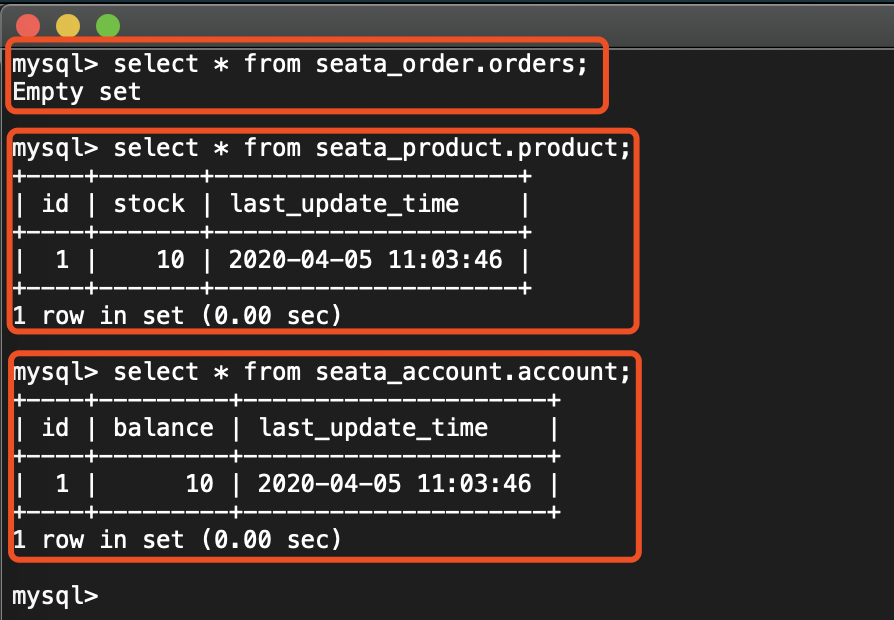

② 使用 Postman 模拟调用 <http://127.0.0.1:8081/order/create> 创建订单的接口，如下图所示：

此时，在控制台打印日志如下图所示：

- **订单**服务：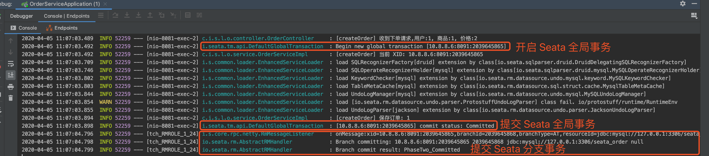
- **商品**服务：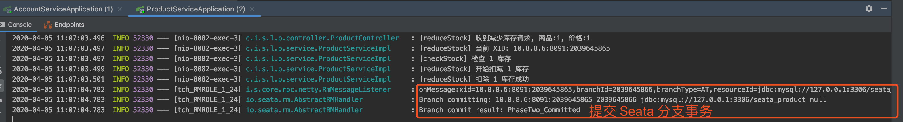
- **账户**服务：

再查询下目前数据库的数据情况。如下图所示：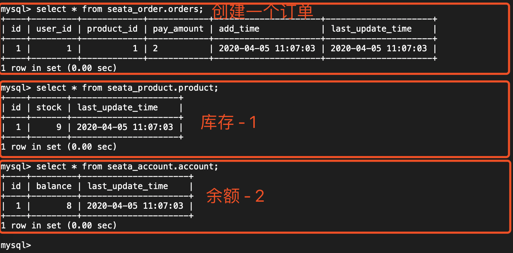

#### 3.5.2 异常流程

① 先查询下目前数据库的数据情况。如下图所示：

② 在 OrderServiceImpl 的 `#createOrder(...)` 方法上，打上断点如下图，方便我们看到 `product` 表的 `balance` 被减少：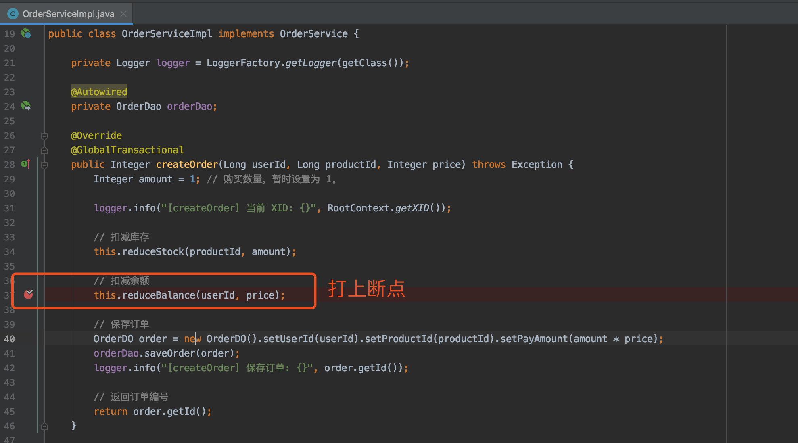

> 友情提示：这里忘记截图了，稍后 IDEA 停留在该断点时，胖友可以去查询 `product` 表，会发现 `balance` 已经减少。

③ 使用 Postman 模拟调用 <http://127.0.0.1:8081/order/create> 创建订单的接口，如下图所示：

此时，在控制台打印日志如下图所示：

- **订单**服务：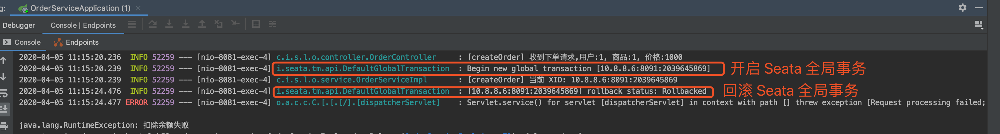
- **商品**服务：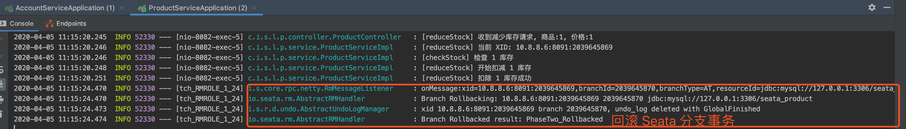
- **账户**服务：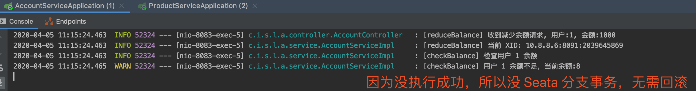

再查询下目前数据库的数据情况。如下图所示：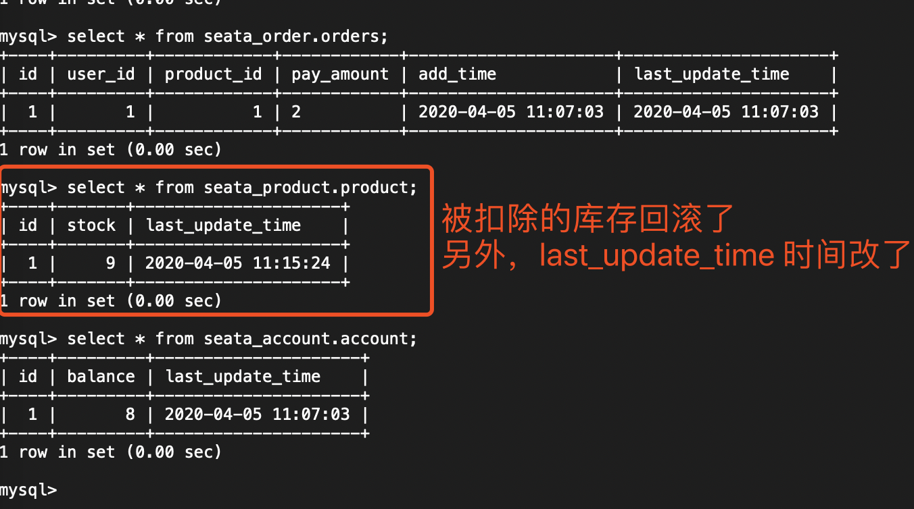