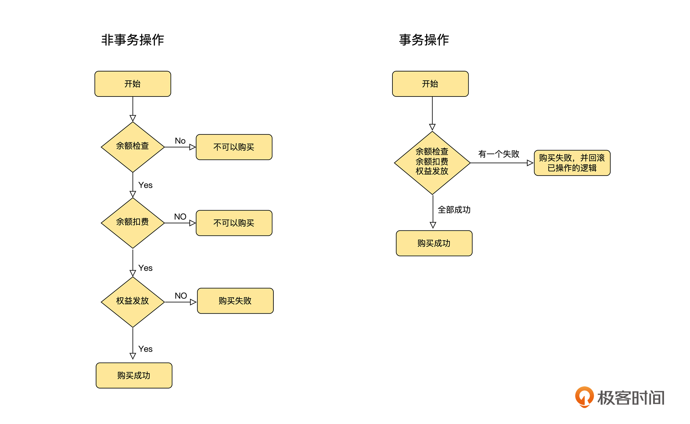
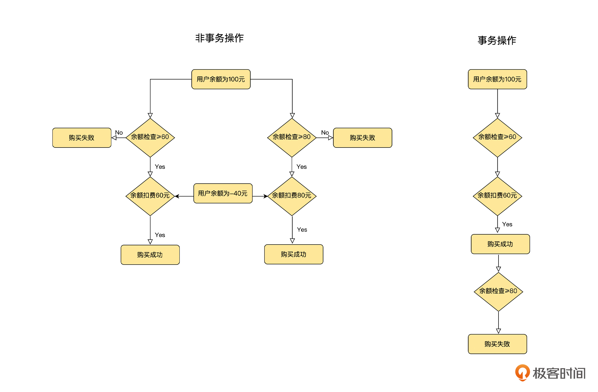
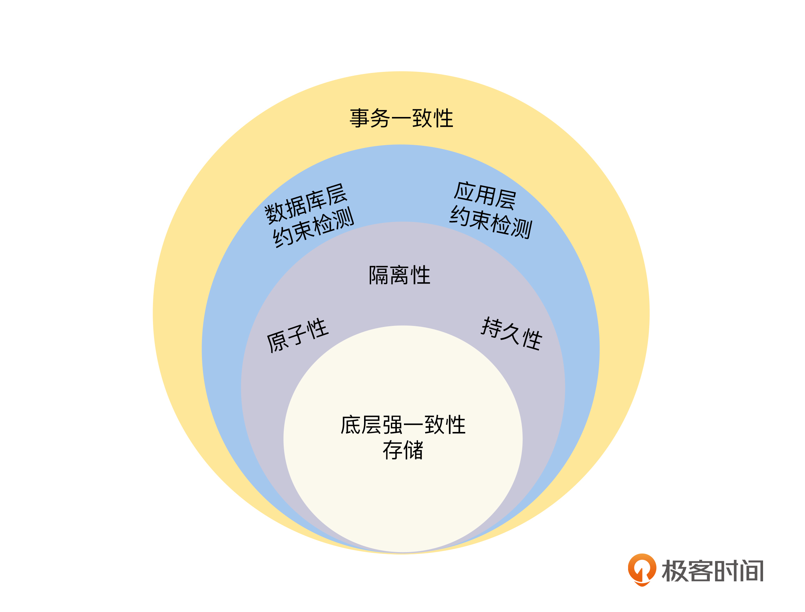
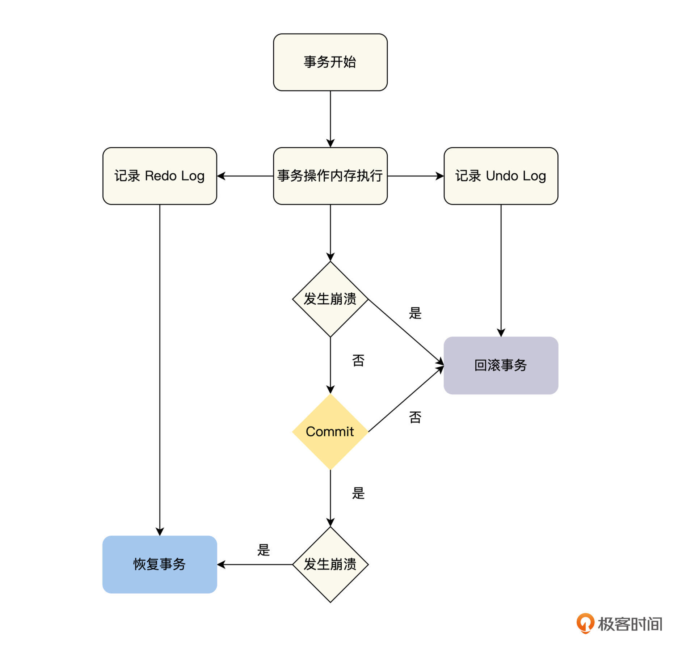
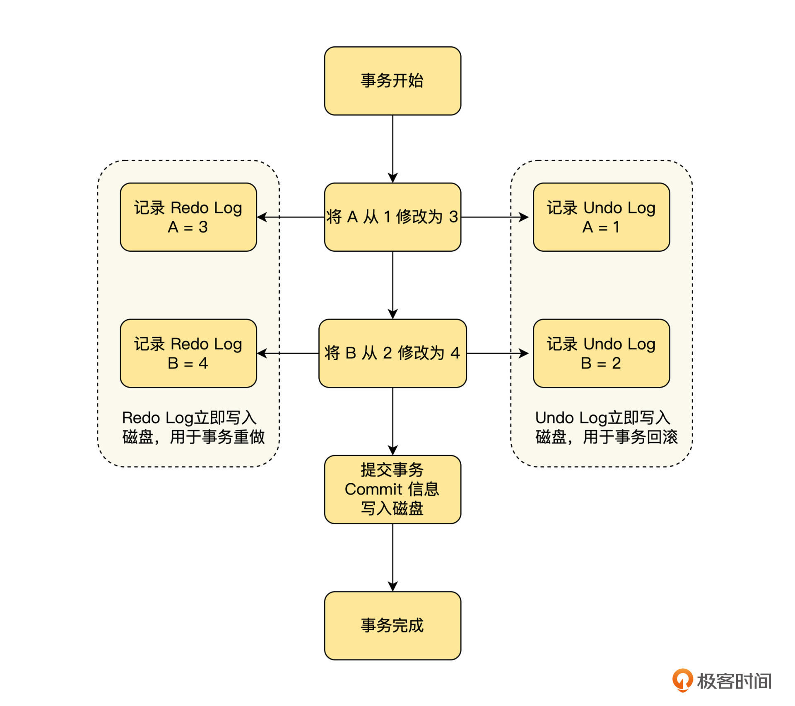
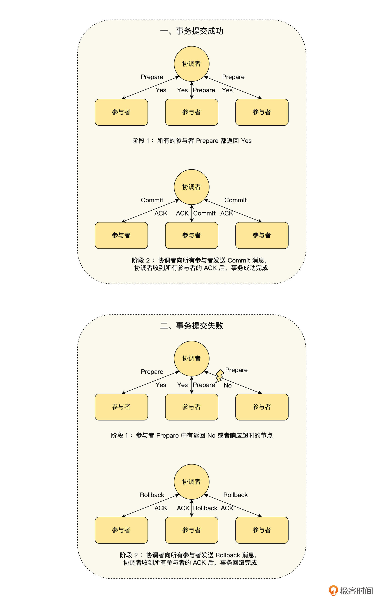

#  事务

## 事务是什么

在本课开头，我们列举了工作中经常碰到的两个事务场景问题，那么我们先来了解一下事务是什么？**事务可以看成是一个或者多个操作的组合操作，并且它对这个组合操作提供一个保证，如果这个组合操作之前的数据是一致的（即正确的），那么操作之后的数据也应该是一致的**。不论这个组合操作执行的过程中，是否发生系统故障，还是在这个组合操作执行的过程中，是否与其他事务一起执行。

为了让你更好地理解事务的定义，我们结合开头提到的两个具体的事务场景问题来讨论一下。

第一个问题，用户在极客时间购买课程时出现了错误，课程没有购买成功，但是余额却被扣了。这里我们先分析一下，用户在购买课程时，在我们的服务器程序里，需要实现三个操作：

- **余额检查**：确认用户的余额是否大于课程的价格，如果余额足够，则可以购买，否则不可以购买。
- **余额扣费**：从用户的余额中扣除购买课程的金额。
- **权益发放**：给用户发放购买课程的学习权益。

正常情况下，上述三个操作完成后，用户的余额被扣除，也获得了学习权益。但是如果在这三个操作执行的过程中，出现了发放学习权益的服务崩溃或者课程下线等情况，那么这三个操作就无法全部执行成功。此时，用户的余额已经被扣除，但是在 App 上却收到了购买失败的提示，用户一定是不认可的。

我们仔细分析就会发现，**这个问题的根本原因是余额扣费和权益发放不是一个整体操作，出现了部分执行成功的情况**。这里可以结合事务来思考，如果将课程购买通过一个事务来执行的话，这个事务就会包括余额检查、余额扣费和权益发放 3 个操作，并且它对这个组合操作提供了一个保证，保证不论出现什么故障，这 3 个操作要么都执行成功，要么都不执行。所以当我们结合事务来思考，如下图所示，这个问题就迎刃而解了。

第二个问题，财务的同事反馈他们在算账时，发现收入和支出的数目对不上。这里我们还是拿用户购买课程来分析，假设用户余额为 100 元，课程价格为 60 元，此时因为余额大于课程价格，所以余额检查是通过的。

如果在这时，用户同时还在买另一个价格为 80 元的课程，因为上笔订单没有付款，用户的余额依旧为 100 元，大于课程价格 80 元，所以这笔订单的余额检查也是通过的。接下来，当这两个课程都购买成功时，就相当于用户用 100 元的余额，分别购买了 60 元和 80 元的两个课程，所以最后用户的余额就变成了负 40 元，这个结果显然是不符合财务同事预期的。

那么它的根本原因就是**用户的两个购买操作并发执行**。我们也结合事务来思考一下，如下图，如果这两个课程购买的操作通过事务来执行的话，事务会对这个组合操作提供一个保证，保证它和一个一个串行执行的操作一样，不会出现由于并发执行而导致数据不正确的问题。

通过分析具体的事务场景问题，我们会发现事务为日常的研发工作，提供了一个非常优雅的抽象，让我们可以将一组操作过程中的内部状态处理等细节交给事务来处理，而我们只需要去关心这一组操作是否成功就可以了，这大大简化了研发的工作负担。

## 事务的四个特性

事务是一个非常实用的工具，它为我们的研发提供了非常友好的保证，但是，你心里一定会有一个问题，它是通过什么具体方法来实现的呢？

事务主要是通过提供以下四个特性来实现的：

- **一致性（C）**：一个事务能够正确地将数据从一个一致性的状态，变换到另一个一致性的状态。
- **原子性（A）**：一个事务所有的操作，要么全部执行，要么就一个都不执行，即 all-or nothing。它可以让事务在出现故障等原因，导致不能全部执行成功时，将已经执行的部分操作，回滚到事务前的状态。
- **隔离性（I）**：如果多个事务并发执行，那么执行结果和一个一个串行执行是一样的。它可以使事务在执行时，不会受到其他事务的影响。不过在实践中，由于考虑到性能的问题，一般都使用较弱一点的保证，我们在后续的课程中会专门讨论。
- **持久性（D）**：如果一个事务已经提交，不论什么原因，它产生的结果都是永久存在的，它保证了事务的结果不会丢失。

从上面的分析中，我们了解了事务是如何通过四个特性来达成它的目标的。在四个特性中，**一致性是对事务执行最终结果正确性的保证，它需要依赖事务的其他特性来协助完成**，我们可以将它看成是事务操作的一个概览。

所以，本节课我们会先来讨论事务的一致性。并且这里要特别说明一下，事务的四个特性不是孤立的，它们之间是相互联系的。在学习事务一致性时，我们需要思考事务原子性、隔离性、持久性与一致性之间的联系。

## 一致性

>一致性，事务的集大成者

### 一致性是怎么实现的

上文提到了一致性的定义，即一个事务能够正确地将数据从一个一致性的状态，变换到另一个一致性的状态。也就是在事务执行的过程中，不能出现任何不一致的问题，如果一个事务执行前的数据是正确的，那么执行后的数据也必须是正确的，所以，**事务的一致性其实就是正确性**。

事务的一致性需要保证一个事务在执行时，不论出现停电、宕机等任何问题，最终的执行结果都是正确的，这是一个非常高的要求，接下来我们就来分析一下，在高要求下事务是如何实现一致性的？

首先，我们从数据复制的角度来看，为了保障系统的高可用，每一份数据都复制了多个副本，事务执行后，这多个副本的数据需要完全一致，即数据的多副本必须通过强一致性的策略进行复制。这个问题我们在“数据复制”的课程中已经有过讨论，并且在“事务（四）”的课程中会继续讨论，这里就不再赘述了。

然后，我们可以从事务的原子性、隔离性和持久性方面，来讨论事务的一致性是如何实现的。在事务的执行过程中，不能因为系统故障等原因，出现部分操作执行成功的情况，比如我们前面提到的课程购买例子中，余额扣费成功，但是权益却发放失败的情况，这个部分需要事务的**原子性**来保证。

同时，也不能出现因为事务并发导致执行后状态错误的情况，比如两个课程购买的事务并发执行的例子中，当时余额检查都成功，但是到了后面扣费时，由于用户余额不足出现了负数。为了让事务在执行时，不会受到其他事务的影响，事务的**隔离性**也需要注意。

另外，在事务执行的过程中，也要考虑到因为数据丢失，导致执行后的结果错误的情况，这个部分需要事务的**持久性**来保证。

虽然有了底层存储多副本数据强一致性的支持，以及事务三个特性的保驾护航，但我们还是要考虑事务执行的最终结果，是否满足数据库层以及业务层的约束规则，所以最后我们要做好约束检测。这里又分为如下两个层面来讨论。

第一个是数据库层面，数据库内部需要基于一些约束规则，来检测数据是否违反了一致性的约束，比如外键约束和唯一性约束等。

另一个是应用层的业务逻辑，它需要结合业务场景做一些约束检测，这样做是为了保障数据的一致性，比如用户课程购买的场景，从用户账号扣掉的钱，应该和收款方的数目是相等的。如果应用层的处理逻辑出现 Bug，导致用户账号扣掉的钱比收款方的多，这样的一致性问题在数据库的事务层面是无法约束检测的，它需要应用层的业务逻辑来保证。

所以，通过上面的分析，我们可以了解到，**事务一致性的实现需要多维度来保证，比如底层存储的多副本数据强一致性，事务原子性、隔离性和持久性的一起协作，以及数据库层和应用层的约束检测等各方面来保障，它不单单是事务层面的一致性问题**。

这也是事务的一致性和其他三个特性不一样的地方，事务的原子性、隔离性和持久性这三个特性可以通过各自的实现机制来保障，而**一致性则是应用层通过运用事务的原子性、隔离性和持久性的特性，加上数据库层的约束检测，并且在应用层开发中做好相关的约束检测才能达成，所以，我们说一致性是事务的集大成者**。

## 原子性

>原子性，对应用层提供的完美抽象

### 原子性的定义

一般来说，我们在计算机领域第一次接触“原子”这一概念，都来源于操作系统的“原子操作”。在操作系统中，原子操作的定义是指，不可被中断的一个或者一系列操作，它包含了两个层面的意思。

首先，是**整体的不可分割性**。一个原子操作的所有操作，要么全部执行，要么就一个都不执行，即 all-or-nothing 。

其次，是**可串行化的隔离性，即线程安全**。原子操作是在单核 CPU 时代定义的，由于原子操作是不可中断的，那么系统在执行原子操作的过程中，唯一的 CPU 就被占用了，这就确保了原子操作的临界区，不会出现竞争的情况。原子操作自带了线程安全的保证，即最严格的隔离级别的可串行化，所以我们在编程的时候，就不需要对原子操作加锁，来保护它的临界区了。

但是，我们上节课提到了事务中原子性的定义，一个事务所有的操作，要么全部执行，要么就一个都不执行，即 all-or-nothing 。它可以让事务在执行的过程中，当遇到故障等原因，不能全部执行成功的时候，将已经执行的操作，回滚到事务前的状态。

你会发现事务中对原子性的定义，只保留了原子操作的不可分割性，并没有关注可串行化的隔离性。其实这也很好理解，主要是基于性能的考虑，如果事务的原子性同时定义了不可分割性和可串行化的隔离性，那么对数据库性能的影响将会非常大，因为数据库需要频繁地操作，相对于内存来说非常慢的磁盘，而可串行化地去操作磁盘，在很多业务场景下的性能是我们不可以接受的。

因此，**在事务的定义中，就将原子操作的不可分割性和隔离性，分别定义出了两个特性，即原子性和隔离性**。其中隔离性为了在性能和正确性之间权衡，定义了多种隔离级别，我们可以依据自己的业务情况进行选择，具体的隔离性讨论，我们将在下一节课进行。

### 怎么实现原子性

通过上面的讨论，我们知道了事务的原子性只关注整体的不可分割性，一个事务所有的操作，要么全部执行，要么就一个都不执行。那么我们应该如何实现事务的原子性呢？

从不可分割性的角度来思考，实现一个事务需要解决两个维度上的操作分割：

**第一个维度是单节点事务，即单节点上操作的不可分割性**。在单节点上，一个事务在执行的过程中出现崩溃等问题，它的一部分操作已经执行完成，而另一部分操作则无法继续执行，这时就会出现整个事务操作无法继续完成，仅仅部分操作完成的情况。

**第二个维度是分布式事务，即多节点之间的操作不可分割性**。在多节点上，一个事务操作需要在多个节点上运行，如果某些节点检测到违反约束、冲突、网络故障或者崩溃等问题，事务将无法继续执行，而其他节点的事务却已经顺利完成了，这时就会出现部分节点操作完成的情况。

下面我们就从单节点事务和分布式事务的维度，来一一讨论事务原子性的实现。

#### 单节点事务

对于单节点上运行的事务（单节点事务）来说，在执行过程中，不需要与其他的节点交互，也就不会出现部分节点失败导致的操作分割，我们只需要考虑当前节点整体失败导致的操作分割即可。对于单节点事务，一般是在存储引擎上，通过 Undo Log 、 Redo Log 和 Commit 记录来实现，具体流程如下图。

我们从图中不难看出，对于单节点事务来说，一个非常关键的顺序就是在磁盘上持久化数据的顺序：先写入 Undo Log 和 Redo Log ，然后再写入 Commit 记录。其中事务的提交或中止由 Commit 记录来决定，如果在写入 Commit 记录之前发生崩溃，那么事务就需要中止，通过 Undo Log 回滚已执行的操作；如果事务已经写入了 Commit 记录，就表明事务已经安全提交，后面发生了崩溃的话，就要等待系统重启后，通过 Redo Log 恢复事务，然后再提交。

接下来，我们通过举例来简单描述下这个过程，注意这里简化了 Undo Log 和 Redo Log 的格式。假设一个事务操作 A、B 两个数据，他们的初值分别为 1 和 2 ，事务的操作内容为将 A 修改为 3 ，B 修改为 4 ，那么事务的执行流程如下图。

通过这些讨论，我们可以看出， **Redo Log 保证了事务的持久性， Undo Log 保证了事务的原子性，而写入 Commit 记录了事务的提交点**，它来决定事务是否应该安全提交。通过提交点，我们就可以将事务中多个操作的提交，绑定在一个提交点上，实现事务的原子提交。

#### 分布式事务

对于多节点上运行的事务（分布式事务）来说，除了当前节点整体失败导致的操作分割之外，还存在部分节点失败导致的操作分割。我们知道当前节点整体失败导致的操作分割，可以按单节点事务来处理，而对于部分节点失败导致的操作分割，一个常见的思路是通过两阶段提交（ 2PC ）来解决，实现 2PC 的思路如下图所示。

- 选择一个协调者，这个协调者可以是分布式事务的参与节点，也可以是一个单独的进程。
- 阶段 1
  - 协调者发送事务请求（Prepare）到所有的参与节点，并询问它们是否可以提交。
  - 如果所有的参与节点都回复“是”，那么接下来协调者在阶段 2 发出提交（Commit）请求。
  - 如果任何的参与节点都回复“否”，那么接下来协调者在阶段 2 发出放弃（Rollback）请求。
- 阶段 2
  - 依据阶段 1 返回的结果，决定事务最终是提交（Commit）还是放弃（Rollback）。

关于 2PC ，在实现的时候，要特别注意 2 个关键点。

一是，**两个关键承诺**。第一个承诺在阶段 1 ，当事务的参与节点回复“是”的时候，对于当前事务，这个参与节点一定是能够安全提交的，它不仅要保障事务在提交时，不会出现冲突和约束违规之类的问题，还要保障即使出现系统崩溃、电源故障和磁盘空间不足等系统问题时，事务依然能够正常提交成功。

第二个承诺在阶段 2 ，当协调者基于参与者的投票，做出提交或者中止的决定后，这个决定是不可以撤销的。对于协调者来说，如果协调者通知参与者失败，那么协调者必须一直重试，直到所有的参与节点都通知成功为止；而对于参与者来说，不论协调者通知的结果是提交还是中止，参与者都必须严格执行，不能反悔。即使出现了故障，在故障恢复后，还是必须要执行，直到成功为止。

第二个关键点是**2PC 的提交点**。当协调者通过参与者的投票，做出提交或者中止事务的决定后，需要先将决定写入事务日志，然后再通知事务的参与者。如果协调者在事务执行过程中崩溃了，那么等到协调者恢复后，在事务日志中如果没有发现未解决的事务，就中止事务；反之，就会继续执行事务。

所以，协调者将阶段 1 的决定写入事务日志就是 2PC 中事务的提交点，通过这个提交点，将多个节点的事务操作绑定在一个提交点上，然后像单节点事务一样，利用这个提交点来保证事务的原子性。

#### 2PC 面临的问题

通过上面的讨论，我们知道了 2PC 可以解决分布式事务的原子性问题，但是要正确使用 2PC，还需要了解以下几个方面的问题。

第一，**2PC 是一个阻塞式协议**。当 2PC 的一个参与者，在阶段 1 做出了“是”的回复后，参与者将不能单方面放弃，它必须等待协调者的决定，也就意味着参与者所有占用的资源都不能释放。如果协调者出现故障，不能将决定通知给参与者，那么这个参与者只能无限等待，直到协调者恢复后，成功收到协调者的决定为止。

因为 2PC 有阻塞问题，所以后来又提出了**3PC 协议，它在 2PC 的两个阶段之间插入了一个阶段，增加了一个相互协商的过程，并且还引入了超时机制来防止阻塞**。虽然 3PC 能解决 2PC 由于协调者崩溃而无限等待的问题，但是它却有着超高的延迟，并且在网络分区时，还可能会出现不一致的问题，这些原因导致它在实际应用中的效果并不好，所以目前普遍使用的依然是 2PC 。

第二， **2PC 是一个逆可用性协议**。如果在阶段 1 ，任何一个参与者发生故障，使准备请求失败或者超时，协调者都将中止操作；如果在阶段 2 ，协调者发生故障，也会导致参与者只能等待，无法完成操作。

你是否感觉很奇怪，同样是共识算法，Raft 和 Paxos 等共识算法都能容忍少数节点失败的情况，那为什么 2PC 则完全不能容忍节点的失败呢？**其实，这个差异的出现是因为 2PC 是一个原子提交协议，为了 all-or-nothing ，在操作过程中就需要与所有的节点达成共识**；而 Raft 和 Paxos 则只需要与大部分节点达成一致，确保共识成立即可，它可以容忍少数节点不可用，当故障恢复的时候，之前不可用的节点可以向其他正常的节点同步之前达成的共识。

第三，虽然 2PC 能保证事务的原子性，即一个事务所有的操作，要么都成功，要么都失败，**但是它并不能保证多个节点的事务操作会同时提交**。如果没有同时提交，即一部分节点已经提交成功，而另一部分节点还没有提交的时候，就将使事务的可见性出现问题，这部分知识，我们将在课程“事务（三）”中继续讨论。

总而言之，虽然 2PC 在性能、可用性和可见性方面都存在问题，但是目前分布式事务中，使用最广泛的还是 2PC 。

## 隔离性

>隔离性，正确与性能之间权衡的艺术

通过上节课的学习，我们掌握了通过 2PC 实现分布式事务原子性的技术原理，并且也明白了 2PC 在可用性等方面存在的问题，这些知识能够帮助我们在极客时间的架构选型中，做出正确的选择。

同时，我们还讨论了事务原子性的定义，区分出了事务的原子性并不等价于操作系统里面的原子操作，事务的原子性只定义了操作的不可分割性，而不关心多个事务是否由于并发相互竞争而出现错误，那么在本节课中，我们就一起来讨论事务并发执行的问题，即事务的隔离性。

我们先一起来讨论隔离性的级别和各个隔离级别可能出现的异常情况，然后分析在业务代码中，如何避免异常情况的出现，最后通过讨论隔离性的实现方式，让你进一步理解隔离级别。

### 什么是隔离性

隔离性定义的是，如果多个事务并发执行时，事务之间不应该出现相互影响的情况，它其实就是数据库的并发控制。可能你对隔离性还有点陌生，其实在编程的过程中，隔离性是我们经常会碰到的一个概念，下面我们就具体讨论一下。

在应用程序的开发中，我们通常会利用锁进行并发控制，确保临界区的资源不会出现多个线程同时进行读写的情况，这其实就对应了事务的最高隔离级别：可串行化，它能保证多个并发事务的执行结果和一个一个串行执行是一样的。

现在你就会发现，隔离级别是我们日常开发中经常碰到的一个概念，那么你肯定会有一个疑问，为什么应用程序中可以提供可串行化的隔离级别，而数据库却不能呢？

其实根本原因就是**应用程序对临界区大多是内存操作，而数据库要保证持久性（即ACID 中的 Durability），需要把临界区的数据持久化到磁盘，可是磁盘操作比内存操作要慢好几个数量级**，一次随机访问内存、 SSD 磁盘和 SATA 磁盘，对应的操作时间分别为几十纳秒、几十微秒和几十毫秒，这会导致临界区持有的时间变长，对临界区资源的竞争将会变得异常激烈，数据库的性能则会大大降低。

所以，数据库的研究者就对事务定义了隔离级别这个概念，也就是在高性能与正确性之间提供了一个缓冲地带，相当于明确地告诉使用者，我们提供了正确性差一点但是性能好一点的模式，以及正确性好一点但是性能差一点的模式，使用者可以按照自己的业务场景来选择。

### 隔离级别与异常情况

通过对隔离性定义的讨论，我们知道了隔离性是高性能与正确性之间的一个权衡，那么它都提供了哪些权衡呢？

首先，这个权衡是由隔离级别（Isolation Level）来定义的， SQL-92 标准定义了 4 种事务的隔离级别：读未提交（Read Uncommitted）、读已提交（Read Committed）、可重复读（Repeatable Read）和串行化（Serializable），在后面的发展过程中，又增加了快照隔离级别（Snapshot Isolation）。

由于我们在讨论事务隔离级别的时候，经常通过是否避免某一些异常情况来定义，所以在具体讨论每一个隔离级别之前，我们先来看看事务并发时可能会出现的异常情况，具体有以下几种。

**其一，脏写（Dirty Write）**，即有两个事务 T1 和 T2 ， T1 更改了 x ，在 T1 提交之前， T2 随之也更改了 x ，这就是脏写，这时因为 T1 还没有提交，所以 T2 更改的就是 T1 的中间状态。假如现在 T2 提交了， T1 就要回滚，如果回滚到 T1 开始前的状态，已经提交的 T2 对 x 的操作就丢失了；假如不回滚到 T1 开始前的状态，已经 Roll Back 的 T1 的影响就还存在于数据库中。能够允许这种现象的数据库基本是不可用的，因为它已经不能完成事务的 Roll Back 了。

**其二，脏读（Dirty Read）**，即有两个事务 T1 和 T2 ， T1 更改了 x ，将 x 从 0 修改为 5 ，在 T1 提交之前， T2 对 x 进行了读取操作，读到 T1 的中间状态 x = 5 ，这就是脏读。假设最终 T1 Roll Back 了，而 T2 却根据 T1 的中间状态 x = 5 做了一些操作，那么最终就会出现不一致的结果。

**其三，不可重复读（Nonrepeatable read）/ 读倾斜（Read Skew）**，即有两个事务 T1 和 T2 ， T1 先读了 x = 0 ，然后 T2 更改了 x = 5 ，接着提交成功，这时如果 T1 再次读取 x = 5 ，就是不可重复读。不可重复读会出现在一个事务内，两次读同一个数据而结果不一样的情况。

**其四，丢失更新（Loss of Update）**，即有两个事务 T1 和 T2 ， T1 先读 x = 0 ，然后 T2 读 x = 0 ，接着 T1 将 x 加 3 后提交， T2 将 x 加 4 后提交，这时 x 的值最终为 4 ， T1 的更新丢失了，如果 T1 和 T2 是串行的话，最终结果为 7 。

**其五，幻读（Phantom Read）**，即有两个事务 T1 和 T2 ， T1 根据条件 1 从表中查询满足条件的行，随后 T2 往这个表中插入满足条件 1 的行或者更新不满足条件 1 的行，使其满足条件 1 后提交，这时如果 T1 再次通过条件 1 查询，则会出现在一个事务内，两次按同一条件查询的结果却不一样的情况。

**其六，写倾斜（Write Skew）**，即假如 x ， y 需要满足约束 x + y >= 0 ，初始时 x = -3 ， y = 5 ，事务 T1 先读 x 和 y ，然后事务 T2 读 x 和 y ，接着事务 T2 将 y 更新为 3 后提交，事务 T1 将 x 改为 -5 后提交，最终 x = -5 ， y = 3 不满足约束 x + y >= 0 。

讨论完这些异常情况后，我们再通过一个表格来看看，事务的隔离级别与这些异常情况的关系。

我们从表格中可以看到，在隔离级别的一致性强度上，读未提交 < 读已提交 < 可重复读 <> 快照 < 串行化，可重复度和快照隔离级别之间是不可以比较的。

这里要特别注意，由于 SQL 标准对隔离级别的定义还存在不够精确的地方，并且标准的定义有时还与实现有关系，而各个数据库对隔离级别的具体实现又各不相同，**所以上面的表格只是对常见的隔离级别异常情况的定义，你可以把它当成一个通用的标准参考**。当你使用某一个数据库时，需要读一下它的文档，确定好它的每一个隔离级别具体的异常情况。

### 如何避免异常情况

现在我们已经知道了每一个隔离级别可能会出现的异常情况，如果当前数据库使用了某一个隔离级别，我们也知道它有哪些异常情况，是否有办法来避免呢？

其实这是一个非常好的问题，不过有些异常情况只能通过提升隔离级别来避免，那么接下来，我们就针对每一种异常情况来一一讨论一下。

其一，对于脏写，几乎所有的数据库都可以防止异常的出现，并且我们可以理解为出现脏写的数据库是不可用的，所以这里就不讨论脏写的情况了。

其二，对于脏读，提供“读已提交”隔离级别及以上的数据库，都可以防止异常的出现，如果业务中不能接受脏读，那么隔离级别最少在“读已提交”隔离级别或者以上。

其三，对于不可重复读或读倾斜，“可重复读”隔离级别及以上的数据库都可以防止问题的出现，如果业务中不能接受不可重复读和读倾斜，那么隔离级别最少在“可重复读”隔离级别或者以上。

其四，对于丢失更新，如果数据库的隔离级别不能达到“可重复读”隔离级别或者以上，那么我们可以考虑以下的几种方法来避免。

首先，**如果数据库提供了原子写操作，那么一定要避免在应用层代码中，进行“读－修改－写”操作，应该直接通过数据库的原子操作执行，避免更新丢失的问题**。例如关系数据库中的 udpate table set value ＝ value ＋ 1 where key ＝ ＊ ，MongoDB 中的 \(set、\)unset 等操作。

数据库的原子操作一般通过独占锁来实现，相当于可串行化的隔离级别，所以不会有问题。不过，在使用 ORM 框架时，很容易在应用层代码中完成“读－修改－写”的操作，导致无法使用数据库的原子操作。

其次，**如果数据库不支持原子操作，或者在某些场景中，原子操作不能处理时，可以通过对查询结果显式加锁来解决**。对于 MySQL 来说，就是 select for update ，通过 for update 告诉数据库，查询出来的数据行过一会是需要更新的，需要加锁防止其他的事务，对同一块数据也进行读取加更新操作，从而导致更新丢失的情况。

最后，**我们还可以通过原子比较和设置来实现**，例如 update table set value ＝ newvalue where id ＝ ＊ and value ＝ oldvalue 。但是这个方式有一个问题，如果 where 条件的判断是基于某一个旧快照来执行的，那么 where 的判断就是没有意义的，所以要是采用原子比较和设置避免更新丢失的话，一定要确认数据库比较－设置操作的安全运行条件。

我们把第五点和第六点合在一起讨论，对于幻读和写倾斜，如果数据库的隔离级别不能达到可串行化的隔离级别，我们就可以考虑通过**显式加锁**来避免幻读和写倾斜。通过对事务利用 select for update 显式加锁，可以确保事务以可串行化的隔离级别运行，所以这个方案是可以避免幻读和写倾斜的，但不是在所有的情况下都适用。比如 select for update 中，如果在 select 时不能查询到数据，那么这时的数据库将无法对数据进行加锁。

例如，在订阅会议室时，多个事务先通过 select for update 查询会议室某一时段的订阅记录，当该会议室在这个时间点还没有被订阅时，就都查询不到订阅记录，select for update 也就无法进行显式加锁。如果后面多个事务都会订阅成功，就会导致一个会议室，在某一时段只能订阅一次的约束被破坏。

所以，显式加锁对于写倾斜不能适用的情况就是，如果在 select 阶段没有查询到临界区的数据，就会导致无法加锁。**这种情况下，我们可以人为引入用于加锁的数据，然后通过显式加锁来避免写倾斜的问题**。比如，在订阅会议室时，我们为所有会议室的所有时间都创建好数据，每一个“时间－会议室”一条数据，这个数据没有其他的意义，只是在 select for update 时，数据库可以 select 查询到数据来进行加锁操作。

### 如何来实现隔离性

到这里，我们已经讨论完事务的隔离级别，每一个隔离级别可能遇到的异常情况，以及避免这些异常情况的具体技术方案，最后我们一起来讨论一下，事务的隔离性是如何实现的。

既然事务的隔离性是用来确保多个事务并发执行时的正确性的，那么**我们就可以依据应用程序开发中经常使用的并发控制策略，来思考事务的隔离性如何实现**，这样就可以轻松得出如下的几个方法。

首先，**最容易想到的是通过锁来实现事务的隔离性**。对于锁的方案，最简单的策略是整个数据库只有一把互斥锁，持有锁的事务可以执行，其他的事务只能等待。但是这个策略有很明显的问题，那就是锁的粒度太粗，会导致整个数据库的并发度变为 1 。

不过，我们可以进行优化，为事务所操作的每一块数据都分配一把锁，通过降低锁的粒度来增加事务的并发度。同时，相对于互斥锁来说，读写锁是一个更好的选择，通过读写锁，多个事务对同一块数据的读写和写写操作会相互阻塞，但却能允许多个读操作并发进行。

这样我们就得到了一个事务的并发模型，但是一个事务通常由多个操作组成，那么一个事务在持有锁修改某一个数据后，不能立即释放锁。如果立即释放锁，在其他的事务读到这个修改或者基于这个修改进行写入操作，当前事务却因为后续操作出现问题而回滚的时候，就会出现脏读或脏写的情况。

对于这个问题有一个解决方法，即事务对于它持有的锁，在当前的数据操作完成后，不能立即释放，需要等事务结束（提交或者回滚）完成后，才能释放锁。**这个加锁的方式就是两阶段锁（2PL）：第一阶段（当事务正在执行时）获取锁，第二阶段（在事务结束时）释放所有的锁**。

那么现在是否就得到了可串行化的隔离性呢？其实还不是的，我们现在还没有解决幻读和写倾斜的问题，幻读指的是其他的事务改变了当前事务的查询结果，在幻读的情况下，可能会导致写倾斜，比如前面提到的例子，当订阅会议室的事务进行 select 操作时，由于会议室还没有被订阅，所以数据库没有办法对订阅记录加锁，这样多个事务同时操作，就会导致一个会议室，在同一个时间内出现多个订阅记录的异常情况。

关于这个问题，我们可以通过**谓词锁（Predicate Lock）**来解决。它类似于前面描述的读写/互斥锁，但是它的加锁对象不属于特定的对象（例如表中的一行），它属于所有符合某些搜索条件的对象，如果对符合下面 SELECT 条件的对象加锁。

**SELECT \* FROM bookings WHERE room_id = 888 AND start_time < ‘2022-02-02 13:00’ AND end_time > ‘2022-02-02 12:00’;**

这样就可以避免一个会议室，在同一个时间内被订阅多次的情况了。同时，**间隙锁（Next-Key Locking）**也可以解决这个问题，它是关于谓词锁的简化以及性能更好的一个实现。

其次，**我们可以通过多版本并发控制（MVCC , Multi-Version Concurrency Control）实现隔离性**。数据库为每一个写操作创建了一个新的版本，同时给每一个对象保留了多个不同的提交版本，读操作读取历史提交的版本，这样对同一个数据来说，只有写写事务会发生冲突，读读事务和读写事务是不会发生冲突的。对于写写冲突的问题，可以通过加锁的方式来解决，不过对于 MVCC 来说，相对于悲观锁，乐观锁是一个更常见的选择。

另外，通过 MVCC 来实现隔离性，由于读操作都是读取旧版本的数据，所以数据库需要知道哪些读取结果可能已经改变了，然后中止事务，不然就会导致写倾斜的问题出现。这需要数据库能够检测出异常情况，然后中止事务，**而实现这个异常检测机制的 MVCC ，我们称为可序列化快照隔离（SSI , Serializable Snapshot Isolation），这是一个比较新的研究方向，目前还处于快速发展中**。

最后是一个最简单的方式，通过**避免并发的情况出现，在单个线程上按顺序一次只执行一个事务**。这个方式避免了并发的出现，但是也失去了并发带来的多机多核的计算能力提升，目前在一些基于内存的数据库上使用过，比如 Redis ，同时它也在研发和发展中。

## 持久性

虽然事务在有了一致性、原子性和隔离性的保障后，已经可以很好地保障业务在各种使用场景下的正确性了，但是如果机器突然断电或者崩溃，导致已经提交成功的事务数据丢失了，最终也就功亏一篑了。

所以在这节课中，我们将一起来讨论如何确保机器在突然断电、崩溃等异常情况下，不会将已经成功的事务数据丢失掉的问题，即事务的持久性。

我们首先会通过持久性的定义分析出它面临的挑战，然后再一起讨论一下如何通过非易失性存储来保障事务的持久性，最后一起讨论在分布式系统中，如何通过数据复制来进一步提高事务的持久性。

### 持久性的挑战

持久性在事务中的定义是，如果一个事务已经提交，不论什么原因，它产生的结果都是永久存在的，这保证了事务的结果不会丢失。通过持久性的定义，我们会发现要保证事务的持久性，一个显而易见的思路就是，将事务的结果立即写入到非易失性存储设备中，比如 SSD 硬盘和 SATA 硬盘等，并且写入的副本数越多，持久性就越高。

但是理想很完美，现实却很骨感，**将数据写入到硬盘中其实是非常消耗性能的**。如果将每一个事务所有的操作结果，都实时写入到持久化的存储设备中，这样的数据库几乎就是不可用的，更不用说多副本的写入了，那么我们如何来解决存储设备的写入性能和事务持久性之间的矛盾呢？

### 如何通过非易失性存储保障持久性

关于这个问题，我们需要从磁盘设备的特性开始说起。对于 SATA 硬盘来说，可以将它简单理解为一个有很多同心圆的圆盘，在写入数据的时候，会经历以下几个步骤：

- 寻道，找到数据所在的同心圆，这个时间是毫秒级别的；
- 寻址，找到数据所在的同心圆的位置，这个时间也是毫秒级别的；
- 开始读写数据，每秒可以读写的数据量为 100M 级别的数据，这个是非常快的。

我们可以从上面看出，如果没有寻道和寻址这两个步骤， SATA 硬盘的性能其实是非常不错的。那么如何避免寻道和寻址呢？如果第一次寻道和寻址后，持续对数据进行大量的读写，即顺序读写，是可以忽略寻道和寻址的时间消耗的。而对应顺序读写的是**随机读写，它每一次读写的数据量很小，并且数据位置不相邻，都需要先寻道、寻址，然后才能进行数据读写，所以随机读写的性能是非常差的**。

对于 SSD 硬盘，寻址的情况则大大改观，不需要像 SATA 硬盘一样机械地寻道、寻址，它可以通过电路直接获得读写的地址。但是，SSD 硬盘与传统的 SATA 硬盘有一点不同，即它不能够覆盖写，所以对于已经存在数据的 SSD 磁盘来说，一次数据的写入需要分为 2 个步骤：

- 擦除 SSD 上已有的数据；
- 写入新的数据。

但是对于 SSD 来说，一般每次写入的最小单位为 Page ，一个 Page 的大小为 4KB，而每次擦除的大小单位为 Block ， Block 通常由 64 或 128 个 Page 组成。

由此看出， SSD 的写入与擦除的单位大小不匹配，那么如果仅仅是要修改一个 Page 的数据，在单个 Block 之中没有了空余的 Page 时，需要先读取 Block 的内容，然后擦除一个 Block 的数据，再将 Block 的内容和修改的内容进行合并，写入一个 Block 的数据。而这就会导致原本只需要写入 4KB 的数据，最终却写入了 64 倍甚至是 128 倍的数据，出现写放大的问题。

从上面的讨论中，**我们发现对于 SSD 磁盘来说，写放大是无法避免的，相比于顺序写入，随机写入会大大加剧写放大的问题**。

总而言之，不论是 SATA 硬盘还是 SSD 硬盘，从硬盘自身的特点来说，顺序读写的性能都要远远高于随机读写。另外从系统的角度来看，顺序读写在预读和缓存命中率等方面也要大大优于随机读写。

现在，我们就可以回答存储设备的写入性能和事务持久性之间矛盾的问题了：由于事务的持久性是必须的，如果一个事务已经提交，不论什么原因，它产生的结果都是永久存在的，所以对于单节点来说，我们可以先在内存中将事务的操作完成，然后将处理的结果顺序写入日志文件中，这就避免了事务操作结果随机写入存储的性能问题了。

然后我们再提交事务，这样一来，哪怕事务提交后，机器立即崩溃了，在机器故障恢复后，系统依然能通过日志文件，恢复已经提交的事务。

所以，通过顺序写入日志的形式，避免了非易失性存储设备随机写入性能差的问题，达到了事务提交时，所有事务操作结果都写入存储设备的目的。在这个时候，即使系统崩溃，事务的持久性也是有保障的。**我们把这种通过顺序写入日志的形式，称之为重做日志（RedoLog）或预写日志（Write Ahead Log）**。

### 如何通过数据冗余保障持久性

通过 Redo Log 或 WAL，是否可以完美地解决事务持久性的问题呢？其实还是不够的。虽然 Redo Log 能保证系统在崩溃、重启等问题出现时的持久性，但是当存储设备出现了故障，比如数据都不可读的时候，还是会出现即使事务已经提交成功，但是事务结果却丢失的情况。那么这个问题应该如何处理呢？

有一种思路是，**通过磁盘阵列，从磁盘内部通过冗余数据来解决**。比如 RAID 1 ，我们将多块硬盘组成一个磁盘阵列，磁盘阵列中每块磁盘都有一个或多个是副本磁盘。事务的每一次写入都同时写入所有的副本硬盘，这样只要不是所有的副本磁盘同时出现故障的情况，我们就都可以正常从磁盘上读到数据，不会影响事务的持久性。还有一种磁盘阵列的方式是 RAID 5 ，它是通过冗余校验数据的方法来保障持久性。

磁盘阵列的方法确实可以解决事务的持久性问题，但是由于磁盘阵列上多块硬盘的地理位置通常都是在一起的，这样如果出现地震、火灾和洪水等自然灾害时，可能会导致整个磁盘阵列上的硬盘都不可用，那么事务的持久性就不能被保证了。

而另外一个思路是**通过增加副本，通过网络复制数据来解决**。其实这个问题在“复制”系列课程中已经详细讨论过了，但是对于事务的场景来说，由于数据的复制必须是线性一致性的，所以我们只能采用同步的主从复制，但是这个方式在性能和可用性方面都存在问题。

- 性能问题：一次写入必须等所有的节点都写入成功，整体的写入性能取决于最慢的节点的写入性能，并且网络的不确定性会加剧性能问题。
- 可用性问题：对于同步复制来说，如果一个节点出现故障，就会导致写入失败，非常影响系统整体的可用性。

对于事务场景，如果我们不采用同步的主从复制，是否有其他的办法来解决呢？

其实我们可以通过 Raft 或者 Paxos 之类的共识算法来解决。对于数据复制到多个副本来说，其实就是多个副本对写入的结果达成共识，利用 Raft 或者 Paxos 之类的共识算法进行数据的复制，可以实现线性一致性，同时共识算法可以避免同步主从复制在性能、可用性问题和磁盘阵列多副本地理位置相近的问题。

- 性能问题：一次写入只需要等大多数的节点都写入成功即可，整体的写入性能取决于最快的大多数节点的写入性能。
- 可用性问题：只要出现故障的节点数不超过大多数，系统就会写入成功，它能容忍少数节点的故障。
- 地理位置相近的问题：数据通过网络复制，可以将副本分布到不同的数据中心、城市或者大洲，进一步提高事务的持久性。

对于共识算法，我们会在后面的课程“一致性与共识”中详细讨论，在这节课里，你只要知道对于存储系统内部的多节点数据副本，一般都通过共识算法来解决即可。

到这里，我们就学习完了“事务”序列的课程，这里从事务的四个特性的角度，总结一下：

- **一致性（C）**：是指事务的正确性，需要底层数据的线性一致性，事务层的原子性、隔离性、持久性，以及数据库层面的约束检测和应用层的约束检测来保证。
- **原子性（A）**：是指事务操作的不可分割性，一般通过原子提交协议 2PC 或 3PC 来保障。
- **隔离性（I）**：是指事务操作在并发控制，一般数据库都提供弱隔离性，是数据库在性能和正确性之间的衡权，一般通过 MVCC 或者 2PL 来实现。
- **持久性（D）**：是指已提交的事务结果不可丢失，一般在单机上通过非易失性存储来保障，在分布式场景下，通过数据冗余来保障。