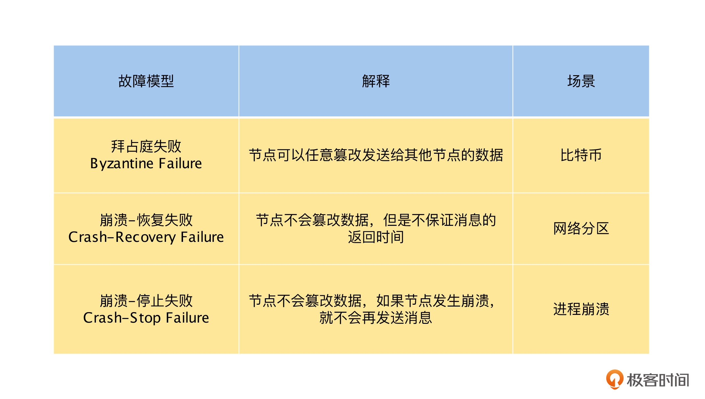

# 共识

## 共识问题的定义

在分布式系统中，共识（Consensus）问题是最重要，也是最基本的问题之一，**简单来说它就是多个节点（进程）对某一个事情达成一致的结果**。在分布式系统中，我们经常碰到这样的场景，比如在主从复制的模型中，需要在多个节点选举出 Leader 节点。由于有且只能有一个 Leader 节点，所以多个节点必须就哪一个节点是 Leader 这个决定达成一致。那么共识算法经常用于像选举 Leader 、分布式锁服务这样，有且只有一个能胜出的场景。

在讨论共识问题的时候，我们通常会做这样的形式化定义：一个或多个节点可以提议（Propose）某些值，而共识算法决定（Decide）采用其中某一个节点提议的某个值。比如在 Leader 选举的例子中，每一个节点都可以提议自己为 Leader 节点，而共识算法会让所有的节点对某一个节点为 Leader 达成一致。

所以，通过上面的讨论，我们可以得出共识算法必须满足的四个条件，具体如下。

- **一致同意（Uniform Agreement）**：所有协议的节点必须接受相同的决议。
- **诚实性（Integrity）**：所有节点不能反悔，即对一项提议，一个节点不能做两次决定。
- **合法性（Validity）**：如果决定了值 v ，则 v 一定是由某个节点所提议的。
- **可终止性（Termination）**：如果节点不崩溃，则一定可以达成决议。

其中，一致同意和诚实性定义了共识的核心思想：所有人都决定了相同的结果，并且一旦决定了，就不能再改变。

合法性主要是为了排除没有意义的解决方案。例如无论节点提议了什么值，都可以让所有节点始终以某一个固定值（如nil）达成共识的算法，这个算法满足一致同意和诚实性，但是由于达成共识的值是固定的，不是由某一个节点提出的，所以不满足合法性。

可终止性确保了，共识算法在部分节点故障的情况下，其他的节点也能达成一致，可终止性让共识算法能够容错。如果共识算法不需要容错是很容易实现的，比如将某一个节点指定为共识算法的“独裁者”，其他的节点必须同意该节点做出的所有决定。不过这个算法的问题是如果“独裁者”节点出现故障，系统就将无法达成共识了。

其实 **2PC** 协议就是不满足可终止性的共识协议。在 2PC 中，**协调者节点**就是“**独裁者**”节点，它在第一阶段通过收集参与者节点 Prepare 的响应做出决定，**但是当协调者故障时，参与者就无法决定提交还是中止了**。

到这里，你是否觉得共识问题非常简单呢？其实不然，共识问题是一个非常难的问题，如果处理不好共识，很有可能会出现各种问题或故障，比如在分布式锁服务 Leader 选举的场景中，如果出现两个 Leader，那么整个分布式锁服务就进入了脑裂的状态，锁的互斥性将会被破坏，使业务上出现不可预期的情况。

## 达成共识的挑战

我们已经知道共识处理不好，可能会出现各种问题或故障，那么接下来，我们就从共识理论出发，分析达成共识面临的挑战，提前发现问题，解决问题。

**第一个挑战是，在异步网络模型中，如果一个节点出现崩溃，那么共识就将无法达成，这就是大名鼎鼎的 “ FLP 不可能”**。但是在分布式系统中，节点的故障是我们必须要面对的问题，如果以 Leader 选举的场景来讨论，需要达成共识的一个主要场景就是， Leader 节点崩溃了，需要重新选择一个新的 Leader ，选择新的 Leader 需要达成共识，但是因为 “ FLP 不可能”，所以共识不能在节点崩溃的时候达成。

这样看来问题就无解了，但是在实际应用中，我们是可以通过 Raft 或者 Paxos 之类的共识算法来解决这一类问题的，这是否和 “FLP 不可能” 冲突了呢？

其实出现这个问题的根本原因是，在异步网络模型的定义中，网络中消息的传递延迟和节点的处理延迟是无上限的，所以对于消息是不能使用任何时钟或超时的，这样就导致在节点出现崩溃的时候，我们无法判断是否有节点崩溃，只能无限等待下去，使共识算法不能满足“可终止性”；**但是在真实的环境中，我们可以允许共识算法使用超时或其他方法，来识别可疑的崩溃节点（即使有时怀疑是错误的）**，这样就避免了无限等待，使达成共识成为一个可行的事情。

**第二个挑战与我们对分布式系统的故障模型定义有关。一般来说，在分布式系统中，我们对故障模型的定义是“崩溃-恢复失败”（Crash-Recovery Failure）模型**。简单来说就是，在一个节点很长时间没有返回消息时，我们不能确定它是因为崩溃，还是因为网络或者计算速度过慢等原因导致的。其中网络或者计算速度过慢等原因，都是可以恢复的，这个模型和我们现在的分布式模型是最匹配的。

而像 Raft 和 Paxos 之类的共识算法，我们可以在“崩溃-恢复失败”（Crash-Recovery Failure）模型上，通过超时来识别可疑的崩溃节点，这就解决了一个问题：一个或多个节点可以提议（Propose）某些值，而共识算法决定（Decide）采用其中某一个节点提议的某个值。

除此之外，还有“拜占庭失败”（Byzantine Failure）和“崩溃-停止失败”（Crash-Stop Failure）等模型。其中，“拜占庭失败”（Byzantine Failure）模型在“崩溃-恢复失败”（Crash-Recovery Failure）模型上，增加了节点会主动伪造和发布虚假消息的情况，由于这个情况在内网的分布式环境中几乎不会出现，并且要解决它的代价非常高，所以一般的共识算法，不会考虑解决“拜占庭失败”（Byzantine Failure） 模型下的共识问题。

但是，在公网的分布式环境中，是需要解决这个问题的，例如比特币是通过“工作量证明”这样的算法，利用经济学原理，让节点造假的成本高于收益，来避免节点发布虚假消息的。

而“崩溃-停止失败” （Crash-Stop Failure）模型在“崩溃-恢复失败”（Crash-Recovery Failure）模型上，去掉了节点崩溃后的不确定性，如果一个节点很长时间没有返回消息，那么它就是崩溃了，不会再回复什么消息，即崩溃后就立即停止。

但是，在实际的分布式场景中，由于网络或者计算太慢而故障的节点，待恢复后，很久之前响应的消息是会正常出现的。所以，如果共识算法只能处理“崩溃-停止失败”（Crash-Stop Failure）模型，就不能适应我们实际的网络环境了。接下来，我们总结一下课程中提到的三种故障模型，如下表所示。

最后，还要特别强调一点，我们应该尽量选择像 ZooKeeper 和 etcd 这样，开源并且经过了广泛应用而被验证的程序，来为我们的应用提供共识能力，而不是自己再依据 Raft 或 Paxos 算法实现一个共识算法。因为相对于实现一个共识算法，证明共识算法实现的正确性是一个更难的问题。

# 一致性和共识的关系

其实一致性和共识是两个如影随形的概念，我们在讨论一致性的时候，总是会提到共识，同时我们在研究共识的时候，一致性也是不能绕过的话题。那么，你一定会很好奇它们之间的关系是什么？一致性和共识是像鸡生蛋和蛋生鸡这种非常紧密的关系呢？还是其他的比较弱的关系呢？

我们先一起来了解共识问题的场景与定义，然后分析达成共识所面临的挑战，最后再来探讨一致性和共识的关系。

通过学习共识问题的定义和挑战，我们对共识问题有了一定的了解，接下来，我们将一致性和共识结合，讨论一下它们之间的关系，这里的一致性我们定义为一致性最强的线性一致性。

在本专栏[第 19 讲“主从复制”](https://time.geekbang.org/column/article/495283)的课程中，我们讨论过主从复制：主节点承接所有的写入操作，然后以相同的顺序将它们应用到从节点，从而使主、从副本节点的数据保持最终一致性。

如果在主节点或同步副本的从节点上读取数据，那么就是线性一致性的。当然如果数据库的读为快照读，由于不能读到最新版本的数据，这个情况下就不是线性一致性的。

到这里，你是否觉得线性一致性非常容易实现，而且和共识算法也没有什么关系呢？其实不然，在主从复制的模型中，如果主节点不出现故障，那么一切都非常美好，但是如果主节点发生崩溃了，应该怎么办呢？

首先，最简单的办法是**等待主节点修复**，如果主节点无法快速修复或者无法修复，那么系统的高可用就名存实亡了。对于等待主节点恢复的方式，我们可以理解为系统对之前达成主节点的共识是不可改变的。

其次，**人工切换主节点**，这个方案是可行的，不过它的时间不确定，或长或短。如果出故障的时候，找不到合适的人来操作，就会严重影响系统的可用性。对于这个方式，我们可以理解为，系统对于主节点的共识是由操作人员来提供的，这是一个来自“上帝”视角的共识。

最后，**让程序自动切换主节点**，这就需要其余正常运行的节点，来选择一个新的主节点，这样就回到了 Leader 选举的场景，分布式系统中的共识问题就出现了。这个方式是通过共识算法，让系统对一个新 Leader 节点达成共识，避免多个 Leader 节点出现，导致脑裂的情况发生。

到这里，我们就明白了，线性一致性是数据存储系统对外表现的一种形式，即好像只有一个数据副本，但是在实现数据一致性，实现容错的时候，我们需要共识算法的帮助。

当然，这里要特别注意，我们通过共识算法，除了可以实现线性一致性，也可以实现顺序一致性等其他的数据一致性，共识算法是用来满足线性一致性的容错性的。同时，不使用共识算法，我们也可以实现数据的线性一致性，比如 ABD 和 SCD broadcast 之类的非共识算法，也可以实现线性一致性。

总而言之，我们通过共识算法，可以实现高可用的线性一致性，以及其他的一致性存储系统，在这种情况下，**共识算法是手段，一致性是目的，先有共识算法，后有高可用的线性一致性系统**。同时，不通过共识算法，我们也可以用其他的方法，来实现线性一致性等其他的一致性，在这种情况下，共识和一致性就没有关系了。**不过，目前通过共识算法，来实现高可用的线性一致性模型，是一个最常见的选择**。

## “一致性与共识”系列小结

首先，数据的一致性模型定义了，一个数据对象在多个节点上有多个副本时，对外部读写表现出来的现象。数据一致性模型从强至弱分别为：线性一致性、顺序一致性、因果一致性和最终一致性。其中线性一致性是我们目前可以实现的一致性最强的模型，对于线性一致性的数据复制模型，我们可以认为它和操作单副本是一样的结果，基于它搭建的数据系统一般都是 **CP 系统**。

而一致性级别最弱的最终一致性，它只能确保数据最终会一致，并不能明确这个时间有多长。最终一致性牺牲了数据一定程度上的正确性，换取了高性能和高可用，在高并发的互联网场景中经常被使用，基于它搭建的数据系统一般都是 **AP 系统**。

其次，共识是指多个节点（进程）对某一个事情达成一致的结果，一个完备的共识算法需要满足四个要求：一致同意、诚实性、合法性和可终止性。共识算法主要用于解决 Leader 选举和分布式锁服务等分布式场景中，最底层、最基础的问题，所以基于 Leader 的线性一致性算法，通常都需要依赖共识算法来实现选举。

最后，通过讨论共识与分布式事务之间的关系，我们发现在事务的原子性、隔离性和持久性的实现中，都可以看到共识的身影，并且当我们对事务与数据的一致性进行比较后，**发现事务是多个数据操作的一致性问题，而数据一致性则可以理解为，对多个副本的单个数据对象的事务问题**。

本节课中，我们先讨论了事务与共识的关系，发现它们之间有着非常密切的关系，**世界的尽头在哪里我不知道，但是我可以明确地告诉你，分布式的尽头就是共识**。

然后，我们通过分析分布式事务，并且与数据一致性做对比，发现事务可以理解为对多个数据操作的一致性问题，这样我们对分布式事务的理解就又多了一个维度。其实深入理解事务，是学习好分布式存储的基石，也会为你以后的工作打下一个坚实的基础。

# 事务与共识的关系

你应该还记得，在课程[第 23 讲“原子性”](https://time.geekbang.org/column/article/498423)中提到过，当我们在实现事务的原子性时，采用的是 2PC 或 3PC 这样的共识协议；同时，在课程[第 25 讲“持久性”](https://time.geekbang.org/column/article/500579)中我们也讲过，通过线性一致性算法来复制数据，可以提高事务的持久性。另外，最显而易见的就是，事务的 ACID 中，C 就是一致性。

那么，你一定在想，在分布式事务中，共识与事务之间是什么关系呢？是不是像共识和线性一致性一样，共识是方法和手段，事务的一致性是目的呢？

在这节课中，我们就一起来讨论一下共识与事务之间的关系。我们先从事务的特性 ACID 的维度，一一来分析事务与共识的关系，然后以它们的关系为基础，探讨事务的本质问题，让你深入理解事务与共识、一致性之间的联系，从根本上理解分布式事务，为以后的工作打下一个坚实的基础。

## 事务与共识的关系

通过课程[第 22 讲“一致性”](https://time.geekbang.org/column/article/497528)的学习，我们知道了事务的最终目的是实现一致性，即确保事务正确地将数据从一个一致性的状态，变换到另一个一致性的状态。为了达成这个目标，除了需要应用层的逻辑保证外，在事务层面还需要通过原子性、隔离性和持久性这三个特性一起协作。很有意思的一件事情是，在分布式事务中，事务这三个特性都与共识有一定的关系，下面我们来一一讨论一下。

首先，对于原子性来说，在分布式系统中，需要通过 2PC 或 3PC 之类的原子提交协议来实现。以 2PC 为例，协调者在第一阶段通过接收所有参与者对 Prepare 请求的响应，才能最终确定当前的事务是提交还是中止，而这就是典型的共识场景：所有的参与者都同意，就提交事务；如果有参与者不同意，就中止事务。**所以，我们认为 2PC 或 3PC 之类的原子提交协议是共识协议**。

另外，还要特别注意一点，我们在上节课讨论过， 2PC 不是一个完备的共识算法，它满足共识算法的一致同意、诚实性以及合法性，但是在协调者出现故障的时候，并不能满足共识算法的可终止性。

其次，对于隔离性来说，我们一般通过 2PL 或 MVCC 的方式来实现，可是它们能正确实现隔离性的前提条件，建立在底层数据为单副本的基础之上。但是在分布式系统中，为了系统的高可用，底层存储的数据是多副本，**为了对事务操作表现出单副本的状态，数据的复制协议必须是线性一致性的，而线性一致性的数据复制协议，通常都是通过共识算法来实现的**。学到这里，你会发现特别有意思，我们从事务的隔离性深层次去探索，就会触碰到共识这个话题。

最后，对于持久性来说，我们在课程第 25 讲中讨论过，在分布式系统中，为了进一步提高事务的持久性，我们会对数据进行复制，通过冗余来提高持久性。虽然数据复制可以不需要共识，但是就像上一段的讨论那样，为了保障事务的隔离性，数据的复制必须是线性一致性的。所以我们可以得出，**事务为了持久性而引入了数据复制，但是为了保障隔离性，只能选择线性一致性的数据复制算法，而一旦涉及线性一致性，就说明我们又回到共识了**。

通过上面的讨论，你是否会感觉到在分布式系统中，当我们为了实现一个确定性正确的程序，一步一步深挖下去，就一定会碰到共识问题呢？其实这一点很好理解，比如在现实生活中，多人合作完成一件事情，如果人们的意见不能达成一致，是很难将事情正确完成的。想要使他们的意见达成一致，就是共识问题了，**人们通过沟通来达成共识，计算机节点之间通过交换信息来达成共识，本质上都是一样的**。

## 事务的本质是什么

在本专栏中，我们特别用四节课的时间做了一个“事务”系列课程，主要有两方面原因。一方面为了说明在分布式系统中，事务占有非常重要的位置，另一方面是为了让你学习到与分布式事务相关的技术原理。

但是，这些知识都是从外向内来解释事务是什么，会让我们感觉到分布式事务涉及的技术原理非常繁多，但是正因为有了这些知识的铺垫，现在我们就可以从更深的维度去探讨事务，让分布式事务变得更加简单和清晰了。那么接下来，我们就来探讨一个问题，事务的本质是什么？

首先，我们简单回忆一下事务的隔离级别：读未提交 (Read Uncommitted)、读已提交 (Read Committed)、可重复读 (Repeatable Read)、快照隔离级别 (Snapshot Isolation) 和串行化 (Serializable) ，从隔离级别的名称和异常情况中，我们都不难发现，隔离级别都是从**读异常**情况的角度来定义的（其中，脏写和写倾斜也可以看成是，由于脏读和幻读导致的写异常），那么这是为什么呢？

其实这是由于事务面对的数据存储，是单副本数据或线性一致的多副本，单个写操作完成后，读操作都是可以立即读取到的，所以在单个写操作的层面，事务是不会出现异常情况的。但是，**由于事务一般都涉及对多个数据对象的读写操作，为了避免并发事务的相互影响，事务需要将还未提交的写操作结果，与其他并发事务进行隔离处理**，那么如何实现隔离呢？

既然写操作已经实际发生了，那就只能通过读操作进行隔离了，即将一个事务时间内多个离散的写操作，通过对读操作在并发事务之间隔离的方式，使事务的多个操作对外表现为一个原子操作一样。

接着，我们再来梳理一下数据一致性的模型。从课程第 26 讲“数据一致性都有哪些级别”的定义与讨论中，我们不难看出线性一致性、顺序一致性、因果一致性和最终一致性，这四种线性一致性模型讨论的都是，对单个数据对象操作时，单节点或多节点的多个写操作的顺序，以及复制时延的问题。**在数据一致性的模型中，读异常都是由于对单个数据对象的写操作，在多个副本之间的不同原子同步导致的**。

到这里，我们会发现事务和数据一致性是非常类似的，它们本质上都是期望它的一个完整操作是原子操作，研究的本质问题都是数据的一致性问题。

只不过事务对一个完整操作的定义是，一个**事务**内，对一个或多个数据对象的一个或多个读写操作，它需要解决的是对多个数据对象操作的一致性问题；而**数据一致性**对一个完整操作的定义是，在多个数据副本上对一个数据对象的写操作，它要解决的是单个数据操作，复制到多个副本上的一致性问题。

# 