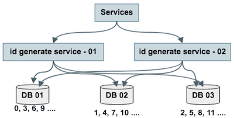
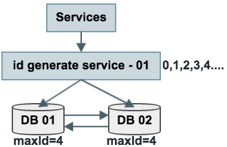
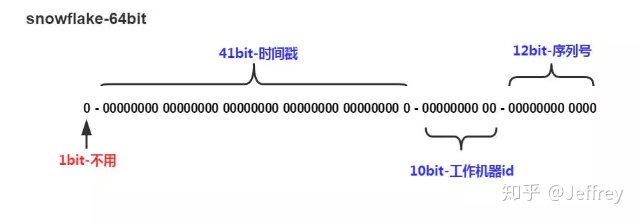
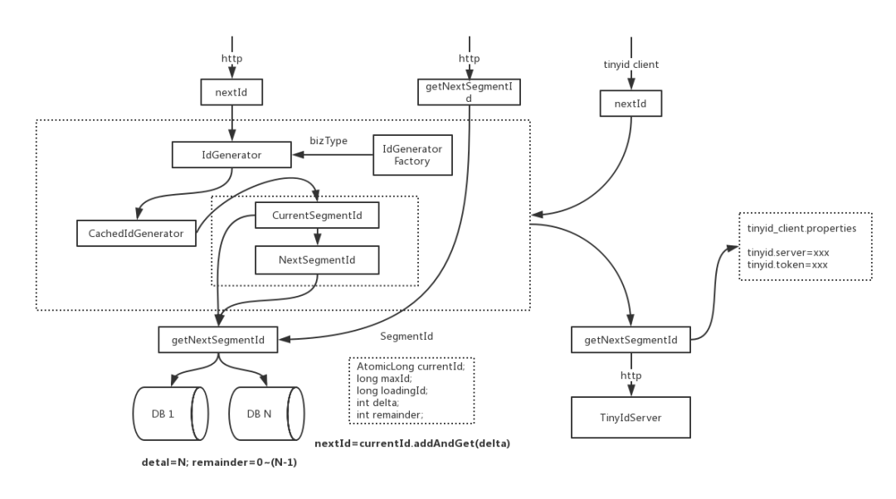

# 分布式唯一ID


### 为什么需要全局唯一ID

传统的单体架构的时候，我们基本是单库然后业务单表的结构。每个业务表的ID一般我们都是从1增，通过AUTO_INCREMENT=1设置自增起始值，但是在分布式服务架构模式下分库分表的设计，使得多个库或多个表存储相同的业务数据。这种情况根据数据库的自增ID就会产生相同ID的情况，不能保证主键的唯一性。


### 方法一: 用数据库的 auto_increment 来生成

**优点：**

- 此方法使用数据库原有的功能，所以相对简单
- 能够保证唯一性
- 能够保证递增性
- id 之间的步长是固定且可自定义的

**缺点：**

- 可用性难以保证：数据库常见架构是 一主多从 + 读写分离，生成自增ID是写请求 主库挂了就玩不转了
- 扩展性差，性能有上限：因为写入是单点，数据库主库的写性能决定ID的生成性能上限，并且 难以扩展

**改进方案：**

- 冗余主库，避免写入单点
- 数据水平切分，保证各主库生成的ID不重复



由1个写库变成3个写库，每个写库设置不同的 auto_increment 初始值，以及相同的增长步长，以保证每个数据库生成的ID是不同的（上图中DB 01生成0,3,6,9…，DB 02生成1,4,7,10，DB 03生成2,5,8,11…）

改进后的架构保证了可用性，但缺点是

- 丧失了ID生成的“绝对递增性”：先访问DB 01生成0,3，再访问DB 02生成1，可能导致在非常短的时间内，ID生成不是绝对递增的（这个问题不大，目标是趋势递增，不是绝对递增
- 数据库的写压力依然很大，每次生成ID都要访问数据库


### 方法二：单点批量ID生成服务

分布式系统之所以难，很重要的原因之一是“没有一个全局时钟，难以保证绝对的时序”，要想保证绝对的时序，还是只能使用单点服务，用本地时钟保证“绝对时序”。

数据库写压力大，是因为每次生成ID都访问了数据库，可以使用批量的方式降低数据库写压力。



ID生成服务假设每次批量拉取5个ID，服务访问数据库，将当前ID的最大值修改为4，这样应用访问ID生成服务索要ID，ID生成服务不需要每次访问数据库，就能依次派发0,1,2,3,4这些ID了。

当ID发完后，再将ID的最大值修改为11，就能再次派发6,7,8,9,10,11这些ID了，于是数据库的压力就降低到原来的1/6。

**优点：**

- 保证了ID生成的绝对递增有序
- 大大的降低了数据库的压力，ID生成可以做到每秒生成几万几十万个

**缺点：**

- 服务仍然是单点
- 如果服务挂了，服务重启起来之后，继续生成ID可能会不连续，中间出现空洞（服务内存是保存着0,1,2,3,4，数据库中max-id是4，分配到3时，服务重启了，下次会从5开始分配，3和4就成了空洞，不过这个问题也不大）


### 方法三：uuid / guid

不管是通过数据库，还是通过服务来生成ID，业务方Application都需要进行一次远程调用，比较耗时。uuid是一种常见的本地生成ID的方法。

1. `UUID uuid = UUID.randomUUID();`

**优点：**

- 本地生成ID，不需要进行远程调用，时延低
- 扩展性好，基本可以认为没有性能上限

**缺点：**

- 无法保证趋势递增
- uuid过长，往往用字符串表示，作为主键建立索引查询效率低，常见优化方案为“转化为两个uint64整数存储”或者“折半存储”（折半后不能保证唯一性）

### 方法四：取当前毫秒数

**优点：**

- 本地生成ID，不需要进行远程调用，时延低
- 生成的ID趋势递增
- 生成的ID是整数，建立索引后查询效率高

**缺点：**

- 如果并发量超过1000，会生成重复的ID
- 这个缺点要了命了，不能保证ID的唯一性。当然，使用微秒可以降低冲突概率，但每秒最多只能生成1000000个ID，再多的话就一定会冲突了，所以使用微秒并不从根本上解决问题。

### 方法五：使用 Redis 来生成 id

当使用数据库来生成ID性能不够要求的时候，我们可以尝试使用Redis来生成ID。这主要依赖于Redis是单线程的，所以也可以用生成全局唯一的ID。可以用Redis的原子操作 INCR 和 INCRBY 来实现。

**优点：**

- 依赖于数据库，灵活方便，且性能优于数据库。
- 数字ID天然排序，对分页或者需要排序的结果很有帮助。

**缺点：**

- 如果系统中没有Redis，还需要引入新的组件，增加系统复杂度。
- 需要编码和配置的工作量比较大


### 方法六：Twitter 开源的 Snowflake 算法

snowflake 是 twitter 开源的分布式ID生成算法，其核心思想为，一个long型的ID：



#### **组成部分（64bit）**

**1.第一位** 占用1bit，其值始终是0，没有实际作用。 **2.时间戳** 占用41bit，精确到毫秒，总共可以容纳约69年的时间。 **3.工作机器id** 占用10bit，其中高位5bit是数据中心ID，低位5bit是工作节点ID，做多可以容纳1024个节点。 **4.序列号** 占用12bit，每个节点每毫秒0开始不断累加，最多可以累加到4095，一共可以产生4096个ID。

SnowFlake算法在同一毫秒内最多可以生成多少个全局唯一ID呢：： **同一毫秒的ID数量 = 1024 X 4096 = 4194304**


#### 雪花算法的实现

雪花算法的实现主要依赖于数据中心ID和数据节点ID这两个参数，具体实现如下。

**JAVA实现**

```java
public class SnowflakeIdWorker {
    /**
     * 开始时间截 (2015-01-01)
     */
    private final long twepoch = 1420041600000L;
    /**
     * 机器id所占的位数
     */
    private final long workerIdBits = 5L;
    /**
     * 数据标识id所占的位数
     */
    private final long datacenterIdBits = 5L;
    /**
     * 支持的最大机器id，结果是31 (这个移位算法可以很快的计算出几位二进制数所能表示的最大十进制数)
     */
    private final long maxWorkerId = -1L ^ (-1L << workerIdBits);
    /**
     * 支持的最大数据标识id，结果是31
     */
    private final long maxDatacenterId = -1L ^ (-1L << datacenterIdBits);
    /**
     * 序列在id中占的位数
     */
    private final long sequenceBits = 12L;
    /**
     * 机器ID向左移12位
     */
    private final long workerIdShift = sequenceBits;
    /**
     * 数据标识id向左移17位(12+5)
     */
    private final long datacenterIdShift = sequenceBits + workerIdBits;
    /**
     * 时间截向左移22位(5+5+12)
     */
    private final long timestampLeftShift = sequenceBits + workerIdBits + datacenterIdBits;
    /**
     * 生成序列的掩码，这里为4095 (0b111111111111=0xfff=4095)
     */
    private final long sequenceMask = -1L ^ (-1L << sequenceBits);
    /**
     * 工作机器ID(0~31)
     */
    private long workerId;
    /**
     * 数据中心ID(0~31)
     */
    private long datacenterId;
    /**
     * 毫秒内序列(0~4095)
     */
    private long sequence = 0L;
    /**
     * 上次生成ID的时间截
     */
    private long lastTimestamp = -1L;
    /**
     * 构造函数
     * @param workerId     工作ID (0~31)
     * @param datacenterId 数据中心ID (0~31)
     */
    public SnowflakeIdWorker(long workerId, long datacenterId) {
        if (workerId > maxWorkerId || workerId < 0) {
            throw new IllegalArgumentException(String.format("worker Id can't be greater than %d or less than 0", maxWorkerId));
        }
        if (datacenterId > maxDatacenterId || datacenterId < 0) {
            throw new IllegalArgumentException(String.format("datacenter Id can't be greater than %d or less than 0", maxDatacenterId));
        }
        this.workerId = workerId;
        this.datacenterId = datacenterId;
    }
    /**
     * 获得下一个ID (该方法是线程安全的)
     * @return SnowflakeId
     */
    public synchronized long nextId() {
        long timestamp = timeGen();
        // 如果当前时间小于上一次ID生成的时间戳，说明系统时钟回退过这个时候应当抛出异常
        if (timestamp < lastTimestamp) {
            throw new RuntimeException(
                    String.format("Clock moved backwards.  Refusing to generate id for %d milliseconds", lastTimestamp - timestamp));
        }
        // 如果是同一时间生成的，则进行毫秒内序列
        if (lastTimestamp == timestamp) {
            sequence = (sequence + 1) & sequenceMask;
            // 毫秒内序列溢出
            if (sequence == 0) {
                //阻塞到下一个毫秒,获得新的时间戳
                timestamp = tilNextMillis(lastTimestamp);
            }
        }
        // 时间戳改变，毫秒内序列重置
        else {
            sequence = 0L;
        }
        // 上次生成ID的时间截
        lastTimestamp = timestamp;
        // 移位并通过或运算拼到一起组成64位的ID
        return ((timestamp - twepoch) << timestampLeftShift) //
                | (datacenterId << datacenterIdShift) //
                | (workerId << workerIdShift) //
                | sequence;
    }
    /**
     * 阻塞到下一个毫秒，直到获得新的时间戳
     * @param lastTimestamp 上次生成ID的时间截
     * @return 当前时间戳
     */
    protected long tilNextMillis(long lastTimestamp) {
        long timestamp = timeGen();
        while (timestamp <= lastTimestamp) {
            timestamp = timeGen();
        }
        return timestamp;
    }
    /**
     * 返回以毫秒为单位的当前时间
     * @return 当前时间(毫秒)
     */
    protected long timeGen() {
        return System.currentTimeMillis();
    }

    public static void main(String[] args) throws InterruptedException {
        SnowflakeIdWorker idWorker = new SnowflakeIdWorker(0, 0);
        for (int i = 0; i < 10; i++) {
            long id = idWorker.nextId();
            Thread.sleep(1);
            System.out.println(id);
        }
    }
}
```

**雪花算法提供了一个很好的设计思想，雪花算法生成的ID是趋势递增，不依赖数据库等第三方系统，以服务的方式部署，稳定性更高，生成ID的性能也是非常高的，而且可以根据自身业务特性分配bit位，非常灵活**。

但是雪花算法强**依赖机器时钟**，如果机器上时钟回拨，会导致发号重复或者服务会处于不可用状态。如果恰巧回退前生成过一些ID，而时间回退后，生成的ID就有可能重复。官方对于此并没有给出解决方案，而是简单的抛错处理，这样会造成在时间被追回之前的这段时间服务不可用。

很多其他类雪花算法也是在此思想上的设计然后改进规避它的缺陷，后面介绍的`百度 UidGenerator` 和 `美团分布式ID生成系统 Leaf` 中snowflake模式都是在 snowflake 的基础上演进出来的。


### 方法七：滴滴开源的分布式id生成系统

ID Generator id生成器 分布式id生成系统，简单易用、高性能、高可用的id生成系统

Tinyid是用Java开发的一款分布式id生成系统，基于数据库号段算法实现，关于这个算法可以参考美团leaf或者tinyid原理介绍。Tinyid扩展了leaf-segment算法，支持了多db(master)，同时提供了java-client(sdk)使id生成本地化，获得了更好的性能与可用性。Tinyid在滴滴客服部门使用，均通过tinyid-client方式接入，每天生成亿级别的id。



- nextId和getNextSegmentId是tinyid-server对外提供的两个http接口
- nextId是获取下一个id，当调用nextId时，会传入bizType，每个bizType的id数据是隔离的，生成id会使用该bizType类型生成的IdGenerator。
- getNextSegmentId是获取下一个可用号段，tinyid-client会通过此接口来获取可用号段
- IdGenerator是id生成的接口
- IdGeneratorFactory是生产具体IdGenerator的工厂，每个biz_type生成一个IdGenerator实例。通过工厂，我们可以随时在db中新增biz_type，而不用重启服务
- IdGeneratorFactory实际上有两个子类IdGeneratorFactoryServer和IdGeneratorFactoryClient，区别在于，getNextSegmentId的不同，一个是DbGet,一个是HttpGet
- CachedIdGenerator则是具体的id生成器对象，持有currentSegmentId和nextSegmentId对象，负责nextId的核心流程。nextId最终通过AtomicLong.andAndGet(delta)方法产生。


#### Tinyid的特性

1. 全局唯一的long型id
2. 趋势递增的id，即不保证下一个id一定比上一个大
3. 非连续性
4. 提供http和java client方式接入
5. 支持批量获取id
6. 支持生成1,3,5,7,9…序列的id
7. 支持多个db的配置，无单点

适用场景:只关心id是数字，趋势递增的系统，可以容忍id不连续，有浪费的场景 不适用场景:类似订单id的业务(因为生成的id大部分是连续的，容易被扫库、或者测算出订单量)


### 总结

以上基本列出了所有常用的分布式ID生成方式，其实大致分类的话可以分为两类：

- **一种是类DB型的**，根据设置不同起始值和步长来实现趋势递增，需要考虑服务的容错性和可用性。
- **另一种是类snowflake型**，这种就是将64位划分为不同的段，每段代表不同的涵义，基本就是时间戳、机器ID和序列数。这种方案就是需要考虑时钟回拨的问题以及做一些 buffer的缓冲设计提高性能。

而且可通过将三者（时间戳，机器ID，序列数）划分不同的位数来改变使用寿命和并发数。

例如对于并发数要求不高、期望长期使用的应用，可增加时间戳位数，减少序列数的位数. 例如配置成`{"workerBits":23,"timeBits":31,"seqBits":9}`时, 可支持28个节点以整体并发量14400 UID/s的速度持续运行68年。

对于节点重启频率频繁、期望长期使用的应用, 可增加工作机器位数和时间戳位数, 减少序列数位数. 例如配置成`{"workerBits":27,"timeBits":30,"seqBits":6}`时, 可支持37个节点以整体并发量2400 UID/s的速度持续运行34年。