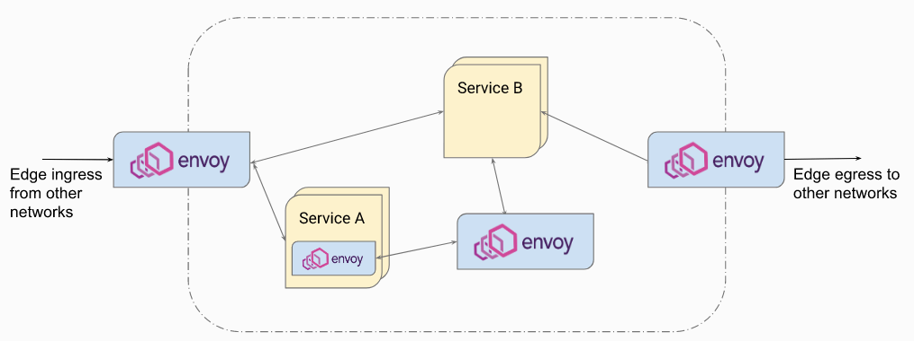
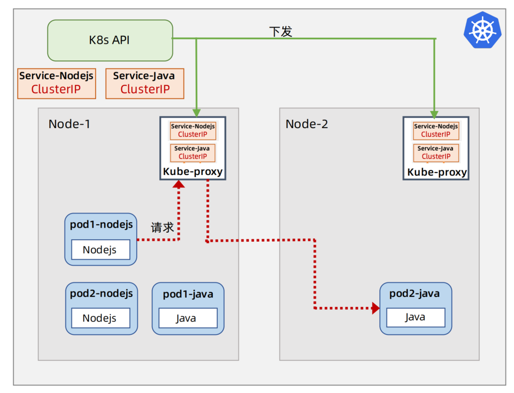
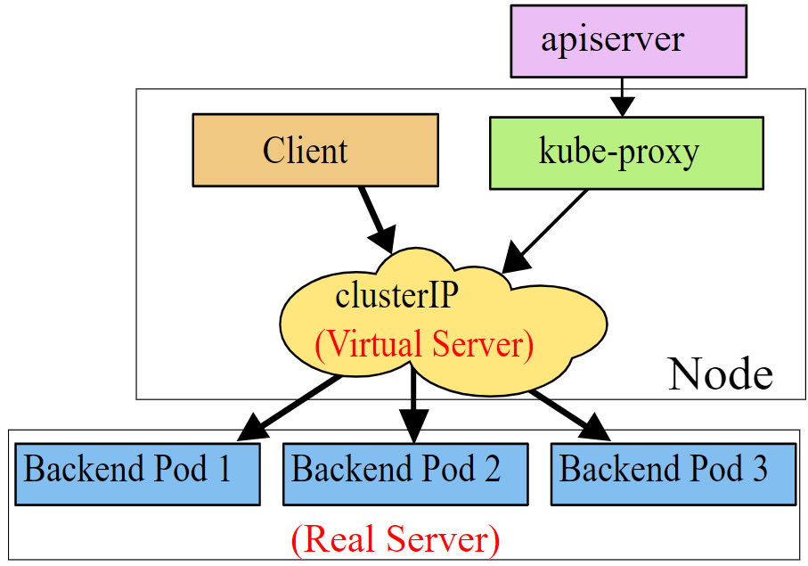

# 服务网格技术

>如何实现精细化服务治理 - 服务网格技术ServiceMesh解析


## 为什么说ServiceMesh是微服务的未来


**微服务治理~Must Have**


**微服务治理~ Nice To Have**


### 服务治理演进史

**Dubbo (2012年前)**


**Airbnb SmartStack (2013)**


**Netflix oSS/Spring Cloud (2013年后)**


**Envoy/lstio ( 2016后)**


**比较**


**K85 + ServiceMesh是微服务的未来**


## 解析Envoy Proxy


### Envoy 云原生代理


Lyft开源的Envoy反向代理，它是云原生组织CNCF所支持并且推荐的一款高性能的反向代理。

Envoy是Lyft公司研发和开源的一个反向代理中间件。在Envoy的官方文档站点上面，列出了关于Envoy的很多特性。

第一个特性叫进程外架构，这个其实就是指Envoy可以以独立进程的方式进行部署，对应用程序无侵入，可以支持多语言栈还有框架。

第二个特性是C++开发的具有更好的性能。

第三个特性，Envoy的核心是一个3层和4层代理，也就是一个TCP代理，它提供对TCP消息进行处理的这个过滤器机制，可以实现TLS客户端证书认证这些功能。

第四个特性，Envoy也是一个7层反向代理，它也提供对HTTP消息进行处理的过滤器机制，可以实现限流还有路由转发这些7层的功能。

..

第六个特性，Envoy支持通过HTTP请求path或者是header这些方式实现灵活的7层路由。

第七个特性，Envoy也支持gRPC协议。

第八个特性，Envoy提供动态服务发现还有配置的API，可以对接各种服务发现机制。

......

第十个特性，EnvoV支持高级的负载均衡策略，也支持自动重试 熔断 局部还有全局限流 请求镜像 还有异常检测这些高级的特性。

第十一个特性，Envoy不仅可以部署为ServiceMesh的边车代理，它也可以部署为内网的集中代理，还可以部署为边界的入口代理。

第十二个特性，Envoy提供了丰富的监控统计数据还有接口，也支持对接主流的这个trace调用链监控平台。

第十三个特性，Envoy还支持不停服务的优雅重启功能。


### 谁在用Envoy


### 核心概念


### 示例

#### 场景


#### 静态配置

##### **static_resources部分**


```yaml
listeners
这个部分定义了监听器，即Envoy接收传入连接的地方。在这个配置中，有一个监听器监听443端口（HTTPS端口）。
name: listener_https：监听器的名称。
address：监听器绑定的地址和端口。
  socket_address：
  protocol: TCP：使用TCP协议。
  address: 0.0.0.0：监听所有IP地址。
  port_value: 443：监听443端口。

listener_filters
这个部分定义了监听器过滤器，用于在接受连接时对其进行初步处理。
name: "envoy.filters.listener.tls_inspector"：使用TLS检查过滤器。
typed_config: {}：配置为空，使用默认配置。

filter_chains
这个部分定义了过滤器链，指定了如何处理连接。
filter_chain_match：
  server_names: ["acme.com"]：匹配服务器名称为"acme.com"的请求。
transport_socket：
  name: envoy.transport_sockets.tls：使用TLS传输套接字。
  typed_config：
    @type: 指定配置类型。
    common_tls_context：TLS的通用配置。
      tls_certificates：TLS证书。
        certificate_chain：证书链文件。
        private_key：私钥文件。
```


##### filters部分


这个部分定义了HTTP连接管理器及其相关配置。

```yaml
name: envoy.filters.network.http_connection_manager：使用HTTP连接管理器过滤器。
typed_config：
  @type: 指定配置类型。
  stat_prefix: ingress_http：统计前缀。
  use_remote_address: true：使用远程地址。
  http2_protocol_options：
    max_concurrent_streams: 100：HTTP/2最大并发流数。
  access_log：访问日志配置。
    name: envoy.access_loggers.file：使用文件访问日志记录器。
    typed_config：
      @type: 指定配置类型。
      path: "/var/log/envoy/access.log"：日志文件路径。
  route_config：路由配置。
    name: local_route：路由名称。
    virtual_hosts：虚拟主机配置。
      name: local_service：虚拟主机名称。
      domains: ["acme.com"]：匹配域名。
      routes：路由配置。
        match：
          path: "/foo"：匹配路径。
        route：
          cluster: some_service：路由到的集群。
http_filters：HTTP过滤器链。
  name: some.customer.filter：自定义过滤器。
  name: envoy.filters.http.router：HTTP路由过滤器。
```


##### clusters部分


```yaml
name: some_service：集群名称。
connect_timeout: 5s：连接超时时间。
transport_socket：
  name: envoy.transport_sockets.tls：使用TLS传输套接字。
  typed_config：
    @type: 指定配置类型。
load_assignment：负载分配。
  cluster_name: some_service：集群名称。
  endpoints：端点列表。
    lb_endpoints：负载均衡端点。
      endpoint：
        address：
          socket_address：
            address: 10.1.2.10：端点IP地址。
            port_value: 10002：端点端口。
      endpoint：
        address：
          socket_address：
            address: 10.1.2.11：第二个端点IP地址。
            port_value: 10002：第二个端点端口。
http2_protocol_options：
  max_concurrent_streams: 100：HTTP/2最大并发流数。
name: some_statsd_sink：StatsD接收器集群名称。
connect_timeout: 5s：连接超时时间。
typed_config：
  @type: 指定配置类型。
  tcp_cluster_name: some_statsd_cluster：StatsD集群名称。
```

这个配置文件设置了一个Envoy代理，它监听443端口，处理TLS连接，并将请求路由到上游服务`some_service`。配置中还包含了对访问日志的记录，以及与StatsD的集成，用于统计和监控。


#### 请求流程

略（没看懂）


### Envoy的线程模型


### 部署方式

#### ServiceMesh


#### 集中式 Proxy/LB


#### Ingress/ Egress Proxy


#### 混合式 Hybrid




### Envoy的性能~延迟百分位


## 解析lstio

### 架构


### 新概念~VirtualService & DestinationRule


### 安全架构


### 理解K8s Service





### 理解K8s + Istio


## K8sIngress、IstioGateway和APIGateway该如何选择

Pod 可以认为是K8s云平台所提供的一种虚拟机资源，它是K8s调度和发布的最基本的单位，包括创建、销毁、迁移、还有水平伸缩等等，都是以Pod为单位的。但是Pod在K8s当中是一个不固定的英文叫ephemeral这样一个概念，Pod的IP可能会变，所以没办法直接采用Pod IP对服务进行访问。为了屏蔽Pod IP可能的变化，K8s当中引入了Service这样一个抽象概念，Service 可以认为是一组Pod组成的一个服务集群一个Cluster的一个抽象。一个Service具有一个虚拟化的clusterIP,当集群当中的某个Client需要访问某个Service 的时候，它通过clusterIP去进行访问，Service 抽象层通过服务发现加上负载均衡机制将请求再转发到某个目标Pod上，这里的服务发现和负载均衡机制主要是通过kube-proxy这个组件来实现的，那么K8s会在集群的每一个节点上都部署一个kube-proxy。它主要支持三种工作模式，第一种工作模式叫用户空间代理模式（Userspace Proxy Mode），在这种模式下，kube-proxy 会为每一个Service创建一个监听端口。当Client向某个ClusterIP服务发送请求，这个请求会被iptables规则转发到这个kube-proxy的监听端口上，然后kube-proxy会根据负载均衡算法选择一个目标Pod,再将请求转发到这个目标Pod上，在这种模式下，kube-proxy 相当于是一个穿透型的四层反向代理，由于kube-proxy运行在用户空间当中，并且流量是穿透kube-proxy的，所以这种转发会增加两次内核和用户空间的数据拷贝，效率比较低，它的好处是当后端的Pod不可用的时候，kube-proxy 可以重试其它的Pod,早期版本的K8s就是支持用户空间代理模式的。


**K8s ClusterlP Service ~ Userspace Proxy Mode**


为了避免增加内核和用户空间的数据拷贝操作，提升转发的效率，新版K8s支持性能更好的Iptables模式，在这种模式下kube-proxy会为Service的后端的每一个Pod,创建对应的iptables规则（转发规则），当client向某个ClusterIP服务发送请求，这个请求会被iptables规则直接转发到一个目标Pod IP,在这种模式下kube-poxy并不直接承担这个负载均衡和转发任务，它只是负责创建相应的iptables规则，因此效率比较高。但是iptables转发不提供灵活的负载均衡策略。当后端的Pod不可用的时候，它是无法进行重试的，另外当K8s集群规模比较大的时候，需要同步的iptables规则的数量还有开销也会比较大，所以这种模式对集群规模是有一定限制的。

**K8s ClusterlP Service ~ Iptables Mode**


为了支持更灵活的负载均衡，同时支持更大规模的集群，新版本的K8s还支持IPVS模式，IPVs模式和Iptables这个模式是类似的，在这种模式下面，kube-proxy 会监控这些Pod它的变化，并且创建相应的IPVS规则，IPVS也是内核模式下通过Netfliter来实现的，它采用哈希表存储规则，在规则较多的情况下IPVS比Iptables的转发效率更高，另外IPVS还支持一些高级的负载均衡算法。

**K8s ClusterIP Service ~ IPVS mode**





**Istio Sidecar Proxy**

K8s它的Service 抽象还有kube-proxy机制只是提供了基本的服务发现和负载均衡的能力，无法实现细粒度的流量治理和监控这些功能，所以K8s和Istio进行集成，才能实现精细化的服务治理。将K8s和Istio进行集成以后，Istio通过Iptables和Sidecar这个Proxy来接管服务之间的通讯。这是服务之间它的通讯不再通过kube-proxy，而是通过Istio提供的Sidecar Proxy进行，一个简单的请求流程是以下这样的，当某个Service X它的Client要访问Service B的时候 ，那么它向Service B发起请求，请求首先会被本地的Iptables截获，并且转发到同一个Pod当中的Sidecar Proxy,Sidecar Proxy会根据从控制平面获取到的服务发现信息还有负载均衡策略选择一个目标服务的Pod，再将请求转发到目标服务Pod,那么Istio Sidecar Proxy工作方式和kube-proxy的用户空间代理模式有点类似，但他们之间也有不同点，kube-proxy工作在四层，但是Istio的Sidecar Proxy它是工作在七层的，它可以对HTTP1还有HTTP2这些协议实现更灵活的流量治理功能，包括金丝雀测试，还有A/B测试等等。


K8s的Pod还有ClusterlP都是只能在集群内部访问的,为了让外部网络能够访问到K8s集群内部的服务K8s支持以NodePort的方式将内部的服务暴露给外网,如果将一个Service的发布类型定义为NodePort,那么将这个服务发布以后，K8s集群当中的每一个节点上的Kube Proxy都会开启对应的一个监听端口，通过这个端口外部的流量就可以转发到内部的服务，实际的转发和前面讲的Iptables模式类似。


前面提到，如果要将K8s内部的服务暴露到外网，需要借助NodePort，K8s会在集群的每一个节点上面开启一个NodePort监听端口，但是如果要把K8s集群当中的服务直接暴露到公网上去，前置的话还需要引入一个公网的四层负载均衡器，为什么需要公网负载均衡器，原因主要有两点那么第一点，K8s内的服务如果要暴露在公网上需要一个稳定的IP，这样的话用户才能够通过公网IP来访问服务，这个IP就由公网的负载均衡器来提供，那么第二个原因，因为NodePort它是分布在K8s集群的每一个节点上的，所以需要一个前置的负载均衡设备来对它们进行负载均衡，这样才能实现负载分摊还有访问的高可用，所以前置是需要引入负载均衡设备的。


**K8s Ingress**


**NodePort + LB + Ingress**


**流量路径**


### K8s Ingress 作为API网关


### lstio Gateway 作为API网关


### **K8s Ingress vs lstio Gateway vs API Gateway**


### 综合方案


## Spring Cloud、K8s和 Istio该如何集成


### 微服务关注公共点


### 比较


在**服务发现**和**负载均衡**这一块，Spring Cloud 提供Eureka注册中心，另外Spring Cloud近年也推出了自己的客户端的Load Balancer这个组件，它可以和Eureka集成，实现各种负载均衡的策略，那么K8s它的服务发现和负载均衡主要是通过Service抽象机制来实现的，底层是由kube-proxy所支持的。Istio它的服务发现和负载均衡依赖于K8s的服务发现并且底层是基于Sidecar也就是Envoy Proxy 来实现。

那么在**边界代理**和**网关**这一块，Spring Cloud 目前主力支持的是SC Gateway，K8s原生支持的是Ingress,Istio推荐支持的是Istio Gateway。

**在配置中心**这一块，Spring它提供SC Config Server,K8s支持ConfigMaps还有Secrets这些配置机制，Istio在这一块的话没有支持。

在**调度**和**发布**这一块，那么K8s它原生是支持调度和发布的，Spring 和Istio他们依赖于K8s或者是其它的平台的发布能力。

.......

.......

........


### 推荐选择


在服务发现和负载均衡一块，推荐直接引用K8s加上Istio,采用K8s平台所支持的服务发现能力，还有Istior然后Envoy所支持的负载均衡能力，通过在平台层来解决服务发现和负载均衡问题，就可以支持多语言栈，而且可以让开发框架变得比较简单。比方说用Spring或者SpringBoot就够了。

在边界代理一块，正如在上一节所推荐的，可以考虑同时引入Istio GateWay还有SC Gateway,通过Istio Gateway实现统一的服务治理，在通过SC Gateway实现API治理，而且SC Gateway也比较容易订制和扩展。

在配置中心一块，对于大部分简单的场景，推荐直接使用K8s的ConfigMaps还有Secrets来进行配置管理，如果需要更灵活的企业级的配置管理方案，可以考虑引入携程开源的Apollo配置中心，关于Apollo如何和K8s进行对接，已经有其他人实现过。

调度和发布这块，K8s是目前最主流的选择。

在监控治理这块K8s平台它的监控指标的话，可以从Mertrics Server上面来采集，那么ServiceMesh层的监控可以从Envoy代理层进行采集。建议可以再引入jaeger调用类监控平台，还有Kiali可视化的监控工具。

限流容错 略

流量治理 略

再安全治理一块，如果采用基于网关层的统一认证授权，那么可以考虑引入SC Oauth2,如果企业内网是属于信任域的话，一般也不需要特别的安全治理，让运维在网络层做好隔离就可以了。如果需要精细化的安全治理，可以考虑引入Citadel。


### 推荐方案的总体架构


这套体系如果能够搭建起来的话，可是说是一套目前比较前卫的微服务的技术中台。