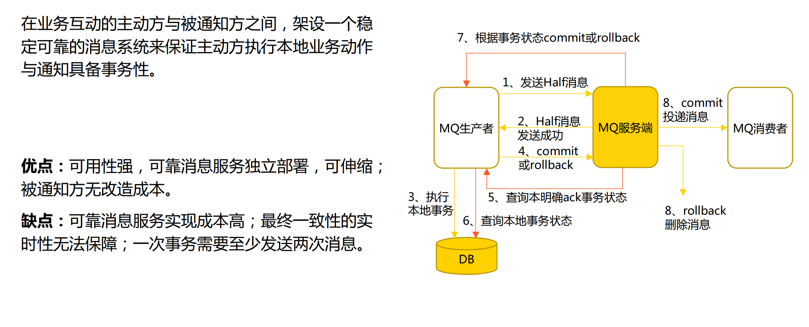

# 分布式系统的特点及挑战

## "一致性"的含义是什么

## "一致性" VS"共识"

## 什么是分布式系统

分布式系统是一个硬件或软件组件分布在不同的网络计算 机上，彼此之间仅仅通过消息传递进行通信和协调的系统。

​                                                                                                                                     —————《分布式系统概念与设计》

 

## 分布式系统的特点

-  分布性：多台计算机在空间上任意分布，分布情况也会随时变动。
- 对等性：组成分布式系统的所有节点都是对等的。副本是分布式系统对数据和服务提供的一种冗余方式。
-  并发性：如果逻辑控制流在时间上重叠，那么它们就是并发的。如何准确高效地协调分布式并发操作也成 为了分布式系统设计的挑战之一。
- 缺乏全局时钟：分布式系统是由一系列在空间上随意分布的多个进程组成的，这些进程通过交换消息来进 行通信，很难定义两个事件的先后顺序。
- 故障总会发生：组成分布式系统的任何节点都可能发生故障。任何在设计阶段考虑到的异常情况，一定会 在实际运行中发生，并且还会遇到很多设计时未考虑到的异常情况（墨菲定律）。

## 分布式系统的挑战

分布式运算的8个谬论：

- 网络是可靠的
-  延迟是不存在的
- 带宽是无限的
- 网络是安全的
- 拓扑结构是一成不变的
- 总会有一个管理员
- 不必考虑传输成本
- 网络都是同质化的

- 故障与部分失效：单节点上的程序以一种确定性的方式运行，要么工作，要么出错，不会出现模棱两可的 现象。但在分布式系统中，可能出现系统的一部分工作正常，其他部分出现难以预测的故障，称之为“部 分失效”。问题的难点是这种部分失效是不确定的。
- 不可靠的网络：通过网络连接多个节点，可能出现丢包、延迟、重复发送以及乱序等情况。分布式系统的 每一次请求和响应，都存在成功、失败和超时（三态）。当出现超时时，网络通信的发起方是无法确定当 前请求是否被成功处理。
- 不可靠的时钟：一个节点上的时钟与另外一个节点上的时钟不一样。对于跨节点的事件排序，如果高度依 赖于时钟计时，就存在一定的技术风险。

## 分布式系统不一致的原因

# 一致性模型及相关原理

## 一致性理论的历史

虽然数据一致性是分布式系统的基石，但是其实最早研究一致性的场景并不是分布式系统，而是多路处理器。不过我们可以将多路处理器理解为单机计算机系统内部的分布式场景，它有多个执行单元，每一个执行单元都有自己的存储（缓存），一个执行单元修改了自己存储中的一个数据后，这个数据在其他执行单元里面的副本就面临数据一致的问题。

当时间走到 1990 年代时，由于互联网公司的快速发展，单机系统在计算和存储方面都面临瓶颈，分布式是一个必然的选择，但是这也进一步放大了数据一致性面临的问题。对于数据的一致性，最理想的模型当然是表现得和一份数据完全一样，修改没有延迟，即所有的数据修改后立即被同步，但是这在现实世界中，数据的传播是需要时间的，所以**理想的一致性模型是不存在的**。

不过从应用层的角度来看，我们并不需要理想的一致性模型，只需要一致性模型能满足业务场景的需求就足够了，比如在一些统计点赞数的场景中，是能容忍一定的误差的，而评论之类的场景中，可能只要有因果关系的操作顺序一致就可以了。

同时由于一致性要求越高，实现的难度和性能消耗就越大，所以我们**可以通过评估业务场景来降低数据一致性的要求**，这样人们就定义了不同的一致性模型来满足不同的需求。是不是发现了这里的思考逻辑和事务的隔离级别一样了？都是正确性和性能之前的衡权。

讨论完了一致性问题的来源后，接下来我们从客户端读写操作的维度来讨论一致性模型。由于一致性模型的定义大多是基于数学语言来定义的，理解起来有一定的难度，所以在课程中，我们尽量用简单的语言来讨论。

接下来，我们将讨论四个经典且常见的一致性模型：线性一致性、顺序一致性、因果一致性和最终一致性。

## 一致性模型

### 线性一致性（Linearizability）

线性一致性模型（Linearizability）是 Herlihy 和 Wing 等于 1987 年在论文 “Axioms for Concurrent Objects” 中提出的，线性一致性也被称为原子一致性（Atomic Consistency）、强一致性（Strong Consistency）、立即一致性（Immediate Consistency）和外部一致性（External Consistency）。

线性一致性是非常重要的一个一致性模型，在分布性锁、Leader 选举、唯一性约束等很多场景都可以看到它的身影。对于线性一致性的描述，我们可以从读写操作的维度来描述。

对于写操作来说，任意两个写操作 x1 和 x2：

- 如果写 x1 操作和写 x2 操作有重叠，那么可能 x1 覆盖 x2，也可能 x2 覆盖 x1；
- 如果写 x1 操作在写 x2 开始前完成，那么 x2 一定覆盖 x1。

对于读操作来说：

- 写操作完成后，所有的客户端都能立即观察到；
- 对于多个客户端来说，必须读取到一样的顺序。

我们可以看到，线性一致性保证了所有的读取都可以读到最新写入的值，即一旦新的值被写入或读取，所有后续的读都会看到写入的值，直到它被再次覆盖。**在线性一致性模型中不论是数据的覆盖顺序还是读取顺序，都是按时间线从旧值向新值移动，而不会出现旧值反转的情况。**

#### 定义

- 又称可线性化、原子一致性、强一致性。
- 在线性一致性下，整个系统表现得好像只有一个副本，并且所有操作都 是原子的，应用程序不用关心系统内部有多个副本。
- 在一个线性一致性的系统中，一旦某个客户端提交写请求成功，所有客户端的读请求一定都能看到刚刚写入的值。
- 所有操作被记录在一条时间线上，任意两个事件都可以比较先后顺序。 这些事件一起构成的集合，在数学上称为具有“全序关系”的集合，也 称“线性序”。

#### 线性一致性案例（体育网站）

#### 线性一致性案例（Google Spanner）

#### 线性一致性（应用场景）

典型场景：

- 加锁与主节点选举：主从复制系统需要确保只有一个主节点，否则会产生脑裂。选举新的主节点一般是使 用锁，而这个锁就需要满足可线性化，让所有的节点都同时同意哪个节点有锁。
- 约束与唯一性保证：比如同一个文件目录下不允许有两个相同的文件名，数据库主键不能重复，这些都需 要线性化。其实这些本质和加锁类似。
- 跨通道的时间依赖：如果计算机中出现了多个通道，不一致的原因就是因为多了一个通道，解决这个办法 可以控制某一个通道，比如只读主库。

缺点：

- 显著降低性能和可用性，因此一些分布式系统放弃线性化以换取更好的性能，但也存在可能无法正确工作 的风险。

#### 线性一致性（CAP）

2000年，加州伯克利教授Eric Brewer在ACM PODC（Principles of  Distributed Computing）会议上首次提出：

- 一致性（Consistency）：数据在多个副本之间能够保持一致，C 其实是线性一致性。
-  可用性（Availability）：系统提供的服务必须一直处于可用的状 态，对于用户的每一个操作请求总是能够在有限的时间内返回结果。
- 分区容错性（Partition tolerance）：分布式系统在遇到任何网络分区故障的时候，除非整个网络都发生了故障，仍然需要能够 保证对外提供满足一致性和可用性的服务。

| CAP选择 | 典型案例            | 说明                                                    |
| ------- | ------------------- | ------------------------------------------------------- |
| CP      | etcd、Zookeeper     | 常用于存储系统运行的关键元信息，每次都需 要读到最新数据 |
| AP      | DynamoDB、Cassandra | 可容忍一段时间的数据不一致，但要求可用性                |

##### 线性一致性（CAP案例）

 

##### 线性一致性（CAP的争议）

争议

- 分区容错性没得选：通信只能建立在可能会延迟或丢包的异步通信网络上。
- 正式定义范围很窄：只考虑了一种一致性模型和一种故障，而没有考 虑网络延迟、节点失败或其他需要权衡的情况。
- “三选二”存在误导：分区很少发生，不存在分区时候没必要牺牲C或 A；C与A之间的取舍可以在同一系统内以非常细小的粒度反复发生； 三种都可以在程度上衡量，并不是有或无。

意义

- 深入探讨数据库设计的权衡之道，帮助大家从在集中共享的存储集群 上提供可线性化的语义，转向探索无共享系统。

##### 线性一致性（CAP与BASE）

- 基本可用（Basically Available）：分布式系统在出现不可预知故 障的时候，允许损失部分可用性。
- 弱状态（Soft state）：允许系统中的数据存在中间状态，并认为该中间状态的存在不会影响系统的整体可用性，即允许系统在不同节点 的数据副本之间进行数据同步的过程存在延时。
- 最终一致性（Eventually consistent）：系统中所有的数据副本， 在经过一段时间的同步后，最终能够达到一个一致的状态。最终一致 性的本质是需要系统保证最终数据能够达到一致，而不需要实时保证 系统数据的强一致性。

 应用场景：大促时退款功能降级、第三方订单状态更新等

### 顺序一致性（Sequential Consistency）

又称时间线一致性，所有的进程都以相同的顺序看到所有的修改。读操作未必能及时得到此前其他进程对同一数据的写更新，但是每个进程读到的该数据不同值的顺序却是一致的。

顺序一致性模型（Sequential Consistency）是 Leslie Lamport 在 1979 年发表的论文 “How to Make a Multiprocessor Computer That Correctly Executes Multiprocess Program” 中提出的，在论文中具体的定义如下：

>如果任何执行的结果与所有处理器的操作都以某种顺序执行的结果相同，并且每个单独的处理器的操作按照其程序顺序出现在该序列中，则称多处理器是顺序一致的。

对于顺序一致性，论文中的定义虽然严谨，但是理解起来也是有难度的，它需要掌握一些前置的定义，比如 “program order”。不过在这里，我们依然可以用简单的语言来描述。

对于写操作来说，任意两个写操作 x1 和 x2：

- 如果写 x1 操作和写 x2 操作有重叠，那么可能 x1 覆盖 x2，也可能 x2 覆盖 x1；
- 当写 x1 操作在写 x2 开始前完成，如果两个写操作没有因果关系，当写 x1 操作在写 x2 开始前完成，那么有可能 x1 覆盖 x2，也有可能 x2 覆盖 x1；如果两个写操作有因果关系，即同一台机器节点先写 x1，或者先看到 x1 然后再写 x2，则所有节点必须用 x2 覆盖 x1。

对于读操作来说：

- 如果写操作 x2 覆盖 x1 完成，那么如果一个客户端到 x2 后，它就无法读取到 x1 了，但是这个时候，其他的客户端还可以观察到 x1；
- 对于多个客户端来说，必须观察到一样的顺序。

相对于线性一致性来说，**顺序一致性在一致性方面有两点放松**：

- 对于写操作，对没有因果关系的非并发写入操作，不要求严格按时间排序；
- 对于读操作，只要求所有的客户端观察到的顺序一致性，不要求写入后，所有的客户端都必须读取新值

| 线性一致性           | 顺序一致性             |
| -------------------- | ---------------------- |
| 全局时钟             | 分布式逻辑时钟         |
| 考虑了时间的先后顺序 | 没有考虑时间的先后顺序 |
| 总能读到最新的数据   | 可能读到旧版本的数据   |

#### 顺序一致性 vs 线性一致性

#### 顺序一致性案例（ZooKeeper）

### 因果一致性（Casual Consistency）

因果一致性模型（Causal Consistency）是 Mustaque Ahamad, Gil Neiger, James E. Burns, Prince Kohli, Phillip W. Hutto 在 1991 年发表的论文 “Causal memory: definitions, implementation, and programming” 中提出的**一种一致性强度低于顺序一致性的模型**。在这里，我们依然从读写操作的维度来进行描述。

对于写操作来说，任意两个写操作 x1 和 x2：

- 如果两个写操作没有因果关系，那么写 x1 操作在写 x2 开始前完成，有的节点是 x1 覆盖 x2，有的节点则 x2 可能覆盖 x1；
- 如果两个写操作有因果关系，即同一台机器节点先写 x1，或者先看到 x1 然后再写 x2，则所有节点必须用 x2 覆盖 x1。

对于读操作来说：

- 如果写操作 x2 覆盖 x1 完成，那么如果一个客户端到 x2 后，它就无法读取到 x1 了，但是这个时候，其他的客户端还可以观察到 x1。

相对于顺序一致性来说，**因果一致性在一致性方面有两点放松**：

- 对于写操作，对没有因果关系的非并发写入操作，不仅不要求按时间排序，还不再要求节点之间的写入顺序一致了；
- 对于读操作，由于对非并发写入顺序不再要求一致性，所以自然也无法要求多个客户端必须观察到一样的顺序。

>Lamport在1978年发表的经典论文Time, Clocks, and the Ordering of Events in a  Distributed System 定义了分布式系统中不同事件间的偏序关系，即是对因果关系的 一种刻画。

- 因果关系：对所发生的事件施加了某种排序，例如发送消息先于收到消 息、问题出现在答案之前等。因果关系的依赖链条定义了系统中的因果顺序，即某件事应该发生在另一件事情之前。
- 因果一致性的系统服从因果关系所规定的顺序。
- 典型场景：IM消息有序、交易系统中订单状态扭转

| 顺序一致性                   | 因果一致性           |
| ---------------------------- | -------------------- |
| 所有进程读写操作统一重排     | 各个进程视角局部重排 |
| 所有进程对顺序达成一致的看法 | 允许看法不一致       |

>为什么因果一致性可以可以站在各个进程的视角对部分操作进行排序，而不是对所有进程的操作进行全局排序，这其实是因为因果顺序它是一种偏序的关系，它就允许站在不同进程的视角来观察各自所关心的部分的操作，而得到不同的观察结果，前提是不违反因果律。
>
>另外的话，只有站在不同不同进程的视角下有不同的观察结果的时候，才可能在发生网络分区的时候来提供可用性。想象一下当一个节点跟系统的其它部分隔离开了，这个节点不需要等待和其它节点进行联系，仍然可以使用旧版本的数据提供服务。

#### 因果一致性案例（微信朋友圈）

#### 线性 vs 顺序 vs 因果一致性

### 最终一致性

最终一致性模型（Eventual Consistency）是 Amazon 的 CTO Werner Vogels 在 2009 年发表的一篇论文 “Eventual Consistency” 里提出的，**它是 Amazon 基于 Dynamo 等系统的实战经验所总结的一种很务实的实现**，它不同于前面几种由大学计算机科学的教授提出的一致性模型，所以也没有非常学院派清晰的定义，但是我们依然可以从读写操作的维度来描述它。

对于同一台机器的两个写操作 x1 和 x2 来说：

- 如果写 x1 操作在写 x2 开始前完成，那么所有节点在最终某时间点后，都会用 x2 覆盖 x1。

对于读操作来说：

- 在数据达到最终一致性的过程中，客户端的多次观察可以看到的结果是 x1 和 x2 中的任意值；
- 在数据达到最终一致性的过程后，所有客户端都将只能观察到 x2。

我们可以看出来，“最终”是一个模糊的、不确定的概念，它是没有明确上限的，Vogels 提出这个不一致的时间窗口可能是由通信延迟、负载和复制次数造成的，但是最终所有进程的观点都一致，这个不一致的时间窗口可能是几秒也可能是几天。

所以，**最终一致性是一个一致性非常低的模型**，但是它能非常高性能地实现，在一些业务量非常大，但是对一致性要求不高的场景，是非常推荐使用。

### 扩展：

#### 因果和相对论

狭义相对论告诉我们，时空中的事件没有一致的全局顺序。不同的 观察者可能无法就两个事件发生的先后顺序达成一致。只存在偏序， 其中事件 !1 早于事件 !2，等价于 !1 可以因果地影响 !2。

Special relativity teaches us that there is no invariant total ordering of  events in space-time; different observers can disagree about which of  two events happened first. There is only a partial order in which an  event e1 precedes an event e2 iff e1 can causally affect e2. — Leslie Lamport 《Time, Clocks and the Ordering of Events in a  Distributed System》

#### 绝对时空观 vs 相对论

### 以客户端为中心的一致性模型

### 事务一致性（ACID）

- 原子性（Atomicity）: 事务中包含的各项操作，要么全部执行成功， 要么全部不执行。任何一项操作失败，都会导致整个事务失败，同 时其他执行成功的操作都被撤销并回滚。
-  一致性（Consistency）: 事务要保持数据的完整性。如果事务执行 过程中发生故障，对数据库的修改部分成功、部分失败，这时数据 库就处在不一致的状态。
- 隔离性（Isolation）: 多事务并行执行所得到的结果，与串行执行 完全相同。
- 持久性（Durability）: 事务一旦提交，数据库中对应数据的状态变 更就是永久性的。即使系统崩溃，数据一定能恢复到事务成功结束 的状态。

#### ACID（争议）

#### ACID（隔离级别）

>ANSI SQL-92是对隔离级别最早最正式的定义。1995年，Jim Gray等人发表论文A Critique of ANSI SQL Isolation Levels， 定义了八种异常现象和六种隔离级别。

- 脏写：一个事务覆盖了另一个仍在运行中、尚未提交的事务写入的值。
- 脏读：一个事务读到了另一个尚未提交的事务写入的值。
- 不可重复读：在一个事务中查询一个值两次，但两次返回的值不同。
- 幻读：当一个事务进行条件查询时，另一个事务在中间插入或删除了匹配该条件的数据，这时事务再去读， 就会发生幻读。
-  更新丢失：当两个事务读取同一个值，然后都试图将其更新为新的不同值时，就会发生更新丢失。
- 读偏斜：读到了数据一致性约束被破坏的数据，这里的一致性约束通常是业务逻辑上的。
- 写偏斜：两个并发事务都读到了相同的数据集，但随后各自修改了不相干的数据集，导致数据的一致性约 束被破坏。

#### ACID（隔离级别）

- 串行化：最严格的隔离级别，可以防止以上所有异常情况。串行化基于锁 实现，要求读操作加读锁，写操作加写锁，并且事务结束后才能释放。实 现串行化以性能为代价。
- 可重复读：事务一旦开始，过程中所读取的所有数据不允许被其他事务修 改会出现幻读。
- 快照隔离：每个事务在独立、一致的快照上进行操作，直至提交后其他事 务才可见。会出现幻读和写偏斜。
- 读已提交：事务执行过程中能够读到其他事务已提交的修改。会出现不可重复读。
- 读未提交：事务执行过程中能够读到其他事务未提交的修改。会出现脏读。

### 一致性模型小结

到这里，我们已经讨论完了几种最经典也最常见的一致性模型，现在我们来对这节课的内容做一个总结。

首先，我们讨论了一致性问题最早出现在多路处理器的场景，现在在分布式系统中广泛出现。同时，我们还得出了一个结论：对一致性模型进行分级是正确性和性能之间的一个权衡。

接着，我们从一致性模型强弱的维度，讨论了四个经典一致性模型的定义与差异，这里我们再从其他的维度描述一下，让你对一致性模型有一个更立体的理解。

第一，现在可以实现的一致性级别最强的是线性一致性，它是指所有进程看到的事件历史一致有序，并符合时间先后顺序, 单个进程遵守 program order，并且有 total order。

第二，是顺序一致性，它是指所有进程看到的事件历史一致有序，但不需要符合时间先后顺序, 单个进程遵守 program order，也有 total order。

>这里的历史是以进程看到的为准，如果两个没有因果的事件 a,b，a 发生后，b 才发 生，但是如果所有的进程都认为 b 先发生，那么事件历史就是 b,a。

第三，是因果一致性，它是指所有进程看到的因果事件历史一致有序，单个进程遵守 program order，不对没有因果关系的并发排序。

第四，是最终一致性，它是指所有进程互相看到的写无序，但最终一致。不对跨进程的消息排序。在课程“[复制（三）：最早的数据复制方式竟然是无主复制？](https://time.geekbang.org/column/article/496934)”中讨论的 Quorum 机制就是最终一致性。

## 不一致对应方法及案例

### 一致性应对全景

### 问题预防（分布式锁、分布式事务、重试、强制主库）

#### 分布式锁

分布式锁是不同进程间采用互斥的方式操作共享资源。分布式锁要保证：

- 互斥（Mutual Exclusion）：同一个锁在被持有的时间段内只能被 一个线程持有（安全特性）
- 避免死锁（Dead lock free）：如果某个客户端获得锁之后花了太长 时间处理，或者客户端发生了故障，锁无法释放会导致整个处理流程 无法进行下去。
- 容错（Fault tolerance）：为避免单点故障，锁服务需要具有一定 容错性。
- 锁超时：保证持有锁的线程出现异常时，锁不会被永久占用。 此外，在一些场景中还希望分布式锁实现：阻塞/非阻塞、可重入、公 平/非公平、性能 注意点：锁粒度、获取锁的超时时间、锁的过期时间

##### 分布式锁（业界方案）

##### 分布式锁（美团Cerberus）

提供Zookeeper、Cellar和Squirrel三种引擎。

支持QPS

- (0, 300]： Zookeeper, Squirrel, Cellar
-  (300, 600]：Squirrel, Cellar
-  (600, 1000]：可用Squirrel、Cellar，但不保证TP和SLA指标
- (1000, +∞)：避免使用分布式锁

#### 分布式事务

##### 分布式事务（2PC）

##### 分布式事务（3PC）

##### 分布式事务（TCC）

##### 分布式事务（Saga）

##### 分布式事务（本地消息表）

##### 分布式事务（可靠消息）

##### 分布式事务（最大努力通知）

##### 分布式事务（小结）

#### 重试

- 触发时机：一般为服务超时、异常等，可以立刻、延迟或定 期重试。
- 终止条件：系统恢复正常、达到一定重试次数、达到一定的 重试时间。无限制的重试可能导致系统崩溃。
- 重试间隔：如果系统异常，较短的时间间隔可能加剧异常。
- 操作幂等：幂等操作的特点是其任意多次执行所产生的影响 均与一次执行的影响相同。
-  失败处理：重试只是降低失败概率的一种策略，需考虑达到 重试次数后依然失败的处理策略，例如告警、手动补偿等。
-  触发手段：自动、手动。

##### 重试（缺点）

##### 重试（业界和美团方案）

- 自研：重试job、代码for循环
- 中间件自带：pigeon/mtthrift重试、mq重试
- 组件：spring retry组件、guava retry、rhino重试

#### 强制主库

数据库主从延迟变大的场景：

- 高并发DML导致写入增高
- 单条SQL操作大量记录、大事务
- 并发大查询占用大量IO 当不能容忍查询到的从库数据比主库旧时， 可以使用Zebra强制走主库。

优点：方案简单

缺点：实现线性一致性，带来主库额外的 读写压力，高流量场景可能降低系统的性能

### 问题发现（对账）