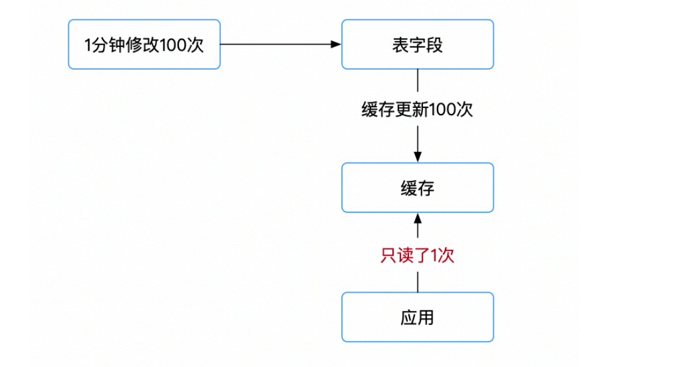
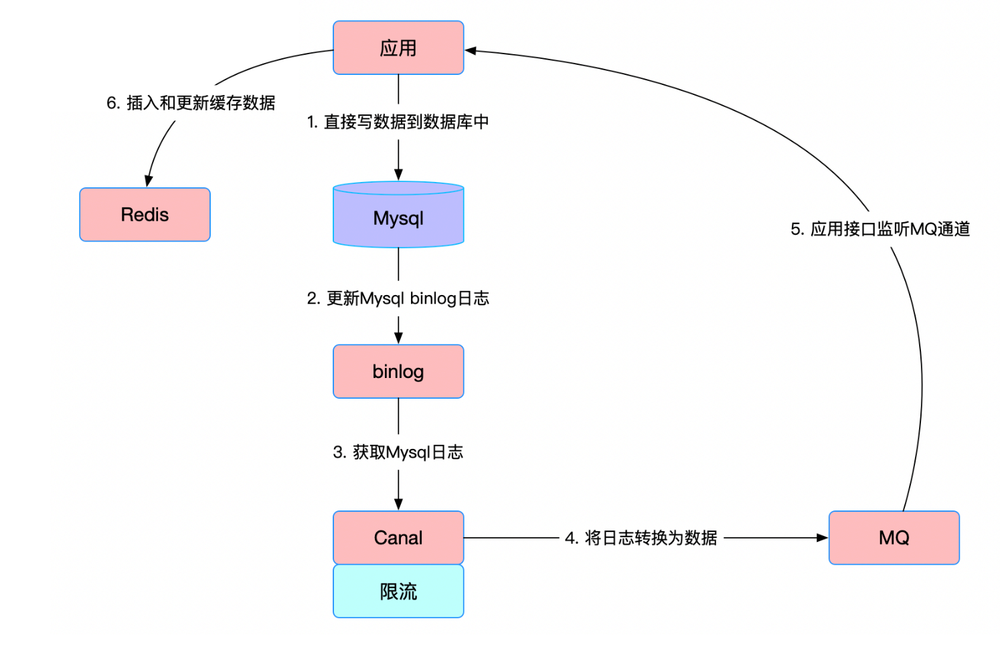
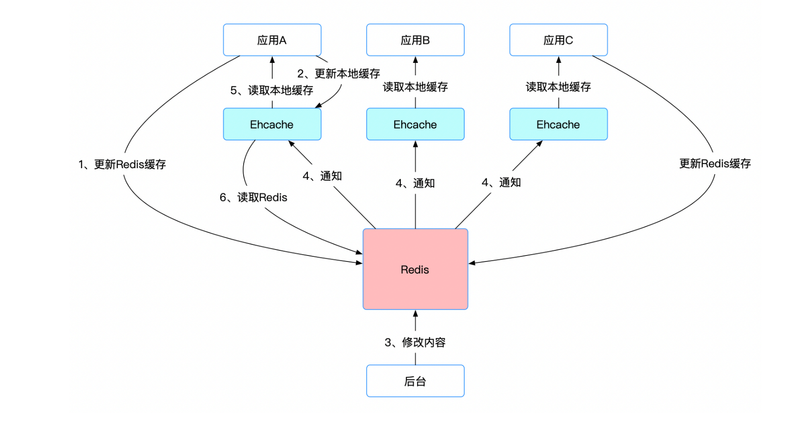

# 分布式缓存

## 缓存一致性

### 多级缓存与数据库之间的一致性怎么保证

**一个比较经典的数据库与缓存使用的模式**

- 读的时候，先读缓存，缓存没有的话，就读数据库，然后取出数据后放入缓存，同时返回响应。更新的时候，先删除缓存，然后更新数据库。

- 比较好的方法是在需要的时候删除缓存，不用每次都重新做复杂的计算

  

#### 数据库缓存一致的四个方案

- **方案一**

  - 通过Redis的过期时间来更新缓存，MySQL 数据库更新不会触发Redis更新，只有当Redis的key过期后才会重新加载。

- 这种方案的缺点:

  - 据不一致的时间会较长，也会产生一定的脏数据。
  - 完全依赖过期时间，时间太短容易缓存频繁失效，太长容易有长时间更新延迟。

- **方案二**

  - 在方案一的基础上扩展，让 key的过期时间兜底，在更新MySQL的同时更新Redis。

- 这种方案的缺点:

  - 如果更新MySQL成功，更新Redis失败，就成了方案一。

- **方案三**

  - 在方案二的基础上，对Redis更新进行优化，增加消息队列，将Redis 的更新操作交给MQ由消息队列来保证可靠性，异步更新 Redis。

- 这种方案的缺点:

  - 解决不了时序的问题，如果多个业务实例对同一条数据进行更新，数据的先后顺序可能会乱。
  - 引入MQ，增加MQ的维护成本。

- **方案四**

  - 将MySQL更新和Redis 更新放到一个事务中操作，这样就可以达到一致性。

- 这种方案的缺点:

  - MySQL 或 Redis任何一个环节出现问题，都会造成数据回滚或撤消。
  - 如果网络出现超时，不仅可能会造成数据回滚或撤消，还会引起并发问题。

- **方案五**

  - 通过订阅Binlog来更新Redis，把我们搭建的消费服务，作为MySQL的一个slave，订阅Binlog，解析出更新内容，再更新到Redis。

- 这种方案的缺点:

  - 要单独搭建一个同步服务，并且引入Binlog同步机制，成本较大。

    

#### Ehcache和Redis如何搭配来实现缓存的最终一致性

- 本地缓存和集中式缓存数据更新的策略
  - 广播更新策略
  - 定时更新策略

- 多级缓存使用注意点:
  - 本地缓存必须设置超时时间，必须定时更更新本地缓存，防止因各种原因导致的本地缓存和Redis缓存不一致,保证缓存的一致性。
  - 对于并发量不大的场景，Redis缓存可以不用设置永久缓存，防止因更新失败导致的缓存不一致，以及僵尸类型的key占用服务器内存。
  - 项目启动时要清空本地与服务器同步的缓存区域，以保证缓存的一致性。

