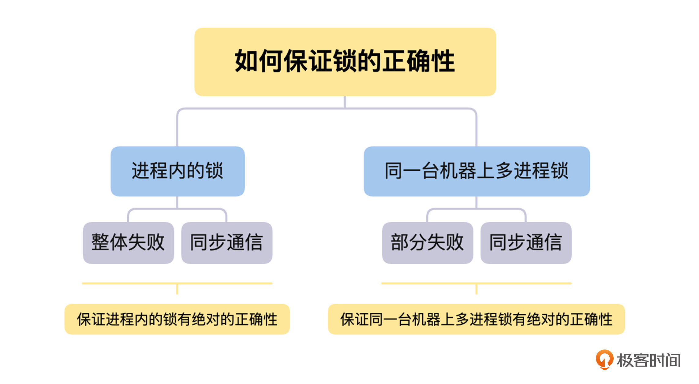
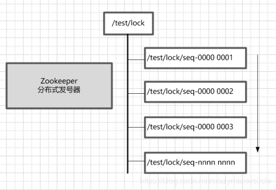

# 分布式系统 - 分布式锁及实现方案


## 为什么需要分布式锁

在探讨分布式锁之前，我们先来了解一下锁的定义：锁是操作系统的基于原语，它是用于并发控制的，能够确保在多 CPU 、多个线程的环境中，某一个时间点上，只能有一个线程进入临界区代码，从而保证临界区中操作数据的一致性。

在我们日常的研发工作中，经常会在进程内部缓存一些状态信息，通过锁可以很方便地控制、修改这些内部状态信息的临界区代码，确保不会出现多个线程同时修改临界区的资源这种情况，防止异常问题的发生。所以，锁是我们研发工作中一个非常重要的工具。


## 怎么实现分布式锁

> 要介绍分布式锁，首先要提到与分布式锁相对应的是线程锁、进程锁。
>
> - **线程锁：**主要用来给方法、代码块加锁。当某个方法或代码使用锁，在同一时刻仅有一个线程执行该方法或该代码段。线程锁只在同一JVM中有效果，因为线程锁的实现在根本上是依靠线程之间共享内存实现的，比如synchronized是共享对象头，显示锁Lock是共享某个变量（state）。
> - **进程锁：**为了控制同一操作系统中多个进程访问某个共享资源，因为进程具有独立性，各个进程无法访问其他进程的资源，因此无法通过synchronized等线程锁实现进程锁。
> - **分布式锁：** 当多个进程不在同一个系统中（比如分布式系统中控制共享资源访问），用分布式锁控制多个进程对资源的访问。
>

我认为锁可以分为三个不同的层次，除了我们上面讨论过的，进程内部的锁和跨进程、跨机器之间的分布式锁外，还有介于它们之间的，同一台机器上的多进程之间的锁。

进程内的锁，是操作系统直接提供的，它本质上是内存中的一个整数，用不同的数值表示不同的状态，比如用 0 表示空闲状态。加锁时，判断锁是否空闲，如果空闲，修改为加锁态 1，并且返回成功，如果已经是加锁状态，则返回失败，而解锁时，则将锁状态修改为空闲状态 0。整个加锁或者解锁的过程，操作系统保证它的原子性。

对于同一台机器上的多进程之间，我们可以直接通过操作系统的锁来实现，只不过由于协调的是多个进程，需要将锁存放在所有进程都可以访问的共享内存中，所有进程通过共享内存中的锁来进行加锁和解锁。

到这里，你应该明白了，对于跨进程、跨机器之间的分布式锁的实现也是同样的思路，通过一个状态来表示加锁和解锁，只不过要让所有需要锁的服务，都能访问到状态存放的位置。在分布式系统中，一个非常自然的方案就是，将锁的状态信息存放在一个存储服务，即锁服务中，其他的服务再通过网络去访问锁服务来修改状态信息，最后进行加锁和解锁。

上面讨论的就是分布式锁最核心的原理，不过从分布式锁的场景出发，如果我们想实现一把完备的分布式锁，需要满足以下几个特性，接下来我们就一起来讨论具体怎么实现。

第一个特性就是**互斥**，即保证不同节点、不同线程的互斥访问，这部分知识我们在上面已经讨论过，就不再赘述了。

第二个特性是**超时机制**，即超时设置，防止死锁，分布式锁才有这个特性。在概述篇的第二节课“新的挑战”中，我们讨论过部分失败和异步网络的问题，而这个问题在分布式锁的场景下就会出现。因为锁服务和请求锁的服务分散在不同的机器上面，它们之间是通过网络来通信的，所以我们需要用超时机制，来避免获得锁的节点故障或者网络异常，导致它持有的锁不能归还，出现死锁的情况。

同时，我们还要考虑，持有锁的节点需要处理的临界区代码非常耗时这种问题，我们可以通过另一个线程或者协程不断延长超时时间，避免出现锁操作还没有处理完，锁就被释放，之后其他的节点再获得锁，导致锁的互斥失败这种情况。

对于超时机制，我们可以在每一次成功获得锁的时候，为锁设置一个超时时间，获得锁的节点与锁服务保持心跳，锁服务每一次收到心跳，就延长锁的超时时间，这样就可以解决上面的两个问题了。

第三个特性是**完备的锁接口**，即阻塞接口 Lock 和非阻塞接口 tryLock。通过阻塞 Lock 接口获取锁，如果当前锁已经被其他节点获得了，锁服务将获取锁的请求挂起，直到获得锁为止，才响应获取锁的请求；通过 tryLock 接口获取锁，如果当前锁已经被其他节点获得了，锁服务直接返回失败，不会挂起当前锁的请求。

第四个特性是**可重入性**，即一个节点的一个线程已经获取了锁，那么该节点持有锁的这个线程可以再次成功获取锁。我们只需在锁服务处理加锁请求的时候，记录好当前获取锁的节点 + 线程组合的唯一标识，然后在后续的加锁请求时，如果当前请求的节点 + 线程的唯一标识和当前持有锁的相同，那么就直接返回加锁成功，如果不相同，则按正常加锁流程处理。

最后是**公平性**，即对于 Lock 接口获取锁失败被阻塞等待的加锁请求，在锁被释放后，如果按先来后到的顺序，将锁颁发给等待时间最长的一个加锁请求，那么就是公平锁，否则就是非公平锁。锁的公平性的实现也非常简单，对于被阻塞的加锁请求，我们只要先记录好它们的顺序，在锁被释放后，按顺序颁发就可以了。


## 分布式锁的设计原则


> 分布式锁的最小设计原则：**安全性**和**有效性**

[Redis的官网在新窗口打开](https://redis.io/docs/reference/patterns/distributed-locks/)上对使用分布式锁提出至少需要满足如下三个要求：

1. **互斥**（属于安全性）：在任何给定时刻，只有一个客户端可以持有锁。
2. **无死锁**（属于有效性）：即使锁定资源的客户端崩溃或被分区，也总是可以获得锁；通常通过超时机制实现。
3. **容错性**（属于有效性）：只要大多数 Redis 节点都启动，客户端就可以获取和释放锁。

除此之外，分布式锁的设计中还可以/需要考虑：

1. 加锁解锁的**同源性**：A加的锁，不能被B解锁
2. 获取锁是**非阻塞**的：如果获取不到锁，不能无限期等待；
3. **高性能**：加锁解锁是高性能的


## 分布式锁的挑战

在分布式系统中，由于部分失败和异步网络的问题，分布式锁会面临正确性、高可用和高性能这三点的权衡问题的挑战。所以，我们接下来讨论一下分布式锁的挑战问题，这样你在以后的工作中，就可以依据业务场景来实现合适的分布式锁了。


### 分布式锁的正确性

首先，我们一起来讨论分布式锁的正确性问题。我们在使用分布式锁的情况下，是否有办法做到，不论出现怎样的异常情况，都能保证分布式锁互斥语义的正确性呢？

那么这里，我们将从进程内的锁如何保证互斥语义的正确性出发，分析在分布式锁的场景中，部分失败和异步网络同时存在的情况下，是否能确保分布式锁互斥语义正确性的问题。

对于进程内的锁，如果一个线程持有锁，只要它不释放，就只有它能操作临界区的资源。同时，因为进程内锁的场景中，不会出现部分失败的情况，所以在它崩溃时，虽然没有去做解锁操作，但是整个进程都会崩溃，不会出现死锁的情况。

这里要说明一下，我们讨论出现死锁的情况，不包括业务逻辑层面出现死锁，因为这个与锁本身的正确性没有关系。我们讨论的是与业务逻辑无关的原因，导致的死锁问题，这个是锁自身的问题，需要锁自己来解决。

另一个方面，进程内锁的解锁操作是进程内部的函数调用，这个过程是同步的。不论是硬件或者其他方面的原因，只要发起解锁操作就一定会成功，如果出现失败的情况，整个进程或者机器都会挂掉。**所以，因为整体失败和同步通信这两点，我们可以保证进程内的锁有绝对的正确性**。

接下来，我们再来用同样的思路，讨论一下同一台机器上多进程锁的正确性问题。在这个情况下，由于锁是存放在多进程的共享内存中，所以进程和锁之间的通信，依然是同步的函数调用，不会出现解锁后信息丢失，导致死锁的情况。

但是，因为是多个进程来使用锁，所以会出现一个进程获取锁后崩溃，导致死锁的情况，这个就是部分失败导致的。

不过，在单机情况下，我们可以非常方便地通过操作系统提供的机制，来正确判断一个进程是否存活，比如，父进程在获得进程挂掉的信号后，可以去查看当前挂掉的进程是否持有锁，如果持有就进行释放，这可以当作是进程崩溃后清理工作的一部分。



讨论完进程内的锁和同一台机器上多进程锁的正确性问题后，我们还需要考虑到，在分布式锁的场景中，部分失败和异步网络这两个问题是同时存在的。如果一个进程获得了锁，但是这个进程与锁服务之间的网络出现了问题，导致无法通信，那么这个情况下，如果锁服务让它一直持有锁，就会导致死锁的发生。

一般在这种情况下，锁服务在进程加锁成功后，会设置一个超时时间，如果进程持有锁超时后，将锁再颁发给其他的进程，就会导致一把锁被两个进程持有的情况出现，使锁的互斥语义被破坏。那么出现这个问题的根本原因是超时后，锁的服务自动释放锁的操作，它是建立在这样一个假设之上的：

**锁的超时时间 >> 获取锁的时延 + 执行临界区代码的时间 + 各种进程的暂停（比如 GC）**

对于这个假设，我们暂且认为“执行临界区代码的时间 + 各种进程的暂停”是非常小的，而“获取锁的时延”在一个异步网络环境中是不确定的，它的时间从非常小，到很大，再到因为网络隔离变得无穷大都是有可能的，所以这个假设不成立。

如果你计划让客户端在“获取锁的时延”上加心跳和超时机制，这是一个聪明的想法，但是这可能会导致锁服务给客户端颁发了锁，但是因为响应超时，客户端以为自己没有获取锁的情况发生。这样一来，依然会在一定程度上，影响锁的互斥语义的正确性，并且会在某些场景下，影响系统的可用性。

对于这些问题，如果我们获得锁是为了写一个共享存储，那么有一种方案可以解决上面的问题，那就是在获得锁的时候，锁服务生成一个全局递增的版本号，在写数据的时候，需要带上版本号。共享存储在写入数据的时候，会检查版本号，如果版本号回退了，就说明当前锁的互斥语义出现了问题，那么就拒绝当前请求的写入，如果版本号相同或者增加了，就写入数据和当前操作的版本号。

但是这个方案其实只是将问题转移了，如果一个存储系统能通过版本号，来检测写入冲突，那么它已经支持多版本并发控制（MVCC）了，这本身是乐观锁的实现原理。那么我们相当于是用共享存储自身的乐观锁，来解决分布式锁在异常情况下，互斥语义失败的问题，这就和我们设计分布式锁的初衷背道而驰了。

所以，我认为对于在共享存储中写入数据等等，完全不能容忍分布式锁互斥语义失败的情况，不应该借助分布式锁从外部来实现，而是应该在共享存储内部来解决。比如，在数据库的实现中，隔离性就是专门来解决这个问题的。**分布式锁的设计，应该多关注高可用与性能，以及怎么提高正确性，而不是追求绝对的正确性**。


### 分布式锁的权衡

接下来，我们一起来讨论关于分布式锁的高可用、高性能与正确性之间的权衡问题。

关于正确性的问题，我们从上面的讨论中，明白了在分布式锁的场景下，没有办法保证 100% 的正确性，所以，我们要避免通过外部分布式锁，来保证需要 100% 正确性的场景，将分布式锁定位为，可以容忍非常小概率互斥语义失效场景下的锁服务。**一般来说，一个分布式锁服务，它的正确性要求越高，性能可能就会越低**。

对于高可用的问题，我认为它是在设计分布式锁时，需要考虑的关键因素。我们必须提供非常高的 SLA ，**因为分布式锁是一个非常底层的服务组件，是整个分布式系统的基石之一**，所以一般来说，越底层、越基础的组件，依赖它的功能和服务就会越多，那么它的影响面就会越大。如果它出现了故障，必然会导致整个分布式系统大面积出现故障。

对于高性能的问题，这是一个由业务场景来决定的因素，我们需要通过业务场景，来决定提供什么性能的分布式锁服务。**一般来说，我们可以在成本可接受的范围内，提供性能最好的分布式锁服务**。如果我们提供的分布式锁服务的性能不佳，一定要在文档甚至接口的名字中体现出来，否则如果被误用的话，可能会导致分布式锁服务故障，系统将出现非常大的事故。

基于以上三点权衡，我们就可以根据业务情况，来实现或者选择自己的分布式锁服务了。其中关于分布式锁服务的存储的选择问题，因为对于主流存储系统的选择与对比，已经在第 4 讲“注册发现”和第 6 讲“配置中心”中讨论过，所以这里就不再赘述了。


### 思考

Q:根据本节课讨论的情况，在实现分布式锁服务的时候，你认为应该以什么样的原则来选择我们的存储系统呢？

A:存储系统需要1 强一致 2 容忍部分结点失败，来保障还不错的可用性。

对于分布式锁我们需要尽可能提高它的正确性，所以存储系统的强一致性是必须的，容忍部分结点失败，来保障还不错的可用性也是必须的。


## 方案调研

分布式锁是一个在分布式环境的重要用语，它表明不同进程间采用互斥的方式操作共享资源。主要操作两类问题。

**提升效率**：加锁可以避免不必要的重复处理。例如防止幂等等任务被多个执行者抢占，此时对锁的正确性要求不高。

**保证正确性**：加锁是为了避免**静态条件**导致逻辑错误。例如直接使用分布式锁实现防重，幂等机制。此时如果锁出现错误会引起严重后果，因此对锁的正确性要求高。


### 业界调研

#### Google:Chubby

**场景**

Chubby是一套分布式协调系统，内部使用Paxos协调Master与Replicas。

Chubby lock service 被应用在GFS,BigTable等项目中，其首要设计目标是高可用性，而不是高性能。

Chubby  被作为粗粒度锁使用，例如被用于选主。持有锁的时间跨度一般为小时或天，而不是秒级。

**技术方案**

Chubby对外提供类似于文件系统的API,在Chubby创建文件路径即加锁操作。Chubby使用Delay 和 SequenceNumber来优化锁机制。Delay 保证客户端异常释放锁时，Chubby仍认为该客户端一直持有锁。

Sequence number........


### 京东SharkLock

SharkLock是基于Redis实现的分布式锁。

锁的排他性由SETNX原语实现，使用timeout与续租机制实现锁的强制性释放。


### 蚂蚁金服SOFAJRaft-RheaKV分布式锁

.......


### Neffix:Curator

Curator 是Zookeeper 的客户端封装，其分布式锁的实现完全由Zookeeper 完成。


## 方案矩阵


### 基于数据库


#### 排他锁方案

获取时新增一条记录，并对锁对应的行加排他锁。

锁超时机制：

Client失效时，数据库会有超时机制保证释放锁。

缺陷：

如果多个线程同时长时间持有锁，会导致数据库连接数过多。


#### 乐观锁（基于版本号）


#### 唯一键方案

建立具有唯一字段的表，获取锁时向表中新增一条数据。

锁超时机制：

设置超时阈值，由定时任务定期删除表内记录。

缺陷：

如果持有锁的时间区间太长会被误删，导致锁错误的进入释放状态。


### 使用K-V存储


#### 直接使用Redis集群

使用SETNX原语加锁，如果失败说明该锁已被其它线程持有。

锁超时机制：

由expireTime保证超时机制。

缺陷：

1.如果持有锁的时间区间太长会被误删，导致锁错误地进入释放状态。

2.Redis集群设计初衷在于性能而不在于数据一致性。如果Redis丢失数据，将导致锁错误的进入释放状态。


#### RedLock方案

用于解决Redis导致的数据不一致问题。加锁时同时向所有master请求，得到大部分会用success视为加锁成功。

redlock实现锁比直接使用Reids集群更可靠。

缺陷：

1.性能低

2.如果持有锁的时间区间太长会被误删，导致锁错误地进入释放状态。


#### 续租方案

如果超时时间设置太长，持有锁地Client宕机时其它Client无法尽快获取锁。因此可以进行优化进行，采取续租机制。即Client在获取锁时设置较短地超时时间，然后在持有锁期间定时刷新超时时间，知道释放锁为止。

超时机制：

由expireTime保证超时机制。

缺陷：

1.如果持有锁的时间区间太长会被误删，导致锁错误地进入释放状态。

2.Redis集群设计初衷在于性能而不在于数据一致性。如果Redis丢失数据，将导致锁错误的进入释放状态。


### 基于一致性算法


#### 基础方案

获取锁时新建临时节点，时为该节点对应地锁已被占用。

锁超时机制：

Client与集群断开时，临时节点消失，视为锁被释放

缺陷：

羊群效应

举例：

使用zk、etcd等。


### 结论

针对分布式锁的使用场景以及主流实现方案可知，分布式锁的QPS、并发性能与锁的逻辑正确性高度依赖底层的数据一致性机制：分布式领域线性一致一般以牺牲性能为代价。因此为满足业务差异化的需求，Cerberus 提供两种Lock-Engine分别基于Zookeeper和Squirrel。其中Squirrel主要用于满足高性能的场景；Zookeeper 主要用于满足强一致，高可用的场景。


## 基于数据库如何实现分布式锁？有什么缺陷？


### 基于数据库表（锁表，很少使用）


最简单的方式可能就是直接创建一张锁表，然后通过操作该表中的数据来实现。当我们想要获得锁的时候，就可以在该表中添加一条记录，想要释放锁的时候就删除这条记录。

为了更好的演示，我们先创建一张数据库表，参考如下：

```sql
CREATE TABLE database_lock (
	`id` BIGINT NOT NULL AUTO_INCREMENT,
	`resource` int NOT NULL COMMENT '锁定的资源',
	`description` varchar(1024) NOT NULL DEFAULT "" COMMENT '描述',
	PRIMARY KEY (id),
	UNIQUE KEY uiq_idx_resource (resource)
) ENGINE=InnoDB DEFAULT CHARSET=utf8mb4 COMMENT='数据库分布式锁表';
```

当我们想要获得锁时，可以插入一条数据：

```sql
INSERT INTO database_lock(resource, description) VALUES (1, 'lock');
```

当需要释放锁的时候，可以删除这条数据

```sql
DELETE FROM database_lock WHERE resource=1;
```


### 基于悲观锁


#### 悲观锁实现思路

在对任意记录进行修改前，先尝试为该记录加上排他锁（exclusive locking）。

如果加锁失败，说明该记录正在被修改，那么当前查询可能要等待或者抛出异常。 具体响应方式由开发者根据实际需要决定。

如果成功加锁，那么就可以对记录做修改，事务完成后就会解锁了。

其间如果有其他对该记录做修改或加排他锁的操作，都会等待我们解锁或直接抛出异常


#### **以MySQL InnoDB中使用悲观锁为例**？

要使用悲观锁，我们必须关闭mysql数据库的自动提交属性，因为MySQL默认使用autocommit模式，也就是说，当你执行一个更新操作后，MySQL会立刻将结果进行提交。set autocommit=0;

```sql
//0.开始事务
begin;/begin work;/start transaction; (三者选一就可以)
//1.查询出商品信息
select status from t_goods where id=1 for update;
//2.根据商品信息生成订单
insert into t_orders (id,goods_id) values (null,1);
//3.修改商品status为2
update t_goods set status=2;
//4.提交事务
commit;/commit work;
```

上面的查询语句中，我们使用了`select…for update`的方式，这样就通过开启排他锁的方式实现了悲观锁。此时在t_goods表中，id为1的 那条数据就被我们锁定了，其它的事务必须等本次事务提交之后才能执行。这样我们可以保证当前的数据不会被其它事务修改。

上面我们提到，使用`select…for update`会把数据给锁住，不过我们需要注意一些锁的级别，MySQL InnoDB默认行级锁。**行级锁都是基于索引的，如果一条SQL语句用不到索引是不会使用行级锁的，会使用表级锁把整张表锁住，这点需要注意。**


### 基于乐观锁

乐观并发控制（又名“乐观锁”，Optimistic Concurrency Control，缩写“OCC”）是一种并发控制的方法。它假设多用户并发的事务在处理时不会彼此互相影响，各事务能够在不产生锁的情况下处理各自影响的那部分数据。在提交数据更新之前，每个事务会先检查在该事务读取数据后，有没有其他事务又修改了该数据。如果其他事务有更新的话，正在提交的事务会进行回滚。

**以使用版本号实现乐观锁为例**

使用版本号时，可以在数据初始化时指定一个版本号，每次对数据的更新操作都对版本号执行+1操作。并判断当前版本号是不是该数据的最新的版本号。

```sql
1.查询出商品信息
select (status,status,version) from t_goods where id=#{id}
2.根据商品信息生成订单
3.修改商品status为2
update t_goods 
set status=2,version=version+1
where id=#{id} and version=#{version};
```

需要注意的是，乐观锁机制往往基于系统中数据存储逻辑，因此也具备一定的局限性。由于乐观锁机制是在我们的系统中实现的，对于来自外部系统的用户数据更新操作不受我们系统的控制，因此可能会造成脏数据被更新到数据库中。在系统设计阶段，我们应该充分考虑到这些情况，并进行相应的调整（如将乐观锁策略在数据库存储过程中实现，对外只开放基于此存储过程的数据更新途径，而不是将数据库表直接对外公开）。

- **缺陷**

对数据库依赖，开销问题，行锁变表锁问题，无法解决数据库单点和可重入的问题。


## 基于redis如何实现分布式锁？有什么缺陷？


> 基于redis如何实现分布式锁？这里一定要看[Redis的官网在新窗口打开](https://redis.io/docs/reference/patterns/distributed-locks/)的分布式锁的实现这篇文章。


### set NX PX + Lua


**加锁**： set NX PX + 重试 + 重试间隔

向Redis发起如下命令: 

```
SET productId:lock 0xx9p03001 NX PX 30000
```

 其中，"productId"由自己定义，可以是与本次业务有关的id，"0xx9p03001"是一串随机值，必须保证全局唯一(原因在后文中会提到)，“NX"指的是当且仅当key(也就是案例中的"productId:lock”)在Redis中不存在时，返回执行成功，否则执行失败。"PX 30000"指的是在30秒后，key将被自动删除。执行命令后返回成功，表明服务成功的获得了锁。

```sql
@Override
public boolean lock(String key, long expire, int retryTimes, long retryDuration) {
    // use JedisCommands instead of setIfAbsense
    boolean result = setRedis(key, expire);

    // retry if needed
    while ((!result) && retryTimes-- > 0) {
        try {
            log.debug("lock failed, retrying..." + retryTimes);
            Thread.sleep(retryDuration);
        } catch (Exception e) {
            return false;
        }

        // use JedisCommands instead of setIfAbsense
        result = setRedis(key, expire);
    }
    return result;
}

private boolean setRedis(String key, long expire) {
    try {
        RedisCallback<String> redisCallback = connection -> {
            JedisCommands commands = (JedisCommands) connection.getNativeConnection();
            String uuid = SnowIDUtil.uniqueStr();
            lockFlag.set(uuid);
            return commands.set(key, uuid, NX, PX, expire); // 看这里
        };
        String result = redisTemplate.execute(redisCallback);
        return !StringUtil.isEmpty(result);
    } catch (Exception e) {
        log.error("set redis occurred an exception", e);
    }
    return false;
}
```


**解锁**：采用lua脚本

在删除key之前，一定要判断服务A持有的value与Redis内存储的value是否一致。如果贸然使用服务A持有的key来删除锁，则会误将服务B的锁释放掉。

```sql
if redis.call("get", KEYS[1])==ARGV[1] then
	return redis.call("del", KEYS[1])
else
	return 0
end
```


## 基于RedLock实现分布式锁


> 这是Redis作者推荐的分布式集群情况下的方式，请看这篇文章[Is Redlock safe?在新窗口打开](http://antirez.com/news/101)

假设有两个服务A、B都希望获得锁，有一个包含了5个redis master的Redis Cluster，执行过程大致如下:

1. 客户端获取当前时间戳，单位: 毫秒
2. 服务A轮寻每个master节点，尝试创建锁。(这里锁的过期时间比较短，一般就几十毫秒) RedLock算法会尝试在大多数节点上分别创建锁，假如节点总数为n，那么大多数节点指的是n/2+1。
3. 客户端计算成功建立完锁的时间，如果建锁时间小于超时时间，就可以判定锁创建成功。如果锁创建失败，则依次(遍历master节点)删除锁。
4. 只要有其它服务创建过分布式锁，那么当前服务就必须轮寻尝试获取锁。


## 基于Redis的客户端

> 这里Redis的客户端（Jedis, Redisson, Lettuce等）都是基于上述两类形式来实现分布式锁的，只是两类形式的封装以及一些优化（比如Redisson的watch dog)。

以基于Redisson实现分布式锁为例（支持了 单实例、Redis哨兵、redis cluster、redis master-slave等各种部署架构）：

**特色**？

1. redisson所有指令都通过lua脚本执行，保证了操作的原子性
2. redisson设置了watchdog看门狗，“看门狗”的逻辑保证了没有死锁发生
3. redisson支持Redlock的实现方式。

**过程**？

1. 线程去获取锁，获取成功: 执行lua脚本，保存数据到redis数据库。
2. 线程去获取锁，获取失败: 订阅了解锁消息，然后再尝试获取锁，获取成功后，执行lua脚本，保存数据到redis数据库。

**互斥**？

如果这个时候客户端B来尝试加锁，执行了同样的一段lua脚本。第一个if判断会执行“exists myLock”，发现myLock这个锁key已经存在。接着第二个if判断，判断myLock锁key的hash数据结构中，是否包含客户端B的ID，但明显没有，那么客户端B会获取到pttl myLock返回的一个数字，代表myLock这个锁key的剩余生存时间。此时客户端B会进入一个while循环，不听的尝试加锁。

**watch dog自动延时机制**？

客户端A加锁的锁key默认生存时间只有30秒，如果超过了30秒，客户端A还想一直持有这把锁，怎么办？其实只要客户端A一旦加锁成功，就会启动一个watch dog看门狗，它是一个后台线程，会每隔10秒检查一下，如果客户端A还持有锁key，那么就会不断的延长锁key的生存时间。

**可重入**？

每次lock会调用incrby，每次unlock会减一。

### 进一步理解

1. 借助Redis实现分布式锁时，有一个共同的缺陷: 当获取锁被拒绝后，需要不断的循环，重新发送获取锁(创建key)的请求，直到请求成功。这就造成空转，浪费宝贵的CPU资源。
2. RedLock算法本身有争议，具体看这篇文章[How to do distributed locking在新窗口打开](https://martin.kleppmann.com/2016/02/08/how-to-do-distributed-locking.html) 以及作者的回复[Is Redlock safe?](http://antirez.com/news/101)


## 基于zookeeper如何实现分布式锁？


- **顺序节点**

创建一个用于发号的节点“/test/lock”，然后以它为父亲节点的前缀为“/test/lock/seq-”依次发号：



- **获得最小号得锁**

由于序号的递增性，可以规定排号最小的那个获得锁。所以，每个线程在尝试占用锁之前，首先判断自己是排号是不是当前最小，如果是，则获取锁。

- **节点监听机制**

每个线程抢占锁之前，先抢号创建自己的ZNode。同样，释放锁的时候，就需要删除抢号的Znode。抢号成功后，如果不是排号最小的节点，就处于等待通知的状态。等谁的通知呢？不需要其他人，只需要等前一个Znode 的通知就可以了。当前一个Znode 删除的时候，就是轮到了自己占有锁的时候。第一个通知第二个、第二个通知第三个，击鼓传花似的依次向后。