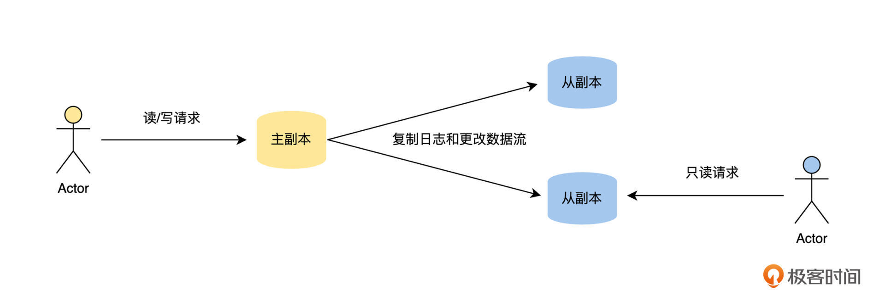
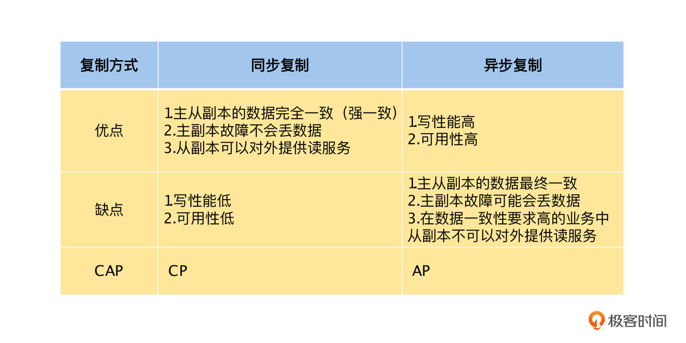
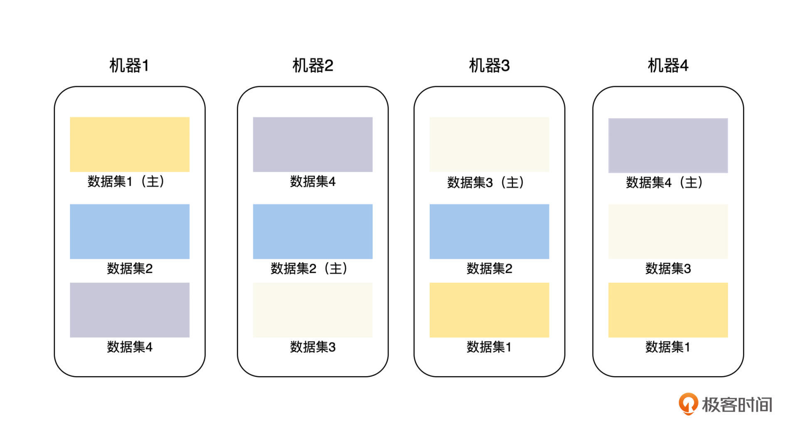
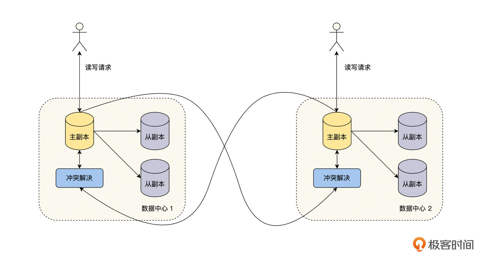
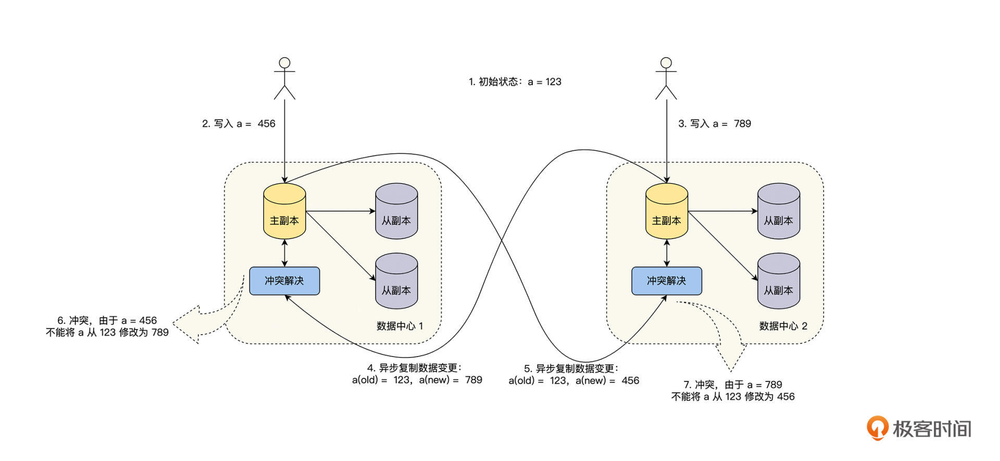
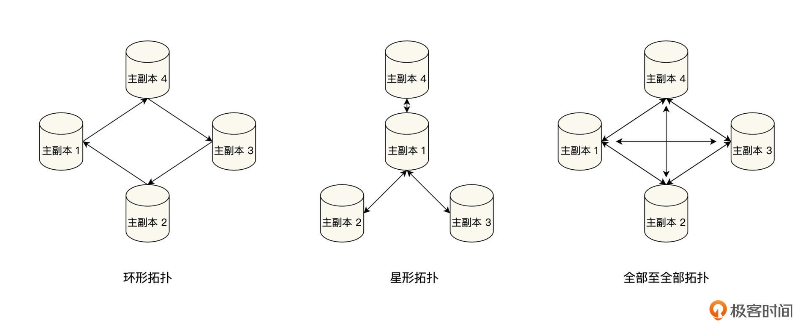
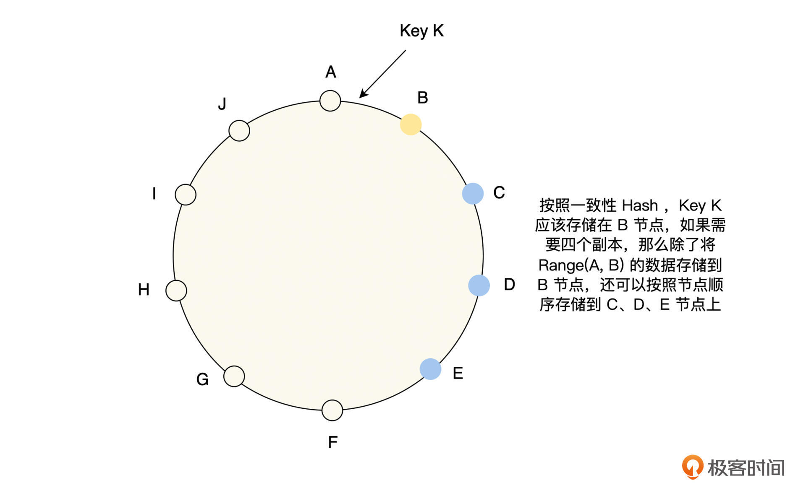
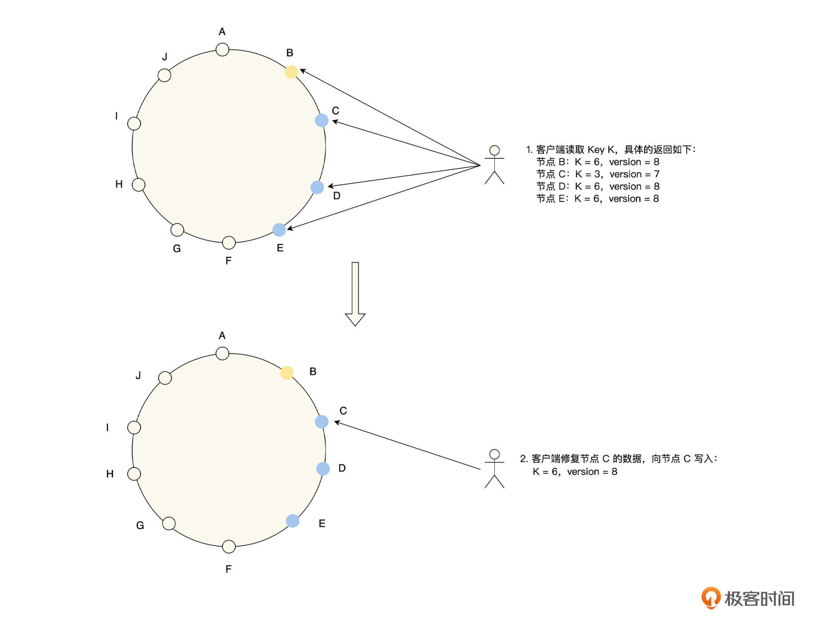
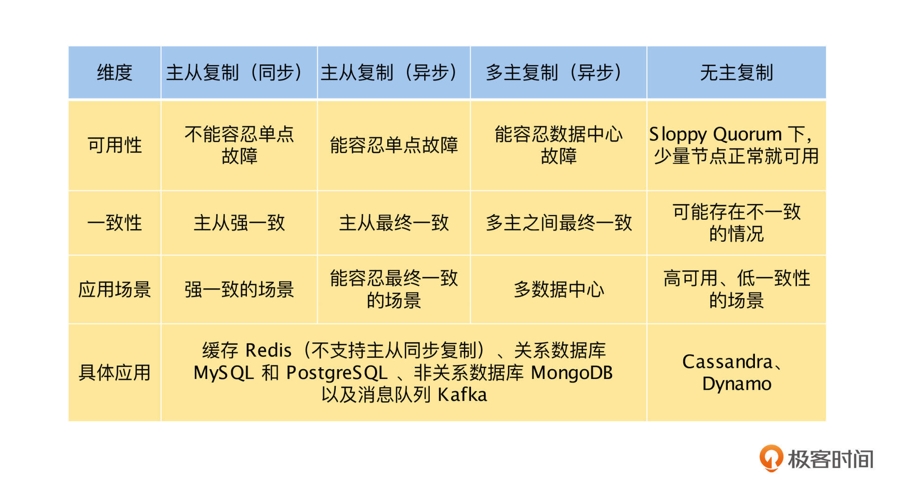

# 如何让存储服务高可用

解决高可用问题通常有两个思路：

**第一种思路是避免故障出现**。我们通过深入细节，一个一个去消除可能导致故障的原因，从而避免故障的出现，比如停电会导致宕机，那么我们就增加备用电源。但是这样，我们会遇到两个无法确定的问题：

- 我们可能无法穷尽所有的可能性，如果一个意料之外的问题出现了，故障就会发生。
- 我们虽然知道某些故障的原因，但是无法控制，比如机房会因为海啸、台风等自然不可抗力原因而宕机，在一定成本范围内，我们没有好的办法来防范。

而第二种思路则恰恰相反，**接受故障随时可能出现的事实，通过冗余的方法让系统在故障发生时，也能够正常提供服务**。这也正是[第 15 讲“被动故障恢复”](https://time.geekbang.org/column/article/490456)中，通过多预案冗余来解决问题的思路。其实，只要我们能够接受提供的冗余机器和人力成本，那么冗余就是值得优先考虑的方案。

# 数据复制的三种方案

通过上述的思考和讨论，本课开头提出的极客时间存储服务的高可用问题，就变成了下面两个子问题：

**1. 我们有没有办法让提供数据服务的机器永远可用**？- **2. 我们将每一份数据都复制到多台机器上，让它们都能提供相关的数据服务，这个成本我们能接受吗**？

对于目前的计算机系统来说，第 1 个子问题的答案显然是否定的。

而第 2 个子问题的解决其实也非常困难，虽然我们能接受数据复制的成本，但是这个成本真的非常大。首先，数据复制导致的相关硬件成本是成倍增长的。其次，由于数据是持续变化的，导致复制操作不能一次完成，我们必须持续将这些变化复制到它所有的节点上，这就给分布式存储带来一个非常大的麻烦：在数据复制的过程中，由于节点可用性和网络中断等各种原因，可能会导致不同节点的数据不完全相同，这就是数据的一致性问题。

数据一致性问题是伴随整个分布式存储发展的技术与理论，它是分布式存储的核心问题，在后面“一致性与共识”的课程中会有深入的介绍。

虽然数据复制的成本和复杂度非常大，但是为了让存储服务高可用，我们也别无选择。下面我们先介绍一下数据复制的一些基本概念。

对于一个数据集来说，每个保持完整数据集的节点我们称为副本。如果一个副本接受外部客户端的写请求，并且这个副本在新数据写入本地存储后，通过复制日志和更改流将新数据发送给所有的副本，那么**我们就将接受写请求的副本称为主副本，其他的副本称为从副本，从副本可以接受读请求**。

于是，基于是否有主副本，有一个还是多个主副本，我们可以将数据复制的方案分为以下三种：

- **主从复制**：整个系统中只有一个主副本，其他的都为从副本。
- **多主复制**：系统中存在多个主副本，客户端将写请求发送给其中的一个主副本，该主副本负责将数据变更发送到其他所有的主副本。
- **无主复制**：系统中不存在主副本，每一个副本都能接受客户端的写请求，接受写请求的副本不会将数据变更同步到其他的副本。

## 主从复制

这节课我们先来了解主从复制，主从复制就像是一个主人带一堆的仆从，主人能接收外面的信息，仆从不能接触外面的信息，主人在接收到外面的信息后，按照一定的策略将外面的信息完整分享给仆从们。

**主从复制是我们工作中最常见、最容易理解的复制方案**，比如我们接触最频繁的缓存系统 Redis、关系数据库 MySQL 和 PostgreSQL、非关系数据库 MongoDB 和消息队列 Kafka 都内置支持主从复制，它的工作流程如下图。

### 关键选择：同步复制 OR 异步复制

主从复制的工作流程，主要就是将变更数据从主副本复制到从副本，但是这里有一个非常关键的选择：主副本在接受外部客户端的写请求，将新数据写入本地存储后，是同步等待从副本也将新数据写入本地存储后，才回复客户端写入成功，即同步复制；还是立即向客户端回复写入成功，即异步复制呢？具体的过程如下图。

我们可以从图中看到，主副本在处理写请求的时候，会等待配置**同步复制**的从副本 1 确认成功后，才返回客户端。而对于配置**异步复制**的从副本 2，主副本不会等待它的确认，就直接向客户端返回写入成功了。

这里我们来举一个例子，比如我在极客时间上更新了头像后，如果你立即去查看我的头像，那么可能会出现以下三种情况：

- **读主副本**：你从主副本去读取我的头像，因为头像就是从这个副本写入的，所以你查询到的是我刚刚更新的头像。
- **读同步复制的从副本**：你从从副本 1 去读取我的头像，因为头像的写入请求会同步等待这个从副本复制完成，所以你查询到的是我刚刚更新的头像。
- **读异步复制的从副本**：你从从副本 2 去读取我的头像，因为头像的写入请求和这个从副本的复制操作是异步的，写入请求成功不能保证该副本数据复制完成，所以你有可能查询到我刚刚更新的头像，也有可能是上一次更新的头像。

了解完同步复制和异步复制的工作流程后，你可能觉得它们之间差别也不太大，只是在主副本处理客户端写请求时，是否等待从副本同步完成后再返回客户端。但是，这两种不同的复制方案却对系统可用性的设计有着非常大的影响。

如果我们选择**同步复制**，那么在数据更新的时候，主副本都需要等待从副本写入成功。正常情况下这个时间非常短，在 1 秒钟内就可以完成，但是由于主、从副本分别运行在不同的机器上，可能出现网络延迟、中断和机器故障的情况。因此数据从主副本复制到从副本的时延就变得不可预测，可能数秒或者数十秒，甚至写入失败。

例如，一个用户在更新头像时，如果一个从副本突然宕机，那主副本就会迟迟收不到这个从副本同步完成的通知。由于是同步复制，系统就不能向用户返回更新成功的提示，待等待超时后，只能提示用户头像更新失败，这样会非常影响系统可用性的设计。

但是它也有优点，由于所有的数据都是同步从主副本复制到从副本的，**所以主、从副本都有最新的数据版本，它们都能对外提供读服务，并且数据都是正确的，即系统的数据是强一致性的**。

如果我们选择**异步复制**，在数据更新的时候，主副本写入成功就会返回成功，不会同步等待从副本是否写入成功，数据变更后通过异步的方式进行复制。由于数据的更新操作不依赖从副本，所以不受网络和从副本机器故障的影响，写入性能和系统可用性会大大提高。

但是由于主、从副本间的数据变更不是同步复制的，所以从副本上的数据可能不是最新的版本，那么就会有两个问题。

首先，**当主副本突然故障时，主副本上写入成功，但是还没有复制到从副本的变更就会丢失，这种情况在数据正确性要求高的场景里是不可以接受的**。比如你在极客时间的 App 中充值了 100 元，充值请求就会将余额增加 100 元的变更写入主副本。在数据更新还未同步到所有从副本的时候，主副本突然宕机了，这个时候，我们会将其中的一个从副本切换为主副本，以便正常对外提供服务。

但是由于主、从副本间的数据变更不是同步复制的，现在所有的副本都没有收到余额增加 100 元的数据变更，那么你就会发现刚刚的 100 元已经花出去了，而余额中并没有增加 100 元，这个时候你一定会找客服投诉的。

其次，**我们可能会通过从副本读到老版本的数据，在正确性要求高的场景下，就不能通过从副本来提供读服务了**。在异步复制的场景中，如果要通过从副本读取数据，要么我们能接受旧版本的数据，要么我们在读数据的时候给定一个版本号，要求读取小于或者等于这个版本号最新的数据。然后处理读请求的从副本，通过等待或者主动向主副本同步数据的方式，确保本地数据的版本超过读请求的版本号后，再按要求返回数据。

**从上面的讨论中，可以看到 CAP 理论的权衡，同步复制模式选择了 C ，而放弃了 A ，是 CP 模型；而异步复制模式选择了 A ，而放弃了 C ，是 AP 模型**。为了让你更好地理解，我总结了同步复制和异步复制的优缺点，具体见下表：

通过这些讨论，你会发现同步复制和异步复制的优缺点都非常明显，所以我们很自然会想到**混合的复制方式**，比如有一个主副本，一个同步复制的从副本，其他都是异步复制的从副本。

这样如果主副本故障，由于有一个同步复制的从副本，所以不会出现数据丢失的严重问题，并且这个从副本也能提供数据完全一致的读服务。另外其他从副本可能会读到旧版本数据，但是由于只有一个同步复制的从副本，对系统的写性能和可用性的影响也相对较少。

### 主从复制的粒度更小一点

我们上面讨论的主从复制模型，是基于每一个副本都有全量的数据集的，如果我们将这个主从复制的粒度变小一点，比如可以指定每一个副本最大为 128 M，对于全量数据集按 128 M 拆分成多个副本，在每一个主从复制副本集内部做同步复制**，这其实就是水平分片和主从复制的组合方式，也是当前分布式存储系统中非常流行的数据复制方案**。

比如，我们有 4 台存储机器，每台机器可以存储 3 * 128 M 数据，当前我们的数据集合总量为 4 * 128 M，那么，我们可以将这个数据集拆分为 4 个分片，每个 128 M，然后将这些分片和分片的副本分布到这 4 台机器上，具体的方法见下图。

这样将主从复制的粒度变小一点的方法，可以带来一些显著优点：

首先，系统中的每一台机器都可以负责一部分主副本，提升了系统的写入性能和可用性。

其次，可以让主从复制的副本数量不再和机器数量强绑定。在前面讨论的每一个副本都有全量数据集的方案中，每增加一台机器，都会导致副本集的数目增加 1 个，给系统带来了更多数据副本的性能开销。

但是，当主从复制的副本数量不再和机器数量强绑定，比如指定副本数量为 3 个，那么我们需要同步的从副本数量就是 2 个，不论集群的机器的数量如何增加，副本的数量都不会改变，这样我们就可以通过增加机器，来提升整个系统整体的读写性能。

## 多主复制

通过上节课的学习，我们掌握了主从复制中，同步复制和异步复制的原理与知识，这样我们就可以根据业务场景，为极客时间后端的缓存系统 Redis 、关系数据库 MySQL 和 PostgreSQL 选择合适的数据复制方式，确保存储系统的高可用了。

但是，随着极客时间业务的快速发展，我们对产品的可用性和用户体验会提出更高的要求，那么在异地建立多个数据中心就是一个不错的思路，它可以让系统容忍地区性的灾害，并且用户也可以就近接入数据中心来优化网络时延。

不过，如果我们在多个数据中心之间，依然通过主从复制来同步数据，那么**所有的写请求都需要经过主副本所在的数据中心，容灾能力和网络时延的问题并没有彻底改善**，这个问题如何解决呢？

其实通过多主复制的方式进行数据复制，就可以避免主从复制，不能发挥多数据中心优势的问题了，所以本节课，我们将通过多主复制的技术原理解决这个问题。

### 为什么需要多主复制

我们都知道，数据复制是指将同一份数据复制到多个机器上，来避免机器故障时数据丢失的问题，它主要是用于保障数据高可用的。可一旦我们有了多个数据副本，为了提供更好的容灾能力，数据的多个副本应该分布得足够远，分布在多个机房或者多个城市中。

接下来，我们很自然就会想到，既然数据已经分布在多个机房或者城市中了，那么是否允许用户直接读写离自己最近的数据中心的数据呢？

在主从复制的情况下，将多个从副本分别部署到不同的数据中心上，对于读请求来说，如果是对一致性要求不高，或者主从之间是同步复制的情况，用户可以就近读取离自己最近的数据中心副本的数据；但是对于写请求来说，由于必须通过主副本写入，就导致所有的写请求必须经过主副本所在的数据中心写入。

而多主复制和无主复制，允许多个副本写入，就可以避免上面的问题了，那么在本节课中，我们主要讨论多主复制，下节课再介绍无主复制。

**其实除了上面讨论的，在多数据中心提供就近读写的应用场景之外，多主复制还有在线文档和在线日历之类的客户端本地修改场景**。在这个场景中，每一个可以本地修改的客户端，都可以视为一个主副本，它们与远端服务器进行异步复制变更信息，只不过这个异步复制在离线的场景下，可能是几分钟、几天甚至更长。

### 如何实现多主复制

基于主从复制模式，我们来介绍一下多主复制模式。它是指在一个数据系统中，存在多个主从复制单元，每一个主从复制单元都可以处理读写请求，一个主从复制单元的主副本处理了写请求后，需要复制到其他的主从复制单元的主副本，具体的流程见下图。

在实现多主复制的时有几个值得注意的地方，首先，每一个主从复制单元内部是一个常规的主从复制模式，这里的主副本、从副本之间的复制可以是同步的，也可以是异步的，具体的讨论可以查看[第 19 讲“主从复制”](https://time.geekbang.org/column/article/495283)。

其次，多个主从复制单元之间，每一个主副本都会将自己的修改复制到其他的主副本，主副本之间的复制可以是同步的，也可以是异步的。

如果主副本之间的复制是同步的，那么一个主副本的写入，需要等待复制到其他的主副本成功后，才能返回给用户，这样当写入出现冲突时，可以返回失败或由用户来解决冲突。**但是，它却失去了多主复制最重要的一个优点，即多个主副本都可以独立处理写入，这就导致整个模式退化为主从复制的形式。所以一般来说，多主复制的主副本之间，大多采用异步模式**，我们本课中讨论的多主复制也都是异步模式。

如果主副本之间的复制是异步的，那么一个主副本待自己写入成功后，就立即返回给用户，然后再异步地将修改复制给其他的主副本。**这时也会出现一个问题，如果多个主副本同时成功修改一个数据，当主副本之间复制这个数据的修改时，会出现冲突，我们就不知道以哪一个主副本的写入结果为准了**。所以接下来，我们就一起讨论对于异步模式的多主复制，如何解决多个主副本写入冲突的问题。

### 冲突解决

写入冲突是由于多个主副本同时接受写入，并且主副本之间异步复制导致的，那么依据这个定义，我们可以推导出写入冲突的两种主要形式。

首先是由于**更新**导致的冲突，多个主副本同时更新了一个数据，导致这个数据的版本是非线性的，出现了分叉，具体见下图。

其次，由于**新增**导致的冲突，多个主副本同时新增了一个含有唯一性约束的数据，导致数据的唯一性约束被破坏。例如，在酒店预订业务中，一个时段内一个房间只能预订给一个用户，如果多个用户在多个主副本上，同时发起预订操作，就可能出现同一个时段内，一个房间被多个用户预定成功的情况。

#### 避免冲突

基于冲突的定义，我们应该怎么解决呢？有一个很自然的思路是，既然冲突是多个主副本同时修改了一个数据，或者破坏了数据的唯一性约束导致的，那么我们就对数据进行分片，让不同的主数据负责不同的数据分片，具体分片策略可以查看“分片”系列课程。这个方式确实可以在一定程度上避免冲突，但是会出现两个问题。

**首先，一个修改操作可能会修改多个分片数据，这样我们就没有办法通过分片来隔离修改了**。比如，我们将修改用户余额的操作进行水平分片， ID 为 0-10 的用户在主副本 1 写入， ID 为 11-20 的用户在主副本 2 写入。当 ID 6 的用户给 ID 16 的用户转账时，如果在主副本 1 上执行，那么同一时间， ID 16 的用户在主副本 2 上也有修改时，就会出现写入冲突。

**其次，由于就近接入和故障等原因，我们会将出现故障的主副本流量切换到其他的主副本，这时也会出现写入冲突的情况**。我们继续按刚才的例子分析，ID 为 0-10 的用户在主副本 1 写入，ID 为 11-20 的用户在主副本 2 写入。

假设 ID 8 的用户在主副本 1 写入成功，但是数据的变更还没有同步到主副本 2 ，这时如果 ID 8 的用户到主副本 1 的网络出现问题，我们会立即将 ID 为 0-10 的用户的写入流量切换到主副本 2 ，那么在主副本 2 上，再对 ID 8 的数据进行修改就会导致冲突发生。

#### 写时解决冲突

对于异步模式的多主复制，写入冲突是不可避免的，那么我们可以考虑，在数据写入一个主副本后，在主副本间进行复制时，检测是否有冲突，如果有冲突，就立即解决，这种方式称为写时解决冲突。它有两种实现方式，预定义解决冲突和自定义解决冲突，下面我们来一一讨论。

**预定义解决冲突**，是指由存储系统预先定义好规则，在冲突发生时依据预先定义好的规则，自动来解决冲突，它的规则主要有以下几种。

一是，从操作维度来处理，最后写入获胜。也就是为每一个写操作分配一个时间戳，如果发生冲突，只保留时间戳最大的版本数据，其他的修改都丢弃，但是这个方法会导致修改丢失。

二是，从副本维度来处理，最高优先级写入获胜。也就是为每一个副本都排好优先级，如果发生冲突，只保留优先级最高的副本修改数据，其他的修改都丢弃。例如，为每一个副本分配一个 ID ， ID 越大的副本，修改的优先级就越高，在发生冲突时，只保留 ID 最大的副本数据。同样，这个方法也会导致修改丢失。

三是，从数据结构和算法的维度来处理，通过研究一些可以自动解决冲突的数据结构来解决问题。比如 Google Doc 利用“操作转换”（Operational transformation）作为协作、编辑的冲突解决算法，但是目前这种方式还不太成熟，所以应用的范围比较少。

第二种实现方式是**自定义解决冲突**，它是由业务系统来定义冲突的解决方式，如果发生冲突了，存储系统就依据业务系统定义的方式执行。

自定义冲突解决的处理逻辑是，在主副本之间复制变更日志时，如果检测到冲突，就调用用户自定义的冲突处理程序来进行处理。由于主副本之间的数据复制是异步的，所以一般都是后台执行，不会提示用户。

一般来说，正确解决冲突是需要理解业务的，因此由业务来定义解决冲突的逻辑是非常合理的，所以大多数支持多主复制的存储系统，都会以用户自定义的逻辑，来提供解决冲突的入口。

#### 读时解决冲突

读时解决冲突的思路和写时解决冲突的思路正好相反，即在写入数据时，如果检测到冲突，不用立即进行处理，只需要将所有冲突的写入版本都记录下来。当下一次读取数据时，会将所有的数据版本都返回给业务层，在业务层解决冲突，那么读时解决冲突的方式有下面两种。

第一种方式是**由用户来解决冲突**。毕竟用户才是最知道如何处理冲突的人，业务层将冲突提示给用户，让用户来解决。

另一个方式是**自定义解决冲突**。业务层先依据业务情况，自定义好解决冲突的处理程序，当检测到冲突时，直接调用处理程序来解决，你会发现它和写时解决冲突的第二种实现方式一样，只不过一个在写入时解决冲突，一个在读取时解决冲突。

### 多主复制的关键问题

多主复制虽然有多个主副本独立写入的优点，但是在一致性方面，多主复制的存储系统却面临着三个关键问题。

首先，**正确解决冲突的难度非常大**。从上文讨论的复杂情况中不难看出，解决冲突是一件非常难的事情，如果解决不当，就会出现修改丢失或错误的问题。

其次，**异步模式的多主复制会存在数据一致性的问题**。为了获得多个主副本可以独立写入的优点，多主副本之间，通常是通过异步的方式来复制数据的，这就会出现读取到陈旧版本数据的问题，影响整个系统的一致性。这里要特别说明一点，在多副本之间进行数据复制，如果你期望数据强一致性，那么目前最好的方案是 Paxos 和 Raft 之类的分布式一致性算法。

最后是**多个主副本之间的复制拓扑结构问题**。一般来说，多主复制的主副本之间的复制拓扑结构主要有三种：环形拓扑、星形拓扑以及全部至全部拓扑，具体见下图：

我们从图中可以看出，采用环形拓扑和星形拓扑结构时，如果一个主副本出现故障，可能会导致其他的主副本，也不能正常复制变更，甚至整个复制拓扑都会出现中断的情况。这时我们必须修复好出问题的主副本节点，或者重新调整复制的拓扑结构，才能恢复到正常状态。一般来说，这个过程需要人工参与且不能自愈，这会进一步延迟系统的恢复时间，使系统的可用性降低，同时降低系统的一致性。

在采用全部至全部拓扑结构时，虽然一个主副本的故障，不会影响其他主副本之间的数据复制，但是却会出现一个问题，那就是由于副本之间的网络时延各不相同，会使数据复制出现乱序，更新相互覆盖，变更丢失等错误情况，也会影响系统的一致性。

总而言之，虽然异步模式的多主复制有多个主副本可以独立写入的优点，但是也会在一定程度上降低系统的一致性，**所以我们在使用时，需要评估业务特点，对一致性要求容忍度高的业务，可以使用多主复制，而对于一致性要求高的业务，则需要慎重考虑**。

## 无主复制

通过上节课，我们掌握了在部署多数据中心的时候，可以用多主复制的方式，让用户直接读写离自己最近的数据中心的数据，减少用户与数据中心之间的网络延迟，提升用户体验。

当我们的业务面向全球的用户时，这个优点将会变得尤为重要，比如一个北京的用户，访问北京的数据中心，网络时延为毫秒级别，但是当他访问美国的数据中心时，网络时延就是百毫秒级别了，这是影响用户体验的关键点。所以，当极客时间启动全球业务的时候，多主复制是一个可以考虑的方案。

但不论是主从复制还是多主复制，所有的写入操作都必须依赖主节点，如果主节点出现故障，则必须再选举出一个新的主节点后，才能继续提供写服务，否则就将大大影响系统的可用性。那么是否有办法可以让单节点故障时，系统的可用性完全不受到影响呢？

我们可以这样思考一下，既然系统的可用性是由主节点的故障导致的，那么我们是否能去掉主节点和从节点的角色，也就是让系统中所有节点的角色都是对等的，这样是否可以解决问题呢？

其实这就是无主复制的数据复制方式，它确实可以解决由主节点故障，导致的系统可用性问题。虽然无主复制是“复制”系列课程的最后一节，但其实它才是最早出现的数据复制方式。**无主复制又称为去中心复制，只不过在关系数据库出现并且主导后，由于要确保各副本写入顺序的一致性，主从复制开始流行起来，无主复制被大家慢慢遗忘了**。

本节课中，我们将按无主复制的实现方案，面临的问题，以及如何解决这个思路来学习，最后对主从复制、多主复制和无主复制，这三种数据复制的方式进行比较和总结。

### 如何实现无主复制

无主复制顾名思义，即集群中没有主节点和从节点之分，所有节点的角色都是对等的，每个节点负责存储和处理一定范围的数据，并且由于高可用的要求，每一份数据都需要在多个节点上存储，那么一种常见的处理方式就如下图

所示。

从图中可以看到，每一份数据按顺序存储多个副本，每一个节点都会负责多个范围数据的存储，节点 B 存储 Key Range (H，B) 的数据，节点 C 存储 Key Range (I，C) 的数据，节点 E 存储 Key Range (A，E) 的数据。

这里要特别注意，主从复制和无主复制有一个非常大的区别，主从复制先写主节点，然后由主节点将数据变更同步到所有的从副本，从副本数据的变更顺序由主节点的写入顺序决定；但是，无主复制是由客户端或代理程序，直接负责将数据写入多个存储节点，这些存储节点之间是不会直接进行数据同步的。

### 数据读写

从刚才的讨论中可以看出，无主复制写入数据时，为了数据的高可用，会向多个节点写入多份数据，那么它是等所有的节点都写入成功，客户端才返回成功呢？还是有一个节点写入成功，客户端就返回成功呢？

同样地，读取数据也存在这个问题，每一份数据都有多个副本，那么它是等所有的节点都读取成功，客户端才返回成功呢？还是有一个节点读取成功，客户端就返回成功呢？

这里我们举个例子来讨论一下，假设现在有 3 个副本，如果数据成功写入 1 个副本，那么要确保读请求一定能读取到最新写入的数据，就需要成功读取 3 个副本的数据；如果数据成功写入 2 个副本，则需要成功读取 2 个副本的数据；如果数据成功写入 3 个副本，那么成功读取 1 个副本的数据即可。

这样就可以得出一个结论，如果要确保读取到最新的数据，读取的副本和写入的副本之间的交集不能为空，只要存在交集，就必定有一个写入的最新副本被读取到，那么我们就可以按如下的方式来定义这个问题。

假设对于每一份数据，我们保存 n 个副本，客户端写入成功的副本数为 w ，读取成功的副本数为 r ，那么**只需要满足仲裁条件 w + r > n 成立，读副本和写副本之间的交集就一定不为空，即一定能读取到最新的写入**。

**我们将满足仲裁条件 w + r > n 的 w 和 r 称之为法定票数写和读，这就是Quorum 机制，你也一定能发现它其实就是抽屉原理的应用**。那么对于 w、r 和 n 的值，通常是可以配置的，一个常见的配置选择为，设置 n 为奇数（通常为 3 或 5 ），w = r = (n + 1)/2 向上取整。这个配置的读写比较均衡，比如 n = 5，那么 w = r = 3，读和写都保证 3 个副本成功即可，能容忍 2 个节点故障。

在实际的读多写少的业务场景中，我们假设 n = 5 ，如果想要读性能最高，可以设置 w = n = 5 ，r = 1 ，在读取的时候，只需等待一个节点读取成功即可。但是在写入的时候，需要所有的副本都写入成功，因此它不能容忍节点故障，如果有一个节点不可用，将会导致写入失败。如果 w = 4 ，r = 2 ，那么读性能依然比较高，并且能容忍一个节点不可用，这就是读性能、写性能和可用性之间的权衡。

反之也是同样的思路，对于写多读少的业务场景，我们假设 n = 5 ，如果想要写性能最高，那么可以设置 r = n = 5 ，w = 1 ，在写入的时候，只需等待一个节点读取成功即可。但是在读取的时候，需要所有的副本都读取成功，因此它不能容忍节点故障，如果有一个节点不可用，将会导致读取失败。如果 r = 4 ，w = 2 ，那么读性能依然比较高，并且能容忍一个节点不可用。

现在我们可以看出，Quorum 机制通过参数的调整，能够非常方便地适应业务的特点，在读性能、写性能和可用性之间达到平衡。

### 数据修复

我们知道一个复制模型，应该确保数据最终都能成功复制到所有的副本上，主从复制和多主复制是通过主节点接受数据写入，并且由主节点负责将数据副本，成功复制到所有的从副本来保证的。但是在上文“数据读写”的讨论中，我们了解了当 w < n 时，并不能保证数据成功写入所有的副本中，那么无主复制的这个问题应该如何解决呢？一般来说，有如下的两种方式来实现数据的修复。

首先，是**读修复**。当客户端并行读取多个副本时，如果检测到某一副本上的数据是过期的，那么在读取数据成功后，就异步将新值写入到所有过期的副本上，进行数据修复，具体如下图所示。

其次，是**反熵过程**。由存储系统启动后台进程，不断去查找副本之间数据的差异，将数据从新的副本上复制到旧的副本上。这里要注意，反熵过程在同步数据的时候，不能保证以数据写入的顺序复制到其他的副本，这和主从复制有着非常大的差异，同时由于数据同步是后台异步复制的，会有明显的同步滞后。

总体来看，读修复对于读取频繁的数据，修复会非常及时，但它只有在数据被读取时才会发生，那么如果系统只支持读修复，不支持反熵过程的话，有一些很少访问的数据，在还没有发生读修复时，会因为副本节点的不可用而更新丢失，影响系统的持久性。所以，将读修复和反熵过程结合是一种更全面的策略。

### 一个关键的选择

到这里，我们已经掌握了如何实现一个无主复制的数据系统，不过在这个系统中，还有一个非常关键的选择，如果系统的某些节点发生故障，导致读或写的时候，无法等到系统配置的 w 和 r 个客户端成功返回，我们应该如何处理呢？这里我们可以依据 2 个方案来思考。

- **当读写无法到达Quorum要求的 w 或 r 时，直接返回失败，并且明确地将错误返回给客户端**。
- **在读写的时候，依然是等待 w 和 r 个客户端成功返回，只不过有一些节点不在事先指定的 n 个节点的集合内**。比如本课第一幅图中的 Key K，它指定的存储副本集合应该是 B、C、D 和 E，假设 D 出现故障了，那么它的存储集合可以临时修改为 B、C、E 和 F。

你会发现第一个方案，即当系统的故障已经导致仲裁条件不成立时，就返回失败，并且明确地将错误返回给客户端的选择，是一致性和可用性之间的权衡，是为了数据的一致性而放弃了系统的可用性。

对于第二个方案，在数据读写时，当我们在规定的 n 个节点的集合内，无法达到 w 或 r 时，就按照一定的规则再读写一定的节点。这些法定集合之外的数据读写的节点，可以设置一些简单的规则，比如对于一致性 Hash 环来说，可以将读写顺延到下一个节点，作为临时节点进行读写。当故障恢复时，临时节点需要将这些接收到的数据，全部复制到原来的节点上，即进行数据的回传。

通过这个方式，我们可以确保在数据读写时，系统只需要有任意 w 或 r 个节点可用，就能读写成功，这将大大提升系统的可用性。但是这也说明，即使系统的读写能满足仲裁条件 w + r > n ，我们依然无法保证，一定能读取到最新的值，因为新值写入的节点并不包含在这 n 个节点之中。

那么**这个方案叫 Sloppy Quorum ，相比于传统的 Quorum ，它为了系统的可用性而牺牲了数据的一致性**。目前，几乎所有无主复制的存储系统都支持 Sloppy Quorum，但是它在 Cassandra 中是默认关闭的，而在 Riak 中则是默认启用的，所以我们在使用时，可以根据业务情况进行选择。

### 总结

无主复制由于写入不依赖主节点，所以在主节点故障时，不会出现不可用的情况。但是，也是由于写入不依赖主节点，可能导致副本之间的写入顺序不相同，会影响数据的一致性。

在实现无主复制时，有两个关键问题：数据读写和数据修复。数据读写是通过仲裁条件 w + r > n 来保证的，如果满足 w + r > n ，那么读副本和写副本之间就一定有交集，即一定能读取到最新的写入。而数据修复是通过读修复和反熵过程实现的，这两个方法在数据的持久性和一致性方面存在一定的问题，如果对数据有强一致性的要求，就要谨慎采用无主复制。

然后，我们了解了 Sloppy Quorum ，它相比于传统的 Quorum ，为了系统的可用性而牺牲了数据的一致性，这里我们可以进一步得出，**无主复制是一个可用性优先的复制模型**。

最后，我们对比了“复制”系列中，三种数据复制模型的优缺点和应用场景，你可以通过这些对比，更加深刻地理解数据复制，并且依据业务场景做出最佳的选择。

Q:如果现在有这样的一个业务场景：数据需要有 7 个副本，读写都能容忍一个节点失败，并且读请求远远大于写请求，那么 w 和 r 为多少最合适呢？

>w=6,r=2,写请求可以容忍一个节点写失败，但是这样读请求就可以容忍5个节点失败，这是不是违背了前提条件：读写都能容忍一个节点失败
>
>作者回复: 非常正确👍 能容忍 1 个节点失败 的条件是 能容忍 5 个节点失败的子集，所以没有违背前提条件。

## 三种数据复制模式总结

目前，我们已经学习了三种数据复制模式：主从复制、多主复制和无主复制，因为在我们进行存储系统设计时，数据复制是一个非常关键的选择，所以我们再来总结和分析一下，它们的优缺点以及应用场景，具体如下表。

