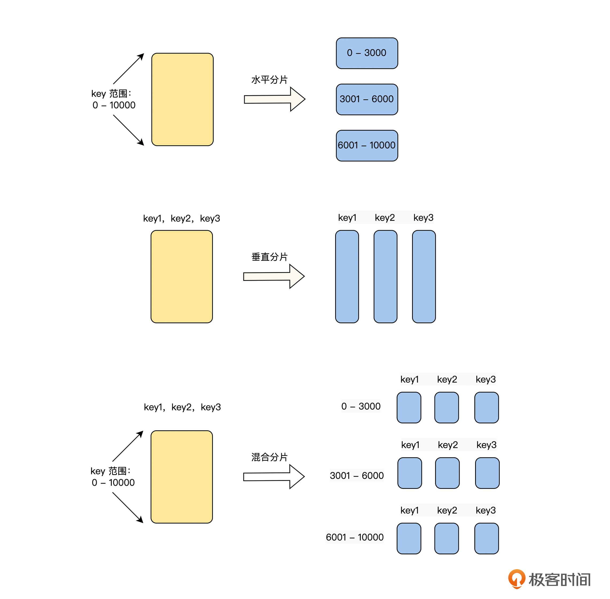
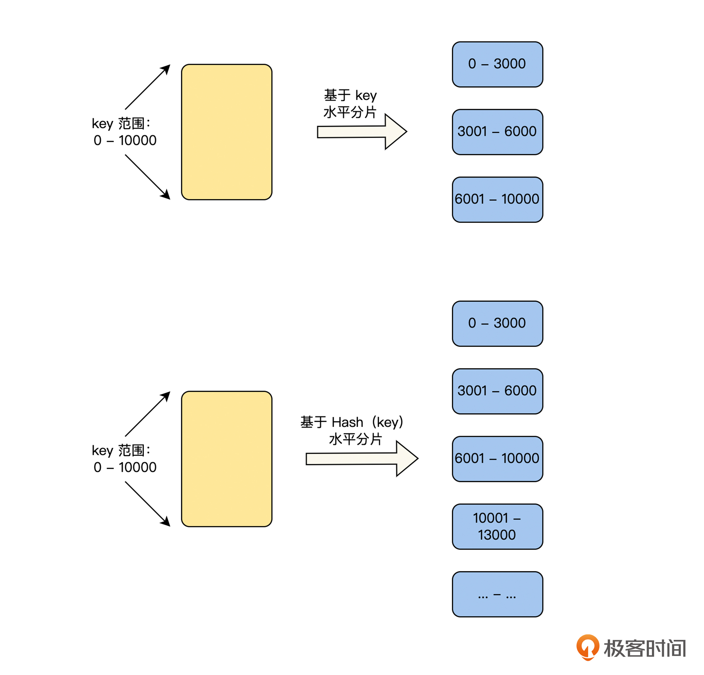
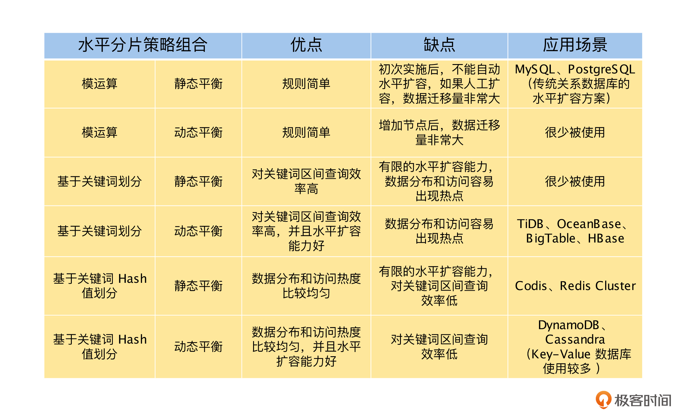
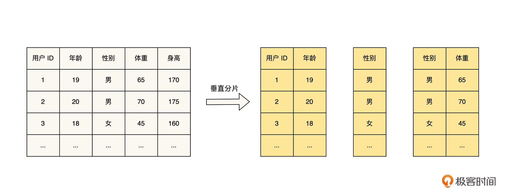
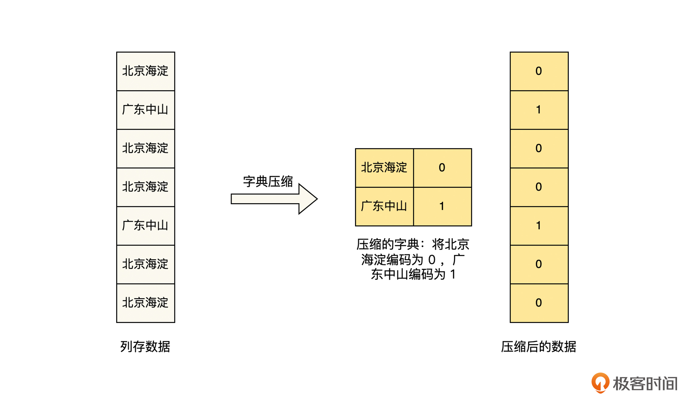
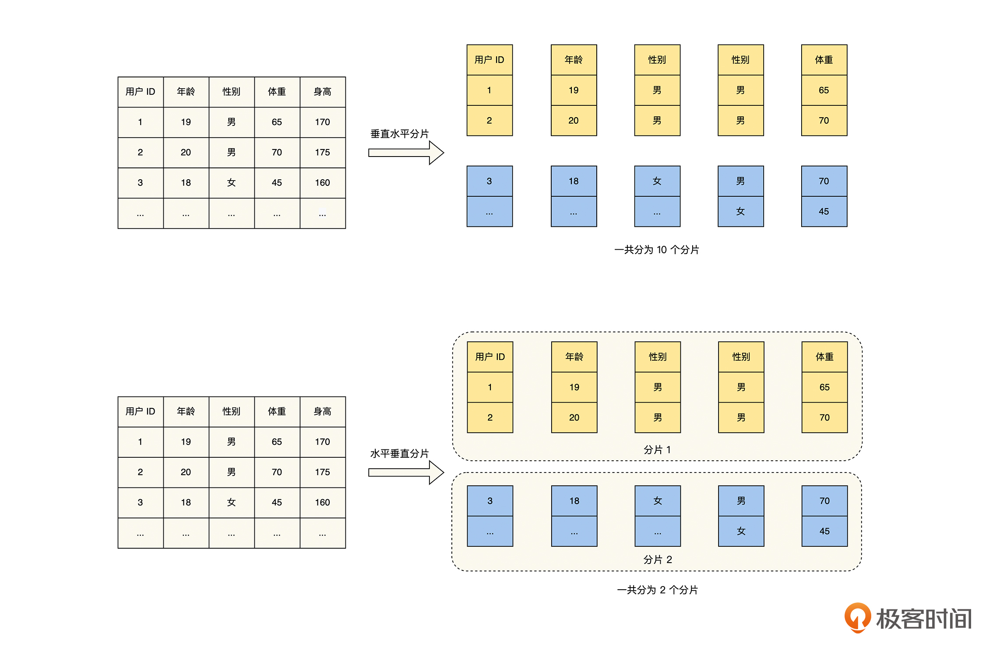
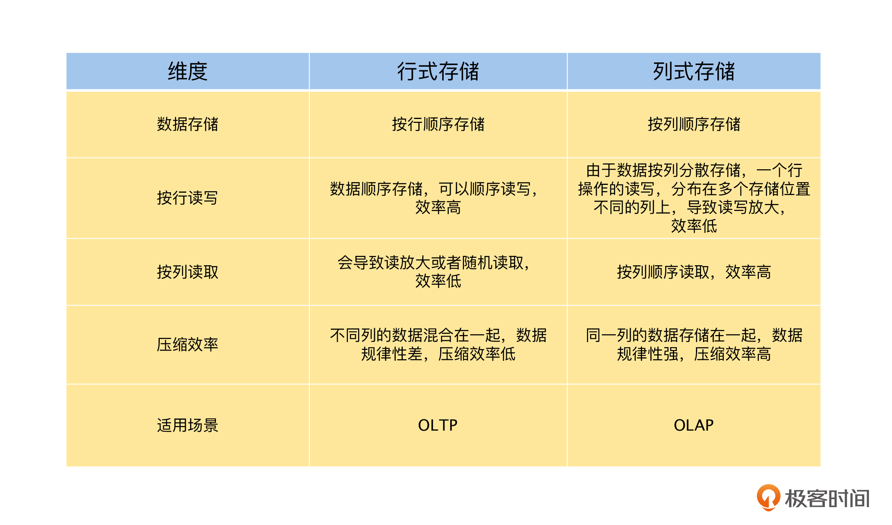

在 2000 年左右，由于互联网的快速发展，用户数据爆炸性增长，如何存储和管理这些海量的用户数据成为了一道难题，当时摆在工程师面前主要有两条道路。

第一条是垂直扩容，即 PC 机扛不住换小型机，小型机扛不住换大型机，大型机扛不住换超级计算机，通过不断提高机器的配置来应对数据的增长。但是，这条道路会受到材料的物理极限、制造的工艺水平和使用成本的限制，不是一条可持续的道路。

另一条是水平扩容，即通过将数据进行分片，分散到不同的 PC 机上，每一个 PC 节点负责一部分数据的存储和计算，来应对数据和成本的增长。**这一条道路是由 Google 在 2000 年代的三篇论文 GFS 、MapReduce 和 BigTable 开启的，并且成为了解决数据激增问题的事实标准**。

那么对数据进行分片的策略，主要有三种：水平分片、垂直分片和混合分片，具体如下图所示。

我们从图中可以看到，**水平分片和垂直分片是通过数据切分的操作方向来区分的，而混合分片是它们的组合体**。

# 水平分片策略介绍

水平分片算法有两个最关键的因素，一是，如何对数据进行划分，即数据划分，二是，分片是否支持动态分裂与合并，即数据平衡。所以接下来，我们将从这两个维度来讨论水平分片策略。

## 数据划分

数据划分要解决的问题是，将整个数据空间划分为多个分片空间，它主要有两种方式，基于模运算划分和基于范围划分。基于模运算的划分，在“负载均衡”篇中 Hash 负载均衡策略的部分充分介绍过了，这里不再重复。下面我们重点介绍基于范围的划分，如下图所示，它分为基于关键词划分和基于关键词的 Hash 值划分两种方式。

这两种划分方式都是给每一个分片，分配一个确定的数据范围，在这个数据范围内的所有数据，都属于这个分片。基于关键词划分和基于关键词的 Hash 值划分，二者唯一的区别在于，前者是直接利用关键词进行划分，而后者是利用关键词的 Hash 值进行划分。虽然只有这一个区别，但是却会深刻地影响数据的分布规律，所以我们接下来将重点讨论。

基于关键词划分的好处是，**分片后数据的分布依然保留了关键词的顺序，我们可以方便地进行区间查询**。假如我们在设计一个中国的公民数据库，将地址信息作为分片的关键词进行划分。如果我们需要查询“北京市海淀区”的所有公民，将查询区间设置为 [北京市海淀区 , 北京市海淀区] 即可，因为所有“北京市海淀区”的公民信息是连续存储在一起的。

但是**基于关键词划分也会带来问题，即数据分布不均匀和访问的热度不均匀**。比如在上文公民数据库的例子中，如果我们按省级行政单位进行划分，每一个省一个分片的时候，你会发现存储西藏数据的分片只有 300 多万条数据，而广东分片则有 1 亿 2000 多万条数据，这就会导致数据分布不均匀。

而数据分布不均匀也会导致访问的热度不均匀，比如，在对数据的访问频率相差不大的情况下，访问广东分片的热度要远远高于西藏分片的热度。并且，如果基于自增 ID 或者时间等关键词对数据进行分片的时候，即使数据是均匀分布的，对于一般的业务场景来说，往往新产生数据的访问热度，也是远远大于历史数据的，这也会导致访问的热度不均匀。

为了解决基于关键词划分带来的问题，我们可以对它的分布规律再进行一些调整。比如，可以对广东分片的数据进一步分片，分为“广东广州”、“广东中山”等多个分片，西藏分片可以与周边的分片合并为一个分片。而对于基于自增 ID 或者时间戳等原因，导致的访问冷热不均匀的关键词，则避免作为数据划分的关键词。

到这里，你会发现基于关键词划分，很明显会使数据分布和关键词自身的分布保持一致。在我们不了解数据分布的情况下，选择哪一个字段作为关键词是一个难题，有没有一种好方法来解决呢？

其实基于关键词的 Hash 值划分就可以解决这些问题，它通过对关键词进行 Hash 运算，然后基于计算后的 Hash 值范围对数据进行划分，一个好的 Hash 算法可以处理数据倾斜并让它均匀分布。这里我们可以理解为通过 Hash 运算，去除了关键词数据分布的业务属性，从而解决了数据分布和访问的热度不均匀的问题。

但是这里依旧没有银弹，**基于关键词的 Hash 值划分，带来了数据分布和访问热度更均匀的优点，但同时，它也失去了基于关键词的顺序性，不能方便地通过关键词进行区间查询了**。并且，在极端情况下，如果一个关键词的访问热度非常大，那么基于关键词的 Hash 值划分也完全不起作用了。

这里要特别说明一点，我们可以将一致性 Hash 算法理解为基于关键词的 Hash 值划分的一种实现。

## 数据平衡

根据数据分片是否支持动态的分裂与合并，我们可以将水平分片的数据平衡方式分为静态分片和动态分片。其中静态分片是指在系统设计之初，数据分片的数目和区间就预估好了，数据划分后不能再变化，而动态分片则可以在运行时，根据分片的负载和容量做调整。

**对于静态分片，由于分片区间在运行时不能再调整，所以数据划分时一定要谨慎考虑**。如果我们对数据的分布有足够的了解，并且数据的分布是比较稳定的，就可以采用基于关键词的方式，通过选择合适的关键词对数据进行划分。例如上文中提到的中国公民数据库的例子中，对于中国各省市的人口分布，因为我们有统计数据支撑，并且人口分布的数据非常稳定，所以就可以基于地址信息，并且结合数据的分布进行划分了。

在我们对数据的分布不了解，或者数据的分布不稳定的情况下，如果要采用静态分片的话，比较稳妥的方式是，采用基于关键词的 Hash 值的方式对数据进行划分，通过 Hash 算法解决数据分布和访问的热度不均匀的问题。

而对于动态分片，因为在运行时，分片区间是可以进行分裂和合并的，所以我们不用担心不了解数据分布，而导致分片区间划分不合理的情况，也不用担心在分片区间划分后，数据的分布发生变化，使分片区间不合适的问题。**总而言之，动态分片与基于关键词的划分，往往是一个比较好的组合方式，它避免了基于关键词划分的问题，还保留了数据基于关键词有序的优点**。

但是，在基于关键词的划分中，基于自增 ID 或者时间戳等原因，导致的访问冷热不均匀的问题，即使是在动态分片中也不能很好地解决，因为数据的热点往往集中在最新的一个分片区间上。而基于关键词的 Hash 值划分的方式，则可以很方便地将最新的热点数据分布到多个分片上，很好地解决这个问题。

另外，动态分片存在冷启动的问题。当一个基于动态分片的存储系统启动时，通常是从一个分片开始，当数据量不断增长后，再动态进行分裂。在第一次进行分裂前，所有的读写请求都由第一个分片来进行处理，而其他的节点则都属于空闲状态。关于这个问题，一个比较好的解决方式是，动态分片在冷启动时，预分裂为多个分片来缓解。

这里还要特别强调一点，像 Codis、Redis Cluster 这样，预先分配固定数据量 slot ，slot 不能合并和分裂，但是可以通过将 slot 迁移到新增的节点上，进行水平扩容。比如预先分配 1024 个 slot，在 3 副本的情况下，刚开始运行的时候，可能是 3 个节点，每个节点上分布全部的 1024 个 slot 。在数据量增大的情况下，可以增加新的节点，将一部分 slot 迁移到新的节点上，实现水平扩展。

**在课程中，由于预先分配 slot 后，就不能再进行合并和分裂了，所以我们将预先分配固定数据量 slot 归类为静态平衡方案**。它能提供有限的水平扩容能力，最大程度是一个节点运行一个 slot ，但是当一个 slot 出现非常极端的数据热度和访问热度时，不能再进行分裂和水平扩容。

## 水平分片策略分析

了解了水平分片的两个维度，数据划分策略和数据平衡策略后，我们将常见的数据划分策略和动态、静态的数据平衡策略交叉组合，一一来讨论它们的优缺点和应用场景，具体如下表。

# 垂直分片和混合分片的 trade-off

通过了解水平分片策略中，关于数据划分和数据平衡的原理和知识，我们可以基于极客时间的业务场景，选择合适的数据划分和数据平衡的方式，组合出最佳的水平分片策略。

而在一些数据分析的场景中，一行数据往往有非常多的字段，我们在计算时，却只需要一列或者几列的数据。这时基于水平分片策略，虽然能解决数据容量的问题，但是却没有充分利用数据分析场景的业务特点进行优化。那么是否有针对这个场景设计的数据分片方式呢？

答案是肯定的，**数据的垂直分片与混合分片，比起水平分片来说，能更好地满足数据分析场景**。所以在本节课中，我们将一起来讨论数据分片的另外两种方式：垂直分片与混合分片，思考一下垂直分片与混合分片，是如何利用数据分析场景的业务特点，来做数据存储优化的。

我们会先讨论垂直分片策略的应用场景和技术原理，接着分析混合分片策略是如何结合垂直分片与混合分片，在读写和水平扩展之间达到最优平衡的，最后再对讨论垂直分片时，引入的两种存储方式：行式存储和列式存储，进行对比和总结。

## 垂直分片策略

垂直分片策略和水平分片策略都是对数据进行分片，但是它们的思路却截然不同。水平分片策略将整个数据集的条数作为划分的对象，每一个分片负责处理一定的数据条数。而垂直分片策略则是将数据 Schema 的字段集个数作为划分的对象，每一个分片负责处理一个或几个字段的全部数据，具体如下图所示。

从上文的描述中不难看出，对于数据的水平扩展能力，垂直分片策略是很有限的。因为数据 Schema 的字段个数是非常有限的，常见的字段个数从几个到几百个不等，即使一个字段一个分片，在字段数少的数据集上，水平扩展能力也是非常差的。关于这个问题，可以将垂直分片与水平分片策略组合起来解决，我们会在下一部分的“混合分片策略”中讨论。

这里你会发现一个很有意思的地方，**如果垂直分片策略的处理方式为一个字段一个分片，那么垂直分片策略就等价于列式存储了，所以列式存储是垂直分片策略的一种特殊情况，也是最常见的情况**。接下来，我们就以列式存储为例，从它应用最广泛的大数据分析场景，来讨论垂直分片策略的特点，当然这些特点在垂直分片策略中依然生效。

我们先来解释下大数据分析场景，它是指从用户的行为数据中获得新的洞见，来改进我们的产品和运营方式。大数据分析场景的数据处理一般有以下的特点：

- **宽表存储，按列读取**：数据往往以宽表的形式存储，一个表上百列，但是一次分析往往只关心一列或者几列。
- **读多写少**：一次写入，多次读取，几乎不更新。
- **数据量大**：大数据会存储全站的所有数据，包括日志和数据库内的数据，并且会持续增加。
- **查询无规律，不能索引覆盖**：在分析场景中，我们会通过各种维度和组合，来统计和分析数据，所以这些查询方式是无规律的，不可能全部通过索引来覆盖。

由于大数据场景存储和计算的数据非常大，所以存储成本和计算性能是非常核心的设计指标，现在我们就来分析一下，列式存储是如何利用数据分析场景的特点，来达到低成本、高性能的。

第一，对于宽表存储，按列读取的场景，如果采用行式存储，当我们只需要读取一列数据的时候，可以按行顺序读取整个宽表所有列的数据，但是这会导致读取的数据量放大上百倍；或者我们可以跳着只读取所需列的数据，这样读取的数据量不会放大，但是读取数据的方式就从顺序读取变成随机读取了，这会增加非常多的寻址操作。并且，因为不能充分预读，在很大程度上，会降低磁盘的读性能。特别是对于机械磁盘来说，随机读取导致的寻址操作是毫秒级别的时延。

第二，读多写少的场景，会减少列式存储对写性能的影响。一般来说，数据写入存储系统是以行的形式写入的，而列式存储会导致一行数据的写入操作，按字段拆分为多个写入操作，使写入放大。不过，这个问题可以进行一定的优化，并且由于分析场景的数据写入模式是读多写少，所以不会影响整个系统性能的设计目标。

第三，因为数据量大，并且会持续增加的特点，要求存储系统能进行非常高效的压缩，降低存储数据的容量。那么我们先来分析下，列式存储是如何利用业务特性，进行数据压缩和提升性能的。

首先，在列式存储中相邻的数据类型是一致性的，并且通常会出现前缀一样，甚至完全相同的数据的特点，比如在用户的地址信息中，同一个地方的用户，省市县都是完全相同的，这非常适合使用 RLE 压缩、前缀压缩和字典压缩等压缩算法去压缩。

这里我们介绍一下字典压缩算法，其他的算法也是类似的思路，就不再一一介绍了。字典压缩算法的思路是，**在数据重复度比较高的情况下，对数据采用字典重新编码，来减少数据的大小**，具体见下图。

其次，虽然列式存储通过数据压缩大大提高了存储效率，节省了存储成本，但是与原始数据的存储相比，在写入和读取数据时，需要进行压缩和解压的操作，这需要消耗 CPU 来进行计算，所以，数据压缩其实是利用 CPU 资源来换取 IO 资源。

不过，在数据分析场景中，这是一个非常值得的选择，因为压缩算法在减少数据大小的同时，也减少了磁盘的寻道时间，提高了 I/O 性能，**因为减少了数据的传输时间，并且提高了缓冲区的命中率，导致这些环节中得到的收益，能轻易地补偿压缩数据带来的额外 CPU 开销**。

第四，如果熟悉数据库索引设计，你应该知道，数据库虽然有 Hash 索引或位图索引，但是最常见的索引模型是，将被索引的一个或多个关键词作为 Key ，按一定规则进行排序，Value 为行数据主键的指针，然后我们可以通过二分查询或 B+ Tree 进行查询，查到索引的关键词后，通过主键的指针找到行数据。

而对于大数据场景来说，经常需要读取一列或者几列中的大量数据、全表数据，那么**列式存储通过按列顺序存储、按需读取和高效压缩，可以使按列读取的性能大大提高**。其中，主键所在的列是有序的，其他列的读取性能也非常不错，可以理解为数据即索引，所以一般来说，列式存储系统对二级索引依赖不大，列式存储可以方便地应对查询无规律，不能预先建立索引的情况。

到这里，我们会发现，架构设计总是依赖业务场景的特点来做取舍，所以我们说，没有完美的架构，只有完美的 trade-off，列式存储其实是牺牲了按行写入的性能，去换取按列读取性能的 trade-off。

## 混合分片策略

在上文中，我们分析出了数据 Schema 的字段个数是非常有限的，特别是在字段数少的数据集上，完全依赖垂直分片策略，解决数据的水平扩展是不现实的，所以我们可以将垂直分片策略和水平分片策略结合起来解决这个问题。

根据这两种策略的组合顺序，可以将它们分为垂直水平分片策略和水平垂直分片策略。前者先进行垂直分片，再进行水平分片，而后者先进行水平分片，然后再进行垂直分片，具体方法如下图所示。

我们可以从图中看出，**垂直水平分片策略就是垂直分片策略的水平扩容版本**。对于水平分片策略，我们通常会选择主键进行水平分片，这样主键的列在整个存储系统中是有序的，垂直水平分片策略的数据分布特性和优缺点，与垂直分片策略完全相同，这里就不再重复讨论了。

**而水平垂直分片策略更像是，水平分片策略和垂直分片策略的结合体**，它对于整个数据集来说，一般是主键先利用基于关键词划分的水平分片策略，将数据集成不同的分片，然后对一个分片内的数据再进行垂直分片。

这样带来的好处是在一个水平分片内，依然按列式存储来存储数据，所以它有列式存储按列读取数据，高效和压缩比高的优点。在按行写入和读取多列的时候，都在一个数据分片上，大大地减少了网络 IO ，要知道在大规模的数据处理系统中，网络 IO 有可能是整个系统的瓶颈，同时，也能将一些分布式事务变成本地事务，提升系统的处理效率。

总体来说，水平垂直分片策略不仅保留了列式存储的优点，而且将多列操作控制在一个数据分片上，减少了网络 IO 和分布式事务，是混合分片策略常见的方式，Google 的 Dremel 数据库就采用了这种分片策略。

## 行列存储比较

在介绍水平分片、垂直分片和混合分片这三种分片策略的过程中，我们引入了行式存储和列式存储的讨论，并且我们发现这是存储引擎非常关键的一个选择，所以，最后我们来总结和分析一下，它们的优缺点以及应用场景，具体如下表。

