# 数据库的数据复制与分区

> 转载请声明出处哦~，本篇文章发布于luozhiyun的博客：https://www.luozhiyun.com/archives/805
>
> 这篇文章主要就是总结《designing-data-intensive-applications》第五章和第六章有关于数据复制与分区相关的内容


在分布式数据库中通过复制让数据库的分布式节点拥有 copy 备份，主要为了达到以下目的：

1. 扩展性，因为单机所承载的数据量是有限的；
2. 容错、高可用，在分布式系统中，单机故障是常态，多做些冗余在遇到单机故障时其他机器就可以及时接管；
3. 性能，如果出现用户跨地区访问的情况， 可以通过多地就近部署减少访问的时延；

那么如何复制呢？复制算法在数据库里面有很多，单主（single leader）复制、多主（multi-leader）复制、无主（leaderless）复制。

但是对于大量的数据与并发，仅仅复制是不够的，所以引入了分区或者是叫分区。分区可以让每个分区都是自己的小型数据库，每条数据属于且仅属于一个分区，这样数据库就可以支持多个分区就可以并行操作，可以让数据库支持非常高的吞吐量和数据量。


## 单主复制


### 同步 or 异步？半同步！

同步 or 异步其实指是分布式节点的数据是否和主节点保持一致。同步复制就是主库需要等待从库的确认才能返回，而异步不等待该从库的响应就返回。

同步复制的优点是，从库能保证有与主库一致的最新数据副本。如果主库突然失效，我们可以确信这些数据仍然能在从库上找到。缺点是，如果同步从库没有响应（比如它已经崩溃，或者出现网络故障，或其它任何原因），主库就无法处理写入操作。主库必须阻止所有写入，并等待同步副本再次可用。

异步复制虽然不会有阻塞的情况，但是如果从副本承担读请求，副本同步的数据由于复制速度的差异可能会出现不同用户从不同副本上面访问到的数据不一致的情况。

为了避免这种情况，一个是可以让客户端只从主副本读取数据，这样，在正常情况下，所有客户端读到的数据一定是一致的；另一种就是 使用**半同步（semi-synchronous ）**的方式，例如设置一个从库和主库进行同步，其他库则是异步。如果该同步从库变得不可用或缓慢，则将一个异步从库改为同步运行。这保证你至少在两个节点上拥有最新的数据副本。

拿 kafka 举例，在 kafka 的 leader 中会维护 **ISR(In-Sync Replication)** 列表，follower 从 leader 同步数据有一些延迟（由参数 replica.lag.time.max.ms 设置超时阈值），超过阈值的 follower 将被剔除出 ISR，只有将消息成功复制到所有 ISR 后，这条消息才算被提交，这样不用等待所有节点确认既保证了性能又能保证数据的可用性。


### 故障处理

高可用的目标是，即使个别节点失效，也能保持整个系统运行，并尽可能控制节点停机带来的影响。


#### 从节点失效——快速恢复

如果**从库**崩溃并重新启动，或者，如果主库和从库之间的网络暂时中断，则比较容易恢复：从库可以从日志中知道，在发生故障之前处理的最后一个事务，然后接着这个事务进行处理即可。

我们看一下 Redis 主从同步是如何恢复的。主节点会将那些对自己的状态产生修改性影响的指令记录在本地的内存 buffer 中，然后异步将 buffer 中的指令同步到从节点，从节点一边执行同步的指令流来达到和主节点一样的状态，一边向主节点反馈自己同步到哪里了 (偏移量)。

如果从节点在短时间内无法和主节点进行同步，那么当网络状况恢复时，Redis 的主节点中那些没有同步的指令在 buffer 中有可能已经被后续的指令覆盖掉了，那么就需要使用**快照同步**。

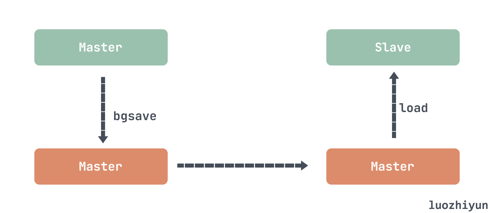

它首先需要在主库上进行一次 bgsave 将当前内存的数据全部快照到磁盘文件中，然后再将快照文件的内容全部传送到从节点。从节点将快照文件接受完毕后，立即执行一次全量加载，加载之前先要将当前内存的数据清空。加载完毕后通知主节点继续进行增量同步。


#### 主从切换

**主库**故障其中一个从库需要被提升为新的主库，需要重新配置客户端，以将它们的写操作发送给新的主库，其他从库需要开始拉取来自新主库的数据变更。

主库的故障切换通常由几步组成：1.确认主库失效；2.选择一个新的主库；3.配置启用新的主库。看似把大象塞进冰箱里的简单步骤实际上可能存在很多地方可能出错：

1. **如果使用异步复制，则新主库可能没有收到老主库宕机前最后的写入操作**。在选出新主库后，如果老主库重新加入集群，新主库在此期间可能会收到冲突的写入，那这些写入该如何处理？最常见的解决方案是简单丢弃老主库未复制的写入，这很可能打破客户对于数据持久性的期望，如果数据库需要和其他外部存储相协调，那么丢弃写入内容是极其危险的操作；
2. **可能会出现两个节点都以为自己是主库的情况，也就是脑裂**。如果两个主库都可以接受写操作，却没有冲突解决机制，那么数据就可能丢失或损坏。一些系统采取了安全防范措施：当检测到两个主库节点同时存在时会关闭其中一个节点，但设计粗糙的机制可能最后会导致两个节点都被关闭；
3. **超时时间应该如何配置？**越长意味着恢复时间也越长，太短又可能会出现不必要的故障切换。临时的负载峰值可能导致节点超时，如果系统已经处于高负载或网络问题的困扰之中，那么不必要的故障切换可能会让情况变得更糟糕。

我们看看Redis Sentinel 集群是怎么解决这些问题的。Redis Sentinel 负责持续监控主从节点的健康，当主节点挂掉时，自动选择一个最优的从节点切换为主节点。客户端来连接集群时，会首先连接 sentinel，通过 sentinel 来查询主节点的地址，然后再去连接主节点进行数据交互。当主节点发生故障时，客户端会重新向 sentinel 要地址，sentinel 会将最新的主节点地址告诉客户端。

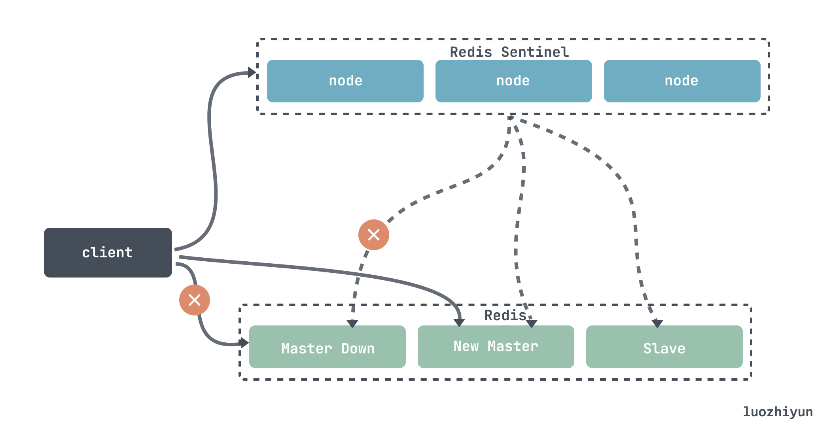

因为 master 节点是 Redis Sentinel 通过投票选出来的，所以我们可以设置 sentinel 为3个节点以上，且为奇数，选举法定人数设置为`（n/2+1）`那么每次选出 master 都需要半数以上的节点同意才能通过，少数服从多数，不会出现两个票数一样的 leader同时被选上。

Redis 主从采用异步复制，当主节点挂掉时，从节点可能没有收到全部的同步消息，Sentinel 无法保证消息完全不丢失，但是也尽可能保证消息少丢失。通过这两个配置：

```
min-slaves-to-write 1
min-slaves-max-lag 10
```

min-slaves-to-write 表示主节点必须至少有一个从节点在进行正常复制，否则就停止对外写服务，丧失可用性；

min-slaves-max-lag 表示多少秒没有收到从节点的反馈，那么此时master就不会接受任何请求。我们可以减小min-slaves-max-lag参数的值，这样就可以避免在发生故障时大量的数据丢失。


### 复制日志该如何实现？

最简单的想法可能是**基于 SQL 语句的复制**，将每个 `INSERT`、`UPDATE` 或 `DELETE` 语句都被转发给每个从库，就像直接从客户端收到一样。但这样也会有很多问题：

1. 如果语句中使用了诸如 `NOW()` 或 `RAND()`这样的函数，该怎么处理？使用了用户定义的函数、触发器、存储过程又该怎么处理；
2. 如果使用了自增id，或依赖于数据库中的现有数据（例如，`UPDATE ... WHERE <某些条件>`），每个副本上按照完全相同的顺序执行它们，否则可能会产生不同的效果。当有多个并发执行的事务时，这可能成为一个限制；

基于语句的复制在 5.1 版本前的 MySQL 中被使用到。但现在在默认情况下，如果语句中存在任何不确定性，MySQL 会切换到基于行的复制。


**基于预写日志（WAL）复制**，WAL 是在进行任何数据更改（更新、删除等）之前，先将这些更改操作写入到日志中，所以通过这个日志从库可以构建一个与主库一模一样的数据结构拷贝。缺点是与存储引擎紧密耦合，如果数据库的版本的变更修改了日志格式，这会让复制没法进行。

所以 WAL 复制对运维来说是很难受的， 如果复制协议不允许版本不匹配，则此类升级需要停机。

还有一种就是**基于行的逻辑日志复制**，逻辑日志是关系数据库用来表示行操作写入记录的序列， MySQL 的二进制日志（binlog）使用了这种方法。由于逻辑日志与存储引擎的内部实现是解耦的，系统可以更容易地做到向后兼容，从而使主库和从库能够运行不同版本的数据库软件，或者甚至不同的存储引擎。


### 写后读一致性问题

#### Reading Your Own Writes

许多应用让用户提交一些数据，然后查看他们提交的内容。可能是用户数据库中的记录，也可能是对讨论主题的评论，或其他类似的内容。提交新数据时，必须将其发送给主库，但是当用户查看数据时，可以通过从库进行读取。如果数据经常被查看，但只是偶尔写入，这是非常合适的。

但对于异步复制，如果用户在写入后马上就查看数据，则新数据可能尚未到达副本。对用户而言，看起来好像是刚提交的数据丢失了。

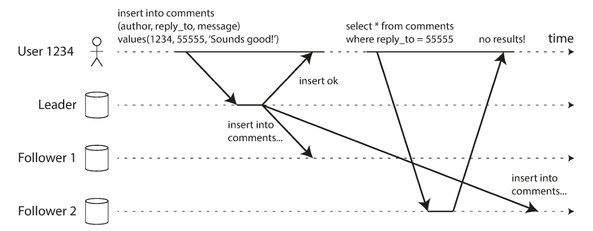

在这种情况下，我们需要**写后读一致性**（read-after-write consistency），也被称作 read-your-writes
consistency 。这是一个保证，如果用户重新加载页面，他们总会看到他们自己提交的任何更新。

基于领导者的复制系统中实现写后读一致性：

- 对于用户 **可能修改过的内容，总是从主库读取**；这就要求得有办法不通过实际的查询就可以知道用户是否修改了某些东西。
- 如果应用中的大部分内容都可能被用户编辑，在这种情况下可以使用其他标准来决定是否从主库读取。例如可以跟踪上次更新的时间，在上次更新后的一分钟内，从主库读。
- 客户端可以记住最近一次写入的时间戳，系统需要确保从库在处理该用户的读取请求时，该时间戳前的变更都已经传播到了本从库中。如果当前从库不够新，则可以从另一个从库读取，或者等待从库追赶上来。这里的时间戳可以是逻辑时间戳（表示写入顺序的东西，例如日志序列号）或实际的系统时钟
- 如果你的副本分布在多个数据中心（为了在地理上接近用户或者出于可用性目的），还会有额外的复杂性。任何需要由主库提供服务的请求都必须路由到包含该主库的数据中心。


另一种复杂的情况发生在**同一位用户从多个设备**（例如桌面浏览器和移动 APP）请求服务的时候。这种情况下可能就需要提供跨设备的写后读一致性：如果用户在一个设备上输入了一些信息，然后在另一个设备上查看，则应该看到他们刚输入的信息。

在这种情况下，还有一些需要考虑的问题：

- 记住用户上次更新时间戳的方法变得更加困难，因为一个设备上运行的程序不知道另一个设备上发生了什么。需要对这些元数据进行中心化的存储。
- 如果副本分布在不同的数据中心，很难保证来自不同设备的连接会路由到同一数据中心。如果你的方法需要读主库，可能首先需要把来自该用户所有设备的请求都路由到同一个数据中心。


#### Monotonic Reads 单调读

如果用户从不同从库进行多次读取，就可能发生**时光倒流（moving backward in time）**的情况。例如用户 2345 两次进行相同的查询，首先查询了一个延迟很小的从库，然后是一个延迟较大的从库，第一个查询返回了最近由用户 1234 添加的评论，但是第二个查询不返回任何东西，因为滞后的从库还没有拉取到该写入内容。用户 2345 先看见用户 1234 的评论，然后又看到它消失，这就会让人觉得非常困惑了。

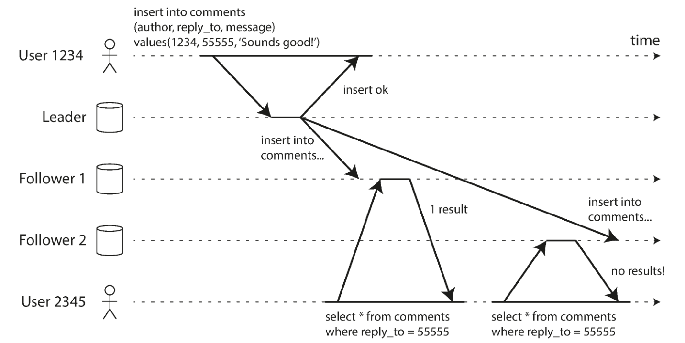

**单调读（monotonic reads）**这是一个比 **强一致性（strong consistency）** 更弱，但比 **最终一致性（eventual consistency）** 更强的保证。当读取数据时，你可能会看到一个旧值；单调读仅意味着如果一个用户顺序地进行多次读取，则他们不会看到时间回退，也就是说，如果已经读取到较新的数据，后续的读取不会得到更旧的数据。

实现单调读的一种方式是确保每个用户总是从同一个副本进行读取，例如可以基于用户 ID 的散列来选择副本。


## 多主复制

假如你有一个数据库，副本分散在好几个不同的数据中心（可能会用来容忍单个数据中心的故障，或者为了在地理上更接近用户）。多主配置中可以在每个数据中心都有主库。

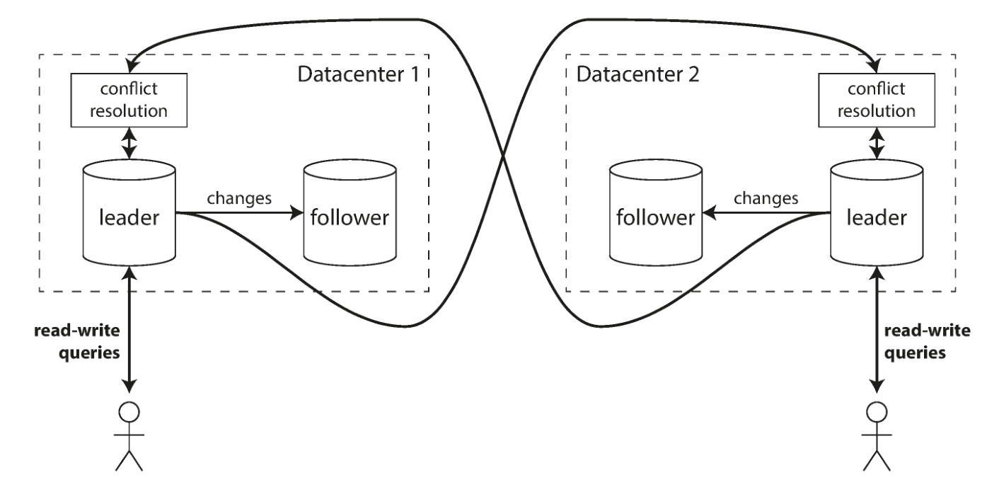

在运维多个数据中心多主是有很多优点的，如：在多主配置中，每个写操作都可以在本地数据中心进行就近处理，性能会好一些；每个数据中心可以独立于其他数据中心继续运行，其他数据中心出现故障不会导致全局瘫痪；

多主配置也有一个很大的缺点：两个不同的数据中心可能会同时修改相同的数据，写冲突是必须解决的。


### 处理写入冲突


#### 避免冲突

处理冲突的最简单的策略就是避免它们，如果应用程序可以确保特定记录的所有写入都通过同一个主库，那么冲突就不会发生。例如，在一个用户可以编辑自己数据的应用程序中，可以确保来自特定用户的请求始终路由到同一数据中心，并使用该数据中心的主库进行读写。不同的用户可能有不同的 “主” 数据中心。

但是也有可能因为数据中心出现故障，你需要将流量重新路由到另一个数据中心，在这种情况下，冲突避免将失效，你必须处理不同主库同时写入的可能性。


#### 收敛至一致的状态

在多主配置中，由于没有明确的写入顺序，如果每个副本只是按照它看到写入的顺序写入，那么数据库最终将处于不一致的状态。所以需要以一种方式在所有变更复制完成时收敛至一个相同的最终值。

例如可以为每个副本分配一个唯一的 ID，ID 编号更高的写入具有更高的优先级，但是这种方法也意味着数据丢失。


#### 用户自行处理

把这个操作直接交给用户，让用户自己在读取或写入前进行冲突解决，这种例子也是屡见不鲜，Github采用就是这种方式。


## 无主复制

在一些无主复制的实现中，客户端直接将写入发送到几个副本中，而另一些情况下，由一个 **协调者（coordinator）** 节点代表客户端进行写入。

在无主配置中，不存在故障转移。假设客户端（用户 1234）并行发送写入到所有三个副本，并且两个可用副本接受写入，但是不可用副本错过了它。假设三个副本中的两个承认写入是足够的：在用户 1234 已经收到两个确定的响应之后，我们认为写入成功。

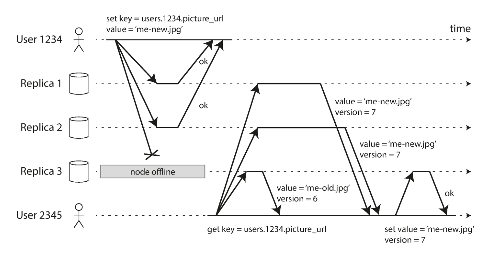

因为有可能会有节点没写入成功，所以当一个客户端从数据库中读取数据时，它不仅仅把它的请求发送到一个副本，而是并行地发送到多个副本。客户可能会从不同的副本获得不同的响应，然后用版本号确定哪个值是更新的。

那么对于一个不可用的节点重新联机之后，它如何赶上它错过的写入？一般来说两种方法：

1. 读修复（Read repair），当客户端并行读取多个节点时发现有的副本的值是旧的就将新值写回到该副本；
2. 反熵过程（Anti-entropy process），用后台进程不断查找副本之间的数据差异，并将任何缺少的数据从一个副本复制到另一个副本。

在上面的例子中，在三个副本中的两个上进行处理，写入就算成功了。那么多个副本的集群中需要多少个副本写入成功才算成功？

一般地说，如果有 n 个副本，每个写入必须由 w 个节点确认才能被认为是成功的，并且我们必须至少为每个读取查询 r 个节点。只要 `w + r > n`，我们可以预期在读取时能获得最新的值，r 和 w 是有效读写所需的最低票数。

然而，法定人数（如迄今为止所描述的）并不像它们可能的那样具有容错性。网络中断可以很容易地将客户端从大量的数据库节点上切断。虽然这些节点是活着的，而其他客户端可能也能够连接到它们，但是从数据库节点切断的客户端来看，它们也可能已经死亡。在这种情况下，剩余的可用节点可能会少于 w 或 r，因此客户端不再能达到法定人数。


### 检测并发写入

由于可变的网络延迟和部分节点的故障，事件可能以不同的顺序到达不同的节点。那么就会有数据不一致的情况，比如下图显示了两个客户机 A 和 B 同时写入三节点数据存储中的键 X：

- 节点 1 接收来自 A 的写入，但由于暂时中断，未接收到来自 B 的写入。
- 节点 2 首先接收来自 A 的写入，然后接收来自 B 的写入。
- 节点 3 首先接收来自 B 的写入，然后从 A 写入。

如果每个节点只要接收到来自客户端的写入请求就简单地覆写某个键值，那么节点就会永久地不一致。

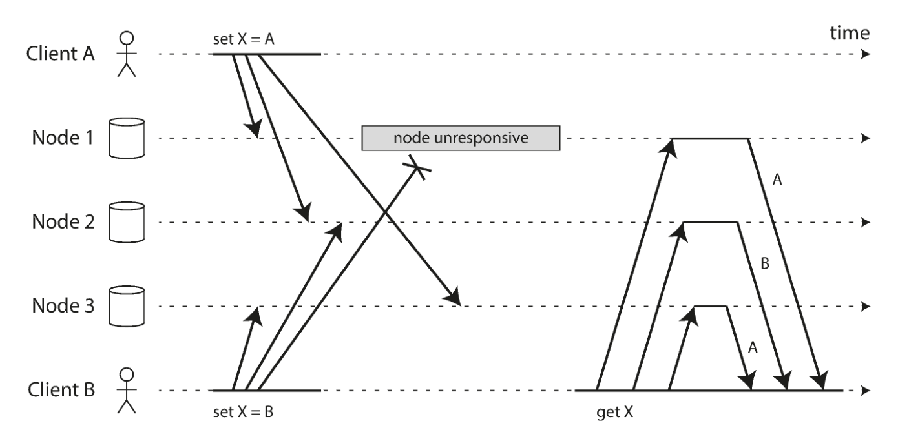

有一种解决的办法就是 Last write wins (discarding concurrent writes)，所谓 Last write wins 就是只需要存储 **“最近”** 的值，并允许 **“更旧”** 的值被覆盖和抛弃。那么实现上其实可以为每个写入附加一个时间戳，然后挑选最大的时间戳作为 **“最近的”**，并丢弃具有较早时间戳的任何写入。


## 分区

分区通常与复制结合使用，使得每个分区的副本存储在多个节点上，一个节点也可能存储多个分区。每个分区领导者（主库）被分配给一个节点，追随者（从库）被分配给其他节点。 每个节点可能是某些分区的主库，同时是其他分区的从库。

我用 TiDB 的存储 TiKV 来举例好了，TiKV 的数据会按 Region 进行存放，一个 Region 就是一个分区。当某个 Region 的大小超过一定限制（默认是 144MB），TiKV 会将它分裂为两个或者更多个 Region，以保证各个 Region 的大小是大致接近的，同样，当某个 Region 因为大量的删除请求导致 Region 的大小变得更小时，TiKV 会将比较小的两个相邻 Region 合并为一个。

将数据划分成 Region 后，TiKV 会尽量保证每个节点上服务的 Region 数量差不多，并以 Region 为单位做 Raft 的复制和成员管理。也就是如下图，你可以看到不同的 node 节点其实都有一份 Region 的复制。

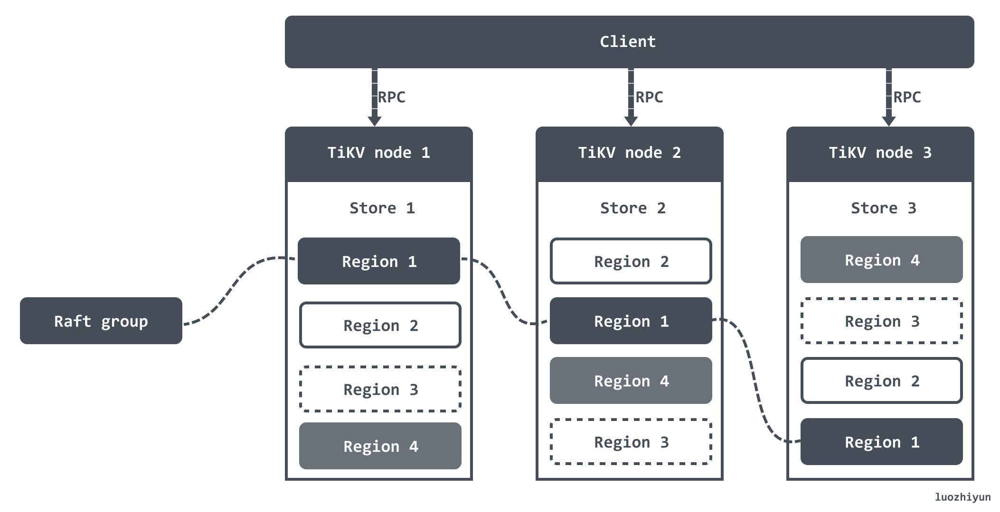


### 分区的划分

假设你有大量数据并且想要分区，如何决定在哪些节点上存储哪些记录呢？分区目标是将数据和查询负载均匀分布在各个节点上。如果分区是不公平的，一些分区比其他分区有更多的数据或查询，我们称之为偏斜（skew）。不均衡会导致负载可能不同节点不一致，高负载高的分区被称为热点（hot spot），这就丧失了分区的平衡负载的特性，这是需要避免的。

其实最简单的方法就是将记录随机分配给节点。这将在所有节点上平均分配数据，但是它有一个很大的缺点：当你试图读取一个特定的值时，你无法知道它在哪个节点上，所以你必须并行地查询所有的节点，这显然是不科学的。

所以现在有两种比较典型的方案：

- Range：按照 Key 分 Range，某一段连续的 Key 都保存在一个存储节点上。
- Hash：按照 Key 做 Hash，根据 Hash 值选择对应的存储节点。


#### 根据键的 Range 分区

那么不随机的话，一种分区的方法是为每个分区指定一块连续的键范围（从最小值到最大值）。但是键的范围不一定均匀分布，因为数据也很可能不均匀分布。为了均匀分配数据，分区边界需要依据数据调整。

分区边界可以由管理员手动选择，也可以由数据库自动选择，然后在每个分区中，我们可以按照一定的顺序保存键。

对于 TiDB 来说也是根据键的范围进行分区，每个分区被称作 Region，因为有序的，所以可以用 [StartKey，EndKey) 这样一个左闭右开区间来描述。然后它是根据 Region 的大小来进行边界的调整，默认一个 Region 在 96 MiB 的时候就会创建新的 Region。

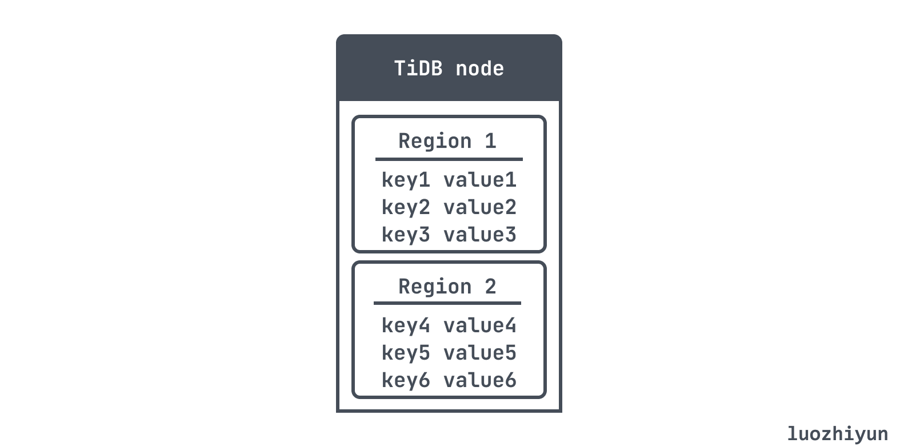

根据范围来划分分区还有个问题就是特定的访问模式会导致热点， 如果主键是时间戳，给每天分配一个分区，那么当天的数据的分区可能会因写入而过载，所以需要使用除了时间戳以外的其他东西作为主键的第一个部分。


#### 根据键的 Hash 分区

hash 分区就是通过 hash 散列函数，无论何时给定一个新的字符串输入，它将返回一个 0 到 2^32 -1 之间的 “随机” 数。即使输入的字符串非常相似，它们的散列也会均匀分布在这个数字范围内。然后为每个分区分配一个散列范围，每个通过哈希散列落在分区范围内的键将被存储在该分区中。

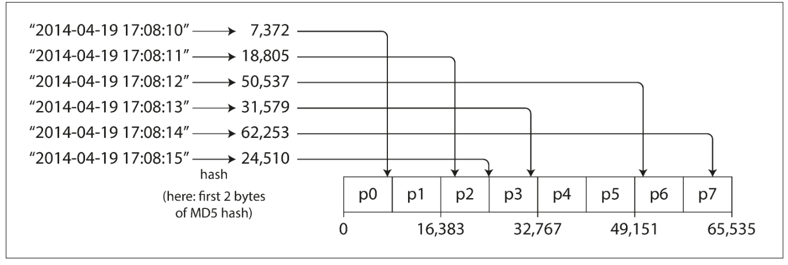

但是这样也有缺点，失去了高效执行范围查询的能力，所以对于关系型的数据库，因为经常性的需要表扫描或者索引扫描，基本上都会使用范围的分片策略，像 nosql 数据库 redis cluster 就使用的是 Hash 分区。


### 分区再平衡


#### 固定分区数

上面说了根据键的 Hash 分区，那么怎么根据 hash 值存放入分区中呢？一个简单的想法是让分区数等于机器节点数，根据分区数取模，也就是 `hash(key) % 分区数`。那么如果想要增加新的分区该怎么办呢？怎么把一个分区的数据迁移到另一个分区？这种数据的迁移成本其实会很高。

除此之外还可以用另一种方式：创建比节点更多的分区，并为每个节点分配多个分区。例如，运行在 10 个节点的集群上的数据库可能会从一开始就被拆分为 1,000 个分区，因此大约有 100 个分区被分配给每个节点。如果一个节点被添加到集群中，新节点可以从当前每个节点中窃取一些一些分区，直到分区再次公平分配。

只有分区在节点之间的移动。分区的数量不会改变，键所指定的分区也不会改变。唯一改变的是分区所在的节点。

redis cluster 就是采用这种方式，Redis Cluster为整个集群定义了一共 16384 个 slot，slot 就是分区，每个节点负责一部分的 slot。然后 key 会根据 crc16 计算出得结果和 16384 取模进行 slot 定位，从而定位到具体节点。

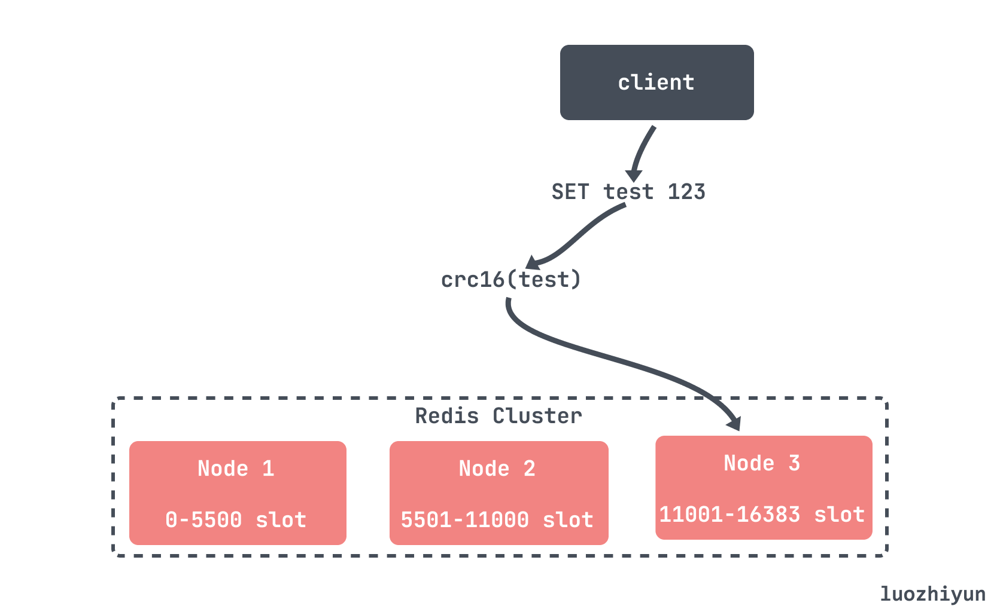

#### 动态分区

对于根据键的 Range 分区的数据库，具有固定边界的固定数量的分区将非常不便，所以一般是当分区增长到超过配置的大小时进行自动分区，我上面也讲到了 TiDB 它是根据分区的大小来进行边界的调整，默认一个 分区在 96MB的时候就会创建新的分区。

并且除了分裂以外还能进行分区的合并，TiDB 会根据分区的大小和 key 的数量，默认小于 20MB 并且 key 数量小于 200000 会触发合并。


### 路由

最后要说的就是路由了，客户端怎么知道我要查的数据在哪个分区。一般来说有三种方式：

1. 让 client 随便连接哪个节点都行，如果正好数据在这个节点上，那么直接查询即可；如果数据不在这个节点上，这个节点会将请求转发到数据所在的节点上，这种集群是去中心化的，Redis Cluster 就是这种架构，节点与节点之间通过 gossip 协议来交互信息；
2. client首先要连接集群的路由层，路由层里面知道该请求的数据在哪个分区的哪个节点上，TiDB 就是这种架构的，TiDB 集群里面的 PD 负责管理所有分区的路由信息，TiDB 要访问某个分区的数据时，需要先向 PD 查询此分区的状态和位置；
3. 最后一种方式就是 client 自己保存了分区和节点的信息，这样客户端就直接查询到想要的数据返回了。

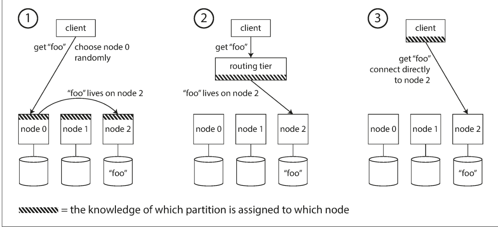

## 总结

本篇主要是总结了复制和分区的一些主要技术的细节点，讨论了各种实现方式的异同，以及可能出现的问题，然后结合目前主流数据库来讲解如何应用落地。

无论是复制还是分区，都是围绕可用性、性能、扩展性这几个方面展开的。对于复制来说主要有单主复制、多主复制、无主复制。

目前最流行的还是单主复制，很多分布式数据库都是单主复制+分区架构来提供大吞吐的支持，并且单主复制不需要担心冲突解决，实现起来更简单。但是单主复制也可能因为异步复制 leader 宕机而造成数据丢失，所以很多都是半同步（semi-synchronous ）的方式进行复制，例如 kafka 加入 ISR 防丢机制，ISR 一组可靠的备份集合，只有当 ISR 里机器都成功复制，才认为这条消息被成功提交。

再来就是讲了由复制延迟引起的奇怪行为，比如在主库写了数据，但是还没同步到从库，那么将查不出来数据；还有就是从延迟大的从库查的数据和延迟小的从库查的数据也不一样。

接下来就是分区，这个技术在很多分布式数据库都有应用，使用它主要是为了伸缩性，因为不同的分区可以放在不共享集群中的不同节点上所以，并发负载都可以分摊到不同的处理器上，当负载增加时可以添加新的分区，当负载降低时也可以合并分区。

分区就需要考虑到分区怎么划分，一般有按range划分，按 hash 划分。还需要考虑分区的再平衡问题，添加新的节点分区数怎么分配，才能让负载均摊。然后就是路由，客户端的请求过来应该路由到哪个分区，哪个节点。

## Reference

《Designing Data-Intensive Application》

https://tech.meituan.com/2022/08/25/replication-in-meituan-01.html