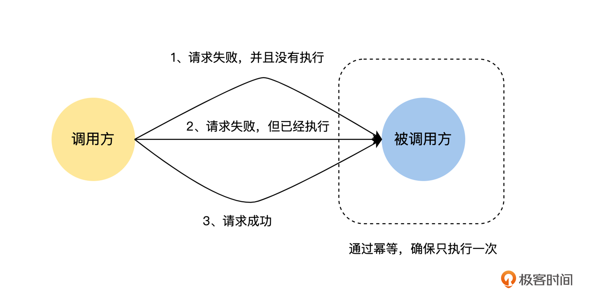
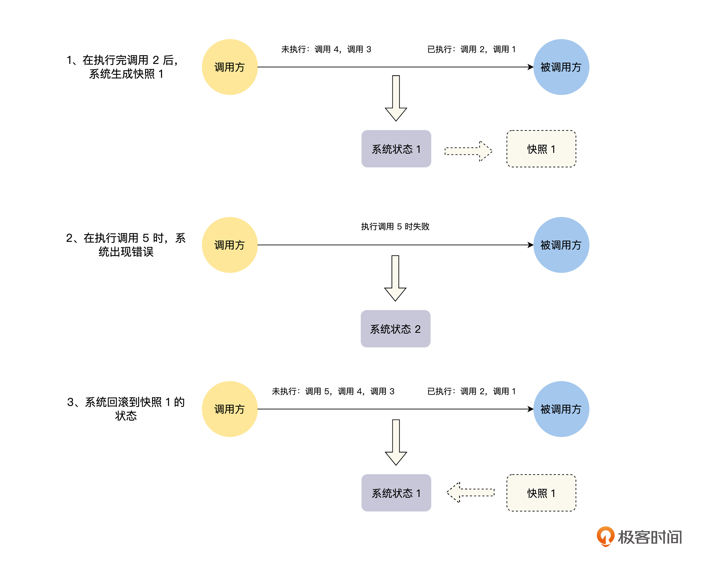
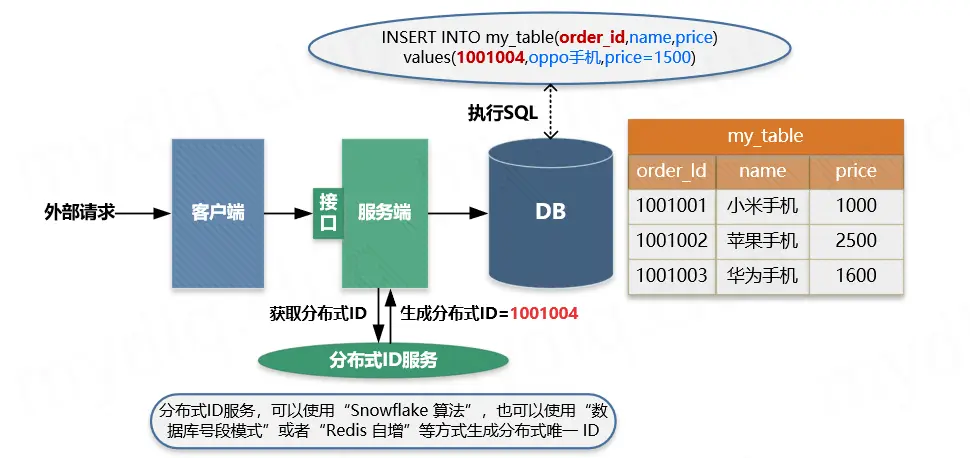
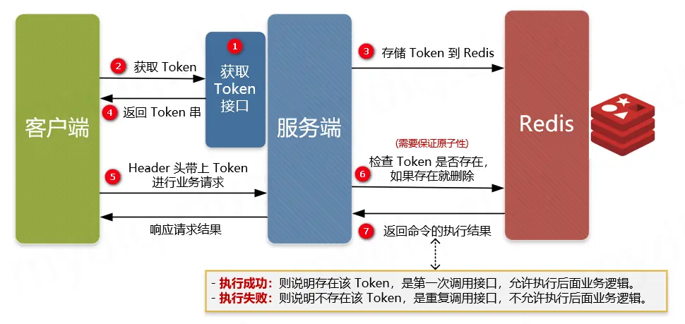

# 重试


## 为什么不能保证 Exactly-once

在单机系统中，模块之间的通信都是进程内的本地函数调用，在这个整体失败和同步通信的模型中，要么进程整体崩溃，要么调用完成，不会存在其他的情况，但是在分布式系统中，程序不能保证 Exactly-once 的原因主要有以下两个：

**第一个是网络方面的原因**。在分布式系统中，服务和服务之间都是通过网络来进行通信的，而这个网络是一个异步网络。在这个网络中，经过中间的路由器等网络设备的时候，会出现排队等待或者因为缓冲区溢出，导致消息被丢弃的情况，那么将一个消息从一个节点发送到另一个节点的时延是没有上界的，有可能非常快，比如 1 ms，也有可能是 1 分钟，甚至无穷大，这个时候就是出现消息丢失的情况了。

在服务间进行远程调用的时候，如果迟迟没有收到响应结果，为了系统整体的可用性，我们不能无限等待下去，只能通过超时机制来快速获得一个结果。其实这样做是将无界时延的异步网络模型，通过超时机制转化成了有界时延，这个方式大大减轻了我们在写程序时的心智负担。

但是，计算机的世界里没有银弹，我们在收到响应为“请求超时”的时候，无法判断是请求发送的过程中延迟了，远端服务没有收到请求；还是远端服务收到请求并且正确处理了，却在响应发送的过程中延迟了。

**第二个原因是远端服务发生了故障**。如果远端服务在收到请求之前发生了故障，我们会收到“网络地址不可达”的错误，对于这个错误，我们能明确判断请求没有被远端服务执行过。但是，如果远端服务是在收到请求之后发生了故障，导致无法响应而引起“请求超时”，我们无法判断请求是否被远端服务执行过，或者被部分执行过。

通过上文提到的两个原因，我们可以知道，当请求方收到“请求超时”的时候，我们无法判断远端服务是否处理过这个请求。这个时候就出现了本课开头的问题：**如果我们认为这是一个临时的故障，对请求进行重试，那么可能会出现多次执行的情况，即 At-least-once，如果不进行重试，就可能会出现一次都没有执行的情况，即 At-most-once**。


## 如何保证 Exactly-once

通过上面的分析，我们知道了导致消息传递，不能保证 Exactly-once 的原因主要有两个，一个是网络出现丢包或者分区等故障，另一个是远端服务发生了故障。因为这两点在分布式系统中是永远存在的，所以我们必须去直面这两个问题，通过上层的容错机制来解决它们。

一般来说，在分布式系统中，实现消息的 Exactly-once 传递，主要有三种方式：一种是至少一次消息传递加消息幂等性，一种是分布式快照加状态回滚，还有一种是整体重做，下面我们来一一介绍。


### 至少一次消息传递加消息幂等性

至少一次消息传递加消息幂等性的思路特别简单，我们可以结合本课开始提到的场景来分析，如果调用方在课程购买的 RPC 接口返回网络层错误，比如请求超时以及网络地址不可达等，对于这样的情况，调用方就进行重试，直到响应结果为成功或业务错误等非网络层错误。

当然，这里的请求超时也有可能是远端服务的执行时间太长导致的，为了简化讨论中的语言描述，后面我们统一归类为网络错误。

但是，我们同样要考虑到，重试会让用户对当前的课程重复购买，对于这个情况，我们可以在远端服务对课程购买接口的实现上，对请求进行去重，确保远端服务对同一个购买请求处理一次和多次的结果是完全相同的，对于这样的接口，我们称之为幂等的。

其实这个去重的思路也非常简单，你可以结合下图理解。我们只需要对用户发起的每一次课程购买的请求，生成一个唯一的 ID ，然后在课程购买的 RPC 请求中带上这个唯一的 ID ，在首次调用和重试的时候，这个唯一的 ID 都保持不变。

接着，课程购买服务在接收到请求后，先查询当前的 ID 是否已经处理过，如果是已经处理过的请求，就直接返回结果，不重复执行购买相关的逻辑了。




### 分布式快照加状态回滚

分布式快照加状态回滚指的是，在整个分布式系统运行的过程中，定期对整个系统的状态做快照，在系统运行时，不论系统的哪个地方出现故障，就将整个系统回滚到上一个快照状态，然后再重放上一个快照状态之后的情况，直到所有的消息都被正常处理，你可以结合下图理解具体操作：



\- 可是很明显，分布式快照加状态回滚的方式并不适合在线业务的情况。首先，要对在线业务的所有状态做快照是非常难的一件事情，因为在线业务的状态一般都是在数据库中，如果要对整个系统的数据库都定期做快照，这将消耗非常大的资源。

其次，在通过快照进行状态回滚的时候，整个系统不能处理当前的业务请求，当前的业务请求需要进行排队等待，等系统通过快照将状态回滚完，并且重放了上一个快照状态之后的所有请求，才能开始正常处理当前业务。这个过程可能很长，这对于在线业务系统是不能接受的。

最后，如果出现任何一个小的问题或者故障，就要对整个分布式系统进行状态回滚，这也是不能接受的。

所以，分布式快照加状态回滚的方式，一般不会应用于在线业务架构中，它的主要应用场景是例如 Flink 之类的流式计算。因为在流式计算中，系统状态的存储也是系统设计的一部分，我们可以在系统设计的时候，就考虑支持快照和回滚功能。并且，在流式计算中，消息来源一般都是 Kafka 之类的消息系统，这样对消息进行重放就非常方便了。


### 整体重做

整体重做的 Exactly-once 的方式，可以看成是分布式快照加状态回滚的一种特殊情况。在执行任务的过程中，如果系统出现故障，就将整个任务的状态删除，然后再进行重做。整体重做的方案，一般的使用场景为批处理任务的情况，比如 MapReduce 之类的批处理计算引擎。


## Exactly-once 的挑战

因为这个专栏主要讨论的是在线业务架构的分布式系统，所以接下来，我们只讨论分布式在线业务架构系统中，对于解决 Exactly-once 问题，常用的“最少一次消息传递加消息幂等性机制”面临的挑战。


### 重试面临的挑战

通过“最少一次消息传递加消息幂等性机制”来确保消息的 Exactly-once，我们首先要采用重试策略，来确保消息最少传递一次，但是在执行重试策略的过程中，我们要避免重试导致的系统雪崩的问题。

在系统快要接近性能瓶颈的时候，某些节点可能会因为负载过高而响应超时，如果这个时候再无限制地重试，就会进一步放大系统的请求量，将一个局部节点的性能问题，放大到整个系统，造成雪崩效应。

一般情况下，重试策略都会有两个限制，第一个是限制重试的次数，比如，如果重试 3 次都失败了，就直接返回请求失败，不再继续重试；第二个是控制重试的间隔，一般采取指数退避的策略，比如重试 3 次，第一次请求失败后，等待 1 秒再进行重试，如果再次失败，就等待 3 秒再进行重试，仍然失败的话，就等待 9 秒后再进行重试。


### 幂等面临的挑战

对于请求的幂等问题，首先，我们要讨论能否通过对操作进行改写，将一个非幂等操作变成一个幂等操作，然后，我们再讨论如何将一个非幂等操作变成一个幂等操作，最后，我们讨论在有外部系统的情况下，如何保证请求的幂等性。

#### 操作的幂等性讨论

对于请求的幂等处理，如果请求本身就是幂等的，比如请求只是查询数据，没有任何的状态修改，或者是像更新头像这样简单的重置操作，那么我们可以什么都不用做。这里我们要注意一个情况，假设有一个请求是为用户的余额增加 5 元，如果采用下面的 SQL 进行处理，我们都知道它不是幂等的：

**UPDATE table SET balance = balance + 5 WHERE UID = 用户ID ；**

但是，如果我们将上面的 SQL 改写为下面的三个操作，你可以思考一下，这个时候我们的请求是否为幂等的呢？

1. 在数据库中查询用户的余额：SELECT balance FROM table WHERE UID = 用户 ID ；
2. 在内存中计算用户的余额：balance = balance + 5 ，假设计算结果为 10 。
3. 更新用户的余额到数据库：UPDATE table SET balance = 10 WHERE UID = 用户 ID ；

在上面的操作中，虽然对数据库的两个操作都是幂等的，但是整体的操作却不是幂等的，因为第 2 步的操作不是幂等的，上面的改写只是将这个计算操作，从数据库中迁移到内存中，并不会改变这个请求的幂等性。


#### 如何确保操作的幂等性

如果是一个非幂等操作的请求，我们如何将其变成一个幂等的请求呢？一个常用的方法就是我们在上面课程购买的例子中介绍的，在请求中增加唯一 ID ，然后在处理请求时，通过 ID 进行去重，确保对相同 ID 的请求只处理一次。

这里要特别注意的是，将请求处理结果写入数据库的操作，以及标记请求已处理的操作，也就是将请求唯一的 ID 写入数据库，它们都必须在同一个事务中，让事务来保证这两个操作的原子性。

否则，如果在写入处理结果后，请求唯一的 ID 写入数据库之前，服务发生崩溃的话，重试的时候就会使请求被执行多次；如果在请求唯一的 ID 写入数据库后，写入处理结果之前，服务发生崩溃，那么后面的重试请求都将因为去重而丢弃，导致请求一次都没有执行。


#### 外部系统的幂等性保障

另外，还有一种情况，如果我们请求的操作会影响外部系统的状态，比如在一个请求中，我们需要给用户发送一条 IM 消息，因为发送 IM 消息是由外部的 IM 服务来提供的，我们可以通过下面两种方案，来保证请求操作整体的幂等性：

**第一个方案，由 IM 服务提供幂等的消息发送接口**。在这种情况下，我们采用全局唯一的 ID 作为请求的 ID，这样当前请求在调用 IM 消息发送接口时，我们只需要传入当前请求的唯一 ID 作为消息发送的 ID 即可，由 IM 服务内部根据消息发送 ID 来进行去重操作，确保 IM 消息发送的幂等性。

**第二个方案，IM 服务提供 2PC 的消息发送接口**，然后我们在当前请求的内部通过 2PC 的机制，确保该请求的内部状态修改逻辑， IM 消息的发送和请求唯一的 ID 写入数据库，这三个操作整体是一个原子操作。

到这里可以看出，如果我们请求的操作会影响到外部系统的状态，要保证请求的幂等性是需要依赖外部系统的支持才能实现的。


#### 思考

在 IM 系统中，我们如何实现幂等的消息发送接口？
>以Kafka为例，生产者发送消息的时候会带上 ProducerId 和 SequenceNumber，相同批次（batch）的消息 SequenceNumber 是一样的，重复发送时不会被 broker 接受。
>同时，开启幂等会默认 acks = -1，也就是一批消息被成功写入需要分区的所有同步副本都接收到才算数，以此确保不丢消息。在这个基础上加上幂等，二者共同保证精确一次。
>以上虽然只能确保单次会话、单分区的幂等，但一般情况下，业务上我们会确保某一种类的消息固定发往某一分区（比如根据某个 key 值做哈希取余），而且在消费者端也可以做去重检查，因此问题不大。
>如果需要全局的、跨越会话的幂等（精确一次），还是要开事务


如果使用另外的存储比方说redis记录幂等，是不是二者之间就很难一致，可能出现没重试或者多重试?

> 是的，可以通过 2PC 来保证 redis记录幂的操作和其他的操作是原子的。
>不过很多业务场景下，是能容易小概率的不一致的，那么就可以直接通过 redis 记录就行。
>
>我们在做架构设计的时候，一定要对架构设计的边界或者问题有清晰的认识，然后在基于业务情况做 trade-off 。


请问老师，外部系统2PC方式具体要怎么做？

> 作者回复: 2pc 是保证多个操作的原子性的，用来确保在通过去重保证接口幂等的时候，去重和其他的操作整体是一个原子操作。这里以 IM 的发送消息接口为例介绍，IM 对发送消息接口支持 2PC 协议需要提供下面 3 个接口：
> Prepare 接口：用来确定当前的消息是否可以发送，如果可以发送，写好 undo 和redo 日志等操作
> commit 接口：真正发送消息的操作
> rollback 接口：回滚消息的操作
> 然后由 2PC 的协调者整体来执行协调工作。
>
> 在后面的课程“事务（二）：原子性，对应用层提供的完美抽象”会有更详细的解释。


关于重试幂等，能否举一两个具体的例子？互联网实践的例子。

>课程中的提到的支付场景中，就会经常使用。另外，有的时候，我们的系统和在调用第三方服务后，如果第三方服务是通过异步回调来给我们结果的，那么第三方服务一般都是最少一次的方式来回调，我们来通过幂等来保证正确性。


# 幂等

## 一、什么是幂等性

幂等是一个数学与计算机学概念，在数学中某一元运算为幂等时，其作用在任一元素两次后会和其作用一次的结果相同。在计算机中编程中，一个幂等操作的特点是其任意多次执行所产生的影响均与一次执行的影响相同。幂等函数或幂等方法是指可以使用相同参数重复执行，并能获得相同结果的函数。这些函数不会影响系统状态，也不用担心重复执行会对系统造成改变。

## 二、什么是接口幂等性

在HTTP/1.1中，对幂等性进行了定义。它描述了一次和多次请求某一个资源对于资源本身应该具有同样的结果（网络超时等问题除外），即第一次请求的时候对资源产生了副作用，但是以后的多次请求都不会再对资源产生副作用。这里的副作用是不会对结果产生破坏或者产生不可预料的结果。也就是说，其任意多次执行对资源本身所产生的影响均与一次执行的影响相同。

## 三、为什么需要实现幂等性

在接口调用时一般情况下都能正常返回信息不会重复提交，不过在遇见以下情况时可以就会出现问题，如：

- 前端重复提交表单： 在填写一些表格时候，用户填写完成提交，很多时候会因网络波动没有及时对用户做出提交成功响应，致使用户认为没有成功提交，然后一直点提交按钮，这时就会发生重复提交表单请求。
- 用户恶意进行刷单： 例如在实现用户投票这种功能时，如果用户针对一个用户进行重复提交投票，这样会导致接口接收到用户重复提交的投票信息，这样会使投票结果与事实严重不符。
- 接口超时重复提交： 很多时候 HTTP 客户端工具都默认开启超时重试的机制，尤其是第三方调用接口时候，为了防止网络波动超时等造成的请求失败，都会添加重试机制，导致一个请求提交多次。
- 消息进行重复消费： 当使用 MQ 消息中间件时候，如果发生消息中间件出现错误未及时提交消费信息，导致发生重复消费。

使用幂等性最大的优势在于使接口保证任何幂等性操作，免去因重试等造成系统产生的未知的问题。

## 四、引入幂等性后对系统的影响

幂等性是为了简化客户端逻辑处理，能放置重复提交等操作，但却增加了服务端的逻辑复杂性和成本，其主要是：

- 把并行执行的功能改为串行执行，降低了执行效率。
- 增加了额外控制幂等的业务逻辑，复杂化了业务功能；

所以在使用时候需要考虑是否引入幂等性的必要性，根据实际业务场景具体分析，除了业务上的特殊要求外，一般情况下不需要引入的接口幂等性。

## 五、Restful API 接口的幂等性

现在流行的 Restful 推荐的几种 HTTP 接口方法中，分别存在幂等行与不能保证幂等的方法，如下：

- √ 满足幂等
- x 不满足幂等
- 可能满足也可能不满足幂等，根据实际业务逻辑有关


| 方法类型 | 是否幂等 | 描述                                                         |
| -------- | -------- | ------------------------------------------------------------ |
| Get      | √        | Get 方法用于获取资源。其一般不会也不应当对系统资源进行改变，所以是幂等的。 |
| Post     | ×        | Post 方法一般用于创建新的资源。其每次执行都会新增数据，所以不是幂等的。 |
| Put      | -        | Put 方法一般用于修改资源。该操作则分情况来判断是不是满足幂等，更新操作中直接根据某个值进行更新，也能保持幂等。不过执行累加操作的更新是非幂等。 |
| Delete   | -        | Delete 方法一般用于删除资源。该操作则分情况来判断是不是满足幂等，当根据唯一值进行删除时，删除同一个数据多次执行效果一样。不过需要注意，带查询条件的删除则就不一定满足幂等了。例如在根据条件删除一批数据后，这时候新增加了一条数据也满足条件，然后又执行了一次删除，那么将会导致新增加的这条满足条件数据也被删除。 |


## 六、如何实现幂等性


### 方案一：数据库约束


**数据库唯一主键**

数据库唯一主键的实现主要是利用数据库中主键唯一约束的特性，一般来说唯一主键比较适用于“插入”时的幂等性，其能保证一张表中只能存在一条带该唯一主键的记录。使用数据库唯一主键完成幂等性时需要注意的是，该主键一般来说并不是使用数据库中自增主键，而是使用分布式 ID 充当主键（可以参考 Java 中分布式 ID 的设计方案 这篇文章），这样才能能保证在分布式环境下 ID 的全局唯一性。

适用操作：

- 插入操作
- 删除操作

使用限制：

- 需要生成全局唯一主键 ID；

主要流程：



主要流程：

- ① 客户端执行创建请求，调用服务端接口。

- ② 服务端执行业务逻辑，生成一个分布式 ID，将该 ID 充当待插入数据的主键，然后执数据插入操作，运行对应的 SQL 语句。

- ③ 服务端将该条数据插入数据库中，如果插入成功则表示没有重复调用接口。如果抛出主键重复异常，则表示数据库中已经存在该条记录，返回错误信息到客户端。

  


**数据库（mysql）唯一约束**

```
UNIQUE KEY `uniq_outer_no` (`api_name`) USING BTREE
```

```java
 public void handle(HandlerContext<ApplyIdempotentDTO> hc) {
        ApplyIdempotentDTO  applyIdempotentDTO= hc.getInnerParam() ;
        try {
           int  num = applyIdempotentMapper.insertSelective();
           BusinessException.assertIt(1==num, RespCodeType.SYS_ERROR,  "系统异常");
        } catch (DataIntegrityViolationException e) {
            log.info("用户申请单号重复 {}",applyIdempotent,e);
            // throw new ....
        }
    }
```

使用数据库的约束保证幂等性。但是需要一张幂等表。


### 方案二：数据库乐观锁

方案描述：

数据库乐观锁方案一般只能适用于执行“更新操作”的过程，我们可以提前在对应的数据表中多添加一个字段，充当当前数据的版本标识。这样每次对该数据库该表的这条数据执行更新时，都会将该版本标识作为一个条件，值为上次待更新数据中的版本标识的值。

适用操作：

- 更新操作

使用限制：

- 需要数据库对应业务表中添加额外字段；

描述示例：

例如，存在如下的数据表中：


| id   | name     | price |
| ---- | -------- | ----- |
| 1    | 小米手机 | 1000  |
| 2    | 苹果手机 | 2500  |
| 3    | 华为手机 | 1600  |

为了每次执行更新时防止重复更新，确定更新的一定是要更新的内容，我们通常都会添加一个 version 字段记录当前的记录版本，这样在更新时候将该值带上，那么只要执行更新操作就能确定一定更新的是某个对应版本下的信息。


| id   | name     | price | version |
| ---- | -------- | ----- | ------- |
| 1    | 小米手机 | 1000  | 10      |
| 2    | 苹果手机 | 2500  | 21      |
| 3    | 华为手机 | 1600  | 5       |

这样每次执行更新时候，都要指定要更新的版本号，如下操作就能准确更新 version=5 的信息：

```
UPDATE my_table SET price=price+50,version=version+1 WHERE id=1 AND version=5
```

上面 WHERE 后面跟着条件 id=1 AND version=5 被执行后，id=1 的 version 被更新为 6，所以如果重复执行该条 SQL 语句将不生效，因为 id=1 AND version=5 的数据已经不存在，这样就能保住更新的幂等，多次更新对结果不会产生影响。


### 方案三：防重 Token 令牌

方案描述：

针对客户端连续点击或者调用方的超时重试等情况，例如提交订单，此种操作就可以用 Token 的机制实现防止重复提交。简单的说就是调用方在调用接口的时候先向后端请求一个全局 ID（Token），请求的时候携带这个全局 ID 一起请求（Token 最好将其放到 Headers 中），后端需要对这个 Token 作为 Key，用户信息作为 Value 到 Redis 中进行键值内容校验，如果 Key 存在且 Value 匹配就执行删除命令，然后正常执行后面的业务逻辑。如果不存在对应的 Key 或 Value 不匹配就返回重复执行的错误信息，这样来保证幂等操作。

适用操作：

- 插入操作
- 更新操作
- 删除操作

使用限制：

- 需要生成全局唯一 Token 串；
- 需要使用第三方组件 Redis 进行数据效验；

主要流程：



- ① 服务端提供获取 Token 的接口，该 Token 可以是一个序列号，也可以是一个分布式 ID 或者 UUID 串。
- ② 客户端调用接口获取 Token，这时候服务端会生成一个 Token 串。
- ③ 然后将该串存入 Redis 数据库中，以该 Token 作为 Redis 的键（注意设置过期时间）。
- ④ 将 Token 返回到客户端，客户端拿到后应存到表单隐藏域中。
- ⑤ 客户端在执行提交表单时，把 Token 存入到 Headers 中，执行业务请求带上该 Headers。
- ⑥ 服务端接收到请求后从 Headers 中拿到 Token，然后根据 Token 到 Redis 中查找该 key 是否存在。
- ⑦ 服务端根据 Redis 中是否存该 key 进行判断，如果存在就将该 key 删除，然后正常执行业务逻辑。如果不存在就抛异常，返回重复提交的错误信息。

> 注意，在并发情况下，执行 Redis 查找数据与删除需要保证原子性，否则很可能在并发下无法保证幂等性。其实现方法可以使用分布式锁或者使用 Lua 表达式来注销查询与删除操作。


### 方案四、下游传递唯一序列号

方案描述：

所谓请求序列号，其实就是每次向服务端请求时候附带一个短时间内唯一不重复的序列号，该序列号可以是一个有序 ID，也可以是一个订单号，一般由下游生成，在调用上游服务端接口时附加该序列号和用于认证的 ID。当上游服务器收到请求信息后拿取该 序列号 和下游 认证ID 进行组合，形成用于操作 Redis 的 Key，然后到 Redis 中查询是否存在对应的 Key 的键值对，根据其结果：

- 如果存在，就说明已经对该下游的该序列号的请求进行了业务处理，这时可以直接响应重复请求的错误信息。
- 如果不存在，就以该 Key 作为 Redis 的键，以下游关键信息作为存储的值（例如下游商传递的一些业务逻辑信息），将该键值对存储到 Redis 中 ，然后再正常执行对应的业务逻辑即可。

适用操作：

- 插入操作
- 更新操作
- 删除操作

使用限制：

- 要求第三方传递唯一序列号；
- 需要使用第三方组件 Redis 进行数据效验；

主要流程：

主要步骤：

- ① 下游服务生成分布式 ID 作为序列号，然后执行请求调用上游接口，并附带“唯一序列号”与请求的“认证凭据ID”。
- ② 上游服务进行安全效验，检测下游传递的参数中是否存在“序列号”和“凭据ID”。
- ③ 上游服务到 Redis 中检测是否存在对应的“序列号”与“认证ID”组成的 Key，如果存在就抛出重复执行的异常信息，然后响应下游对应的错误信息。如果不存在就以该“序列号”和“认证ID”组合作为 Key，以下游关键信息作为 Value，进而存储到 Redis 中，然后正常执行接来来的业务逻辑。

> 上面步骤中插入数据到 Redis 一定要设置过期时间。这样能保证在这个时间范围内，如果重复调用接口，则能够进行判断识别。如果不设置过期时间，很可能导致数据无限量的存入 Redis，致使 Redis 不能正常工作。


### 方案五：直接根据流水号检查

```java
    /**
     * 根据outTradeNo和bizSys幂等校验
     */
    private void checkRepeat(AnlinkSmsReqDto AnlinkSmsReqDto) {
        List<FireSmsDetailDO> smsDetailDos = fireSmsDetailMapper
                .selectRecordByOutTradeNoAndBizSys();
        if (smsDetailDos != null && smsDetailDos.size() > 0) {
            log.info("bizSys={},outTradeNo={} repeat", a,b);
        }
    }
```

调用api接口发送短信，对于不敏感的场景（如发送短信），如果加一张幂等表，反而显得复杂，可以直接查询流水号判断幂等（虽然并发情况下有问题）。


### 方案六：分布式锁 + 状态校验

之前打款分布式锁的示例，先加锁，在临界区内的代码判断状态，避免重复转账。


## 总结

幂等性是开发当中很常见也很重要的一个需求，尤其是支付、订单等与金钱挂钩的服务，保证接口幂等性尤其重要。在实际开发中，我们需要针对不同的业务场景我们需要灵活的选择幂等性的实现方式：

- 对于下单等存在唯一主键的，可以使用“唯一主键方案”的方式实现。
- 对于更新订单状态等相关的更新场景操作，使用“乐观锁方案”实现更为简单。
- 对于上下游这种，下游请求上游，上游服务可以使用“下游传递唯一序列号方案”更为合理。
- 类似于前端重复提交、重复下单、没有唯一ID号的场景，可以通过 Token 与 Redis 配合的“防重 Token 方案”实现更为快捷。

上面只是给与一些建议，再次强调一下，实现幂等性需要先理解自身业务需求，根据业务逻辑来实现这样才合理，处理好其中的每一个结点细节，完善整体的业务流程设计，才能更好的保证系统的正常运行。最后做一个简单总结


| 方案名称        | 适用方法                   | 实现复杂度 | 方案缺点                                                     |
| --------------- | -------------------------- | ---------- | ------------------------------------------------------------ |
| 数据库唯一主键  | 插入操作 删除操作          | 简单       | - 只能用于插入操作；- 只能用于存在唯一主键场景；             |
| 数据库乐观锁    | 更新操作                   | 简单       | - 只能用于更新操作；- 表中需要额外添加字段；                 |
| 请求序列号      | 插入操作 更新操作 删除操作 | 简单       | - 需要保证下游生成唯一序列号；- 需要 Redis 第三方存储已经请求的序列号； |
| 防重 Token 令牌 | 插入操作 更新操作 删除操作 | 适中       | - 需要 Redis 第三方存储生成的 Token 串；                     |