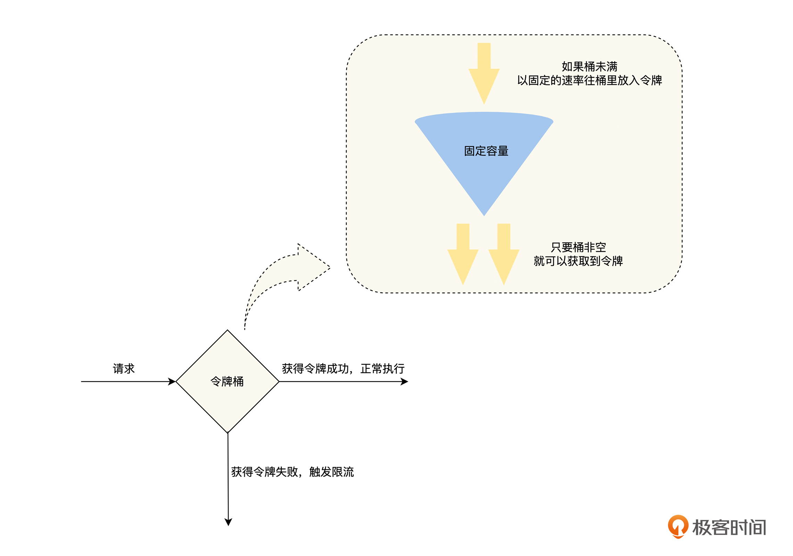

# 为什么会出现雪崩

雪崩是由于局部故障被正反馈循环，从而导致的不断放大的连锁故障，正如我们上文的例子所说，雪崩通常是由于整个系统中，一个很小的部分出现故障，进而导致系统其他部分也出现故障而引发的。但是，一个正常运行的服务为什么会发生雪崩呢？我认为在实际工作中，出现雪崩一般会经历以下三个阶段，如下图。

**首先，服务的处理能力开始出现过载**。服务过载是指服务器只能处理一定 QPS 的请求，当发往该服务器的 QPS 超出后，由于资源不够等原因，会出现超时、内存增加等各种异常情况，使服务的请求处理能力进一步降低，过载情况更加严重。

服务处理能力出现过载有多种原因，比如服务可能由于 Bug 导致性能下降，或者由于崩溃导致过载，也有可能就是突发的流量超过了服务的设计目标，或者是机器宕机导致可提供服务的实例数量减少等原因。

**然后，服务由于资源耗尽而不可用**。当服务严重过载后，会出现大量请求的积压，这会导致服务消耗更多的内存、 CPU 、线程和文件描述符等资源，待这些资源被消耗尽后，服务将出现严重超时和崩溃等异常情况，最终对外表现为不可用。当服务的某一个实例崩溃后，负载均衡器会将请求发送给其他的实例，导致其他的实例也出现过载的情况，从而造成整个服务过载的故障。

最后，由于服务内部出现严重的过载，导致响应严重超时，服务的调用方同样会出现大量请求的积压使资源耗尽，**这样正反馈循环就形成了，故障沿着调用链路逆向传播，导致整个系统出现雪崩**。

通过上面的讨论，我们可以看出雪崩的根本原因是系统过载，如果在系统过载的情况下，不进行任何控制，异常情况就会急剧扩散，导致雪崩情况出现。所以，想要避免系统雪崩，要么通过快速减少系统负载，即熔断、降级、限流等快速失败和降级机制；要么通过快速增加系统的服务能力来避免雪崩的发生，即弹性扩容机制。

在本节课中，我们先来讨论如何通过熔断来避免系统发生雪崩。

# 熔断

>熔断，让故障自适应地恢复

## 利用熔断机制避免雪崩

其实对于熔断机制，我们并不陌生。在日常生活中，电路保险丝的熔断就是我们最常见的熔断机制，它指的是在电路系统中，当电路超过负荷运行时，保险丝会自动断开，从而保证电路中的电器不受损害。

那么我们就借鉴这个原理来讨论熔断机制。当服务之间发起调用的时候，如果被调用方返回的指定错误码的比例超过一定的阈值，那么后续的请求将不会真正发起，而是由调用方直接返回错误。

我们知道电路在工作的时候，有两种工作状态，分别是通路和开路，计算机的熔断机制则略有不同，在熔断机制的模式下，服务调用方需要为每一个调用对象，可以是服务、实例和接口，维护一个状态机，在这个状态机中有三种状态。

首先，是闭合状态( Closed )。在这种状态下，我们需要一个计数器来记录调用失败的次数和总的请求次数，如果在一个时间窗口内，请求的特定错误码的比例达到预设的阈值，就切换到断开状态。

其次，是断开状态( Open )。在该状态下，发起请求时会立即返回错误，也可以返回一个降级的结果，我们会在后面的课程“降级”中再详细讨论。在断开状态下，会启动一个超时计时器，当计时器超时后，状态切换到半打开状态。

最后，是半打开状态( Half-Open )。在该状态下，允许应用程序将一定数量的请求发往被调用服务，如果这些调用正常，那么就可以认为被调用服务已经恢复正常，此时熔断器切换到闭合状态，同时需要重置计数。如果这部分仍有调用失败的情况，我们就认为被调用方仍然没有恢复，熔断器会切换到断开状态，然后重置计数器。所以半打开状态能够有效防止正在恢复中的服务，被突然出现的大量请求再次打垮的情况。

通过上文对熔断机制的讨论，**我们将服务由于过载原因导致的错误比例，作为熔断器断开的阈值**，当被调用服务出现过载的时候，熔断器通过错误比例感知到被调用服务过载后，就立即将调用请求返回错误，这样可以减少被调用服务的请求数量，也可以减少调用服务由于等待请求响应而积压的请求，完美切断了正反馈循环，确保了雪崩不会发生。

## 熔断机制的关键点

到这里，我们已经明白了什么是熔断机制，以及如何利用熔断机制来避免雪崩，但是在熔断机制的具体实现上，还会面临熔断的粒度选择和过载判断等关键的问题，所以接下来我们一起从“粒度控制”、“错误类型”、“存活与过载的区别”、“重试和熔断的关系”和“熔断机制的适应范围”这五个角度来讨论熔断机制的关键点。

### 粒度控制

对于熔断的粒度控制问题，进一步来说，就是我们想将监控资源过载的粒度控制在一个什么样的范围内，这个范围可以由服务、实例和接口这三个维度的组合来得到，具体见下表。-

结合我的工作经验，在实现熔断机制的时候，更建议你选择“实例的接口”这个熔断粒度，主要有以下三个原因。

**首先，熔断的敏感度高**。假设有一个服务部署了 10 个实例，并且这 10 个实例都是均匀接受请求流量的。在这种情况下，只有一个实例的一个接口负载过高时，即使它的每一次请求都超时，但由于其他实例的这个接口都是正常的，所以基于“接口”粒度统计到的请求错误率不会超过 10 %，而基于“服务”和“实例”粒度的熔断器统计到的错误率将更低。

如果熔断器的阈值大于 10 %，那么将不能识别到这个实例接口过载的情况，只有等这个接口的过载慢慢被放大，才能被基于“服务”、“实例”和“接口”粒度的熔断器感知到，但是这个结果明显不是我们期待的。

**其次，熔断的误伤范围小**。当同一服务的不同实例，所分配的资源不相同时，“实例的接口”粒度的熔断机制，能够正确识别有问题实例的接口进行熔断，而不是将这个服务所有实例的这个接口进行熔断，更不是对实例和服务进行熔断，这样就提升了系统的可用性水平。

最后，虽然实现粒度越细的熔断机制，需要维护更多的熔断状态机，导致更多的资源消耗，但是**设计优良的熔断机制所消耗的资源是非常少的**，“实例的接口”粒度的熔断机制所消耗的资源，完全在系统可以承受的范围之内。

### 错误类型

由于熔断机制是用来消除系统过载的，所以，我们需要识别出与系统过载相关的错误，来进行熔断处理，一般来说，主要有下面两个错误类型。

第一，系统被动对外表现出来的过载错误，一般来说，如果一个接口过载了，那么它的响应时间就会变长，熔断器捕获到的错误类型就是“响应超时”之类的超时错误。

第二，系统主动对外表现出来的过载错误，对于这种情况，一般是请求的流量触发了限流等机制返回的错误码，这个是我们在程序开发过程中主动设计的。

另外，我们要记住，熔断机制一定不要关心应用层的错误，比如余额不足之类的错误，因为这一类型的错误和系统的过载没有关系。

### 过载与存活的区别

熔断机制关心的是服务是否过载，而判断一个服务是否过载，最好的方式是依据请求在队列中的平均等待时间来计算服务的负载。之所以不选择请求的平均处理时间，是为了去除下游服务调用的影响，有时处理时间的增加并不代表当前的服务过载了，而是代表请求依赖的下游服务过载了，并且请求的处理时间增加到一定程度，当前服务的资源也会逐渐耗尽，最终反映在等待时间的增加上。

**但是在熔断场景中，我们对服务的过载判断进行了简化，直接通过服务接口请求的结果来进行判断**。我们执行这个接口的逻辑，如果请求发生错误，并且错误为超时或者限流等错误的比例超过一定的阈值时，我们可以认为该接口是过载的，然后进行熔断。

而存活一般是指机器或者服务是否存活，对于机器是否存活，一般是通过定期 ping 机器的 IP ，如果超过一定时间不能 ping 通，则认为该机器不存活了。对于服务是否存活，一般是由服务来提供一个专门用于探活的、逻辑非常简单的接口，之后定期请求这个接口，如果超过一定时间不能请求成功，则认为该服务不存活了。

当然，服务严重过载会导致服务的存活性出现问题，不过总体来说，过载更关心服务当前的状态好不好，而存活只关心服务是否能活着，这是一个更低的要求。

### 熔断与重试的关系

熔断和重试都会对服务之间的调用请求进行额外的处理，但不同的是，重试是指在一个请求失败后，如果我们认为这次请求失败是因为系统的临时错误导致的，那么为了提高系统的可用性，我们会重新发起请求。

而熔断则认为当前系统的这一个接口已经出现过载的情况，为了确保系统不会出现雪崩，而对当前接口的请求进行快速失败，直接返回失败，而不是真正地发起请求，以此来减少系统当前的过载情况。

**所以，我们可以认为熔断和重试是两个层面的操作，它们之间是相互独立的，不需要相互干扰**。我们在需要重试的业务场景中进行重试操作，来提高系统的可用性，而熔断一般会内置到系统的框架中，并且默认开启，作为系统稳定性的最后一道保险丝，来确保系统不会因为过载而雪崩。至于因为熔断被迫进行快速失败的这个请求，它是首次的还是重试的请求，我们并不关心。

### 熔断机制的适应范围

通过前面的讨论，我们知道了熔断机制是用来解决过载问题的，**所以只要是过载问题的场景，我们都可以考虑利用熔断机制来解决，不论是分布式系统中服务之间的调用，还是服务与数据库之间等其他场景的调用**。

比如伴鱼开源的数据库中间件 Weir（项目地址：https://github.com/tidb-incubator/weir），它就实现了 SQL 粒度的熔断机制，在后端数据库过载的情况下，通过熔断机制来快速减少数据库的请求压力，确保数据库的稳定性。

同时，一般来说，如果系统出现熔断，都是出现了一定的故障，所以熔断机制状态的变化都是系统非常关键的状态信息，可以通过报警之类的形式通知相关的负责人，来一起观察系统的状态，在必要的时候可以人工介入。

# 限流

>熔断，让故障自适应地恢复

通过上一节课的学习，我们了解了因为局部故障的正反馈循环而导致的雪崩，可以通过熔断来阻断，这样我们就为极客时间的后端系统，加上了熔断这一根保险丝，再也不用担心小故障被放大成一个全局的故障了，这让极客时间的后端系统，在稳定性上又向前跨进了一大步。

但是有的时候，我们明明知道一个服务的最高处理能力为 10 w QPS ，并且我们也知道这一次活动，这个服务的请求会超过 10 w QPS 。这个时候，如果只有熔断机制，我们就需要等待服务由于过载出现故障后触发熔断，然后再恢复正常，那么系统就是在被动地应对服务请求过载的问题。

其实这是一个典型的限流场景，那么，我们应该如何优雅地处理这个问题呢？在这节课中，我们将一起讨论，保障分布式系统稳定性的另一个方法——限流，从限流的原因入手，分析如何实现限流，再一起讨论限流机制要注意的关键问题，从这三个方面来分析，如何通过限流机制主动处理服务流程过载。

## 为什么需要限流

限流和熔断是经常一起出现的两个概念，都是用来解决服务过载问题的，那么在有了熔断机制后，为什么还需要限流呢？我认为主要有以下几个方面的原因。

**首先，熔断的处理方式不够优雅**。回到课程开始的例子，虽然在服务过载的时候，熔断可以避免雪崩的发生，但是熔断机制是被动感知故障，然后再进行处理的，它需要先让过载发生，等系统出现故障后，才会介入处理，让系统恢复到正常。

这样的处理方式会让系统产生不必要的抖动，如果是处理意料之外的过载问题，我们是可以接受的。但是，在明知道服务的服务能力的情况下，依然让故障发生，然后在事后进行被动处理，这个处理思路就不够优雅了。

**其次，熔断机制是最后底线**。虽然熔断可以解决雪崩问题，但是它应该作为系统稳定性保障的最后一道防线，我们没有必要时刻把它亮出来。正确使用熔断的思路应该是，在其他方法用尽之后，如果过载问题依旧存在，这时熔断才会被动触发。

所以，我们的系统虽然有熔断机制，保障雪崩不会出现，但是当熔断出现的时候，依然代表着我们的系统已经失控了。我们需要更主动地解决问题，防患于未然，而限流就可以达到这个目的。

**再次，在快速失败的时候，需要能考虑调用方的重要程度**。熔断是调用方依据响应结果自适应来触发的，在被调用方出现过载的时候，所有的调用方都将受到影响。但是很多时候，不同调用方的重要程度是不一样的，比如同样是查询用户信息的接口，在用户详情页面调用这个接口的重要程度，会高于评论列表页面，如果查询用户信息的接口出现过载了，我们要优先保障用户详情页面的调用是正常的。

**最后，在多租户的情况下，不能让一个租户的问题影响到其他的租户**，我们需要对每一个租户分配一定的配额，谁超过了就对谁进行限流，保证租户之间的隔离性。

## 如何实现限流

通过上面的讨论，我们了解到限流机制是熔断等其他机制无法替代的，是必须的，那么我们该如何实现限流机制呢？这里我们先介绍一下常见的限流算法，然后讨论单节点限流机制需要注意的问题，最后再讨论分布式场景下限流机制的权衡。

### 限流算法

限流算法是限流机制的基础和核心，并且后续关于限流机制的讨论，都会涉及相关的限流算法，所以我们先介绍最常用的四个限流算法：固定窗口、滑动窗口、漏桶和令牌桶算法，把它们两两结合来进行分析。

#### 固定窗口和滑动窗口

固定窗口就是定义一个“固定”的统计周期，比如 10 秒、30 秒或者 1 分钟，然后在每个周期里，统计当前周期中被接收到的请求数量，经过计数器累加后，如果超过设定的阈值就触发限流，直到进入下一个周期后，计数器清零，流量接收再恢复正常状态，如下图所示。-

假设我们现在设置的是 2 秒内不能超过 100 次请求，但是因为流量的进入往往都不是均匀的，所以固定窗口会出现以下两个问题。

第一，抗抖动性差。由于流量突增使请求超过预期，导致流量可能在一个统计周期的前 10 ms 内就达到了 100 次，给服务的处理能力造成一定压力，同时后面的 1990 ms 将会触发限流。这个问题虽然可以通过减小统计周期来改善，但是**因为统计周期变小，每个周期的阈值也会变小，一个小的流量抖动就会导致限流的发生，所以系统的抗抖动能力就变得更差了**。

第二，如果上一个统计周期的流量集中在最后 10 ms ，而现在这个统计周期的流量集中在前 10 ms ，**那么这 20 ms 的时间内会出现 200 次调用，这就超过了我们预期的 2 秒内不能超过 100 次请求的目的了**。这时候，我们就需要使用“滑动窗口”算法来改善这个问题了。

其实，滑动窗口就是固定窗口的优化，它对固定窗口做了进一步切分，将统计周期的粒度切分得更细，比如 1 分钟的固定窗口，切分为 60 个 1 秒的滑动窗口，然后统计的时间范围随着时间的推移同步后移，如下图所示。-

但是这里要注意一个问题，如果滑动窗口的统计窗口切分得过细，会增加系统性能和资源损耗的压力。同时，**滑动窗口和固定窗口一样面临抗抖动性差的问题**，“漏桶”算法可以进一步改进它们的问题。

#### 漏桶和令牌桶

我们可以在图中看到，“漏桶”就像一个漏斗，进来的水量就像访问流量一样，而出去的水量就像是我们的系统处理请求一样。当访问流量过大时，这个漏斗中就会积水，如果水太多了就会溢出。

我们可以在图中看到，“漏桶”就像一个漏斗，进来的水量就像访问流量一样，而出去的水量就像是我们的系统处理请求一样。当访问流量过大时，这个漏斗中就会积水，如果水太多了就会溢出。

相对于滑动窗口和固定窗口来说，漏桶有两个改进点，第一，增加了一个桶来缓存请求，在流量突增的时候，可以先缓存起来，直到超过桶的容量才触发限流；第二，对出口的流量上限做了限制，使上游流量的抖动不会扩散到下游服务。这两个改进大大提高了系统的抗抖动能力，使漏桶有了流量整形的能力。

但是，漏桶提供流量整形能力有一定的代价，超过漏桶流出速率的请求，需要先在漏桶中排队等待，**其中流出速率是漏桶限流的防线，一般会设置得相对保守，可是这样就无法完全利用系统的性能，就增加了请求的排队时间**。

那么从资源利用率的角度来讲，有没有更好的限流方式呢？我们可以继续看下面介绍的“令牌桶”算法。

如图，我们可以看到，令牌桶算法的核心是固定“进口”速率，限流器在一个一定容量的桶内，按照一定的速率放入 Token ，然后在处理程序去处理请求的时候，需要拿到 Token 才能处理；如果拿不到，就进行限流。因此，当大量的流量进入时，只要令牌的生成速度大于等于请求被处理的速度，那么此时系统处理能力就是极限的。

根据漏桶和令牌桶的特点，我们可以看出，这两种算法都有一个“恒定”的速率和“可变”的速率。令牌桶以“恒定”的速率生产令牌，但是请求获取令牌的速率是“可变”的，桶里只要有令牌就直接发，令牌没了就触发限流；而漏桶只要桶非空，就以“恒定”的速率处理请求，但是请求流入桶的速率是“可变”的，只要桶还有容量，就可以流入，桶满了就触发限流。

这里我们也需要注意到，**“令牌桶”算法相对于“漏桶”，虽然提高了系统的资源利用率，但是却放弃了一定的流量整形能力**，也就是当请求流量突增的时候，上游流量的抖动可能会扩散到下游服务。

所以，计算机的世界没有银弹，一个方案总是有得必有失，一般来说折中的方案可能是使用最广泛的，这就是没有完美的架构，只有完美的 trade-off 的原因。

### 单节点限流

由于只有一个节点，不需要和其他的节点共享限流的状态信息，所以单节点限流的实现是比较简单的，我们可以基于内存来实现限流算法，让需要限流的请求先经历一遍限流算法，由限流算法来决定是正常执行，还是触发限流，这里需要注意两个问题。

由于只有一个节点，不需要和其他的节点共享限流的状态信息，所以单节点限流的实现是比较简单的，我们可以基于内存来实现限流算法，让需要限流的请求先经历一遍限流算法，由限流算法来决定是正常执行，还是触发限流，这里需要注意两个问题。

**首先，限流机制作用的位置是客户端还是服务端，即选择客户端限流还是服务端限流**。一般来说，熔断机制作用的位置是客户端，限流机制作用的位置更多是服务端，因为熔断更强调自适应，让作用点分散在客户端是没有问题的，而限流机制则更强调控制，它的作用点在服务端的控制能力会更强。

但是，将作用点放置在服务端，会给服务端带来性能压力。如果将作用点放置在客户端，这就是一个天然的分布式模式，每一个调用方的客户端执行自己的限流逻辑，这部分我们会在下面的分布式限流中继续讨论。而将作用点放置在服务端时，服务端要执行所有请求的限流逻辑，就需要更多的内存来缓存请求，以及更多的 CPU 来执行限流逻辑。

我们可以考虑的一个策略是，在客户端实现限流策略的底线，比如，一个客户端对一个接口的调用不能超过 10000 并发，这是一个正常情况下完全不会达到的阈值，如果超过就进行客户端限流，避免客户端的异常流量对服务端造成压力。同时，因为这是一个非常粗粒度的阈值，设置好默认值后，几乎不会去修改，所以就缓解了客户端限流带来的阈值管理问题，之后就可以在服务端实现更精细和复杂的限流机制了。

**其次，如果触发限流后，我们应该直接抛弃请求还是阻塞等待，即否决式限流和阻塞式限流**。一般来说，如果我们可以控制流量产生的速率，那么阻塞式限流就是一个更好的选择，因为它既可以实现限流的目的，又不会抛弃请求；如果我们不能控制流量产生的速率，那么阻塞式限流将会因为请求积压，出现大量系统资源占用的情况，很容易引发雪崩，这时否决式限流将是更好的选择。

所以，对于在线业务的服务端场景来说，服务之间相互调用的请求流量主要是用户行为产生的，不论是客户端限流还是服务端限流，限流的作用点都处于流量的接收方，因为接收方不能控制流量产生的速率，所以超出阈值后通常直接丢弃，进行否决式限流。

而对于像消费 MQ 消息或者发送 Push 时，为了避免打挂所依赖的下游服务，我们可以通过对 MQ 消费或者发送 Push 的行为进行限速，来控制流量产生的速率，在这种情况下，如果超出阈值了，我们一般选择阻塞等待，进行阻塞式限流。

### 分布式限流

讨论完单节点限流后，我们还需要重点关注分布式限流，即为了系统高可用，每一个服务都会运行多个实例，所以我们在对某一服务进行限流的时候，就需要协调该服务的多个实例，统一进行限流。因为上文中对于单节点限流讨论的问题，在分布式限流场景同样适用，这里就不再赘述了。下面我们主要来讨论，在实现分布式场景下，如何来协同多个节点进行统一的限流。

**首先，最容易想到的一个方案是进行集中式限流**。单节点限流是在进程内的内存中实现限流器的，而对于分布式限流来说，我们可以借助一个外部存储来实现限流器，比如 Redis 。在分布式限流的场景下，我们一般选择令牌桶算法，但是这个方法的缺点是，每一次请求都需要先访问外部的限流器获取令牌，这将带来三个问题。

第一，限流器会成为系统的性能瓶颈，如果在系统的 QPS 非常高的情况下，限流器的压力是非常大的。虽然我们可以将请求，通过 Hash 策略扩展到多个限流器实例上，但是这也增加了系统的复杂性。复杂性是系统架构最大的敌人，我们一定要保持敏感。

第二，限流器的故障将会影响所有接入限流器的服务。不过，我们可以在限流器故障的情况下，进行降级处理，例如，如果服务访问限流器获取令牌出现了错误时，可以降级为直接进行调用，而不是抛弃请求。

第三，增加了调用的时延。每一次调用前，都需要先通过网络访问一次限流器，这是一个毫秒级别的时延。

**其次，另一个方案是将分布式限流进行本地化处理**。限流器在获得一个服务限额的总阈值后，将这个总阈值按一定的策略分配给服务的实例，每一个实例依据分配的阈值进行单节点限流。这里要注意的是，如果服务实例的性能不一样，在负载均衡层面，我们会考虑性能差异进行流量分配。在限流层面，我们也需要考虑这个问题，性能不同的实例，限流的阈值也不一样，性能好的节点，限流的阈值会更高。

但是，这个方式也有一个问题，该模式的分配比例模型，是依据统计意义来进行分配的，而现实中，具体到一个限流策略上，它的精确性可能会出现问题。比如有两个实例的服务，对一个用户限流为 10 QPS ，假设这两个实例的性能相同，每个实例限流的阈值为 5 QPS ，但是如果这个用户的流量，都被路由到其中的一个实例上，这就会导致该用户的流量，在 5 QPS 的时候就触发了限流，和我们的设计预期不一致了。

最后，我们来讨论一个折中的方案，这个方案建立在集中式限流的基础上，为了解决每次请求都需要，通过网络访问限流器获取令牌的问题，客户端只有在令牌数不足时，才会通过限流器获取令牌，并且一次获取一批令牌。**这个方案的令牌是由集中式限流器来生成的，但是具体限流是在本地化处理的，所以在限流的性能和精确性之间，就有了一个比较好的平衡**。

## 限流机制的关键问题

了解完限流的实现原理之后，我们就知道如何去实现一个限流器了，但是，在限流器实际落地的过程中，我们需要去配置限流的阈值，同时还要确保系统，不会因为触发了不必要的限流而导致故障，所以我们还需要思考下面两个关键问题。

### 如何确定限流的阈值

当我们对服务进行限流的时候，首先要面临的第一个问题是，确定服务触发限流的阈值。

一个最简单的方案是，根据经验设置一个比较保守，并且满足系统负载要求的阈值，在之后的使用中慢慢进行调整。但是这个方案会出现一个问题，我们预测的限流阈值不够准确，甚至会出现比较大的偏差，对于限流的阈值来说，不论过高还是过低都会出现问题，阈值过高则限流不会起作用，阈值过低则无法发挥出服务的性能。

另外，我们可以通过压力测试来决定限流的阈值。但是，压测的环境很难和线上环境保持一致，特别是在涉及缓存和存储的情况下，并且单个接口的压力测试不能反映出，正常运行情况下系统的状态。虽然全链路压测可以通过流量回放，一定程度上模拟线上真实流量的比例，但是它也只是用历史的流量比例来预测未来，并且这个工作量是非常大的。

同时，我们的系统在一个持续的迭代过程中，系统的性能可能会随着迭代而发生变化，所以限流的阈值设置好之后，还需要付出一定的维护成本。

### 限流可能会引入脆弱性

我们引入限流，本来是为了提高系统的稳定性，达到“反脆弱”的目的，但是，如果我们在分布式系统的复杂拓扑调用中，遍布限流功能，那么以后对每个服务的扩容，新功能的上线，以及调用拓扑结构的变更，就都有可能会导致局部服务流量的骤增，从而引发限流使业务有损。所以，限流可能会引入脆弱性，这是一个很值得讨论的问题。

限流机制的“反脆弱”也有可能会导致“脆弱”的出现，它的本质原因是，在限流的阈值设置后，我们很难适应调用拓扑、机器性能等等的变化，但是，在熔断的阈值里是可以自适应这些变化的，也就没有这个问题了。

所以，当我们决定对系统进行大规模限流设置时，需要谨慎地审视系统的限流能力和成熟度，判断它们是否能支撑起如此大规模的应用。

最后，通过这两个讨论，我认为使用限流机制比较好的一个方式是，在系统的核心链路和核心服务上，默认启用限流机制，比如，像网关这样的流量入口和账号这样的核心服务，不论是限流阈值的设定，还是脆弱性的判断，我们都可以通过减少限流引入的范围，来简化使用限流的复杂度；而对于其他的位置和服务，则默认不启用限流机制，在出现故障的时候，通过手动设置阈值再启用，把它作为处理系统故障的一个手段。

# 降级

>降级，无奈的丢车保帅之举

通过学习限流的内容，我们掌握了限流机制的应用场景、实现原理和关键问题，这样我们就可以为极客时间后端的分布式系统，在关键路径和核心服务上，去引入限流机制，进一步提高系统的稳定性。

但是，在系统因为过载而出现故障的时候，虽然熔断机制可以确保系统不会雪崩，限流可以确保，被保护的服务不会因为过载而出现故障，可是这时候，系统的可用性或多或少都会受到一定的影响，并且这个影响不会区分核心业务和非核心业务。

那么你的脑海里一定会出现一个想法，是否可以在故障出现的时候，通过减少或停掉非核心业务，来降低系统的负载，让核心业务不会受到，或者少受到影响呢？其实是可以的，这就是一个典型的降级场景问题。

## 为什么需要降级

为什么有了熔断和限流之后，我们依然需要降级机制呢？在分布式系统中，熔断、限流和降级是保障系统稳定性的三板斧，缺一不可，并且在保障系统的稳定性方面，降级有着熔断和限流所没有的优点，因此它们之间相互配合和补充，能够最大限度地保障系统的稳定性水平。

**首先，降级机制能从全局角度对资源进行调配，通过牺牲非核心服务来保障核心服务的稳定性**。比如，在当前极客时间的后端系统出现了过载问题的时候，或者我们预计到由于运营活动会出现突发流量的时候，我们有账号、支付和评论三个服务，停掉任意一个服务都可以让系统正常运行，那么相对于账号和支付这两个非常核心的服务，毫无疑问，我们会选择停掉评论服务来丢车保帅，降低系统故障对外的影响，这其实就是降级的核心思路。

你可能会想到，通过限流机制也可以出现降级的效果，比如，直接将评论服务的请求 QPS 限制为 0，但是本质上来说，限流和降级机制的思维方式还是不一样的。限流一般是通过对请求流量控制，来保证被限流服务的正常运行，而降级却恰恰相反，它是通过牺牲被降级的接口或者服务，来保障其他的接口和服务正常运行的。

**其次，降级可以提高系统的用户体验性和可用性**。在分布式系统中，如果接口的正常调用出现非业务层错误后，在某些情况下，我们可以不用直接返回错误，而是执行这个接口的“ B 计划”进行降级。虽然降级后的执行结果没有正常调用那么完美，但是和直接返回调用错误相比，这对系统的用户体验和可用性来说，却是一个不小的提升。

在这个场景下，降级可以和熔断、限流机制配合使用，在系统触发熔断和限流的时候，我们可以不直接返回错误，而是执行预先准备好的降级结果。降级需要提前设计，并且降级的逻辑也要消耗系统资源，所以一般来说，对于核心的接口或服务，我们可以通过缓存或者其他的方法来提供一些，一致性等方面较差，但是业务可以接受的返回结果；而对于非核心的接口和服务，我们可以考虑通过友好的提示等低成本的方式，来提升用户的体验。

这里一定要注意，降级在和熔断、限流机制配合使用时，一定要评估降级逻辑的性能，千万不能因为降级逻辑，再次导致系统雪崩。

## 如何实现降级

通过上面的讨论，我们了解到在故障出现的时候，降级机制可以从全局角度，提高系统资源使用的效率，进一步提升系统的稳定性和用户体验，而且这一点是熔断和限流机制都无法替代的。那么我们该如何实现降级机制呢？下面我们根据降级操作是否由人工触发，将降级机制分为手动降级和自动降级，来一一介绍。

### 手动降级

手动降级是指在分布式系统中提前设置好降级开关，然后通过类似配置中心的集中式降级平台，来管理降级开关的配置信息，在系统需要降级的时候，通过降级平台手动启动降级开关，对系统进行降级处理。

手动降级由人工操作，有可控性强的优点，但是一般来说，一个分布式系统中，会有成百上千的服务和成千上万的实例，如果在出现故障的时候，一个接口、一个服务地去手动启动降级开关是非常低效的。

对于这个问题，有一个可行的方案是，通过对降级分级，利用服务的等级信息和业务信息进行批量降级，具体的思路如下。

首先，将系统中的所有服务，按照对业务的重要程度进行分级，这里，我分享一个服务定级的标准，具体定义见下表。这个标准从高到低按重要程度分为 P0 ~ P3 这 4 个级别，你可以作为参考，依据自己的业务形态进行调整。

然后，根据服务的等级信息、业务信息和调用链路的依赖关系，对非核心服务建立分级降级机制。这里以服务为粒度进行分级，实际工作中，如果有需要也可以以接口为粒度进行分级。假设 P0 为核心业务，其他的为非核心业务，我们可以简单地将降级分为以下 3 个级别。

- **一级降级：会对 P1、P2、P3 的服务同时进行降级**。
- **二级降级：会对 P2、P3 的服务同时进行降级**。
- **三级降级：会对 P3 的服务同时进行降级**。

这样在需要降级的时候，我们就可以根据系统当时的情况，按接口、服务和降级级别进行手动降级。当然在实际操作中，你还可以综合业务场景来设置降级级别，并且根据业务需要来设置更多的降级级别。这里要注意，不论是服务分级还是降级分级，都是需要谨慎对待的一件事情，如果出错将会导致人为的故障发生。

### 自动降级

自动降级是指在分布式系统中，当系统的某些指标或者接口调用出现错误时，直接启动降级逻辑，但是因为自动降级不能通过开关来控制，所以需要认真评估。一般来说，系统关键链路上的“ B 计划”可以进行自动降级，否则业务将无法正常提供服务。

这里我们来看一个鉴权接口自动降级的例子。假设我们在网关中调用鉴权服务进行鉴权，每一个调用鉴权服务的鉴权接口，需要执行如下的两个校验逻辑，不论哪一个失败，都会导致鉴权失败。

**1. 校验 Token 是否合法**。- **2. 校验 UID 是否被管理员封禁**。

在这个情况下，我们可以将 Token 设计为可以自校验的，在鉴权服务出现故障的时候，则启动降级逻辑，直接在网关中校验 Token 是否合法，如果合法就返回鉴权成功。因为在大多数业务场景中，Token 被管理员封禁是小概率事件，所以相对于所有用户都不能正常鉴权的情况，我们认为个别被管理员封禁的用户也可以鉴权成功，是完全可以接受的。

其实，我们可以将自动降级理解为手动降级的特殊情况，即降级开关为启用的手动降级。所以，还有一个思路就是，不提供自动降级，在需要自动降级的场景下，通过降级开关为启用的手动降级来实现，这样还可以进一步提高降级的灵活性。

## 降级机制的关键问题

学习完降级的实现原理后，我们就知道了如何在自己的系统中引入降级机制了。但是一般来说，我们使用降级都是在系统已经出现过载的场景下，这时我们需要考虑，降级的配置信息是否能正常下发。并且，降级通常会与熔断和限流一起出现，我们应该如何处理它们三者之间的关系。基于这两点，在降级机制实际使用的过程中，我们还需要思考下面两个关键问题。

### 配置信息下发的问题

对于熔断和限流来说，其阈值相关的配置信息在系统正常运行的时候，就已经下发到实例上了，所以在系统出现故障的时候，这些配置信息会直接生效。但是对于降级机制来说，如果采用了手动降级的机制，并且默认设置为关闭，在系统出现故障的时候，我们需要通过降级平台下发配置来启动降级。

但是在系统出现故障的时候，有可能会出现降级配置无法正常下发的情况，这时我们将不能启动降级策略。我们可以考虑，由服务直接暴露出修改降级配置的 HTTP 接口，在必要的时候，可以手动通过 HTTP 接口，来启动服务的降级逻辑。

### 熔断、限流和降级之间的关系

在分布式系统中，熔断、限流和降级是保障系统稳定性的三板斧，经常一起出现，很容易导致混淆，所以，下面我们就对熔断、限流和降级机制之间的关系进行比较和总结：

首先，因为熔断机制是系统稳定性保障的最后一道防线，并且它是自适应的，所以我们应该在系统全局默认启用；其次，限流是用来保障被限流服务稳定性的，所以我们建议，一般在系统的核心链路和核心服务上，默认启用限流机制；最后，降级是通过牺牲被降级的接口或者服务，来保障其他的接口和服务正常运行的，所以我们可以通过降级直接停用非核心服务，然后对于核心接口和服务，在必要的时候，可以提供一个“ B 计划”。

其实，从整个系统的角度来看，不论是熔断还是限流，一旦触发了规则，都是通过抛弃一些请求，来保障系统的稳定性的，所以，如果更广泛地定义降级的话，可以说熔断和限流都是降级的一种特殊情况。

>降级也是一种快速失败的机制，被降级后，如果作用点在客服端，那么在客服端就是返回识别，不会调用被降级的服务，如果是在服务端，那么会访问到服务，只是会立即返回失败，不会处理请求。不处理请求，就可以节省大量的资源?

# 扩容

>扩容，没有用钱解决不了的问题

虽然熔断、限流和降级，很大程度上保障了系统的稳定性，但是从结果来看，它们都是通过放弃一定的用户体验和可用性，来确保系统在过载情况下依然正常运行的，这是一种通过有损节流，来降级系统负载的思路，那么有没有一种无损的方式，可以保障系统在过载下依然正常运行呢？

其实，这个问题就引出了一个典型的扩容场景，在这节课中，我们将一起讨论保障分布式系统稳定性的最后一个方法——扩容，了解需要扩容的原因，讨论如何实现扩容，最后再一起分析扩容机制与云原生的关系。这里要说明一点，因为缩容是扩容的逆向操作，所涉及的思路，原理和扩容一致，所以在课程中就不分开说明了。

## 为什么需要扩容

在“雪崩”系列的前三课中，我们分别介绍了解决分布式系统稳定性的三板斧：熔断、限流和降级，它们从系统底线的保障、核心服务的保障和非核心服务的牺牲这三个角度，全方位地保障着分布式系统的正常运行。但是，正如课程开始提到的，这些方法本质上都是对系统进行降级，通过有损的方式来保障系统不会雪崩。

究其根本原因，熔断、限流和降级都是一种静态思维模式，当系统过载了，就通过各种方式来放弃一部分请求，降低系统负载，从而让系统恢复正常。我们在降级这节课中也提到过，从更广义上来讲，熔断和限流都是降级的一种特殊情况，都在做丢车保帅的事情。

而扩容则是一种动态的思维模式，当系统过载了，就增加资源让系统重新恢复正常，而不是对系统进行降级处理，所以扩容是一种无损的系统过载恢复手段。

但是，扩容也会带来问题，我们需要用更多的资源来应对系统过载，也就是需要花费更多的钱。**这是一个投入产出比（ ROI ）的问题，是通过有损降级恢复系统，导致用户的体验和可用性，以及用户口碑、品牌等方面的损失，与扩容资源投入的价值之间的比较**。不过对于我们来说，这也不是一个二选一的问题，正常的情况下两个方式都会需要，我们在有损降级和扩容之间，找到适合自己的平衡点即可。

一般对于一个公司来说，在不同的阶段，对于平衡点的选择会有不同的倾向，早期公司会更倾向于使用有损降级的方向，而成熟公司会更倾向于使用扩容的方向，这其实就是由系统稳定性保障的 ROI 来决定的。

那么，在拥有扩容机制之后，我们的雪崩处理策略也会发生变化，不论是像运营活动等计划内的流量突增场景，还是计划外的系统过载问题，我们都会先投入一定的资源对系统进行扩容，来应对系统的过载问题。如果扩容后，系统依然处于过载状态，那么就通过熔断、限流和降级等有损机制，对系统的稳定性进行兜底。而对于扩容应该投入多少资源，每个公司根据自己的情况来设置这个平衡点。

## 如何实现扩容

通过上面的讨论，我们知道除了熔断、限流和降级之类的有损策略外，还可以通过扩容这样的无损策略，将系统恢复到正常的情况，这对于用户规模大、品牌价值强的公司来说，无疑多了一个非常好的选择。

在对系统进行扩容的时候，首先我们需要评估出需要扩容的服务，以及需要扩容到什么样的容量，然后才能进行扩容。一般来说，对于运营活动之类的计划内的扩容，我们通过历史数据和经验来评估，而对于线上计划外的系统过载触发的扩容，我们就需要通过监控，来捕捉系统的过载服务和程度，然后才能进行扩容操作。一般

那么接下来，我们先介绍如何通过自适应的方式，来判断服务是否出现过载问题，然后从自动扩容的角度讨论如何实现扩容机制。

### 过载判断

过载判断是一件复杂的事情，如果我们打算通过基准测量，来确定服务过载指标，这将是一件无法持续的事情。因为服务会持续迭代，服务运行的硬件随时都有可能发生变化，这就会导致一种情况，即付出了巨大的工作量，但测量出的过载指标可能还是无法匹配线上运行，那么最终就会让过载判断出现错误，人为引入了故障。所以，我们需要寻找可以自适应的过载判断标准。

对于这个问题，有一个可行的方案，是我们在熔断这节课中介绍的，**我们可以依据请求在队列中的平均等待时间来计算服务的负载**。比如，一个服务在 1 分钟之内的平均等待时间超过 3 秒，我们就认为该服务进入过载状态。这里的“ 1 分钟之内的平均等待时间超过 3 秒”是一个自适应的指标，不论服务是否进行优化和迭代，以及服务运行在什么样的硬件上，我们通过这个指标来进行判断都是成立的。

但是，这个方式需要入侵到每一个服务的实现逻辑中，所有的服务都需要在实现时，暴露出接口请求的排队时间。如果有一个服务没有暴露，我们将无法捕捉到这个服务的过载状态，从而导致故障的发生。并且有些服务的实现，不会对接口请求进行排队，在这样的情况下，我们也就无法通过排队时间，来判断服务的过载情况了。

**所以在熔断场景下，我们对服务的过载判断进行了简化，直接对服务接口请求的结果来进行判断**，如果请求发生了过载原因导致的错误，并且超过一定的阈值时，我们就可以认为该接口是过载的。

经过上面的讨论，可能你会觉得对服务的过载判断还是比较难的，其实从本质上来说，过载判断是非常简单的，我们只需要知道服务的满载指标，接近或者超过这个指标就是过载。但是依据这个思路确定服务过载指标时，会有 2 个问题。

- 初始满载指标测量的工作量大：服务非常多，并且还会快速增长，需要持续测量每一个服务的满载指标。
- 服务的满载指标是会变的：服务持续迭代，并且会运行在不相同的硬件上，导致满载指标是不稳定的。

而上述的 2 个问题，对于物理机器和 K8S 上的 Pod 这样的节点来说，都是非常容易解决的。

- 初始满载指标是硬件指标，不需要测量，可以直接从操作系统中准确获取，比如 CPU 32 核，内存 64G 等。一般为了避免出现过载情况，我们会相对保守，将满载指标按硬件指标的百分比来设置，比如 60% 之类的。
- 满载指标是硬件的指标，是不会变的。

所以，另一个判断服务过载的方案是，将服务和节点一一绑定，一个节点上只运行一个服务，如果节点的系统指标过载，则说明该服务出现了过载，需要扩容。在一台物理机器上只运行一个服务，资源浪费会比较严重，而 K8S 上的 Pod 则是一个非常好的方案。

当然，在某些业务场景下，我们认为服务每秒的 QPS 之类的指标，是决定系统过载最好的指标，我们也可以使用这个指标，来判断服务是否需要扩容。只不过我们要记住这个指标不是自适应的，在服务及其部署节点的性能发生变化后，我们需要再次评估好指标的阈值。

### 自动扩容

判断出系统过载的服务以及过载的程度之后，对系统进行扩容就是一个自动化部署的事情了。自动扩容分为两个层面，一个是容器的层面，另一个是机器节点的层面。

**首先，对于容器层面的扩容有两个维度，一个是水平扩容，即通过增加服务的实例数量对系统进行扩容；另一个是垂直扩容，即通过升级服务部署节点的资源对系统进行扩容**。在 K8S 中，Horizontal Pod Autoscaler（ HPA ）对应水平扩展，Vertical Pod Autoscaler（ VPA ）对应垂直扩展，具体的策略如下图。

一般来说，水平扩容不受单机硬件的限制，我们可以优先考虑，但是对于有状态服务，在水平扩容的时候，会涉及数据迁移。如果这个有状态服务，对数据的自动迁移原生支持不好的话，会给系统增加复杂度，这时垂直扩容是一个不错的选择。

**其次，当我们进行容器层面的扩容后，整个集群的资源也会发生变化，如果集群的资源不足或者比较空闲，这时就需要进行机器节点层面的扩缩容了**。对于节点层面的自动缩放涉及 Cluster Autoscaler（ CA ），它会在以下情况中自动调整集群的大小。

- 由于集群中的容量不足，任何 Pod 都无法运行并进入挂起状态，在这种情况下，CA 将向上扩展集群的容量。
- 集群中的节点在一段时间内未得到充分利用，并且节点上的 Pod 是可以迁移的，在这种情况下，CA 将缩小集群容量。

CA 进行例行检查来确定是否有任何 Pod ，因为等待额外资源处于待定状态；或者集群节点是否未得到充分利用，如果需要更多资源，就会相应地调整 Cluster 节点的数量。 CA 通过与云提供商交互，来请求其他节点或关闭空闲节点，并确保按比例放大或者缩小的集群，保持在用户设置的限制范围内。

## 扩容机制与云原生的关系

我认为自动扩容和缩容是云原生时代软件的标志之一，即利用云的能力来实现软件能力的弹性变化。

你会发现，在云原生时代之前，所有的系统都部署在自己运维的 IDC 机房中，由于机房的成本是一次性投入的，不能按需使用，所以当时的扩容是一件笨重和昂贵的事情。

当时我们需要有计划地做容量预计，然后购买机器，再进行扩容。如果计划中，有流量巨大的运营活动，就需要提前进行扩容处理，并且在运营活动过去之后，流量降下来了，也没有办法进行缩容，这就会导致我们要为系统的峰值付费，是巨大的成本浪费。

所以，如果那时系统出现了计划外的过载问题，熔断、限流和降级是更常用的方案。虽然一般来说， IDC 机房中会准备一定的备用机器，但是这些资源还没有弹性利用的机制，需要人工介入，效率非常低。

而现在则完全不一样了，K8S 与公有云结合，通过 Cluster Autoscaler（ CA ）请求增加节点或关闭空闲节点，可以为我们提供按需付费的弹性资源，这样一来，不论是在成本还是效率方面都有了非常大的改进，扩容和缩容将会变成一个自生而来的事情。**所以，我认为系统能否利用公有云或私有云进行弹性扩容，是云原生系统的核心标志。并且在以后，扩容将是解决系统过载问题最常用的方法**。