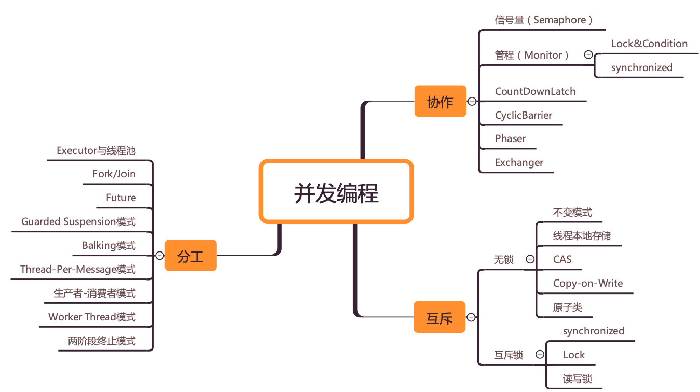
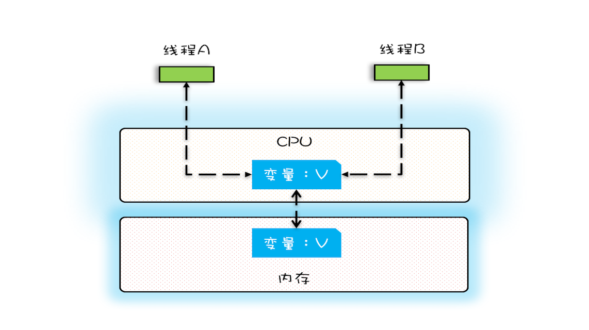
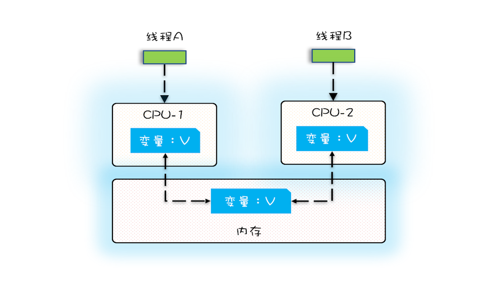
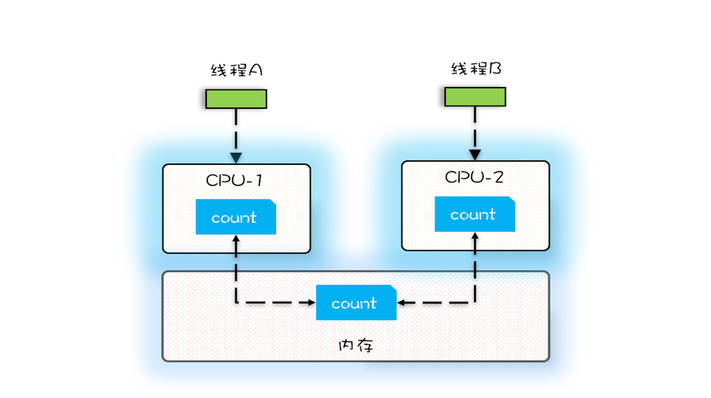
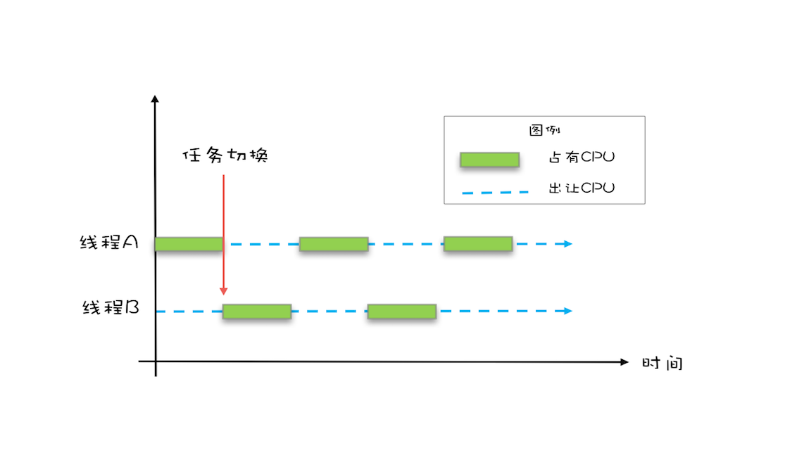
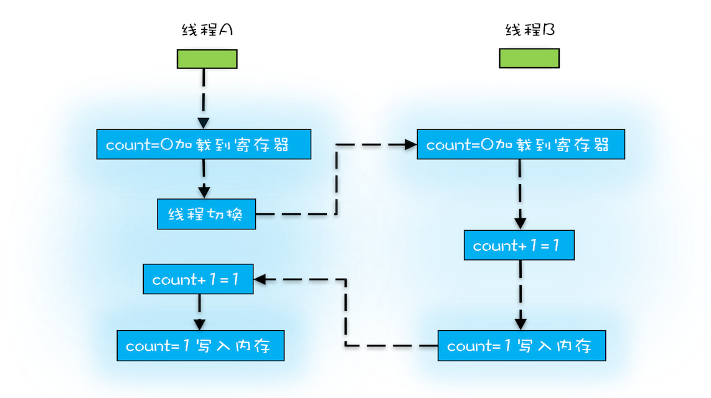
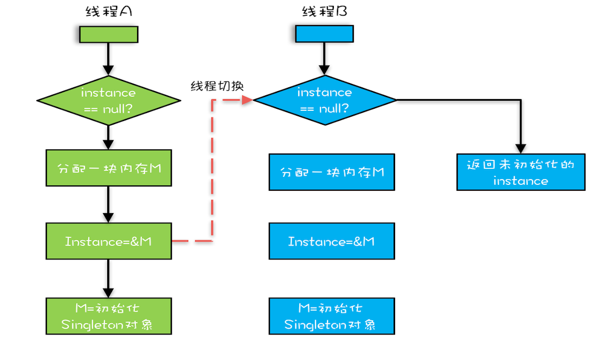

## 可见性、原子性和有序性问题：并发编程Bug的源头




### 源头之一：缓存导致的可见性问题

在单核时代，所有的线程都是在一颗 CPU 上执行，CPU 缓存与内存的数据一致性容易解决。因为所有线程都是操作同一个 CPU 的缓存，一个线程对缓存的写，对另外一个线程来说一定是可见的。例如在下面的图中，线程 A 和线程 B 都是操作同一个 CPU 里面的缓存，所以线程 A 更新了变量 V 的值，那么线程 B 之后再访问变量 V，得到的一定是 V 的最新值（线程 A 写过的值）。



​																					*CPU 缓存与内存的关系图*

一个线程对共享变量的修改，另外一个线程能够立刻看到，我们称为**可见性**。

多核时代，每颗 CPU 都有自己的缓存，这时 CPU 缓存与内存的数据一致性就没那么容易解决了，当多个线程在不同的 CPU 上执行时，这些线程操作的是不同的 CPU 缓存。比如下图中，线程 A 操作的是 CPU-1 上的缓存，而线程 B 操作的是 CPU-2 上的缓存，很明显，这个时候线程 A 对变量 V 的操作对于线程 B 而言就不具备可见性了。这个就属于硬件程序员给软件程序员挖的“坑”。



​																				*多核 CPU 的缓存与内存关系图*

下面我们再用一段代码来验证一下多核场景下的可见性问题。下面的代码，每执行一次 add10K() 方法，都会循环 10000 次 count+=1 操作。在 calc() 方法中我们创建了两个线程，每个线程调用一次 add10K() 方法，我们来想一想执行 calc() 方法得到的结果应该是多少呢？

```java
public class Test {
  private long count = 0;
  private void add10K() {
    int idx = 0;
    while(idx++ < 10000) {
      count += 1;
    }
  }
  public static long calc() {
    final Test test = new Test();
    // 创建两个线程，执行 add() 操作
    Thread th1 = new Thread(()->{
      test.add10K();
    });
    Thread th2 = new Thread(()->{
      test.add10K();
    });
    // 启动两个线程
    th1.start();
    th2.start();
    // 等待两个线程执行结束
    th1.join();
    th2.join();
    return count;
  }
}
```

直觉告诉我们应该是 20000，因为在单线程里调用两次 add10K() 方法，count 的值就是 20000，但实际上 calc() 的执行结果是个 10000 到 20000 之间的随机数。为什么呢？

我们假设线程 A 和线程 B 同时开始执行，那么第一次都会将 count=0 读到各自的 CPU 缓存里，执行完 count+=1 之后，各自 CPU 缓存里的值都是 1，同时写入内存后，我们会发现内存中是 1，而不是我们期望的 2。之后由于各自的 CPU 缓存里都有了 count 的值，两个线程都是基于 CPU 缓存里的 count 值来计算，所以导致最终 count 的值都是小于 20000 的。这就是缓存的可见性问题。

循环 10000 次 count+=1 操作如果改为循环 1 亿次，你会发现效果更明显，最终 count 的值接近 1 亿，而不是 2 亿。如果循环 10000 次，count 的值接近 20000，原因是两个线程不是同时启动的，有一个时差。



​																		*变量 count 在 CPU 缓存和内存的分布图*


### 源头之二：线程切换带来的原子性问题

由于 IO 太慢，早期的操作系统就发明了多进程，即便在单核的 CPU 上我们也可以一边听着歌，一边写 Bug，这个就是多进程的功劳。

操作系统允许某个进程执行一小段时间，例如 50 毫秒，过了 50 毫秒操作系统就会重新选择一个进程来执行（我们称为“任务切换”），这个 50 毫秒称为“**时间片**”。



​																			*线程切换示意图*

在一个时间片内，如果一个进程进行一个 IO 操作，例如读个文件，这个时候该进程可以把自己标记为“休眠状态”并出让 CPU 的使用权，待文件读进内存，操作系统会把这个休眠的进程唤醒，唤醒后的进程就有机会重新获得 CPU 的使用权了。

这里的进程在等待 IO 时之所以会释放 CPU 使用权，是为了让 CPU 在这段等待时间里可以做别的事情，这样一来 CPU 的使用率就上来了；此外，如果这时有另外一个进程也读文件，读文件的操作就会排队，磁盘驱动在完成一个进程的读操作后，发现有排队的任务，就会立即启动下一个读操作，这样 IO 的使用率也上来了。


是不是很简单的逻辑？但是，虽然看似简单，支持多进程分时复用在操作系统的发展史上却具有里程碑意义，Unix 就是因为解决了这个问题而名噪天下的。

早期的操作系统基于进程来调度 CPU，不同进程间是不共享内存空间的，所以进程要做任务切换就要切换内存映射地址，而一个进程创建的所有线程，都是共享一个内存空间的，所以线程做任务切换成本就很低了。现代的操作系统都基于更轻量的线程来调度，现在我们提到的“任务切换”都是指“线程切换”。

Java 并发程序都是基于多线程的，自然涉及到任务切换，也许你想不到，任务切换竟然也是并发编程里诡异 Bug 的源头之一。任务切换的时机大多数是在时间片结束的时候，我们现在基本都是使用高级语言编程，高级语言里一条语句往往需要多条CPU指令完成，例如上面代码中的`count += 1`，至少需要三条 CPU 指令。

- 指令 1：首先，需要把变量 count 从内存加载到 CPU 的寄存器；
- 指令 2：之后，在寄存器中执行 +1 操作；
- 指令 3：最后，将结果写入内存（缓存机制导致可能写入的是 CPU 缓存而不是内存）。

操作系统做任务切换，可以发生在任何一条CPU指令执行完，是的，是CPU 指令，而不是高级语言里的一条语句。对于上面的三条指令来说，我们假设 count=0，如果线程 A 在指令 1 执行完后做线程切换，线程 A 和线程 B 按照下图的序列执行，那么我们会发现两个线程都执行了 count+=1 的操作，但是得到的结果不是我们期望的 2，而是 1。



​																					*非原子操作的执行路径示意图*

我们潜意识里面觉得 count+=1 这个操作是一个不可分割的整体，就像一个原子一样，线程的切换可以发生在 count+=1 之前，也可以发生在 count+=1 之后，但就是不会发生在中间。**我们把一个或者多个操作在 CPU 执行的过程中不被中断的特性称为原子性**。CPU 能保证的原子操作是 CPU 指令级别的，而不是高级语言的操作符，这是违背我们直觉的地方。因此，很多时候我们需要在高级语言层面保证操作的原子性。

### 源头之三：编译优化带来的有序性问题

那并发编程里还有没有其他有违直觉容易导致诡异 Bug 的技术呢？有的，就是有序性。顾名思义，有序性指的是程序按照代码的先后顺序执行。编译器为了优化性能，有时候会改变程序中语句的先后顺序，例如程序中：“a=6；b=7；”编译器优化后可能变成“b=7；a=6；”，在这个例子中，编译器调整了语句的顺序，但是不影响程序的最终结果。不过有时候编译器及解释器的优化可能导致意想不到的 Bug。

在 Java 领域一个经典的案例就是利用双重检查创建单例对象，例如下面的代码：在获取实例 getInstance() 的方法中，我们首先判断 instance 是否为空，如果为空，则锁定 Singleton.class 并再次检查 instance 是否为空，如果还为空则创建 Singleton 的一个实例。

```java
public class Singleton {
  static Singleton instance;
  static Singleton getInstance(){
    if (instance == null) {
      synchronized(Singleton.class) {
        if (instance == null)
          instance = new Singleton();
        }
    }
    return instance;
  }
}
```

假设有两个线程 A、B 同时调用 getInstance() 方法，他们会同时发现 `instance == null` ，于是同时对 Singleton.class 加锁，此时 JVM 保证只有一个线程能够加锁成功（假设是线程 A），另外一个线程则会处于等待状态（假设是线程 B）；线程 A 会创建一个 Singleton 实例，之后释放锁，锁释放后，线程 B 被唤醒，线程 B 再次尝试加锁，此时是可以加锁成功的，加锁成功后，线程 B 检查 `instance == null` 时会发现，已经创建过 Singleton 实例了，所以线程 B 不会再创建一个 Singleton 实例。

这看上去一切都很完美，无懈可击，但实际上这个 getInstance()方法并不完美。问题出在哪？出在new 操作上，我们以为的 new 操作应该是：

1. 分配一块内存 M；
2. 在内存 M 上初始化 Singleton 对象；
3. 然后 M 的地址赋值给 instance 变量。

但是实际上优化后的执行路径却是这样的：

1. 分配一块内存 M；
2. 将 M 的地址赋值给 instance 变量；
3. 最后在内存 M 上初始化 Singleton 对象。

优化后会导致什么问题呢？我们假设线程 A 先执行 getInstance() 方法，当执行完指令 2 时恰好发生了线程切换，切换到了线程 B 上；如果此时线程 B 也执行 getInstance() 方法，那么线程 B 在执行第一个判断时会发现 `instance != null` ，所以直接返回 instance，而此时的 instance 是没有初始化过的，如果我们这个时候访问 instance 的成员变量就可能触发空指针异常。




​													*双重检查创建单例的异常执行路径*

### 总结

在介绍可见性、原子性、有序性的时候，特意提到**缓存**导致的可见性问题，**线程切换**带来的原子性问题，**编译优化**带来的有序性问题，其实缓存、线程、编译优化的目的和我们写并发程序的目的是相同的，都是提高程序性能。但是技术在解决一个问题的同时，必然会带来另外一个问题，所以**在采用一项技术的同时，一定要清楚它带来的问题是什么，以及如何规避**。


