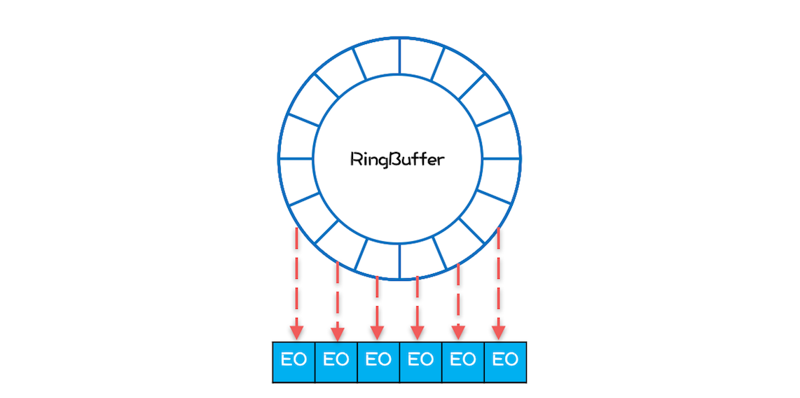
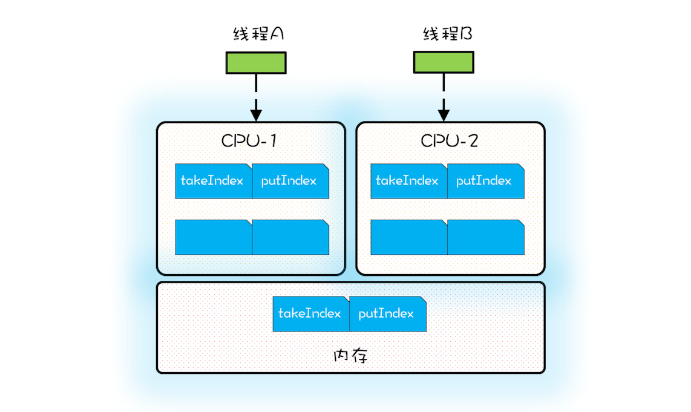
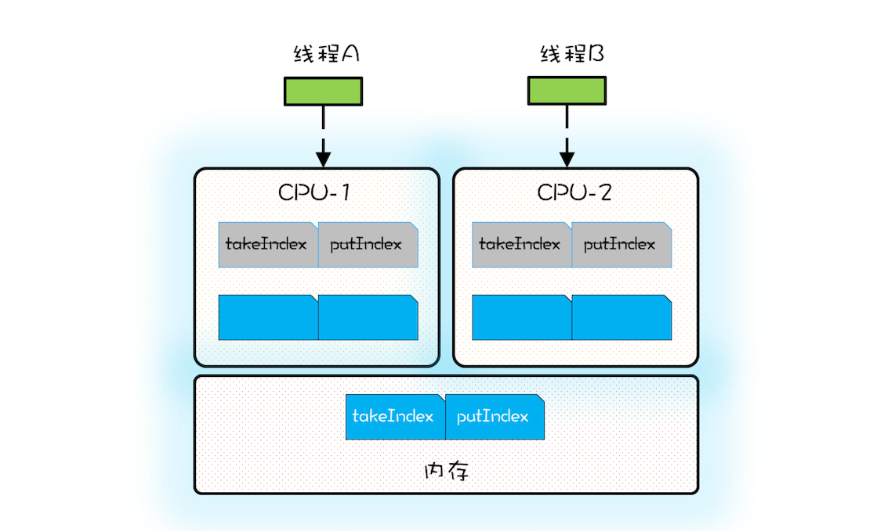

## 案例分析（三）：高性能队列Disruptor

我们在[《20 | 并发容器：都有哪些“坑”需要我们填？》](https://time.geekbang.org/column/article/90201)介绍过 Java SDK 提供了 2 个有界队列：ArrayBlockingQueue 和 LinkedBlockingQueue，它们都是基于 ReentrantLock 实现的，在高并发场景下，锁的效率并不高，那有没有更好的替代品呢？有，今天我们就介绍一种性能更高的有界队列：Disruptor。

**Disruptor 是一款高性能的有界内存队列**，目前应用非常广泛，Log4j2、Spring Messaging、HBase、Storm 都用到了 Disruptor，那 Disruptor 的性能为什么这么高呢？Disruptor 项目团队曾经写过一篇论文，详细解释了其原因，可以总结为如下：

1. 内存分配更加合理，使用 RingBuffer 数据结构，数组元素在初始化时一次性全部创建，提升缓存命中率；对象循环利用，避免频繁 GC。
2. 能够避免伪共享，提升缓存利用率。
3. 采用无锁算法，避免频繁加锁、解锁的性能消耗。
4. 支持批量消费，消费者可以无锁方式消费多个消息。

其中，前三点涉及到的知识比较多，所以今天咱们重点讲解前三点，不过在详细介绍这些知识之前，我们先来聊聊 Disruptor 如何使用，好让你先对 Disruptor 有个感官的认识。

下面的代码出自官方示例，我略做了一些修改，相较而言，Disruptor 的使用比 Java SDK 提供 BlockingQueue 要复杂一些，但是总体思路还是一致的，其大致情况如下：

- 在 Disruptor 中，生产者生产的对象（也就是消费者消费的对象）称为 Event，使用 Disruptor 必须自定义 Event，例如示例代码的自定义 Event 是 LongEvent；
- 构建 Disruptor 对象除了要指定队列大小外，还需要传入一个 EventFactory，示例代码中传入的是`LongEvent::new`；
- 消费 Disruptor 中的 Event 需要通过 handleEventsWith() 方法注册一个事件处理器，发布 Event 则需要通过 publishEvent() 方法。

```java
// 自定义 Event
class LongEvent {
  private long value;
  public void set(long value) {
    this.value = value;
  }
}
// 指定 RingBuffer 大小,
// 必须是 2 的 N 次方
int bufferSize = 1024;
 
// 构建 Disruptor
Disruptor<LongEvent> disruptor 
  = new Disruptor<>(
    LongEvent::new,
    bufferSize,
    DaemonThreadFactory.INSTANCE);
 
// 注册事件处理器
disruptor.handleEventsWith(
  (event, sequence, endOfBatch) ->
    System.out.println("E: "+event));
 
// 启动 Disruptor
disruptor.start();
 
// 获取 RingBuffer
RingBuffer<LongEvent> ringBuffer 
  = disruptor.getRingBuffer();
// 生产 Event
ByteBuffer bb = ByteBuffer.allocate(8);
for (long l = 0; true; l++){
  bb.putLong(0, l);
  // 生产者生产消息
  ringBuffer.publishEvent(
    (event, sequence, buffer) -> 
      event.set(buffer.getLong(0)), bb);
  Thread.sleep(1000);
}

```

### RingBuffer 如何提升性能

Java SDK 中 ArrayBlockingQueue 使用**数组**作为底层的数据存储，而 Disruptor 是使用**RingBuffer**作为数据存储。RingBuffer 本质上也是数组，所以仅仅将数据存储从数组换成 RingBuffer 并不能提升性能，但是 Disruptor 在 RingBuffer 的基础上还做了很多优化，其中一项优化就是和内存分配有关的。

在介绍这项优化之前，你需要先了解一下程序的局部性原理。简单来讲，**程序的局部性原理指的是在一段时间内程序的执行会限定在一个局部范围内**。这里的“局部性”可以从两个方面来理解，一个是时间局部性，另一个是空间局部性。**时间局部性**指的是程序中的某条指令一旦被执行，不久之后这条指令很可能再次被执行；如果某条数据被访问，不久之后这条数据很可能再次被访问。而**空间局部性**是指某块内存一旦被访问，不久之后这块内存附近的内存也很可能被访问。

CPU 的缓存就利用了程序的局部性原理：CPU 从内存中加载数据 X 时，会将数据 X 缓存在高速缓存 Cache 中，实际上 CPU 缓存 X 的同时，还缓存了 X 周围的数据，因为根据程序具备局部性原理，X 周围的数据也很有可能被访问。从另外一个角度来看，如果程序能够很好地体现出局部性原理，也就能更好地利用 CPU 的缓存，从而提升程序的性能。Disruptor 在设计 RingBuffer 的时候就充分考虑了这个问题，下面我们就对比着 ArrayBlockingQueue 来分析一下。

首先是 ArrayBlockingQueue。生产者线程向 ArrayBlockingQueue 增加一个元素，每次增加元素 E 之前，都需要创建一个对象 E，如下图所示，ArrayBlockingQueue 内部有 6 个元素，这 6 个元素都是由生产者线程创建的，由于创建这些元素的时间基本上是离散的，所以这些元素的内存地址大概率也不是连续的。


​																		*ArrayBlockingQueue 内部结构图*

下面我们再看看 Disruptor 是如何处理的。Disruptor 内部的 RingBuffer 也是用数组实现的，但是这个数组中的所有元素在初始化时是一次性全部创建的，所以这些元素的内存地址大概率是连续的，相关的代码如下所示。

```java
for (int i=0; i<bufferSize; i++){
  //entries[] 就是 RingBuffer 内部的数组
  //eventFactory 就是前面示例代码中传入的 LongEvent::new
  entries[BUFFER_PAD + i] 
    = eventFactory.newInstance();
}
```

Disruptor 内部 RingBuffer 的结构可以简化成下图，那问题来了，数组中所有元素内存地址连续能提升性能吗？能！为什么呢？因为消费者线程在消费的时候，是遵循空间局部性原理的，消费完第 1 个元素，很快就会消费第 2 个元素；当消费第 1 个元素 E1 的时候，CPU 会把内存中 E1 后面的数据也加载进 Cache，如果 E1 和 E2 在内存中的地址是连续的，那么 E2 也就会被加载进 Cache 中，然后当消费第 2 个元素的时候，由于 E2 已经在 Cache 中了，所以就不需要从内存中加载了，这样就能大大提升性能。



​																				*Disruptor 内部 RingBuffer 结构图*

除此之外，在 Disruptor 中，生产者线程通过 publishEvent() 发布 Event 的时候，并不是创建一个新的 Event，而是通过 event.set() 方法修改 Event， 也就是说 RingBuffer 创建的 Event 是可以循环利用的，这样还能避免频繁创建、删除 Event 导致的频繁 GC 问题。

### 如何避免“伪共享”

高效利用 Cache，能够大大提升性能，所以要努力构建能够高效利用 Cache 的内存结构。而从另外一个角度看，努力避免不能高效利用 Cache 的内存结构也同样重要。

有一种叫做“伪共享（False sharing）”的内存布局就会使 Cache 失效，那什么是“伪共享”呢？

伪共享和 CPU 内部的 Cache 有关，Cache 内部是按照缓存行（Cache Line）管理的，缓存行的大小通常是 64 个字节；CPU 从内存中加载数据 X，会同时加载 X 后面（64-size(X)）个字节的数据。下面的示例代码出自 Java SDK 的 ArrayBlockingQueue，其内部维护了 4 个成员变量，分别是队列数组 items、出队索引 takeIndex、入队索引 putIndex 以及队列中的元素总数 count。

```java
/** 队列数组 */
final Object[] items;
/** 出队索引 */
int takeIndex;
/** 入队索引 */
int putIndex;
/** 队列中元素总数 */
int count;
```

当 CPU 从内存中加载 takeIndex 的时候，会同时将 putIndex 以及 count 都加载进 Cache。下图是某个时刻 CPU 中 Cache 的状况，为了简化，缓存行中我们仅列出了 takeIndex 和 putIndex。



​																	             *CPU 缓存示意图*

假设线程 A 运行在 CPU-1 上，执行入队操作，入队操作会修改 putIndex，而修改 putIndex 会导致其所在的所有核上的缓存行均失效；此时假设运行在 CPU-2 上的线程执行出队操作，出队操作需要读取 takeIndex，由于 takeIndex 所在的缓存行已经失效，所以 CPU-2 必须从内存中重新读取。入队操作本不会修改 takeIndex，但是由于 takeIndex 和 putIndex 共享的是一个缓存行，就导致出队操作不能很好地利用 Cache，这其实就是**伪共享**。简单来讲，**伪共享指的是由于共享缓存行导致缓存无效的场景**。

ArrayBlockingQueue 的入队和出队操作是用锁来保证互斥的，所以入队和出队不会同时发生。如果允许入队和出队同时发生，那就会导致线程 A 和线程 B 争用同一个缓存行，这样也会导致性能问题。所以为了更好地利用缓存，我们必须避免伪共享，那如何避免呢？



​																				*CPU 缓存失效示意图*

方案很简单，**每个变量独占一个缓存行、不共享缓存行**就可以了，具体技术是**缓存行填充**。比如想让 takeIndex 独占一个缓存行，可以在 takeIndex 的前后各填充 56 个字节，这样就一定能保证 takeIndex 独占一个缓存行。下面的示例代码出自 Disruptor，Sequence 对象中的 value 属性就能避免伪共享，因为这个属性前后都填充了 56 个字节。Disruptor 中很多对象，例如 RingBuffer、RingBuffer 内部的数组都用到了这种填充技术来避免伪共享。

```java
// 前：填充 56 字节
class LhsPadding{
    long p1, p2, p3, p4, p5, p6, p7;
}
class Value extends LhsPadding{
    volatile long value;
}
// 后：填充 56 字节
class RhsPadding extends Value{
    long p9, p10, p11, p12, p13, p14, p15;
}
class Sequence extends RhsPadding{
  // 省略实现
}
```

### Disruptor 中的无锁算法

ArrayBlockingQueue 是利用管程实现的，中规中矩，生产、消费操作都需要加锁，实现起来简单，但是性能并不十分理想。Disruptor 采用的是无锁算法，很复杂，但是核心无非是生产和消费两个操作。Disruptor 中最复杂的是入队操作，所以我们重点来看看入队操作是如何实现的。

对于入队操作，最关键的要求是不能覆盖没有消费的元素；对于出队操作，最关键的要求是不能读取没有写入的元素，所以 Disruptor 中也一定会维护类似出队索引和入队索引这样两个关键变量。Disruptor 中的 RingBuffer 维护了入队索引，但是并没有维护出队索引，这是因为在 Disruptor 中多个消费者可以同时消费，每个消费者都会有一个出队索引，所以 RingBuffer 的出队索引是所有消费者里面最小的那一个。

下面是 Disruptor 生产者入队操作的核心代码，看上去很复杂，其实逻辑很简单：如果没有足够的空余位置，就出让 CPU 使用权，然后重新计算；反之则用 CAS 设置入队索引。

```java
// 生产者获取 n 个写入位置
do {
  //cursor 类似于入队索引，指的是上次生产到这里
  current = cursor.get();
  // 目标是在生产 n 个
  next = current + n;
  // 减掉一个循环
  long wrapPoint = next - bufferSize;
  // 获取上一次的最小消费位置
  long cachedGatingSequence = gatingSequenceCache.get();
  // 没有足够的空余位置
  if (wrapPoint>cachedGatingSequence || cachedGatingSequence>current){
    // 重新计算所有消费者里面的最小值位置
    long gatingSequence = Util.getMinimumSequence(
        gatingSequences, current);
    // 仍然没有足够的空余位置，出让 CPU 使用权，重新执行下一循环
    if (wrapPoint > gatingSequence){
      LockSupport.parkNanos(1);
      continue;
    }
    // 从新设置上一次的最小消费位置
    gatingSequenceCache.set(gatingSequence);
  } else if (cursor.compareAndSet(current, next)){
    // 获取写入位置成功，跳出循环
    break;
  }
} while (true);
```

### 总结

Disruptor 在优化并发性能方面可谓是做到了极致，优化的思路大体是两个方面，一个是利用无锁算法避免锁的争用，另外一个则是将硬件（CPU）的性能发挥到极致。尤其是后者，在 Java 领域基本上属于经典之作了。

发挥硬件的能力一般是 C 这种面向硬件的语言常干的事儿，C 语言领域经常通过调整内存布局优化内存占用，而 Java 领域则用的很少，原因在于 Java 可以智能地优化内存布局，内存布局对 Java 程序员的透明的。这种智能的优化大部分场景是很友好的，但是如果你想通过填充方式避免伪共享就必须绕过这种优化，关于这方面 Disruptor 提供了经典的实现，你可以参考。

由于伪共享问题如此重要，所以 Java 也开始重视它了，比如 Java 8 中，提供了避免伪共享的注解：@sun.misc.Contended，通过这个注解就能轻松避免伪共享（需要设置 JVM 参数 -XX:-RestrictContended）。不过避免伪共享是以牺牲内存为代价的，所以具体使用的时候还是需要仔细斟酌。

