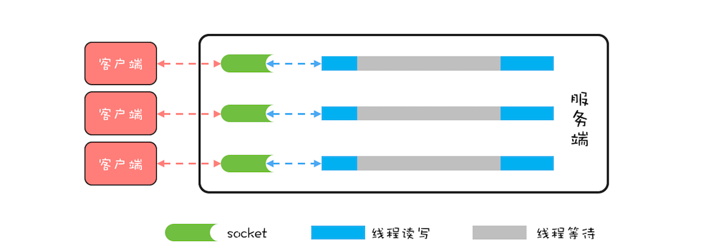
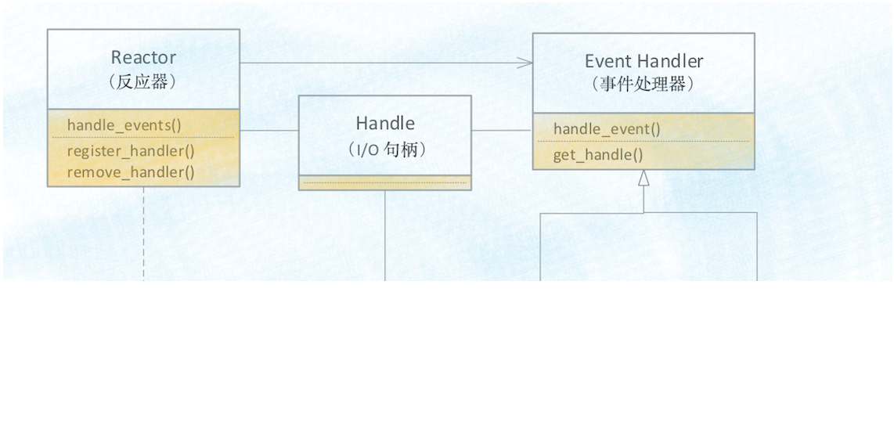

##  案例分析（二）：高性能网络应用框架Netty

Netty 是一个高性能网络应用框架，应用非常普遍，目前在 Java 领域里，Netty 基本上成为网络程序的标配了。Netty 框架功能丰富，也非常复杂，今天我们主要分析 Netty 框架中的线程模型，而**线程模型直接影响着网络程序的性能**。

在介绍 Netty 的线程模型之前，我们首先需要把问题搞清楚，了解网络编程性能的瓶颈在哪里，然后再看 Netty 的线程模型是如何解决这个问题的。

### 网络编程性能的瓶颈

在[《32 | Balking 模式：再谈线程安全的单例模式》](https://time.geekbang.org/column/article/94604)中，我们写过一个简单的网络程序 echo，采用的是阻塞式 I/O（BIO）。BIO 模型里，所有 read() 操作和 write() 操作都会阻塞当前线程的，如果客户端已经和服务端建立了一个连接，而迟迟不发送数据，那么服务端的 read() 操作会一直阻塞，所以**使用 BIO 模型，一般都会为每个 socket 分配一个独立的线程**，这样就不会因为线程阻塞在一个 socket 上而影响对其他 socket 的读写。BIO 的线程模型如下图所示，每一个 socket 都对应一个独立的线程；为了避免频繁创建、消耗线程，可以采用线程池，但是 socket 和线程之间的对应关系并不会变化。



​																						*BIO 的线程模型*

BIO 这种线程模型适用于 socket 连接不是很多的场景；但是现在的互联网场景，往往需要服务器能够支撑十万甚至百万连接，而创建十万甚至上百万个线程显然并不现实，所以 BIO 线程模型无法解决百万连接的问题。如果仔细观察，你会发现互联网场景中，虽然连接多，但是每个连接上的请求并不频繁，所以线程大部分时间都在等待 I/O 就绪。也就是说线程大部分时间都阻塞在那里，这完全是浪费，如果我们能够解决这个问题，那就不需要这么多线程了。

顺着这个思路，我们可以将线程模型优化为下图这个样子，可以用一个线程来处理多个连接，这样线程的利用率就上来了，同时所需的线程数量也跟着降下来了。这个思路很好，可是使用 BIO 相关的 API 是无法实现的，这是为什么呢？因为 BIO 相关的 socket 读写操作都是阻塞式的，而一旦调用了阻塞式 API，在 I/O 就绪前，调用线程会一直阻塞，也就无法处理其他的 socket 连接了。


​																							*理想的线程模型图*

好在 Java 里还提供了非阻塞式（NIO）API，**利用非阻塞式 API 就能够实现一个线程处理多个连接了**。那具体如何实现呢？现在普遍都是**采用 Reactor 模式**，包括 Netty 的实现。所以，要想理解 Netty 的实现，接下来我们就需要先了解一下 Reactor 模式。

### Reactor 模式

下面是 Reactor 模式的类结构图，其中 Handle 指的是 I/O 句柄，在 Java 网络编程里，它本质上就是一个网络连接。Event Handler 很容易理解，就是一个事件处理器，其中 handle_event() 方法处理 I/O 事件，也就是每个 Event Handler 处理一个 I/O Handle；get_handle() 方法可以返回这个 I/O 的 Handle。Synchronous Event Demultiplexer 可以理解为操作系统提供的 I/O 多路复用 API，例如 POSIX 标准里的 select() 以及 Linux 里面的 epoll()。



​																				*Reactor 模式类结构图*

Reactor 模式的核心自然是**Reactor 这个类**，其中 register_handler() 和 remove_handler() 这两个方法可以注册和删除一个事件处理器；**handle_events() 方式是核心**，也是 Reactor 模式的发动机，这个方法的核心逻辑如下：首先通过同步事件多路选择器提供的 select() 方法监听网络事件，当有网络事件就绪后，就遍历事件处理器来处理该网络事件。由于网络事件是源源不断的，所以在主程序中启动 Reactor 模式，需要以 `while(true){}` 的方式调用 handle_events() 方法。

```java
void Reactor::handle_events(){
  // 通过同步事件多路选择器提供的
  //select() 方法监听网络事件
  select(handlers);
  // 处理网络事件
  for(h in handlers){
    h.handle_event();
  }
}
// 在主程序中启动事件循环
while (true) {
  handle_events();
```

### Netty 中的线程模型

Netty 的实现虽然参考了 Reactor 模式，但是并没有完全照搬，**Netty 中最核心的概念是事件循环（EventLoop）**，其实也就是 Reactor 模式中的 Reactor，**负责监听网络事件并调用事件处理器进行处理**。在 4.x 版本的 Netty 中，网络连接和 EventLoop 是稳定的多对 1 关系，而 EventLoop 和 Java 线程是 1 对 1 关系，这里的稳定指的是关系一旦确定就不再发生变化。也就是说一个网络连接只会对应唯一的一个 EventLoop，而一个 EventLoop 也只会对应到一个 Java 线程，所以**一个网络连接只会对应到一个 Java 线程**。

一个网络连接对应到一个 Java 线程上，有什么好处呢？最大的好处就是对于一个网络连接的事件处理是单线程的，这样就**避免了各种并发问题**。

Netty 中的线程模型可以参考下图，这个图和前面我们提到的理想的线程模型图非常相似，核心目标都是用一个线程处理多个网络连接。


​																				*Netty 中的线程模型*

Netty 中还有一个核心概念是**EventLoopGroup**，顾名思义，一个 EventLoopGroup 由一组 EventLoop 组成。实际使用中，一般都会创建两个 EventLoopGroup，一个称为 bossGroup，一个称为 workerGroup。为什么会有两个 EventLoopGroup 呢？

这个和 socket 处理网络请求的机制有关，socket 处理 TCP 网络连接请求，是在一个独立的 socket 中，每当有一个 TCP 连接成功建立，都会创建一个新的 socket，之后对 TCP 连接的读写都是由新创建处理的 socket 完成的。也就是说**处理 TCP 连接请求和读写请求是通过两个不同的 socket 完成的**。上面我们在讨论网络请求的时候，为了简化模型，只是讨论了读写请求，而没有讨论连接请求。

**在 Netty 中，bossGroup 就用来处理连接请求的，而 workerGroup 是用来处理读写请求的**。bossGroup 处理完连接请求后，会将这个连接提交给 workerGroup 来处理， workerGroup 里面有多个 EventLoop，那新的连接会交给哪个 EventLoop 来处理呢？这就需要一个负载均衡算法，Netty 中目前使用的是**轮询算法**

下面我们用 Netty 重新实现以下 echo 程序的服务端，近距离感受一下 Netty。

### 用 Netty 实现 Echo 程序服务端

下面的示例代码基于 Netty 实现了 echo 程序服务端：首先创建了一个事件处理器（等同于 Reactor 模式中的事件处理器），然后创建了 bossGroup 和 workerGroup，再之后创建并初始化了 ServerBootstrap，代码还是很简单的，不过有两个地方需要注意一下。

第一个，如果 NettybossGroup 只监听一个端口，那 bossGroup 只需要 1 个 EventLoop 就可以了，多了纯属浪费。

第二个，默认情况下，Netty 会创建“2*CPU 核数”个 EventLoop，由于网络连接与 EventLoop 有稳定的关系，所以事件处理器在处理网络事件的时候是不能有阻塞操作的，否则很容易导致请求大面积超时。如果实在无法避免使用阻塞操作，那可以通过线程池来异步处理。

### 总结

Netty 是一个款优秀的网络编程框架，性能非常好，为了实现高性能的目标，Netty 做了很多优化，例如优化了 ByteBuffer、支持零拷贝等等，和并发编程相关的就是它的线程模型了。Netty 的线程模型设计得很精巧，每个网络连接都关联到了一个线程上，这样做的好处是：对于一个网络连接，读写操作都是单线程执行的，从而避免了并发程序的各种问题。

你要想深入理解 Netty 的线程模型，还需要对网络相关知识有一定的理解，关于 Java IO 的演进过程，你可以参考[Scalable IO in Java](http://gee.cs.oswego.edu/dl/cpjslides/nio.pdf)，至于 TCP/IP 网络编程的知识你可以参考韩国尹圣雨写的经典教程——《TCP/IP 网络编程》。