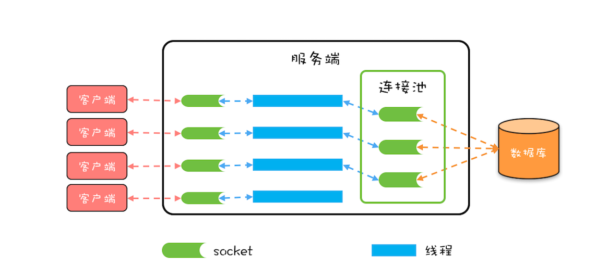

## 案例分析（四）：高性能数据库连接池HiKariCP

实际工作中，我们总会难免和数据库打交道；只要和数据库打交道，就免不了使用数据库连接池。业界知名的数据库连接池有不少，例如 c3p0、DBCP、Tomcat JDBC Connection Pool、Druid 等，不过最近最火的是 HiKariCP。

**HiKariCP 号称是业界跑得最快的数据库连接池**，这两年发展得顺风顺水，尤其是 Springboot 2.0 将其作为**默认数据库连接池**后，江湖一哥的地位已是毋庸置疑了。那它为什么那么快呢？今天咱们就重点聊聊这个话题。

### 什么是数据库连接池

在详细分析 HiKariCP 高性能之前，我们有必要先简单介绍一下什么是数据库连接池。本质上，数据库连接池和线程池一样，都属于池化资源，作用都是避免重量级资源的频繁创建和销毁，对于数据库连接池来说，也就是避免数据库连接频繁创建和销毁。如下图所示，服务端会在运行期持有一定数量的数据库连接，当需要执行 SQL 时，并不是直接创建一个数据库连接，而是从连接池中获取一个；当 SQL 执行完，也并不是将数据库连接真的关掉，而是将其归还到连接池中。



​																									*数据库连接池示意图*

在实际工作中，我们都是使用各种持久化框架来完成数据库的增删改查，基本上不会直接和数据库连接池打交道，为了能让你更好地理解数据库连接池的工作原理，下面的示例代码并没有使用任何框架，而是原生地使用 HiKariCP。执行数据库操作基本上是一系列规范化的步骤：

1. 通过数据源获取一个数据库连接；
2. 创建 Statement；
3. 执行 SQL；
4. 通过 ResultSet 获取 SQL 执行结果；
5. 释放 ResultSet；
6. 释放 Statement；
7. 释放数据库连接。

下面的示例代码，通过 `ds.getConnection()` 获取一个数据库连接时，其实是向数据库连接池申请一个数据库连接，而不是创建一个新的数据库连接。同样，通过 `conn.close()` 释放一个数据库连接时，也不是直接将连接关闭，而是将连接归还给数据库连接池。

```java
// 数据库连接池配置
HikariConfig config = new HikariConfig();
config.setMinimumIdle(1);
config.setMaximumPoolSize(2);
config.setConnectionTestQuery("SELECT 1");
config.setDataSourceClassName("org.h2.jdbcx.JdbcDataSource");
config.addDataSourceProperty("url", "jdbc:h2:mem:test");
// 创建数据源
DataSource ds = new HikariDataSource(config);
Connection conn = null;
Statement stmt = null;
ResultSet rs = null;
try {
  // 获取数据库连接
  conn = ds.getConnection();
  // 创建 Statement 
  stmt = conn.createStatement();
  // 执行 SQL
  rs = stmt.executeQuery("select * from abc");
  // 获取结果
  while (rs.next()) {
    int id = rs.getInt(1);
    ......
  }
} catch(Exception e) {
   e.printStackTrace();
} finally {
  // 关闭 ResultSet
  close(rs);
  // 关闭 Statement 
  close(stmt);
  // 关闭 Connection
  close(conn);
}
// 关闭资源
void close(AutoCloseable rs) {
  if (rs != null) {
    try {
      rs.close();
    } catch (SQLException e) {
      e.printStackTrace();
    }
  }
}
```

[HiKariCP 官方网站](https://github.com/brettwooldridge/HikariCP/wiki/Down-the-Rabbit-Hole)解释了其性能之所以如此之高的秘密。微观上 HiKariCP 程序编译出的字节码执行效率更高，站在字节码的角度去优化 Java 代码，HiKariCP 的作者对性能的执着可见一斑，不过遗憾的是他并没有详细解释都做了哪些优化。而宏观上主要是和两个数据结构有关，一个是 FastList，另一个是 ConcurrentBag。下面我们来看看它们是如何提升 HiKariCP 的性能的。

### FastList 解决了哪些性能问题

按照规范步骤，执行完数据库操作之后，需要依次关闭 ResultSet、Statement、Connection，但是总有粗心的同学只是关闭了 Connection，而忘了关闭 ResultSet 和 Statement。为了解决这种问题，最好的办法是当关闭 Connection 时，能够自动关闭 Statement。为了达到这个目标，Connection 就需要跟踪创建的 Statement，最简单的办法就是将创建的 Statement 保存在数组 ArrayList 里，这样当关闭 Connection 的时候，就可以依次将数组中的所有 Statement 关闭。

HiKariCP 觉得用 ArrayList 还是太慢，当通过 `conn.createStatement()` 创建一个 Statement 时，需要调用 ArrayList 的 add() 方法加入到 ArrayList 中，这个是没有问题的；但是当通过 `stmt.close()` 关闭 Statement 的时候，需要调用 ArrayList 的 remove() 方法来将其从 ArrayList 中删除，这里是有优化余地的。

假设一个 Connection 依次创建 6 个 Statement，分别是 S1、S2、S3、S4、S5、S6，按照正常的编码习惯，关闭 Statement 的顺序一般是逆序的，关闭的顺序是：S6、S5、S4、S3、S2、S1，而 ArrayList 的 remove(Object o) 方法是顺序遍历查找，逆序删除而顺序查找，这样的查找效率就太慢了。如何优化呢？很简单，优化成逆序查找就可以了。


​																								*逆序删除示意图*

HiKariCP 中的 FastList 相对于 ArrayList 的一个优化点就是将 `remove(Object element)` 方法的**查找顺序变成了逆序查找**。除此之外，FastList 还有另一个优化点，是 `get(int index)` 方法没有对 index 参数进行越界检查，HiKariCP 能保证不会越界，所以不用每次都进行越界检查。

整体来看，FastList 的优化点还是很简单的。下面我们再来聊聊 HiKariCP 中的另外一个数据结构 ConcurrentBag，看看它又是如何提升性能的。


### ConcurrentBag 解决了哪些性能问题

如果让我们自己来实现一个数据库连接池，最简单的办法就是用两个阻塞队列来实现，一个用于保存空闲数据库连接的队列 idle，另一个用于保存忙碌数据库连接的队列 busy；获取连接时将空闲的数据库连接从 idle 队列移动到 busy 队列，而关闭连接时将数据库连接从 busy 移动到 idle。这种方案将并发问题委托给了阻塞队列，实现简单，但是性能并不是很理想。因为 Java SDK 中的阻塞队列是用锁实现的，而高并发场景下锁的争用对性能影响很大。

```java
// 忙碌队列
BlockingQueue<Connection> busy;
// 空闲队列
BlockingQueue<Connection> idle;

```

HiKariCP 并没有使用 Java SDK 中的阻塞队列，而是自己实现了一个叫做 ConcurrentBag 的并发容器。ConcurrentBag 的设计最初源自 C#，它的一个核心设计是使用 ThreadLocal 避免部分并发问题，不过 HiKariCP 中的 ConcurrentBag 并没有完全参考 C# 的实现，下面我们来看看它是如何实现的。

ConcurrentBag 中最关键的属性有 4 个，分别是：用于存储所有的数据库连接的共享队列 sharedList、线程本地存储 threadList、等待数据库连接的线程数 waiters 以及分配数据库连接的工具 handoffQueue。其中，handoffQueue 用的是 Java SDK 提供的 SynchronousQueue，SynchronousQueue 主要用于线程之间传递数据。

```java
// 用于存储所有的数据库连接
CopyOnWriteArrayList<T> sharedList;
// 线程本地存储中的数据库连接
ThreadLocal<List<Object>> threadList;
// 等待数据库连接的线程数
AtomicInteger waiters;
// 分配数据库连接的工具
SynchronousQueue<T> handoffQueue;
```

当线程池创建了一个数据库连接时，通过调用 ConcurrentBag 的 add() 方法加入到 ConcurrentBag 中，下面是 add() 方法的具体实现，逻辑很简单，就是将这个连接加入到共享队列 sharedList 中，如果此时有线程在等待数据库连接，那么就通过 handoffQueue 将这个连接分配给等待的线程。

```java
// 将空闲连接添加到队列
void add(final T bagEntry){
  // 加入共享队列
  sharedList.add(bagEntry);
  // 如果有等待连接的线程，
  // 则通过 handoffQueue 直接分配给等待的线程
  while (waiters.get() > 0 
    && bagEntry.getState() == STATE_NOT_IN_USE 
    && !handoffQueue.offer(bagEntry)) {
      yield();
  }
}
```

通过 ConcurrentBag 提供的 borrow() 方法，可以获取一个空闲的数据库连接，borrow() 的主要逻辑是：

1. 首先查看线程本地存储是否有空闲连接，如果有，则返回一个空闲的连接；
2. 如果线程本地存储中无空闲连接，则从共享队列中获取。
3. 如果共享队列中也没有空闲的连接，则请求线程需要等待。

需要注意的是，线程本地存储中的连接是可以被其他线程窃取的，所以需要用 CAS 方法防止重复分配。在共享队列中获取空闲连接，也采用了 CAS 方法防止重复分配。

```java
T borrow(long timeout, final TimeUnit timeUnit){
  // 先查看线程本地存储是否有空闲连接
  final List<Object> list = threadList.get();
  for (int i = list.size() - 1; i >= 0; i--) {
    final Object entry = list.remove(i);
    final T bagEntry = weakThreadLocals 
      ? ((WeakReference<T>) entry).get() 
      : (T) entry;
    // 线程本地存储中的连接也可以被窃取，
    // 所以需要用 CAS 方法防止重复分配
    if (bagEntry != null 
      && bagEntry.compareAndSet(STATE_NOT_IN_USE, STATE_IN_USE)) {
      return bagEntry;
    }
  }
 
  // 线程本地存储中无空闲连接，则从共享队列中获取
  final int waiting = waiters.incrementAndGet();
  try {
    for (T bagEntry : sharedList) {
      // 如果共享队列中有空闲连接，则返回
      if (bagEntry.compareAndSet(STATE_NOT_IN_USE, STATE_IN_USE)) {
        return bagEntry;
      }
    }
    // 共享队列中没有连接，则需要等待
    timeout = timeUnit.toNanos(timeout);
    do {
      final long start = currentTime();
      final T bagEntry = handoffQueue.poll(timeout, NANOSECONDS);
      if (bagEntry == null 
        || bagEntry.compareAndSet(STATE_NOT_IN_USE, STATE_IN_USE)) {
          return bagEntry;
      }
      // 重新计算等待时间
      timeout -= elapsedNanos(start);
    } while (timeout > 10_000);
    // 超时没有获取到连接，返回 null
    return null;
  } finally {
    waiters.decrementAndGet();
  }
}
```

释放连接需要调用 ConcurrentBag 提供的 requite() 方法，该方法的逻辑很简单，首先将数据库连接状态更改为 STATE_NOT_IN_USE，之后查看是否存在等待线程，如果有，则分配给等待线程；如果没有，则将该数据库连接保存到线程本地存储里。

```java
// 释放连接
void requite(final T bagEntry){
  // 更新连接状态
  bagEntry.setState(STATE_NOT_IN_USE);
  // 如果有等待的线程，则直接分配给线程，无需进入任何队列
  for (int i = 0; waiters.get() > 0; i++) {
    if (bagEntry.getState() != STATE_NOT_IN_USE 
      || handoffQueue.offer(bagEntry)) {
        return;
    } else if ((i & 0xff) == 0xff) {
      parkNanos(MICROSECONDS.toNanos(10));
    } else {
      yield();
    }
  }
  // 如果没有等待的线程，则进入线程本地存储
  final List<Object> threadLocalList = threadList.get();
  if (threadLocalList.size() < 50) {
    threadLocalList.add(weakThreadLocals 
      ? new WeakReference<>(bagEntry) 
      : bagEntry);
  }
}

```

### 总结

HiKariCP 中的 FastList 和 ConcurrentBag 这两个数据结构使用得非常巧妙，虽然实现起来并不复杂，但是对于性能的提升非常明显，根本原因在于这两个数据结构适用于数据库连接池这个特定的场景。FastList 适用于逆序删除场景；而 ConcurrentBag 通过 ThreadLocal 做一次预分配，避免直接竞争共享资源，非常适合池化资源的分配。

在实际工作中，我们遇到的并发问题千差万别，这时选择合适的并发数据结构就非常重要了。当然能选对的前提是对特定场景的并发特性有深入的了解，只有了解到无谓的性能消耗在哪里，才能对症下药。