# 记一次线程池引发的故障

## 背景

敖丙之前在工作中遇到一个问题，我定义了一个线程池来执行任务，但是程序执行结束后任务没有全部执行完，当时心态就差点崩了。

业务场景是这样的：由于统计业务需要，订单信息需要从主库中经过统计业务代码写入统计库（中间需要逻辑处理所以不能走binlog）。

由于代码质量及历史原因，目前的重新统计接口是单线程的，粗略算了算一共有100万条订单信息，每100条的处理大约是10秒，所以理论上处理完全部信息需要28个小时，这还不算因为 mysql 中 limit 分页导致的后期查询时间以及可能出现的内存溢出导致中止统计的情况。

基于上述的原因，以及最重要的一点：统计业务是根据订单所属的中心进行的，各个中心同时统计不会导致脏数据。

所以，我计划使用线程池，为每一个中心分配一条线程去执行统计业务。

## 业务实现

```java
// 线程工厂，用于为线程池中的每条线程命名
ThreadFactory namedThreadFactory = new ThreadFactoryBuilder(）.setNameFormat("stats-pool-%d").build();

// 创建线程池，使用有界阻塞队列防止内存溢出
ExecutorService statsThreadPool = new ThreadPoolExecutor(5, 10,
                0L, TimeUnit.MILLISECONDS,
                new LinkedBlockingQueue<>(100), namedThreadFactory);
// 遍历所有中心，为每一个centerId提交一条任务到线程池
statsThreadPool.submit(new StatsJob(centerId));
```

在创建完线程池后，为每一个 centerId 提交一条任务到线程池，在我的预想中，由于线程池的核心线程数为5，最多5个中心同时进行统计业务，将大大缩短100万条数据的总统计时间，于是万分兴奋的我开始执行重新统计业务了。

## 问题

在跑了很久之后，当我查看统计进度时，我发现了一个十分诡异的问题（如下图）。

蓝框标出的这条线程是 WAIT 状态，表明这条线程是空闲状态，但是从日志中我看到这条线程并没有完成它的任务，因为这个中心的数据有10万条，但是日志显示它只跑到了一半，之后就再无关于此中心的日志了。

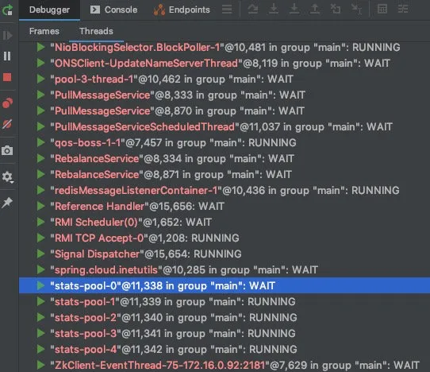

## 深入探究线程池的异常处理

但是疑问又来了，为什么使用线程池的时候，线程因异常被中断却没有抛出任何信息呢？还有平时如果是在 main 函数里面的异常也会被抛出来，而不是像线程池这样被吞掉。

如果子线程抛出了异常，线程池会如何进行处理呢？

> 我提交任务到线程池的方式是: `threadPoolExecutor.submit(Runnbale task);` ，后面了解到使用 execute() 方式提交任务会把异常日志给打出来，这里研究一下为什么使用 submit 提交任务，在任务中的异常会被“吞掉”。

对于 submit() 形式提交的任务，我们直接看源码：

```java
public Future<?> submit(Runnable task) {
    if (task == null) throw new NullPointerException();
    // 被包装成 RunnableFuture 对象，然后准备添加到工作队列
    RunnableFuture<Void> ftask = newTaskFor(task, null);
    execute(ftask);
    return ftask;
}
```

它会被线程池包装成 RunnableFuture 对象，而最终它其实是一个 FutureTask 对象，在被添加到线程池的工作队列，然后调用 start() 方法后， FutureTask 对象的 run() 方法开始运行，即本任务开始执行。

```java
public void run() {
    if (state != NEW || !UNSAFE.compareAndSwapObject(this,runnerOffset,null, Thread.currentThread()))
        return;
    try {
        Callable<V> c = callable;
        if (c != null && state == NEW) {
            V result;
            boolean ran;
            try {
                result = c.call();
                ran = true;
            } catch (Throwable ex) {
                // 捕获子任务中的异常
                result = null;
                ran = false;
                setException(ex);
            }
            if (ran)
                set(result);
        }
    } finally {
        runner = null;
        int s = state;
        if (s >= INTERRUPTING)
            handlePossibleCancellationInterrupt(s);
    }
}
```

在 FutureTask 对象的 run() 方法中，该任务抛出的异常被捕获，然后在setException(ex); 方法中，抛出的异常会被放到 outcome 对象中，这个对象就是 submit() 方法会返回的 FutureTask 对象执行 get() 方法得到的结果。

但是在线程池中，并没有获取执行子线程的结果，所以异常也就没有被抛出来，即被“吞掉”了。

这就是线程池的 submit() 方法提交任务没有异常抛出的原因。

## 线程池自定义异常处理方法

在定义 ThreadFactory 的时候调用`setUncaughtExceptionHandler`方法，自定义异常处理方法。例如：

```java
ThreadFactory namedThreadFactory = new ThreadFactoryBuilder()
                .setNameFormat("judge-pool-%d")
                .setUncaughtExceptionHandler((thread, throwable)-> logger.error("ThreadPool {} got exception", thread,throwable))
                .build();
```

这样，对于线程池中每条线程抛出的异常都会打下 error 日志，就不会看不到了。


## 线程池中的一个线程异常了会被怎么处理

**线程池中的一个线程异常了会被怎么处理?**

估计很多人会是以下三点答案（me too):

1.抛异常出来并打印在控制台上

2.其他线程任务不受影响

3.异常线程会被回收

但是这里我先提前说一下以上三点不全对，下面我们来具体分析一下。

**话不多说用代码来证明**

熟悉Executors线程池（本文线程池都是指Executors）都知道 有两种提交线程的方式execute和submit方式，下面将以这两种提交方式来验证。

贴个代码凑个数

```java
public static void main(String[] args) {
ThreadPoolTaskExecutor executorService = buildThreadPoolTaskExecutor();
executorService.execute(() -> run("execute方法"));
executorService.submit(() -> run("submit方法"));
}

private static void run(String name) {
String printStr = "【thread-name:" + Thread.currentThread().getName() + ",执行方式:" + name+"】";
System.out.println(printStr);
throw new RuntimeException(printStr + ",出现异常");
}

private static ThreadPoolTaskExecutor buildThreadPoolTaskExecutor() {
ThreadPoolTaskExecutor executorService = new ThreadPoolTaskExecutor();
executorService.setThreadNamePrefix("(小罗技术笔记)-");
executorService.setCorePoolSize(5);
executorService.setMaxPoolSize(10);
executorService.setQueueCapacity(100);
executorService.setKeepAliveSeconds(10);
executorService.setRejectedExecutionHandler(new ThreadPoolExecutor.CallerRunsPolicy());
executorService.initialize();
return executorService;
}
```


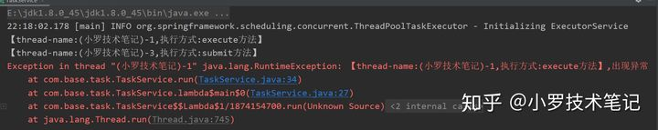


观看执行结果，诶好奇怪

execute执行方式抛出异常显示在控制台了。

submit执行方式啥都没有输出。

众所周知submit底层其实也是调用的execute,因此它也有异常只是处理方法不一样，它们的区别是：

1、execute没有返回值。可以执行任务，但无法判断任务是否成功完成。——实现Runnable接口

2、submit返回一个future。可以用这个future来判断任务是否成功完成。——实现Callable接口

那怎么拿到submit中的异常呢？还是用代码来说话

```text
Future<?> result=executorService.submit(() -> run("submit方法"));
try {
result.get();
}catch (Exception e){
e.printStackTrace();
}
```


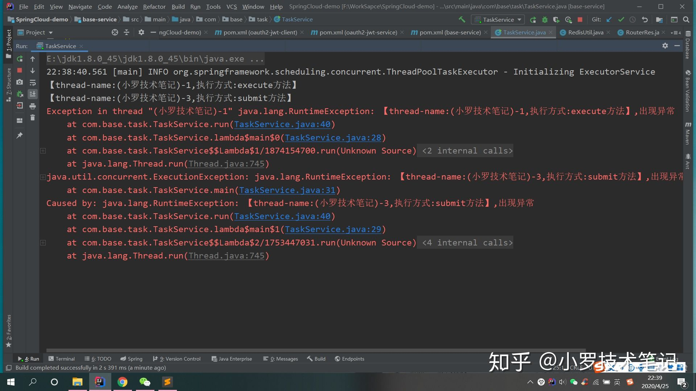


获取了一下submit方法的返回结果，发现有异常了和execute一样了，所以第一点抛异常出来并打印在控制台上不是全对的！

到这估计大家和我一样都有一个疑问了 ，为啥execute直接抛出异常，submit没有呢？

要知道这个答案就只能去翻源码看了

在java.util.concurrent.ThreadPoolExecutor#runWorker中抛出了运行异常:

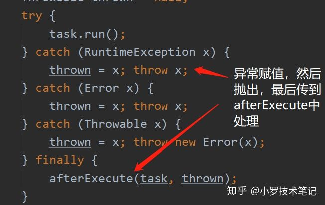


在java.lang.ThreadGroup#uncaughtException进行了异常处理:

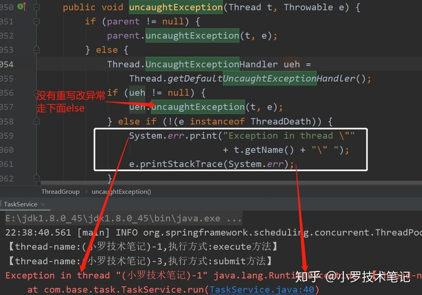


uncaughtException是什么，我也不知道，百度了一下说这个方法是JVM调用的，在线程中只需要指定我们想要的处理方式即可

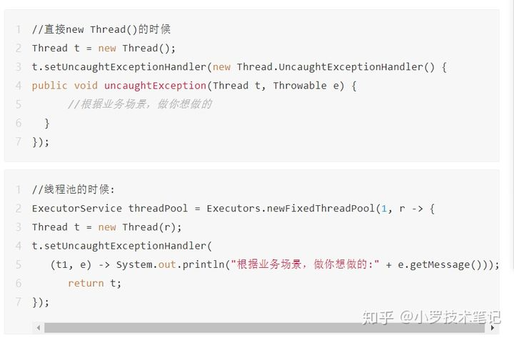


说道这里你可能会吐槽说了这么多submit到底为啥没有直接抛出异常，到底是怎么处理了，不要慌我们再看源码找答案

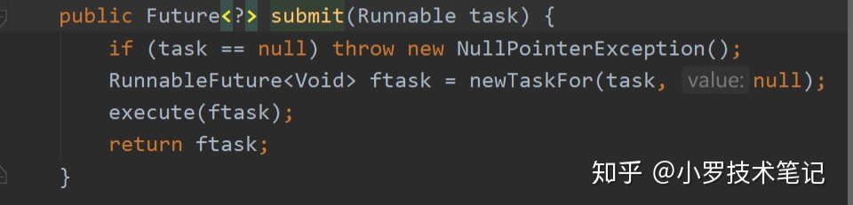


看submit源码会发现,submit中传进来的task会被封装成一个FutureTask，然后再调用execute,最后返回FutureTask。

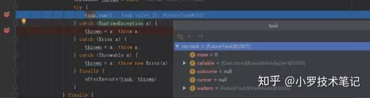


你会发现走的是execute方法，如下图,会发现此时的task已经是FutureTask，所以再去看一下FutureTask的run方法是咋写的。

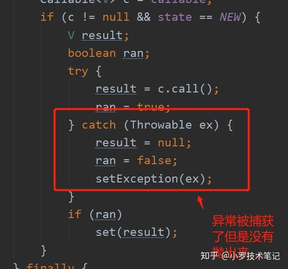


异常被存起来了....,再看源码是怎么实现的

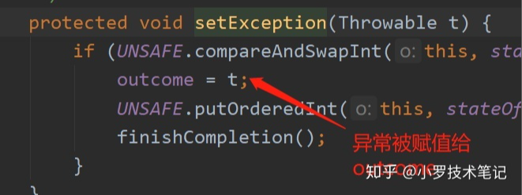


返回参数里面有一个状态state翻源码发现在report方法中同时用到outcom和state状态判断打个断点发现还真是，当state为3时抛出了异常。

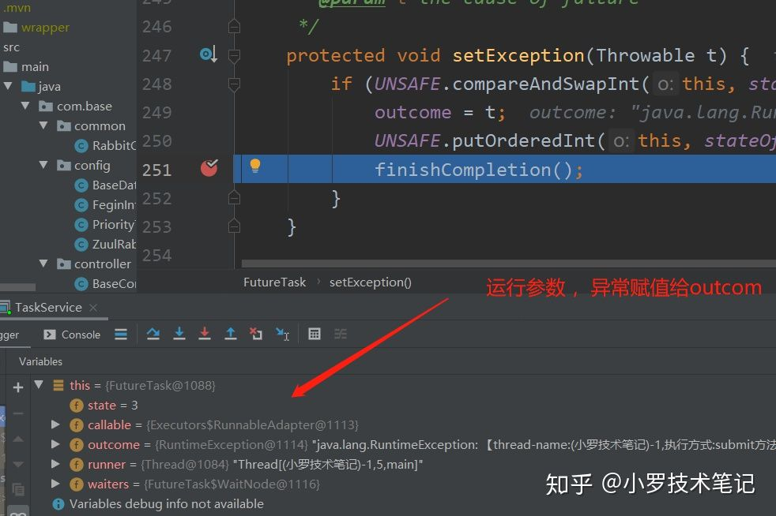


同理在找寻一下report调用位置可以很明显发现是FutureTask中get方法调用了，结合上面可以很明确了submit提交时异常被存储在线程结果信息中，当调用get方法是判断线程运行结果状态，有异常就抛出存储的异常信息，因此submit运行异常我们只能用get方法来拿到。

**至于第二点我就不多说了，平时使用中就已经证明了！**

**第三点线程出异常了不是被线程池回收嘛？**

看源码我们知道线程运行最后总有一个processWorkerExit要执行,看看里面的实现


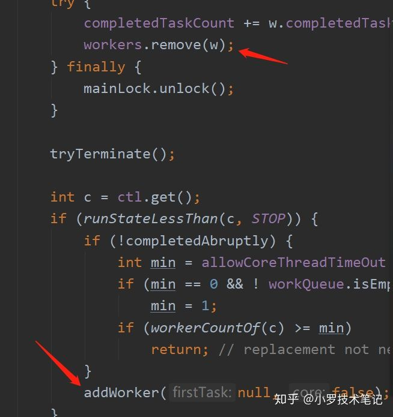


很神奇先删掉线程又再调用创建线程的方法，所以异常线程不是被回收，而是被删除了再创建一个新的顶替了。

到此线程池中的线程异常了会被怎么处理讲完了，总结一下就是：

1、execute方法,可以看异常输出在控制台，而submit在控制台没有直接输出，必须调用Future.get()方法时，可以捕获到异常。

2、一个线程出现异常不会影响线程池里面其他线程的正常执行。

3、线程不是被回收而是线程池把这个线程移除掉，同时创建一个新的线程放到线程池中。

4、还有源码是个好东西，答案都在里面，就是太难看懂了

## 小结：

丙这个事故也给大家一个警示，使用线程池时需要注意，子线程的异常，如果没有被捕获就会丢失，可能会导致后期根据日志调试时无法找到原因。