## 分布式事务


### 理论基础

 在讲解具体方案之前，有必要了解一下分布式中数据设计需要遵循的理论基础，CAP理论和BACS理论，为后面的实践铺平道路


#### CAP理论

CAP：Consistency Acailability Partition tolerance 的简写

- Consistency：一致性

  对某个客户端来说，读操作能够返回最新的写操作结果

- Acailability：可用性

  非故障节点在合理的时间内返回合理的响应

- Partition tolerance：分区容错性

  当出现网络分区后，系统能够继续提供服务 *你知道什么是网络分区吗 ~~*

因为分布式系统中系统肯定部署在多台机器上，无法保证网络做到100%的可靠，所以网络分区一定存在，即P一定存在；

在出现网络分区后，就出现了可用性和一致性的问题，我们必须要在这两者之间进行取舍，因此就有了两种架构：CP架构，AP架构；


##### CP架构

当网络分区出现后，为了保证可用性，系统B可以返回旧值，保证系统的可用性

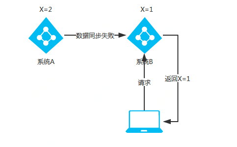

1. 当没有出网络分区时，系统A与系统B的数据一致，X=1
2. 将系统A的X修改为2，X=2
3. 当出现网络分区后，系统A与系统B之间的数据同步数据失败，系统B的X=1
4. 当客户端请求系统B时，为了保证一致性，此时系统B应拒绝服务请求，返回错误码或错误信息

上面这种方式就违背了可用性的要求，只满足一致性和分区容错，即CP

CAP理论是忽略网络延迟，从系统A同步数据到系统B的网络延迟是忽略的

CP架构保证了客户端在获取数据时一定是最近的写操作，或者获取到异常信息，绝不会出现数据不一致的情况


##### AP架构

当网络分区出现后，为了保证可用性，系统B可以返回旧值，保证系统的可用性

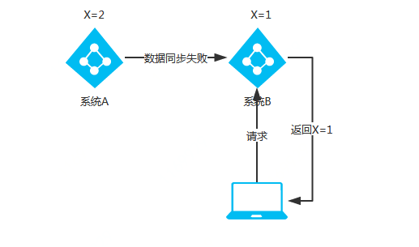


1. 当没有出网络分区时，系统A与系统B的数据一致，X=1
2. 将系统A的X修改为2，X=2
3. 当出现网络分区后，系统A与系统B之间的数据同步数据失败，系统B的X=1
4. 当客户端请求系统B时，为了保证可用性，此时系统B应返回旧值，X=1

上面这种方式就违背了一致性的要求，只满足可用性和分区容错，即AP

CP架构保证了客户端在获取数据时无论返回的是最新值还是旧值，系统一定是可用的

**CAP理论关注粒度是数据，而不是整体系统设计的策略**


#### BASE理论

分布式系统中的一致性是 弱一致性 单数据库 mysql的一致性 强一致性

BASE是Basically Available（基本可用）、Soft state（软状态）和Eventually consistent（最终一致性）三个短语的缩写。BASE理论是对CAP中一致性和可用性权衡的结果，其来源于对大规模互联网系统分布式实践的总结， 是基于CAP定理逐步演化而来的。BASE理论的核心思想是：即使无法做到强一致性，但每个应用都可以根据自身业务特点，采用适当的方式来使系统达到最终一致性。接下来看一下BASE中的三要素：


 BASE理论指的是基本可用 Basically Available，软状态 Soft Stat，最终一致性 Eventual Consistency，核心思想是即便无法做到强一致性，但应该可以有采用适合的方式保证最终一致性

BASE：Basically Available Soft Stat Eventual Consistency的简写

##### BA：Basically Available 基本可用

分布式系统在出现故障的时候，允许损失部分可用性，即保证核心可用

基本可用是指分布式系统在出现不可预知故障的时候，允许损失部分可用性—-注意，这绝不等价于系统不可用。比如：

（1）响应时间上的损失。正常情况下，一个在线搜索引擎需要在0.5秒之内返回给用户相应的查询结果，但由于出现故障，查询结果的响应时间增加了1~2秒

（2）系统功能上的损失：正常情况下，在一个电子商务网站上进行购物的时候，消费者几乎能够顺利完成每一笔订单，但是在一些节日大促购物高峰的时候，由于消费者的购物行为激增，为了保护购物系统的稳定性，部分消费者可能会被引导到一个降级页面。


##### S：Soft Stat 软状态

允许系统存在中间状态，而该中间状态不会影响系统整体可用性

软状态指允许系统中的数据存在中间状态，并认为该中间状态的存在不会影响系统的整体可用性，即允许系统在不同节点的数据副本之间进行数据同步的过程存在延时。


##### E：Consistency 最终一致性

系统中的所有数据副本经过一定时间后，最终能够达到一致的状态

BASE理论本质上是对CAP理论的延伸，是对 CAP 中 AP 方案的一个补充

最终一致性强调的是所有的数据副本，在经过一段时间的同步之后，最终都能够达到一个一致的状态。因此，最终一致性的本质是需要系统保证最终数据能够达到一致，而不需要实时保证系统数据的强一致性。总的来说，BASE理论面向的是大型高可用可扩展的分布式系统，和传统的事物ACID特性是相反的，它完全不同于ACID的强一致性模型，而是通过牺牲强一致性来获得可用性，并允许数据在一段时间内是不一致的，但最终达到一致状态。但同时，在实际的分布式场景中，不同业务单元和组件对数据一致性的要求是不同的，因此在具体的分布式系统架构设计过程中，ACID特性和BASE理论往往又会结合在一起。


一句话：CAP就是告诉你：想要满足C、A、P就是做梦，BASE才是你最终的归宿。

### 分布式事务协议


##### X/Open XA 协议

XA是一个分布式事务协议，由Tuxedo提出。XA规范主要定义了（全局）事务管理器（Transaction Manager）和（局部）资源管理器（Resource Manager）之间的接口。XA接口是双向的系统接口，在事务管理器Transaction Manager）以及一个或多个资源管理器（Resource Manager）之间形成通信桥梁

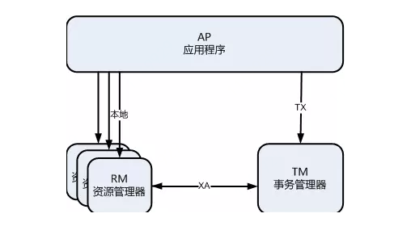

XA协议采用**两阶段提交**方式来管理分布式事务。XA接口提供资源管理器与事务管理器之间进行通信的标准接口

 

##### 2PC 二阶段提交 协议

二阶段提交（Two-phase Commit），是指，为了使基于分布式系统架构下的所有节点在进行事务提交时保持一致性而设计的一种算法(Algorithm)。通常，二阶段提交也被称为是一种协议(Protocol)。在分布式系统中，每个节点虽然可以知晓自己的操作时成功或者失败，却无法知道其他节点的操作的成功或失败。当一个事务跨越多个节点时，为了保持事务的ACID特性，需要引入一个作为协调者的组件来统一掌控所有节点(称作参与者)的操作结果并最终指示这些节点是否要把操作结果进行真正的提交(比如将更新后的数据写入磁盘等等)。因此，二阶段提交的算法思路可以概括为： 参与者将操作成败通知协调者，再由协调者根据所有参与者的反馈情报决定各参与者是否要提交操作还是中止操作

二阶段提交算法的成立基于以下假设：

1. 该分布式系统中，存在一个节点作为协调者(Coordinator)，其他节点作为参与者(Cohorts)。且节点之间可以进行网络通信。
2. 所有节点都采用预写式日志，且日志被写入后即被保持在可靠的存储设备上，即使节点损坏不会导致日志数据的消失。
3. 所有节点不会永久性损坏，即使损坏后仍然可以恢复

二阶段提交分为两阶段：第一阶段：投票阶段，第二阶段：提交阶段

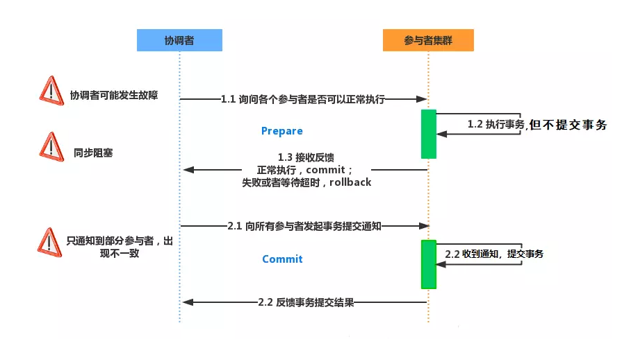

**投票阶段 Prepares**

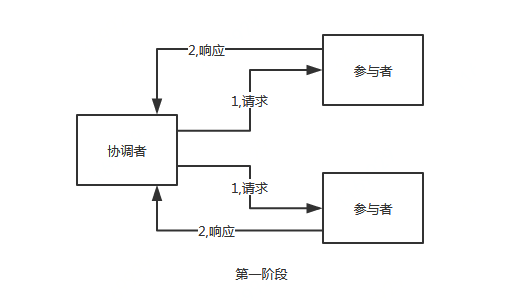

1. 协调者向所有参与者询问是否可以执行提交操作，并开始等待各参与者的响应
2. 参与者执行事务操作，如果执行成功就返回Yes响应，如果执行失败就返回No响应
3. 如果协调者接受参与者响应超时，也会认为执行事务操作失败


**提交阶段 commit**

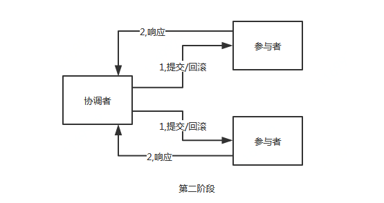

1. 如果第一阶段汇中所有参与者都返回yes响应，协调者向所有参与者发出提交请求，所有参与者提交事务
2. 如果第一阶段中有一个或者多个参与者返回no响应，协调者向所有参与者发出回滚请求，所有参与者进行回滚操作

二阶段提交优点：尽量保证了数据的强一致，但不是100%一致

缺点：

- 单点故障

  由于协调者的重要性，一旦协调者发生故障，参与者会一直阻塞，尤其时在第二阶段，协调者发生故障，那么所有的参与者都处于锁定事务资源的状态中，而无法继续完成事务操作

- 同步阻塞

  由于所有节点在执行操作时都是同步阻塞的，当参与者占有公共资源时，其他第三方节点访问公共资源不得不处于阻塞状态

- 数据不一致

  在第二阶段中，当协调者想参与者发送提交事务请求之后，发生了局部网络异常或者在发送提交事务请求过程中协调者发生了故障，这会导致只有一部分参与者接收到了提交事务请求。而在这部分参与者接到提交事务请求之后就会执行提交事务操作。但是其他部分未接收到提交事务请求的参与者则无法提交事务。从而导致分布式系统中的数据不一致
  
  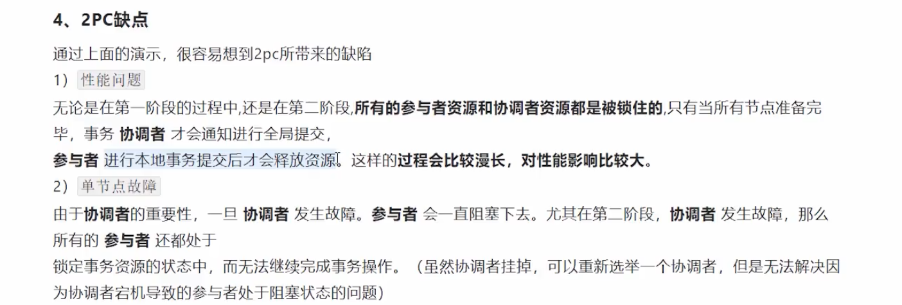

**二阶段提交的问题**

 如果协调者在第二阶段发送提交请求之后挂掉，而唯一接受到这条消息的参与者执行之后也挂掉了，即使协调者通过选举协议产生了新的协调者并通知其他参与者进行提交或回滚操作的话，都可能会与这个已经执行的参与者执行的操作不一样，当这个挂掉的参与者恢复之后，就会产生数据不一致的问题


##### 3PC 三阶段提交 协议

 三阶段提交（Three-phase commit），三阶段提交是为解决两阶段提交协议|的缺点而设计的。 与两阶段提交不同的是，三阶段提交是“非阻塞”协议。三阶段提交在两阶段提交的第一阶段与第二阶段之间插入了一个准备阶段，使得原先在两阶段提交中，参与者在投票之后，由于协调者发生崩溃或错误，而导致参与者处于无法知晓是否提交或者中止的“不确定状态”所产生的可能相当长的延时的问题得以解决

三阶段提交的三个阶段：CanCommit，PreCommit，DoCommit三个阶段

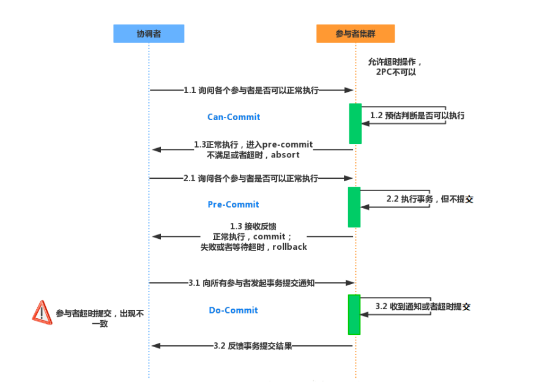

**询问阶段 CanCommit**

协调者向参与者发送commit请求，参与者如果可以提交就返回Yes响应，否则返回No响应


**准备阶段 PreCommit**

协调者根据参与者在**询问阶段**的响应判断是否执行事务还是中断事务

- 如果所有参与者都返回Yes，则执行事务
- 如果参与者有一个或多个参与者返回No或者超时，则中断事务

参与者执行完操作之后返回ACK响应，同时开始等待最终指令


**提交阶段 DoCommit**

协调者根据参与者在**准备阶段**的响应判断是否执行事务还是中断事务

- 如果所有参与者都返回正确的ACK响应，则提交事务
- 如果参与者有一个或多个参与者收到错误的ACK响应或者超时，则中断事务
- 如果参与者无法及时接收到来自协调者的提交或者中断事务请求时，会在等待超时之后，会继续进行事务提交

协调者收到所有参与者的ACK响应，完成事务


**解决二阶段提交时的问题**

 在三阶段提交中，如果在第三阶段协调者发送提交请求之后挂掉，并且唯一的接受的参与者执行提交操作之后也挂掉了，这时协调者通过选举协议产生了新的协调者，在二阶段提交时存在的问题就是新的协调者不确定已经执行过事务的参与者是执行的提交事务还是中断事务，但是在三阶段提交时，肯定得到了第二阶段的再次确认，那么第二阶段必然是已经正确的执行了事务操作，只等待提交事务了，所以新的协调者可以从第二阶段中分析出应该执行的操作，进行提交或者中断事务操作，这样即使挂掉的参与者恢复过来，数据也是一致的。

 所以，三阶段提交解决了二阶段提交中存在的由于协调者和参与者同时挂掉可能导致的数据一致性问题和单点故障问题，并减少阻塞，因为一旦参与者无法及时收到来自协调者的信息之后，他会默认执行提交事务，而不会一直持有事务资源并处于阻塞状态。


**三阶段提交的问题**

 在**提交阶段**如果发送的是中断事务请求，但是由于网络问题，导致部分参与者没有接到请求，那么参与者会在等待超时之后执行提交事务操作，这样这些由于网络问题导致提交事务的参与者的数据就与接受到中断事务请求的参与者存在数据不一致的问题。

**所以无论是2PC还是3PC都不能保证分布式系统中的数据100%一致**


##### 2PC

在传统的企业界，解决分布式事务问题的传统方法就是采用所谓的两阶段协议（简称2PC）。这个协议实现起来还是挺复杂的，但是他的原理并不复杂。


它把分布式事务问题分解成两个执行阶段，首先在2PC协议当中，事务的参与方也叫资源管理者，它可以是数据库或者消息队列。事物的协调方也被称为事务管理者。它统一管理和协调两阶段事务。

下面是两阶段的简化步骤。

第一步是所谓的准备阶段也称为投票阶段，事务管理者要求所有的资源管理者准备执行事务，然后每个资源管理者在本地执行事务，通过回复Ready表示准备就绪，可以提交或者回滚事事务。

第二个阶段根据第一阶段所有参与方的回应，事务管理者决策继续提交事务还是回滚事务。决策之后，他再统一要求所有的资源管理者去提交或者回滚事务。然后各个资源管理者执行提交或者回滚，最后资源管理者返回执行结果，事务完成。

那么这个2PC最早是针对数据库设计的，但是各家数据库厂商的具体实现各不相同，为了统一标准减少不必要的对接成本，同时为了支持除数据库以外的更多的资源，有一个国际开放组织叫Open Group，它制定了分布式事务的XA规范。它本质上就是2PC的一个参考规范。2PC在业界的名声并不太好。主要是有性能开销的问题，还有实现复杂和死锁的问题。

另外现在很多新出来的资源，比方说新出来的NoSQL、还有消息队列kafka 一般都不支持2PC/XA协议。这就造成很多企业在解决分布式事务问题的时候一般都尽量避免使用2PC/XA协议。

但是我这里我要提前说明一下，阿里开源的分布式事务中间件Seata这个中间件我后面会讲的。Seata可以认为是一个优化的2PC/XA的实现方案，那么行业有一些实现2PC和XA协议的分布式事务中间件，比较知名的是Atomikos公司开源的中间件，名字就叫Atomikos。在一些传统企业还有要求强致性的银行业，Atomikos有一些应用，我这边给出了一个模拟股票拍卖的这样一个样例。

https://github.com/Apress/practical-microservices-architectural-patterns/tree/master/Christudas_Ch13_Source/ch13/ch13-01/XA-TX-Distributed

以及它在GitHub上的地址也给出来了。


这个样例来自一本书名字叫做《Practical Microservices Architectural Patterns》在书中作者为了演示分布式事务还有2PC和XA。那么它基于Atomikos开发了这样一个样例,它引入蛮多的技术，包括Atomikos、Spring Boot、MySOL、ActiveMO，还有Derby这是一个数据库。这个样例是纯粹为了演示开发的，它里头引入了5个微服务2个数据库，中间还引入消息队列，所以整个股票交易事务是分布式的。这个样例设计了8种场景，包括各种中间环节出错的场景，这些场景是可以通过开关控制的。而且这个样例还带有web界面，可以查看事务执行的各种结果，另外样例还演示了Spring的各种事务传播机制。

如果你对Atomikos感兴趄，或者想进一步参考Atomikos实现分布式事务的样例，可以学习这个样例。


### 解决方案

#### 强一致性分布式事务

##### **基于2PC/XA协议实现的JTA**

我们已经知道了2PC和XA协议的原理，而JTA是Java规范，是XA在Java上的实现。  

JTA（Java Transaction Manager）：

- TransactionManager：常用方法，可以开启，回滚，获取事务。begin()，rollback()……
- XAResouce：资源管理，通过Session来进行事务管理，commit(xid)……
- XID：每一个事务都分配一个特定的XID


JTA主要的原理是二阶段提交，当整个业务完成了之后只是第一阶段提交，在第二阶段提交之前会检查其他所有事务是否已经提交，如果前面出现了错误或是没有提交，那么第二阶段就不会提交，而是直接回滚，这样所有的事务都会做回滚操作。

基于JTA这种方案实现分布式事务的强一致性。  

JTA的特点：

- 基于两阶段提交，有可能会出现数据不一致的情况
- 事务时间过长，阻塞
- 性能低，吞吐量低

  实现可以使用基于JTA实现的jar包Atomikos，使用例子可以自己百度一下。

正常架构设计中是否应该出现这种跨库的操作，我觉得是不应该的，如果过按业务拆分将数据源进行分库，我们应该同时将服务也拆分出去才合适，应遵循一个系统只操作一个数据源（主从没关系），避免后续可能会出现的多个系统调用一个数据源的情况。  


#### 最终一致性分布式事务方案（柔性事务）

JTA方案适用于单体架构多数据源时实现分布式事务，但对于微服务间的分布式事务就无能为力了，我们需要使用其他的方案实现分布式事务。


##### 本地消息表

本地消息表的核心思想是将分布式事务拆分成本地事务进行处理

以本文中例子，在订单系统新增一条消息表，将新增订单和新增消息放到一个事务里完成，然后通过轮询的方式去查询消息表，将消息推送到mq，库存系统去消费mq

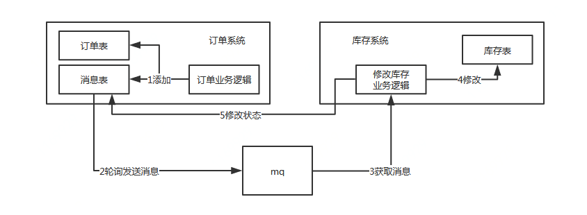

**执行流程：**

1. 订单系统，添加一条订单和一条消息，在一个事务里提交
2. 订单系统，使用定时任务轮询查询状态为未同步的消息表，发送到mq，如果发送失败，就重试发送
3. 库存系统，接收mq消息，修改库存表，需要保证幂等操作
4. 如果修改成功，调用rpc接口修改订单系统消息表的状态为已完成或者直接删除这条消息
5. 如果修改失败，可以不做处理，等待重试

订单系统中的消息有可能由于业务问题会一直重复发送，所以为了避免这种情况可以记录一下 发送次数，当达到次数限制之后报警，人工接入处理；库存系统需要保证幂等，避免同一条消息被多次消费造成数据一致；

本地消息表这种方案实现了最终一致性，需要在业务系统里增加消息表，业务逻辑中多一次插入的DB操作，所以性能会有损耗，而且最终一致性的间隔主要有定时任务的间隔时间决定。

**本地消息表**这个方案最初是eBay提出的，此方案的核心是通过本地事务保证数据业务操作和消息的一致性，然后通过定时任务将消息发送至消息中间件，待确认消息发送给消费方成功再将消息删除。

下面以注册送积分为例来说明 ：

下例共有两个微服务交互，用户服务和积分服务，用户服务负责添加用户，积分服务负责增加积分。

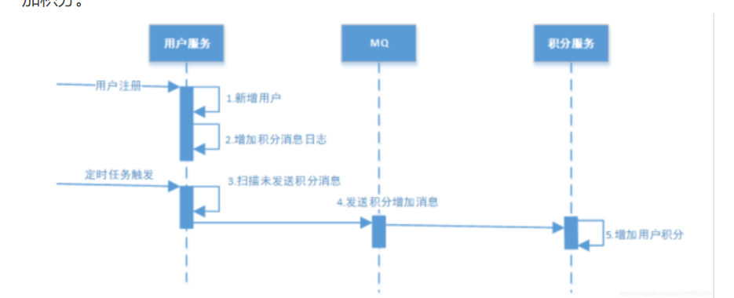


交互流程如下 ：

**1、用户注册**

用户服务在本地事务新增用户和增加“积分消息日志”。（用户表和消息表通过本地事务保证一致）

下表是伪代码

```sql
begin transaction；
    // 1.新增用户
    // 2.存储积分消息日志
commit transation；
```

这种情况下，本地数据库操作与存储积分消息日志处于同一事务中，本地数据库操作与记录消息日志操作具备原子性。

**2、定时任务扫描日志**

如何保证将消息发送给消息队列呢？

经过第一步消息已经写到消息日志表中，可以启动独立的线程，定时对消息日志表中的消息进行扫描并发送至消息中间件，在消息中间件反馈发送成功后删除该消息日志，否则等待定时任务下一周期重试。

**3、消费消息**

如何保证消费者一定能消费到消息呢？

这里可以使用MQ的ack（即消息确认）机制，消费者监听MQ，如果消费者接收到消息并且业务处理完成后向MQ发送ack（即消息确认），此时说明消费者正常消费消息完成，MQ将不再向消费者推送消息，否则消费者会不断重试向消费者来发送消息。

积分服务接收到“增加积分”消息，开始增加积分，积分增加成功后消息中间件回应ack，否则消息中间件将重复投递此消息。

由于消息会重复投递，积分服务的“增加积分”功能需要实现幂等性。


总结：上诉的方式是一种非常经典的实现，基本避免了分布式事务，实现了“最终一致性”。但是，关系型数据库的吞吐量和性能方面存在瓶颈，频繁的读写消息会给数据库造成压力。所以，在真正的高并发场景下，该方案也会有瓶颈和限制的。


##### MQ消息事务（**基于可靠消息的最终一致性- 最常用**）

消息事务的原理是将两个事务通过消息中间件进行异步解耦

订单系统执行自己的本地事务，并发送mq消息，库存系统接收消息，执行自己的本地事务，乍一看，好像跟本地消息表的实现方案类似，只是省去 了对本地消息表的操作和轮询发送mq的操作，但实际上两种方案的实现是不一样的

消息事务一定要保证业务操作与消息发送的一致性，如果业务操作成功，这条消息也一定投递成功

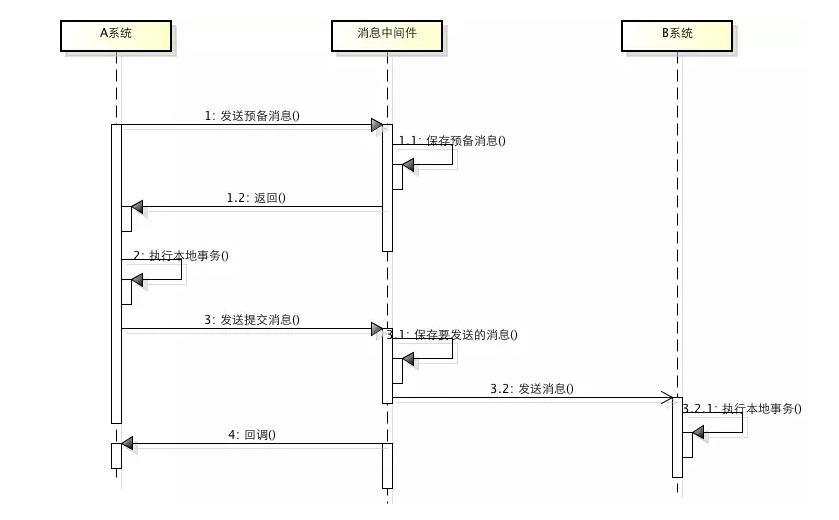

消息事务依赖于消息中间件的事务消息，基于消息中间件的二阶段提交实现的，RocketMQ就支持事务消息

**执行流程：**

1. 发送prepare消息到消息中间件
2. 发送成功后，执行本地事务
3. 如果事务执行成功，则commit，消息中间件将消息下发至消费端
4. 如果事务执行失败，则回滚，消息中间件将这条prepare消息删除
5. 消费端接收到消息进行消费，如果消费失败，则不断重试

这种方案也是实现了最终一致性，对比本地消息表实现方案，不需要再建消息表，不再依赖本地数据库事务了，所以这种方案更适用于高并发的场景

RocketMQ是一个来自阿里巴巴的分布式消息中间件，于2012年开源，并在2017年正式成为Apache顶级项目。据了解，包括阿里云上的消息产品以及收购的子公司在内，阿里集团的消息产品全线都运行在RocketMQ之上，并且最近几年的双十一大促中，RocketMQ都有抢眼表现。Apache RocketMQ 4.3之后的版本正式支持事务消息，为分布式事务实现提供来便利性支持。

RocketMQ事务消息设计则主要是为了解决Producer端的消息发送与本地事务执行的原子性问题，RocketMQ的设计中broker与producer端的双向通信能力，使得broker天生可以作为一个事务协调者存在；而RocketMQ本身提供的存储机制为事务消息提供了持久化能力；RocketMQ的高可用机制以及可靠消息设计则为事务消息在系统发生异常时依然能够保证达成事务的最终一致性。

在RocketMQ 4.3后实现了完整的事务消息，实际上其实是对本地消息表的一个封装，将本地消息表移动到了MQ内部，解决Producer端的消息发送与本地事务执行的原子性问题。

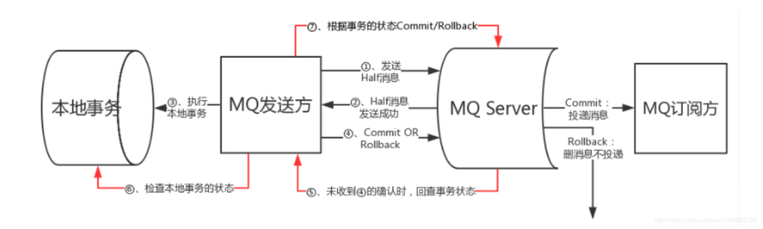

**执行流程如下 ：**

为方便理解我们还以注册送积分的例子来描述整个流程。

Producer即MQ发送方，本例中是用户服务，负责新增用户。MQ订阅方即消息消费方，本例中是积分服务，负责新增积分。

**1、Producer发送事务消息**

Producer（MQ发送方）发送事务消息至MQ Server，MQ Server将消息状态标记为Prepared（预览状态），注意此时这条消息消费者（MQ订阅方）是无法消费到的。

**2、MQ Server回应消息发送成功**

MQ Server接收到Producer发送给的消息则回应发送成功表示MQ已接收到消息。

**3、Producer执行本地事务**

Producer端执行业务代码逻辑，通过本地数据库事务控制。

本例中，Producer执行添加用户操作。

**4、消息投递**

若Producer本地事务执行成功则自动向MQ Server发送commit消息，MQ Server接收到commit消息后将“增加积分消息”状态标记为可消费，此时MQ订阅方（积分服务）即正常消费消息；

若Producer 本地事务执行失败则自动向MQ Server发送rollback消息，MQ Server接收到rollback消息后将删除“增加积分消息”。

MQ订阅方（积分服务）消费消息，消费成功则向MQ回应ack，否则将重复接收消息。这里ack默认自动回应，即程序执行正常则自动回应ack。

**5、事务回查**

如果执行Producer端本地事务过程中，执行端挂掉，或者超时，MQ Server将会不停的询问同组的其他Producer来获取事务执行状态，这个过程叫**事务回查**。MQ Server会根据事务回查结果来决定是否投递消息。

以上主干流程已由RocketMQ实现，对用户则来说，用户需要分别实现本地事务执行以及本地事务回查方法，因此只需关注本地事务的执行状态即可。


##### 最大努力通知

最大努力通知相比前两种方案实现简单，适用于一些最终一致性要求较低的业务，比如支付通知，短信通知这种业务

以支付通知为例，业务系统调用支付平台进行支付，支付平台进行支付，进行操作支付之后支付平台会尽量去通知业务系统支付操作是否成功，但是会有一个最大通知次数，如果超过这个次数后还是通知失败，就不再通知，业务系统自行调用支付平台提供一个查询接口，供业务系统进行查询支付操作是否成功

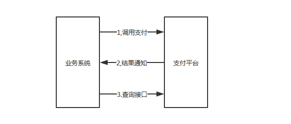

**执行流程：**

1. 业务系统调用支付平台支付接口， 并在本地进行记录，支付状态为支付中
2. 支付平台进行支付操作之后，无论成功还是失败，都需要给业务系统一个结果通知
3. 如果通知一直失败则根据重试规则进行重试，达到最大通知次数后，不在通知
4. 支付平台提供查询订单支付操作结果接口
5. 业务系统根据一定业务规则去支付平台查询支付结果

这种方案也是实现了最终一致性


最大努力通知也是一种解决分布式事务的方案，下面是一个充值的例子。

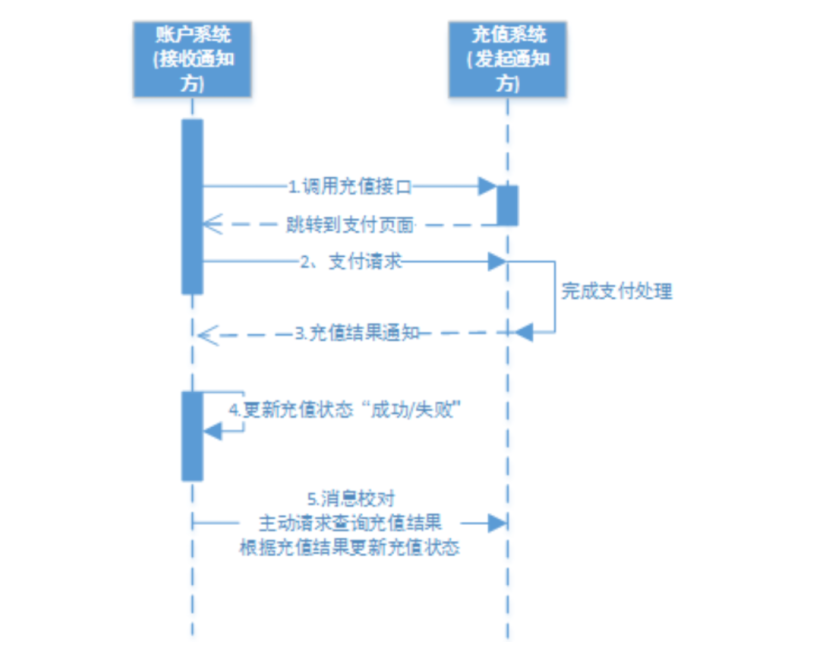

交互流程:

　　1、账户系统调用充值系统接口

　　2、充值系统完成支付处理向账户系统发起充值结果通知，若通知失败，则充值系统按策略进行重复通知

　　3、账户系统接收到充值结果通知修改充值状态。

　　4、账户系统未接收到通知会主动调用充值系统的接口查询充值结果。

通过上边的例子我们总结最大努力通知方案的目标：

　　目标：发起通知方通过一定的机制最大努力将业务处理结果通知到接收方。

具体包括：

　　1、有一定的消息重复通知机制。因为接收通知方可能没有接收到通知，此时要有一定的机制对消息重复通知。

　　2、消息校对机制。如果尽最大努力也没有通知到接收方，或者接收方消费消息后要再次消费，此时可由接收方主动向通知方查询消息信息来满足需求。

最大努力通知与可靠消息一致性有什么不同？

　　1、解决方案思想不同

　　可靠消息一致性，发起通知方需要保证将消息发出去，并且将消息发到接收通知方，消息的可靠性关键由发起通知方来保证。

　　最大努力通知，发起通知方尽最大的努力将业务处理结果通知为接收通知方，但是可能消息接收不到，此时需要接收通知方主动调用发起通知方的接口查询业务处理结果，通知的可靠性关键在接收通知方。

2、两者的业务应用场景不同

　　可靠消息一致性关注的是交易过程的事务一致，以异步的方式完成交易。

　　最大努力通知关注的是交易后的通知事务，即将交易结果可靠的通知出去。

3、技术解决方向不同

　　可靠消息一致性要解决消息从发出到接收的一致性，即消息发出并且被接收到。

　　最大努力通知无法保证消息从发出到接收的一致性，只提供消息接收的可靠性机制。可靠机制是，最大努力的将消息通知给接收方，当消息无法被接收方接收时，由接收方主动查询消息（业务处理结果）。

#### 解决方案

通过对最大努力通知的理解，采用MQ的ack机制就可以实现最大努力通知。

**方案1：**

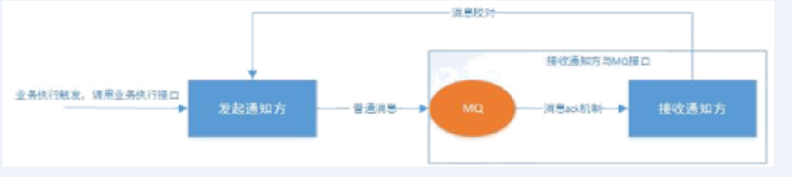

本方案是利用MQ的ack机制由MQ向接收通知方发送通知，流程如下：

　　1、发起通知方将通知发给MQ。使用普通消息机制将通知发给MQ。

　　　　注意：如果消息没有发出去可由接收通知方主动请求发起通知方查询业务执行结果。（后边会讲）

　　2、接收通知方监听 MQ。

　　3、接收通知方接收消息，业务处理完成回应ack。

　　4、接收通知方若没有回应ack则MQ会重复通知。

　　　　MQ会按照间隔1min、5min、10min、30min、1h、2h、5h、10h的方式，逐步拉大通知间隔 （如果MQ采用rocketMq，在broker中可进行配置），直到达到通知要求的时间窗口上限。

　　5、接收通知方可通过消息校对接口来校对消息的一致性。

**方案2：**

　　本方案也是利用MQ的ack机制，与方案1不同的是应用程序向接收通知方发送通知，如下图：

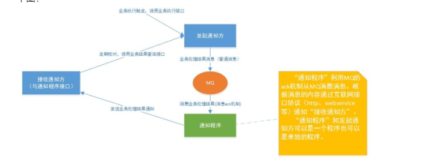

交互流程如下：

　　1、发起通知方将通知发给MQ。

　　　　使用可靠消息一致方案中的事务消息保证本地事务与消息的原子性，最终将通知先发给MQ。

　　2、通知程序监听 MQ，接收MQ的消息。

　　　　方案1中接收通知方直接监听MQ，方案2中由通知程序监听MQ。

　　　　通知程序若没有回应ack则MQ会重复通知。

　　3、通知程序通过互联网接口协议（如http、webservice）调用接收通知方案接口，完成通知。

　　　　通知程序调用接收通知方案接口成功就表示通知成功，即消费MQ消息成功，MQ将不再向通知程序投递通知消息。

　　4、接收通知方可通过消息校对接口来校对消息的一致性。

方案1和方案2的不同点：

　　1、方案1中接收通知方与MQ接口，即接收通知方案监听 MQ，此方案主要应用与内部应用之间的通知。

　　2、方案2中由通知程序与MQ接口，通知程序监听MQ，收到MQ的消息后由通知程序通过互联网接口协议调用接收通知方。此方案主要应用于外部应用之间的通知，例如支付宝、微信的支付结果通知。


##### 补偿事务TCC

除了2PC，目前业界还有一种叫**TCC**的分布式事务解决方案。

2PC有一个严重的问题就是使用到了数据库的事务，这个事务有一个严重的问题就是加锁，所以关键问题就在这个锁的问题上，也就是我们在执行的过程中不要去加锁，而是把这个过程拿到业务端去做，也就是在代码中完成一致性的检验。那样并发就能达到另外一个高度，TCC就是基于这样一个原理，把锁机制拿到业务端来做，不要选择随便开启事务的方案。


他在互联网金融等行业有广泛的应用，之前在拍拍贷的资金交易这些相关的业务当中，也是通过TCC来实现分布式事务的，TCC可以认为是2PC的一种变体，它相当于是应用层或者是服务层的2PC,2PC主要盛行于基于数据库的三层应用时代,近年随着微服务的盛行，TCC这种服务层的2PC变体也就流行起来了，那么TCC经常应用于一些可以做资源预留的业务场景，比方说旅游预订场景，需要订酒店和机票的事务,或者转账场景也可以用TCC，因为转账转的钱也是一种资源,也是可以预留的，同样TCC当中也有分布式事务协调者这样一个角色，统一负责事务的协调工作。特别需要说明TCC要求参与事务的服务要实现三个接口，分别是Try、Confirm还有Cancel。

下面我们来看一下TCC的简化流程。

1、业务应用通过分布式事务协调者启动这个事务

2、业务应用分别调用事务参与方的Try接口执行事务操作

在TCC模式当中Try通常执行的是一个资源预留的动作，比方说预订酒店和机票场景，Try操作就先把酒店资源、机票资源先预留下来，但是还没有正式的提交

3、应用方根据Try调用的返回结果，决定是提交还是回滚事务。然后它向协调者发出提交或者回滚指令
然后它向协调者发出提交或者回滚指令，最后分布式事务协调者根据业务应用的指令，分别去调事务参与方的Confirm接口去确认提交，或者调Cancel回滚事务。对于酒店和机票预订的这个场景，Confirm就将预留的酒店和机票正式给用户定下来，Cancel表示取消事务，把预留的酒店和机票回滚到可预定状态。后面我会介绍阿里开源的分布式事务中间件Seata，它也是支持TCC事务模式的。


TCC Try-Confirm-Cancel的简称，针对每个操作，都需要有一个其对应的确认和取消操作，当操作成功时调用确认操作，当操作失败时调用取消操作，类似于二阶段提交，只不过是这里的提交和回滚是针对业务上的，所以基于TCC实现的分布式事务也可以看做是对业务的一种补偿机制。


**TCC的三阶段：**

1. Try阶段：对业务系统做检测及资源预留
2. Confirm阶段：对业务系统做确认提交，Try阶段执行成功并开始执行 Confirm阶段时，默认Confirm阶段是不会出错的。即：只要Try成功，Confirm一定成功
3. Cancel阶段：在业务执行错误，需要回滚的状态下执行的业务取消，预留资源释放

 在Try阶段，是对业务系统进行检查及资源预览，比如订单和存储操作，需要检查库存剩余数量是否够用，并进行预留，预留操作的话就是新建一个可用库存数量字段，Try阶段操作是对这个可用库存数量进行操作。

比如下一个订单减一个库存：  


**执行流程：**

1. Try阶段：订单系统将当前订单状态设置为支付中，库存系统校验当前剩余库存数量是否大于1，然后将可用库存数量设置为库存剩余数量-1，
2. 如果Try阶段执行成功，执行Confirm阶段，将订单状态修改为支付成功，库存剩余数量修改为可用库存数量
3. 如果Try阶段执行失败，执行Cancel阶段，将订单状态修改为支付失败，可用库存数量修改为库存剩余数量

基于TCC实现分布式事务，代码逻辑想对复杂一些，需要将原来的接口的逻辑拆分为：try，confirm，cancel三个接口的逻辑。

基于TCC实现的分布式事务框架：

- ByteTCC：github.com/liuyangming
- tcc-transaction：github.com/changmingxi


**处理流程**


TCC 是 Try-Confirm-Cancel 的简称，是目前分布式事务主流解决方案 

**TCC 实现阶段一：Try**
对资源进行锁定，预留业务资源
在创建订单时， **“锁定”**库存 


**TCC 实现阶段二：Confirm**
确认执行业务操作，做真正的提交，将第一步Try中锁定的资源，真正扣减
在订单支付成功，将库存“扣减” 


TCC 实现阶段三：Cancel
取消执行业务操作，取消Try阶段预留的业务资源
在支付失败/超时，将库存“回滚” 


## CAP

cap理论是分布式系统的理论基石

### **Consistency (一致性)**

“all nodes see the same data at the same time”,即更新操作成功并返回客户端后，所有节点在同一时间的数据完全一致，这就是分布式的一致性。一致性的问题在并发系统中不可避免，对于客户端来说，一致性指的是并发访问时更新过的数据如何获取的问题。从服务端来看，则是更新如何复制分布到整个系统，以保证数据最终一致。

### **Availability (可用性)**

可用性指“Reads and writes always succeed”，即服务一直可用，而且是正常响应时间。好的可用性主要是指系统能够很好的为用户服务，不出现用户操作失败或者访问超时等用户体验不好的情况。

### **Partition Tolerance (分区容错性)**

即分布式系统在遇到某节点或网络分区故障的时候，仍然能够对外提供满足一致性和可用性的服务。分区容错性要求能够使应用虽然是一个分布式系统，而看上去却好像是在一个可以运转正常的整体。比如现在的分布式系统中有某一个或者几个机器宕掉了，其他剩下的机器还能够正常运转满足系统需求，对于用户而言并没有什么体验上的影响。

如果你你是一个分布式系统，那么你必须要满足一点：分区容错性

### **取舍策略**

CAP三个特性只能满足其中两个，那么取舍的策略就共有三种：

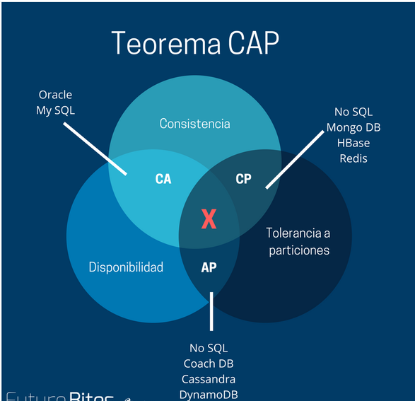


**CA without P：**如果不要求P（不允许分区），则C（强一致性）和A（可用性）是可以保证的。但放弃P的同时也就意味着放弃了系统的扩展性，也就是分布式节点受限，没办法部署子节点，这是违背分布式系统设计的初衷的。

**CP without A：**如果不要求A（可用），相当于每个请求都需要在服务器之间保持强一致，而P（分区）会导致同步时间无限延长(也就是等待数据同步完才能正常访问服务)，一旦发生网络故障或者消息丢失等情况，就要牺牲用户的体验，等待所有数据全部一致了之后再让用户访问系统。设计成CP的系统其实不少，最典型的就是分布式数据库，如Redis、HBase等。对于这些分布式数据库来说，数据的一致性是最基本的要求，因为如果连这个标准都达不到，那么直接采用关系型数据库就好，没必要再浪费资源来部署分布式数据库。


**AP wihtout C：**要高可用并允许分区，则需放弃一致性。一旦分区发生，节点之间可能会失去联系，为了高可用，每个节点只能用本地数据提供服务，而这样会导致全局数据的不一致性。典型的应用就如某米的抢购手机场景，可能前几秒你浏览商品的时候页面提示是有库存的，当你选择完商品准备下单的时候，系统提示你下单失败，商品已售完。这其实就是先在 A（可用性）方面保证系统可以正常的服务，然后在数据的一致性方面做了些牺牲，虽然多少会影响一些用户体验，但也不至于造成用户购物流程的严重阻塞。


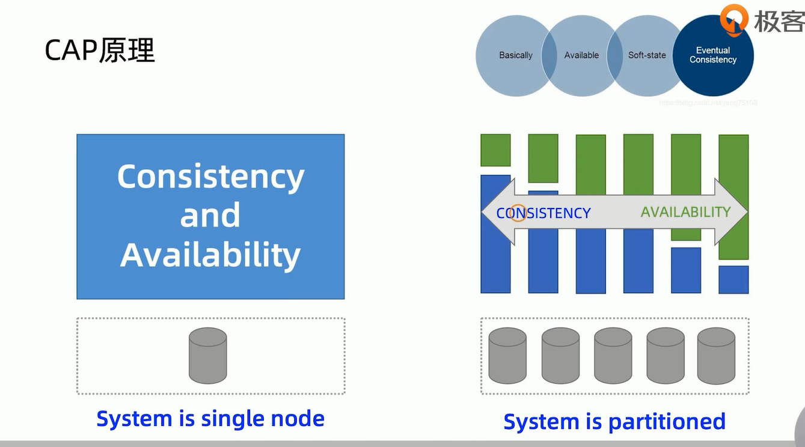

CAP的C表示的是一致性Consistency，A表示可用性	Availability、P表示分区容忍性Partition tolerance。

CAP原理指出，在单机的情况下，也就是不分区的情况下，C和A是可以同时得到满足的。但是在系统分区的情况下，或者说在微服务的情况下，P就是既成事实，那么这个时候，系统将无法同时满足C和A。如果你要A多一点，那么C就会少一点。CAP讲的问题，其实和前面讲的	CQRS最终一致性问题可以说是类似的一种问题。

简单理解，如果你的系统分区了，分成了A和B两个子系统，每个子系统 都有各自独立的数据源，两个子系统之间，通过网络进行通讯，这个时候，如果你更新A的数据，同时要将数据数据同步到B，那么中间由于有网络，肯定会有延迟，甚至不可靠。

所以这个数据同步一定会有延迟。也就是说，中间有短暂的数据不一致。如果你要求强一致性，那么必须要进行封锁，不允许其他方来读取中间状态，也就是暂时不可用 ，性能会受到损害。如果你要求始终可用，那么必然有暂时的数据不一致。

可以说在分布式系统中，CAP是一种客观存在的物理限制，暂时还没有办法，只能折中。


前面提到的这些分布式事务的解决方案，包括2PC还有TCC，在CAP理论当中，它们大都属于要求同步和强一致性的方案。也就是C多一点的方案。

在分布式微服务的场景下面，这些方案的不足是A会受损，并且，性能和吞吐都不在理。想。在大规模交易型网站系统当中基于2PC的或者是基于2PC变体的这些分布式事务解决方案常常成为系统性能可靠性还有扩展性的瓶颈。拍拍贷场景中，使用了基于TCC的分布式事务方案，但是中间多次发生过性能还有可靠性的故障，后来资金团队最终放弃了这个方案。

## 微服务时代的事务处理原则。

传统的基于2PC的分布式事务解决方案，存在性能和扩展性这些问题，并不适用于现代大规模的微服务事务场景。

同时经过一线企业的不断的实践，同时经过一线企业的不断的实践，这些新思路总结起来可以称为微服务时代的事务处理原则。

下面我们就来说明一下这些原则

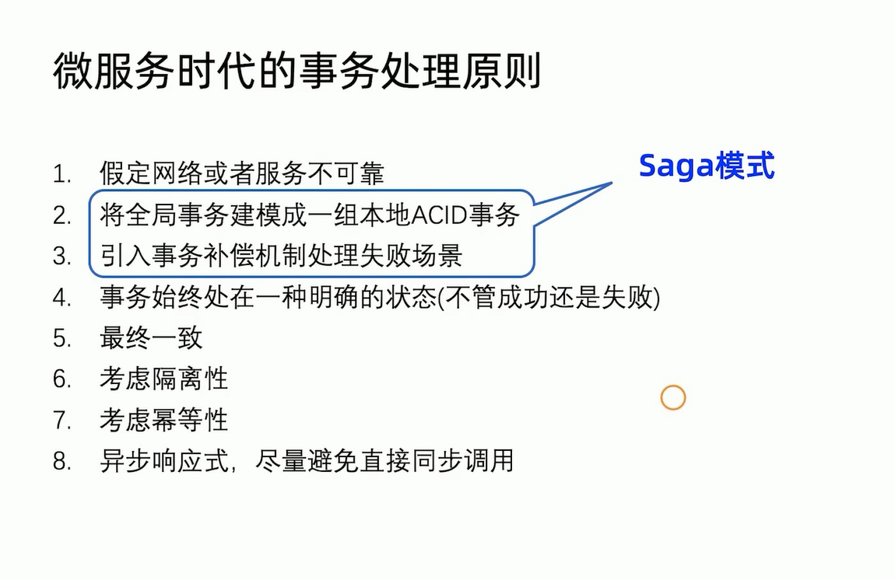

尤其是其中的第二和第三点原则，是saga事务模型的一个基础，Saga事务模式是微服务时代推荐的处理分布式事务的一种方案。

国外流行，国内还没有流行起来。

1.实现saga模式的门槛相对比较高，需要合理的状态建模。

2.saga模式需要可靠的消息队列的支持。

3.国内还没有成熟的支持saga模式的中间件。

当然国外现在已经有生产级的支持Saga模式的中间件产品，就是波波后面会讲的Uber开源的Cadence。

下面我们就来进一步的讲解下Saga模式

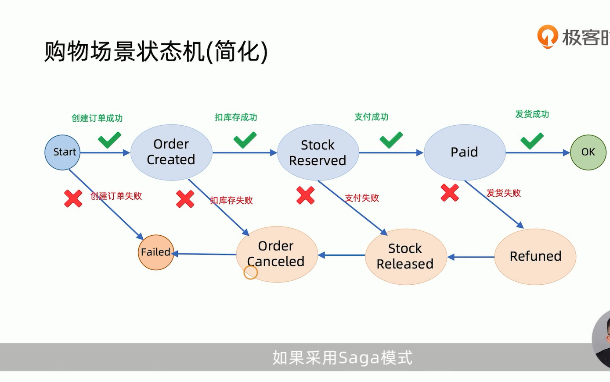

saga模式you两种实现做法

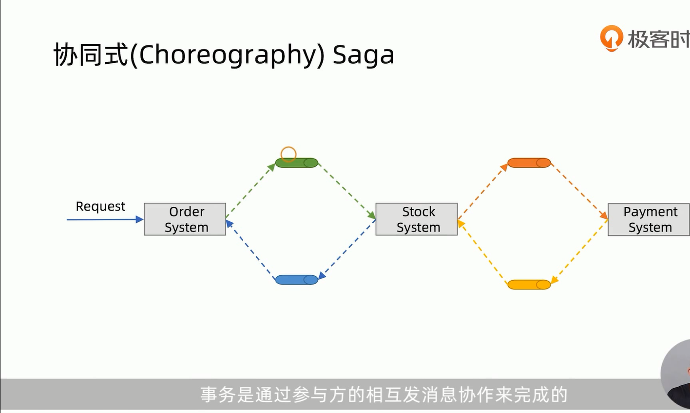

一种叫协同式saga,英文叫Choreograpky Saga,采用这种做法，系统当中没有集中的协调者角色，事务是通过参与方的相互发消息协作来完成的。比方说，对于前面购物的场景，但订单系统完成订单的创建，它就向库存系统发送消息，库存系统接受这个消息，就执行扣减库存的动作，如果扣库存成功，他就向支付系统发送消息，反过来如果支付系统支付失败，就由它触发事务回滚动作，它就向库存系统发送回滚消息,库存系统接受到回滚消息，就执行退还库存的动作，然后向订单系统发送回滚消息，订单系统收到消息，就会将订单标记为失败。前几年我和阿里B2B事业部的技术人员有过一些交流，了解到他们的业务系统就是采用协同式，通过发消息方式来实现的。

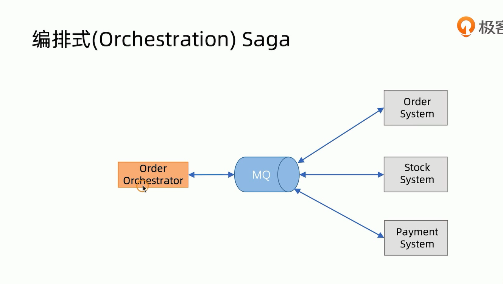

saga模式的另外一种做法是叫编排式saga,英文叫Orchestration Saga。采用这种做法系统当中有一个集中的协调者，或者称为编排这角色，由他统一协调事务的参与方共同来完成事务。比方说对于前面的购物场景，客户端通过订单编排者Order Orchestrator触发购物流程，订单编排者先给订单系统发消息，要求订单系统创建订单，订单系统收到消息利用本地事务创建订单，然后通过MO向订单编排者发回消息告知订单创建成功，然后同样的订单编排者，会依次给库存和支付系统发消息，要求他们分别完成本地事务，最终整个事务协调完成。

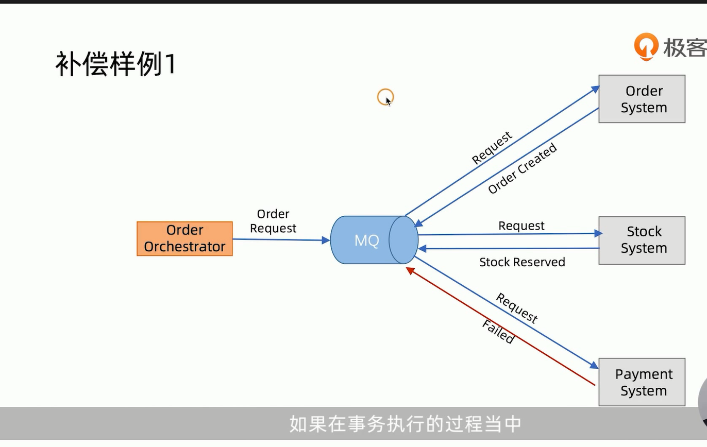

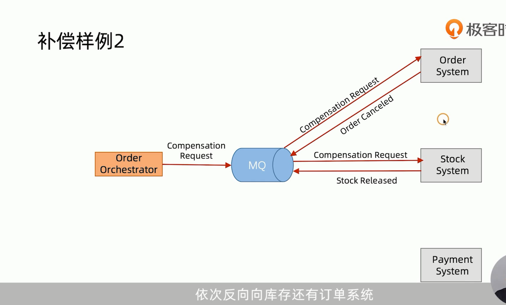


协同式Saga的好处是没有集中的编排者，也就是没有集中的单点问题，整个系统是分散式无中心的，他的不足是每次添加一个新的消息类型，可能需要修改好几个参与方的接口和业务逻辑。另外如果后续增加事务参与方，那么消息的交互复杂度就会变大，整个系统的交互方式会变得难以理解，所以协同式Saga—般仅适用于小规模的系统。

集中式编排的编排流程,它是集中的，比较容易理解，也比较容易去跟踪系统的行为，当然也利于集中的流程管理，后续如果引入新的参与方，—般只需要调整编排者的编排流程，不影响其它参与者。那么它的不足是集中式编排，潜在是有单点问题的，需要考虑高可用部署的问，另外随着参与者的增多，集中式编排器，他的流程逻辑也会变得越来越复杂。在实践当中考虑到可理解性，还有扩展性，大部分企业会考虑采用编排式Saga。

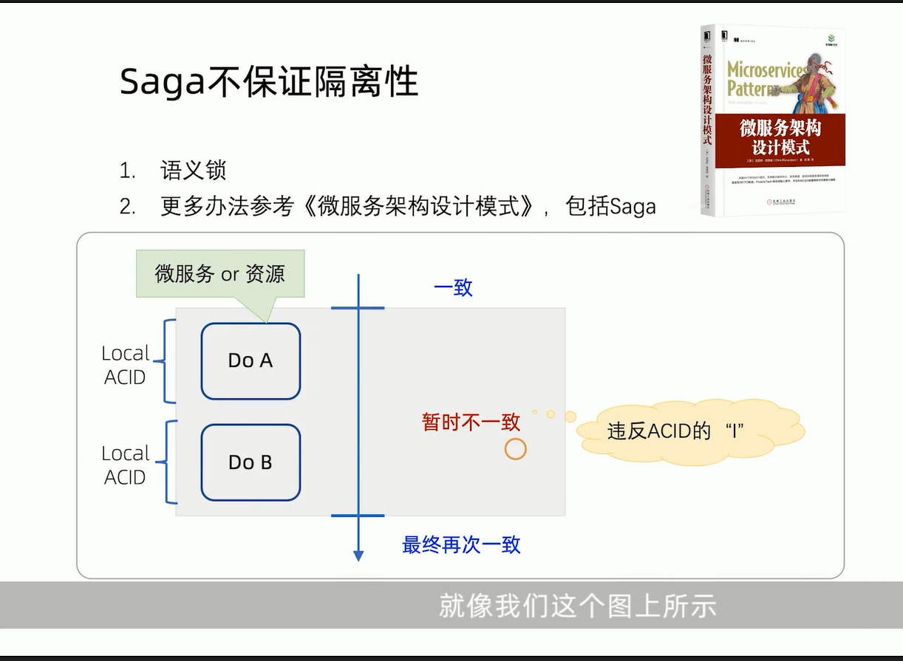

那么Saga它是提倡最终一致的一个事务模式，它只是要求本地事务满足ACID属性。在整个全局事务的执行过程当中，数据是可能出现暂时的不一致的，就像我们上图所示，这个时候，如果有其他事务方来读取或者操作相关的数据，就可能进一步破坏数据的一致性，也就是说Saga并不保证全局事务的隔离性。

举个例子:在一个购物事务正在执行的过程当中,用户同时又取消了订单，这个时候该如何来处理呢，一种简单的办法是采用所谓的语义锁，阻塞或者拒绝其它的事务的执行，所谓语义锁，以订单为例，就是根据订单的状态来判断是否允许其它事务的执行，比方说，如果订单状态正在处理当中，这个时候如果用户要取消订单，那么我们可以规定，处理中的订单不允许取消，也就是不允许取消事务来干扰处理中的事务。和全局锁相比，显然语义锁更加简单轻量，关于saga事务隔离性的问题，建议参考Chris Richardson的《微服务架构设计模式》。

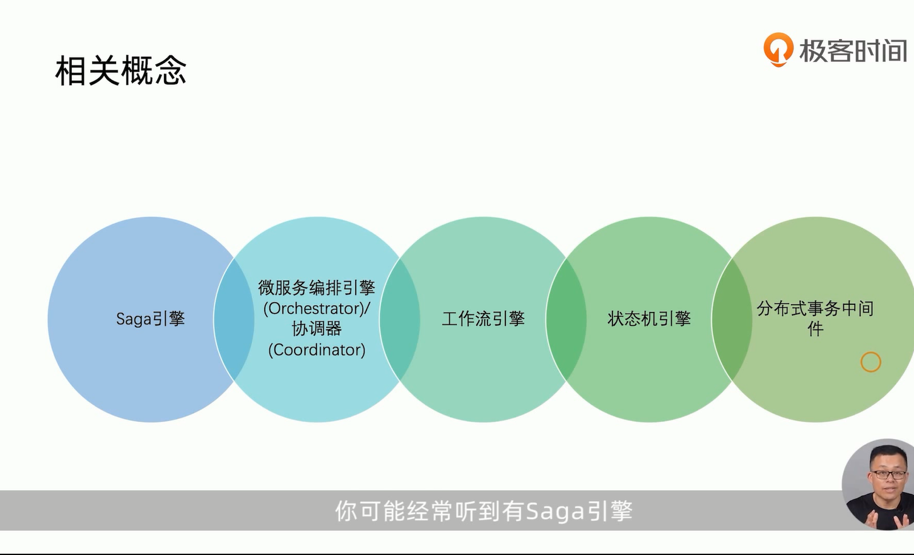


## Uber微服务编排引擎Cadence

刚开始Cadence在Uber主要是用来解决分布式事务问题的，典型的场景包括UberEATS，也就是Uber送餐服务，还有uDebitReward，也就是Uber司机积分服务。这两个案例都是异步长事务的案例，比较复杂。

另外还有一个案例是叫Uber Tipping，一个无限App应用，乘客可以通过这个App给司机一些小费，所以这个就是Uber的一个小费应用，优点张三给李四转账的一个场景。	

因为Uber Tipping，它是一个典型的同步短事务，比较简单，易于理解。所以我这边就以它为案例来讲解Uber Cadence它的编程模型。

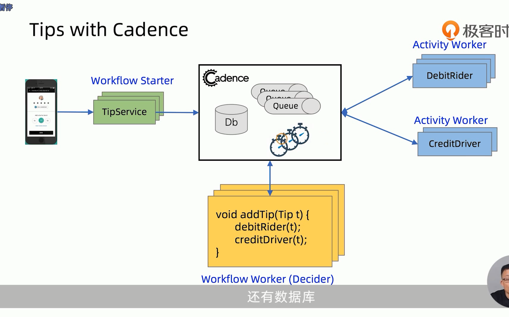

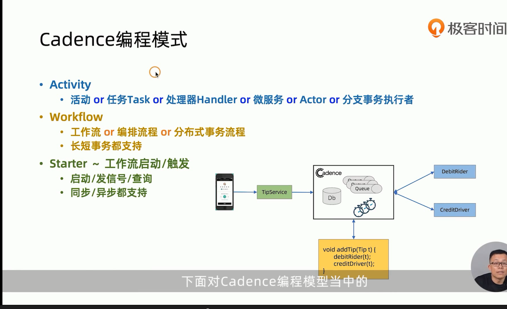

我们这边有一个Cadence Ativity它的实现样例，这个样例对应前面的Uber Tipping，也就是前面讲的Ube小费应用。

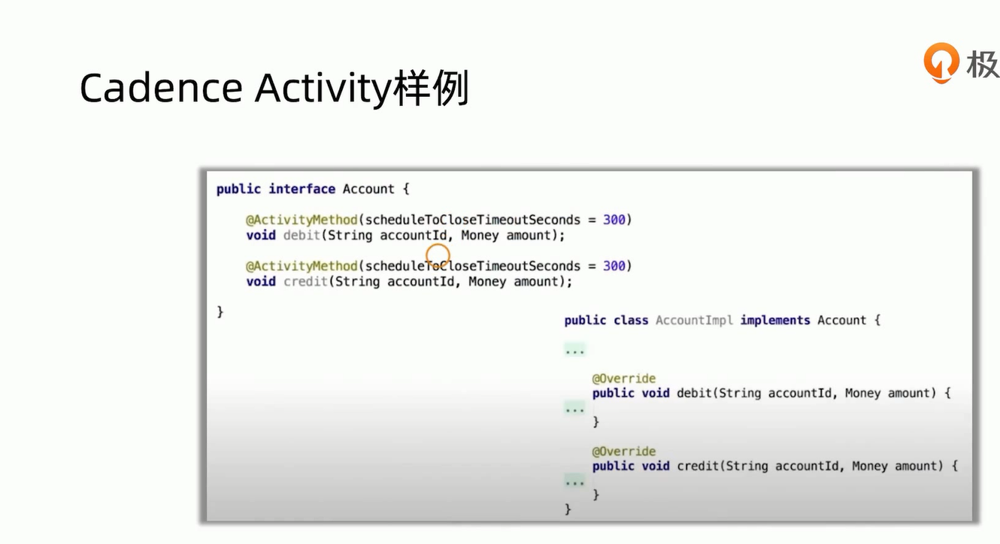

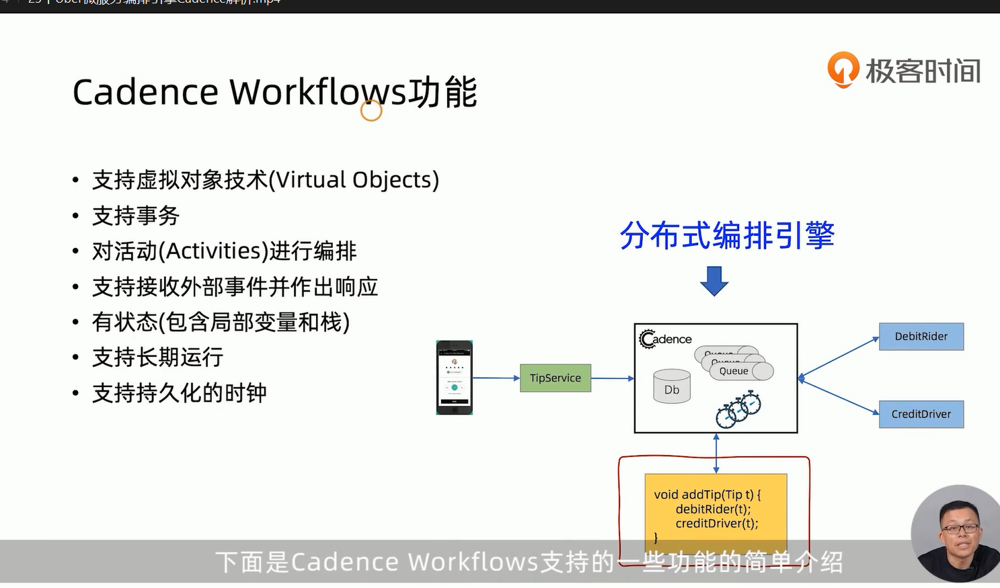


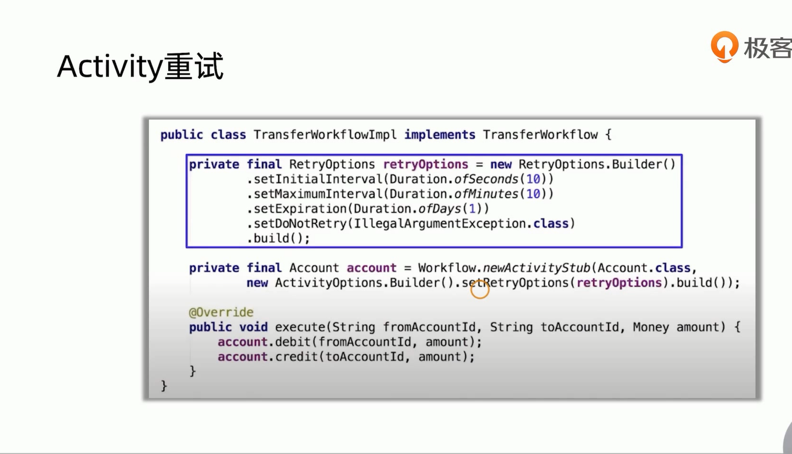

重试策略是直接设置在虚拟对象上的，在工作流的执行execute的方法当中，可以支持这个事务的补偿。比方说，如果给司机转钱，也就是第二步account.credit执行的时候抛异常了可以补偿调用account.credit。


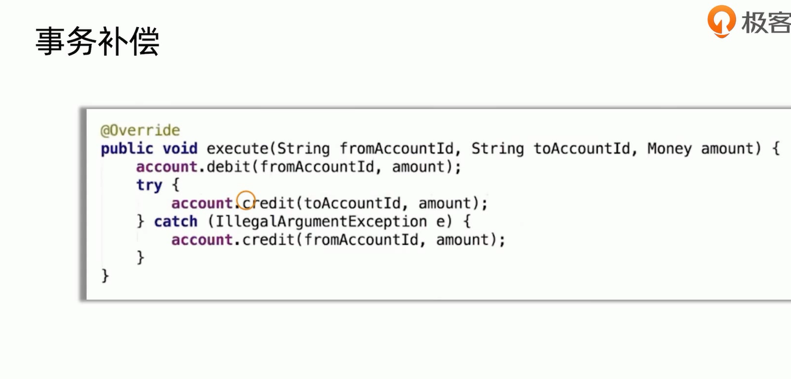

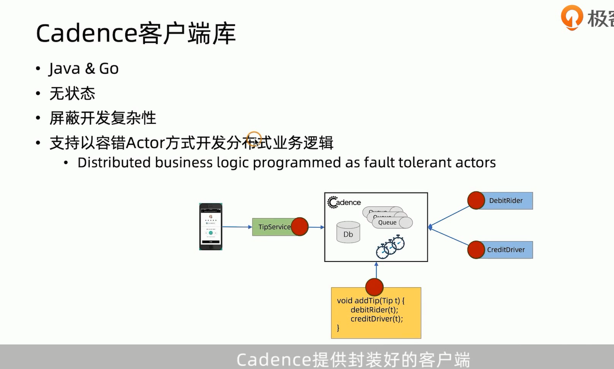

另外Cadence也提供对saga模式的支持，还给出了一个旅行预订bookip这样的一个样例。

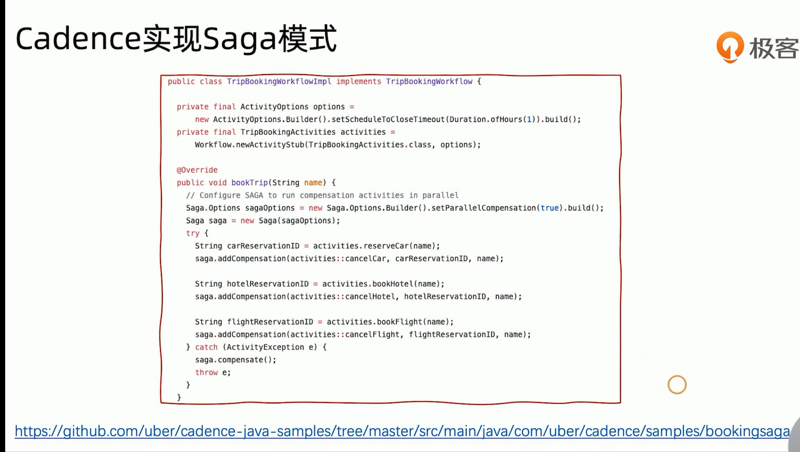

参考


## 服务雪崩

定义：服务雪崩效应是一种因“服务提供者的不可用”（原因）导致“服务调用者不可用”（结果），并将不可用逐渐放大的现象。如下图所示：

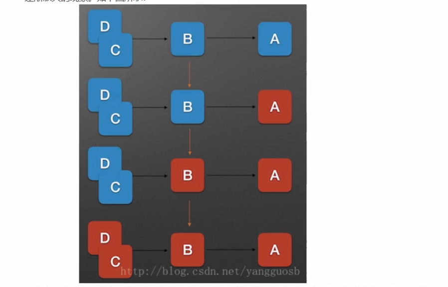

上图中，A为服务提供者，B为A 的服务调用者，当A的不可用，引起B的不可用，并将不可用逐渐放大C和D时，服务雪崩就形成了。

### 形成原因

服务雪崩的过程可以分为三个阶段：

1. 服务提供者不可用
2. 重试加大请求流量
3. 服务调用者不可用

服务雪崩的每个阶段都可能由不同的原因造成，总结如下：


### 应对策略

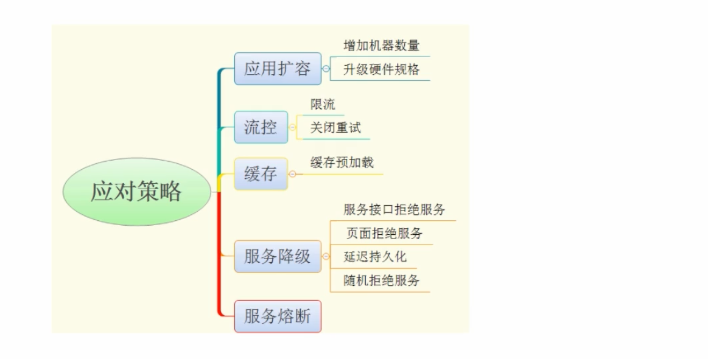

  


