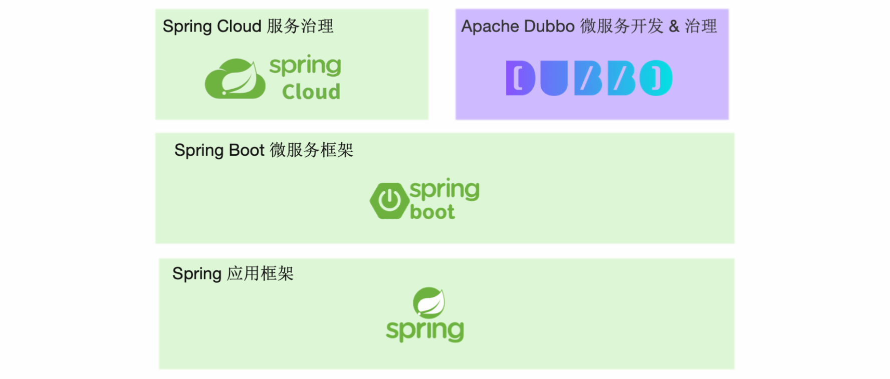
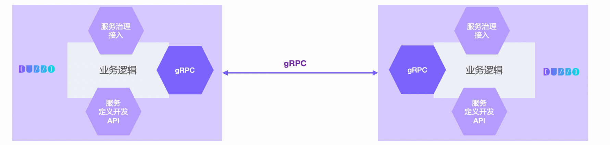

# 

# 与 gRPC、Spring Cloud、Istio 的关系


很多开发者经常会问到 Apache Dubbo 与 Spring Cloud、gRPC 以及一些 Service Mesh 项目如 Istio 的关系，要解释清楚它们的关系并不困难，你只需要跟随这篇文章和 Dubbo 文档做一些更深入的了解，但总的来说，它们之间有些能力是重合的，但在一些场景你可以把它们放在一起使用。

虽然这是一篇Dubbo 维护者写的文档，我们仍会尽力将 Dubbo 与其他组件之间的联系与差异客观、透明的展现出来，但考虑到每个人对不同产品的熟悉程度不一，这里的个别表述可能并不完全准确，希望能给开发者带来帮助。


## Dubbo 与 Spring Cloud



从上图我们可以看出，Dubbo 和 Spring Cloud 有很多相似之处，它们都在整个架构图的相同位置并提供一些相似的功能。

- **Dubbo 和 Spring Cloud 都侧重在对分布式系统中常见问题模式的抽象（如服务发现、负载均衡、动态配置等）**，同时对每一个问题都提供了配套组件实现，形成了一套微服务整体解决方案，让使用 Dubbo 及 Spring Cloud 的用户在开发微服务应用时可以专注在业务逻辑开发上。
- **Dubbo 和 Spring Cloud 都完全兼容 Spring 体系的应用开发模式**，Dubbo 对 Spring 应用开发框架、Spring Boot 微服务框架都做了很好的适配，由于 Spring Cloud 出自 Spring 体系，在这一点上自然更不必多说。

虽然两者有很多相似之处，但由于他们在诞生北京与架构设计上的巨大差异，**两者在性能、适用的微服务集群规模、生产稳定性保障、服务治理等方面都有很大差异**。  

Spring Cloud 的优势在于：

- 同样都支持 Spring 开发体系的情况下，Spring Cloud 得到更多的原生支持
- 对一些常用的微服务模式做了抽象如服务发现、动态配置、异步消息等，同时包括一些批处理任务、定时任务、持久化数据访问等领域也有涉猎。
- 基于 HTTP 的通信模式，加上相对比较完善的入门文档和演示 demo 和 starters，让开发者在第一感觉上更易于上手

Spring Cloud 的问题有：

- 只提供抽象模式的定义不提供官方稳定实现，开发者只能寻求类似 Netflix、Alibaba、Azure 等不同厂商的实现套件，而每个厂商支持的完善度、稳定性、活跃度各异
- 有微服务全家桶却不是能拿来就用的全家桶，demo 上手容易，但落地推广与长期使用的成本非常高
- 欠缺服务治理能力，尤其是流量管控方面如负载均衡、流量路由方面能力都比较弱
- 编程模型与通信协议绑定 HTTP，在性能、与其他 RPC 体系互通上存在障碍
- 总体架构与实现只适用于小规模微服务集群实践，当集群规模增长后就会遇到地址推送效率、内存占用等各种瓶颈的问题，但此时迁移到其他体系却很难实现
- 很多微服务实践场景的问题需要用户独自解决，比如优雅停机、启动预热、服务测试，再比如双注册、双订阅、延迟注册、服务按分组隔离、集群容错等

（靠，我有点看不下去了，真王婆卖瓜，你还真好意思夸！）

而以上这些点，都是 **Dubbo 的优势**所在：

- 完全支持 Spring & Spring Boot 开发模式，同时在服务发现、动态配置等基础模式上提供与 Spring Cloud 对等的能力。
- 是企业级微服务实践方案的整体输出，Dubbo 考虑到了企业微服务实践中会遇到的各种问题如优雅上下线、多注册中心、流量管理等，因此其在生产环境的长期维护成本更低
- 在通信协议和编码上选择更灵活，包括 rpc 通信层协议如 HTTP、HTTP/2(Triple、gRPC)、TCP 二进制协议、rest等，序列化编码协议Protobuf、JSON、Hessian2 等，支持单端口多协议。
- Dubbo 从设计上突出服务服务治理能力，如权重动态调整、标签路由、条件路由等，支持 Proxyless 等多种模式接入 Service Mesh 体系
- 高性能的 RPC 协议编码与实现，
- Dubbo 是在超大规模微服务集群实践场景下开发的框架，可以做到百万实例规模的集群水平扩容，应对集群增长带来的各种问题
- Dubbo 提供 Java 外的多语言实现，使得构建多语言异构的微服务体系成为可能

如果您的目标是构建企业级应用，并期待在未来的持久维护中能够更省心、更稳定，我们建议你能更深入的了解 Dubbo 的使用和其提供的能力。

>Dubbo 在入门资料上的欠缺是对比 Spring Cloud 的一个劣势，这体现在依赖配置管理、文档、demo 示例完善度上，当前整个社区在重点投入这一部分的建设，期望能降低用户在第一天体验和学习 Dubbo 时的门槛，不让开发者因为缺乏文档而错失 Dubbo 这样一款优秀的产品。


## Dubbo 与 gRPC 

Duboo 与 gRPC最大的差异在于两者的定位上：

- **gRPC 定位为一款 RPC 框架**，Google 推出它的核心目标是定义云原生时代的 rpc 通信规范与标准实现；
- **Dubbo 定位是一款微服务开发框架**，它侧重解决微服务实践从服务定义、开发、通信到治理的问题，因此 Dubbo 同时提供了 RPC 通信、与应用开发框架的适配、服务治理等能力。

Dubbo 不绑定特定的通信协议，即Dubbo 服务间可通过多种RPC协议通信并支持灵活切换。因此，你可以在 Dubbo 开发的微服务中选用 gRPC 通信，**Dubbo 完全兼容 gRPC，并将 gRPC 设计为内置原生支持的协议之一**。



如果您看中基于 HTTP/2 的通信协议、基于 Protobuf 的服务定义，并基于此决定选型 gRPC 作为微服务开发框架，那很有可能您会在未来的微服务业务开发中遇到障碍，这主要源于 gRPC 没有为开发者提供以下能力：

- 缺乏与业务应用框架集成的开发模式，用户需要基于 gRPC 底层的 RPC API 定义、发布或调用微服务，中间可能还有与业务应用开发框架整合的问题
- 缺乏微服务周边生态扩展与适配，如服务发现、限流降级、链路追踪等没有多少可供选择的官方实现，且扩展起来非常困难
- 缺乏服务治理能力，作为一款 rpc 框架，缺乏对服务治理能力的抽象

因此，gRPC 更适合作为底层的通信协议规范或编解码包，而 Dubbo 则可用作微服务整体解决方案。**对于 gRPC 协议，我们推荐的使用模式 Dubbo + gRPC 的组合**，这个时候，gRPC 只是隐藏在底层的一个通信协议，不被微服务开发者感知，开发者基于 Dubbo 提供的 API 和配置开发服务，并基于 dubbo 的服务治理能力治理服务，在未来，开发者还能使用 Dubbo 生态和开源的 IDL 配套工具管理服务定义与发布。

如果我们忽略 gRPC 在应用开发框架侧的空白，只考虑如何给 gRPC 带来服务治理能力，则另一种可以采用的模式就是在 Service Mesh 架构下使用 gRPC，这就引出了我们下一小节要讨论的内容：Dubbo 与 Service Mesh 架构的关系。


## Dubbo 与 Istio

Service Mesh 是近年来在云原生背景下诞生的一种微服务架构，在 Kubernetes 体系下，让微服务开发中的更多能力如流量拦截、服务治理等下沉并成为基础设施，让微服务开发、升级更轻量。Istio 是 Service Mesh 的开源代表实现，它从部署架构上分为数据面与控制面，从这一点上与 [Dubbo 总体架构](https://cn.dubbo.apache.org/zh-cn/overview/what/overview) 是基本一致的，Istio 带来的主要变化在于：

- 数据面，Istio 通过引入 Sidecar 实现了对服务流量的透明拦截，Sidecar 通常是与 Dubbo 等开发的传统微服务组件部署在一起
- 控制面，将之前抽象的服务治理中心聚合为一个具有统一实现的具体组件，并实现了与底层基础设施如 Kubernetes 无缝适配

**Dubbo 已经实现了对 Istio 体系的全面接入，可以用 Istio 控制面治理 Dubbo 服务，而在数据面部署架构上，针对 Sidecar 引入的复杂性与性能问题，Dubbo 还支持无代理的 Proxyless 模式。** 除此之外，Dubbo Mesh 体系还解决了 Istio 架构落地过程中的很多问题，包括提供更灵活的数据面部署架构、更低的迁移成本等。


从**数据面**的视角，Dubbo 支持如下两种开发和部署模式，可以通过 Istio、Consul、Linkerd 等控制面组件实现对数据面服务的治理。

- Proxy 模式，Dubbo 与 Envoy 一起部署，Dubbo 作为编程框架 & 协议通信组件存在，流量管控由 Envoy 与 Istio 控制面交互实现。
- Proxyless 模式，Dubbo 进程保持独立部署，Dubbo 通过标准 xDS 协议直接接入 Istio 等控制面组件。

从**控制面**视角，Dubbo 可接入原生 Istio 标准控制面和规则体系，而对于一些 Dubbo 老版本用户，Dubbo Mesh 提供了平滑迁移方案，具体请查看 [Dubbo Mesh 服务网格](https://cn.dubbo.apache.org/zh-cn/overview/tasks/mesh/)。


# RPC 协议


## Dubbo协议

### 特性说明

Dubbo 缺省协议采用单一长连接和 NIO 异步通讯，适合于小数据量大并发的服务调用，以及服务消费者机器数远大于服务提供者机器数的情况。

反之，Dubbo 缺省协议不适合传送大数据量的服务，比如传文件，传视频等，除非请求量很低。

缺省协议，使用基于 netty `3.2.5.Final` 和 hessian2 `3.2.1-fixed-2(Alibaba embed version)` 的 tbremoting 交互。

- 连接个数：单连接
- 连接方式：长连接
- 传输协议：TCP
- 传输方式：NIO 异步传输
- 序列化：Hessian 二进制序列化
- 适用范围：传入传出参数数据包较小（建议小于100K），消费者比提供者个数多，单一消费者无法压满提供者，尽量不要用 dubbo 协议传输大文件或超大字符串。
- 适用场景：常规远程服务方法调用


### 常见问题

**为什么要消费者比提供者个数多?**

因 dubbo 协议采用单一长连接，假设网络为千兆网卡 **1024Mbit=128MByte**，根据测试经验数据每条连接最多只能压满 7MByte(不同的环境可能不一样，供参考)，理论上 1 个服务提供者需要 20 个服务消费者才能压满网卡。


**为什么不能传大包?**

因 dubbo 协议采用单一长连接，如果每次请求的数据包大小为 500KByte，假设网络为千兆网卡 **1024Mbit=128MByte**，每条连接最大 7MByte (不同的环境可能不一样)，单个服务提供者的 TPS(每秒处理事务数)最大为：128MByte / 500KByte = 262。单个消费者调用单个服务提供者的 TPS (每秒处理事务数)最大为：7MByte / 500KByte = 14。如果能接受，可以考虑使用，否则网络将成为瓶颈。


**为什么采用异步单一长连接?**

因为服务的现状大都是服务提供者少，通常只有几台机器，而服务的消费者多，可能整个网站都在访问该服务，比如 Morgan 的提供者只有 6 台提供者，却有上百台消费者，每天有 1.5 亿次调用，如果采用常规的 hessian 服务，服务提供者很容易就被压跨，通过单一连接，保证单一消费者不会压死提供者，长连接，减少连接握手验证等，并使用异步 IO，复用线程池，防止 C10K 问题。


# 高级特性


## 诊断与调优


### 连接控制

#### 功能说明

连接控制功能可以使用户能够控制和管理进出服务器连接数，限制连接数并设置超时，以确保 Dubbo 系统的稳定性和性能，还允许用户根据 IP 地址、端口和协议配置不同级别的访问控制，保护系统免受恶意流量的影响，并降低服务中断的风险，此外提供了一种监视当前流量和连接状态的方法。


#### 使用场景

1. 服务器过载时减少连接数：当服务器过载时，使用 Dubbo 通过设置最大连接限制来减少连接数减少服务器上的负载并防止其崩溃。
2. 减少服务器受到攻击时的连接数：Dubbo 可以限制服务器受到攻击的连接数防止恶意连接充斥服务器并导致服务器崩溃。
3. 限制特定服务的连接数：Dubbo 可以限制特定服务连接数防止服务过载过多的请求并确保及时响应所有请求。
4. 限制来自单个IP地址的连接数：Dubbo 可以限制来自单个地址的连接数降低来自单个IP地址的恶意活动的风险。


#### 使用方式

**服务端连接控制**

限制服务器端接受的连接不能超过 10 个 [1](https://cn.dubbo.apache.org/zh-cn/overview/mannual/java-sdk/advanced-features-and-usage/performance/config-connections/#fn:1)：

```xml
<dubbo:provider protocol="dubbo" accepts="10" />
```

或

```xml
<dubbo:protocol name="dubbo" accepts="10" />
```

**客户端连接控制**

限制客户端服务使用连接不能超过 10 个 [2](https://cn.dubbo.apache.org/zh-cn/overview/mannual/java-sdk/advanced-features-and-usage/performance/config-connections/#fn:2)：

```xml
<dubbo:reference interface="com.foo.BarService" connections="10" />
```

或

```xml
<dubbo:service interface="com.foo.BarService" connections="10" />
```

如果 `<dubbo:service>` 和 `<dubbo:reference>` 都配了 connections，`<dubbo:reference>` 优先，参见：[配置的覆盖策略](https://cn.dubbo.apache.org/zh-cn/overview/mannual/java-sdk/reference-manual/config/principle/)

------

1. 因为连接在 Server上，所以配置在 Provider 上
2. 如果是长连接，比如 Dubbo 协议，connections 表示该服务对每个提供者建立的长连接数 