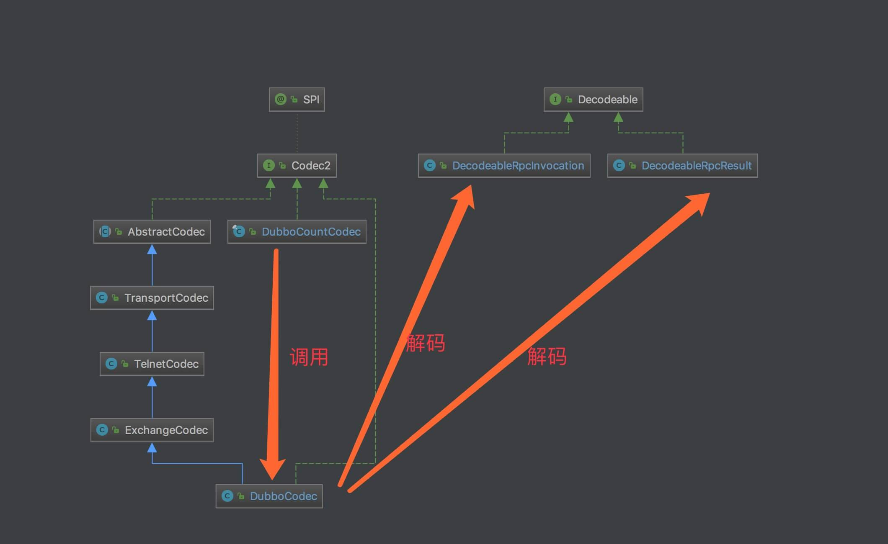
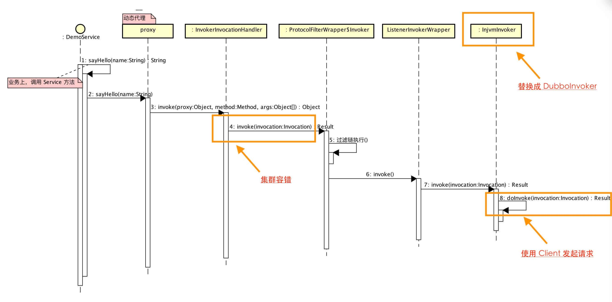
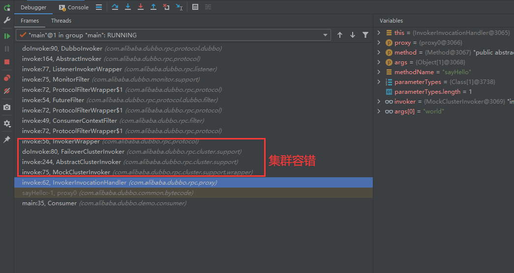
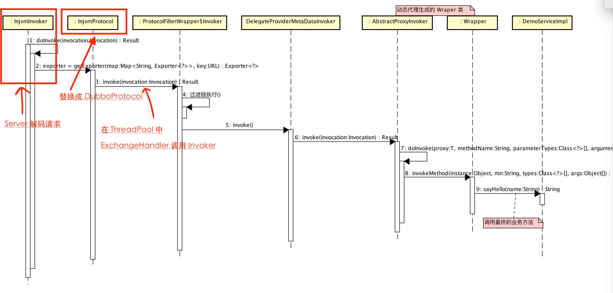
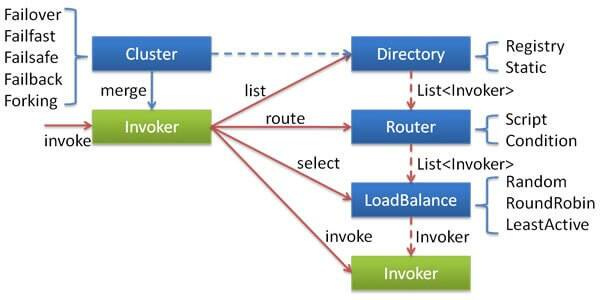
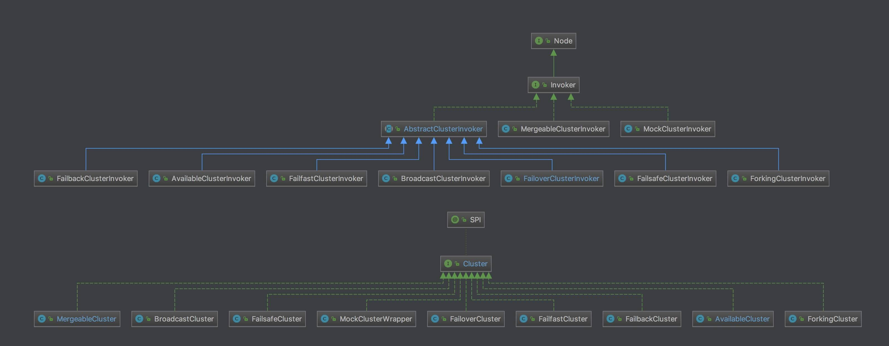
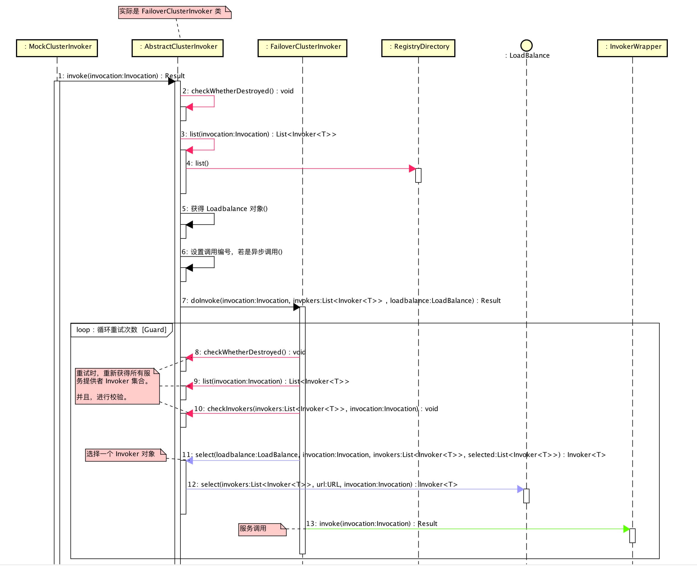
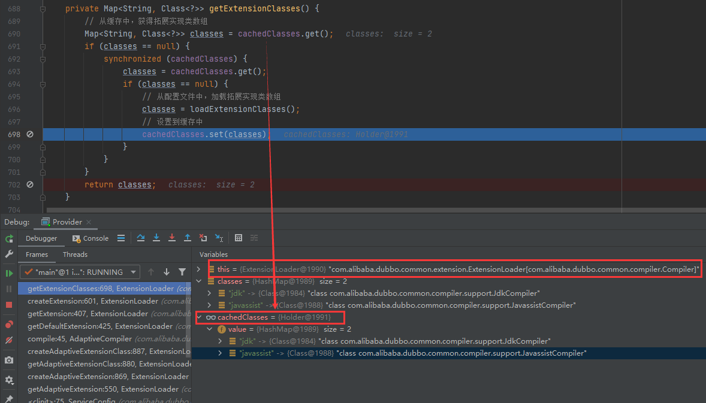
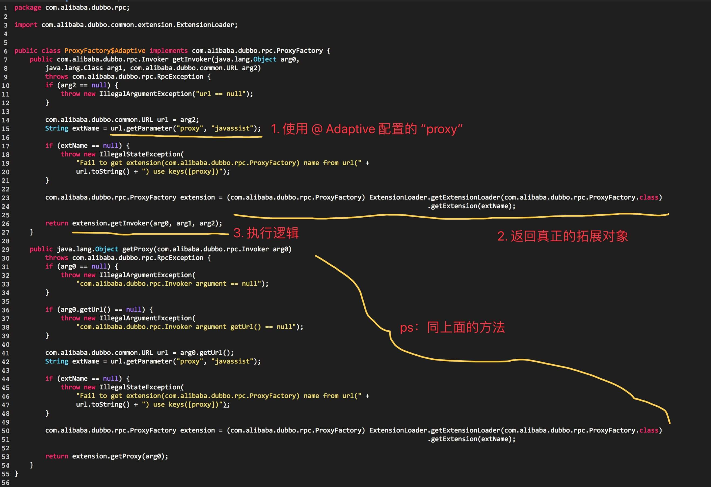
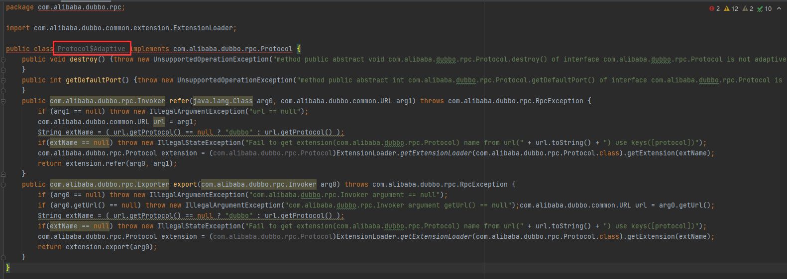

# dubbo 源码简析


## 服务调用


### 远程调用（Dubbo）通信实现

本节涉及类图如下：




#### Codec

在 [ExchangeCodec](https://github.com/apache/incubator-dubbo/blob/master/dubbo-remoting/dubbo-remoting-api/src/main/java/com/alibaba/dubbo/remoting/exchange/codec/ExchangeCodec.java) 中，我们看到对 Request 和 Response 的**通用**解析。但是它是**不满足**在 `dubbo://` 协议中，对 [RpcInvocation](http://svip.iocoder.cn/Dubbo/rpc-dubbo-1-remoting/) 和 [RpcResult](http://svip.iocoder.cn/Dubbo/rpc-dubbo-1-remoting/) 作为 **内容体( Body )** 的编解码的需要的。

另外，在 `dubbo://` 协议中，支持 [参数回调](http://dubbo.apache.org/zh-cn/docs/user/demos/callback-parameter.html) 的特性，也是需要在编解码做一些**特殊逻辑**。


#### DubboCountCodec

支持**多消息**的编解码器。

##### 编码

```java
public void encode(Channel channel, ChannelBuffer buffer, Object msg) throws IOException {
    codec.encode(channel, buffer, msg);
}
```

##### 解码

```java
public Object decode(Channel channel, ChannelBuffer buffer) throws IOException {
    // 记录当前读位置，用于下面计算每条消息的长度。
    int save = buffer.readerIndex();
    // 创建 MultiMessage 对象，MultiMessageHandler 支持对它的处理分发
    MultiMessage result = MultiMessage.create();
    // 循环解析消息，直到结束
    do {
        // 解码
        Object obj = codec.decode(channel, buffer);
        // 输入不够，重置读进度
        if (Codec2.DecodeResult.NEED_MORE_INPUT == obj) {
            buffer.readerIndex(save);
            break;
            // 解析到消息
        } else {
            // 添加结果消息
            result.addMessage(obj);
            // 记录消息长度到隐式参数集合，用于 MonitorFilter 监控
            logMessageLength(obj, buffer.readerIndex() - save);
            // 记录当前读位置
            save = buffer.readerIndex();
        }
    } while (true);
    // 需要更多的输入
    if (result.isEmpty()) {
        return Codec2.DecodeResult.NEED_MORE_INPUT;
    }
    // 返回解析到的消息
    if (result.size() == 1) {
        return result.get(0);
    }
    return result;
}
```


#### DubboCodec

实现 Codec2 接口，继承 ExchangeCodec 类，**Dubbo 编解码器**实现类。


##### 编码内容体

###### 请求

```java
/**
 * 编码内容体--请求
 */
protected void encodeRequestData(Channel channel, ObjectOutput out, Object data, String version) throws IOException {
    RpcInvocation inv = (RpcInvocation) data;

    // 编码 RpcInvocation 对象，写入需要编码的字段，写入 `dubbo` `path` `version`
    out.writeUTF(version);
    out.writeUTF(inv.getAttachment(Constants.PATH_KEY));
    out.writeUTF(inv.getAttachment(Constants.VERSION_KEY));

    // 写入方法、方法签名、方法参数集合
    out.writeUTF(inv.getMethodName());
    out.writeUTF(ReflectUtils.getDesc(inv.getParameterTypes()));
    Object[] args = inv.getArguments();
    if (args != null)
        for (int i = 0; i < args.length; i++) {
            out.writeObject(encodeInvocationArgument(channel, inv, i));
        }
    // 写入隐式传参集合
    out.writeObject(inv.getAttachments());
}
```


###### 响应

```java
/**
 * 编码内容体--响应
 */
protected void encodeResponseData(Channel channel, ObjectOutput out, Object data, String version) throws IOException {
    Result result = (Result) data;
    // currently, the version value in Response records the version of Request
    boolean attach = Version.isSupportResponseAttatchment(version);
    Throwable th = result.getException();
    // 正常
    if (th == null) {
        Object ret = result.getValue();
        // 空返回
        if (ret == null) {
            out.writeByte(attach ? RESPONSE_NULL_VALUE_WITH_ATTACHMENTS : RESPONSE_NULL_VALUE);
            // 有返回
        } else {
            out.writeByte(attach ? RESPONSE_VALUE_WITH_ATTACHMENTS : RESPONSE_VALUE);
            out.writeObject(ret);
        }
        // 异常
    } else {
        out.writeByte(attach ? RESPONSE_WITH_EXCEPTION_WITH_ATTACHMENTS : RESPONSE_WITH_EXCEPTION);
        out.writeObject(th);
    }

    if (attach) {
        // returns current version of Response to consumer side.
        result.getAttachments().put(Constants.DUBBO_VERSION_KEY, Version.getProtocolVersion());
        out.writeObject(result.getAttachments());
    }
}
```


##### 解码内容体

```java
/**
 * 解码内容体
 */
protected Object decodeBody(Channel channel, InputStream is, byte[] header) throws IOException {
    byte flag = header[2];
    byte proto = (byte) (flag & SERIALIZATION_MASK);
    // get request id.
    // 获得请求||响应编号
    long id = Bytes.bytes2long(header, 4);
    // 解析响应
    if ((flag & FLAG_REQUEST) == 0) {
        // decode response.
        Response res = new Response(id);
        // 若是心跳事件，进行设置
        if ((flag & FLAG_EVENT) != 0) {
            res.setEvent(Response.HEARTBEAT_EVENT);
        }
        // get status.
        byte status = header[3];
        res.setStatus(status);
        try {
            if (status == Response.OK) {
                Object data;
                // 解码心跳事件
                if (res.isHeartbeat()) {
                    byte[] eventPayload = CodecSupport.getPayload(is);
                    data = decodeHeartbeatData(channel,
                                               CodecSupport.deserialize(channel.getUrl(), new ByteArrayInputStream(eventPayload), proto), eventPayload);
                    // 解码其它事件    
                } else if (res.isEvent()) {
                    byte[] eventPayload = CodecSupport.getPayload(is);
                    data = decodeEventData(channel,
                                           CodecSupport.deserialize(channel.getUrl(), new ByteArrayInputStream(eventPayload), proto), eventPayload);
                    // 解码普通请求    
                } else {
                    // 在通信框架（例如，Netty）的 IO 线程，解码
                    DecodeableRpcResult result;
                    if (channel.getUrl().getParameter(
                        Constants.DECODE_IN_IO_THREAD_KEY,
                        Constants.DEFAULT_DECODE_IN_IO_THREAD)) {
                        result = new DecodeableRpcResult(channel, res, is,
                                                         (Invocation) getRequestData(id), proto);
                        result.decode();
                        // 在 Dubbo ThreadPool 线程，解码，使用 DecodeHandler
                    } else {
                        result = new DecodeableRpcResult(channel, res,
                                                         new UnsafeByteArrayInputStream(readMessageData(is)),
                                                         (Invocation) getRequestData(id), proto);
                    }
                    data = result;
                }
                res.setResult(data);
            } else {
                res.setErrorMessage(CodecSupport.deserialize(channel.getUrl(), is, proto).readUTF());
            }
        } catch (Throwable t) {
            if (log.isWarnEnabled()) {
                log.warn("Decode response failed: " + t.getMessage(), t);
            }
            res.setStatus(Response.CLIENT_ERROR);
            res.setErrorMessage(StringUtils.toString(t));
        }
        return res;
        // 解析请求
    } else {
        // decode request.
        Request req = new Request(id);
        req.setVersion(Version.getProtocolVersion());
        req.setTwoWay((flag & FLAG_TWOWAY) != 0);
        if ((flag & FLAG_EVENT) != 0) {
            req.setEvent(Request.HEARTBEAT_EVENT);
        }
        try {
            Object data;
            if (req.isHeartbeat()) {
                byte[] eventPayload = CodecSupport.getPayload(is);
                data = decodeHeartbeatData(channel,
                                           CodecSupport.deserialize(channel.getUrl(), new ByteArrayInputStream(eventPayload), proto), eventPayload);
            } else if (req.isEvent()) {
                byte[] eventPayload = CodecSupport.getPayload(is);
                data = decodeEventData(channel,
                                       CodecSupport.deserialize(channel.getUrl(), new ByteArrayInputStream(eventPayload), proto), eventPayload);
            } else {
                DecodeableRpcInvocation inv;
                if (channel.getUrl().getParameter(
                    Constants.DECODE_IN_IO_THREAD_KEY,
                    Constants.DEFAULT_DECODE_IN_IO_THREAD)) {
                    inv = new DecodeableRpcInvocation(channel, req, is, proto);
                    inv.decode();
                } else {
                    inv = new DecodeableRpcInvocation(channel, req,
                                                      new UnsafeByteArrayInputStream(readMessageData(is)), proto);
                }
                data = inv;
            }
            req.setData(data);
        } catch (Throwable t) {
            if (log.isWarnEnabled()) {
                log.warn("Decode request failed: " + t.getMessage(), t);
            }
            // bad request
            req.setBroken(true);
            req.setData(t);
        }
        return req;
    }
}
```


### 远程调用（Dubbo） 同步调用


#### 调用顺序图

**消费者调用服务的顺序图：**



- 此图是在**injvm://**协议的顺序图的基础上修改：
  - 将 InjvmInvoker 替换成 DubboInvoker 。
  - 在 `#doInvoker()` 方法中，DubboInvoker 会调用 Client ，向服务提供者发起请求。

**那集群容错**呢？在 InvokerInvocationHandler 之后，ProtocolFilterWrapper$Invoker 之前。如下图所示：



**提供者提供服务的顺序图**



此图是在 **injvm://**协议的顺序图的基础上修改：

- InjvmInvoker 替换成 ExchangeServer 。例如在 Netty4 中，IO Worker 解析请求，转发给 ExchangeHandler 处理。
- InjvmProtocol 替换成 DubboProtocol 。在该类中，实现了自定义的 ExchangeHandler 处理请求。


##  序列化


### 顶层抽象API

**Serialization** 接口

```java
/**
 * 序列化接口
 */
@SPI("hessian2")      
public interface Serialization {
    /**
     * create serializer
     * 创建 ObjectOutput 对象，序列化输出到 OutputStream
     */
    @Adaptive
    ObjectOutput serialize(URL url, OutputStream output) throws IOException;

    /**
     * create deserializer
     * 创建 ObjectInput 对象，从 InputStream 反序列化
     */
    @Adaptive
    ObjectInput deserialize(URL url, InputStream input) throws IOException;
}
```


**ObjectInput** 接口

```java
/**
 * Object input.
 * 对象输入接口
 * 在 DataInput 的基础上，增加读取对象的数据。
 */
public interface ObjectInput extends DataInput {

    /**
     * read object.
     *
     * @return object.
     */
    Object readObject() throws IOException, ClassNotFoundException;

    /**
     * read object.
     *
     * @param cls object type.
     * @return object.
     */
    <T> T readObject(Class<T> cls) throws IOException, ClassNotFoundException;

    /**
     * read object.
     *
     * @param cls object type.
     * @return object.
     */
    <T> T readObject(Class<T> cls, Type type) throws IOException, ClassNotFoundException;

}
```


**ObjectOutput** 接口

```java
/**
 * Object output.
 * 实现 DataOutput 接口，对象输出接口。
 * 在 DataOutput 的基础上，增加写入对象的数据。
 */
public interface ObjectOutput extends DataOutput {

    /**
     * write object.
     *
     * @param obj object.
     */
    void writeObject(Object obj) throws IOException;

}
```


### ~~序列化实现方式x~~


## 集群容错


### 顶层抽象API

#### 概述

- Cluster 实现
- Directory 实现
- LoadBalance 实现
- Merger 实现
- Router 实现
- Configurator 实现




- **左边 invoke：**通过 **Cluster** 暴露Invoker对象，从而实现统一、透明的调用过程。
- **右边 list** ：通过 Directory 中，**获取**可调用的 Invoker 集合。
- **右边 route** ：通过 Router ，**过滤**符合**路由规则**的 Invoker 集合。
- **右边 select** ：通过 LoadBalance ，根据**负载均衡机制**，**选择**一个符合的 Invoker 对象。
- **右边 invoke** ：调用该 Invoker 对象。

**类图**




#### Cluster接口

```java
/**
 * 集群接口
 * Cluster. (SPI, Singleton, ThreadSafe)
 */
@SPI(FailoverCluster.NAME)     
public interface Cluster {

    /**
     * Merge the directory invokers to a virtual invoker.
     * 基于 Directory ，创建 Invoker 对象，实现统一、透明的 Invoker 调用过程
     */
    @Adaptive  
    <T> Invoker<T> join(Directory<T> directory) throws RpcException;

}
```

在 RegistryProtocol 的 `#doRefer(Cluster, Registry, type, url)` 方法中，会调用 `Cluster#join(directory)` 方法，创建 Invoker 对象。代码如下：

```java
private Cluster cluster; // <1>

private <T> Invoker<T> doRefer(Cluster cluster, Registry registry, Class<T> type, URL url) {
    // 创建 RegistryDirectory 对象，并设置注册中心 <2>
    RegistryDirectory<T> directory = new RegistryDirectory<T>(type, url);
    directory.setRegistry(registry);
    directory.setProtocol(protocol);
    
    // ... 省略无关代码

    // 创建 Invoker 对象 <3>
    Invoker invoker = cluster.join(directory);
    // 向本地注册表，注册消费者
    ProviderConsumerRegTable.registerConsumer(invoker, url, subscribeUrl, directory);
    return invoker;
}
```

- `<1>` ：`cluster` 属性，`Cluster$Adaptive` 对象
- `<2>` ：创建 RegistryDirectory 对象。通过它，可以注册到**一个**注册中心的所有服务**提供者**，即上文提到的【右边 list】。
- `<3>` ：调用 `Cluster#join(directory)` 方法，创建 Invoker 对象。因为 `cluster` 是 Dubbo SPI Adaptive 类，所以可以自动获取到**对应的** Cluster 实现类。


#### AbstractClusterInvoker

`com.alibaba.dubbo.rpc.cluster.support.AbstractClusterInvoker` ，实现 Invoker 接口，Cluster Invoker 抽象类：

- **实现**例如选择一个符合 Invoker 对象等等**公用**方法
- **定义** `#doInvoke(Invocation, List<Invoker<T>>, LoadBalance)` **抽象**方法，实现子 Cluster 的 Invoker 实现类的**服务调用**的差异逻辑。


##### list

```java
/**
 * 获得所有服务提供者 Invoker 集合
 */
protected List<Invoker<T>> list(Invocation invocation) throws RpcException {
    List<Invoker<T>> invokers = directory.list(invocation);
    return invokers;
}
```


##### select

```java
    /**
     * 从候选的 Invoker 集合，选择一个最终调用的 Invoker 对象
     */
    protected Invoker<T> select(LoadBalance loadbalance, Invocation invocation, List<Invoker<T>> invokers, List<Invoker<T>> selected) throws RpcException {
        if (invokers == null || invokers.isEmpty())
            return null;
        String methodName = invocation == null ? "" : invocation.getMethodName();

        // 获得 sticky 配置项，方法级
        boolean sticky = invokers.get(0).getUrl().getMethodParameter(methodName, Constants.CLUSTER_STICKY_KEY, Constants.DEFAULT_CLUSTER_STICKY);
        {
            //ignore overloaded method
            // 若 stickyInvoker 不存在于 invokers 中，说明不在候选中，需要置空，重新选择
            if (stickyInvoker != null && !invokers.contains(stickyInvoker)) {
                stickyInvoker = null;
            }
            //ignore concurrency problem
            if (sticky && stickyInvoker != null && (selected == null || !selected.contains(stickyInvoker))) {
                if (availablecheck && stickyInvoker.isAvailable()) {
                    return stickyInvoker;
                }
            }
        }
        // 执行选择
        Invoker<T> invoker = doSelect(loadbalance, invocation, invokers, selected);

        // 若开启粘滞连接的特性，记录最终选择的 Invoker 到 stickyInvoker
        if (sticky) {
            stickyInvoker = invoker;
        }
        return invoker;
    }
```


##### invoke

```java
/**
 * 调用服务提供者的逻辑
 */
@Override
public Result invoke(final Invocation invocation) throws RpcException {
    checkWhetherDestroyed();
    LoadBalance loadbalance = null;
	.......
    // 执行调用,子 Cluster 的 Invoker 实现类的服务调用的差异逻辑
    return doInvoke(invocation, invokers, loadbalance);
}
```


### Cluster实现


#### FailoverCluster

`com.alibaba.dubbo.rpc.cluster.support.FailoverCluster` ，实现 Cluster 接口，失败自动切换，当出现失败，重试其它服务器。通常用于**读操作**，但重试会带来更长延迟。可通过 `retries="2"` 来设置重试次数(不含第一次)。代码如下：

```java
public class FailoverCluster implements Cluster {

    public final static String NAME = "failover";

    @Override
    public <T> Invoker<T> join(Directory<T> directory) throws RpcException {
        return new FailoverClusterInvoker<T>(directory);
    }

}
```


### AbstractClusterInvoker实现


#### FailoverClusterInvoker

`FailoverClusterInvoker` ，实现 AbstractClusterInvoker 抽象类，**FailoverCluster** Invoker 实现类。

我们先来瞅瞅**调用顺序图**：



- 实际逻辑很简单：**循环**，查找一个 Invoker 对象，进行调用，直到**成功**。


##  NIO 服务器


### 顶层抽象API

没看懂


## 过滤器


## 拓展机制 SPI

想要理解 Dubbo ，理解 Dubbo SPI 是非常必须的。在 Dubbo 中，提供了大量的**拓展点**，基于 Dubbo SPI 机制加载。如下图所示：


在看具体的 Dubbo SPI 实现之前，我们先理解 Dubbo SPI 产生的背景：

>Dubbo 的扩展点加载从 JDK 标准的 SPI (Service Provider Interface) 扩展点发现机制加强而来。
>
>Dubbo 改进了 JDK 标准的 SPI 的以下问题：
>
>1. JDK 标准的 SPI 会一次性实例化扩展点所有实现，如果有扩展实现初始化很耗时，但如果没用上也加载，会很浪费资源。
>2. 增加了对扩展点 IoC 和 AOP 的支持，一个扩展点可以直接 setter 注入其它扩展点。

[com.alibaba.dubbo.common.extension.ExtensionLoader](http://svip.iocoder.cn/Dubbo/spi/ExtensionLoader) ，拓展加载器。这是 Dubbo SPI 的**核心**。


### 获得拓展配置

getExtensionClasses()方法，获得拓展实现类数组。

```java

/**
 * 缓存的拓展实现类集合
 * 例如
 *  key:"jdk"        
 *  value:"com.alibaba.dubbo.common.compiler.support.JdkCompiler"
 *  key:"javassist"  
 *  value:"com.alibaba.dubbo.common.compiler.support.JavassistCompiler"
 */
private final Holder<Map<String, Class<?>>> cachedClasses = new Holder<Map<String, Class<?>>>();

/**
 * 获得拓展实现类数组
 * @return  拓展实现类数组
 */
private Map<String, Class<?>> getExtensionClasses() {
    // 从缓存中，获得拓展实现类数组
    Map<String, Class<?>> classes = cachedClasses.get();
    if (classes == null) {
        synchronized (cachedClasses) {
            classes = cachedClasses.get();
            if (classes == null) {
                // 从配置文件中，加载拓展实现类数组
                classes = loadExtensionClasses();
                // 设置到缓存中
                cachedClasses.set(classes);
            }
        }
    }
    return classes;
}
```

**debug 示例图**




###  获得拓展加载器

在 Dubbo 的代码里，常常能看到如下的代码：

```java
ExtensionLoader.getExtensionLoader(Protocol.class).getExtension(name)
```


#### getExtensionLoader

getExtensionLoader(type) **静态**方法，根据拓展点的接口，获得拓展加载器。代码如下：

```java
    
/**
 * 拓展加载器集合
 * key：拓展接口
 */
private static final ConcurrentMap<Class<?>, ExtensionLoader<?>> EXTENSION_LOADERS = new 	ConcurrentHashMap<Class<?>, ExtensionLoader<?>>();

/**
 * 根据拓展点的接口，获得拓展加载器
 * @param type 接口
 * @param <T>  泛型
 * @return  加载器
 */
public static <T> ExtensionLoader<T> getExtensionLoader(Class<T> type) {
    if (type == null)
        throw new IllegalArgumentException("Extension type == null");
    // 必须是接口
    if (!type.isInterface()) {
        throw new IllegalArgumentException("Extension type(" + type + ") is not interface!");
    }
    // 必须包含 @SPI 注解
    if (!withExtensionAnnotation(type)) {
        throw new IllegalArgumentException("Extension type(" + type +
                                           ") is not extension, because WITHOUT @" + SPI.class.getSimpleName() + " Annotation!");
    }

    // 获得接口对应的拓展点加载器
    ExtensionLoader<T> loader = (ExtensionLoader<T>) EXTENSION_LOADERS.get(type);
    if (loader == null) {
        EXTENSION_LOADERS.putIfAbsent(type, new ExtensionLoader<T>(type));
        loader = (ExtensionLoader<T>) EXTENSION_LOADERS.get(type);
    }
    return loader;
}
```

就是从**EXTENSION_LOADERS**获得拓展加载器，如果没有，则新建一个放入**EXTENSION_LOADERS**中。


### 获得指定拓展对象

在 Dubbo 的代码里，常常能看到如下的代码：

```java
ExtensionLoader.getExtensionLoader(Protocol.class).getExtension(name)
```


#### getExtension

**getExtension()** 方法，返回指定名字的扩展对象。如果指定名字的扩展不存在，则抛异常 IllegalStateException 。代码如下：

```java
/**
 * 缓存的拓展对象集合
 *
 * key：拓展名
 * value：拓展对象
 *
 * 例如，Protocol 拓展
 *          key：dubbo value：DubboProtocol
 *          key：injvm value：InjvmProtocol
 */
private final ConcurrentMap<String, Holder<Object>> cachedInstances = new 		  ConcurrentHashMap<String, Holder<Object>>();

/**
 * 返回指定名字的扩展对象
 * @param name 拓展名
 * @return 拓展对象         
 */
public T getExtension(String name) {
    if (name == null || name.length() == 0)
        throw new IllegalArgumentException("Extension name == null");

    // 查找 默认的 拓展对象
    if ("true".equals(name)) {
        return getDefaultExtension();
    }

    // 从 缓存中 获得对应的拓展对象
    Holder<Object> holder = cachedInstances.get(name);
    if (holder == null) {
        cachedInstances.putIfAbsent(name, new Holder<Object>());
        holder = cachedInstances.get(name);
    }
    Object instance = holder.get();
    if (instance == null) {
        synchronized (holder) {
            instance = holder.get();
            // 从 缓存中 未获取到，进行创建缓存对象。
            if (instance == null) {
                instance = createExtension(name);
                // 设置创建对象到缓存中
                holder.set(instance);
            }
        }
    }
    return (T) instance;
}
```


#### createExtension

createExtension(name)方法，创建拓展名的拓展对象，并缓存。

```java
/**
 * 拓展实现类集合
 * key：拓展实现类
 * value：拓展对象
 * 例如，key 为 Class<AccessLogFilter>
 * value 为 AccessLogFilter 对象
 */
private static final ConcurrentMap<Class<?>, Object> EXTENSION_INSTANCES = new ConcurrentHashMap<Class<?>, Object>();


/**
 * 创建拓展名的拓展对象，并缓存。
 * @param name  拓展名
 * @return 拓展对象
 */
private T createExtension(String name) {
    // 获得拓展名对应的拓展实现类
    Class<?> clazz = getExtensionClasses().get(name);
    if (clazz == null) {
        throw findException(name);
    }
    try {
        // 从缓存中，获得拓展对象。
        T instance = (T) EXTENSION_INSTANCES.get(clazz);
        if (instance == null) {
            // 当缓存不存在时，创建拓展对象，并添加到 EXTENSION_INSTANCES 中。因为 #getExtension(name) 方法中已经加 synchronized 修饰，所以此处不用同步。
            EXTENSION_INSTANCES.putIfAbsent(clazz, clazz.newInstance());
            instance = (T) EXTENSION_INSTANCES.get(clazz);
        }
        // 注入依赖的属性,向创建的拓展注入其依赖的属性
        injectExtension(instance);
        // 创建 Wrapper 拓展对象,将 instance 包装在其中
        Set<Class<?>> wrapperClasses = cachedWrapperClasses;
        if (wrapperClasses != null && !wrapperClasses.isEmpty()) {
            for (Class<?> wrapperClass : wrapperClasses) {
                instance = injectExtension((T) wrapperClass.getConstructor(type).newInstance(instance));
            }
        }
        return instance;
    } catch (Throwable t) {
        throw new IllegalStateException("Extension instance(name: " + name + ", class: " +
                                        type + ")  could not be instantiated: " + t.getMessage(), t);
    }
}
```


### 获得自适应的拓展对象

在 Dubbo 的代码里，常常能看到如下的代码：

```java
ExtensionLoader.getExtensionLoader(Protocol.class).getAdaptiveExtension()
```


#### getAdaptiveExtension

getAdaptiveExtension() 方法，获得自适应拓展对象。

```java
/**
 * 缓存的自适应( Adaptive )拓展对象
 */
private final Holder<Object> cachedAdaptiveInstance = new Holder<Object>();

/**
 * 获得自适应拓展对象
 * @return 拓展对象
 */
public T getAdaptiveExtension() {
    // 从缓存中，获得自适应拓展对象
    Object instance = cachedAdaptiveInstance.get();
    if (instance == null) {
        // 若之前未创建报错，
        if (createAdaptiveInstanceError == null) {
            synchronized (cachedAdaptiveInstance) {
                instance = cachedAdaptiveInstance.get();
                if (instance == null) {
                    try {
                        // 创建自适应拓展对象
                        instance = createAdaptiveExtension();
                        // 设置到缓存
                        cachedAdaptiveInstance.set(instance);
                    } catch (Throwable t) {
                        createAdaptiveInstanceError = t;
                        throw new IllegalStateException("fail to create adaptive instance: " + t.toString(), t);
                    }
                }
            }
            // 若之前创建报错，则抛出异常 IllegalStateException
        } else {
            throw new IllegalStateException("fail to create adaptive instance: " + createAdaptiveInstanceError.toString(), createAdaptiveInstanceError);
        }
    }

    return (T) instance;
}
```


#### createAdaptiveExtension

创建自适应拓展对象。代码如下：

```java
/**
 * 创建自适应拓展对象
 *
 * @return 拓展对象
 */
@SuppressWarnings("unchecked")
private T createAdaptiveExtension() {
    try {
        return injectExtension((T) getAdaptiveExtensionClass().newInstance());
    } catch (Exception e) {
        throw new IllegalStateException("Can not create adaptive extension " + type + ", cause: " + e.getMessage(), e);
    }
}
```

- 调用 `#getAdaptiveExtensionClass()` 方法，获得自适应拓展类。
- 调用 `Class#newInstance()` 方法，创建自适应拓展对象。
- 调用 `#injectExtension(instance)` 方法，向创建的自适应拓展对象，注入依赖的属性。


#### getAdaptiveExtensionClass

获得自适应拓展类。代码如下：

```java
/**
 * @return 自适应拓展类
 */
private Class<?> getAdaptiveExtensionClass() {
    getExtensionClasses();
    if (cachedAdaptiveClass != null) {
        return cachedAdaptiveClass;
    }
    return cachedAdaptiveClass = createAdaptiveExtensionClass();
}
```

1. 若 cachedAdaptiveClass 已存在，直接返回。的第一种情况。
2. 调用 `#createAdaptiveExtensionClass()` 方法，**自动生成**自适应拓展的代码实现，并**编译**后返回该类。


#### createAdaptiveExtensionClassCode

createAdaptiveExtensionClassCode() 方法，自动生成自适应拓展的代码实现，并编译后返回该类。

```java
/**
 * 自动生成自适应拓展的代码实现，并编译后返回该类。
 * @return 类
 */
private Class<?> createAdaptiveExtensionClass() {
    // 自动生成自适应拓展的代码实现的字符串
    String code = createAdaptiveExtensionClassCode();
    // 编译代码，并返回该类
    ClassLoader classLoader = findClassLoader();
    com.alibaba.dubbo.common.compiler.Compiler compiler = ExtensionLoader.getExtensionLoader(com.alibaba.dubbo.common.compiler.Compiler.class).getAdaptiveExtension();
    return compiler.compile(code, classLoader);
}
```


调用 **createAdaptiveExtensionClassCode**方法，自动生成自适应拓展的代码实现的字符串。

- 🙂 代码比较简单，已经添加详细注释，胖友点击查看。
- 如下是 ProxyFactory 的自适应拓展的代码实现的字符串生成**例子**



- 如下是 Protocol的自适应拓展的代码实现的字符串生成例子



使用 Dubbo SPI 加载 Compier 拓展接口对应的拓展实现对象，后调用 `Compiler#compile(code, classLoader)` 方法，进行编译。🙂 因为不是本文的重点，后续另开文章分享。


### createAdaptiveExtensionClassCode


### @Adaptive

com.alibaba.dubbo.common.extension.@Adaptive ，自适应拓展信息的标记。代码如下：

```java
/**
 * 自适应拓展信息的标记
 * @Adaptive 注解，可添加类或方法上，分别代表了两种不同的使用方式
 */
@Documented
@Retention(RetentionPolicy.RUNTIME)
@Target({ElementType.TYPE, ElementType.METHOD})
public @interface Adaptive {
    String[] value() default {};
}
```

`@Adaptive` 注解，可添加**类**或**方法**上，分别代表了两种不同的使用方式。

> 友情提示：一个拓展接口，有且仅有一个 Adaptive 拓展实现类。

- 第一种，标记在**类**上，代表**手动实现**它是一个拓展接口的 Adaptive 拓展实现类。目前 Dubbo 项目里，只有 ExtensionFactory 拓展的实现类 AdaptiveExtensionFactory 有这么用。
- 第二种，标记在拓展接口的**方法**上，代表**自动生成代码实现**该接口的 Adaptive 拓展实现类。
  - value ，从 Dubbo URL 获取参数中，使用键名( Key )，获取键值。该值为**真正的**拓展名。
  - 自适应拓展实现类，会获取拓展名对应的**真正**的拓展对象。通过该对象，执行真正的逻辑。
  - 可以设置**多个**键名( Key )，顺序获取直到**有值**。若最终获取不到，使用**默认拓展名**。

>我们可以很清楚的看到，所谓的自适应不过是标记在类上和标记在方法上两种情况。
>
>- 标记在方法上：
>  - 就是从URL获取参数中，获取真正的拓展名，然后获得真正的拓展对象。可以设置**多个**键名( Key )，顺序获取直到**有值**。若最终获取不到，使用**默认拓展名**。 
>- 标记在类上
>  - 暂时略。


