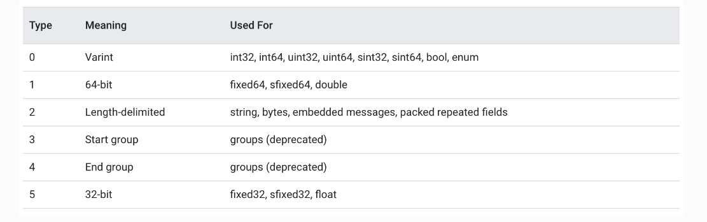

# Google Protobuf 


## 编码原理

`Protobuf` 是由 Google 设计的一种高效、轻量级的信息描述格式, 起初是在 Google 内部使用, 后来被开放出来, 它具有语言中立、平台中立、高效、可扩展等特性, 它非常适合用来做数据存储、RPC数据交换等。与 json、xml 相比, Protobuf 的编码长度更短、传输效率更高, 其实严格意义上讲, json、xml 并非是一种「编码」, 而只能称之为「格式」, json、xml 的内容本身都是字符形式, 它们的编码采用的是 ASCII 编码, 本文讲述 Protobuf 的底层编码原理, 以便于了解 Protobuf 为什么编码长度短并且扩展性强, 与此同时我们也将了解到它有哪些不足

`Protobuf `的一个典型应用场景便是做**通信的数据交换格式**, 它在通信管道上是以纯二进制的形式进行传输, 发送端使用编码器将数据序列化为二进制, 接收端使用解码器将收到的二进制流进行反序列化从而取得原始信息, 因此当对通信管道进行抓包时无法获知数据的详细内容, 事实上, 同一段 Protobuf 的二进制数据流, 在接收端使用不同的解码格式进行解码, 可能得到完全不同的信息。在了解 Protobuf 的底层编码细节之前, 需要首先了解 Protobuf 所用到的两种主要的编码方式, 它们分别是 **Varints** 编码和 **Zigzag** 编码


###  Varints 编码

通常来说, 普通的 int 数据类型, 无论其值的大小, 所占用的存储空间都是相等的, 这点可以引起人们的思考, 是否可以根据数值的大小来动态地占用存储空间, 使得值比较小的数字占用较少的字节数, 值相对比较大的数字占用较多的字节数, 这便是变长整型编码的基本思想, 采用变长整型编码的数字, 其占用的字节数不是完全一致的, 为了达到这一点, Varints 编码使用每个字节的最高有效位作为标志位, 而剩余的 7 位以二进制补码的形式来存储数字值本身, 当最高有效位为 1 时, 代表其后还跟有字节, 当最高有效位为 0 时, 代表已经是该数字的最后的一个字节, 在 Protobuf 中, 使用的是 Base128 Varints 编码, 之所以叫这个名字原因即是在这种方式中, 使用 7 bit 来存储数字, 在 Protobuf 中, Base128 Varints 采用的是小端序, 即数字的低位存放在高地址, 举例来看, 对于数字 1, 我们假设 int 类型占 4 个字节, 以标准的整型存储, 其二进制表示应为

```
00000000 00000000 00000000 00000001
```

可见, 只有最后一个字节存储了有效数值, 前 3 个字节都是 0, 若采用 Varints 编码, 其二进制形式为

```
00000001
```

因为其没有后续字节, 因此其最高有效位为 0,再比如数字 666, 其以标准的整型存储, 其二进制表示为

```
00000000 00000000 00000010 10011010
```

而采用 Varints 编码, 其二进制形式为

```
10011010 00000101 
```

我们可以尝试来复原一下上面这个 Base128 Varints 编码的二进制串, 首先看最高有效位, 高 8 位的最高有效位为 1, 代表其后还跟有有效字节, 低 8 位的最高有效位为 0, 代表其已是最后一个字节, 由于 Protobuf 采用小端字节序存储数据, 因此我们移除两个字节的最高有效位, 并交换字节序便得到 

```
1010011010
```

转换为十进制, 即是数字 666

从上面的编码解码过程可以看出, 可变长整型编码对于不同大小的数字, 其所占用的存储空间是不同的, 编码思想与 CPU 的间接寻址原理相似, 都是用一比特来标识是否走到末尾, 但采用这种方式存储数字, 也有一个相对不好的点便是, 无法对一个序列的数值进行随机查找, 因为每个数字所占用的存储空间不是等长的, 因此若要获得序列中的第 N 个数字, 无法像等长存储那样在查找之前直接计算出 Offset, 只能从头开始顺序查找


### Zigzag 编码

完全没看懂


### Protobuf 的数据组织

在上面的讨论中, 我们了解了 Protobuf 所使用的 Varints 编码和 Zigzag 编码的编码原理, 本节我们来讨论 Protobuf 的数据组织方式, 首先来看一个例子, 假设客户端和服务端使用 protobuf 作为数据交换格式, proto 的具体定义为

```
syntax = "proto3";
package pbTest;

message Request {
    int32 age = 1;
}
```

Request 中包含了一个名称为 name 的字段, 客户端和服务端双方都用同一份相同的 proto 文件是没有任何问题的, 假设客户端自己将 proto 文件做了修改, 修改后的 proto 文件如下

```
syntax = "proto3";
package pbTest;

message Request {
    int32 age_test = 1;
}
```


在这种情形下, 服务端不修改应用程序仍能够正确地解码, 原因在于序列化后的 Protobuf 没有使用字段名称, 而仅仅采用了字段编号, 与 json xml 等相比, Protobuf 不是一种完全自描述的协议格式, 即接收端在没有 proto 文件定义的前提下是无法解码一个 protobuf 消息体的, 与此相对的, json xml 等协议格式是完全自描述的, 拿到了 json 消息体, 便可以知道这段消息体中有哪些字段, 每个字段的值分别是什么, 其实对于客户端和服务端通信双方来说, 约定好了消息格式之后完全没有必要在每一条消息中都携带字段名称, Protobuf 在通信数据中移除字段名称, 这可以大大降低消息的长度, 提高通信效率, Protobuf 进一步将通信线路上消息类型做了划分, 如下表所示



.......

......


### 总结

总结一下以上所论述的内容。

1. Protobuf 是一种高效的数据描述格式, 具有平台无关、语言无关、可扩展等特点, 适合做数据存储、RPC 的通信协议等场景
2. Protobuf 采用 Varints 编码和 Zigzag 编码来编码数据, 其中 Varints 编码的思想是移除数字高位的 0, 用变长的二进制位来描述一个数字, 对于小数字, 其编码长度短, 可提高数据传输效率, 但由于它在每个字节的最高位额外采用了一个标志位来标记其后是否还跟有有效字节, 因此对于大的正数, 它会比使用普通的定长格式占用更多的空间, 另外对于负数, 直接采用 Varints 编码将恒定占用 10 个字节, Zigzag 编码可将负数映射为无符号的正数, 然后采用 Varints 编码进行数据压缩, 在各种语言的 Protobuf 实现中, 对于 int32 类型的数据, Protobuf 都会转为 uint64 而后使用 Varints 编码来处理, 因此当字段可能为负数时, 我们应使用 sint32 或 sint64, 这样 Protobuf 会按照 Zigzag 编码将数据变换后再采用 Varints 编码进行压缩, 从而缩短数据的二进制位数
3. Protobuf 不是完全自描述的信息描述格式, 接收端需要有相应的解码器(即 proto 定义)才可解析数据格式, 序列化后的 Protobuf 数据不携带字段名, 只使用字段编号来标识一个字段, 因此更改 proto 的字段名不会影响数据解析(但这显然不是一种好的行为), 字段编号会被编码进二进制的消息结构中, 因此我们应尽可能地使用小字段编号
4. Protobuf 是一种紧密的消息结构, 编码后字段之间没有间隔, 每个字段头由两部分组成: 字段编号和 wire type, 字段头可确定数据段的长度, 因此其字段之前无需加入间隔, 也无需引入特定的数据来标记字段末尾, 因此 Protobuf 的编码长度短, 传输效率高


待看：https://sunyunqiang.com/blog/protobuf_encode/